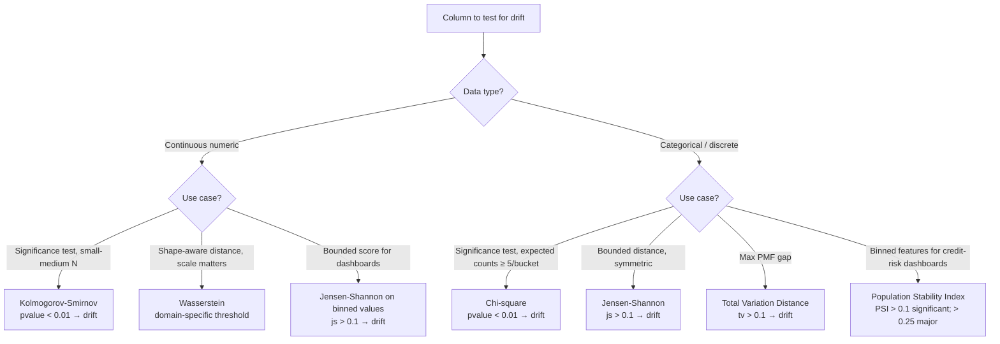
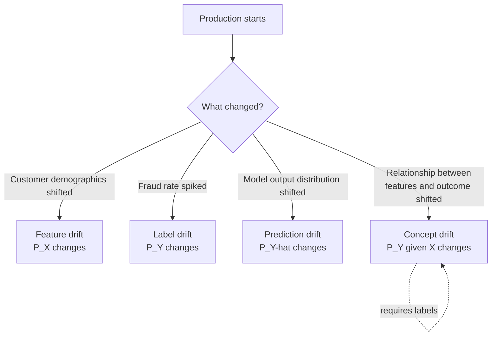
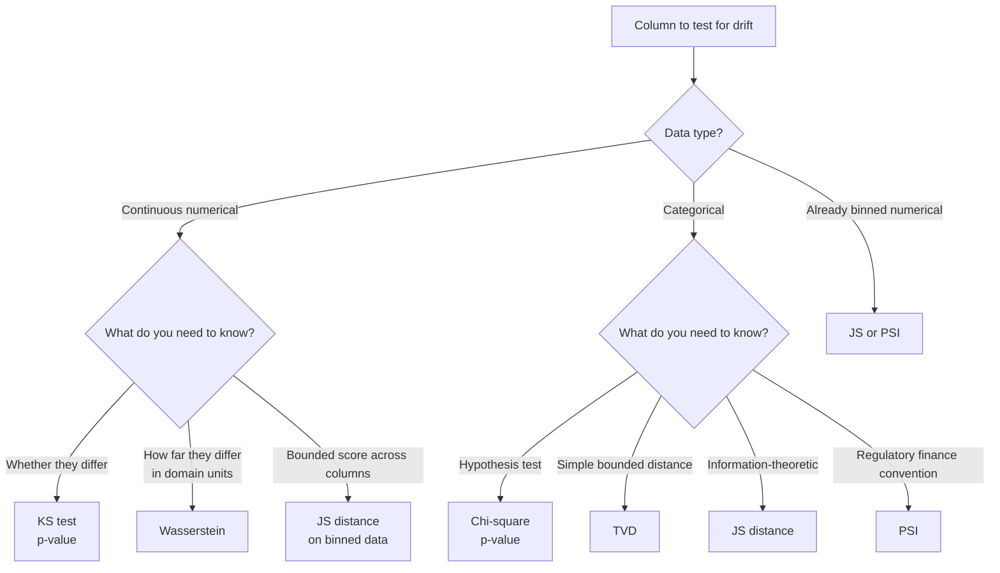

# Module 11 — Drift Detection (Deep)

> **Goal of this module:** the statistical machinery behind drift detection — what each test actually does, when each is right, how to set thresholds, and how to design end-to-end drift-triggered retraining workflows. This complements Module 10 (the platform's API surface) with the **statistics**.
>
> **Assumes:** Module 10. Some familiarity with hypothesis testing.

---

## Coverage map (verbatim Sept 30 2025 exam objectives → where taught)

| Verbatim objective | Section anchor |
|---|---|
| Apply any statistical tests from the drift metrics table in Lakehouse Monitoring to detect drift in numerical and categorical data | "Drift test selection decision tree" + per-test sections |
| Detect data drift by comparing current data distributions to a known baseline or between successive time windows | "Baseline vs consecutive comparisons" |
| Implement automated retraining workflows triggered by data drift detection or performance degradation alerts | "Drift-triggered retraining pattern" |

> Cross-references: Module 10 (the platform API that ships these tests); Module 09 (the CI/CD wiring around retraining); Module 13 (inference table = the data the drift tests run on).

---

## Drift test selection decision tree — burn into memory



| Test | Data type | What it measures | Lakehouse Monitoring column | Decision rule |
|---|---|---|---|---|
| **Kolmogorov-Smirnov** | Numerical / continuous | Max abs diff between empirical CDFs | `ks_test.statistic`, `ks_test.pvalue` | `pvalue < 0.01` (or `< 0.001` for very large N) |
| **Chi-square** | Categorical | Frequency-table divergence (requires expected counts ≥ 5/bucket) | `chi_squared_test.statistic`, `chi_squared_test.pvalue` | `pvalue < 0.01` |
| **Jensen-Shannon** | Categorical (or binned numerical) | Symmetric KL; bounded [0, log 2] | `js_distance` | `> 0.1` (typical), `> 0.2` (large) |
| **Wasserstein (Earth-Mover's)** | Numerical | Distance between distributions, scale-aware | `wasserstein_distance` | Domain-specific threshold |
| **Total Variation Distance** | Categorical | Max-abs PMF difference | `tv_distance` | `> 0.1` typical |
| **Population Stability Index (PSI)** | Binned numerical or categorical | Sum of `(P_i − Q_i) ln(P_i/Q_i)` | `population_stability_index` | `> 0.1` significant; `> 0.25` major |

> 🎯 **How to recognize on the exam:** the prompt gives a **column name + data type**. Map mechanically:
> - Numeric continuous (`amount`, `latency`, `temperature`) → KS (significance) or Wasserstein (scale-aware) or PSI (binned).
> - Categorical (`country`, `merchant_category`, `device_type`) → Chi-square (significance with ≥ 5 counts/bucket) or JS / TVD (distance).
> - The most-tested distractor: KS on categorical, Chi-square on continuous. Both **always wrong**.

> 🎯 **N-sensitivity rule:** at very large N (millions of predictions per window), p-values approach 0 even for trivial differences. Pair the p-value alert with a **distance-based** metric (JS or Wasserstein) to filter out statistically-significant-but-practically-irrelevant drift.

---

## The four types of drift — precise definitions

| Type | Formal definition | Plain English | Detectable from |
|---|---|---|---|
| **Feature drift / covariate shift** | P(X) changes; P(Y\|X) constant | Input distributions shift, but the model's learned relationship still holds | Input features alone |
| **Label drift / prior shift** | P(Y) changes; P(X\|Y) constant | Outcome rates change but features-given-label is stable | Labels (delayed; may need joining) |
| **Prediction drift** | P(Ŷ) changes | Model's outputs distribute differently | Predictions in inference table (immediate) |
| **Concept drift** | P(Y\|X) changes | Relationship between features and outcome has shifted | Joint features + labels |



The exam grills you on the distinction. Read these definitions until each one is intuitive.

---

## Why each drift type matters operationally

- **Feature drift** is the most commonly detected because input data is observable in real time. But it's the **least actionable** alone — feature shift without label shift may just mean the customer base evolved; the model can still be correct.
- **Prediction drift** is **the early warning** in production. Predictions are immediate; labels are delayed. A sudden change in P(Ŷ) flags "something is different about the data the model is being asked about" without waiting weeks for label arrival.
- **Label drift** matters because the prior probability of outcomes affects calibration. If fraud rate doubles, a model trained on a 1% baseline is mis-calibrated.
- **Concept drift** is the most damaging — the underlying relationship the model learned no longer holds. **Hardest to detect** because it requires labels.

---

## Kolmogorov-Smirnov test

**Use case:** detect drift in a numerical / continuous column.

**What it measures:** the maximum absolute difference between two empirical cumulative distribution functions.

$$D_{n,m} = \sup_x |F_{1,n}(x) - F_{2,m}(x)|$$

```python
from scipy.stats import ks_2samp

statistic, pvalue = ks_2samp(baseline_sample, current_sample)
# pvalue < 0.01 → reject null hypothesis that samples come from the same distribution
```

**Threshold guidance:** in Lakehouse Monitoring, `ks_test.pvalue < 0.01` is a reasonable alert threshold. For very high QPS (millions of predictions per window), use stricter thresholds (`< 0.001`) because p-values become extremely small under huge sample sizes even for tiny meaningful differences.

⚠️ **Exam trap:** KS on categorical data. The CDF of `country_code` is meaningless without ordinal structure. Always wrong.

⚠️ **The "n is too large" issue:** with millions of samples, KS p-values approach 0 even for distributions that differ only trivially. **Effect size matters more than significance.** Pair p-value alerts with JS distance or Wasserstein distance thresholds.

---

## Chi-square test

**Use case:** detect drift in a categorical column.

**What it measures:** divergence between observed frequency counts and expected (baseline) counts.

$$\chi^2 = \sum_i \frac{(O_i - E_i)^2}{E_i}$$

```python
from scipy.stats import chi2_contingency

# Build a contingency table: rows = baseline counts, current counts; columns = categories
baseline_counts = baseline_df["country_code"].value_counts()
current_counts = current_df["country_code"].value_counts()
contingency = pd.concat([baseline_counts, current_counts], axis=1).fillna(0).T

chi2, pvalue, dof, expected = chi2_contingency(contingency)
```

**Threshold guidance:** `pvalue < 0.01` typical. Larger DOF (many categories) means more sensitivity.

⚠️ **Exam trap:** Chi-sq on continuous data without binning. Wrong — Chi-sq requires discrete bins. If you bin first, you've made it categorical (and the test is now on the bins, not the underlying continuous distribution).

⚠️ **Sparse categories:** chi-sq is unreliable when expected counts in cells fall below 5. The platform handles small expected counts, but be aware that a category that appears rarely in baseline but commonly in current data flags as drift — usually correctly.

---

## Jensen-Shannon divergence

**Use case:** detect drift in **either** categorical or binned numerical data.

**What it measures:** symmetrized KL divergence between two probability distributions, bounded in [0, log 2].

$$JS(P||Q) = \frac{1}{2} KL(P||M) + \frac{1}{2} KL(Q||M), \text{ where } M = \frac{P+Q}{2}$$

```python
from scipy.spatial.distance import jensenshannon

# Both must be probability distributions (sum to 1)
js_distance = jensenshannon(baseline_pmf, current_pmf, base=2)
# Values: 0 = identical; ~0.83 = log2(2)^0.5 maximum
```

**Threshold guidance:** `js_distance > 0.1` is a common alert; `> 0.2` is significant; `> 0.3` is severe. Adjust per use case.

**Why JS shines:**

- **Bounded** (0 to ~0.83) — interpretable across columns and use cases.
- **Symmetric** — direction doesn't matter.
- **Smooth** — small distribution changes produce small JS values; no abrupt threshold artifacts.
- **Works on both categorical and binned numerical** — one test that generalizes.

The Lakehouse Monitoring default test for categorical drift surfacing in dashboards is often JS (or PSI for binned numerical).

⚠️ **Exam trap:** treating JS p-value as the alert. JS is a **distance**, not a hypothesis test — there's no p-value. Use a threshold directly.

---

## Wasserstein (Earth Mover's) distance

**Use case:** detect drift in numerical data where you care about **how far** the distribution moved (not just whether it differs).

**What it measures:** the minimum cost to transform one distribution into another, where cost is a function of mass moved and distance moved.

For 1D distributions:

$$W_1(P, Q) = \int_{-\infty}^{\infty} |F_P(x) - F_Q(x)| dx$$

```python
from scipy.stats import wasserstein_distance

w = wasserstein_distance(baseline_sample, current_sample)
```

**Threshold guidance:** Wasserstein has the **same units as the data**. For an `amount` column in dollars, a Wasserstein of $50 means the average customer spends $50 more (or less) than baseline. Domain-specific thresholds.

**When to prefer Wasserstein over KS:**

- KS detects *whether* distributions differ. Wasserstein quantifies *how much* in meaningful units.
- KS is sensitive to differences near the median; Wasserstein integrates differences across the whole range.
- For monitoring real-valued business metrics (revenue, latency), Wasserstein is more interpretable.

⚠️ **Exam trap:** Wasserstein on categorical data. No meaningful distance between unordered categories. Always wrong.

---

## Total Variation Distance

**Use case:** detect drift in categorical data with a simple, bounded distance metric.

$$TV(P, Q) = \frac{1}{2} \sum_i |P_i - Q_i|$$

```python
import numpy as np

def total_variation_distance(p, q):
    return 0.5 * np.sum(np.abs(np.array(p) - np.array(q)))
```

**Range:** [0, 1]. 0 = identical; 1 = totally disjoint.

**Threshold guidance:** `tv_distance > 0.1` is a common alert; `> 0.2` significant.

When to use TVD over JS: TVD is a simple linear metric; JS is information-theoretic. JS is more sensitive to relative differences in small probabilities; TVD treats all mass shifts uniformly. Both are valid for categorical drift; the exam treats them as equivalent answers in most scenarios.

---

## Population Stability Index (PSI)

**Use case:** binned numerical or categorical features — the **finance industry classic** drift metric.

$$PSI = \sum_i (P_i - Q_i) \ln\left(\frac{P_i}{Q_i}\right)$$

Where P and Q are the proportions in each bin for current and baseline.

```python
def psi(baseline_counts, current_counts, eps=1e-6):
    p = baseline_counts / baseline_counts.sum() + eps
    q = current_counts / current_counts.sum() + eps
    return float(((p - q) * np.log(p / q)).sum())
```

**Threshold guidance (finance industry convention):**

- `PSI < 0.1` — no significant change.
- `0.1 ≤ PSI < 0.25` — moderate change; investigate.
- `PSI ≥ 0.25` — major change; likely action required.

Why finance uses PSI: it predates ML monitoring, comes from credit risk models, and these thresholds are baked into regulatory documentation at banks.

⚠️ **Exam trap:** PSI on continuous data without binning. Bin first (typically 10 equal-frequency bins on the baseline), then compute.

---

## Choosing a test — decision tree



The exam typically wants the simplest correct mapping:

- Continuous → KS or Wasserstein.
- Categorical → Chi-sq or JS or TVD.

Pick KS / Chi-sq when the question mentions hypothesis testing or p-values. Pick JS / TVD / Wasserstein when the question mentions thresholds, bounded scores, or shape-aware comparison.

---

## Threshold setting — the under-discussed problem

**Common mistakes:**

- Setting one alert threshold across all columns. Some columns are noisy (always slight drift); others are stable. Calibrate per column.
- Relying on p-values alone with very large samples. With N=1M, anything is "statistically significant." Pair with effect-size thresholds.
- Triggering retraining on a single window's drift. False positives cause retraining storms.

**Better patterns:**

- **Sustained drift:** require K consecutive windows with drift before alerting. Add a `SELECT count(*) ... HAVING count(*) >= K` clause in the alert SQL.
- **Multi-test concurrence:** require both p-value AND effect-size thresholds breached.
- **Slice-aware:** alert when drift in a slice exceeds threshold AND that slice represents > X% of traffic.
- **Per-column thresholds:** maintain a config table mapping column → threshold, joined in the alert query.

```sql
WITH drift_history AS (
  SELECT
    column_name,
    window.start AS window_start,
    ks_test.pvalue AS ks_p,
    js_distance,
    LAG(ks_test.pvalue) OVER (PARTITION BY column_name ORDER BY window.start) AS prev_ks_p,
    LAG(ks_test.pvalue, 2) OVER (PARTITION BY column_name ORDER BY window.start) AS prev2_ks_p
  FROM prod.ml_monitoring.fraud_endpoint_payload_drift_metrics
  WHERE drift_type = 'CONSECUTIVE'
    AND window.start > current_timestamp() - INTERVAL 24 HOURS
)
SELECT COUNT(*) AS sustained_drifts
FROM drift_history
WHERE ks_p < 0.001
  AND prev_ks_p < 0.001
  AND prev2_ks_p < 0.001  -- three consecutive windows in breach
  AND js_distance > 0.15;
```

---

## Designing a retraining trigger

```mermaid
graph LR
    A[Drift detected for K consecutive windows] --> B[Alert fires]
    B --> C[Webhook hits a Databricks Job endpoint]
    C --> D[Job: validate alert is legit<br/>not a transient data outage]
    D -->|valid drift| E[Job: trigger retraining]
    D -->|data outage| F[Log + page humans]
    E --> G[New model version]
    G --> H[Validation tests in CI Job]
    H -->|pass| I[Set @challenger]
    I --> J[Endpoint: route X% canary]
    J --> K[Manual review window]
    K -->|approved| L[Set @champion]
    L --> M[Archive old @champion]
```



The **gate before retraining** (step D) catches a common failure mode: a data pipeline outage makes the inference table look like a distribution change. Without the gate, you retrain on broken data.

⚠️ **Exam trap:** auto-promotion of the retrained model to `@champion`. Manual review window is non-negotiable in regulated contexts (Modules 09, 12).

---

## Performance metrics vs drift metrics — the contrast

Drift answers: "Did the data change?"

Performance metrics answer: "Did the model's predictions remain accurate?"

| Drift detected | Performance dropped | Likely cause | Action |
|---|---|---|---|
| Yes | Yes | Concept drift or feature shift the model can't handle | Retrain |
| Yes | No | Benign feature shift; the relationship still holds | Investigate but don't retrain yet |
| No | Yes | Concept drift undetected by feature tests; or label-only shift; or unrelated production issue | Investigate root cause; check label quality |
| No | No | All good | Continue monitoring |

The exam can ask: "drift detected but accuracy unchanged — what's the right action?" Answer: monitor + investigate; **don't retrain on noise.**

---

## Custom drift metrics — your domain knowledge

Lakehouse Monitoring's custom metrics let you encode domain-specific signals. Examples:

- **Approval rate drift** for credit underwriting (Module 10's example).
- **Average claim severity** for insurance.
- **Geographic mix index** — Herfindahl-Hirschman of region distribution.
- **Per-tier acceptance rate** for tiered customer products.

```python
MonitorMetric(
    type=MonitorMetricType.CUSTOM_METRIC_TYPE_DRIFT,
    name="hhi_drift",
    input_columns=["country"],
    definition="""
      abs(
        sum(power(count(*) over (partition by window) / 
                  sum(count(*)) over (partition by window), 2))
        - hhi_baseline
      )
    """,
    output_data_type="DOUBLE",
)
```

⚠️ **Exam trap:** assuming Lakehouse Monitoring's built-in tests cover all monitoring needs. Custom metrics fill the gap — required for non-trivial business signals.

---

## Output-prediction drills — test selection patterns

For each scenario, pick the right test(s).

**Drill 1:** Column `transaction_amount` (continuous), baseline N=100K, current N=50K, business cares about scale.
A: **KS** for significance + **Wasserstein** for scale-aware effect size. JS on binned amounts is acceptable too if you want a bounded dashboard score.

**Drill 2:** Column `country_code` (~50 categories), with several having < 5 baseline counts.
A: **Chi-square is invalid** (expected counts < 5 violate the assumption). Use **JS distance** or **TVD** instead. If you must use Chi-square, merge the low-frequency buckets first.

**Drill 3:** Column `credit_score_band` (10 bins, derived from a continuous variable).
A: **PSI** is the standard for binned credit-risk features. JS works too. Chi-square works if counts/bucket ≥ 5.

**Drill 4:** Column `merchant_category` (200 categories, but only 30 frequent), and you want a dashboard with a single bounded number.
A: **JS distance** — bounded in [0, log 2], works for high-cardinality categorical. Chi-square would produce a huge stat that's hard to threshold consistently.

**Drill 5:** Inference-table column `prediction_proba` (continuous [0,1]) at 5M predictions/hour. KS p-value = 1e-30.
A: With N=5M, KS p-values are not actionable on their own. **Pair with JS/Wasserstein effect size**: if JS < 0.05, the difference is statistically significant but operationally trivial — don't fire.

**Drill 6:** Feature drift detected on `transaction_amount` (KS p < 0.001), but model `accuracy` and `F1` are unchanged.
A: **Don't retrain.** This is feature shift without concept shift — the learned relationship still holds for the new distribution. Investigate root cause; retraining on noise creates retraining storms.

**Drill 7:** Prediction drift detected (P(Ŷ) shifted from 5% positive to 15% positive). No labels yet.
A: **Early-warning signal** — start retraining-candidate pipeline (new challenger) but do **not** auto-promote without label-based validation. Could also indicate fraud-attack pattern; alert security.

**Drill 8:** You can only observe features and predictions (labels delayed 30 days). Can you detect concept drift now?
A: **No.** Concept drift requires labels. You can detect feature drift and prediction drift as **proxies**, but neither is sufficient. Wait for labels or use a feedback loop with delayed-label monitoring.

---

## Decision rules

> 🎯 **Continuous numeric + significance → KS.** Continuous + scale matters → Wasserstein. Continuous + binned for dashboard → JS.

> 🎯 **Categorical + significance + healthy counts (≥ 5 per bucket) → Chi-square.** Categorical + distance / bounded score → JS or TVD. Categorical + low-frequency buckets → JS (or merge buckets before Chi-square).

> 🎯 **Credit risk / binned features → PSI.** Industry standard; thresholds well-understood (0.1 moderate, 0.25 major).

> 🎯 **Very large N → always pair p-value alerts with distance metrics.** P-values lie under huge N.

> 🎯 **"Detect concept drift from features only" → impossible.** Always wrong on the exam.

> 🎯 **Feature drift without performance drop → investigate, don't retrain.** Concept drift = retrain. Label drift = recalibrate or retrain.

> 🎯 **Prediction drift without labels → early-warning; start challenger training, gate promotion on label-based validation.**

---

## End-to-end mini-scenario — multi-test alert SQL with effect-size gating

A fraud endpoint logs 5M predictions/hour. Configure an alert that fires only on meaningful drift.

```sql
WITH per_hour AS (
  SELECT
    window.start AS hour,
    column_name,
    ks_test.pvalue AS ks_p,
    chi_squared_test.pvalue AS chi_p,
    js_distance AS js,
    wasserstein_distance AS w
  FROM prod.ml_monitoring.fraud_endpoint_payload_drift_metrics
  WHERE drift_type = 'CONSECUTIVE'
    AND window.start > current_timestamp() - INTERVAL 6 HOURS
),
flagged AS (
  SELECT hour, column_name,
    CASE
      WHEN column_name IN ('amount','txn_count_30d','latency_ms')
           AND ks_p < 0.001 AND (js > 0.1 OR w > some_domain_threshold) THEN 'NUMERIC_DRIFT'
      WHEN column_name IN ('country','merchant_category','device_type')
           AND chi_p < 0.001 AND js > 0.1 THEN 'CATEGORICAL_DRIFT'
      ELSE NULL
    END AS drift_label
  FROM per_hour
)
SELECT COUNT(*) AS sustained_drift_rows
FROM flagged
WHERE drift_label IS NOT NULL
GROUP BY column_name
HAVING COUNT(DISTINCT hour) >= 3;  -- only fire on 3+ consecutive hours
```

Wired to a DBSQL Alert: `sustained_drift_rows > 0` → webhook → retraining job → new `@challenger` → manual gate → `@champion`.

Why each clause matters:
- p-value AND distance: kills the "p<1e-30 but JS=0.001 trivial-noise" false positives.
- Test mapping by column name: KS only on numerics, Chi-square only on categoricals.
- `HAVING COUNT(DISTINCT hour) >= 3`: only fire on sustained drift, not flash spikes.

---

## Mini quiz

1. KS on `country_code` — right or wrong, and why?
2. You see Chi-sq p-value of 0.0001 with N=10M samples. How much should you trust it?
3. JS distance on `amount` (numerical continuous) — does it make sense, and how?
4. Wasserstein on `customer_segment` (5 categories) — right or wrong, why?
5. PSI thresholds — what's "moderate" vs "major"?
6. Feature drift detected, accuracy unchanged. Action?
7. Prediction drift only — what does this tell you, and what doesn't it tell you?
8. You want to alert only on **sustained** drift (K consecutive windows). How do you write the alert SQL?
9. Why pair p-value thresholds with effect-size thresholds?
10. Why is concept drift uniquely hard to detect?

**Answers:**

1. Wrong. KS uses CDFs; `country_code` has no ordinal structure. Use Chi-sq, JS, or TVD.
2. Statistical significance is almost certain at that N. **Look at effect size** (JS distance, Wasserstein, or PSI) to decide if it's meaningful drift or trivial noise.
3. Yes — bin `amount` first (e.g., 10 quantile bins on baseline), compute JS on the bin probabilities. Useful when you want a bounded score across heterogeneous columns.
4. Wrong. No meaningful distance between unordered categories. Use Chi-sq, JS, or TVD for categorical.
5. PSI 0.1-0.25 = moderate (investigate); PSI ≥ 0.25 = major (action likely needed). PSI < 0.1 = no significant change.
6. Investigate, **don't retrain**. Feature distributions can shift while the learned relationship still holds. Retraining on noise creates retraining storms and wastes cost.
7. **Tells you:** the model is making different predictions than before — something about the input distribution changed in a way that affects model outputs. **Doesn't tell you:** whether those new predictions are correct. Need labels for that (Module 13).
8. Use a window function (e.g., `LAG`) to look at the last K windows and require all of them to breach the threshold. Aggregated with `COUNT(*) >= K`.
9. With very large samples, p-values become tiny for trivially small differences (a 0.01% mean shift can have p < 1e-20). Effect-size thresholds (JS, Wasserstein, PSI) catch the "small p but irrelevant" trap.
10. Concept drift = P(Y|X) shift, which requires joint observation of features and labels. Labels arrive delayed (sometimes weeks for fraud, months for credit). Until labels are available, you can only observe proxies (feature drift, prediction drift) and infer.

---

## Sanity check

- Can you state each drift type's formal definition without looking?
- Could you write the right test for `amount`, `country_code`, `score`, `region`?
- Do you know when p-values lie and what to pair them with?
- Could you design a "sustained drift" alert SQL?
- Can you explain why concept drift is harder than the other three?

Move on to [Module 12 — Model Governance in UC](12_model_governance.md).
