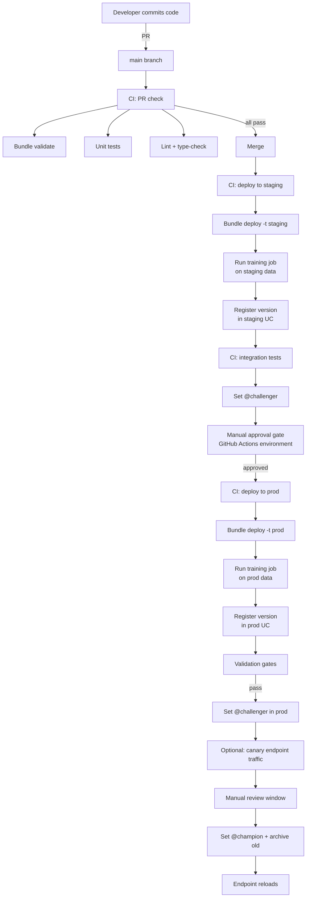

# Module 12 — Model Governance in Unity Catalog

> **Goal of this module:** the governance surface around UC-registered models — permissions, lineage, tags as compliance metadata, approval workflows, and the deploy-code architecture that makes the whole thing audit-defensible.
>
> **Assumes:** Modules 07 (UC model registry), 08 (DABs), 09 (CI/CD).
>
> **Exam weight:** Section 2 has objectives on the deploy-code strategy, model lifecycle architecture, and Databricks features mapped to lifecycle activities — this module covers them.

---

## Coverage map (verbatim Sept 30 2025 exam objectives → where taught)

| Verbatim objective | Section anchor |
|---|---|
| Describe and implement architecture components of model lifecycle pipelines used to manage environment transitions in the **deploy-code strategy** | "What governance means for ML models" + "Deploy-code architecture" |
| Map Databricks features to activities of the model lifecycle management process | "Auditor question → Databricks feature" table |

> Cross-references: Module 07 (UC alias mechanism = the promotion primitive); Module 08 (DABs encode access controls and resource ownership); Module 09 (CI/CD enforces gates).

> 🎯 **Decision rules:**
> - **"Auditor asks who promoted v4 to `@champion`" → `system.access.audit`, `action_name='setRegisteredModelAlias'`.** Not in MLflow APIs.
> - **"What features fed this model?" → UC lineage from registered model → run → dataset references.**
> - **"Endpoint should be able to invoke but not modify the model" → `EXECUTE` (not `MANAGE`) on the registered model.**
> - **"Deploy-code (not deploy-model) in regulated context" → bundle the training code; each env retrains from its own controlled data + registers its own version.**

---

## What governance means for ML models

For regulated industries (healthcare, finance), governance is **not optional**. The auditor will ask:

1. **Provenance** — what code, what data, what dependencies produced this model?
2. **Approvals** — who signed off on promotion to production?
3. **Access** — who can invoke this model? Who can change which version is in production?
4. **Lineage** — what tables fed this model's training? What tables/downstream systems consume its predictions?
5. **Change history** — every alias change, tag change, deployment — who, when, what.

UC + MLflow + DABs answer all five. **The exam expects you to know which feature answers which question.**

| Auditor question | Databricks feature |
|---|---|
| Code provenance | Git commit captured in MLflow tag (`git_commit`) |
| Data provenance | UC lineage + dataset hash logged as MLflow tag/dataset object |
| Dependency provenance | MLflow `requirements.txt` + `conda.yaml` artifacts |
| Approval trail | Model version tags + audit log |
| Inference access | UC `EXECUTE` permission on registered model |
| Alias change control | UC `MANAGE` permission + audit log |
| Lineage | UC lineage graph + system.access tables |
| Change history | system.access.audit log |

---

## UC permissions on models — full matrix

```sql
-- Prerequisites
GRANT USE CATALOG ON CATALOG prod TO `ml_team`;
GRANT USE SCHEMA  ON SCHEMA prod.ml TO `ml_team`;

-- Specific privileges on the model
GRANT EXECUTE        ON MODEL prod.ml.fraud_classifier TO `ml_inference_app`;
GRANT APPLY TAG      ON MODEL prod.ml.fraud_classifier TO `ml_validator_team`;
GRANT MANAGE         ON MODEL prod.ml.fraud_classifier TO `ml_platform_team`;
GRANT ALL PRIVILEGES ON MODEL prod.ml.fraud_classifier TO `ml_admin`;
```

| Privilege | Allows |
|---|---|
| `EXECUTE` | Load model, run inference. Read tags/aliases. The serving endpoint's service principal needs this. |
| `APPLY TAG` | Set tags on model and versions. Useful for validation jobs that want to mark a version as `validated=true`. |
| `MANAGE` | Full control — change aliases, delete versions, modify schema. Reserved for the platform team. |
| `ALL PRIVILEGES` | Sum of the above. |

**Separation of duties pattern:**

- **DS team**: write access to the *dev* catalog only. Can register, alias, tag in dev.
- **CI service principal**: `MANAGE` in *staging* and *prod* (sets `@challenger`).
- **Approver group**: `MANAGE` in *prod* (sets `@champion`, the promotion).
- **Inference endpoint service principal**: `EXECUTE` only, in *prod*.
- **Audit/security team**: `SELECT` on `system.access.audit`.

⚠️ **Exam trap:** giving the DS team `MANAGE` on prod models. They register models in dev; prod alias changes go through CI + approval gate. Direct DS write access to prod undermines deploy-code.

⚠️ **Exam trap 2:** giving the serving endpoint `MANAGE`. Endpoints only invoke models; they don't change aliases. `EXECUTE` is enough.

---

## Lineage — model → tables, predictions → consumers

UC automatically captures lineage edges:

- Training run reads `<table>` → edge between model version and that table.
- Inference job writes `<predictions_table>` ← edge between model version and that consumer.
- Feature lookups via `FeatureEngineeringClient` create edges via the feature tables.

Query in the system tables:

```sql
-- Upstream tables for a model version
SELECT
  source_table_full_name,
  source_type,
  event_time,
  entity_run_id
FROM system.access.table_lineage
WHERE target_type = 'MODEL_VERSION'
  AND target_table_full_name = 'prod.ml.fraud_classifier'
  AND event_time > current_date() - INTERVAL 30 DAYS
ORDER BY event_time DESC;

-- Downstream consumers of a model's predictions
SELECT
  target_table_full_name,
  target_type,
  event_time
FROM system.access.table_lineage
WHERE source_type = 'MODEL_VERSION'
  AND source_table_full_name = 'prod.ml.fraud_classifier'
  AND event_time > current_date() - INTERVAL 30 DAYS;
```

UI: open the model in UC, click the Lineage tab. Visual graph.

⚠️ **Exam trap:** assuming lineage includes data outside UC. Tables in non-UC databases (HMS, external Delta lakes accessed via path) don't appear in UC lineage. Audit-defensibility requires UC-native storage of training data.

⚠️ **Exam trap 2:** confusing **model lineage** (model → tables) with **table lineage** (table → table). Both exist; `target_type = 'MODEL_VERSION'` filters to the former.

---

## Tags as compliance metadata

Standard governance tags I've seen used in production:

### Model-level tags (one per registered model)

```python
client.set_registered_model_tag("prod.ml.fraud_classifier", "team", "fraud_ml")
client.set_registered_model_tag("prod.ml.fraud_classifier", "owner", "ml-platform@example.com")
client.set_registered_model_tag("prod.ml.fraud_classifier", "compliance_scope", "hipaa")
client.set_registered_model_tag("prod.ml.fraud_classifier", "data_classification", "phi_restricted")
client.set_registered_model_tag("prod.ml.fraud_classifier", "business_unit", "payments")
client.set_registered_model_tag("prod.ml.fraud_classifier", "criticality", "tier_1")
```

### Version-level tags (one per model version)

```python
client.set_model_version_tag("prod.ml.fraud_classifier", 4, "training_dataset", "prod.silver.fraud_features@v42")
client.set_model_version_tag("prod.ml.fraud_classifier", 4, "git_commit", "a1b2c3d4")
client.set_model_version_tag("prod.ml.fraud_classifier", 4, "training_run_id", "run_abc123")
client.set_model_version_tag("prod.ml.fraud_classifier", 4, "validation_run_id", "ci_run_xyz789")
client.set_model_version_tag("prod.ml.fraud_classifier", 4, "validated_at", "2026-05-23T15:30:00Z")
client.set_model_version_tag("prod.ml.fraud_classifier", 4, "validated_by", "ml-platform-ci")
client.set_model_version_tag("prod.ml.fraud_classifier", 4, "val_auc", "0.892")
client.set_model_version_tag("prod.ml.fraud_classifier", 4, "approver", "j.smith@example.com")
client.set_model_version_tag("prod.ml.fraud_classifier", 4, "approved_at", "2026-05-23T17:00:00Z")
client.set_model_version_tag("prod.ml.fraud_classifier", 4, "approval_ticket", "JIRA-1234")
```

**Use cases:**

- **Search** — find all models classified `phi_restricted` for an audit: `client.search_registered_models(filter_string="tags.compliance_scope = 'hipaa'")`.
- **Gate** — CI script checks `tags.validation_status = 'passed'` before promoting.
- **Audit** — every promotion leaves a tag trail with approver, time, ticket.

⚠️ **Exam trap:** storing validation metric (a number) as a tag. Tags are strings; you lose numeric query semantics. **Log to MLflow metrics, then mirror critical values to tags only for searchability** (and accept the string conversion).

---

## The deploy-code strategy — architecture



**Six key properties of this architecture:**

1. **Source code is the unit of promotion.** Code is reviewed; the resulting model is a byproduct.
2. **Each environment retrains.** Staging has its own model version (in staging UC); prod has its own (in prod UC). The artifact is not promoted; the code is.
3. **CI is the only path to prod.** Direct dev → prod alias changes are prevented by UC permissions (`MANAGE` only granted to CI service principal in prod).
4. **Manual gate between staging and prod.** GitHub Actions `environment` block with required reviewers.
5. **Approval is captured in tags + audit log.** Tag `approver` + `approval_ticket` on the version.
6. **Endpoint configuration is alias-based.** The endpoint loads `@champion`; alias reassignment is the deployment.

⚠️ **Exam trap:** answers describing "deploy-model" — promote a single artifact across envs. Faster but less auditable. In regulated industries, deploy-code wins.

---

## Mapping Databricks features to lifecycle activities

Section 2 objective: *"Map Databricks features to activities of the model lifecycle management process."*

| Lifecycle activity | Databricks feature |
|---|---|
| Develop and experiment | Databricks Notebooks + Repos + MLflow tracking |
| Manage hyperparameters | Optuna + MLflow nested runs |
| Manage features | FE-in-UC (feature tables, online tables, on-demand features) |
| Train at scale | Spark ML, Pandas Function API, Ray on Databricks |
| Tune at scale | Optuna + MLflowSparkStudy, Ray Tune |
| Track experiments | MLflow Experiments (UC-stored) |
| Register models | UC Model Registry (`mlflow.set_registry_uri("databricks-uc")`) |
| Version + promote | UC model versions + aliases |
| Govern | UC permissions, tags, lineage |
| Test and validate | DABs + Lakeflow Jobs + pytest |
| Deploy | Mosaic AI Model Serving |
| Monitor | Lakehouse Monitoring + Inference Tables |
| Detect drift | Lakehouse Monitoring profile + drift metrics tables |
| Alert | Databricks SQL Alerts |
| Retrain | Triggered Lakeflow Jobs (alert webhook) |
| Audit | system.access.audit + UC lineage |

The exam can frame this as "which Databricks feature do you use for X?" — memorize the mapping.

---

## Audit log — the system table you must know

`system.access.audit` records every action across Databricks workspaces — UC catalog/schema/table/model operations, alias changes, job runs, login events.

```sql
-- Who reassigned @champion on the fraud classifier in the last 30 days?
SELECT
  event_time,
  user_identity.email AS user_email,
  action_name,
  request_params,
  response.status_code
FROM system.access.audit
WHERE service_name = 'unityCatalog'
  AND action_name IN ('setRegisteredModelAlias', 'deleteRegisteredModelAlias')
  AND request_params:full_name_arg = 'prod.ml.fraud_classifier'
  AND event_time > current_date() - INTERVAL 30 DAYS
ORDER BY event_time DESC;
```

Action names you must recognize:

- `createRegisteredModel`, `updateRegisteredModel`, `deleteRegisteredModel`.
- `createModelVersion`, `deleteModelVersion`.
- `setRegisteredModelAlias`, `deleteRegisteredModelAlias`.
- `setModelVersionTag`, `deleteModelVersionTag`.
- `setRegisteredModelTag`, `deleteRegisteredModelTag`.

**HIPAA retention:** HIPAA requires 6 years. Databricks's default audit log retention varies by deployment; configure a downstream Delta table copy with longer retention if your compliance bar is higher than the platform default. (Topic 02 Module 21 covers this in depth.)

⚠️ **Exam trap:** assuming alias change history is in the MLflow registry API. It is **not** — query the audit log.

---

## Approval workflows — the practical mechanism

The exam doesn't require knowing a specific approval tool; it expects you to recognize the pattern. Concrete implementations:

**Option A: GitHub Actions `environment` with required reviewers**

```yaml
deploy-prod:
  needs: deploy-staging
  runs-on: ubuntu-latest
  environment:
    name: production           # configured with required reviewers in GH settings
    url: https://adb-prod.azuredatabricks.net
  steps:
    - ... # only runs after approval
```

**Option B: Tagged-gated alias change**

```python
# Promotion script — refuses to act unless validation tag is present
def promote(client, name, version, approver):
    mv = client.get_model_version(name, version)
    if mv.tags.get("validation_status") != "passed":
        raise PermissionError("Version not validated")
    if mv.tags.get("approver") and mv.tags.get("approver") != approver:
        raise PermissionError(f"Approver mismatch: tag says {mv.tags['approver']}")
    client.set_registered_model_alias(name, "champion", version)
    client.set_model_version_tag(name, version, "promoted_at", iso_now())
    client.set_model_version_tag(name, version, "promoted_by", approver)
```

**Option C: External ticketing system + webhook**

Jira/ServiceNow ticket required; webhook on ticket close triggers the promotion job.

The exam-correct framing: **the manual gate exists, is auditable, and the result is captured in tags + audit log.**

---

## Top-performing model selection during retraining

Section 2 objective: *"Develop a strategy for selecting top-performing models during automated retraining."*

When automated retraining runs, the new version isn't automatically `@champion` — it competes with the current `@champion`.

**Selection criteria:**

1. **Holdout validation metric** (e.g., AUC on a fixed validation set). New version's AUC must beat champion's by ≥ X (e.g., 0.005).
2. **Calibration** (Brier score, expected calibration error). Critical for downstream threshold-based decisions.
3. **Subgroup metrics.** New version must not regress on any monitored slice (e.g., per-region AUC).
4. **Stability metric.** Prediction distribution must not differ wildly from prior champion (small KL divergence on a shared test set).
5. **Operational metrics.** Inference latency must not exceed an SLA.

```python
def compare_to_champion(name, new_version, criteria):
    champion = client.get_model_version_by_alias(name, "champion")
    new_mv = client.get_model_version(name, new_version)

    new_auc = float(new_mv.tags.get("val_auc", 0))
    champ_auc = float(champion.tags.get("val_auc", 0))

    if new_auc < champ_auc + criteria["auc_improvement_required"]:
        return False, "AUC did not improve sufficiently"

    new_brier = float(new_mv.tags.get("val_brier", 1.0))
    champ_brier = float(champion.tags.get("val_brier", 1.0))
    if new_brier > champ_brier * 1.05:
        return False, "Calibration regressed"

    return True, "passes"
```

⚠️ **Exam trap:** selecting on a single metric (e.g., AUC). Multi-criteria selection is the audit-defensible answer.

---

## When deploy-model is acceptable

Deploy-code is the default, but the exam may surface scenarios where deploy-model is acceptable:

- **GenAI / foundation model fine-tuning** where training is expensive ($$$, hours) and reproducibility is captured at the foundation-model + LoRA-adapter level. Promote the adapter artifact rather than re-fine-tuning per env.
- **One-off competition / research models** outside production pipelines.
- **Initial bootstrap** before full CI/CD is in place — pragmatic, not strategic.

Even in these cases, log the artifact provenance heavily (tags for training data version, git SHA, environment hash) so deploy-model maintains audit defensibility.

---

## Mini quiz

1. UC privilege the serving endpoint needs to invoke a model?
2. UC privilege the CI service principal needs to set `@challenger`?
3. Where do you find the history of alias reassignments?
4. Why should validation AUC be stored as both an MLflow metric AND a tag?
5. The auditor asks "what training data did v7 see?" — which UC feature answers?
6. Deploy-code vs deploy-model — which is exam-correct for HIPAA / financial regulated contexts?
7. The retraining job produces a new version with slightly higher AUC but lower regional AUC in the EU slice. Promote or not?
8. The DS team needs to register models. Which UC privilege do they need in *dev*? In *prod*?

**Answers:**

1. `EXECUTE`. (Plus `USE CATALOG` and `USE SCHEMA` on the parents.)
2. `MANAGE` on the registered model. (`APPLY TAG` is not sufficient — that only grants tagging, not alias setting.)
3. `system.access.audit` with `action_name = 'setRegisteredModelAlias'` (or `deleteRegisteredModelAlias`). MLflow registry API does not expose alias-change history.
4. **Metric** for time-series queryability, plot in MLflow UI, search via `metrics.val_auc > 0.85` filter. **Tag** for searchability via `search_model_versions(filter_string="tags.val_auc > ...")` (string compare, but useful) and for being visible at the registry-version level without opening the run.
5. UC lineage (`system.access.table_lineage` with `target_type='MODEL_VERSION'`). Also captured in MLflow tags `training_dataset` if the team logs it explicitly.
6. **Deploy-code.** Each environment retrains from controlled code with env-appropriate data; full reproducibility; the audit story is clean.
7. **Don't promote.** Subgroup metrics matter — even a slight regression in a meaningful slice is a regression. Investigate why EU AUC dropped; potentially retrain with corrective sampling.
8. **Dev**: `MANAGE` is fine (full control in their sandbox). **Prod**: no direct write privileges; only `EXECUTE` if they need to invoke prod models for testing. Prod writes go through CI service principal.

---

## Sanity check

- Could you list the standard governance tags from memory (model-level and version-level)?
- Do you know which UC privilege each role needs?
- Can you describe the deploy-code lifecycle from PR to `@champion` in 10 steps?
- Could you query the audit log for alias-change history?
- Do you know why multi-criteria selection beats AUC-only for automated promotion?

Move on to [Module 13 — Inference Tables](13_inference_tables.md).
