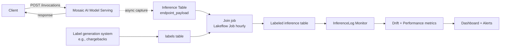

# Module 13 — Inference Tables

> **Goal of this module:** **Inference tables** — the auto-logging mechanism on Mosaic AI Model Serving endpoints. Every request and response is captured to a Delta table. This is the **foundation for everything in Module 10** (Lakehouse Monitoring's InferenceLog profile literally consumes the inference table).
>
> **Assumes:** Module 08 (DABs, `auto_capture_config`), Module 10 (Lakehouse Monitoring).

---

## Coverage map (verbatim Sept 30 2025 exam objectives → where taught)

| Verbatim objective | Section anchor |
|---|---|
| Evaluate model performance trends over time using an inference table | "Joining labels" + "Inference table schema" |
| Identify the key components of common monitoring pipelines: logging (← inference tables ARE the logging pillar) | "What an inference table is" + "Why this exists" |
| Detect data drift / prediction drift on inference data (cross-listed) | Cross-link Module 10 / Module 11 — feeds `MonitorInferenceLog` |

> Cross-references: Module 10 (`MonitorInferenceLog` consumes this table); Module 14 (the `auto_capture_config` block on the endpoint resource that turns this on); Module 16 (endpoint-level metrics vs inference-table content).

> 🎯 **Decision rules:**
> - **"Capture every request for monitoring + audit" → inference table via `auto_capture_config` on the endpoint.**
> - **"Performance trend over time" → inference table + delayed-label join + `MonitorInferenceLog` with `label_col`.**
> - **"Async logging, no inference latency added" → that's already how inference tables work; don't reinvent.**
> - **Inference table is the LOGGING pillar of the four-pillar monitoring pipeline (Module 10). Without it, monitor has no data.**

---

## What an inference table is

When a Mosaic AI Model Serving endpoint has `auto_capture_config` enabled, the platform writes every request + response to a Delta table named per a configured pattern (default: `<catalog>.<schema>.<endpoint>_payload`). This happens asynchronously — no added inference latency.

**Why this exists:**

- **Observability** — see what's actually being asked of the model.
- **Monitoring foundation** — feed Lakehouse Monitoring's InferenceLog profile.
- **Performance ground truth** — join with delayed labels to compute live accuracy.
- **Debugging** — when an alert fires, replay the exact requests that caused it.
- **Audit** — regulated industries need a record of every inference.

The exam tests this as an infrastructure objective and as a prerequisite for monitoring scenarios.

---

## Enabling inference tables

### Via the DAB resource

```yaml
resources:
  model_serving_endpoints:
    fraud_endpoint:
      name: fraud-prod-endpoint
      config:
        served_entities:
          - name: champion
            entity_name: prod.ml.fraud_classifier
            entity_version: "5"
            workload_size: "Medium"
        traffic_config:
          routes:
            - served_model_name: champion
              traffic_percentage: 100
        auto_capture_config:
          catalog_name: prod
          schema_name: ml_inference_logs
          table_name_prefix: fraud_endpoint
          enabled: true
```

The resulting table is `prod.ml_inference_logs.fraud_endpoint_payload`.

### Via the SDK

```python
from databricks.sdk import WorkspaceClient
from databricks.sdk.service.serving import (
    EndpointCoreConfigInput,
    ServedEntityInput,
    AutoCaptureConfigInput,
    TrafficConfig, Route,
)

w = WorkspaceClient()
w.serving_endpoints.update_config(
    name="fraud-prod-endpoint",
    served_entities=[
        ServedEntityInput(
            name="champion",
            entity_name="prod.ml.fraud_classifier",
            entity_version="5",
            workload_size="Medium",
        ),
    ],
    traffic_config=TrafficConfig(routes=[Route(served_model_name="champion", traffic_percentage=100)]),
    auto_capture_config=AutoCaptureConfigInput(
        catalog_name="prod",
        schema_name="ml_inference_logs",
        table_name_prefix="fraud_endpoint",
        enabled=True,
    ),
)
```

### Via the UI

Endpoint settings → "Inference tables" → Enable + pick catalog/schema + name prefix.

⚠️ **Exam trap:** assuming inference tables are enabled by default. They are **opt-in** — you must configure `auto_capture_config`.

---

## Schema of the inference table

The auto-generated table has a fixed schema (you can't customize beyond the model's input/output):

| Column | Type | Meaning |
|---|---|---|
| `client_request_id` | STRING | Caller-provided ID (if any) — useful for client-side correlation |
| `databricks_request_id` | STRING | Platform-assigned ID — primary key for the row |
| `timestamp_ms` | BIGINT | Epoch milliseconds of the request |
| `status_code` | INT | HTTP status — 200, 400, 500, etc. |
| `execution_time_ms` | DOUBLE | Server-side latency |
| `request` | STRING | Raw JSON of the request body |
| `response` | STRING | Raw JSON of the response body |
| `request_metadata` | MAP<STRING,STRING> | Headers etc. |
| `sampling_fraction` | DOUBLE | If sampling enabled, the fraction at which this row was kept |
| `model_id` | STRING | Served entity name + model version |
| `model_name` | STRING | Underlying model |
| `model_version` | STRING | Version |

For a typical PyFunc model, the `request` JSON parses to `{"dataframe_records": [{...}, {...}]}` and the `response` to `{"predictions": [...]}`.

### Parsing the JSON for analysis

```sql
SELECT
  databricks_request_id,
  timestamp_ms,
  model_version,
  execution_time_ms,
  status_code,
  -- Extract the first record from a batched request
  from_json(request, 'struct<dataframe_records:array<struct<amount:double, merchant_category:string>>>')
    .dataframe_records[0].amount AS request_amount,
  from_json(response, 'struct<predictions:array<int>>').predictions[0] AS prediction
FROM prod.ml_inference_logs.fraud_endpoint_payload
WHERE timestamp_ms > unix_millis(current_timestamp() - INTERVAL 1 HOUR);
```

This is the canonical "unpack the inference table for analysis" pattern. **The exam can ask you to write the `from_json` extraction**.

⚠️ **Exam trap:** treating `request` and `response` as already-structured columns. They are JSON-as-string. You must parse with `from_json`.

---

## Joining with ground-truth labels

The inference table has predictions but typically not labels (labels arrive delayed). The standard pattern: a downstream Lakeflow Job joins ground-truth labels by `client_request_id` or a domain key.

```sql
-- Joining schema
CREATE OR REPLACE TABLE prod.ml_inference_logs.fraud_endpoint_payload_labeled AS
WITH unpacked AS (
  SELECT
    databricks_request_id,
    client_request_id,
    timestamp_ms,
    model_version,
    execution_time_ms,
    status_code,
    -- Domain key — the inference call carried customer_id + transaction_id in the request
    from_json(request, 'struct<dataframe_records:array<struct<transaction_id:string, amount:double>>>')
      .dataframe_records[0].transaction_id AS transaction_id,
    from_json(response, 'struct<predictions:array<int>>').predictions[0] AS prediction
  FROM prod.ml_inference_logs.fraud_endpoint_payload
  WHERE status_code = 200
)
SELECT
  u.*,
  l.label,            -- 0 = legitimate, 1 = fraud (confirmed via chargeback or investigation)
  l.label_source_ts   -- when the label became known
FROM unpacked u
LEFT JOIN prod.fraud.confirmed_labels l
  ON u.transaction_id = l.transaction_id;
```

Lakehouse Monitoring's InferenceLog profile picks up this labeled table and computes performance metrics over time. **Without the join, performance metrics are NULL.**

⚠️ **Exam trap:** the inference table itself contains labels. It doesn't — only request, response, and metadata. Labels come from a separate join.

---

## Mermaid: end-to-end inference logging picture



---

## Sampling for high-traffic endpoints

For endpoints handling millions of requests per day, full-fidelity capture is expensive (storage + downstream processing). Configure a sample:

```yaml
auto_capture_config:
  catalog_name: prod
  schema_name: ml_inference_logs
  table_name_prefix: fraud_endpoint
  enabled: true
  # Sampling not directly configurable in the basic schema yet —
  # accomplished via downstream filter (TABLESAMPLE) or a sampling proxy.
```

In practice today, capture is all-or-nothing per endpoint; sampling for downstream analysis is done via `TABLESAMPLE`:

```sql
SELECT *
FROM prod.ml_inference_logs.fraud_endpoint_payload
TABLESAMPLE (10 PERCENT) REPEATABLE (42)
WHERE timestamp_ms > unix_millis(current_timestamp() - INTERVAL 7 DAYS);
```

⚠️ **Exam trap:** assuming inference tables can be configured to sample at capture time. Platform-side capture is currently 100% or off. Sampling happens downstream.

---

## Cost considerations

- **Storage cost** — full JSON of every request/response. For a 100-byte-per-request endpoint at 100 QPS, that's ~865 MB/day, ~26 GB/month, $50/year of Delta storage. Trivial. For an LLM endpoint with 4 KB prompts and 8 KB responses at the same QPS — ~100 GB/month, more substantial.
- **Compute cost** — Lakehouse Monitoring's profile + drift computation reads the table; query cost scales with the volume.
- **Retention** — apply a Delta `VACUUM` and `OPTIMIZE` on a schedule. Set retention via table properties:

```sql
ALTER TABLE prod.ml_inference_logs.fraud_endpoint_payload
SET TBLPROPERTIES (
  'delta.deletedFileRetentionDuration' = 'interval 30 days'
);
```

For HIPAA (6-year retention requirement), copy to a longer-retention archive:

```sql
CREATE TABLE prod.ml_inference_archive.fraud_endpoint_payload_archive AS
SELECT * FROM prod.ml_inference_logs.fraud_endpoint_payload
WHERE timestamp_ms < unix_millis(current_timestamp() - INTERVAL 1 YEAR);
```

(Run on a quarterly schedule; the archive table has a longer retention setting.)

---

## Inference tables and PII

A landmine in regulated industries: the inference table contains the **raw request body**. If your endpoint receives PII (names, SSNs, claim line items) in the request, the inference table is now a PII data store.

Implications:

- **PII discovery scans must include inference tables.**
- **Access control on the schema must reflect PII handling rules.**
- **Field-level masking via dynamic views** — for downstream analysts who shouldn't see raw PII, expose a view that masks sensitive fields.

```sql
CREATE OR REPLACE VIEW prod.ml_inference_logs.fraud_endpoint_payload_masked AS
SELECT
  databricks_request_id,
  timestamp_ms,
  model_version,
  execution_time_ms,
  status_code,
  -- Mask sensitive fields by re-serializing only safe ones
  to_json(named_struct(
    'amount', from_json(request, 'struct<dataframe_records:array<struct<amount:double>>>').dataframe_records[0].amount,
    'merchant_category', from_json(request, 'struct<dataframe_records:array<struct<merchant_category:string>>>').dataframe_records[0].merchant_category
  )) AS request,
  -- Predictions are safe
  response
FROM prod.ml_inference_logs.fraud_endpoint_payload;

GRANT SELECT ON VIEW prod.ml_inference_logs.fraud_endpoint_payload_masked TO `ml_analysts`;
REVOKE SELECT ON TABLE prod.ml_inference_logs.fraud_endpoint_payload FROM `ml_analysts`;
```

⚠️ **Exam trap:** assuming inference tables are PII-safe by default. They contain raw request bodies. Apply UC permissions + dynamic views.

---

## Using inference tables for replay / debugging

When an alert fires and you want to understand what the model was seeing:

```sql
-- Pull the 100 most recent flagged predictions in the EU region
SELECT
  databricks_request_id,
  timestamp_ms,
  request,
  response,
  execution_time_ms
FROM prod.ml_inference_logs.fraud_endpoint_payload_masked
WHERE timestamp_ms > unix_millis(current_timestamp() - INTERVAL 1 HOUR)
  AND from_json(response, 'struct<predictions:array<int>>').predictions[0] = 1
  AND from_json(request, 'struct<dataframe_records:array<struct<region:string>>>').dataframe_records[0].region = 'EU'
ORDER BY timestamp_ms DESC
LIMIT 100;
```

Replay through a notebook for offline analysis. **This is the standard incident-response workflow** when drift fires.

---

## Comparing two model versions via inference table

Section 2 objective: *"Evaluate model performance trends over time using an inference table."*

When you canary-deploy a new version (Module 14), the inference table captures both versions' predictions (the `model_version` column distinguishes them). Compare performance:

```sql
SELECT
  model_version,
  COUNT(*) AS n_predictions,
  AVG(execution_time_ms) AS mean_latency_ms,
  PERCENTILE_CONT(0.95) WITHIN GROUP (ORDER BY execution_time_ms) AS p95_latency_ms,
  PERCENTILE_CONT(0.99) WITHIN GROUP (ORDER BY execution_time_ms) AS p99_latency_ms,
  SUM(CASE WHEN status_code != 200 THEN 1 ELSE 0 END) / COUNT(*) AS error_rate,
  AVG(CASE WHEN from_json(response, 'struct<predictions:array<int>>').predictions[0] = 1 THEN 1.0 ELSE 0.0 END) AS positive_rate
FROM prod.ml_inference_logs.fraud_endpoint_payload
WHERE timestamp_ms > unix_millis(current_timestamp() - INTERVAL 24 HOURS)
GROUP BY model_version
ORDER BY model_version;
```

When labels are joined:

```sql
SELECT
  model_version,
  COUNT(*) AS labeled_predictions,
  AVG(CASE WHEN prediction = label THEN 1.0 ELSE 0.0 END) AS accuracy,
  -- Precision/recall by hand or via aggregations
  SUM(CASE WHEN prediction = 1 AND label = 1 THEN 1 ELSE 0 END) / 
    NULLIF(SUM(CASE WHEN prediction = 1 THEN 1 ELSE 0 END), 0) AS precision_,
  SUM(CASE WHEN prediction = 1 AND label = 1 THEN 1 ELSE 0 END) / 
    NULLIF(SUM(CASE WHEN label = 1 THEN 1 ELSE 0 END), 0) AS recall_
FROM prod.ml_inference_logs.fraud_endpoint_payload_labeled
WHERE timestamp_ms > unix_millis(current_timestamp() - INTERVAL 7 DAYS)
GROUP BY model_version;
```

This is the **canary's win/lose signal**. Comparing the new version's accuracy on real prod traffic against the champion's — when the new one beats the old on real data over a sustained window, promote.

---

## Mini quiz

1. Are inference tables enabled by default?
2. Where does the table land if `auto_capture_config: {catalog_name: 'prod', schema_name: 'ml_logs', table_name_prefix: 'fraud_ep', enabled: true}`?
3. What schema is the `request` column?
4. How do you get ground-truth labels into the inference table?
5. You have a 100 QPS endpoint logging 100% of requests. What's the operational concern?
6. PII in the request body — what's the canonical control?
7. You canary the new version at 10% traffic. How do you tell if it's better than the champion?
8. What does the InferenceLog monitor need from the inference table to compute accuracy?

**Answers:**

1. **No** — opt-in via `auto_capture_config: enabled: true`.
2. `prod.ml_logs.fraud_ep_payload`. (The `_payload` suffix is conventional; verify with the actual deployed table name.)
3. STRING containing JSON. You parse with `from_json(request, '<struct schema>')`.
4. A downstream Lakeflow Job joins by `client_request_id` or a domain key (e.g., `transaction_id`) against a separate labels table. The inference table itself doesn't carry labels.
5. **Storage + downstream processing cost.** For very high QPS, set Delta retention reasonably; archive older partitions to a longer-retention table; consider field-level filtering for downstream queries.
6. **UC permissions + dynamic views** that mask sensitive fields. The raw inference table is restricted; analysts get a masked view.
7. Group by `model_version` in queries against the inference table; compare latency, error rate, positive-rate, and (with joined labels) accuracy/precision/recall. Promote when the canary version wins on a sustained window.
8. A joined `label` column (typically via a downstream job that joins delayed ground-truth labels). The monitor's `label_col` config points to this column; without it, performance metrics are NULL.

---

## Sanity check

- Could you write a DAB resource block enabling inference tables?
- Do you know the inference table schema columns?
- Could you write the `from_json` parse for a typical PyFunc request?
- Do you know the canonical pattern for joining labels?
- Can you explain the PII implications and the dynamic-view mitigation?
- Could you query the table to compare canary vs champion?

That closes Section 2. Move on to **Section 3 — Model Deployment** starting with [Module 14 — Serving: Blue-Green & Canary](14_serving_blue_green_canary.md).
