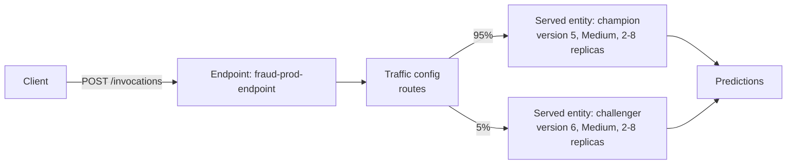
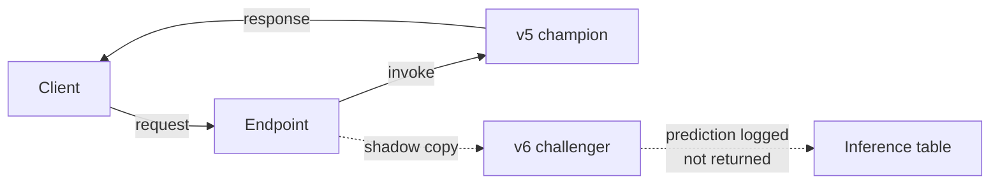
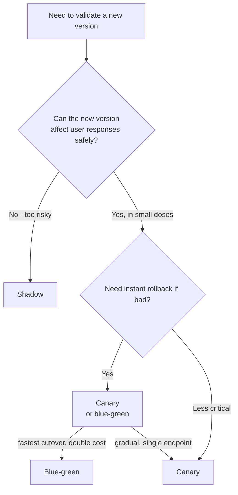
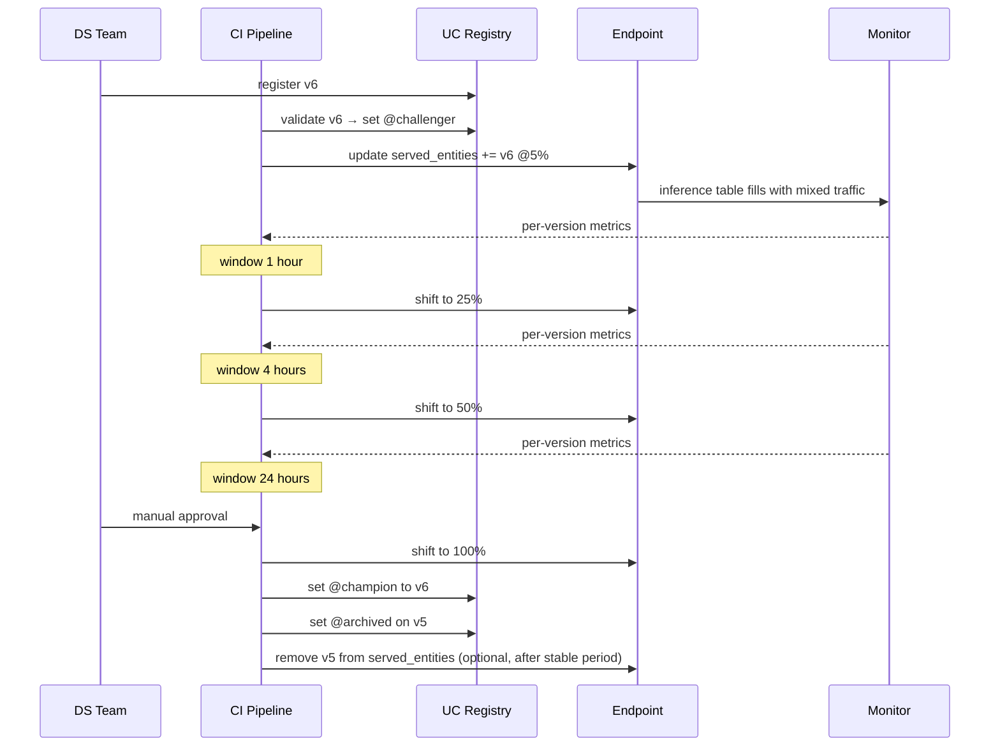

# Module 14 — Serving: Blue-Green & Canary

> **Goal of this module:** Mosaic AI Model Serving endpoint deployment strategies — **blue-green, canary, and shadow** by name. Section 3 is ~12% of the exam but the questions go deep — multi-bullet scenarios where one bundle of choices is correct.
>
> **Assumes:** Modules 02 (PyFunc), 07 (UC aliases), 08 (DABs serving endpoint resource), 13 (inference tables).

---

## Coverage map (verbatim Sept 30 2025 exam objectives → where taught)

| Verbatim objective | Section anchor |
|---|---|
| Compare deployment strategies (e.g., **blue-green and canary**) and evaluate suitability for high-traffic applications | "Comparing the three" + "End-to-end exam-style scenario" |
| Implement a model rollout strategy using **Databricks Model Serving** | "Strategy 1 — Blue-Green" + "Strategy 2 — Canary" |
| Deploy custom model objects using MLflow Deployments SDK, REST API, or user interface | "Endpoint sizing" + "Querying via REST" + cross-link Module 02 |

> Cross-references: Module 02 (PyFunc artifact that gets deployed); Module 07 (UC alias mechanism = the promotion lever behind canary); Module 08 (DABs encoding of `served_entities` + `traffic_config`); Module 13 (inference tables that capture per-version metrics during rollout); Module 16 (latency/error-rate observability used to gate the rollout phases).

---

## The endpoint model

A Mosaic AI Model Serving endpoint:

- Has a single DNS name and URL.
- Hosts **one or more served entities** — each one is a (model version) running on its own replicas.
- Has a **traffic config** — percentages summing to 100 across served entities.
- Has per-served-entity **workload_size** (replica size) and **autoscale** settings.



The exam's mental model: **the endpoint is the stable URL; served entities + traffic config are the deployment lever.**

---

## Strategy 1 — Blue-Green

Two endpoints, or two served entities at 0/100 then 100/0.

### Two-endpoint variant

- `fraud-prod-endpoint-blue` running v5 at 100% traffic.
- `fraud-prod-endpoint-green` deployed with v6, 0 traffic yet.
- Cutover: DNS or load balancer switches all traffic from blue to green.
- Rollback: switch back.

Pros: instant rollback. Cons: double infrastructure cost during cutover; DNS / LB layer required outside Databricks.

### Single-endpoint variant (Databricks-native)

- One endpoint with two served entities.
- v5 at 100%, v6 at 0%.
- Cutover: update traffic_config to v5 at 0%, v6 at 100%.
- Rollback: flip back.

Both versions are warm during cutover — instantaneous traffic flip.

```python
from databricks.sdk import WorkspaceClient
from databricks.sdk.service.serving import (
    ServedEntityInput, TrafficConfig, Route, EndpointCoreConfigInput,
)

w = WorkspaceClient()

# Initial state: both versions warm; v5 takes all traffic
w.serving_endpoints.update_config(
    name="fraud-prod-endpoint",
    served_entities=[
        ServedEntityInput(name="v5", entity_name="prod.ml.fraud", entity_version="5", workload_size="Medium"),
        ServedEntityInput(name="v6", entity_name="prod.ml.fraud", entity_version="6", workload_size="Medium"),
    ],
    traffic_config=TrafficConfig(routes=[
        Route(served_model_name="v5", traffic_percentage=100),
        Route(served_model_name="v6", traffic_percentage=0),
    ]),
)

# Cutover: traffic to v6
w.serving_endpoints.update_config(
    name="fraud-prod-endpoint",
    traffic_config=TrafficConfig(routes=[
        Route(served_model_name="v5", traffic_percentage=0),
        Route(served_model_name="v6", traffic_percentage=100),
    ]),
)
```

⚠️ **Exam trap:** "Blue-green means the new version is at 100% immediately, no traffic split phase." The split phase is at 0/100 → 100/0, but **both endpoints / served entities are warm** so the flip is instant. The point is rollback speed, not gradual rollout.

---

## Strategy 2 — Canary

One endpoint, two served entities, incrementally shift traffic.

```python
# Phase 1 — canary at 5%
update_traffic([("v5", 95), ("v6", 5)])
# observe for an hour: latency, error rate, prediction distribution, accuracy (with labels)

# Phase 2 — 25%
update_traffic([("v5", 75), ("v6", 25)])
# observe

# Phase 3 — 50%
update_traffic([("v5", 50), ("v6", 50)])
# observe

# Phase 4 — 100%
update_traffic([("v5", 0), ("v6", 100)])

# Decommission v5 — remove from served entities or alias it to @archived
```

**Why canary is preferred for high-traffic critical apps:**

- **Bounded blast radius** — at 5%, only 5% of users see any negative impact if v6 has a bug.
- **Per-version metrics** — inference table groups by `model_version`; you can compare v5 vs v6 head-to-head.
- **Single endpoint** — no DNS gymnastics; rollback is a traffic config change.

⚠️ **Exam trap (the sample question Q7 trap):** "Set 100% traffic to v6 immediately and watch metrics." Wrong for high-traffic critical apps. **Incremental canary shift is correct.**

⚠️ **Second trap:** specifying canary phases that skip steps (e.g., 5% → 100%). Phases exist precisely to bound risk; the canonical step pattern is 5% → 25% → 50% → 100% (or similar gradual ramps).

---

## Strategy 3 — Shadow

Send a **copy** of production traffic to the candidate model — predictions are computed but **not returned to the user**. Used to evaluate a new model against real prod traffic with zero user-facing risk.



Implementation pattern on Databricks: the served entity for v6 has traffic_percentage of 0 *but* a separate shadow mechanism duplicates requests to it. Mosaic AI Model Serving supports this via the "shadow" routing concept (or implementable via a Lakeflow streaming job replaying inference table requests against a second endpoint).

**Why shadow shines:**

- **Zero user-facing risk** — v6's predictions are never returned.
- **Realistic load testing** — v6 sees actual prod request patterns.
- **A/B comparison against the *evolving* champion** — when the champion is itself changing (e.g., online learning), shadow lets you measure on the same traffic.

⚠️ **Exam trap (sample question Q4):** "Evaluate a new model against an evolving production model" — the right answer is **shadow deployment**, not canary. Canary assumes both versions are user-facing; shadow assumes only one is.

---

## Comparing the three

| Strategy | Risk to users | Cost | Speed to validate | Rollback |
|---|---|---|---|---|
| **Blue-green** | All-or-nothing flip; rollback fast | Double infra during cutover | Limited — flip is binary | Instant traffic flip |
| **Canary** | Bounded (5%, 25%, ...) | One endpoint, both versions warm | Gradual; need sustained metrics windows | Traffic config flip |
| **Shadow** | None | Double inference cost (both run) | High — see real prod traffic | N/A; never user-facing |

Decision tree:



The exam-correct canonical answers:

- **High-traffic critical app, need gradual rollout** → canary.
- **Need instant cutover with rollback safety** → blue-green.
- **Need risk-free evaluation against real traffic** → shadow.

---

## Endpoint sizing — `workload_size`

| Size | RAM | CPU | When to use |
|---|---|---|---|
| `Small` | 4 GB | small | Lightweight models, low QPS |
| `Medium` | 8 GB | medium | Most production tabular models |
| `Large` | 16 GB | medium-large | Ensembles, large feature embeddings |
| Custom (CPU/GPU) | configurable | configurable | LLMs, deep models |

Per served entity. So you can have:

- v5 on `Small` (current champion, mature, sized for steady load).
- v6 on `Medium` (challenger, new architecture, needs more memory).

Both behind the same endpoint URL.

⚠️ **Exam trap:** assuming both served entities must use the same workload_size. They can differ — the endpoint URL is shared but resources per served entity are independent.

---

## Autoscale and scale-to-zero

```python
ServedEntityInput(
    name="v5",
    entity_name="prod.ml.fraud",
    entity_version="5",
    workload_size="Medium",
    scale_to_zero_enabled=True,    # endpoint can scale to 0 when idle
    min_provisioned_throughput=0,   # for provisioned-throughput mode
    max_provisioned_throughput=100,
)
```

**Scale-to-zero tradeoff:**

- Saves cost during idle periods (the endpoint is essentially free when nobody's calling).
- **Cold start latency** when traffic returns — typically 5-30 seconds.
- Use for non-critical, intermittent endpoints (internal tools, dev experiments).
- **Don't use for user-facing critical paths** — the first request after idle hits cold start.

**Autoscale up:** based on traffic, the platform adds replicas (up to a maximum). The exact replica count is hidden behind workload_size.

⚠️ **Exam trap:** "Enable scale-to-zero on the production fraud endpoint to save cost." Wrong — fraud detection is latency-sensitive. The right answer for cost is **right-size the workload + monitor + downsize if over-provisioned**, not scale-to-zero on critical paths.

---

## Route Optimization

A Mosaic AI Model Serving endpoint toggle that reduces network hops for high-QPS endpoints. Reduces latency and improves throughput.

```python
EndpointCoreConfigInput(
    served_entities=[...],
    traffic_config=...,
    route_optimized=True,  # ← route optimization
)
```

When to enable:

- QPS > 100 / second sustained.
- Latency-critical (target p99 < 200ms).
- High throughput requirements.

Off by default; enable for production endpoints with the above characteristics.

⚠️ **Exam trap (sample question pattern):** a question presents an endpoint configuration for a high-traffic app and one of the "almost correct" answers omits Route Optimization. The exam expects you to recognize that on high-QPS endpoints, Route Optimization is part of the canonical setup.

---

## End-to-end exam-style scenario

> "You have a fraud detection endpoint receiving 500 requests per second from a customer-facing app. A new model version improves accuracy 2 percentage points in offline evaluation. Roll it out safely. The team requires the ability to roll back in seconds if metrics degrade. What's the right deployment configuration?"

Exam-correct answer (multi-bullet):

1. **Canary deployment** — add a second served entity for v6 to the same endpoint.
2. **Initial traffic split** — 95% v5, 5% v6 (or a similarly small canary percentage).
3. **Workload size Medium** on both (v6 needs at least the same memory footprint as v5).
4. **Route Optimization enabled** (high QPS).
5. **Inference table enabled** (already on, configured per Module 13).
6. **Lakehouse Monitoring** comparing v5 vs v6 on inference table grouped by model_version.
7. **Manual gates** at each step (5% → 25%, 25% → 50%, etc.) with sustained metric windows in between.
8. **Rollback procedure** — flip traffic_config back to v5 at 100% on degradation.

Wrong-answer flavors:

- "Blue-green flip from v5 100% to v6 100%." For 500 QPS critical app, the blast radius of an instant 100% cutover is too large.
- "Set v6 to 100% immediately and monitor closely." This is the sample-question-Q7 trap.
- "Two endpoints behind a DNS round-robin." Unnecessarily complex; the single-endpoint canary is cleaner.
- "Enable scale-to-zero to save cost during the rollout." Customer-facing, no.

---

## Mermaid: full canary lifecycle



---

## Look-alike API comparison — `ServedEntityInput` / `TrafficConfig` / endpoint surface

### `ServedEntityInput` parameter table

| Parameter | Purpose |
|---|---|
| `name` | The served entity name used in `traffic_config.routes[].served_model_name` |
| `entity_name` | Three-level UC model name |
| `entity_version` | Specific immutable version (`"5"`) — OR — |
| `entity_alias` | Alias (`"champion"`) — endpoint auto-reloads on alias reassignment |
| `workload_size` | `Small` (4GB), `Medium` (8GB), `Large` (16GB), or `Custom` |
| `workload_type` | `CPU` / `GPU_SMALL` / `GPU_MEDIUM` / `GPU_LARGE` |
| `scale_to_zero_enabled` | Allow replicas to scale to 0 when idle (cold-start penalty on return) |
| `min_provisioned_throughput` | For provisioned-throughput (FMAPI) mode |
| `max_provisioned_throughput` | Upper cap for autoscale tokens/sec |
| `environment_vars` | Per-served-entity env vars |

### Look-alikes

| Pair | Difference | Exam tell |
|---|---|---|
| `served_entities` vs `served_models` (legacy) | Current vs legacy field name | New exam answers use `served_entities` |
| `entity_version="5"` vs `entity_alias="champion"` | Pinned to immutable version vs follows alias | Endpoint should auto-pick-up new prod model → alias. Pinned audit replay / incident lock → version |
| `traffic_config.routes` with multiple entries vs single entry | Multi-served-entity (canary/blue-green) vs single served entity | Canary: 2+ entries summing to 100. Blue-green single-endpoint variant: same shape, just 100/0 |
| Blue-green (single endpoint) vs blue-green (two endpoints) | Same endpoint, 100/0 → 0/100 flip vs separate endpoints behind DNS | Databricks-native = single endpoint. Two-endpoint = legacy / external load balancer |
| Canary 5→25→50→100 vs blue-green 100/0 → 0/100 | Incremental shift over time vs instant flip | Bounded blast radius → canary. Fastest rollback with both warm → blue-green |
| Shadow vs canary | Candidate sees a copy of traffic but doesn't return predictions vs candidate serves a small slice of real traffic | Champion is evolving and you need apples-to-apples → shadow. Want bounded user exposure to candidate → canary |
| `route_optimized=True` vs default (false) | Reduced network hops, lower latency, higher throughput vs default routing | High-QPS (>100/s) critical endpoint → enable. Low-traffic dev endpoint → default is fine |
| `scale_to_zero_enabled=True` vs `False` | Idle scale to 0 (cold start on return) vs minimum 1 replica always warm | Dev / intermittent → True. Customer-facing critical → False |
| `workload_size="Small"` vs `"Medium"` vs `"Large"` | 4GB / 8GB / 16GB RAM | Match to model memory footprint. Ensemble of 3 ~500MB models → Medium-Large |
| `workload_type="CPU"` vs `"GPU_SMALL"` | CPU inference vs GPU inference (LLMs, large DL) | Tabular sklearn/XGB → CPU. LLM via PyFunc → GPU |
| `min_provisioned_throughput=0` vs `>0` (FMAPI) | Standard endpoint vs Foundation Model APIs provisioned-throughput | Provisioned-throughput is for fine-tuned/served foundation models |
| `auto_capture_config.enabled=True` vs `False` | Inference tables on/off | Monitoring + audit → on. Off only for pure-dev endpoints |

### `traffic_config` math

`routes[].traffic_percentage` must sum to exactly 100 across all routes. Percentages are integers. Mosaic AI rounds requests to the nearest percent, so a 99/1 split is allowed but a 99.5/0.5 split is not.

### Endpoint lifecycle commands

| Command (SDK) | Purpose |
|---|---|
| `w.serving_endpoints.create(name, config)` | Create new endpoint |
| `w.serving_endpoints.update_config(name, served_entities=, traffic_config=)` | Change served entities or traffic (no endpoint restart for traffic changes) |
| `w.serving_endpoints.get(name)` | Read state |
| `w.serving_endpoints.delete(name)` | Tear down |
| `w.serving_endpoints.list()` | List all |
| `w.serving_endpoints.get_open_api(name)` | Endpoint's OpenAPI spec for callers |

> 🎯 **How to recognize on the exam:** prompt names "deployment strategy + high-traffic critical" → canary, single endpoint, two served entities, incremental shift, Route Optimization enabled, inference table enabled, manual gates between phases. **NOT** "100% v6 immediately and watch." The trap is always the all-at-once flip.

---

## Output-prediction drills

**Drill 1 — traffic percentages don't sum to 100:**
```python
TrafficConfig(routes=[
    Route(served_model_name="v5", traffic_percentage=90),
    Route(served_model_name="v6", traffic_percentage=5),
])
```
Q: What happens?
A: API error — routes must sum to exactly 100. Fix: 95/5, 90/10, etc.

**Drill 2 — alias-based served entity reassignment:**
```python
ServedEntityInput(name="champion", entity_name="prod.ml.fraud", entity_alias="champion", workload_size="Medium")
# Later, in UC:
client.set_registered_model_alias("prod.ml.fraud", "champion", 6)  # was 5
```
Q: Does the endpoint reload?
A: **Yes** — Mosaic AI Model Serving polls UC for alias changes and reloads the served entity to point at v6. No `update_config` needed. **But:** an in-flight `update_config` would be required if you wanted to change `workload_size` simultaneously.

**Drill 3 — scale-to-zero on customer-facing endpoint:**
500 QPS fraud endpoint with `scale_to_zero_enabled=True`, `workload_size="Medium"`. Traffic dips to 0 at 2am for 30 minutes.
Q: What happens at 2:30am when traffic returns?
A: **Cold start**: the first batch of requests waits 5-30 seconds for replicas to come up. p99 latency spikes catastrophically. Exam-correct config for this endpoint: `scale_to_zero_enabled=False`.

**Drill 4 — Route Optimization at low QPS:**
A dev endpoint at 2 QPS sets `route_optimized=True`.
Q: Effect?
A: Negligible. Route Optimization helps at high QPS by reducing per-request overhead; at 2 QPS the overhead is invisible. Not wrong, just not load-bearing.

**Drill 5 — canary cleanup:**
v5 served at 0% after canary completes; new traffic is 100% v6. v5 still in `served_entities` list.
Q: Why might you leave it?
A: **Instant rollback option** — if v6 misbehaves, flip traffic back to v5 without re-loading the model. After a stable period (e.g., 7 days), remove v5 to free replicas. Alternative is to set `@archived` alias on v5 immediately and rely on the registry for rollback (slower).

**Drill 6 — multi-served-entity workload sizing:**
v5 on `Small`, v6 on `Large` behind one endpoint.
Q: Legal? When useful?
A: **Legal.** v6 might be a memory-heavier ensemble. The endpoint URL is shared; per-entity resources are independent. Useful for migrating from a light model to a heavier one without resizing the entire endpoint.

---

## Decision rules

> 🎯 **"High-traffic critical app, validate new version" → canary on single endpoint with incremental 5→25→50→100.** Not blue-green flip. Not 100% immediately.

> 🎯 **"Need instant rollback with both versions warm" → blue-green single endpoint (100/0 → 0/100).**

> 🎯 **"Evaluate against an evolving champion on real traffic" → shadow.** Predictions logged, not returned.

> 🎯 **"Endpoint auto-picks-up new prod model" → `entity_alias="champion"`.** Reassign alias = endpoint reload.

> 🎯 **"High QPS + low latency target" → `route_optimized=True`.** Add for any prod endpoint > 100 QPS.

> 🎯 **"Idle endpoint cost saving" → `scale_to_zero_enabled=True`.** Only for non-critical / non-customer-facing. Critical paths stay warm.

> 🎯 **"Audit + monitoring foundation" → `auto_capture_config.enabled=True`.** Without this there's no inference table → no Lakehouse Monitoring InferenceLog → no model perf trend.

> 🎯 **Distractor pattern:** any answer naming `served_models` (legacy field), `entity_alias="Production"` (stage name as alias — confused), or 100% all-at-once on a high-traffic endpoint = wrong.

---

## Mini quiz

1. Canary vs blue-green — which gives bounded blast radius? Which gives instant cutover?
2. When is shadow deployment the right answer?
3. The exam's "wrong" answer pattern for "high-traffic critical app, deploy v6" — what's the bait?
4. A single endpoint with two served entities (v5 95%, v6 5%) — what's the strategy called?
5. Two served entities at workload_size Medium and Small respectively — legal or illegal?
6. Scale-to-zero on a customer-facing fraud endpoint — exam-correct or wrong?
7. Route Optimization — when do you enable it?
8. After canary cutover to 100%, what cleanup remains?

**Answers:**

1. **Canary** = bounded (5%, 25%, ...) — incremental traffic shift. **Blue-green** = instant cutover (and instant rollback) with both warm in parallel.
2. When you want to evaluate a candidate against real prod traffic without affecting users. Especially useful when the champion itself is evolving (online learning) and you need apples-to-apples on identical traffic.
3. "Set v6 to 100% immediately and monitor closely." All-at-once on a critical endpoint is too risky regardless of monitoring; the right answer is incremental canary.
4. **Canary** (95/5 split). The single-endpoint multi-served-entity canary is the canonical Databricks-native canary.
5. **Legal.** Each served entity has independent resources. The endpoint URL is shared; replicas + memory are per served entity.
6. **Wrong.** Cold-start latency on a latency-sensitive customer-facing endpoint kills the user experience. Right-size + monitor instead.
7. On high-QPS endpoints (typically > 100 QPS sustained) where reducing network hops measurably improves latency and throughput.
8. (a) Set `@champion` alias to v6 in UC; (b) set `@archived` on v5; (c) optionally remove v5 from `served_entities` after a stable period (keeps the endpoint cleaner; but you may keep it longer for instant rollback option).

---

## Sanity check

- Could you write a `served_entities` + `traffic_config` block for a 90/10 canary from memory?
- Do you remember the canonical canary phase progression (5 → 25 → 50 → 100)?
- Can you explain when shadow beats canary?
- Do you know what Route Optimization is and when to enable it?
- Could you list the exam-correct configuration bundle for a high-QPS critical canary rollout?

Move on to [Module 15 — Batch & Streaming Serving](15_batch_streaming_serving.md).
