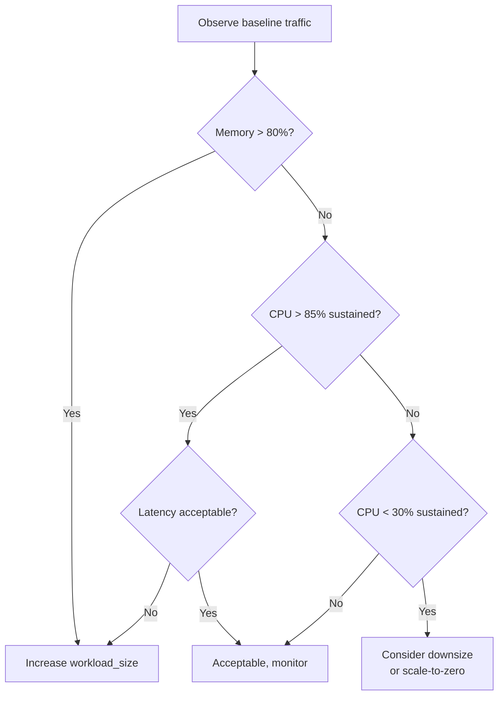

# Module 16 — Serving Observability

> **Goal of this module:** observability for Mosaic AI Model Serving endpoints — request rate, latency (p50/p95/p99), error rate, CPU and memory, and the practical debugging playbook. Closes Section 3 and the corpus.
>
> **Assumes:** Module 14 (serving configuration), Module 13 (inference tables).
>
> **Exam objective:** *"Monitor endpoint health by tracking infrastructure metrics: latency, request rate, error rate, CPU usage, memory usage."*

---

## Coverage map (verbatim Sept 30 2025 exam objectives → where taught)

| Verbatim objective | Section anchor |
|---|---|
| Monitor endpoint health by tracking infrastructure metrics: latency, request rate, error rate, CPU usage, memory usage | "The metrics the platform surfaces" |
| Identify the key components of common monitoring pipelines: ... model health | This module = the "model health" pillar of the 4-pillar pipeline in Module 10 |

> Cross-references: Module 10 (the other 3 pillars: logging, drift, model performance); Module 13 (inference table content as the complement to infra metrics); Module 14 (the endpoint config knobs that drive these metrics).

> 🎯 **Decision rules:**
> - **"p99 latency spiked but p50 stable" → tail event: cold start, GC pause, expensive-path in a champion+fallback model, or a slow downstream feature lookup. Diagnose the rare path, not the typical one.**
> - **"5xx error rate climbing" → model code error, OOM, or dependency failure. Check endpoint logs + replica memory.**
> - **"4xx error rate climbing" → caller / payload issue, not the model. Check request schema, auth.**
> - **"Endpoint health = Lakehouse Monitoring? NO."** Endpoint infra metrics are surfaced via Mosaic AI Model Serving's own metrics + Prometheus/OpenTelemetry export, not via Lakehouse Monitoring. LHM covers data + model perf; endpoint infra is the separate surface.
> - **"Cold start latency on customer-facing endpoint" → disable `scale_to_zero_enabled`, keep replicas warm.**
> - **"Cost too high on idle endpoint" → enable `scale_to_zero_enabled` (only if cold start is acceptable for the use case).**

---

## The metrics the platform surfaces

Mosaic AI Model Serving exposes built-in metrics on every endpoint:

| Metric | Unit | What it tells you |
|---|---|---|
| `request_rate` | req/sec | Traffic volume — is the endpoint actually being used? |
| `latency_p50` | ms | Median request latency — the typical user experience |
| `latency_p95` | ms | 95th percentile — the slow tail |
| `latency_p99` | ms | 99th percentile — the worst 1% |
| `error_rate_4xx` | % | Client errors — bad requests, auth failures, malformed payloads |
| `error_rate_5xx` | % | Server errors — model crashes, dependency failures, OOMs |
| `cpu_usage` | % | Average CPU per replica |
| `memory_usage` | % | Average memory per replica |
| `replica_count` | int | Current number of replicas serving |
| `cold_start_count` | count | Number of cold starts in the window |

These are accessible:

- In the Mosaic AI Model Serving UI (per-endpoint dashboard).
- Via REST API (`/serving-endpoints/{name}/metrics`).
- Exportable to Prometheus / Datadog / Splunk for org-wide observability.

---

## p50 / p95 / p99 — the latency story

A single "average latency" number hides everything that matters. Distributions tell the truth.

| Percentile | Meaning |
|---|---|
| p50 (median) | What half of users see |
| p95 | The slow 5% — bad day for those users |
| p99 | The catastrophic 1% — usually a timeout, retry storm, or cold start |
| p99.9 | Engineering on this is rarely worth it for ML endpoints; matters for HFT/ads |

**Typical exam scenario:**

> "Your fraud endpoint has p50 of 80ms but p99 of 1200ms. What's happening?"

Likely causes:

1. **Cold starts** — if `scale_to_zero_enabled=True`, the first request after idle hits cold start (5-30 sec). Visible as `cold_start_count > 0`.
2. **Autoscale lag** — traffic spike, replicas scaling up; the requests during the scaling window have queueing latency.
3. **Tail behaviors in the model** — for ensembles with conditional paths (Module 06), the expensive fallback path dominates p99.
4. **GC pauses** — JVM-based runtimes occasionally pause. Less common for Python.
5. **Network jitter** — usually narrow; doesn't explain 1200ms.

⚠️ **Exam trap:** answers that focus only on p50 ("p50 is great, ship it"). Tail latency is what users remember when it goes wrong.

---

## Error rate — 4xx vs 5xx

| Code | Meaning | Caller's fault or yours? |
|---|---|---|
| 400 Bad Request | Malformed payload | Caller |
| 401 Unauthorized | Bad token | Caller |
| 403 Forbidden | Missing UC `EXECUTE` permission | Configuration |
| 404 Not Found | Endpoint name wrong | Caller |
| 422 Unprocessable Entity | Schema mismatch (e.g., wrong dtype) | Caller or you (signature wrong) |
| 429 Too Many Requests | Rate limit | You under-sized |
| 500 Internal Server Error | Model crashed | You |
| 502/503 Bad Gateway / Unavailable | Endpoint down or transient | Platform / autoscale |
| 504 Gateway Timeout | Request exceeded timeout | You (model too slow) |

**Patterns:**

- High 422 → schema drift on the caller side, or your signature is too strict. Check inference table for what callers are sending.
- High 500 → model error. Check serving logs.
- High 429 → traffic exceeds capacity. Bump workload_size or replica count.
- High 504 → individual requests too slow. Profile the model.

⚠️ **Exam trap:** treating all errors as "platform issues." 4xx is almost always the caller's fault (or your config); 5xx is your problem.

---

## CPU and memory

Per-replica averages over the metric window.

| Metric | Typical healthy range | What outside means |
|---|---|---|
| CPU | 30-70% sustained | <30% → over-provisioned; downsize. >85% → under-provisioned; upsize or add replicas. |
| Memory | <80% | >90% → OOM risk imminent; upsize workload_size. |
| Cold start count | 0 in steady state | >0 → scale-to-zero kicked in; users hit cold start |

**Sizing decision flow:**



⚠️ **Exam trap:** "CPU is 95% — add more replicas." Not always — for a single hot request that's CPU-bound, more replicas don't help that request. Profile first.

---

## Debugging cookbook — five common scenarios

### Scenario 1: "The endpoint won't start"

Symptoms: deploy succeeds, but state stuck in `NOT_READY` or `FAILED`.

Likely causes:

1. **Missing dependency** — model code imports a module not in `pip_requirements`. Check serving logs.
2. **`load_context` raises** — artifact missing, file path wrong, init code crashes.
3. **OOM on load** — model + dependencies exceed workload_size memory.
4. **Permission missing** — endpoint's service principal lacks `EXECUTE` on the registered model.

Tools: serving endpoint Events tab; CloudWatch / Azure Monitor for the underlying logs; `databricks serving-endpoints get name` for state.

### Scenario 2: "Latency is fine on dev, terrible in prod"

Symptoms: same model, same code, different latency profile.

Likely causes:

1. **Different workload_size** — dev `Large`, prod `Small`. Memory pressure → swap → latency.
2. **Cold starts** — prod has `scale_to_zero_enabled=True` while dev kept warm.
3. **Different request shape** — prod requests have 1000-row batches; dev tested with 1-row batches. Per-batch overhead amortizes differently.
4. **Different request patterns** — prod has bursts that hit autoscale lag.

Tools: inference table groupBy request size; metrics dashboard.

### Scenario 3: "5% of requests fail with 504"

Symptoms: most requests are healthy; sustained tail of timeouts.

Likely causes:

1. **Slow path in the model** — ensemble fallback (Module 06), large input batches, lazy-init in `predict`.
2. **External dependency** — feature lookup or DB call inside `predict` occasionally slow.
3. **GC / cold worker** — but in Python, less common.

Tools: inference table, query `execution_time_ms` distribution; profile a slow request offline.

### Scenario 4: "p99 spiked at 3 AM"

Symptoms: scheduled time correlation.

Likely causes:

1. **Concurrent batch job** — a scheduled training or scoring job competes for the cluster's resources. Mosaic AI Model Serving is *usually* isolated, but if a custom model loads a shared resource, contention is possible.
2. **Autoscale during traffic dip** — replicas scaled down; first wakeup is slow.
3. **Network maintenance** — rare.

### Scenario 5: "The new canary version has higher latency"

Symptoms: v6 (canary) has p50 of 200ms; v5 (champion) has p50 of 80ms.

Likely causes:

1. **Model size** — v6 is larger. Profile load time.
2. **Different preprocessing** — v6 does more work in `predict`.
3. **Workload_size mismatch** — v6 needs `Medium`, deployed at `Small`.

Action: roll back the canary (traffic to 0%), investigate v6 offline.

---

## Monitoring dashboards — what to build

A typical "endpoint health" dashboard:

1. **Request rate** (line, last 24 hours).
2. **Latency p50, p95, p99** (lines, last 24 hours) — three lines on one chart.
3. **Error rate by code** (stacked area).
4. **CPU + memory** (lines per replica or aggregate).
5. **Replica count** (line — surfaces autoscale events).
6. **Per-version comparison** during canary — same metrics, grouped by `model_version`.

These can be built as DBSQL dashboards on top of the inference table + endpoint metrics export. Or use a third-party dashboard (Datadog, Grafana) if the org standardizes there.

```sql
-- p50/p95/p99 per hour from inference table
SELECT
  date_trunc('hour', from_unixtime(timestamp_ms / 1000)) AS hour,
  model_version,
  COUNT(*) AS n_requests,
  PERCENTILE_CONT(0.5)  WITHIN GROUP (ORDER BY execution_time_ms) AS p50_ms,
  PERCENTILE_CONT(0.95) WITHIN GROUP (ORDER BY execution_time_ms) AS p95_ms,
  PERCENTILE_CONT(0.99) WITHIN GROUP (ORDER BY execution_time_ms) AS p99_ms,
  SUM(CASE WHEN status_code BETWEEN 400 AND 499 THEN 1 ELSE 0 END) / COUNT(*) AS error_rate_4xx,
  SUM(CASE WHEN status_code BETWEEN 500 AND 599 THEN 1 ELSE 0 END) / COUNT(*) AS error_rate_5xx
FROM prod.ml_inference_logs.fraud_endpoint_payload
WHERE timestamp_ms > unix_millis(current_timestamp() - INTERVAL 24 HOURS)
GROUP BY 1, 2
ORDER BY 1, 2;
```

---

## Alerts on infrastructure metrics

Beyond drift alerts (Module 11), alert on endpoint health:

- **p99 latency exceeds SLA** (e.g., > 500ms for 3 consecutive 5-min windows).
- **Error rate exceeds 1%** (sustained).
- **CPU > 85% sustained** (impending capacity issue).
- **Memory > 90%** (OOM risk).
- **Cold start count > 0** during business hours (if scale-to-zero was supposed to be off).

```sql
-- Alert query: sustained p99 > 500ms
WITH hourly AS (
  SELECT
    date_trunc('5 minutes', from_unixtime(timestamp_ms / 1000)) AS window_start,
    PERCENTILE_CONT(0.99) WITHIN GROUP (ORDER BY execution_time_ms) AS p99_ms
  FROM prod.ml_inference_logs.fraud_endpoint_payload
  WHERE timestamp_ms > unix_millis(current_timestamp() - INTERVAL 1 HOUR)
  GROUP BY 1
)
SELECT COUNT(*) AS breaching_windows
FROM hourly
WHERE p99_ms > 500;
-- Alert when breaching_windows >= 3
```

⚠️ **Exam trap:** firing on a single window's metric. Single-point alerts are noisy. Require sustained breach (K consecutive windows).

---

## Mosaic AI Model Serving — production checklist

Before declaring an endpoint "production-ready":

- [ ] Auto-capture (inference tables) enabled.
- [ ] Lakehouse Monitoring InferenceLog profile attached.
- [ ] Workload_size right-sized (CPU < 70%, memory < 80% under steady load).
- [ ] Autoscale min/max set appropriately.
- [ ] Scale-to-zero disabled (unless intentional for cost on non-critical paths).
- [ ] Route Optimization enabled if QPS > 100 sustained.
- [ ] UC permissions: endpoint SP has `EXECUTE`, no excess privileges.
- [ ] Inference table joined with labels via downstream job.
- [ ] Drift alerts active (Module 11).
- [ ] Endpoint health alerts active (this module).
- [ ] Runbook documented — who to page, how to roll back via alias.
- [ ] Canary mechanism rehearsed (you've done at least one successful canary in staging).

⚠️ **Exam trap:** declaring "production ready" without inference table + monitoring + alerting. The exam treats observability as part of "production," not an add-on.

---

## Cross-link to drift detection (Module 11)

Drift and infrastructure metrics overlap operationally:

- **Drift** answers "did the data change?"
- **Infra metrics** answer "is the endpoint healthy?"

A real production incident often shows both: feature drift accelerates as a new customer cohort onboards; meanwhile error rate ticks up because the new cohort sends unexpected payloads. **Both alerts firing simultaneously is the canonical "actual incident" signal.**

When triaging:

1. Check inference table — what's the recent traffic look like?
2. Check drift metrics — has input distribution changed?
3. Check infra metrics — are errors / latency / memory in the green?
4. Check serving logs — any exceptions in the model?

---

## End-to-end exam scenario

> "Your fraud endpoint serves 200 QPS at p50 80ms. Over the last hour, p99 climbed from 300ms to 1500ms. Memory usage went from 60% to 92%. Error rate is steady at 0.1%. What's most likely happening?"

Exam-correct diagnosis: **memory pressure**. Memory at 92% means the OS is heading toward swap territory or about to OOM. Higher memory access latency manifests as elevated p99. Error rate is steady because requests still complete — just slowly.

Action:

1. Upsize workload_size (e.g., Medium → Large).
2. Investigate why memory grew (caching gone unbounded inside the model? larger requests? model artifact change?).
3. If the recent change correlates with a new model version, roll back via alias.

Wrong-answer flavors:

- "Cold starts" — would show in `cold_start_count`, would manifest as bursts in p99, not a steady climb.
- "Network issue" — would affect error rate too.
- "Concept drift" — drift doesn't affect latency.

---

## Mini quiz

1. p50 = 80ms, p99 = 1200ms. What's the typical root cause?
2. The endpoint has high 422 error rate. Whose fault is it usually?
3. Memory at 92%, latency rising. Diagnose.
4. CPU at 95% sustained. Add replicas — always right?
5. Cold start count > 0 during business hours — what setting did you misconfigure?
6. Why is "alert on a single window's metric" wrong?
7. The canary at 5% has 3x higher p50 than the champion. Action?
8. Production checklist — name 5 boxes you must tick before "ready."

**Answers:**

1. Cold starts, autoscale lag, ensemble fallback paths, or memory pressure. Combination of "rare path" or "wakeup" — investigate cold_start_count and autoscale events first.
2. **The caller's** — 422 means malformed payload or schema mismatch. Or your signature is wrong (overly strict), but most often the caller is sending the wrong shape.
3. **Memory pressure.** 92% is danger territory. Upsize workload_size; investigate why memory grew (cache, request size, model change).
4. **Not always.** If a single request is CPU-bound, more replicas serve more *concurrent* requests but don't speed up an individual one. Profile the request first.
5. `scale_to_zero_enabled=True` on a critical endpoint that has idle periods during off-business hours. For business-hour-critical endpoints, scale-to-zero is wrong.
6. Single windows are noisy. False positives waste on-call attention. Require sustained breach (K consecutive windows) — same pattern as drift alerts.
7. **Roll back the canary** (traffic to 0%). Investigate offline. Probable causes: larger model, more preprocessing in predict, wrong workload_size.
8. Five (pick any): inference tables on; monitoring attached; right-sized workload; UC permissions correct; alerts active for drift + infra; runbook documented; canary rehearsed.

---

## Sanity check

- Could you list the 9 standard endpoint metrics?
- Do you know what 422 means and who to suspect?
- Can you diagnose memory pressure vs CPU pressure vs cold starts?
- Could you write the production checklist from memory?
- Do you know why p99 matters more than average latency?

---

## End of corpus

You've reached the end. Sixteen modules, ~14,000 lines, three sections of the Sept 2025 exam blueprint.

**Final preparation:**

1. Take all three quizzes cold (Section 1, Section 2, Section 3).
2. Re-read the eight official sample questions and explain each answer in your own words.
3. Build one end-to-end project in your Databricks Free Edition: feature pipeline → training → registration → DAB deploy → serving endpoint → monitoring. Get one of everything working.
4. Schedule the exam when your quiz scores are consistently > 80% across all three.

[Back to Topic 11 README](README.md).
