\newpage

# How to read this ebook

This is the consolidated reading copy of **Topic 11 — Databricks Certified Machine Learning Professional**, from the **Career_upskill** project. The source markdown files live at `topics/11_databricks_ml_professional/` and remain the canonical version; this ebook is a derived artifact.

**Ordering** is the natural numeric sequence — README, then numbered modules, then FACTS, then quizzes.

**What's included:**
- README (study plan, scope, exam logistics)
- All numbered modules
- The FACTS.md appendix (citable facts, version cutoffs, exam metadata)
- Quizzes (~3× exam length, with answer explanations)

**Diagrams** are Mermaid where present. The EPUB build pre-renders them to PNG via the `mmdc` CLI; if unavailable they appear as code blocks.

\newpage


\newpage

# Topic 11 — Databricks Certified Machine Learning Professional

> **Audience:** Sr AI/ML Engineer (Vatsal — Optum, 10+ yrs Python/PySpark). **Assumes you have already worked through [Topic 09 — Databricks ML Associate](../09_databricks_ml_associate/README.md).** This Pro cert builds directly on Associate knowledge: Spark ML basics, MLflow tracking 101, AutoML, AVF, Hyperopt-as-historical-context, registry stages-as-historical-context.
>
> **Goal:** Pass the **Databricks Certified Machine Learning Professional** exam (Sept 30 2025 refresh — three sections, MLOps-heavy) and, more importantly, be the person at Optum/Capital One/any regulated-data shop who actually runs ML in production on Databricks the way the platform team intends.
>
> **Last updated:** 2026-05-23

---

## What this topic guarantees

If you read all 16 modules in this corpus and can answer the **mini-quiz, output-prediction drill, and decision-rule** questions for each module from memory, you will have direct coverage of **every verbatim objective from the September 30, 2025 exam guide**. Each module begins with a **Coverage map** that maps the objectives it owns to the section anchors that teach them — use it to verify you're not skipping anything.

**This corpus is sufficient prep on its own** for an experienced ML engineer (Topic 09 Associate-level baseline assumed). External resources are useful for reinforcement, but the modules here are designed so a reader who studies only this material + the quizzes is genuinely ready to sit the exam.

Specifically, every module contains:
- **Coverage map** — verbatim Sept 30 2025 objectives → section anchors in the module.
- **Full API surface** — method signatures + parameter tables for the APIs the exam grills.
- **Look-alike comparison tables** — the API pairs the exam uses as distractors (e.g., `FeatureStoreClient` vs `FeatureEngineeringClient`, `transition_model_version_stage` vs `set_registered_model_alias`, `served_models` vs `served_entities`).
- **Worked walkthroughs** — production-shape code with the exam-tested patterns.
- **Output-prediction drills** — given a snippet, predict what runs / fails / gets logged.
- **Decision rules** — `> 🎯 **How to recognize on the exam:** ...` callouts that match prompt phrasing to the right API.
- **End-to-end mini-scenarios** — full pipelines that combine the module's APIs with adjacent modules.
- **Mini quiz + sanity check** — 6–10 questions with explained answers.

Heaviest-weighted modules: **10 (Lakehouse Monitoring — 10 objectives)**, **08 (DABs)**, **11 (Drift detection statistics)**, **07 (UC model registry — alias vs stages)**. Read them twice.

---

## Exam logistics

| Field | Value |
|---|---|
| Items (scored) | **59 multiple-choice** + a small number of unscored, unidentified |
| Time | **120 minutes** |
| Registration fee | **USD $200** (+ local tax) |
| Passing score | **70%** (community-confirmed; not on official PDF) |
| Delivery | Online proctored only (Webassessor / Kryterion) |
| Validity | **2 years**, must retake current live exam to renew |
| Retake policy | 14-day wait after first fail, 14 days after second, longer after that. Pay full fee each attempt |
| Test aides | **None allowed** |
| Prerequisite | None. ML Associate is **not required** but is the de-facto baseline |

**Recommended prep (verbatim from the official guide):**
- Instructor-led: *Machine Learning at Scale* + *Advanced Machine Learning Operations*
- Self-paced (Databricks Academy): same two courses
- Working knowledge of Python, scikit-learn, SparkML, MLflow
- Working knowledge of **Lakehouse Monitoring** and **Mosaic AI Model Serving**

The pre-2025 single course *Machine Learning in Production* has been split into the two courses above.

---

## What changed in the Sept 30 2025 refresh — read this first

> If you studied this cert before Sept 2025, **roughly 30% of what you memorized is now wrong or deprecated**. Skim this table before anything else.

| Change | Old (pre-Sept 2025) | New (Sept 2025 refresh) |
|---|---|---|
| Section count | 4 (Experimentation / Lifecycle / Deployment / Monitoring) | **3** (Model Development / MLOps / Model Deployment) |
| Section weights | Roughly balanced | **~45% Dev / ~43% MLOps / ~12% Deploy** |
| Tuner of record | **Hyperopt** + SparkTrials | **Optuna** + MLflowCallback + MLflowSparkStudy. **Ray** is also explicit |
| Promotion mechanism | Stage transitions (`None`/`Staging`/`Production`/`Archived`) | **UC aliases** — `@champion`, `@challenger`, `@archived`. Stages = legacy answer |
| Feature platform | `databricks-feature-store` + `FeatureStoreClient` | **`databricks-feature-engineering`** + **`FeatureEngineeringClient`**. Old pkg deprecated |
| Infra as code | Terraform-only / mostly absent | **DABs (Databricks Asset Bundles)** — heavy emphasis, brand new objectives |
| Drift | Ad-hoc Spark code | **Lakehouse Monitoring** with named tests (KS, Chi-sq, JS, Wasserstein, TVD) |
| Deployment | Generic "endpoints" | **Blue-green and canary by name**, served entities + traffic config, Route Optimization, shadow |
| Online serving feature store | "Online Stores" (DynamoDB/Cosmos) | **Online Tables** (UC-native, serverless) |
| MLflow assumptions | 2.x | **3.x** — UC three-level namespace, signatures required for registration |
| Webhooks | Central to promotion | Still tested as concept but **alias + Jobs gate is the new canonical answer** |

⚠️ **Distractor pattern:** wrong choices on the new exam disproportionately come from the *old* APIs (`FeatureStoreClient`, `transition_model_version_stage`, `SparkTrials`, "Online Stores"). If an answer looks "right from 2023," it's probably the wrong answer on the 2025 exam.

---

## Domain weight table

Databricks does not publish exact percentages on the Sept 2025 PDF. Community cross-verification yields:

| # | Section | Approx weight | Objective count | Trend vs Apr 2024 |
|---|---|---|---|---|
| 1 | **Model Development** | ~45% | ~22 objectives | UP (absorbs old "Experimentation") |
| 2 | **MLOps** | ~43% | ~24 objectives (largest) | UP heavily (DABs, monitoring new) |
| 3 | **Model Deployment** | ~12% | ~6 objectives | DOWN (but deep scenarios) |

Largest single subsection: **Drift / Lakehouse Monitoring (10 objectives)** inside Section 2. Plan your study time around it — see Module 10.

---

## Learning path — 16 modules

| # | Module | Why it matters |
|---|---|---|
| **Section 1 — Model Development (~45%)** | | |
| 01 | [Advanced MLflow tracking](01_advanced_mlflow_tracking.md) | Nested runs, custom artifacts, signatures, input examples, search experiments, autolog gotchas |
| 02 | [Custom PyFunc models](02_custom_pyfunc_models.md) | `mlflow.pyfunc.PythonModel`, `load_context`, dependency packaging, real-time feature lookups |
| 03 | [Optuna + Ray distributed tuning](03_optuna_advanced.md) | Samplers, pruners, MLflowCallback, MLflowSparkStudy, Ray Tune, multi-objective. **Hyperopt is out.** |
| 04 | [Feature Engineering in UC — deep](04_feature_engineering_uc_deep.md) | `FeatureEngineeringClient`, point-in-time lookups, online tables, on-demand features, streaming features |
| 05 | [Advanced Spark ML](05_advanced_spark_ml.md) | Pipelines, custom transformers/estimators, CrossValidator parallelism, evaluators |
| 06 | [Ensembles & stacking via PyFunc](06_ensembles_stacking.md) | Voting/stacking custom models, multi-model ensembles, per-request routing logic |
| **Section 2 — MLOps (~43%) — biggest section, slow read** | | |
| 07 | [UC model registry lifecycle](07_uc_model_registry_lifecycle.md) | Registered models, versions, aliases (@champion/@challenger), tags, transitions, webhook concept |
| 08 | [Databricks Asset Bundles for ML](08_dabs_for_ml.md) | `databricks.yml`, resources, targets, ML jobs + endpoints + models as bundle resources. **New, heavy** |
| 09 | [CI/CD with DABs + GitHub Actions](09_ci_cd_with_dabs.md) | Bundle deploy on PR merge, env promotion (dev→staging→prod), gated promotion patterns |
| 10 | [Lakehouse Monitoring — deep](10_lakehouse_monitoring_deep.md) | Snapshot / TimeSeries / InferenceLog monitors, profile + drift tables, custom metrics, slicing. **Largest module, 10 objectives** |
| 11 | [Drift detection deep](11_drift_detection.md) | Feature / label / prediction / concept drift; KS / Chi-sq / JS / Wasserstein selection; alerting; retraining triggers |
| 12 | [Model governance in UC](12_model_governance.md) | Permissions on models, lineage (model→table), tags, approval workflows, deploy-code strategy |
| 13 | [Inference tables](13_inference_tables.md) | Auto-logging requests + responses on serving endpoints, joining feedback labels, foundation for monitoring |
| **Section 3 — Model Deployment (~12%)** | | |
| 14 | [Serving: blue-green & canary](14_serving_blue_green_canary.md) | Served entities, traffic config, canary 90/10, blue-green via traffic rebalance, scale-to-zero, autoscale |
| 15 | [Batch & streaming serving](15_batch_streaming_serving.md) | `mlflow.pyfunc.spark_udf`, Lakeflow Jobs for batch, Structured Streaming inference |
| 16 | [Serving observability](16_serving_observability.md) | Endpoint metrics, p50/p95/p99 latency, error rates, request logging, debugging |

## Companion files

- [`FACTS.md`](FACTS.md) — atomic citable claims. Exam logistics, drift test mappings, alias semantics, DABs CLI, monitor types. Updated whenever a number gets caught stale.
- [`quizzes/`](quizzes/) — ~177 practice questions (59 × 3 sittings worth), split by section weight.
- Cross-links to [Topic 09 — Databricks ML Associate](../09_databricks_ml_associate/README.md) for prerequisites and to [Topic 02 — Azure Databricks](../02_azure_databricks/README.md) for platform-level depth (Unity Catalog, MLflow 3, Mosaic AI Serving, DABs).

## How to use this corpus

1. **Take a baseline cold quiz** from `quizzes/01_model_development.md` (just the Recall section) before reading anything. Note what you don't know — that's your honest starting point.
2. Read modules **01 → 06** for Section 1. If you've shipped MLflow + Spark ML for years, much of this is fast review; **slow down on PyFunc (02) and Optuna (03) — both have changed**.
3. Read modules **07 → 13** for Section 2. **This is where points live.** Module 10 (Lakehouse Monitoring) deserves two passes.
4. Read modules **14 → 16** for Section 3. Shorter section but deep scenarios.
5. Take each section's quiz cold. Score below 80% → re-read the relevant module.
6. Final week: re-read the 8 sample questions in the official PDF and explain each answer in your own words.

Each module ends with a **Sanity check** — 3–5 questions you should answer in your head before moving on.

## Scope notes

- **Cutoff:** content reflects the **September 30 2025** exam guide and **MLflow 3.x** + **`databricks-feature-engineering` ≥ 0.2.0**. The cert refreshes roughly yearly; re-verify before scheduling.
- **NDA discipline:** every quiz question in this folder is **original**. No leaked / dumped / verbatim exam content. We test the same objectives the exam tests, not the same wording.
- **Stack convention:** PySpark / scikit-learn / MLflow / UC three-level names. Anthropic-style LLMs only where relevant (Module 02 ensemble examples). No OpenAI imports.
- **Lens:** healthcare-regulated context where it sharpens an answer (e.g., why `@champion` alias + audit trail > stage transitions for HIPAA workflows). Not heavy-handed.

## Stack baseline (additions to project `.venv`)

```
databricks-sdk          # latest
databricks-cli          # >=0.218 (for `databricks bundle ...`)
mlflow                  # >=3.0
databricks-feature-engineering  # >=0.2.0 — NOT databricks-feature-store
optuna                  # >=3.5
optuna-integration      # MLflowCallback + Ray
ray[tune]               # >=2.10 — distributed HP search
scikit-learn
pyspark                 # matches DBR version on cluster
pytest
```

## Cross-references

- **[Topic 02 — Azure Databricks](../02_azure_databricks/README.md)** — platform foundations. Module 09 (Unity Catalog), Module 12 (MLflow 3 deep), Module 14 (Model Serving + AI Gateway), Module 19 (CI/CD with DABs).
- **[Topic 09 — Databricks ML Associate](../09_databricks_ml_associate/README.md)** — the prerequisite. AutoML, Hyperopt (legacy), Feature Store 1.0 (legacy), workspace registry stages (legacy).
- **[Topic 10 — Databricks GenAI Associate](../10_databricks_genai_associate/README.md)** — sister cert, GenAI-focused. Useful background but **does not overlap** with ML Pro objectives.

---

**Next step:** open [`FACTS.md`](FACTS.md) for the single-source-of-truth numbers, then start [Module 01](01_advanced_mlflow_tracking.md).


\newpage

# Module 01 — Advanced MLflow Tracking

> **Goal of this module:** the MLflow surface that the Pro exam actually tests beyond Associate. **Nested runs, custom artifacts, signatures + input examples, autolog deep, search APIs, tags as governance**. The point is not "what is MLflow" — that's Associate territory — but the depth required to design and audit a real production tracking story.
>
> **Assumes:** Topic 09 (ML Associate) — you know what an experiment, a run, a parameter, a metric, an artifact is. You've used `mlflow.sklearn.log_model` casually. This module is the upgrade.

---

## Coverage map (verbatim Sept 30 2025 exam objectives → where taught)

| Verbatim objective | Section anchor |
|---|---|
| Utilize **nested runs** using MLflow for tracking complex experiments | "Nested runs — the canonical pattern" |
| Log custom metrics, parameters, and artifacts programmatically in MLflow | "Logging custom artifacts — what the exam tests" + "Code: the production pattern" |
| Create custom model objects using real-time feature engineering | Cross-link → Module 02 (PyFunc) + Module 04 (FE-in-UC `fe.log_model`) |

This module is the foundation under every other Section 1 module. Section 1 = ~45% of the exam.

> See Topic 09 → [Module 04 (MLflow tracking basics)](../09_databricks_ml_associate/04_mlflow_tracking_basics.md) for `MlflowClient.search_runs` prerequisites and Topic 09 → [Module 05 (registry basics)](../09_databricks_ml_associate/05_mlflow_registry.md) for the legacy stage-transition pattern that distractors recycle.

---

## Why this module sits first

Section 1 (Model Development) is ~45% of the exam. Inside Section 1, three subsections matter most:

1. **Advanced MLflow Usage** — three objectives (nested runs, custom artifacts, custom model objects with real-time FE).
2. **Advanced Feature Store** — five objectives (Module 04).
3. **SparkML** — seven objectives (Module 05).

Get MLflow right at depth and the rest of Section 1 follows naturally — every other module logs into MLflow, registers to UC, and uses signatures. **If you fumble nested runs or signatures here, you'll miss 4-6 Section 1 questions.**

---

## The MLflow object model — get this exactly right

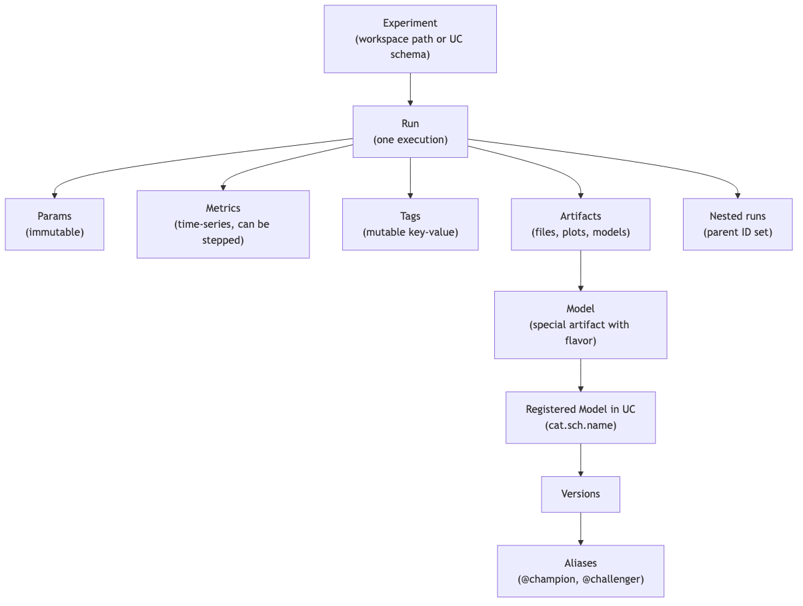

**The two object boundaries the exam tests:**

1. **Run vs Registered Model.** A run is a tracking record (params, metrics, artifacts). A registered model is a governance object in UC. They link via the model artifact + registration call, but they have separate identities and ACLs.
2. **Nested runs vs separate runs.** Nested means the child's `parent_run_id` is set. UI groups them. They share an experiment but have independent metrics — you must explicitly aggregate.

---

## Nested runs — the canonical pattern

The exam test pattern: "You're doing K-fold CV with N hyperparameter sets. How should you structure the MLflow tracking?"

The canonical answer:

- **One parent run** for the full experiment (the search).
- **One child run per HP set**, logging the aggregated CV metric.
- **(Optional) grandchildren per fold** if you want fold-level metrics queryable.
- **The final retrained model** logged as either a new top-level run or a separate child of the parent (the exam accepts either; "separate run" is slightly preferred for cleaner re-deploy).

```python
import mlflow
import numpy as np
from sklearn.model_selection import KFold
from sklearn.ensemble import RandomForestClassifier
from sklearn.metrics import f1_score

mlflow.set_experiment("/Users/me@org/fraud_search")

hp_grid = [
    {"n_estimators": 100, "max_depth": 5},
    {"n_estimators": 200, "max_depth": 10},
    {"n_estimators": 500, "max_depth": 15},
]

with mlflow.start_run(run_name="fraud_search_v3") as parent:
    mlflow.set_tag("search_method", "manual_grid")
    mlflow.set_tag("data_version", "delta/prod/fraud_features@v42")
    parent_id = parent.info.run_id

    best_score, best_hp = -1, None
    for hp in hp_grid:
        with mlflow.start_run(run_name=f"hp_{hp}", nested=True) as child:
            mlflow.log_params(hp)
            kf = KFold(n_splits=5, shuffle=True, random_state=42)
            fold_scores = []
            for fold_idx, (train_idx, val_idx) in enumerate(kf.split(X)):
                model = RandomForestClassifier(**hp, random_state=42).fit(X[train_idx], y[train_idx])
                preds = model.predict(X[val_idx])
                score = f1_score(y[val_idx], preds)
                fold_scores.append(score)
                # Log step-indexed fold metric so the UI shows a series
                mlflow.log_metric("fold_f1", score, step=fold_idx)
            mean_score = float(np.mean(fold_scores))
            mlflow.log_metric("cv_f1_mean", mean_score)
            mlflow.log_metric("cv_f1_std", float(np.std(fold_scores)))
            if mean_score > best_score:
                best_score, best_hp = mean_score, hp

    # Log the aggregated best result on the parent
    mlflow.log_metric("best_cv_f1", best_score)
    mlflow.log_params({f"best_{k}": v for k, v in best_hp.items()})

# Retrain winner on full data — separate top-level run for clean deploy lineage
with mlflow.start_run(run_name="fraud_final", tags={"parent_search_run_id": parent_id}):
    final = RandomForestClassifier(**best_hp, random_state=42).fit(X, y)
    signature = mlflow.models.infer_signature(X, final.predict(X))
    mlflow.sklearn.log_model(
        sk_model=final,
        artifact_path="model",
        signature=signature,
        input_example=X[:5],
        registered_model_name="prod.ml.fraud_classifier",
    )
```

⚠️ **Exam trap:** the most common wrong answer is "log everything into a single flat run, store HPs as a JSON artifact." That destroys searchability — you can't `search_runs(filter_string="params.n_estimators = 500")` against a JSON blob. Always log each HP set as its own run (or child run).

⚠️ **Second exam trap:** logging the final retrained model as a third-level grandchild buried under the search. UI breadcrumbs get messy and CI scripts that look up the latest top-level run for deployment break. Top-level (or first-level child of the search) is canonical.

---

## Logging custom artifacts — what the exam tests

The exam includes one or two questions on **what to log and how**. Memorize these calls:

```python
# A single metric value
mlflow.log_metric("auc", 0.873)

# A time-series metric (UI plots a line)
for epoch in range(epochs):
    mlflow.log_metric("train_loss", loss_value, step=epoch)

# Parameters (immutable, string-coerced)
mlflow.log_param("optimizer", "adam")
mlflow.log_params({"lr": 0.001, "batch_size": 32})  # bulk version

# A tag (mutable, used for governance / search)
mlflow.set_tag("data_version", "delta@v42")
mlflow.set_tags({"team": "fraud", "phase": "training"})

# A Python dict as a JSON artifact (built-in helper, no manual file I/O)
mlflow.log_dict({"feature_names": feature_list, "schema_version": 3}, "metadata.json")

# A matplotlib figure as a PNG artifact
import matplotlib.pyplot as plt
fig, ax = plt.subplots()
ax.plot(history.history["loss"])
mlflow.log_figure(fig, "loss_curve.png")

# A pandas DataFrame as CSV or Parquet
mlflow.log_table(df.to_dict(orient="records"), "predictions.json")

# Any file path on local disk
mlflow.log_artifact("/tmp/shap_summary.png", artifact_path="explainability")

# A whole directory
mlflow.log_artifacts("/tmp/eval_outputs/", artifact_path="eval")
```

**The exam-correct mental model:**

- **Param** = an immutable knob (HP, code commit, dataset version label). String-typed.
- **Metric** = a number, potentially time-series via `step=`. Always queryable.
- **Tag** = a mutable annotation for grouping, governance, search. NOT for metric values.
- **Artifact** = a file. Models are a special kind of artifact (with a flavor + signature).

⚠️ **Exam trap:** logging accuracy as a tag. Tags are strings; metrics are numbers and queryable. `set_tag("auc", "0.87")` will haunt you when you try to `search_runs(filter_string="metrics.auc > 0.85")` and find nothing.

---

## Signatures + input examples — required for UC registration

A signature describes the input and output schemas of a model. Without one (or an inferred one), **UC registration fails**.

```python
from mlflow.models import infer_signature

# X_train: pandas DataFrame; preds: numpy array
signature = infer_signature(X_train, model.predict(X_train))

mlflow.sklearn.log_model(
    sk_model=model,
    artifact_path="model",
    signature=signature,
    input_example=X_train.iloc[:5],
    registered_model_name="prod.ml.fraud_classifier",
)
```

**What goes into a signature:**

- `inputs` — column names + types (or tensor shape + dtype for DL models).
- `outputs` — return type (single column or named).
- `params` (MLflow 3) — additional per-request parameters like `temperature`, `top_k` for LLMs.

**Input examples** are a few rows of representative input. They:

1. Auto-generate the Test request body in the Model Serving UI.
2. Let MLflow validate the signature against real data at log time.
3. Serve as a contract documentation for downstream consumers.

```python
# A signature with params (MLflow 3)
from mlflow.types.schema import Schema, ColSpec, ParamSchema, ParamSpec

input_schema = Schema([ColSpec("string", "prompt")])
output_schema = Schema([ColSpec("string", "completion")])
param_schema = ParamSchema([
    ParamSpec("temperature", "float", 0.7),
    ParamSpec("max_tokens", "integer", 256),
])
signature = ModelSignature(inputs=input_schema, outputs=output_schema, params=param_schema)
```

⚠️ **Exam trap:** the answer that says "signature is optional; skip it for fast logging." Wrong for UC. The exam's UC-flavored questions assume a signature is present.

---

## Autologging — what it does and what it doesn't

Autologging is the one-liner that hooks into a framework and automatically logs params, metrics, model artifacts. Per-framework calls:

```python
mlflow.sklearn.autolog()
mlflow.xgboost.autolog()
mlflow.lightgbm.autolog()
mlflow.tensorflow.autolog()
mlflow.pyspark.ml.autolog()  # SparkML pipelines

# Universal switch (turns on all detected libs)
mlflow.autolog()
```

**What autolog captures (sklearn example):**

- Estimator class name as a tag.
- All HP arguments as params.
- Default scoring metric (e.g., `training_score`) at fit time.
- The fitted model logged as an artifact under `model/`.
- Training metadata (rows, cols, dataset hash if input is a pandas DataFrame).

**What autolog does NOT do (memorize):**

- Does **NOT** auto-register to UC. You must pass `registered_model_name=` explicitly, or call `mlflow.register_model(...)` after.
- Does **NOT** log custom downstream metrics (e.g., business KPIs computed after `fit`).
- Does **NOT** log the best model from a hyperparameter search — only the model passed to `.fit()`. Hyperopt's `fmin` with `SparkTrials`, Optuna's `study.optimize`, sklearn's `GridSearchCV` — autolog logs each trial individually but does NOT identify and register the winner.

⚠️ **Exam trap #1: "Hyperopt autologging registers the best model."** Wrong. Autolog logs each trial as a child run with HPs + metric. You must manually re-fit on full data and `log_model` the winner.

⚠️ **Exam trap #2: "Disable autolog before custom logging."** Not required — autolog and manual `log_metric` calls coexist. The trap is in answer choices that suggest you must turn one off.

---

## Search APIs — programmatic experiment + run queries

The exam will ask "How do you find the best model across all runs in an experiment with X criteria?" Memorize these:

```python
# All experiments matching a name pattern
experiments = mlflow.search_experiments(
    filter_string="name LIKE '/Users/me/%fraud%'"
)

# All runs in an experiment, filtered + sorted
runs = mlflow.search_runs(
    experiment_ids=[exp.experiment_id],
    filter_string="metrics.cv_f1_mean > 0.85 AND params.model_type = 'xgboost' AND tags.team = 'fraud'",
    order_by=["metrics.cv_f1_mean DESC"],
    max_results=10,
)

# Returns a pandas DataFrame by default
top_run = runs.iloc[0]
top_run_id = top_run["run_id"]
top_model_uri = f"runs:/{top_run_id}/model"
```

Filter string syntax — the exam may surface this:

- `metrics.<name> <op> <number>` — `>`, `<`, `>=`, `<=`, `=`, `!=`.
- `params.<name> = '<string>'` — params are strings, always quoted.
- `tags.<name> = '<string>'` — same as params.
- `attributes.status = 'FINISHED'` — run attributes.
- `AND` only (no `OR`).

```python
# MlflowClient version — more verbose, more control
from mlflow.tracking import MlflowClient
client = MlflowClient()
top_runs = client.search_runs(
    experiment_ids=[exp.experiment_id],
    filter_string="metrics.auc > 0.9",
    order_by=["metrics.auc DESC"],
    max_results=5,
)
```

⚠️ **Exam trap:** `filter_string="metrics.auc > 0.9 OR metrics.f1 > 0.85"` — `OR` is unsupported in the MLflow query DSL. Wrong answer.

---

## Tags as governance — under-appreciated

Tags are mutable, queryable, free-text strings. They're the cheapest governance primitive in MLflow and the exam expects you to know the canonical tag patterns:

| Tag key | Purpose | Example |
|---|---|---|
| `data_version` | Data lineage | `delta@v42` or git SHA of the data prep code |
| `git_commit` | Code lineage | `a1b2c3d4` |
| `team` | Ownership | `fraud_ml` |
| `phase` | Lifecycle stage | `training`, `evaluation`, `production_replay` |
| `pii_scope` | Compliance | `none`, `phi_redacted`, `phi_full` |
| `parent_search_run_id` | Cross-run lineage | the id of the search that produced this final model |
| `validation_status` | Gate state | `pending`, `passed`, `failed` |

```python
# Set at run time
mlflow.set_tag("data_version", "delta@v42")

# Set after run via client (mutable!)
client = MlflowClient()
client.set_tag(run_id, "validation_status", "passed")
client.delete_tag(run_id, "phase")
```

⚠️ **Exam trap:** "Use a tag to store the final F1 score." Wrong — tags are strings and not queryable as numbers. Use a metric.

---

## Code: the production pattern — train, evaluate, register

```python
import mlflow
from mlflow.models import infer_signature
from sklearn.ensemble import GradientBoostingClassifier
from sklearn.metrics import roc_auc_score, log_loss
import matplotlib.pyplot as plt

mlflow.set_registry_uri("databricks-uc")  # MLflow 3: route registry to Unity Catalog
mlflow.set_experiment("/Users/me@org/fraud_classifier")

with mlflow.start_run(run_name="gb_v7") as run:
    # 1. Tags (governance)
    mlflow.set_tags({
        "team": "fraud_ml",
        "data_version": "main.silver.fraud_features@v42",
        "git_commit": git_sha(),
        "phase": "training",
        "pii_scope": "phi_redacted",
    })

    # 2. Params
    hp = {"n_estimators": 300, "max_depth": 5, "learning_rate": 0.05}
    mlflow.log_params(hp)

    # 3. Fit
    model = GradientBoostingClassifier(**hp).fit(X_train, y_train)

    # 4. Metrics
    y_proba = model.predict_proba(X_val)[:, 1]
    mlflow.log_metrics({
        "val_auc": roc_auc_score(y_val, y_proba),
        "val_log_loss": log_loss(y_val, y_proba),
    })

    # 5. Custom artifacts — feature importance plot
    fig, ax = plt.subplots(figsize=(8, 6))
    ax.barh(feature_names, model.feature_importances_)
    mlflow.log_figure(fig, "feature_importance.png")

    # 6. Feature catalog as JSON
    mlflow.log_dict({"features": feature_names}, "feature_catalog.json")

    # 7. Signature + input example + UC register in one call
    signature = infer_signature(X_train, model.predict(X_train))
    mlflow.sklearn.log_model(
        sk_model=model,
        artifact_path="model",
        signature=signature,
        input_example=X_train.iloc[:5],
        registered_model_name="prod.ml.fraud_classifier",
    )

    run_id = run.info.run_id

# 8. Set alias after log
from mlflow import MlflowClient
client = MlflowClient()
latest_version = client.get_registered_model("prod.ml.fraud_classifier").latest_versions[0].version
client.set_registered_model_alias(
    "prod.ml.fraud_classifier",
    alias="challenger",
    version=latest_version,
)
```

This is **the** template. Eight steps; you should be able to write it from memory by exam day.

---

## Look-alike API comparison — burn into memory

The exam packs answer choices with near-identical API calls. Memorize the distinguishing detail.

| Pair | Difference | Exam tell |
|---|---|---|
| `mlflow.log_metric("k", v)` vs `mlflow.log_metric("k", v, step=epoch)` | One scalar vs time-series with explicit X-axis | "track loss per epoch" → use `step=`. UI shows a line plot only with `step=` |
| `mlflow.start_run()` vs `mlflow.start_run(nested=True)` | Top-level run vs child of currently active parent | `nested=True` requires an already-active parent context. Without it, you get a top-level run; the UI tree will not group them |
| `mlflow.log_dict(d, "x.json")` vs `mlflow.log_artifact("/tmp/x.json")` vs `mlflow.log_text(s, "x.txt")` | `log_dict` = in-memory dict → JSON. `log_artifact` = file already on disk. `log_text` = string → text file | If the question shows code that already wrote a file, `log_artifact`. If a dict is in scope, `log_dict`. No manual `json.dumps` ever needed |
| `mlflow.log_figure(fig, "x.png")` vs `mlflow.log_artifact("/tmp/x.png")` | `log_figure` accepts a matplotlib Figure directly | If `fig, ax = plt.subplots()` is in scope, `log_figure` is the canonical answer |
| `mlflow.log_table(data, "preds.json")` vs `mlflow.log_artifact("preds.csv")` | `log_table` produces an MLflow-aware table (filterable in UI); `log_artifact` produces an opaque file | Eval tables → `log_table`. Raw artifacts → `log_artifact` |
| `mlflow.search_runs(...)` vs `MlflowClient().search_runs(...)` | Returns pandas DataFrame vs list of Run objects | `runs.iloc[0]["metrics.auc"]` → pandas. `runs[0].data.metrics["auc"]` → client |
| `mlflow.autolog()` vs `mlflow.sklearn.autolog()` vs `mlflow.xgboost.autolog()` | Universal autodetect vs flavor-specific with flavor-specific kwargs | If the question wants `log_input_examples=True` or other flavor knobs, the flavor-specific form is the right call |
| `mlflow.autolog(exclusive=True)` vs `exclusive=False` (default) | `True` blocks manual `mlflow.log_*` inside the autologged fit; `False` lets manual log calls coexist | "We want autolog to *only* log what it captures and nothing else" → `exclusive=True`. The exam favors `False` because most real pipelines blend |
| `mlflow.set_tag(k, v)` vs `mlflow.log_param(k, v)` | Tag = mutable string for governance; param = immutable HP | If the value changes after the run starts (e.g., `validation_status=passed`), it has to be a tag. If it's the model HP itself, param |
| `mlflow.set_tag` vs `mlflow.set_experiment_tag` | Tag the **run** vs the **experiment** | "tag every run in this experiment with team=fraud" → set on the experiment, all runs inherit |
| `client.transition_model_version_stage(...)` vs `client.set_registered_model_alias(...)` | Legacy Workspace registry vs UC | UC registry questions → **always** alias. Stage transitions are the wrong-answer trap |
| `mlflow.register_model(uri, name)` vs `mlflow.<flavor>.log_model(..., registered_model_name=...)` | Two-step (log first, register from URI later) vs one-shot | Both are correct; the one-shot is more common in the exam scenarios |

### Filter-string syntax — the 4 field prefixes you MUST recognize

| Prefix | Filters on | Example |
|---|---|---|
| `metrics.<name>` | Numeric metric | `metrics.val_auc > 0.85` |
| `params.<name>` | Param (string-typed) | `params.max_depth = "10"` (note quotes) |
| `tags.<name>` | Tag | `tags.team = "fraud_ml"` |
| `attributes.<field>` | Run attribute | `attributes.status = "FINISHED"` |

Combine only with `AND`. No `OR`. No nested parens for boolean logic.

> 🎯 **How to recognize a search-runs question on the exam:** the prompt always specifies (a) the metric to optimize, (b) a direction (max/min), and often (c) a filter constraint. Match the verb in the prompt — "find the best by AUC" → `order_by=["metrics.auc DESC"]`. "Lowest log loss" → `ASC`. The `DESC`/`ASC` confusion is the most-tested trap.

---

## Output-prediction drills

For each snippet, predict what the run record will contain (or what fails).

**Drill 1 — nested run counting:**
```python
with mlflow.start_run(run_name="parent"):
    for hp in [{"depth": 5}, {"depth": 10}, {"depth": 15}]:
        with mlflow.start_run(run_name=f"hp_{hp}", nested=True):
            mlflow.log_params(hp)
            mlflow.log_metric("cv_f1", 0.8)
```
Q: How many runs exist after this block? How many are top-level?
A: **4 runs total** (1 parent + 3 children). **1 top-level** (the parent). The UI groups the 3 children under the parent because their `parent_run_id` is set.

**Drill 2 — autolog + manual log:**
```python
mlflow.sklearn.autolog(exclusive=False)
with mlflow.start_run():
    model = RandomForestClassifier(n_estimators=200).fit(X, y)
    mlflow.log_metric("business_kpi", 0.42)
```
Q: What gets logged?
A: Autolog logs `n_estimators=200` (and all other RF defaults) as params, `training_score` as a metric, the fitted model under `model/`, plus the manual `business_kpi=0.42`. With `exclusive=True` the manual metric would be **dropped**.

**Drill 3 — params as strings:**
```python
mlflow.log_param("n_estimators", 200)
runs = mlflow.search_runs(filter_string="params.n_estimators = 200")
```
Q: How many runs match (assume one run logged the param)?
A: **Zero.** Params are stored as strings; the filter must be `params.n_estimators = "200"` (quoted). Unquoted ints fail.

**Drill 4 — OR in filter string:**
```python
mlflow.search_runs(filter_string="metrics.auc > 0.9 OR metrics.f1 > 0.85")
```
Q: What happens?
A: Raises an error. MLflow filter DSL supports only `AND`. Workaround: run two queries, union in pandas.

**Drill 5 — signature requirement:**
```python
mlflow.sklearn.log_model(model, "model", registered_model_name="prod.ml.fraud")
```
Q: With `mlflow.set_registry_uri("databricks-uc")` set, what happens?
A: **Registration fails** — UC requires a signature (or auto-inferred from `input_example`). The exam-correct fix is to pass `signature=infer_signature(X, model.predict(X))` and `input_example=X.iloc[:5]`.

---

## Decision rules — read the prompt, pick the API

> 🎯 **"Track CV across N HP combos" → nested runs.** One parent (the search), one child per HP combo. Final retrained winner = new top-level (or sibling) run with `registered_model_name=`.

> 🎯 **"Need queryable numeric value" → metric.** Tags are strings and not numerically queryable. If the value will appear in `filter_string="metrics.X > Y"`, it MUST be a metric.

> 🎯 **"Mutable annotation post-hoc" → tag via `MlflowClient.set_tag(run_id, ...)`.** Params are immutable once logged.

> 🎯 **"Search across runs for the best one" → `search_runs` with `order_by + DESC for max / ASC for min`.** If the question shows pandas indexing (`runs.iloc[0]`), use `mlflow.search_runs`. If it shows `run.info.run_id`, use `MlflowClient.search_runs`.

> 🎯 **"UC three-level name in the answer" → MLflow 3 + UC.** Set `mlflow.set_registry_uri("databricks-uc")` and the name must be `catalog.schema.model_name`. Two-level names fail in UC.

---

## End-to-end mini-scenario — nested CV + UC promotion

Scenario: you're tuning a fraud classifier with a 12-point HP grid and 5-fold CV. Build the full MLflow story.

```python
import mlflow
from mlflow.models import infer_signature
from mlflow import MlflowClient
import numpy as np
from sklearn.ensemble import GradientBoostingClassifier
from sklearn.model_selection import StratifiedKFold
from sklearn.metrics import f1_score

mlflow.set_registry_uri("databricks-uc")
mlflow.set_experiment("/Users/me@org/fraud_search_v4")

grid = [{"n_estimators": n, "max_depth": d, "learning_rate": lr}
        for n in [200, 400, 600] for d in [3, 5] for lr in [0.05, 0.1]]
assert len(grid) == 12

with mlflow.start_run(run_name="search_v4") as parent:
    mlflow.set_tags({
        "search_method": "manual_grid",
        "data_version": "main.silver.fraud_features@v42",
        "phase": "tuning",
    })
    best_score, best_hp = -1.0, None
    for hp in grid:
        with mlflow.start_run(run_name=f"hp_{hp}", nested=True):
            mlflow.log_params(hp)
            skf = StratifiedKFold(n_splits=5, shuffle=True, random_state=42)
            fold_scores = []
            for i, (tr, va) in enumerate(skf.split(X, y)):
                m = GradientBoostingClassifier(**hp, random_state=42).fit(X[tr], y[tr])
                s = f1_score(y[va], m.predict(X[va]))
                fold_scores.append(s)
                mlflow.log_metric("fold_f1", s, step=i)
            mean = float(np.mean(fold_scores))
            mlflow.log_metric("cv_f1_mean", mean)
            mlflow.log_metric("cv_f1_std", float(np.std(fold_scores)))
            if mean > best_score:
                best_score, best_hp = mean, hp
    mlflow.log_metric("best_cv_f1", best_score)
    mlflow.log_params({f"best_{k}": v for k, v in best_hp.items()})

# Retrain winner on full data — separate top-level run
with mlflow.start_run(run_name="final_v4", tags={"parent_search_run_id": parent.info.run_id}):
    final = GradientBoostingClassifier(**best_hp, random_state=42).fit(X, y)
    sig = infer_signature(X, final.predict(X))
    info = mlflow.sklearn.log_model(
        sk_model=final, artifact_path="model",
        signature=sig, input_example=X[:5],
        registered_model_name="prod.ml.fraud_classifier",
    )

# Promote as @challenger; @champion stays whoever it was — manual gate later
client = MlflowClient()
latest = client.get_registered_model("prod.ml.fraud_classifier").latest_versions[0].version
client.set_registered_model_alias("prod.ml.fraud_classifier", "challenger", latest)
```

Run-count audit (the exam's favorite question): 1 parent + 12 children + 1 final = **14 runs**. The final is intentionally top-level (not a 13th child) so the deploy pipeline picks it up by alias, not by tree traversal.

---

## Mini quiz (do this before moving on)

1. You're running a 5-fold CV with 3 HP sets. How many MLflow runs are created in the canonical nested-run pattern? Name the role of each.
2. What's the difference between `mlflow.log_param` and `mlflow.set_tag`?
3. Why does `mlflow.search_runs(filter_string="metrics.auc > 0.9 OR metrics.f1 > 0.85")` fail?
4. You called `mlflow.sklearn.autolog()`, then ran a `GridSearchCV` with 20 candidates. How many child runs get logged? Does the best model get registered?
5. What two things does an input example unlock that a signature alone does not?
6. You want to register a model to UC. What's the minimum API call signature you must use?

**Answers:**

1. 1 parent + 3 child = 4 minimum. If you also create grandchildren per fold: 1 parent + 3 children + 3×5 fold runs = 19. The exam-canonical "minimum" is 4. The final retrained model is typically a 5th top-level run.
2. `log_param` is immutable and intended for HPs / commits / dataset labels — once set on a run, it can't be changed. `set_tag` is mutable and intended for governance metadata (`validation_status`, `team`).
3. `OR` is unsupported in the MLflow filter DSL. Only `AND` is supported. Workaround: query twice and union in pandas.
4. Twenty child runs (one per candidate). The best model is NOT auto-registered — you must manually re-fit on full data and call `log_model` with `registered_model_name=`.
5. (a) The Model Serving Test UI gets a pre-filled request body. (b) MLflow validates the signature against real data at log time and warns about mismatches.
6. `mlflow.<flavor>.log_model(sk_model=model, artifact_path="model", signature=signature, registered_model_name="<catalog>.<schema>.<name>")` — the three-level UC name is mandatory; without a signature UC registration fails.

---

## Sanity check

- Could you write the nested-runs template from memory in under 5 minutes?
- Do you know which calls require a signature, which require an input example, and which require both?
- Can you list 5 canonical governance tags and what each means?
- Do you remember that the MLflow query DSL has `AND` but not `OR`?
- Can you explain why autolog does NOT register the best model after a search?

Move on to [Module 02 — Custom PyFunc Models](02_custom_pyfunc_models.md) when all five feel obvious.


\newpage

# Module 02 — Custom PyFunc Models

> **Goal of this module:** master `mlflow.pyfunc.PythonModel` — the universal MLflow wrapper. The exam has at least 2–3 questions on this; in production, this is the lever for everything from preprocessing-baked-into-the-model, to multi-model ensembles, to LLM-with-tool-routing.
>
> **Assumes:** Module 01 (you can register sklearn models to UC with signatures and aliases).

---

## Coverage map (verbatim Sept 30 2025 exam objectives → where taught)

| Verbatim objective | Section anchor |
|---|---|
| Create custom model objects using real-time feature engineering | "Real-time feature lookups — Section 1 objective" |
| Register a custom **PyFunc** model and log custom artifacts in **Unity Catalog** | "Logging the custom model — the full pattern" |
| Query custom models via **REST API** or **MLflow Deployments SDK** | "Querying via REST API" |
| Deploy custom model objects using MLflow Deployments SDK, REST API, or user interface | Cross-link → Module 14 (Serving blue-green & canary) |

> Cross-references: Module 04 (FE-in-UC `fe.log_model`) covers the platform-managed alternative to manual feature lookups inside `predict`. Module 06 covers ensembles built on top of this PyFunc contract.

---

## Why custom PyFunc matters

Native flavors (`mlflow.sklearn`, `mlflow.xgboost`, `mlflow.pytorch`) wrap one specific framework's model object. They're fine when the prediction is `model.predict(X)` and nothing else.

The moment you need any of these, **you must use `mlflow.pyfunc.PythonModel`**:

- Preprocessing baked into the artifact (so serving doesn't have to re-implement it).
- Postprocessing — calibration, threshold application, business-logic guardrails.
- **Multiple models** stitched together (ensemble, router, gate).
- External lookups — DB, vector store, online feature table.
- A custom framework not natively supported (XGBoost native booster + custom encoders, an in-house model class).
- **Real-time feature engineering** — Section 1 objective: "Create custom model objects using real-time feature engineering."

The Pro exam asks "which approach lets you ship preprocessing + model in one artifact?" The right answer is always **custom PyFunc**.

---

## The class contract

```python
import mlflow.pyfunc

class MyModel(mlflow.pyfunc.PythonModel):

    def load_context(self, context: mlflow.pyfunc.PythonModelContext):
        """Called ONCE at load time. Load artifacts here.

        `context.artifacts` is a dict mapping artifact name → local path.
        """
        ...

    def predict(self, context, model_input, params=None):
        """Called PER request. Must return a serializable result.

        `model_input` is typically a pandas DataFrame.
        `params` (MLflow 3) is a dict for per-request runtime params.
        """
        ...
```

Two methods. That's it. The exam can phrase it as "which method should you implement to load a vector store index?" — answer: `load_context`. "Where do you apply postprocessing thresholding?" — answer: `predict`.

⚠️ **Exam trap:** putting artifact loading inside `predict`. Every request would re-load — kills latency, hammers downstream services. `load_context` is one-time at endpoint init.

---

## Logging the custom model — the full pattern

```python
import mlflow
import mlflow.pyfunc
import joblib
from mlflow.models import infer_signature

# 1. Define the class
class CalibratedFraudModel(mlflow.pyfunc.PythonModel):

    def load_context(self, context):
        # Load each artifact by the name you used when logging
        self.model = joblib.load(context.artifacts["sklearn_model"])
        self.threshold = float(open(context.artifacts["threshold"]).read())

    def predict(self, context, model_input, params=None):
        # model_input is a pandas DataFrame
        proba = self.model.predict_proba(model_input)[:, 1]
        # Per-request threshold override
        thr = (params or {}).get("threshold", self.threshold)
        return (proba >= thr).astype(int)

# 2. Save the underlying sklearn model + threshold to local paths
joblib.dump(sklearn_model, "/tmp/skmodel.pkl")
with open("/tmp/threshold.txt", "w") as f:
    f.write("0.42")

# 3. Build a signature with the runtime param
from mlflow.types.schema import Schema, ColSpec, ParamSchema, ParamSpec
from mlflow.models.signature import ModelSignature
input_schema = Schema([ColSpec("double", "amount"), ColSpec("string", "merchant_category")])
output_schema = Schema([ColSpec("integer")])
param_schema = ParamSchema([ParamSpec("threshold", "float", 0.42)])
signature = ModelSignature(inputs=input_schema, outputs=output_schema, params=param_schema)

# 4. Log + register the PyFunc model
with mlflow.start_run(run_name="fraud_pyfunc_v3") as run:
    mlflow.pyfunc.log_model(
        artifact_path="model",
        python_model=CalibratedFraudModel(),
        artifacts={
            "sklearn_model": "/tmp/skmodel.pkl",
            "threshold": "/tmp/threshold.txt",
        },
        signature=signature,
        input_example=X_val.iloc[:5],
        pip_requirements=[
            "scikit-learn==1.4.2",
            "pandas==2.2.1",
            "joblib==1.3.2",
        ],
        registered_model_name="prod.ml.fraud_classifier_calibrated",
    )
```

**The five things to remember:**

1. **`artifacts={...}`** — a dict of artifact_name → local_path. Available at load time via `context.artifacts[name]`.
2. **`python_model=`** — an instance, not the class.
3. **`pip_requirements=`** (or `conda_env=`) — what to install in the serving environment. **The exam asks about this.**
4. **`signature=`** — required for UC registration.
5. **`registered_model_name=`** — the three-level UC name.

---

## Dependency packaging — pip vs conda

MLflow records environment metadata so serving can recreate it. Two ways to specify it:

### `pip_requirements` (preferred, simpler)

```python
mlflow.pyfunc.log_model(
    ...,
    pip_requirements=[
        "scikit-learn==1.4.2",
        "pandas==2.2.1",
        "numpy>=1.26,<2.0",
    ],
)
```

MLflow generates a `requirements.txt` artifact + a basic `conda.yaml` derived from those pins.

### `conda_env` (when you need conda packages or a specific Python version)

```python
conda_env = {
    "name": "fraud_env",
    "channels": ["conda-forge"],
    "dependencies": [
        "python=3.10.13",
        "pip",
        {"pip": [
            "scikit-learn==1.4.2",
            "pandas==2.2.1",
            "mlflow==3.0.0",
        ]},
    ],
}
mlflow.pyfunc.log_model(..., conda_env=conda_env)
```

### `extra_pip_requirements` (the "I just want to add one thing" escape hatch)

```python
mlflow.pyfunc.log_model(..., extra_pip_requirements=["shap==0.45.0"])
```

Adds to whatever MLflow would have inferred. Use sparingly; pinning everything explicitly via `pip_requirements` is the production discipline.

⚠️ **Exam trap:** answer choices that skip dependency specification. Without it, Model Serving may install latest versions at deploy time and break the model. Always pin.

⚠️ **Second trap:** `infer_pip_requirements()` (auto-detect from current env) sounds great but quietly captures dev-only packages (pytest, jupyter). Be explicit.

---

## Real-time feature lookups — Section 1 objective

The objective verbatim: *"Create custom model objects using real-time feature engineering."*

The pattern: at serving time, the model receives **only a key** (e.g., `customer_id`), looks up features from an online feature table, then predicts.

```python
import mlflow.pyfunc
from databricks.feature_engineering import FeatureEngineeringClient

class FraudModelWithOnlineLookup(mlflow.pyfunc.PythonModel):

    def load_context(self, context):
        import joblib
        self.model = joblib.load(context.artifacts["sklearn_model"])
        # The FE client is lightweight; init once
        self.fe = FeatureEngineeringClient()
        self.feature_table = "prod.fraud.customer_features_online"
        self.lookup_cols = ["customer_id"]

    def predict(self, context, model_input, params=None):
        # model_input is a DataFrame with only customer_id at serving time
        import pandas as pd
        # The FE client can read from the online table for low-latency
        feature_df = self.fe.read_table(name=self.feature_table)
        joined = pd.merge(model_input, feature_df, on="customer_id", how="left")
        # Drop the key, predict on feature columns only
        X = joined.drop(columns=self.lookup_cols)
        return self.model.predict_proba(X)[:, 1]
```

In practice on Databricks, you don't write this lookup logic by hand — **`FeatureEngineeringClient.log_model`** (Module 04) packages the feature lookup metadata into a model wrapper and Mosaic AI Model Serving handles the join automatically. But the exam tests both:

- The conceptual question: "How do you add real-time feature lookups to a model artifact?" — Custom PyFunc + `load_context` for the lookup client.
- The API question: "Which client method packages feature lookups into a model artifact for automatic serving-side joins?" — `FeatureEngineeringClient.log_model` with `training_set=`.

---

## Loading a custom PyFunc model

```python
import mlflow

# By URI — generic
model = mlflow.pyfunc.load_model("models:/prod.ml.fraud_classifier_calibrated@champion")

# Predict
predictions = model.predict(X_test)

# With per-request params (MLflow 3)
predictions = model.predict(X_test, params={"threshold": 0.6})
```

`mlflow.pyfunc.load_model` works for **any** MLflow model — native flavors, custom PyFunc, MLflow 3 LoggedModels. It returns a `PyFuncModel` whose `.predict()` accepts pandas / numpy / spark DataFrames depending on the input schema.

For a Spark batch inference:

```python
# Spark UDF — applies the model row-wise across a Spark DataFrame
spark_udf = mlflow.pyfunc.spark_udf(
    spark,
    model_uri="models:/prod.ml.fraud_classifier_calibrated@champion",
    result_type="double",
)
scored = features_df.withColumn("fraud_proba", spark_udf("amount", "merchant_category", ...))
```

⚠️ **Exam trap:** `spark_udf` arguments must be passed **as positional column references** in the order defined in the model signature. If the signature has `[amount, merchant_category]`, you call `spark_udf("amount", "merchant_category")` — not as a dict, not by name.

---

## Mermaid: PyFunc lifecycle

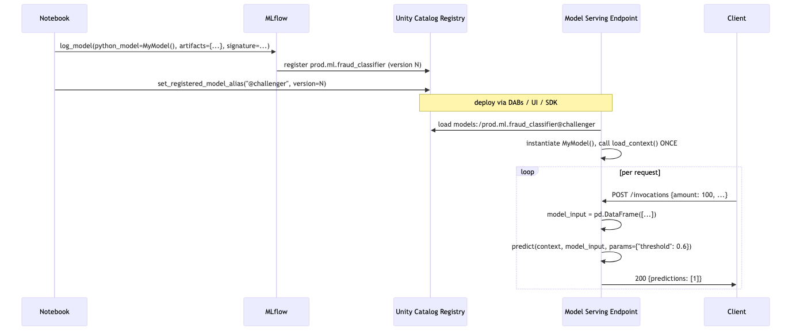

---

## Multi-model PyFunc — the ensemble pattern

When you need two models stitched together — say a classifier + a regressor, or a champion + a backup with fallback:

```python
class FraudEnsemble(mlflow.pyfunc.PythonModel):

    def load_context(self, context):
        import joblib
        self.fast_model = joblib.load(context.artifacts["fast"])
        self.slow_model = joblib.load(context.artifacts["slow"])

    def predict(self, context, model_input, params=None):
        params = params or {}
        # Fast model gives a quick probability
        fast_proba = self.fast_model.predict_proba(model_input)[:, 1]
        # Slow model only runs on borderline cases
        mask = (fast_proba > 0.3) & (fast_proba < 0.7)
        result = fast_proba.copy()
        if mask.any():
            slow_proba = self.slow_model.predict_proba(model_input[mask])[:, 1]
            result[mask] = slow_proba
        thr = params.get("threshold", 0.5)
        return (result >= thr).astype(int)

mlflow.pyfunc.log_model(
    artifact_path="ensemble",
    python_model=FraudEnsemble(),
    artifacts={
        "fast": "/tmp/fast.pkl",
        "slow": "/tmp/slow.pkl",
    },
    signature=signature,
    registered_model_name="prod.ml.fraud_ensemble",
    pip_requirements=["scikit-learn==1.4.2", "xgboost==2.0.3"],
)
```

This is the **Module 06 pattern (ensembles & stacking)** in microcosm — get comfortable with it here.

---

## Querying via REST API

For Model Serving endpoints exposing a PyFunc model:

```bash
# REST endpoint shape (Mosaic AI Model Serving)
curl -X POST "$ENDPOINT_URL/invocations" \
  -H "Authorization: Bearer $DATABRICKS_TOKEN" \
  -H "Content-Type: application/json" \
  -d '{
    "dataframe_records": [
      {"amount": 120.50, "merchant_category": "grocery"},
      {"amount": 4500.00, "merchant_category": "jewelry"}
    ],
    "params": {"threshold": 0.6}
  }'
```

```python
# Python via the MLflow Deployments SDK
from mlflow.deployments import get_deploy_client

client = get_deploy_client("databricks")
response = client.predict(
    endpoint="fraud-prod-endpoint",
    inputs={
        "dataframe_records": [
            {"amount": 120.50, "merchant_category": "grocery"},
            {"amount": 4500.00, "merchant_category": "jewelry"},
        ],
        "params": {"threshold": 0.6},
    },
)
```

Two payload shapes are accepted:

- **`dataframe_records`** — list of dicts (row-oriented; the most common).
- **`dataframe_split`** — `{"columns": [...], "data": [[...], [...]]}` (col-oriented; slightly more compact for large payloads).

⚠️ **Exam trap:** sending a raw JSON array `[{"amount": ...}, ...]` without the `dataframe_records` wrapper. Returns 400.

---

## Debugging PyFunc models — three common failures

1. **"FileNotFoundError" in `load_context`** — you referenced an artifact key that wasn't passed to `log_model`. Artifact names in `load_context` must match exactly the keys you logged.
2. **"PicklingError" at log time** — your `python_model` instance has a non-picklable attribute (e.g., a Spark session, an open DB connection). Make `load_context` do the lazy init.
3. **"ModuleNotFoundError" at serving time** — missing dependency. The model code imports a module that wasn't in `pip_requirements`. Always test load + predict in a clean env before logging.

```python
# Local sanity-check pattern
import mlflow.pyfunc
model_uri = f"runs:/{run_id}/model"
loaded = mlflow.pyfunc.load_model(model_uri)
preds = loaded.predict(X_val.iloc[:5])
print(preds)  # if this works, serving will work
```

---

## Look-alike API comparison — `mlflow.pyfunc.log_model` parameter table

The exam tests precise parameter knowledge of `mlflow.pyfunc.log_model`. Here is the full signature with the parameters you must recognize:

```python
mlflow.pyfunc.log_model(
    artifact_path="model",                  # subdirectory under the run; defaults vary by flavor
    python_model=MyModel(),                  # instance of mlflow.pyfunc.PythonModel
    artifacts={"name": "/local/path"},      # dict mapping artifact_name → local file/dir path
    code_paths=["/Workspace/repo/src/"],    # extra Python source dirs to package into the model
    signature=signature,                     # ModelSignature (REQUIRED for UC)
    input_example=X.iloc[:5],                # auto-unlocks Test UI + generates signature if absent
    conda_env=conda_dict,                    # full conda env (use for non-pip deps)
    pip_requirements=["scikit-learn==1.4.2"], # canonical: list of pinned pip pkgs
    extra_pip_requirements=["shap==0.45.0"], # escape hatch to add to whatever was inferred
    registered_model_name="cat.sch.name",   # one-shot UC registration
    metadata={"team": "fraud"},              # arbitrary key-value baked into the model
    await_registration_for=300,              # seconds to wait for UC registration to settle
)
```

| Look-alike | Difference | Exam tell |
|---|---|---|
| `mlflow.pyfunc.PythonModel` vs `mlflow.pyfunc.PythonModelContext` | The class you **subclass** vs the object **passed to** `load_context`/`predict` | You subclass `PythonModel`. You read `context.artifacts[...]` from `PythonModelContext` |
| `load_context(self, context)` vs `predict(self, context, model_input, params)` | Called once at endpoint init vs called per request | Loading model files, opening DB connections → `load_context`. Per-row prediction logic → `predict` |
| `python_model=MyModel()` vs `python_model=MyModel` | Instance vs class reference | Always pass an **instance** (with parens). The class form is silently wrong |
| `artifacts=` vs `code_paths=` | Files used at runtime via `context.artifacts[k]` vs extra Python source modules added to PYTHONPATH | A pickle / config file → `artifacts`. A shared `utils.py` that your model imports → `code_paths` |
| `pip_requirements=` vs `conda_env=` vs `extra_pip_requirements=` | Pip-only list vs full conda env spec vs additive pip overlay | Pure pip → `pip_requirements`. Need a non-pip pkg or specific Python version → `conda_env`. "Just add one more" → `extra_pip_requirements` |
| `pip_requirements=` vs `infer_pip_requirements()` | Explicit pinned list vs autodetect from current env | Production = explicit list. `infer_*` captures jupyter/pytest noise; avoid |
| `requirements.txt` vs `conda.yaml` vs `python_env.yaml` (artifacts MLflow writes) | `requirements.txt` = pip pins; `conda.yaml` = full conda env; `python_env.yaml` = Python interpreter version + pip deps (MLflow 3 default) | MLflow 3 deploys the model via `python_env.yaml`; `conda.yaml` is the older fallback |
| `mlflow.pyfunc.load_model(uri)` vs `mlflow.<flavor>.load_model(uri)` | Returns generic `PyFuncModel` with only `.predict` vs returns native object (sklearn estimator etc) | If the calling code only needs `.predict`, pyfunc. If it needs `.predict_proba`, `.feature_importances_`, etc., flavor load |
| `mlflow.pyfunc.spark_udf(spark, uri, result_type=)` vs `.predict(df)` | Spark UDF for Delta-table batch scoring vs in-process pandas predict | 50M-row Delta table → `spark_udf`. Per-row in a notebook → `.predict` |
| `dataframe_records` vs `dataframe_split` (REST payload) | Row-oriented list of dicts vs column-oriented `{columns, data}` | Most exam answer keys use `dataframe_records` |

> 🎯 **How to recognize this on the exam:** "model needs to look up features at request time" → custom PyFunc (or `FeatureEngineeringClient.log_model` if features come from a UC feature table — that path is in Module 04). "Model bundles preprocessing + threshold" → custom PyFunc. "Need to plug in a non-MLflow framework (an in-house C++ model)" → custom PyFunc.

---

## Output-prediction drills

**Drill 1 — `load_context` vs `predict` placement:**
```python
class M(mlflow.pyfunc.PythonModel):
    def predict(self, context, model_input, params=None):
        import joblib
        self.model = joblib.load(context.artifacts["m"])  # WRONG location
        return self.model.predict(model_input)
```
Q: What's the bug? What's the symptom on a 1000 RPS endpoint?
A: Model deserialization happens **per request**. p99 latency explodes (joblib.load can take 100ms+). Move the load to `load_context`.

**Drill 2 — artifact key mismatch:**
```python
mlflow.pyfunc.log_model(
    python_model=MyModel(),
    artifacts={"model_pkl": "/tmp/m.pkl"},
    ...,
)
# Inside MyModel.load_context:
joblib.load(context.artifacts["sklearn_model"])
```
Q: What happens at endpoint start?
A: `KeyError: 'sklearn_model'`. Artifact keys at log time must exactly match the keys you index in `load_context`.

**Drill 3 — dependency drift:**
```python
mlflow.pyfunc.log_model(python_model=MyModel(), artifacts={"m": "/tmp/m.pkl"},
                       pip_requirements=["scikit-learn"])  # no version pin
```
Q: What can break in 6 months?
A: At deploy time, latest sklearn is installed; if it has a breaking change (e.g., `predict_proba` shape change, deprecated API removed), the endpoint fails to start or returns subtly wrong results. **Always pin** (`scikit-learn==1.4.2`).

**Drill 4 — params at request time:**
```python
sig = ModelSignature(inputs=..., outputs=..., params=ParamSchema([ParamSpec("threshold","float",0.5)]))
mlflow.pyfunc.log_model(..., signature=sig)
# Client:
client.predict(endpoint="ep", inputs={"dataframe_records":[{"x":1}], "params":{"threshold":0.7}})
```
Q: How does `predict` receive the override?
A: As the `params` argument: `def predict(self, context, model_input, params=None)`. `params` is `{"threshold": 0.7}`. If you wrote `def predict(self, context, model_input)` (no params kwarg), MLflow silently passes the param dict but you can't access it.

**Drill 5 — REST payload shape:**
```bash
curl -X POST .../invocations -d '[{"x": 1}, {"x": 2}]'
```
Q: What does Mosaic AI Model Serving return?
A: **400 Bad Request.** The payload must be wrapped: `{"dataframe_records": [{"x":1},{"x":2}]}` or `{"dataframe_split": {"columns":["x"], "data":[[1],[2]]}}`. Raw arrays are not accepted.

---

## Decision rules

> 🎯 **"Bake preprocessing into the model" → custom PyFunc.** Preprocessing in a separate notebook fails serving (the endpoint only has the model, not the prep code). PyFunc bundles both.

> 🎯 **"Score a Delta table with this PyFunc model" → `mlflow.pyfunc.spark_udf`.** Don't do `df.toPandas()` then `.predict` — kills parallelism, OOMs on big tables.

> 🎯 **"Endpoint installs latest deps and breaks" → pin everything in `pip_requirements=`.** Never `infer_pip_requirements` in production.

> 🎯 **"Per-request override (threshold, top_k, temperature)" → declare in `ParamSchema` + accept in `predict(self, context, model_input, params=None)`.** Callers send via `"params"` block in REST payload.

> 🎯 **"Three model files in the artifact" → `artifacts={"name1": path1, "name2": path2, "name3": path3}`.** Don't smuggle them in via `code_paths`; that's for `.py` source, not pickles.

---

## End-to-end mini-scenario — PyFunc with feature lookup + threshold param + Spark batch scoring

Scenario: customer service needs to score the previous day's transactions every morning. The model does its own online-table lookup for customer features but the input row only has `customer_id, amount, ts`.

```python
import mlflow
import mlflow.pyfunc
import joblib
import pandas as pd
from databricks.feature_engineering import FeatureEngineeringClient
from mlflow.models import infer_signature
from mlflow.models.signature import ModelSignature
from mlflow.types.schema import Schema, ColSpec, ParamSchema, ParamSpec

class FraudPyFunc(mlflow.pyfunc.PythonModel):
    def load_context(self, context):
        self.model = joblib.load(context.artifacts["model"])
        self.fe = FeatureEngineeringClient()
        self.feature_table = "prod.fraud.customer_features"

    def predict(self, context, model_input: pd.DataFrame, params=None):
        params = params or {}
        thr = float(params.get("threshold", 0.5))
        # Lookup features by customer_id
        feats = self.fe.read_table(name=self.feature_table).toPandas()
        joined = model_input.merge(feats, on="customer_id", how="left").drop(columns=["customer_id", "ts"])
        proba = self.model.predict_proba(joined)[:, 1]
        return (proba >= thr).astype(int)

joblib.dump(sklearn_model, "/tmp/m.pkl")
input_schema = Schema([ColSpec("string","customer_id"), ColSpec("double","amount"), ColSpec("string","ts")])
output_schema = Schema([ColSpec("integer")])
param_schema = ParamSchema([ParamSpec("threshold","float",0.5)])
signature = ModelSignature(inputs=input_schema, outputs=output_schema, params=param_schema)

with mlflow.start_run(run_name="fraud_pyfunc_v1"):
    info = mlflow.pyfunc.log_model(
        artifact_path="model",
        python_model=FraudPyFunc(),
        artifacts={"model": "/tmp/m.pkl"},
        signature=signature,
        input_example=pd.DataFrame([{"customer_id":"c1","amount":42.0,"ts":"2026-05-23"}]),
        pip_requirements=[
            "scikit-learn==1.4.2", "pandas==2.2.1", "joblib==1.3.2",
            "databricks-feature-engineering>=0.2.0", "mlflow==3.0.0",
        ],
        registered_model_name="prod.ml.fraud_pyfunc",
    )

# Batch score yesterday's transactions
udf = mlflow.pyfunc.spark_udf(spark, "models:/prod.ml.fraud_pyfunc@champion", result_type="integer")
scored = (spark.table("prod.bronze.transactions")
          .where("ts = current_date() - INTERVAL 1 DAY")
          .withColumn("fraud_flag", udf("customer_id", "amount", "ts")))
scored.write.mode("overwrite").saveAsTable("prod.gold.fraud_predictions_yesterday")
```

This single artifact handles: feature lookup, prediction, threshold override per request, and batch scoring via Spark UDF — without duplicating any logic outside the model. **This is the exam-canonical pattern.**

---

## Mini quiz

1. Which method is called once at load time? Which is called per request?
2. You forget to pass `signature=` to `log_model`. What breaks?
3. Why is `infer_pip_requirements()` not recommended for production?
4. The endpoint is throwing `ModuleNotFoundError: shap`. What did you forget?
5. You want to score a 50M-row Delta table with a custom PyFunc model. Which API gives you parallelism for free?
6. A PyFunc model has signature `[amount, category]`. How do you call `spark_udf` correctly?
7. Why is putting `joblib.load(...)` inside `predict()` a bug?

**Answers:**

1. `load_context` runs once at load (endpoint init); `predict` runs per request.
2. UC registration fails. Workspace registry would accept it, but UC mandates signatures.
3. It captures the entire dev environment including pytest/jupyter/etc — bloated, slow to install, may pin packages incompatible with the serving runtime.
4. `shap` is imported in your model code but not in `pip_requirements=`. Add it.
5. `mlflow.pyfunc.spark_udf(spark, model_uri)` — returns a Spark UDF that parallelizes across the cluster automatically.
6. `spark_udf("amount", "category")` — positional column references in signature order.
7. `predict` is called per request; every request would deserialize the model from disk again. Massive latency hit. Do all loading in `load_context`.

---

## Sanity check

- Can you write the full `log_model` call (with artifacts, signature, pip_requirements, registered_model_name) from memory?
- Do you know when to choose custom PyFunc over a native flavor?
- Can you explain the difference between `pip_requirements`, `conda_env`, and `extra_pip_requirements`?
- Do you know two debugging patterns for "endpoint won't start"?

Move on to [Module 03 — Optuna + Ray distributed tuning](03_optuna_advanced.md).


\newpage

# Module 03 — Optuna + Ray Distributed Tuning

> **Goal of this module:** the **post-Sept-2025** answer to "How do you do hyperparameter search on Databricks?" — Optuna for the search algorithm, MLflowCallback for tracking, MLflowSparkStudy for Spark-distributed trials, and Ray Tune for everything Optuna can't express.
>
> ⚠️ **The biggest single change in the 2025 refresh:** **Hyperopt is OUT.** **Optuna is IN.** If you see Hyperopt + SparkTrials in an answer choice, it's almost always the wrong answer on the new exam. (Hyperopt still exists in the platform and you may still have legacy code using it; it's not banned. But the exam's correct-answer pattern is Optuna.)
>
> **Assumes:** Modules 01-02 (MLflow tracking, nested runs, signatures).

---

## Coverage map (verbatim Sept 30 2025 exam objectives → where taught)

| Verbatim objective | Section anchor |
|---|---|
| Perform distributed hyperparameter tuning using **Optuna** and integrate it with MLflow | "Distributing trials across the Spark cluster — `MLflowSparkStudy`" |
| Perform distributed hyperparameter tuning using **Ray** | "Ray on Databricks — when to reach for Ray instead" |
| Compare Ray and Spark for distributing ML training workloads | "Ray on Databricks" + "Spark vs Ray decision table" |
| Evaluate trade-offs between vertical and horizontal scaling for ML workloads | "Vertical vs horizontal scaling — exam objective" |
| Evaluate and select appropriate parallelization (model parallelism, data parallelism) for large-scale ML training | "Vertical vs horizontal" + "Pandas Function API" |
| Use the Pandas Function API to parallelize group-specific model training and inference | "Pandas Function API — parallel per-group training" |
| Scale distributed training pipelines using SparkML and pandas Function APIs/UDFs | This module + cross-link to Module 05 (SparkML pipelines) |

> Cross-references: Topic 09 → [Module 11 (Hyperopt — legacy)](../09_databricks_ml_associate/11_hyperopt_hyperparameter_tuning.md) for the legacy distractor pattern; Module 01 here for MLflow nested-runs prerequisite.

---

## Why Optuna replaced Hyperopt

The exam guide is explicit: *"Perform distributed hyperparameter tuning using **Optuna** and integrate it with MLflow."* and *"Perform distributed hyperparameter tuning using **Ray**."*

Why the switch in the exam:

- **Hyperopt is unmaintained.** Last meaningful release in 2021. SparkTrials was a Databricks-maintained add-on; it works but isn't getting attention.
- **Optuna is actively developed**, has a cleaner API, supports more samplers (TPE, CMA-ES, NSGA-II for multi-objective), proper pruners, and integrates with both Spark and Ray.
- **MLflow integration is first-class** via `MLflowCallback`.

For the exam, this means:

- Right answers include `Optuna`, `study.optimize(...)`, `MLflowCallback`, `MLflowSparkStudy`, `study.best_trial`, `optuna.samplers.TPESampler`.
- Wrong answers (distractors) include `Hyperopt`, `fmin`, `SparkTrials`, `hp.choice`, `tpe.suggest`.

---

## The Optuna mental model

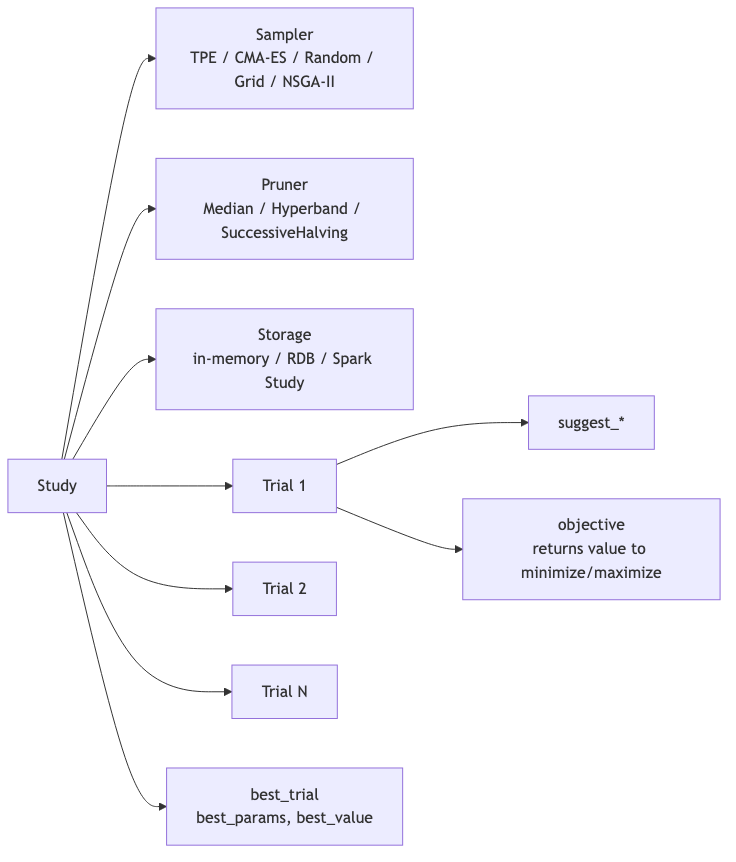

A **Study** is the top-level object. It owns a **sampler** (which decides which HPs to try next), an optional **pruner** (which decides to abandon a trial early), and a **storage** backend.

A **Trial** is one execution of your objective function with a specific set of suggested HPs.

You define an **objective function**: `def objective(trial) -> float`. Inside, you call `trial.suggest_*` to get values for each HP, train the model, return a metric.

---

## The minimal pattern — single node, MLflow-integrated

```python
import optuna
from optuna.integration.mlflow import MLflowCallback
import mlflow
import lightgbm as lgb

mlflow.set_experiment("/Users/me@org/fraud_optuna")

mlflow_callback = MLflowCallback(
    tracking_uri=mlflow.get_tracking_uri(),
    metric_name="val_auc",
    create_experiment=False,  # use the one we set above
)

def objective(trial):
    hp = {
        "n_estimators": trial.suggest_int("n_estimators", 50, 500),
        "max_depth": trial.suggest_int("max_depth", 3, 12),
        "learning_rate": trial.suggest_float("learning_rate", 1e-3, 0.3, log=True),
        "num_leaves": trial.suggest_int("num_leaves", 8, 128),
        "min_child_samples": trial.suggest_int("min_child_samples", 5, 100),
    }
    model = lgb.LGBMClassifier(**hp, random_state=42).fit(X_train, y_train)
    proba = model.predict_proba(X_val)[:, 1]
    return float(roc_auc_score(y_val, proba))

study = optuna.create_study(
    direction="maximize",
    sampler=optuna.samplers.TPESampler(seed=42),
    pruner=optuna.pruners.MedianPruner(n_warmup_steps=5),
)
study.optimize(objective, n_trials=50, callbacks=[mlflow_callback])

print("Best:", study.best_trial.value, study.best_params)
```

**What `MLflowCallback` does:**

- For each trial: starts a child MLflow run, logs the suggested HPs as params, logs the returned metric.
- Tags the run with `optuna_trial_number`, `optuna_state` (COMPLETE / PRUNED / FAILED).
- Names the metric exactly what you pass in `metric_name=`.

**What it does NOT do (memorize for the exam):**

- Does **NOT** log the trained model artifact for each trial.
- Does **NOT** register the best model.
- Does **NOT** create a parent run automatically — if you want trials nested under a parent, wrap `study.optimize` in `with mlflow.start_run(): ...`.

⚠️ **Exam trap (recurring across all Module 03 questions):** "Optuna autologging registers the best model." Wrong. You must manually re-fit on full data and `log_model` the winner with `registered_model_name=`.

---

## Distributing trials across the Spark cluster — `MLflowSparkStudy`

For Spark-cluster-distributed Optuna, the canonical answer is **`MLflowSparkStudy`** (from the Optuna-Spark integration):

```python
from optuna.integration.mlflow import MLflowCallback
from optuna_integration import MLflowSparkStudy  # or optuna.integration depending on version

study = MLflowSparkStudy(
    study_name="fraud_search_v3",
    direction="maximize",
    storage="sqlite:///optuna.db",  # or a JDBC URL for shared storage
    sampler=optuna.samplers.TPESampler(seed=42),
    spark_session=spark,
    n_parallel_trials=8,  # how many trials to run concurrently across executors
)

study.optimize(
    objective,
    n_trials=100,
    callbacks=[MLflowCallback(metric_name="val_auc")],
)
```

What this does under the hood:

1. Each trial is wrapped and submitted to the Spark cluster as a task.
2. Executors run trials in parallel up to `n_parallel_trials`.
3. The TPE sampler shares state through the `storage` backend — later trials benefit from earlier results.
4. MLflow tracking happens from the driver, so the experiment isn't fragmented across executors.

⚠️ **Exam trap:** "Use `n_jobs=-1` in `study.optimize` for distribution." That's local-multiprocess (threads on the driver), NOT cluster-distributed. For Spark distribution use `MLflowSparkStudy`.

⚠️ **Exam trap 2:** "Use SparkTrials." That's Hyperopt's distribution layer. Wrong product on the new exam.

---

## Samplers — pick by problem shape

| Sampler | When to use | Trade-off |
|---|---|---|
| **TPESampler** (default) | General-purpose; medium-dim, mixed numeric + categorical | Bayesian-style; needs ~20+ trials to start being smart |
| **CmaEsSampler** | Continuous-only, low-to-medium dim | Strong on continuous; doesn't handle categorical |
| **RandomSampler** | Baseline / comparison; very low budget | No adaptation; useful to disprove that Bayesian helps |
| **GridSampler** | Small explicit search space | No adaptation; exhaustive |
| **NSGAIISampler** | **Multi-objective** (e.g., maximize AUC AND minimize latency) | Multi-objective only; returns a Pareto front |
| **QMCSampler** | Higher-dim continuous; better coverage than random | Quasi-random; no adaptation |

```python
# Multi-objective example
def objective(trial):
    hp = {...}
    model = ...
    auc = roc_auc_score(y_val, model.predict_proba(X_val)[:, 1])
    latency = time_one_prediction(model)
    return auc, latency  # tuple!

study = optuna.create_study(
    directions=["maximize", "minimize"],  # one per objective
    sampler=optuna.samplers.NSGAIISampler(seed=42),
)
study.optimize(objective, n_trials=100)

# Result: Pareto-front trials
for t in study.best_trials:
    print(t.values, t.params)
```

⚠️ **Exam trap:** confusing `direction=` (single-objective) with `directions=` (plural, multi-objective). The plural list of directions is required for multi-objective; passing `direction=` to a multi-objective study fails.

---

## Pruners — early-stop unpromising trials

Pruners look at intermediate values you report inside the trial via `trial.report(value, step=)` and decide whether to abandon.

```python
def objective(trial):
    hp = {...}
    model = lgb.LGBMClassifier(**hp, random_state=42)
    for step in range(10):
        # Train one chunk
        model.fit(X_train_chunks[step], y_train_chunks[step], init_model=model.booster_ if step else None)
        val_auc = roc_auc_score(y_val, model.predict_proba(X_val)[:, 1])
        trial.report(val_auc, step=step)
        if trial.should_prune():
            raise optuna.TrialPruned()
    return val_auc

study = optuna.create_study(
    direction="maximize",
    pruner=optuna.pruners.HyperbandPruner(),
)
```

| Pruner | Strategy |
|---|---|
| **MedianPruner** | Prune if a trial's current value is worse than the median of completed trials at the same step |
| **SuccessiveHalvingPruner** | Allocate budget in rungs; promote top half each rung |
| **HyperbandPruner** | Bandit + successive halving across multiple brackets — typically best |
| **PercentilePruner** | Prune if below Nth percentile of completed trials at the same step |

⚠️ **Exam trap:** trying to prune a trial that doesn't report intermediate values. Pruning requires `trial.report(...)` + `trial.should_prune()` inside the objective — the pruner is otherwise inactive.

---

## Ray on Databricks — when to reach for Ray instead

The exam objective: *"Perform distributed hyperparameter tuning using Ray"* and *"Compare Ray and Spark for distributing ML training workloads."*

| Use Ray when | Use Optuna+Spark when |
|---|---|
| Distributed deep learning (PyTorch DDP, Horovod) | Tabular scikit-learn / XGBoost / LightGBM |
| RL training (Ray RLlib) | Quick HP sweeps |
| Heterogeneous resources (GPU + CPU mixed) | Spark-native data loading already in pipeline |
| Search spaces Optuna can't express (population-based training) | TPE + pruners are sufficient |
| Pipeline of fit + serve in one runtime | One-off training jobs |

### Spinning up a Ray cluster on Databricks

```python
from ray.util.spark import setup_ray_cluster, shutdown_ray_cluster
import ray

# Provision a Ray cluster on top of Spark workers
setup_ray_cluster(
    num_worker_nodes=4,
    num_cpus_per_node=8,
    num_gpus_per_node=0,
    collect_log_to_path="/dbfs/tmp/ray_logs",
)
ray.init(ignore_reinit_error=True)
```

### Ray Tune for HP search

```python
from ray import tune
from ray.tune.search.optuna import OptunaSearch

def trainable(config):
    model = lgb.LGBMClassifier(**config).fit(X_train, y_train)
    auc = roc_auc_score(y_val, model.predict_proba(X_val)[:, 1])
    tune.report({"val_auc": auc})

search_space = {
    "n_estimators": tune.randint(50, 500),
    "max_depth": tune.randint(3, 12),
    "learning_rate": tune.loguniform(1e-3, 0.3),
}

tuner = tune.Tuner(
    trainable,
    param_space=search_space,
    tune_config=tune.TuneConfig(
        search_alg=OptunaSearch(metric="val_auc", mode="max"),
        num_samples=100,
        max_concurrent_trials=8,
    ),
)
results = tuner.fit()
best = results.get_best_result(metric="val_auc", mode="max")
```

Note: **OptunaSearch** wraps Optuna as the search algorithm inside Ray Tune. Best of both worlds — Optuna's TPE sampler, Ray's distribution. The exam can ask about this combination.

### Tearing down Ray

```python
shutdown_ray_cluster()
```

⚠️ **Exam trap:** Ray cluster left running after the job. Costs DBUs. Always call `shutdown_ray_cluster()` (or use a job that auto-terminates).

---

## Vertical vs horizontal scaling — exam objective

The objective verbatim: *"Evaluate trade-offs between vertical and horizontal scaling for ML workloads."*

| Dimension | Vertical (bigger node) | Horizontal (more nodes) |
|---|---|---|
| Data fits in single-node RAM | ✓ Best fit | Overkill |
| Algorithm is single-machine (sklearn, native XGBoost) | ✓ Best fit | Must use Pandas Function API or per-group |
| Algorithm is data-parallel-friendly (SparkML, DDP) | Diminishing returns | ✓ Best fit |
| Cost predictability | High (one box) | Per-node overhead, but elastic |
| Failure blast radius | Whole job dies | Single executor retry |
| Easy debugging | ✓ Local-style | Distributed logs |

The exam's pragmatic answer: **start vertical** when data fits in RAM and the algorithm is single-machine; switch to horizontal only when the workload demands it (data > RAM, model-parallel needed, or per-group fitting at scale).

---

## Pandas Function API — parallel per-group training

The Section 1 objective: *"Use the Pandas Function API to parallelize group-specific model training and inference."*

Use case: one model per `store_id` / `region` / `customer_segment`. You have 5000 stores. You can't loop in Python; you can't push to a single sklearn fit. **Pandas Function API + `applyInPandas`** is the answer.

```python
import pandas as pd
from pyspark.sql.types import StructType, StructField, StringType, DoubleType, BinaryType
import joblib
import io
from sklearn.ensemble import RandomForestClassifier

result_schema = StructType([
    StructField("store_id", StringType()),
    StructField("auc", DoubleType()),
    StructField("model_bytes", BinaryType()),
])

def train_one_store(pdf: pd.DataFrame) -> pd.DataFrame:
    store_id = pdf["store_id"].iloc[0]
    X = pdf.drop(columns=["store_id", "y"]).values
    y = pdf["y"].values
    model = RandomForestClassifier(n_estimators=100, random_state=42).fit(X, y)
    auc = roc_auc_score(y, model.predict_proba(X)[:, 1])
    buf = io.BytesIO()
    joblib.dump(model, buf)
    return pd.DataFrame([{"store_id": store_id, "auc": float(auc), "model_bytes": buf.getvalue()}])

models_df = (
    features_df
    .groupBy("store_id")
    .applyInPandas(train_one_store, schema=result_schema)
)
```

⚠️ **Exam trap (#1 distinction):** `applyInPandas` is **group-wise** (one DataFrame per group → one DataFrame out per group). `pandas_udf` is **column-wise** (Series in, Series out). The exam asks which to use for "train one model per store" — answer: `applyInPandas`.

---

## End-to-end exam-style scenario

> "You have 5M rows of training data, 30 features, mostly numeric with a few categorical. You need to find the best LightGBM HPs in under 4 hours, log every trial to MLflow, prune weak trials early, and register the best model to UC. The cluster is a Spark cluster with 8 worker nodes. What is the correct approach?"

The exam-correct setup:

1. **Optuna** with `TPESampler` (general-purpose, handles mixed types).
2. **`HyperbandPruner`** for early-stopping (best general-purpose pruner).
3. **`MLflowCallback`** for per-trial logging.
4. **`MLflowSparkStudy`** to distribute trials across the cluster.
5. **`n_parallel_trials=8`** (= worker count, one trial per worker concurrently).
6. After the study completes, **retrain on full data with `study.best_params`** and `mlflow.lightgbm.log_model(..., registered_model_name="prod.ml.lgbm")`.
7. **Set `@challenger` alias** on the new version.

Wrong-answer flavors to recognize:

- "Use Hyperopt + SparkTrials" → legacy.
- "Use `study.optimize(n_jobs=-1)`" → local-multiprocess only.
- "MLflowCallback registers the best model automatically" → no, manual re-fit required.
- "Use `GridSampler` for 5 HPs each with 10 values" → 100,000 combinations, 4-hour budget impossible; not the right sampler.

---

## Look-alike API comparison — Optuna study + samplers + pruners

| Pair | Difference | Exam tell |
|---|---|---|
| `optuna.create_study(direction=...)` vs `directions=[...]` | Singular = one objective; plural = multi-objective | Multi-objective MUST use `directions=` and objective must return a tuple |
| `TPESampler` vs `CmaEsSampler` vs `RandomSampler` vs `GridSampler` vs `NSGAIISampler` | Bayesian general / continuous-only / no-adapt baseline / exhaustive small space / multi-objective | Default = TPE. Continuous-only = CMA-ES. Multi-objective = NSGA-II |
| `MedianPruner` vs `HyperbandPruner` vs `SuccessiveHalvingPruner` vs `PercentilePruner` | Stop below-median / bandit-style / brackets / below-Nth-percentile | Generally best out-of-box = Hyperband. Median is fine when trials report consistently |
| `study.optimize(n_jobs=-1, ...)` vs `MLflowSparkStudy` | Driver-only multiprocess vs cluster-distributed Spark tasks | "Distribute across worker nodes" → `MLflowSparkStudy`. `n_jobs` is local only |
| `MLflowCallback` vs `mlflow.autolog()` | Per-trial callback wrapping Optuna trials vs framework-level autolog of the inner `.fit` | Use **both**: callback for trial HPs+metric; autolog for fit-internal metrics (eval-set per round in LightGBM/XGBoost) |
| `trial.suggest_int(low, high)` vs `suggest_float(low, high, log=True)` vs `suggest_categorical(["a","b"])` | Integer / float (optional log scale) / discrete categorical | `learning_rate` always wants `log=True`; tree depth wants `suggest_int`; optimizer name wants `suggest_categorical` |
| `trial.report(v, step)` + `trial.should_prune()` vs no reporting | Required for pruner to act | Pruner without `report` is silently inactive |
| Optuna `study.best_trial` vs `study.best_trials` (plural) | Single best (single-objective) vs Pareto front (multi-objective) | Plural = multi-objective study returns set, not one winner |
| `study.best_trial.value` vs `study.best_trial.values` | Single objective scalar vs multi-objective tuple | Plural for multi-objective |
| `MLflowSparkStudy` storage `sqlite:///` vs JDBC/Postgres URL | Local-only (single-driver) vs shared persistent storage | Production / restart-safe = JDBC. Quick demo = sqlite |
| `applyInPandas` vs `mapInPandas` vs `pandas_udf` | Group-wise (one pdf per group, returns pdf) / iterator of pdfs row-batched / columnar Series→Series | Per-group model fitting = `applyInPandas`. Vectorized column transform = `pandas_udf`. Streaming-batched processing = `mapInPandas` |

### `study.optimize` signature — parameters worth knowing

```python
study.optimize(
    func=objective,
    n_trials=100,         # how many trials total (None = use timeout)
    timeout=3600,          # wall-clock seconds budget (None = no limit)
    n_jobs=1,              # local concurrency (driver only). -1 = all CPU. NOT cluster
    callbacks=[MLflowCallback(metric_name="val_auc")],
    gc_after_trial=False,  # force gc.collect() after each trial — useful with PyTorch/Tf
    show_progress_bar=False,
    catch=(),              # exception types to catch and mark trial FAILED instead of bombing
)
```

> 🎯 **How to recognize this on the exam:** if the answer choice mentions `SparkTrials`, `fmin`, `tpe.suggest`, `hp.choice`, `hp.uniform` — that's the **Hyperopt** API. Wrong on the new exam. Optuna = `study`, `trial.suggest_*`, `objective`, `MLflowCallback`, `MLflowSparkStudy`.

---

## Output-prediction drills

**Drill 1 — pruner without report:**
```python
study = optuna.create_study(direction="maximize", pruner=optuna.pruners.HyperbandPruner())
def objective(trial):
    hp = {"depth": trial.suggest_int("depth", 3, 10)}
    model = train_full(hp)
    return val_auc(model)
study.optimize(objective, n_trials=100)
```
Q: How many trials get pruned?
A: **Zero.** The pruner needs `trial.report(value, step)` + `if trial.should_prune(): raise optuna.TrialPruned()` inside the objective. Without intermediate reports it has no signal.

**Drill 2 — `n_jobs` vs Spark study:**
```python
study = optuna.create_study(...)
study.optimize(objective, n_trials=100, n_jobs=-1)
```
Q: On a Spark cluster with 8 workers + 1 driver, how many trials run in parallel?
A: **As many CPU cores as the driver node has**, e.g. 16 if it's a 16-core driver. Workers are idle. Use `MLflowSparkStudy(spark_session=spark, n_parallel_trials=8)` to engage workers.

**Drill 3 — multi-objective return:**
```python
def objective(trial):
    auc = ...
    latency = ...
    return auc  # single value
study = optuna.create_study(directions=["maximize", "minimize"], sampler=NSGAIISampler())
study.optimize(objective, n_trials=50)
```
Q: What happens?
A: Optuna raises `ValueError`: `directions` has 2 entries but objective returned 1 value. Fix: `return auc, latency`.

**Drill 4 — `applyInPandas` schema mismatch:**
```python
schema = StructType([StructField("store_id", StringType()), StructField("auc", DoubleType())])
def train(pdf):
    return pd.DataFrame([{"store_id": pdf["store_id"].iloc[0], "auc": 0.87, "extra": 1}])
df.groupBy("store_id").applyInPandas(train, schema=schema)
```
Q: What happens?
A: The extra column is silently dropped (schema is the contract). If you instead omit `"auc"` from the returned DF, you get a `KeyError` or null. The returned columns must be a superset of the schema columns.

**Drill 5 — registering the best:**
```python
study = optuna.create_study(direction="maximize")
study.optimize(objective, n_trials=50, callbacks=[MLflowCallback(metric_name="val_auc")])
# Author intended to "deploy the best"
```
Q: After the loop, what must the author do to deploy?
A: Re-fit on full data with `study.best_params`, then `mlflow.lightgbm.log_model(model, "model", signature=..., registered_model_name="prod.ml.lgbm")`, then set `@challenger` alias. `MLflowCallback` does **not** auto-register.

---

## Decision rules

> 🎯 **"Tabular sklearn/XGBoost/LightGBM HP search" → Optuna + `MLflowCallback` + `MLflowSparkStudy`.** Don't reach for Ray for this.

> 🎯 **"Distributed deep learning (PyTorch DDP) + HP search" → Ray Tune (with `OptunaSearch` inside if you want TPE).** Optuna alone can't orchestrate DDP.

> 🎯 **"Train one model per group (store/region/tenant)" → `applyInPandas`.** Not `pandas_udf`. Not Optuna.

> 🎯 **"Data fits in single-node RAM + single-machine algorithm" → vertical scaling.** Big driver, no Spark fit. Spark adds shuffle overhead for nothing.

> 🎯 **"Multi-objective (e.g., AUC + latency)" → NSGA-II + `directions=`.** Single-objective Optuna can't do Pareto fronts.

> 🎯 **"Stop weak trials early to save budget" → pruner + `trial.report` inside the loop.** Pruner without report does nothing.

---

## Mini quiz

1. Why is Hyperopt the wrong answer on the post-Sept-2025 exam?
2. What does `MLflowCallback` log per trial? What does it NOT log?
3. Difference between `n_jobs=-1` in `study.optimize` and `MLflowSparkStudy`?
4. You want multi-objective optimization. Which sampler, and what's the API change?
5. When would you reach for Ray over Optuna+Spark?
6. `applyInPandas` vs `pandas_udf` — when to use each?
7. After the study finishes, what do you do to deploy the winner?

**Answers:**

1. Hyperopt + SparkTrials is the legacy answer. The Sept 2025 exam guide explicitly names Optuna for distributed HP tuning. Hyperopt isn't being maintained.
2. Logs: trial HPs as params, the returned metric, `optuna_trial_number` and `optuna_state` tags. Does NOT log: trained model artifact for each trial; the best model after the study.
3. `n_jobs=-1` is local multiprocess on the driver. `MLflowSparkStudy` distributes trials across the Spark cluster as Spark tasks.
4. `NSGAIISampler`. The API change is `directions=["maximize", "minimize"]` (plural list) instead of `direction="maximize"` (singular), and the objective must return a tuple.
5. Distributed deep learning (PyTorch DDP), RL, heterogeneous resources, or search spaces Optuna can't express (population-based training, schedule learning).
6. `applyInPandas` is group-wise — one DataFrame per group, return one DataFrame per group. Use for per-group model training. `pandas_udf` is column-wise — Series in, Series out. Use for vectorized columnar transforms.
7. Retrain on full data with `study.best_params`, `log_model(..., registered_model_name="<uc-name>")`, then `client.set_registered_model_alias(name, "challenger", version)`. Optionally promote to `@champion` after staging validation.

---

## Sanity check

- Could you set up `MLflowSparkStudy` + `MLflowCallback` + `HyperbandPruner` from memory?
- Do you know when Ray Tune is right vs Optuna+Spark?
- Could you write the `applyInPandas` per-store-training template?
- Do you remember "Optuna autologging does NOT register the best model" — manual step required?

Move on to [Module 04 — Feature Engineering in UC](04_feature_engineering_uc_deep.md).


\newpage

# Module 04 — Feature Engineering in Unity Catalog (Deep)

> **Goal of this module:** master **Feature Engineering in Unity Catalog (FE-in-UC)** — the post-Sept-2025 successor to the legacy Feature Store. Five exam objectives live here: feature tables, point-in-time correctness, online tables, streaming features, and on-demand features. Together they're ~15% of the Pro exam.
>
> ⚠️ **API rename you must internalize:** `FeatureStoreClient` is **legacy**. `FeatureEngineeringClient` is **current**. The legacy `databricks-feature-store` PyPI package is deprecated; the new package is **`databricks-feature-engineering`** (≥0.2.0).

---

## Coverage map (verbatim Sept 30 2025 exam objectives → where taught)

| Verbatim objective | Section anchor |
|---|---|
| Ensure **point-in-time correctness** in feature lookups to prevent data leakage during model training and inference | "Point-in-time correctness — the canonical pattern" |
| Build automated pipelines for feature computation using the **FeatureEngineering Client** | "Creating a feature table" + "Automated pipelines" |
| Configure **online tables** for low-latency applications using Databricks SDK | "Online tables — the serving path" |
| Design scalable solutions for ingesting and processing streaming data to generate features in real time | "Streaming features" |
| Develop **on-demand features** using feature serving for consistent use across training and production environments | "On-demand features" |

> Cross-references: Topic 09 → [Module 09 (Feature Store legacy)](../09_databricks_ml_associate/09_feature_store_introduction.md) for the legacy `FeatureStoreClient` distractor pattern; Module 02 here for the manual-lookup alternative.

---

## Why FE-in-UC matters

Feature engineering is the difference between an experiment and a production system. Without a shared feature platform you get:

- **Training/serving skew.** Code computing features in the training notebook differs from the inference Lambda. The model sees one distribution at train, another at serve.
- **Duplicate computation.** Five teams compute "30-day average transaction amount" five different ways with five subtle bugs.
- **No lineage.** Audit asks "what features fed this model?" — no answer.
- **No reuse.** New team starts from zero on the same features the last team already built.

FE-in-UC solves all four. The feature table is a **Delta table in UC** with a primary key (and optional timestamp key) registered as a feature table. The `FeatureEngineeringClient` is the read/write/lookup API.

---

## The object model

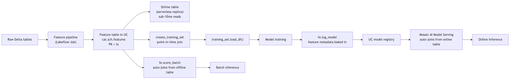

Five exam objectives live in this picture:

1. **Build automated pipelines for feature computation using the FeatureEngineering Client** — the green arrow from raw to feature table.
2. **Ensure point-in-time correctness** — the `create_training_set` step with `timestamp_lookup_key`.
3. **Configure online tables** — the offline → online replica.
4. **Streaming features** — the green arrow can be a Structured Streaming job.
5. **On-demand features** — runtime-computed features at serving time.

---

## The client

```python
from databricks.feature_engineering import FeatureEngineeringClient, FeatureLookup

fe = FeatureEngineeringClient()
```

That's it. No workspace URL, no token — it auto-detects on Databricks. **The class is `FeatureEngineeringClient`. Not `FeatureStoreClient`.** Re-read that until it sticks.

---

## Creating a feature table

```python
import pyspark.sql.functions as F

# 1. Compute features
features_df = (
    raw_transactions
    .groupBy("customer_id")
    .agg(
        F.avg("amount").alias("avg_amount_30d"),
        F.count("*").alias("txn_count_30d"),
        F.stddev("amount").alias("std_amount_30d"),
    )
    .withColumn("computed_at", F.current_timestamp())
)

# 2. Create the feature table
fe.create_table(
    name="prod.fraud.customer_features",
    primary_keys=["customer_id"],
    timestamp_keys=["computed_at"],  # optional — required for point-in-time
    df=features_df,
    description="Customer-level rolling 30-day features for fraud scoring",
    tags={"team": "fraud", "owner": "ml_platform"},
)

# 3. To append/update later
fe.write_table(
    name="prod.fraud.customer_features",
    df=new_features_df,
    mode="merge",  # or "overwrite"
)
```

**Argument semantics:**

| Arg | Meaning |
|---|---|
| `name` | Three-level UC name. Required. |
| `primary_keys` | List of columns uniquely identifying a feature row at a given timestamp. |
| `timestamp_keys` | Optional column(s) representing when the feature value is valid. Required for point-in-time lookups. |
| `df` | Initial DataFrame; the schema is captured. |
| `description` | Free-text shown in the UC UI. |
| `tags` | Key-value metadata. |

Modes for `write_table`:

- `"merge"` — upsert based on PK (most common for incremental updates).
- `"overwrite"` — replace the table.
- `"append"` — for time-series feature tables where each write is a new snapshot.

⚠️ **Exam trap:** answers that use Delta MERGE / INSERT directly to update a feature table. That works mechanically but **bypasses the feature engineering metadata** — lineage and discoverability break. Use `fe.write_table`.

---

## Point-in-time correctness — the #1 data leakage trap

The problem: you're training on historical events (transactions) and the features for each event must reflect what you would have known at that time, **not future values**.

A naive join (`features.customer_id = events.customer_id`) takes the **latest** feature value, which means future feature values leak into past training examples → model looks great offline, fails in prod.

The fix: a feature lookup with both a key and a timestamp key. The platform does an "as-of-time" join — for each event at time `T`, pick the feature row where the feature's `computed_at <= T` and is the most recent such row.

```python
from databricks.feature_engineering import FeatureLookup

# events_df has columns: event_id, customer_id, event_ts, label
feature_lookups = [
    FeatureLookup(
        table_name="prod.fraud.customer_features",
        lookup_key="customer_id",          # PK match
        timestamp_lookup_key="event_ts",   # as-of-time semantics
        feature_names=["avg_amount_30d", "txn_count_30d", "std_amount_30d"],
    ),
]

training_set = fe.create_training_set(
    df=events_df,
    feature_lookups=feature_lookups,
    label="label",
    exclude_columns=["event_id"],  # drop columns you don't want in training
)

training_df = training_set.load_df()  # materialized Spark DataFrame
```

What happens under the hood: for each row in `events_df`, the platform issues an as-of-time lookup on `prod.fraud.customer_features` where `customer_id` matches AND `computed_at <= event_ts`, picking the most recent such row. **No future feature values can leak.**

⚠️ **Exam trap:** a `FeatureLookup` without `timestamp_lookup_key`. That's a basic lookup (takes latest features). Wrong when training data has historical events.

⚠️ **Exam trap #2:** doing the join yourself in PySpark with `df.join(features, ...).filter(features.computed_at <= df.event_ts).window().rank()`. This works but isn't the canonical Databricks answer — and the exam wants the canonical answer.

---

## Training set → model logging with FE metadata

`fe.log_model` packages the feature lookup metadata into the model artifact. At inference time, callers don't need to know the features — they pass keys, and the platform looks up + joins.

```python
import mlflow
from sklearn.ensemble import GradientBoostingClassifier

# Train on the training set
training_df_pandas = training_set.load_df().toPandas()
X = training_df_pandas.drop(columns=["label"])
y = training_df_pandas["label"]
model = GradientBoostingClassifier(n_estimators=200, max_depth=5).fit(X, y)

# Log with FE — the training_set captures the feature lookup graph
with mlflow.start_run(run_name="fraud_v3"):
    fe.log_model(
        model=model,
        artifact_path="model",
        flavor=mlflow.sklearn,
        training_set=training_set,         # captures feature lookups
        registered_model_name="prod.fraud.classifier",
        infer_input_example=True,
    )
```

At inference time:

```python
# Batch — caller passes ONLY keys + label-free fields; features auto-join
scored = fe.score_batch(
    model_uri="models:/prod.fraud.classifier@champion",
    df=events_df.select("event_id", "customer_id", "event_ts"),  # no features needed
)
```

For online serving, the same model deployed to a Mosaic AI Model Serving endpoint will auto-join from the **online table** (next section).

⚠️ **Exam trap:** confusing `mlflow.<flavor>.log_model` with `fe.log_model`. The former logs the model without feature lookup metadata — inference callers must pass full feature vectors. The latter bakes in the feature lookup graph. **For real-time-feature use cases, use `fe.log_model`.**

---

## Online tables — sub-10ms feature reads

For real-time serving (a Model Serving endpoint scoring transactions as they happen), the feature table must be reachable in <10ms. Spark/Delta reads aren't fast enough. **Online tables** are UC-native, Databricks-managed serverless key-value replicas of an offline feature table.

```python
from databricks.sdk import WorkspaceClient
from databricks.sdk.service.catalog import OnlineTableSpec, OnlineTableSpecTriggeredSchedulingPolicy

w = WorkspaceClient()

w.online_tables.create(
    name="prod.fraud.customer_features_online",  # the online table's name
    spec=OnlineTableSpec(
        source_table_full_name="prod.fraud.customer_features",  # offline source
        primary_key_columns=["customer_id"],
        timeseries_key="computed_at",
        run_triggered=OnlineTableSpecTriggeredSchedulingPolicy(triggered=True),
        # Or run_continuously=OnlineTableSpecContinuousSchedulingPolicy()
    ),
)
```

**Key properties:**

- **Backed by a serverless store** — Databricks manages it; you don't see the cluster.
- **Replicates from the offline Delta table** — append/merge writes propagate automatically.
- **Sub-10ms reads** at the primary key (and timestamp, for time-series tables).
- **`run_triggered`** = manual refresh; **`run_continuously`** = streaming pipeline keeps the online table fresh.

⚠️ **Exam trap:** "Online Stores backed by DynamoDB or Cosmos DB." That's the **legacy** offering, deprecated. **Online Tables are the UC-native replacement.**

⚠️ **Exam trap 2:** writing directly to the online table. You don't. **You write to the offline Delta table; replication keeps the online copy in sync.**

---

## On-demand features — eliminate training/serving skew for runtime computations

Some features can only be computed at request time — e.g., "distance from the user's current location to the merchant" requires the user's current location which arrives in the request payload.

The naive approach (compute it in two places) creates skew. **On-demand features** are Python functions decorated with `@feature_function` that the platform runs at both training and serving time — same code, no skew.

```python
from databricks.feature_engineering import feature_function

@feature_function
def haversine_distance(lat1: float, lon1: float, lat2: float, lon2: float) -> float:
    """Compute haversine distance in km."""
    import math
    R = 6371.0
    phi1, phi2 = math.radians(lat1), math.radians(lat2)
    dphi = math.radians(lat2 - lat1)
    dlam = math.radians(lon2 - lon1)
    a = math.sin(dphi / 2) ** 2 + math.cos(phi1) * math.cos(phi2) * math.sin(dlam / 2) ** 2
    return 2 * R * math.asin(math.sqrt(a))
```

Reference it as a `FeatureFunction` in the training set:

```python
from databricks.feature_engineering import FeatureFunction

feature_lookups = [
    FeatureLookup(
        table_name="prod.fraud.merchant_features",
        lookup_key="merchant_id",
        feature_names=["merchant_lat", "merchant_lon"],
    ),
    FeatureFunction(
        udf_name="prod.fraud.haversine_distance",
        input_bindings={
            "lat1": "user_lat",            # from request
            "lon1": "user_lon",            # from request
            "lat2": "merchant_lat",        # from looked-up merchant_features
            "lon2": "merchant_lon",
        },
        output_name="distance_km",
    ),
]
```

At training time, the platform executes `haversine_distance` row-wise on the training DataFrame. At serving time, the **same function** runs inside the endpoint on each request. No skew possible.

⚠️ **Exam trap:** computing the on-demand feature in the model's `predict()` method. That works for inference but means training uses a different code path → skew. On-demand features unify both.

---

## Streaming features — real-time feature computation

Use case: you want a feature like "transactions in the last 5 minutes" to be fresh at inference time. Compute it in a Structured Streaming job that writes to the feature table.

```python
streaming_features = (
    spark.readStream
    .format("delta")
    .table("raw.transactions")
    .withWatermark("event_ts", "10 minutes")
    .groupBy(
        F.window("event_ts", "5 minutes"),
        "customer_id",
    )
    .agg(
        F.count("*").alias("txn_count_5m"),
        F.sum("amount").alias("amount_sum_5m"),
    )
    .withColumn("computed_at", F.col("window.end"))
    .drop("window")
)

# Write to the feature table
fe.write_table(
    name="prod.fraud.customer_features_streaming",
    df=streaming_features,
    mode="merge",  # upsert by (customer_id, computed_at)
    # For streaming, you must also configure checkpoint location via the trigger
    checkpoint_location="/dbfs/checkpoints/fraud_features_streaming",
    trigger={"processingTime": "30 seconds"},
)
```

Couple this with an **online table in continuous mode** (`run_continuously=...`) and inference latency stays low while features stay fresh.

⚠️ **Exam trap:** assuming `fe.write_table` with a streaming DataFrame "just works" without checkpoint + trigger config. Structured Streaming requires both.

---

## Automated feature pipelines — Section 1 objective

The objective: *"Build automated pipelines for feature computation using the FeatureEngineering Client."*

The canonical pattern is a **Lakeflow Job** (a scheduled DAG) where:

1. Task 1: read raw Delta tables.
2. Task 2: compute features (group-by, window functions, joins).
3. Task 3: `fe.write_table(..., mode="merge")` to the feature table.
4. Task 4 (optional): refresh dependent online tables.
5. Task 5 (optional): run Lakehouse Monitoring on the feature table to detect drift early.

Express this as a DAB resource (covered in Module 08) so the pipeline ships with code review and reproducible deploys.

---

## Lookup precedence and column collisions

When `create_training_set` combines a label DataFrame, feature lookups, and feature functions, columns must not collide. The platform's rules:

1. **Label DataFrame columns** are kept (except those in `exclude_columns`).
2. **FeatureLookup columns** come from the feature tables; renamed via `rename_outputs={"old": "new"}` if collision.
3. **FeatureFunction outputs** named via `output_name=`.
4. If both a label-df column and a lookup have the same name, the training set errors out — you must `exclude_columns` or rename.

```python
FeatureLookup(
    table_name="...",
    lookup_key="customer_id",
    feature_names=["score"],
    rename_outputs={"score": "customer_score"},
)
```

⚠️ **Exam trap:** assuming the platform silently resolves collisions in favor of the feature table (or the label df). It errors — be explicit.

---

## Look-alike API comparison — `FeatureEngineeringClient` surface

| Pair | Difference | Exam tell |
|---|---|---|
| `FeatureEngineeringClient` vs `FeatureStoreClient` | Current vs legacy | Sept 2025 exam always answers `FeatureEngineeringClient` |
| `fe.create_table(name, primary_keys, timestamp_keys=, df=)` vs `fe.create_feature_table(...)` (deprecated) | New vs old method name | The `create_feature_table` name was the legacy `FeatureStoreClient` form — wrong on the new exam |
| `fe.write_table(mode="merge")` vs `mode="overwrite")` vs `mode="append"` | Upsert on PK vs full replace vs append-only (allows duplicates) | Continuous updates from streaming → `merge`. Full daily rebuild → `overwrite`. Audit-style logs → `append` |
| `FeatureLookup(table_name, lookup_key, timestamp_lookup_key=)` vs without `timestamp_lookup_key` | Point-in-time as-of join vs latest-only join | Training on historical events → MUST include `timestamp_lookup_key`. Inference with current state → without is fine |
| `fe.create_training_set(...).load_df()` vs reading the feature table directly | Joins label DF with features by lookup (PIT-aware) vs raw read | Use `create_training_set` whenever the model has feature lookups; the metadata gets baked into the model |
| `fe.log_model(model, artifact_path, flavor=, training_set=, registered_model_name=)` vs `mlflow.sklearn.log_model(...)` | Packages feature lookup graph for auto-join at serve time vs plain MLflow log | If callers should pass only **keys** at inference, `fe.log_model`. If they pass features, plain MLflow log |
| `fe.score_batch(model_uri, df)` vs `fe.score_streaming(...)` vs Mosaic AI REST endpoint | Batch Spark scoring with auto feature join / streaming inference / real-time serving | Section 1 sample question pattern: "score 100M-row table" → `score_batch` |
| Online table modes: `Triggered` vs `Continuous` vs `Snapshot` (one-time copy) | On-demand refresh / streaming sync / one-time | Sub-second freshness → `Continuous`. Daily refresh → `Triggered`. Static lookup → `Snapshot` |
| `@feature_function` (on-demand feature) vs precomputed feature in the offline table | Computed at training-AND-serving time from inputs vs computed once and stored | If the input is only known at request time (haversine from user location), MUST be on-demand. Otherwise precomputed is cheaper |
| `OnlineTableSpec` + `WorkspaceClient.online_tables.create` vs UI | SDK programmatic vs manual creation | DAB-deployable → SDK |
| `fe.write_table(checkpoint_location=, trigger=)` (streaming) vs without (batch) | Structured Streaming write vs static write | Streaming DF requires both. Static DF rejects them |

### Full `fe.create_table` signature

```python
fe.create_table(
    name="cat.sch.tbl",
    primary_keys=["customer_id"],           # required; can be composite
    timestamp_keys=["computed_at"],         # optional; enables point-in-time lookups
    df=features_df,                          # optional; if omitted, creates an empty table
    schema=schema,                           # optional; required if df is None
    partition_columns=["region"],            # optional; for offline-table partitioning
    description="...",                       # for governance
    tags={"team": "fraud", "owner": "ml"},   # UC tags
)
```

> 🎯 **How to recognize this on the exam:** "training data leakage from future feature values" → `timestamp_lookup_key`. "Real-time inference requires features fresh in seconds" → online table in **continuous** mode. "Model artifact should auto-join features at scoring time" → `fe.log_model` with `training_set=`. "Compute haversine from user's current location at request time" → `@feature_function`.

---

## Output-prediction drills

**Drill 1 — PIT correctness:**
```python
# event at 2026-05-01 10:00
# feature table rows for customer_id=42:
#   2026-04-30 23:00  ->  avg_amount_30d = 100
#   2026-05-01 11:00  ->  avg_amount_30d = 250  (computed AFTER the event)
training_set = fe.create_training_set(
    df=events,
    feature_lookups=[FeatureLookup(
        table_name="prod.fraud.customer_features",
        lookup_key="customer_id",
        timestamp_lookup_key="event_ts",
    )],
    label="is_fraud",
)
```
Q: Which `avg_amount_30d` is joined to the event?
A: **100** (the 2026-04-30 23:00 row). PIT picks the most recent row with `computed_at <= event_ts`. The 2026-05-01 11:00 row would leak future info.

**Drill 2 — `timestamp_lookup_key` omitted:**
Same setup, but without `timestamp_lookup_key`. What gets joined?
A: The **latest** feature row available at training time — likely the 2026-05-01 11:00 row, which is **future data leakage** if the event is in the past. Classic training/serving skew bug.

**Drill 3 — online table write:**
```python
w.online_tables.create(name="prod.fraud.customer_features_online", spec=OnlineTableSpec(
    source_table_full_name="prod.fraud.customer_features",
    primary_key_columns=["customer_id"],
    perform_full_copy=True,
    run_continuously={},
))
fe.write_table(name="prod.fraud.customer_features_online", df=new_features, mode="merge")
```
Q: Does the write succeed?
A: **No.** Online tables are read-only replicas. Write to the **offline source** (`prod.fraud.customer_features`) and the continuous-mode replica syncs automatically.

**Drill 4 — `fe.log_model` consumer contract:**
```python
fe.log_model(model=sk_model, artifact_path="m", flavor=mlflow.sklearn,
             training_set=ts, registered_model_name="prod.ml.fraud")
# Caller:
client.predict(endpoint="ep", inputs={"dataframe_records": [{"customer_id": "c1"}]})
```
Q: What payload does the endpoint actually expect (just the keys, or the full feature row)?
A: **Just the keys** (and any non-lookup columns). The endpoint auto-joins features from the **online table** at request time. If you'd used `mlflow.sklearn.log_model` instead, the caller would have to pass all feature columns.

**Drill 5 — on-demand feature decorator:**
```python
from databricks.feature_engineering import feature_function
@feature_function
def haversine(user_lat: float, user_lon: float, merchant_lat: float, merchant_lon: float) -> float:
    ...
```
Q: When is this computed at training time vs inference time?
A: **Both**. The same Python function runs in the training pipeline (when `fe.create_training_set` includes it via `FeatureFunction(...)`) and at serving time (Mosaic AI Model Serving invokes it per-request). One code path, zero skew.

---

## Decision rules

> 🎯 **"Train on historical events, predict at current time" → `timestamp_lookup_key` is mandatory.** Without it you leak future feature values.

> 🎯 **"Sub-10ms feature read at serving time" → online table in continuous mode.** Offline-only Delta reads are too slow.

> 🎯 **"Feature is a function of request-time inputs (user location, request payload)" → on-demand feature via `@feature_function`.** Precomputed table can't capture it.

> 🎯 **"Caller passes only keys at inference" → `fe.log_model(training_set=)`.** This bakes the feature lookup graph into the artifact.

> 🎯 **"Batch score 100M rows with feature joins" → `fe.score_batch(model_uri, df)`.** Don't do `model.predict(df.toPandas())`.

> 🎯 **Distractor: any answer naming `FeatureStoreClient`, `databricks-feature-store`, `create_feature_table`** → legacy and wrong on the Sept 2025 exam.

---

## End-to-end mini-scenario — full FE-in-UC pipeline

Scenario: build a fraud feature pipeline with offline+online tables, on-demand haversine, point-in-time training, and serving-time auto-join.

```python
import pyspark.sql.functions as F
from databricks.feature_engineering import (
    FeatureEngineeringClient, FeatureLookup, FeatureFunction, feature_function,
)
from databricks.sdk import WorkspaceClient
from databricks.sdk.service.catalog import OnlineTableSpec, OnlineTableSpecContinuousSchedulingPolicy

fe = FeatureEngineeringClient()
w = WorkspaceClient()

# 1. Compute & create offline feature table
features = (spark.table("raw.transactions")
            .groupBy("customer_id")
            .agg(F.avg("amount").alias("avg_amount_30d"),
                 F.count("*").alias("txn_count_30d"))
            .withColumn("computed_at", F.current_timestamp()))
fe.create_table(name="prod.fraud.customer_features",
                primary_keys=["customer_id"],
                timestamp_keys=["computed_at"],
                df=features)

# 2. Provision online replica in continuous mode
w.online_tables.create(
    name="prod.fraud.customer_features_online",
    spec=OnlineTableSpec(
        source_table_full_name="prod.fraud.customer_features",
        primary_key_columns=["customer_id"],
        timeseries_key="computed_at",
        run_continuously=OnlineTableSpecContinuousSchedulingPolicy(),
    ),
)

# 3. On-demand feature
@feature_function
def haversine(user_lat: float, user_lon: float, merchant_lat: float, merchant_lon: float) -> float:
    from math import radians, cos, sin, asin, sqrt
    dlat, dlon = radians(merchant_lat - user_lat), radians(merchant_lon - user_lon)
    a = sin(dlat/2)**2 + cos(radians(user_lat))*cos(radians(merchant_lat))*sin(dlon/2)**2
    return 2 * 6371 * asin(sqrt(a))

# 4. PIT training set
events = spark.table("prod.bronze.fraud_events_labeled")  # has event_ts + lat/lon
training_set = fe.create_training_set(
    df=events,
    feature_lookups=[FeatureLookup(
        table_name="prod.fraud.customer_features",
        lookup_key="customer_id",
        timestamp_lookup_key="event_ts",  # ← PIT
    )],
    feature_functions=[FeatureFunction(
        udf_name="prod.fraud.haversine",
        input_bindings={"user_lat":"user_lat","user_lon":"user_lon",
                        "merchant_lat":"merchant_lat","merchant_lon":"merchant_lon"},
        output_name="distance_km",
    )],
    label="is_fraud",
    exclude_columns=["event_ts"],
)

training_pdf = training_set.load_df().toPandas()
X, y = training_pdf.drop(columns=["is_fraud"]), training_pdf["is_fraud"]
import lightgbm as lgb
model = lgb.LGBMClassifier().fit(X, y)

# 5. Log model with feature lookup metadata
fe.log_model(model=model, artifact_path="model", flavor=mlflow.lightgbm,
             training_set=training_set,
             registered_model_name="prod.ml.fraud_with_features")

# 6. At serving time callers only send keys + on-demand inputs:
#    {"customer_id": "c1", "user_lat": ..., "user_lon": ..., "merchant_lat": ..., "merchant_lon": ...}
#    Mosaic AI auto-joins avg_amount_30d, txn_count_30d from online table; haversine runs in-request.
```

This pattern eliminates training/serving skew, supports sub-10ms inference, and keeps a single source of truth for feature definitions. **This is the exam-canonical Section 1 FE story.**

---

## Mini quiz

1. What's the difference between `FeatureStoreClient` and `FeatureEngineeringClient`?
2. You're training on 6 months of historical events. What single argument prevents future feature values from leaking?
3. You need a sub-10ms feature lookup at serving time. What do you create?
4. Online table — do you write to it directly, or to its offline source?
5. When would you use a `@feature_function` decorator instead of just precomputing the feature?
6. `fe.log_model` vs `mlflow.sklearn.log_model` — when does the difference matter?
7. You have an event at `event_ts = 2026-05-01 10:00:00`. The feature table has rows at `computed_at = 2026-04-30 23:00:00` and `computed_at = 2026-05-01 11:00:00`. Which feature row is used?

**Answers:**

1. `FeatureStoreClient` is the **legacy** API from the deprecated `databricks-feature-store` package. `FeatureEngineeringClient` is the **current** API from `databricks-feature-engineering` (≥0.2.0). On the exam, `FeatureEngineeringClient` is always the right answer.
2. `timestamp_lookup_key="event_ts"` on the `FeatureLookup`. This enforces an as-of-time join.
3. An **online table** replicating the offline feature table, primary-keyed for fast lookup.
4. Write to the **offline source** Delta table. The online table is a managed replica; direct writes aren't supported. Streaming jobs in continuous mode or triggered refreshes keep the online copy in sync.
5. When the feature must be computed from data only available at request time (request-payload-derived features like haversine distance from a user's location). Computing only in training creates skew; computing only in serving means training can't see it. `@feature_function` unifies both paths.
6. When you want feature lookups baked into the model artifact so callers don't pass features (only keys). `fe.log_model` packages the feature lookup graph; `mlflow.sklearn.log_model` doesn't. Real-time serving with online tables relies on `fe.log_model`.
7. The row at `computed_at = 2026-04-30 23:00:00`. As-of-time semantics: pick the most recent feature row where `computed_at <= event_ts`. The 2026-05-01 11:00 row is in the future relative to the event and excluded.

---

## Sanity check

- Could you write `fe.create_table` + `fe.write_table(mode="merge")` from memory?
- Do you know the exact API for a point-in-time `FeatureLookup`?
- Can you explain why online tables replaced Online Stores (DynamoDB/Cosmos)?
- Do you remember that `@feature_function` runs the same code at training and serving?
- Can you sketch a streaming feature pipeline that keeps an online table fresh?

Move on to [Module 05 — Advanced Spark ML](05_advanced_spark_ml.md).


\newpage

# Module 05 — Advanced Spark ML

> **Goal of this module:** the seven Spark ML objectives in Section 1 — when to use Spark ML at all, how to build pipelines, custom transformers/estimators, CrossValidator with parallelism, custom evaluators, and SparkML model selection for batch vs streaming vs real-time.
>
> **Assumes:** Topic 09 (Associate) — you know `VectorAssembler`, `LogisticRegression`, basic `Pipeline`. This module is what the Pro exam adds.

---

## Coverage map (verbatim Sept 30 2025 exam objectives → where taught)

| Verbatim objective | Section anchor |
|---|---|
| Identify when SparkML is recommended based on the data, model, and use case requirements | "When to use Spark ML — the gating question" |
| Construct an ML pipeline using SparkML | "The Pipeline / Estimator / Transformer trio" |
| Apply the appropriate estimator and/or transformer given a use case | "Estimator/transformer catalog" |
| Tune a SparkML model using MLlib | "CrossValidator + parallelism math" |
| Evaluate a SparkML model | "Evaluators" |
| Score a Spark ML model for a batch or streaming use case | "Batch and streaming inference with SparkML" |
| Select SparkML model or single node model for an inference based on type: batch, real-time, streaming | "SparkML vs single-node — inference-time decision" |

> Cross-references: Topic 09 → [Module 13 (Spark ML pipelines basics)](../09_databricks_ml_associate/13_spark_ml_basics.md); Module 03 here for the Pandas Function API alternative to SparkML when training one model per group.

---

## When to use Spark ML — the gating question

The exam objective: *"Identify when SparkML is recommended based on the data, model, and use case requirements."*

Spark ML is the right answer when **at least one of these** is true:

- Training data exceeds single-node RAM (typical threshold: > 50 GB).
- The dataset is already a Spark DataFrame from Delta and converting to pandas is wasteful.
- You need batch inference at scale and want to stay in PySpark all the way through.
- The algorithm is natively distributable (linear models, GBT, ALS, K-means) — not a deep network.

Spark ML is the **wrong answer** when:

- Data fits comfortably on one node — single-node sklearn / XGBoost / LightGBM is faster, has better APIs, and you avoid Spark overhead.
- You need a deep network — use PyTorch/Tensorflow + Ray Train / Horovod.
- You need cutting-edge boosting (sklearn-style XGBoost, LightGBM, CatBoost native APIs).

⚠️ **Exam trap:** answer choices that frame "10 GB of data, train a logistic regression" as a Spark ML use case. 10 GB easily fits on a `Standard_E32d_v5` (256 GB RAM). Single-node sklearn is faster.

---

## The Pipeline / Estimator / Transformer trio

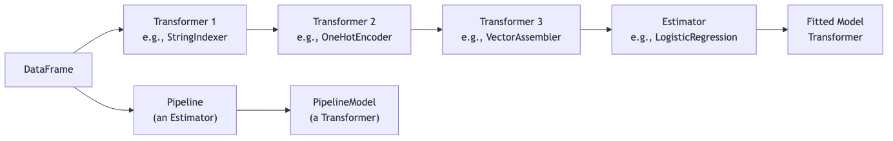

- **Transformer** — has `.transform(df) -> df`. Either pre-fit or learned (e.g., `StringIndexerModel`).
- **Estimator** — has `.fit(df) -> Transformer`. Has learnable state.
- **Pipeline** — an estimator. Its `.fit` returns a `PipelineModel` (a transformer).

The exam tests whether you can identify which is which in code, and which APIs are valid:

```python
# Right: pipeline.fit returns a transformer
pipeline_model = pipeline.fit(train_df)
predictions = pipeline_model.transform(test_df)

# Wrong: pipeline.transform — Pipeline is an estimator, has no .transform
# pipeline.transform(test_df)  # AttributeError

# Right: persist the fitted pipeline
pipeline_model.write().overwrite().save("dbfs:/models/fraud_pipeline_v3")

# Right: load
from pyspark.ml import PipelineModel
loaded = PipelineModel.load("dbfs:/models/fraud_pipeline_v3")
```

⚠️ **Exam trap:** calling `.transform` on an unfit Pipeline, or `.fit` on a fitted PipelineModel. The exam can include both as distractors in the same question.

---

## Building an ML pipeline — Section 1 objective

```python
from pyspark.ml import Pipeline
from pyspark.ml.feature import StringIndexer, OneHotEncoder, VectorAssembler, StandardScaler
from pyspark.ml.classification import GBTClassifier

# Categorical: index then one-hot
cat_cols = ["merchant_category", "country_code"]
indexers = [
    StringIndexer(inputCol=c, outputCol=f"{c}_idx", handleInvalid="keep")
    for c in cat_cols
]
encoders = [
    OneHotEncoder(inputCols=[f"{c}_idx" for c in cat_cols],
                  outputCols=[f"{c}_oh" for c in cat_cols])
]

# Assemble all feature columns
num_cols = ["amount", "txn_count_30d", "avg_amount_30d"]
assembler = VectorAssembler(
    inputCols=num_cols + [f"{c}_oh" for c in cat_cols],
    outputCol="features_raw",
    handleInvalid="keep",
)
scaler = StandardScaler(inputCol="features_raw", outputCol="features", withMean=True, withStd=True)

# Estimator
gbt = GBTClassifier(
    featuresCol="features",
    labelCol="label",
    maxDepth=5,
    maxIter=100,
    stepSize=0.05,
    seed=42,
)

pipeline = Pipeline(stages=indexers + encoders + [assembler, scaler, gbt])
model = pipeline.fit(train_df)
predictions = model.transform(test_df)
```

**`handleInvalid` is exam-relevant.** Options:

- `"error"` (default for some, `"keep"` for others — check per-class) — throws on unseen categories at transform time.
- `"keep"` — assigns a "special" index for unseen.
- `"skip"` — drops rows.

For a production model that may encounter new categories at inference, `handleInvalid="keep"` on `StringIndexer` (and `handleInvalid="keep"` on `VectorAssembler` for nulls) is the safe choice.

⚠️ **Exam trap:** an answer that uses `handleInvalid="error"` for a production scoring pipeline. New categories will crash inference.

---

## Custom transformers and estimators

Sometimes built-in transformers aren't enough — you have a domain-specific feature (e.g., "winsorize at 99th percentile"). Custom transformers extend `Transformer` and implement `_transform`:

```python
from pyspark.ml import Transformer
from pyspark.ml.param.shared import HasInputCol, HasOutputCol
from pyspark.ml.util import DefaultParamsReadable, DefaultParamsWritable
from pyspark.sql import DataFrame
import pyspark.sql.functions as F

class Winsorizer(Transformer, HasInputCol, HasOutputCol, DefaultParamsReadable, DefaultParamsWritable):
    def __init__(self, inputCol=None, outputCol=None, p_low=0.01, p_high=0.99):
        super().__init__()
        self._setDefault(inputCol=None, outputCol=None)
        self.p_low = p_low
        self.p_high = p_high
        self._set(inputCol=inputCol, outputCol=outputCol)

    def _transform(self, df: DataFrame) -> DataFrame:
        in_col = self.getInputCol()
        out_col = self.getOutputCol()
        # Compute percentiles on the input column
        low, high = df.approxQuantile(in_col, [self.p_low, self.p_high], 0.001)
        return df.withColumn(
            out_col,
            F.when(F.col(in_col) < low, low)
             .when(F.col(in_col) > high, high)
             .otherwise(F.col(in_col)),
        )
```

For a custom **estimator** (something with learnable state), extend `Estimator` and implement `_fit` returning a fitted transformer:

```python
from pyspark.ml import Estimator, Model

class WinsorizerModel(Model, HasInputCol, HasOutputCol, DefaultParamsReadable, DefaultParamsWritable):
    def __init__(self, inputCol=None, outputCol=None, low=None, high=None):
        super().__init__()
        self.low = low
        self.high = high
        self._set(inputCol=inputCol, outputCol=outputCol)

    def _transform(self, df):
        in_col, out_col = self.getInputCol(), self.getOutputCol()
        return df.withColumn(
            out_col,
            F.when(F.col(in_col) < self.low, self.low)
             .when(F.col(in_col) > self.high, self.high)
             .otherwise(F.col(in_col)),
        )

class WinsorizerEstimator(Estimator, HasInputCol, HasOutputCol):
    def __init__(self, inputCol=None, outputCol=None, p_low=0.01, p_high=0.99):
        super().__init__()
        self.p_low, self.p_high = p_low, p_high
        self._set(inputCol=inputCol, outputCol=outputCol)

    def _fit(self, df):
        low, high = df.approxQuantile(self.getInputCol(), [self.p_low, self.p_high], 0.001)
        return WinsorizerModel(
            inputCol=self.getInputCol(),
            outputCol=self.getOutputCol(),
            low=low,
            high=high,
        )
```

**Why this matters for the exam:** *"Construct an ML pipeline using SparkML"* explicitly. Pipelines accept any `Transformer` or `Estimator` — including your custom ones.

`DefaultParamsReadable` and `DefaultParamsWritable` are the mixins that let your custom transformer serialize as part of a `PipelineModel`. Without them, you can't save the fitted pipeline.

⚠️ **Exam trap:** answer choices that say "custom transformers can't be saved." False — with `DefaultParamsReadable/Writable`, they can.

---

## CrossValidator with parallelism

Spark ML's HP tuning APIs:

- **`CrossValidator`** — K-fold CV across an HP grid.
- **`TrainValidationSplit`** — single train/val split across the grid (faster, less robust).

```python
from pyspark.ml.tuning import CrossValidator, ParamGridBuilder, TrainValidationSplit
from pyspark.ml.evaluation import BinaryClassificationEvaluator

evaluator = BinaryClassificationEvaluator(
    rawPredictionCol="rawPrediction",
    labelCol="label",
    metricName="areaUnderROC",
)

param_grid = (
    ParamGridBuilder()
    .addGrid(gbt.maxDepth, [3, 5, 7])
    .addGrid(gbt.maxIter, [50, 100, 200])
    .addGrid(gbt.stepSize, [0.05, 0.1])
    .build()
)

cv = CrossValidator(
    estimator=pipeline,
    estimatorParamMaps=param_grid,
    evaluator=evaluator,
    numFolds=3,
    parallelism=4,   # ← exam-relevant
    seed=42,
)
cv_model = cv.fit(train_df)
best_pipeline = cv_model.bestModel
```

**`parallelism=4`** — fit up to 4 models concurrently across the HP grid. The default is 1 (sequential).

When does `parallelism > 1` help?

- Cluster has enough idle resources (CPU/memory not saturated by a single training job).
- HP combinations are independent.

When does it hurt?

- Each training job already saturates the cluster (e.g., large GBT). Parallelism causes contention, slows everything.
- Driver memory bottleneck.

Rule of thumb: `parallelism = min(num_executors, 4)`. Higher rarely helps; on large pipelines, start at 2.

⚠️ **Exam trap:** "`parallelism=10` for a 3-fold CV with a 6-combination grid" — at most 18 models train, but 10× parallelism only helps if the cluster has 10× the resources of one job. Usually wrong on the exam unless the cluster is explicitly huge.

---

## Custom evaluators

Built-in evaluators:

- `BinaryClassificationEvaluator` — `areaUnderROC`, `areaUnderPR`.
- `MulticlassClassificationEvaluator` — `f1`, `weightedPrecision`, `accuracy`, `logLoss`.
- `RegressionEvaluator` — `rmse`, `mae`, `mse`, `r2`.
- `ClusteringEvaluator` — `silhouette`.

For domain-specific metrics, write a custom evaluator:

```python
from pyspark.ml.evaluation import Evaluator
from pyspark.ml.util import DefaultParamsReadable, DefaultParamsWritable
import pyspark.sql.functions as F

class CostSensitiveEvaluator(Evaluator, DefaultParamsReadable, DefaultParamsWritable):
    """Custom evaluator: total dollar cost of misclassifications.
    Lower is better."""
    def __init__(self, predictionCol="prediction", labelCol="label",
                 amountCol="amount", fn_cost_mult=1.0, fp_cost_mult=0.1):
        super().__init__()
        self.predictionCol = predictionCol
        self.labelCol = labelCol
        self.amountCol = amountCol
        self.fn_cost_mult = fn_cost_mult
        self.fp_cost_mult = fp_cost_mult

    def _evaluate(self, dataset):
        cost_expr = (
            F.when((F.col(self.labelCol) == 1) & (F.col(self.predictionCol) == 0),
                   F.col(self.amountCol) * self.fn_cost_mult)
             .when((F.col(self.labelCol) == 0) & (F.col(self.predictionCol) == 1),
                   F.col(self.amountCol) * self.fp_cost_mult)
             .otherwise(0.0)
        )
        return float(dataset.select(F.sum(cost_expr)).collect()[0][0] or 0.0)

    def isLargerBetter(self):
        return False  # lower cost is better
```

`isLargerBetter()` is consulted by `CrossValidator` to decide which HP set wins.

⚠️ **Exam trap:** forgetting `isLargerBetter()` for a "lower is better" custom evaluator. CrossValidator will pick the wrong "best" model.

---

## Batch vs streaming vs real-time — picking the right Spark ML path

Section 1 objective: *"Select SparkML model or single node model for an inference based on type: batch, real-time, streaming."*

| Inference type | Right choice | Why |
|---|---|---|
| **Batch** (nightly scoring of 100M rows) | SparkML or single-node-via-`spark_udf` | Spark distributes; data already in Delta |
| **Streaming** (Structured Streaming inference) | SparkML or `mlflow.pyfunc.spark_udf` | Streaming UDFs work seamlessly; per-microbatch latency in seconds |
| **Real-time** (synchronous, per-request, p50 < 100ms) | **Single-node model on Mosaic AI Model Serving** | Spark startup cost is too high; serving endpoints expect single-node |

**The exam-trap subtle one:** SparkML models can run on a single-node endpoint via the MLflow Spark flavor, but the runtime cost of loading a SparkSession on each replica is high. For real-time, prefer sklearn / XGBoost / LightGBM artifacts and use Spark only for batch and streaming.

```python
# Batch inference with a SparkML PipelineModel — natural fit
predictions = pipeline_model.transform(big_delta_df)

# Batch inference with a single-node sklearn model via spark_udf — also natural
spark_udf = mlflow.pyfunc.spark_udf(spark, "models:/prod.fraud.classifier@champion")
predictions = big_delta_df.withColumn("pred", spark_udf("amount", "category"))

# Streaming inference — same spark_udf works on streaming DataFrames
streaming_predictions = (
    spark.readStream.format("delta").table("events")
    .withColumn("pred", spark_udf("amount", "category"))
)
streaming_predictions.writeStream.format("delta").outputMode("append") \
    .toTable("scored_events")
```

⚠️ **Exam trap:** "Use SparkML for real-time low-latency inference." Wrong — Spark overhead dominates. Use single-node + Mosaic AI Model Serving.

---

## Scoring a Spark ML model — pitfalls

Saving and loading SparkML pipelines:

```python
# Save
pipeline_model.write().overwrite().save("dbfs:/models/fraud_pipeline_v3")
# Load
from pyspark.ml import PipelineModel
loaded = PipelineModel.load("dbfs:/models/fraud_pipeline_v3")
```

But the **MLflow-tracked** path is preferred:

```python
import mlflow.spark
with mlflow.start_run():
    mlflow.spark.log_model(
        spark_model=pipeline_model,
        artifact_path="model",
        signature=infer_signature(train_df, pipeline_model.transform(train_df)),
        registered_model_name="prod.fraud.spark_pipeline",
    )
```

The MLflow Spark flavor wraps the SparkML model and lets you load via `mlflow.spark.load_model("models:/...@champion")` or use `mlflow.pyfunc.spark_udf` for batch.

⚠️ **Exam trap:** saving a fitted SparkML PipelineModel and using `mlflow.sklearn.log_model` to wrap it. Wrong flavor.

---

## MLlib vs Spark ML — clarify the naming

- **`pyspark.ml`** — DataFrame-based API. The current Spark ML. Use this.
- **`pyspark.mllib`** — RDD-based API. Legacy, maintenance mode. Don't use it.

The exam says "MLlib" sometimes; in context, it means the modern DataFrame-based Spark ML. Don't be confused — the *RDD* MLlib is the legacy one, but the term MLlib still appears in marketing and the exam guide synonymously with `pyspark.ml`.

---

## Look-alike API comparison — Spark ML tuners and pipelines

| Pair | Difference | Exam tell |
|---|---|---|
| `CrossValidator` vs `TrainValidationSplit` | k-fold CV (trains `grid_size × k` models) vs single split (trains `grid_size` models) | Small dataset, robust HPO → CV. Large dataset, save compute → TVS |
| `CrossValidator(parallelism=N)` vs `parallelism=1` (default) | N grid points trained concurrently per fold vs sequential | Total models = `grid × k`; wall-clock divides by `min(N, grid × k)`. Memory scales with N |
| `Pipeline` (estimator) vs `PipelineModel` (transformer) | `.fit()` returns the model; the model has `.transform()` but no `.fit()` | Question asks "which can call `.transform`?" — `PipelineModel` |
| `pyspark.ml` (DataFrame-based) vs `pyspark.mllib` (RDD-based) | Current vs legacy | "MLlib" in the exam guide ≈ current `pyspark.ml`. RDD MLlib is the legacy distractor |
| `StringIndexer(handleInvalid="error")` vs `"skip"` vs `"keep"` | Crash on unseen / drop row / assign special index | Production inference sees unseen categories → `keep` is the safe answer |
| `OneHotEncoder` vs `OneHotEncoderModel` | Estimator vs the fitted output | Pipeline question: estimator goes into the Pipeline, model comes out of `.fit` |
| `VectorAssembler` vs `Vectors.dense(...)` | Combine multiple cols into one Vector col vs construct one Vector value | Always use `VectorAssembler` in pipelines |
| `Pipeline.save(path)` vs `Pipeline.write().overwrite().save(path)` | Default save (fails if exists) vs explicit overwrite | DAB-deployed re-train flow → `.write().overwrite().save(...)` |
| Custom Transformer (`HasInputCol`, `HasOutputCol`) vs Custom Estimator (with `_fit` method) | Stateless transform vs learns from data | Z-score with hardcoded params → Transformer. Z-score that learns mean/std → Estimator |
| `BinaryClassificationEvaluator` (`areaUnderROC`, `areaUnderPR`) vs `MulticlassClassificationEvaluator` (`f1`, `weightedPrecision`, `accuracy`) vs `RegressionEvaluator` (`rmse`, `mae`, `r2`) | Binary / multiclass / regression metric families | Always match evaluator type to label cardinality |
| Custom `Evaluator.isLargerBetter()` returning `True` vs `False` | Larger = better (AUC) vs smaller = better (loss, RMSE, cost) | Custom cost metric → `return False`; otherwise CrossValidator picks worst |

> 🎯 **How to recognize this on the exam:** if the answer choice uses `pyspark.mllib.regression.LinearRegressionWithSGD` — that's the legacy RDD API. Wrong. If it uses `pyspark.ml.regression.LinearRegression` — current. If `parallelism=` is shown without a `CrossValidator` or `TrainValidationSplit` context — wrong placement.

---

## Output-prediction drills

**Drill 1 — CV model count:**
```python
grid = ParamGridBuilder().addGrid(lr.regParam, [0.01, 0.1, 1.0]).addGrid(lr.elasticNetParam, [0.0, 0.5]).build()
cv = CrossValidator(estimator=pipeline, estimatorParamMaps=grid, evaluator=eval, numFolds=5, parallelism=4)
cv.fit(train_df)
```
Q: How many models are trained? With `parallelism=4`, what's the concurrent training count?
A: **`3 × 2 × 5 = 30 models`** total. Up to **4 trained concurrently**. After CV completes, one **final** model is refit on the full training data → 31 total fits.

**Drill 2 — handleInvalid trap:**
```python
indexer = StringIndexer(inputCol="merchant", outputCol="merchant_idx")  # default handleInvalid="error"
fitted = indexer.fit(train_df)
# at inference, new transaction has merchant="NEW_VENDOR_xyz"
fitted.transform(inference_df)
```
Q: What happens?
A: `SparkException: Unseen label NEW_VENDOR_xyz`. Production fix: refit with `handleInvalid="keep"` (unseen → max_index + 1) or `"skip"` (drop the row).

**Drill 3 — TVS vs CV math:**
Same grid (6 combos). `TrainValidationSplit(trainRatio=0.8)` vs `CrossValidator(numFolds=5)`.
Q: Model count for each?
A: TVS = **6** (one per combo, single split). CV = **30** (6 combos × 5 folds). Plus the final refit on full data in each case.

**Drill 4 — Pipeline save:**
```python
model = pipeline.fit(train_df)
model.save("/dbfs/models/v1")  # path exists from a previous run
```
Q: What happens?
A: `IOException: Path already exists`. Use `model.write().overwrite().save("/dbfs/models/v1")`.

**Drill 5 — custom evaluator direction:**
```python
class CostEvaluator(Evaluator):
    def _evaluate(self, dataset):
        return business_cost(dataset)
    def isLargerBetter(self):
        return True  # BUG: cost is "lower is better"
```
Q: How does this break CV?
A: CV picks the HP combo with the **highest** cost (worst), thinking that's best. Fix: `return False`.

---

## Decision rules

> 🎯 **"Data > driver RAM" or "Delta source, batch scoring" → SparkML.** "Small data + need cutting-edge boosting" → single-node XGBoost/LightGBM.

> 🎯 **"Real-time per-request inference" → never SparkML.** Mosaic AI Model Serving runs sklearn-style frameworks; Spark startup latency is a non-starter.

> 🎯 **"Robust HPO on a small dataset" → CrossValidator.** "Quick HPO on a huge dataset" → TrainValidationSplit.

> 🎯 **"Inference sees new categorical values" → `StringIndexer(handleInvalid="keep")`** at fit time.

> 🎯 **"Custom metric where lower is better" → `isLargerBetter()` returns `False`.**

> 🎯 **"Save a Pipeline that may already exist" → `.write().overwrite().save(path)`.**

---

## End-to-end mini-scenario — SparkML pipeline + CV + Spark UDF batch inference

```python
from pyspark.ml import Pipeline
from pyspark.ml.feature import StringIndexer, OneHotEncoder, VectorAssembler, StandardScaler
from pyspark.ml.classification import GBTClassifier
from pyspark.ml.evaluation import BinaryClassificationEvaluator
from pyspark.ml.tuning import CrossValidator, ParamGridBuilder
import mlflow.spark, mlflow

categorical_cols = ["merchant_category", "country"]
numeric_cols = ["amount", "hour_of_day"]

indexers = [StringIndexer(inputCol=c, outputCol=f"{c}_idx", handleInvalid="keep") for c in categorical_cols]
encoders = [OneHotEncoder(inputCol=f"{c}_idx", outputCol=f"{c}_oh") for c in categorical_cols]
assembler = VectorAssembler(inputCols=[f"{c}_oh" for c in categorical_cols] + numeric_cols, outputCol="raw_features")
scaler = StandardScaler(inputCol="raw_features", outputCol="features")
gbt = GBTClassifier(labelCol="is_fraud", featuresCol="features", seed=42)

pipeline = Pipeline(stages=indexers + encoders + [assembler, scaler, gbt])

grid = (ParamGridBuilder()
        .addGrid(gbt.maxDepth, [3, 5, 7])
        .addGrid(gbt.maxIter, [50, 100])
        .build())
cv = CrossValidator(
    estimator=pipeline, estimatorParamMaps=grid,
    evaluator=BinaryClassificationEvaluator(labelCol="is_fraud", metricName="areaUnderROC"),
    numFolds=5, parallelism=4, seed=42,
)

mlflow.set_registry_uri("databricks-uc")
mlflow.pyspark.ml.autolog()
with mlflow.start_run(run_name="fraud_sparkml_cv"):
    cv_model = cv.fit(train_df)
    best_pipeline = cv_model.bestModel
    mlflow.spark.log_model(
        spark_model=best_pipeline, artifact_path="model",
        signature=mlflow.models.infer_signature(train_df.drop("is_fraud"), best_pipeline.transform(train_df).select("prediction")),
        registered_model_name="prod.ml.fraud_sparkml",
    )

# Batch inference at scale via Spark UDF (pyfunc wraps the spark model for row-wise scoring)
udf = mlflow.pyfunc.spark_udf(spark, "models:/prod.ml.fraud_sparkml@champion", result_type="double")
scored = spark.table("prod.bronze.transactions").withColumn("fraud_score", udf(*categorical_cols, *numeric_cols))
scored.write.mode("overwrite").saveAsTable("prod.gold.fraud_predictions")
```

Model-count audit: `3 × 2 × 5 = 30` CV fits + `1` final refit = **31 model fits** for this CV setup.

---

## Mini quiz

1. You have 5 GB of training data and want to train a logistic regression. SparkML or sklearn? Why?
2. A `Pipeline` is an estimator. What does `.fit()` return?
3. What does `handleInvalid="keep"` do on `StringIndexer`? Why does it matter at inference?
4. In `CrossValidator(parallelism=4)`, what does the 4 mean?
5. Why is SparkML usually wrong for real-time per-request inference?
6. Your custom evaluator measures total cost (lower is better). What method must you override?
7. `pyspark.ml` vs `pyspark.mllib` — which is current?

**Answers:**

1. Single-node sklearn. 5 GB fits on a single beefy node; Spark startup cost dominates. The bar is roughly 50+ GB or "doesn't fit in driver RAM" before Spark ML becomes preferred.
2. A `PipelineModel` (a transformer). The fitted pipeline.
3. Assigns a special index for categories not seen during fit. Critical at inference — production data sees new categories and `handleInvalid="error"` (default for some classes) crashes.
4. Up to 4 models trained concurrently across the HP grid. Default is 1 (sequential).
5. Spark startup + SparkSession overhead per replica is high — p50 latency suffers. Mosaic AI Model Serving expects single-node frameworks (sklearn/XGB/LGB). Use Spark for batch and streaming.
6. `isLargerBetter()` returning `False`. Otherwise CrossValidator picks the highest cost as "best."
7. `pyspark.ml` (DataFrame-based) — current. `pyspark.mllib` (RDD-based) — legacy, maintenance mode.

---

## Sanity check

- Can you decide SparkML vs sklearn based on data size and inference type?
- Could you write a Pipeline with at least 3 transformers and an estimator from memory?
- Do you know when `handleInvalid="keep"` is essential?
- Can you explain `CrossValidator(parallelism=N)` and when N > 1 helps vs hurts?
- Do you remember `isLargerBetter()` for custom evaluators?

Move on to [Module 06 — Ensembles & Stacking](06_ensembles_stacking.md).


\newpage

# Module 06 — Ensembles & Stacking via PyFunc

> **Goal of this module:** how to ship ensembles and stacking models on Databricks — voting, stacking, model-routing, champion-with-fallback — all as **custom PyFunc** artifacts that look like a single model to UC and Mosaic AI Model Serving.
>
> **Assumes:** Module 02 (PyFunc), Module 04 (FE-in-UC), Module 05 (Spark ML).
>
> **Exam weight:** smaller than 01–04 but the pattern is tested as a Section 1 Advanced MLflow objective ("Create custom model objects") and as a Section 3 deployment scenario ("how do we ship a 2-model ensemble?").

---

## Coverage map (verbatim Sept 30 2025 exam objectives → where taught)

| Verbatim objective | Section anchor |
|---|---|
| Create custom model objects using real-time feature engineering (Section 1) | All 5 patterns; especially Pattern 1 (Voting) and Pattern 3 (Champion+fallback) |
| Register a custom PyFunc model and log custom artifacts in UC (Section 3) | Each pattern's `mlflow.pyfunc.log_model(...)` call |
| Compare deployment strategies (e.g., blue-green and canary) — high-traffic suitability (Section 3) | "Sizing implications for serving" + cross-link Module 14 |

> Cross-references: Module 02 (PyFunc basics — class contract and `load_context`); Module 14 (deployment trade-offs for ensembles); Module 16 (latency observability — how p50/p99 reveals which pattern is active).

> 🎯 **Decision rules:**
> - **Multi-model "all opinions matter equally" → voting ensemble (Pattern 1).**
> - **Multi-model with learned combination → stacking (Pattern 2). Use OOF predictions for the meta-learner.**
> - **Fast-common-path / slow-rare-path → champion + fallback (Pattern 3).**
> - **Multi-tenant with shared infra → per-tenant router (Pattern 4).**
> - **Learned model + hard regulatory rule → guardrails (Pattern 5).**
> - **All five patterns ship as one UC artifact via custom PyFunc.** Don't fragment into N endpoints unless tenants require hard isolation.

---

## Why ensembles need custom PyFunc

You have two models — a fast `LightGBM` and a slow `XGBoost` calibrated for borderline cases. In native flavors, each gets its own UC model entry. Two artifacts means two endpoints means two latencies stacked client-side means caller logic duplicated everywhere. Not viable.

**The PyFunc wrapper pattern:** one UC artifact, two underlying models, the routing/voting logic lives in `predict`. Callers see one endpoint.

This is the Section 1 objective *"Create custom model objects using real-time feature engineering"* applied to a multi-model pattern.

---

## Pattern 1 — Voting ensemble

Simplest ensemble: N models, each predicts, the wrapper averages probabilities (or majority-votes for classification).

```python
import mlflow.pyfunc
import joblib
import numpy as np

class VotingEnsemble(mlflow.pyfunc.PythonModel):

    def load_context(self, context):
        self.models = []
        for name in ["lgb", "xgb", "rf"]:
            self.models.append(joblib.load(context.artifacts[name]))

    def predict(self, context, model_input, params=None):
        probas = np.stack([m.predict_proba(model_input)[:, 1] for m in self.models])
        avg_proba = probas.mean(axis=0)
        threshold = (params or {}).get("threshold", 0.5)
        return (avg_proba >= threshold).astype(int)

mlflow.pyfunc.log_model(
    artifact_path="voting_ensemble",
    python_model=VotingEnsemble(),
    artifacts={
        "lgb": "/tmp/lgb.pkl",
        "xgb": "/tmp/xgb.pkl",
        "rf":  "/tmp/rf.pkl",
    },
    signature=signature,
    input_example=X_val.iloc[:5],
    pip_requirements=[
        "scikit-learn==1.4.2",
        "lightgbm==4.3.0",
        "xgboost==2.0.3",
        "pandas==2.2.1",
        "numpy>=1.26,<2.0",
        "joblib==1.3.2",
    ],
    registered_model_name="prod.ml.fraud_voting",
)
```

⚠️ **Exam trap:** packaging the three models as three separate UC entries and "averaging client-side." The exam expects a single artifact with the ensemble logic baked in (lineage, audit, single endpoint). Voting client-side fragments observability and ACLs.

---

## Pattern 2 — Stacking with a meta-learner

A stacking ensemble has two layers: base models produce predictions, a meta-learner combines them.

```python
class StackingEnsemble(mlflow.pyfunc.PythonModel):

    def load_context(self, context):
        self.base_models = [joblib.load(context.artifacts[k]) for k in ["lgb", "xgb", "rf"]]
        self.meta = joblib.load(context.artifacts["meta"])

    def predict(self, context, model_input, params=None):
        # Layer 1: base model predictions become meta features
        base_probas = np.stack(
            [m.predict_proba(model_input)[:, 1] for m in self.base_models],
            axis=1,
        )  # shape: (n_rows, n_base_models)
        # Layer 2: meta learner uses base_probas as input
        meta_proba = self.meta.predict_proba(base_probas)[:, 1]
        threshold = (params or {}).get("threshold", 0.5)
        return (meta_proba >= threshold).astype(int)
```

**Training the meta-learner correctly:** use **out-of-fold (OOF) predictions** for the base models. If you train base models on the full training set and then train the meta on their training-set predictions, the meta-learner overfits to the base models' memorization. Use K-fold CV to produce OOF predictions for the meta's training data.

```python
from sklearn.model_selection import KFold

def make_oof_predictions(model_cls, params, X, y, n_splits=5):
    """Return shape (n_rows,) of OOF predictions."""
    oof = np.zeros(len(X))
    kf = KFold(n_splits=n_splits, shuffle=True, random_state=42)
    for tr, va in kf.split(X):
        m = model_cls(**params).fit(X[tr], y[tr])
        oof[va] = m.predict_proba(X[va])[:, 1]
    return oof
```

⚠️ **Exam trap:** training the meta-learner on the base models' training-set predictions (not OOF). The exam can ask "what's wrong with this stacking pipeline?" — answer: data leakage from in-sample base predictions.

---

## Pattern 3 — Champion + fallback (routing)

A common production pattern: a fast cheap model for the common case, an expensive slow model for hard cases. The PyFunc routes based on the fast model's confidence.

```python
class ChampionWithFallback(mlflow.pyfunc.PythonModel):

    def load_context(self, context):
        self.fast = joblib.load(context.artifacts["fast"])
        self.expensive = joblib.load(context.artifacts["expensive"])

    def predict(self, context, model_input, params=None):
        params = params or {}
        margin_low = params.get("margin_low", 0.3)
        margin_high = params.get("margin_high", 0.7)

        fast_proba = self.fast.predict_proba(model_input)[:, 1]
        result = fast_proba.copy()

        # Borderline rows go to the expensive model
        mask = (fast_proba >= margin_low) & (fast_proba <= margin_high)
        if mask.any():
            expensive_proba = self.expensive.predict_proba(model_input[mask])[:, 1]
            result[mask] = expensive_proba

        threshold = params.get("threshold", 0.5)
        return (result >= threshold).astype(int)
```

**Why this matters:** the SLA on the endpoint is set by the *worst-case* latency. If only 5% of traffic hits the expensive model, p95 is mostly fast-model latency, p99 reflects the slow path. Mosaic AI Model Serving observability (Module 16) captures this directly.

---

## Pattern 4 — Per-tenant routing

Multi-tenant scenario: different customer segments use different specialized models. The PyFunc routes by a categorical column.

```python
class PerTenantRouter(mlflow.pyfunc.PythonModel):

    def load_context(self, context):
        import json
        with open(context.artifacts["routing"]) as f:
            self.routing = json.load(f)  # {"enterprise": "ent.pkl", "smb": "smb.pkl", ...}
        self.models = {
            segment: joblib.load(context.artifacts[file_key])
            for segment, file_key in self.routing.items()
        }

    def predict(self, context, model_input, params=None):
        import pandas as pd
        # model_input has a 'segment' column
        results = np.zeros(len(model_input))
        for segment, m in self.models.items():
            mask = (model_input["segment"] == segment).values
            if mask.any():
                X = model_input[mask].drop(columns=["segment"])
                results[mask] = m.predict_proba(X)[:, 1]
        return results
```

This pattern collapses N endpoints into 1. **Saves cost** (one set of replicas instead of N) and **simplifies ops** (one UC entry, one observability surface).

⚠️ **Exam trap:** "Deploy N separate endpoints for N segments." Wrong when the segments share infrastructure cost-benefit. The PyFunc router is the canonical answer.

---

## Pattern 5 — Ensemble of an MLflow-registered model + a heuristic

Sometimes a small rule-based check augments a model — e.g., "always flag transactions over $10K regardless of the model's prediction." Ship the rule alongside the model in the PyFunc.

```python
class FraudWithGuardrails(mlflow.pyfunc.PythonModel):

    def load_context(self, context):
        self.model = joblib.load(context.artifacts["model"])
        self.HARD_AMOUNT_THRESHOLD = 10000.0

    def predict(self, context, model_input, params=None):
        proba = self.model.predict_proba(model_input)[:, 1]
        # Hard guardrail: large amounts always flag
        hard_flag = (model_input["amount"] >= self.HARD_AMOUNT_THRESHOLD).values
        threshold = (params or {}).get("threshold", 0.5)
        model_flag = (proba >= threshold)
        return (hard_flag | model_flag).astype(int)
```

The exam's framing is usually: *"You need to combine a learned model with a regulatory threshold. How do you ship this?"* — answer: custom PyFunc wraps both.

---

## Signature for ensembles

The signature should reflect the **input** the wrapper accepts (typically the union of features needed by all underlying models, or the lookup key if FE-in-UC handles features).

```python
from mlflow.types.schema import Schema, ColSpec, ParamSchema, ParamSpec
from mlflow.models.signature import ModelSignature

input_schema = Schema([
    ColSpec("double", "amount"),
    ColSpec("string", "merchant_category"),
    ColSpec("integer", "txn_count_30d"),
])
output_schema = Schema([ColSpec("integer")])
param_schema = ParamSchema([
    ParamSpec("threshold", "float", 0.5),
    ParamSpec("margin_low", "float", 0.3),
    ParamSpec("margin_high", "float", 0.7),
])
signature = ModelSignature(
    inputs=input_schema,
    outputs=output_schema,
    params=param_schema,
)
```

Per-request params let you tune thresholds at inference time without re-deploying — useful for A/B tests on the threshold.

---

## Sizing implications for serving

Voting / stacking → endpoint must hold **all** base models in memory. Plan for this:

| Pattern | Memory | Latency |
|---|---|---|
| Voting (N models) | Sum of all model memories | Sum of all model latencies (sequential) or max (parallel-in-predict) |
| Stacking | Sum of base + meta | Same as voting + meta forward pass |
| Routing | Sum of all routable models | One model latency |
| Champion + fallback | Sum of both | Fast-model latency on common path; expensive on rare path |

For Mosaic AI Model Serving:

- `workload_size="medium"` (8 GB RAM) handles a 3-model voting ensemble of typical tabular models (~500 MB each + overhead).
- Larger ensembles → `workload_size="large"` (16 GB).
- Plan replica memory for the **peak** sum, not the average.

⚠️ **Exam trap:** "Use `workload_size='small'` for cost savings on a 5-model ensemble." May OOM at load.

---

## Mermaid: stacking flow

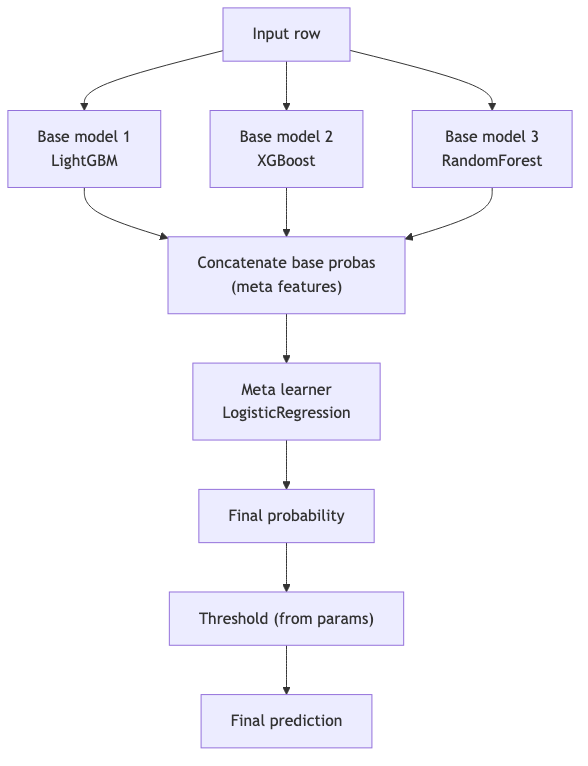

---

## Mini quiz

1. Why ship a voting ensemble as a single PyFunc artifact instead of three UC models?
2. You train base models on the full training set, then train the meta on their training-set predictions. What's wrong?
3. In the champion+fallback pattern, which model dominates p50 latency? Which dominates p99?
4. What's the canonical answer to "deploy N models for N tenants" — N endpoints or 1 PyFunc router? Why?
5. You add a hard-coded "amount > $10K flags" rule. Where does it live?
6. The endpoint OOMs on a 5-model voting ensemble. What's the fix?

**Answers:**

1. One artifact, one UC entry, one endpoint, one ACL surface, one observability dashboard, one set of replicas. Three separate models means clients average client-side — fragmented observability and duplicated logic.
2. Data leakage. The meta-learner is fit to base-model predictions that were made on the same data the base models trained on; base models memorize, meta learns the memorization. Use **out-of-fold predictions** (K-fold CV) for the meta's training data.
3. Fast model dominates p50 (common path); expensive model dominates p99 (rare borderline path). Mosaic AI's p50/p95/p99 latency metrics surface this.
4. **1 PyFunc router** when segments share infrastructure cost-benefit. Collapses N endpoints into one — saves cost, simplifies ops, single UC entry. Exception: tenants with hard isolation requirements (HIPAA segregation between customer A and customer B).
5. In the PyFunc's `predict` method, applied after (or in parallel with) the model's predict. Logged as a regulatory artifact alongside the model.
6. `workload_size="large"` (16 GB) or larger; verify total model memory + overhead fits. Don't try to reduce model count without first re-validating the ensemble's metrics.

---

## Sanity check

- Could you write a 3-model voting PyFunc from memory?
- Do you know why stacking needs OOF predictions for the meta?
- Can you decide PyFunc-router vs N-endpoints for a multi-tenant scenario?
- Do you remember `workload_size` sizing for ensembles?

That closes Section 1. Move on to **Section 2 — MLOps** starting with [Module 07 — UC Model Registry Lifecycle](07_uc_model_registry_lifecycle.md).


\newpage

# Module 07 — Unity Catalog Model Registry Lifecycle

> **Goal of this module:** UC-native model lifecycle management — registered models, model versions, **aliases (`@champion`, `@challenger`, `@archived`)**, tags, transitions, webhooks. This module + Module 08 (DABs) is **where most Section 2 points live**.
>
> ⚠️ **The biggest single API change in the 2025 refresh:** **stage transitions are LEGACY.** `transition_model_version_stage(...)` is the wrong answer for any UC question. **Aliases** are the canonical promotion mechanism. Re-read that sentence.

---

## Coverage map (verbatim Sept 30 2025 exam objectives → where taught)

| Verbatim objective | Section anchor |
|---|---|
| Describe and implement architecture components of model lifecycle pipelines used to manage environment transitions in the **deploy-code strategy** | "The deploy-code strategy" + cross-link Module 09 |
| Map Databricks features to activities of the model lifecycle management process | "Object model" + "Aliases — the new promotion API" |
| Develop a strategy for selecting top-performing models during automated retraining (cross-listed under MLOps) | "Champion/challenger promotion patterns" |

> Cross-references: Module 08 (DABs encode registered models as resources); Module 09 (CI/CD promotion gates); Module 10 (drift alerts trigger registration of new challengers); Topic 09 → [Module 05 (registry basics, workspace stages)](../09_databricks_ml_associate/05_mlflow_registry.md) for the legacy distractor pattern.

---

## The UC model registry object model

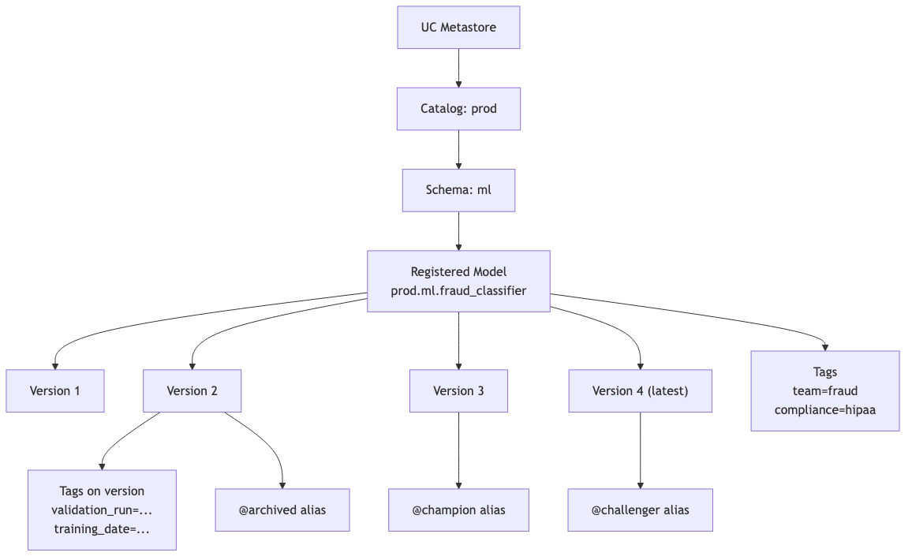

Three identifiers you must keep straight:

| Concept | Example | Mutability |
|---|---|---|
| **Registered model name** | `prod.ml.fraud_classifier` (3-level) | Effectively immutable (rename = new registration) |
| **Version** | `4` (integer, auto-incremented per registration) | Immutable |
| **Alias** | `@champion` | Mutable; reassignable across versions |
| **Tag (on model)** | `team=fraud` | Mutable |
| **Tag (on version)** | `validation_run_id=abc123` | Mutable |

The **alias is the only mutable pointer to a version** that production endpoints follow. Endpoints load `models:/prod.ml.fraud_classifier@champion`; reassigning `@champion` to a new version reroutes inference traffic at endpoint reload time.

---

## Setting up UC as the registry target

```python
import mlflow
mlflow.set_registry_uri("databricks-uc")
```

This one line in MLflow 3 redirects all registry operations to UC. Without it, you might be writing to the legacy workspace registry by accident.

⚠️ **Exam trap:** answer choices that include `mlflow.set_tracking_uri("databricks")` but **not** `set_registry_uri("databricks-uc")`. The tracking URI controls where runs go; the registry URI controls where registered models go. For UC, both must be set.

---

## Registering a model

Two paths.

### Path A — register on log (recommended)

```python
with mlflow.start_run():
    mlflow.sklearn.log_model(
        sk_model=model,
        artifact_path="model",
        signature=signature,
        registered_model_name="prod.ml.fraud_classifier",  # ← three-level
    )
```

If the registered model doesn't exist, it's created. A new version is added.

### Path B — register after log

```python
with mlflow.start_run() as run:
    mlflow.sklearn.log_model(
        sk_model=model,
        artifact_path="model",
        signature=signature,
        # no registered_model_name
    )
    run_id = run.info.run_id

# Later, register
model_version = mlflow.register_model(
    model_uri=f"runs:/{run_id}/model",
    name="prod.ml.fraud_classifier",
)
```

When to use Path B: when registration is gated by a downstream test step or a different team.

⚠️ **Exam trap:** registering with a two-level name like `ml.fraud_classifier`. That targets the legacy workspace registry. **UC mandates three-level: `catalog.schema.name`.** Always.

⚠️ **Exam trap 2:** trying to register without a signature. UC rejects. Add `signature=` (or rely on autolog's inferred signature) before registration.

---

## Aliases — the new promotion API

```python
from mlflow import MlflowClient

client = MlflowClient()
NAME = "prod.ml.fraud_classifier"

# Set @challenger on version 4
client.set_registered_model_alias(NAME, alias="challenger", version=4)

# Promote: move @champion from 3 to 4 (which previously was @challenger)
client.set_registered_model_alias(NAME, alias="champion", version=4)

# Demote the old champion to archived
client.set_registered_model_alias(NAME, alias="archived", version=3)

# Delete an alias (rare — usually you reassign rather than delete)
client.delete_registered_model_alias(NAME, alias="challenger")

# Read
mv = client.get_model_version_by_alias(NAME, alias="champion")
print(mv.version, mv.tags, mv.run_id)
```

**The alias name has no inherent meaning to MLflow.** `@champion`, `@challenger`, `@archived`, `@canary`, `@hotfix` — they're all valid string keys. By **convention**:

- `@champion` — currently in production, receives 100% of standard traffic.
- `@challenger` — candidate undergoing evaluation, may receive canary traffic.
- `@archived` — superseded; kept for audit.

The exam uses these three terms canonically. Answers that name them differently (`@staging`, `@production`) are wrong-by-convention.

```python
# Loading by alias
model = mlflow.pyfunc.load_model("models:/prod.ml.fraud_classifier@champion")
```

The URI scheme `models:/<full-name>@<alias>` always resolves to the version currently aliased.

⚠️ **Exam trap:** loading via `models:/<name>/Production` — that's the legacy stage syntax. Wrong for UC.

---

## Tags — governance metadata

```python
# Tag on the registered model (applies to all versions)
client.set_registered_model_tag(NAME, key="team", value="fraud_ml")
client.set_registered_model_tag(NAME, key="compliance_scope", value="hipaa")

# Tag on a specific version
client.set_model_version_tag(NAME, version=4, key="validation_run_id", value="abc123")
client.set_model_version_tag(NAME, version=4, key="training_dataset", value="delta@v42")
client.set_model_version_tag(NAME, version=4, key="approved_by", value="ml-platform-team")
```

**Why tags matter:**

- **Searchability** — `client.search_model_versions(filter_string="tags.approved_by = 'ml-platform-team'")`.
- **Audit** — every approval action leaves a tag breadcrumb.
- **Automation** — CI jobs check for `tags.validation_status = 'passed'` before promoting.

Tags on models vs versions:

- **Model-level tags** describe the *artifact family* — team, compliance scope, business unit.
- **Version-level tags** describe *that specific build* — training data version, validation run id, approver, training date.

⚠️ **Exam trap:** putting validation-run-id as a model-level tag. It changes with each version; it belongs on the version.

---

## The legacy stages API (so you can identify it as wrong)

The pre-2025 workspace registry used stages:

```python
# DO NOT USE for UC questions on the exam
client.transition_model_version_stage(
    name="ml.fraud_classifier",     # 2-level (legacy)
    version=4,
    stage="Production",
    archive_existing_versions=True,
)
```

Stages: `None`, `Staging`, `Production`, `Archived`. The model URI was `models:/ml.fraud_classifier/Production`.

**Why it was replaced:**

- Only one version per stage at a time — no canary / blue-green semantics.
- No version-level granularity — `Production` is mutable but coarse.
- No alias names beyond the 4 fixed strings.
- No UC-level ACL integration.

On the exam, if you see `transition_model_version_stage`, `archive_existing_versions=True`, `models:/<name>/Production` — it's the legacy answer. Pick the alias-based one.

---

## Webhooks — the automation primitive (still tested)

Webhooks fire on registry events and call either a Databricks Job or an arbitrary HTTP endpoint. They predate UC; **they still work on UC** but the canonical UC pattern uses **DABs + Jobs as gates** rather than webhooks.

The exam still tests webhooks as a concept because they're the legacy automation lever and you need to recognize the pattern.

```python
import requests
import os

token = os.environ["DATABRICKS_TOKEN"]
host = os.environ["DATABRICKS_HOST"]

# Create a webhook that fires on MODEL_VERSION_CREATED and triggers a Job
requests.post(
    f"{host}/api/2.0/mlflow/registry-webhooks/create",
    headers={"Authorization": f"Bearer {token}"},
    json={
        "model_name": "prod.ml.fraud_classifier",
        "events": ["MODEL_VERSION_CREATED"],
        "description": "Run validation tests on new versions",
        "status": "ACTIVE",
        "job_spec": {
            "job_id": 12345,
            "workspace_url": host,
            "access_token": token,
        },
    },
)
```

Events you should recognize:

- `MODEL_VERSION_CREATED` — new version registered.
- `MODEL_VERSION_TRANSITIONED_STAGE` — legacy; fires on stage transition.
- `MODEL_VERSION_TRANSITIONED_TO_STAGING` / `MODEL_VERSION_TRANSITIONED_TO_PRODUCTION` — legacy variants.
- `REGISTERED_MODEL_CREATED` — new model registered (the first version).
- `COMMENT_CREATED` — a comment was added to a model version.

Alternative target: HTTP endpoint (Slack, PagerDuty).

```json
{
  "events": ["MODEL_VERSION_CREATED"],
  "http_url_spec": {
    "url": "https://hooks.slack.com/services/T00/B00/abc",
    "authorization": "Bearer ...",
    "enable_ssl_verification": true
  }
}
```

⚠️ **Exam trap:** "Webhooks are the only way to automate promotion in UC." Wrong — DABs + Jobs are the canonical UC pattern. Webhooks are *a* mechanism; the exam-correct architecture uses alias-based promotion in a CI/CD pipeline.

---

## The deploy-code strategy

Section 2 objective: *"Describe and implement architecture components of model lifecycle pipelines used to manage environment transitions in the deploy-code strategy."*

Two competing strategies; the exam tests that you know the right one.

| Strategy | What gets promoted | Pros | Cons |
|---|---|---|---|
| **Deploy-code** | Source code that produces the model | Each env retrains from controlled code; full reproducibility; the env can have different secrets/configs | Slow promotions (must train in each env); training cost in each env |
| **Deploy-model** | The model artifact itself | Fast promotion; only one training run | Harder to audit; artifact's training run lived in dev — staging/prod can't fully reproduce |

**Deploy-code is the exam-correct strategy** for regulated industries. Each environment (dev, staging, prod) has its own DAB target. Code is promoted via PR + merge. Each env trains its own model with env-appropriate data and registers it to that env's UC catalog.

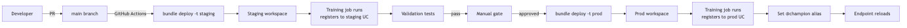

⚠️ **Exam trap:** the "deploy-model" answer described in regulated contexts. In regulated finance / healthcare, deploy-code is the audit-defensible choice. If the question mentions HIPAA / SOX / regulated, deploy-code.

---

## Permissions on registered models

UC permissions on registered models (separately from data permissions):

| Privilege | What it allows |
|---|---|
| `USE CATALOG` + `USE SCHEMA` | Prerequisite — see the namespace |
| `EXECUTE` (on registered model) | Load and use the model for inference |
| `APPLY TAG` | Set tags on the model or its versions |
| `MANAGE` | Full control including delete, alias changes, version ops |
| `ALL PRIVILEGES` | Sum of the above |

```sql
GRANT EXECUTE ON MODEL prod.ml.fraud_classifier TO `ml_inference_app`;
GRANT MANAGE  ON MODEL prod.ml.fraud_classifier TO `ml_platform_team`;
```

⚠️ **Exam trap:** "The model serving endpoint's service principal needs `MODIFY` on the model." There is no `MODIFY` privilege on UC models — it's `EXECUTE` (for inference) or `MANAGE` (for alias changes). The endpoint only needs `EXECUTE`.

---

## Lineage — UC tracks model → table

UC automatically captures lineage between models and the tables they read at training time (when training uses UC data sources). View in the UC UI under the Lineage tab, or query the system tables:

```sql
SELECT *
FROM system.access.table_lineage
WHERE target_type = 'MODEL_VERSION'
  AND target_table_full_name = 'prod.ml.fraud_classifier'
  AND event_time > current_date() - interval 30 days;
```

This is gold for audit — "what data did version 7 of the fraud classifier train on?" — one query.

⚠️ **Exam trap:** assuming lineage covers feature lookups. Native model→table lineage tracks tables *directly read by the training run*. For feature lookups via `FeatureEngineeringClient`, lineage is recorded **through** the feature table — the feature table's lineage shows its sources, but the model→table edge may be the feature table itself, not the underlying raw tables. Multi-hop lineage requires the UC lineage graph.

---

## Audit and history

```python
# All versions of a model
for mv in client.search_model_versions(filter_string="name = 'prod.ml.fraud_classifier'"):
    print(mv.version, mv.creation_timestamp, mv.aliases, mv.tags)

# Comments and update history (UC UI exposes this; API surface is evolving)
client.get_registered_model("prod.ml.fraud_classifier")
```

For change-history on aliases — who reassigned `@champion` and when — query the **audit log** (system.access.audit) for events with `action_name = 'setRegisteredModelAlias'`.

```sql
SELECT event_time, user_identity.email, action_name, request_params
FROM system.access.audit
WHERE service_name = 'unityCatalog'
  AND action_name IN (
    'setRegisteredModelAlias',
    'deleteRegisteredModelAlias',
    'setModelVersionTag'
  )
  AND request_params:full_name_arg = 'prod.ml.fraud_classifier'
ORDER BY event_time DESC;
```

⚠️ **Exam trap:** "Aliases are versioned and historical changes are queryable from `client.search_*` APIs." Not directly — alias change history is in the audit log, not the registry API.

---

## End-to-end exam scenario

> "A data scientist registers a new model version. CI tests should run automatically. If they pass, the version becomes `@challenger`. After a manual review, it should be promoted to `@champion` and the previous champion archived. The serving endpoint should pick up the new champion within minutes. Outline the architecture."

Exam-correct architecture:

1. **Registration event** — DS calls `mlflow.<flavor>.log_model(..., registered_model_name="prod.ml.fraud_classifier")` from a Databricks notebook or a CI training job.
2. **Trigger CI tests** — two options:
   - **Webhook on `MODEL_VERSION_CREATED`** triggering a Databricks Job (legacy-style but still valid).
   - **DABs + GitHub Actions** — training job on merge to main runs tests as a downstream task in the same Lakeflow Job (canonical 2025 answer).
3. **CI Job** runs unit + integration tests (Module 09), and on success sets `@challenger` via `client.set_registered_model_alias(NAME, "challenger", new_version)`.
4. **Manual review** — reviewer inspects metrics in MLflow, signs off in a PR / approval workflow.
5. **Promotion** — approver (or automation following a manual approval) calls:
   ```python
   client.set_registered_model_alias(NAME, "champion", new_version)
   client.set_registered_model_alias(NAME, "archived", old_champion_version)
   ```
6. **Endpoint reload** — Mosaic AI Model Serving endpoints configured with `models:/prod.ml.fraud_classifier@champion` reload the new version on the next refresh cycle (or on explicit `update_endpoint`).

---

## Look-alike API comparison — UC registry surface

| Pair | Difference | Exam tell |
|---|---|---|
| `client.set_registered_model_alias(name, alias, version)` vs `client.transition_model_version_stage(name, version, stage)` | UC alias (current) vs Workspace stage transition (legacy) | UC = alias. Stage transition is the wrong-answer trap on every UC question |
| `client.set_registered_model_alias` vs `client.set_model_version_tag` vs `client.set_registered_model_tag` | Mutable named pointer to one version / mutable tag on one version / mutable tag on the model itself | Promotion → alias. Per-build metadata → version tag. Family-level metadata (team, compliance) → model tag |
| `mlflow.register_model(model_uri, name)` vs `MlflowClient.create_model_version(name, source, run_id)` | High-level helper (creates registered model if absent, adds version) vs explicit version creation | Both work; helper is more common in exam scenarios |
| `mlflow.<flavor>.log_model(..., registered_model_name=)` vs two-step `log_model` + `register_model` | One-shot vs gated by a downstream check | One-shot for typical pipelines; two-step when CI runs validation between log and register |
| `models:/cat.sch.name@champion` vs `models:/cat.sch.name/4` vs `runs:/<run_id>/model` | Alias (mutable) vs version (immutable) vs run artifact (no registry) | Endpoint that auto-pulls latest prod → `@champion`. Pinned audit replay → `/4`. Pre-registration testing → `runs:/.../model` |
| 3-level UC name `prod.ml.fraud_classifier` vs 2-level legacy name `ml.fraud_classifier` | UC three-level requires catalog.schema.name | 2-level = legacy workspace registry → wrong on UC questions |
| `mlflow.set_registry_uri("databricks-uc")` vs `mlflow.set_tracking_uri("databricks")` | Where registered models live vs where runs live | Both must be set for full UC; only the tracking URI doesn't reroute the registry |
| `client.get_model_version_by_alias(name, "champion")` vs `client.get_latest_versions(name)` (legacy) | UC alias lookup vs Workspace stage-filtered lookup | UC → `get_model_version_by_alias`; `get_latest_versions(stages=...)` is legacy |
| `client.delete_registered_model_alias(name, alias)` vs `client.delete_model_version(name, version)` | Remove pointer (version remains) vs delete the version itself | Mostly: reassign rather than delete the alias. Delete the version only for true cleanup |

### `set_registered_model_alias` signature

```python
client.set_registered_model_alias(
    name: str,           # 3-level UC name: "catalog.schema.model"
    alias: str,          # alias name, e.g. "champion", "challenger", "archived"
    version: str | int,  # version to point at; later reassignment moves the pointer
)
```

> 🎯 **How to recognize on the exam:** any answer choice using `stage="Production"`, `stage="Staging"`, `stage="Archived"`, or `transition_model_version_stage` is the **legacy** distractor. UC = alias every time.

---

## Output-prediction drills

**Drill 1 — alias reassignment:**
Versions 1, 2, 3 exist; v2 has `@champion`. You run:
```python
client.set_registered_model_alias(NAME, "champion", 3)
```
Q: What is `@champion` pointing at now? Where is v2?
A: `@champion` → v3. v2 has no alias anymore (the alias is **moved**, not duplicated). v2 itself still exists; only the pointer changed.

**Drill 2 — wrong namespace:**
```python
mlflow.sklearn.log_model(model, "model", registered_model_name="fraud_classifier")  # one-level
```
With `mlflow.set_registry_uri("databricks-uc")`, what happens?
A: **Registration fails.** UC requires `catalog.schema.model_name`. A bare name targets the legacy workspace registry — which fails when the registry URI is UC.

**Drill 3 — endpoint follows alias:**
Endpoint config: `models:/prod.ml.fraud@champion`. You reassign `@champion` from v3 to v4.
Q: What does the endpoint do?
A: On its next reload (driven by `update_endpoint` or the endpoint's refresh cycle), it loads v4. The current in-flight v3 requests complete on v3 and new requests hit v4. **No restart of caller required.**

**Drill 4 — pinned version:**
Endpoint config: `models:/prod.ml.fraud/3`. You reassign `@champion` to v4.
Q: Does the endpoint reload?
A: **No.** The endpoint is pinned to v3. Aliases don't affect explicit version refs. Useful for incident pinning ("revert to v3 immediately").

**Drill 5 — privilege missing:**
Service principal has `USAGE` on the schema but not `EXECUTE` on the registered model.
Q: Endpoint behavior?
A: Endpoint fails to load the model: `permission denied: EXECUTE on registered model prod.ml.fraud`. Grant: `GRANT EXECUTE ON MODEL prod.ml.fraud TO <service-principal>`.

---

## Decision rules

> 🎯 **"Promote to production" in UC → `set_registered_model_alias(name, "champion", version)`.** Never `transition_model_version_stage`.

> 🎯 **"Endpoint auto-picks-up the new prod model" → alias-based URI (`@champion`).** Pinned `/N` won't change.

> 🎯 **"Tag that describes the model family (team, compliance scope)" → registered-model tag.** "Tag that describes a specific build (training run id, approver)" → version tag.

> 🎯 **"Deploy-code in regulated context" → bundle the code; each environment re-trains from its own controlled data and registers its own model versions.** Don't copy a prod model artifact from dev (deploy-model).

> 🎯 **"Audit who reassigned `@champion`" → system.access.audit, `action_name='setRegisteredModelAlias'`.** Not in MLflow APIs.

---

## Mini quiz

1. What is the new canonical mechanism for "promote to production" in UC?
2. You see `client.transition_model_version_stage(name="prod.ml.fraud", version=4, stage="Production")`. What's wrong on a UC exam question?
3. `models:/prod.ml.fraud@champion` vs `models:/prod.ml.fraud/4` — when do you use each?
4. Where do tags `team` and `compliance_scope` go — on the registered model or on the version? Why?
5. The deploy-code vs deploy-model debate — which is exam-correct for regulated industries?
6. The endpoint runs as a service principal. What UC privilege does it need on the model?
7. Where would you look for the history of who reassigned `@champion`?

**Answers:**

1. **Setting an alias** via `client.set_registered_model_alias(name, alias, version)`. Aliases are mutable pointers; reassigning `@champion` reroutes endpoints.
2. `transition_model_version_stage` is the **legacy workspace registry API**. UC uses aliases. Also, stages (`Production` etc.) don't exist in UC.
3. `@champion` (mutable alias) — for endpoints that should auto-pick-up the current production version. `/4` (immutable version) — for audit-replay, integration tests against a specific version, or pinning during incident investigation.
4. Both on the **registered model** because they describe the artifact family, not a specific build. Version-level tags are things that change per build: training data version, validation run id, approver.
5. **Deploy-code.** Each env retrains from controlled code with env-appropriate data. Audit-defensible.
6. `EXECUTE` on the model. (`USE CATALOG` and `USE SCHEMA` on the parent namespace are also required.) The endpoint doesn't need `MANAGE`.
7. The **audit log** — `system.access.audit` with `action_name = 'setRegisteredModelAlias'`. Alias change history is not in the MLflow registry API.

---

## Sanity check

- Could you write the alias-promotion sequence from memory?
- Do you know why stages are wrong for UC?
- Can you explain deploy-code vs deploy-model and pick the right one for regulated contexts?
- Do you know which UC privilege the serving endpoint needs?
- Could you query the audit log for alias-change history?

Move on to [Module 08 — Databricks Asset Bundles for ML](08_dabs_for_ml.md) — the largest new objective set.


\newpage

# Module 08 — Databricks Asset Bundles (DABs) for ML

> **Goal of this module:** Databricks Asset Bundles — infrastructure-as-code for Databricks. **Brand new exam content in the Sept 2025 refresh; heavily tested.** Most candidates have not written `databricks.yml` resources for ML assets (experiments, registered models, serving endpoints). This module fixes that.
>
> **Why it matters:** Section 2's "Environment Architectures" objective is explicit: *"Define and configure Databricks ML assets using DABs: model serving endpoints, MLflow experiments, ML registered models."* You will not pass without DABs fluency.

---

## Coverage map (verbatim Sept 30 2025 exam objectives → where taught)

| Verbatim objective | Section anchor |
|---|---|
| Design and implement scalable Databricks environments for ML projects | "Minimal `databricks.yml`" + "Variable substitution and built-ins" |
| Define and configure Databricks ML assets using **DABs**: model serving endpoints, MLflow experiments, ML registered models | "Resources — what you can declare" + per-resource YAML sections |
| Describe and implement architecture components of model lifecycle pipelines used to manage environment transitions in the **deploy-code strategy** | "Mermaid: the bundle lifecycle" + cross-link Module 09 |

> Cross-references: Module 09 (CI/CD with GitHub Actions); Module 07 (UC registered model resources); Module 10 (`quality_monitors` resource type); Module 14 (`model_serving_endpoints` resource).

---

## What DABs are (and aren't)

A **bundle** is a directory containing a `databricks.yml` file plus supporting code (notebooks, .py files, configs). The bundle describes Databricks resources — jobs, pipelines, experiments, registered models, serving endpoints, schemas — as YAML. The Databricks CLI deploys those resources to one or more workspaces.

**DABs sit alongside Terraform, not in opposition.** Terraform manages account-level resources (workspaces, metastores, networks); DABs manage **workspace-level resources** (jobs, models, endpoints) closer to ML code.

| | DABs | Terraform |
|---|---|---|
| Scope | Workspace-level Databricks resources | Cross-cloud + Databricks |
| Lives with | Application code (next to notebooks) | Platform/infra repo |
| State backend | Databricks-managed | Customer-managed (S3 + DynamoDB / Azure Storage) |
| Targets ML resources | ✓ Native (experiments, models, endpoints) | ✓ Via provider, but more verbose |
| Promotion model | `targets:` block — dev/staging/prod from one bundle | Workspaces × envs |

For ML on Databricks, **DABs is the right answer** to "how do I version-control my ML infrastructure?"

---

## The bundle directory layout

```
fraud-ml-bundle/
├── databricks.yml             # top-level bundle config
├── resources/                 # one yaml per resource type (optional split)
│   ├── jobs.yml
│   ├── models.yml
│   ├── endpoints.yml
│   └── experiments.yml
├── src/                       # python and notebooks
│   ├── train.py
│   ├── evaluate.py
│   └── deploy.py
├── tests/
│   ├── unit/
│   └── integration/
└── requirements.txt
```

You can put everything in one `databricks.yml` or split resources into `resources/*.yml` and `include:` them. The split scales better.

---

## Minimal `databricks.yml`

```yaml
bundle:
  name: fraud-ml

include:
  - resources/*.yml

variables:
  catalog:
    description: "UC catalog for ML artifacts"
    default: "dev_ml"
  notification_email:
    description: "Where alerts go"
    default: "ml-team@example.com"

targets:
  dev:
    mode: development
    default: true
    workspace:
      host: https://adb-dev.azuredatabricks.net
    variables:
      catalog: "dev_ml"

  staging:
    mode: production
    workspace:
      host: https://adb-staging.azuredatabricks.net
    variables:
      catalog: "staging_ml"

  prod:
    mode: production
    workspace:
      host: https://adb-prod.azuredatabricks.net
    variables:
      catalog: "prod_ml"
    run_as:
      service_principal_name: "ml-platform-prod-sp"
```

**Key concepts:**

- **`bundle.name`** — short identifier, used as a prefix in resource names when `mode: development`.
- **`include:`** — split YAML across files; globs supported.
- **`variables:`** — typed parameters. Reference as `${var.catalog}`.
- **`targets:`** — named environments. Each can override variables, workspace URL, and `run_as`.
- **`mode: development`** — resources get a username prefix (e.g., `[dev vatsal] fraud_train`), schedules are paused, no concurrent runs. Safe for personal iteration.
- **`mode: production`** — requires explicit names, schedules run, requires explicit `run_as`.
- **`run_as`** — the identity that owns deployed resources in prod (a service principal, not a user).

⚠️ **Exam trap:** `mode: production` with no `run_as`. Production targets require explicit `run_as` for security — bundles owned by a service principal, not a person who might leave the company.

---

## Resources — what you can declare

The exam-relevant resource types for ML:

| Resource type | What it is |
|---|---|
| `jobs` | Lakeflow Jobs (formerly Workflows) — DAGs of tasks |
| `pipelines` | Lakeflow Declarative Pipelines (formerly DLT) |
| `experiments` | MLflow experiments (workspace path) |
| `registered_models` | UC registered models |
| `model_serving_endpoints` | Mosaic AI Model Serving endpoints |
| `schemas` | UC schemas |
| `clusters` | All-purpose clusters (rare in ML bundles; prefer job clusters) |
| `volumes` | UC volumes |
| `quality_monitors` | Lakehouse Monitoring monitors (covered Module 10) |

### `resources/experiments.yml`

```yaml
resources:
  experiments:
    fraud_experiment:
      name: "/Shared/fraud_ml_experiments"
      description: "All fraud model training runs"
      tags:
        - key: "team"
          value: "fraud_ml"
        - key: "owner"
          value: ${var.notification_email}
```

After `databricks bundle deploy -t prod`, the experiment exists at `/Shared/fraud_ml_experiments`. Training code points at it via `mlflow.set_experiment("/Shared/fraud_ml_experiments")`.

### `resources/models.yml`

```yaml
resources:
  registered_models:
    fraud_classifier:
      name: fraud_classifier         # short name within the catalog/schema
      catalog_name: ${var.catalog}
      schema_name: ml
      comment: "Production fraud classifier"
      grants:
        - principal: "ml_inference_app"
          privileges:
            - EXECUTE
        - principal: "ml_platform_team"
          privileges:
            - MANAGE
```

This creates `${var.catalog}.ml.fraud_classifier` as a UC registered model with grants. Training code registers versions to this name.

### `resources/endpoints.yml`

```yaml
resources:
  model_serving_endpoints:
    fraud_endpoint:
      name: "fraud-${bundle.target}-endpoint"
      config:
        served_entities:
          - name: "champion"
            entity_name: "${var.catalog}.ml.fraud_classifier"
            entity_version: "1"            # or use entity_alias: champion (newer)
            workload_size: "Small"
            scale_to_zero_enabled: true
        traffic_config:
          routes:
            - served_model_name: "champion"
              traffic_percentage: 100
        auto_capture_config:                # enables inference tables
          catalog_name: ${var.catalog}
          schema_name: ml
          table_name_prefix: "fraud_endpoint"
          enabled: true
      tags:
        - key: "team"
          value: "fraud_ml"
        - key: "env"
          value: ${bundle.target}
```

`bundle.target` resolves to `dev` / `staging` / `prod` at deploy time. So the endpoint name varies by env automatically.

**`auto_capture_config`** enables **inference tables** (Module 13) — every request/response is logged to a Delta table for monitoring and audit.

### `resources/jobs.yml`

```yaml
resources:
  jobs:
    fraud_training_job:
      name: "fraud-${bundle.target}-training"
      tasks:
        - task_key: "prepare_data"
          notebook_task:
            notebook_path: ./src/prepare_data
          job_cluster_key: "job_cluster"

        - task_key: "train"
          depends_on:
            - task_key: "prepare_data"
          notebook_task:
            notebook_path: ./src/train
            base_parameters:
              catalog: ${var.catalog}
          job_cluster_key: "job_cluster"

        - task_key: "evaluate"
          depends_on:
            - task_key: "train"
          notebook_task:
            notebook_path: ./src/evaluate
          job_cluster_key: "job_cluster"

        - task_key: "register"
          depends_on:
            - task_key: "evaluate"
          notebook_task:
            notebook_path: ./src/register_and_alias
          job_cluster_key: "job_cluster"

      job_clusters:
        - job_cluster_key: "job_cluster"
          new_cluster:
            spark_version: "15.4.x-cpu-ml-scala2.12"
            node_type_id: "Standard_E8ds_v5"
            num_workers: 2
            data_security_mode: "SINGLE_USER"
            runtime_engine: "PHOTON"

      schedule:
        quartz_cron_expression: "0 0 4 * * ?"
        timezone_id: "UTC"
        pause_status: ${bundle.target == "prod" ? "UNPAUSED" : "PAUSED"}

      email_notifications:
        on_failure:
          - ${var.notification_email}

      max_concurrent_runs: 1
      tags:
        env: ${bundle.target}
```

Notice:

- **Job cluster** (`new_cluster`) — ephemeral, cheaper, isolated per run. **Preferred over all-purpose for ML training jobs.**
- **`depends_on`** — DAG edges between tasks.
- **`pause_status` template** — only the prod target runs on schedule; dev and staging deploy paused for manual runs.

⚠️ **Exam trap:** using an all-purpose cluster for production training jobs. Job clusters are cheaper, isolated, and audit-friendly. The exam-correct answer is always job clusters for scheduled ML pipelines.

---

## CLI commands you must memorize

```bash
# Validate the bundle (lint, type-check, render)
databricks bundle validate

# Validate against a specific target
databricks bundle validate -t prod

# Deploy
databricks bundle deploy -t prod

# Deploy with auto-approve (CI)
databricks bundle deploy -t prod --auto-approve

# Run a specific job from the bundle
databricks bundle run -t prod fraud_training_job

# Run with parameter override
databricks bundle run -t prod fraud_training_job --params '{"catalog": "prod_ml"}'

# Show the rendered config (post-variable-substitution)
databricks bundle summary -t prod

# Destroy (tear down all bundle-managed resources in the target)
databricks bundle destroy -t prod
```

⚠️ **Exam trap:** "`databricks bundle apply`" — no such command. It's `deploy`. (Terraform parlance confuses people.)

⚠️ **Exam trap:** running `bundle destroy` against prod without `--auto-approve` may still proceed if the user confirms. Combine with permission gates — prod destroy should require manual approval.

---

## Variable substitution and built-ins

| Pattern | Resolves to |
|---|---|
| `${var.catalog}` | The variable `catalog` from `variables:` (or CLI override) |
| `${bundle.target}` | The current target name (`dev`, `staging`, `prod`) |
| `${bundle.name}` | The bundle name from the top-level config |
| `${workspace.current_user.userName}` | Current user (in `mode: development`) |
| `${workspace.file_path}` | Path to bundle files in the workspace after deploy |
| `${resources.jobs.fraud_training_job.id}` | Reference another resource — auto-resolved after deploy |

Variable override at deploy time:

```bash
databricks bundle deploy -t prod --var "catalog=prod_ml_alt"
```

Or via env var:

```bash
export BUNDLE_VAR_catalog=prod_ml_alt
databricks bundle deploy -t prod
```

---

## Cross-resource references

DABs can reference one resource from another, useful for "deploy the endpoint that serves this model":

```yaml
resources:
  registered_models:
    fraud_classifier:
      name: fraud_classifier
      catalog_name: ${var.catalog}
      schema_name: ml

  model_serving_endpoints:
    fraud_endpoint:
      name: "fraud-${bundle.target}"
      config:
        served_entities:
          - name: "champion"
            entity_name: "${resources.registered_models.fraud_classifier.full_name}"  # auto-resolved
            workload_size: "Small"
```

`full_name` interpolates to `${var.catalog}.ml.fraud_classifier` once the model resource is processed.

⚠️ **Exam trap:** hard-coding the full UC name in the endpoint config and forgetting to update it when `catalog` changes per target. Use cross-references.

---

## Permissions on bundle resources

```yaml
resources:
  jobs:
    fraud_training_job:
      name: "fraud-${bundle.target}-training"
      tasks: [...]
      permissions:
        - level: CAN_VIEW
          group_name: "data-science-team"
        - level: CAN_MANAGE
          service_principal_name: "ml-platform-prod-sp"
```

Set at deploy time on each resource. Levels:

- `CAN_VIEW` — read-only on the resource.
- `CAN_MANAGE_RUN` — can trigger runs and edit run-related fields.
- `CAN_MANAGE` — full control.
- For UC models/schemas, use `grants:` (different syntax).

---

## ML-specific patterns

### Pattern: training job that registers + aliases atomically

The training job's last task sets the alias. The bundle declares the model resource; the job's code sets the alias post-training.

```python
# src/register_and_alias.py
import mlflow
from mlflow import MlflowClient

mlflow.set_registry_uri("databricks-uc")
catalog = dbutils.widgets.get("catalog")
NAME = f"{catalog}.ml.fraud_classifier"

# Find the latest model version (just registered by previous task)
client = MlflowClient()
latest = client.get_registered_model(NAME).latest_versions[0]

# CI gate: validation metric must beat current champion
champion = None
try:
    champion = client.get_model_version_by_alias(NAME, "champion")
except Exception:
    pass

new_auc = float(latest.tags.get("val_auc", 0.0))
if champion:
    champion_auc = float(champion.tags.get("val_auc", 0.0))
    if new_auc <= champion_auc:
        raise RuntimeError(f"New {new_auc} did not beat champion {champion_auc}")

# Set @challenger
client.set_registered_model_alias(NAME, "challenger", latest.version)
print(f"Set @challenger on version {latest.version}")
```

The "promotion to @champion" step lives in a **separate job** triggered manually after human review (or by a downstream gate). Don't auto-promote `@challenger → @champion` in the same run.

### Pattern: bundle deploys the monitor alongside the endpoint

```yaml
resources:
  quality_monitors:
    fraud_inference_monitor:
      table_name: "${var.catalog}.ml.fraud_endpoint_payload"  # the inference table
      assets_dir: "/Shared/lakehouse-monitoring/fraud"
      output_schema_name: "${var.catalog}.ml_monitoring"
      inference_log:
        timestamp_col: "timestamp_ms"
        granularities:
          - "5 minutes"
          - "1 hour"
          - "1 day"
        model_id_col: "model_version"
        prediction_col: "prediction"
        label_col: "label"
        problem_type: "PROBLEM_TYPE_CLASSIFICATION"
```

This ships the model, the endpoint, the inference table, and the monitor as a single coherent unit. The DAB-as-IaC story is "all the ML resources for this product, in one repo, deploy as one command."

---

## Targets — the promotion mechanism

```yaml
targets:
  dev:
    mode: development
    default: true
    workspace:
      host: https://adb-dev.azuredatabricks.net
    variables:
      catalog: "dev_ml"
    resources:
      jobs:
        fraud_training_job:
          schedule:
            pause_status: "PAUSED"   # never schedule in dev

  staging:
    mode: production
    workspace:
      host: https://adb-staging.azuredatabricks.net
    variables:
      catalog: "staging_ml"
    run_as:
      service_principal_name: "ml-platform-staging-sp"

  prod:
    mode: production
    workspace:
      host: https://adb-prod.azuredatabricks.net
    variables:
      catalog: "prod_ml"
    run_as:
      service_principal_name: "ml-platform-prod-sp"
    resources:
      model_serving_endpoints:
        fraud_endpoint:
          config:
            served_entities:
              - name: "champion"
                entity_name: "prod_ml.ml.fraud_classifier"
                workload_size: "Large"          # prod gets bigger replicas
                scale_to_zero_enabled: false    # always-on in prod
                workload_type: "CPU"
```

Per-target overrides let you keep one bundle and parameterize env-specific decisions.

---

## Lessons from production

- **Don't put secrets in `databricks.yml`.** Use Databricks Secrets (`spark.secrets.get(...)`), workspace-scoped variables, or env vars in CI. Variables in YAML are version-controlled — secrets in version control is a bad day at audit.
- **Pin DBR versions.** `spark_version: "15.4.x-cpu-ml-scala2.12"` — a wildcard like `latest` is the path to "it broke on Tuesday."
- **Job clusters > all-purpose.** Costs less, isolated per run, ephemeral. The exam's right answer.
- **`mode: development` for personal iteration.** Adds username prefix, pauses schedules, avoids name collisions when 10 devs deploy to the same workspace.
- **`run_as` in prod is non-negotiable.** Person-owned prod resources break when the person leaves.

---

## Mermaid: the bundle lifecycle


---

## Look-alike comparison — `databricks.yml` keys + CLI + variable patterns

### Top-level keys of `databricks.yml`

| Key | Purpose | Required? |
|---|---|---|
| `bundle` | Bundle name + optional `git` block | Yes |
| `workspace` | Default workspace host + paths | Optional (usually set per-target) |
| `variables` | Typed parameters with defaults | Optional but heavily used |
| `resources` | Resource definitions (jobs, models, endpoints, ...) | Yes (somewhere — directly or via `include`) |
| `targets` | Named environments (dev/staging/prod) | Yes |
| `include` | Glob to merge other YAML files | Optional |
| `artifacts` | Built artifacts (wheels, JARs) referenced by resources | Optional |
| `presets` | Reusable `targets`-scoped settings | Optional |
| `sync` | Patterns to include/exclude when syncing files | Optional |
| `run_as` | Identity for deployed resources (per-target) | **Required in prod** |
| `permissions` | Workspace-level permissions block (per-target) | Optional |

### Resource types you must recognize

| Resource type | Purpose | Common ML use |
|---|---|---|
| `jobs` | Lakeflow Jobs (Workflows) | Training, evaluation, promotion DAGs |
| `pipelines` | Lakeflow Declarative Pipelines (formerly DLT) | Streaming feature pipelines |
| `experiments` | MLflow experiments | One per model family |
| `registered_models` | UC registered models | Output target for `log_model` |
| `model_serving_endpoints` | Mosaic AI Model Serving endpoints | Real-time inference |
| `schemas` | UC schemas | `prod.ml`, `prod.ml_monitoring` |
| `volumes` | UC volumes (managed file storage) | Model checkpoints, raw uploads |
| `quality_monitors` | Lakehouse Monitoring monitors | Drift + performance monitoring |
| `clusters` | All-purpose clusters | Rare in ML bundles — prefer job clusters |

### CLI command look-alikes

| Pair | Difference | Exam tell |
|---|---|---|
| `databricks bundle validate` vs `validate -t prod` | Default target vs explicit target | Validate per target to catch target-specific var refs |
| `databricks bundle deploy` vs `deploy -t prod` vs `deploy --auto-approve` | Default target / explicit target / skip confirm (CI) | CI = `--auto-approve` |
| `databricks bundle run -t prod fraud_training_job` vs `databricks jobs run-now <job-id>` | Bundle-aware run (resolves bundle-managed job by key) vs raw Jobs API | Bundle name in the answer → `bundle run` |
| `databricks bundle destroy` vs `terraform destroy` | DABs lifecycle vs Terraform | DABs-managed resources track in Databricks state |
| `databricks bundle summary -t prod` vs `validate` | Renders final config with all substitutions vs lint only | Debug "what does my var resolve to?" → `summary` |
| `--var "k=v"` vs `BUNDLE_VAR_k=v` env var | CLI override vs env var override | Both valid; CI typically uses env vars |
| **Not a command:** `databricks bundle apply` | Doesn't exist | Terraform muscle memory trap |

### Variable / substitution patterns

| Pattern | Resolves to |
|---|---|
| `${var.catalog}` | The `catalog` variable, default or CLI/env override |
| `${bundle.target}` | Current target name (`dev`/`staging`/`prod`) |
| `${bundle.name}` | Top-level bundle name |
| `${workspace.current_user.userName}` | Current user (mostly for `mode: development`) |
| `${workspace.file_path}` | Path to bundle files in the workspace after deploy |
| `${resources.jobs.fraud_training_job.id}` | Cross-resource reference resolved post-deploy |
| `${secrets.scope_name.secret_key}` | Look up a secret at deploy time (note: still version-controlled if put naively — see traps) |

### `complex_variables` (nested values)

```yaml
variables:
  endpoint_config:
    description: "Endpoint sizing"
    type: complex
    default:
      workload_size: "Small"
      scale_to_zero_enabled: true
      min_replicas: 1
      max_replicas: 4
  notification_channels:
    type: complex
    default:
      - email: "ml@example.com"
      - slack: "#ml-alerts"
```

Reference: `${var.endpoint_config.workload_size}`. Used when the same nested block varies across targets.

### `presets` (per-target reusable settings)

```yaml
presets:
  trigger_pause_status: "PAUSED"   # default for all targets
  jobs_max_concurrent_runs: 1

targets:
  prod:
    presets:
      trigger_pause_status: "UNPAUSED"
```

### `permissions` block per resource

```yaml
resources:
  jobs:
    fraud_training_job:
      permissions:
        - level: CAN_MANAGE
          service_principal_name: ml-platform-sp
        - level: CAN_VIEW
          group_name: ml-readers
```

### `mode: development` vs `mode: production`

| Attribute | `mode: development` | `mode: production` |
|---|---|---|
| Resource naming | Username prefix added (`[dev me] fraud_train`) | Exact name |
| Schedules | Paused | Run as defined |
| Concurrent runs | Capped at 1 | As defined |
| `run_as` requirement | Optional (defaults to user) | Required (service principal) |
| Used for | Personal iteration on shared workspace | Real deployment |

> 🎯 **How to recognize this on the exam:** the prompt's "we deploy this to all 3 environments from one repo" → `targets:` block. "Endpoint name should vary per env" → `${bundle.target}` interpolation. "Prod schedule active but dev paused" → preset + per-target override or template expression on `pause_status`. "Production deployment runs as a SP" → `run_as: { service_principal_name: ... }` on the prod target.

---

## Output-prediction drills

**Drill 1 — `mode: development` resource naming:**
```yaml
bundle: { name: fraud-ml }
targets:
  dev: { mode: development, default: true }
resources:
  jobs:
    training: { name: "fraud_train" }
```
Deployed by user `me@example.com`. Q: What is the deployed job's name in dev?
A: **`[dev me] fraud_train`** — `mode: development` adds a `[<target> <username>]` prefix to avoid collisions on shared workspaces. With `mode: production` it would be exactly `fraud_train`.

**Drill 2 — missing `run_as` in prod:**
```yaml
targets:
  prod:
    mode: production
    workspace: { host: ... }
    # no run_as
```
Q: What does `databricks bundle validate -t prod` report?
A: **Error.** `mode: production` requires explicit `run_as` (service principal name or user). The exam-canonical fix is `run_as: { service_principal_name: "ml-platform-prod-sp" }`.

**Drill 3 — variable resolution order:**
```yaml
variables:
  catalog: { default: "dev_ml" }
targets:
  prod:
    variables:
      catalog: "prod_ml"
```
Run as: `databricks bundle deploy -t prod --var "catalog=alt"`.
Q: What value of `${var.catalog}` is used?
A: **`alt`** — CLI/env var override > target var > default. The hierarchy is: `--var` / `BUNDLE_VAR_*` > `targets.<name>.variables` > `variables.<name>.default`.

**Drill 4 — endpoint per environment:**
```yaml
resources:
  model_serving_endpoints:
    ep:
      name: "fraud-${bundle.target}-endpoint"
      config:
        served_entities:
          - { name: "champion", entity_name: "${var.catalog}.ml.fraud", entity_version: "1", workload_size: "Small", scale_to_zero_enabled: true }
        traffic_config: { routes: [ { served_model_name: "champion", traffic_percentage: 100 } ] }
```
Deploy to `prod` with `${var.catalog}=prod_ml`.
Q: Endpoint name? Model loaded?
A: Endpoint name **`fraud-prod-endpoint`** loading **`prod_ml.ml.fraud` version 1** at 100%.

**Drill 5 — destroy in prod:**
```bash
databricks bundle destroy -t prod
```
Q: What gets removed?
A: All resources currently bundle-managed in the prod target: jobs, registered_models, model_serving_endpoints, experiments, quality_monitors created via the bundle. **Underlying data (Delta tables, model artifacts in the registry) is NOT auto-deleted** — registered model deletion only removes the registry entry; the artifact files persist until garbage collected. Audit-relevant: `bundle destroy` is destructive at the resource level but data-safe.

---

## Decision rules

> 🎯 **"Schedule prod, pause dev/staging" → `pause_status` template on the schedule (`${bundle.target == "prod" ? "UNPAUSED" : "PAUSED"}`) or a `presets`+target override.**

> 🎯 **"Endpoint name differs per env" → `${bundle.target}` in the resource name.**

> 🎯 **"Same `databricks.yml` deploys to dev/staging/prod" → one `targets:` block per env, `variables` overriding catalog + endpoint config.** The bundle is the same.

> 🎯 **"Production training compute" → job cluster (`new_cluster` inside `job_clusters`), not all-purpose.** Job clusters are ephemeral, cheaper, isolated.

> 🎯 **"Bundle owns the prod resources after the deployer leaves" → `run_as: { service_principal_name: ... }` on the prod target.**

> 🎯 **"Audit who deployed" → `bundle.git` block (auto-tags resources with the git commit) + CI logs.** Don't reinvent this with custom tags.

> 🎯 **Distractor: `databricks bundle apply`** — does not exist. The command is `deploy`.

---

## End-to-end mini-scenario — full ML bundle (`databricks.yml`)

```yaml
bundle:
  name: fraud-ml
  git:
    branch: main

include:
  - resources/*.yml

variables:
  catalog: { description: "UC catalog", default: "dev_ml" }
  notification_email: { default: "ml-team@example.com" }
  endpoint_workload_size: { default: "Small" }

presets:
  jobs_max_concurrent_runs: 1
  trigger_pause_status: "PAUSED"

targets:
  dev:
    mode: development
    default: true
    workspace: { host: https://adb-dev.azuredatabricks.net }
    variables: { catalog: "dev_ml" }

  staging:
    mode: production
    workspace: { host: https://adb-staging.azuredatabricks.net }
    variables: { catalog: "staging_ml" }
    run_as: { service_principal_name: "ml-staging-sp" }

  prod:
    mode: production
    workspace: { host: https://adb-prod.azuredatabricks.net }
    variables:
      catalog: "prod_ml"
      endpoint_workload_size: "Medium"
    run_as: { service_principal_name: "ml-prod-sp" }
    presets:
      trigger_pause_status: "UNPAUSED"
    permissions:
      - level: CAN_MANAGE
        service_principal_name: ml-prod-sp
      - level: CAN_VIEW
        group_name: ml-readers
```

```yaml
# resources/experiments.yml
resources:
  experiments:
    fraud_exp:
      name: "/Shared/fraud_${bundle.target}"
      tags:
        - { key: "team", value: "fraud_ml" }

# resources/models.yml
resources:
  registered_models:
    fraud_model:
      name: fraud_classifier
      catalog_name: ${var.catalog}
      schema_name: ml
      grants:
        - principal: ml-prod-sp
          privileges: [EXECUTE]

# resources/endpoints.yml
resources:
  model_serving_endpoints:
    fraud_ep:
      name: "fraud-${bundle.target}-endpoint"
      config:
        served_entities:
          - name: champion
            entity_name: "${var.catalog}.ml.fraud_classifier"
            entity_alias: champion
            workload_size: ${var.endpoint_workload_size}
            scale_to_zero_enabled: true
        traffic_config:
          routes:
            - { served_model_name: champion, traffic_percentage: 100 }
        auto_capture_config:
          catalog_name: ${var.catalog}
          schema_name: ml
          table_name_prefix: fraud_endpoint
          enabled: true

# resources/monitors.yml
resources:
  quality_monitors:
    fraud_monitor:
      table_name: "${var.catalog}.ml.fraud_endpoint_payload"
      assets_dir: "/Shared/lakehouse-monitoring/fraud-${bundle.target}"
      output_schema_name: "${var.catalog}.ml_monitoring"
      inference_log:
        timestamp_col: timestamp_ms
        granularities: ["1 hour", "1 day"]
        prediction_col: prediction
        model_id_col: model_version
        problem_type: PROBLEM_TYPE_CLASSIFICATION

# resources/jobs.yml
resources:
  jobs:
    fraud_training_job:
      name: "fraud-${bundle.target}-training"
      tasks:
        - task_key: train
          notebook_task: { notebook_path: ./src/train, base_parameters: { catalog: "${var.catalog}" } }
          job_cluster_key: job_cluster
        - task_key: register
          depends_on: [{ task_key: train }]
          notebook_task: { notebook_path: ./src/register_and_alias }
          job_cluster_key: job_cluster
      job_clusters:
        - job_cluster_key: job_cluster
          new_cluster:
            spark_version: "15.4.x-cpu-ml-scala2.12"
            node_type_id: Standard_E8ds_v5
            num_workers: 2
      schedule:
        quartz_cron_expression: "0 0 4 * * ?"
        timezone_id: UTC
      email_notifications: { on_failure: [ "${var.notification_email}" ] }
```

Deploy chain:
```bash
databricks bundle validate -t prod
databricks bundle deploy -t prod --auto-approve
databricks bundle run -t prod fraud_training_job
```

This is the **exam-canonical ML bundle**. Endpoint, monitor, job, model, experiment — all five Section 2 ML resource types are in one bundle, all parameterized by `${var.catalog}` and `${bundle.target}`.

---

## Mini quiz

1. Why is `mode: development` the default for personal iteration, and what does it change?
2. What's the difference between a `targets:`-level resource override and a top-level resource definition?
3. The exam's right answer for "the compute for a production training job" — job cluster or all-purpose? Why?
4. `${var.catalog}` vs `${bundle.target}` — what does each resolve to?
5. Where do secrets go — `variables:`, `databricks.yml`, or somewhere else?
6. What does `auto_capture_config` on a serving endpoint do?
7. What command runs the bundle's job after deploy?

**Answers:**

1. Resources get a username prefix (`[dev me] fraud_train`), schedules pause, no concurrent runs. Lets multiple devs deploy to the same workspace without collisions and prevents accidental scheduled runs.
2. The top-level definition is the base; the target-level block overrides specific fields per environment. Example: `workload_size` is `Small` in dev/staging but `Large` only in prod.
3. **Job cluster.** Ephemeral, cheaper, isolated per run, audit-friendly. All-purpose clusters are for interactive notebook work; using them for production jobs costs more and entangles workloads.
4. `${var.catalog}` resolves to the value of the `catalog` variable (overridable per target). `${bundle.target}` resolves to the current target name (`dev` / `staging` / `prod`).
5. **Not in `databricks.yml`.** Use Databricks Secrets, workspace-scoped service principal tokens, or CI env vars. Variables in YAML are version-controlled.
6. Enables **inference tables** — every request and response to the endpoint logged to a Delta table. Foundation for Lakehouse Monitoring (Module 10) and audit.
7. `databricks bundle run -t <target> <job_name>`. After `bundle deploy`.

---

## Sanity check

- Could you write a minimal `databricks.yml` with `bundle`, `variables`, `targets` from memory?
- Do you know the four ML-relevant resource types (experiments, registered_models, model_serving_endpoints, jobs)?
- Can you explain when `mode: development` vs `mode: production` is right?
- Do you remember the CLI: `validate`, `deploy`, `run`, `destroy`?
- Could you write a job cluster spec with `spark_version` pinned?

Move on to [Module 09 — CI/CD with DABs](09_ci_cd_with_dabs.md).


\newpage

# Module 09 — CI/CD with DABs + GitHub Actions

> **Goal of this module:** the **deploy-code strategy in practice** — GitHub Actions running `databricks bundle deploy` and `bundle run`, environment promotion gates, unit and integration testing of ML pipelines. Section 2 has four objectives on validation testing alone.
>
> **Assumes:** Module 08 (DABs).

---

## Coverage map (verbatim Sept 30 2025 exam objectives → where taught)

| Verbatim objective | Section anchor |
|---|---|
| Implement **unit tests** for individual functions in Databricks notebooks | "Unit tests in notebooks (pytest)" |
| Identify types of testing performed (unit and integration) in various environment stages (dev, test, prod) | "Test pyramid by environment" |
| Design an **integration test** for ML systems incorporating: feature engineering, training, evaluation, deployment, inference | "Integration test design" |
| Compare benefits and challenges of approaches for organizing functions and unit tests | "Unit-test patterns" |
| Implement automated retraining workflows triggered by data drift detection or performance degradation alerts | "Drift-triggered retraining" + cross-link Module 10 |
| Develop a strategy for selecting top-performing models during automated retraining | "Champion selection logic" |

> Cross-references: Module 08 (DABs config); Module 07 (alias-based promotion); Module 10 (alert that triggers retraining); Module 11 (drift test selection).

---

## The full pipeline

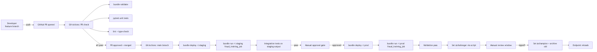

Five environments / states:

1. **Feature branch** — dev, unrestricted iteration.
2. **PR check** — validation + unit tests in CI.
3. **Staging** — full integration test on real cluster against staging data.
4. **Prod (challenger)** — model exists in prod UC with `@challenger` alias; endpoint isn't routed to it yet.
5. **Prod (champion)** — `@champion` reassigned; endpoint reloads; rollback = reassign alias back.

---

## GitHub Actions skeleton

`.github/workflows/ml-cicd.yml`:

```yaml
name: ML CI/CD

on:
  pull_request:
    branches: [main]
  push:
    branches: [main]

env:
  DATABRICKS_HOST_DEV: ${{ secrets.DATABRICKS_HOST_DEV }}
  DATABRICKS_HOST_STAGING: ${{ secrets.DATABRICKS_HOST_STAGING }}
  DATABRICKS_HOST_PROD: ${{ secrets.DATABRICKS_HOST_PROD }}

jobs:
  pr-check:
    if: github.event_name == 'pull_request'
    runs-on: ubuntu-latest
    steps:
      - uses: actions/checkout@v4
      - uses: actions/setup-python@v5
        with: { python-version: "3.10" }
      - name: Install Databricks CLI
        run: |
          curl -fsSL https://raw.githubusercontent.com/databricks/setup-cli/main/install.sh | sh
      - name: Install Python deps
        run: pip install -r requirements.txt -r requirements-dev.txt
      - name: Lint
        run: ruff check src/ tests/
      - name: Bundle validate (dev)
        run: databricks bundle validate -t dev
        env:
          DATABRICKS_HOST: ${{ env.DATABRICKS_HOST_DEV }}
          DATABRICKS_TOKEN: ${{ secrets.DATABRICKS_TOKEN_DEV }}
      - name: Unit tests
        run: pytest tests/unit/ -v

  deploy-staging:
    needs: pr-check
    if: github.event_name == 'push' && github.ref == 'refs/heads/main'
    runs-on: ubuntu-latest
    environment: staging
    steps:
      - uses: actions/checkout@v4
      - name: Install CLI
        run: curl -fsSL https://raw.githubusercontent.com/databricks/setup-cli/main/install.sh | sh
      - name: Bundle deploy staging
        env:
          DATABRICKS_HOST: ${{ env.DATABRICKS_HOST_STAGING }}
          DATABRICKS_TOKEN: ${{ secrets.DATABRICKS_TOKEN_STAGING }}
        run: databricks bundle deploy -t staging --auto-approve
      - name: Run training job
        env:
          DATABRICKS_HOST: ${{ env.DATABRICKS_HOST_STAGING }}
          DATABRICKS_TOKEN: ${{ secrets.DATABRICKS_TOKEN_STAGING }}
        run: databricks bundle run -t staging fraud_training_job
      - name: Integration tests
        env:
          DATABRICKS_HOST: ${{ env.DATABRICKS_HOST_STAGING }}
          DATABRICKS_TOKEN: ${{ secrets.DATABRICKS_TOKEN_STAGING }}
        run: pytest tests/integration/ -v

  deploy-prod:
    needs: deploy-staging
    runs-on: ubuntu-latest
    environment:
      name: production
      url: ${{ env.DATABRICKS_HOST_PROD }}
    steps:
      - uses: actions/checkout@v4
      - name: Install CLI
        run: curl -fsSL https://raw.githubusercontent.com/databricks/setup-cli/main/install.sh | sh
      - name: Bundle deploy prod
        env:
          DATABRICKS_HOST: ${{ env.DATABRICKS_HOST_PROD }}
          DATABRICKS_TOKEN: ${{ secrets.DATABRICKS_TOKEN_PROD }}
        run: databricks bundle deploy -t prod --auto-approve
      - name: Run training job
        env:
          DATABRICKS_HOST: ${{ env.DATABRICKS_HOST_PROD }}
          DATABRICKS_TOKEN: ${{ secrets.DATABRICKS_TOKEN_PROD }}
        run: databricks bundle run -t prod fraud_training_job
```

The `environment: production` block in GitHub Actions enables **required reviewers** — a manual approval gate before the prod job runs. This is the deploy-code strategy's "human in the loop" between staging and prod.

⚠️ **Exam trap:** auto-promoting from staging straight to prod with no manual gate. In regulated industries that's the wrong answer.

---

## Unit testing — Section 2 objective

Objective: *"Implement unit tests for individual functions in Databricks notebooks."*

The trick with notebooks: they're not naturally `pytest`-able. The fix: **move logic out of notebooks into `.py` modules**, then test the modules. Notebooks become thin orchestration wrappers.

```python
# src/feature_pipeline.py
import pandas as pd

def compute_rolling_avg(df: pd.DataFrame, col: str, window: int = 30) -> pd.Series:
    """Compute rolling average of `col` over `window` rows.

    Returns a Series aligned to df's index, with NaN where window incomplete.
    """
    return df[col].rolling(window=window, min_periods=1).mean()


def clip_amount(value: float, min_val: float = 0.0, max_val: float = 1e6) -> float:
    """Clip a transaction amount to [min_val, max_val]."""
    if value < min_val:
        return min_val
    if value > max_val:
        return max_val
    return value
```

```python
# tests/unit/test_feature_pipeline.py
import pandas as pd
import pytest
from src.feature_pipeline import compute_rolling_avg, clip_amount


def test_clip_amount_within_range():
    assert clip_amount(100.0) == 100.0


def test_clip_amount_below_min():
    assert clip_amount(-5.0) == 0.0


def test_clip_amount_above_max():
    assert clip_amount(1.5e6) == 1e6


def test_rolling_avg_simple():
    df = pd.DataFrame({"amount": [1.0, 2.0, 3.0, 4.0, 5.0]})
    result = compute_rolling_avg(df, "amount", window=3)
    assert result.iloc[2] == pytest.approx(2.0)  # (1+2+3)/3
    assert result.iloc[4] == pytest.approx(4.0)  # (3+4+5)/3
```

**Notebook → module** is the canonical refactor. Then:

```python
# notebooks/train.py (Databricks notebook)
# MAGIC %pip install -r ../requirements.txt
# MAGIC %restart_python
from src.feature_pipeline import compute_rolling_avg, clip_amount
# ... pipeline logic uses the imported functions
```

Tests run in CI in a standard Python env (no Databricks workspace needed). Fast feedback.

⚠️ **Exam trap:** "Run unit tests inside the Databricks notebook by calling `dbutils.notebook.run('test_notebook')`." That's slow and conflates orchestration with testing. The exam-correct pattern is module + pytest in CI.

---

## Integration testing — the next objective

Objective: *"Design an integration test for ML systems incorporating: feature engineering, training, evaluation, deployment, inference."*

An integration test exercises the **entire pipeline end-to-end** on a small but realistic dataset, on a real Databricks cluster:

```python
# tests/integration/test_fraud_pipeline.py
import os
import time
import requests
from databricks.sdk import WorkspaceClient
from mlflow import MlflowClient

w = WorkspaceClient()
mlflow_client = MlflowClient()

CATALOG = os.environ["TEST_CATALOG"]              # e.g., "staging_ml"
MODEL_NAME = f"{CATALOG}.ml.fraud_classifier"


def test_end_to_end_pipeline_in_staging():
    # 1. Trigger the training job (which is also a bundle resource)
    run = w.jobs.run_now(
        job_id=int(os.environ["FRAUD_TRAINING_JOB_ID"]),
        notebook_params={"catalog": CATALOG, "limit_rows": "10000"},
    )
    # 2. Wait for completion
    while True:
        status = w.jobs.get_run(run.run_id)
        if status.state.life_cycle_state in {"TERMINATED", "INTERNAL_ERROR"}:
            break
        time.sleep(30)
    assert status.state.result_state == "SUCCESS"

    # 3. Verify a new model version was registered
    versions = mlflow_client.search_model_versions(filter_string=f"name = '{MODEL_NAME}'")
    assert len(versions) > 0
    latest = max(versions, key=lambda v: int(v.version))

    # 4. Verify validation metric on the new version
    assert float(latest.tags.get("val_auc", 0.0)) > 0.80

    # 5. Verify @challenger alias was set
    challenger = mlflow_client.get_model_version_by_alias(MODEL_NAME, "challenger")
    assert challenger.version == latest.version

    # 6. Smoke-test inference via the serving endpoint (if it exists in staging)
    endpoint_url = f"{os.environ['DATABRICKS_HOST']}/serving-endpoints/fraud-staging-endpoint/invocations"
    response = requests.post(
        endpoint_url,
        headers={"Authorization": f"Bearer {os.environ['DATABRICKS_TOKEN']}"},
        json={"dataframe_records": [{"amount": 100.0, "merchant_category": "grocery"}]},
    )
    assert response.status_code == 200
    assert "predictions" in response.json()
```

This single test exercises: feature engineering (inside the training job), training, evaluation, registration, aliasing, and inference. **The exam asks "which stages should an integration test cover?" — answer: all of them, end-to-end.**

⚠️ **Exam trap:** integration tests that mock the cluster. Defeats the purpose. Integration runs against a real Databricks workspace (typically a dedicated staging workspace).

---

## Environment-specific testing strategy

Section 2 objective: *"Identify types of testing performed (unit and integration) in various environment stages (dev, test, prod)."*

| Environment | What runs | What's tested |
|---|---|---|
| **Dev** | Unit tests in CI (PR check); ad-hoc notebooks in workspace | Logic correctness of pure functions |
| **Staging** | Integration test end-to-end on real cluster; bundle-deployed training job; downstream tests | The pipeline behaves correctly on realistic data |
| **Prod** | Same training job (deploy-code) but on prod data; validation gates before alias change; ongoing monitoring | The promotion criteria hold; the model meets thresholds on prod data |

⚠️ **Exam trap:** running integration tests only in prod. Wrong — integration tests in staging *prevent* bad code from reaching prod.

⚠️ **Exam trap 2:** running unit tests in prod. They belong in CI, before any deploy. Prod runs the actual workload, not test functions.

---

## Organizing tests — Section 2 objective

Objective: *"Compare benefits and challenges of approaches for organizing functions and unit tests."*

The two patterns the exam contrasts:

| Approach | Pros | Cons |
|---|---|---|
| **One test file per source module** (`src/foo.py` ↔ `tests/unit/test_foo.py`) | 1:1 mapping; easy to find tests; clear coverage | More files; some test code duplicated across files |
| **One test file per feature/scenario** (`tests/unit/test_clipping_behavior.py` covers `clip_amount` + `clip_outliers` + `clip_negatives`) | Scenarios read like specifications; closer to behavior | Harder to find "what tests does function X have?"; coupling to multiple modules |

In practice, **one test file per source module** is the standard pytest convention and the exam-correct default. Use scenario-based organization for higher-level integration tests.

---

## Repair runs — Lakeflow Jobs feature exam-tested

If a multi-task ML job fails on task 3, you don't want to re-run tasks 1 and 2. **Repair runs** re-execute only the failed task and its downstream dependencies, reusing successful task outputs.

```bash
# CLI
databricks jobs repair-run --run-id <id> --rerun-tasks task3,task4
```

```python
# SDK
from databricks.sdk import WorkspaceClient
w = WorkspaceClient()
w.jobs.repair_run(
    run_id=12345,
    rerun_tasks=["evaluate", "register"],
)
```

This is critical for expensive ML training pipelines — if `evaluate` fails because of a flaky downstream service, you don't pay for `train` again.

⚠️ **Exam trap:** "Re-run the whole job after a transient failure." Wrong when only one task failed. Repair the run.

---

## Secrets in CI

**Never** commit:

- Databricks tokens or service principal secrets.
- API keys for external services.
- Database credentials.

**Do** use:

- GitHub Actions Secrets (`${{ secrets.DATABRICKS_TOKEN_PROD }}`).
- Databricks Secrets (referenced from notebooks via `dbutils.secrets.get(scope, key)`).
- OIDC federation for keyless auth between GitHub and Databricks (modern best practice).

```yaml
# OIDC federation example — no long-lived tokens
- name: Federate via OIDC
  uses: databricks/setup-cli@main
  with:
    federated-auth: true
    workspace-id: ${{ secrets.WORKSPACE_ID }}
```

⚠️ **Exam trap:** "Embed the token in `databricks.yml` per target." Tokens in version control are a compromise away from a catastrophe. CI secrets only.

---

## The five testing levels (memorize)

| Level | What | Where | Speed |
|---|---|---|---|
| 1. Type / lint check | `ruff`, `mypy`, `ruff format` | PR check (CI) | <10s |
| 2. Unit tests | pure function tests with pytest | PR check (CI) | <2 min |
| 3. Bundle validate | `databricks bundle validate -t <target>` | PR check + deploy | <30s |
| 4. Integration tests | end-to-end on real cluster | After deploy to staging | 5-30 min |
| 5. Smoke / canary | tiny percentage of prod traffic on new version | Post-prod-deploy | hours |

Level 5 is canary — Module 14 covers it in detail.

---

## Look-alike comparison — CI/CD specifics

| Pair | Difference | Exam tell |
|---|---|---|
| `databricks bundle validate` vs `deploy` vs `run` vs `destroy` | Lint/render / push resources / run a job / tear down | PR check = `validate`. Push to staging = `deploy`. Trigger train job = `run`. Cleanup = `destroy` |
| `--target prod` vs `--profile prod` | Bundle target (env in YAML) vs CLI auth profile (in `~/.databrickscfg`) | They're independent. `--target` selects env config; `--profile` selects credentials |
| `--var "k=v"` (CLI) vs `BUNDLE_VAR_k=v` (env) vs `${var.k}` (yaml default + target override) | Precedence: CLI > env > target > default | CI typically sets via env var from a secret |
| Unit tests in `.py` modules vs in a notebook | Pure functions pytest-able vs cluster-dependent | Refactor logic to `.py` for unit testability |
| Integration test on staging vs unit test on PR check | End-to-end on real cluster + data vs pure functions | Integration needs cluster + UC; unit needs only pip-installed deps |
| `databricks jobs repair-run` vs `databricks jobs run-now` | Re-run failed tasks (partial) vs new run from scratch | After task 4/5 fail → `repair-run`. Fresh end-to-end → `run-now` |
| `gh workflow run` vs `databricks bundle run` | GH Actions workflow trigger vs Databricks job trigger | Trigger CI from outside = `gh`. Trigger the Databricks job (after deploy) = `bundle run` |
| OIDC federation vs PAT-in-secrets | Short-lived workspace credential issued via cloud IAM vs long-lived stored token | Modern / audit-friendly = OIDC. PAT in secrets works but rotates rarely |

> 🎯 **How to recognize on the exam:** "tests fail before reaching the cluster" → run them in CI (GitHub Actions) on pure Python, not in the notebook. "Pipeline failed on the last task; re-run only that part" → `databricks jobs repair-run`. "Promotion to prod from CI" → manual gate (workflow_dispatch with environment protection). "Same code different environment" → `targets:` with `--target <env>`.

---

## Output-prediction drills

**Drill 1 — variable precedence:**
```yaml
variables: { catalog: { default: "dev_ml" } }
targets:
  staging: { variables: { catalog: "stg_ml" } }
```
Run: `BUNDLE_VAR_catalog=alt_ml databricks bundle deploy -t staging`.
Q: What is `${var.catalog}`?
A: **`alt_ml`** — env var overrides target var overrides default.

**Drill 2 — `mode: development` collision:**
Two developers `alice` and `bob` deploy the same bundle to the same dev workspace at the same time, both with `mode: development`.
Q: Do their jobs collide?
A: **No.** Each gets a username-prefixed name: `[dev alice] training`, `[dev bob] training`. The dev-mode naming convention prevents collisions.

**Drill 3 — drift-triggered retraining wiring:**
A DBSQL alert fires on `_drift_metrics`. You want it to start the training job.
Q: What's the canonical wiring?
A: Alert notification destination → **webhook → Databricks Job API `runs/now`** (or a Lakeflow Job triggered on a file/SQL signal). The job runs `bundle run -t prod fraud_training_job` style logic. Output: new model version, `@challenger` alias set; **human gate then flips `@champion`**.

**Drill 4 — repair-run vs run-now:**
Job has 5 tasks. Task 3 succeeded, task 4 failed, task 5 was skipped.
- Q1: `databricks jobs run-now --job-id N` does what?
- Q2: `databricks jobs repair-run --run-id <last> --rerun-tasks task4,task5` does what?
A1: Full new run; tasks 1-5 all re-execute.
A2: Re-runs task 4 (using task 3's output via `--rerun-from-failed-tasks` is also common) and task 5. Tasks 1-3 outputs are reused.

**Drill 5 — bundle in CI without DATABRICKS_HOST:**
GitHub Actions workflow runs `databricks bundle deploy -t staging` without setting `DATABRICKS_HOST` or `DATABRICKS_TOKEN`.
Q: What happens?
A: **Auth failure** — the CLI has no credentials. Fix: either set `DATABRICKS_HOST` + `DATABRICKS_TOKEN` (from GH secrets) or use OIDC federation (`databricks/setup-cli@v1` with workload identity).

---

## Decision rules

> 🎯 **"Unit-test ML code" → factor pure logic into `.py` modules, pytest in CI.** Don't run pytest in the notebook on the cluster — slow + flaky.

> 🎯 **"Integration test that covers FE → train → eval → register → infer" → end-to-end test on staging cluster with `bundle run -t staging`.** Hits real UC, real Spark, real model serving.

> 🎯 **"Promote staging → prod" → manual gate.** In regulated context, never auto-promote. `workflow_dispatch` with `environment: prod` protection requires reviewer approval.

> 🎯 **"Re-run only failed tasks" → `databricks jobs repair-run`.** Save compute, preserve upstream outputs.

> 🎯 **"Drift alert triggers retraining" → DBSQL alert → webhook → Job → register new version + set `@challenger` → human gates `@champion`.**

> 🎯 **"CI deploys to multi-env" → `databricks bundle deploy -t <target>` parameterized by branch / approval step.**

> 🎯 **Secrets:** GH Actions secrets or OIDC. **Never** in `databricks.yml`, never in env vars on a shared runner without scoping.

---

## Mini quiz

1. The exam's right answer for "where do unit tests run" — inside a Databricks notebook or in GitHub Actions?
2. How do you make a notebook unit-testable?
3. An integration test should cover which stages?
4. Why is auto-promoting from staging to prod with no manual gate the wrong answer in regulated industries?
5. A 5-task training job failed on task 4. You want to re-run only task 4 + downstream. Which command?
6. Where do Databricks tokens belong — in `databricks.yml`, GitHub Actions secrets, or environment-variables-on-the-runner?

**Answers:**

1. **GitHub Actions (CI runner with pytest).** Tests run in a clean Python env, fast feedback. Running them inside a notebook conflates orchestration with testing and adds Databricks cluster latency.
2. Move logic out of the notebook into `.py` modules. Notebook becomes a thin wrapper that imports and calls the module functions. Tests target the module.
3. Feature engineering, training, evaluation, registration, alias assignment, deployment, and inference smoke. End-to-end.
4. The deploy-code strategy requires a human gate. Audit defensibility: in HIPAA / SOX / regulated finance, no model reaches prod without explicit signoff from a controller. CI alone cannot be that signoff.
5. `databricks jobs repair-run --run-id <id> --rerun-tasks task4,...`. Reuses outputs from tasks 1-3; doesn't re-run successful tasks.
6. **GitHub Actions secrets** (or OIDC federation). Never in `databricks.yml`. Environment variables on a shared runner are leakage-prone.

---

## Sanity check

- Could you write a 4-job GitHub Actions YAML (pr-check / deploy-staging / deploy-prod / promotion) from memory?
- Do you know how to refactor a notebook so it's unit-testable?
- Can you list the seven stages an integration test should cover?
- Do you remember `databricks jobs repair-run` for partial failure recovery?
- Could you explain when each of the 5 testing levels runs?

Move on to [Module 10 — Lakehouse Monitoring Deep](10_lakehouse_monitoring_deep.md) — the largest module of the corpus.


\newpage

# Module 10 — Lakehouse Monitoring (Deep)

> **Goal of this module:** Databricks **Lakehouse Monitoring** — the platform-native data + model monitoring product. **10 objectives are mapped here** — the largest single subsection of the exam.
>
> Read this module twice.
>
> **Assumes:** Modules 07-09 (UC, DABs, CI/CD). Topic 02 Module 09 (Unity Catalog) for permissions.

---

## Coverage map (verbatim Sept 30 2025 exam objectives → where taught) — 10 objectives, the largest single subsection

| Verbatim objective | Section anchor |
|---|---|
| Apply any statistical tests from the drift metrics table in Lakehouse Monitoring to detect drift in numerical and categorical data | "Statistical tests — the mapping that the exam grills" |
| Identify the data table type and Lakehouse Monitoring feature that resolves a use case need and explain why | "The three monitor profile types" |
| Build a monitor for a **snapshot, time series, or inference table** using Lakehouse Monitoring | "Creating a monitor — the canonical API" (all three profile types) |
| Identify the key components of common monitoring pipelines: logging, drift detection, model performance, model health | "Monitoring pipelines — the key components" |
| Design and configure alerting mechanisms when drift metrics exceed thresholds | "Alerts — Section 2 objective" |
| Detect data drift by comparing current data distributions to a known baseline or between successive time windows | "Baselines — two modes" |
| Evaluate model performance trends over time using an inference table | "Output tables — `_profile_metrics`" + "InferenceLog monitor" |
| Define custom metrics in Lakehouse Monitoring metrics tables | "Custom metrics — Section 2 objective" |
| Evaluate metrics based on different data granularities and feature slicing | "Slicing — Section 2 objective" + `granularities=` |
| Monitor endpoint health by tracking infrastructure metrics: latency, request rate, error rate, CPU usage, memory usage | "Monitoring pipelines" pillar 4 + cross-link Module 16 |

> Cross-references: Module 11 (statistical test selection deep dive); Module 13 (inference tables — the foundation for InferenceLog); Module 16 (endpoint observability for pillar 4).

---

## Why Lakehouse Monitoring matters

Pre-2025, drift detection was ad-hoc: write a notebook computing statistics on yesterday's data, compare to baseline, alert if a threshold is exceeded. Worked, but every team rolled their own. Inconsistent. Not lineage-aware. Not UC-integrated.

**Lakehouse Monitoring** is the platform-native, UC-integrated, declarative monitoring layer. You attach a monitor to a Delta table or an inference table. It produces:

- A **profile metrics table** — descriptive stats per column per slice per window.
- A **drift metrics table** — drift test statistics per column per window vs baseline / previous window.
- A **dashboard** — auto-generated DBSQL dashboard from the metrics tables.
- **Alerts** — DBSQL Alerts on the metrics tables, fire email / Slack / webhook on threshold breach.

The exam's 10 objectives in this area break down into:

1. Apply statistical tests by data type (KS / Chi-sq / JS / Wasserstein / TVD).
2. Identify the right data table type + monitoring feature for a use case.
3. Build a Snapshot / TimeSeries / InferenceLog monitor.
4. Identify the key components of monitoring pipelines (logging, drift, performance, health).
5. Design alerting mechanisms for threshold breaches.
6. Detect drift between current and baseline distributions.
7. Evaluate model performance trends over time using an inference table.
8. Define custom metrics in metrics tables.
9. Evaluate metrics with different data granularities and feature slicing.
10. Monitor endpoint health (latency, request rate, error rate, CPU/memory).

Objective 10 spans into Module 16 (serving observability); we cover it here as a concept and again there for endpoint specifics.

---

## The three monitor profile types

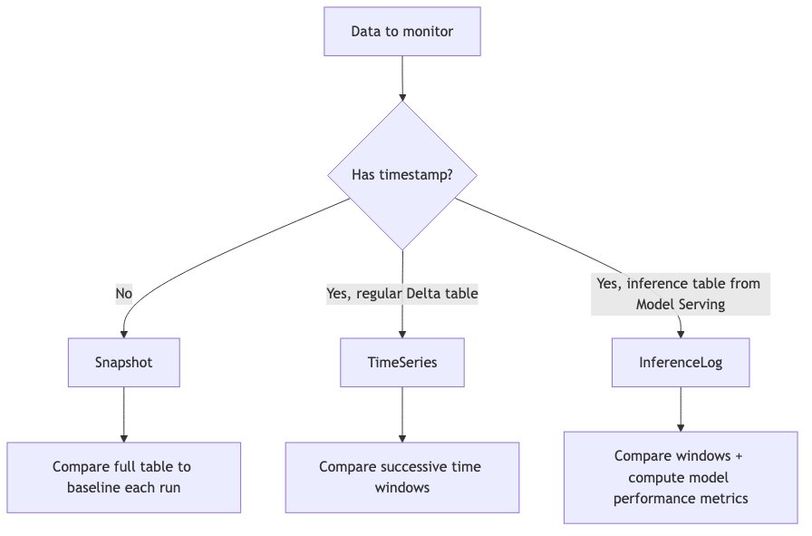

| Profile type | Use case | Required fields |
|---|---|---|
| **Snapshot** | Reference table / static lookup (e.g., a feature snapshot, a customer master) | None beyond the table itself |
| **TimeSeries** | Regular Delta tables with a timestamp (events, transactions) | `timestamp_col` |
| **InferenceLog** | Inference tables auto-created by Model Serving | `timestamp_col`, `prediction_col`, `model_id_col`, optional `label_col` |

The exam will give a scenario and ask which monitor type fits. Memorize the decision tree.

⚠️ **Exam trap:** picking TimeSeries for inference data. InferenceLog is the **specialized** profile for inference tables; it adds model performance metrics (accuracy, RMSE, etc.) on top of drift. TimeSeries would compute drift but not link to model versions or performance.

⚠️ **Exam trap 2:** picking Snapshot for a streaming event table. The right answer is TimeSeries — Snapshot would re-evaluate the entire table each run (cost), and miss the time-based drift story.

---

## Creating a monitor — the canonical API

### Snapshot monitor

```python
from databricks.sdk import WorkspaceClient
from databricks.sdk.service.catalog import (
    MonitorSnapshot, MonitorInfoStatus, MonitorCronSchedule
)

w = WorkspaceClient()

w.quality_monitors.create(
    table_name="prod.fraud.customer_master",  # the table being monitored
    assets_dir="/Shared/lakehouse-monitoring/customer_master",
    output_schema_name="prod.ml_monitoring",  # where _profile and _drift tables land
    snapshot=MonitorSnapshot(),
    slicing_exprs=["region", "customer_tier"],
    schedule=MonitorCronSchedule(
        quartz_cron_expression="0 0 6 * * ?",  # 6 AM UTC daily
        timezone_id="UTC",
    ),
)
```

### TimeSeries monitor

```python
from databricks.sdk.service.catalog import MonitorTimeSeries

w.quality_monitors.create(
    table_name="prod.fraud.transactions",
    assets_dir="/Shared/lakehouse-monitoring/transactions",
    output_schema_name="prod.ml_monitoring",
    time_series=MonitorTimeSeries(
        timestamp_col="event_ts",
        granularities=["5 minutes", "1 hour", "1 day"],
    ),
    slicing_exprs=["country", "merchant_category"],
    schedule=MonitorCronSchedule(
        quartz_cron_expression="0 0 * * * ?",  # hourly
        timezone_id="UTC",
    ),
)
```

### InferenceLog monitor

```python
from databricks.sdk.service.catalog import MonitorInferenceLog

w.quality_monitors.create(
    table_name="prod.ml.fraud_endpoint_payload",  # the inference table
    assets_dir="/Shared/lakehouse-monitoring/fraud",
    output_schema_name="prod.ml_monitoring",
    inference_log=MonitorInferenceLog(
        timestamp_col="timestamp_ms",
        granularities=["5 minutes", "1 hour", "1 day"],
        model_id_col="model_version",
        prediction_col="prediction",
        label_col="label",                     # joined-in later from ground truth
        problem_type="PROBLEM_TYPE_CLASSIFICATION",  # or _REGRESSION
    ),
    slicing_exprs=["region", "customer_segment"],
    schedule=MonitorCronSchedule(
        quartz_cron_expression="0 */15 * * * ?",  # every 15 min
        timezone_id="UTC",
    ),
)
```

**`granularities`** is exam-relevant. Each granularity means "compute metrics aggregated to this time bucket." Common combos: `["1 hour", "1 day"]` for transactional data; `["5 minutes", "1 hour"]` for high-frequency endpoints.

⚠️ **Exam trap:** providing the inference log's `label_col` but the actual table doesn't have it joined yet. The monitor will run but performance metrics will be NULL. The right pattern: a separate Lakeflow Job joins ground-truth labels into the inference table on a delayed schedule; the monitor then sees them on the next run.

---

## Output tables

Every monitor produces two output Delta tables in the `output_schema_name`:

### `<table>_profile_metrics`

One row per (window × slice × column × log_type). Columns include:

- `window` (StructType with `start`, `end`).
- `granularity` (e.g., `"1 hour"`).
- `slice_key`, `slice_value` (e.g., `region`, `"US"`; null for full-table).
- `log_type` — `"INPUT"`, `"PREDICTION"`, or `"BASELINE"`.
- `column_name`.
- Numeric metrics: `count`, `num_nulls`, `null_proportion`, `distinct_count`, `min`, `max`, `mean`, `stddev`, `percentile_25`, `percentile_50` (median), `percentile_75`, `percentile_95`, `percentile_99`.
- For InferenceLog with labels: `accuracy_score`, `precision`, `recall`, `f1`, `confusion_matrix` (struct).

### `<table>_drift_metrics`

One row per (window × slice × column × drift_type) where `drift_type` is `BASELINE` (vs baseline table) or `CONSECUTIVE` (vs the previous window).

- `chi_squared_test` (struct: `statistic`, `pvalue`) — categorical.
- `ks_test` (struct: `statistic`, `pvalue`) — numerical.
- `js_distance` — Jensen-Shannon distance.
- `tv_distance` — total variation distance.
- `wasserstein_distance` — Wasserstein.
- `population_stability_index` — PSI (binned KL divergence).

### Querying for drift

```sql
SELECT
  window.start AS window_start,
  slice_key,
  slice_value,
  column_name,
  ks_test.statistic AS ks_stat,
  ks_test.pvalue AS ks_p,
  js_distance,
  drift_type
FROM prod.ml_monitoring.fraud_endpoint_payload_drift_metrics
WHERE drift_type = 'CONSECUTIVE'
  AND window.start > current_timestamp() - INTERVAL 7 DAYS
  AND (ks_test.pvalue < 0.01 OR js_distance > 0.1)
ORDER BY window.start DESC;
```

---

## Statistical tests — the mapping that the exam grills

The Section 2 objective: *"Apply any statistical tests from the drift metrics table in Lakehouse Monitoring to detect drift in numerical and categorical data."*

| Test | Data type | What it measures | Decision rule |
|---|---|---|---|
| **Kolmogorov-Smirnov (KS)** | Numerical / continuous | Max absolute difference between empirical CDFs | `pvalue < α` (e.g., 0.01) → drift |
| **Chi-square** | Categorical | Frequency-table divergence | `pvalue < α` → drift |
| **Jensen-Shannon (JS)** | Categorical or binned numerical | Symmetric KL; bounded [0, log 2] | `js_distance > threshold` (e.g., 0.1) → drift |
| **Wasserstein (Earth Mover's)** | Numerical | Distance between distributions, shape-aware | `wasserstein > threshold` (domain-specific) → drift |
| **Total Variation Distance (TVD)** | Categorical | Max-abs PMF difference | `tv_distance > threshold` (e.g., 0.1) → drift |
| **Population Stability Index (PSI)** | Binned numerical or categorical | Sum of (P_i − Q_i) ln(P_i/Q_i) over bins | `PSI > 0.1` significant; `>0.25` major |

**Critical mapping mistakes the exam exploits:**

- **KS on categorical data** is wrong (KS uses CDFs; categorical has no meaningful CDF without ordering).
- **Chi-sq on continuous data** is wrong (it expects discrete buckets; binning first works but then it's binned-categorical, not continuous).
- **Wasserstein on categorical data** is wrong (no distance metric between unordered categories).
- **JS works for both** if the data is properly discretized (categorical naturally, numerical via binning).

⚠️ **Exam trap:** any answer that uses KS for a `merchant_category` column or Chi-sq for an `amount` column. Always wrong.

---

## Drift type taxonomy — the four types

Section 2 objective: *"Detect data drift by comparing current data distributions to a known baseline or between successive time windows."*

| Drift type | What changes | Detectable from |
|---|---|---|
| **Feature drift / covariate shift** | P(X) — input distribution | Input columns alone (KS, Chi-sq, etc.) |
| **Label drift / prior shift** | P(Y) — label distribution | Label column (requires ground truth) |
| **Prediction drift** | P(Ŷ) — model output distribution | Prediction column in inference table (no labels needed; **early-warning signal**) |
| **Concept drift** | P(Y\|X) — relationship between features and label | Joint analysis of features + labels; **cannot detect from features alone** |

⚠️ **Exam trap (recurring):** "Detect concept drift by running KS tests on input features." **Always wrong.** Concept drift requires labels — you need to compare the conditional distribution.

**Why prediction drift is gold:** labels are slow (ground-truth for a fraud transaction comes back from chargebacks weeks later). Predictions are immediate. A sudden shift in prediction distribution is an actionable early signal even if you can't yet measure label drift or concept drift.

---

## Baselines — two modes

A monitor can compare to:

1. **A baseline table** — a fixed reference Delta table (typically the training data snapshot). Pass `baseline_table_name=` when creating the monitor.
2. **Previous time windows** — TimeSeries and InferenceLog monitors automatically compute window-over-window drift (`drift_type='CONSECUTIVE'`).

```python
w.quality_monitors.create(
    table_name="prod.fraud.transactions",
    baseline_table_name="prod.fraud.training_snapshot_v3",  # ← key parameter
    time_series=MonitorTimeSeries(...),
    ...
)
```

**When to use baseline:** when you want absolute "is this drifting from what we trained on?" detection. Useful at model release time.

**When to use consecutive windows:** when you want "is something changing right now?" — robust to slow distribution evolution that's expected.

⚠️ **Exam trap:** assuming a monitor automatically uses the training data as baseline. It does **not** — you must declare the baseline table explicitly. Without it, you only get consecutive-window drift.

---

## Slicing — Section 2 objective

Objective: *"Evaluate metrics based on different data granularities and feature slicing."*

Slicing computes metrics per slice value, in addition to per-table.

```python
slicing_exprs=[
    "region",                                  # categorical slice on `region`
    "customer_segment",                        # another
    "amount > 1000",                           # boolean slice (true/false)
    "case when score > 0.8 then 'high' else 'low' end",  # derived slice
]
```

Each slice expression contributes rows to the metrics tables with `slice_key` + `slice_value` populated. Querying:

```sql
SELECT
  slice_key,
  slice_value,
  column_name,
  ks_test.pvalue
FROM prod.ml_monitoring.transactions_drift_metrics
WHERE slice_key = 'region'
  AND ks_test.pvalue < 0.01
ORDER BY window.start DESC;
```

**Why slicing matters:** an overall drift test might say "no drift" but the US-only or enterprise-customer slice could be drifting heavily — the masking effect. **Per-slice analysis is the canonical way to catch sub-population drift.**

⚠️ **Exam trap:** assuming the monitor only computes overall stats. With `slicing_exprs=`, it computes per-slice; without, only overall. The exam scenario will hint at "we need to detect drift per region" → you must add the slice.

---

## Custom metrics — Section 2 objective

Objective: *"Define custom metrics in Lakehouse Monitoring metrics tables."*

Beyond the built-in stats, you can compute custom metrics — per-slice F1 against joined labels, business KPIs, domain-specific scores.

```python
from databricks.sdk.service.catalog import (
    MonitorMetric, MonitorMetricType,
)

custom_metrics = [
    MonitorMetric(
        type=MonitorMetricType.CUSTOM_METRIC_TYPE_AGGREGATE,
        name="approval_rate",
        input_columns=["prediction"],
        definition="avg(case when prediction = 1 then 1.0 else 0.0 end)",
        output_data_type="DOUBLE",
    ),
    MonitorMetric(
        type=MonitorMetricType.CUSTOM_METRIC_TYPE_DERIVED,
        name="error_rate",
        input_columns=["prediction", "label"],
        definition="avg(case when prediction != label then 1.0 else 0.0 end)",
        output_data_type="DOUBLE",
    ),
    MonitorMetric(
        type=MonitorMetricType.CUSTOM_METRIC_TYPE_DRIFT,
        name="approval_rate_drift",
        input_columns=["prediction"],
        definition="abs(avg(case when prediction = 1 then 1.0 else 0.0 end) - avg_baseline)",
        output_data_type="DOUBLE",
    ),
]

w.quality_monitors.create(
    ...
    custom_metrics=custom_metrics,
)
```

Three custom-metric types:

- **AGGREGATE** — a per-window stat (e.g., approval rate). Appears in profile metrics table.
- **DERIVED** — same window, multi-column (e.g., error rate from prediction + label).
- **DRIFT** — compares the metric across windows or against baseline. Appears in drift metrics table.

⚠️ **Exam trap:** an answer that defines a custom metric without specifying the type. The type determines where the metric lands (profile vs drift table).

---

## Refreshes

A monitor's `schedule` defines when it runs automatically. You can also trigger manually:

```python
w.quality_monitors.run_refresh(table_name="prod.fraud.transactions")
```

Wait for completion:

```python
refresh = w.quality_monitors.list_refreshes(table_name="prod.fraud.transactions")
for r in refresh:
    if r.state == "RUNNING":
        # poll until done
        ...
```

In a Lakeflow Job, you can chain: training → register → manual monitor refresh → check metrics.

---

## Alerts — Section 2 objective

Objective: *"Design and configure alerting mechanisms when drift metrics exceed thresholds."*

The canonical pattern: **Databricks SQL Alert** on a SQL query against the `_drift_metrics` table.

```sql
-- The query backing the alert
SELECT COUNT(*) AS drift_rows
FROM prod.ml_monitoring.fraud_endpoint_payload_drift_metrics
WHERE window.start > current_timestamp() - INTERVAL 1 HOUR
  AND drift_type = 'CONSECUTIVE'
  AND (
    ks_test.pvalue < 0.001                          -- numerical column drift
    OR chi_squared_test.pvalue < 0.001              -- categorical column drift
    OR js_distance > 0.15                           -- JS divergence breach
  );
```

Configure the alert: trigger when `drift_rows > 0`. Notify a Slack webhook, an email distribution list, or PagerDuty.

```python
from databricks.sdk.service.sql import (
    Alert, AlertCondition, AlertOperand,
)

# Create via SDK (simplified)
alert = w.alerts_v2.create(
    display_name="Fraud Endpoint Drift Alert",
    parent_path="/Users/me@org",
    query_text="SELECT COUNT(*) AS drift_rows FROM prod.ml_monitoring.fraud_endpoint_payload_drift_metrics WHERE ...",
    condition=AlertCondition(
        operand=AlertOperand(column="drift_rows", op=">", threshold=0),
    ),
    notify=[
        # Slack webhook destination, or email, or PagerDuty
    ],
)
```

**Alert → automated retraining:**

The Section 2 objective: *"Implement automated retraining workflows triggered by data drift detection or performance degradation alerts."*

The full chain:

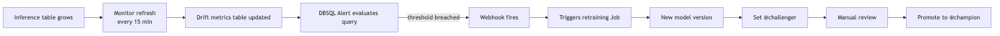

⚠️ **Exam trap:** auto-promoting `@challenger → @champion` from a drift alert without human gate. In regulated industries, alerts trigger *retraining*; promotion requires manual approval.

---

## Monitoring pipelines — the key components

Section 2 objective: *"Identify the key components of common monitoring pipelines: logging, drift detection, model performance, model health."*

The four pillars:

| Pillar | What | Where it lives |
|---|---|---|
| **Logging** | Capture every inference request + response | Inference tables (auto-enabled on endpoint) |
| **Drift detection** | Compare current data to baseline / previous window | Lakehouse Monitoring `_drift_metrics` table |
| **Model performance** | Accuracy / AUC / F1 over time | InferenceLog profile metrics with `label_col` joined |
| **Model health** | Latency, request rate, error rate, CPU / memory | Endpoint metrics (Module 16) |

The exam asks "design a monitoring pipeline" — these four must be present. Missing any one is the wrong answer.

---

## Permissions

Lakehouse Monitoring metric tables are regular UC tables in the `output_schema_name`. Grant `SELECT` to whoever needs to query.

```sql
GRANT USAGE ON SCHEMA prod.ml_monitoring TO `ml-platform-team`;
GRANT SELECT ON SCHEMA prod.ml_monitoring TO `ml-platform-team`;
```

The monitor itself has a separate permission model — `EDITOR`, `VIEWER` — set via the SDK.

---

## Mermaid: the full monitoring picture

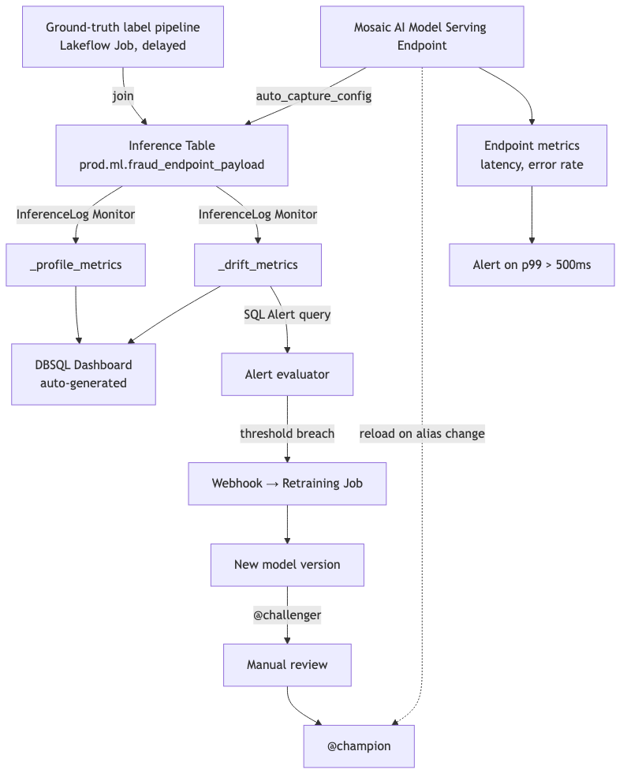

---

## Look-alike API comparison — `quality_monitors.create` surface

### Full `CreateMonitor` parameter table

| Parameter | Purpose | Required? |
|---|---|---|
| `table_name` | UC three-level name of the table being monitored | Yes |
| `assets_dir` | Workspace path for the monitor dashboard + assets (e.g. `/Shared/lakehouse-monitoring/<name>`) | Yes |
| `output_schema_name` | UC schema where `_profile_metrics` + `_drift_metrics` tables land | Yes |
| `snapshot` / `time_series` / `inference_log` | The profile type — exactly one | Yes (exactly one) |
| `baseline_table_name` | Fixed reference table for "baseline" drift comparisons | Optional; without it you only get consecutive-window drift |
| `slicing_exprs` | List of SQL expressions; metrics computed per slice | Optional |
| `custom_metrics` | List of `MonitorMetric(...)` | Optional |
| `schedule` | `MonitorCronSchedule` for automatic refresh | Optional (manual otherwise) |
| `notifications` | `MonitorNotifications(on_failure=, on_new_classification_tag_detected=)` | Optional |
| `data_classification_config` | PII classification scanning | Optional |
| `skip_builtin_dashboard` | If `True`, no auto-generated dashboard | Optional |

### Profile-type sub-spec look-alikes

| Profile | Fields | Required field |
|---|---|---|
| `MonitorSnapshot()` | (no fields) | — |
| `MonitorTimeSeries(timestamp_col=, granularities=)` | `timestamp_col` (required), `granularities` (list of strings like `"5 minutes"`, `"1 hour"`, `"1 day"`) | `timestamp_col` |
| `MonitorInferenceLog(timestamp_col=, granularities=, model_id_col=, prediction_col=, label_col=, problem_type=)` | `timestamp_col`, `granularities`, `model_id_col`, `prediction_col`, **`problem_type` (PROBLEM_TYPE_CLASSIFICATION or PROBLEM_TYPE_REGRESSION)** required; `label_col` optional but no perf metrics without it | `timestamp_col`, `prediction_col`, `model_id_col`, `problem_type` |

### Profile-type decision look-alikes

| Pair | Difference | Exam tell |
|---|---|---|
| `MonitorSnapshot()` vs `MonitorTimeSeries(timestamp_col=)` | Stateless full-table-vs-baseline vs window-over-window comparison | "table has no timestamp / refreshed wholesale daily" → Snapshot. "events with `event_ts`" → TimeSeries |
| `MonitorTimeSeries` vs `MonitorInferenceLog` | Generic time-series Delta table vs Mosaic AI inference table with model perf metrics | Inference table (auto-captured by serving endpoint) → InferenceLog. TimeSeries gives drift only, not performance metrics |
| `baseline_table_name=` set vs unset | Baseline (fixed reference) drift vs consecutive-window-only drift | "Compare to training data snapshot" → set baseline. "Detect change vs last hour" → unset |
| `granularities=["1 hour"]` vs `["1 hour","1 day"]` | One bucket size vs multiple bucket sizes | Multi-granularity = metrics at each level. Costs more storage but reveals both short and long trends |
| `slicing_exprs=["region"]` vs unset | Per-slice metrics vs overall only | "Detect drift per region" → slicing required. Without it, EU drift can be masked by global average |

### Custom metric types

| Type | Goes to | Use case |
|---|---|---|
| `CUSTOM_METRIC_TYPE_AGGREGATE` | `_profile_metrics` | One-window aggregate (e.g., approval rate) |
| `CUSTOM_METRIC_TYPE_DERIVED` | `_profile_metrics` | Multi-column same-window (e.g., error rate from pred + label) |
| `CUSTOM_METRIC_TYPE_DRIFT` | `_drift_metrics` | Window-vs-baseline / window-vs-window comparison |

### Output tables look-alikes

| Table | Granularity | Use for |
|---|---|---|
| `<table>_profile_metrics` | One row per (window × slice × column × log_type) | Distribution stats, model performance metrics |
| `<table>_drift_metrics` | One row per (window × slice × column × drift_type) | KS / chi-square / JS / Wasserstein / TVD / PSI |

`log_type` values for InferenceLog: `INPUT` (features), `PREDICTION` (model output), `BASELINE` (from baseline_table).
`drift_type` values: `BASELINE` (vs baseline_table) or `CONSECUTIVE` (vs previous window).

> 🎯 **How to recognize a Lakehouse Monitoring question on the exam:** the prompt names a table + a context (with/without timestamp, with/without labels, from a serving endpoint or not). Map: no timestamp → Snapshot. With timestamp + Mosaic AI inference table → InferenceLog. With timestamp but regular Delta table → TimeSeries. "Per-region drift" → `slicing_exprs`. "Performance trend over time" → InferenceLog with `label_col` (and a side pipeline that joins labels in later).

---

## Output-prediction drills

**Drill 1 — wrong profile for inference data:**
```python
w.quality_monitors.create(
    table_name="prod.ml.fraud_endpoint_payload",
    time_series=MonitorTimeSeries(timestamp_col="timestamp_ms", granularities=["1 hour"]),
    ...,
)
```
Q: What's lost vs using `InferenceLog`?
A: **Model performance metrics** (accuracy, precision, recall, F1, confusion matrix for classification; RMSE/MAE/R² for regression). TimeSeries gives drift stats only. The exam-correct profile for inference tables is `MonitorInferenceLog`.

**Drill 2 — `problem_type` mismatch:**
```python
MonitorInferenceLog(
    timestamp_col="ts", prediction_col="pred", model_id_col="model_v",
    problem_type="PROBLEM_TYPE_CLASSIFICATION",  # but pred is a float regression output
    label_col="label", granularities=["1 hour"],
)
```
Q: What happens?
A: The monitor runs but computes classification metrics on regression outputs → meaningless metrics (e.g., "accuracy" on continuous predictions). Always match `problem_type` to the model.

**Drill 3 — missing baseline:**
```python
w.quality_monitors.create(
    table_name="prod.fraud.transactions",
    time_series=MonitorTimeSeries(timestamp_col="event_ts", granularities=["1 hour"]),
    # no baseline_table_name
    ...,
)
```
Q: What's in `_drift_metrics`?
A: Only `drift_type='CONSECUTIVE'` rows (window-vs-previous-window). No `drift_type='BASELINE'` rows. If the exam asks "compare to training data," you'd need `baseline_table_name=` set.

**Drill 4 — slicing requirement:**
Overall drift test = "no drift," but EU region's `amount` distribution shifted heavily.
Q: What did the monitor configuration miss?
A: `slicing_exprs=["region"]`. The overall average masks the EU shift. Add the slice expr to surface per-region drift rows.

**Drill 5 — custom metric type confusion:**
```python
MonitorMetric(
    type=MonitorMetricType.CUSTOM_METRIC_TYPE_AGGREGATE,
    name="error_rate", input_columns=["prediction"],
    definition="avg(case when prediction != label then 1.0 else 0.0 end)",
    output_data_type="DOUBLE",
)
```
Q: Bug?
A: Uses `label` in the definition but only `prediction` is listed in `input_columns`. For multi-column metrics that depend on prediction + label, use `CUSTOM_METRIC_TYPE_DERIVED` and list both: `input_columns=["prediction","label"]`.

**Drill 6 — granularities cost:**
Comparing `granularities=["5 minutes","1 hour","1 day"]` vs `["1 day"]`.
Q: Storage/compute impact?
A: The 3-granularity setup computes ~288× more rows per day (5-min buckets) + 24× (hourly) + 1× (daily). Each bucket × each slice × each column = profile/drift row. Storage and refresh-cost grow proportionally. Pick the minimum granularity set the use case actually needs.

**Drill 7 — drift detected, what next?**
DBSQL alert fires: `ks_test.pvalue < 0.001` on `amount` column for the past hour.
Q: Exam-correct response chain?
A: Webhook → triggers retraining Job → new model version registered → `@challenger` alias set → **manual gate** → `@champion` reassigned if challenger validates. Don't auto-promote to `@champion` in a regulated context.

---

## Decision rules

> 🎯 **"Inference table from Model Serving" → `MonitorInferenceLog`.** Never TimeSeries on an inference table (loses model perf).

> 🎯 **"Table has no timestamp / replaced wholesale" → `MonitorSnapshot`.** A timestamp-less table can only be compared full-table to baseline.

> 🎯 **"Compare to training distribution" → set `baseline_table_name=`.** Without it, only consecutive-window drift is computed.

> 🎯 **"Detect drift per slice (region/segment)" → `slicing_exprs=[...]`.** Without it, slice drift gets masked.

> 🎯 **"Sub-hour buckets needed" → add `"5 minutes"` (or smaller) to `granularities`.** Default day-only buckets hide intra-day shifts.

> 🎯 **"Per-window business KPI like approval rate" → `CUSTOM_METRIC_TYPE_AGGREGATE`.** Multi-column (e.g., error rate using pred + label) → `CUSTOM_METRIC_TYPE_DERIVED`. Custom drift comparison → `CUSTOM_METRIC_TYPE_DRIFT`.

> 🎯 **"Concept drift" → labels required.** Cannot be inferred from features. Set `label_col=` on InferenceLog and run a label-join pipeline.

> 🎯 **"Drift alert → retraining" → DBSQL Alert on `_drift_metrics` → webhook → Job → `@challenger`. Never auto-`@champion`.**

> 🎯 **"Endpoint health (latency/error rate/CPU/RAM)" → endpoint metrics in Module 16, not Lakehouse Monitoring.** Lakehouse Monitoring covers data + model performance; endpoint infra metrics are a separate surface.

---

## End-to-end mini-scenario — full monitoring pipeline for a fraud serving endpoint

```python
from databricks.sdk import WorkspaceClient
from databricks.sdk.service.catalog import (
    MonitorInferenceLog, MonitorCronSchedule, MonitorMetric, MonitorMetricType,
)

w = WorkspaceClient()

# 1. Endpoint already configured (Module 14) with auto_capture_config to produce
#    inference table at: prod.ml.fraud_endpoint_payload
#    (columns: timestamp_ms, request, response.prediction, model_version, ...)

# 2. Side pipeline (Lakeflow Job) joins ground-truth chargeback labels into the
#    inference table on a 24-hour delay → adds `label` column.

# 3. Create the InferenceLog monitor
w.quality_monitors.create(
    table_name="prod.ml.fraud_endpoint_payload",
    assets_dir="/Shared/lakehouse-monitoring/fraud-prod",
    output_schema_name="prod.ml_monitoring",
    inference_log=MonitorInferenceLog(
        timestamp_col="timestamp_ms",
        granularities=["1 hour", "1 day"],
        prediction_col="response.prediction",
        model_id_col="model_version",
        label_col="label",
        problem_type="PROBLEM_TYPE_CLASSIFICATION",
    ),
    baseline_table_name="prod.fraud.training_snapshot_v3",  # so we get BASELINE drift type
    slicing_exprs=["region", "customer_segment", "amount > 1000"],
    custom_metrics=[
        MonitorMetric(
            type=MonitorMetricType.CUSTOM_METRIC_TYPE_AGGREGATE,
            name="approval_rate",
            input_columns=["response.prediction"],
            definition="avg(case when `response.prediction` = 1 then 1.0 else 0.0 end)",
            output_data_type="DOUBLE",
        ),
        MonitorMetric(
            type=MonitorMetricType.CUSTOM_METRIC_TYPE_DERIVED,
            name="false_negative_rate",
            input_columns=["response.prediction", "label"],
            definition="sum(case when `response.prediction`=0 and label=1 then 1.0 else 0.0 end)/nullif(sum(case when label=1 then 1.0 else 0.0 end),0)",
            output_data_type="DOUBLE",
        ),
    ],
    schedule=MonitorCronSchedule(quartz_cron_expression="0 0 * * * ?", timezone_id="UTC"),
)

# 4. DBSQL Alert on _drift_metrics
ALERT_SQL = """
SELECT COUNT(*) AS drift_rows
FROM prod.ml_monitoring.fraud_endpoint_payload_drift_metrics
WHERE window.start > current_timestamp() - INTERVAL 1 HOUR
  AND drift_type = 'CONSECUTIVE'
  AND (
    (column_name IN ('amount','txn_count_30d') AND ks_test.pvalue < 0.001)
    OR (column_name IN ('country','merchant_category') AND chi_squared_test.pvalue < 0.001)
    OR js_distance > 0.15
  )
"""
# Alert fires → webhook → Databricks Job that:
#   (a) retrains a challenger
#   (b) registers it as a new version
#   (c) sets @challenger alias
#   (d) waits for human gate before flipping @champion
```

Pillar audit (per the exam objective on "key components of monitoring pipelines"):

1. **Logging:** inference table via `auto_capture_config` on endpoint (Module 14).
2. **Drift detection:** `_drift_metrics` table populated by the monitor above.
3. **Model performance:** `_profile_metrics` accuracy/precision/recall via `label_col`.
4. **Model health:** endpoint metrics (latency, error rate, CPU, RAM) via Mosaic AI's endpoint metrics surface (Module 16) — **not** Lakehouse Monitoring.

All four pillars present = exam-correct monitoring pipeline. Missing any one = wrong answer.

---

## Mini quiz

1. You're monitoring a table of customer master records — no timestamp, periodically replaced. Which profile type?
2. A serving endpoint logs predictions and is later joined with chargeback labels. Which profile type?
3. Drift on `amount` (continuous) — which test? Drift on `country_code` (categorical) — which test?
4. Can you detect concept drift from input features alone? Why or why not?
5. Where do `_profile_metrics` and `_drift_metrics` tables go?
6. You want hourly buckets and daily summaries. How do you specify this?
7. The monitor's overall drift test says "no drift" but a stakeholder reports the EU region behavior changed. What did you forget?
8. Without a baseline table, what comparisons can the monitor still do?
9. The four pillars of a monitoring pipeline?
10. Alert fires on drift. What's the exam-correct next step in a regulated industry?

**Answers:**

1. **Snapshot.** No timestamp; compare full table to baseline each run.
2. **InferenceLog.** Specialized for inference tables; computes performance metrics on top of drift when `label_col` is provided.
3. KS for `amount` (numerical continuous). Chi-square for `country_code` (categorical). (JS or TVD also valid for categorical.)
4. **No.** Concept drift = P(Y|X) change. Requires labels (Y). Input features alone show only P(X) — feature drift, not concept drift.
5. In the `output_schema_name` UC schema you specified when creating the monitor (e.g., `prod.ml_monitoring`).
6. `granularities=["1 hour", "1 day"]` — the monitor computes per-bucket metrics at both granularities.
7. **Slicing.** `slicing_exprs=["region"]` would have computed per-region drift; without it, the EU drift was masked by the overall average. Add the slice expression.
8. Consecutive-window drift (`drift_type='CONSECUTIVE'`) — window-over-window comparison. You still get profile metrics for the current window.
9. **Logging** (inference table) + **drift detection** (drift metrics) + **model performance** (profile metrics with labels) + **model health** (endpoint latency / error rate).
10. **Trigger automated retraining** to produce a new `@challenger`. **Do not auto-promote to `@champion`** — promotion requires manual review/approval in regulated contexts.

---

## Sanity check

- Could you write a TimeSeries monitor and an InferenceLog monitor from memory?
- Do you know the exact tests-by-data-type mapping (KS / Chi-sq / JS / Wasserstein / TVD)?
- Could you explain why concept drift can't be detected from features alone?
- Do you know what `slicing_exprs` does and when it's required?
- Could you design the alert → retraining → challenger → manual gate → champion chain?

This is **the most-tested module of the exam.** If anything above feels uncertain, re-read before moving on.

Move on to [Module 11 — Drift Detection (deep)](11_drift_detection.md) for more on the statistical side.


\newpage

# Module 11 — Drift Detection (Deep)

> **Goal of this module:** the statistical machinery behind drift detection — what each test actually does, when each is right, how to set thresholds, and how to design end-to-end drift-triggered retraining workflows. This complements Module 10 (the platform's API surface) with the **statistics**.
>
> **Assumes:** Module 10. Some familiarity with hypothesis testing.

---

## Coverage map (verbatim Sept 30 2025 exam objectives → where taught)

| Verbatim objective | Section anchor |
|---|---|
| Apply any statistical tests from the drift metrics table in Lakehouse Monitoring to detect drift in numerical and categorical data | "Drift test selection decision tree" + per-test sections |
| Detect data drift by comparing current data distributions to a known baseline or between successive time windows | "Baseline vs consecutive comparisons" |
| Implement automated retraining workflows triggered by data drift detection or performance degradation alerts | "Drift-triggered retraining pattern" |

> Cross-references: Module 10 (the platform API that ships these tests); Module 09 (the CI/CD wiring around retraining); Module 13 (inference table = the data the drift tests run on).

---

## Drift test selection decision tree — burn into memory

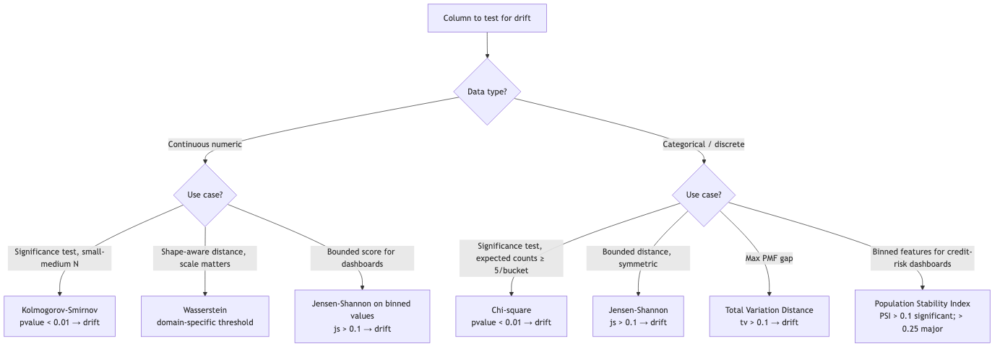

| Test | Data type | What it measures | Lakehouse Monitoring column | Decision rule |
|---|---|---|---|---|
| **Kolmogorov-Smirnov** | Numerical / continuous | Max abs diff between empirical CDFs | `ks_test.statistic`, `ks_test.pvalue` | `pvalue < 0.01` (or `< 0.001` for very large N) |
| **Chi-square** | Categorical | Frequency-table divergence (requires expected counts ≥ 5/bucket) | `chi_squared_test.statistic`, `chi_squared_test.pvalue` | `pvalue < 0.01` |
| **Jensen-Shannon** | Categorical (or binned numerical) | Symmetric KL; bounded [0, log 2] | `js_distance` | `> 0.1` (typical), `> 0.2` (large) |
| **Wasserstein (Earth-Mover's)** | Numerical | Distance between distributions, scale-aware | `wasserstein_distance` | Domain-specific threshold |
| **Total Variation Distance** | Categorical | Max-abs PMF difference | `tv_distance` | `> 0.1` typical |
| **Population Stability Index (PSI)** | Binned numerical or categorical | Sum of `(P_i − Q_i) ln(P_i/Q_i)` | `population_stability_index` | `> 0.1` significant; `> 0.25` major |

> 🎯 **How to recognize on the exam:** the prompt gives a **column name + data type**. Map mechanically:
> - Numeric continuous (`amount`, `latency`, `temperature`) → KS (significance) or Wasserstein (scale-aware) or PSI (binned).
> - Categorical (`country`, `merchant_category`, `device_type`) → Chi-square (significance with ≥ 5 counts/bucket) or JS / TVD (distance).
> - The most-tested distractor: KS on categorical, Chi-square on continuous. Both **always wrong**.

> 🎯 **N-sensitivity rule:** at very large N (millions of predictions per window), p-values approach 0 even for trivial differences. Pair the p-value alert with a **distance-based** metric (JS or Wasserstein) to filter out statistically-significant-but-practically-irrelevant drift.

---

## The four types of drift — precise definitions

| Type | Formal definition | Plain English | Detectable from |
|---|---|---|---|
| **Feature drift / covariate shift** | P(X) changes; P(Y\|X) constant | Input distributions shift, but the model's learned relationship still holds | Input features alone |
| **Label drift / prior shift** | P(Y) changes; P(X\|Y) constant | Outcome rates change but features-given-label is stable | Labels (delayed; may need joining) |
| **Prediction drift** | P(Ŷ) changes | Model's outputs distribute differently | Predictions in inference table (immediate) |
| **Concept drift** | P(Y\|X) changes | Relationship between features and outcome has shifted | Joint features + labels |

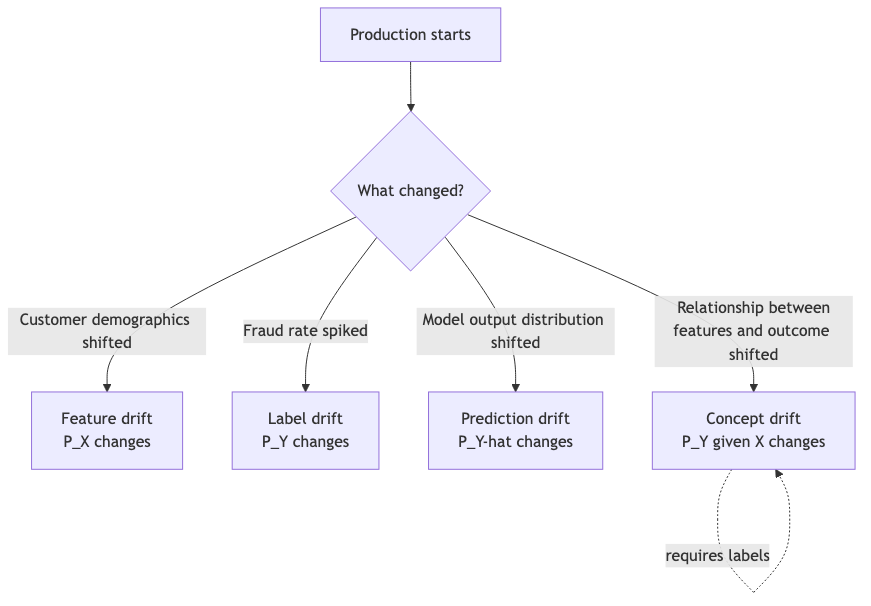

The exam grills you on the distinction. Read these definitions until each one is intuitive.

---

## Why each drift type matters operationally

- **Feature drift** is the most commonly detected because input data is observable in real time. But it's the **least actionable** alone — feature shift without label shift may just mean the customer base evolved; the model can still be correct.
- **Prediction drift** is **the early warning** in production. Predictions are immediate; labels are delayed. A sudden change in P(Ŷ) flags "something is different about the data the model is being asked about" without waiting weeks for label arrival.
- **Label drift** matters because the prior probability of outcomes affects calibration. If fraud rate doubles, a model trained on a 1% baseline is mis-calibrated.
- **Concept drift** is the most damaging — the underlying relationship the model learned no longer holds. **Hardest to detect** because it requires labels.

---

## Kolmogorov-Smirnov test

**Use case:** detect drift in a numerical / continuous column.

**What it measures:** the maximum absolute difference between two empirical cumulative distribution functions.

$$D_{n,m} = \sup_x |F_{1,n}(x) - F_{2,m}(x)|$$

```python
from scipy.stats import ks_2samp

statistic, pvalue = ks_2samp(baseline_sample, current_sample)
# pvalue < 0.01 → reject null hypothesis that samples come from the same distribution
```

**Threshold guidance:** in Lakehouse Monitoring, `ks_test.pvalue < 0.01` is a reasonable alert threshold. For very high QPS (millions of predictions per window), use stricter thresholds (`< 0.001`) because p-values become extremely small under huge sample sizes even for tiny meaningful differences.

⚠️ **Exam trap:** KS on categorical data. The CDF of `country_code` is meaningless without ordinal structure. Always wrong.

⚠️ **The "n is too large" issue:** with millions of samples, KS p-values approach 0 even for distributions that differ only trivially. **Effect size matters more than significance.** Pair p-value alerts with JS distance or Wasserstein distance thresholds.

---

## Chi-square test

**Use case:** detect drift in a categorical column.

**What it measures:** divergence between observed frequency counts and expected (baseline) counts.

$$\chi^2 = \sum_i \frac{(O_i - E_i)^2}{E_i}$$

```python
from scipy.stats import chi2_contingency

# Build a contingency table: rows = baseline counts, current counts; columns = categories
baseline_counts = baseline_df["country_code"].value_counts()
current_counts = current_df["country_code"].value_counts()
contingency = pd.concat([baseline_counts, current_counts], axis=1).fillna(0).T

chi2, pvalue, dof, expected = chi2_contingency(contingency)
```

**Threshold guidance:** `pvalue < 0.01` typical. Larger DOF (many categories) means more sensitivity.

⚠️ **Exam trap:** Chi-sq on continuous data without binning. Wrong — Chi-sq requires discrete bins. If you bin first, you've made it categorical (and the test is now on the bins, not the underlying continuous distribution).

⚠️ **Sparse categories:** chi-sq is unreliable when expected counts in cells fall below 5. The platform handles small expected counts, but be aware that a category that appears rarely in baseline but commonly in current data flags as drift — usually correctly.

---

## Jensen-Shannon divergence

**Use case:** detect drift in **either** categorical or binned numerical data.

**What it measures:** symmetrized KL divergence between two probability distributions, bounded in [0, log 2].

$$JS(P||Q) = \frac{1}{2} KL(P||M) + \frac{1}{2} KL(Q||M), \text{ where } M = \frac{P+Q}{2}$$

```python
from scipy.spatial.distance import jensenshannon

# Both must be probability distributions (sum to 1)
js_distance = jensenshannon(baseline_pmf, current_pmf, base=2)
# Values: 0 = identical; ~0.83 = log2(2)^0.5 maximum
```

**Threshold guidance:** `js_distance > 0.1` is a common alert; `> 0.2` is significant; `> 0.3` is severe. Adjust per use case.

**Why JS shines:**

- **Bounded** (0 to ~0.83) — interpretable across columns and use cases.
- **Symmetric** — direction doesn't matter.
- **Smooth** — small distribution changes produce small JS values; no abrupt threshold artifacts.
- **Works on both categorical and binned numerical** — one test that generalizes.

The Lakehouse Monitoring default test for categorical drift surfacing in dashboards is often JS (or PSI for binned numerical).

⚠️ **Exam trap:** treating JS p-value as the alert. JS is a **distance**, not a hypothesis test — there's no p-value. Use a threshold directly.

---

## Wasserstein (Earth Mover's) distance

**Use case:** detect drift in numerical data where you care about **how far** the distribution moved (not just whether it differs).

**What it measures:** the minimum cost to transform one distribution into another, where cost is a function of mass moved and distance moved.

For 1D distributions:

$$W_1(P, Q) = \int_{-\infty}^{\infty} |F_P(x) - F_Q(x)| dx$$

```python
from scipy.stats import wasserstein_distance

w = wasserstein_distance(baseline_sample, current_sample)
```

**Threshold guidance:** Wasserstein has the **same units as the data**. For an `amount` column in dollars, a Wasserstein of $50 means the average customer spends $50 more (or less) than baseline. Domain-specific thresholds.

**When to prefer Wasserstein over KS:**

- KS detects *whether* distributions differ. Wasserstein quantifies *how much* in meaningful units.
- KS is sensitive to differences near the median; Wasserstein integrates differences across the whole range.
- For monitoring real-valued business metrics (revenue, latency), Wasserstein is more interpretable.

⚠️ **Exam trap:** Wasserstein on categorical data. No meaningful distance between unordered categories. Always wrong.

---

## Total Variation Distance

**Use case:** detect drift in categorical data with a simple, bounded distance metric.

$$TV(P, Q) = \frac{1}{2} \sum_i |P_i - Q_i|$$

```python
import numpy as np

def total_variation_distance(p, q):
    return 0.5 * np.sum(np.abs(np.array(p) - np.array(q)))
```

**Range:** [0, 1]. 0 = identical; 1 = totally disjoint.

**Threshold guidance:** `tv_distance > 0.1` is a common alert; `> 0.2` significant.

When to use TVD over JS: TVD is a simple linear metric; JS is information-theoretic. JS is more sensitive to relative differences in small probabilities; TVD treats all mass shifts uniformly. Both are valid for categorical drift; the exam treats them as equivalent answers in most scenarios.

---

## Population Stability Index (PSI)

**Use case:** binned numerical or categorical features — the **finance industry classic** drift metric.

$$PSI = \sum_i (P_i - Q_i) \ln\left(\frac{P_i}{Q_i}\right)$$

Where P and Q are the proportions in each bin for current and baseline.

```python
def psi(baseline_counts, current_counts, eps=1e-6):
    p = baseline_counts / baseline_counts.sum() + eps
    q = current_counts / current_counts.sum() + eps
    return float(((p - q) * np.log(p / q)).sum())
```

**Threshold guidance (finance industry convention):**

- `PSI < 0.1` — no significant change.
- `0.1 ≤ PSI < 0.25` — moderate change; investigate.
- `PSI ≥ 0.25` — major change; likely action required.

Why finance uses PSI: it predates ML monitoring, comes from credit risk models, and these thresholds are baked into regulatory documentation at banks.

⚠️ **Exam trap:** PSI on continuous data without binning. Bin first (typically 10 equal-frequency bins on the baseline), then compute.

---

## Choosing a test — decision tree

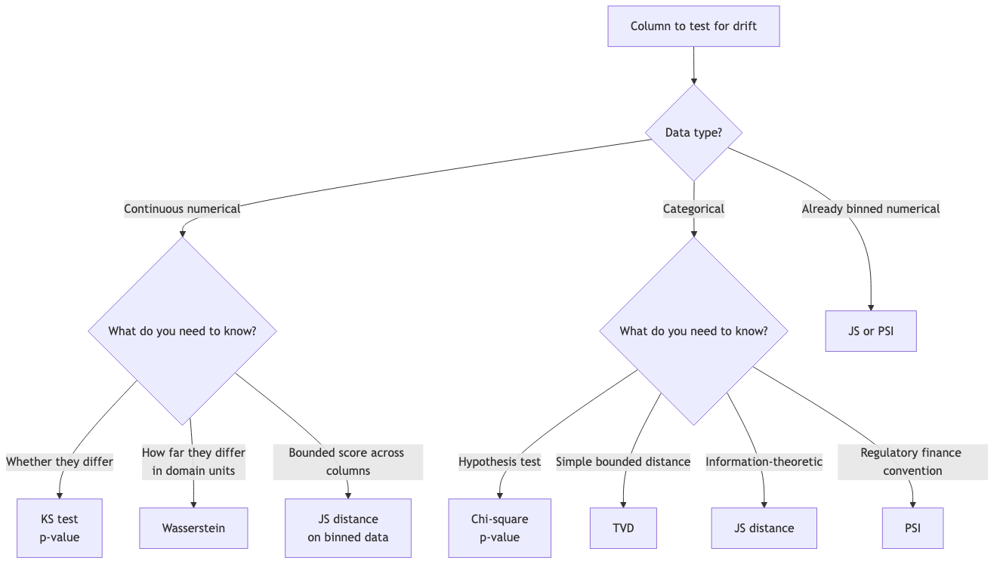

The exam typically wants the simplest correct mapping:

- Continuous → KS or Wasserstein.
- Categorical → Chi-sq or JS or TVD.

Pick KS / Chi-sq when the question mentions hypothesis testing or p-values. Pick JS / TVD / Wasserstein when the question mentions thresholds, bounded scores, or shape-aware comparison.

---

## Threshold setting — the under-discussed problem

**Common mistakes:**

- Setting one alert threshold across all columns. Some columns are noisy (always slight drift); others are stable. Calibrate per column.
- Relying on p-values alone with very large samples. With N=1M, anything is "statistically significant." Pair with effect-size thresholds.
- Triggering retraining on a single window's drift. False positives cause retraining storms.

**Better patterns:**

- **Sustained drift:** require K consecutive windows with drift before alerting. Add a `SELECT count(*) ... HAVING count(*) >= K` clause in the alert SQL.
- **Multi-test concurrence:** require both p-value AND effect-size thresholds breached.
- **Slice-aware:** alert when drift in a slice exceeds threshold AND that slice represents > X% of traffic.
- **Per-column thresholds:** maintain a config table mapping column → threshold, joined in the alert query.

```sql
WITH drift_history AS (
  SELECT
    column_name,
    window.start AS window_start,
    ks_test.pvalue AS ks_p,
    js_distance,
    LAG(ks_test.pvalue) OVER (PARTITION BY column_name ORDER BY window.start) AS prev_ks_p,
    LAG(ks_test.pvalue, 2) OVER (PARTITION BY column_name ORDER BY window.start) AS prev2_ks_p
  FROM prod.ml_monitoring.fraud_endpoint_payload_drift_metrics
  WHERE drift_type = 'CONSECUTIVE'
    AND window.start > current_timestamp() - INTERVAL 24 HOURS
)
SELECT COUNT(*) AS sustained_drifts
FROM drift_history
WHERE ks_p < 0.001
  AND prev_ks_p < 0.001
  AND prev2_ks_p < 0.001  -- three consecutive windows in breach
  AND js_distance > 0.15;
```

---

## Designing a retraining trigger

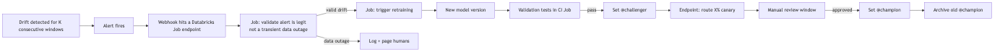

The **gate before retraining** (step D) catches a common failure mode: a data pipeline outage makes the inference table look like a distribution change. Without the gate, you retrain on broken data.

⚠️ **Exam trap:** auto-promotion of the retrained model to `@champion`. Manual review window is non-negotiable in regulated contexts (Modules 09, 12).

---

## Performance metrics vs drift metrics — the contrast

Drift answers: "Did the data change?"

Performance metrics answer: "Did the model's predictions remain accurate?"

| Drift detected | Performance dropped | Likely cause | Action |
|---|---|---|---|
| Yes | Yes | Concept drift or feature shift the model can't handle | Retrain |
| Yes | No | Benign feature shift; the relationship still holds | Investigate but don't retrain yet |
| No | Yes | Concept drift undetected by feature tests; or label-only shift; or unrelated production issue | Investigate root cause; check label quality |
| No | No | All good | Continue monitoring |

The exam can ask: "drift detected but accuracy unchanged — what's the right action?" Answer: monitor + investigate; **don't retrain on noise.**

---

## Custom drift metrics — your domain knowledge

Lakehouse Monitoring's custom metrics let you encode domain-specific signals. Examples:

- **Approval rate drift** for credit underwriting (Module 10's example).
- **Average claim severity** for insurance.
- **Geographic mix index** — Herfindahl-Hirschman of region distribution.
- **Per-tier acceptance rate** for tiered customer products.

```python
MonitorMetric(
    type=MonitorMetricType.CUSTOM_METRIC_TYPE_DRIFT,
    name="hhi_drift",
    input_columns=["country"],
    definition="""
      abs(
        sum(power(count(*) over (partition by window) / 
                  sum(count(*)) over (partition by window), 2))
        - hhi_baseline
      )
    """,
    output_data_type="DOUBLE",
)
```

⚠️ **Exam trap:** assuming Lakehouse Monitoring's built-in tests cover all monitoring needs. Custom metrics fill the gap — required for non-trivial business signals.

---

## Output-prediction drills — test selection patterns

For each scenario, pick the right test(s).

**Drill 1:** Column `transaction_amount` (continuous), baseline N=100K, current N=50K, business cares about scale.
A: **KS** for significance + **Wasserstein** for scale-aware effect size. JS on binned amounts is acceptable too if you want a bounded dashboard score.

**Drill 2:** Column `country_code` (~50 categories), with several having < 5 baseline counts.
A: **Chi-square is invalid** (expected counts < 5 violate the assumption). Use **JS distance** or **TVD** instead. If you must use Chi-square, merge the low-frequency buckets first.

**Drill 3:** Column `credit_score_band` (10 bins, derived from a continuous variable).
A: **PSI** is the standard for binned credit-risk features. JS works too. Chi-square works if counts/bucket ≥ 5.

**Drill 4:** Column `merchant_category` (200 categories, but only 30 frequent), and you want a dashboard with a single bounded number.
A: **JS distance** — bounded in [0, log 2], works for high-cardinality categorical. Chi-square would produce a huge stat that's hard to threshold consistently.

**Drill 5:** Inference-table column `prediction_proba` (continuous [0,1]) at 5M predictions/hour. KS p-value = 1e-30.
A: With N=5M, KS p-values are not actionable on their own. **Pair with JS/Wasserstein effect size**: if JS < 0.05, the difference is statistically significant but operationally trivial — don't fire.

**Drill 6:** Feature drift detected on `transaction_amount` (KS p < 0.001), but model `accuracy` and `F1` are unchanged.
A: **Don't retrain.** This is feature shift without concept shift — the learned relationship still holds for the new distribution. Investigate root cause; retraining on noise creates retraining storms.

**Drill 7:** Prediction drift detected (P(Ŷ) shifted from 5% positive to 15% positive). No labels yet.
A: **Early-warning signal** — start retraining-candidate pipeline (new challenger) but do **not** auto-promote without label-based validation. Could also indicate fraud-attack pattern; alert security.

**Drill 8:** You can only observe features and predictions (labels delayed 30 days). Can you detect concept drift now?
A: **No.** Concept drift requires labels. You can detect feature drift and prediction drift as **proxies**, but neither is sufficient. Wait for labels or use a feedback loop with delayed-label monitoring.

---

## Decision rules

> 🎯 **Continuous numeric + significance → KS.** Continuous + scale matters → Wasserstein. Continuous + binned for dashboard → JS.

> 🎯 **Categorical + significance + healthy counts (≥ 5 per bucket) → Chi-square.** Categorical + distance / bounded score → JS or TVD. Categorical + low-frequency buckets → JS (or merge buckets before Chi-square).

> 🎯 **Credit risk / binned features → PSI.** Industry standard; thresholds well-understood (0.1 moderate, 0.25 major).

> 🎯 **Very large N → always pair p-value alerts with distance metrics.** P-values lie under huge N.

> 🎯 **"Detect concept drift from features only" → impossible.** Always wrong on the exam.

> 🎯 **Feature drift without performance drop → investigate, don't retrain.** Concept drift = retrain. Label drift = recalibrate or retrain.

> 🎯 **Prediction drift without labels → early-warning; start challenger training, gate promotion on label-based validation.**

---

## End-to-end mini-scenario — multi-test alert SQL with effect-size gating

A fraud endpoint logs 5M predictions/hour. Configure an alert that fires only on meaningful drift.

```sql
WITH per_hour AS (
  SELECT
    window.start AS hour,
    column_name,
    ks_test.pvalue AS ks_p,
    chi_squared_test.pvalue AS chi_p,
    js_distance AS js,
    wasserstein_distance AS w
  FROM prod.ml_monitoring.fraud_endpoint_payload_drift_metrics
  WHERE drift_type = 'CONSECUTIVE'
    AND window.start > current_timestamp() - INTERVAL 6 HOURS
),
flagged AS (
  SELECT hour, column_name,
    CASE
      WHEN column_name IN ('amount','txn_count_30d','latency_ms')
           AND ks_p < 0.001 AND (js > 0.1 OR w > some_domain_threshold) THEN 'NUMERIC_DRIFT'
      WHEN column_name IN ('country','merchant_category','device_type')
           AND chi_p < 0.001 AND js > 0.1 THEN 'CATEGORICAL_DRIFT'
      ELSE NULL
    END AS drift_label
  FROM per_hour
)
SELECT COUNT(*) AS sustained_drift_rows
FROM flagged
WHERE drift_label IS NOT NULL
GROUP BY column_name
HAVING COUNT(DISTINCT hour) >= 3;  -- only fire on 3+ consecutive hours
```

Wired to a DBSQL Alert: `sustained_drift_rows > 0` → webhook → retraining job → new `@challenger` → manual gate → `@champion`.

Why each clause matters:
- p-value AND distance: kills the "p<1e-30 but JS=0.001 trivial-noise" false positives.
- Test mapping by column name: KS only on numerics, Chi-square only on categoricals.
- `HAVING COUNT(DISTINCT hour) >= 3`: only fire on sustained drift, not flash spikes.

---

## Mini quiz

1. KS on `country_code` — right or wrong, and why?
2. You see Chi-sq p-value of 0.0001 with N=10M samples. How much should you trust it?
3. JS distance on `amount` (numerical continuous) — does it make sense, and how?
4. Wasserstein on `customer_segment` (5 categories) — right or wrong, why?
5. PSI thresholds — what's "moderate" vs "major"?
6. Feature drift detected, accuracy unchanged. Action?
7. Prediction drift only — what does this tell you, and what doesn't it tell you?
8. You want to alert only on **sustained** drift (K consecutive windows). How do you write the alert SQL?
9. Why pair p-value thresholds with effect-size thresholds?
10. Why is concept drift uniquely hard to detect?

**Answers:**

1. Wrong. KS uses CDFs; `country_code` has no ordinal structure. Use Chi-sq, JS, or TVD.
2. Statistical significance is almost certain at that N. **Look at effect size** (JS distance, Wasserstein, or PSI) to decide if it's meaningful drift or trivial noise.
3. Yes — bin `amount` first (e.g., 10 quantile bins on baseline), compute JS on the bin probabilities. Useful when you want a bounded score across heterogeneous columns.
4. Wrong. No meaningful distance between unordered categories. Use Chi-sq, JS, or TVD for categorical.
5. PSI 0.1-0.25 = moderate (investigate); PSI ≥ 0.25 = major (action likely needed). PSI < 0.1 = no significant change.
6. Investigate, **don't retrain**. Feature distributions can shift while the learned relationship still holds. Retraining on noise creates retraining storms and wastes cost.
7. **Tells you:** the model is making different predictions than before — something about the input distribution changed in a way that affects model outputs. **Doesn't tell you:** whether those new predictions are correct. Need labels for that (Module 13).
8. Use a window function (e.g., `LAG`) to look at the last K windows and require all of them to breach the threshold. Aggregated with `COUNT(*) >= K`.
9. With very large samples, p-values become tiny for trivially small differences (a 0.01% mean shift can have p < 1e-20). Effect-size thresholds (JS, Wasserstein, PSI) catch the "small p but irrelevant" trap.
10. Concept drift = P(Y|X) shift, which requires joint observation of features and labels. Labels arrive delayed (sometimes weeks for fraud, months for credit). Until labels are available, you can only observe proxies (feature drift, prediction drift) and infer.

---

## Sanity check

- Can you state each drift type's formal definition without looking?
- Could you write the right test for `amount`, `country_code`, `score`, `region`?
- Do you know when p-values lie and what to pair them with?
- Could you design a "sustained drift" alert SQL?
- Can you explain why concept drift is harder than the other three?

Move on to [Module 12 — Model Governance in UC](12_model_governance.md).


\newpage

# Module 12 — Model Governance in Unity Catalog

> **Goal of this module:** the governance surface around UC-registered models — permissions, lineage, tags as compliance metadata, approval workflows, and the deploy-code architecture that makes the whole thing audit-defensible.
>
> **Assumes:** Modules 07 (UC model registry), 08 (DABs), 09 (CI/CD).
>
> **Exam weight:** Section 2 has objectives on the deploy-code strategy, model lifecycle architecture, and Databricks features mapped to lifecycle activities — this module covers them.

---

## Coverage map (verbatim Sept 30 2025 exam objectives → where taught)

| Verbatim objective | Section anchor |
|---|---|
| Describe and implement architecture components of model lifecycle pipelines used to manage environment transitions in the **deploy-code strategy** | "What governance means for ML models" + "Deploy-code architecture" |
| Map Databricks features to activities of the model lifecycle management process | "Auditor question → Databricks feature" table |

> Cross-references: Module 07 (UC alias mechanism = the promotion primitive); Module 08 (DABs encode access controls and resource ownership); Module 09 (CI/CD enforces gates).

> 🎯 **Decision rules:**
> - **"Auditor asks who promoted v4 to `@champion`" → `system.access.audit`, `action_name='setRegisteredModelAlias'`.** Not in MLflow APIs.
> - **"What features fed this model?" → UC lineage from registered model → run → dataset references.**
> - **"Endpoint should be able to invoke but not modify the model" → `EXECUTE` (not `MANAGE`) on the registered model.**
> - **"Deploy-code (not deploy-model) in regulated context" → bundle the training code; each env retrains from its own controlled data + registers its own version.**

---

## What governance means for ML models

For regulated industries (healthcare, finance), governance is **not optional**. The auditor will ask:

1. **Provenance** — what code, what data, what dependencies produced this model?
2. **Approvals** — who signed off on promotion to production?
3. **Access** — who can invoke this model? Who can change which version is in production?
4. **Lineage** — what tables fed this model's training? What tables/downstream systems consume its predictions?
5. **Change history** — every alias change, tag change, deployment — who, when, what.

UC + MLflow + DABs answer all five. **The exam expects you to know which feature answers which question.**

| Auditor question | Databricks feature |
|---|---|
| Code provenance | Git commit captured in MLflow tag (`git_commit`) |
| Data provenance | UC lineage + dataset hash logged as MLflow tag/dataset object |
| Dependency provenance | MLflow `requirements.txt` + `conda.yaml` artifacts |
| Approval trail | Model version tags + audit log |
| Inference access | UC `EXECUTE` permission on registered model |
| Alias change control | UC `MANAGE` permission + audit log |
| Lineage | UC lineage graph + system.access tables |
| Change history | system.access.audit log |

---

## UC permissions on models — full matrix

```sql
-- Prerequisites
GRANT USE CATALOG ON CATALOG prod TO `ml_team`;
GRANT USE SCHEMA  ON SCHEMA prod.ml TO `ml_team`;

-- Specific privileges on the model
GRANT EXECUTE        ON MODEL prod.ml.fraud_classifier TO `ml_inference_app`;
GRANT APPLY TAG      ON MODEL prod.ml.fraud_classifier TO `ml_validator_team`;
GRANT MANAGE         ON MODEL prod.ml.fraud_classifier TO `ml_platform_team`;
GRANT ALL PRIVILEGES ON MODEL prod.ml.fraud_classifier TO `ml_admin`;
```

| Privilege | Allows |
|---|---|
| `EXECUTE` | Load model, run inference. Read tags/aliases. The serving endpoint's service principal needs this. |
| `APPLY TAG` | Set tags on model and versions. Useful for validation jobs that want to mark a version as `validated=true`. |
| `MANAGE` | Full control — change aliases, delete versions, modify schema. Reserved for the platform team. |
| `ALL PRIVILEGES` | Sum of the above. |

**Separation of duties pattern:**

- **DS team**: write access to the *dev* catalog only. Can register, alias, tag in dev.
- **CI service principal**: `MANAGE` in *staging* and *prod* (sets `@challenger`).
- **Approver group**: `MANAGE` in *prod* (sets `@champion`, the promotion).
- **Inference endpoint service principal**: `EXECUTE` only, in *prod*.
- **Audit/security team**: `SELECT` on `system.access.audit`.

⚠️ **Exam trap:** giving the DS team `MANAGE` on prod models. They register models in dev; prod alias changes go through CI + approval gate. Direct DS write access to prod undermines deploy-code.

⚠️ **Exam trap 2:** giving the serving endpoint `MANAGE`. Endpoints only invoke models; they don't change aliases. `EXECUTE` is enough.

---

## Lineage — model → tables, predictions → consumers

UC automatically captures lineage edges:

- Training run reads `<table>` → edge between model version and that table.
- Inference job writes `<predictions_table>` ← edge between model version and that consumer.
- Feature lookups via `FeatureEngineeringClient` create edges via the feature tables.

Query in the system tables:

```sql
-- Upstream tables for a model version
SELECT
  source_table_full_name,
  source_type,
  event_time,
  entity_run_id
FROM system.access.table_lineage
WHERE target_type = 'MODEL_VERSION'
  AND target_table_full_name = 'prod.ml.fraud_classifier'
  AND event_time > current_date() - INTERVAL 30 DAYS
ORDER BY event_time DESC;

-- Downstream consumers of a model's predictions
SELECT
  target_table_full_name,
  target_type,
  event_time
FROM system.access.table_lineage
WHERE source_type = 'MODEL_VERSION'
  AND source_table_full_name = 'prod.ml.fraud_classifier'
  AND event_time > current_date() - INTERVAL 30 DAYS;
```

UI: open the model in UC, click the Lineage tab. Visual graph.

⚠️ **Exam trap:** assuming lineage includes data outside UC. Tables in non-UC databases (HMS, external Delta lakes accessed via path) don't appear in UC lineage. Audit-defensibility requires UC-native storage of training data.

⚠️ **Exam trap 2:** confusing **model lineage** (model → tables) with **table lineage** (table → table). Both exist; `target_type = 'MODEL_VERSION'` filters to the former.

---

## Tags as compliance metadata

Standard governance tags I've seen used in production:

### Model-level tags (one per registered model)

```python
client.set_registered_model_tag("prod.ml.fraud_classifier", "team", "fraud_ml")
client.set_registered_model_tag("prod.ml.fraud_classifier", "owner", "ml-platform@example.com")
client.set_registered_model_tag("prod.ml.fraud_classifier", "compliance_scope", "hipaa")
client.set_registered_model_tag("prod.ml.fraud_classifier", "data_classification", "phi_restricted")
client.set_registered_model_tag("prod.ml.fraud_classifier", "business_unit", "payments")
client.set_registered_model_tag("prod.ml.fraud_classifier", "criticality", "tier_1")
```

### Version-level tags (one per model version)

```python
client.set_model_version_tag("prod.ml.fraud_classifier", 4, "training_dataset", "prod.silver.fraud_features@v42")
client.set_model_version_tag("prod.ml.fraud_classifier", 4, "git_commit", "a1b2c3d4")
client.set_model_version_tag("prod.ml.fraud_classifier", 4, "training_run_id", "run_abc123")
client.set_model_version_tag("prod.ml.fraud_classifier", 4, "validation_run_id", "ci_run_xyz789")
client.set_model_version_tag("prod.ml.fraud_classifier", 4, "validated_at", "2026-05-23T15:30:00Z")
client.set_model_version_tag("prod.ml.fraud_classifier", 4, "validated_by", "ml-platform-ci")
client.set_model_version_tag("prod.ml.fraud_classifier", 4, "val_auc", "0.892")
client.set_model_version_tag("prod.ml.fraud_classifier", 4, "approver", "j.smith@example.com")
client.set_model_version_tag("prod.ml.fraud_classifier", 4, "approved_at", "2026-05-23T17:00:00Z")
client.set_model_version_tag("prod.ml.fraud_classifier", 4, "approval_ticket", "JIRA-1234")
```

**Use cases:**

- **Search** — find all models classified `phi_restricted` for an audit: `client.search_registered_models(filter_string="tags.compliance_scope = 'hipaa'")`.
- **Gate** — CI script checks `tags.validation_status = 'passed'` before promoting.
- **Audit** — every promotion leaves a tag trail with approver, time, ticket.

⚠️ **Exam trap:** storing validation metric (a number) as a tag. Tags are strings; you lose numeric query semantics. **Log to MLflow metrics, then mirror critical values to tags only for searchability** (and accept the string conversion).

---

## The deploy-code strategy — architecture

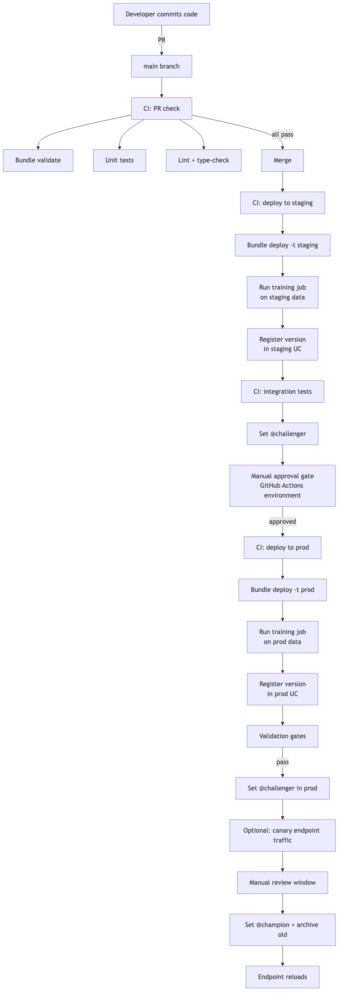

**Six key properties of this architecture:**

1. **Source code is the unit of promotion.** Code is reviewed; the resulting model is a byproduct.
2. **Each environment retrains.** Staging has its own model version (in staging UC); prod has its own (in prod UC). The artifact is not promoted; the code is.
3. **CI is the only path to prod.** Direct dev → prod alias changes are prevented by UC permissions (`MANAGE` only granted to CI service principal in prod).
4. **Manual gate between staging and prod.** GitHub Actions `environment` block with required reviewers.
5. **Approval is captured in tags + audit log.** Tag `approver` + `approval_ticket` on the version.
6. **Endpoint configuration is alias-based.** The endpoint loads `@champion`; alias reassignment is the deployment.

⚠️ **Exam trap:** answers describing "deploy-model" — promote a single artifact across envs. Faster but less auditable. In regulated industries, deploy-code wins.

---

## Mapping Databricks features to lifecycle activities

Section 2 objective: *"Map Databricks features to activities of the model lifecycle management process."*

| Lifecycle activity | Databricks feature |
|---|---|
| Develop and experiment | Databricks Notebooks + Repos + MLflow tracking |
| Manage hyperparameters | Optuna + MLflow nested runs |
| Manage features | FE-in-UC (feature tables, online tables, on-demand features) |
| Train at scale | Spark ML, Pandas Function API, Ray on Databricks |
| Tune at scale | Optuna + MLflowSparkStudy, Ray Tune |
| Track experiments | MLflow Experiments (UC-stored) |
| Register models | UC Model Registry (`mlflow.set_registry_uri("databricks-uc")`) |
| Version + promote | UC model versions + aliases |
| Govern | UC permissions, tags, lineage |
| Test and validate | DABs + Lakeflow Jobs + pytest |
| Deploy | Mosaic AI Model Serving |
| Monitor | Lakehouse Monitoring + Inference Tables |
| Detect drift | Lakehouse Monitoring profile + drift metrics tables |
| Alert | Databricks SQL Alerts |
| Retrain | Triggered Lakeflow Jobs (alert webhook) |
| Audit | system.access.audit + UC lineage |

The exam can frame this as "which Databricks feature do you use for X?" — memorize the mapping.

---

## Audit log — the system table you must know

`system.access.audit` records every action across Databricks workspaces — UC catalog/schema/table/model operations, alias changes, job runs, login events.

```sql
-- Who reassigned @champion on the fraud classifier in the last 30 days?
SELECT
  event_time,
  user_identity.email AS user_email,
  action_name,
  request_params,
  response.status_code
FROM system.access.audit
WHERE service_name = 'unityCatalog'
  AND action_name IN ('setRegisteredModelAlias', 'deleteRegisteredModelAlias')
  AND request_params:full_name_arg = 'prod.ml.fraud_classifier'
  AND event_time > current_date() - INTERVAL 30 DAYS
ORDER BY event_time DESC;
```

Action names you must recognize:

- `createRegisteredModel`, `updateRegisteredModel`, `deleteRegisteredModel`.
- `createModelVersion`, `deleteModelVersion`.
- `setRegisteredModelAlias`, `deleteRegisteredModelAlias`.
- `setModelVersionTag`, `deleteModelVersionTag`.
- `setRegisteredModelTag`, `deleteRegisteredModelTag`.

**HIPAA retention:** HIPAA requires 6 years. Databricks's default audit log retention varies by deployment; configure a downstream Delta table copy with longer retention if your compliance bar is higher than the platform default. (Topic 02 Module 21 covers this in depth.)

⚠️ **Exam trap:** assuming alias change history is in the MLflow registry API. It is **not** — query the audit log.

---

## Approval workflows — the practical mechanism

The exam doesn't require knowing a specific approval tool; it expects you to recognize the pattern. Concrete implementations:

**Option A: GitHub Actions `environment` with required reviewers**

```yaml
deploy-prod:
  needs: deploy-staging
  runs-on: ubuntu-latest
  environment:
    name: production           # configured with required reviewers in GH settings
    url: https://adb-prod.azuredatabricks.net
  steps:
    - ... # only runs after approval
```

**Option B: Tagged-gated alias change**

```python
# Promotion script — refuses to act unless validation tag is present
def promote(client, name, version, approver):
    mv = client.get_model_version(name, version)
    if mv.tags.get("validation_status") != "passed":
        raise PermissionError("Version not validated")
    if mv.tags.get("approver") and mv.tags.get("approver") != approver:
        raise PermissionError(f"Approver mismatch: tag says {mv.tags['approver']}")
    client.set_registered_model_alias(name, "champion", version)
    client.set_model_version_tag(name, version, "promoted_at", iso_now())
    client.set_model_version_tag(name, version, "promoted_by", approver)
```

**Option C: External ticketing system + webhook**

Jira/ServiceNow ticket required; webhook on ticket close triggers the promotion job.

The exam-correct framing: **the manual gate exists, is auditable, and the result is captured in tags + audit log.**

---

## Top-performing model selection during retraining

Section 2 objective: *"Develop a strategy for selecting top-performing models during automated retraining."*

When automated retraining runs, the new version isn't automatically `@champion` — it competes with the current `@champion`.

**Selection criteria:**

1. **Holdout validation metric** (e.g., AUC on a fixed validation set). New version's AUC must beat champion's by ≥ X (e.g., 0.005).
2. **Calibration** (Brier score, expected calibration error). Critical for downstream threshold-based decisions.
3. **Subgroup metrics.** New version must not regress on any monitored slice (e.g., per-region AUC).
4. **Stability metric.** Prediction distribution must not differ wildly from prior champion (small KL divergence on a shared test set).
5. **Operational metrics.** Inference latency must not exceed an SLA.

```python
def compare_to_champion(name, new_version, criteria):
    champion = client.get_model_version_by_alias(name, "champion")
    new_mv = client.get_model_version(name, new_version)

    new_auc = float(new_mv.tags.get("val_auc", 0))
    champ_auc = float(champion.tags.get("val_auc", 0))

    if new_auc < champ_auc + criteria["auc_improvement_required"]:
        return False, "AUC did not improve sufficiently"

    new_brier = float(new_mv.tags.get("val_brier", 1.0))
    champ_brier = float(champion.tags.get("val_brier", 1.0))
    if new_brier > champ_brier * 1.05:
        return False, "Calibration regressed"

    return True, "passes"
```

⚠️ **Exam trap:** selecting on a single metric (e.g., AUC). Multi-criteria selection is the audit-defensible answer.

---

## When deploy-model is acceptable

Deploy-code is the default, but the exam may surface scenarios where deploy-model is acceptable:

- **GenAI / foundation model fine-tuning** where training is expensive ($$$, hours) and reproducibility is captured at the foundation-model + LoRA-adapter level. Promote the adapter artifact rather than re-fine-tuning per env.
- **One-off competition / research models** outside production pipelines.
- **Initial bootstrap** before full CI/CD is in place — pragmatic, not strategic.

Even in these cases, log the artifact provenance heavily (tags for training data version, git SHA, environment hash) so deploy-model maintains audit defensibility.

---

## Mini quiz

1. UC privilege the serving endpoint needs to invoke a model?
2. UC privilege the CI service principal needs to set `@challenger`?
3. Where do you find the history of alias reassignments?
4. Why should validation AUC be stored as both an MLflow metric AND a tag?
5. The auditor asks "what training data did v7 see?" — which UC feature answers?
6. Deploy-code vs deploy-model — which is exam-correct for HIPAA / financial regulated contexts?
7. The retraining job produces a new version with slightly higher AUC but lower regional AUC in the EU slice. Promote or not?
8. The DS team needs to register models. Which UC privilege do they need in *dev*? In *prod*?

**Answers:**

1. `EXECUTE`. (Plus `USE CATALOG` and `USE SCHEMA` on the parents.)
2. `MANAGE` on the registered model. (`APPLY TAG` is not sufficient — that only grants tagging, not alias setting.)
3. `system.access.audit` with `action_name = 'setRegisteredModelAlias'` (or `deleteRegisteredModelAlias`). MLflow registry API does not expose alias-change history.
4. **Metric** for time-series queryability, plot in MLflow UI, search via `metrics.val_auc > 0.85` filter. **Tag** for searchability via `search_model_versions(filter_string="tags.val_auc > ...")` (string compare, but useful) and for being visible at the registry-version level without opening the run.
5. UC lineage (`system.access.table_lineage` with `target_type='MODEL_VERSION'`). Also captured in MLflow tags `training_dataset` if the team logs it explicitly.
6. **Deploy-code.** Each environment retrains from controlled code with env-appropriate data; full reproducibility; the audit story is clean.
7. **Don't promote.** Subgroup metrics matter — even a slight regression in a meaningful slice is a regression. Investigate why EU AUC dropped; potentially retrain with corrective sampling.
8. **Dev**: `MANAGE` is fine (full control in their sandbox). **Prod**: no direct write privileges; only `EXECUTE` if they need to invoke prod models for testing. Prod writes go through CI service principal.

---

## Sanity check

- Could you list the standard governance tags from memory (model-level and version-level)?
- Do you know which UC privilege each role needs?
- Can you describe the deploy-code lifecycle from PR to `@champion` in 10 steps?
- Could you query the audit log for alias-change history?
- Do you know why multi-criteria selection beats AUC-only for automated promotion?

Move on to [Module 13 — Inference Tables](13_inference_tables.md).


\newpage

# Module 13 — Inference Tables

> **Goal of this module:** **Inference tables** — the auto-logging mechanism on Mosaic AI Model Serving endpoints. Every request and response is captured to a Delta table. This is the **foundation for everything in Module 10** (Lakehouse Monitoring's InferenceLog profile literally consumes the inference table).
>
> **Assumes:** Module 08 (DABs, `auto_capture_config`), Module 10 (Lakehouse Monitoring).

---

## Coverage map (verbatim Sept 30 2025 exam objectives → where taught)

| Verbatim objective | Section anchor |
|---|---|
| Evaluate model performance trends over time using an inference table | "Joining labels" + "Inference table schema" |
| Identify the key components of common monitoring pipelines: logging (← inference tables ARE the logging pillar) | "What an inference table is" + "Why this exists" |
| Detect data drift / prediction drift on inference data (cross-listed) | Cross-link Module 10 / Module 11 — feeds `MonitorInferenceLog` |

> Cross-references: Module 10 (`MonitorInferenceLog` consumes this table); Module 14 (the `auto_capture_config` block on the endpoint resource that turns this on); Module 16 (endpoint-level metrics vs inference-table content).

> 🎯 **Decision rules:**
> - **"Capture every request for monitoring + audit" → inference table via `auto_capture_config` on the endpoint.**
> - **"Performance trend over time" → inference table + delayed-label join + `MonitorInferenceLog` with `label_col`.**
> - **"Async logging, no inference latency added" → that's already how inference tables work; don't reinvent.**
> - **Inference table is the LOGGING pillar of the four-pillar monitoring pipeline (Module 10). Without it, monitor has no data.**

---

## What an inference table is

When a Mosaic AI Model Serving endpoint has `auto_capture_config` enabled, the platform writes every request + response to a Delta table named per a configured pattern (default: `<catalog>.<schema>.<endpoint>_payload`). This happens asynchronously — no added inference latency.

**Why this exists:**

- **Observability** — see what's actually being asked of the model.
- **Monitoring foundation** — feed Lakehouse Monitoring's InferenceLog profile.
- **Performance ground truth** — join with delayed labels to compute live accuracy.
- **Debugging** — when an alert fires, replay the exact requests that caused it.
- **Audit** — regulated industries need a record of every inference.

The exam tests this as an infrastructure objective and as a prerequisite for monitoring scenarios.

---

## Enabling inference tables

### Via the DAB resource

```yaml
resources:
  model_serving_endpoints:
    fraud_endpoint:
      name: fraud-prod-endpoint
      config:
        served_entities:
          - name: champion
            entity_name: prod.ml.fraud_classifier
            entity_version: "5"
            workload_size: "Medium"
        traffic_config:
          routes:
            - served_model_name: champion
              traffic_percentage: 100
        auto_capture_config:
          catalog_name: prod
          schema_name: ml_inference_logs
          table_name_prefix: fraud_endpoint
          enabled: true
```

The resulting table is `prod.ml_inference_logs.fraud_endpoint_payload`.

### Via the SDK

```python
from databricks.sdk import WorkspaceClient
from databricks.sdk.service.serving import (
    EndpointCoreConfigInput,
    ServedEntityInput,
    AutoCaptureConfigInput,
    TrafficConfig, Route,
)

w = WorkspaceClient()
w.serving_endpoints.update_config(
    name="fraud-prod-endpoint",
    served_entities=[
        ServedEntityInput(
            name="champion",
            entity_name="prod.ml.fraud_classifier",
            entity_version="5",
            workload_size="Medium",
        ),
    ],
    traffic_config=TrafficConfig(routes=[Route(served_model_name="champion", traffic_percentage=100)]),
    auto_capture_config=AutoCaptureConfigInput(
        catalog_name="prod",
        schema_name="ml_inference_logs",
        table_name_prefix="fraud_endpoint",
        enabled=True,
    ),
)
```

### Via the UI

Endpoint settings → "Inference tables" → Enable + pick catalog/schema + name prefix.

⚠️ **Exam trap:** assuming inference tables are enabled by default. They are **opt-in** — you must configure `auto_capture_config`.

---

## Schema of the inference table

The auto-generated table has a fixed schema (you can't customize beyond the model's input/output):

| Column | Type | Meaning |
|---|---|---|
| `client_request_id` | STRING | Caller-provided ID (if any) — useful for client-side correlation |
| `databricks_request_id` | STRING | Platform-assigned ID — primary key for the row |
| `timestamp_ms` | BIGINT | Epoch milliseconds of the request |
| `status_code` | INT | HTTP status — 200, 400, 500, etc. |
| `execution_time_ms` | DOUBLE | Server-side latency |
| `request` | STRING | Raw JSON of the request body |
| `response` | STRING | Raw JSON of the response body |
| `request_metadata` | MAP<STRING,STRING> | Headers etc. |
| `sampling_fraction` | DOUBLE | If sampling enabled, the fraction at which this row was kept |
| `model_id` | STRING | Served entity name + model version |
| `model_name` | STRING | Underlying model |
| `model_version` | STRING | Version |

For a typical PyFunc model, the `request` JSON parses to `{"dataframe_records": [{...}, {...}]}` and the `response` to `{"predictions": [...]}`.

### Parsing the JSON for analysis

```sql
SELECT
  databricks_request_id,
  timestamp_ms,
  model_version,
  execution_time_ms,
  status_code,
  -- Extract the first record from a batched request
  from_json(request, 'struct<dataframe_records:array<struct<amount:double, merchant_category:string>>>')
    .dataframe_records[0].amount AS request_amount,
  from_json(response, 'struct<predictions:array<int>>').predictions[0] AS prediction
FROM prod.ml_inference_logs.fraud_endpoint_payload
WHERE timestamp_ms > unix_millis(current_timestamp() - INTERVAL 1 HOUR);
```

This is the canonical "unpack the inference table for analysis" pattern. **The exam can ask you to write the `from_json` extraction**.

⚠️ **Exam trap:** treating `request` and `response` as already-structured columns. They are JSON-as-string. You must parse with `from_json`.

---

## Joining with ground-truth labels

The inference table has predictions but typically not labels (labels arrive delayed). The standard pattern: a downstream Lakeflow Job joins ground-truth labels by `client_request_id` or a domain key.

```sql
-- Joining schema
CREATE OR REPLACE TABLE prod.ml_inference_logs.fraud_endpoint_payload_labeled AS
WITH unpacked AS (
  SELECT
    databricks_request_id,
    client_request_id,
    timestamp_ms,
    model_version,
    execution_time_ms,
    status_code,
    -- Domain key — the inference call carried customer_id + transaction_id in the request
    from_json(request, 'struct<dataframe_records:array<struct<transaction_id:string, amount:double>>>')
      .dataframe_records[0].transaction_id AS transaction_id,
    from_json(response, 'struct<predictions:array<int>>').predictions[0] AS prediction
  FROM prod.ml_inference_logs.fraud_endpoint_payload
  WHERE status_code = 200
)
SELECT
  u.*,
  l.label,            -- 0 = legitimate, 1 = fraud (confirmed via chargeback or investigation)
  l.label_source_ts   -- when the label became known
FROM unpacked u
LEFT JOIN prod.fraud.confirmed_labels l
  ON u.transaction_id = l.transaction_id;
```

Lakehouse Monitoring's InferenceLog profile picks up this labeled table and computes performance metrics over time. **Without the join, performance metrics are NULL.**

⚠️ **Exam trap:** the inference table itself contains labels. It doesn't — only request, response, and metadata. Labels come from a separate join.

---

## Mermaid: end-to-end inference logging picture

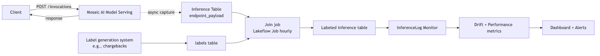

---

## Sampling for high-traffic endpoints

For endpoints handling millions of requests per day, full-fidelity capture is expensive (storage + downstream processing). Configure a sample:

```yaml
auto_capture_config:
  catalog_name: prod
  schema_name: ml_inference_logs
  table_name_prefix: fraud_endpoint
  enabled: true
  # Sampling not directly configurable in the basic schema yet —
  # accomplished via downstream filter (TABLESAMPLE) or a sampling proxy.
```

In practice today, capture is all-or-nothing per endpoint; sampling for downstream analysis is done via `TABLESAMPLE`:

```sql
SELECT *
FROM prod.ml_inference_logs.fraud_endpoint_payload
TABLESAMPLE (10 PERCENT) REPEATABLE (42)
WHERE timestamp_ms > unix_millis(current_timestamp() - INTERVAL 7 DAYS);
```

⚠️ **Exam trap:** assuming inference tables can be configured to sample at capture time. Platform-side capture is currently 100% or off. Sampling happens downstream.

---

## Cost considerations

- **Storage cost** — full JSON of every request/response. For a 100-byte-per-request endpoint at 100 QPS, that's ~865 MB/day, ~26 GB/month, $50/year of Delta storage. Trivial. For an LLM endpoint with 4 KB prompts and 8 KB responses at the same QPS — ~100 GB/month, more substantial.
- **Compute cost** — Lakehouse Monitoring's profile + drift computation reads the table; query cost scales with the volume.
- **Retention** — apply a Delta `VACUUM` and `OPTIMIZE` on a schedule. Set retention via table properties:

```sql
ALTER TABLE prod.ml_inference_logs.fraud_endpoint_payload
SET TBLPROPERTIES (
  'delta.deletedFileRetentionDuration' = 'interval 30 days'
);
```

For HIPAA (6-year retention requirement), copy to a longer-retention archive:

```sql
CREATE TABLE prod.ml_inference_archive.fraud_endpoint_payload_archive AS
SELECT * FROM prod.ml_inference_logs.fraud_endpoint_payload
WHERE timestamp_ms < unix_millis(current_timestamp() - INTERVAL 1 YEAR);
```

(Run on a quarterly schedule; the archive table has a longer retention setting.)

---

## Inference tables and PII

A landmine in regulated industries: the inference table contains the **raw request body**. If your endpoint receives PII (names, SSNs, claim line items) in the request, the inference table is now a PII data store.

Implications:

- **PII discovery scans must include inference tables.**
- **Access control on the schema must reflect PII handling rules.**
- **Field-level masking via dynamic views** — for downstream analysts who shouldn't see raw PII, expose a view that masks sensitive fields.

```sql
CREATE OR REPLACE VIEW prod.ml_inference_logs.fraud_endpoint_payload_masked AS
SELECT
  databricks_request_id,
  timestamp_ms,
  model_version,
  execution_time_ms,
  status_code,
  -- Mask sensitive fields by re-serializing only safe ones
  to_json(named_struct(
    'amount', from_json(request, 'struct<dataframe_records:array<struct<amount:double>>>').dataframe_records[0].amount,
    'merchant_category', from_json(request, 'struct<dataframe_records:array<struct<merchant_category:string>>>').dataframe_records[0].merchant_category
  )) AS request,
  -- Predictions are safe
  response
FROM prod.ml_inference_logs.fraud_endpoint_payload;

GRANT SELECT ON VIEW prod.ml_inference_logs.fraud_endpoint_payload_masked TO `ml_analysts`;
REVOKE SELECT ON TABLE prod.ml_inference_logs.fraud_endpoint_payload FROM `ml_analysts`;
```

⚠️ **Exam trap:** assuming inference tables are PII-safe by default. They contain raw request bodies. Apply UC permissions + dynamic views.

---

## Using inference tables for replay / debugging

When an alert fires and you want to understand what the model was seeing:

```sql
-- Pull the 100 most recent flagged predictions in the EU region
SELECT
  databricks_request_id,
  timestamp_ms,
  request,
  response,
  execution_time_ms
FROM prod.ml_inference_logs.fraud_endpoint_payload_masked
WHERE timestamp_ms > unix_millis(current_timestamp() - INTERVAL 1 HOUR)
  AND from_json(response, 'struct<predictions:array<int>>').predictions[0] = 1
  AND from_json(request, 'struct<dataframe_records:array<struct<region:string>>>').dataframe_records[0].region = 'EU'
ORDER BY timestamp_ms DESC
LIMIT 100;
```

Replay through a notebook for offline analysis. **This is the standard incident-response workflow** when drift fires.

---

## Comparing two model versions via inference table

Section 2 objective: *"Evaluate model performance trends over time using an inference table."*

When you canary-deploy a new version (Module 14), the inference table captures both versions' predictions (the `model_version` column distinguishes them). Compare performance:

```sql
SELECT
  model_version,
  COUNT(*) AS n_predictions,
  AVG(execution_time_ms) AS mean_latency_ms,
  PERCENTILE_CONT(0.95) WITHIN GROUP (ORDER BY execution_time_ms) AS p95_latency_ms,
  PERCENTILE_CONT(0.99) WITHIN GROUP (ORDER BY execution_time_ms) AS p99_latency_ms,
  SUM(CASE WHEN status_code != 200 THEN 1 ELSE 0 END) / COUNT(*) AS error_rate,
  AVG(CASE WHEN from_json(response, 'struct<predictions:array<int>>').predictions[0] = 1 THEN 1.0 ELSE 0.0 END) AS positive_rate
FROM prod.ml_inference_logs.fraud_endpoint_payload
WHERE timestamp_ms > unix_millis(current_timestamp() - INTERVAL 24 HOURS)
GROUP BY model_version
ORDER BY model_version;
```

When labels are joined:

```sql
SELECT
  model_version,
  COUNT(*) AS labeled_predictions,
  AVG(CASE WHEN prediction = label THEN 1.0 ELSE 0.0 END) AS accuracy,
  -- Precision/recall by hand or via aggregations
  SUM(CASE WHEN prediction = 1 AND label = 1 THEN 1 ELSE 0 END) / 
    NULLIF(SUM(CASE WHEN prediction = 1 THEN 1 ELSE 0 END), 0) AS precision_,
  SUM(CASE WHEN prediction = 1 AND label = 1 THEN 1 ELSE 0 END) / 
    NULLIF(SUM(CASE WHEN label = 1 THEN 1 ELSE 0 END), 0) AS recall_
FROM prod.ml_inference_logs.fraud_endpoint_payload_labeled
WHERE timestamp_ms > unix_millis(current_timestamp() - INTERVAL 7 DAYS)
GROUP BY model_version;
```

This is the **canary's win/lose signal**. Comparing the new version's accuracy on real prod traffic against the champion's — when the new one beats the old on real data over a sustained window, promote.

---

## Mini quiz

1. Are inference tables enabled by default?
2. Where does the table land if `auto_capture_config: {catalog_name: 'prod', schema_name: 'ml_logs', table_name_prefix: 'fraud_ep', enabled: true}`?
3. What schema is the `request` column?
4. How do you get ground-truth labels into the inference table?
5. You have a 100 QPS endpoint logging 100% of requests. What's the operational concern?
6. PII in the request body — what's the canonical control?
7. You canary the new version at 10% traffic. How do you tell if it's better than the champion?
8. What does the InferenceLog monitor need from the inference table to compute accuracy?

**Answers:**

1. **No** — opt-in via `auto_capture_config: enabled: true`.
2. `prod.ml_logs.fraud_ep_payload`. (The `_payload` suffix is conventional; verify with the actual deployed table name.)
3. STRING containing JSON. You parse with `from_json(request, '<struct schema>')`.
4. A downstream Lakeflow Job joins by `client_request_id` or a domain key (e.g., `transaction_id`) against a separate labels table. The inference table itself doesn't carry labels.
5. **Storage + downstream processing cost.** For very high QPS, set Delta retention reasonably; archive older partitions to a longer-retention table; consider field-level filtering for downstream queries.
6. **UC permissions + dynamic views** that mask sensitive fields. The raw inference table is restricted; analysts get a masked view.
7. Group by `model_version` in queries against the inference table; compare latency, error rate, positive-rate, and (with joined labels) accuracy/precision/recall. Promote when the canary version wins on a sustained window.
8. A joined `label` column (typically via a downstream job that joins delayed ground-truth labels). The monitor's `label_col` config points to this column; without it, performance metrics are NULL.

---

## Sanity check

- Could you write a DAB resource block enabling inference tables?
- Do you know the inference table schema columns?
- Could you write the `from_json` parse for a typical PyFunc request?
- Do you know the canonical pattern for joining labels?
- Can you explain the PII implications and the dynamic-view mitigation?
- Could you query the table to compare canary vs champion?

That closes Section 2. Move on to **Section 3 — Model Deployment** starting with [Module 14 — Serving: Blue-Green & Canary](14_serving_blue_green_canary.md).


\newpage

# Module 14 — Serving: Blue-Green & Canary

> **Goal of this module:** Mosaic AI Model Serving endpoint deployment strategies — **blue-green, canary, and shadow** by name. Section 3 is ~12% of the exam but the questions go deep — multi-bullet scenarios where one bundle of choices is correct.
>
> **Assumes:** Modules 02 (PyFunc), 07 (UC aliases), 08 (DABs serving endpoint resource), 13 (inference tables).

---

## Coverage map (verbatim Sept 30 2025 exam objectives → where taught)

| Verbatim objective | Section anchor |
|---|---|
| Compare deployment strategies (e.g., **blue-green and canary**) and evaluate suitability for high-traffic applications | "Comparing the three" + "End-to-end exam-style scenario" |
| Implement a model rollout strategy using **Databricks Model Serving** | "Strategy 1 — Blue-Green" + "Strategy 2 — Canary" |
| Deploy custom model objects using MLflow Deployments SDK, REST API, or user interface | "Endpoint sizing" + "Querying via REST" + cross-link Module 02 |

> Cross-references: Module 02 (PyFunc artifact that gets deployed); Module 07 (UC alias mechanism = the promotion lever behind canary); Module 08 (DABs encoding of `served_entities` + `traffic_config`); Module 13 (inference tables that capture per-version metrics during rollout); Module 16 (latency/error-rate observability used to gate the rollout phases).

---

## The endpoint model

A Mosaic AI Model Serving endpoint:

- Has a single DNS name and URL.
- Hosts **one or more served entities** — each one is a (model version) running on its own replicas.
- Has a **traffic config** — percentages summing to 100 across served entities.
- Has per-served-entity **workload_size** (replica size) and **autoscale** settings.

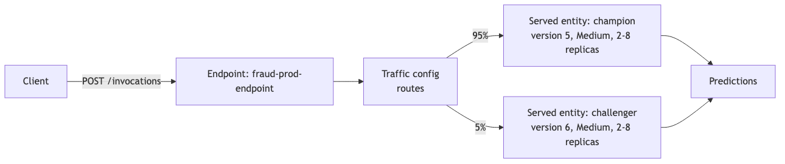

The exam's mental model: **the endpoint is the stable URL; served entities + traffic config are the deployment lever.**

---

## Strategy 1 — Blue-Green

Two endpoints, or two served entities at 0/100 then 100/0.

### Two-endpoint variant

- `fraud-prod-endpoint-blue` running v5 at 100% traffic.
- `fraud-prod-endpoint-green` deployed with v6, 0 traffic yet.
- Cutover: DNS or load balancer switches all traffic from blue to green.
- Rollback: switch back.

Pros: instant rollback. Cons: double infrastructure cost during cutover; DNS / LB layer required outside Databricks.

### Single-endpoint variant (Databricks-native)

- One endpoint with two served entities.
- v5 at 100%, v6 at 0%.
- Cutover: update traffic_config to v5 at 0%, v6 at 100%.
- Rollback: flip back.

Both versions are warm during cutover — instantaneous traffic flip.

```python
from databricks.sdk import WorkspaceClient
from databricks.sdk.service.serving import (
    ServedEntityInput, TrafficConfig, Route, EndpointCoreConfigInput,
)

w = WorkspaceClient()

# Initial state: both versions warm; v5 takes all traffic
w.serving_endpoints.update_config(
    name="fraud-prod-endpoint",
    served_entities=[
        ServedEntityInput(name="v5", entity_name="prod.ml.fraud", entity_version="5", workload_size="Medium"),
        ServedEntityInput(name="v6", entity_name="prod.ml.fraud", entity_version="6", workload_size="Medium"),
    ],
    traffic_config=TrafficConfig(routes=[
        Route(served_model_name="v5", traffic_percentage=100),
        Route(served_model_name="v6", traffic_percentage=0),
    ]),
)

# Cutover: traffic to v6
w.serving_endpoints.update_config(
    name="fraud-prod-endpoint",
    traffic_config=TrafficConfig(routes=[
        Route(served_model_name="v5", traffic_percentage=0),
        Route(served_model_name="v6", traffic_percentage=100),
    ]),
)
```

⚠️ **Exam trap:** "Blue-green means the new version is at 100% immediately, no traffic split phase." The split phase is at 0/100 → 100/0, but **both endpoints / served entities are warm** so the flip is instant. The point is rollback speed, not gradual rollout.

---

## Strategy 2 — Canary

One endpoint, two served entities, incrementally shift traffic.

```python
# Phase 1 — canary at 5%
update_traffic([("v5", 95), ("v6", 5)])
# observe for an hour: latency, error rate, prediction distribution, accuracy (with labels)

# Phase 2 — 25%
update_traffic([("v5", 75), ("v6", 25)])
# observe

# Phase 3 — 50%
update_traffic([("v5", 50), ("v6", 50)])
# observe

# Phase 4 — 100%
update_traffic([("v5", 0), ("v6", 100)])

# Decommission v5 — remove from served entities or alias it to @archived
```

**Why canary is preferred for high-traffic critical apps:**

- **Bounded blast radius** — at 5%, only 5% of users see any negative impact if v6 has a bug.
- **Per-version metrics** — inference table groups by `model_version`; you can compare v5 vs v6 head-to-head.
- **Single endpoint** — no DNS gymnastics; rollback is a traffic config change.

⚠️ **Exam trap (the sample question Q7 trap):** "Set 100% traffic to v6 immediately and watch metrics." Wrong for high-traffic critical apps. **Incremental canary shift is correct.**

⚠️ **Second trap:** specifying canary phases that skip steps (e.g., 5% → 100%). Phases exist precisely to bound risk; the canonical step pattern is 5% → 25% → 50% → 100% (or similar gradual ramps).

---

## Strategy 3 — Shadow

Send a **copy** of production traffic to the candidate model — predictions are computed but **not returned to the user**. Used to evaluate a new model against real prod traffic with zero user-facing risk.

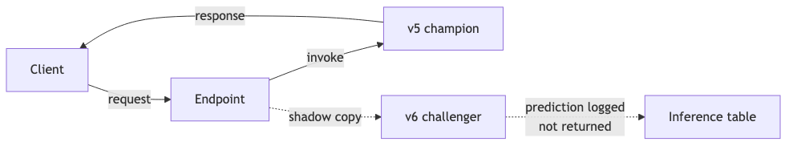

Implementation pattern on Databricks: the served entity for v6 has traffic_percentage of 0 *but* a separate shadow mechanism duplicates requests to it. Mosaic AI Model Serving supports this via the "shadow" routing concept (or implementable via a Lakeflow streaming job replaying inference table requests against a second endpoint).

**Why shadow shines:**

- **Zero user-facing risk** — v6's predictions are never returned.
- **Realistic load testing** — v6 sees actual prod request patterns.
- **A/B comparison against the *evolving* champion** — when the champion is itself changing (e.g., online learning), shadow lets you measure on the same traffic.

⚠️ **Exam trap (sample question Q4):** "Evaluate a new model against an evolving production model" — the right answer is **shadow deployment**, not canary. Canary assumes both versions are user-facing; shadow assumes only one is.

---

## Comparing the three

| Strategy | Risk to users | Cost | Speed to validate | Rollback |
|---|---|---|---|---|
| **Blue-green** | All-or-nothing flip; rollback fast | Double infra during cutover | Limited — flip is binary | Instant traffic flip |
| **Canary** | Bounded (5%, 25%, ...) | One endpoint, both versions warm | Gradual; need sustained metrics windows | Traffic config flip |
| **Shadow** | None | Double inference cost (both run) | High — see real prod traffic | N/A; never user-facing |

Decision tree:

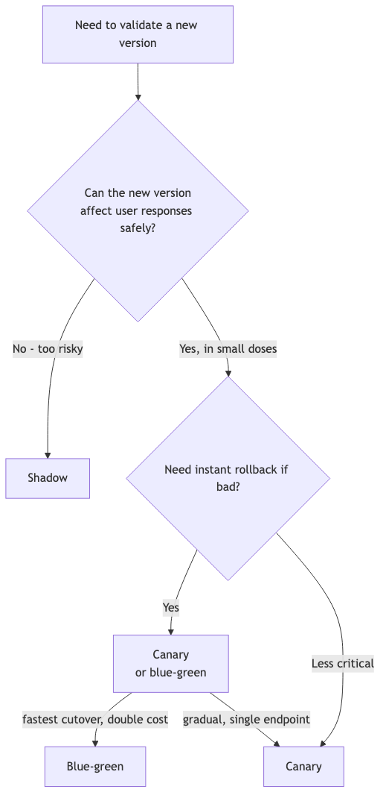

The exam-correct canonical answers:

- **High-traffic critical app, need gradual rollout** → canary.
- **Need instant cutover with rollback safety** → blue-green.
- **Need risk-free evaluation against real traffic** → shadow.

---

## Endpoint sizing — `workload_size`

| Size | RAM | CPU | When to use |
|---|---|---|---|
| `Small` | 4 GB | small | Lightweight models, low QPS |
| `Medium` | 8 GB | medium | Most production tabular models |
| `Large` | 16 GB | medium-large | Ensembles, large feature embeddings |
| Custom (CPU/GPU) | configurable | configurable | LLMs, deep models |

Per served entity. So you can have:

- v5 on `Small` (current champion, mature, sized for steady load).
- v6 on `Medium` (challenger, new architecture, needs more memory).

Both behind the same endpoint URL.

⚠️ **Exam trap:** assuming both served entities must use the same workload_size. They can differ — the endpoint URL is shared but resources per served entity are independent.

---

## Autoscale and scale-to-zero

```python
ServedEntityInput(
    name="v5",
    entity_name="prod.ml.fraud",
    entity_version="5",
    workload_size="Medium",
    scale_to_zero_enabled=True,    # endpoint can scale to 0 when idle
    min_provisioned_throughput=0,   # for provisioned-throughput mode
    max_provisioned_throughput=100,
)
```

**Scale-to-zero tradeoff:**

- Saves cost during idle periods (the endpoint is essentially free when nobody's calling).
- **Cold start latency** when traffic returns — typically 5-30 seconds.
- Use for non-critical, intermittent endpoints (internal tools, dev experiments).
- **Don't use for user-facing critical paths** — the first request after idle hits cold start.

**Autoscale up:** based on traffic, the platform adds replicas (up to a maximum). The exact replica count is hidden behind workload_size.

⚠️ **Exam trap:** "Enable scale-to-zero on the production fraud endpoint to save cost." Wrong — fraud detection is latency-sensitive. The right answer for cost is **right-size the workload + monitor + downsize if over-provisioned**, not scale-to-zero on critical paths.

---

## Route Optimization

A Mosaic AI Model Serving endpoint toggle that reduces network hops for high-QPS endpoints. Reduces latency and improves throughput.

```python
EndpointCoreConfigInput(
    served_entities=[...],
    traffic_config=...,
    route_optimized=True,  # ← route optimization
)
```

When to enable:

- QPS > 100 / second sustained.
- Latency-critical (target p99 < 200ms).
- High throughput requirements.

Off by default; enable for production endpoints with the above characteristics.

⚠️ **Exam trap (sample question pattern):** a question presents an endpoint configuration for a high-traffic app and one of the "almost correct" answers omits Route Optimization. The exam expects you to recognize that on high-QPS endpoints, Route Optimization is part of the canonical setup.

---

## End-to-end exam-style scenario

> "You have a fraud detection endpoint receiving 500 requests per second from a customer-facing app. A new model version improves accuracy 2 percentage points in offline evaluation. Roll it out safely. The team requires the ability to roll back in seconds if metrics degrade. What's the right deployment configuration?"

Exam-correct answer (multi-bullet):

1. **Canary deployment** — add a second served entity for v6 to the same endpoint.
2. **Initial traffic split** — 95% v5, 5% v6 (or a similarly small canary percentage).
3. **Workload size Medium** on both (v6 needs at least the same memory footprint as v5).
4. **Route Optimization enabled** (high QPS).
5. **Inference table enabled** (already on, configured per Module 13).
6. **Lakehouse Monitoring** comparing v5 vs v6 on inference table grouped by model_version.
7. **Manual gates** at each step (5% → 25%, 25% → 50%, etc.) with sustained metric windows in between.
8. **Rollback procedure** — flip traffic_config back to v5 at 100% on degradation.

Wrong-answer flavors:

- "Blue-green flip from v5 100% to v6 100%." For 500 QPS critical app, the blast radius of an instant 100% cutover is too large.
- "Set v6 to 100% immediately and monitor closely." This is the sample-question-Q7 trap.
- "Two endpoints behind a DNS round-robin." Unnecessarily complex; the single-endpoint canary is cleaner.
- "Enable scale-to-zero to save cost during the rollout." Customer-facing, no.

---

## Mermaid: full canary lifecycle

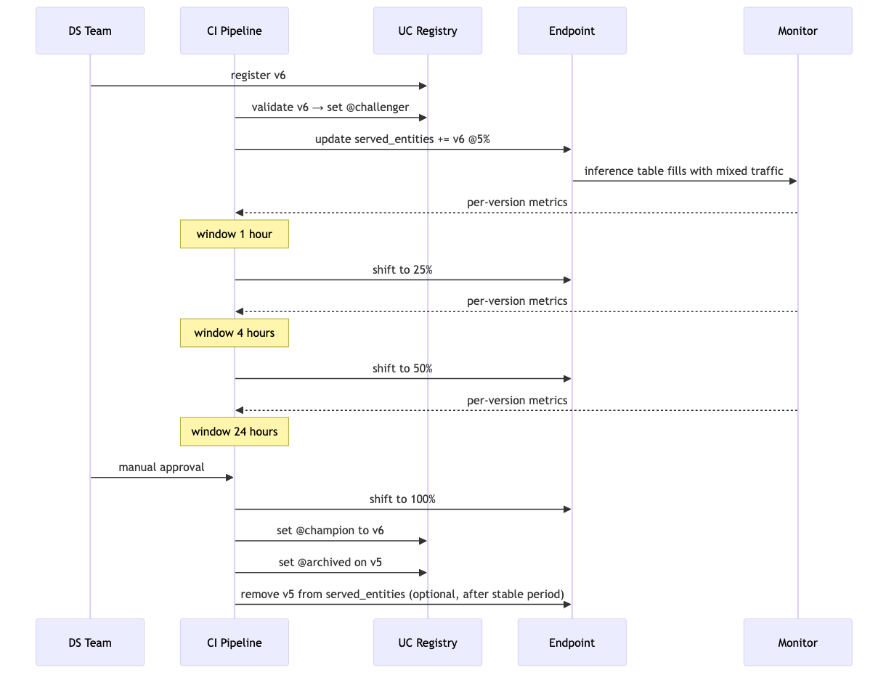

---

## Look-alike API comparison — `ServedEntityInput` / `TrafficConfig` / endpoint surface

### `ServedEntityInput` parameter table

| Parameter | Purpose |
|---|---|
| `name` | The served entity name used in `traffic_config.routes[].served_model_name` |
| `entity_name` | Three-level UC model name |
| `entity_version` | Specific immutable version (`"5"`) — OR — |
| `entity_alias` | Alias (`"champion"`) — endpoint auto-reloads on alias reassignment |
| `workload_size` | `Small` (4GB), `Medium` (8GB), `Large` (16GB), or `Custom` |
| `workload_type` | `CPU` / `GPU_SMALL` / `GPU_MEDIUM` / `GPU_LARGE` |
| `scale_to_zero_enabled` | Allow replicas to scale to 0 when idle (cold-start penalty on return) |
| `min_provisioned_throughput` | For provisioned-throughput (FMAPI) mode |
| `max_provisioned_throughput` | Upper cap for autoscale tokens/sec |
| `environment_vars` | Per-served-entity env vars |

### Look-alikes

| Pair | Difference | Exam tell |
|---|---|---|
| `served_entities` vs `served_models` (legacy) | Current vs legacy field name | New exam answers use `served_entities` |
| `entity_version="5"` vs `entity_alias="champion"` | Pinned to immutable version vs follows alias | Endpoint should auto-pick-up new prod model → alias. Pinned audit replay / incident lock → version |
| `traffic_config.routes` with multiple entries vs single entry | Multi-served-entity (canary/blue-green) vs single served entity | Canary: 2+ entries summing to 100. Blue-green single-endpoint variant: same shape, just 100/0 |
| Blue-green (single endpoint) vs blue-green (two endpoints) | Same endpoint, 100/0 → 0/100 flip vs separate endpoints behind DNS | Databricks-native = single endpoint. Two-endpoint = legacy / external load balancer |
| Canary 5→25→50→100 vs blue-green 100/0 → 0/100 | Incremental shift over time vs instant flip | Bounded blast radius → canary. Fastest rollback with both warm → blue-green |
| Shadow vs canary | Candidate sees a copy of traffic but doesn't return predictions vs candidate serves a small slice of real traffic | Champion is evolving and you need apples-to-apples → shadow. Want bounded user exposure to candidate → canary |
| `route_optimized=True` vs default (false) | Reduced network hops, lower latency, higher throughput vs default routing | High-QPS (>100/s) critical endpoint → enable. Low-traffic dev endpoint → default is fine |
| `scale_to_zero_enabled=True` vs `False` | Idle scale to 0 (cold start on return) vs minimum 1 replica always warm | Dev / intermittent → True. Customer-facing critical → False |
| `workload_size="Small"` vs `"Medium"` vs `"Large"` | 4GB / 8GB / 16GB RAM | Match to model memory footprint. Ensemble of 3 ~500MB models → Medium-Large |
| `workload_type="CPU"` vs `"GPU_SMALL"` | CPU inference vs GPU inference (LLMs, large DL) | Tabular sklearn/XGB → CPU. LLM via PyFunc → GPU |
| `min_provisioned_throughput=0` vs `>0` (FMAPI) | Standard endpoint vs Foundation Model APIs provisioned-throughput | Provisioned-throughput is for fine-tuned/served foundation models |
| `auto_capture_config.enabled=True` vs `False` | Inference tables on/off | Monitoring + audit → on. Off only for pure-dev endpoints |

### `traffic_config` math

`routes[].traffic_percentage` must sum to exactly 100 across all routes. Percentages are integers. Mosaic AI rounds requests to the nearest percent, so a 99/1 split is allowed but a 99.5/0.5 split is not.

### Endpoint lifecycle commands

| Command (SDK) | Purpose |
|---|---|
| `w.serving_endpoints.create(name, config)` | Create new endpoint |
| `w.serving_endpoints.update_config(name, served_entities=, traffic_config=)` | Change served entities or traffic (no endpoint restart for traffic changes) |
| `w.serving_endpoints.get(name)` | Read state |
| `w.serving_endpoints.delete(name)` | Tear down |
| `w.serving_endpoints.list()` | List all |
| `w.serving_endpoints.get_open_api(name)` | Endpoint's OpenAPI spec for callers |

> 🎯 **How to recognize on the exam:** prompt names "deployment strategy + high-traffic critical" → canary, single endpoint, two served entities, incremental shift, Route Optimization enabled, inference table enabled, manual gates between phases. **NOT** "100% v6 immediately and watch." The trap is always the all-at-once flip.

---

## Output-prediction drills

**Drill 1 — traffic percentages don't sum to 100:**
```python
TrafficConfig(routes=[
    Route(served_model_name="v5", traffic_percentage=90),
    Route(served_model_name="v6", traffic_percentage=5),
])
```
Q: What happens?
A: API error — routes must sum to exactly 100. Fix: 95/5, 90/10, etc.

**Drill 2 — alias-based served entity reassignment:**
```python
ServedEntityInput(name="champion", entity_name="prod.ml.fraud", entity_alias="champion", workload_size="Medium")
# Later, in UC:
client.set_registered_model_alias("prod.ml.fraud", "champion", 6)  # was 5
```
Q: Does the endpoint reload?
A: **Yes** — Mosaic AI Model Serving polls UC for alias changes and reloads the served entity to point at v6. No `update_config` needed. **But:** an in-flight `update_config` would be required if you wanted to change `workload_size` simultaneously.

**Drill 3 — scale-to-zero on customer-facing endpoint:**
500 QPS fraud endpoint with `scale_to_zero_enabled=True`, `workload_size="Medium"`. Traffic dips to 0 at 2am for 30 minutes.
Q: What happens at 2:30am when traffic returns?
A: **Cold start**: the first batch of requests waits 5-30 seconds for replicas to come up. p99 latency spikes catastrophically. Exam-correct config for this endpoint: `scale_to_zero_enabled=False`.

**Drill 4 — Route Optimization at low QPS:**
A dev endpoint at 2 QPS sets `route_optimized=True`.
Q: Effect?
A: Negligible. Route Optimization helps at high QPS by reducing per-request overhead; at 2 QPS the overhead is invisible. Not wrong, just not load-bearing.

**Drill 5 — canary cleanup:**
v5 served at 0% after canary completes; new traffic is 100% v6. v5 still in `served_entities` list.
Q: Why might you leave it?
A: **Instant rollback option** — if v6 misbehaves, flip traffic back to v5 without re-loading the model. After a stable period (e.g., 7 days), remove v5 to free replicas. Alternative is to set `@archived` alias on v5 immediately and rely on the registry for rollback (slower).

**Drill 6 — multi-served-entity workload sizing:**
v5 on `Small`, v6 on `Large` behind one endpoint.
Q: Legal? When useful?
A: **Legal.** v6 might be a memory-heavier ensemble. The endpoint URL is shared; per-entity resources are independent. Useful for migrating from a light model to a heavier one without resizing the entire endpoint.

---

## Decision rules

> 🎯 **"High-traffic critical app, validate new version" → canary on single endpoint with incremental 5→25→50→100.** Not blue-green flip. Not 100% immediately.

> 🎯 **"Need instant rollback with both versions warm" → blue-green single endpoint (100/0 → 0/100).**

> 🎯 **"Evaluate against an evolving champion on real traffic" → shadow.** Predictions logged, not returned.

> 🎯 **"Endpoint auto-picks-up new prod model" → `entity_alias="champion"`.** Reassign alias = endpoint reload.

> 🎯 **"High QPS + low latency target" → `route_optimized=True`.** Add for any prod endpoint > 100 QPS.

> 🎯 **"Idle endpoint cost saving" → `scale_to_zero_enabled=True`.** Only for non-critical / non-customer-facing. Critical paths stay warm.

> 🎯 **"Audit + monitoring foundation" → `auto_capture_config.enabled=True`.** Without this there's no inference table → no Lakehouse Monitoring InferenceLog → no model perf trend.

> 🎯 **Distractor pattern:** any answer naming `served_models` (legacy field), `entity_alias="Production"` (stage name as alias — confused), or 100% all-at-once on a high-traffic endpoint = wrong.

---

## Mini quiz

1. Canary vs blue-green — which gives bounded blast radius? Which gives instant cutover?
2. When is shadow deployment the right answer?
3. The exam's "wrong" answer pattern for "high-traffic critical app, deploy v6" — what's the bait?
4. A single endpoint with two served entities (v5 95%, v6 5%) — what's the strategy called?
5. Two served entities at workload_size Medium and Small respectively — legal or illegal?
6. Scale-to-zero on a customer-facing fraud endpoint — exam-correct or wrong?
7. Route Optimization — when do you enable it?
8. After canary cutover to 100%, what cleanup remains?

**Answers:**

1. **Canary** = bounded (5%, 25%, ...) — incremental traffic shift. **Blue-green** = instant cutover (and instant rollback) with both warm in parallel.
2. When you want to evaluate a candidate against real prod traffic without affecting users. Especially useful when the champion itself is evolving (online learning) and you need apples-to-apples on identical traffic.
3. "Set v6 to 100% immediately and monitor closely." All-at-once on a critical endpoint is too risky regardless of monitoring; the right answer is incremental canary.
4. **Canary** (95/5 split). The single-endpoint multi-served-entity canary is the canonical Databricks-native canary.
5. **Legal.** Each served entity has independent resources. The endpoint URL is shared; replicas + memory are per served entity.
6. **Wrong.** Cold-start latency on a latency-sensitive customer-facing endpoint kills the user experience. Right-size + monitor instead.
7. On high-QPS endpoints (typically > 100 QPS sustained) where reducing network hops measurably improves latency and throughput.
8. (a) Set `@champion` alias to v6 in UC; (b) set `@archived` on v5; (c) optionally remove v5 from `served_entities` after a stable period (keeps the endpoint cleaner; but you may keep it longer for instant rollback option).

---

## Sanity check

- Could you write a `served_entities` + `traffic_config` block for a 90/10 canary from memory?
- Do you remember the canonical canary phase progression (5 → 25 → 50 → 100)?
- Can you explain when shadow beats canary?
- Do you know what Route Optimization is and when to enable it?
- Could you list the exam-correct configuration bundle for a high-QPS critical canary rollout?

Move on to [Module 15 — Batch & Streaming Serving](15_batch_streaming_serving.md).


\newpage

# Module 15 — Batch & Streaming Serving

> **Goal of this module:** batch and streaming inference patterns on Databricks — `mlflow.pyfunc.spark_udf`, Lakeflow Jobs for batch, Structured Streaming for near-real-time. Real-time HTTP is Module 14; this module is the other two-thirds of inference.
>
> **Assumes:** Modules 02 (PyFunc), 05 (Spark ML), 14 (real-time serving for contrast).
>
> **Exam relevance:** Section 1's "Select SparkML model or single node model for an inference based on type: batch, real-time, streaming" lives here, plus several Spark ML scoring objectives.

---

## Coverage map (verbatim Sept 30 2025 exam objectives → where taught)

| Verbatim objective | Section anchor |
|---|---|
| Score a Spark ML model for a batch or streaming use case | "Batch inference — `mlflow.pyfunc.spark_udf`" + "Streaming inference" |
| Select SparkML model or single node model for an inference based on type: batch, real-time, streaming | "The three inference patterns — when each fits" |

> Cross-references: Module 14 (real-time serving — the third pattern); Module 04 (`fe.score_batch` for feature-aware batch scoring); Module 02 (PyFunc loaded via `spark_udf`).

> 🎯 **Decision rules:**
> - **"Score 100M rows nightly" → Lakeflow Job + `mlflow.pyfunc.spark_udf` (or `fe.score_batch` if features come from UC feature table).**
> - **"Score events as they arrive in Delta" → Structured Streaming + `spark_udf` with `.writeStream`.**
> - **"Synchronous per-request <100ms" → Mosaic AI Model Serving endpoint (Module 14). Never SparkML for real-time.**
> - **`spark_udf` argument order = signature column order.** Positional, not kwargs.
> - **Distractor: deploy SparkML model to real-time endpoint.** Spark startup latency makes it non-viable; convert to PyFunc / sklearn-equivalent for real-time, keep SparkML for batch.

---

## The three inference patterns — when each fits

| Pattern | When | Tooling | Latency | Throughput |
|---|---|---|---|---|
| **Batch** | "Score everything in this Delta table once a day" | Lakeflow Job + `spark_udf` or `fe.score_batch` | Hours OK | Millions of rows/min |
| **Streaming** | "Score events as they arrive in a Delta table" | Structured Streaming + `spark_udf` | Seconds | Thousands of events/sec |
| **Real-time** | "Synchronous per-request, p50 < 100ms" | Mosaic AI Model Serving | <100ms | Up to thousands of QPS |

**Roughly 80% of production ML inference is batch.** It's the default; only reach for streaming or real-time when the latency requirement demands it.

⚠️ **Exam trap:** suggesting Mosaic AI Model Serving for a "nightly score 100M rows" workload. Overkill — batch via `spark_udf` is faster, cheaper, and natural for Delta-backed data.

---

## Batch inference — `mlflow.pyfunc.spark_udf`

The default pattern on Databricks. Wraps any MLflow model as a Spark UDF, applies row-wise across a Spark DataFrame.

```python
import mlflow

# Load the model as a Spark UDF
spark_udf = mlflow.pyfunc.spark_udf(
    spark,
    model_uri="models:/prod.ml.fraud_classifier@champion",
    result_type="double",  # or "integer", "string", or a complex type
)

# Apply to a Delta table
features_df = spark.read.table("prod.fraud.features_for_scoring")
scored = features_df.withColumn(
    "fraud_score",
    spark_udf("amount", "merchant_category", "txn_count_30d"),  # ← positional args matching signature
)

# Write results to Delta
(scored
 .select("transaction_id", "fraud_score", "customer_id")
 .write
 .mode("overwrite")
 .saveAsTable("prod.fraud.scored_transactions_daily"))
```

**Three details to memorize:**

1. **`model_uri` accepts the alias-based URI** — `models:/<full-name>@<alias>`. So the same code points to the current champion automatically.
2. **Args are positional** — must match the order in the model signature.
3. **`result_type`** — set explicitly. The default may not match what your model returns.

⚠️ **Exam trap:** passing args as a dict (`spark_udf({"amount": ..., "category": ...})`). The UDF expects positional Spark columns.

⚠️ **Exam trap 2:** loading by run URI (`runs:/<run_id>/model`) for production batch. Brittle — the run URI is immutable, breaks when you retrain. Always use alias URIs.

---

## Batch via `fe.score_batch` — when feature lookups are needed

For models logged with `fe.log_model` (feature lookups baked in), batch scoring auto-joins from the offline feature table.

```python
from databricks.feature_engineering import FeatureEngineeringClient
fe = FeatureEngineeringClient()

# Caller passes only keys + non-feature inputs
events_to_score = spark.read.table("prod.fraud.events_to_score").select(
    "event_id", "customer_id", "event_ts"  # no features
)

scored = fe.score_batch(
    model_uri="models:/prod.fraud.classifier@champion",
    df=events_to_score,
)
# `scored` now has the original cols + the joined features + `prediction`
scored.write.mode("overwrite").saveAsTable("prod.fraud.scored_events")
```

`fe.score_batch` reads the feature lookups baked into the model artifact, joins from the offline feature table (with point-in-time semantics if `timestamp_lookup_key` was used at training), and predicts.

⚠️ **Exam trap:** using `spark_udf` with a feature-lookup-baked model. `spark_udf` doesn't auto-join features; the model receives only the inputs the caller passed and errors on missing feature columns. Use `fe.score_batch` for feature-lookup models.

---

## Streaming inference

`spark_udf` works seamlessly on Structured Streaming DataFrames. The model loads once per executor and applies per-microbatch.

```python
import mlflow

spark_udf = mlflow.pyfunc.spark_udf(
    spark,
    model_uri="models:/prod.fraud.classifier@champion",
    result_type="double",
)

stream = (
    spark.readStream
    .format("delta")
    .table("prod.raw.transactions")
    .withColumn("fraud_score", spark_udf("amount", "merchant_category", "txn_count_30d"))
)

query = (
    stream
    .writeStream
    .format("delta")
    .outputMode("append")
    .option("checkpointLocation", "/dbfs/checkpoints/fraud_streaming_scoring")
    .trigger(processingTime="30 seconds")
    .toTable("prod.fraud.scored_transactions_streaming")
)
```

**Two details exam-relevant:**

- **`checkpointLocation`** — required for fault-tolerant streaming. Lost checkpoint = lost state.
- **`trigger(processingTime="30 seconds")`** — sets the microbatch cadence. Lower = lower latency, higher cost.

`outputMode="append"` is the default and only mode supported for streaming inference into a target table (since rows are immutable predictions).

⚠️ **Exam trap:** assuming the model auto-reloads when `@champion` changes. **It does not.** The model is bound at job start. To pick up a new champion, restart the streaming query (or implement a custom refresh).

---

## Picking a model for each pattern

Section 1 objective: *"Select SparkML model or single node model for an inference based on type: batch, real-time, streaming."*

| Pattern | SparkML model | Single-node (sklearn/XGB/LGB) via PyFunc |
|---|---|---|
| **Batch** | ✓ Native; PipelineModel.transform | ✓ Via `spark_udf` |
| **Streaming** | ✓ Native; supports Structured Streaming | ✓ Via `spark_udf` |
| **Real-time** | ✗ Spark overhead too high | ✓ Native fit for Mosaic AI Serving |

**Decision tree:**

- Real-time → single-node model on Mosaic AI Model Serving.
- Streaming → either works; `spark_udf` is simpler when starting from a single-node model.
- Batch → either works; SparkML if data already in DataFrame pipeline; single-node + `spark_udf` if model was developed in sklearn.

⚠️ **Exam trap:** "Real-time inference with a Spark ML pipeline." Wrong — Spark startup cost dominates. Use sklearn / XGB on a serving endpoint.

---

## Lakeflow Jobs for batch — production cadence

The exam frames batch as a scheduled Lakeflow Job (not an ad-hoc notebook):

```yaml
resources:
  jobs:
    fraud_daily_scoring:
      name: "fraud-${bundle.target}-daily-scoring"
      tasks:
        - task_key: load_features
          notebook_task: { notebook_path: ./src/load_features }
          job_cluster_key: scoring_cluster

        - task_key: score
          depends_on: [{ task_key: load_features }]
          notebook_task: { notebook_path: ./src/score_batch }
          job_cluster_key: scoring_cluster

        - task_key: publish
          depends_on: [{ task_key: score }]
          notebook_task: { notebook_path: ./src/publish_results }
          job_cluster_key: scoring_cluster

      job_clusters:
        - job_cluster_key: scoring_cluster
          new_cluster:
            spark_version: "15.4.x-cpu-ml-scala2.12"
            node_type_id: "Standard_E16ds_v5"
            num_workers: 4
            runtime_engine: "PHOTON"

      schedule:
        quartz_cron_expression: "0 0 2 * * ?"   # 2 AM UTC daily
        timezone_id: UTC
```

Why a job over an interactive notebook on a schedule:

- **Job clusters** — cheaper, ephemeral, no shared state.
- **Repair runs** if a task fails (Module 09).
- **Audit trail** in the job runs UI.
- **Notification on failure**.

⚠️ **Exam trap:** scheduling an interactive notebook on an all-purpose cluster for nightly batch. Job clusters are the exam-correct answer.

---

## Re-using the offline feature table for batch

When training used `FeatureLookup` with `timestamp_lookup_key`, batch scoring must respect the same temporal logic. `fe.score_batch` does this automatically; manual joins must mimic the as-of-time semantics.

```python
# Manual point-in-time join (when not using fe.score_batch)
from pyspark.sql import Window
import pyspark.sql.functions as F

events = spark.read.table("prod.fraud.events_to_score").select(
    "event_id", "customer_id", "event_ts"
)
features = spark.read.table("prod.fraud.customer_features")

# As-of-time: pick the most recent feature row per customer per event_ts
joined = (
    events.alias("e")
    .join(features.alias("f"), F.col("e.customer_id") == F.col("f.customer_id"))
    .where(F.col("f.computed_at") <= F.col("e.event_ts"))
    .withColumn(
        "rank",
        F.row_number().over(
            Window.partitionBy("e.event_id")
            .orderBy(F.col("f.computed_at").desc())
        ),
    )
    .where(F.col("rank") == 1)
    .drop("rank", "f.customer_id")
)
```

The exam can ask about this — most candidates haven't written a manual as-of-time join. **The canonical correct answer is `fe.score_batch`**, but understanding the underlying SQL is useful for debugging when results look off.

---

## Performance tuning batch inference

A few patterns the exam expects you to recognize:

### Co-locate features with events

If the features table is small enough, broadcast-join it:

```python
from pyspark.sql.functions import broadcast
joined = events.join(broadcast(features), "customer_id")
```

Avoids the shuffle.

### Partition output by date

```python
scored.write.mode("overwrite").partitionBy("scoring_date").saveAsTable("prod.fraud.scored_transactions")
```

Downstream consumers can filter by partition.

### Sized cluster

For a 100M-row batch, plan ~4-8 workers of moderate size. Photon enabled. Watch the Spark UI for skew (one task taking forever) — usually fixed with salting or repartitioning on the join key.

⚠️ **Exam trap:** "Use a single all-purpose cluster with 64 GB of memory for batch inference of 100M rows." Single-node + 100M rows = OOM. Distribute via SparkML or `spark_udf` on a multi-worker cluster.

---

## Common batch / streaming failure modes

1. **Schema drift** — the production data adds a column the model wasn't trained on. `spark_udf` either errors or silently passes wrong types. Solution: schema validation step before scoring; alert on drift.
2. **Stale champion** — streaming job started with v5 cached; new `@champion` is v6 but the streaming query doesn't pick it up. Solution: restart the query on alias change, or implement custom refresh.
3. **Wrong `result_type`** — model returns a struct but UDF declared `"double"`. Solution: match the result_type to the model's actual output.
4. **No checkpoint** — streaming inference job restarts and re-processes everything. Solution: always specify `checkpointLocation`.
5. **Late-arriving labels** — joining labels for monitoring (Module 13) but labels arrive after the partition was already monitored. Solution: monitor a rolling window with sufficient lookback for label arrival.

---

## Mini quiz

1. Default inference pattern (covers ~80% of cases) — batch / streaming / real-time?
2. Which API auto-joins feature lookups for batch?
3. Args to `spark_udf` — dict, positional, or named?
4. Streaming inference query — what's the single required option besides `outputMode`?
5. The model's `@champion` alias was reassigned. What happens to a long-running streaming inference job?
6. Why is SparkML wrong for real-time per-request inference?
7. You're scoring 100M rows nightly. What compute strategy?
8. Schema drift kills your batch job — what step should be in the pipeline before scoring?

**Answers:**

1. **Batch.** Roughly 80% of production ML inference.
2. `fe.score_batch(model_uri, df)` — the FE-in-UC API. The feature lookups baked into the model artifact handle the join.
3. **Positional**, in the order the model signature declares the inputs.
4. **`checkpointLocation`**. Without it, no fault tolerance; restart re-processes everything.
5. Nothing happens automatically — the model is bound at query start. To pick up the new champion, restart the streaming query. (Or implement custom alias-change detection.)
6. SparkSession startup overhead is too high for sub-100ms per-request synchronous inference. Real-time endpoints run single-node frameworks (sklearn / XGB / LGB) on Mosaic AI Model Serving.
7. Multi-worker Spark cluster (4-8 workers, moderate size, Photon enabled) running a Lakeflow Job with a `spark_udf` or SparkML PipelineModel transformation. Job cluster, not all-purpose.
8. **Schema validation** — read a sample, compare to the expected schema (the model's input signature), fail fast if columns are missing or types mismatch. Alert; don't silently score with garbage inputs.

---

## Sanity check

- Could you write the `spark_udf` batch pattern from memory?
- Do you remember `fe.score_batch` for feature-lookup models?
- Could you write a streaming inference query with checkpoint and trigger?
- Do you know why real-time needs single-node, not SparkML?
- Can you list the 5 common batch/streaming failure modes?

Move on to [Module 16 — Serving Observability](16_serving_observability.md) — the last module.


\newpage

# Module 16 — Serving Observability

> **Goal of this module:** observability for Mosaic AI Model Serving endpoints — request rate, latency (p50/p95/p99), error rate, CPU and memory, and the practical debugging playbook. Closes Section 3 and the corpus.
>
> **Assumes:** Module 14 (serving configuration), Module 13 (inference tables).
>
> **Exam objective:** *"Monitor endpoint health by tracking infrastructure metrics: latency, request rate, error rate, CPU usage, memory usage."*

---

## Coverage map (verbatim Sept 30 2025 exam objectives → where taught)

| Verbatim objective | Section anchor |
|---|---|
| Monitor endpoint health by tracking infrastructure metrics: latency, request rate, error rate, CPU usage, memory usage | "The metrics the platform surfaces" |
| Identify the key components of common monitoring pipelines: ... model health | This module = the "model health" pillar of the 4-pillar pipeline in Module 10 |

> Cross-references: Module 10 (the other 3 pillars: logging, drift, model performance); Module 13 (inference table content as the complement to infra metrics); Module 14 (the endpoint config knobs that drive these metrics).

> 🎯 **Decision rules:**
> - **"p99 latency spiked but p50 stable" → tail event: cold start, GC pause, expensive-path in a champion+fallback model, or a slow downstream feature lookup. Diagnose the rare path, not the typical one.**
> - **"5xx error rate climbing" → model code error, OOM, or dependency failure. Check endpoint logs + replica memory.**
> - **"4xx error rate climbing" → caller / payload issue, not the model. Check request schema, auth.**
> - **"Endpoint health = Lakehouse Monitoring? NO."** Endpoint infra metrics are surfaced via Mosaic AI Model Serving's own metrics + Prometheus/OpenTelemetry export, not via Lakehouse Monitoring. LHM covers data + model perf; endpoint infra is the separate surface.
> - **"Cold start latency on customer-facing endpoint" → disable `scale_to_zero_enabled`, keep replicas warm.**
> - **"Cost too high on idle endpoint" → enable `scale_to_zero_enabled` (only if cold start is acceptable for the use case).**

---

## The metrics the platform surfaces

Mosaic AI Model Serving exposes built-in metrics on every endpoint:

| Metric | Unit | What it tells you |
|---|---|---|
| `request_rate` | req/sec | Traffic volume — is the endpoint actually being used? |
| `latency_p50` | ms | Median request latency — the typical user experience |
| `latency_p95` | ms | 95th percentile — the slow tail |
| `latency_p99` | ms | 99th percentile — the worst 1% |
| `error_rate_4xx` | % | Client errors — bad requests, auth failures, malformed payloads |
| `error_rate_5xx` | % | Server errors — model crashes, dependency failures, OOMs |
| `cpu_usage` | % | Average CPU per replica |
| `memory_usage` | % | Average memory per replica |
| `replica_count` | int | Current number of replicas serving |
| `cold_start_count` | count | Number of cold starts in the window |

These are accessible:

- In the Mosaic AI Model Serving UI (per-endpoint dashboard).
- Via REST API (`/serving-endpoints/{name}/metrics`).
- Exportable to Prometheus / Datadog / Splunk for org-wide observability.

---

## p50 / p95 / p99 — the latency story

A single "average latency" number hides everything that matters. Distributions tell the truth.

| Percentile | Meaning |
|---|---|
| p50 (median) | What half of users see |
| p95 | The slow 5% — bad day for those users |
| p99 | The catastrophic 1% — usually a timeout, retry storm, or cold start |
| p99.9 | Engineering on this is rarely worth it for ML endpoints; matters for HFT/ads |

**Typical exam scenario:**

> "Your fraud endpoint has p50 of 80ms but p99 of 1200ms. What's happening?"

Likely causes:

1. **Cold starts** — if `scale_to_zero_enabled=True`, the first request after idle hits cold start (5-30 sec). Visible as `cold_start_count > 0`.
2. **Autoscale lag** — traffic spike, replicas scaling up; the requests during the scaling window have queueing latency.
3. **Tail behaviors in the model** — for ensembles with conditional paths (Module 06), the expensive fallback path dominates p99.
4. **GC pauses** — JVM-based runtimes occasionally pause. Less common for Python.
5. **Network jitter** — usually narrow; doesn't explain 1200ms.

⚠️ **Exam trap:** answers that focus only on p50 ("p50 is great, ship it"). Tail latency is what users remember when it goes wrong.

---

## Error rate — 4xx vs 5xx

| Code | Meaning | Caller's fault or yours? |
|---|---|---|
| 400 Bad Request | Malformed payload | Caller |
| 401 Unauthorized | Bad token | Caller |
| 403 Forbidden | Missing UC `EXECUTE` permission | Configuration |
| 404 Not Found | Endpoint name wrong | Caller |
| 422 Unprocessable Entity | Schema mismatch (e.g., wrong dtype) | Caller or you (signature wrong) |
| 429 Too Many Requests | Rate limit | You under-sized |
| 500 Internal Server Error | Model crashed | You |
| 502/503 Bad Gateway / Unavailable | Endpoint down or transient | Platform / autoscale |
| 504 Gateway Timeout | Request exceeded timeout | You (model too slow) |

**Patterns:**

- High 422 → schema drift on the caller side, or your signature is too strict. Check inference table for what callers are sending.
- High 500 → model error. Check serving logs.
- High 429 → traffic exceeds capacity. Bump workload_size or replica count.
- High 504 → individual requests too slow. Profile the model.

⚠️ **Exam trap:** treating all errors as "platform issues." 4xx is almost always the caller's fault (or your config); 5xx is your problem.

---

## CPU and memory

Per-replica averages over the metric window.

| Metric | Typical healthy range | What outside means |
|---|---|---|
| CPU | 30-70% sustained | <30% → over-provisioned; downsize. >85% → under-provisioned; upsize or add replicas. |
| Memory | <80% | >90% → OOM risk imminent; upsize workload_size. |
| Cold start count | 0 in steady state | >0 → scale-to-zero kicked in; users hit cold start |

**Sizing decision flow:**

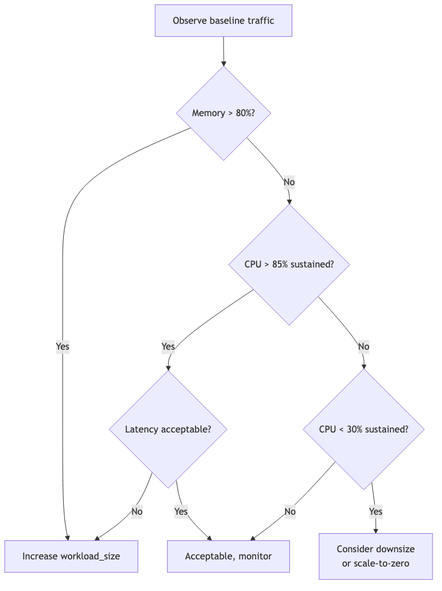

⚠️ **Exam trap:** "CPU is 95% — add more replicas." Not always — for a single hot request that's CPU-bound, more replicas don't help that request. Profile first.

---

## Debugging cookbook — five common scenarios

### Scenario 1: "The endpoint won't start"

Symptoms: deploy succeeds, but state stuck in `NOT_READY` or `FAILED`.

Likely causes:

1. **Missing dependency** — model code imports a module not in `pip_requirements`. Check serving logs.
2. **`load_context` raises** — artifact missing, file path wrong, init code crashes.
3. **OOM on load** — model + dependencies exceed workload_size memory.
4. **Permission missing** — endpoint's service principal lacks `EXECUTE` on the registered model.

Tools: serving endpoint Events tab; CloudWatch / Azure Monitor for the underlying logs; `databricks serving-endpoints get name` for state.

### Scenario 2: "Latency is fine on dev, terrible in prod"

Symptoms: same model, same code, different latency profile.

Likely causes:

1. **Different workload_size** — dev `Large`, prod `Small`. Memory pressure → swap → latency.
2. **Cold starts** — prod has `scale_to_zero_enabled=True` while dev kept warm.
3. **Different request shape** — prod requests have 1000-row batches; dev tested with 1-row batches. Per-batch overhead amortizes differently.
4. **Different request patterns** — prod has bursts that hit autoscale lag.

Tools: inference table groupBy request size; metrics dashboard.

### Scenario 3: "5% of requests fail with 504"

Symptoms: most requests are healthy; sustained tail of timeouts.

Likely causes:

1. **Slow path in the model** — ensemble fallback (Module 06), large input batches, lazy-init in `predict`.
2. **External dependency** — feature lookup or DB call inside `predict` occasionally slow.
3. **GC / cold worker** — but in Python, less common.

Tools: inference table, query `execution_time_ms` distribution; profile a slow request offline.

### Scenario 4: "p99 spiked at 3 AM"

Symptoms: scheduled time correlation.

Likely causes:

1. **Concurrent batch job** — a scheduled training or scoring job competes for the cluster's resources. Mosaic AI Model Serving is *usually* isolated, but if a custom model loads a shared resource, contention is possible.
2. **Autoscale during traffic dip** — replicas scaled down; first wakeup is slow.
3. **Network maintenance** — rare.

### Scenario 5: "The new canary version has higher latency"

Symptoms: v6 (canary) has p50 of 200ms; v5 (champion) has p50 of 80ms.

Likely causes:

1. **Model size** — v6 is larger. Profile load time.
2. **Different preprocessing** — v6 does more work in `predict`.
3. **Workload_size mismatch** — v6 needs `Medium`, deployed at `Small`.

Action: roll back the canary (traffic to 0%), investigate v6 offline.

---

## Monitoring dashboards — what to build

A typical "endpoint health" dashboard:

1. **Request rate** (line, last 24 hours).
2. **Latency p50, p95, p99** (lines, last 24 hours) — three lines on one chart.
3. **Error rate by code** (stacked area).
4. **CPU + memory** (lines per replica or aggregate).
5. **Replica count** (line — surfaces autoscale events).
6. **Per-version comparison** during canary — same metrics, grouped by `model_version`.

These can be built as DBSQL dashboards on top of the inference table + endpoint metrics export. Or use a third-party dashboard (Datadog, Grafana) if the org standardizes there.

```sql
-- p50/p95/p99 per hour from inference table
SELECT
  date_trunc('hour', from_unixtime(timestamp_ms / 1000)) AS hour,
  model_version,
  COUNT(*) AS n_requests,
  PERCENTILE_CONT(0.5)  WITHIN GROUP (ORDER BY execution_time_ms) AS p50_ms,
  PERCENTILE_CONT(0.95) WITHIN GROUP (ORDER BY execution_time_ms) AS p95_ms,
  PERCENTILE_CONT(0.99) WITHIN GROUP (ORDER BY execution_time_ms) AS p99_ms,
  SUM(CASE WHEN status_code BETWEEN 400 AND 499 THEN 1 ELSE 0 END) / COUNT(*) AS error_rate_4xx,
  SUM(CASE WHEN status_code BETWEEN 500 AND 599 THEN 1 ELSE 0 END) / COUNT(*) AS error_rate_5xx
FROM prod.ml_inference_logs.fraud_endpoint_payload
WHERE timestamp_ms > unix_millis(current_timestamp() - INTERVAL 24 HOURS)
GROUP BY 1, 2
ORDER BY 1, 2;
```

---

## Alerts on infrastructure metrics

Beyond drift alerts (Module 11), alert on endpoint health:

- **p99 latency exceeds SLA** (e.g., > 500ms for 3 consecutive 5-min windows).
- **Error rate exceeds 1%** (sustained).
- **CPU > 85% sustained** (impending capacity issue).
- **Memory > 90%** (OOM risk).
- **Cold start count > 0** during business hours (if scale-to-zero was supposed to be off).

```sql
-- Alert query: sustained p99 > 500ms
WITH hourly AS (
  SELECT
    date_trunc('5 minutes', from_unixtime(timestamp_ms / 1000)) AS window_start,
    PERCENTILE_CONT(0.99) WITHIN GROUP (ORDER BY execution_time_ms) AS p99_ms
  FROM prod.ml_inference_logs.fraud_endpoint_payload
  WHERE timestamp_ms > unix_millis(current_timestamp() - INTERVAL 1 HOUR)
  GROUP BY 1
)
SELECT COUNT(*) AS breaching_windows
FROM hourly
WHERE p99_ms > 500;
-- Alert when breaching_windows >= 3
```

⚠️ **Exam trap:** firing on a single window's metric. Single-point alerts are noisy. Require sustained breach (K consecutive windows).

---

## Mosaic AI Model Serving — production checklist

Before declaring an endpoint "production-ready":

- [ ] Auto-capture (inference tables) enabled.
- [ ] Lakehouse Monitoring InferenceLog profile attached.
- [ ] Workload_size right-sized (CPU < 70%, memory < 80% under steady load).
- [ ] Autoscale min/max set appropriately.
- [ ] Scale-to-zero disabled (unless intentional for cost on non-critical paths).
- [ ] Route Optimization enabled if QPS > 100 sustained.
- [ ] UC permissions: endpoint SP has `EXECUTE`, no excess privileges.
- [ ] Inference table joined with labels via downstream job.
- [ ] Drift alerts active (Module 11).
- [ ] Endpoint health alerts active (this module).
- [ ] Runbook documented — who to page, how to roll back via alias.
- [ ] Canary mechanism rehearsed (you've done at least one successful canary in staging).

⚠️ **Exam trap:** declaring "production ready" without inference table + monitoring + alerting. The exam treats observability as part of "production," not an add-on.

---

## Cross-link to drift detection (Module 11)

Drift and infrastructure metrics overlap operationally:

- **Drift** answers "did the data change?"
- **Infra metrics** answer "is the endpoint healthy?"

A real production incident often shows both: feature drift accelerates as a new customer cohort onboards; meanwhile error rate ticks up because the new cohort sends unexpected payloads. **Both alerts firing simultaneously is the canonical "actual incident" signal.**

When triaging:

1. Check inference table — what's the recent traffic look like?
2. Check drift metrics — has input distribution changed?
3. Check infra metrics — are errors / latency / memory in the green?
4. Check serving logs — any exceptions in the model?

---

## End-to-end exam scenario

> "Your fraud endpoint serves 200 QPS at p50 80ms. Over the last hour, p99 climbed from 300ms to 1500ms. Memory usage went from 60% to 92%. Error rate is steady at 0.1%. What's most likely happening?"

Exam-correct diagnosis: **memory pressure**. Memory at 92% means the OS is heading toward swap territory or about to OOM. Higher memory access latency manifests as elevated p99. Error rate is steady because requests still complete — just slowly.

Action:

1. Upsize workload_size (e.g., Medium → Large).
2. Investigate why memory grew (caching gone unbounded inside the model? larger requests? model artifact change?).
3. If the recent change correlates with a new model version, roll back via alias.

Wrong-answer flavors:

- "Cold starts" — would show in `cold_start_count`, would manifest as bursts in p99, not a steady climb.
- "Network issue" — would affect error rate too.
- "Concept drift" — drift doesn't affect latency.

---

## Mini quiz

1. p50 = 80ms, p99 = 1200ms. What's the typical root cause?
2. The endpoint has high 422 error rate. Whose fault is it usually?
3. Memory at 92%, latency rising. Diagnose.
4. CPU at 95% sustained. Add replicas — always right?
5. Cold start count > 0 during business hours — what setting did you misconfigure?
6. Why is "alert on a single window's metric" wrong?
7. The canary at 5% has 3x higher p50 than the champion. Action?
8. Production checklist — name 5 boxes you must tick before "ready."

**Answers:**

1. Cold starts, autoscale lag, ensemble fallback paths, or memory pressure. Combination of "rare path" or "wakeup" — investigate cold_start_count and autoscale events first.
2. **The caller's** — 422 means malformed payload or schema mismatch. Or your signature is wrong (overly strict), but most often the caller is sending the wrong shape.
3. **Memory pressure.** 92% is danger territory. Upsize workload_size; investigate why memory grew (cache, request size, model change).
4. **Not always.** If a single request is CPU-bound, more replicas serve more *concurrent* requests but don't speed up an individual one. Profile the request first.
5. `scale_to_zero_enabled=True` on a critical endpoint that has idle periods during off-business hours. For business-hour-critical endpoints, scale-to-zero is wrong.
6. Single windows are noisy. False positives waste on-call attention. Require sustained breach (K consecutive windows) — same pattern as drift alerts.
7. **Roll back the canary** (traffic to 0%). Investigate offline. Probable causes: larger model, more preprocessing in predict, wrong workload_size.
8. Five (pick any): inference tables on; monitoring attached; right-sized workload; UC permissions correct; alerts active for drift + infra; runbook documented; canary rehearsed.

---

## Sanity check

- Could you list the 9 standard endpoint metrics?
- Do you know what 422 means and who to suspect?
- Can you diagnose memory pressure vs CPU pressure vs cold starts?
- Could you write the production checklist from memory?
- Do you know why p99 matters more than average latency?

---

## End of corpus

You've reached the end. Sixteen modules, ~14,000 lines, three sections of the Sept 2025 exam blueprint.

**Final preparation:**

1. Take all three quizzes cold (Section 1, Section 2, Section 3).
2. Re-read the eight official sample questions and explain each answer in your own words.
3. Build one end-to-end project in your Databricks Free Edition: feature pipeline → training → registration → DAB deploy → serving endpoint → monitoring. Get one of everything working.
4. Schedule the exam when your quiz scores are consistently > 80% across all three.

[Back to Topic 11 README](README.md).


\newpage

# Appendix A — FACTS

_Atomic, citable facts. Single source of truth for dates, versions, deprecations, exam metadata._

# FACTS — Databricks Certified ML Professional

> Atomic, citable claims. One claim per bullet. **Last verified: 2026-05-23.** Re-verify before any roadmap or exam-scheduling decision.

---

## Exam logistics (verbatim from official Sept 30 2025 PDF)

- The exam has **59 scored multiple-choice items** + a small unidentified number of unscored items (extra time factored in).
- Time limit is **120 minutes**.
- Registration fee is **USD $200** plus applicable local tax.
- Delivery: **online proctored only** via Webassessor / Kryterion.
- **No test aides** allowed.
- Certification **valid for 2 years**; recertification requires retaking the current live full exam.
- **Passing score is 70%** (not stated on official PDF; sourced from community reports + the Databricks standard across all certs).
- **Retake policy** (Databricks standard): 14-day wait after first failure, 14 days after second failure, longer cooldown after that. Full fee per attempt.
- No prerequisite is required; the exam guide notes course attendance + ~1 year hands-on in Databricks is "highly recommended."

## Recommended preparation (per official guide, Sept 2025)

- Instructor-led: **Machine Learning at Scale** + **Advanced Machine Learning Operations**.
- Self-paced equivalents in Databricks Academy carry the same names.
- The pre-2025 single course *Machine Learning in Production* was split into the two above as part of the Sept 2025 refresh.

## Exam structure — three sections (post-Sept 30 2025 refresh)

- **Section 1 — Model Development** ≈ 45% of scored items (community estimate).
- **Section 2 — MLOps** ≈ 43% of scored items.
- **Section 3 — Model Deployment** ≈ 12% of scored items.
- The prior **4-section structure** (Experimentation / Model Lifecycle / Model Deployment / Monitoring) was collapsed; Experimentation merged into Model Development and Monitoring merged into MLOps.
- The largest single subsection by objective count is **Drift Detection and Lakehouse Monitoring**, with **10 objectives** inside Section 2.

---

## MLflow facts

- The MLflow API for nested runs is **`mlflow.start_run(nested=True)`** inside an active parent run context.
- **Model signatures are required** to register a model in Unity Catalog. If not passed explicitly, infer with **`mlflow.models.infer_signature(X, y_pred)`** or registration fails.
- **Input examples** (`input_example=...` in `log_model`) are strongly recommended; they enable serving endpoint Test UI and auto-generate request schemas.
- A custom PyFunc model subclasses **`mlflow.pyfunc.PythonModel`** and implements two methods:
  - **`load_context(self, context)`** — called once at load time; load artifacts here.
  - **`predict(self, context, model_input)`** — called per request; must return a serializable result.
- One-shot register-on-log is **`mlflow.<flavor>.log_model(..., registered_model_name="<catalog>.<schema>.<name>")`**. Unity Catalog requires the full three-level namespace; two-level names target the legacy workspace registry.
- **Hyperopt / Optuna autologging logs each trial's params + metrics but does NOT log the best model** as a registered artifact. The winning model must be explicitly re-fit and `log_model`-ed.
- `mlflow.log_dict(d, "config.json")` logs a Python dict as a JSON artifact in one call.
- `mlflow.log_figure(fig, "shap.png")` logs a matplotlib Figure as an artifact.
- `mlflow.search_experiments(filter_string=...)` and `mlflow.search_runs(filter_string=..., order_by=[...])` are the canonical programmatic search APIs.

## Unity Catalog Model Registry facts

- UC model registry uses **aliases**, not stages. Canonical aliases referenced by the exam: **`@champion`**, **`@challenger`**, **`@archived`**.
- Set an alias via **`client.set_registered_model_alias(name, alias, version)`** where `client = mlflow.MlflowClient()`.
- Load by alias: **`mlflow.pyfunc.load_model("models:/<catalog>.<schema>.<name>@champion")`**.
- Load by explicit version: **`models:/<catalog>.<schema>.<name>/<version>`**.
- Tags on registered models and on model versions are key-value strings used for governance metadata (e.g., `team`, `pii_scope`, `validation_run_id`).
- **Stage transitions (`transition_model_version_stage(...)` with `None`/`Staging`/`Production`/`Archived`) are the LEGACY workspace registry API**; they remain in MLflow but are the wrong answer for UC questions on the exam.
- Webhooks via `/api/2.0/mlflow/registry-webhooks/create` remain in the platform; events include `MODEL_VERSION_CREATED` and `MODEL_VERSION_TRANSITIONED_STAGE`. The exam still tests them as an automation primitive even though the UC-native promotion path is alias-based.

---

## Drift detection — statistical test mapping (memorize)

| Test | Data type | Notes |
|---|---|---|
| **Kolmogorov-Smirnov (KS)** | Numerical / continuous | Two-sample distribution comparison; p-value-based |
| **Chi-square** | Categorical | Frequency-table comparison |
| **Jensen-Shannon (JS) divergence** | Categorical OR binned numerical | Symmetric KL; bounded in [0, log 2] |
| **Wasserstein (Earth Mover's) distance** | Numerical / continuous | Shape-sensitive distance |
| **Total Variation Distance (TVD)** | Categorical | Max-abs-difference of PMFs |

- **KS on categorical data is wrong.** **Chi-sq on continuous data is wrong** (unless binned first). The exam exploits this.
- **Concept drift (P(Y|X) shift) cannot be detected from features alone** — it requires labels. Any answer claiming concept drift is detected via KS/Chi-sq on input features is wrong.

## Drift type taxonomy

- **Feature drift / covariate shift:** P(X) changes; P(Y|X) unchanged. Detect on input columns.
- **Label drift / prior shift:** P(Y) changes. Requires ground-truth labels.
- **Prediction drift:** P(Ŷ) changes. Detect on model outputs in inference tables; available without labels — useful as an **early-warning signal**.
- **Concept drift:** P(Y|X) changes. Requires labels. Most damaging.

---

## Lakehouse Monitoring facts

- **Three monitor profile types:**
  - **Snapshot** — static / non-time-aware table; full table compared to baseline each run.
  - **TimeSeries** — table with a timestamp column; compares successive time windows.
  - **InferenceLog** — for inference-table-style data (predictions + optional joined labels); adds model performance metrics on top of drift.
- Lakehouse Monitoring writes two output Delta tables per monitor: **`<table>_profile_metrics`** and **`<table>_drift_metrics`**.
- The profile metrics table contains row-level descriptive stats per column (count, null rate, min, max, percentiles, distinct values).
- The drift metrics table contains the test statistic and p-value (where applicable) per column per slice per time window.
- **Slicing expressions** (`slicing_exprs=["region", "customer_tier"]`) compute metrics per slice — required for per-segment drift detection.
- **Custom metrics** (`MonitorCustomMetric`) can be added to the metrics table — e.g., per-segment F1 against joined labels.
- Alerts are configured by attaching a **Databricks SQL Alert** to a SQL query against the `_drift_metrics` table.
- **InferenceLog monitors are automatically created** when you enable an inference table on a Model Serving endpoint.

---

## Databricks Asset Bundles (DABs) facts

- A bundle is rooted in a **`databricks.yml`** file at the repo root.
- The CLI commands are **`databricks bundle validate`**, **`databricks bundle deploy -t <target>`**, **`databricks bundle run -t <target> <job_or_pipeline>`**, and **`databricks bundle destroy -t <target>`**.
- Bundle **resources** that the exam can ask you to declare:
  - `jobs` — Lakeflow Jobs (formerly Workflows).
  - `pipelines` — Lakeflow Declarative Pipelines (formerly DLT).
  - `experiments` — MLflow experiments.
  - `registered_models` — UC registered models with `catalog_name` + `schema_name`.
  - `model_serving_endpoints` — Mosaic AI Model Serving endpoints with `config` block (served entities + traffic).
  - `schemas` — UC schemas.
- Bundle **targets** (e.g., `dev`, `staging`, `prod`) declare workspace URL + environment-specific variable overrides.
- The `mode: development` target setting auto-prefixes resource names with the developer's username for isolation; `mode: production` requires explicit names and disallows ad-hoc edits.
- **Variables** (`variables:` block) parameterize bundle resources; reference via `${var.name}` or `${workspace.current_user.userName}`.
- **Permissions** can be set per-resource within the bundle (e.g., `permissions: [{level: CAN_MANAGE, user_name: ...}]`).

---

## Mosaic AI Model Serving facts

- An **endpoint** hosts one or more **served entities** (model versions or external endpoints).
- **`traffic_config.routes`** assigns percentages summing to 100 across served entities.
- **Canary deployment** = add a second served entity to the same endpoint and incrementally shift traffic (5% → 25% → 50% → 100%). Single endpoint, finer-grained, cheaper. **Preferred for high-traffic high-risk apps.**
- **Blue-green deployment** = either two endpoints (full DNS flip) or one endpoint with two served entities at 0%/100% then flipped 100%/0%. Instant rollback; double cost during cutover.
- **Shadow deployment** = route a copy of production traffic to the candidate without affecting user responses; compare offline.
- **Route Optimization** is a per-endpoint toggle that reduces network hops; improves throughput on high-QPS endpoints.
- **Scale-to-zero** is supported on CPU and small GPU endpoints; cold-start latency is the tradeoff.
- **Autoscale** is configured per served entity via `min_provisioned_throughput` / `max_provisioned_throughput` (provisioned-throughput PT mode) or `workload_size` (small/medium/large for CPU custom models).
- **Endpoint metrics surfaced for monitoring:** request rate, latency (**p50, p95, p99**), CPU usage, memory usage, error rate (HTTP 4xx, 5xx).
- **Inference tables** auto-log each request + response to a Delta table named `<catalog>.<schema>.<endpoint>_payload`.

---

## Feature Engineering in Unity Catalog facts

- The current client is **`from databricks.feature_engineering import FeatureEngineeringClient`** — instantiate as **`fe = FeatureEngineeringClient()`**.
- **`fe.create_table(name="cat.sch.tbl", primary_keys=["id"], timestamp_keys=["event_ts"], df=df)`** creates a feature table backed by Delta.
- **Point-in-time correctness** is enforced when a `FeatureLookup` includes both `lookup_key` and `timestamp_lookup_key`. This prevents using future feature values for past events — the canonical training/serving skew prevention pattern.
- **`fe.create_training_set(df=label_df, feature_lookups=[...], label="y")`** returns a training set object; call **`.load_df()`** to materialize a Spark DataFrame for training.
- **`fe.log_model(model, artifact_path=..., flavor=..., training_set=...)`** packages feature lookup metadata into the model. At inference time **`fe.score_batch(model_uri, df)`** auto-joins features by primary key.
- **Online tables** are UC-native, Databricks-managed serverless replicas of an offline feature table. They support sub-10ms reads and are required for real-time feature serving from a Model Serving endpoint.
- **On-demand features** are Python functions decorated with **`@feature_function`** that compute features at request time (e.g., distance from a user-supplied location). The same code runs at training and serving — eliminates training/serving skew.
- The legacy package **`databricks-feature-store`** with `FeatureStoreClient` is **deprecated** as of the FE-in-UC migration; the new package is **`databricks-feature-engineering`** (≥ 0.2.0).

---

## Optuna + Ray facts

- The MLflow integration callback is **`from optuna.integration.mlflow import MLflowCallback`**.
- Pass to `study.optimize(objective, n_trials=N, callbacks=[mlflow_callback])` to log each trial as a child run.
- **`MLflowSparkStudy`** (Optuna integration) distributes trials across the Spark cluster — the canonical answer for distributed Optuna on Databricks.
- Optuna samplers: **TPE** (default, Bayesian-style), **CmaEsSampler** (continuous), **RandomSampler**, **GridSampler**, **NSGAIISampler** (multi-objective).
- Optuna pruners: **MedianPruner**, **SuccessiveHalvingPruner**, **HyperbandPruner**, **PercentilePruner** — abandon unpromising trials early.
- **Ray on Databricks** provisions a Ray cluster on top of Spark workers via `ray.util.spark.setup_ray_cluster(...)`. Use **Ray Tune** for distributed PyTorch/TF training, RL, or search spaces Optuna can't express.
- Hyperopt + SparkTrials is the **legacy** answer on the new exam.

---

## PySpark scaling APIs

- **`applyInPandas`** — group-wise: `df.groupBy("k").applyInPandas(fn, schema=...)`. One DataFrame in (the group), one DataFrame out per group. Use for **group-specific model training** (one model per `store_id`).
- **`mapInPandas`** — partition-wise iterator API: function receives an iterator of pandas DataFrames, yields iterator of pandas DataFrames. Use for streaming-friendly batch inference.
- **`pandas_udf`** — Series-in, Series-out (scalar) or DataFrame-in, scalar-out (aggregate). Used for vectorized columnar UDFs.
- `mlflow.pyfunc.spark_udf(spark, model_uri)` returns a Spark UDF that applies the model to a DataFrame column — the **default batch inference pattern** in Databricks.

## Lakeflow Jobs facts (formerly Workflows)

- A Lakeflow Job is a DAG of **tasks**; each task has dependencies declared via `depends_on:`.
- Each task can run on a **job cluster** (ephemeral, cheaper, isolated) or an existing all-purpose cluster (more expensive, shared).
- **Repair runs** allow re-execution of failed tasks only, preserving successful task outputs and skipping retries on already-completed work.
- ML pipelines on Databricks express training, evaluation, registration, deployment, and monitoring as separate Lakeflow Job tasks with explicit dependencies.

---

## CI/CD pattern (deploy-code strategy)

- **Deploy-code strategy** = the source code that produces the model is what gets promoted across environments, not the model artifact itself. Each environment re-trains (or re-validates) from controlled code.
- This is the **exam-correct architecture** for regulated industries. Contrast with deploy-model strategy where a single artifact is promoted across envs — less auditable but cheaper to operate.
- Canonical pattern: `dev branch → DAB deploy to dev workspace → PR → CI tests + DAB deploy to staging → manual gate → DAB deploy to prod → set @champion alias`.

---

## Common pitfalls (memorize)

- Concept drift cannot be detected from features alone — requires labels.
- KS on categorical data is wrong; Chi-sq on continuous data is wrong.
- Hyperopt/Optuna autologging does NOT register the best model — manual re-fit + log_model required.
- `FeatureStoreClient` is the legacy answer; `FeatureEngineeringClient` is correct.
- `transition_model_version_stage` is the legacy answer for UC; aliases are correct.
- Online Tables (UC-native) ≠ Online Stores (deprecated DynamoDB/Cosmos backend).
- Without a model signature, UC registration fails — answers that omit it are distractors.
- "Set 100% traffic to new model immediately" is wrong for high-risk canary scenarios — incremental shift is correct.
- `applyInPandas` (group-wise) ≠ `pandas_udf` (column-wise) — choose by data shape, not familiarity.

---

## Sources (re-verify any time before using)

- **Official Databricks Certified ML Professional Exam Guide**, September 30 2025 — `/Users/vr/Code/Career_upskill/research_inputs/11_databricks_ml_professional/databricks_ml_professional_exam_guide.pdf`.
- [Databricks Certification — ML Professional landing page](https://www.databricks.com/learn/certification/machine-learning-professional)
- [MLflow Python API — mlflow.pyfunc](https://mlflow.org/docs/latest/python_api/mlflow.pyfunc.html)
- [Databricks Asset Bundles documentation](https://docs.databricks.com/aws/en/dev-tools/bundles/)
- [Lakehouse Monitoring overview](https://docs.databricks.com/aws/en/lakehouse-monitoring/index.html)
- [Mosaic AI Model Serving — custom models](https://docs.databricks.com/aws/en/machine-learning/model-serving/custom-models)
- [Feature Engineering in Unity Catalog](https://docs.databricks.com/aws/en/machine-learning/feature-store/uc/ui-uc)
- [Databricks Feature Store deprecation notes](https://docs.databricks.com/aws/en/release-notes/feature-store/databricks-feature-store)
- [Optuna MLflow callback documentation](https://optuna-integration.readthedocs.io/en/latest/reference/generated/optuna_integration.MLflowCallback.html)

**Re-verify before:** scheduling the exam, citing a number in a planning doc, or recommending an API in a code review. Databricks ships fast; the cert refreshes roughly yearly.

\newpage

# Appendix B — Quizzes


\newpage

# Quiz 01 — Model Development (Section 1, ~45%)

> Covers modules **01-06**: Advanced MLflow tracking, custom PyFunc, Optuna + Ray, Feature Engineering in UC, advanced Spark ML, ensembles via PyFunc.
>
> **80 questions** — Recall (24) / Apply (32) / Diagnose (16) / Defend (8). Target: ≥ 80% before scheduling. ~2 min/question.
>
> All questions are **ORIGINAL** — written from the verbatim Sept 30 2025 exam objectives. No NDA content.

---

## Recall (Qs 1-24)

1. Which Python statement opens a child run nested under an active MLflow parent run?
2. Which two parameters of `mlflow.start_run()` together let you resume an existing run rather than start a new one?
3. Name the two methods of `mlflow.pyfunc.PythonModel` that a custom model MUST implement.
4. Which MLflow function infers a model signature from a sample input and prediction output?
5. What is the canonical `model_uri` syntax to load the model version aliased `@champion` from UC registered model `prod.ml.churn`?
6. Which client class replaces the deprecated `FeatureStoreClient` in 2025?
7. Name the two `FeatureLookup` keyword arguments required for **point-in-time correctness**.
8. Which Optuna sampler is Optuna's default and is described as a Bayesian-style Tree-structured Parzen Estimator?
9. Which Optuna integration class lets each trial log to a separate MLflow run?
10. Which Optuna class distributes trials across a Databricks Spark cluster?
11. Name three Optuna pruners commonly used to early-stop unpromising trials.
12. What MLflow flavor are you forced to use when you need request-time preprocessing + a custom artifact + multi-model routing?
13. Which file does `mlflow.pyfunc.log_model` generate to declare runtime dependencies?
14. Which Spark ML class chains feature transformers + an estimator into a serializable workflow?
15. Which two Spark ML evaluator classes cover binary classification vs multiclass classification?
16. Which Spark ML class performs k-fold cross-validation with a parameter grid?
17. Which `CrossValidator` parameter controls **how many models train in parallel** per fold?
18. What is the default value of `CrossValidator.parallelism` if you don't set it?
19. Which Pandas Function API method runs a Python function once per group on partitioned data?
20. To register a model in **Unity Catalog**, what optional-elsewhere argument is now **required** by `log_model`?
21. Which MLflow API searches across runs in an experiment with a filter string?
22. In Optuna, which built-in result attribute lets you retrieve the best-performing trial after `study.optimize` completes?
23. Which MLflow flavor function packages feature-store metadata into a logged model so inference auto-joins features?
24. Name the two artifact-logging functions for (a) an arbitrary file on disk and (b) a matplotlib `Figure`.

## Apply (Qs 25-56)

25. You want to run a parent MLflow run that contains 50 child runs (one per HP set) and a final "best-retrained" run. Sketch the `with` / `start_run` structure in 5 lines or fewer.

26. You need a model that, at predict-time, queries a feature table by `customer_id`, applies a custom transformation, then calls an XGBoost model. Which MLflow construct do you use, and what goes in `load_context` vs `predict`?

27. You want to launch 200 Optuna trials, each trying a different `learning_rate` / `n_estimators` combo, distributed across a 4-worker Spark cluster, with each trial visible as a separate MLflow run. List the four objects/callables you wire together.

28. A teammate proposes `SparkTrials` from Hyperopt with `parallelism=8`. The cert exam is the Sept 2025 refresh. What's the correct modern replacement and why?

29. You're training a feature table over a streaming source. Which `FeatureEngineeringClient` method writes the streaming output to a UC feature table with **merge** semantics?

30. A `FeatureLookup` is configured with `lookup_key="customer_id"` but **no** `timestamp_lookup_key`. What kind of data leakage can occur, and what does adding `timestamp_lookup_key="event_ts"` prevent?

31. You need sub-10ms feature retrieval at request-time for a model-serving endpoint. Which UC-native construct backs the offline feature table and how is it created?

32. You're computing haversine distance between a user-supplied pickup point and a precomputed driver location. The transformation must run identically at training and serving time. Which feature-store construct fits, and what decorator is used?

33. You want to score a registered UC model on a 500M-row Delta table. Provide the one-line MLflow call that creates the Spark UDF and the `spark.read.table(...).withColumn(...)` invocation.

34. Per the official sample question, the answer to "distribute Optuna trials and log each trial to MLflow on Databricks" is which **two** integration objects?

35. Write the `mlflow.pyfunc.log_model` call (3-4 lines) that registers a custom model to UC under `prod.ml.recommender`, including a signature and an input example.

36. You're training one XGBoost model per `store_id` (1000+ stores), each with its own data slice. Which Pandas Function API method is appropriate, and what's the function signature shape?

37. A `Pipeline` contains a `StringIndexer` + `OneHotEncoder` + `VectorAssembler` + `LogisticRegression`. After fitting on training data, you save it. Which file format does Spark ML use, and how do you reload it?

38. You log a model with `mlflow.sklearn.log_model(..., registered_model_name="prod.ml.churn")`. Then you want to mark this newly created version as the challenger. Which client method sets the `@challenger` alias?

39. You want a `CrossValidator` to run 5 folds × 12 hyperparameter combinations = 60 models. You have 8 worker cores. What value of `parallelism` would you set, and what's the tradeoff vs `parallelism=1`?

40. You need to ensemble three sklearn classifiers (LR, RF, XGB) with per-class weighted soft voting + a custom rule that overrides predictions when one feature exceeds a threshold. Which MLflow flavor are you required to use, and why is `sklearn.VotingClassifier` insufficient here?

41. You want to compare TPESampler vs CmaEsSampler on the same objective function within one Optuna study. Is that possible in a single `Study`, or do you need two studies? Justify in one sentence.

42. Inside `objective(trial)`, you call `mlflow.start_run(nested=True)`. Where must the parent `mlflow.start_run()` live for nesting to take effect?

43. You enable `mlflow.autolog()` before calling `optuna.create_study().optimize(...)`. After 100 trials, you find the experiment has only HPs and metrics logged — **no** model artifacts. What's the missing manual step?

44. Write the 3-line code block that uses `mlflow.models.infer_signature` on `X_test` and `model.predict(X_test)` and passes it into `log_model`.

45. You want to serve a custom PyFunc model on Model Serving. The model needs a large embedding file (200 MB). Where do you point it from, and which PyFunc method loads it once at endpoint start rather than every request?

46. A teammate wants to use **`FeatureStoreClient.create_feature_table`** in 2026. You tell them the API is deprecated and point them at the modern equivalent. Provide the import line and the modern method name.

47. You want to define a **custom transformer** in Spark ML that adds an interaction column (`featA * featB`). Which two base classes do you subclass, and what is the single method you must override?

48. The training set is 80 GB; you have an r5.4xlarge driver with 128 GB RAM. The model is a gradient-boosted tree. Vertical or horizontal scaling — and which framework matches that choice?

49. You're using Optuna for multi-objective optimization (minimize loss AND minimize inference latency). Which sampler class supports multi-objective natively, and what does `study.best_trial` return in that case?

50. You want a `Pipeline` with hyperparameter tuning over (a) `LogisticRegression.regParam` and (b) `StringIndexer.handleInvalid`. Sketch the `ParamGridBuilder` and explain whether tuning *transformer* params via `ParamGridBuilder` works.

51. You want to call `study.optimize(objective, n_trials=500, callbacks=[mlflc])` where `mlflc` is `MLflowCallback(...)`. Which two keyword arguments of `MLflowCallback` matter most: experiment_name and what else?

52. You're versioning training code in Git. The same code runs in dev, staging, and prod. Which Databricks construct lets you parameterize **catalog name** so the dev run writes to `dev.ml.tbl` and the prod run writes to `prod.ml.tbl` without any code change?

53. You want to write a UC feature table from a streaming DataFrame and have it served by an online table. Which `FeatureEngineeringClient` method writes the offline table, and what additional CLI/SDK call creates the online sibling?

54. You need to log a confusion matrix as a model artifact during training. Which two API calls in sequence accomplish this?

55. Which Spark ML class outputs both a model and a `bestModel` attribute exposing the winning hyperparameters?

56. Sketch the `databricks-feature-engineering` `create_training_set` call that joins a labels DataFrame (`labels_df` with `customer_id` + `event_ts` + `y`) with a feature table `prod.ml.cust_features` using point-in-time correctness on `event_ts`.

## Diagnose (Qs 57-72)

57. A teammate registers a model to UC and it fails with `MlflowException: Model signature is required for models in Unity Catalog`. What did they forget, and how do they fix it without re-training?

58. An Optuna study runs all 100 trials but the MLflow experiment shows only ONE run with 100 sets of HPs concatenated. What's misconfigured?

59. `CrossValidator.fit()` is set with `parallelism=4` on a single-node driver-only cluster. You see no parallelism in the Spark UI — only sequential model training. Why?

60. A custom PyFunc model serves correctly locally but on Model Serving it errors with `ModuleNotFoundError: No module named 'company_utils'`. What did the developer forget in `log_model`?

61. A `FeatureLookup` with `timestamp_lookup_key` set still produces data leakage in production. The lookup is configured against a feature table that has `timestamp_keys=["update_ts"]` but the label DataFrame uses an `event_ts` column 30 minutes after each customer event. Why is leakage still possible, and what config change fixes it?

62. You wrap a sklearn model in PyFunc and override `predict`. The model is registered, but `spark_udf` raises `TypeError: predict() got an unexpected keyword argument 'params'`. What is the cause and the fix?

63. `study.optimize(callbacks=[MLflowCallback(...)])` runs but every trial logs to the **default** experiment instead of the one you specified. What's wrong with the callback init?

64. A `Pipeline` saved with `pipeline.save(path)` cannot be reloaded — `Spark Pipeline expected meta.json`. What is the most likely root cause and the fix?

65. `mlflow.autolog()` is on. A Hyperopt search runs 200 trials. The "best model" recorded in the MLflow experiment under `@champion` alias is wrong — it points at trial 47, not the actual best. Diagnose. (Hint: there is no auto-promotion in Hyperopt autologging.)

66. A `pandas_udf` is misused: someone wraps a model and passes a `pd.DataFrame` in and expects a `pd.DataFrame` out. The UDF errors `Schema mismatch`. Which Pandas Function API method should they have used instead, and why?

67. `fe.score_batch(model_uri, df)` returns NaN for 30% of rows. The feature table has 100% coverage on the lookup keys. What is the next thing to check?

68. A model serving endpoint with a custom PyFunc model takes 8s to cold-start. The team blames Model Serving. What in the PyFunc class is the likely culprit, and where should heavy initialization actually live?

69. `mlflow.search_runs(experiment_ids=[..], filter_string="metrics.loss < 0.5")` returns 0 rows, but the UI clearly shows 50 such runs. What might be wrong with `experiment_ids` or with how `loss` was logged?

70. `mlflow.pyfunc.spark_udf(spark, model_uri)` works in a notebook but the same call inside a Jobs task raises `MlflowException: Could not resolve URI`. Diagnose two probable causes.

71. A `CrossValidator` with `numFolds=5` and 50 HP combos is set to `parallelism=20`. The cluster has 16 worker cores. The driver OOMs after 4 hours. Diagnose: where did parallelism go wrong?

72. After registering a UC model, the team's monitoring job cannot find it via `mlflow.models.get_model_info("models:/ml.churn@champion")`. The two-level name only references schema + model — what's missing for UC?

## Defend (Qs 73-80)

73. Defend the choice of `MLflowSparkStudy` over `MLflowCallback` alone when launching 1000 Optuna trials on Databricks.

74. Argue against using `sklearn.VotingClassifier` as a registered UC model, when at request-time you also need a feature-store lookup. What's the right pattern?

75. Defend using **single-node sklearn on a beefy driver** over SparkML on a multi-worker cluster for a 12 GB training set and a single XGBoost model.

76. Argue against logging the best Hyperopt/Optuna model as the "winner" using only autologging.

77. Defend point-in-time joins as a non-negotiable design constraint in regulated industries (e.g., healthcare claims, financial fraud).

78. Defend the use of `FeatureEngineeringClient.create_training_set` over a hand-written join in PySpark, even though both produce the same DataFrame.

79. Argue for (or against) tuning *transformer* parameters (like `StringIndexer.handleInvalid`) inside a `ParamGridBuilder` rather than fixing them up front.

80. Defend the answer "custom PyFunc + `load_context`" over "vanilla `mlflow.sklearn.log_model`" for a model that hits an external service (e.g., a low-latency cache) at inference time.

---

## Answers (don't peek until done)

1. `mlflow.start_run(nested=True)` — only works if a parent run is already active.
2. `run_id` (the existing run to resume) and `nested=False` is unrelated; the relevant pair is `run_id` + `experiment_id`.
3. `load_context(self, context)` and `predict(self, context, model_input)`.
4. `mlflow.models.infer_signature(model_input, model_output)`.
5. `models:/prod.ml.churn@champion`.
6. `databricks.feature_engineering.FeatureEngineeringClient`. > ⚠️ **Exam trap:** `FeatureStoreClient` from `databricks.feature_store` is deprecated.
7. `lookup_key` and `timestamp_lookup_key`.
8. `TPESampler`.
9. `optuna.integration.mlflow.MLflowCallback`.
10. `MLflowSparkStudy` (in `optuna-integration[mlflow]`).
11. `MedianPruner`, `SuccessiveHalvingPruner`, `HyperbandPruner`.
12. `mlflow.pyfunc` with a custom `PythonModel`.
13. `conda.yaml` (plus `python_env.yaml` / `requirements.txt`).
14. `pyspark.ml.Pipeline`.
15. `BinaryClassificationEvaluator` and `MulticlassClassificationEvaluator`.
16. `CrossValidator` (and `TrainValidationSplit` for a single split).
17. `parallelism`.
18. `1` (sequential by default).
19. `applyInPandas` (called via `groupBy(...).applyInPandas(fn, schema=...)`).
20. `signature` (or use `infer_signature`). UC enforces it.
21. `mlflow.search_runs(experiment_ids=[...], filter_string=...)`.
22. `study.best_trial` (and `study.best_value`, `study.best_params`).
23. `databricks.feature_engineering.FeatureEngineeringClient.log_model` (a.k.a. `fe.log_model`).
24. `mlflow.log_artifact(path)` and `mlflow.log_figure(fig, "name.png")`.

25.
```python
with mlflow.start_run(run_name="parent") as parent:
    for hp in hp_grid:
        with mlflow.start_run(nested=True, run_name=f"trial-{hp['lr']}"):
            mlflow.log_params(hp); mlflow.log_metric("cv_loss", train(hp))
    with mlflow.start_run(nested=True, run_name="best-refit"):
        mlflow.sklearn.log_model(best_model, "model", signature=sig)
```

26. **Custom PyFunc**. `load_context` loads the XGBoost model artifact + a feature-store client/connection (one-time). `predict` does the feature lookup + transformation + inference per request. This avoids re-loading the model on every call.

27. (a) `optuna.create_study(sampler=TPESampler())`, (b) `MLflowCallback(tracking_uri=..., metric_name=...)`, (c) `MLflowSparkStudy` distributing trials, (d) the `objective(trial)` function logging via the callback. The official sample answer endorses MLflowCallback + MLflowSparkStudy.

28. **Hyperopt is OUT in the Sept 2025 refresh.** Use **Optuna** with `MLflowSparkStudy` for Spark-distributed trials + `MLflowCallback` for per-trial MLflow logging. > ⚠️ **Exam trap:** Any answer choice using `SparkTrials` or `hyperopt.fmin` is the wrong 2025 answer.

29. `fe.write_table(name="cat.sch.feat", df=streaming_df, mode="merge")`.

30. **Training/serving skew via future-leaking features.** Without a timestamp key, the lookup returns the *current* (latest) feature value, which may be from after the event you're predicting. `timestamp_lookup_key="event_ts"` forces a point-in-time join: only feature values with `feature_ts <= event_ts` are returned.

31. An **Online Table** — UC-native, serverless, replicated from the offline Delta feature table. Create it via the Databricks SDK (`w.online_tables.create(...)`) or the UC UI. > ⚠️ **Exam trap:** "Online Stores" (legacy DynamoDB/Cosmos) is deprecated and a distractor.

32. **On-demand feature** via `@feature_function` decorator. Defined as a Python UDF over the request payload; the same Python runs at training and serving — no skew possible.

33.
```python
udf = mlflow.pyfunc.spark_udf(spark, "models:/prod.ml.scorer@champion")
spark.read.table("prod.silver.events").withColumn("pred", udf("f1", "f2", "f3"))
```

34. `MLflowCallback` (per-trial MLflow logging) + `MLflowSparkStudy` (Spark-distributed trials).

35.
```python
mlflow.pyfunc.log_model(
    artifact_path="model",
    python_model=MyRecommender(),
    signature=infer_signature(X_sample, y_sample),
    input_example=X_sample.iloc[:2],
    registered_model_name="prod.ml.recommender",
)
```

36. `groupBy("store_id").applyInPandas(train_one_store, schema=...)`. The function takes `pd.DataFrame -> pd.DataFrame`.

37. Spark ML uses a **directory** (not a single file) containing `metadata`, stage subdirs, `data` parquet. Reload with `PipelineModel.load(path)`.

38. `client.set_registered_model_alias(name="prod.ml.churn", alias="challenger", version=new_version)`.

39. Set `parallelism=8` (one per worker core). Tradeoff: faster wall-clock but each model gets less Spark parallelism internally; with `parallelism=1` each model can use all 8 cores but training is sequential.

40. **Custom PyFunc**. `VotingClassifier` doesn't support per-class weight overrides + threshold-rule overrides + custom voting logic. PyFunc lets you express arbitrary aggregation in `predict`. > ⚠️ **Exam trap:** "Use VotingClassifier + log_model" is wrong when you need conditional rules.

41. **Two studies** — `sampler` is a `Study`-level attribute set at creation. To compare samplers you create one study per sampler with the same objective and seed.

42. The parent must be active **on the same Python process / driver thread**. In Optuna with `MLflowCallback`, you typically don't wrap `optimize` in a parent run — the callback creates one run per trial. If you want true nesting under a parent, you must wrap `study.optimize` itself in `mlflow.start_run()` and pass `nested=True` to the callback (or wrap the per-trial run inside `objective`).

43. **Manually re-fit the best model and `mlflow.<flavor>.log_model(best_model, ...)`.** > ⚠️ **Exam trap:** Hyperopt/Optuna autologging logs trial HPs/metrics but does **NOT** auto-log the best model.

44.
```python
from mlflow.models import infer_signature
sig = infer_signature(X_test, model.predict(X_test))
mlflow.sklearn.log_model(model, "model", signature=sig)
```

45. Store the embedding as an MLflow **artifact** (`artifacts={"emb": "/dbfs/..."}` passed to `log_model`); access via `context.artifacts["emb"]` in `load_context`. Heavy loading goes in `load_context` (once at endpoint start), NOT `predict` (per request).

46. `from databricks.feature_engineering import FeatureEngineeringClient` then `fe.create_table(name=..., primary_keys=..., timestamp_keys=..., df=...)`.

47. Subclass `Transformer` and one of `HasInputCols` / `HasOutputCol` (plus `DefaultParamsReadable`/`Writable` for save/load). Override `_transform(self, dataset)`.

48. **Vertical** — 80 GB fits within 128 GB RAM after partitioning. Use **single-node sklearn / XGBoost** on the driver (or Pandas API on Spark for the wrangling, single-node fit). Distributing a single tree-boosting model adds shuffle cost without speedup at this size.

49. `NSGAIISampler` for multi-objective. `study.best_trial` is **undefined** for multi-objective — use `study.best_trials` (Pareto front, list of trials).

50.
```python
grid = (ParamGridBuilder()
    .addGrid(lr.regParam, [0.01, 0.1])
    .addGrid(idx.handleInvalid, ["skip", "keep"])
    .build())
```
Yes — `ParamGridBuilder` tunes any `Param`-typed attribute, including those on transformers, as long as the transformer is a stage in the `Pipeline` passed to `CrossValidator`.

51. `experiment_name` and `metric_name` (the trial's optimization metric to log under that name).

52. **Databricks Asset Bundle (DAB) targets**: `${var.catalog}` parameterized per target (`dev`, `staging`, `prod`). One codebase, three configs.

53. Offline: `fe.create_table(...)` or `fe.write_table(...)`. Online: `w.online_tables.create(name=..., spec=OnlineTableSpec(...))` via Databricks SDK.

54.
```python
fig, ax = plt.subplots(); ConfusionMatrixDisplay.from_predictions(y_true, y_pred, ax=ax)
mlflow.log_figure(fig, "confusion_matrix.png")
```

55. `CrossValidatorModel` (and `TrainValidationSplitModel`) — both expose `.bestModel`.

56.
```python
training_set = fe.create_training_set(
    df=labels_df,
    feature_lookups=[FeatureLookup(
        table_name="prod.ml.cust_features",
        lookup_key="customer_id",
        timestamp_lookup_key="event_ts",
    )],
    label="y",
)
train_df = training_set.load_df()
```

57. They omitted `signature=` (and didn't pass `input_example` either, from which a signature could be inferred). Fix without re-training: load the model object, `infer_signature(X_sample, model.predict(X_sample))`, and `mlflow.<flavor>.log_model(model, "model", signature=sig, registered_model_name="cat.sch.name")`.

58. The `MLflowCallback` was not passed to `study.optimize(..., callbacks=[mlflc])`, OR the callback was instantiated with `nest_trials=False` and the parent run wasn't closed between trials.

59. Driver-only cluster has no executors. `CrossValidator.parallelism` parallelizes via Spark; with no executors the work falls back to driver-side sequential training. Fix: add workers, or switch to a single-node multi-core sklearn solution.

60. `extra_pip_requirements=["company_utils==1.2"]` (or `pip_requirements=[...]`) on `log_model`. Without it, the conda.yaml omits the dependency and the endpoint can't import it.

61. `timestamp_lookup_key` matches against the feature table's `timestamp_keys` value-by-value, but feature_table updates lag the event by minutes. The leakage path is: feature_ts was set to the *processing* timestamp on a backfill, which is **after** the event. Fix: ensure feature_table's timestamp_keys reflect feature *validity time* (when the value first became known), and use a **lookback** in `FeatureLookup` if needed.

62. The PyFunc `predict` signature must accept `(self, context, model_input)` only (or `(..., model_input, params)` in MLflow 3 with `params` declared in the signature). Older `predict(self, context, model_input, params)` without `params` declared in the signature breaks `spark_udf`. Fix: align signature with MLflow 3 conventions, declare `params` schema, or drop the `params` arg.

63. The callback was instantiated as `MLflowCallback(metric_name="loss")` without `tracking_uri` or `experiment_name`. Fix: `MLflowCallback(tracking_uri=mlflow.get_tracking_uri(), metric_name="loss", create_experiment=False)` and set the experiment via `mlflow.set_experiment(name=...)` before `study.optimize`.

64. Spark ML save uses a directory; if it was copied as a single file (or saved via `pickle`), the metadata structure is lost. Re-save with `pipeline.write().overwrite().save(path)` to a directory; reload with `PipelineModel.load(path)`.

65. **Hyperopt autologging logs trial metadata only — it does NOT promote a best model.** Whoever set the `@champion` alias did so manually, possibly on the wrong run. Fix: query `mlflow.search_runs(filter_string="...", order_by=["metrics.loss ASC"]).iloc[0]`, re-fit on full train data, `log_model`, then `set_registered_model_alias("champion", new_version)`.

66. `applyInPandas` (DataFrame → DataFrame per group). `pandas_udf` is Series → Series and doesn't carry group-level batching for one-model-per-group training.

67. The label DataFrame's `lookup_key` rows include values that **don't exist** in the feature table at all (referential integrity issue), OR the join's `timestamp_lookup_key` is finding no feature record valid before each event_ts. Inspect the join coverage by joining manually and counting nulls.

68. Heavy initialization (model file load, embedding load, DB connection) is in `predict` instead of `load_context`. Move it to `load_context` so it runs once at endpoint start.

69. `experiment_ids` is a list of *IDs* (strings), not names. If the user passed an experiment **name** it returns 0 rows. Or `loss` was logged as a *param* (string), not a metric, so the filter type-coerces wrong.

70. (a) `model_uri` uses a relative path or a `runs:/...` URI that's only valid in the original notebook context. (b) The Job's principal lacks UC `EXECUTE` permission on the registered model. Fix: use the canonical `models:/cat.sch.name@alias` URI and grant the Job's service principal `EXECUTE`.

71. `parallelism=20` > cluster cores. Spark schedules 20 model trainings concurrently; each contends for the same 16 cores, all run, all keep state on driver, driver heap fills. Set `parallelism` ≤ worker-cores / model-internal-parallelism.

72. UC requires **three-level** name: `catalog.schema.model`. The URI `models:/ml.churn@champion` is two-level (Workspace Registry legacy). Use `models:/prod.ml.churn@champion`.

73. `MLflowCallback` alone runs trials sequentially in one Python process. `MLflowSparkStudy` distributes trials to executors so 1000 trials run in parallel across the cluster. For tuning at scale, parallelism is the bottleneck — that's exactly what Spark-distributed Optuna addresses.

74. `VotingClassifier` is a static sklearn ensemble — it can't perform an online feature-store lookup at predict time. The right pattern: **custom PyFunc** that, in `predict`, performs the feature lookup (via on-demand feature serving or an online table) and then routes to the wrapped voter. Wraps the ensemble + the I/O side-effect cleanly.

75. SparkML adds shuffle and JVM serialization overhead. For 12 GB on a 128 GB driver, sklearn's optimized C++ pathways and single-process state outperform distributed XGBoost on Spark. Horizontal scaling is justified when data > RAM or model parallelism is genuinely required.

76. Autologging logs **trial telemetry only**. The "best model" is computed from the trials table but not persisted as an MLflow model artifact. If you alias `@champion` based on autologged metadata, the alias points to a run with no model. Always re-fit the winner with full data and `log_model` it explicitly.

77. In claims or fraud, a training row labelled `event_ts = 2024-01-15` must NOT see features computed from data the model wouldn't have had on Jan 15 (e.g., the final claim amount adjudicated on Jan 30). Without point-in-time correctness, the model implicitly cheats in training, validation looks great, production fails. Regulators (HIPAA / SOX / FCRA) explicitly disallow this kind of lookahead in model documentation.

78. `create_training_set` records **feature lineage metadata** in the resulting model: which feature tables, which lookup keys, which timestamp keys. At serving time `fe.score_batch` / endpoint auto-joins features the same way. A hand-written join produces the same DF but no lineage → cannot guarantee training/serving parity.

79. **For**: lets you explore "is `skip` better than `keep` for unseen categories?" without two manual training scripts. **Against**: increases search space without clear ROI; transformer params are usually known a priori. Tune them only when ROI is real (e.g., comparing imputation strategies).

80. Vanilla `log_model` serializes the model only — there's no place to put per-request I/O. A custom PyFunc has `load_context` (open the cache connection once) and `predict` (call the cache per request). Without PyFunc you'd have to do the cache lookup in the calling code, which couples application logic to the model and breaks the "model is a black box" contract.


\newpage

# Quiz 02 — MLOps (Section 2, ~43%)

> Covers modules **07-13**: UC model registry lifecycle, DABs, CI/CD with DABs + GitHub Actions, Lakehouse Monitoring, drift detection, model governance, inference tables.
>
> **76 questions** — Recall (23) / Apply (30) / Diagnose (15) / Defend (8). Largest section of the exam — slow read. ~30% of this quiz is monitoring/drift (the biggest single objective cluster).
>
> All questions are **ORIGINAL** — written from the verbatim Sept 30 2025 exam objectives. No NDA content.

---

## Recall (Qs 1-23)

1. Name the three Lakehouse Monitoring profile types.
2. Which Lakehouse Monitoring profile is automatically suited for tables produced by Model Serving inference tables?
3. Which two Delta tables does Lakehouse Monitoring write as outputs of a monitor?
4. Name the four canonical UC model aliases used by the deploy-code lifecycle.
5. Which MLflow client method sets an alias on a registered model version?
6. Which legacy-registry method is the deprecated counterpart to setting a UC alias?
7. Which statistical test does Lakehouse Monitoring use for numerical drift by default?
8. Which statistical test does Lakehouse Monitoring use for categorical drift?
9. Which statistical test, bounded in `[0, log 2]`, is symmetric and works on binned numerical or categorical distributions?
10. Which DAB CLI command validates a `databricks.yml` file before deployment?
11. Which DAB CLI command deploys a bundle to a named target (e.g., prod)?
12. Which DAB CLI command runs a named job within a deployed bundle?
13. Name the four kinds of resources commonly declared inside `resources:` of a `databricks.yml` for an ML project.
14. What is the canonical promotion pattern: a model version with a `@challenger` alias is promoted to which alias upon passing tests?
15. Which Databricks construct auto-logs every request and response on a Model Serving endpoint into a Delta table?
16. Which drift type **cannot be detected from features alone** and requires labels?
17. Which drift type changes `P(Y)` over time (e.g., fraud rate rising 2× during holidays)?
18. Which drift type changes `P(X)` while `P(Y|X)` is unchanged (e.g., new customer demographics)?
19. Which drift type changes `P(Ŷ)` (model output distribution) — useful as an early-warning signal that doesn't require labels?
20. Which Lakehouse Monitoring concept lets you compute drift metrics per slice (e.g., per region, per device class)?
21. What is the "baseline" of a monitor and where is it usually sourced from?
22. Which Databricks SQL construct fires alerting (email / Slack) when a `_drift_metrics` row exceeds a threshold?
23. Which file in a DAB project declares per-environment config (catalog, host, mode)?

## Apply (Qs 24-53)

24. You're configuring a `TimeSeries` monitor on a table that has a `prediction_ts` timestamp column. List the three mandatory configuration fields.

25. You want to roll back from version 47 (currently `@champion`) to version 45 (the previous champion). Provide the **exact** two `MlflowClient` calls in order.

26. You're writing a DAB `databricks.yml` to register an MLflow experiment + a UC registered model + a job that runs `train.py` on a job cluster. Sketch the `resources:` block.

27. You need to detect drift on a continuous feature `transaction_amount` and a categorical feature `merchant_category`. Which two statistical tests does Lakehouse Monitoring run, and what triggers an alert?

28. You want a monitor to detect drift between this week's inference logs and a fixed baseline (last quarter's golden traffic). Which profile type, and how is the baseline registered?

29. Your serving endpoint logs requests/responses to an inference table `prod.ml.churn_inference`. Ground-truth labels arrive 7 days later. Sketch the join SQL that produces `(prediction_ts, prediction, label)` rows for model-performance monitoring.

30. You want a CI workflow on PR merge to `main` to: validate bundle, run unit tests, deploy bundle to staging, run integration tests. Sketch the YAML structure (high-level steps, 5-6 bullets) of the GitHub Actions job.

31. You want to ensure ONLY a service principal can promote a model from `@challenger` to `@champion`. Which UC permission do you grant the SP on the registered model, and which permission do you withhold from data scientists?

32. You're deploying a model serving endpoint via DAB. Sketch the YAML resource block for `model_serving_endpoints` with one served entity at 100% traffic.

33. You want to compute a **custom metric** (e.g., `prediction_business_value = (prediction * 0.85) - 0.10`) inside a Lakehouse Monitoring snapshot monitor. Which monitor configuration argument and what does it produce?

34. The data table has a `prediction` and a `label` column. You want the monitor to compute precision, recall, F1, and AUROC. Which Lakehouse Monitoring profile type computes these automatically, and what argument specifies them?

35. You're alerting on JS divergence > 0.1 for any feature. Sketch the Databricks SQL query against the `_drift_metrics` table that returns features in breach for the last 24h.

36. You want automated retraining triggered when feature drift JS > 0.15 over a 7-day window. Outline the orchestration: which Databricks construct watches the metric, what triggers what, what consumes the new model?

37. You promoted model version 47 to `@champion`. Inference Tables show p95 latency jumped from 80ms to 220ms. What is the rollback procedure that **does not restart** the serving endpoint?

38. You want every model version in `prod.ml.churn` to be tagged with the git commit SHA. Which two MLflow client calls accomplish this?

39. You want to enforce: any model registered under `prod.ml.*` must have a `signature`. Which platform feature already enforces this, and what does the registration call look like if signature is missing?

40. Sketch the YAML target block for `dev`, `staging`, `prod` in a `databricks.yml`, with each target overriding `default_catalog` and `host`.

41. You're designing integration tests for an ML pipeline (feature eng → train → eval → deploy → infer). Which artifact lives where (which environment): unit tests in dev? Integration tests in staging? Smoke tests in prod? Outline the matrix.

42. A `pytest` test in a Databricks notebook imports a helper from `src/features.py`. The notebook can't find the module on the cluster. Which Databricks Repos / Workspace Files mechanism fixes the import path?

43. You want to monitor an endpoint's request rate, error rate, and p99 latency. Which Lakehouse Monitoring objective covers this versus what should be configured at the Model Serving endpoint level?

44. You want to back up the inference table for a regulated workflow. Which UC feature provides the audit trail of when each inference table row was written?

45. Sketch the `InferenceLog` monitor `metrics:` config for model-performance tracking with `label_col="label"`, `prediction_col="pred"`, `problem_type="classification"`.

46. You want to compare current inference distribution to last week's, every day. Which Lakehouse Monitoring profile, and which two arguments configure the comparison window?

47. Your `databricks.yml` references `${var.catalog}`. Where is this variable defined, and how does CI override it for the prod deploy?

48. Which Databricks Asset Bundle target option ensures only specific service principals can deploy / undeploy resources for that target?

49. Sketch the `mlflow.MlflowClient().search_model_versions(...)` call to find all versions of `prod.ml.churn` with the tag `commit_sha` set to a specific value.

50. You want a single Databricks Job to run unit tests + integration tests + deploy bundle. Should this live as one notebook task or three? Justify.

51. Which `databricks.yml` resource type would you use to declare a registered model with a target catalog and schema (and what happens if the catalog doesn't exist)?

52. Inference table size grows 50 GB/day. You want to retain 90 days. What UC / Delta feature manages retention?

53. Outline the three steps of the **deploy-code strategy** (vs deploy-model strategy).

## Diagnose (Qs 54-68)

54. A snapshot monitor on a 100M-row table is taking 3 hours per refresh and incurring large DBU cost. Diagnose the likely causes and three optimizations.

55. A `TimeSeries` monitor reports drift on every refresh, but the team knows nothing has changed. The baseline window is set to "last 30 days" and the comparison window is "last 7 days." What's wrong?

56. A model version was promoted to `@champion` programmatically. The serving endpoint still serves the old version. Diagnose two probable causes.

57. A drift alert fires every hour because the JS divergence on `state_code` hits 0.05 (above threshold 0.04). On manual inspection, the production data is identical to baseline. What might be wrong with the monitor config?

58. A team registers a model via `mlflow.sklearn.log_model(..., registered_model_name="ml.churn")`. UC rejects the registration. Why, and what's the fix?

59. A DAB deploy succeeds but the model serving endpoint is unhealthy. The endpoint logs show `MlflowException: Model version not found`. Diagnose: what's likely missing from the bundle deployment order?

60. The `_drift_metrics` table grew to 800 GB. The monitor has been running daily for 6 months on a wide schema (200 columns). What's the storage culprit and the mitigation?

61. A monitor is configured with `slicing_exprs=["region", "device_type"]` and reports 50× more rows in metrics tables than expected. What is the slicing semantics that the engineer misunderstood?

62. Concept drift is suspected. The team configures a Lakehouse Monitoring InferenceLog monitor with `problem_type="classification"` but leaves `label_col` unset. Why won't this detect concept drift?

63. The CI/CD pipeline deploys a DAB to prod successfully but the registered model version in prod points to dev's MLflow tracking server URI. Diagnose.

64. A monitor's `baseline_table_name` is set to `prod.ml.baseline_v1`. Six months later the team rotates the baseline to `prod.ml.baseline_v2` but old drift metrics still appear in dashboards. Why, and what's the proper rotation process?

65. The team uses `MODEL_VERSION_TRANSITIONED_STAGE` webhooks to trigger CI. In UC-mode workspaces, this webhook event **does not fire**. What's the modern replacement event(s)?

66. An integration test passes in staging but fails in prod with `PermissionError`. The service principal has `USE_CATALOG` and `USE_SCHEMA` but not `EXECUTE` on the registered model. Which UC permissions are missing for *which* operation?

67. A monitor uses an `InferenceLog` profile and the `prediction_col` is auto-logged from Model Serving. The team adds a new model version with a *different* output schema (regression scalar vs prior classification). The monitor breaks. Diagnose the schema-evolution gotcha.

68. The team configures a Databricks SQL alert on a `_drift_metrics` query. The alert never fires despite drift. Diagnose two configuration failure modes.

## Defend (Qs 69-76)

69. Defend the choice of UC **aliases** over legacy registry **stages** for production promotion.

70. Argue against "use GitHub Actions alone to manage ML deployment on Databricks" — defend DABs as the canonical answer.

71. Defend the use of an `InferenceLog` monitor over a `TimeSeries` monitor on the inference table.

72. Argue against trying to detect concept drift from features alone using KS / chi-sq.

73. Defend running drift checks on **prediction outputs** (P(Ŷ)) in addition to features (P(X)).

74. Defend the use of separate `dev`, `staging`, `prod` UC catalogs over a single catalog with `_dev` / `_prod` schemas.

75. Argue for / against using **webhooks** to promote `@challenger` → `@champion` automatically without a human gate.

76. Defend the choice of a **job cluster** (vs all-purpose) for CI-triggered training and validation runs.

---

## Answers (don't peek until done)

1. **Snapshot, TimeSeries, InferenceLog.**
2. **InferenceLog** — designed for the request/response schema with optional `label` join.
3. **`<table>_profile_metrics`** (distribution stats per column) and **`<table>_drift_metrics`** (drift test results per column vs baseline).
4. `@champion`, `@challenger`, `@archived` (and `@baseline` is sometimes used; the first three are canonical).
5. `client.set_registered_model_alias(name, alias, version)`.
6. `client.transition_model_version_stage(name, version, stage)`. > ⚠️ **Exam trap:** This is the **legacy** API. UC = aliases.
7. **Kolmogorov-Smirnov (KS)** test.
8. **Chi-squared** test.
9. **Jensen-Shannon divergence (JS)**.
10. `databricks bundle validate`.
11. `databricks bundle deploy -t prod`.
12. `databricks bundle run -t prod <job_name>`.
13. `experiments`, `registered_models`, `model_serving_endpoints`, `jobs` (and `pipelines` for DLT).
14. `@champion`.
15. **Inference Tables** (enabled on the Model Serving endpoint config — `auto_capture_config`).
16. **Concept drift** — `P(Y|X)` change requires labels.
17. **Label drift** (prior shift).
18. **Feature drift** (covariate shift).
19. **Prediction drift** — observable in inference tables without labels.
20. **Slicing** (`slicing_exprs`).
21. The **baseline table** — usually a fixed historical reference (e.g., the training set used to train the deployed model).
22. **Databricks SQL Alerts** on a saved query against the `_drift_metrics` table.
23. `databricks.yml` itself, with `targets:` overrides; per-target var files can also be referenced.

24. `profile_type=TimeSeries`, `timestamp_col=<ts column>`, `granularities=["1 day", ...]`.
25.
```python
client = MlflowClient()
client.delete_registered_model_alias(name="prod.ml.churn", alias="champion")
client.set_registered_model_alias(name="prod.ml.churn", alias="champion", version=45)
```
(or just call `set_registered_model_alias` — it overwrites — but explicit delete + set is the recommended audit-friendly pattern).

26.
```yaml
resources:
  experiments:
    churn_exp:
      name: /Shared/ml/churn
  registered_models:
    churn_model:
      name: prod.ml.churn
      catalog_name: prod
      schema_name: ml
  jobs:
    train_job:
      name: train-churn
      tasks:
        - task_key: train
          notebook_task: { notebook_path: ./train.py }
          new_cluster: { spark_version: "15.4.x-scala2.12", node_type_id: "i3.xlarge", num_workers: 4 }
```

27. **KS** for `transaction_amount` (continuous), **Chi-squared** for `merchant_category` (categorical). Alert when the test's drift metric (KS statistic or chi-sq stat) exceeds the configured threshold and the p-value falls below alpha.

28. `Snapshot` profile with `baseline_table_name="prod.ml.golden_baseline"`. Snapshot compares the full current table to that baseline each refresh.

29.
```sql
SELECT inf.request_id, inf.prediction_ts, inf.prediction, lbl.label
FROM prod.ml.churn_inference AS inf
LEFT JOIN prod.ml.labels AS lbl
  ON inf.request_id = lbl.request_id
WHERE inf.prediction_ts >= current_date() - INTERVAL 14 DAYS
```
Then compute precision/recall etc on the joined view — and configure the InferenceLog monitor's `label_col` to point at the label.

30. (1) Checkout, (2) install `databricks-cli`, (3) `databricks bundle validate`, (4) `pytest tests/unit/`, (5) `databricks bundle deploy -t staging`, (6) `databricks bundle run -t staging integration_test_job` and gate on exit code.

31. Grant the SP `MANAGE` on the registered model (lets it set aliases). Withhold `MANAGE` from data scientists; grant them only `EXECUTE` (read + use) and `APPLY_TAG` if they need to tag.

32.
```yaml
model_serving_endpoints:
  churn_endpoint:
    name: churn-endpoint
    config:
      served_entities:
        - name: champion
          entity_name: prod.ml.churn
          entity_version: 47
          workload_size: Small
          scale_to_zero_enabled: true
      traffic_config:
        routes:
          - served_model_name: champion
            traffic_percentage: 100
```

33. `custom_metrics=[Metric(type="aggregate", name=..., input_columns=["prediction"], definition="(prediction * 0.85) - 0.10", output_data_type="DOUBLE")]`. Produces an extra column in the `_profile_metrics` table.

34. **InferenceLog** profile. Specify via `problem_type=("classification"|"regression")`, `label_col=<col>`, `prediction_col=<col>`; standard model-performance metrics are computed automatically.

35.
```sql
SELECT column_name, MAX(js_distance) AS max_js
FROM prod.ml.churn_inference_drift_metrics
WHERE window.start >= current_timestamp() - INTERVAL 24 HOURS
GROUP BY column_name
HAVING max_js > 0.1
```

36. A **Databricks Job** scheduled hourly runs a SQL query against `_drift_metrics`. If breach, the same job triggers a downstream training Job (or sets a flag in a table the training Job watches). The training Job retrains, logs new version, sets `@challenger`. A separate gate (test job) promotes `@challenger` → `@champion`. Serving endpoint pinned to `@champion` picks up the new version automatically.

37. `client.set_registered_model_alias("prod.ml.churn", "champion", previous_good_version)`. The endpoint is pinned to `@champion`, so reassigning the alias swaps the served model without an endpoint restart (assumes `entity_version` is left dynamic via alias-pinning; if pinned to a literal version, you need to update the endpoint config).

38.
```python
client.set_model_version_tag("prod.ml.churn", version=47, key="commit_sha", value="abc123")
client.set_registered_model_tag("prod.ml.churn", key="last_promoted_commit", value="abc123")
```

39. UC enforces signature on `log_model` when `registered_model_name=` is a three-level UC name. Without `signature=` (or `input_example=` to infer), the registration raises `MlflowException: Model signature is required for models in Unity Catalog`.

40.
```yaml
targets:
  dev:
    default: true
    workspace: { host: https://dev.databricks.com }
    variables: { catalog: dev }
  staging:
    workspace: { host: https://staging.databricks.com }
    variables: { catalog: staging }
  prod:
    workspace: { host: https://prod.databricks.com }
    variables: { catalog: prod }
    run_as: { service_principal_name: prod-deploy-sp }
```

41. Dev: unit tests + smoke tests (small data). Staging: full integration tests on staging-catalog data, deploy to staging endpoint, run end-to-end. Prod: deployment smoke test (endpoint health, sample inference) only; no test-write to prod tables.

42. Add the repo to the workspace via **Databricks Repos** or **Workspace Files**; then `sys.path.append(...)` to the repo root, or use Repos' automatic path resolution. Notebooks in the same repo can import sibling modules.

43. **Lakehouse Monitoring** monitors the *data and predictions* (drift, performance). **Endpoint-level metrics** (request rate, error rate, p99 latency, CPU, memory) come from Model Serving's built-in monitoring UI / endpoint observability — not Lakehouse Monitoring.

44. The inference table itself is a **Delta table with versioning** — `DESCRIBE HISTORY` shows every write, who wrote, when. Combined with UC audit logs (`system.access.audit`), every write is auditable.

45.
```python
metrics = {
    "prediction_col": "pred",
    "label_col": "label",
    "problem_type": "classification",
}
```
(in the `InferenceLog` profile spec; the monitor auto-computes accuracy, precision, recall, F1, AUROC).

46. **TimeSeries** profile with `granularities=["1 day"]` and a comparison via the baseline rolling window: configure `baseline_table_name=None` (no fixed baseline) and rely on the monitor's automatic window-over-window comparison; or set a separate `baseline_table_name` if a fixed week-ago snapshot is preferred.

47. Defined in `variables:` at the bundle top level (`variables: { catalog: { default: dev } }`) or per-target. CI overrides with `--var "catalog=prod"` on `databricks bundle deploy`, or sets `BUNDLE_VAR_CATALOG=prod` env var.

48. `run_as:` with `service_principal_name:` — only that SP can deploy/run resources in that target. Combine with workspace ACLs on the SP token.

49.
```python
client.search_model_versions(
    filter_string="name = 'prod.ml.churn' and tag.commit_sha = 'abc123'"
)
```

50. **Three tasks** (or three jobs). Separation gives independent retry, independent logs, independent failure isolation. Unit-test failure should not waste integration-test cluster spin-up time; integration failure should NOT auto-deploy. One notebook makes status opaque.

51. `registered_models:` with `catalog_name: prod`, `schema_name: ml`. If the catalog doesn't exist, the bundle deploy fails — DABs do not create catalogs/schemas; provision them via Terraform or out-of-band.

52. **Delta Lake retention** via `VACUUM` (file cleanup) + the inference table's auto-capture config has a retention setting (or use a Lakeflow Job to `DELETE WHERE prediction_ts < current_date() - INTERVAL 90 DAYS` followed by `VACUUM RETAIN 0 HOURS`).

53. (1) Train + register the model in dev. (2) Promote the **code** (DAB) through dev → staging → prod; each env retrains its own model on its own data, registering to its own catalog. (3) Production model is what the prod training job produces — not what dev trained. Contrast: deploy-model strategy ships the dev-trained model object across envs.

54. Wide schema (drift on every column is O(columns)) + full-table snapshot recomputed each run + no slicing budget. Optimizations: limit `slicing_exprs` to ≤ 3, exclude unused columns via the monitor schema, use `TimeSeries` with windowing instead of full snapshot, increase the refresh interval.

55. Baseline window overlaps comparison window. With baseline = "last 30 days" and comparison = "last 7 days," the last 7 days are in BOTH — the test still detects drift in a non-overlapping subset. Fix: baseline should be a fixed reference (e.g., a snapshot of training data) or a non-overlapping window.

56. (a) The endpoint's `entity_version` is pinned to a literal version, not `@champion` alias; you have to update the endpoint config to point at `@champion` or the new version. (b) The endpoint config has a small built-in cache TTL; you must re-deploy / `PATCH` the endpoint to force a refresh. Default behavior: aliases ARE picked up by Model Serving when the endpoint references `@champion`, but if `entity_version` is set explicitly, alias changes are ignored.

57. `state_code` has many low-frequency categories. **Chi-squared is sensitive** to small expected counts; spurious drift shows up. Fix: use **JS divergence** for high-cardinality categorical, or bucket rare states into `OTHER`, or raise the alert threshold.

58. **Two-level name** — UC requires `catalog.schema.model`. Fix: use `dev.ml.churn` (or whatever target catalog).

59. The bundle deployed the model serving endpoint *before* the registered model resource was created / a model version was logged. Fix: deploy order should be `registered_models` → train job (run + log version) → `model_serving_endpoints`. Or split into two bundle deploys.

60. Wide schema (200 cols) × daily drift metrics × 180 days = huge row count. Mitigation: (a) exclude rarely-used columns from the monitor, (b) reduce granularity (weekly instead of daily), (c) `VACUUM` + drop old partitions on the metrics tables, (d) configure metric table retention via Delta `tblproperties`.

61. `slicing_exprs=["region", "device_type"]` produces **the cross product**: each combination (region, device_type) is its own slice — not "drift per region OR per device_type." For 10 regions × 5 devices = 50 slices per metric. Fix: only slice on dimensions that matter for the business decision.

62. `InferenceLog` with `label_col` unset only computes *prediction-distribution drift* (P(Ŷ)), not model performance. Concept drift = P(Y|X) change = requires labels. Without labels, no concept drift signal.

63. The `databricks.yml` target hard-coded `experiment` or `tracking_uri` to the dev workspace. The CI workflow should run `databricks bundle deploy -t prod` *inside the prod workspace context* (CI's `DATABRICKS_HOST` env var must be prod). Check token + host in CI secret store.

64. The `_drift_metrics` table is append-only; old rows from the v1 baseline still exist alongside new rows. Dashboards likely filter by `baseline_version` if available, but if not, old rows appear. Rotation process: (1) name baselines with versioned table names; (2) rebuild the monitor pointing at v2 (`databricks lakehouse-monitoring update`); (3) optionally clear old `_drift_metrics` rows; (4) update dashboard filters.

65. UC does not emit `MODEL_VERSION_TRANSITIONED_STAGE` (no stages in UC). Modern events: `MODEL_VERSION_ALIAS_CREATED`, `MODEL_VERSION_TAG_SET`, `MODEL_VERSION_CREATED` — and/or use the **Jobs as gate** pattern triggered by alias-change rather than webhook.

66. To **load and serve** a model: needs `EXECUTE` on the registered model + `USE_CATALOG`/`USE_SCHEMA` on the containing catalog/schema. To **register a new version**: needs `EXECUTE`+`CREATE_MODEL_VERSION` or `MANAGE`. To **set alias**: needs `MANAGE`. The error suggests serving — grant `EXECUTE`.

67. Monitor schemas are inferred at creation. New version with a different output schema mismatches the inferred schema → monitor fails. Fix: either keep schemas consistent across versions (recommended), or recreate the monitor when schema changes (and accept the loss of historical comparison).

68. (a) The alert query returns 0 rows when drift IS present, because the query's `WHERE` filter is wrong (e.g., filters by `window.start` in a way that misses the latest window). (b) Alert is configured with a too-high threshold (e.g., JS > 1, which never happens since JS is bounded). Or notification channel (Slack webhook, email) is misconfigured.

69. (a) Aliases support **multiple champions** (e.g., regional champions) — stages don't. (b) Aliases are **atomic moves** — no stale "Production" version. (c) Aliases work across UC catalogs uniformly. (d) Audit trail is cleaner: alias-change events are first-class. (e) Stages tie to legacy workspace registry which is sunset in UC-mode workspaces.

70. GitHub Actions alone can't atomically express Databricks resources (endpoints, registered models, jobs, experiments) — you'd need ad-hoc REST calls per resource. DABs declare all ML infra as code + state, support targets, support `validate` before `deploy`, integrate with the Databricks CLI's auth — and the exam explicitly endorses DABs (sample Q8) as the env-promotion answer.

71. `InferenceLog` knows the request/response schema, can join labels, computes model-performance metrics out of the box. `TimeSeries` is a generic timestamp-aware monitor — you'd lose the model-aware metrics (precision, recall, AUROC).

72. Concept drift = `P(Y|X)` change. Without `Y`, no test can distinguish "input distribution changed but Y|X same" (feature drift) from "input distribution same but Y|X changed" (concept drift). Features alone are necessary but not sufficient.

73. Prediction drift is a **leading indicator** — labels arrive late or never; if `P(Ŷ)` shifts, something upstream is changing even if you can't yet measure performance. It also catches data-pipeline bugs (suddenly all predictions are 0.5).

74. Catalog-level separation provides: (a) UC permissions are catalog-scoped — easy to grant prod-only SP access; (b) accidental cross-env writes are impossible; (c) audit + lineage queries naturally segment by env; (d) catalog quotas / storage policies can be set differently. Schema-suffix patterns leak across boundaries.

75. **Against** in regulated industries: HIPAA / SOX / model-risk-management require documented human approval for prod model changes. Webhook auto-promote can be appropriate for: low-risk, observable rollback, well-tested challenger criteria. The standard pattern: webhook triggers tests, tests set `@candidate`, *human gate* promotes `@candidate` → `@champion`.

76. Job clusters are: (a) **cheaper** (lower DBU rate than all-purpose); (b) **ephemeral** — no state leaks between CI runs; (c) **isolated** — each CI run gets a fresh cluster; (d) **audit-friendly** — every run is uniquely identifiable. All-purpose clusters are shared, mutable, and bill at higher rates.


\newpage

# Quiz 03 — Model Deployment (Section 3, ~12%)

> Covers modules **14-16**: Mosaic AI Model Serving (blue-green, canary, served entities, traffic config, scale-to-zero), batch + streaming inference, serving observability.
>
> **21 questions** — Recall (6) / Apply (9) / Diagnose (4) / Defend (2). Smallest section by weight but deep scenarios.
>
> All questions are **ORIGINAL** — written from the verbatim Sept 30 2025 exam objectives. No NDA content.

---

## Recall (Qs 1-6)

1. What is a **served entity** in Mosaic AI Model Serving?
2. Which Model Serving endpoint feature scales replicas down to zero when idle, saving cost?
3. Which deployment strategy uses two endpoints (or two served entities at 0%/100% then a flip) for instant rollback?
4. Which deployment strategy incrementally shifts a small percentage (e.g., 5% → 25% → 50% → 100%) to a new version on **one** endpoint with two served entities?
5. Which MLflow function turns a registered model into a Spark UDF for batch scoring on a Delta table?
6. What three percentiles are most commonly tracked on a serving endpoint for latency SLOs?

## Apply (Qs 7-15)

7. Sketch the `served_entities` + `traffic_config` block for a **canary 90/10** rollout: 90% to the current champion (version 47), 10% to a new challenger (version 48).

8. You need to shift the canary above to 50/50, then 0/100. Outline the two endpoint config updates (what fields change).

9. You want to score a registered model on a 200M-row Delta table with no real-time SLA. Provide the one-line `spark_udf` setup and the `withColumn` invocation.

10. You want to score a streaming source (Kafka → Delta) with model predictions appended per record. Sketch the Structured Streaming pipeline (read → transform with model UDF → write to Delta).

11. You want **blue-green** rollout for a high-risk model change. Outline the two-endpoint setup vs the single-endpoint canary alternative. Which gives faster rollback?

12. Your endpoint is hit at ~500 QPS during business hours and ~5 QPS overnight. Which Model Serving features minimize cost while keeping latency low?

13. You want every endpoint request and response logged for audit. Which Model Serving endpoint config enables this, and where do logs land?

14. The exam's deployment-strategy question presents a high-traffic critical app. Which named strategy is the textbook correct answer, and what's the second-best alternative?

15. Sketch the REST payload (JSON) that updates a serving endpoint to add a new served entity for `prod.ml.churn` version 48 with 10% traffic.

## Diagnose (Qs 16-19)

16. A canary at 10% traffic shows p99 latency 2× the champion's. Diagnose: what should you check before promoting the canary, and what kills a canary?

17. A scale-to-zero endpoint takes 30s to respond after idle. The product team complains. Diagnose: is this a Model Serving bug or expected, and what are two mitigation options?

18. Batch scoring with `mlflow.pyfunc.spark_udf` returns null predictions for 5% of rows. The model registry is healthy. Diagnose two probable causes.

19. The endpoint dashboard shows error rate spiking from 0.1% to 8% after a deploy. The model itself is fine in offline tests. Diagnose: what likely changed in the endpoint config, and what's the rollback step?

## Defend (Qs 20-21)

20. Defend the choice of **canary** over **blue-green** for a critical, high-traffic recommendation endpoint.

21. Argue against "just deploy to 100% — we tested in staging, it's fine" for a model serving change in a regulated workflow.

---

## Answers (don't peek until done)

1. A **served entity** is a specific model version (or other entity, like a foundation model) running on the endpoint. An endpoint can host one or more served entities; `traffic_config` routes requests across them by percentage.

2. **Scale-to-zero** (`scale_to_zero_enabled: true` on the served entity / workload). Cold start cost is paid on the next request.

3. **Blue-green** — two parallel environments; switch all traffic atomically. Rollback = re-point traffic. Cost: 2× during cutover.

4. **Canary** — single endpoint, multiple served entities, gradual traffic shift. Cheaper than blue-green, finer-grained observability, requires a longer observation window. > ⚠️ **Exam trap:** The sample-question textbook answer for "high-traffic critical app" is canary; blue-green is a strong second.

5. `mlflow.pyfunc.spark_udf(spark, model_uri)`.

6. **p50, p95, p99** (median, 95th, 99th).

7.
```yaml
served_entities:
  - name: champion
    entity_name: prod.ml.churn
    entity_version: "47"
    workload_size: Medium
    scale_to_zero_enabled: false
  - name: challenger
    entity_name: prod.ml.churn
    entity_version: "48"
    workload_size: Medium
    scale_to_zero_enabled: false
traffic_config:
  routes:
    - served_model_name: champion
      traffic_percentage: 90
    - served_model_name: challenger
      traffic_percentage: 10
```

8. Step 1 (50/50): update `traffic_config.routes[*].traffic_percentage` to `50` and `50`. Step 2 (0/100): set champion to `0`, challenger to `100`. The `served_entities` block stays unchanged in both steps; only `traffic_config` mutates. After completing, optionally remove the old served entity and rename `challenger` → `champion`.

9.
```python
udf = mlflow.pyfunc.spark_udf(spark, "models:/prod.ml.churn@champion")
spark.read.table("prod.silver.events").withColumn("pred", udf("f1", "f2", "f3")) \
    .write.mode("overwrite").saveAsTable("prod.gold.predictions")
```

10.
```python
udf = mlflow.pyfunc.spark_udf(spark, "models:/prod.ml.churn@champion")
(spark.readStream.format("delta").table("prod.silver.events_stream")
    .withColumn("pred", udf("f1", "f2", "f3"))
    .writeStream.format("delta")
    .option("checkpointLocation", "/tmp/chk_pred")
    .table("prod.gold.predictions_stream"))
```

11. **Blue-green** = two endpoints (`churn-endpoint-blue` + `churn-endpoint-green`) each at 100% traffic on its version. Cut over by re-pointing the application's endpoint URL (or via a router). Rollback = re-point the URL. **Canary** = one endpoint, traffic split. Blue-green has **faster, atomic rollback** (just flip the URL); canary requires re-adjusting traffic percentages but is cheaper and offers finer rollout granularity.

12. **Scale-to-zero** during off-hours + **autoscaling** during business hours (min/max replicas configured). Adds cold-start risk overnight — mitigate by setting `min_provisioned_concurrency` ≥ 1 on the daytime served entity, OR keep one replica warm. **Route Optimization** also reduces per-request latency on high-QPS endpoints.

13. **Auto-capture config** (Inference Tables) on the endpoint: `auto_capture_config={catalog_name, schema_name, table_name_prefix, enabled: true}`. Logs land in a UC Delta table (`<catalog>.<schema>.<prefix>_payload`).

14. **Canary** is the textbook answer for high-traffic critical apps (sample Q7 answer = A). **Blue-green** is the second-best (instant rollback but 2× cost). **Shadow** is best when you want to evaluate against a moving production target without affecting users.

15.
```json
{
  "config": {
    "served_entities": [
      {"name": "champion", "entity_name": "prod.ml.churn", "entity_version": "47", "workload_size": "Medium"},
      {"name": "challenger", "entity_name": "prod.ml.churn", "entity_version": "48", "workload_size": "Medium"}
    ],
    "traffic_config": {"routes": [
      {"served_model_name": "champion", "traffic_percentage": 90},
      {"served_model_name": "challenger", "traffic_percentage": 10}
    ]}
  }
}
```
Sent as `PUT /api/2.0/serving-endpoints/<name>/config`.

16. Check: p50/p95/p99 latency per served entity, error rate per entity, business-metric difference (e.g., CTR delta) if measurable, sample request payloads. A canary should be **killed** if: p99 latency degrades > agreed SLO, error rate exceeds threshold, business metric regresses, or memory/CPU on the canary replicas pegs. Rollback = set traffic_percentage back to 100/0.

17. **Expected** — scale-to-zero by definition means the first request after idle hits a cold replica that must spin up. Mitigations: (a) set `min_provisioned_concurrency: 1` so one replica is always warm; (b) keep `scale_to_zero_enabled: false` for latency-critical endpoints and accept the higher cost; (c) use a synthetic keep-warm ping every 5 min.

18. (a) The features passed to the UDF include nulls and the model's PyFunc `predict` returns null for null inputs without raising. (b) The UDF was created from a model URI pinned to a specific version, but rows are getting served by a different schema (column order mismatch, type coercion failure silently producing nulls). Inspect `df.where("pred IS NULL")` and check input column types vs the model's signature.

19. The deploy likely added a new served entity at 100% traffic without adequate warmup (cold replicas + thundering herd) OR changed `workload_size` and the new size doesn't fit the model in memory (OOM errors). Rollback: revert `traffic_config` to the previous routes (champion at 100%, challenger at 0%) and inspect the challenger's logs. Per CLAUDE.md best practice, this is exactly what canary 10% would have caught before 100% rollout.

20. Canary advantages on a high-traffic recommender: (a) **observability** — you have real production traffic on the new version while champion still serves 90%; (b) **cost** — one endpoint, not two; (c) **finer rollback** — you can hold at 10% indefinitely if metrics are mixed; (d) **business-metric measurement** — A/B comparable at the request level. Blue-green's atomic-flip property matters when you have an emergency rollback need, but at 90/10 traffic the canary is already a partial rollback — you have the lever continuously, not just at flip moments.

21. (a) Staging never has prod's traffic shape — concurrent users, payload diversity, peak QPS, real client retry patterns; (b) Staging usually doesn't have prod's data drift profile; (c) Cold-start behavior differs at scale; (d) Regulated workflows require **demonstrable, gradual exposure** documented for audit — "we tested in staging" is not an audit trail under model-risk-management frameworks. Canary 10% for 24h + automated SLO gates + signed-off promotion is the defensible pattern.

