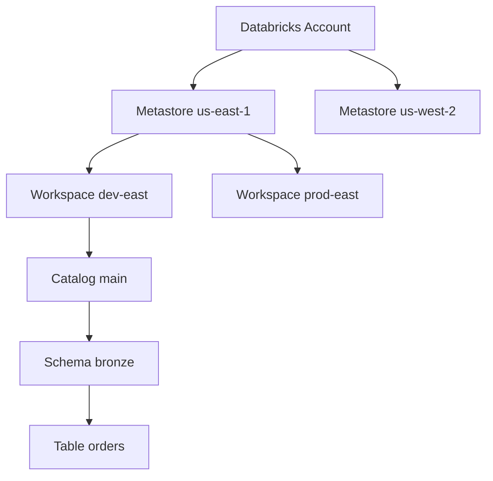
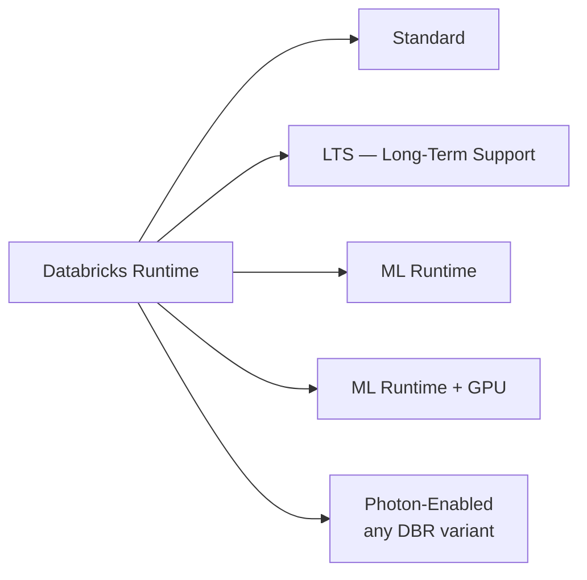

# Module 01 — Databricks Lakehouse Platform & Compute Model

> **Domain 1 (10%) — Databricks Intelligence Platform**
>
> **Exam objectives covered:**
> - Explain the value of the Data Intelligence Platform.
> - Identify the applicable compute to use for a specific use case.
> - Enable features that simplify data layout decisions and optimize query performance.
>
> **What you must walk away with:** A correct mental model of control plane / compute plane / storage; what cluster type to choose for a given scenario; what DBR variants exist; how serverless differs from classic compute; the headline platform features (Photon, Predictive Optimization, Liquid Clustering, Unity Catalog).

---

## Coverage map (verbatim July 25, 2025 objectives → where taught here)

| Verbatim objective | Taught in section |
|---|---|
| Explain the value of the Data Intelligence Platform | §1 "What 'Data Intelligence Platform' means on the exam" |
| Enable features that simplify data layout decisions and optimize query performance | §7 "Headline performance features — recognize them on the exam" (Photon, Predictive Optimization, Liquid Clustering, Auto Optimize/Compact, serverless) |
| Identify the applicable compute to use for a specific use case | §4 "Compute types — the four answers the exam expects" + decision matrix + §6 "Pools" |

Cross-references: Liquid Clustering body in Module 04; Predictive Optimization body in Module 04; UC body in Module 15.

---

## 1. What "Data Intelligence Platform" means on the exam

Databricks now markets itself as the **Data Intelligence Platform** — a marketing term, but the exam treats it as the umbrella that includes:

1. **Lakehouse storage** — Delta tables on customer cloud object storage (S3 / ADLS Gen2 / GCS).
2. **Spark + Photon compute** — the engine that runs SQL and PySpark.
3. **Unity Catalog (UC)** — the unified governance layer (catalog/schema/table, GRANTs, lineage, audit).
4. **Lakeflow** — the modern ETL surface, comprising **Lakeflow Declarative Pipelines** (LDP) for declarative transformations, **Lakeflow Jobs** for orchestration, and **Lakeflow Connect** for managed ingestion connectors.
5. **Databricks SQL (DBSQL)** — SQL warehouses and BI surface.
6. **AI / ML surfaces** — MLflow, Mosaic AI Vector Search, Model Serving — not in scope for the DE Associate but worth knowing they exist.
7. **Databricks Asset Bundles (DABs)** — the CI/CD packaging format.

The "intelligence" framing means: AI features (Predictive Optimization, AI Functions, Genie, Lakeflow Designer's GenAI assistance) are layered into every product, not bolted on. For the DE Associate exam you mostly need to recognize that the Platform is a **unified** alternative to stitching together S3 + EMR + Glue + Athena + Step Functions + Redshift, and that the unification's value props are:

- **Single governance layer** (UC) covering data, ML models, dashboards, files, and notebooks.
- **Single open file format** (Delta / Iceberg via UniForm) so you're not locked in.
- **Single orchestration** (Lakeflow Jobs) that can run notebooks, Python wheels, SQL queries, dbt, JARs, and LDP pipelines in one DAG.
- **Single CI/CD** (DABs) for promoting code+config from dev to prod.
- **Auto-optimization** (Predictive Optimization, Liquid Clustering AUTO, serverless) reduce the operational burden vs. self-tuned Spark.

### ⚠️ Exam trap — "Data Intelligence Platform" vs "Lakehouse"

The platform brand has shifted from "Lakehouse Platform" → "Data Intelligence Platform" in 2024–2025. Both terms still appear in questions and study materials. **They mean the same thing for exam purposes.** Don't pick a wrong answer just because it uses one phrase or the other.

---

## 2. Three-tier architecture: control plane / compute plane / storage

```mermaid
graph TB
    subgraph Databricks_Cloud_Account["Databricks Cloud Account (Control Plane)"]
        UI[Web UI]
        API[REST API]
        SCHED[Job Scheduler]
        EDITOR[Notebook Editor]
        CLM[Cluster Manager]
        LOGS[Cluster Logs Metadata]
    end

    subgraph Customer_Cloud_Account["Customer Cloud Account"]
        subgraph Compute_Plane["Compute Plane (Classic)"]
            DRV[Driver Node]
            EX1[Executor 1]
            EX2[Executor 2]
            EX3[Executor N]
        end
        subgraph Storage["Object Storage"]
            DLAKE[(Delta tables<br/>Parquet + _delta_log)]
            CHK[(Checkpoints)]
            VOL[(UC Volumes)]
        end
    end

    subgraph Databricks_Serverless["Databricks Serverless Plane (when serverless)"]
        SLEXEC[Serverless Compute<br/>managed by Databricks]
    end

    UI --> API
    API --> SCHED
    SCHED --> CLM
    CLM -->|provisions| DRV
    CLM -.->|serverless option.-> SLEXEC
    DRV --> EX1
    DRV --> EX2
    DRV --> EX3
    EX1 --> DLAKE
    EX2 --> DLAKE
    EX3 --> DLAKE
    SLEXEC --> DLAKE
```

### Control plane (Databricks-operated)

What lives here:
- Web UI, notebook editor, dashboards, REST API.
- Job scheduler and cluster manager (sends requests to your cloud account to create VMs).
- Workspace ACLs, secrets metadata (encrypted), cluster configuration storage.
- UC metastore (the catalog/schema/table tree).
- Cluster event logs and notebook source code.

What does NOT live here:
- Your data files. The control plane never holds Delta data.
- Cluster compute. The driver and executors are not in the control plane; they're in the customer's cloud account (classic) or in Databricks' own cloud account (serverless).

### Compute plane (classic — customer cloud account)

What lives here:
- The driver VM (runs SparkContext, the notebook REPL, the LDP coordinator).
- Executor VMs (run Spark tasks; read/write Delta files).
- Cluster local SSD scratch (shuffle, spill).
- Init scripts.

**Critical:** classic compute is provisioned inside the customer's cloud account VPC/VNet. Data movement between executors and storage is east-west traffic within the customer's cloud, not over the public internet. This is why HIPAA / regulated compliance is achievable.

### Compute plane (serverless — Databricks cloud account)

What lives here:
- Compute pre-provisioned by Databricks in Databricks' own account.
- Workloads run in customer-isolated namespaces.
- The customer's data is accessed via short-lived credentials (UC service principals + S3/ADLS access).

**Trade-off:** faster startup (seconds vs minutes), no cluster-management overhead, hands-off scaling — but compute is not in your cloud account, so some regulated environments cannot use serverless without additional review.

### Storage (customer cloud account)

What lives here:
- Delta tables (Parquet + `_delta_log/`).
- UC Volumes (files, used like a managed filesystem inside UC).
- Streaming checkpoints.
- Job outputs.

UC sits between compute and storage as the authorization layer — every read/write request from compute is authorized by UC before storage access.

### ⚠️ Exam trap — "where does customer data live?"

If a multiple-choice answer claims "data is stored in the Databricks control plane," that is **wrong**. Customer data lives in the customer's cloud storage (or, for serverless, is *accessed* from the customer's storage by Databricks-managed compute — never copied into Databricks' account).

---

## 3. Workspace anatomy

A **workspace** is a Databricks UI environment scoped to one cloud region, typically one per environment per business unit (e.g., `prod-east`, `dev-east`, `analytics-prod`). One **account** (the billing/identity boundary) can contain many workspaces.



Within a workspace you find:
- **Workspace** (file tree) — notebooks, Python files, SQL files, dashboards.
- **Repos / Git folders** — repository clones with Git operations.
- **Clusters** — compute resources you can attach notebooks to.
- **Jobs** (Lakeflow Jobs) — scheduled DAGs.
- **Pipelines** (Lakeflow Declarative Pipelines) — declarative ETL flows.
- **SQL Warehouses** — DBSQL endpoints.
- **Models** — registered ML models (MLflow).
- **Catalog Explorer** — UI for browsing UC objects.
- **Compute → Pools** — warm-instance pools to reduce startup time.

Workspaces are scoped to **one region**. To go cross-region, you create another workspace bound to a metastore in that region.

### Key roles in a workspace

| Role | Scope | Powers |
|------|-------|--------|
| Account admin | Account | Create workspaces, manage metastores, manage users |
| Metastore admin | Metastore | Create catalogs, grant USE CATALOG on root |
| Workspace admin | Workspace | Manage clusters, jobs, users in workspace |
| Catalog owner | Catalog | Manage all schemas/tables inside, grant on catalog |
| Schema owner | Schema | Manage tables inside, grant on schema |
| Table owner | Table | Grant SELECT/MODIFY on table |
| User | Workspace | Run notebooks/jobs they have access to |

For the exam, **ownership is required to grant privileges**. If you don't own a table, you can't `GRANT SELECT` on it (unless you're an admin at a higher level).

---

## 4. Compute types — the four answers the exam expects

### 4.1 All-purpose clusters (interactive)

- Created by an individual user from the Compute tab.
- Persist after creation; can be reused across notebooks and queries.
- Expensive per DBU (~3× job clusters in DBU cost).
- Auto-terminate after idle period (configurable, e.g., 60 min).
- Right choice: **interactive notebook development**, ad-hoc analysis, collaborative sessions.
- Wrong choice: scheduled jobs, repeating production ETL.

### 4.2 Job clusters (ephemeral)

- Created automatically when a Lakeflow Jobs task starts.
- Terminated when the job task ends.
- Cheaper DBU rate (~half all-purpose).
- Right choice: **any scheduled or one-shot job**, repeating ETL, batch pipelines.
- Wrong choice: interactive sessions, multi-user collaboration.

### 4.3 Serverless compute

- Hosted in Databricks' own cloud account (not customer's).
- Sub-30-second startup (vs minutes for classic).
- Auto-scaling managed by Databricks; no instance type tuning.
- Auto-applies cost optimizations (DBR auto-upgrade, auto-scale).
- Right choice: **"hands-off / auto-managed / no cluster tuning"** scenarios; serverless SQL warehouses for BI; serverless LDP pipelines (the post-2025 default).
- Wrong choice: workloads with strict data residency constraints requiring compute in customer cloud; init-script-heavy custom environments.

### 4.4 SQL Warehouses

- Compute specifically for Databricks SQL (DBSQL).
- Three flavors:
  - **Classic SQL warehouse** — Spark + Photon in customer cloud.
  - **Pro SQL warehouse** — adds advanced features (Predictive I/O, Photon enhancements).
  - **Serverless SQL warehouse** — Databricks-hosted; fastest startup.
- Sized t-shirt-style: 2X-Small, X-Small, Small, Medium, Large, X-Large, 2X-Large, 3X-Large, 4X-Large.
- Each size approximately doubles cluster size.
- Multi-cluster load balancing (auto-scale out by cluster count under load).

### Decision matrix

| Scenario | Correct compute |
|----------|----------------|
| Data scientist iterating on a notebook | **All-purpose cluster** |
| Daily scheduled ETL Lakeflow Job | **Job cluster** (or serverless if the prompt mentions "hands-off") |
| BI dashboard SQL queries with low/zero startup latency | **Serverless SQL warehouse** |
| Long-running streaming LDP pipeline with autoscale | **Serverless LDP** (or job cluster in classic) |
| Production multi-task DAG with mixed notebooks + LDP | **Job cluster per task** (or serverless) |
| Cost-sensitive experimental workload at off hours | Job cluster on **Spot instances** |

### ⚠️ Exam trap — "an all-purpose cluster is already running, so use it"

The trap reads "team X already has an all-purpose cluster running. Should the scheduled ETL use that cluster or create a new one?" The correct answer is almost always **create a new job cluster**, because:
1. Job clusters are ~half the DBU cost of all-purpose.
2. Job clusters are ephemeral and don't pin the team's compute when their interactive work pauses.
3. Resource contention with interactive users degrades job SLAs.

If the prompt explicitly says "minimize cluster startup time" without mentioning cost, **serverless** beats job cluster. If the prompt says "hands-off / auto-managed," **serverless** is the answer.

---

## 5. Databricks Runtime (DBR) variants



| Variant | What it adds | When to choose |
|---------|--------------|----------------|
| **Standard DBR** | Spark + Delta + Python | Generic data engineering |
| **DBR LTS** (e.g., 14.3 LTS, 15.4 LTS) | Same as standard but **patched ~24 months** | Production stability; cert-style "stable runtime" answers |
| **DBR ML** | Pre-installed pandas, scikit-learn, PyTorch, TensorFlow, MLflow, HuggingFace, XGBoost | ML training and inference workloads |
| **DBR ML + GPU** | DBR ML + CUDA + GPU drivers | Deep-learning training |
| **Photon** | Vectorized C++ query engine; significant speedup on SQL/DataFrame ops; **add-on, not separate runtime** | Any SQL-heavy or DataFrame-heavy workload |

**LTS support window:** ~24 months. Non-LTS releases get ~6 months. For a regulated production environment the canonical recommendation is the latest LTS (e.g., DBR 15.4 LTS in mid-2026).

**Photon:** enabled with a checkbox on classic clusters; always-on for serverless. Photon is a query engine, not a separate runtime — DBR-Standard-15.4-LTS, DBR-ML-15.4-LTS, and DBR-Standard-15.4-LTS-Photon all coexist.

### ⚠️ Exam trap — DBR ML vs DBR Standard for DE work

The DE Associate exam is data engineering, not ML — **DBR Standard (or LTS) is the right answer** for "what runtime should this ETL job use?" The DBR ML runtime is heavier (more libraries → slower cluster startup) and unnecessary for pure ETL.

---

## 6. Pools

**Instance pools** are pre-warmed VMs ready to be attached to a cluster on demand. They reduce cluster startup time from ~5 minutes to ~30 seconds, at the cost of paying for the warm capacity even when idle.

When to use pools:
- Repetitive jobs where startup delay matters.
- Bursty workloads with many small jobs.
- Teams of interactive users where everyone wants fast cluster spin-up.

When not to use pools:
- Always-on streaming workloads (the cluster never restarts).
- Cost-sensitive environments where warm capacity wastes money.

For the exam, recognize that "pools" address the cluster-startup-time problem; serverless solves the same problem differently (with managed compute).

---

## 7. Headline performance features — recognize them on the exam

### 7.1 Photon

- Vectorized C++ execution engine.
- Replaces JVM-based row-at-a-time execution for many operators (scans, joins, aggregations).
- 2–10× speedup on SQL/DataFrame workloads, varies heavily by workload shape.
- Costs more per DBU (~2× the standard rate) but the speedup typically wins on $/query.

### 7.2 Predictive Optimization

- Automatic OPTIMIZE and VACUUM on UC-managed Delta tables.
- Observes query patterns, decides when to compact files and when to expire old versions.
- Default-on for UC-managed tables on newer DBR/UC versions.
- The exam-canonical answer for "how do I keep my tables optimized without manually scheduling OPTIMIZE?"

### 7.3 Liquid Clustering (introduced in Module 04)

- Replaces Z-Order for new tables.
- `CLUSTER BY (...)` at table-creation time.
- Incremental — OPTIMIZE only touches unclustered files.
- `CLUSTER BY AUTO` lets Predictive Optimization choose keys.

### 7.4 Automatic features in LDP

- Automatic schema inference and enforcement.
- Automatic dependency graph among declared tables.
- Automatic CDC bookkeeping via `APPLY CHANGES INTO`.

The exam's "enable features that simplify data layout decisions and optimize query performance" objective maps to: **Photon, Predictive Optimization, Liquid Clustering, Auto Optimize / Auto Compact, and serverless compute.**

---

## 8. Mini quiz (cold)

1. A scheduled ETL Lakeflow Job runs every hour. What cluster type minimizes DBU spend?
2. A team wants zero cluster-management overhead and is okay with compute running in Databricks' cloud account. Which compute do they choose?
3. Where does customer Delta data physically live in a classic compute deployment?
4. Which DBR variant should you choose for a production batch ETL pipeline that you want supported for 2 years?
5. The exam prompt says "hands-off, auto-optimized compute." What two compute choices does that phrase point to?
6. A team is on UC-managed tables. They want OPTIMIZE and VACUUM to happen automatically. What feature satisfies this?
7. Can a classic compute plane and a serverless workload share the same Delta table? Why or why not?

### Answers

1. **Job cluster.** Roughly half the DBU cost of all-purpose. If the prompt mentions "hands-off" specifically, serverless is correct, but pure "minimize DBU" → job cluster.
2. **Serverless compute.** Databricks-managed in Databricks' cloud account, hands-off, sub-minute startup.
3. **In the customer's cloud object storage** (S3 / ADLS Gen2 / GCS). Never in the Databricks control plane.
4. **DBR LTS** (e.g., 15.4 LTS) — ~24 months of patches. Plain DBR Standard gets only ~6 months.
5. **Serverless compute** and (less commonly) **Predictive Optimization on UC managed tables**. The canonical exam answer for "hands-off" is serverless.
6. **Predictive Optimization** — automatically OPTIMIZE and VACUUM UC-managed tables.
7. **Yes.** Delta tables live in customer cloud storage; both classic compute (in customer cloud) and serverless (in Databricks cloud) read/write via short-lived credentials. UC mediates authorization. The same physical table is accessible to either compute plane.

---

## 9. Sanity check before moving on

You should be able to:
- Draw the three-tier architecture diagram from memory.
- List the four compute types and the one-line trigger phrase that maps to each.
- Name three Databricks-managed automation features (Photon, Predictive Optimization, Liquid Clustering).
- Explain why job clusters are cheaper than all-purpose.
- Differentiate DBR LTS vs DBR Standard vs DBR ML.

If any of those are fuzzy, re-read Sections 2, 4, 5, and 7 before continuing to Module 02.
