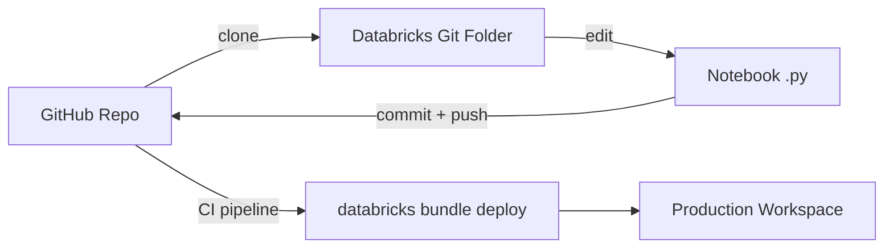
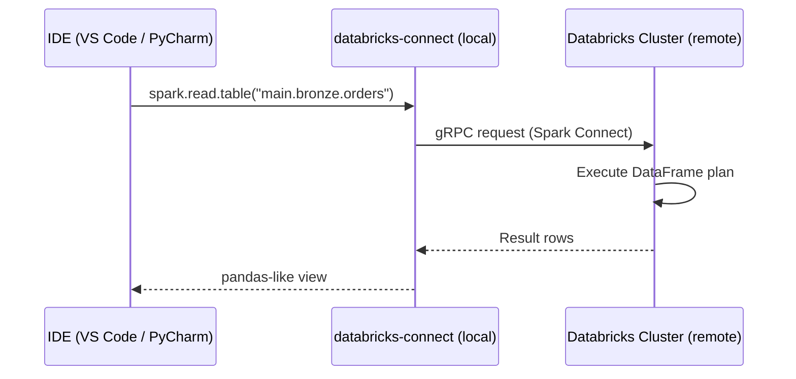

# Module 02 — Workspace Basics: Notebooks, Repos, File System, Magic Commands

> **Domain 1 (10%) — Databricks Intelligence Platform**
>
> **Exam objectives covered:**
> - Determine the capabilities of Notebooks functionality.
> - Use Databricks Connect in a data engineering workflow.
> - Use Databricks' built-in debugging tools to troubleshoot a given issue.
>
> **What you must walk away with:** Notebook anatomy and source formats; Git folder (Repos) workflow; the difference between DBFS, workspace files, and UC Volumes; magic commands you must recognize; how Databricks Connect plugs in.

---

## Coverage map (verbatim July 25, 2025 objectives → where taught here)

| Verbatim objective | Taught in section |
|---|---|
| Determine the capabilities of Notebooks functionality | §1 "Notebooks — the development surface" (magics, `%run` vs `dbutils.notebook.run`, source formats, `display` vs `show`, `dbutils` namespaces) |
| Use Databricks Connect in a data engineering workflow | §4 "Databricks Connect — local development against remote compute" |
| Use Databricks' built-in debugging tools to troubleshoot a given issue | §5 "Debugging tools" + §6 "Cluster libraries vs notebook-scoped libraries" |

Cross-references: deeper Spark UI / system-tables debugging in Module 14; UC Volumes governance in Module 15.

---

## 1. Notebooks — the development surface

A Databricks notebook is a sequence of **cells**, each in one of: Python, SQL, Scala, R, or Markdown. The notebook has a **default language** (`Python` is most common for DE work). Any cell can override the default with a **magic command** (`%sql`, `%python`, `%md`, `%r`, `%scala`).

### Cell magic commands you must recognize

| Magic | Effect |
|-------|--------|
| `%python` | This cell runs as Python (override of default) |
| `%sql` | This cell runs as SQL against the attached compute |
| `%scala` | Scala cell |
| `%r` | R cell |
| `%md` | Markdown — rendered, not executed |
| `%sh` | Shell cell — runs on the **driver** node (not executor) |
| `%fs` | Databricks file-system shortcut (`%fs ls /Volumes/main`) |
| `%pip` | Install a Python package into the cluster Python environment (notebook-scoped on serverless) |
| `%conda` | Conda package install (deprecated on newer DBR) |
| `%run /path/to/notebook` | Inline-execute another notebook in the same scope; variables and functions become available |
| `%load` | Load contents of a file into a cell |

### `%run` vs `dbutils.notebook.run`

These both run another notebook but differ critically:

- **`%run /path/to/util`** — inline execution, **same Python interpreter**, variables and functions from the called notebook are visible in the caller. Used for sharing utility functions.
- **`dbutils.notebook.run("/path/to/notebook", timeout=600, arguments={...})`** — runs the other notebook in a **separate context**, returns only its `dbutils.notebook.exit("...")` string. Used for orchestration / parameterized invocation.

Exam scenario: "share helper functions across notebooks" → `%run`. "Call a notebook as a subroutine and capture its return value" → `dbutils.notebook.run`.

### Notebook source formats

| Format | Description | When to use |
|--------|-------------|-------------|
| **`.ipynb`** | Jupyter JSON with embedded outputs | UI default; bad for Git review |
| **`.py` (Databricks source)** | Plain Python with `# Databricks notebook source` header and `# COMMAND ----------` cell separators | Default for Git-tracked notebooks |
| **`.sql` (Databricks source)** | Plain SQL with the same cell separator | SQL-only notebooks under Git |
| **`.scala`, `.r`** | Same pattern for other languages | Rare for DE work |

For source control, **`.py` format wins**. `.ipynb` JSON diffs are unreadable in code review.

### Notebook UI features the exam expects you to know

- **Variable explorer** — pane showing top-level variables in the Python REPL (newer DBR).
- **Built-in plotting** — `display(df)` shows a tabular result with charting controls.
- **Cell-level run time** — each cell shows how long it took to execute.
- **Spark UI link** — every cell that triggered a Spark job has a link to the Spark UI for that job (covered in Module 14).
- **Notebook scheduling** — you can schedule a notebook directly from the UI (creates a Lakeflow Job under the hood).
- **Comments and co-presence** — multiple users can edit the same notebook live.

### `display(df)` vs `df.show()`

- **`display(df)`** — Databricks-only; renders an interactive tabular view with chart options; defaults to showing 1000 rows; supports CSV export.
- **`df.show(n)`** — vanilla PySpark; prints a text table to stdout, default 20 rows.

Exam scenarios that mention "interactive chart" or "exporting to CSV from a notebook" point to `display`.

### `dbutils` — the notebook-only utility namespace

The `dbutils` object exposes Databricks-specific notebook APIs. Key submodules:

| Module | Purpose | Common calls |
|--------|---------|--------------|
| `dbutils.fs` | File system operations | `dbutils.fs.ls("/Volumes/main")`, `dbutils.fs.cp(src, dst)`, `dbutils.fs.mkdirs(...)`, `dbutils.fs.rm(path, recurse=True)` |
| `dbutils.widgets` | Notebook parameters | `dbutils.widgets.text("env", "dev")`, `dbutils.widgets.get("env")` |
| `dbutils.secrets` | Read secrets from secret scopes | `dbutils.secrets.get(scope="prod", key="db_pwd")` |
| `dbutils.notebook` | Notebook orchestration | `dbutils.notebook.run(...)`, `dbutils.notebook.exit("...")` |
| `dbutils.jobs.taskValues` | Pass values between Lakeflow Job tasks | `.set(key, value)`, `.get(taskKey, key, default)` |
| `dbutils.library` | Library install (largely deprecated; use `%pip`) | — |

### ⚠️ Exam trap — `dbutils.secrets.get` masking

Reading a secret with `dbutils.secrets.get(...)` returns the value, but Databricks **masks it in any output, log, or error message** (you see `[REDACTED]`). You can't accidentally print a secret to a notebook log. If a question asks "how do I retrieve a credential safely in a notebook" → `dbutils.secrets.get`, not environment variables and not hardcoded strings.

---

## 2. Repos / Git folders

A **Git folder** (formerly "Repos") in a Databricks workspace is a clone of a remote Git repository. It supports:
- Cloning from GitHub, GitLab, Bitbucket, Azure DevOps Git, AWS CodeCommit.
- Browsing and editing files in the workspace UI.
- Branch checkout, commit, push, pull.
- Pull requests via the remote provider (not in the Databricks UI directly).



### What Git folders are good at
- Pulling a fresh copy of a feature branch into the workspace.
- Letting devs work in their personal `dev` workspace, push to a feature branch, raise a PR.
- Demo / educational repos cloned and explored interactively.

### What Git folders are NOT good at
- **Not** the production deployment artifact. Production deployments come from **Databricks Asset Bundles** (Module 13), not from a Git folder clone.
- **Not** suited to monorepos. Databricks documents a limit on repo size / file count.
- **Not** designed for heavy concurrent editing — two devs editing the same notebook in a Git folder race.

### Limits to know
- Git folders enforce per-repo size and file limits (varies by region; check docs for current values).
- Notebook UI render limit: 10 MB per notebook.
- Recommended: keep notebooks in `.py` source format; strip outputs before commit.

### ⚠️ Exam trap — "how do I promote to prod?"

If a question asks "what's the recommended way to promote code from dev to prod?" the answer is **Databricks Asset Bundles**, not "use Git folders and run notebooks directly." Git folders are a development surface, not a production deployment mechanism.

---

## 3. File system layers — DBFS vs workspace files vs UC Volumes

Three filesystem layers coexist on a modern Databricks workspace. The exam expects you to recognize each:

### 3.1 DBFS (Databricks File System) — legacy

- A workspace-scoped mount over the cloud object storage created at workspace setup.
- Accessed via `dbfs:/...` or `/dbfs/...` paths.
- **Pre-Unity-Catalog construct.** Bypasses UC authorization. Anyone on the workspace can read anything in DBFS root by default.
- Discouraged for new work; UC Volumes are the replacement.
- Still appears in the UI and is accessible.

### 3.2 Workspace files

- Files inside the **Workspace tree** (alongside notebooks). E.g., a `requirements.txt` next to a notebook.
- Accessed via `/Workspace/Users/<user>/...` paths.
- Subject to workspace-level ACLs.
- Useful for small config files committed via Git folders.
- Not for data. Don't store large datasets here.

### 3.3 UC Volumes — the modern answer

- Files governed by Unity Catalog under a catalog/schema, just like tables.
- Two kinds: **managed volumes** (UC owns the storage location) and **external volumes** (you provide the LOCATION).
- Accessed via:
  - `/Volumes/<catalog>/<schema>/<volume>/<path>` (POSIX-style on cluster)
  - `dbfs:/Volumes/...` (legacy notation, same thing)
  - SQL: `LIST '/Volumes/main/landing/orders'`
- Privileges: `READ VOLUME`, `WRITE VOLUME`.
- The exam-canonical answer for "where do I land unstructured files like JSON, CSV, ML artifacts, model weights, raw logs, …"

### Decision matrix

| Need | Choice |
|------|--------|
| Land raw CSV/JSON files for Auto Loader to consume | **UC Volume** |
| Store small config files alongside a notebook | Workspace files |
| Mount an existing cloud bucket for ad-hoc inspection | UC external Volume (or external location) |
| Anything new on a UC-enabled workspace | UC Volume |
| Legacy code that references `/dbfs/...` paths | DBFS (don't break it; plan migration) |

```sql
-- Create a UC managed volume
CREATE VOLUME main.landing.orders;

-- Reference files inside it
LIST '/Volumes/main/landing/orders/';

-- Auto Loader reads from a volume
SELECT * FROM read_files('/Volumes/main/landing/orders/', format => 'json');
```

### ⚠️ Exam trap — DBFS vs UC Volume defaults

A question may ask "where should new file ingestion land?" The pre-2025 answer was DBFS or a mount. The **post-2025 (and exam-current) answer is a UC Volume.** If two answers are "in `/dbfs/landing/`" vs "in `/Volumes/main/landing/`", pick the Volume.

---

## 4. Databricks Connect — local development against remote compute

**Databricks Connect** is a Python library that lets you run PySpark / Spark Connect code from your laptop or IDE, with execution happening on a remote Databricks cluster.

### How it works



### When to use
- IDE-first development with breakpoints, linters, type-checking.
- Running unit tests against a cluster from a local Python environment.
- Building libraries (Python wheels) that are deployed via DAB later.

### When NOT to use
- Heavy compute that requires fast iteration on cluster — at that point, just use a notebook.
- Production execution — Databricks Connect is for development.

### Version compatibility

The `databricks-connect` PyPI package must match the **DBR version** of the cluster. E.g., `databricks-connect==15.4.*` for DBR 15.4. Pin the major.minor.

### Setup essentials

```bash
pip install databricks-connect==15.4.*
databricks auth login --host https://<workspace>.cloud.databricks.com
```

```python
from databricks.connect import DatabricksSession
spark = DatabricksSession.builder.getOrCreate()
df = spark.read.table("main.bronze.orders")
print(df.count())
```

### ⚠️ Exam trap — Databricks Connect vs Databricks CLI

- **Databricks Connect** is a Python library to run PySpark **code execution** remotely.
- **Databricks CLI** (`databricks` command) is for **administration** (deploy bundles, list jobs, manage secrets) — does not run PySpark.

If a question says "I want to use my IDE to write PySpark and have it execute on Databricks", that is Databricks Connect. If a question says "I want to deploy a bundle from my CI pipeline", that is the Databricks CLI.

---

## 5. Debugging tools

The exam objective "use Databricks' built-in debugging tools to troubleshoot a given issue" covers a small but specific set of surfaces:

### 5.1 Cell output + stack traces

- Python exceptions render with a full traceback in the cell output. Click the "↗ Spark UI" link on a failing cell to see the Spark side.
- For SQL errors, the message includes the error class and SQL state.

### 5.2 The Spark UI (Module 14 deep dive)

- Linked from any cell that ran a Spark action.
- Tabs: Jobs, Stages, Storage, Environment, Executors, SQL/DataFrame.
- The "SQL/DataFrame" tab is where you confirm whether your query did a broadcast join, how many shuffle partitions, and the physical plan.

### 5.3 Cluster event log

- Compute → Cluster → "Event log" tab.
- Shows resize events, driver/executor crashes, init script failures.

### 5.4 Driver logs and executor logs

- Compute → Cluster → "Driver logs" tab → `log4j-active.log`, `stderr`, `stdout`.
- Executor logs accessible per-executor under the Executors tab in the Spark UI.

### 5.5 Job run output

- Lakeflow Jobs → run → click into a task → "Output" tab.
- For LDP pipelines: Pipeline → Update → event log (this is a Delta table you can query: `event_log(<pipeline_id>)`).

### 5.6 `dbutils` interactive helpers

- `dbutils.fs.head("/Volumes/.../file.json")` — preview a file.
- `dbutils.help()` — list available `dbutils` methods.

### Typical failure modes and where to look

| Symptom | First place to look |
|---------|---------------------|
| "Job failed" without details | Lakeflow Jobs → run → task output |
| Notebook cell errored | Cell output stack trace; Spark UI link from the failed cell |
| Streaming query stuck (no progress) | Spark UI → Structured Streaming tab |
| Cluster won't start | Cluster event log; init script failures |
| LDP pipeline expectation violated | Pipeline event log (DataQuality events) |
| Long-running stage / skew | Spark UI → Stages → task duration histogram |
| Out-of-memory error | Spark UI → Executors → GC time and memory usage |

---

## 6. Cluster libraries vs notebook-scoped libraries

### Cluster libraries
- Installed on the cluster at startup.
- Available to all notebooks attached to that cluster.
- Persist for the cluster lifetime.
- Configured via Cluster UI → Libraries tab, or in the cluster JSON, or in a DAB job_cluster spec.

### Notebook-scoped libraries
- Installed with `%pip install <package>` inside a notebook cell.
- Visible only to that notebook's session.
- On classic compute, the install **restarts the Python kernel** in that notebook.
- On serverless, notebook-scoped installs are the default (no shared cluster Python env).

### Best practice
- Pin versions: `%pip install pandas==2.2.*`.
- For production jobs, install via the job's cluster library spec (not via `%pip` in code). Reasons: reproducibility, no kernel restart in mid-run.

---

## 7. Mini quiz (cold)

1. You want to share Python utility functions across notebooks. Which command — `%run` or `dbutils.notebook.run`?
2. A new ingestion pipeline lands JSON files. Where should they land on a UC-enabled workspace?
3. Why is `.py` notebook format preferred over `.ipynb` for source control?
4. What's the difference between `display(df)` and `df.show()`?
5. You want to write PySpark code in your local VS Code with breakpoints, executing against a remote Databricks cluster. Which tool do you use?
6. A teammate hardcoded a database password in a notebook. What's the right replacement?
7. Why does Databricks recommend storing notebooks in Git as `.py` files instead of `.ipynb` files?

### Answers

1. **`%run`** — shares the Python REPL scope so utility functions become directly callable.
2. **In a UC Volume**, e.g., `/Volumes/main/landing/orders/`. Not DBFS.
3. **JSON-diff readability and embedded outputs.** `.ipynb` JSON diffs are unreadable in PR review and embed cell outputs that bloat the repo.
4. **`display(df)`** is Databricks-specific, renders an interactive tabular view with chart options; **`df.show(n)`** prints a text table to stdout. `display` supports up to 1000 rows by default; `show` defaults to 20.
5. **Databricks Connect.** It executes PySpark remotely while letting you keep the IDE workflow locally.
6. **`dbutils.secrets.get(scope="...", key="...")`** — Databricks-managed secret scope. The retrieved value is masked in any output / log automatically.
7. **Three reasons:** (a) `.ipynb` JSON diffs are unreadable in code review; (b) embedded outputs bloat the repo and may leak data; (c) `.py` source format integrates cleanly with `black`, `pylint`, and linters.

---

## 8. Sanity check before moving on

You should be able to:
- Name 5 magic commands and what each does.
- Compare `%run` vs `dbutils.notebook.run` correctly.
- List the three file-system layers (DBFS, workspace files, UC Volumes) and pick UC Volumes for any new use case.
- Explain when Databricks Connect is the right tool.
- Point to where you'd look for: a failed notebook cell traceback, a stuck streaming query's progress, an LDP expectation violation.

If any of those are fuzzy, re-read Sections 1, 3, 4, and 5.
