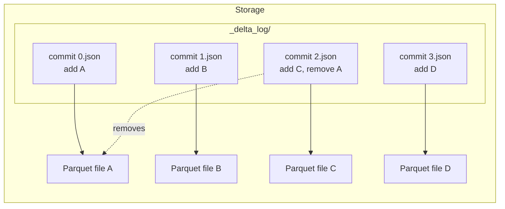
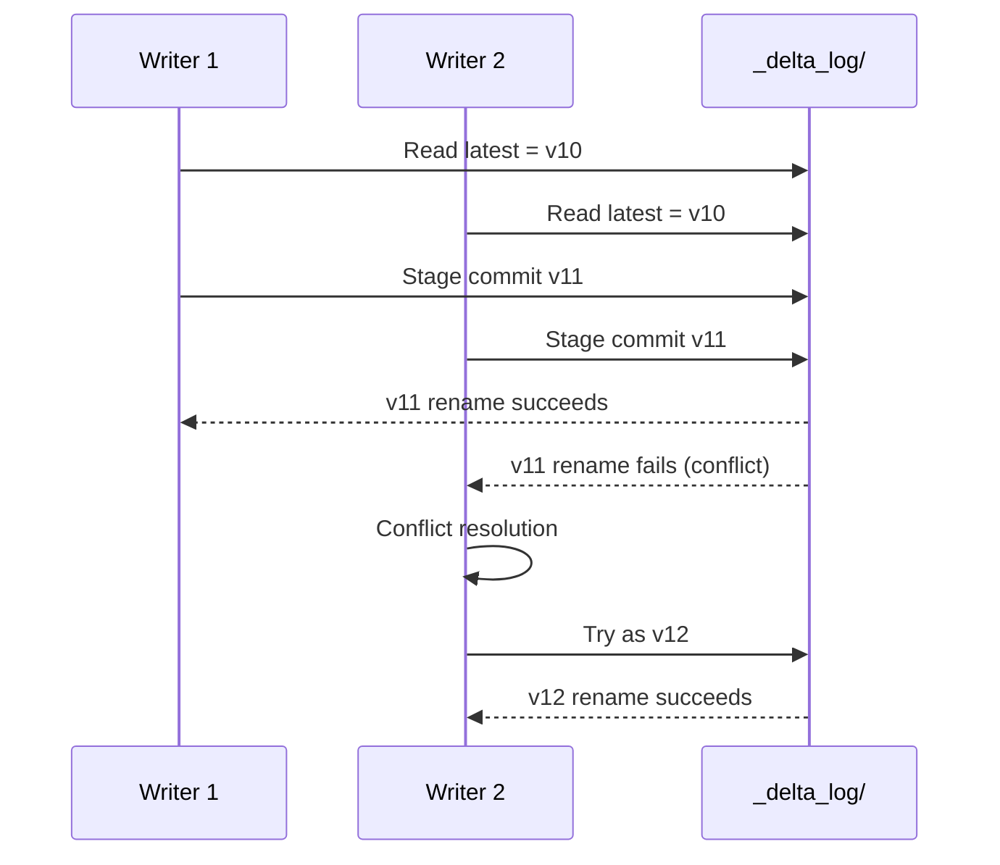

# Module 03 — Delta Lake Fundamentals

> **Domain 2 (30%) — Development and Ingestion**
>
> **Exam objectives covered:**
> - Identify DDL/DML features.
> - (Foundation for) Implement data pipelines using LDP.
> - (Foundation for) Compute aggregations and metrics with PySpark DataFrames.
>
> **What you must walk away with:** Delta table mental model; the exact semantics of `CREATE TABLE`, `CREATE OR REPLACE TABLE`, `CREATE TABLE IF NOT EXISTS`, `CREATE TABLE AS SELECT`; the difference between `INSERT INTO`, `UPDATE`, `DELETE`, and `MERGE INTO`; how to use time travel; how schema evolution works; generated columns; the transaction log at a level deep enough to debug.

---

## Coverage map (verbatim July 25, 2025 objectives → where taught here)

| Verbatim objective | Taught in section |
|---|---|
| Identify DDL features (CREATE/REPLACE/IF NOT EXISTS, CTAS, ALTER) | §2 "Creating a Delta table — four DDL forms" + §5 "Schema evolution" + §6 "Generated columns" |
| Identify DML features (INSERT/UPDATE/DELETE/MERGE) | §3 "DML — inserting, updating, deleting, merging" |
| Sample Question 4 (CREATE OR REPLACE TABLE) | §2.4 "Exam-canonical mapping (Question 4)" |
| Sample Question 5 (INSERT INTO … VALUES) | §3.5 "Exam-canonical mapping (Question 5)" |
| Foundations for LDP / aggregations | §4 "Time travel" + §8 "Change Data Feed" + §9 "ACID concurrency model" (referenced from Modules 07, 08, 10) |

Cross-references: OPTIMIZE / VACUUM / Liquid Clustering in Module 04; CDF reader-side in Module 09; APPLY CHANGES INTO in Module 10.

---

## 1. The mental model — `_delta_log/` is the table

A **Delta table** is two things:
1. A directory of **Parquet data files**.
2. A `_delta_log/` subdirectory holding the **transaction log** — JSON commits and periodic Parquet checkpoints.

```
/Volumes/main/sales/orders/
├── part-00000-xxxx.parquet
├── part-00001-xxxx.parquet
├── part-00002-xxxx.parquet
└── _delta_log/
    ├── 00000000000000000000.json     ← commit 0 (table creation)
    ├── 00000000000000000001.json     ← commit 1 (INSERT)
    ├── 00000000000000000002.json     ← commit 2 (MERGE)
    ├── …
    ├── 00000000000000000010.checkpoint.parquet
    ├── 00000000000000000010.json
    └── _last_checkpoint
```

The Parquet files are immutable. The `_delta_log/` is the source of truth for **what files belong to the current table version**, **what schema is current**, and **what protocol version readers/writers must support**.



Each commit JSON is an ordered list of **action** records — `add`, `remove`, `metaData` (schema), `protocol`, `commitInfo`, `txn`, `cdc`, `domainMetadata`. To answer "what does the table look like at version N?" you replay actions from version 0 (or the most recent checkpoint) up to N.

### Why this matters for the exam

The exam doesn't ask you to debug the transaction log directly, but every feature on the exam — time travel, schema evolution, MERGE, ACID — falls out of this mental model. Understand the model and the features become obvious.

---

## 2. Creating a Delta table — four DDL forms

### 2.1 `CREATE TABLE` — error if exists

```sql
CREATE TABLE main.sales.orders (
  order_id STRING,
  customer_id STRING,
  amount DECIMAL(18,2),
  order_ts TIMESTAMP
);
```

- Creates an empty table.
- **Errors** if the table already exists.
- Default format on a UC-enabled workspace: **Delta**. (You can omit `USING DELTA`.)

### 2.2 `CREATE TABLE IF NOT EXISTS` — idempotent create

```sql
CREATE TABLE IF NOT EXISTS main.sales.orders (
  order_id STRING,
  customer_id STRING,
  amount DECIMAL(18,2),
  order_ts TIMESTAMP
);
```

- Creates if absent; **no-op if the table already exists** (does NOT change the existing table).
- Right answer when you want safe "create if missing".
- Wrong answer when the question wants "recreate the table fresh."

### 2.3 `CREATE OR REPLACE TABLE` — drop-and-recreate semantics

```sql
CREATE OR REPLACE TABLE main.sales.orders (
  order_id STRING,
  customer_id STRING,
  amount DECIMAL(18,2),
  order_ts TIMESTAMP
);
```

- Works whether the table exists or not.
- **If the table exists, it is dropped and recreated** with the new schema.
- The table's identity (name) is preserved but its history may not be (treat as a fresh start for most purposes).
- Right answer for **"create an empty Delta table, regardless of whether one already exists with this name."**

### 2.4 `CREATE TABLE AS SELECT` (CTAS) — create + populate

```sql
CREATE TABLE main.sales.orders_today AS
SELECT * FROM main.bronze.orders WHERE order_ts >= current_date();
```

- Creates the table **and** populates it from the SELECT.
- Schema is inferred from the SELECT — **you cannot specify column types in the DDL part of a CTAS.**
- Used for derived tables / one-shot snapshots.

**`CREATE OR REPLACE TABLE … AS SELECT`** also works — drops-and-recreates with the SELECT results.

### Exam-canonical mapping (Question 4 in the official guide)

> "Create an empty Delta table regardless of whether a table already exists with this name."

**Correct:** `CREATE OR REPLACE TABLE …`.

Distractors and why they're wrong:
- `CREATE TABLE IF NOT EXISTS` — leaves existing tables unchanged; doesn't satisfy "regardless of whether it exists."
- `CREATE TABLE AS SELECT employeeId STRING …` — invalid syntax. CTAS doesn't take a column-type list.
- `CREATE OR REPLACE TABLE … WITH COLUMNS (...) USING DELTA` — `WITH COLUMNS` is not valid SQL DDL.

### ⚠️ Exam trap — `CREATE OR REPLACE TABLE` is not the same as `INSERT OVERWRITE`

`CREATE OR REPLACE TABLE` rewrites the schema and replaces the data. `INSERT OVERWRITE` keeps the schema but replaces rows. Different operations. If a question says "preserve schema, replace data" → INSERT OVERWRITE. If "redefine the table" → CREATE OR REPLACE.

---

## 3. DML — inserting, updating, deleting, merging

### 3.1 `INSERT INTO … VALUES (...)` — append

```sql
INSERT INTO main.sales.orders VALUES
  ('a1', 6, 9.4),
  ('a2', 7, 12.5);
```

- Appends new rows to the table.
- Column order is positional unless you specify column names.
- Right answer for **"append a new row to an existing Delta table."**

### 3.2 `INSERT OVERWRITE … VALUES (...)` — replace all rows

```sql
INSERT OVERWRITE main.sales.orders VALUES
  ('a1', 6, 9.4);
```

- **Replaces all rows** in the table (or all rows in matched partitions, with `PARTITION (…)`).
- Schema stays.

### 3.3 `UPDATE … SET … WHERE …`

```sql
UPDATE main.sales.orders
SET amount = 0
WHERE order_id = 'a1';
```

- Modifies existing rows.
- Does NOT add rows. Cannot be used to insert.

### 3.4 `DELETE FROM … WHERE …`

```sql
DELETE FROM main.sales.orders WHERE amount < 0;
```

- Removes matching rows.
- Physical Parquet files are rewritten (or, with **deletion vectors** enabled, just marked deleted in a sidecar bitmap).

### 3.5 `MERGE INTO …` — the upsert workhorse

```sql
MERGE INTO main.sales.orders t
USING staging.orders_changes s
ON  t.order_id = s.order_id
WHEN MATCHED AND s.op = 'D'      THEN DELETE
WHEN MATCHED AND s.op = 'U'      THEN UPDATE SET
                                    t.amount   = s.amount,
                                    t.order_ts = s.order_ts
WHEN NOT MATCHED AND s.op = 'I'  THEN INSERT (order_id, customer_id, amount, order_ts)
                                    VALUES (s.order_id, s.customer_id, s.amount, s.order_ts);
```

- Single statement = idempotent upsert.
- Handles inserts, updates, and deletes in one pass.
- Supports `MERGE INTO … USING … ON … WHEN MATCHED THEN UPDATE SET *` (assign all matching columns) and `WHEN NOT MATCHED THEN INSERT *`.
- For CDC inside LDP pipelines, **prefer `APPLY CHANGES INTO`** (Module 10) — it handles bookkeeping for you.

### Exam-canonical mapping (Question 5)

> "Append the new record (id='a1', rank=6, rating=9.4) to existing Delta table my_table."

**Correct:** `INSERT INTO my_table VALUES ('a1', 6, 9.4)`.

Distractors:
- `UPDATE VALUES (...) my_table` — invalid syntax; UPDATE modifies, doesn't insert.
- `UPDATE my_table VALUES (...)` — invalid; UPDATE doesn't take VALUES.
- `INSERT VALUES (...) INTO my_table` — wrong syntax order; INTO comes before VALUES.

### ⚠️ Exam trap — UPDATE doesn't append

A common distractor uses `UPDATE` for an "insert this new record" prompt. UPDATE only modifies existing rows. Append → INSERT.

---

## 4. Time travel

Delta lets you query the table as of an earlier version or timestamp.

```sql
-- By version number
SELECT * FROM main.sales.orders VERSION AS OF 42;

-- By timestamp
SELECT * FROM main.sales.orders TIMESTAMP AS OF '2026-05-01 12:00:00';

-- Same in PySpark
df = spark.read.option("versionAsOf", 42).table("main.sales.orders")
df = spark.read.option("timestampAsOf", "2026-05-01 12:00:00").table("main.sales.orders")
```

### `DESCRIBE HISTORY` — see what changed

```sql
DESCRIBE HISTORY main.sales.orders;
```

Returns a table with columns: `version`, `timestamp`, `userId`, `userName`, `operation` (e.g., `MERGE`, `WRITE`, `OPTIMIZE`), `operationParameters`, `operationMetrics` (rows added/deleted/updated, num files added/removed), `isolationLevel`, `engineInfo`.

### `RESTORE TABLE` — roll back

```sql
RESTORE TABLE main.sales.orders TO VERSION AS OF 42;
RESTORE TABLE main.sales.orders TO TIMESTAMP AS OF '2026-05-01 12:00:00';
```

Creates a new commit that makes the table look like it did at the target version. Useful for "oops, the last MERGE corrupted the table" — restore to before the MERGE.

### How far back can you time travel?

Time travel is bounded by `VACUUM` retention. If VACUUM has been run after the version you want, the underlying Parquet files for that version may have been physically deleted, in which case the time-travel query errors.

- Default retention: **7 days** (168 hours).
- Configure via `delta.deletedFileRetentionDuration`.

### ⚠️ Exam trap — time travel after VACUUM

You can time-travel to versions older than your VACUUM retention only if the relevant files haven't been deleted. **Don't promise time travel beyond your VACUUM window.** This is a frequent diagnose-style question: "we ran VACUUM 168 HOURS yesterday; can we now query version-from-30-days-ago?" — No.

---

## 5. Schema evolution

Delta tables enforce schema by default — a write whose schema doesn't match the table's schema **errors out**. Schema evolution lets you change the table's schema.

### 5.1 Append-mode schema evolution with `mergeSchema`

```python
(df.write
   .format("delta")
   .mode("append")
   .option("mergeSchema", "true")
   .saveAsTable("main.sales.orders"))
```

- Adds new columns from the DataFrame's schema to the table.
- Existing columns must match types (with some compatible widening — int→long, etc., depending on settings).

### 5.2 Overwrite-mode schema replacement with `overwriteSchema`

```python
(df.write
   .format("delta")
   .mode("overwrite")
   .option("overwriteSchema", "true")
   .saveAsTable("main.sales.orders"))
```

- Replaces the table's schema with the DataFrame's.
- Use cautiously — drops columns not in the new schema (data in those columns is still in the Parquet files but the table no longer sees them).

### 5.3 SQL DDL for schema change

```sql
-- Add a column
ALTER TABLE main.sales.orders ADD COLUMNS (currency STRING);

-- Rename a column (requires column mapping enabled)
ALTER TABLE main.sales.orders RENAME COLUMN cust_id TO customer_id;

-- Drop a column (requires column mapping)
ALTER TABLE main.sales.orders DROP COLUMN deprecated_field;

-- Change column type (limited — widening only)
ALTER TABLE main.sales.orders CHANGE COLUMN amount TYPE DECIMAL(20,2);
```

`RENAME` and `DROP COLUMN` require **column mapping mode** enabled:
```sql
ALTER TABLE main.sales.orders SET TBLPROPERTIES (
  'delta.columnMapping.mode' = 'name',
  'delta.minReaderVersion' = '2',
  'delta.minWriterVersion' = '5'
);
```

### 5.4 Type widening

Newer Delta (table feature `typeWidening`) supports type widening without rewriting files: int → long, float → double, etc.

### ⚠️ Exam trap — schema evolution on Auto Loader

Auto Loader's schema-evolution behavior is a **separate** topic (Module 06). The Auto Loader options are `cloudFiles.schemaEvolutionMode` with values `addNewColumns`, `rescue`, `failOnNewColumns`, `none`. These control how new columns in the **source files** are handled by the stream. Don't confuse them with `mergeSchema` / `overwriteSchema` on the writer side.

---

## 6. Generated columns

```sql
CREATE TABLE main.sales.events (
  event_id STRING,
  event_ts TIMESTAMP,
  event_date DATE GENERATED ALWAYS AS (CAST(event_ts AS DATE))
);
```

- Delta computes `event_date` automatically on every insert.
- You cannot manually write to a generated column (writes fail if you try).
- Useful for partitioning / clustering by derived values without forcing every writer to compute them.
- Generated columns enable **partition pruning** even when the user filters on the source column (`WHERE event_ts BETWEEN ...`).

### Identity columns

```sql
CREATE TABLE main.sales.events (
  id BIGINT GENERATED ALWAYS AS IDENTITY,
  event_ts TIMESTAMP
);
```

- Auto-incrementing.
- **No gap guarantee** — concurrent writers may produce non-contiguous IDs.
- `GENERATED ALWAYS` blocks explicit writes; `GENERATED BY DEFAULT` allows them.

---

## 7. Table properties you'll see on the exam

```sql
ALTER TABLE main.sales.orders SET TBLPROPERTIES (
  'delta.enableChangeDataFeed' = 'true',
  'delta.enableDeletionVectors' = 'true',
  'delta.dataSkippingNumIndexedCols' = '32',
  'delta.checkpointInterval' = '10',
  'delta.deletedFileRetentionDuration' = 'interval 7 days',
  'delta.logRetentionDuration' = 'interval 30 days',
  'delta.tuneFileSizesForRewrites' = 'true'
);
```

| Property | What it does |
|----------|--------------|
| `delta.enableChangeDataFeed` | Enables CDF — read CDC events via `table_changes(...)` |
| `delta.enableDeletionVectors` | Marks deletes in a sidecar bitmap instead of rewriting Parquet (faster MERGE/DELETE/UPDATE) |
| `delta.dataSkippingNumIndexedCols` | First N columns get min/max stats in the log (default 32) |
| `delta.checkpointInterval` | Materialize a checkpoint every N commits (default 10) |
| `delta.deletedFileRetentionDuration` | How long deleted files are retained before VACUUM may delete them (default 7 days) |
| `delta.logRetentionDuration` | How long old log files are retained (default 30 days) |

---

## 8. Change Data Feed (CDF)

Enable CDF, then read changes since a version:

```sql
-- Enable
ALTER TABLE main.sales.orders SET TBLPROPERTIES (delta.enableChangeDataFeed = true);

-- Read changes between two versions
SELECT * FROM table_changes('main.sales.orders', 42, 47);

-- Read changes since a timestamp
SELECT * FROM table_changes('main.sales.orders', '2026-05-01');
```

Each returned row has additional columns:
- `_change_type` — `insert`, `update_preimage`, `update_postimage`, `delete`.
- `_commit_version` — the commit that produced this change.
- `_commit_timestamp` — when the commit happened.

Use case: **downstream consumers** can subscribe to changes without polling the full table. Inside LDP, CDF is one of the substrates that `APPLY CHANGES INTO` builds on.

### ⚠️ Exam trap — CDF is opt-in

CDF is **not on by default**. If a question describes a pipeline reading CDC events from `table_changes(...)` and asks "what setting must be enabled?" — the answer is `delta.enableChangeDataFeed = true`.

---

## 9. ACID concurrency model

Delta uses **optimistic concurrency** with **atomic file rename** as the commit primitive:

1. A writer reads the current latest version `V`.
2. Stages its changes (writes new Parquet files).
3. Atomically renames its new commit file to `V+1.json` in `_delta_log/`.
4. If another writer wrote `V+1` first, this writer's rename fails. It re-reads, applies conflict-resolution rules (e.g., concurrent inserts into disjoint files auto-retry; concurrent UPDATEs to the same files fail), and tries again at `V+2`.



**Implication:** Delta is ACID at the table level, not the row level. Two writers updating disjoint rows in the same partition will both succeed (conflict resolution permits it). Two writers updating overlapping rows in the same partition — one wins, the other gets `ConcurrentAppendException` and must retry.

For most exam scenarios, you just need to know:
- Delta writes are atomic — partial failures don't corrupt the table.
- Concurrent writers are supported but high contention will cause retries.
- A reader sees a snapshot at a specific version — readers never see partial writes.

---

## 10. Putting it together — a realistic Bronze→Silver flow

```sql
-- Bronze: raw orders ingested via Auto Loader (covered in Module 06)
CREATE TABLE IF NOT EXISTS main.bronze.orders (
  raw_json STRING,
  source_file STRING,
  ingest_ts TIMESTAMP
);

-- Silver: cleaned and typed
CREATE OR REPLACE TABLE main.silver.orders AS
SELECT
  get_json_object(raw_json, '$.order_id') AS order_id,
  get_json_object(raw_json, '$.customer_id') AS customer_id,
  CAST(get_json_object(raw_json, '$.amount') AS DECIMAL(18,2)) AS amount,
  TO_TIMESTAMP(get_json_object(raw_json, '$.ts')) AS order_ts,
  ingest_ts
FROM main.bronze.orders;

-- Subsequent MERGE for upserts from new Bronze data
MERGE INTO main.silver.orders t
USING (
  SELECT
    get_json_object(raw_json, '$.order_id') AS order_id,
    get_json_object(raw_json, '$.customer_id') AS customer_id,
    CAST(get_json_object(raw_json, '$.amount') AS DECIMAL(18,2)) AS amount,
    TO_TIMESTAMP(get_json_object(raw_json, '$.ts')) AS order_ts,
    ingest_ts
  FROM main.bronze.orders
  WHERE ingest_ts > (SELECT COALESCE(MAX(ingest_ts), '1900-01-01') FROM main.silver.orders)
) s
ON t.order_id = s.order_id
WHEN MATCHED THEN UPDATE SET *
WHEN NOT MATCHED THEN INSERT *;

-- Check history
DESCRIBE HISTORY main.silver.orders;

-- Roll back if MERGE corrupted the table
RESTORE TABLE main.silver.orders TO VERSION AS OF 5;
```

---

## 11. Mini quiz (cold)

1. Which DDL command creates an empty Delta table regardless of whether a table with that name already exists?
2. What's wrong with `CREATE TABLE my_table AS SELECT employeeId STRING, startDate DATE, avgRating FLOAT`?
3. Which DML appends a new row `('a1', 6, 9.4)` to an existing Delta table?
4. After a bad MERGE, how do you roll the table back to the state before the MERGE?
5. You want to query a table as it was 10 days ago. Default VACUUM retention is 7 days. Will this work? Why or why not?
6. To enable Change Data Feed, what property must you set?
7. What's the difference between `mergeSchema=true` and `overwriteSchema=true`?
8. What's the difference between `INSERT OVERWRITE` and `CREATE OR REPLACE TABLE`?

### Answers

1. **`CREATE OR REPLACE TABLE`.** Works whether the table exists or not; drops-and-recreates if it does.
2. **CTAS doesn't accept a column-type list.** With CTAS, schema is inferred from the SELECT. Either use `CREATE TABLE … (col types …)` then `INSERT`, or `CREATE TABLE … AS SELECT col1, col2, …` from a real source.
3. **`INSERT INTO my_table VALUES ('a1', 6, 9.4)`.** UPDATE only modifies existing rows; INSERT INTO is the append form.
4. **`RESTORE TABLE main.x.y TO VERSION AS OF <pre-merge version>`** — find the right version via `DESCRIBE HISTORY` first.
5. **It may not work.** Time travel is bounded by VACUUM retention. If files for that 10-day-old version have been VACUUMed, the query errors.
6. **`delta.enableChangeDataFeed = true`** — set via `ALTER TABLE … SET TBLPROPERTIES (...)`.
7. **`mergeSchema=true`** in append mode **adds new columns** from the DataFrame to the table. **`overwriteSchema=true`** in overwrite mode **replaces the table's schema** with the DataFrame's (can drop columns).
8. **`INSERT OVERWRITE`** keeps the schema and replaces rows. **`CREATE OR REPLACE TABLE`** redefines the table including its schema.

---

## 12. Sanity check before moving on

You should be able to:
- Differentiate all four CREATE TABLE forms.
- Write `INSERT INTO`, `UPDATE`, `DELETE`, and `MERGE INTO` syntax from memory.
- Use `VERSION AS OF` / `TIMESTAMP AS OF` and `RESTORE TABLE`.
- Explain why time travel is bounded by VACUUM retention.
- Enable CDF via table property.
- Describe the optimistic-concurrency model in two sentences.

If any of those are fuzzy, re-read Sections 2, 3, 4, and 8.
