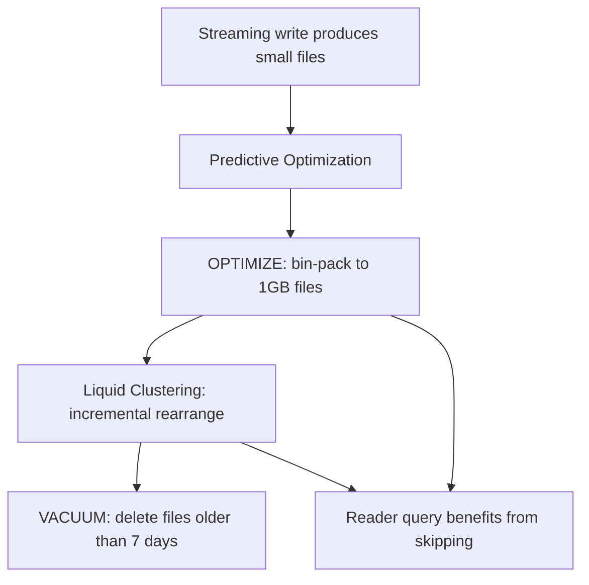

# Module 04 — Delta Table Management: OPTIMIZE, VACUUM, Liquid Clustering, Managed vs External

> **Domain 2 (30%) — Development and Ingestion**
> **Domain 5 (11%) — Data Governance & Quality** (managed vs external)
>
> **Exam objectives covered:**
> - Enable features that simplify data layout decisions and optimize query performance.
> - Explain the difference between managed and external tables.
> - Identify DDL features.
>
> **What you must walk away with:** OPTIMIZE and ZORDER vs Liquid Clustering; the VACUUM 7-day floor and why it exists; Predictive Optimization; the **managed vs external DROP-semantics trap**; CONVERT TO DELTA.

---

## Coverage map (verbatim July 25, 2025 objectives → where taught here)

| Verbatim objective | Taught in section |
|---|---|
| Enable features that simplify data layout decisions and optimize query performance | §1 OPTIMIZE + Auto Optimize/Compact, §2 ZORDER, §3 Liquid Clustering, §5 Predictive Optimization |
| Explain the difference between managed and external tables | §6 "Managed vs external tables — the high-value exam topic" (DROP semantics, PO scope, when to choose external) |
| Identify DDL features (CONVERT TO DELTA, ALTER TABLE … CLUSTER BY, ALTER TABLE … SET TBLPROPERTIES, ENABLE PREDICTIVE OPTIMIZATION) | §1, §3, §5, §7 CONVERT TO DELTA, §8 UniForm |

Cross-references: Module 03 for CREATE TABLE DDL; Module 15 for UC governance of managed/external; Module 14 for system tables.

---

## 1. OPTIMIZE — file compaction

Delta tables on streaming or frequent-write workloads accumulate **small files** — one per micro-batch, one per concurrent writer, one per partition per write. Small files murder query performance: an executor reading 100 1-MB files has 100 file-open overheads vs. 1 file-open for the equivalent 100-MB consolidated file.

`OPTIMIZE` runs a **bin-packing algorithm**:

```sql
OPTIMIZE main.silver.orders;
```

What it does:
1. Lists files in the table (or partitions, with a `WHERE` filter).
2. Filters to files smaller than `spark.databricks.delta.optimize.maxFileSize` (default **1 GB**).
3. Packs them sequentially into ~1 GB target files.
4. Rewrites and commits.

**Key properties:**
- **Idempotent** — running OPTIMIZE again is a no-op if files are already at target size.
- **Online** — doesn't block readers or writers; uses optimistic concurrency.
- **Optional partition / WHERE scope** — `OPTIMIZE t WHERE event_date = '2026-05-01'` only touches that partition.
- **File size tunable** — for very large tables, set `maxFileSize = 2 GB`; for high-concurrency MERGE workloads, smaller files (256–512 MB) reduce write amplification.

```sql
-- Auto-tune file size based on read/write ratio
ALTER TABLE main.silver.orders
SET TBLPROPERTIES ('delta.tuneFileSizesForRewrites' = 'true');
```

### Auto Optimize / Auto Compact

Two related table properties:

```sql
ALTER TABLE main.silver.orders SET TBLPROPERTIES (
  'delta.autoOptimize.optimizeWrite' = 'true',
  'delta.autoOptimize.autoCompact' = 'true'
);
```

- **`optimizeWrite`** — repartitions the DataFrame before writing so each Spark partition produces a reasonably-sized file.
- **`autoCompact`** — after each write, if the partition has many small files, runs a mini-OPTIMIZE on it.

These reduce the need to schedule explicit OPTIMIZE. For UC-managed tables, **Predictive Optimization** subsumes them.

---

## 2. ZORDER BY — multi-dimensional clustering (legacy default)

`OPTIMIZE … ZORDER BY (col1, col2)` rewrites files so that rows close in the multi-dimensional space of `(col1, col2)` end up in the same file.

```sql
OPTIMIZE main.silver.orders ZORDER BY (customer_id, event_date);
```

Why this helps queries: with min/max statistics in the log, files are skipped if the query's filter on `customer_id` doesn't intersect the file's range. Without clustering, customer_id values are randomly distributed across files → no skipping. With ZORDER, similar customer_ids cluster → effective skipping.

**ZORDER properties:**
- Works best with **1–4 columns** — more degrades the Z-curve fragmentation.
- **Rewrite-heavy** — every OPTIMIZE ZORDER pass rewrites the table from scratch. O(table size).
- Does **NOT** record cluster identity in the log — subsequent passes redo the same work.
- Being **superseded by Liquid Clustering** for new tables (2024+).

### ⚠️ Exam trap — ZORDER vs Liquid Clustering

For new tables on the current exam, **Liquid Clustering is the recommended default.** Recognize ZORDER on older code/tables but pick Liquid Clustering for greenfield scenarios.

---

## 3. Liquid Clustering — the new default

**Liquid Clustering (LC)** records cluster identity (a "ZCube ID") in the transaction log. Subsequent OPTIMIZE passes only touch **unclustered** ZCubes — making clustering **incremental** rather than full-rewrite.

```sql
-- At table-creation time
CREATE TABLE main.silver.orders (
  order_id STRING,
  customer_id STRING,
  amount DECIMAL(18,2),
  order_ts TIMESTAMP,
  event_date DATE GENERATED ALWAYS AS (CAST(order_ts AS DATE))
) CLUSTER BY (customer_id, event_date);

-- Change clustering keys later (no full rewrite)
ALTER TABLE main.silver.orders CLUSTER BY (event_date);

-- Drop clustering
ALTER TABLE main.silver.orders CLUSTER BY NONE;
```

**Properties:**
- Uses a **Hilbert curve** (better locality than the Z-curve at higher dimensions).
- **Up to 4 clustering keys.**
- **Cannot combine with partitioning** — Liquid Clustering supersedes partitioning.
- **`CLUSTER BY AUTO`** lets Predictive Optimization choose keys based on observed query patterns.
- **Migration from ZORDER / partitioned:** `ALTER TABLE … CLUSTER BY (…)`; subsequent OPTIMIZE is incremental.

```sql
-- Automatic key selection
CREATE TABLE main.silver.orders (
  order_id STRING,
  customer_id STRING,
  amount DECIMAL(18,2),
  order_ts TIMESTAMP
) CLUSTER BY AUTO;
```

### When to choose Liquid Clustering

| Scenario | Choice |
|----------|--------|
| Greenfield Delta table, queries vary | **Liquid Clustering AUTO** |
| Known dominant filter (e.g., `customer_id`) | **Liquid Clustering** with explicit keys |
| Need to query by date primarily, low cardinality | Could partition, but **Liquid Clustering** is fine |
| Legacy table on ZORDER | Leave alone, or migrate via `ALTER TABLE … CLUSTER BY` |
| Very small tables (< few GB) | No clustering needed; OPTIMIZE alone suffices |

### ⚠️ Exam trap — partitioning + LC = forbidden

You **cannot** combine `PARTITIONED BY` and `CLUSTER BY` on the same table. If a question shows a CREATE TABLE with both, that DDL fails.

---

## 4. VACUUM — physical file deletion

When Delta deletes rows (via DELETE, MERGE, UPDATE, OPTIMIZE rewriting files), the old Parquet files are **logically removed** from the table (next commit has a `remove` action for them) but **physically remain on storage** until VACUUM deletes them.

This is what enables time travel — old versions still have their files.

```sql
VACUUM main.silver.orders;                     -- default 7-day retention
VACUUM main.silver.orders RETAIN 168 HOURS;    -- explicit 7 days
VACUUM main.silver.orders RETAIN 168 HOURS DRY RUN;  -- list, don't delete
```

### The 7-day floor — the most-traffic'd exam fact

**Default VACUUM retention is 168 hours (7 days).** Delta refuses to delete files younger than this — even if you ask — unless you explicitly disable the safety check:

```sql
SET spark.databricks.delta.retentionDurationCheck.enabled = false;
VACUUM main.silver.orders RETAIN 1 HOURS;
```

### Why the safety check exists

Concurrent readers may have started a query against a recent version of the table and may not yet have read all the relevant files. If VACUUM physically deletes those files mid-query, the reader crashes.

The 7-day default is generous enough that any reasonable query has completed.

### Consequences

- **Time travel is bounded by VACUUM retention.** A query against `VERSION AS OF n` where n's files have been VACUUMed will error.
- **Restoring an older version** has the same constraint.
- **You don't need to schedule VACUUM** — Predictive Optimization runs it on UC-managed tables.

### ⚠️ Exam trap — "lower the VACUUM retention to 1 day"

A question asks "how do you VACUUM more aggressively to reclaim space?" The naive answer is "run VACUUM RETAIN 24 HOURS." This **fails** by default. You'd have to also set `spark.databricks.delta.retentionDurationCheck.enabled = false`. The exam-correct answer for "manage retention safely" is to leave the 7-day floor in place and let Predictive Optimization handle it.

---

## 5. Predictive Optimization

**Predictive Optimization (PO)** is the post-2025 automation that:
- Runs OPTIMIZE on UC-managed Delta tables when usage telemetry indicates it's worthwhile.
- Runs VACUUM on schedule, respecting the retention window.
- Picks `CLUSTER BY AUTO` keys based on observed query filters.

**Default on** for UC-managed tables on newer DBR / UC versions.

### Enable / disable

```sql
ALTER CATALOG main ENABLE PREDICTIVE OPTIMIZATION;
ALTER SCHEMA main.sales ENABLE PREDICTIVE OPTIMIZATION;
ALTER TABLE main.sales.orders ENABLE PREDICTIVE OPTIMIZATION;

-- Disable
ALTER TABLE main.sales.orders DISABLE PREDICTIVE OPTIMIZATION;

-- Inherit from parent
ALTER TABLE main.sales.orders INHERIT PREDICTIVE OPTIMIZATION;
```

### What PO does NOT do
- It does NOT manage external tables (UC doesn't own external storage).
- It does NOT do schema changes.
- It does NOT replace `OPTIMIZE … ZORDER BY` if you've explicitly requested ZORDER (use Liquid Clustering instead).

### ⚠️ Exam trap — Predictive Optimization scope

PO works on **UC-managed tables only.** If a question describes an external table and asks "why isn't Predictive Optimization running on it?" — because it's external, UC doesn't own its storage and doesn't manage its layout.

---

## 6. Managed vs external tables — the high-value exam topic

### 6.1 Definitions

| Type | Storage owner | Created with | Identified by |
|------|---------------|--------------|---------------|
| **Managed** | Unity Catalog | `CREATE TABLE …` (no LOCATION) | Storage lives in the catalog's managed storage root |
| **External** | You | `CREATE TABLE … LOCATION '<path>'` | Explicit LOCATION at creation |

```sql
-- Managed table — UC chooses storage location
CREATE TABLE main.sales.orders (
  order_id STRING,
  amount DECIMAL(18,2)
);

-- External table — you specify storage location
CREATE TABLE main.sales.orders_external (
  order_id STRING,
  amount DECIMAL(18,2)
)
LOCATION 'abfss://landing@datalake.dfs.core.windows.net/orders';
```

### 6.2 The DROP-semantics trap

**This is one of the highest-frequency traps on the exam.**

| Action | Managed table | External table |
|--------|---------------|----------------|
| `DROP TABLE` | **Deletes metadata AND data files** (after retention) | **Deletes metadata only**; data files remain in storage |
| Recreate same name | Empty table | Re-importable — `CREATE TABLE … LOCATION '<same path>'` rehydrates from the surviving files |

```sql
DROP TABLE main.sales.orders;             -- Managed: data gone (after retention)
DROP TABLE main.sales.orders_external;    -- External: metadata gone, files remain
```

### ⚠️ Exam trap — "we dropped the table and lost all our data"

Scenario: A team creates a managed table, populates it for months, then mistakenly runs `DROP TABLE`. Asks "will the data be recoverable?"

- If **managed:** data is deleted after the retention window; before that, you might be able to recover from snapshots / backups, but the canonical exam answer is "no, the data is removed when the table is dropped."
- If **external:** the underlying files are NOT deleted by DROP. The team can recreate the external table pointing at the same path and recover all data.

The exam often poses this as a "which table type should you use to protect against accidental DROP?" — the answer is **external table** (because DROP doesn't delete the data files).

### 6.3 Other differences

| Feature | Managed | External |
|---------|---------|----------|
| Predictive Optimization | **Yes** | No |
| Auto Liquid Clustering with PO | Yes | No |
| Easier governance (UC owns the path) | Yes | Partial — UC governs metadata only |
| Mixed engines (Spark, Snowflake, Athena) reading the same files | Possible but not the canonical pattern | The pattern — files in a known location accessible to multiple engines |
| Recommended default for new tables | **Managed** | External only when needed |

### 6.4 When to choose external

- You **must** share storage with non-Databricks tools (Snowflake reading the same Parquet, for instance).
- You're **migrating** existing Parquet/Delta files into UC and want to register them in place without moving.
- You need to **control the storage location** for cloud-cost or data-residency reasons.

For all other cases, **managed is the default.**

---

## 7. CONVERT TO DELTA

If you have existing Parquet files (perhaps from a pre-Delta era), you can convert them in place:

```sql
CONVERT TO DELTA parquet.`abfss://...path/to/parquet/`;

-- With partition spec
CONVERT TO DELTA parquet.`abfss://...path/to/parquet/`
PARTITIONED BY (event_date DATE);
```

What this does:
1. Crawls the Parquet directory.
2. Builds the `_delta_log/` with `add` actions for each existing file.
3. Writes the initial commit.
4. Does **not rewrite** the Parquet data — just adds the log.

Conversion is reversible (just delete `_delta_log/` — though obviously you lose Delta semantics).

For external tables, you can then `CREATE TABLE … LOCATION` pointing at the now-converted path.

### ⚠️ Exam trap — CONVERT TO DELTA preserves data

Some candidates assume CONVERT rewrites everything. It doesn't — that's the point. The Parquet files stay put; only `_delta_log/` is added.

---

## 8. UniForm — Iceberg compatibility

A 2024 feature: Delta tables can be marked with **UniForm** to also expose an Iceberg manifest, so Iceberg-compatible engines can read the same files.

```sql
ALTER TABLE main.sales.orders
SET TBLPROPERTIES (
  'delta.universalFormat.enabledFormats' = 'iceberg'
);
```

For the exam: recognize that UniForm exists and lets Delta tables be read by Iceberg consumers. Depth beyond that is not required for DE Associate.

---

## 9. Putting it together — a maintenance playbook

```sql
-- 1. Create with Liquid Clustering and managed storage
CREATE TABLE main.silver.orders (
  order_id STRING,
  customer_id STRING,
  amount DECIMAL(18,2),
  order_ts TIMESTAMP,
  event_date DATE GENERATED ALWAYS AS (CAST(order_ts AS DATE))
) CLUSTER BY AUTO;

-- 2. Enable Predictive Optimization (often already inherited from catalog)
ALTER TABLE main.silver.orders ENABLE PREDICTIVE OPTIMIZATION;

-- 3. Enable CDF for downstream consumers
ALTER TABLE main.silver.orders
SET TBLPROPERTIES ('delta.enableChangeDataFeed' = 'true');

-- 4. Enable deletion vectors for MERGE-heavy workloads
ALTER TABLE main.silver.orders
SET TBLPROPERTIES ('delta.enableDeletionVectors' = 'true');

-- 5. (PO does this for you, but for the exam, know the manual form:)
OPTIMIZE main.silver.orders;
VACUUM main.silver.orders;   -- default 7-day retention
```



---

## 10. Mini quiz (cold)

1. What's the default file size target for OPTIMIZE?
2. You ran OPTIMIZE yesterday. Will running it again today rewrite the files?
3. A team has a Delta table partitioned by `event_date` and wants to add `customer_id` clustering. Should they add ZORDER on top or migrate to Liquid Clustering?
4. The default VACUUM retention is 7 days. How do you make it 1 day, and what's the risk?
5. Will Predictive Optimization run on an external table?
6. A team drops a managed table by mistake. Can they recover the data the next morning?
7. A team drops an external table by mistake. Can they recover?
8. You have a Parquet directory you want to register in UC as a Delta table without rewriting the data. Which command?
9. Can you create a Delta table with both `PARTITIONED BY` and `CLUSTER BY`?

### Answers

1. **1 GB** (`spark.databricks.delta.optimize.maxFileSize` default).
2. **No** — OPTIMIZE is idempotent. If files are already at target size, OPTIMIZE is a no-op.
3. **Migrate to Liquid Clustering.** `ALTER TABLE … CLUSTER BY (customer_id)` removes partitioning and starts incremental LC. ZORDER is legacy.
4. **Set `spark.databricks.delta.retentionDurationCheck.enabled = false`, then `VACUUM RETAIN 24 HOURS`.** Risk: concurrent readers that started before VACUUM may crash when their referenced files disappear.
5. **No.** Predictive Optimization only manages UC-managed tables. External tables' storage isn't UC's to manage.
6. **No** (canonically). DROP on a managed table removes the data files after the retention window. Some recovery may be possible via cloud-storage snapshots, but the exam-correct answer is "no."
7. **Yes.** DROP on an external table removes only the metadata. Recreate the external table pointing at the same LOCATION — the data is still there.
8. **`CONVERT TO DELTA parquet.<path>`.** Adds `_delta_log/` without rewriting the Parquet files.
9. **No.** Partitioning and Liquid Clustering are mutually exclusive. LC supersedes partitioning.

---

## 11. Sanity check before moving on

You should be able to:
- State the OPTIMIZE default file size and that OPTIMIZE is idempotent.
- Pick Liquid Clustering over ZORDER for new tables.
- Recite the VACUUM 7-day floor and the safety-check property to override it.
- State the managed-vs-external DROP semantics from memory.
- Explain CONVERT TO DELTA in one sentence (adds `_delta_log/`, no rewrite).
- List which Predictive Optimization features apply only to managed tables.

If any of those are fuzzy, re-read Sections 3, 4, 5, and 6.
