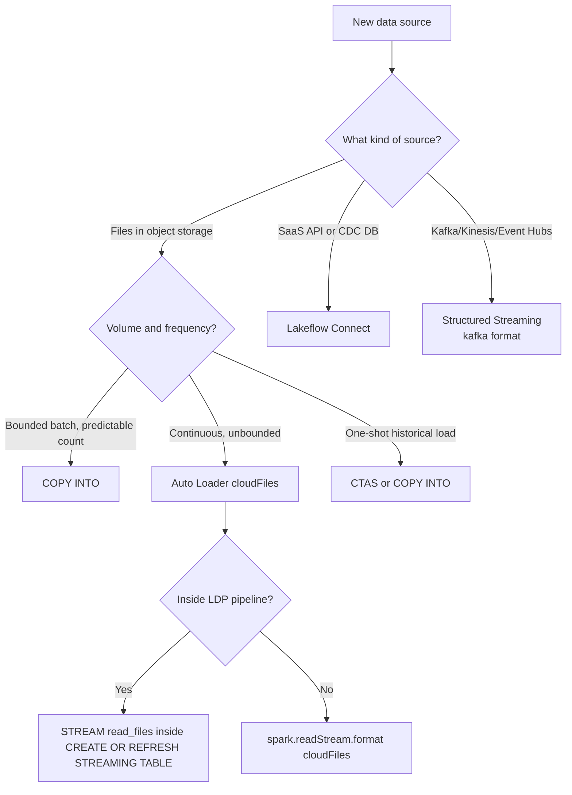
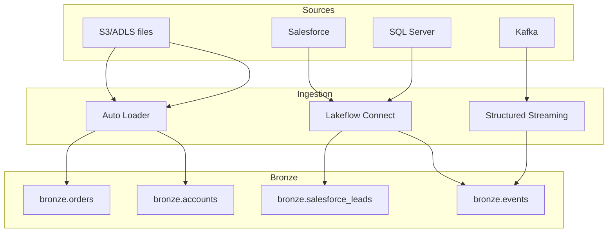

# Module 05 — Data Ingestion Methods: COPY INTO, Auto Loader, CTAS, Lakeflow Connect

> **Domain 2 (30%) — Development and Ingestion**
>
> **Exam objectives covered:**
> - Classify valid Auto Loader sources and use cases.
> - Demonstrate knowledge of Auto Loader syntax (deep-dive in Module 06).
> - Identify DDL/DML features.
>
> **What you must walk away with:** The trade-offs among `COPY INTO`, **Auto Loader (`cloudFiles`)**, **CREATE TABLE AS SELECT**, and **Lakeflow Connect**. Which to choose for a given scenario. The idempotency model of each.

---

## Coverage map (verbatim July 25, 2025 objectives → where taught here)

| Verbatim objective | Taught in section |
|---|---|
| Classify valid Auto Loader sources and use cases | §1 "The ingestion menu" + §4 "Auto Loader" + §8 "Decision tree" |
| Demonstrate knowledge of Auto Loader syntax (high-level here; deep in Module 06) | §4 + §6 "`read_files` table-valued function" |
| Identify DDL/DML features (CTAS, COPY INTO, read_files) | §2 CTAS, §3 COPY INTO + COPY_OPTIONS, §6 read_files / STREAM read_files |

Cross-references: Module 06 for Auto Loader deep syntax; Module 10 for LDP-side `STREAM read_files`; Module 09 for CDC via Lakeflow Connect.

---

## 1. The ingestion menu

Databricks gives you four (sometimes five) ways to ingest data into Delta:

| Method | Style | Best for |
|--------|-------|----------|
| **`CREATE TABLE AS SELECT`** (CTAS) | One-shot SQL | A one-time snapshot or derived table |
| **`COPY INTO`** | SQL, incremental, idempotent | Bounded, structured files (CSV/JSON/Parquet) with a finite expected count |
| **Auto Loader (`cloudFiles`)** | Structured Streaming | Continuous, high-throughput, unbounded file arrival in cloud storage |
| **Lakeflow Connect** | Managed connectors | SaaS sources (Salesforce, Workday, ServiceNow), SQL Server CDC, etc. — managed by Databricks |
| **`read_files(...)`** (table-valued function) | SQL, batch | Ad-hoc SQL over files, often inside LDP STREAMING TABLE definitions |

The exam tests **when to use which**, not how to write all four from memory. You will be shown a scenario; pick the right tool.

---

## 2. `CREATE TABLE AS SELECT` (CTAS) — one-shot

```sql
CREATE TABLE main.bronze.orders_initial AS
SELECT * FROM read_files('/Volumes/main/landing/orders/2026/', format => 'json');
```

- One-shot batch.
- Schema inferred from the SELECT.
- **Not idempotent** in the streaming sense — re-running re-imports everything.
- **Right answer** when: backfilling, initial historical load, ad-hoc derived table.
- **Wrong answer** when: files arrive continuously and you need to process only new ones.

---

## 3. `COPY INTO` — incremental, idempotent batch

`COPY INTO` is a SQL command that loads files into a Delta table and **remembers which files it has already loaded**.

```sql
-- Basic
COPY INTO main.bronze.orders
FROM '/Volumes/main/landing/orders/'
FILEFORMAT = JSON;

-- With options
COPY INTO main.bronze.orders
FROM '/Volumes/main/landing/orders/'
FILEFORMAT = JSON
FORMAT_OPTIONS ('multiLine' = 'true')
COPY_OPTIONS ('mergeSchema' = 'true');

-- Selecting / transforming during load
COPY INTO main.bronze.orders
FROM (
  SELECT
    get_json_object(value, '$.order_id') AS order_id,
    CAST(get_json_object(value, '$.amount') AS DECIMAL(18,2)) AS amount,
    _metadata.file_path AS source_file,
    current_timestamp() AS ingest_ts
  FROM '/Volumes/main/landing/orders/'
)
FILEFORMAT = JSON;
```

### Properties

- **Idempotent file tracking.** Loaded file paths are recorded. Re-running `COPY INTO` skips already-loaded files.
- **Batch.** Each invocation processes whatever files are currently in the source. To process new files, re-run.
- **Bounded.** Best when you expect a finite known number of files.
- **Schema evolution** via `COPY_OPTIONS ('mergeSchema' = 'true')`.
- **`COPY_OPTIONS ('force' = 'true')`** — re-process all files even if already loaded (rare; for recovery).

### When `COPY INTO` is the right choice

- Bounded daily / weekly batch ingestion where files land predictably.
- Migration from on-prem to lakehouse (one-time load of historical archive).
- Workloads where streaming infrastructure overhead is unwarranted.

### When `COPY INTO` is the wrong choice

- Continuous high-throughput ingestion → use **Auto Loader**.
- Files numbering in the millions, where directory listing becomes the bottleneck → use **Auto Loader with file notifications**.
- You need schema-evolution semantics richer than `mergeSchema` (e.g., rescued data) → use **Auto Loader**.

### ⚠️ Exam trap — `COPY INTO` vs Auto Loader on file volume

Both are incremental and idempotent. The discriminator is **scale and continuity**:
- **Hundreds of files arriving on a known schedule** → `COPY INTO` works fine.
- **Continuous high-throughput / unbounded arrival** → Auto Loader.

If a question mentions "new files arrive continuously in object storage" → Auto Loader.

---

## 4. Auto Loader (`cloudFiles`) — the canonical continuous ingestion answer

Deep-dive in Module 06. For this module, just the headline:

```python
(spark.readStream
   .format("cloudFiles")
   .option("cloudFiles.format", "json")
   .option("cloudFiles.schemaLocation", "/Volumes/main/_schemas/orders")
   .load("/Volumes/main/landing/orders/")
  .writeStream
   .option("checkpointLocation", "/Volumes/main/_chk/orders")
   .trigger(availableNow=True)
   .toTable("main.bronze.orders"))
```

What Auto Loader gives you that COPY INTO doesn't:
- **Continuous** streaming model — runs forever (or use `availableNow=True` to process all and exit).
- **Scales to billions** of files via **file notification mode**.
- **Schema inference** with versioned schema history in `schemaLocation`.
- **Schema evolution modes** (`addNewColumns`, `rescue`, `failOnNewColumns`, `none`) — richer than `mergeSchema`.
- **`_rescued_data` column** for unexpected data.
- **Exactly-once** via the streaming checkpoint.

### SQL form via `read_files`

You can also reference cloud files in SQL inside LDP pipelines and DBSQL:

```sql
SELECT * FROM read_files(
  '/Volumes/main/landing/orders/',
  format => 'json',
  schemaHints => 'amount DECIMAL(18,2)'
);

-- Streaming version (used inside LDP STREAMING TABLE)
CREATE OR REFRESH STREAMING TABLE main.bronze.orders
AS SELECT * FROM STREAM read_files(
  '/Volumes/main/landing/orders/',
  format => 'json'
);
```

`read_files` is the SQL table-valued function that wraps Auto Loader under the hood for SQL contexts.

---

## 5. Lakeflow Connect — managed connectors for SaaS sources

**Lakeflow Connect** is Databricks' managed connector framework, added to the platform mid-2024 and expanded through 2025. It is the **non-Auto-Loader** ingestion path: instead of reading files from object storage, Lakeflow Connect pulls data directly from SaaS APIs or operational databases.

### Available connectors (representative; the list grows)

- **Salesforce** (objects + Salesforce CDC)
- **Workday**
- **ServiceNow**
- **SQL Server** (with native CDC)
- **PostgreSQL** (CDC)
- **MySQL** (CDC)
- **Google Analytics 4**
- **SharePoint**

### How it works

You configure a **Lakeflow Connect pipeline** (a special kind of LDP pipeline) with:
- Source connection (UC connection object holding credentials).
- Source objects (which Salesforce objects, which SQL Server tables, etc.).
- Destination catalog/schema in UC.
- Schedule (triggered or continuous).

The pipeline lands Bronze tables in UC with the source data, applying CDC if the source supports it.

### When to choose Lakeflow Connect vs Auto Loader

| Source shape | Choice |
|--------------|--------|
| Files in cloud object storage | **Auto Loader** |
| SaaS API (Salesforce, Workday) | **Lakeflow Connect** |
| Operational database with CDC (SQL Server, Postgres) | **Lakeflow Connect** |
| Custom application emitting JSON to S3 | **Auto Loader** |
| Kafka / Event Hubs / Kinesis | Structured Streaming (not Lakeflow Connect; not Auto Loader) |

### Exam coverage of Lakeflow Connect

The DE Associate covers Lakeflow Connect at **conceptual depth** — recognize the connectors, recognize when it's the right answer. Deep syntax is not tested. If a question describes "managed SaaS connector with built-in CDC for Salesforce, no custom code," the answer is Lakeflow Connect.

### ⚠️ Exam trap — Lakeflow Connect vs Auto Loader

Don't confuse the two. **Auto Loader** is for files in object storage. **Lakeflow Connect** is for managed connectors to SaaS / operational DBs. They are complementary, not alternatives.

---

## 6. `read_files` table-valued function — the SQL on-ramp

`read_files` is a SQL function that reads files from a path and returns a table:

```sql
-- One-shot batch read (no incremental tracking)
SELECT * FROM read_files(
  '/Volumes/main/landing/orders/',
  format => 'json'
);

-- With schema hints
SELECT * FROM read_files(
  '/Volumes/main/landing/orders/',
  format => 'json',
  schemaHints => 'order_id LONG, amount DECIMAL(18,2)'
);

-- Inside an LDP STREAMING TABLE — this becomes Auto Loader under the hood
CREATE OR REFRESH STREAMING TABLE main.bronze.orders
AS SELECT * FROM STREAM read_files(
  '/Volumes/main/landing/orders/',
  format => 'json'
);
```

The key insight: `read_files` is **batch** by default, but wrapped in `STREAM(...)` inside LDP becomes incremental (uses Auto Loader's checkpointing).

This is the **exam-canonical** way to write SQL-based ingestion in LDP. Most exam questions about LDP SQL syntax use `STREAM read_files(...)`.

---

## 7. Direct DataFrame writes — when to use

For one-shot loads where you control the source code, plain PySpark works:

```python
df = spark.read.json("/Volumes/main/landing/orders/")
df.write.format("delta").mode("append").saveAsTable("main.bronze.orders")
```

- No incremental tracking.
- No schema-evolution unless `.option("mergeSchema", "true")`.
- Right answer for: one-shot loads, transformations between Bronze and Silver, gold-layer aggregation writes.
- Wrong answer for: continuous ingestion of arriving files.

For exam purposes, **`spark.read` + `df.write` is not "ingestion" in the Auto Loader sense.** If the question says "files arrive continuously," don't pick a `spark.read` answer.

---

## 8. Decision tree



---

## 9. Idempotency model — what each tool guarantees

| Tool | Re-run safety | How |
|------|---------------|-----|
| **CTAS** | Not idempotent (re-creates the whole table; will error on existing table unless OR REPLACE) | Schema in DDL |
| **COPY INTO** | Idempotent (skips already-loaded files) | File path tracking in `_copy_into_metadata` |
| **Auto Loader** | Exactly-once writes | Checkpoint location + atomic Delta commit |
| **Lakeflow Connect** | Managed exactly-once | Connector-internal state + Delta commit |
| **`spark.read` + `df.write`** | Not idempotent | None — you must dedupe manually |
| **`MERGE INTO` against staging** | Idempotent if MERGE keys are correct | Match-and-update logic |

---

## 10. Putting it together — a multi-source ingestion architecture



A real workspace mixes all of these. The DE Associate exam typically isolates a single source per question and asks "which tool?"

---

## 11. Mini quiz (cold)

1. You're loading 50 JSON files dropped daily into a UC Volume. Files are predictable, finite per day. Which tool?
2. A SaaS application's REST API needs to flow into a Bronze table with CDC. No file landing zone involved. Which tool?
3. New files arrive in S3 continuously (sometimes 100/hour, sometimes 0/hour). Which tool?
4. You're inside an LDP SQL pipeline and want to declare a streaming Bronze table that reads JSON files. Which function?
5. A team accidentally re-ran `COPY INTO` on the same source path. Will it re-load files that were already loaded?
6. A team wrote `spark.read.json(path).write.saveAsTable(...)` in a job that runs every hour. What's wrong with this?
7. Lakeflow Connect or Auto Loader for ingesting SQL Server CDC into a Bronze Delta table?

### Answers

1. **`COPY INTO`** — bounded, predictable, idempotent. Auto Loader works too but is overkill.
2. **Lakeflow Connect** — managed SaaS connector, no file landing.
3. **Auto Loader (`cloudFiles`)** with `trigger(availableNow=True)` if scheduled, or `processingTime` for continuous. Unbounded, continuous, file-arrival in object storage = Auto Loader's home turf.
4. **`STREAM read_files(...)`** inside `CREATE OR REFRESH STREAMING TABLE …`. Internally uses Auto Loader.
5. **No.** `COPY INTO` tracks loaded file paths and skips them on re-run. (You can force re-load with `COPY_OPTIONS ('force' = 'true')`.)
6. **Not incremental.** Every run re-reads the entire path and appends, producing duplicates. Either switch to Auto Loader or `COPY INTO`, or add MERGE-based dedupe logic.
7. **Lakeflow Connect.** Auto Loader is for files in object storage; SQL Server CDC is a database CDC stream — Lakeflow Connect's SQL Server connector handles it.

---

## 12. Sanity check before moving on

You should be able to:
- Match each of CTAS, COPY INTO, Auto Loader, Lakeflow Connect to the scenario shape it fits.
- Explain `COPY INTO` idempotency in one sentence.
- Identify `read_files` and its `STREAM(...)` wrapper as the SQL on-ramp to Auto Loader inside LDP.
- Avoid the `spark.read.json().write` trap for continuous ingestion.
- Pick Lakeflow Connect for SaaS / operational-DB sources.

If any of those are fuzzy, re-read Sections 3, 4, 5, and 8.
