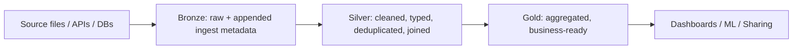

# Module 07 — ETL with PySpark + SQL: Medallion, MERGE, Aggregations, Repartition

> **Domain 3 (31%) — Data Processing & Transformations**
>
> **Exam objectives covered:**
> - **Describe the three layers of the Medallion Architecture** and explain the purpose of each layer.
> - **Compute complex aggregations and metrics with PySpark DataFrames.**
> - Identify DDL/DML features.
>
> **What you must walk away with:** The Bronze / Silver / Gold mental model and what belongs in each layer. Common DataFrame transformations (`groupBy().agg(...)`, `sum`, `count`, `count_distinct`, `avg`, `window`). Repartition vs coalesce. MERGE-based upserts. The exam's preference for `count_distinct` over `count` when the question wants unique invoices.

---

## Coverage map (verbatim July 25, 2025 objectives → where taught here)

| Verbatim objective | Taught in section |
|---|---|
| Describe the three layers of the Medallion Architecture and explain the purpose of each | §1 "The Medallion Architecture" + what-belongs-where decision |
| Compute complex aggregations and metrics with PySpark DataFrames | §2 "PySpark DataFrame aggregations" + §3 "Common aggregation patterns" (incl. windows, pivots, approx_count_distinct) + §8 nested/JSON |
| Sample Question 1 (count_distinct vs count for unique invoices) | §2 "The Question-1 pattern — unique invoices per day" |
| Identify DDL/DML features (MERGE WHEN MATCHED/NOT MATCHED, dedupe-before-MERGE) | §6 "MERGE-based upserts in PySpark + SQL" + §9 "Writing DataFrames to Delta" |
| Classify cluster/configuration tuning concepts (repartition vs coalesce, broadcast join) | §4 "Joins" + §5 "Repartition vs coalesce" |

Cross-references: Module 03 for MERGE syntax fundamentals; Module 10 for APPLY CHANGES INTO inside LDP; Module 14 for Spark UI tuning of join/shuffle plans.

---

## 1. The Medallion Architecture



| Layer | Purpose | Schema discipline | Typical operations |
|-------|---------|-------------------|---------------------|
| **Bronze** | "Land everything verbatim." Preserves the source as-received plus ingestion metadata. | Schema-on-read; new columns rescued or added | Auto Loader / Lakeflow Connect / COPY INTO writes |
| **Silver** | "Cleaned and conformed." Typed, deduplicated, joined across sources, conformed dimensions. | Schema-on-write; strict types | Filter, cast, join, MERGE/upsert, deduplicate |
| **Gold** | "Business-ready aggregates." Aggregations, KPI tables, dashboards' direct source. | Strict; often fact/dimension shape | groupBy / agg, window functions, joins among Silver tables |

### Why three layers and not two

- **Bronze** is the audit trail. If a Silver-layer bug corrupts data, Bronze is your replay source.
- **Silver** decouples the messy-source reality from analytics — analysts query Silver, not Bronze.
- **Gold** isolates expensive aggregations so that high-concurrency BI queries don't recompute them.

### What each layer typically contains

| Layer | Examples (orders use case) |
|-------|----------------------------|
| Bronze | `bronze.orders_raw` (raw JSON with rescued data column), `bronze.web_events_raw` |
| Silver | `silver.orders` (typed, joined to customer), `silver.customers` (conformed dim), `silver.web_sessions` (event-grouped) |
| Gold | `gold.daily_revenue`, `gold.customer_lifetime_value`, `gold.monthly_active_users` |

### ⚠️ Exam trap — what belongs where

The exam often shows you a transformation and asks "which layer should this produce?" Key signals:

- "Aggregate to a daily fact table" → **Gold**.
- "Clean nulls, cast types, join to customer dim" → **Silver**.
- "Land raw JSON files with file metadata" → **Bronze**.

Don't confuse "Silver does aggregation" — Silver typically does **row-level transformations**. Aggregations live in Gold.

---

## 2. PySpark DataFrame aggregations — the exam's #1 PySpark topic

The official Question 1 in the exam guide tests exactly this: pick the right `.groupBy().agg(...)` form.

### The functions you must know

```python
from pyspark.sql.functions import (
    sum, count, count_distinct, avg, min, max,
    mean, stddev, var_samp, expr, col, when, lit
)
```

| Function | What it does | Right when |
|----------|--------------|------------|
| `sum(col)` | Sum of values | Summing amounts, quantities |
| `count(col)` | Count of non-null values | Count of rows where col is not null |
| `count("*")` | Count of all rows | "How many rows in each group?" |
| `count_distinct(col)` | Count of distinct non-null values | "How many unique X per group?" |
| `avg(col)` / `mean(col)` | Average | Mean amount |
| `min(col)` / `max(col)` | Min / max | First / last by date |
| `stddev(col)` | Std deviation | Distribution metrics |

### The Question-1 pattern — unique invoices per day

Given `billing_df` with columns `billing_id`, `patient_id`, `department`, `billing_date`, `amount_billed`, `quantity`:

```python
from pyspark.sql.functions import sum, count_distinct

daily_revenue_df = billing_df.groupBy("billing_date").agg(
    sum("amount_billed").alias("total_revenue"),
    count_distinct("billing_id").alias("total_invoices")
)
```

**Why `count_distinct("billing_id")` and not `count("billing_id")`?**

- `count("billing_id")` counts every non-null row — duplicates included. If `billing_id` is the row identifier and unique per row, `count` == `count_distinct`. But if billing_id can repeat (correction rows, partial billings, multi-line invoices), they're different.
- The question said "unique invoices." The semantic answer is **`count_distinct`**.

**Why not `count_distinct("patient_id")`?**

- Different patients on the same day means multiple invoices, not one per patient. Counting distinct patient_id undercounts invoices.

### ⚠️ Exam trap — `count` vs `count_distinct`

Watch the prompt for:
- "**total** invoices" — could be either; usually `count` if rows == invoices.
- "**unique** invoices" or "**distinct** invoices" — `count_distinct`.
- "**number of** customers" — usually `count_distinct(customer_id)` since each customer has many rows.

If the prompt says "unique," default to `count_distinct`.

---

## 3. Common aggregation patterns

### 3.1 Group + multiple aggregates

```python
result = (df.groupBy("dept", "year")
            .agg(
                sum("amount").alias("total"),
                count("*").alias("n_rows"),
                count_distinct("invoice_id").alias("n_invoices"),
                avg("amount").alias("avg_amount"),
                max("amount").alias("max_amount")
            ))
```

### 3.2 Conditional aggregation with `when`

```python
from pyspark.sql.functions import sum, when, col

result = df.groupBy("dept").agg(
    sum(when(col("status") == "paid", col("amount")).otherwise(0)).alias("paid_total"),
    sum(when(col("status") == "open", col("amount")).otherwise(0)).alias("open_total")
)
```

### 3.3 Window functions — top-N per group

```python
from pyspark.sql.window import Window
from pyspark.sql.functions import row_number, rank, dense_rank, lag, lead

w = Window.partitionBy("dept").orderBy(col("amount").desc())

top_three_per_dept = (df
    .withColumn("rn", row_number().over(w))
    .filter("rn <= 3"))
```

### 3.4 Pivot

```python
result = (df.groupBy("dept")
            .pivot("year", ["2024", "2025", "2026"])
            .agg(sum("amount")))
```

### 3.5 Approx distinct (for very large groups)

```python
from pyspark.sql.functions import approx_count_distinct

# HyperLogLog-based; faster but approximate
result = df.groupBy("dept").agg(
    approx_count_distinct("user_id", 0.05).alias("unique_users")
)
```

---

## 4. Joins

### Join types

```python
# Inner — only matched rows
df1.join(df2, "key", "inner")

# Left outer — all from left, matched from right
df1.join(df2, "key", "left")

# Right outer — all from right, matched from left
df1.join(df2, "key", "right")

# Full outer — all from both, nulls where unmatched
df1.join(df2, "key", "full")

# Semi — like inner but only columns from left
df1.join(df2, "key", "left_semi")

# Anti — only rows in left NOT matched in right
df1.join(df2, "key", "left_anti")
```

### Broadcast hints

For joining a large fact table to a small dimension:

```python
from pyspark.sql.functions import broadcast

fact.join(broadcast(dim), "key", "left")
```

Forces a broadcast hash join — sends `dim` to every executor, avoiding shuffle. Right when `dim` is < a few hundred MB.

Without the hint, Spark's Cost-Based Optimizer / Adaptive Query Execution will often broadcast automatically based on table size statistics, but the explicit hint is safer.

---

## 5. Repartition vs coalesce

Both control the number of partitions in a DataFrame. **They are NOT equivalent.**

### `repartition(n)` — full shuffle

```python
df_balanced = df.repartition(200)
df_keyed   = df.repartition("customer_id")     # repartition by hash of column
df_combined = df.repartition(200, "customer_id")
```

- Does a **full shuffle**.
- Produces **n** roughly-equal partitions.
- Can both **increase and decrease** partition count.
- Use when: you want balanced parallelism (e.g., before a join or before writing).
- Use when: you want partitions keyed by a column (for join collocation or for partition-aligned writes).

### `coalesce(n)` — no shuffle (or limited)

```python
df_fewer = df.coalesce(5)
```

- **No shuffle** — just merges existing partitions.
- Can only **decrease** partition count.
- Faster than `repartition` but produces **unbalanced** partitions.
- Use when: writing few large files at the end of a job; consolidating after a heavily-filtered scan.

### Decision matrix

| Need | Choice |
|------|--------|
| Reduce 200 partitions to 4 for output | `coalesce(4)` |
| Rebalance 1 huge partition + 199 tiny ones | `repartition(200)` (shuffle to redistribute) |
| Repartition by join key for collocation | `repartition("key")` |
| After a heavy filter dropped 99% of data | `coalesce(n)` to reduce output file count |

### ⚠️ Exam trap — coalesce can't increase partitions

If you have 4 partitions and you call `df.coalesce(200)`, you still get 4 — coalesce ignores upward requests. Use `repartition(200)` instead.

---

## 6. MERGE-based upserts in PySpark + SQL

Inside an LDP pipeline, prefer `APPLY CHANGES INTO` (Module 10). Outside LDP, hand-rolled MERGE is the pattern.

### SQL MERGE — the canonical form

```sql
MERGE INTO main.silver.customers t
USING main.staging.customer_changes s
ON  t.customer_id = s.customer_id
WHEN MATCHED AND s.op = 'D'  THEN DELETE
WHEN MATCHED AND s.op = 'U'  THEN UPDATE SET *
WHEN NOT MATCHED AND s.op = 'I' THEN INSERT *;
```

Key clauses:
- `WHEN MATCHED [AND <cond>] THEN UPDATE SET ... | DELETE`
- `WHEN NOT MATCHED [AND <cond>] THEN INSERT (...) VALUES (...) | INSERT *`
- `WHEN NOT MATCHED BY SOURCE [AND <cond>] THEN UPDATE SET ... | DELETE` (newer; for row removal when not in source)

### PySpark MERGE via DeltaTable API

```python
from delta.tables import DeltaTable

target = DeltaTable.forName(spark, "main.silver.customers")

(target.alias("t")
    .merge(source_df.alias("s"), "t.customer_id = s.customer_id")
    .whenMatchedDelete(condition="s.op = 'D'")
    .whenMatchedUpdate(condition="s.op = 'U'", set={"name": "s.name", "email": "s.email"})
    .whenNotMatchedInsert(condition="s.op = 'I'", values={"customer_id": "s.customer_id", "name": "s.name", "email": "s.email"})
    .execute())
```

### Deduplicate within a batch before MERGE

Common issue: the same key appears multiple times in the source batch (e.g., multiple updates to the same customer in one batch). MERGE errors on duplicate match keys. Dedupe first:

```python
from pyspark.sql.window import Window
from pyspark.sql.functions import row_number, col

w = Window.partitionBy("customer_id").orderBy(col("ts").desc())

source_dedup = (source_df
    .withColumn("rn", row_number().over(w))
    .filter("rn = 1")
    .drop("rn"))

# Now MERGE source_dedup
```

### ⚠️ Exam trap — `APPLY CHANGES INTO` vs MERGE

Inside an **LDP pipeline**, the exam-correct answer for CDC is `APPLY CHANGES INTO`, not MERGE. MERGE is for non-LDP code or for non-CDC upserts. See Module 10.

---

## 7. Common transformations cheat-sheet

```python
from pyspark.sql.functions import (
    col, lit, when, expr,
    upper, lower, trim, regexp_replace, regexp_extract, substring,
    to_date, to_timestamp, date_format, date_add, datediff, year, month, day,
    cast, coalesce, isnull, isnan,
    split, explode, get_json_object, from_json, to_json,
    array, array_contains, struct, map_from_entries
)

# Select + cast + rename
df2 = df.select(
    col("id").cast("string").alias("id"),
    col("ts").cast("timestamp"),
    col("amt").cast("decimal(18,2)").alias("amount")
)

# Filter
df3 = df.filter("status = 'active' AND amount > 0")
df3b = df.filter((col("status") == "active") & (col("amount") > 0))

# Add column
df4 = df.withColumn("year", year(col("ts"))).withColumn("amount_usd", col("amount") * lit(1.0))

# Drop columns
df5 = df.drop("temp1", "temp2")

# Rename
df6 = df.withColumnRenamed("amt", "amount")

# Distinct / dropDuplicates
df7 = df.dropDuplicates(["customer_id", "order_date"])

# Sort
df8 = df.orderBy(col("ts").desc())

# Sample
df9 = df.sample(fraction=0.1, seed=42)

# Union (must align schemas)
df10 = df_a.unionByName(df_b, allowMissingColumns=True)
```

---

## 8. Working with nested / JSON data

```python
from pyspark.sql.functions import from_json, get_json_object, schema_of_json, to_json
from pyspark.sql.types import StructType, StructField, StringType, DecimalType, TimestampType

# Define expected schema
order_schema = StructType([
    StructField("order_id",   StringType()),
    StructField("amount",     DecimalType(18, 2)),
    StructField("created_at", TimestampType())
])

# Parse a JSON string column
parsed = (bronze_df
    .withColumn("order", from_json(col("raw_json"), order_schema))
    .select("order.*"))

# Extract a single field without full parsing
just_id = bronze_df.withColumn("order_id", get_json_object(col("raw_json"), "$.order_id"))

# Convert struct to JSON string for output
output = parsed.withColumn("order_json", to_json(struct("order_id", "amount", "created_at")))
```

---

## 9. Writing DataFrames to Delta

```python
# Append (most common for ETL output)
df.write.format("delta").mode("append").saveAsTable("main.silver.orders")

# Overwrite
df.write.format("delta").mode("overwrite").saveAsTable("main.gold.daily_revenue")

# Overwrite with schema replacement
(df.write.format("delta")
   .mode("overwrite")
   .option("overwriteSchema", "true")
   .saveAsTable("main.gold.daily_revenue"))

# Append + tolerate new columns
(df.write.format("delta")
   .mode("append")
   .option("mergeSchema", "true")
   .saveAsTable("main.silver.orders"))

# Partition the write
(df.write.format("delta")
   .mode("append")
   .partitionBy("event_date")
   .saveAsTable("main.silver.orders"))

# Write to a path (external table)
(df.write.format("delta")
   .mode("append")
   .save("/Volumes/main/landing/orders_external"))
```

---

## 10. A Bronze → Silver → Gold pipeline in 60 lines

```python
from pyspark.sql.functions import (
    col, current_timestamp, get_json_object, to_timestamp,
    sum as _sum, count_distinct, lit
)

# --- BRONZE ---
bronze = (spark.readStream
    .format("cloudFiles")
    .option("cloudFiles.format", "json")
    .option("cloudFiles.schemaLocation", "/Volumes/main/_schemas/orders")
    .option("cloudFiles.schemaEvolutionMode", "rescue")
    .load("/Volumes/main/landing/orders/")
    .withColumn("ingest_ts", current_timestamp())
    .withColumn("source_file", col("_metadata.file_path")))

(bronze.writeStream
    .option("checkpointLocation", "/Volumes/main/_chk/orders_bronze")
    .trigger(availableNow=True)
    .toTable("main.bronze.orders"))

# --- SILVER (typed, deduped) ---
silver_src = (spark.readStream.table("main.bronze.orders")
    .select(
        col("order_id"),
        col("customer_id"),
        col("amount").cast("decimal(18,2)").alias("amount"),
        to_timestamp(col("order_ts")).alias("order_ts"),
        col("ingest_ts"))
    .filter("order_id IS NOT NULL AND amount > 0"))

(silver_src.writeStream
    .option("checkpointLocation", "/Volumes/main/_chk/orders_silver")
    .trigger(availableNow=True)
    .toTable("main.silver.orders"))

# --- GOLD (daily aggregates) ---
silver_df = spark.read.table("main.silver.orders")

daily = (silver_df.groupBy("order_ts").agg(
    _sum("amount").alias("daily_revenue"),
    count_distinct("order_id").alias("daily_invoices"),
    count_distinct("customer_id").alias("daily_unique_customers")))

(daily.write.format("delta")
    .mode("overwrite")
    .saveAsTable("main.gold.daily_revenue"))
```

---

## 11. Mini quiz (cold)

1. Where do daily aggregations belong: Bronze, Silver, or Gold?
2. The question says "unique invoices per day." Which function: `count` or `count_distinct`?
3. You have 4 partitions and want 200. `repartition(200)` or `coalesce(200)`?
4. Before writing a small final result with 200 partitions, you want 4 output files. `repartition(4)` or `coalesce(4)`?
5. You're joining a 100 GB fact table to a 50 MB dimension table. What hint accelerates the join?
6. Inside an LDP pipeline doing CDC, do you use MERGE or APPLY CHANGES INTO?
7. The Silver MERGE errors because the source batch has duplicate keys. How do you fix it?
8. To capture columns from source files that aren't in the target schema, which Auto Loader mode populates `_rescued_data`?

### Answers

1. **Gold.** Aggregations are Gold-layer; Silver does row-level cleaning.
2. **`count_distinct`** — the prompt's "unique" maps to distinct.
3. **`repartition(200)`** — coalesce only decreases partition count.
4. **`coalesce(4)`** — no shuffle; faster.
5. **`broadcast(dim)`** — sends `dim` to all executors, avoids shuffle on the fact table.
6. **`APPLY CHANGES INTO`** inside LDP. MERGE is for non-LDP code.
7. **Deduplicate the source first**, e.g., a `row_number()` window over the key by descending timestamp, filter to `rn = 1`.
8. **`rescue`** mode (or any mode with `cloudFiles.rescuedDataColumn` explicitly set).

---

## 12. Sanity check before moving on

You should be able to:
- Recite the Bronze/Silver/Gold purposes from memory.
- Write a `.groupBy(...).agg(sum(...), count_distinct(...))` block from memory.
- Pick `count_distinct` over `count` when the prompt says "unique."
- Pick `repartition` vs `coalesce` correctly.
- Write a MERGE statement with WHEN MATCHED/NOT MATCHED clauses.
- Identify "aggregations belong in Gold."

If any of those are fuzzy, re-read Sections 1, 2, and 5.
