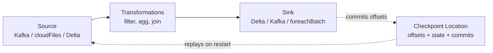

# Module 08 — Structured Streaming: Triggers, Output Modes, Checkpoints

> **Domain 3 (31%) — Data Processing & Transformations**
>
> **Exam objectives covered:**
> - Implement data pipelines using LDP (foundation).
> - DDL/DML features (streaming forms).
>
> **What you must walk away with:** The `readStream` / `writeStream` API. Triggers (`processingTime`, `availableNow`, deprecated `Once`, `continuous`, default). Output modes (`append`, `complete`, `update`). `checkpointLocation` semantics. Exactly-once. `foreachBatch`. The deprecation of `Trigger.Once`.

---

## Coverage map (verbatim July 25, 2025 objectives → where taught here)

| Verbatim objective | Taught in section |
|---|---|
| Implement data pipelines (streaming foundation for LDP) | §1 mental model; §2 readStream sources; §3 writeStream sinks + `.toTable`; §11 full Bronze pipeline |
| Identify DDL/DML features (streaming forms — `.toTable`, foreachBatch + MERGE) | §3 sinks + §8 `foreachBatch` |
| Classify cluster/configuration for streaming workloads | §4 triggers decision matrix + §10 query monitoring |
| Use debugging tools (streaming progress, checkpoint hygiene) | §6 checkpointLocation; §9 startingOffsets; §10 Spark UI Streaming tab |

Cross-references: Module 06 for Auto Loader trigger usage; Module 09 for watermarks and stateful operators; Module 10 for LDP-managed streaming (the declarative wrapper around these APIs).

---

## 1. The Structured Streaming mental model

Structured Streaming treats an unbounded stream as a continuously-growing table. Every micro-batch:

1. Reads new data since the last batch (from the source's offset tracking).
2. Applies the DataFrame transformations.
3. Writes the result to the sink.
4. Atomically commits the offsets to the **checkpoint location** so the same data won't be re-read.



The same DataFrame API works for batch and streaming — that's the magic of Structured Streaming. You replace `spark.read` with `spark.readStream` and `df.write` with `df.writeStream`, and the same transformations apply.

---

## 2. `readStream` — sources

```python
# From a Delta table
df = spark.readStream.table("main.bronze.orders")

# From Auto Loader (file-based)
df = (spark.readStream
        .format("cloudFiles")
        .option("cloudFiles.format", "json")
        .option("cloudFiles.schemaLocation", "/Volumes/main/_schemas/orders")
        .load("/Volumes/main/landing/orders/"))

# From Kafka
df = (spark.readStream
        .format("kafka")
        .option("kafka.bootstrap.servers", "broker:9092")
        .option("subscribe", "orders")
        .option("startingOffsets", "latest")
        .load())

# From Event Hubs (Azure)
df = (spark.readStream
        .format("eventhubs")
        .options(**ehConf)
        .load())

# From Kinesis (AWS)
df = (spark.readStream
        .format("kinesis")
        .option("streamName", "orders-stream")
        .option("region", "us-east-1")
        .load())
```

Each source has its own offset model:
- **Delta**: log version + index.
- **Auto Loader**: file path tracking in the schema/checkpoint.
- **Kafka**: topic + partition + offset.
- **Event Hubs / Kinesis**: shard sequence numbers.

---

## 3. `writeStream` — sinks

```python
# Delta sink (the most common)
(df.writeStream
   .format("delta")
   .option("checkpointLocation", "/Volumes/main/_chk/orders")
   .outputMode("append")
   .trigger(availableNow=True)
   .toTable("main.silver.orders"))

# Kafka sink
(df.writeStream
   .format("kafka")
   .option("kafka.bootstrap.servers", "broker:9092")
   .option("topic", "orders-out")
   .option("checkpointLocation", "/Volumes/main/_chk/orders_out")
   .start())

# foreachBatch — apply arbitrary batch operations per micro-batch
def upsert_batch(batch_df, batch_id):
    batch_df.createOrReplaceTempView("updates")
    spark.sql("""
        MERGE INTO main.silver.orders t
        USING updates s
        ON t.order_id = s.order_id
        WHEN MATCHED THEN UPDATE SET *
        WHEN NOT MATCHED THEN INSERT *
    """)

(df.writeStream
   .foreachBatch(upsert_batch)
   .option("checkpointLocation", "/Volumes/main/_chk/orders_merge")
   .trigger(availableNow=True)
   .start())
```

### The `.toTable` shortcut

`.toTable("catalog.schema.table")` is shorthand for `.format("delta").start()` against a UC table. Recommended for Delta sinks in UC.

---

## 4. Triggers — when does a micro-batch run?

The trigger defines the cadence.

### 4.1 Default — micro-batch ASAP

```python
.writeStream
# no .trigger() call
```

- Each batch starts as soon as the previous finishes.
- Lowest end-to-end latency at the cost of compute always running.
- Suitable for: always-on streams where latency matters.

### 4.2 `processingTime` — fixed cadence

```python
.trigger(processingTime="5 minutes")
.trigger(processingTime="30 seconds")
```

- Run a micro-batch every N time units.
- Compute is provisioned continuously (stream stays running).
- Suitable for: always-on streams with predictable cadence (e.g., Bronze → Silver every 5 minutes).

### 4.3 `availableNow` — modern batch trigger

```python
.trigger(availableNow=True)
```

- **Process all currently-available data, then stop.**
- Replaces the **deprecated `Trigger.Once`**.
- Suitable for: scheduled-job style ingestion. "Every hour, run, process whatever's new, exit."
- **Cheaper** than `processingTime` because compute isn't always-on — the Lakeflow Job spins up a job cluster, processes, and tears down.

### 4.4 `continuous` — experimental sub-second latency

```python
.trigger(continuous="1 second")
```

- Continuous execution, not micro-batch.
- Sub-second latency.
- Limited operator support (no stateful, limited aggregations).
- Rare on the exam.

### 4.5 `Trigger.Once` — DEPRECATED, do not pick

```python
# Deprecated form — do not write new code with this
.trigger(once=True)
```

- Was the "process all available data and exit" trigger pre-2024.
- Replaced by `availableNow` (which handles backlog batching more gracefully on large queues).
- If `Trigger.Once` appears in answer choices, treat it as a distractor for pre-2024 study material — pick `availableNow` instead.

### Trigger decision matrix

| Scenario | Trigger |
|----------|---------|
| Hourly scheduled job, process new files, exit | **`availableNow=True`** |
| Always-on stream, micro-batch every 5 min | **`processingTime="5 minutes"`** |
| Always-on stream, low latency | **default** (no trigger) |
| Sub-second latency, experimental | `continuous="1 second"` |
| "Trigger.Once" in answer | **Wrong / deprecated — pick `availableNow`** |

### ⚠️ Exam trap — `availableNow` vs `processingTime`

Common confusion: "scheduled hourly job" → wrongly pick `processingTime="1 hour"`. That keeps the stream running 24/7 with a 1-hour micro-batch cadence. The correct answer for **scheduled** processing is **`availableNow=True`**, fired by a scheduled Lakeflow Job — the job creates a cluster, runs the stream to completion, exits.

---

## 5. Output modes

The `outputMode("...")` controls what rows the writeStream produces per micro-batch.

### 5.1 `append` — only new rows (default for stateless)

```python
.outputMode("append")
```

- Only rows added in this micro-batch are written.
- The default for non-stateful queries (no aggregation).
- Works with all sinks that support append.

### 5.2 `complete` — full result table on every batch

```python
.outputMode("complete")
```

- The **entire current state** is written on each batch.
- **Requires aggregation** (`groupBy`) in the query — otherwise the result table would be unbounded.
- Memory-heavy at scale.
- Suitable for: small, bounded aggregate results that need to be fully refreshed each batch.

### 5.3 `update` — only changed rows

```python
.outputMode("update")
```

- Only rows that changed in this batch are written.
- Requires aggregation.
- Sink must support row-level updates (Delta with MERGE or `foreachBatch` does; some sinks don't).

### Decision matrix

| Query shape | Output mode |
|-------------|-------------|
| Stateless transformations (filter, project, join non-aggregated) | **`append`** |
| Aggregation, full state needed on each batch | **`complete`** |
| Aggregation, only changes needed | **`update`** |
| Stateful streaming aggregation with **watermarks** that finalize windows | `append` (windows become final and emit once) |

### ⚠️ Exam trap — `complete` mode requires aggregation

If a question has a `df.writeStream.outputMode("complete")` on a non-aggregated query — that errors at runtime. Watch for this distractor.

---

## 6. `checkpointLocation` — required for fault tolerance

```python
.option("checkpointLocation", "/Volumes/main/_chk/orders")
```

### What's stored

- **Offsets** — what data has been read from the source.
- **Commits** — what micro-batches have been successfully written.
- **State** (for stateful queries) — running aggregation state, deduplication keys.
- **Metadata** — query info.

### Why required

Without a checkpoint, the stream can't recover from a failure — it would re-read all source data and the sink could see duplicates. With a checkpoint, the stream:
1. On restart, reads the checkpoint.
2. Identifies the last committed batch.
3. Re-reads only data after that.
4. Combined with idempotent sinks (Delta), gets exactly-once.

### Rules

- **One checkpoint per writeStream.** Never share.
- **Cannot move/rename** without losing offsets. If you move the checkpoint, the stream re-reads from the source's beginning.
- **Deleting the checkpoint** = full reset. The stream restarts as if new — re-reads everything.
- **Storing the checkpoint in DBFS root** is a common anti-pattern. Use a UC Volume for governance.

### ⚠️ Exam trap — sharing checkpoints

A common scenario: developer copy-pastes two streaming queries, both with the same `checkpointLocation`. The streams **race and corrupt each other.** Always use a distinct checkpoint per stream.

---

## 7. Exactly-once semantics

Structured Streaming + Delta = exactly-once **end-to-end**, given:
1. The source supports replay (Delta, Kafka, Auto Loader — yes; some custom sources — no).
2. The checkpoint location is intact.
3. The sink is **idempotent** — Delta with append/overwrite is idempotent because the writer's commit is atomic and recorded.

For non-idempotent sinks (a REST API, an external DB without UPSERT), you typically use `foreachBatch` and implement your own exactly-once logic (e.g., MERGE keyed by `batch_id`).

### What "exactly-once" doesn't mean

- It doesn't mean each row is **processed** exactly once — a row may be processed multiple times in a retry.
- It means the **effect on the sink** is as if each row was processed exactly once.

For Delta sinks via `toTable`, you get this for free.

---

## 8. `foreachBatch` — escape hatch to batch operations

When you need to do something Structured Streaming's built-in sinks don't support (e.g., MERGE, multi-table writes, calls to external APIs), use `foreachBatch`:

```python
def process_batch(batch_df, batch_id):
    # batch_df is a regular DataFrame; you can use all batch APIs
    batch_df.createOrReplaceTempView("updates")
    spark.sql("""
        MERGE INTO main.silver.orders t
        USING updates s
        ON t.order_id = s.order_id
        WHEN MATCHED THEN UPDATE SET *
        WHEN NOT MATCHED THEN INSERT *
    """)

(df.writeStream
   .foreachBatch(process_batch)
   .option("checkpointLocation", "/Volumes/main/_chk/orders_merge")
   .trigger(availableNow=True)
   .start())
```

### Key properties

- `batch_df` is a regular **batch DataFrame** — apply any DataFrame or SQL operation.
- `batch_id` is unique and monotonically increasing per batch.
- The function **may run multiple times for the same batch_id** (on retries). Idempotency is your responsibility.
- The function blocks the next batch until it returns.

### Common use cases

- **MERGE into Delta** (the most frequent).
- **Multi-table writes** (write the same batch to two different tables).
- **External system writes** (REST API, RDBMS via JDBC).

### ⚠️ Exam trap — `foreachBatch` vs `foreach`

- **`foreachBatch(batch_df, batch_id)`** — per-batch, gets a DataFrame. Use this.
- **`foreach(row)`** — per-row, gets a Row. Slow and rarely the right answer.

For exam purposes, default to `foreachBatch` if you see "MERGE inside a stream" or "custom sink logic."

---

## 9. Reading the source — `startingOffsets` and resume behavior

For sources that support replay (Kafka, Auto Loader), you can configure where to start:

```python
# Kafka
.option("startingOffsets", "latest")    # default — start from current end
.option("startingOffsets", "earliest")  # replay everything
.option("startingOffsets", """{"topic":{"0":42,"1":-1,"2":-2}}""")  # per-partition

# Auto Loader (file-based)
# Starting position is "all files currently in the source" by default
# Use cloudFiles.includeExistingFiles=false to skip existing
.option("cloudFiles.includeExistingFiles", "false")
```

On restart with an existing checkpoint, `startingOffsets` is **ignored** — the stream resumes from the checkpoint's committed offsets.

---

## 10. Query monitoring

### Query progress (programmatic)

```python
query = (df.writeStream
            .option("checkpointLocation", "/Volumes/...")
            .toTable("..."))

print(query.lastProgress)
print(query.recentProgress)
print(query.status)
query.awaitTermination()
```

### Spark UI — Streaming Query tab

Every running streaming query gets a row in the Spark UI's Structured Streaming tab with:
- Input rate (rows/sec from source).
- Process rate (rows/sec processed).
- Batch duration.
- Operation duration breakdown.

Diagnostics:
- **Input rate >> Process rate** → backlog growing. Add executors or speed up transformations.
- **Process rate dropping** → state store getting heavy. Check watermarks (Module 09).
- **Batch duration spikes** → skew or GC. Check Stages tab.

---

## 11. Full streaming Bronze pipeline

```python
from pyspark.sql.functions import col, current_timestamp

# Source: Auto Loader on JSON files
bronze_src = (spark.readStream
                .format("cloudFiles")
                .option("cloudFiles.format", "json")
                .option("cloudFiles.schemaLocation", "/Volumes/main/_schemas/orders")
                .option("cloudFiles.schemaEvolutionMode", "addNewColumns")
                .load("/Volumes/main/landing/orders/"))

# Transform: add audit columns
bronze = (bronze_src
            .withColumn("ingest_ts", current_timestamp())
            .withColumn("source_file", col("_metadata.file_path")))

# Sink: Delta table, scheduled-batch trigger
query = (bronze.writeStream
            .format("delta")
            .option("checkpointLocation", "/Volumes/main/_chk/orders_bronze")
            .outputMode("append")
            .trigger(availableNow=True)
            .toTable("main.bronze.orders"))

query.awaitTermination()
```

---

## 12. Mini quiz (cold)

1. A scheduled hourly job should process all currently-arrived files and exit. Which trigger?
2. An always-on stream should micro-batch every 30 seconds. Which trigger?
3. `Trigger.Once` is in the answers. Should you pick it?
4. You're writing a stateless filter+project stream to Delta. Which `outputMode`?
5. You're aggregating with `groupBy` and want the full state on each batch. Which `outputMode`?
6. What happens if you delete the `checkpointLocation` directory?
7. Two streaming queries share a `checkpointLocation`. What goes wrong?
8. You need to MERGE the streaming output into a target Delta table. Which writeStream sink mechanism?
9. What's the difference between `foreach` and `foreachBatch`?

### Answers

1. **`.trigger(availableNow=True)`** — process all available, then exit.
2. **`.trigger(processingTime="30 seconds")`** — fixed cadence, stream stays running.
3. **No.** `Trigger.Once` is deprecated; pick `availableNow` instead.
4. **`append`** — the default; no aggregation means no need for `complete` or `update`.
5. **`complete`** — full state on each batch (requires aggregation).
6. **The stream resets.** On restart it re-reads from the source's earliest available offset (or earliest existing files for Auto Loader). Possible duplicates depending on sink idempotency.
7. **They corrupt each other.** Each writes offsets and commits to the same location; reads are racy. Use distinct checkpoint paths per query.
8. **`foreachBatch`** — gets a batch DataFrame and a batch_id; use it to run SQL MERGE (or any batch operation).
9. **`foreachBatch(batch_df, batch_id)`** — per micro-batch, gets a DataFrame. **`foreach(row)`** — per-row, gets a Row. `foreachBatch` is the practical answer.

---

## 13. Sanity check before moving on

You should be able to:
- Recite the four useful triggers (`default`, `processingTime`, `availableNow`, `continuous`) and that `Trigger.Once` is deprecated.
- Map "scheduled job" → `availableNow`, "always-on cadence" → `processingTime`.
- Recite the three output modes and their requirements.
- State that `checkpointLocation` is required and unique per stream.
- Pick `foreachBatch` for MERGE-into-Delta scenarios.

If any of those are fuzzy, re-read Sections 4, 5, and 8.
