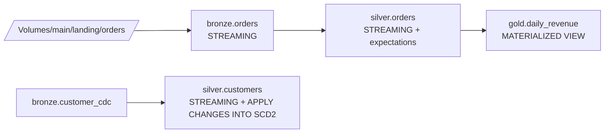

# Module 10 — Lakeflow Declarative Pipelines (formerly Delta Live Tables / DLT)

> **Domain 3 (31%) — Data Processing & Transformations** — THE flagship topic
>
> **Exam objectives covered:**
> - **Emphasize the advantages of LDP for ETL.**
> - **Implement data pipelines using LDP.**
> - Identify DDL/DML features.
>
> **What you must walk away with:** What LDP is. The DLT → LDP rebrand (backward compatible). STREAMING TABLE vs MATERIALIZED VIEW. APPLY CHANGES INTO (SCD1 / SCD2). Expectations (DROP ROW / FAIL UPDATE / default warn). Pipeline modes (Triggered vs Continuous). When LDP beats hand-rolled Structured Streaming.

---

## Coverage map (verbatim July 25, 2025 objectives → where taught here)

| Verbatim objective | Taught in section |
|---|---|
| Emphasize the advantages of LDP for ETL | §2 "What LDP is" + §12 "LDP vs Structured Streaming" |
| Implement data pipelines using LDP | §3 STREAMING TABLE vs MATERIALIZED VIEW; §4 Python API; §6 APPLY CHANGES INTO (SCD1/SCD2 SQL + Python); §7 referencing LIVE/STREAM; §8 Triggered vs Continuous; §11 full Bronze→Silver→Gold pipeline |
| Identify DDL features (CREATE OR REFRESH STREAMING TABLE / MATERIALIZED VIEW, APPLY CHANGES INTO) | §3, §6, §7 |
| (Cross-domain) Data quality expectations within LDP | §5 "Expectations" — actions, decorators, quarantine — and Module 11 deep-dive |
| Use serverless for hands-off auto-managed compute | §9 "Serverless LDP — the post-July-2025 default" |
| DLT → LDP rebrand recognition (post-2025 syntax preference) | §1 "The rebrand — DLT became LDP in July 2025" |

Cross-references: Module 06 for Auto Loader `read_files` inside LDP; Module 08/09 for Structured Streaming foundations; Module 11 for expectations deep-dive; Module 12 for the Lakeflow Job that runs the pipeline.

---

## 1. The rebrand — DLT became LDP in July 2025

**Delta Live Tables (DLT) → Lakeflow Declarative Pipelines (LDP).** The rename is a product/marketing change; the engine is the same.

| What | Old name (still works) | New name |
|------|------------------------|----------|
| Product | Delta Live Tables (DLT) | Lakeflow Declarative Pipelines (LDP) |
| Python import | `import dlt` | `from pyspark import pipelines as dp` |
| Python decorator | `@dlt.table`, `@dlt.view` | `@dp.table`, `@dp.materialized_view` |
| SQL statement | `CREATE LIVE TABLE` | `CREATE OR REFRESH STREAMING TABLE` / `MATERIALIZED VIEW` |
| Internal table reference | `LIVE.<name>` | `LIVE.<name>` (still) or direct table name |

### Backward compatibility — what runs

- `import dlt` still imports the legacy DLT Python API.
- `CREATE LIVE TABLE` still parses and runs.
- All existing DLT pipelines run unchanged.

### What the exam expects

Multiple-choice answers prefer the LDP form. If two answers are functionally identical but one uses `@dlt.table` and the other uses `@dp.table` / `CREATE OR REFRESH STREAMING TABLE`, **pick the new form.** The `@dlt`/`CREATE LIVE` distractor catches candidates who studied with pre-July-2025 material.

### ⚠️ Exam trap — `CREATE LIVE TABLE` in answers

If an answer says `CREATE LIVE TABLE foo AS SELECT …`, that's the legacy syntax. The exam-preferred form is `CREATE OR REFRESH STREAMING TABLE foo AS SELECT … FROM STREAM(...)`. Both run, but the new form is the right answer.

---

## 2. What LDP is

LDP is a **declarative framework** for building ETL pipelines on Delta. You declare:
- Which tables your pipeline produces.
- Where each table's data comes from (SQL or PySpark).
- Data-quality expectations on each table.

LDP figures out:
- The **dependency graph** among tables (which depends on which).
- **Execution order** and parallelism.
- **Incremental** processing where appropriate.
- **CDC** bookkeeping via `APPLY CHANGES INTO`.
- **Streaming** state, watermarks, checkpoints.
- **Failure / restart** semantics.
- **Schema enforcement** and evolution.

You don't write `spark.readStream`, `writeStream`, `checkpointLocation`, or DAG-orchestration code. You write SQL or decorated Python functions that describe **what each table should contain**, and LDP figures out **how to materialize them.**

---

## 3. The two table types — STREAMING TABLE vs MATERIALIZED VIEW

### 3.1 STREAMING TABLE — incremental

```sql
CREATE OR REFRESH STREAMING TABLE main.bronze.orders
AS SELECT *,
          _metadata.file_path AS source_file,
          current_timestamp() AS ingest_ts
   FROM STREAM read_files(
     '/Volumes/main/landing/orders/',
     format => 'json'
   );
```

- Each pipeline update processes **only new data** since the last update.
- Source must support streaming (Delta with CDF, Auto Loader, Kafka, another LDP streaming table, etc.).
- Use `STREAM(<source>)` to read incrementally.
- Right choice for: append-only Bronze tables, incrementally-built Silver tables.

### 3.2 MATERIALIZED VIEW — full recompute

```sql
CREATE OR REFRESH MATERIALIZED VIEW main.gold.daily_revenue
AS SELECT
     DATE(order_ts) AS event_date,
     SUM(amount)    AS total_revenue,
     COUNT(DISTINCT order_id) AS total_invoices,
     COUNT(DISTINCT customer_id) AS unique_customers
   FROM main.silver.orders
   GROUP BY DATE(order_ts);
```

- On each pipeline update, the materialized view is **fully recomputed** (with smart incremental recomputation under the hood when possible).
- Source can be any table.
- Right choice for: aggregations, joins, GROUP BY results, Gold-layer tables.

### When to use which

| Need | Choice |
|------|--------|
| Bronze table receiving streaming files | **STREAMING TABLE** |
| Silver table that incrementally builds from Bronze | **STREAMING TABLE** (using STREAM source) |
| Gold table aggregating from Silver | **MATERIALIZED VIEW** |
| Table that joins streaming Bronze with batch dimension | Hybrid — STREAMING TABLE for the streaming join |

### ⚠️ Exam trap — STREAMING TABLE vs MATERIALIZED VIEW

Quick decision rule:
- **Incremental, append-only flow** → STREAMING TABLE.
- **Aggregation / full-table computation** → MATERIALIZED VIEW.

If a question describes "aggregating daily revenue from a Silver table," the answer is **MATERIALIZED VIEW** — aggregation is a recompute, not a stream.

---

## 4. The Python API

```python
from pyspark import pipelines as dp

@dp.table
def bronze_orders():
    return (spark.readStream
              .format("cloudFiles")
              .option("cloudFiles.format", "json")
              .option("cloudFiles.schemaLocation", "/Volumes/main/_schemas/orders")
              .load("/Volumes/main/landing/orders/"))

@dp.table
def silver_orders():
    return (dp.read_stream("bronze_orders")
              .filter("order_id IS NOT NULL")
              .withColumnRenamed("amt", "amount"))

@dp.materialized_view
def gold_daily_revenue():
    return (spark.read.table("LIVE.silver_orders")
              .groupBy("event_date")
              .agg(_sum("amount").alias("total_revenue")))
```

Decorators:
- `@dp.table` — produces a STREAMING TABLE (if the function reads with `spark.readStream`) or a MATERIALIZED VIEW (if it reads batch).
- `@dp.materialized_view` — explicit materialized view.
- `@dp.view` — temporary view (intermediate result, not materialized as a Delta table).

### Backward-compatible legacy form

```python
import dlt

@dlt.table
def bronze_orders():
    return spark.readStream.format("cloudFiles")...

@dlt.view
def temp_view():
    return spark.read.table("LIVE.bronze_orders")...
```

This still works. The exam-preferred form is the new `dp` API, but legacy answers are not "wrong" — just less modern.

---

## 5. Expectations — data quality

Expectations are **declarative quality checks** with three possible actions on violation.

### 5.1 SQL expectations

```sql
CREATE OR REFRESH STREAMING TABLE main.silver.orders (
  CONSTRAINT valid_id     EXPECT (order_id IS NOT NULL) ON VIOLATION DROP ROW,
  CONSTRAINT positive_amt EXPECT (amount > 0) ON VIOLATION FAIL UPDATE,
  CONSTRAINT recent_date  EXPECT (order_ts >= '2020-01-01')   -- default: WARN
)
AS SELECT * FROM STREAM(LIVE.bronze_orders);
```

Three actions:

| Action | What happens on violation |
|--------|---------------------------|
| Default (no `ON VIOLATION`) | **Log** the violation (count visible in event log); **keep the row** |
| `ON VIOLATION DROP ROW` | **Drop** the row from the output; log the violation |
| `ON VIOLATION FAIL UPDATE` | **Fail the entire pipeline update** — no rows written |

### 5.2 Python expectations

```python
@dp.table
@dp.expect("valid_id", "order_id IS NOT NULL")                       # warn
@dp.expect_or_drop("positive_amt", "amount > 0")                     # drop row
@dp.expect_or_fail("recent_date", "order_ts >= '2020-01-01'")       # fail update
def silver_orders():
    return dp.read_stream("bronze_orders")
```

Decorator → SQL mapping:
- `@dp.expect("name", "cond")` ↔ `CONSTRAINT name EXPECT (cond)` (default warn)
- `@dp.expect_or_drop("name", "cond")` ↔ `… ON VIOLATION DROP ROW`
- `@dp.expect_or_fail("name", "cond")` ↔ `… ON VIOLATION FAIL UPDATE`
- `@dp.expect_all`, `@dp.expect_all_or_drop`, `@dp.expect_all_or_fail` — accept dict of name→condition

### 5.3 Quarantine pattern

You can capture bad rows separately:

```sql
CREATE OR REFRESH STREAMING TABLE main.silver.orders
  (CONSTRAINT valid_id EXPECT (order_id IS NOT NULL) ON VIOLATION DROP ROW)
AS SELECT * FROM STREAM(LIVE.bronze_orders);

CREATE OR REFRESH STREAMING TABLE main.quarantine.orders_bad
AS SELECT * FROM STREAM(LIVE.bronze_orders) WHERE order_id IS NULL;
```

The main table drops bad rows; the quarantine table collects them for human review.

### ⚠️ Exam trap — expectation actions

A common trap: candidate sees `ON VIOLATION DROP` and thinks the row is silently lost. Bad rows are **counted in the pipeline event log** (queryable). DROP ROW doesn't mean "lose visibility" — it means "exclude from output but record the violation."

---

## 6. `APPLY CHANGES INTO` — the CDC workhorse

`APPLY CHANGES INTO` (a.k.a. AutoCDC) is the LDP-canonical CDC mechanism. It replaces hand-rolled MERGE for change-data sources.

### 6.1 SCD Type 1 — overwrite history

```sql
CREATE OR REFRESH STREAMING TABLE LIVE.customers;

APPLY CHANGES INTO LIVE.customers
FROM STREAM(LIVE.bronze_customer_cdc)
KEYS (customer_id)
APPLY AS DELETE WHEN op = 'D'
SEQUENCE BY ts
COLUMNS * EXCEPT (op, ts)
STORED AS SCD TYPE 1;
```

- The target table holds the **latest version** of each row.
- `KEYS (customer_id)` — the primary key for matching.
- `SEQUENCE BY ts` — used to determine which event is newer when multiple events for the same key arrive in the same batch.
- `APPLY AS DELETE WHEN op = 'D'` — rows with `op = 'D'` are deletes.
- `COLUMNS * EXCEPT (op, ts)` — write all source columns except `op` and `ts` to the target.

### 6.2 SCD Type 2 — preserve history

```sql
CREATE OR REFRESH STREAMING TABLE LIVE.customers_history;

APPLY CHANGES INTO LIVE.customers_history
FROM STREAM(LIVE.bronze_customer_cdc)
KEYS (customer_id)
APPLY AS DELETE WHEN op = 'D'
SEQUENCE BY ts
COLUMNS * EXCEPT (op, ts)
STORED AS SCD TYPE 2;
```

- The target table holds **all versions** of each row, with `__START_AT` and `__END_AT` timestamps.
- An update closes the prior row (sets `__END_AT`) and inserts a new row.
- A delete closes the prior row (sets `__END_AT`).
- Query "current" view: `WHERE __END_AT IS NULL`.

### 6.3 Python API equivalent

```python
@dp.table
def customers():
    pass

dp.apply_changes(
    target="customers",
    source="bronze_customer_cdc",
    keys=["customer_id"],
    sequence_by="ts",
    apply_as_deletes=expr("op = 'D'"),
    except_column_list=["op", "ts"],
    stored_as_scd_type=1
)
```

### ⚠️ Exam trap — APPLY CHANGES INTO vs MERGE inside LDP

Inside an LDP pipeline, the exam-canonical CDC answer is **APPLY CHANGES INTO**. MERGE INTO is for non-LDP code. If a question describes "implementing SCD Type 2 in an LDP pipeline" and one answer is a hand-rolled MERGE, **it's wrong** — APPLY CHANGES INTO with `STORED AS SCD TYPE 2` is right.

---

## 7. Referencing tables within an LDP pipeline

Inside an LDP SQL pipeline, you can reference other tables in the same pipeline:

```sql
-- Legacy / explicit LIVE prefix
FROM LIVE.bronze_orders
FROM STREAM(LIVE.bronze_orders)

-- Newer / direct name (resolution against the pipeline catalog)
FROM main.bronze.orders
FROM STREAM(main.bronze.orders)
```

`LIVE.<name>` was the original DLT syntax. Newer LDP supports direct catalog.schema.table references.

When reading another LDP **streaming** table incrementally, wrap in `STREAM(...)`:

```sql
FROM STREAM(LIVE.bronze_orders)
```

When reading a **batch** view (materialized view or non-streaming table), no STREAM:

```sql
FROM LIVE.silver_orders
```

---

## 8. Pipeline modes — Triggered vs Continuous

When you start an LDP update, you choose a mode:

### 8.1 Triggered (default)

- Pipeline starts, processes all new data through the DAG, **stops**.
- Cheaper — compute spins down between updates.
- Right for: scheduled refresh ("every hour, update the pipeline").

### 8.2 Continuous

- Pipeline runs **continuously**, low-latency.
- Streaming tables update as new data arrives.
- Materialized views update on a cadence.
- Compute stays up.
- Right for: real-time / sub-minute latency needs.

The mode is set in the pipeline config (UI or DAB resource), not in the SQL/Python code.

---

## 9. Serverless LDP — the post-July-2025 default

LDP pipelines can run on:
- **Classic compute** — you provision a cluster spec.
- **Serverless** — Databricks-managed, "Standard mode."

Serverless LDP is the **new default** per the July 2025 Lakeflow announcement, reportedly ~26% lower TCO.

For the exam: if a question mentions "hands-off / auto-managed / no cluster configuration" with LDP, the answer is **serverless LDP**.

---

## 10. Pipeline event log

Every LDP pipeline emits a structured **event log** captured to a queryable Delta table:

```sql
SELECT *
FROM event_log('<pipeline_id>')
WHERE event_type = 'data_quality'
ORDER BY timestamp DESC;
```

Event types include:
- `data_quality` — expectation violations (count per CONSTRAINT)
- `flow_progress` — per-table progress
- `update_progress` — pipeline-level progress
- `user_action` — manual interventions
- `system` — engine events

Use it to debug failed updates and to audit data quality over time.

---

## 11. A complete LDP pipeline — Bronze → Silver → Gold

```sql
-- ============== BRONZE ==============
CREATE OR REFRESH STREAMING TABLE main.bronze.orders
COMMENT "Raw orders landed via Auto Loader."
AS SELECT
     *,
     _metadata.file_path AS source_file,
     current_timestamp() AS ingest_ts
   FROM STREAM read_files(
     '/Volumes/main/landing/orders/',
     format        => 'json',
     schemaHints   => 'order_id LONG, amount DECIMAL(18,2)',
     schemaEvolutionMode => 'addNewColumns'
   );

-- ============== SILVER (typed, deduped, quality-checked) ==============
CREATE OR REFRESH STREAMING TABLE main.silver.orders (
  CONSTRAINT valid_id        EXPECT (order_id IS NOT NULL) ON VIOLATION DROP ROW,
  CONSTRAINT positive_amount EXPECT (amount > 0)           ON VIOLATION DROP ROW,
  CONSTRAINT recent_date     EXPECT (order_ts >= '2020-01-01')
)
COMMENT "Cleaned and typed orders."
AS SELECT
     order_id,
     customer_id,
     CAST(amount AS DECIMAL(18,2)) AS amount,
     TO_TIMESTAMP(order_ts) AS order_ts,
     ingest_ts
   FROM STREAM(LIVE.bronze_orders);

-- ============== SILVER CDC (customer dimension via APPLY CHANGES INTO) ==============
CREATE OR REFRESH STREAMING TABLE main.silver.customers;

APPLY CHANGES INTO LIVE.customers
FROM STREAM(LIVE.bronze_customer_cdc)
KEYS (customer_id)
APPLY AS DELETE WHEN op = 'D'
SEQUENCE BY ts
COLUMNS * EXCEPT (op, ts)
STORED AS SCD TYPE 2;

-- ============== GOLD (daily aggregations) ==============
CREATE OR REFRESH MATERIALIZED VIEW main.gold.daily_revenue
COMMENT "Daily revenue and invoice counts."
AS SELECT
     DATE(order_ts) AS event_date,
     SUM(amount)                AS total_revenue,
     COUNT(DISTINCT order_id)   AS total_invoices,
     COUNT(DISTINCT customer_id) AS unique_customers
   FROM LIVE.silver_orders
   GROUP BY DATE(order_ts);
```



---

## 12. LDP vs Structured Streaming — when to choose which

| Need | Choice |
|------|--------|
| Multi-table ETL DAG with dependency management | **LDP** |
| Data-quality expectations declaratively | **LDP** |
| CDC into SCD1/SCD2 declaratively | **LDP (APPLY CHANGES INTO)** |
| Single one-off streaming query | Plain Structured Streaming |
| Custom sink (REST API, JDBC, Kafka) | Plain Structured Streaming + `foreachBatch` |
| Heavy custom state logic (`mapGroupsWithState`) | Plain Structured Streaming |

For the exam: **default to LDP** for any "build a pipeline" scenario. Pick plain Structured Streaming only when the question explicitly needs `foreachBatch`, custom sink, or stateful operators LDP doesn't natively support.

---

## 13. Mini quiz (cold)

1. The exam shows an answer using `@dlt.table` and another using `@dp.table`. Which is the exam-preferred form?
2. You're building a daily-aggregated Gold table from a Silver Delta table. STREAMING TABLE or MATERIALIZED VIEW?
3. You're building an incremental Bronze table from Auto Loader. STREAMING TABLE or MATERIALIZED VIEW?
4. Inside LDP, you need to upsert CDC events with SCD Type 2 history. Which command?
5. A bad row should fail the entire pipeline update. Which expectation action?
6. A bad row should be dropped but the pipeline continue. Which expectation action?
7. A bad row should be kept and the violation just logged. Which expectation action?
8. LDP serverless was made default in which release?
9. To read another streaming table incrementally inside the same LDP pipeline, what do you wrap it in?

### Answers

1. **`@dp.table`** — the new LDP form. `@dlt.table` still runs but is legacy.
2. **MATERIALIZED VIEW** — aggregation is a recompute, not a stream.
3. **STREAMING TABLE** — incremental from a streaming source.
4. **`APPLY CHANGES INTO` with `STORED AS SCD TYPE 2`** — declarative CDC. Not a hand-rolled MERGE.
5. **`ON VIOLATION FAIL UPDATE`** — fails the pipeline.
6. **`ON VIOLATION DROP ROW`** — drops the row, pipeline continues.
7. **Default (no `ON VIOLATION` clause)** — logs and keeps the row.
8. **July 2025** (Lakeflow Declarative Pipelines refresh).
9. **`STREAM(LIVE.<name>)`** — wraps the streaming table reference for incremental reads.

---

## 14. Sanity check before moving on

You should be able to:
- Distinguish DLT vs LDP names and pick LDP forms on multiple-choice answers.
- Choose STREAMING TABLE vs MATERIALIZED VIEW based on whether the table is incremental or recomputed.
- Write a `CREATE OR REFRESH STREAMING TABLE … FROM STREAM(...)` from memory.
- Write an `APPLY CHANGES INTO … STORED AS SCD TYPE 1|2` from memory.
- Recite the three expectation actions (warn / drop / fail).
- Pick LDP over hand-rolled Structured Streaming for multi-table ETL.

If any of those are fuzzy, re-read Sections 1, 3, 5, and 6.
