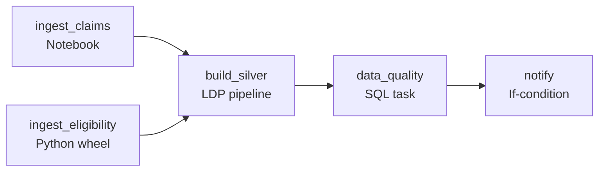
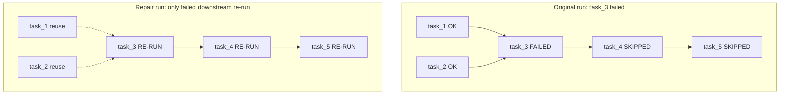

# Module 12 — Lakeflow Jobs (formerly Workflows / Multi-Task Jobs)

> **Domain 4 (18%) — Productionizing Data Pipelines**
>
> **Exam objectives covered:**
> - Deploy a workflow, **repair and rerun a task** in case of failure.
> - Use **serverless** for hands-off, auto-optimized compute.
> - (Indirectly) Identify the difference between DAB and traditional deployment.
>
> **What you must walk away with:** What a Lakeflow Job is. Task types. Dependencies (`depends_on`). Parameters and task values. **Repair runs.** Triggers (scheduled, file-arrival, continuous). Job cluster vs all-purpose vs serverless cost trap. The 2024 rename Workflows → Lakeflow Jobs.

---

## Coverage map (verbatim July 25, 2025 objectives → where taught here)

| Verbatim objective | Taught in section |
|---|---|
| Deploy a workflow, repair, and rerun a task in case of failure | §8 "Repair runs — THE high-yield exam feature" + §7 retries + §3 failure propagation + `run_if` |
| Use serverless for a hands-off, auto-optimized compute managed by Databricks | §6.3 "Serverless" + §6 decision matrix |
| Identify cluster/configuration for optimal performance (job vs all-purpose vs serverless) | §6 "Compute per task — the cost trap" + decision matrix |
| Identify DDL/DML features (task graph, depends_on, run_if, taskValues) | §2 task types; §3 dependencies; §4 parameters + taskValues; §5 triggers (cron, file_arrival, continuous, manual); §10 concurrency + run_as; §11 for-each |
| Sample question pattern — file-arrival vs cron trigger | §5.2 "File arrival" + §5 exam-trap |

Cross-references: Module 10 for the LDP pipeline the Job triggers; Module 13 for the DAB YAML that ships the Job; Module 14 for run history + system tables.

---

## 1. What a Lakeflow Job is

A **Lakeflow Job** (previously called "Workflow" or "Multi-Task Job," sometimes still "Job") is a **DAG of tasks** orchestrated by the Databricks scheduler.



Each box is a **task**. Edges are `depends_on` relationships. The job has scheduling, retries, alerting, parameterization — exactly like a standalone orchestrator (Airflow, Argo) but Databricks-native.

The rename history: "Job" → "Workflow" (2023) → "Lakeflow Job" (2024+). All three names refer to the same thing. The exam prefers **Lakeflow Job**.

---

## 2. Task types

| Task type | What it runs |
|-----------|--------------|
| **Notebook** | A Databricks notebook |
| **Python script** | A `.py` file in the workspace or Git folder |
| **Python wheel** | An installed wheel + entry point |
| **SQL** | A saved SQL query, a dashboard refresh, or an alert |
| **Pipeline** | A Lakeflow Declarative Pipeline (runs an LDP update) |
| **JAR** | A Spark JAR with a main class |
| **Spark Submit** | Arbitrary spark-submit command |
| **dbt** | A dbt project task |
| **If/Else condition** | Conditional gate based on previous task values |
| **For-each** | Iterate a child task over a list of parameter values |

For the exam, **Notebook**, **Pipeline**, **Python wheel**, **If/Else**, and **For-each** are the most relevant.

### ⚠️ Exam trap — "Pipeline task" is the LDP runner

A Lakeflow Job can run an LDP pipeline as one of its tasks. This is the canonical pattern:

- Lakeflow Job triggers hourly (cron or file-arrival).
- Job has a single **Pipeline task** that runs the LDP pipeline.
- LDP does the actual ETL.

Don't confuse "Lakeflow Job" with "Lakeflow Declarative Pipeline" — the Job is the orchestrator, the Pipeline is what it runs.

---

## 3. Dependencies — building the DAG

```yaml
# Asset Bundle resource: a job with three tasks
resources:
  jobs:
    daily_etl:
      name: daily_etl
      tasks:
        - task_key: ingest_orders
          notebook_task:
            notebook_path: ./src/ingest/orders.py

        - task_key: ingest_customers
          notebook_task:
            notebook_path: ./src/ingest/customers.py

        - task_key: build_silver
          depends_on:
            - task_key: ingest_orders
            - task_key: ingest_customers
          pipeline_task:
            pipeline_id: ${resources.pipelines.silver_ldp.id}

        - task_key: data_quality
          depends_on:
            - task_key: build_silver
          notebook_task:
            notebook_path: ./src/checks/run.py
```

Tasks with no `depends_on` are **root tasks** (run first). Downstream tasks wait for **all** their dependencies.

### Failure propagation

By default, if a task fails, its downstream tasks are **skipped** (not failed). The skipped tasks show "Upstream failed" in the run UI.

You can override this with `run_if`:
- `ALL_SUCCESS` (default) — only run if all upstream succeeded
- `ALL_DONE` — run regardless of upstream success/failure (e.g., a cleanup task)
- `AT_LEAST_ONE_SUCCESS` — run if at least one upstream succeeded
- `ALL_FAILED` — only run if all upstream failed (e.g., a failure-handler)
- `AT_LEAST_ONE_FAILED` — run if any upstream failed

---

## 4. Parameters — passing values to tasks

### 4.1 Job-level parameters

```yaml
jobs:
  daily_etl:
    parameters:
      - name: env
        default: dev
      - name: target_date
        default: "{{job.start_time.iso_date}}"
    tasks:
      - task_key: ingest_orders
        notebook_task:
          notebook_path: ./src/ingest/orders.py
          base_parameters:
            env: ${var.env}
            date: ${var.target_date}
```

Inside the notebook:

```python
dbutils.widgets.text("env", "dev")
dbutils.widgets.text("date", "")
env = dbutils.widgets.get("env")
date = dbutils.widgets.get("date")
```

### 4.2 Task values — passing between tasks

```python
# Task A (upstream)
result_count = 4242
dbutils.jobs.taskValues.set(key="row_count", value=result_count)
```

```python
# Task B (downstream)
upstream_count = dbutils.jobs.taskValues.get(
    taskKey="task_a",
    key="row_count",
    default=0,
    debugValue=0
)
```

Use for: passing computed values (counts, file paths, dates) between tasks in the same job run.

### 4.3 Template substitution

Task parameters can use template variables:

```
{{job.id}}
{{job.run_id}}
{{job.start_time.iso_date}}        # 2026-05-23
{{job.start_time.iso_datetime}}    # 2026-05-23T10:00:00Z
{{job.parameters.<name>}}
{{tasks.<task_key>.values.<key>}}  # task value from upstream
{{tasks.<task_key>.run_id}}
```

These resolve at task launch time. Common pattern: pass `target_date = {{job.start_time.iso_date}}` to a notebook.

---

## 5. Triggers

### 5.1 Scheduled — cron

```yaml
schedule:
  quartz_cron_expression: "0 0 6 * * ?"   # daily at 06:00 in the timezone below
  timezone_id: "America/Chicago"
  pause_status: "UNPAUSED"
```

Standard Quartz cron syntax (note: Quartz includes seconds as the first field; `0 0 6 * * ?` = sec=0, min=0, hour=6, day-of-month=any, month=any, day-of-week=any).

### 5.2 File arrival — trigger on new file in storage

```yaml
trigger:
  file_arrival:
    url: /Volumes/main/landing/orders/
    min_time_between_triggers_seconds: 60
    wait_after_last_change_seconds: 30
```

When new files land in the URL (UC Volume or external location), the job triggers. Useful for: event-driven ingestion without polling.

### 5.3 Continuous

```yaml
continuous:
  pause_status: "UNPAUSED"
```

The job runs continuously — when a run finishes, a new one starts immediately. Used for long-running streaming jobs that don't fit the LDP continuous mode.

### 5.4 Manual / API

Tasks triggered manually from the UI or via REST API (`/api/2.1/jobs/run-now`).

### ⚠️ Exam trap — file-arrival trigger vs cron

A question describes "trigger ingestion whenever new files appear in S3, no polling." That's **file-arrival trigger**. Cron-on-the-minute is a poll-style approximation; file-arrival is event-driven.

---

## 6. Compute per task — the cost trap

Each task picks its compute:

### 6.1 All-purpose cluster

```yaml
- task_key: my_task
  existing_cluster_id: 1234-567890-abc
  notebook_task:
    notebook_path: ./src/notebook.py
```

- **Expensive** (~$0.55/DBU range).
- Shared with interactive notebooks → resource contention.
- **Wrong** for scheduled jobs.

### 6.2 Job cluster — created per job

```yaml
- task_key: my_task
  job_cluster_key: small
  notebook_task:
    notebook_path: ./src/notebook.py

job_clusters:
  - job_cluster_key: small
    new_cluster:
      spark_version: "15.4.x-scala2.12"
      node_type_id: "Standard_DS3_v2"
      num_workers: 2
```

- **Cheaper** (~half the DBU of all-purpose).
- Ephemeral — created at job start, terminated at job end.
- **Right** for scheduled / repeating jobs.

### 6.3 Serverless

```yaml
- task_key: my_task
  # no cluster spec — serverless is implicit if configured
  notebook_task:
    notebook_path: ./src/notebook.py
  environment_key: default
```

- **Hands-off** — Databricks manages.
- Sub-30s startup.
- **Right** for any "auto-managed" scenario.

### Decision matrix

| Scenario | Cluster choice |
|----------|----------------|
| Daily scheduled ETL, cost-sensitive | **Job cluster** |
| "Hands-off, auto-optimized" in prompt | **Serverless** |
| Always-on continuous streaming | Job cluster (long-running) or serverless |
| Reuse an existing cluster "because it's already up" | **WRONG** — pick job cluster |

### ⚠️ Exam trap — using an existing all-purpose cluster

If a scenario says "the team already has an all-purpose cluster running; should the scheduled job use it?" the answer is **no, create a job cluster** (or serverless). All-purpose clusters are interactive-priced and shared.

---

## 7. Retries

```yaml
- task_key: flaky_api_call
  notebook_task:
    notebook_path: ./src/api/fetch.py
  max_retries: 3
  min_retry_interval_millis: 60000      # 1 minute between retries
  retry_on_timeout: true
```

- `max_retries` — total retry attempts (0 = no retries).
- `min_retry_interval_millis` — minimum wait between retries.
- `retry_on_timeout` — retry on task timeout.

Configure on **transient-failure-prone tasks** (network calls, occasional cloud throttling).

---

## 8. Repair runs — THE high-yield exam feature

When a multi-task job has a task fail, the downstream tasks are skipped. The natural fix is to re-run, but re-running the full job is wasteful (the upstream tasks already succeeded).

**Repair Run** lets you re-run **only the failed and skipped tasks** while keeping the upstream tasks' successful outputs.



### How to repair

- UI: Lakeflow Jobs → Run → "Repair run" button.
- API: `POST /api/2.1/jobs/runs/repair` with `rerun_tasks: [task_key, ...]`.

Per-task choices:
- **Re-run failed tasks only.**
- **Re-run all tasks** (full re-run, but as a "repair" attached to the original run).
- **Re-run from a specific task** downstream.

You can also **change task parameters** in the repair (useful when the cause was a wrong parameter).

### ⚠️ Exam trap — "repair" vs "run now"

- **Repair run** — re-runs failed tasks as part of the original run; preserves upstream task values.
- **Run now** — starts a new, independent run. Doesn't preserve task values from the old run.

If a question says "the upstream task succeeded; re-run only the failed downstream and keep the upstream output," that's **repair run**. If a question says "restart the entire job from scratch," that's a new run.

---

## 9. Alerts and notifications

```yaml
email_notifications:
  on_start: ["team@example.com"]
  on_success: ["team@example.com"]
  on_failure: ["team@example.com", "oncall@example.com"]
  on_duration_warning_threshold_exceeded: ["oncall@example.com"]

webhook_notifications:
  on_failure:
    - id: pagerduty_webhook_id

health:
  rules:
    - metric: RUN_DURATION_SECONDS
      op: GREATER_THAN
      value: 3600     # alert if job runs > 1 hour
```

Configurable at job level and per-task level.

---

## 10. Concurrency control

```yaml
max_concurrent_runs: 1
```

- `1` (default) — only one run at a time; new triggers are queued or skipped (configurable).
- `> 1` — allow multiple simultaneous runs (rare for ETL; common for per-tenant for-each jobs).

`run_as` — what identity runs the job:

```yaml
run_as:
  user_name: "service-principal@example.com"
```

Best practice: production jobs run as a **service principal**, not a user.

---

## 11. For-each tasks

```yaml
- task_key: process_partition
  for_each_task:
    inputs: ${tasks.list_partitions.values.partitions}
    concurrency: 5
    task:
      notebook_task:
        notebook_path: ./src/process_partition.py
        base_parameters:
          partition: "{{input}}"
```

- Iterates a child task over a list (passed in via task values or parameters).
- `concurrency` — how many child runs in parallel.
- `{{input}}` — the current iteration's value.

Use case: parallel processing across many partitions, accounts, or shards.

---

## 12. A complete Lakeflow Job (DAB form)

```yaml
resources:
  jobs:
    orders_daily:
      name: orders-daily
      schedule:
        quartz_cron_expression: "0 0 6 * * ?"
        timezone_id: "UTC"
      max_concurrent_runs: 1
      email_notifications:
        on_failure: ["oncall@example.com"]

      job_clusters:
        - job_cluster_key: small
          new_cluster:
            spark_version: "15.4.x-scala2.12"
            node_type_id: "Standard_DS3_v2"
            num_workers: 2

      tasks:
        - task_key: ingest_orders
          job_cluster_key: small
          notebook_task:
            notebook_path: ./src/ingest/orders.py
          max_retries: 3
          min_retry_interval_millis: 60000

        - task_key: ingest_customers
          job_cluster_key: small
          notebook_task:
            notebook_path: ./src/ingest/customers.py
          max_retries: 3

        - task_key: silver_ldp
          depends_on:
            - task_key: ingest_orders
            - task_key: ingest_customers
          pipeline_task:
            pipeline_id: ${resources.pipelines.silver.id}

        - task_key: gold_aggregate
          depends_on:
            - task_key: silver_ldp
          job_cluster_key: small
          notebook_task:
            notebook_path: ./src/gold/daily_revenue.py

        - task_key: notify
          depends_on:
            - task_key: gold_aggregate
          run_if: ALL_DONE
          notebook_task:
            notebook_path: ./src/ops/notify.py
```

---

## 13. Mini quiz (cold)

1. The team's job had task 3 fail. Tasks 1 and 2 succeeded. What's the fastest way to re-run just task 3 and onward, preserving task 1/2 outputs?
2. A team's scheduled job runs on an existing all-purpose cluster "because it's already up." What's wrong with this and what's the fix?
3. Trigger a job whenever a new file appears in `/Volumes/main/landing/orders/`. Which trigger type?
4. Pass a value computed in task A to task B. Which API?
5. Task B should run only if both task A and task X succeeded. Which `run_if`?
6. A task should run regardless of whether the upstream task succeeded or failed. Which `run_if`?
7. A scheduled job's prompt says "hands-off, auto-managed, no cluster tuning." Cluster choice?
8. Pipeline task in a Lakeflow Job — what does it run?

### Answers

1. **Repair run** — re-runs failed tasks while preserving outputs of already-succeeded tasks.
2. **Cost.** All-purpose clusters are ~2× the DBU of job clusters. Switch to a **job cluster** (or serverless if "hands-off").
3. **File-arrival trigger.** Set `trigger.file_arrival.url` to the path.
4. **`dbutils.jobs.taskValues.set(key, value)`** in task A; **`dbutils.jobs.taskValues.get(taskKey, key, default)`** in task B.
5. **`ALL_SUCCESS`** (default).
6. **`ALL_DONE`** — runs regardless of upstream outcome.
7. **Serverless.** "Hands-off / auto-managed" maps to serverless.
8. **A Lakeflow Declarative Pipeline (LDP) update.** The Job triggers the Pipeline as one of its tasks.

---

## 14. Sanity check before moving on

You should be able to:
- Differentiate Lakeflow Job vs Lakeflow Pipeline (orchestrator vs ETL engine).
- List the major task types (Notebook, Pipeline, Python wheel, SQL, If/Else, For-each).
- Choose job cluster over all-purpose for scheduled jobs.
- Choose serverless when the prompt says "hands-off."
- Explain repair runs in one sentence.
- Choose `file_arrival` over cron for event-driven ingestion.
- Use task values to pass between tasks.

If any of those are fuzzy, re-read Sections 6, 8, and 5.
