# Module 13 — Databricks Asset Bundles (DABs) for Data Engineering

> **Domain 4 (18%) — Productionizing Data Pipelines** — high-yield, ~4–5 questions cluster here
>
> **Exam objectives covered:**
> - Identify the **difference between DAB and traditional deployment methods.**
> - Identify the **structure of Asset Bundles.**
>
> **What you must walk away with:** What a bundle is. `databricks.yml` structure (bundle, variables, targets, resources). `mode: development` vs `production`. The four CLI commands (validate, deploy, run, destroy). When DAB is the right answer.

---

## Coverage map (verbatim July 25, 2025 objectives → where taught here)

| Verbatim objective | Taught in section |
|---|---|
| Identify the difference between DAB and traditional deployment methods | §1 "The problem DAB solves" + exam trap |
| Identify the structure of Asset Bundles | §2 file layout; §3 `databricks.yml` top-level blocks (bundle, include, variables, targets, resources, workspace, permissions, artifacts) + built-in references; §4 `mode: development` vs `production`; §5 resource types |
| Deploy a workflow, repair, and rerun a task in case of failure (CLI side) | §6 "The four CLI commands" (validate / deploy / run / destroy) |

Cross-references: Module 12 for Lakeflow Jobs YAML (the most common bundle resource); Module 10 for LDP pipeline resources inside a bundle; Module 02 for Git folder workflow that precedes the DAB deploy.

---

## 1. The problem DAB solves

Pre-DAB, "deploying" Databricks code meant:

- Manually import notebooks via the UI into the prod workspace.
- Manually click together a job's tasks via the Jobs UI.
- Manually copy a pipeline config between dev and prod.
- Hope nothing changed.
- Repeat for every change.

This is brittle, error-prone, not reproducible, and doesn't integrate with CI/CD.

**Databricks Asset Bundles (DABs)** is the **declarative deployment model** — you describe your jobs, pipelines, schemas, ML experiments, and notebooks in YAML (`databricks.yml`), then deploy with a single CLI command. The bundle is the **artifact** that CI/CD pipelines produce and that gets promoted dev → staging → prod.

### ⚠️ Exam trap — DAB vs Git folders / manual deploy

If a question describes "promoting code from dev workspace to prod workspace in a CI/CD pipeline" and the answer choices include:
- Manually copying notebooks
- Cloning Git folders into prod
- **Using Databricks Asset Bundles**
- Using `dbutils.notebook.run` from prod

The right answer is **Databricks Asset Bundles**. Manual deploy and Git folders are wrong; `dbutils` isn't a deployment mechanism.

---

## 2. Bundle file structure

A typical DAB project layout:

```
my-project/
├── databricks.yml          ← root bundle config
├── resources/
│   ├── jobs.yml            ← job definitions
│   └── pipelines.yml       ← LDP pipeline definitions
├── src/
│   ├── ingest/
│   │   └── orders.py
│   ├── silver/
│   │   └── orders.py
│   └── gold/
│       └── daily_revenue.py
├── pipelines/
│   └── orders.sql          ← LDP SQL notebook
├── tests/
│   └── test_transforms.py
└── .github/
    └── workflows/
        └── deploy.yml
```

The `databricks.yml` references the other files via `include:` and resource definitions.

---

## 3. `databricks.yml` — the root config

```yaml
# databricks.yml
bundle:
  name: orders_pipeline
  git:
    branch: main

include:
  - resources/*.yml

variables:
  catalog:
    description: "UC catalog to write to"
    default: "main"
  notification_email:
    description: "Where alerts go"
    default: "team@example.com"

targets:
  dev:
    mode: development
    default: true
    workspace:
      host: https://adb-dev.cloud.databricks.com
    variables:
      catalog: dev_main

  staging:
    mode: production
    workspace:
      host: https://adb-staging.cloud.databricks.com
    variables:
      catalog: staging_main
      notification_email: "staging-alerts@example.com"

  prod:
    mode: production
    workspace:
      host: https://adb-prod.cloud.databricks.com
    variables:
      catalog: main
      notification_email: "prod-oncall@example.com"

# Inline resources (could also be in resources/*.yml)
resources:
  jobs:
    orders_daily:
      name: orders-daily-${bundle.target}
      schedule:
        quartz_cron_expression: "0 0 6 * * ?"
        timezone_id: "UTC"
      tasks:
        - task_key: bronze
          job_cluster_key: small
          notebook_task:
            notebook_path: ./src/ingest/orders.py
            base_parameters:
              catalog: ${var.catalog}
```

### Top-level blocks

| Block | What it contains |
|-------|------------------|
| `bundle` | Bundle metadata (name, Git ref) |
| `include` | Glob list of additional YAML files to merge |
| `variables` | Parameterization (with `default`, `description`, optional `type`) |
| `targets` | Per-environment configuration (`dev`, `staging`, `prod`) with per-target overrides |
| `resources` | Inline resource definitions (jobs, pipelines, schemas, models, experiments, …) |
| `workspace` | Default workspace config (often overridden per target) |
| `permissions` | Bundle-wide permission grants |
| `artifacts` | Build artifacts (Python wheels, JARs) |

### Variables

Variables are referenced as `${var.<name>}`. They get values from:
1. CLI flag: `--var catalog=other_main`
2. Per-target override under `targets.<t>.variables.<name>`
3. Default in `variables.<name>.default`

```yaml
variables:
  catalog:
    description: "Target UC catalog"
    default: "main"

resources:
  jobs:
    my_job:
      tasks:
        - notebook_task:
            base_parameters:
              catalog: ${var.catalog}
```

### Built-in references

| Reference | Resolves to |
|-----------|-------------|
| `${bundle.target}` | The current target name (dev/staging/prod) |
| `${bundle.name}` | The bundle's name |
| `${workspace.current_user.userName}` | Email of the deploying user |
| `${resources.jobs.my_job.id}` | Resolved Job ID after deploy |
| `${resources.pipelines.my_pipeline.id}` | Resolved Pipeline ID after deploy |

These resolve at deploy time.

---

## 4. Targets — `mode: development` vs `production`

The `mode` field controls how the bundle behaves per environment.

### 4.1 `mode: development`

```yaml
targets:
  dev:
    mode: development
```

What it does:
- **Prepends `[dev <user>]` to resource names** (so two devs deploying simultaneously don't collide).
- **Pauses schedules** by default (your dev deploys don't run on cron).
- **Routes artifact paths to `/Users/<user>/.bundle/`** (per-user namespace).
- **Allows you to re-run `databricks bundle deploy` repeatedly** without worrying about overwriting a shared dev environment.

### 4.2 `mode: production`

```yaml
targets:
  prod:
    mode: production
```

What it does:
- **No dev prefix** — resources use their declared names.
- **Schedules unpaused** by default.
- **`run_as` must be specified** (or inherited) — typically a service principal.
- **Restricted to a fixed root path** for artifacts.
- **`git.branch` validation** — Databricks can verify the bundle was deployed from a specific Git branch.

### ⚠️ Exam trap — dev vs prod mode

If a question shows two developers both deploying the same bundle to a shared dev workspace and asks "how do their deployments avoid collisions?" the answer is **`mode: development` namespaces resources per-user.**

If a question asks "what mode does prod use?" the answer is **`mode: production`** (which enforces no-dev-prefix and unpaused schedules).

---

## 5. Resources — what you can deploy

Bundle resources include:

| Resource type | What it deploys |
|---------------|-----------------|
| `jobs` | Lakeflow Jobs |
| `pipelines` | Lakeflow Declarative Pipelines |
| `schemas` | UC schemas |
| `volumes` | UC managed volumes |
| `models` | MLflow registered models |
| `experiments` | MLflow experiments |
| `clusters` | Cluster definitions (rare; usually inline `job_clusters`) |
| `dashboards` | DBSQL dashboards |
| `model_serving_endpoints` | Model Serving endpoints |
| `apps` | Databricks Apps |
| `quality_monitors` | Lakehouse Monitor configurations |

For DE Associate, focus on **jobs** and **pipelines**.

### Example: bundle deploying a pipeline + job that runs it

```yaml
resources:
  pipelines:
    silver_ldp:
      name: silver-ldp-${bundle.target}
      catalog: ${var.catalog}
      target: sales
      configuration:
        landing_path: /Volumes/${var.catalog}/landing/orders
      libraries:
        - notebook:
            path: ./pipelines/orders.sql

  jobs:
    orders_daily:
      name: orders-daily-${bundle.target}
      schedule:
        quartz_cron_expression: "0 0 6 * * ?"
        timezone_id: "UTC"
      tasks:
        - task_key: run_silver
          pipeline_task:
            pipeline_id: ${resources.pipelines.silver_ldp.id}
```

The `pipeline_id: ${resources.pipelines.silver_ldp.id}` is resolved at deploy time — DAB deploys the pipeline first, captures its ID, then deploys the job referencing it.

---

## 6. The four CLI commands

The Databricks CLI must be **version ≥ 0.218** for DABs.

### 6.1 `databricks bundle validate`

```bash
databricks bundle validate
databricks bundle validate -t prod
```

- Parses the bundle.
- Checks YAML syntax, variable references, resource references.
- Does NOT deploy anything.
- Use in CI to gate PRs.

### 6.2 `databricks bundle deploy`

```bash
databricks bundle deploy            # uses the default target (often dev)
databricks bundle deploy -t prod    # deploys to prod target
databricks bundle deploy -t prod --force-lock   # break stuck deploy lock
```

- Uploads notebooks, files, wheels to the workspace.
- Creates/updates jobs, pipelines, schemas in the target workspace.
- Idempotent — re-running deploys only changes.

### 6.3 `databricks bundle run`

```bash
databricks bundle run orders_daily -t prod
databricks bundle run silver_ldp -t prod --full-refresh
```

- Runs a specific resource (job or pipeline) defined in the bundle.
- Useful for one-off test runs after a deploy.

### 6.4 `databricks bundle destroy`

```bash
databricks bundle destroy -t dev
```

- Deletes all bundle-managed resources from the target workspace.
- Useful for ephemeral dev environments.

### Other useful commands

```bash
databricks bundle init                  # scaffold a new bundle from a template
databricks bundle summary               # show what was deployed
databricks bundle open <resource> -t prod   # open the resource in the workspace UI
```

---

## 7. CI/CD integration

The canonical flow:

```mermaid
graph LR
    DEV[Developer commits to feature branch]
    PR[Pull request to main]
    CIVALID[CI: databricks bundle validate]
    MERGE[Merge to main]
    CISTAGE[CD: databricks bundle deploy -t staging]
    SMOKE[Smoke tests on staging]
    PROMOTE[Manual approval]
    CIPROD[CD: databricks bundle deploy -t prod]
    DEV --> PR --> CIVALID
    CIVALID -->|pass| MERGE --> CISTAGE --> SMOKE --> PROMOTE --> CIPROD
```



A typical GitHub Actions workflow:

```yaml
# .github/workflows/deploy.yml
name: Deploy Bundle
on:
  push:
    branches: [main]

jobs:
  deploy_prod:
    runs-on: ubuntu-latest
    steps:
      - uses: actions/checkout@v4
      - uses: databricks/setup-cli@main
        with:
          version: 0.220.0
      - name: Validate
        run: databricks bundle validate -t prod
        env:
          DATABRICKS_HOST: ${{ secrets.DATABRICKS_HOST }}
          DATABRICKS_TOKEN: ${{ secrets.DATABRICKS_TOKEN }}
      - name: Deploy
        run: databricks bundle deploy -t prod
        env:
          DATABRICKS_HOST: ${{ secrets.DATABRICKS_HOST }}
          DATABRICKS_TOKEN: ${{ secrets.DATABRICKS_TOKEN }}
```

Authentication: `DATABRICKS_HOST` + `DATABRICKS_TOKEN`, or OAuth M2M with `DATABRICKS_CLIENT_ID` / `DATABRICKS_CLIENT_SECRET`.

---

## 8. Comparison: DAB vs Terraform vs manual

| Aspect | DAB | Terraform | Manual UI |
|--------|-----|-----------|-----------|
| Scope | Workspace-level resources (jobs, pipelines, …) | Full account + workspace (incl. workspaces themselves, networking) | Workspace-level |
| State | Tracked in workspace | `.tfstate` file or backend | None |
| Reproducibility | High | High | Low |
| Native CI/CD integration | Yes | Yes (HashiCorp tooling) | No |
| Exam-canonical for DE | **Yes** | Sometimes mentioned for "platform IaC" | No (anti-pattern) |
| Familiarity | Lower learning curve | Higher learning curve | None |

For the DE Associate exam, **DAB is the right answer for application-level deployment** (jobs, pipelines, schemas). Terraform is for platform-level infrastructure (workspaces, metastores, networking) — beyond DE Associate scope.

---

## 9. `bundle init` templates

```bash
databricks bundle init                              # interactive picker
databricks bundle init default-python               # starter Python project
databricks bundle init dbt-sql                      # dbt project
databricks bundle init mlops-stacks                 # MLOps stack
databricks bundle init <git-url>                    # custom template repo
```

The default Python template scaffolds:
- `databricks.yml` with dev / prod targets
- `src/` directory with sample notebook
- `resources/` directory with a sample job
- `.gitignore`, README

Good starting point for new projects.

---

## 10. A complete bundle example

```yaml
# databricks.yml
bundle:
  name: orders_pipeline
  git:
    branch: main

include:
  - resources/*.yml

variables:
  catalog:
    description: "Target UC catalog"
    default: main
  notification_email:
    default: "team@example.com"

workspace:
  root_path: /Workspace/Users/${workspace.current_user.userName}/.bundle/${bundle.target}/${bundle.name}

targets:
  dev:
    mode: development
    default: true
    workspace:
      host: https://adb-dev.cloud.databricks.com
    variables:
      catalog: dev_main

  prod:
    mode: production
    workspace:
      host: https://adb-prod.cloud.databricks.com
    variables:
      catalog: main
      notification_email: "oncall@example.com"
    run_as:
      service_principal_name: "00000000-0000-0000-0000-000000000000"
```

```yaml
# resources/pipelines.yml
resources:
  pipelines:
    silver_orders:
      name: silver-orders-${bundle.target}
      catalog: ${var.catalog}
      target: sales
      serverless: true
      libraries:
        - notebook:
            path: ../pipelines/silver_orders.sql
      configuration:
        landing_path: /Volumes/${var.catalog}/landing/orders
```

```yaml
# resources/jobs.yml
resources:
  jobs:
    orders_daily:
      name: orders-daily-${bundle.target}
      schedule:
        quartz_cron_expression: "0 0 6 * * ?"
        timezone_id: "UTC"
      max_concurrent_runs: 1
      email_notifications:
        on_failure: [${var.notification_email}]
      tasks:
        - task_key: run_silver
          pipeline_task:
            pipeline_id: ${resources.pipelines.silver_orders.id}
        - task_key: gold_aggregate
          depends_on:
            - task_key: run_silver
          notebook_task:
            notebook_path: ../src/gold/daily_revenue.py
            base_parameters:
              catalog: ${var.catalog}
          job_cluster_key: small
      job_clusters:
        - job_cluster_key: small
          new_cluster:
            spark_version: "15.4.x-scala2.12"
            node_type_id: "Standard_DS3_v2"
            num_workers: 2
```

Deploy:
```bash
databricks bundle validate -t prod
databricks bundle deploy -t prod
databricks bundle run orders_daily -t prod
```

---

## 11. Mini quiz (cold)

1. What command validates a bundle's YAML without deploying anything?
2. What command deploys the bundle to a specific target?
3. What does `mode: development` do that `mode: production` doesn't?
4. How do you reference the deployed Job ID of another resource inside the same bundle?
5. The CI pipeline must promote code from dev to prod. DAB or manual notebook import?
6. Two developers deploy the same bundle to a shared dev workspace simultaneously. How do they avoid collision?
7. The Databricks CLI must be at least which version for DABs?
8. Where do bundle variables get their values from (three sources)?

### Answers

1. **`databricks bundle validate`** (optionally with `-t <target>`).
2. **`databricks bundle deploy -t <target>`** (e.g., `-t prod`).
3. **`development`** prepends `[dev <user>]` to resource names, pauses schedules by default, uses per-user artifact paths. **`production`** enforces unpaused schedules, no dev prefix, requires `run_as`.
4. **`${resources.<type>.<name>.id}`** — e.g., `${resources.pipelines.silver_orders.id}`. Resolved at deploy time.
5. **DAB.** Manual import is the anti-pattern.
6. **`mode: development`** namespaces each user's resources with a `[dev <user>]` prefix.
7. **0.218** or newer.
8. (1) CLI flag (`--var x=y`), (2) per-target override under `targets.<t>.variables.<x>`, (3) `default:` in the `variables` block.

---

## 12. Sanity check before moving on

You should be able to:
- Write a minimal `databricks.yml` from memory.
- Recite the top-level blocks: `bundle`, `include`, `variables`, `targets`, `resources`, `workspace`.
- Differentiate `mode: development` vs `mode: production`.
- List the four CLI commands (validate, deploy, run, destroy).
- Pick DAB over manual / Git folder for promotion scenarios.

If any of those are fuzzy, re-read Sections 3, 4, and 6.
