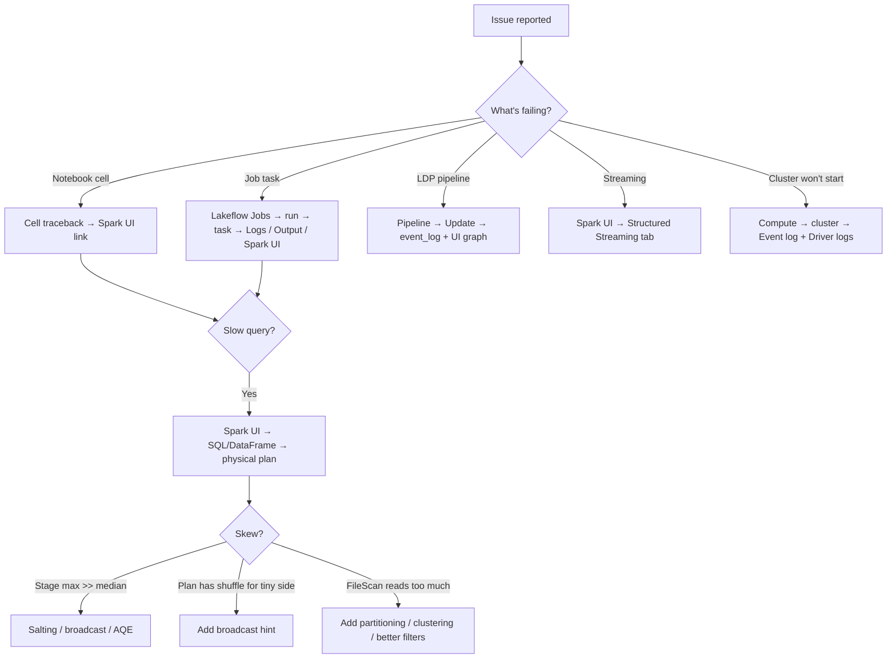

# Module 14 — Monitoring & Observability: Spark UI, Job History, System Tables

> **Domain 4 (18%) — Productionizing Data Pipelines**
>
> **Exam objectives covered:**
> - **Analyzing the Spark UI to optimize the query.**
> - Use Databricks' built-in debugging tools to troubleshoot a given issue.
> - Identify how audit logs are stored.
>
> **What you must walk away with:** The four Spark UI tabs and what each tells you. How to read the SQL/DataFrame tab. Stage skew indicators. Job run history. Query history. System tables for cost and lineage.

---

## Coverage map (verbatim July 25, 2025 objectives → where taught here)

| Verbatim objective | Taught in section |
|---|---|
| Analyzing the Spark UI to optimize the query | §2 "The four tabs" (Jobs, Stages, Storage, Executors, SQL/DataFrame) + §3 Streaming tab + §11 triage flowchart |
| Use Databricks' built-in debugging tools to troubleshoot a given issue | §4 job run history; §5 LDP event log; §6 DBSQL query history; §8 cluster event log; §9 driver/executor logs; §10 health rules |
| Identify how audit logs are stored | §7 system tables (`system.access.audit` queryable; cloud-storage log delivery for long-term raw JSON) + §7 exam trap |
| Use lineage features in Unity Catalog | §7 `system.access.table_lineage` and `system.access.column_lineage` |

Cross-references: Module 15 for the UC governance model that produces audit/lineage; Module 11 for the LDP event-log data-quality entries; Module 12 for the Lakeflow Job run UI.

---

## 1. Why the Spark UI is on the exam

The exam objective "analyze the Spark UI to optimize the query" appears explicitly. Candidates with PySpark experience who never opened the Spark UI struggle here. **You must be able to navigate four tabs from memory.**

### How to get to the Spark UI

- From a notebook cell that ran a Spark action: there's a "↗ Spark UI" link in the cell output.
- From a cluster: Compute → cluster → "Spark UI" link.
- From a job run: Lakeflow Jobs → run → task → "Spark UI" link.

---

## 2. The four tabs you must know

### 2.1 Jobs tab

Lists all Spark jobs (a Spark **job** = the work triggered by one action, e.g., a `count()` or `write`).

For each job:
- Status (succeeded / failed / running).
- Duration.
- Stages launched (count and link).

Use for: "what jobs did this notebook trigger?" and "which job is slow?"

### 2.2 Stages tab — the skew detection tab

Each Spark job is one or more **stages** separated by shuffles. Each stage runs as **tasks** in parallel across executors.

For each stage:
- Status, duration.
- **Tasks summary** — number of tasks, min / 25th / median / 75th / max duration.
- **Shuffle Read / Shuffle Write** sizes.
- Input / output sizes.

**The key signal: task duration distribution.** If median = 2 sec but max = 60 sec, you have **data skew** — one partition has way more data than the others.

```
Stage 42 — Tasks: 200
  Min:    1.2 sec
  25th:   1.5 sec
  Median: 1.8 sec
  75th:   2.1 sec
  Max:    62 sec   ← SKEW INDICATOR
```

Fix options:
- **Salting** (add a random suffix to skewed keys before join).
- **Broadcast join** if one side is small.
- **AQE (Adaptive Query Execution)** — `spark.sql.adaptive.skewJoin.enabled = true` (default on newer DBR) auto-splits skewed partitions.
- **Repartition** before the operation.

### ⚠️ Exam trap — skew detection

If a question shows a stage with "median 2s / max 60s" and asks "what's wrong?" the answer is **data skew**. Look for "broadcast" or "AQE" in the recommended fix.

### 2.3 Storage tab

Shows cached / persisted RDDs and DataFrames:
- Storage level (memory, disk, both).
- Size in memory.
- Cached partition count.

Use for: "are my caches actually in memory?" and "how much is being cached?"

If you `df.cache()` then never use the DataFrame again, you wasted memory. Storage tab catches this.

### 2.4 Executors tab

Per-executor stats:
- Executor ID, host, status.
- Active tasks, completed tasks, failed tasks.
- Storage memory used (cached data).
- **GC time** — total time spent in garbage collection.
- Total task time.

**The key signal: GC time as % of task time.** If GC is > 10% of task time, the JVM is thrashing. Fix: more executor memory, fewer cached objects, larger heap.

### 2.5 SQL / DataFrame tab — the most useful

Every Spark SQL or DataFrame action shows up here as a query with:
- Submitted / completed time.
- Duration.
- Status.
- **Query plan** (physical) — clickable, shows the DAG of operators.

The query plan reveals:
- **Join strategy** — `BroadcastHashJoin`, `SortMergeJoin`, `ShuffleHashJoin`.
- **Exchange** nodes (shuffles) — where data is re-distributed.
- **Filter pushdown** — `Filter` before `FileScan` is good; after is wasted reads.
- **Project** — column pruning.
- **AQE rewrites** — operators added at runtime by Adaptive Query Execution.

**Key diagnostic patterns:**

| What you see | What it means |
|--------------|---------------|
| `BroadcastHashJoin` with a small build side | Good — small dim was broadcast |
| `SortMergeJoin` between two large tables | Could be fine; check for skew |
| `Exchange hashpartitioning(...)` before a join | Shuffle for join collocation |
| `FileScan` reading 10× more rows than the query needs | Missing filter pushdown — check partition / clustering |
| `Filter` operator AFTER a large `FileScan` | The filter wasn't pushed down — file format may not support it |
| `Scan parquet` with `PushedFilters: [IsNotNull(id), EqualTo(id,42)]` | Filter pushed down — good |

### ⚠️ Exam trap — reading the physical plan

If a question shows a query plan with a huge `FileScan` followed by a small `Filter`, and asks "why is this slow?" — the answer is **the filter isn't being pushed down to the scan** (often because the column isn't indexed in Delta stats, or it's a generated column not used as a partition key, or there's no clustering).

---

## 3. The Structured Streaming tab

Specifically for streaming queries. Each running stream has:
- **Input Rate** — rows/sec coming in.
- **Process Rate** — rows/sec being processed.
- **Batch Duration** — how long each micro-batch takes.
- **Operation Duration** breakdown (addBatch, commitBatch, …).

Diagnostics:
- **Input Rate >> Process Rate** → backlog growing. Need more executors or speed up transformations.
- **Process Rate degrading over time** → state store growing (check watermarks).
- **Batch Duration spikes** → skew or GC.

---

## 4. Job run history

Lakeflow Jobs → click into any job → "Runs" tab shows recent runs:
- Start / end time.
- Duration.
- Status (success / failed / cancelled / skipped).
- Triggered by (schedule / manual / API / file_arrival).
- Per-task status.

Click a run → see each task's output, logs, Spark UI link.

### Run states
- **Pending** — queued, waiting for compute.
- **Running** — actively executing.
- **Succeeded** — all tasks succeeded.
- **Failed** — at least one task failed (and downstream skipped).
- **Cancelled** — manually stopped.
- **Internal error** — Databricks-side issue.

---

## 5. Pipeline (LDP) event log

LDP pipelines log structured events to a Delta table:

```sql
SELECT *
FROM event_log('<pipeline_id>')
ORDER BY timestamp DESC;
```

Event types:
- `flow_progress` — per-table progress and data-quality metrics
- `data_quality` — expectation violation counts
- `update_progress` — pipeline-level progress
- `user_action` — manual interventions
- `system` — engine events

Useful queries:

```sql
-- Latest expectation violations
SELECT
  timestamp,
  details:flow_progress.data_quality.expectations
FROM event_log('<pipeline_id>')
WHERE event_type = 'flow_progress'
  AND details:flow_progress.data_quality.expectations IS NOT NULL
ORDER BY timestamp DESC
LIMIT 10;

-- Pipeline updates and their durations
SELECT
  details:update_progress.update_id  AS update_id,
  MIN(timestamp)                     AS start_time,
  MAX(timestamp)                     AS end_time,
  MAX(timestamp) - MIN(timestamp)    AS duration
FROM event_log('<pipeline_id>')
WHERE event_type = 'update_progress'
GROUP BY 1
ORDER BY start_time DESC;
```

---

## 6. Query history (DBSQL)

For SQL warehouses, Databricks SQL → "Query History" lists all SQL queries:
- User who ran it.
- Warehouse used.
- Duration.
- Rows returned.
- Bytes read.
- Status.

Click a query → see the physical plan and per-stage metrics (similar to Spark UI but DBSQL-tailored).

Use for: BI dashboard query optimization, finding slow queries, identifying who's running expensive queries.

---

## 7. System tables — the cross-cutting observability layer

Unity Catalog provides **system tables** under the `system` catalog. These are auto-populated and queryable like normal Delta tables.

### Useful system tables

| Table | What it contains |
|-------|------------------|
| `system.access.audit` | Audit logs — who did what, when (queryable form of the cloud-delivered audit logs) |
| `system.access.table_lineage` | Table-to-table lineage (which queries / jobs read/write which tables) |
| `system.access.column_lineage` | Column-level lineage |
| `system.billing.usage` | DBU / cost usage per workspace, cluster, user, job |
| `system.compute.clusters` | Cluster definitions / events |
| `system.compute.warehouses` | SQL warehouse definitions / events |
| `system.lakeflow.jobs` | Job definitions |
| `system.lakeflow.job_run_timeline` | Job run history queryable |
| `system.query.history` | Query history (similar to UI query history) |
| `system.information_schema.*` | Standard SQL information_schema views |

### Example: cost attribution by job

```sql
SELECT
  u.workspace_id,
  u.usage_metadata.job_id          AS job_id,
  j.name                           AS job_name,
  DATE(u.usage_start_time)         AS usage_date,
  SUM(u.usage_quantity)            AS dbus
FROM system.billing.usage u
LEFT JOIN system.lakeflow.jobs j
  ON u.usage_metadata.job_id = j.job_id
WHERE u.usage_start_time >= current_date() - INTERVAL 7 DAYS
GROUP BY 1, 2, 3, 4
ORDER BY dbus DESC;
```

### ⚠️ Exam trap — where do audit logs live?

The exam asks "where are audit logs stored?" Two valid answers:
1. **In the customer's cloud storage** via account-level log delivery (long-term retention, raw JSON).
2. **In the `system.access.audit` system table** (queryable, but limited retention).

If only one is listed: pick whichever matches the question's focus. If both are listed: pick the system table for "query the audit log" scenarios, cloud storage for "long-term retention" scenarios.

---

## 8. Cluster event log

Compute → cluster → "Event log" tab shows cluster-level events:
- **STARTING / STARTED / TERMINATED** — lifecycle.
- **RESIZING / UP_SIZE_COMPLETED / DOWN_SIZE_COMPLETED** — autoscale events.
- **DRIVER_HEALTHY / DRIVER_UNHEALTHY** — driver state.
- **INIT_SCRIPTS_FINISHED / INIT_SCRIPTS_FAILED** — init script execution.
- **DBFS_DOWN / S3_DOWN** — storage events.

Use for: diagnosing "why didn't the cluster start?" and "when did autoscale fire?"

---

## 9. Driver and executor logs

Compute → cluster → "Driver logs" tab:
- `log4j-active.log` — current Spark log.
- `stderr` — driver process stderr.
- `stdout` — driver process stdout.
- Archived rotated logs.

Executor logs accessible via the Executors tab in the Spark UI (per-executor stderr / stdout).

For Lakeflow Jobs, click into a task → "Logs" tab for the task's log output.

---

## 10. Health monitoring

### Job-level

```yaml
health:
  rules:
    - metric: RUN_DURATION_SECONDS
      op: GREATER_THAN
      value: 3600     # alert if job > 1 hour
```

Triggers an alert on the `on_duration_warning_threshold_exceeded` notification when the threshold is crossed.

### Cluster-level

Autoscale, automatic termination, node restart on health issues — configured in the cluster spec.

---

## 11. Putting it together — a triage flowchart



---

## 12. Mini quiz (cold)

1. Where in the Spark UI do you check for data skew?
2. A stage shows median task duration 1.8s and max 62s. What's the diagnosis?
3. A query is slow. The plan shows a `SortMergeJoin` between a 100GB fact and a 50MB dim. What's the fix?
4. Where do you go to see expectation violation counts for an LDP pipeline?
5. Which system table holds audit logs?
6. Which system table holds DBU usage by job?
7. Streaming query's Input Rate is 10k rows/s and Process Rate is 4k rows/s. What's happening?
8. What does "GC time = 30% of task time" indicate?

### Answers

1. **Stages tab** — look at task duration distribution (min / 25 / median / 75 / max). Wide gap = skew.
2. **Data skew** — one partition has ~30× more data than median. Fix: broadcast join (if one side is small), salting, or rely on AQE skew-join handling.
3. **`broadcast(dim)` hint** — the dim is small enough to broadcast (< a few hundred MB), avoiding the shuffle. AQE may broadcast automatically based on stats but the hint guarantees it.
4. **`event_log('<pipeline_id>')`** — the LDP event log Delta table.
5. **`system.access.audit`**.
6. **`system.billing.usage`** (joined with `system.lakeflow.jobs` for job names).
7. **Backlog growing.** Process Rate < Input Rate means the stream can't keep up. Fix: more executors, optimize transformations, check for skew.
8. **JVM thrashing** in garbage collection. Either too little executor memory, too much cached data, or oversized objects. Increase memory or reduce caching.

---

## 13. Sanity check before moving on

You should be able to:
- Name the four Spark UI tabs (Jobs, Stages, Storage, Executors) plus SQL/DataFrame.
- Identify skew from a Stages-tab task duration distribution.
- Read a physical plan well enough to spot a broadcast vs sort-merge join.
- Query `event_log(<pipeline_id>)` for LDP diagnostics.
- Know `system.access.audit`, `system.access.table_lineage`, `system.billing.usage` exist.
- Know where to look for: cluster startup failures (cluster event log), task failures (Lakeflow Jobs run UI), slow query plans (SQL/DataFrame tab), streaming backlog (Structured Streaming tab).

If any of those are fuzzy, re-read Sections 2, 5, and 7.
