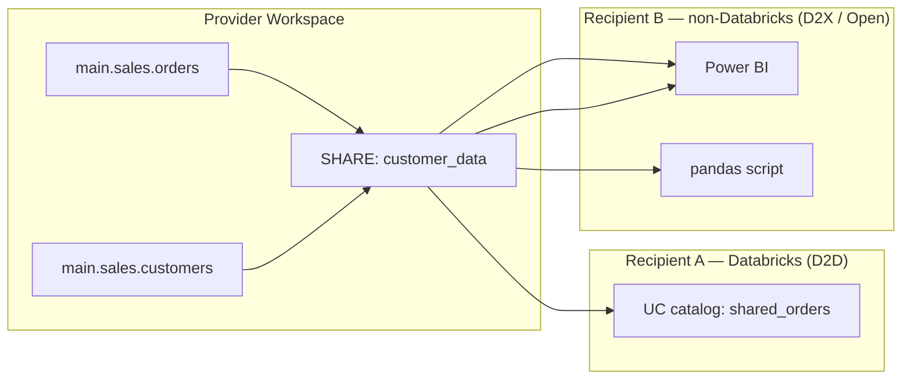
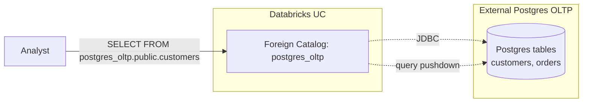

# Module 16 — Delta Sharing & Lakehouse Federation

> **Domain 5 (11%) — Data Governance & Quality**
>
> **Exam objectives covered:**
> - Use the **Delta Sharing** feature available with Unity Catalog to share data.
> - Identify the **advantages and limitations of Delta Sharing.**
> - Identify **types of Delta Sharing** — Databricks vs external system.
> - Analyze the **cost considerations** of data sharing across clouds.
> - Identify **use cases of Lakehouse Federation** when connected to external sources.
>
> **What you must walk away with:** What Delta Sharing is and how to set it up (provider / recipient / share). D2D (Databricks-to-Databricks) vs D2X / open (Databricks-to-anything). Cross-cloud egress cost concern. What Lakehouse Federation is and which sources it supports.

---

## Coverage map (verbatim July 25, 2025 objectives → where taught here)

| Verbatim objective | Taught in section |
|---|---|
| Use the Delta Sharing feature available with Unity Catalog to share data | §1 "Delta Sharing — the headline" + §2 D2D + (D2X / Open) sections; SHARE / RECIPIENT / GRANT syntax |
| Identify the advantages and limitations of Delta Sharing | §1 properties (read-only, live, cross-cloud/region, open protocol) + limitations sections |
| Identify types of Delta Sharing — Databricks vs external system | §2.1 "Databricks-to-Databricks (D2D)" + §2.2 "Open Delta Sharing (D2X)" |
| Analyze the cost considerations of data sharing across clouds | Cross-cloud egress section + §1 properties |
| Sample Question 3 (Delta Sharing configuration — READ to externals, internal R/W via UC) | §2 D2D vs Open exam-trap mapping |
| Identify use cases of Lakehouse Federation when connected to external sources | "Lakehouse Federation" section — foreign catalogs over JDBC (Postgres / MySQL / SQL Server / Snowflake / Redshift / BigQuery), read-only, when to choose vs sharing |

Cross-references: Module 15 for UC GRANT model that owns SHARE privileges; Module 04 for managed-vs-external as it relates to shared data; Module 14 for lineage/audit on shared tables.

---

## 1. Delta Sharing — the headline

**Delta Sharing** is Databricks' open protocol for sharing **live, read-only Delta data** with external recipients without copying.

Three core concepts:

- **Provider** — the team / org / workspace that owns the data.
- **Recipient** — the consumer (another Databricks workspace, or a non-Databricks BI tool, or a partner organization).
- **Share** — the bundle of tables / views / schemas / volumes that the provider exposes to a recipient.



### Properties

- **Read-only.** Recipients can SELECT; they cannot write.
- **Live.** Recipients see current data — no copy, no scheduled refresh.
- **Cross-cloud / cross-region** capable.
- **Open protocol.** The recipient does NOT have to be on Databricks.

---

## 2. Two delivery modes

### 2.1 Databricks-to-Databricks (D2D)

- Recipient is **another Databricks workspace** (potentially in a different account, region, or cloud).
- Authentication via **Unity Catalog identities** (the recipient's Databricks user / service principal).
- The shared tables appear as a **foreign catalog** in the recipient's UC.

```sql
-- Provider side
CREATE SHARE customer_data;
ALTER SHARE customer_data ADD TABLE main.sales.orders;
ALTER SHARE customer_data ADD TABLE main.sales.customers;

CREATE RECIPIENT acme_corp USING ID 'aws:us-east-1:metastore-id-of-recipient';
GRANT SELECT ON SHARE customer_data TO RECIPIENT acme_corp;

-- Recipient side
CREATE CATALOG shared_acme USING SHARE `provider_metastore_id`.customer_data;
GRANT USE CATALOG ON CATALOG shared_acme TO `analysts`;
GRANT USE SCHEMA  ON SCHEMA  shared_acme.default TO `analysts`;
GRANT SELECT      ON SCHEMA  shared_acme.default TO `analysts`;
```

Recipient queries:
```sql
SELECT * FROM shared_acme.default.orders;
```

D2D supports the full UC permissions model — the recipient can grant sub-permissions to their own teams.

### 2.2 Open Sharing (D2X) — non-Databricks recipients

- Recipient is **anywhere** — a partner organization, a BI tool, a Python script, a Spark OSS cluster.
- Authentication via a **bearer-token credential file** (`config.share` JSON) delivered to the recipient out-of-band.

```sql
-- Provider side (same SHARE creation as D2D)
CREATE SHARE public_metrics;
ALTER SHARE public_metrics ADD TABLE main.gold.daily_metrics;

CREATE RECIPIENT acme_external;     -- open recipient, no IDs needed
GRANT SELECT ON SHARE public_metrics TO RECIPIENT acme_external;

-- Generate credential file
-- (UI: Recipients → acme_external → "Download credential file")
```

The provider gives the recipient the `.share` credential file (contains a URL + bearer token). The recipient uses the **Delta Sharing client library**:

```python
# Recipient side — pandas
import delta_sharing

profile_file = "acme_external.share"
client = delta_sharing.SharingClient(profile_file)
client.list_all_tables()

df = delta_sharing.load_as_pandas(f"{profile_file}#public_metrics.default.daily_metrics")
```

```python
# Recipient side — Spark OSS
df = (spark.read
        .format("deltaSharing")
        .load(f"{profile_file}#public_metrics.default.daily_metrics"))
```

### Comparison

| Aspect | D2D | Open (D2X) |
|--------|-----|------------|
| Recipient platform | Databricks (UC) | Anywhere |
| Authentication | UC identities | Bearer token in `.share` file |
| Permission management | UC GRANTs cascade naturally | All-or-nothing per share |
| Cross-cloud | Yes | Yes |
| Recipient can grant sub-permissions | Yes | No |
| Lineage on recipient side | Yes | No |

### ⚠️ Exam trap — D2D vs D2X

If the question says "share with another Databricks workspace" → **D2D**. If it says "share with an external partner / Power BI / pandas / non-Databricks tool" → **Open Sharing (D2X)**.

---

## 3. Partner connectors

Open Sharing supports many recipients via partner connectors:

- **Power BI** (native Delta Sharing connector)
- **Tableau**
- **pandas** (`delta-sharing` Python package)
- **Spark OSS** (Java/Scala/Python via `delta-sharing-spark`)
- **Apache Spark on EMR / Dataproc / on-prem**
- **Apache Flink** (community)
- **Trino / Presto** (via Starburst)
- **Java/Go/Rust clients** (community)

The connector reads the protocol, returns DataFrames / SQL result sets.

---

## 4. Advantages and limitations

### Advantages

- **No data copy.** Recipients see live data.
- **No scheduled refresh.** No ETL job to maintain.
- **Cross-cloud capable.** Provider on AWS, recipient on Azure — works.
- **Read-only by design.** Reduces accidental-write risk.
- **Granular access via dynamic views / row filters / column masks** — the provider can share a filtered/masked view rather than the raw table.
- **Open protocol.** Vendor-neutral.

### Limitations

- **Read-only** — recipients can't write back. (For two-way sharing, separate shares each direction.)
- **Cross-cloud / cross-region egress costs apply** — every time the recipient reads, they're pulling bytes that may cross cloud regions, incurring egress charges from the provider's cloud.
- **No live SQL pushdown** — the recipient's query is executed against the recipient's compute; the recipient fetches full file ranges (with Parquet stat-based pruning, but not full query pushdown).
- **Not all features supported on the recipient side** — e.g., Time Travel works in D2D but is limited in open sharing.
- **No row-level restriction at recipient time** — restriction must happen on the provider side (via dynamic views).
- **Schema-evolution propagation** — when the provider's schema changes, the recipient must refresh.

### ⚠️ Exam trap — cross-cloud cost

The exam explicitly asks "what are the cost considerations of cross-cloud sharing?" The key answer: **egress costs from the provider's cloud**. When a recipient in Cloud B reads from a share whose data is in Cloud A, every byte transferred is egress from Cloud A. At scale, this can be the dominant cost. Mitigations: place a Delta Sharing recipient cache in the recipient's cloud, or use cloud peering for reduced egress rates.

---

## 5. Provider configuration — the SQL flow

```sql
-- 1. Create the share container
CREATE SHARE customer_data
COMMENT 'Customer master data and orders';

-- 2. Add tables / views / volumes to the share
ALTER SHARE customer_data
ADD TABLE main.sales.orders
COMMENT 'Sales orders';

ALTER SHARE customer_data
ADD TABLE main.sales.customers;

-- Can also add views, schemas, volumes:
-- ALTER SHARE customer_data ADD VIEW main.gold.daily_metrics;
-- ALTER SHARE customer_data ADD SCHEMA main.gold;
-- ALTER SHARE customer_data ADD VOLUME main.landing.public_files;

-- 3. Create the recipient
-- D2D form:
CREATE RECIPIENT acme_corp
USING ID 'aws:us-east-1:00000000-0000-0000-0000-000000000000';

-- Open form:
CREATE RECIPIENT acme_external;

-- 4. Grant SELECT on the share to the recipient
GRANT SELECT ON SHARE customer_data TO RECIPIENT acme_corp;

-- 5. Inspect
SHOW SHARES;
SHOW RECIPIENTS;
SHOW GRANTS ON SHARE customer_data;
SHOW ALL IN SHARE customer_data;
```

### Modifying shares

```sql
-- Remove a table from the share
ALTER SHARE customer_data REMOVE TABLE main.sales.orders;

-- Drop a share
DROP SHARE customer_data;

-- Revoke a recipient
REVOKE SELECT ON SHARE customer_data FROM RECIPIENT acme_corp;
```

---

## 6. Sample Question 3 pattern — Delta Sharing scenario

The official exam sample Q3 tests this:

> "Internal teams need access with full permissions, external partners can only read the shared data. Which action?"

Correct answer (per the official key): **"Grant READ permissions to external partners through the Delta Share and READ/WRITE permissions to internal teams on Unity Catalog."**

Why: Delta Sharing is read-only by design. External partners get the Delta Share with READ access. Internal teams don't need a Delta Share — they're on the same UC, so they get READ/WRITE through normal UC GRANTs.

Distractors:
- "Add internal tables to the share and assign READ/WRITE permissions to both" — wrong because **Delta Sharing doesn't support WRITE**.
- "Create permissions through Delta Share for both" — same wrong premise.
- "Set up a secure access URL and distribute" — wrong because Delta Sharing's auth is structured (UC identity for D2D, bearer-token credential file for open), not URLs.

### ⚠️ Exam trap — Delta Sharing is read-only

Any answer claiming Delta Sharing supports WRITE access is **wrong**. The recipient cannot modify the shared data.

---

## 7. Lakehouse Federation — querying external sources

**Lakehouse Federation** is the inverse of Delta Sharing. Instead of sharing your data outward, Federation lets you **query external databases as UC catalogs without ingesting them**.



### Supported foreign catalog sources (representative — list grows)

- **PostgreSQL**
- **MySQL**
- **Snowflake**
- **Amazon Redshift**
- **Google BigQuery**
- **Microsoft SQL Server**
- **Azure SQL Database**
- **Azure Synapse**
- **Databricks (another workspace)**
- **Salesforce Data Cloud**
- **Teradata**
- **Oracle**

### How it works

1. Create a **connection** in UC pointing to the external DB:
   ```sql
   CREATE CONNECTION my_postgres
   TYPE POSTGRESQL
   OPTIONS (
     host 'pg.example.com',
     port '5432',
     user secret('my_scope', 'pg_user'),
     password secret('my_scope', 'pg_pwd')
   );
   ```

2. Create a **foreign catalog** that surfaces the external DB:
   ```sql
   CREATE FOREIGN CATALOG postgres_oltp
   USING CONNECTION my_postgres
   OPTIONS (database 'production');
   ```

3. Query:
   ```sql
   SELECT *
   FROM postgres_oltp.public.customers
   WHERE region = 'EU';
   ```

The query planner pushes down filters and projections to Postgres where possible, then returns results to Databricks. JOINs across federated tables and Delta tables work — the federated side is pulled to Databricks, joined locally.

### Use cases

- **Query Postgres OLTP data alongside Delta Silver tables** without ETL.
- **Join Snowflake fact data with Databricks dim data** during exploration.
- **Read BigQuery data into a Databricks report** without copying.
- **Replace one-off "I need to pull customer master from the source DB" ETL jobs** for ad-hoc analytics.

### Limitations

- **Read-only** for most sources (some support writes; check per source).
- **Not all functions/operators push down** — complex queries may pull large data through the gateway.
- **Not a replacement for ingestion** when query patterns are repeated and heavy — at some volume, just ingest with Lakeflow Connect or Auto Loader.
- **Performance is bounded by the foreign source** — a slow Postgres is slow under Federation too.
- **Lineage is limited** — the lineage stops at the foreign catalog boundary.

### ⚠️ Exam trap — Federation vs ingestion vs Delta Sharing

Three different ideas:

| You want to | Mechanism |
|-------------|-----------|
| Query an external DB without copying its data | **Lakehouse Federation** |
| Replicate an external DB into Delta with CDC | **Lakeflow Connect** |
| Share your Delta data outward to other Databricks / external tools | **Delta Sharing** |

These are not interchangeable.

---

## 8. Side-by-side comparison

| Feature | Delta Sharing | Lakehouse Federation | Lakeflow Connect |
|---------|---------------|---------------------|------------------|
| Direction | **Outbound** (you share) | **Inbound query** | **Inbound ingestion** |
| Storage | No copy at recipient | No copy in UC | Copy to UC (Delta) |
| Live? | Yes (live read) | Yes (live query) | No (incremental ingest, latency = pipeline cadence) |
| Read/write | Read-only | Read (mostly) | Read at source; write to UC |
| Cross-cloud | Yes | Yes (over JDBC) | Yes |
| Egress cost concern | High (recipient reads remote) | Yes (Databricks reads external) | Yes (one-time + delta) |

---

## 9. A realistic combined scenario

A company has:
- **Delta tables in their Databricks** (production data).
- **Postgres OLTP database** (customer master).
- **Partner analytics platform** that needs daily metrics.

Solution stack:

1. **Lakehouse Federation** — query Postgres customer master from Databricks without ETL:
   ```sql
   CREATE FOREIGN CATALOG postgres_oltp USING CONNECTION pg_conn OPTIONS (database 'prod');

   CREATE MATERIALIZED VIEW main.silver.enriched_orders AS
   SELECT
     o.*,
     c.name,
     c.email
   FROM main.silver.orders o
   LEFT JOIN postgres_oltp.public.customers c ON o.customer_id = c.id;
   ```

2. **Delta Sharing** — share the daily metrics outward to the partner:
   ```sql
   CREATE SHARE partner_metrics;
   ALTER SHARE partner_metrics ADD TABLE main.gold.daily_metrics;
   CREATE RECIPIENT partner_acme;
   GRANT SELECT ON SHARE partner_metrics TO RECIPIENT partner_acme;
   ```

3. **Lakeflow Connect** (if the partner ALSO wanted CDC ingestion of their Salesforce into the Databricks workspace) — managed Salesforce connector.

---

## 10. Mini quiz (cold)

1. The recipient is another Databricks workspace on a different cloud. Which Delta Sharing mode?
2. The recipient is a partner using Power BI on-prem. Which mode?
3. Can a Delta Sharing recipient write back to the shared data?
4. The exam asks about "cost considerations of cross-cloud sharing." What's the answer?
5. You want to query an external Snowflake database from a Databricks notebook without copying the data. Which feature?
6. You want to replicate Salesforce into a Bronze Delta table with CDC. Which feature?
7. Differentiate Delta Sharing vs Lakehouse Federation in one sentence.
8. Per the sample question, the right answer for "internal teams need write, external partners need read" is which configuration?

### Answers

1. **D2D (Databricks-to-Databricks)** — UC identities authenticate the recipient.
2. **Open Sharing (D2X)** — bearer-token credential file delivered out of band.
3. **No.** Delta Sharing is read-only by design.
4. **Egress costs from the provider's cloud** — every recipient read pulls bytes out of the provider's cloud, incurring egress charges.
5. **Lakehouse Federation** — foreign catalog pointing at Snowflake.
6. **Lakeflow Connect** — managed Salesforce CDC connector.
7. **Delta Sharing = outbound (you share your Delta data to others); Lakehouse Federation = inbound query (you query external DBs from UC without copy).**
8. **Grant READ via Delta Share to external partners; READ/WRITE via UC to internal teams.** Delta Sharing is read-only, so write access for internal teams happens via UC, not via the share.

---

## 11. Sanity check before moving on

You should be able to:
- Recite the three concepts (provider / recipient / share).
- Differentiate D2D (UC identities) vs D2X / Open (bearer-token credential file).
- Recite Delta Sharing's read-only constraint.
- Name the cross-cloud cost issue.
- Pick Lakehouse Federation for "query external DB without copy."
- Pick Lakeflow Connect for "replicate SaaS / DB into UC."
- Pick Delta Sharing for "share Delta data outward."

If any of those are fuzzy, re-read Sections 2, 4, and 7.

---

## 12. Closing the loop — you've finished the modules

This was the last of the 16 modules. You've covered:

- **Domain 1** (10%) — Platform: Modules 01-02
- **Domain 2** (30%) — Development & Ingestion: Modules 03-07
- **Domain 3** (31%) — Data Processing & Transformations: Modules 08-11
- **Domain 4** (18%) — Productionizing: Modules 12-14
- **Domain 5** (11%) — Governance: Modules 15-16

Next: take the practice quizzes in `quizzes/` cold (no peeking), one per domain, then a back-to-back simulated 90-minute exam. Aim for ≥85% sustained before booking.
