\newpage

# How to read this ebook

This is the consolidated reading copy of **Topic 12 — Databricks Certified Data Engineer Associate**, from the **Career_upskill** project. The source markdown files live at `topics/12_databricks_de_associate/` and remain the canonical version; this ebook is a derived artifact.

**Ordering** is the natural numeric sequence — README, then numbered modules, then FACTS, then quizzes.

**What's included:**
- README (study plan, scope, exam logistics)
- All numbered modules
- The FACTS.md appendix (citable facts, version cutoffs, exam metadata)
- Quizzes (~3× exam length, with answer explanations)

**Diagrams** are Mermaid where present. The EPUB build pre-renders them to PNG via the `mmdc` CLI; if unavailable they appear as code blocks.

\newpage


\newpage

# Topic 12 — Databricks Certified Data Engineer Associate

> **Audience:** Senior AI/ML Engineer with 10+ years of PySpark in production, less depth on Lakeflow / Delta Live Tables / DAB / Unity Catalog operations. This is **exam prep**, not a from-zero data engineering primer. PySpark fluency is assumed; the curriculum front-loads what is **specific to the Databricks platform** and the **July 25, 2025 exam refresh**.
>
> **Goal:** Pass the Databricks Certified Data Engineer Associate (DEA) — currently the **July 25, 2025** exam guide — on the first attempt with ≥85% margin (the bar is 80%, so leave headroom). Secondarily, leave the prep cycle with production-grade knowledge of Lakeflow Declarative Pipelines, Lakeflow Jobs, Unity Catalog, Delta Sharing, and Databricks Asset Bundles — the post-2025 platform stack.
>
> **Last updated:** 2026-05-23

---

## What this topic guarantees

A reader who studies **only** these 16 modules + the 5 quiz packs (no external books, no Udemy course) is genuinely prepared for the July 25, 2025 exam. Specifically:

- Every verbatim exam objective from the July 25, 2025 guide is mapped, at the top of the module that owns it, in a `## Coverage map` table — open any module and you can see which official objective each section satisfies.
- Every API / SQL clause / option that the exam can quote back at you in a code-completion question is enumerated in the relevant module's body — Auto Loader's `cloudFiles.*` options (Module 06), MERGE's WHEN-MATCHED clauses and APPLY CHANGES INTO's STORED AS SCD TYPE (Modules 03 + 10), expectation actions (Module 11), the UC privilege chain and GRANT-ON-SCHEMA vs GRANT-ON-ALL-TABLES distinction (Module 15), Lakeflow Jobs task types + `run_if` + repair runs (Module 12), DAB top-level blocks + `mode: development`/`production` (Module 13).
- Every look-alike pair that has been observed to trip candidates is explicitly contrasted in a side-by-side table or "⚠️ Exam trap" callout — `availableNow` vs `processingTime` (Module 08), `addNewColumns` vs `rescue` vs `failOnNewColumns` vs `none` and their defaults (Module 06), STREAMING TABLE vs MATERIALIZED VIEW (Module 10), `count` vs `count_distinct` (Module 07), `repartition` vs `coalesce` (Module 07), `%run` vs `dbutils.notebook.run` (Module 02), DROP on managed vs external (Modules 04 + 15), ZORDER vs Liquid Clustering (Module 04), file_arrival trigger vs cron (Module 12), expectation vs row filter / column mask (Modules 11 + 15), D2D vs D2X Delta Sharing (Module 16).
- All five retired official sample questions are walked through, with the correct answer and the trap each distractor sets — Q1 in Module 07 (count_distinct for unique invoices), Q2 in Module 15 (GRANT SELECT ON SCHEMA when USE perms are already granted), Q3 in Module 16 (Delta Sharing config across internal + external), Q4 in Module 03 (CREATE OR REPLACE TABLE), Q5 in Module 03 (INSERT INTO … VALUES).
- Every module ends with a cold mini-quiz with answers, plus a "Sanity check before moving on" recall block. The 5 quiz packs in `quizzes/` mirror the live exam's domain mix (10 / 30 / 31 / 18 / 11) and question style (single-select, scenario stem + four near-identical clauses).
- Decision rules — what scenario phrase points to what answer — are surfaced consistently in the same `⚠️ Exam trap` and "How to recognize this on the exam" callout style across modules, so you build a single decision vocabulary across the topic.

If you finish the modules + quizzes and you cannot, from memory: write a `CREATE OR REFRESH STREAMING TABLE … FROM STREAM read_files(...)` with a CONSTRAINT EXPECT clause, write `GRANT SELECT ON SCHEMA … TO …` and recite why it's different from `ON ALL TABLES IN SCHEMA`, choose `availableNow` for "scheduled, run-to-completion", choose `APPLY CHANGES INTO … STORED AS SCD TYPE 2` over hand-rolled MERGE inside LDP, name the four cluster types and their cost ordering, and explain why managed-table DROP is destructive but external-table DROP is recoverable — then you are not yet ready. Re-read the relevant sections.

---

## Exam logistics — what to know before you book

| Item | Value |
|------|-------|
| **Scored questions** | **45 multiple-choice** (single-select only) |
| **Time limit** | **90 minutes** (= 2 min/question) |
| **Passing score** | **80%** — 36 of 45 scored (**raised from 70%** in July 25 2025 refresh) |
| **Registration fee** | **USD $200** (+ local taxes) |
| **Validity** | **2 years**; recertification = retake the full live exam |
| **Delivery** | Online proctored (Kryterion / Webassessor) or test center |
| **Test aides** | None — no scratch paper, no notes, no second monitor |
| **Prerequisite** | None required; Databricks recommends 6 months hands-on |
| **Languages** | English, Japanese, Portuguese (Brazil), Korean |
| **Code language in questions** | SQL when possible, otherwise Python (PySpark) |
| **Retake policy** | 14-day wait after first fail; 30-day after subsequent attempts |
| **Unscored items** | A few statistical items, not identified, extra time accounted for |
| **Third-party exam code** | `DEA-C01` (Udemy/FlashGenius label; Databricks does not use this code) |

> ⚠️ **80% is a high bar.** The pre-July-2025 exam passed at 70%. If your practice scores are sitting at 80–82%, you are not ready. Target 85–90% sustained across two full-length practice exams before booking.

---

## What changed in the July 25, 2025 refresh

The exam was significantly rewritten to align with the post-rebrand Databricks Data Intelligence Platform. If your prep material was written before mid-2025, expect **every** product name to have moved, and four exam objectives to be entirely new.

| Change | Old (pre-July 2025) | New (current) |
|--------|---------------------|---------------|
| **Passing score** | 70% | **80%** |
| **ETL / declarative pipelines product** | Delta Live Tables (DLT) | **Lakeflow Declarative Pipelines (LDP)** — backward compatible; `dlt` Python API and `LIVE` SQL keyword still work |
| **Orchestration product** | Workflows / multi-task jobs | **Lakeflow Jobs** — UI rename; same underlying engine |
| **Default governance** | Workspace ACL / Hive metastore optional | **Unity Catalog assumed by default** |
| **CI/CD path** | Repos + manual deploy / Terraform | **Databricks Asset Bundles (DABs)** — the new exam-canonical answer for "promote dev → prod" |
| **Default compute** | Job cluster | **Serverless** preferred in any "hands-off / auto-optimized" scenario |
| **Ingestion family** | Auto Loader only | Auto Loader **plus Lakeflow Connect** (managed connectors — Salesforce, Workday, SQL Server CDC, etc.) |
| **Layout / file management** | OPTIMIZE + ZORDER | **Liquid Clustering** (new default) + **Predictive Optimization** (auto OPTIMIZE/VACUUM on UC-managed tables) |
| **New topics added** | — | **Delta Sharing**, **Lakehouse Federation**, **Liquid Clustering**, **Predictive Optimization** |
| **De-emphasized** | Hive metastore details, legacy Repos workflow | — |

> ⚠️ **Exam trap (DLT → LDP rename):** Both syntaxes work at runtime, but **multiple-choice answers prefer the LDP form** (`CREATE OR REFRESH STREAMING TABLE`, `CREATE OR REFRESH MATERIALIZED VIEW`, `APPLY CHANGES INTO`). If you see `CREATE LIVE TABLE` as an answer, it's a distractor for someone studying with pre-2025 material.

---

## Domain weights (July 25, 2025 guide)

| # | Domain | Weight | Approx. questions (of 45) |
|---|--------|--------|---------------------------|
| 1 | Databricks Intelligence Platform | **10%** | ~4–5 |
| 2 | Development and Ingestion | **30%** | ~13–14 |
| 3 | **Data Processing & Transformations** | **31%** | **~14 (largest)** |
| 4 | Productionizing Data Pipelines | **18%** | ~8 |
| 5 | Data Governance & Quality | **11%** | ~5 |
| | **Total** | **100%** | **45 scored** |

**Domains 2 + 3 = 61% of the exam.** Auto Loader, PySpark transformations, Structured Streaming, and Lakeflow Declarative Pipelines are where two-thirds of your questions live. Allocate your study time accordingly — do not over-invest in the platform/governance domains.

---

## Learning path — 16 modules

### Domain 1 — Databricks Intelligence Platform (10%)

| # | Module | Why it matters |
|---|--------|----------------|
| 1 | [Lakehouse platform & compute model](01_lakehouse_platform.md) | Control plane vs compute plane vs storage; workspace anatomy; all-purpose vs job vs serverless; DBR variants (LTS, ML, Photon) |
| 2 | [Workspace basics — notebooks, repos, file system](02_databricks_workspace_basics.md) | Notebooks (.py vs .ipynb), Git folders, DBFS legacy vs UC Volumes, magic commands (`%sql`, `%python`, `%run`, `%pip`) |

### Domain 2 — Development & Ingestion (30%)

| # | Module | Why it matters |
|---|--------|----------------|
| 3 | [Delta Lake fundamentals](03_delta_lake_fundamentals.md) | CREATE/REPLACE/IF NOT EXISTS semantics, MERGE, time travel, DESCRIBE HISTORY, schema evolution, generated columns |
| 4 | [Delta table management — OPTIMIZE, VACUUM, Liquid Clustering, managed vs external](04_delta_table_management.md) | The DROP-semantics trap, VACUUM 7-day floor, Predictive Optimization, CONVERT TO DELTA |
| 5 | [Data ingestion methods — COPY INTO, Auto Loader, CTAS](05_data_ingestion_methods.md) | When to use which; idempotency model; bounded vs unbounded |
| 6 | [Auto Loader deep — schema evolution, hints, triggers](06_auto_loader_deep.md) | cloudFiles options, the four schema-evolution modes (and which is default in which case), `_rescued_data`, file detection modes, schemaLocation |
| 7 | [ETL with PySpark + SQL — multi-hop, UPSERT, repartition](07_etl_with_pyspark_sql.md) | Bronze/Silver/Gold transformations, MERGE patterns, repartition vs coalesce, common aggregations and DataFrame APIs |

### Domain 3 — Data Processing & Transformations (31%) — **largest domain**

| # | Module | Why it matters |
|---|--------|----------------|
| 8 | [Structured Streaming — triggers, output modes, checkpoints](08_structured_streaming.md) | DataStreamReader/Writer, triggers (`processingTime`, `availableNow`, deprecated `Once`, `continuous`), output modes, checkpointLocation, exactly-once |
| 9 | [Watermarks & stateful streaming](09_watermarks_state.md) | `withWatermark`, late data, stream-stream joins, CDC handling, RocksDB state store |
| 10 | [Lakeflow Declarative Pipelines (formerly DLT)](10_lakeflow_declarative_pipelines.md) | STREAMING TABLE vs MATERIALIZED VIEW, APPLY CHANGES INTO (SCD1/2), expectations, DLT → LDP migration (full backward compat), serverless pipelines |
| 11 | [Data quality with expectations](11_data_quality_expectations.md) | EXPECT clauses, ON VIOLATION DROP ROW / FAIL UPDATE / WARN, quarantine table pattern |

### Domain 4 — Productionizing Data Pipelines (18%)

| # | Module | Why it matters |
|---|--------|----------------|
| 12 | [Lakeflow Jobs — multi-task, repair, triggers](12_lakeflow_jobs.md) | Multi-task DAG, dependencies, parameters, retries, repair runs, file-arrival triggers, job cluster vs all-purpose cost trap |
| 13 | [Databricks Asset Bundles for DE](13_dabs_for_de.md) | `databricks.yml`, bundle/targets/resources/variables, `databricks bundle validate/deploy/run`, dev vs prod overrides |
| 14 | [Monitoring & observability — Spark UI, system tables](14_monitoring_observability.md) | Job run history, query history in SQL warehouses, Spark UI tabs (SQL, Stages, Storage, Executors), system tables for cost/lineage |

### Domain 5 — Data Governance & Quality (11%)

| # | Module | Why it matters |
|---|--------|----------------|
| 15 | [Unity Catalog basics](15_unity_catalog_basics.md) | 3-level namespace, USE CATALOG/USE SCHEMA/SELECT privilege chain, GRANT/REVOKE, ownership, dynamic views, row filters, column masks, audit logs |
| 16 | [Delta Sharing & Lakehouse Federation](16_delta_sharing_federation.md) | Sharing (provider/recipient/share, D2D vs open/D2X), Lakehouse Federation (foreign catalogs over JDBC to Postgres/MySQL/Snowflake/Redshift/BigQuery) |

---

## Companion files

- [`FACTS.md`](FACTS.md) — atomic, citable claims. Exam logistics, version numbers, defaults, syntax forms. "Last verified" dates.
- [`quizzes/`](quizzes/) — practice questions per domain (~135 total, distributed by domain weight). Recall / Apply / Diagnose / Defend.

---

## How to study with this corpus

1. **Week 1 — Foundation:** Read modules 1–2, then 3–4. Take quiz 01 (platform) and the first half of quiz 02. You should walk away knowing exactly what `CREATE OR REPLACE TABLE` does vs `CREATE TABLE IF NOT EXISTS`.
2. **Week 2 — Ingestion:** Modules 5–7. Drill Auto Loader options. Take the rest of quiz 02. Be able to write an Auto Loader stream from memory (the exam expects code recognition, not full code authoring, but recognition follows from authoring).
3. **Week 3 — Streaming + LDP:** Modules 8–11. This is the **31% of the exam.** Spend the most time here. Take quiz 03 cold; retake until ≥85%.
4. **Week 4 — Productionizing:** Modules 12–14. DAB structure is a high-yield area (4–5 questions cluster around DABs and CI/CD). Take quiz 04.
5. **Week 5 — Governance + full-length practice:** Modules 15–16. Take quiz 05. Then take **all five quizzes back-to-back as a simulated 90-min exam.** If you score ≥85%, book the exam. If not, identify the weakest domain and revisit.

> ⚠️ **Spark UI is on the exam.** PySpark engineers who have never opened the Spark UI in a Databricks notebook will struggle on the diagnosis questions. Open the SQL/DataFrame tab and the Stages tab on any non-trivial job you run during prep. Module 14 walks the four tabs you must recognize.

---

## Scope notes

- **Cutoff:** Reflects the **July 25, 2025** exam guide as the currently-live version. A "May 4, 2026" reference appears in one third-party source — re-verify the official PDF on `databricks.com/learn/certification/data-engineer-associate` ~2 weeks before your booked date.
- **Bias:** Cloud-agnostic where Databricks is cloud-agnostic. AWS / Azure / GCP cloud-specific differences are flagged when they matter to an exam scenario.
- **Anti-bias:** This is exam prep — not architecture school. Production tangents are kept short. The Topic 02 (Azure Databricks) corpus is the place for architect-level depth.
- **Convention:** SQL is the primary language in modules (the exam prefers SQL); Python/PySpark appears where the exam requires it (DataFrame aggregations, Auto Loader, Structured Streaming, LDP Python decorators).

## Stack baseline

```
databricks-sdk
databricks-cli           # >= 0.218 — DAB commands require this
databricks-connect       # version-matched to your DBR
pyspark                  # for local fallback
delta-spark              # local Delta tinkering
```

A free Databricks Community / Free Edition workspace is sufficient for the labs in this corpus. Lakeflow Declarative Pipelines and Lakeflow Jobs are available; serverless features depend on region availability.

---

## Research provenance

Built from the July 25 2025 official exam guide (verbatim objectives extracted to `research_inputs/12_databricks_de_associate/exam_guide.txt`) and a deep research report (`research_inputs/12_databricks_de_associate/RESEARCH.md`) that cross-references community pitfall threads, FlashGenius / OpenExamPrep study notes, Databricks Community Dec-2025 threads, and the official `docs.databricks.com` API references for Auto Loader, Lakeflow, Unity Catalog, and DABs.


\newpage

# Module 01 — Databricks Lakehouse Platform & Compute Model

> **Domain 1 (10%) — Databricks Intelligence Platform**
>
> **Exam objectives covered:**
> - Explain the value of the Data Intelligence Platform.
> - Identify the applicable compute to use for a specific use case.
> - Enable features that simplify data layout decisions and optimize query performance.
>
> **What you must walk away with:** A correct mental model of control plane / compute plane / storage; what cluster type to choose for a given scenario; what DBR variants exist; how serverless differs from classic compute; the headline platform features (Photon, Predictive Optimization, Liquid Clustering, Unity Catalog).

---

## Coverage map (verbatim July 25, 2025 objectives → where taught here)

| Verbatim objective | Taught in section |
|---|---|
| Explain the value of the Data Intelligence Platform | §1 "What 'Data Intelligence Platform' means on the exam" |
| Enable features that simplify data layout decisions and optimize query performance | §7 "Headline performance features — recognize them on the exam" (Photon, Predictive Optimization, Liquid Clustering, Auto Optimize/Compact, serverless) |
| Identify the applicable compute to use for a specific use case | §4 "Compute types — the four answers the exam expects" + decision matrix + §6 "Pools" |

Cross-references: Liquid Clustering body in Module 04; Predictive Optimization body in Module 04; UC body in Module 15.

---

## 1. What "Data Intelligence Platform" means on the exam

Databricks now markets itself as the **Data Intelligence Platform** — a marketing term, but the exam treats it as the umbrella that includes:

1. **Lakehouse storage** — Delta tables on customer cloud object storage (S3 / ADLS Gen2 / GCS).
2. **Spark + Photon compute** — the engine that runs SQL and PySpark.
3. **Unity Catalog (UC)** — the unified governance layer (catalog/schema/table, GRANTs, lineage, audit).
4. **Lakeflow** — the modern ETL surface, comprising **Lakeflow Declarative Pipelines** (LDP) for declarative transformations, **Lakeflow Jobs** for orchestration, and **Lakeflow Connect** for managed ingestion connectors.
5. **Databricks SQL (DBSQL)** — SQL warehouses and BI surface.
6. **AI / ML surfaces** — MLflow, Mosaic AI Vector Search, Model Serving — not in scope for the DE Associate but worth knowing they exist.
7. **Databricks Asset Bundles (DABs)** — the CI/CD packaging format.

The "intelligence" framing means: AI features (Predictive Optimization, AI Functions, Genie, Lakeflow Designer's GenAI assistance) are layered into every product, not bolted on. For the DE Associate exam you mostly need to recognize that the Platform is a **unified** alternative to stitching together S3 + EMR + Glue + Athena + Step Functions + Redshift, and that the unification's value props are:

- **Single governance layer** (UC) covering data, ML models, dashboards, files, and notebooks.
- **Single open file format** (Delta / Iceberg via UniForm) so you're not locked in.
- **Single orchestration** (Lakeflow Jobs) that can run notebooks, Python wheels, SQL queries, dbt, JARs, and LDP pipelines in one DAG.
- **Single CI/CD** (DABs) for promoting code+config from dev to prod.
- **Auto-optimization** (Predictive Optimization, Liquid Clustering AUTO, serverless) reduce the operational burden vs. self-tuned Spark.

### ⚠️ Exam trap — "Data Intelligence Platform" vs "Lakehouse"

The platform brand has shifted from "Lakehouse Platform" → "Data Intelligence Platform" in 2024–2025. Both terms still appear in questions and study materials. **They mean the same thing for exam purposes.** Don't pick a wrong answer just because it uses one phrase or the other.

---

## 2. Three-tier architecture: control plane / compute plane / storage

```mermaid
graph TB
    subgraph Databricks_Cloud_Account["Databricks Cloud Account (Control Plane)"]
        UI[Web UI]
        API[REST API]
        SCHED[Job Scheduler]
        EDITOR[Notebook Editor]
        CLM[Cluster Manager]
        LOGS[Cluster Logs Metadata]
    end

    subgraph Customer_Cloud_Account["Customer Cloud Account"]
        subgraph Compute_Plane["Compute Plane (Classic)"]
            DRV[Driver Node]
            EX1[Executor 1]
            EX2[Executor 2]
            EX3[Executor N]
        end
        subgraph Storage["Object Storage"]
            DLAKE[(Delta tables<br/>Parquet + _delta_log)]
            CHK[(Checkpoints)]
            VOL[(UC Volumes)]
        end
    end

    subgraph Databricks_Serverless["Databricks Serverless Plane (when serverless)"]
        SLEXEC[Serverless Compute<br/>managed by Databricks]
    end

    UI --> API
    API --> SCHED
    SCHED --> CLM
    CLM -->|provisions| DRV
    CLM -.->|serverless option.-> SLEXEC
    DRV --> EX1
    DRV --> EX2
    DRV --> EX3
    EX1 --> DLAKE
    EX2 --> DLAKE
    EX3 --> DLAKE
    SLEXEC --> DLAKE
```

### Control plane (Databricks-operated)

What lives here:
- Web UI, notebook editor, dashboards, REST API.
- Job scheduler and cluster manager (sends requests to your cloud account to create VMs).
- Workspace ACLs, secrets metadata (encrypted), cluster configuration storage.
- UC metastore (the catalog/schema/table tree).
- Cluster event logs and notebook source code.

What does NOT live here:
- Your data files. The control plane never holds Delta data.
- Cluster compute. The driver and executors are not in the control plane; they're in the customer's cloud account (classic) or in Databricks' own cloud account (serverless).

### Compute plane (classic — customer cloud account)

What lives here:
- The driver VM (runs SparkContext, the notebook REPL, the LDP coordinator).
- Executor VMs (run Spark tasks; read/write Delta files).
- Cluster local SSD scratch (shuffle, spill).
- Init scripts.

**Critical:** classic compute is provisioned inside the customer's cloud account VPC/VNet. Data movement between executors and storage is east-west traffic within the customer's cloud, not over the public internet. This is why HIPAA / regulated compliance is achievable.

### Compute plane (serverless — Databricks cloud account)

What lives here:
- Compute pre-provisioned by Databricks in Databricks' own account.
- Workloads run in customer-isolated namespaces.
- The customer's data is accessed via short-lived credentials (UC service principals + S3/ADLS access).

**Trade-off:** faster startup (seconds vs minutes), no cluster-management overhead, hands-off scaling — but compute is not in your cloud account, so some regulated environments cannot use serverless without additional review.

### Storage (customer cloud account)

What lives here:
- Delta tables (Parquet + `_delta_log/`).
- UC Volumes (files, used like a managed filesystem inside UC).
- Streaming checkpoints.
- Job outputs.

UC sits between compute and storage as the authorization layer — every read/write request from compute is authorized by UC before storage access.

### ⚠️ Exam trap — "where does customer data live?"

If a multiple-choice answer claims "data is stored in the Databricks control plane," that is **wrong**. Customer data lives in the customer's cloud storage (or, for serverless, is *accessed* from the customer's storage by Databricks-managed compute — never copied into Databricks' account).

---

## 3. Workspace anatomy

A **workspace** is a Databricks UI environment scoped to one cloud region, typically one per environment per business unit (e.g., `prod-east`, `dev-east`, `analytics-prod`). One **account** (the billing/identity boundary) can contain many workspaces.

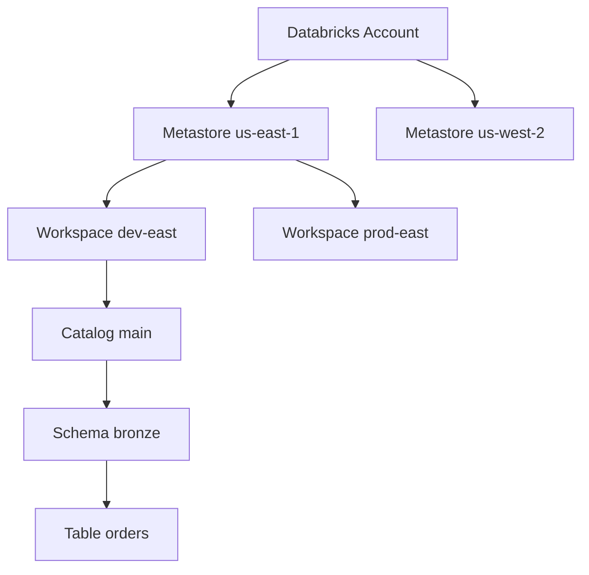

Within a workspace you find:
- **Workspace** (file tree) — notebooks, Python files, SQL files, dashboards.
- **Repos / Git folders** — repository clones with Git operations.
- **Clusters** — compute resources you can attach notebooks to.
- **Jobs** (Lakeflow Jobs) — scheduled DAGs.
- **Pipelines** (Lakeflow Declarative Pipelines) — declarative ETL flows.
- **SQL Warehouses** — DBSQL endpoints.
- **Models** — registered ML models (MLflow).
- **Catalog Explorer** — UI for browsing UC objects.
- **Compute → Pools** — warm-instance pools to reduce startup time.

Workspaces are scoped to **one region**. To go cross-region, you create another workspace bound to a metastore in that region.

### Key roles in a workspace

| Role | Scope | Powers |
|------|-------|--------|
| Account admin | Account | Create workspaces, manage metastores, manage users |
| Metastore admin | Metastore | Create catalogs, grant USE CATALOG on root |
| Workspace admin | Workspace | Manage clusters, jobs, users in workspace |
| Catalog owner | Catalog | Manage all schemas/tables inside, grant on catalog |
| Schema owner | Schema | Manage tables inside, grant on schema |
| Table owner | Table | Grant SELECT/MODIFY on table |
| User | Workspace | Run notebooks/jobs they have access to |

For the exam, **ownership is required to grant privileges**. If you don't own a table, you can't `GRANT SELECT` on it (unless you're an admin at a higher level).

---

## 4. Compute types — the four answers the exam expects

### 4.1 All-purpose clusters (interactive)

- Created by an individual user from the Compute tab.
- Persist after creation; can be reused across notebooks and queries.
- Expensive per DBU (~3× job clusters in DBU cost).
- Auto-terminate after idle period (configurable, e.g., 60 min).
- Right choice: **interactive notebook development**, ad-hoc analysis, collaborative sessions.
- Wrong choice: scheduled jobs, repeating production ETL.

### 4.2 Job clusters (ephemeral)

- Created automatically when a Lakeflow Jobs task starts.
- Terminated when the job task ends.
- Cheaper DBU rate (~half all-purpose).
- Right choice: **any scheduled or one-shot job**, repeating ETL, batch pipelines.
- Wrong choice: interactive sessions, multi-user collaboration.

### 4.3 Serverless compute

- Hosted in Databricks' own cloud account (not customer's).
- Sub-30-second startup (vs minutes for classic).
- Auto-scaling managed by Databricks; no instance type tuning.
- Auto-applies cost optimizations (DBR auto-upgrade, auto-scale).
- Right choice: **"hands-off / auto-managed / no cluster tuning"** scenarios; serverless SQL warehouses for BI; serverless LDP pipelines (the post-2025 default).
- Wrong choice: workloads with strict data residency constraints requiring compute in customer cloud; init-script-heavy custom environments.

### 4.4 SQL Warehouses

- Compute specifically for Databricks SQL (DBSQL).
- Three flavors:
  - **Classic SQL warehouse** — Spark + Photon in customer cloud.
  - **Pro SQL warehouse** — adds advanced features (Predictive I/O, Photon enhancements).
  - **Serverless SQL warehouse** — Databricks-hosted; fastest startup.
- Sized t-shirt-style: 2X-Small, X-Small, Small, Medium, Large, X-Large, 2X-Large, 3X-Large, 4X-Large.
- Each size approximately doubles cluster size.
- Multi-cluster load balancing (auto-scale out by cluster count under load).

### Decision matrix

| Scenario | Correct compute |
|----------|----------------|
| Data scientist iterating on a notebook | **All-purpose cluster** |
| Daily scheduled ETL Lakeflow Job | **Job cluster** (or serverless if the prompt mentions "hands-off") |
| BI dashboard SQL queries with low/zero startup latency | **Serverless SQL warehouse** |
| Long-running streaming LDP pipeline with autoscale | **Serverless LDP** (or job cluster in classic) |
| Production multi-task DAG with mixed notebooks + LDP | **Job cluster per task** (or serverless) |
| Cost-sensitive experimental workload at off hours | Job cluster on **Spot instances** |

### ⚠️ Exam trap — "an all-purpose cluster is already running, so use it"

The trap reads "team X already has an all-purpose cluster running. Should the scheduled ETL use that cluster or create a new one?" The correct answer is almost always **create a new job cluster**, because:
1. Job clusters are ~half the DBU cost of all-purpose.
2. Job clusters are ephemeral and don't pin the team's compute when their interactive work pauses.
3. Resource contention with interactive users degrades job SLAs.

If the prompt explicitly says "minimize cluster startup time" without mentioning cost, **serverless** beats job cluster. If the prompt says "hands-off / auto-managed," **serverless** is the answer.

---

## 5. Databricks Runtime (DBR) variants

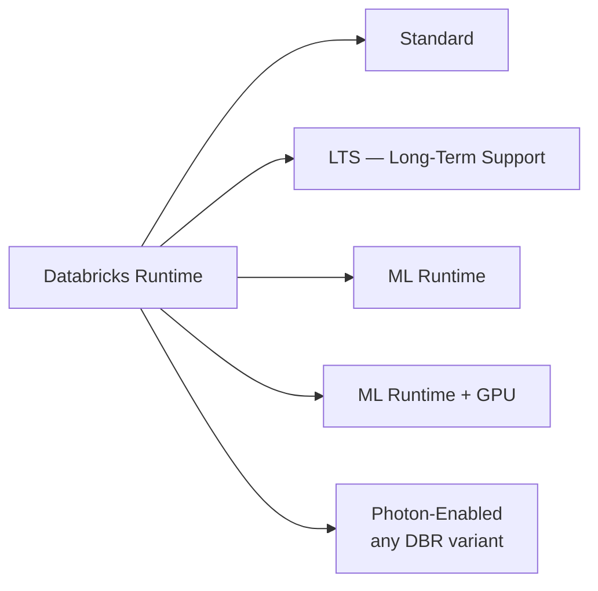

| Variant | What it adds | When to choose |
|---------|--------------|----------------|
| **Standard DBR** | Spark + Delta + Python | Generic data engineering |
| **DBR LTS** (e.g., 14.3 LTS, 15.4 LTS) | Same as standard but **patched ~24 months** | Production stability; cert-style "stable runtime" answers |
| **DBR ML** | Pre-installed pandas, scikit-learn, PyTorch, TensorFlow, MLflow, HuggingFace, XGBoost | ML training and inference workloads |
| **DBR ML + GPU** | DBR ML + CUDA + GPU drivers | Deep-learning training |
| **Photon** | Vectorized C++ query engine; significant speedup on SQL/DataFrame ops; **add-on, not separate runtime** | Any SQL-heavy or DataFrame-heavy workload |

**LTS support window:** ~24 months. Non-LTS releases get ~6 months. For a regulated production environment the canonical recommendation is the latest LTS (e.g., DBR 15.4 LTS in mid-2026).

**Photon:** enabled with a checkbox on classic clusters; always-on for serverless. Photon is a query engine, not a separate runtime — DBR-Standard-15.4-LTS, DBR-ML-15.4-LTS, and DBR-Standard-15.4-LTS-Photon all coexist.

### ⚠️ Exam trap — DBR ML vs DBR Standard for DE work

The DE Associate exam is data engineering, not ML — **DBR Standard (or LTS) is the right answer** for "what runtime should this ETL job use?" The DBR ML runtime is heavier (more libraries → slower cluster startup) and unnecessary for pure ETL.

---

## 6. Pools

**Instance pools** are pre-warmed VMs ready to be attached to a cluster on demand. They reduce cluster startup time from ~5 minutes to ~30 seconds, at the cost of paying for the warm capacity even when idle.

When to use pools:
- Repetitive jobs where startup delay matters.
- Bursty workloads with many small jobs.
- Teams of interactive users where everyone wants fast cluster spin-up.

When not to use pools:
- Always-on streaming workloads (the cluster never restarts).
- Cost-sensitive environments where warm capacity wastes money.

For the exam, recognize that "pools" address the cluster-startup-time problem; serverless solves the same problem differently (with managed compute).

---

## 7. Headline performance features — recognize them on the exam

### 7.1 Photon

- Vectorized C++ execution engine.
- Replaces JVM-based row-at-a-time execution for many operators (scans, joins, aggregations).
- 2–10× speedup on SQL/DataFrame workloads, varies heavily by workload shape.
- Costs more per DBU (~2× the standard rate) but the speedup typically wins on $/query.

### 7.2 Predictive Optimization

- Automatic OPTIMIZE and VACUUM on UC-managed Delta tables.
- Observes query patterns, decides when to compact files and when to expire old versions.
- Default-on for UC-managed tables on newer DBR/UC versions.
- The exam-canonical answer for "how do I keep my tables optimized without manually scheduling OPTIMIZE?"

### 7.3 Liquid Clustering (introduced in Module 04)

- Replaces Z-Order for new tables.
- `CLUSTER BY (...)` at table-creation time.
- Incremental — OPTIMIZE only touches unclustered files.
- `CLUSTER BY AUTO` lets Predictive Optimization choose keys.

### 7.4 Automatic features in LDP

- Automatic schema inference and enforcement.
- Automatic dependency graph among declared tables.
- Automatic CDC bookkeeping via `APPLY CHANGES INTO`.

The exam's "enable features that simplify data layout decisions and optimize query performance" objective maps to: **Photon, Predictive Optimization, Liquid Clustering, Auto Optimize / Auto Compact, and serverless compute.**

---

## 8. Mini quiz (cold)

1. A scheduled ETL Lakeflow Job runs every hour. What cluster type minimizes DBU spend?
2. A team wants zero cluster-management overhead and is okay with compute running in Databricks' cloud account. Which compute do they choose?
3. Where does customer Delta data physically live in a classic compute deployment?
4. Which DBR variant should you choose for a production batch ETL pipeline that you want supported for 2 years?
5. The exam prompt says "hands-off, auto-optimized compute." What two compute choices does that phrase point to?
6. A team is on UC-managed tables. They want OPTIMIZE and VACUUM to happen automatically. What feature satisfies this?
7. Can a classic compute plane and a serverless workload share the same Delta table? Why or why not?

### Answers

1. **Job cluster.** Roughly half the DBU cost of all-purpose. If the prompt mentions "hands-off" specifically, serverless is correct, but pure "minimize DBU" → job cluster.
2. **Serverless compute.** Databricks-managed in Databricks' cloud account, hands-off, sub-minute startup.
3. **In the customer's cloud object storage** (S3 / ADLS Gen2 / GCS). Never in the Databricks control plane.
4. **DBR LTS** (e.g., 15.4 LTS) — ~24 months of patches. Plain DBR Standard gets only ~6 months.
5. **Serverless compute** and (less commonly) **Predictive Optimization on UC managed tables**. The canonical exam answer for "hands-off" is serverless.
6. **Predictive Optimization** — automatically OPTIMIZE and VACUUM UC-managed tables.
7. **Yes.** Delta tables live in customer cloud storage; both classic compute (in customer cloud) and serverless (in Databricks cloud) read/write via short-lived credentials. UC mediates authorization. The same physical table is accessible to either compute plane.

---

## 9. Sanity check before moving on

You should be able to:
- Draw the three-tier architecture diagram from memory.
- List the four compute types and the one-line trigger phrase that maps to each.
- Name three Databricks-managed automation features (Photon, Predictive Optimization, Liquid Clustering).
- Explain why job clusters are cheaper than all-purpose.
- Differentiate DBR LTS vs DBR Standard vs DBR ML.

If any of those are fuzzy, re-read Sections 2, 4, 5, and 7 before continuing to Module 02.


\newpage

# Module 02 — Workspace Basics: Notebooks, Repos, File System, Magic Commands

> **Domain 1 (10%) — Databricks Intelligence Platform**
>
> **Exam objectives covered:**
> - Determine the capabilities of Notebooks functionality.
> - Use Databricks Connect in a data engineering workflow.
> - Use Databricks' built-in debugging tools to troubleshoot a given issue.
>
> **What you must walk away with:** Notebook anatomy and source formats; Git folder (Repos) workflow; the difference between DBFS, workspace files, and UC Volumes; magic commands you must recognize; how Databricks Connect plugs in.

---

## Coverage map (verbatim July 25, 2025 objectives → where taught here)

| Verbatim objective | Taught in section |
|---|---|
| Determine the capabilities of Notebooks functionality | §1 "Notebooks — the development surface" (magics, `%run` vs `dbutils.notebook.run`, source formats, `display` vs `show`, `dbutils` namespaces) |
| Use Databricks Connect in a data engineering workflow | §4 "Databricks Connect — local development against remote compute" |
| Use Databricks' built-in debugging tools to troubleshoot a given issue | §5 "Debugging tools" + §6 "Cluster libraries vs notebook-scoped libraries" |

Cross-references: deeper Spark UI / system-tables debugging in Module 14; UC Volumes governance in Module 15.

---

## 1. Notebooks — the development surface

A Databricks notebook is a sequence of **cells**, each in one of: Python, SQL, Scala, R, or Markdown. The notebook has a **default language** (`Python` is most common for DE work). Any cell can override the default with a **magic command** (`%sql`, `%python`, `%md`, `%r`, `%scala`).

### Cell magic commands you must recognize

| Magic | Effect |
|-------|--------|
| `%python` | This cell runs as Python (override of default) |
| `%sql` | This cell runs as SQL against the attached compute |
| `%scala` | Scala cell |
| `%r` | R cell |
| `%md` | Markdown — rendered, not executed |
| `%sh` | Shell cell — runs on the **driver** node (not executor) |
| `%fs` | Databricks file-system shortcut (`%fs ls /Volumes/main`) |
| `%pip` | Install a Python package into the cluster Python environment (notebook-scoped on serverless) |
| `%conda` | Conda package install (deprecated on newer DBR) |
| `%run /path/to/notebook` | Inline-execute another notebook in the same scope; variables and functions become available |
| `%load` | Load contents of a file into a cell |

### `%run` vs `dbutils.notebook.run`

These both run another notebook but differ critically:

- **`%run /path/to/util`** — inline execution, **same Python interpreter**, variables and functions from the called notebook are visible in the caller. Used for sharing utility functions.
- **`dbutils.notebook.run("/path/to/notebook", timeout=600, arguments={...})`** — runs the other notebook in a **separate context**, returns only its `dbutils.notebook.exit("...")` string. Used for orchestration / parameterized invocation.

Exam scenario: "share helper functions across notebooks" → `%run`. "Call a notebook as a subroutine and capture its return value" → `dbutils.notebook.run`.

### Notebook source formats

| Format | Description | When to use |
|--------|-------------|-------------|
| **`.ipynb`** | Jupyter JSON with embedded outputs | UI default; bad for Git review |
| **`.py` (Databricks source)** | Plain Python with `# Databricks notebook source` header and `# COMMAND ----------` cell separators | Default for Git-tracked notebooks |
| **`.sql` (Databricks source)** | Plain SQL with the same cell separator | SQL-only notebooks under Git |
| **`.scala`, `.r`** | Same pattern for other languages | Rare for DE work |

For source control, **`.py` format wins**. `.ipynb` JSON diffs are unreadable in code review.

### Notebook UI features the exam expects you to know

- **Variable explorer** — pane showing top-level variables in the Python REPL (newer DBR).
- **Built-in plotting** — `display(df)` shows a tabular result with charting controls.
- **Cell-level run time** — each cell shows how long it took to execute.
- **Spark UI link** — every cell that triggered a Spark job has a link to the Spark UI for that job (covered in Module 14).
- **Notebook scheduling** — you can schedule a notebook directly from the UI (creates a Lakeflow Job under the hood).
- **Comments and co-presence** — multiple users can edit the same notebook live.

### `display(df)` vs `df.show()`

- **`display(df)`** — Databricks-only; renders an interactive tabular view with chart options; defaults to showing 1000 rows; supports CSV export.
- **`df.show(n)`** — vanilla PySpark; prints a text table to stdout, default 20 rows.

Exam scenarios that mention "interactive chart" or "exporting to CSV from a notebook" point to `display`.

### `dbutils` — the notebook-only utility namespace

The `dbutils` object exposes Databricks-specific notebook APIs. Key submodules:

| Module | Purpose | Common calls |
|--------|---------|--------------|
| `dbutils.fs` | File system operations | `dbutils.fs.ls("/Volumes/main")`, `dbutils.fs.cp(src, dst)`, `dbutils.fs.mkdirs(...)`, `dbutils.fs.rm(path, recurse=True)` |
| `dbutils.widgets` | Notebook parameters | `dbutils.widgets.text("env", "dev")`, `dbutils.widgets.get("env")` |
| `dbutils.secrets` | Read secrets from secret scopes | `dbutils.secrets.get(scope="prod", key="db_pwd")` |
| `dbutils.notebook` | Notebook orchestration | `dbutils.notebook.run(...)`, `dbutils.notebook.exit("...")` |
| `dbutils.jobs.taskValues` | Pass values between Lakeflow Job tasks | `.set(key, value)`, `.get(taskKey, key, default)` |
| `dbutils.library` | Library install (largely deprecated; use `%pip`) | — |

### ⚠️ Exam trap — `dbutils.secrets.get` masking

Reading a secret with `dbutils.secrets.get(...)` returns the value, but Databricks **masks it in any output, log, or error message** (you see `[REDACTED]`). You can't accidentally print a secret to a notebook log. If a question asks "how do I retrieve a credential safely in a notebook" → `dbutils.secrets.get`, not environment variables and not hardcoded strings.

---

## 2. Repos / Git folders

A **Git folder** (formerly "Repos") in a Databricks workspace is a clone of a remote Git repository. It supports:
- Cloning from GitHub, GitLab, Bitbucket, Azure DevOps Git, AWS CodeCommit.
- Browsing and editing files in the workspace UI.
- Branch checkout, commit, push, pull.
- Pull requests via the remote provider (not in the Databricks UI directly).

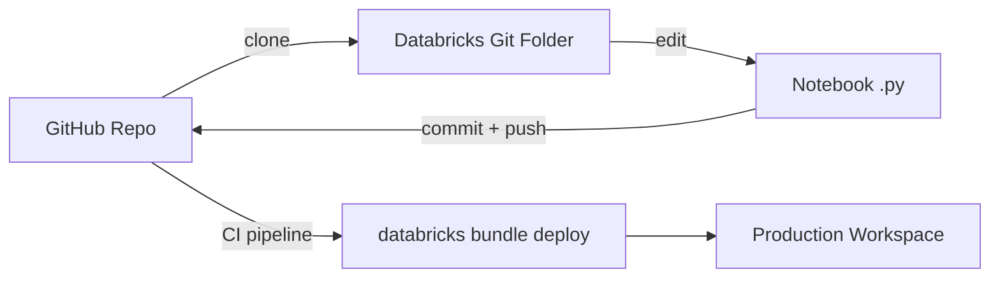

### What Git folders are good at
- Pulling a fresh copy of a feature branch into the workspace.
- Letting devs work in their personal `dev` workspace, push to a feature branch, raise a PR.
- Demo / educational repos cloned and explored interactively.

### What Git folders are NOT good at
- **Not** the production deployment artifact. Production deployments come from **Databricks Asset Bundles** (Module 13), not from a Git folder clone.
- **Not** suited to monorepos. Databricks documents a limit on repo size / file count.
- **Not** designed for heavy concurrent editing — two devs editing the same notebook in a Git folder race.

### Limits to know
- Git folders enforce per-repo size and file limits (varies by region; check docs for current values).
- Notebook UI render limit: 10 MB per notebook.
- Recommended: keep notebooks in `.py` source format; strip outputs before commit.

### ⚠️ Exam trap — "how do I promote to prod?"

If a question asks "what's the recommended way to promote code from dev to prod?" the answer is **Databricks Asset Bundles**, not "use Git folders and run notebooks directly." Git folders are a development surface, not a production deployment mechanism.

---

## 3. File system layers — DBFS vs workspace files vs UC Volumes

Three filesystem layers coexist on a modern Databricks workspace. The exam expects you to recognize each:

### 3.1 DBFS (Databricks File System) — legacy

- A workspace-scoped mount over the cloud object storage created at workspace setup.
- Accessed via `dbfs:/...` or `/dbfs/...` paths.
- **Pre-Unity-Catalog construct.** Bypasses UC authorization. Anyone on the workspace can read anything in DBFS root by default.
- Discouraged for new work; UC Volumes are the replacement.
- Still appears in the UI and is accessible.

### 3.2 Workspace files

- Files inside the **Workspace tree** (alongside notebooks). E.g., a `requirements.txt` next to a notebook.
- Accessed via `/Workspace/Users/<user>/...` paths.
- Subject to workspace-level ACLs.
- Useful for small config files committed via Git folders.
- Not for data. Don't store large datasets here.

### 3.3 UC Volumes — the modern answer

- Files governed by Unity Catalog under a catalog/schema, just like tables.
- Two kinds: **managed volumes** (UC owns the storage location) and **external volumes** (you provide the LOCATION).
- Accessed via:
  - `/Volumes/<catalog>/<schema>/<volume>/<path>` (POSIX-style on cluster)
  - `dbfs:/Volumes/...` (legacy notation, same thing)
  - SQL: `LIST '/Volumes/main/landing/orders'`
- Privileges: `READ VOLUME`, `WRITE VOLUME`.
- The exam-canonical answer for "where do I land unstructured files like JSON, CSV, ML artifacts, model weights, raw logs, …"

### Decision matrix

| Need | Choice |
|------|--------|
| Land raw CSV/JSON files for Auto Loader to consume | **UC Volume** |
| Store small config files alongside a notebook | Workspace files |
| Mount an existing cloud bucket for ad-hoc inspection | UC external Volume (or external location) |
| Anything new on a UC-enabled workspace | UC Volume |
| Legacy code that references `/dbfs/...` paths | DBFS (don't break it; plan migration) |

```sql
-- Create a UC managed volume
CREATE VOLUME main.landing.orders;

-- Reference files inside it
LIST '/Volumes/main/landing/orders/';

-- Auto Loader reads from a volume
SELECT * FROM read_files('/Volumes/main/landing/orders/', format => 'json');
```

### ⚠️ Exam trap — DBFS vs UC Volume defaults

A question may ask "where should new file ingestion land?" The pre-2025 answer was DBFS or a mount. The **post-2025 (and exam-current) answer is a UC Volume.** If two answers are "in `/dbfs/landing/`" vs "in `/Volumes/main/landing/`", pick the Volume.

---

## 4. Databricks Connect — local development against remote compute

**Databricks Connect** is a Python library that lets you run PySpark / Spark Connect code from your laptop or IDE, with execution happening on a remote Databricks cluster.

### How it works

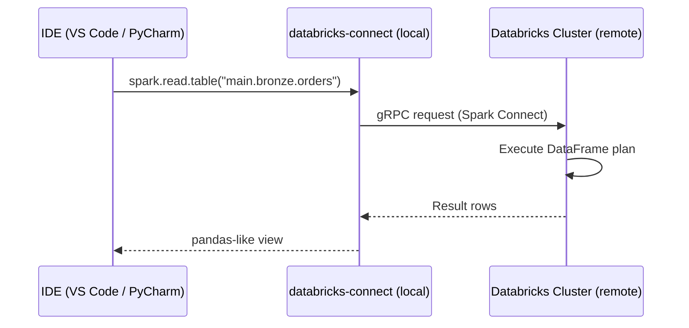

### When to use
- IDE-first development with breakpoints, linters, type-checking.
- Running unit tests against a cluster from a local Python environment.
- Building libraries (Python wheels) that are deployed via DAB later.

### When NOT to use
- Heavy compute that requires fast iteration on cluster — at that point, just use a notebook.
- Production execution — Databricks Connect is for development.

### Version compatibility

The `databricks-connect` PyPI package must match the **DBR version** of the cluster. E.g., `databricks-connect==15.4.*` for DBR 15.4. Pin the major.minor.

### Setup essentials

```bash
pip install databricks-connect==15.4.*
databricks auth login --host https://<workspace>.cloud.databricks.com
```

```python
from databricks.connect import DatabricksSession
spark = DatabricksSession.builder.getOrCreate()
df = spark.read.table("main.bronze.orders")
print(df.count())
```

### ⚠️ Exam trap — Databricks Connect vs Databricks CLI

- **Databricks Connect** is a Python library to run PySpark **code execution** remotely.
- **Databricks CLI** (`databricks` command) is for **administration** (deploy bundles, list jobs, manage secrets) — does not run PySpark.

If a question says "I want to use my IDE to write PySpark and have it execute on Databricks", that is Databricks Connect. If a question says "I want to deploy a bundle from my CI pipeline", that is the Databricks CLI.

---

## 5. Debugging tools

The exam objective "use Databricks' built-in debugging tools to troubleshoot a given issue" covers a small but specific set of surfaces:

### 5.1 Cell output + stack traces

- Python exceptions render with a full traceback in the cell output. Click the "↗ Spark UI" link on a failing cell to see the Spark side.
- For SQL errors, the message includes the error class and SQL state.

### 5.2 The Spark UI (Module 14 deep dive)

- Linked from any cell that ran a Spark action.
- Tabs: Jobs, Stages, Storage, Environment, Executors, SQL/DataFrame.
- The "SQL/DataFrame" tab is where you confirm whether your query did a broadcast join, how many shuffle partitions, and the physical plan.

### 5.3 Cluster event log

- Compute → Cluster → "Event log" tab.
- Shows resize events, driver/executor crashes, init script failures.

### 5.4 Driver logs and executor logs

- Compute → Cluster → "Driver logs" tab → `log4j-active.log`, `stderr`, `stdout`.
- Executor logs accessible per-executor under the Executors tab in the Spark UI.

### 5.5 Job run output

- Lakeflow Jobs → run → click into a task → "Output" tab.
- For LDP pipelines: Pipeline → Update → event log (this is a Delta table you can query: `event_log(<pipeline_id>)`).

### 5.6 `dbutils` interactive helpers

- `dbutils.fs.head("/Volumes/.../file.json")` — preview a file.
- `dbutils.help()` — list available `dbutils` methods.

### Typical failure modes and where to look

| Symptom | First place to look |
|---------|---------------------|
| "Job failed" without details | Lakeflow Jobs → run → task output |
| Notebook cell errored | Cell output stack trace; Spark UI link from the failed cell |
| Streaming query stuck (no progress) | Spark UI → Structured Streaming tab |
| Cluster won't start | Cluster event log; init script failures |
| LDP pipeline expectation violated | Pipeline event log (DataQuality events) |
| Long-running stage / skew | Spark UI → Stages → task duration histogram |
| Out-of-memory error | Spark UI → Executors → GC time and memory usage |

---

## 6. Cluster libraries vs notebook-scoped libraries

### Cluster libraries
- Installed on the cluster at startup.
- Available to all notebooks attached to that cluster.
- Persist for the cluster lifetime.
- Configured via Cluster UI → Libraries tab, or in the cluster JSON, or in a DAB job_cluster spec.

### Notebook-scoped libraries
- Installed with `%pip install <package>` inside a notebook cell.
- Visible only to that notebook's session.
- On classic compute, the install **restarts the Python kernel** in that notebook.
- On serverless, notebook-scoped installs are the default (no shared cluster Python env).

### Best practice
- Pin versions: `%pip install pandas==2.2.*`.
- For production jobs, install via the job's cluster library spec (not via `%pip` in code). Reasons: reproducibility, no kernel restart in mid-run.

---

## 7. Mini quiz (cold)

1. You want to share Python utility functions across notebooks. Which command — `%run` or `dbutils.notebook.run`?
2. A new ingestion pipeline lands JSON files. Where should they land on a UC-enabled workspace?
3. Why is `.py` notebook format preferred over `.ipynb` for source control?
4. What's the difference between `display(df)` and `df.show()`?
5. You want to write PySpark code in your local VS Code with breakpoints, executing against a remote Databricks cluster. Which tool do you use?
6. A teammate hardcoded a database password in a notebook. What's the right replacement?
7. Why does Databricks recommend storing notebooks in Git as `.py` files instead of `.ipynb` files?

### Answers

1. **`%run`** — shares the Python REPL scope so utility functions become directly callable.
2. **In a UC Volume**, e.g., `/Volumes/main/landing/orders/`. Not DBFS.
3. **JSON-diff readability and embedded outputs.** `.ipynb` JSON diffs are unreadable in PR review and embed cell outputs that bloat the repo.
4. **`display(df)`** is Databricks-specific, renders an interactive tabular view with chart options; **`df.show(n)`** prints a text table to stdout. `display` supports up to 1000 rows by default; `show` defaults to 20.
5. **Databricks Connect.** It executes PySpark remotely while letting you keep the IDE workflow locally.
6. **`dbutils.secrets.get(scope="...", key="...")`** — Databricks-managed secret scope. The retrieved value is masked in any output / log automatically.
7. **Three reasons:** (a) `.ipynb` JSON diffs are unreadable in code review; (b) embedded outputs bloat the repo and may leak data; (c) `.py` source format integrates cleanly with `black`, `pylint`, and linters.

---

## 8. Sanity check before moving on

You should be able to:
- Name 5 magic commands and what each does.
- Compare `%run` vs `dbutils.notebook.run` correctly.
- List the three file-system layers (DBFS, workspace files, UC Volumes) and pick UC Volumes for any new use case.
- Explain when Databricks Connect is the right tool.
- Point to where you'd look for: a failed notebook cell traceback, a stuck streaming query's progress, an LDP expectation violation.

If any of those are fuzzy, re-read Sections 1, 3, 4, and 5.


\newpage

# Module 03 — Delta Lake Fundamentals

> **Domain 2 (30%) — Development and Ingestion**
>
> **Exam objectives covered:**
> - Identify DDL/DML features.
> - (Foundation for) Implement data pipelines using LDP.
> - (Foundation for) Compute aggregations and metrics with PySpark DataFrames.
>
> **What you must walk away with:** Delta table mental model; the exact semantics of `CREATE TABLE`, `CREATE OR REPLACE TABLE`, `CREATE TABLE IF NOT EXISTS`, `CREATE TABLE AS SELECT`; the difference between `INSERT INTO`, `UPDATE`, `DELETE`, and `MERGE INTO`; how to use time travel; how schema evolution works; generated columns; the transaction log at a level deep enough to debug.

---

## Coverage map (verbatim July 25, 2025 objectives → where taught here)

| Verbatim objective | Taught in section |
|---|---|
| Identify DDL features (CREATE/REPLACE/IF NOT EXISTS, CTAS, ALTER) | §2 "Creating a Delta table — four DDL forms" + §5 "Schema evolution" + §6 "Generated columns" |
| Identify DML features (INSERT/UPDATE/DELETE/MERGE) | §3 "DML — inserting, updating, deleting, merging" |
| Sample Question 4 (CREATE OR REPLACE TABLE) | §2.4 "Exam-canonical mapping (Question 4)" |
| Sample Question 5 (INSERT INTO … VALUES) | §3.5 "Exam-canonical mapping (Question 5)" |
| Foundations for LDP / aggregations | §4 "Time travel" + §8 "Change Data Feed" + §9 "ACID concurrency model" (referenced from Modules 07, 08, 10) |

Cross-references: OPTIMIZE / VACUUM / Liquid Clustering in Module 04; CDF reader-side in Module 09; APPLY CHANGES INTO in Module 10.

---

## 1. The mental model — `_delta_log/` is the table

A **Delta table** is two things:
1. A directory of **Parquet data files**.
2. A `_delta_log/` subdirectory holding the **transaction log** — JSON commits and periodic Parquet checkpoints.

```
/Volumes/main/sales/orders/
├── part-00000-xxxx.parquet
├── part-00001-xxxx.parquet
├── part-00002-xxxx.parquet
└── _delta_log/
    ├── 00000000000000000000.json     ← commit 0 (table creation)
    ├── 00000000000000000001.json     ← commit 1 (INSERT)
    ├── 00000000000000000002.json     ← commit 2 (MERGE)
    ├── …
    ├── 00000000000000000010.checkpoint.parquet
    ├── 00000000000000000010.json
    └── _last_checkpoint
```

The Parquet files are immutable. The `_delta_log/` is the source of truth for **what files belong to the current table version**, **what schema is current**, and **what protocol version readers/writers must support**.

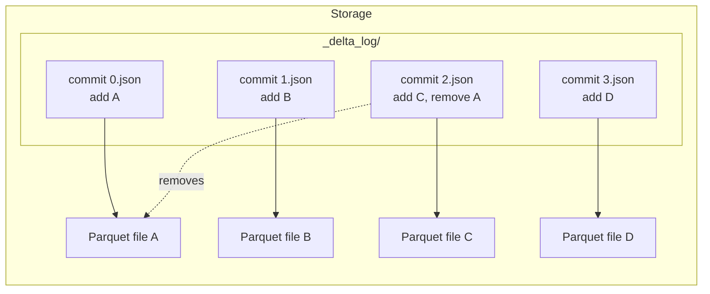

Each commit JSON is an ordered list of **action** records — `add`, `remove`, `metaData` (schema), `protocol`, `commitInfo`, `txn`, `cdc`, `domainMetadata`. To answer "what does the table look like at version N?" you replay actions from version 0 (or the most recent checkpoint) up to N.

### Why this matters for the exam

The exam doesn't ask you to debug the transaction log directly, but every feature on the exam — time travel, schema evolution, MERGE, ACID — falls out of this mental model. Understand the model and the features become obvious.

---

## 2. Creating a Delta table — four DDL forms

### 2.1 `CREATE TABLE` — error if exists

```sql
CREATE TABLE main.sales.orders (
  order_id STRING,
  customer_id STRING,
  amount DECIMAL(18,2),
  order_ts TIMESTAMP
);
```

- Creates an empty table.
- **Errors** if the table already exists.
- Default format on a UC-enabled workspace: **Delta**. (You can omit `USING DELTA`.)

### 2.2 `CREATE TABLE IF NOT EXISTS` — idempotent create

```sql
CREATE TABLE IF NOT EXISTS main.sales.orders (
  order_id STRING,
  customer_id STRING,
  amount DECIMAL(18,2),
  order_ts TIMESTAMP
);
```

- Creates if absent; **no-op if the table already exists** (does NOT change the existing table).
- Right answer when you want safe "create if missing".
- Wrong answer when the question wants "recreate the table fresh."

### 2.3 `CREATE OR REPLACE TABLE` — drop-and-recreate semantics

```sql
CREATE OR REPLACE TABLE main.sales.orders (
  order_id STRING,
  customer_id STRING,
  amount DECIMAL(18,2),
  order_ts TIMESTAMP
);
```

- Works whether the table exists or not.
- **If the table exists, it is dropped and recreated** with the new schema.
- The table's identity (name) is preserved but its history may not be (treat as a fresh start for most purposes).
- Right answer for **"create an empty Delta table, regardless of whether one already exists with this name."**

### 2.4 `CREATE TABLE AS SELECT` (CTAS) — create + populate

```sql
CREATE TABLE main.sales.orders_today AS
SELECT * FROM main.bronze.orders WHERE order_ts >= current_date();
```

- Creates the table **and** populates it from the SELECT.
- Schema is inferred from the SELECT — **you cannot specify column types in the DDL part of a CTAS.**
- Used for derived tables / one-shot snapshots.

**`CREATE OR REPLACE TABLE … AS SELECT`** also works — drops-and-recreates with the SELECT results.

### Exam-canonical mapping (Question 4 in the official guide)

> "Create an empty Delta table regardless of whether a table already exists with this name."

**Correct:** `CREATE OR REPLACE TABLE …`.

Distractors and why they're wrong:
- `CREATE TABLE IF NOT EXISTS` — leaves existing tables unchanged; doesn't satisfy "regardless of whether it exists."
- `CREATE TABLE AS SELECT employeeId STRING …` — invalid syntax. CTAS doesn't take a column-type list.
- `CREATE OR REPLACE TABLE … WITH COLUMNS (...) USING DELTA` — `WITH COLUMNS` is not valid SQL DDL.

### ⚠️ Exam trap — `CREATE OR REPLACE TABLE` is not the same as `INSERT OVERWRITE`

`CREATE OR REPLACE TABLE` rewrites the schema and replaces the data. `INSERT OVERWRITE` keeps the schema but replaces rows. Different operations. If a question says "preserve schema, replace data" → INSERT OVERWRITE. If "redefine the table" → CREATE OR REPLACE.

---

## 3. DML — inserting, updating, deleting, merging

### 3.1 `INSERT INTO … VALUES (...)` — append

```sql
INSERT INTO main.sales.orders VALUES
  ('a1', 6, 9.4),
  ('a2', 7, 12.5);
```

- Appends new rows to the table.
- Column order is positional unless you specify column names.
- Right answer for **"append a new row to an existing Delta table."**

### 3.2 `INSERT OVERWRITE … VALUES (...)` — replace all rows

```sql
INSERT OVERWRITE main.sales.orders VALUES
  ('a1', 6, 9.4);
```

- **Replaces all rows** in the table (or all rows in matched partitions, with `PARTITION (…)`).
- Schema stays.

### 3.3 `UPDATE … SET … WHERE …`

```sql
UPDATE main.sales.orders
SET amount = 0
WHERE order_id = 'a1';
```

- Modifies existing rows.
- Does NOT add rows. Cannot be used to insert.

### 3.4 `DELETE FROM … WHERE …`

```sql
DELETE FROM main.sales.orders WHERE amount < 0;
```

- Removes matching rows.
- Physical Parquet files are rewritten (or, with **deletion vectors** enabled, just marked deleted in a sidecar bitmap).

### 3.5 `MERGE INTO …` — the upsert workhorse

```sql
MERGE INTO main.sales.orders t
USING staging.orders_changes s
ON  t.order_id = s.order_id
WHEN MATCHED AND s.op = 'D'      THEN DELETE
WHEN MATCHED AND s.op = 'U'      THEN UPDATE SET
                                    t.amount   = s.amount,
                                    t.order_ts = s.order_ts
WHEN NOT MATCHED AND s.op = 'I'  THEN INSERT (order_id, customer_id, amount, order_ts)
                                    VALUES (s.order_id, s.customer_id, s.amount, s.order_ts);
```

- Single statement = idempotent upsert.
- Handles inserts, updates, and deletes in one pass.
- Supports `MERGE INTO … USING … ON … WHEN MATCHED THEN UPDATE SET *` (assign all matching columns) and `WHEN NOT MATCHED THEN INSERT *`.
- For CDC inside LDP pipelines, **prefer `APPLY CHANGES INTO`** (Module 10) — it handles bookkeeping for you.

### Exam-canonical mapping (Question 5)

> "Append the new record (id='a1', rank=6, rating=9.4) to existing Delta table my_table."

**Correct:** `INSERT INTO my_table VALUES ('a1', 6, 9.4)`.

Distractors:
- `UPDATE VALUES (...) my_table` — invalid syntax; UPDATE modifies, doesn't insert.
- `UPDATE my_table VALUES (...)` — invalid; UPDATE doesn't take VALUES.
- `INSERT VALUES (...) INTO my_table` — wrong syntax order; INTO comes before VALUES.

### ⚠️ Exam trap — UPDATE doesn't append

A common distractor uses `UPDATE` for an "insert this new record" prompt. UPDATE only modifies existing rows. Append → INSERT.

---

## 4. Time travel

Delta lets you query the table as of an earlier version or timestamp.

```sql
-- By version number
SELECT * FROM main.sales.orders VERSION AS OF 42;

-- By timestamp
SELECT * FROM main.sales.orders TIMESTAMP AS OF '2026-05-01 12:00:00';

-- Same in PySpark
df = spark.read.option("versionAsOf", 42).table("main.sales.orders")
df = spark.read.option("timestampAsOf", "2026-05-01 12:00:00").table("main.sales.orders")
```

### `DESCRIBE HISTORY` — see what changed

```sql
DESCRIBE HISTORY main.sales.orders;
```

Returns a table with columns: `version`, `timestamp`, `userId`, `userName`, `operation` (e.g., `MERGE`, `WRITE`, `OPTIMIZE`), `operationParameters`, `operationMetrics` (rows added/deleted/updated, num files added/removed), `isolationLevel`, `engineInfo`.

### `RESTORE TABLE` — roll back

```sql
RESTORE TABLE main.sales.orders TO VERSION AS OF 42;
RESTORE TABLE main.sales.orders TO TIMESTAMP AS OF '2026-05-01 12:00:00';
```

Creates a new commit that makes the table look like it did at the target version. Useful for "oops, the last MERGE corrupted the table" — restore to before the MERGE.

### How far back can you time travel?

Time travel is bounded by `VACUUM` retention. If VACUUM has been run after the version you want, the underlying Parquet files for that version may have been physically deleted, in which case the time-travel query errors.

- Default retention: **7 days** (168 hours).
- Configure via `delta.deletedFileRetentionDuration`.

### ⚠️ Exam trap — time travel after VACUUM

You can time-travel to versions older than your VACUUM retention only if the relevant files haven't been deleted. **Don't promise time travel beyond your VACUUM window.** This is a frequent diagnose-style question: "we ran VACUUM 168 HOURS yesterday; can we now query version-from-30-days-ago?" — No.

---

## 5. Schema evolution

Delta tables enforce schema by default — a write whose schema doesn't match the table's schema **errors out**. Schema evolution lets you change the table's schema.

### 5.1 Append-mode schema evolution with `mergeSchema`

```python
(df.write
   .format("delta")
   .mode("append")
   .option("mergeSchema", "true")
   .saveAsTable("main.sales.orders"))
```

- Adds new columns from the DataFrame's schema to the table.
- Existing columns must match types (with some compatible widening — int→long, etc., depending on settings).

### 5.2 Overwrite-mode schema replacement with `overwriteSchema`

```python
(df.write
   .format("delta")
   .mode("overwrite")
   .option("overwriteSchema", "true")
   .saveAsTable("main.sales.orders"))
```

- Replaces the table's schema with the DataFrame's.
- Use cautiously — drops columns not in the new schema (data in those columns is still in the Parquet files but the table no longer sees them).

### 5.3 SQL DDL for schema change

```sql
-- Add a column
ALTER TABLE main.sales.orders ADD COLUMNS (currency STRING);

-- Rename a column (requires column mapping enabled)
ALTER TABLE main.sales.orders RENAME COLUMN cust_id TO customer_id;

-- Drop a column (requires column mapping)
ALTER TABLE main.sales.orders DROP COLUMN deprecated_field;

-- Change column type (limited — widening only)
ALTER TABLE main.sales.orders CHANGE COLUMN amount TYPE DECIMAL(20,2);
```

`RENAME` and `DROP COLUMN` require **column mapping mode** enabled:
```sql
ALTER TABLE main.sales.orders SET TBLPROPERTIES (
  'delta.columnMapping.mode' = 'name',
  'delta.minReaderVersion' = '2',
  'delta.minWriterVersion' = '5'
);
```

### 5.4 Type widening

Newer Delta (table feature `typeWidening`) supports type widening without rewriting files: int → long, float → double, etc.

### ⚠️ Exam trap — schema evolution on Auto Loader

Auto Loader's schema-evolution behavior is a **separate** topic (Module 06). The Auto Loader options are `cloudFiles.schemaEvolutionMode` with values `addNewColumns`, `rescue`, `failOnNewColumns`, `none`. These control how new columns in the **source files** are handled by the stream. Don't confuse them with `mergeSchema` / `overwriteSchema` on the writer side.

---

## 6. Generated columns

```sql
CREATE TABLE main.sales.events (
  event_id STRING,
  event_ts TIMESTAMP,
  event_date DATE GENERATED ALWAYS AS (CAST(event_ts AS DATE))
);
```

- Delta computes `event_date` automatically on every insert.
- You cannot manually write to a generated column (writes fail if you try).
- Useful for partitioning / clustering by derived values without forcing every writer to compute them.
- Generated columns enable **partition pruning** even when the user filters on the source column (`WHERE event_ts BETWEEN ...`).

### Identity columns

```sql
CREATE TABLE main.sales.events (
  id BIGINT GENERATED ALWAYS AS IDENTITY,
  event_ts TIMESTAMP
);
```

- Auto-incrementing.
- **No gap guarantee** — concurrent writers may produce non-contiguous IDs.
- `GENERATED ALWAYS` blocks explicit writes; `GENERATED BY DEFAULT` allows them.

---

## 7. Table properties you'll see on the exam

```sql
ALTER TABLE main.sales.orders SET TBLPROPERTIES (
  'delta.enableChangeDataFeed' = 'true',
  'delta.enableDeletionVectors' = 'true',
  'delta.dataSkippingNumIndexedCols' = '32',
  'delta.checkpointInterval' = '10',
  'delta.deletedFileRetentionDuration' = 'interval 7 days',
  'delta.logRetentionDuration' = 'interval 30 days',
  'delta.tuneFileSizesForRewrites' = 'true'
);
```

| Property | What it does |
|----------|--------------|
| `delta.enableChangeDataFeed` | Enables CDF — read CDC events via `table_changes(...)` |
| `delta.enableDeletionVectors` | Marks deletes in a sidecar bitmap instead of rewriting Parquet (faster MERGE/DELETE/UPDATE) |
| `delta.dataSkippingNumIndexedCols` | First N columns get min/max stats in the log (default 32) |
| `delta.checkpointInterval` | Materialize a checkpoint every N commits (default 10) |
| `delta.deletedFileRetentionDuration` | How long deleted files are retained before VACUUM may delete them (default 7 days) |
| `delta.logRetentionDuration` | How long old log files are retained (default 30 days) |

---

## 8. Change Data Feed (CDF)

Enable CDF, then read changes since a version:

```sql
-- Enable
ALTER TABLE main.sales.orders SET TBLPROPERTIES (delta.enableChangeDataFeed = true);

-- Read changes between two versions
SELECT * FROM table_changes('main.sales.orders', 42, 47);

-- Read changes since a timestamp
SELECT * FROM table_changes('main.sales.orders', '2026-05-01');
```

Each returned row has additional columns:
- `_change_type` — `insert`, `update_preimage`, `update_postimage`, `delete`.
- `_commit_version` — the commit that produced this change.
- `_commit_timestamp` — when the commit happened.

Use case: **downstream consumers** can subscribe to changes without polling the full table. Inside LDP, CDF is one of the substrates that `APPLY CHANGES INTO` builds on.

### ⚠️ Exam trap — CDF is opt-in

CDF is **not on by default**. If a question describes a pipeline reading CDC events from `table_changes(...)` and asks "what setting must be enabled?" — the answer is `delta.enableChangeDataFeed = true`.

---

## 9. ACID concurrency model

Delta uses **optimistic concurrency** with **atomic file rename** as the commit primitive:

1. A writer reads the current latest version `V`.
2. Stages its changes (writes new Parquet files).
3. Atomically renames its new commit file to `V+1.json` in `_delta_log/`.
4. If another writer wrote `V+1` first, this writer's rename fails. It re-reads, applies conflict-resolution rules (e.g., concurrent inserts into disjoint files auto-retry; concurrent UPDATEs to the same files fail), and tries again at `V+2`.

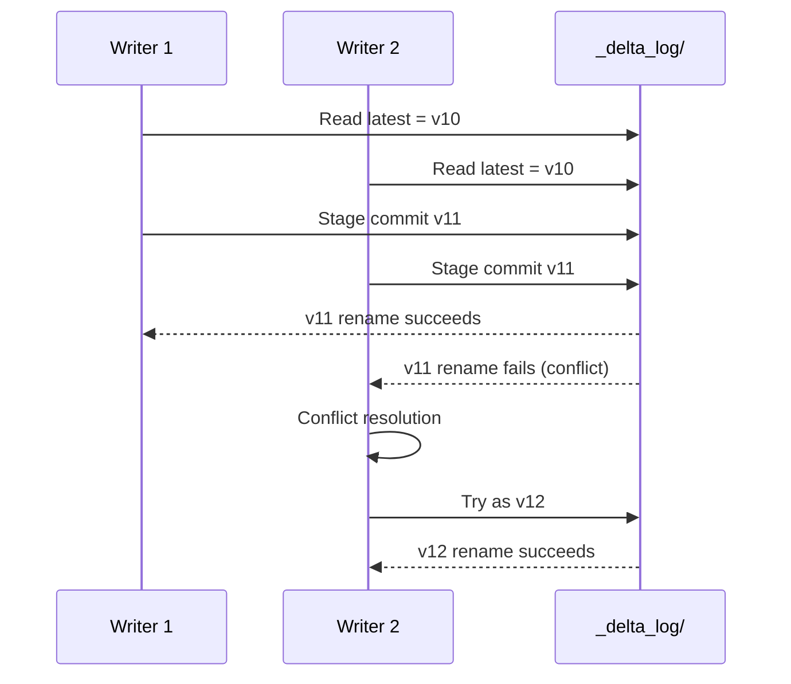

**Implication:** Delta is ACID at the table level, not the row level. Two writers updating disjoint rows in the same partition will both succeed (conflict resolution permits it). Two writers updating overlapping rows in the same partition — one wins, the other gets `ConcurrentAppendException` and must retry.

For most exam scenarios, you just need to know:
- Delta writes are atomic — partial failures don't corrupt the table.
- Concurrent writers are supported but high contention will cause retries.
- A reader sees a snapshot at a specific version — readers never see partial writes.

---

## 10. Putting it together — a realistic Bronze→Silver flow

```sql
-- Bronze: raw orders ingested via Auto Loader (covered in Module 06)
CREATE TABLE IF NOT EXISTS main.bronze.orders (
  raw_json STRING,
  source_file STRING,
  ingest_ts TIMESTAMP
);

-- Silver: cleaned and typed
CREATE OR REPLACE TABLE main.silver.orders AS
SELECT
  get_json_object(raw_json, '$.order_id') AS order_id,
  get_json_object(raw_json, '$.customer_id') AS customer_id,
  CAST(get_json_object(raw_json, '$.amount') AS DECIMAL(18,2)) AS amount,
  TO_TIMESTAMP(get_json_object(raw_json, '$.ts')) AS order_ts,
  ingest_ts
FROM main.bronze.orders;

-- Subsequent MERGE for upserts from new Bronze data
MERGE INTO main.silver.orders t
USING (
  SELECT
    get_json_object(raw_json, '$.order_id') AS order_id,
    get_json_object(raw_json, '$.customer_id') AS customer_id,
    CAST(get_json_object(raw_json, '$.amount') AS DECIMAL(18,2)) AS amount,
    TO_TIMESTAMP(get_json_object(raw_json, '$.ts')) AS order_ts,
    ingest_ts
  FROM main.bronze.orders
  WHERE ingest_ts > (SELECT COALESCE(MAX(ingest_ts), '1900-01-01') FROM main.silver.orders)
) s
ON t.order_id = s.order_id
WHEN MATCHED THEN UPDATE SET *
WHEN NOT MATCHED THEN INSERT *;

-- Check history
DESCRIBE HISTORY main.silver.orders;

-- Roll back if MERGE corrupted the table
RESTORE TABLE main.silver.orders TO VERSION AS OF 5;
```

---

## 11. Mini quiz (cold)

1. Which DDL command creates an empty Delta table regardless of whether a table with that name already exists?
2. What's wrong with `CREATE TABLE my_table AS SELECT employeeId STRING, startDate DATE, avgRating FLOAT`?
3. Which DML appends a new row `('a1', 6, 9.4)` to an existing Delta table?
4. After a bad MERGE, how do you roll the table back to the state before the MERGE?
5. You want to query a table as it was 10 days ago. Default VACUUM retention is 7 days. Will this work? Why or why not?
6. To enable Change Data Feed, what property must you set?
7. What's the difference between `mergeSchema=true` and `overwriteSchema=true`?
8. What's the difference between `INSERT OVERWRITE` and `CREATE OR REPLACE TABLE`?

### Answers

1. **`CREATE OR REPLACE TABLE`.** Works whether the table exists or not; drops-and-recreates if it does.
2. **CTAS doesn't accept a column-type list.** With CTAS, schema is inferred from the SELECT. Either use `CREATE TABLE … (col types …)` then `INSERT`, or `CREATE TABLE … AS SELECT col1, col2, …` from a real source.
3. **`INSERT INTO my_table VALUES ('a1', 6, 9.4)`.** UPDATE only modifies existing rows; INSERT INTO is the append form.
4. **`RESTORE TABLE main.x.y TO VERSION AS OF <pre-merge version>`** — find the right version via `DESCRIBE HISTORY` first.
5. **It may not work.** Time travel is bounded by VACUUM retention. If files for that 10-day-old version have been VACUUMed, the query errors.
6. **`delta.enableChangeDataFeed = true`** — set via `ALTER TABLE … SET TBLPROPERTIES (...)`.
7. **`mergeSchema=true`** in append mode **adds new columns** from the DataFrame to the table. **`overwriteSchema=true`** in overwrite mode **replaces the table's schema** with the DataFrame's (can drop columns).
8. **`INSERT OVERWRITE`** keeps the schema and replaces rows. **`CREATE OR REPLACE TABLE`** redefines the table including its schema.

---

## 12. Sanity check before moving on

You should be able to:
- Differentiate all four CREATE TABLE forms.
- Write `INSERT INTO`, `UPDATE`, `DELETE`, and `MERGE INTO` syntax from memory.
- Use `VERSION AS OF` / `TIMESTAMP AS OF` and `RESTORE TABLE`.
- Explain why time travel is bounded by VACUUM retention.
- Enable CDF via table property.
- Describe the optimistic-concurrency model in two sentences.

If any of those are fuzzy, re-read Sections 2, 3, 4, and 8.


\newpage

# Module 04 — Delta Table Management: OPTIMIZE, VACUUM, Liquid Clustering, Managed vs External

> **Domain 2 (30%) — Development and Ingestion**
> **Domain 5 (11%) — Data Governance & Quality** (managed vs external)
>
> **Exam objectives covered:**
> - Enable features that simplify data layout decisions and optimize query performance.
> - Explain the difference between managed and external tables.
> - Identify DDL features.
>
> **What you must walk away with:** OPTIMIZE and ZORDER vs Liquid Clustering; the VACUUM 7-day floor and why it exists; Predictive Optimization; the **managed vs external DROP-semantics trap**; CONVERT TO DELTA.

---

## Coverage map (verbatim July 25, 2025 objectives → where taught here)

| Verbatim objective | Taught in section |
|---|---|
| Enable features that simplify data layout decisions and optimize query performance | §1 OPTIMIZE + Auto Optimize/Compact, §2 ZORDER, §3 Liquid Clustering, §5 Predictive Optimization |
| Explain the difference between managed and external tables | §6 "Managed vs external tables — the high-value exam topic" (DROP semantics, PO scope, when to choose external) |
| Identify DDL features (CONVERT TO DELTA, ALTER TABLE … CLUSTER BY, ALTER TABLE … SET TBLPROPERTIES, ENABLE PREDICTIVE OPTIMIZATION) | §1, §3, §5, §7 CONVERT TO DELTA, §8 UniForm |

Cross-references: Module 03 for CREATE TABLE DDL; Module 15 for UC governance of managed/external; Module 14 for system tables.

---

## 1. OPTIMIZE — file compaction

Delta tables on streaming or frequent-write workloads accumulate **small files** — one per micro-batch, one per concurrent writer, one per partition per write. Small files murder query performance: an executor reading 100 1-MB files has 100 file-open overheads vs. 1 file-open for the equivalent 100-MB consolidated file.

`OPTIMIZE` runs a **bin-packing algorithm**:

```sql
OPTIMIZE main.silver.orders;
```

What it does:
1. Lists files in the table (or partitions, with a `WHERE` filter).
2. Filters to files smaller than `spark.databricks.delta.optimize.maxFileSize` (default **1 GB**).
3. Packs them sequentially into ~1 GB target files.
4. Rewrites and commits.

**Key properties:**
- **Idempotent** — running OPTIMIZE again is a no-op if files are already at target size.
- **Online** — doesn't block readers or writers; uses optimistic concurrency.
- **Optional partition / WHERE scope** — `OPTIMIZE t WHERE event_date = '2026-05-01'` only touches that partition.
- **File size tunable** — for very large tables, set `maxFileSize = 2 GB`; for high-concurrency MERGE workloads, smaller files (256–512 MB) reduce write amplification.

```sql
-- Auto-tune file size based on read/write ratio
ALTER TABLE main.silver.orders
SET TBLPROPERTIES ('delta.tuneFileSizesForRewrites' = 'true');
```

### Auto Optimize / Auto Compact

Two related table properties:

```sql
ALTER TABLE main.silver.orders SET TBLPROPERTIES (
  'delta.autoOptimize.optimizeWrite' = 'true',
  'delta.autoOptimize.autoCompact' = 'true'
);
```

- **`optimizeWrite`** — repartitions the DataFrame before writing so each Spark partition produces a reasonably-sized file.
- **`autoCompact`** — after each write, if the partition has many small files, runs a mini-OPTIMIZE on it.

These reduce the need to schedule explicit OPTIMIZE. For UC-managed tables, **Predictive Optimization** subsumes them.

---

## 2. ZORDER BY — multi-dimensional clustering (legacy default)

`OPTIMIZE … ZORDER BY (col1, col2)` rewrites files so that rows close in the multi-dimensional space of `(col1, col2)` end up in the same file.

```sql
OPTIMIZE main.silver.orders ZORDER BY (customer_id, event_date);
```

Why this helps queries: with min/max statistics in the log, files are skipped if the query's filter on `customer_id` doesn't intersect the file's range. Without clustering, customer_id values are randomly distributed across files → no skipping. With ZORDER, similar customer_ids cluster → effective skipping.

**ZORDER properties:**
- Works best with **1–4 columns** — more degrades the Z-curve fragmentation.
- **Rewrite-heavy** — every OPTIMIZE ZORDER pass rewrites the table from scratch. O(table size).
- Does **NOT** record cluster identity in the log — subsequent passes redo the same work.
- Being **superseded by Liquid Clustering** for new tables (2024+).

### ⚠️ Exam trap — ZORDER vs Liquid Clustering

For new tables on the current exam, **Liquid Clustering is the recommended default.** Recognize ZORDER on older code/tables but pick Liquid Clustering for greenfield scenarios.

---

## 3. Liquid Clustering — the new default

**Liquid Clustering (LC)** records cluster identity (a "ZCube ID") in the transaction log. Subsequent OPTIMIZE passes only touch **unclustered** ZCubes — making clustering **incremental** rather than full-rewrite.

```sql
-- At table-creation time
CREATE TABLE main.silver.orders (
  order_id STRING,
  customer_id STRING,
  amount DECIMAL(18,2),
  order_ts TIMESTAMP,
  event_date DATE GENERATED ALWAYS AS (CAST(order_ts AS DATE))
) CLUSTER BY (customer_id, event_date);

-- Change clustering keys later (no full rewrite)
ALTER TABLE main.silver.orders CLUSTER BY (event_date);

-- Drop clustering
ALTER TABLE main.silver.orders CLUSTER BY NONE;
```

**Properties:**
- Uses a **Hilbert curve** (better locality than the Z-curve at higher dimensions).
- **Up to 4 clustering keys.**
- **Cannot combine with partitioning** — Liquid Clustering supersedes partitioning.
- **`CLUSTER BY AUTO`** lets Predictive Optimization choose keys based on observed query patterns.
- **Migration from ZORDER / partitioned:** `ALTER TABLE … CLUSTER BY (…)`; subsequent OPTIMIZE is incremental.

```sql
-- Automatic key selection
CREATE TABLE main.silver.orders (
  order_id STRING,
  customer_id STRING,
  amount DECIMAL(18,2),
  order_ts TIMESTAMP
) CLUSTER BY AUTO;
```

### When to choose Liquid Clustering

| Scenario | Choice |
|----------|--------|
| Greenfield Delta table, queries vary | **Liquid Clustering AUTO** |
| Known dominant filter (e.g., `customer_id`) | **Liquid Clustering** with explicit keys |
| Need to query by date primarily, low cardinality | Could partition, but **Liquid Clustering** is fine |
| Legacy table on ZORDER | Leave alone, or migrate via `ALTER TABLE … CLUSTER BY` |
| Very small tables (< few GB) | No clustering needed; OPTIMIZE alone suffices |

### ⚠️ Exam trap — partitioning + LC = forbidden

You **cannot** combine `PARTITIONED BY` and `CLUSTER BY` on the same table. If a question shows a CREATE TABLE with both, that DDL fails.

---

## 4. VACUUM — physical file deletion

When Delta deletes rows (via DELETE, MERGE, UPDATE, OPTIMIZE rewriting files), the old Parquet files are **logically removed** from the table (next commit has a `remove` action for them) but **physically remain on storage** until VACUUM deletes them.

This is what enables time travel — old versions still have their files.

```sql
VACUUM main.silver.orders;                     -- default 7-day retention
VACUUM main.silver.orders RETAIN 168 HOURS;    -- explicit 7 days
VACUUM main.silver.orders RETAIN 168 HOURS DRY RUN;  -- list, don't delete
```

### The 7-day floor — the most-traffic'd exam fact

**Default VACUUM retention is 168 hours (7 days).** Delta refuses to delete files younger than this — even if you ask — unless you explicitly disable the safety check:

```sql
SET spark.databricks.delta.retentionDurationCheck.enabled = false;
VACUUM main.silver.orders RETAIN 1 HOURS;
```

### Why the safety check exists

Concurrent readers may have started a query against a recent version of the table and may not yet have read all the relevant files. If VACUUM physically deletes those files mid-query, the reader crashes.

The 7-day default is generous enough that any reasonable query has completed.

### Consequences

- **Time travel is bounded by VACUUM retention.** A query against `VERSION AS OF n` where n's files have been VACUUMed will error.
- **Restoring an older version** has the same constraint.
- **You don't need to schedule VACUUM** — Predictive Optimization runs it on UC-managed tables.

### ⚠️ Exam trap — "lower the VACUUM retention to 1 day"

A question asks "how do you VACUUM more aggressively to reclaim space?" The naive answer is "run VACUUM RETAIN 24 HOURS." This **fails** by default. You'd have to also set `spark.databricks.delta.retentionDurationCheck.enabled = false`. The exam-correct answer for "manage retention safely" is to leave the 7-day floor in place and let Predictive Optimization handle it.

---

## 5. Predictive Optimization

**Predictive Optimization (PO)** is the post-2025 automation that:
- Runs OPTIMIZE on UC-managed Delta tables when usage telemetry indicates it's worthwhile.
- Runs VACUUM on schedule, respecting the retention window.
- Picks `CLUSTER BY AUTO` keys based on observed query filters.

**Default on** for UC-managed tables on newer DBR / UC versions.

### Enable / disable

```sql
ALTER CATALOG main ENABLE PREDICTIVE OPTIMIZATION;
ALTER SCHEMA main.sales ENABLE PREDICTIVE OPTIMIZATION;
ALTER TABLE main.sales.orders ENABLE PREDICTIVE OPTIMIZATION;

-- Disable
ALTER TABLE main.sales.orders DISABLE PREDICTIVE OPTIMIZATION;

-- Inherit from parent
ALTER TABLE main.sales.orders INHERIT PREDICTIVE OPTIMIZATION;
```

### What PO does NOT do
- It does NOT manage external tables (UC doesn't own external storage).
- It does NOT do schema changes.
- It does NOT replace `OPTIMIZE … ZORDER BY` if you've explicitly requested ZORDER (use Liquid Clustering instead).

### ⚠️ Exam trap — Predictive Optimization scope

PO works on **UC-managed tables only.** If a question describes an external table and asks "why isn't Predictive Optimization running on it?" — because it's external, UC doesn't own its storage and doesn't manage its layout.

---

## 6. Managed vs external tables — the high-value exam topic

### 6.1 Definitions

| Type | Storage owner | Created with | Identified by |
|------|---------------|--------------|---------------|
| **Managed** | Unity Catalog | `CREATE TABLE …` (no LOCATION) | Storage lives in the catalog's managed storage root |
| **External** | You | `CREATE TABLE … LOCATION '<path>'` | Explicit LOCATION at creation |

```sql
-- Managed table — UC chooses storage location
CREATE TABLE main.sales.orders (
  order_id STRING,
  amount DECIMAL(18,2)
);

-- External table — you specify storage location
CREATE TABLE main.sales.orders_external (
  order_id STRING,
  amount DECIMAL(18,2)
)
LOCATION 'abfss://landing@datalake.dfs.core.windows.net/orders';
```

### 6.2 The DROP-semantics trap

**This is one of the highest-frequency traps on the exam.**

| Action | Managed table | External table |
|--------|---------------|----------------|
| `DROP TABLE` | **Deletes metadata AND data files** (after retention) | **Deletes metadata only**; data files remain in storage |
| Recreate same name | Empty table | Re-importable — `CREATE TABLE … LOCATION '<same path>'` rehydrates from the surviving files |

```sql
DROP TABLE main.sales.orders;             -- Managed: data gone (after retention)
DROP TABLE main.sales.orders_external;    -- External: metadata gone, files remain
```

### ⚠️ Exam trap — "we dropped the table and lost all our data"

Scenario: A team creates a managed table, populates it for months, then mistakenly runs `DROP TABLE`. Asks "will the data be recoverable?"

- If **managed:** data is deleted after the retention window; before that, you might be able to recover from snapshots / backups, but the canonical exam answer is "no, the data is removed when the table is dropped."
- If **external:** the underlying files are NOT deleted by DROP. The team can recreate the external table pointing at the same path and recover all data.

The exam often poses this as a "which table type should you use to protect against accidental DROP?" — the answer is **external table** (because DROP doesn't delete the data files).

### 6.3 Other differences

| Feature | Managed | External |
|---------|---------|----------|
| Predictive Optimization | **Yes** | No |
| Auto Liquid Clustering with PO | Yes | No |
| Easier governance (UC owns the path) | Yes | Partial — UC governs metadata only |
| Mixed engines (Spark, Snowflake, Athena) reading the same files | Possible but not the canonical pattern | The pattern — files in a known location accessible to multiple engines |
| Recommended default for new tables | **Managed** | External only when needed |

### 6.4 When to choose external

- You **must** share storage with non-Databricks tools (Snowflake reading the same Parquet, for instance).
- You're **migrating** existing Parquet/Delta files into UC and want to register them in place without moving.
- You need to **control the storage location** for cloud-cost or data-residency reasons.

For all other cases, **managed is the default.**

---

## 7. CONVERT TO DELTA

If you have existing Parquet files (perhaps from a pre-Delta era), you can convert them in place:

```sql
CONVERT TO DELTA parquet.`abfss://...path/to/parquet/`;

-- With partition spec
CONVERT TO DELTA parquet.`abfss://...path/to/parquet/`
PARTITIONED BY (event_date DATE);
```

What this does:
1. Crawls the Parquet directory.
2. Builds the `_delta_log/` with `add` actions for each existing file.
3. Writes the initial commit.
4. Does **not rewrite** the Parquet data — just adds the log.

Conversion is reversible (just delete `_delta_log/` — though obviously you lose Delta semantics).

For external tables, you can then `CREATE TABLE … LOCATION` pointing at the now-converted path.

### ⚠️ Exam trap — CONVERT TO DELTA preserves data

Some candidates assume CONVERT rewrites everything. It doesn't — that's the point. The Parquet files stay put; only `_delta_log/` is added.

---

## 8. UniForm — Iceberg compatibility

A 2024 feature: Delta tables can be marked with **UniForm** to also expose an Iceberg manifest, so Iceberg-compatible engines can read the same files.

```sql
ALTER TABLE main.sales.orders
SET TBLPROPERTIES (
  'delta.universalFormat.enabledFormats' = 'iceberg'
);
```

For the exam: recognize that UniForm exists and lets Delta tables be read by Iceberg consumers. Depth beyond that is not required for DE Associate.

---

## 9. Putting it together — a maintenance playbook

```sql
-- 1. Create with Liquid Clustering and managed storage
CREATE TABLE main.silver.orders (
  order_id STRING,
  customer_id STRING,
  amount DECIMAL(18,2),
  order_ts TIMESTAMP,
  event_date DATE GENERATED ALWAYS AS (CAST(order_ts AS DATE))
) CLUSTER BY AUTO;

-- 2. Enable Predictive Optimization (often already inherited from catalog)
ALTER TABLE main.silver.orders ENABLE PREDICTIVE OPTIMIZATION;

-- 3. Enable CDF for downstream consumers
ALTER TABLE main.silver.orders
SET TBLPROPERTIES ('delta.enableChangeDataFeed' = 'true');

-- 4. Enable deletion vectors for MERGE-heavy workloads
ALTER TABLE main.silver.orders
SET TBLPROPERTIES ('delta.enableDeletionVectors' = 'true');

-- 5. (PO does this for you, but for the exam, know the manual form:)
OPTIMIZE main.silver.orders;
VACUUM main.silver.orders;   -- default 7-day retention
```

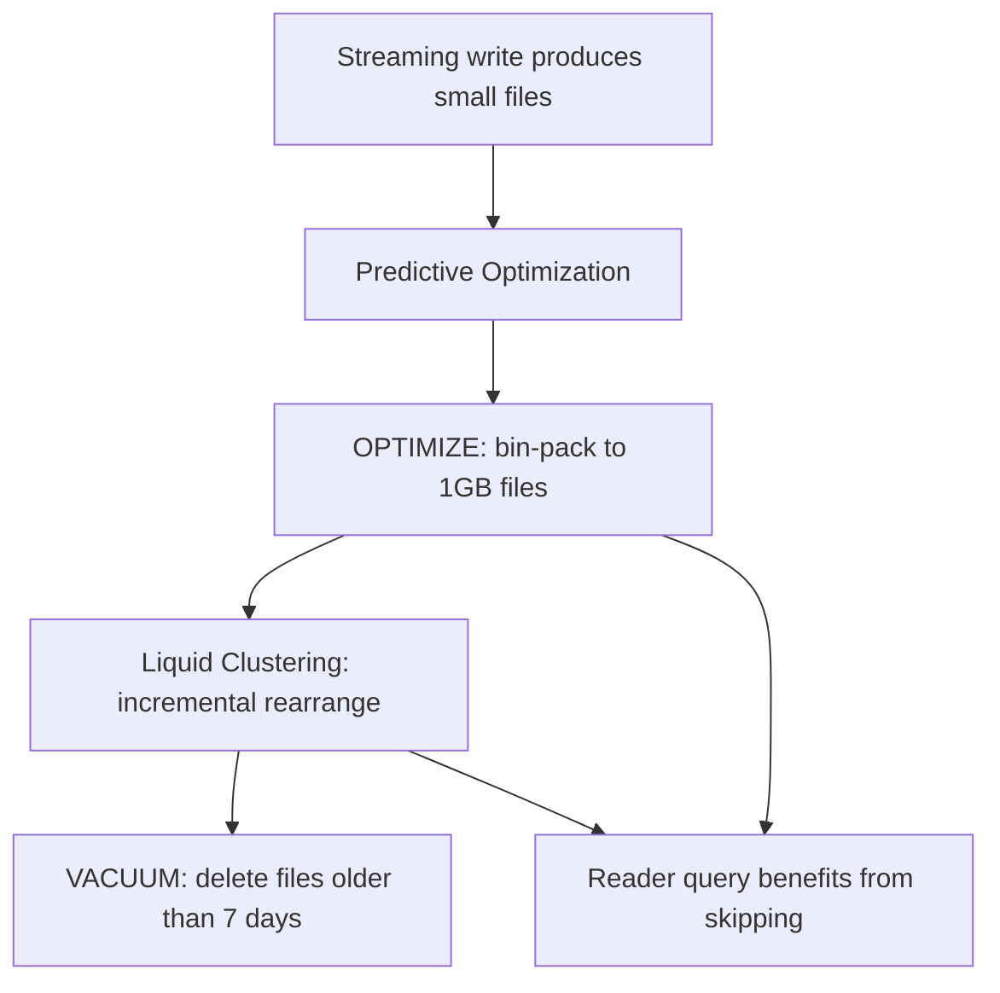

---

## 10. Mini quiz (cold)

1. What's the default file size target for OPTIMIZE?
2. You ran OPTIMIZE yesterday. Will running it again today rewrite the files?
3. A team has a Delta table partitioned by `event_date` and wants to add `customer_id` clustering. Should they add ZORDER on top or migrate to Liquid Clustering?
4. The default VACUUM retention is 7 days. How do you make it 1 day, and what's the risk?
5. Will Predictive Optimization run on an external table?
6. A team drops a managed table by mistake. Can they recover the data the next morning?
7. A team drops an external table by mistake. Can they recover?
8. You have a Parquet directory you want to register in UC as a Delta table without rewriting the data. Which command?
9. Can you create a Delta table with both `PARTITIONED BY` and `CLUSTER BY`?

### Answers

1. **1 GB** (`spark.databricks.delta.optimize.maxFileSize` default).
2. **No** — OPTIMIZE is idempotent. If files are already at target size, OPTIMIZE is a no-op.
3. **Migrate to Liquid Clustering.** `ALTER TABLE … CLUSTER BY (customer_id)` removes partitioning and starts incremental LC. ZORDER is legacy.
4. **Set `spark.databricks.delta.retentionDurationCheck.enabled = false`, then `VACUUM RETAIN 24 HOURS`.** Risk: concurrent readers that started before VACUUM may crash when their referenced files disappear.
5. **No.** Predictive Optimization only manages UC-managed tables. External tables' storage isn't UC's to manage.
6. **No** (canonically). DROP on a managed table removes the data files after the retention window. Some recovery may be possible via cloud-storage snapshots, but the exam-correct answer is "no."
7. **Yes.** DROP on an external table removes only the metadata. Recreate the external table pointing at the same LOCATION — the data is still there.
8. **`CONVERT TO DELTA parquet.<path>`.** Adds `_delta_log/` without rewriting the Parquet files.
9. **No.** Partitioning and Liquid Clustering are mutually exclusive. LC supersedes partitioning.

---

## 11. Sanity check before moving on

You should be able to:
- State the OPTIMIZE default file size and that OPTIMIZE is idempotent.
- Pick Liquid Clustering over ZORDER for new tables.
- Recite the VACUUM 7-day floor and the safety-check property to override it.
- State the managed-vs-external DROP semantics from memory.
- Explain CONVERT TO DELTA in one sentence (adds `_delta_log/`, no rewrite).
- List which Predictive Optimization features apply only to managed tables.

If any of those are fuzzy, re-read Sections 3, 4, 5, and 6.


\newpage

# Module 05 — Data Ingestion Methods: COPY INTO, Auto Loader, CTAS, Lakeflow Connect

> **Domain 2 (30%) — Development and Ingestion**
>
> **Exam objectives covered:**
> - Classify valid Auto Loader sources and use cases.
> - Demonstrate knowledge of Auto Loader syntax (deep-dive in Module 06).
> - Identify DDL/DML features.
>
> **What you must walk away with:** The trade-offs among `COPY INTO`, **Auto Loader (`cloudFiles`)**, **CREATE TABLE AS SELECT**, and **Lakeflow Connect**. Which to choose for a given scenario. The idempotency model of each.

---

## Coverage map (verbatim July 25, 2025 objectives → where taught here)

| Verbatim objective | Taught in section |
|---|---|
| Classify valid Auto Loader sources and use cases | §1 "The ingestion menu" + §4 "Auto Loader" + §8 "Decision tree" |
| Demonstrate knowledge of Auto Loader syntax (high-level here; deep in Module 06) | §4 + §6 "`read_files` table-valued function" |
| Identify DDL/DML features (CTAS, COPY INTO, read_files) | §2 CTAS, §3 COPY INTO + COPY_OPTIONS, §6 read_files / STREAM read_files |

Cross-references: Module 06 for Auto Loader deep syntax; Module 10 for LDP-side `STREAM read_files`; Module 09 for CDC via Lakeflow Connect.

---

## 1. The ingestion menu

Databricks gives you four (sometimes five) ways to ingest data into Delta:

| Method | Style | Best for |
|--------|-------|----------|
| **`CREATE TABLE AS SELECT`** (CTAS) | One-shot SQL | A one-time snapshot or derived table |
| **`COPY INTO`** | SQL, incremental, idempotent | Bounded, structured files (CSV/JSON/Parquet) with a finite expected count |
| **Auto Loader (`cloudFiles`)** | Structured Streaming | Continuous, high-throughput, unbounded file arrival in cloud storage |
| **Lakeflow Connect** | Managed connectors | SaaS sources (Salesforce, Workday, ServiceNow), SQL Server CDC, etc. — managed by Databricks |
| **`read_files(...)`** (table-valued function) | SQL, batch | Ad-hoc SQL over files, often inside LDP STREAMING TABLE definitions |

The exam tests **when to use which**, not how to write all four from memory. You will be shown a scenario; pick the right tool.

---

## 2. `CREATE TABLE AS SELECT` (CTAS) — one-shot

```sql
CREATE TABLE main.bronze.orders_initial AS
SELECT * FROM read_files('/Volumes/main/landing/orders/2026/', format => 'json');
```

- One-shot batch.
- Schema inferred from the SELECT.
- **Not idempotent** in the streaming sense — re-running re-imports everything.
- **Right answer** when: backfilling, initial historical load, ad-hoc derived table.
- **Wrong answer** when: files arrive continuously and you need to process only new ones.

---

## 3. `COPY INTO` — incremental, idempotent batch

`COPY INTO` is a SQL command that loads files into a Delta table and **remembers which files it has already loaded**.

```sql
-- Basic
COPY INTO main.bronze.orders
FROM '/Volumes/main/landing/orders/'
FILEFORMAT = JSON;

-- With options
COPY INTO main.bronze.orders
FROM '/Volumes/main/landing/orders/'
FILEFORMAT = JSON
FORMAT_OPTIONS ('multiLine' = 'true')
COPY_OPTIONS ('mergeSchema' = 'true');

-- Selecting / transforming during load
COPY INTO main.bronze.orders
FROM (
  SELECT
    get_json_object(value, '$.order_id') AS order_id,
    CAST(get_json_object(value, '$.amount') AS DECIMAL(18,2)) AS amount,
    _metadata.file_path AS source_file,
    current_timestamp() AS ingest_ts
  FROM '/Volumes/main/landing/orders/'
)
FILEFORMAT = JSON;
```

### Properties

- **Idempotent file tracking.** Loaded file paths are recorded. Re-running `COPY INTO` skips already-loaded files.
- **Batch.** Each invocation processes whatever files are currently in the source. To process new files, re-run.
- **Bounded.** Best when you expect a finite known number of files.
- **Schema evolution** via `COPY_OPTIONS ('mergeSchema' = 'true')`.
- **`COPY_OPTIONS ('force' = 'true')`** — re-process all files even if already loaded (rare; for recovery).

### When `COPY INTO` is the right choice

- Bounded daily / weekly batch ingestion where files land predictably.
- Migration from on-prem to lakehouse (one-time load of historical archive).
- Workloads where streaming infrastructure overhead is unwarranted.

### When `COPY INTO` is the wrong choice

- Continuous high-throughput ingestion → use **Auto Loader**.
- Files numbering in the millions, where directory listing becomes the bottleneck → use **Auto Loader with file notifications**.
- You need schema-evolution semantics richer than `mergeSchema` (e.g., rescued data) → use **Auto Loader**.

### ⚠️ Exam trap — `COPY INTO` vs Auto Loader on file volume

Both are incremental and idempotent. The discriminator is **scale and continuity**:
- **Hundreds of files arriving on a known schedule** → `COPY INTO` works fine.
- **Continuous high-throughput / unbounded arrival** → Auto Loader.

If a question mentions "new files arrive continuously in object storage" → Auto Loader.

---

## 4. Auto Loader (`cloudFiles`) — the canonical continuous ingestion answer

Deep-dive in Module 06. For this module, just the headline:

```python
(spark.readStream
   .format("cloudFiles")
   .option("cloudFiles.format", "json")
   .option("cloudFiles.schemaLocation", "/Volumes/main/_schemas/orders")
   .load("/Volumes/main/landing/orders/")
  .writeStream
   .option("checkpointLocation", "/Volumes/main/_chk/orders")
   .trigger(availableNow=True)
   .toTable("main.bronze.orders"))
```

What Auto Loader gives you that COPY INTO doesn't:
- **Continuous** streaming model — runs forever (or use `availableNow=True` to process all and exit).
- **Scales to billions** of files via **file notification mode**.
- **Schema inference** with versioned schema history in `schemaLocation`.
- **Schema evolution modes** (`addNewColumns`, `rescue`, `failOnNewColumns`, `none`) — richer than `mergeSchema`.
- **`_rescued_data` column** for unexpected data.
- **Exactly-once** via the streaming checkpoint.

### SQL form via `read_files`

You can also reference cloud files in SQL inside LDP pipelines and DBSQL:

```sql
SELECT * FROM read_files(
  '/Volumes/main/landing/orders/',
  format => 'json',
  schemaHints => 'amount DECIMAL(18,2)'
);

-- Streaming version (used inside LDP STREAMING TABLE)
CREATE OR REFRESH STREAMING TABLE main.bronze.orders
AS SELECT * FROM STREAM read_files(
  '/Volumes/main/landing/orders/',
  format => 'json'
);
```

`read_files` is the SQL table-valued function that wraps Auto Loader under the hood for SQL contexts.

---

## 5. Lakeflow Connect — managed connectors for SaaS sources

**Lakeflow Connect** is Databricks' managed connector framework, added to the platform mid-2024 and expanded through 2025. It is the **non-Auto-Loader** ingestion path: instead of reading files from object storage, Lakeflow Connect pulls data directly from SaaS APIs or operational databases.

### Available connectors (representative; the list grows)

- **Salesforce** (objects + Salesforce CDC)
- **Workday**
- **ServiceNow**
- **SQL Server** (with native CDC)
- **PostgreSQL** (CDC)
- **MySQL** (CDC)
- **Google Analytics 4**
- **SharePoint**

### How it works

You configure a **Lakeflow Connect pipeline** (a special kind of LDP pipeline) with:
- Source connection (UC connection object holding credentials).
- Source objects (which Salesforce objects, which SQL Server tables, etc.).
- Destination catalog/schema in UC.
- Schedule (triggered or continuous).

The pipeline lands Bronze tables in UC with the source data, applying CDC if the source supports it.

### When to choose Lakeflow Connect vs Auto Loader

| Source shape | Choice |
|--------------|--------|
| Files in cloud object storage | **Auto Loader** |
| SaaS API (Salesforce, Workday) | **Lakeflow Connect** |
| Operational database with CDC (SQL Server, Postgres) | **Lakeflow Connect** |
| Custom application emitting JSON to S3 | **Auto Loader** |
| Kafka / Event Hubs / Kinesis | Structured Streaming (not Lakeflow Connect; not Auto Loader) |

### Exam coverage of Lakeflow Connect

The DE Associate covers Lakeflow Connect at **conceptual depth** — recognize the connectors, recognize when it's the right answer. Deep syntax is not tested. If a question describes "managed SaaS connector with built-in CDC for Salesforce, no custom code," the answer is Lakeflow Connect.

### ⚠️ Exam trap — Lakeflow Connect vs Auto Loader

Don't confuse the two. **Auto Loader** is for files in object storage. **Lakeflow Connect** is for managed connectors to SaaS / operational DBs. They are complementary, not alternatives.

---

## 6. `read_files` table-valued function — the SQL on-ramp

`read_files` is a SQL function that reads files from a path and returns a table:

```sql
-- One-shot batch read (no incremental tracking)
SELECT * FROM read_files(
  '/Volumes/main/landing/orders/',
  format => 'json'
);

-- With schema hints
SELECT * FROM read_files(
  '/Volumes/main/landing/orders/',
  format => 'json',
  schemaHints => 'order_id LONG, amount DECIMAL(18,2)'
);

-- Inside an LDP STREAMING TABLE — this becomes Auto Loader under the hood
CREATE OR REFRESH STREAMING TABLE main.bronze.orders
AS SELECT * FROM STREAM read_files(
  '/Volumes/main/landing/orders/',
  format => 'json'
);
```

The key insight: `read_files` is **batch** by default, but wrapped in `STREAM(...)` inside LDP becomes incremental (uses Auto Loader's checkpointing).

This is the **exam-canonical** way to write SQL-based ingestion in LDP. Most exam questions about LDP SQL syntax use `STREAM read_files(...)`.

---

## 7. Direct DataFrame writes — when to use

For one-shot loads where you control the source code, plain PySpark works:

```python
df = spark.read.json("/Volumes/main/landing/orders/")
df.write.format("delta").mode("append").saveAsTable("main.bronze.orders")
```

- No incremental tracking.
- No schema-evolution unless `.option("mergeSchema", "true")`.
- Right answer for: one-shot loads, transformations between Bronze and Silver, gold-layer aggregation writes.
- Wrong answer for: continuous ingestion of arriving files.

For exam purposes, **`spark.read` + `df.write` is not "ingestion" in the Auto Loader sense.** If the question says "files arrive continuously," don't pick a `spark.read` answer.

---

## 8. Decision tree

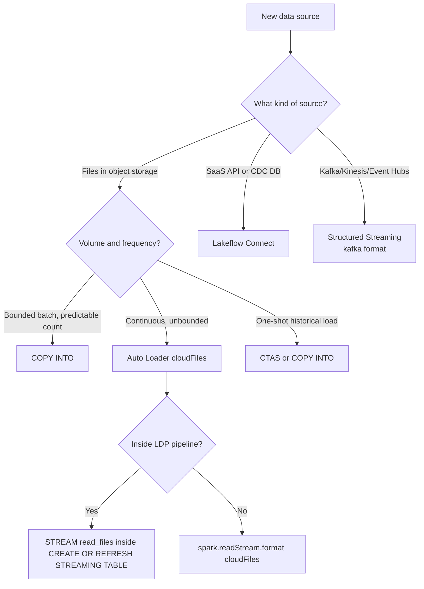

---

## 9. Idempotency model — what each tool guarantees

| Tool | Re-run safety | How |
|------|---------------|-----|
| **CTAS** | Not idempotent (re-creates the whole table; will error on existing table unless OR REPLACE) | Schema in DDL |
| **COPY INTO** | Idempotent (skips already-loaded files) | File path tracking in `_copy_into_metadata` |
| **Auto Loader** | Exactly-once writes | Checkpoint location + atomic Delta commit |
| **Lakeflow Connect** | Managed exactly-once | Connector-internal state + Delta commit |
| **`spark.read` + `df.write`** | Not idempotent | None — you must dedupe manually |
| **`MERGE INTO` against staging** | Idempotent if MERGE keys are correct | Match-and-update logic |

---

## 10. Putting it together — a multi-source ingestion architecture

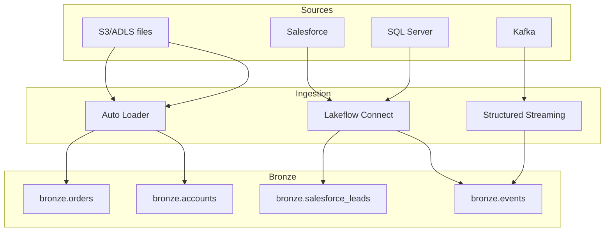

A real workspace mixes all of these. The DE Associate exam typically isolates a single source per question and asks "which tool?"

---

## 11. Mini quiz (cold)

1. You're loading 50 JSON files dropped daily into a UC Volume. Files are predictable, finite per day. Which tool?
2. A SaaS application's REST API needs to flow into a Bronze table with CDC. No file landing zone involved. Which tool?
3. New files arrive in S3 continuously (sometimes 100/hour, sometimes 0/hour). Which tool?
4. You're inside an LDP SQL pipeline and want to declare a streaming Bronze table that reads JSON files. Which function?
5. A team accidentally re-ran `COPY INTO` on the same source path. Will it re-load files that were already loaded?
6. A team wrote `spark.read.json(path).write.saveAsTable(...)` in a job that runs every hour. What's wrong with this?
7. Lakeflow Connect or Auto Loader for ingesting SQL Server CDC into a Bronze Delta table?

### Answers

1. **`COPY INTO`** — bounded, predictable, idempotent. Auto Loader works too but is overkill.
2. **Lakeflow Connect** — managed SaaS connector, no file landing.
3. **Auto Loader (`cloudFiles`)** with `trigger(availableNow=True)` if scheduled, or `processingTime` for continuous. Unbounded, continuous, file-arrival in object storage = Auto Loader's home turf.
4. **`STREAM read_files(...)`** inside `CREATE OR REFRESH STREAMING TABLE …`. Internally uses Auto Loader.
5. **No.** `COPY INTO` tracks loaded file paths and skips them on re-run. (You can force re-load with `COPY_OPTIONS ('force' = 'true')`.)
6. **Not incremental.** Every run re-reads the entire path and appends, producing duplicates. Either switch to Auto Loader or `COPY INTO`, or add MERGE-based dedupe logic.
7. **Lakeflow Connect.** Auto Loader is for files in object storage; SQL Server CDC is a database CDC stream — Lakeflow Connect's SQL Server connector handles it.

---

## 12. Sanity check before moving on

You should be able to:
- Match each of CTAS, COPY INTO, Auto Loader, Lakeflow Connect to the scenario shape it fits.
- Explain `COPY INTO` idempotency in one sentence.
- Identify `read_files` and its `STREAM(...)` wrapper as the SQL on-ramp to Auto Loader inside LDP.
- Avoid the `spark.read.json().write` trap for continuous ingestion.
- Pick Lakeflow Connect for SaaS / operational-DB sources.

If any of those are fuzzy, re-read Sections 3, 4, 5, and 8.


\newpage

# Module 06 — Auto Loader Deep Dive: cloudFiles, schema evolution, hints, triggers

> **Domain 2 (30%) — Development and Ingestion**
>
> **Exam objectives covered:**
> - Classify valid Auto Loader sources and use cases.
> - **Demonstrate knowledge of Auto Loader syntax.** ← highest-yield in this domain
>
> **What you must walk away with:** Every Auto Loader option that shows up in exam code. The four schema-evolution modes and which is default in which case. The two file-detection modes. The `_rescued_data` column. The `schemaLocation` requirement. Trigger choices. The interaction with LDP via `STREAM read_files(...)`.

---

## Coverage map (verbatim July 25, 2025 objectives → where taught here)

| Verbatim objective | Taught in section |
|---|---|
| Classify valid Auto Loader sources and use cases | §2 "`cloudFiles.format` — supported source formats" + §7 "File detection modes" |
| Demonstrate knowledge of Auto Loader syntax | §1 query shape; §3 schemaLocation; §4 schema inference; §5 schemaHints; §6 schemaEvolutionMode (4 modes + defaults); §8 triggers; §9 checkpointLocation; §10 `.toTable`; §11 full example; §12 LDP SQL form |

Cross-references: Module 05 for COPY INTO vs Auto Loader trade-offs; Module 08 for trigger semantics and checkpointing; Module 10 for `STREAM read_files` inside LDP.

---

## 1. The shape of an Auto Loader query

```python
df = (spark.readStream
        .format("cloudFiles")
        .option("cloudFiles.format", "json")
        .option("cloudFiles.schemaLocation", "/Volumes/main/_schemas/orders")
        .option("cloudFiles.schemaEvolutionMode", "addNewColumns")
        .load("/Volumes/main/landing/orders/"))

(df.writeStream
   .option("checkpointLocation", "/Volumes/main/_chk/orders")
   .trigger(availableNow=True)
   .toTable("main.bronze.orders"))
```

Three groups of options:
1. **Source options** (`.format("cloudFiles")` + `cloudFiles.*` options) — what to read, how to infer schema, how to detect new files.
2. **Sink options** (`.option("checkpointLocation", …)`, `.trigger(...)`) — where to write, how often, how durably.
3. **The `.toTable(...)` sink** — the simplest sink for Delta in UC.

---

## 2. `cloudFiles.format` — supported source formats

```python
.option("cloudFiles.format", "json")
```

Supported values: `json`, `csv`, `parquet`, `avro`, `orc`, `text`, `binaryFile`.

| Format | Notes |
|--------|-------|
| `json` | Default schema-inference target |
| `csv` | Add `header`, `delimiter`, `multiLine` as needed |
| `parquet` | Schema is in the file; less need for schema hints |
| `avro` | Avro schema is in the file |
| `orc` | Less common |
| `text` | One column `value` STRING per line |
| `binaryFile` | One row per file with `path`, `modificationTime`, `length`, `content BINARY` |

---

## 3. `cloudFiles.schemaLocation` — REQUIRED for inference

```python
.option("cloudFiles.schemaLocation", "/Volumes/main/_schemas/orders")
```

If you're letting Auto Loader **infer** the schema (the common case for JSON / CSV), you **must** provide a schemaLocation. Without it, the query errors.

What's stored at this path:
- `_schemas/` subdirectory holding versioned schema snapshots.
- Each schema-evolution event creates a new schema version.

If you provide a schema directly (`.schema(struct_type)`), the schemaLocation is optional — but it's still recommended for tracking.

```python
# Schema provided directly — schemaLocation optional but recommended
schema = StructType([
    StructField("order_id", StringType()),
    StructField("amount", DecimalType(18, 2)),
    StructField("ts", TimestampType())
])

df = (spark.readStream
        .format("cloudFiles")
        .option("cloudFiles.format", "json")
        .schema(schema)
        .load("/Volumes/main/landing/orders/"))
```

### ⚠️ Exam trap — schemaLocation is required for inference

If you don't provide a schema and you don't provide `cloudFiles.schemaLocation`, the query won't start. An exam question with a code snippet missing schemaLocation but inferring the schema is broken — likely a distractor.

---

## 4. Schema inference details

Auto Loader samples files to infer the schema:

- **First 50 GB OR first 1000 files**, whichever comes first.
- Tuned via `cloudFiles.schemaInferenceParallelism` and `cloudFiles.schemaInferenceSizeMB` for very large folders.
- Sampling happens at **query start** and on **schema-evolution events**.

By default, **all columns are inferred as STRING** for JSON / CSV (preserves precision; avoids accidental type narrowing). To enable type inference:

```python
.option("cloudFiles.inferColumnTypes", "true")
```

This option doesn't affect schema hints — hints always take effect.

---

## 5. Schema hints — explicit type overrides

```python
.option("cloudFiles.schemaHints", "order_id LONG, amount DECIMAL(18,2), ts TIMESTAMP")
```

- Comma-separated list of `col_name TYPE` pairs.
- Hints are applied **on top of** inference. Columns not in the hints are inferred normally.
- Hints work whether `inferColumnTypes` is on or off.
- Use to force a column to a specific type without writing the entire schema.

**Use case:** JSON files have an `amount` field that's sometimes a number, sometimes a quoted string. Without a hint, Auto Loader might pick STRING and you'd cast downstream. With `schemaHints = "amount DECIMAL(18,2)"`, Auto Loader parses it as decimal from the start.

### ⚠️ Exam trap — schema hints vs full schema

- **Hints** = partial overrides; Auto Loader still infers other columns.
- **Full schema (`.schema(...)`)** = explicit; no inference happens. Default schema-evolution mode in this case is `none`.

---

## 6. Schema evolution modes — the highest-frequency trap

`cloudFiles.schemaEvolutionMode` controls what happens when a new file arrives with a column the schema doesn't know about.

Five values, but you really memorize four:

| Mode | Behavior on new column | Default when |
|------|-----------------------|--------------|
| `addNewColumns` | **Restart the stream** with the new schema; new column added | **No schema provided** (inference case) |
| `rescue` | Place unknown columns in the `_rescued_data` JSON column; **no restart**, **no failure** | — (must be set explicitly) |
| `failOnNewColumns` | **Fail the stream** | — (set explicitly when you want strict schema control) |
| `none` | Silently ignore new columns | **Schema provided directly via `.schema(...)`** |
| `addNewColumnsWithTypeWidening` | Like `addNewColumns` but also widens int→long, float→double on type drift | Newer DBR (table feature dependent) |

### Defaults — MEMORIZE

| Schema source | Default mode |
|---------------|--------------|
| No schema provided (Auto Loader infers) | **`addNewColumns`** |
| Schema provided directly via `.schema(...)` | **`none`** |
| Schema hints used (no full schema) | Still `addNewColumns` (hints don't change the default) |

### What `addNewColumns` actually does

1. Stream is running on schema v1.
2. File arrives with an extra column `discount`.
3. Auto Loader detects the new column; throws a special exception (`UnknownFieldException`).
4. The stream **stops**.
5. Schema v2 is written to `schemaLocation/_schemas/`.
6. **The stream auto-restarts** (in Lakeflow Jobs / LDP) — picks up schema v2 and proceeds.
7. From this point, `discount` is in the table.

In raw Structured Streaming (not LDP), the auto-restart depends on your job framework. Lakeflow Jobs / LDP handles it; a manual `spark-submit` may not. For exam purposes, `addNewColumns` does cause a restart, but in LDP that restart is transparent.

### What `rescue` actually does

1. Stream is running on schema v1.
2. File arrives with an extra column `discount`.
3. Auto Loader writes the row with `discount` value packed into the **`_rescued_data`** column (a JSON STRING).
4. No restart. No failure. The Bronze table accumulates a `_rescued_data` column where applicable.

```json
// _rescued_data value for the row above
{"discount": 5.0, "_file_path": "/Volumes/.../file_123.json"}
```

Downstream consumers can parse `_rescued_data` later when they're ready to add the column to Silver.

### What `failOnNewColumns` does

The stream fails the moment a new column appears. Use when you want a human to make a conscious schema decision (e.g., regulated environments).

### What `none` does

New columns in the source files are **dropped silently.** No error, no rescue, no restart. The Bronze table never sees the new column. This is the default when you provided a full schema — the assumption is "I declared the schema; I want only those columns."

### ⚠️ Exam trap — "I provided a schema, why am I missing data?"

Scenario: developer sets `.schema(my_schema)` and sees new columns in the source files not appearing in the Bronze table. The default `schemaEvolutionMode` for a provided schema is `none` — new columns are silently ignored. Fix: set `schemaEvolutionMode = "rescue"` to capture them in `_rescued_data`, or remove the explicit schema to let Auto Loader infer.

### `_rescued_data` column

Special column that captures:
- Columns present in the source file but not in the table schema.
- Values that fail to parse to the expected type.
- The original file path (`_file_path`).

Always a STRING (JSON-serialized). Available in `rescue` mode automatically; in other modes only `rescuedDataColumn` setting opts it in.

```python
.option("cloudFiles.schemaEvolutionMode", "rescue")
.option("cloudFiles.rescuedDataColumn", "_rescued_data")  # optional rename
```

In a Silver-layer transformation, you typically:
```sql
SELECT *,
       get_json_object(_rescued_data, '$.discount') AS rescued_discount
FROM main.bronze.orders
WHERE _rescued_data IS NOT NULL;
```

---

## 7. File detection modes — directory listing vs file notification

How does Auto Loader know a new file has arrived?

### 7.1 Directory listing mode (default)

```python
# Default — no need to set explicitly
.option("cloudFiles.useNotifications", "false")
```

Auto Loader lists the source directory on each micro-batch trigger and compares to the checkpoint to find new files.

**Pros:** Simple. No cloud setup required.
**Cons:** Listing cost scales with directory size. For directories with hundreds of thousands of files, listing becomes the bottleneck.

**Optimizations:**
- `cloudFiles.useIncrementalListing = "auto"` (or `true`) — on supported clouds, uses incremental listing APIs (S3 `ListObjectsV2` with `start-after`, ADLS `BlobChangeFeed`) to skip files older than the last-seen marker.

### 7.2 File notification mode

```python
.option("cloudFiles.useNotifications", "true")
```

Auto Loader registers a notification subscription on the source bucket:
- **AWS S3** → SNS topic + SQS queue.
- **Azure ADLS Gen2** → Event Grid subscription + Storage Queue.
- **GCP GCS** → Pub/Sub subscription.

New files trigger notifications; Auto Loader consumes from the queue.

**Pros:** Scales to billions of files; no listing cost.
**Cons:** Requires setting up cloud-side notification resources (Databricks can do this for you with the right IAM/RBAC; or pre-create and reference). Slight per-message overhead.

### When to choose which

| File volume | Choice |
|-------------|--------|
| < 100K files in source path | Directory listing (default) |
| > 100K files, or directory listing latency is a problem | File notification |
| You can't grant Databricks the IAM to create notification resources | Directory listing with incremental listing |

### ⚠️ Exam trap — file notification vs directory listing

If a question describes a high-throughput ingestion scenario with millions of files and asks "how do you scale Auto Loader?" — the answer is **file notification mode**. If the question says "simplest setup, low volume" — directory listing.

---

## 8. Triggers

The **trigger** controls when Auto Loader processes the next batch.

### 8.1 `availableNow=True` — the modern batch-style trigger

```python
.trigger(availableNow=True)
```

- Process **all currently available** new files, then **stop**.
- Replaces the **deprecated `Trigger.Once`**.
- Right answer for: scheduled-job style ingestion ("every hour, pick up new files, exit").

### 8.2 `processingTime` — fixed cadence

```python
.trigger(processingTime="5 minutes")
```

- Run a micro-batch every N seconds/minutes.
- Stream **stays running** between batches.
- Right answer for: always-on streaming with predictable cadence.

### 8.3 Default — micro-batch ASAP

```python
# No .trigger() call — default is micro-batch ASAP
```

- Stream runs continuously; each batch starts as soon as the previous finishes.
- Right answer for: low-latency streaming with no cadence requirements.

### 8.4 `continuous` — experimental, sub-second latency

```python
.trigger(continuous="1 second")
```

- Continuous (not micro-batch) execution; very low latency.
- Experimental, narrower feature support, rare on exam.

### ⚠️ Exam trap — `availableNow` vs `processingTime`

| Scenario phrase | Trigger |
|-----------------|---------|
| "scheduled hourly job, process new files, exit" | **`availableNow=True`** |
| "always-on stream every 5 minutes" | **`processingTime="5 minutes"`** |
| "low-latency continuous processing" | default (or `continuous` for sub-second) |
| "Trigger.Once" in the answers | **Deprecated — pick `availableNow` instead** |

If `Trigger.Once` appears as an answer choice, it's likely the distractor for someone studying with pre-2024 material.

---

## 9. `checkpointLocation` — required for the write side

```python
.option("checkpointLocation", "/Volumes/main/_chk/orders")
```

- **Required** for `writeStream` to guarantee fault tolerance.
- Stores: source offsets, commit metadata, state (if stateful).
- **Never share a checkpoint between two queries** — they'll corrupt each other.
- **One checkpoint per writeStream** (a `.toTable(...)` produces one).

If you delete the checkpoint, the stream restarts from the beginning — reading all source files again. This is recovery-time-only behavior.

---

## 10. The `.toTable("...")` shortcut

```python
.toTable("main.bronze.orders")
```

- Creates the table if it doesn't exist (with inferred schema).
- Appends new data on each batch.
- The most concise sink for Delta tables.

Equivalent to:
```python
.format("delta")
.option("path", "...")    # optional for managed tables
.outputMode("append")
.start("main.bronze.orders")
```

### ⚠️ Exam trap — `.toTable` vs `.start`

`.toTable("name")` is shorthand for `.start()` against a UC table name. Both work; `.toTable` is more idiomatic for UC.

---

## 11. Full Auto Loader example with all the options

```python
from pyspark.sql.functions import col, current_timestamp

bronze = (spark.readStream
            .format("cloudFiles")
            .option("cloudFiles.format", "json")
            .option("cloudFiles.schemaLocation", "/Volumes/main/_schemas/orders")
            .option("cloudFiles.schemaEvolutionMode", "addNewColumns")
            .option("cloudFiles.schemaHints", "order_id LONG, amount DECIMAL(18,2)")
            .option("cloudFiles.inferColumnTypes", "true")
            .option("cloudFiles.useNotifications", "true")  # high-throughput
            .load("/Volumes/main/landing/orders/")
            .withColumn("ingest_ts", current_timestamp())
            .withColumn("source_file", col("_metadata.file_path")))

(bronze.writeStream
   .option("checkpointLocation", "/Volumes/main/_chk/orders")
   .option("mergeSchema", "true")     # tolerate Bronze schema additions
   .trigger(availableNow=True)        # scheduled batch
   .toTable("main.bronze.orders"))
```

The `_metadata` struct exposes per-row file metadata (`file_path`, `file_name`, `file_modification_time`, `file_size`). Useful for audit columns.

---

## 12. Auto Loader inside LDP — SQL form

Most exam questions about LDP-with-Auto-Loader use the SQL form:

```sql
CREATE OR REFRESH STREAMING TABLE main.bronze.orders
AS SELECT
     *,
     _metadata.file_path AS source_file,
     current_timestamp() AS ingest_ts
   FROM STREAM read_files(
     '/Volumes/main/landing/orders/',
     format       => 'json',
     schemaHints  => 'order_id LONG, amount DECIMAL(18,2)',
     schemaEvolutionMode => 'addNewColumns'
   );
```

`read_files(...)` is the SQL equivalent of `spark.readStream.format("cloudFiles")`. Inside `STREAM(...)`, it becomes incremental (uses Auto Loader's checkpointing automatically).

The SQL options map directly:
- Python `.option("cloudFiles.format", "json")` ↔ SQL `format => 'json'`
- Python `.option("cloudFiles.schemaLocation", "...")` ↔ implicit; LDP manages it
- Python `.option("cloudFiles.schemaEvolutionMode", "addNewColumns")` ↔ SQL `schemaEvolutionMode => 'addNewColumns'`
- Python `.option("cloudFiles.schemaHints", "...")` ↔ SQL `schemaHints => 'order_id LONG, amount DECIMAL(18,2)'`

---

## 13. Mini quiz (cold)

1. Auto Loader is reading JSON files; no schema provided. A file arrives with a new column `discount`. What happens by default?
2. Same scenario but schema is provided via `.schema(...)`. What happens by default?
3. You want unexpected columns captured but don't want the stream to restart. Which `schemaEvolutionMode`?
4. A scheduled job should process all currently-available files and exit. Which trigger?
5. An always-on stream should run a micro-batch every 5 minutes. Which trigger?
6. You're ingesting 50M files from S3 and directory listing is taking 20 minutes per batch. What fix?
7. Where is the `_rescued_data` column populated by default?
8. Translate this to Python form: `STREAM read_files('/Volumes/main/landing/', format => 'json', schemaHints => 'id LONG')`.
9. What's the difference between `cloudFiles.schemaLocation` and `checkpointLocation`?

### Answers

1. **`addNewColumns` (default for inferred schema).** Stream stops, schema updated to include `discount`, stream auto-restarts. In LDP this is transparent.
2. **`none` (default for provided schema).** New column silently dropped — `discount` is not written to the table.
3. **`rescue`** — places unexpected data in `_rescued_data`, no restart, no failure.
4. **`.trigger(availableNow=True)`** — process all available, then stop. Replaces deprecated `Trigger.Once`.
5. **`.trigger(processingTime="5 minutes")`**.
6. **Switch to `cloudFiles.useNotifications = true`** (file notification mode). Or enable `cloudFiles.useIncrementalListing` if you can't set up notifications.
7. **`rescue` mode** populates it by default. In other modes, set `cloudFiles.rescuedDataColumn` explicitly to opt in.
8. ```python
   (spark.readStream
      .format("cloudFiles")
      .option("cloudFiles.format", "json")
      .option("cloudFiles.schemaHints", "id LONG")
      .option("cloudFiles.schemaLocation", "<some path>")  # required for inference
      .load("/Volumes/main/landing/"))
   ```
9. **`schemaLocation`** stores schema-inference history (versions of the inferred schema). **`checkpointLocation`** stores the streaming offset / state / commit metadata. Two separate paths, two separate concerns. Don't conflate.

---

## 14. Sanity check before moving on

You should be able to:
- Write a full Auto Loader query from scratch.
- Recite the four schema-evolution modes and the two defaults.
- Choose between directory listing and file notification based on scale.
- Choose between `availableNow` and `processingTime` based on the scenario.
- Recognize `STREAM read_files(...)` as the LDP-SQL equivalent.
- Explain `_rescued_data` in one sentence.

If any of those are fuzzy, re-read Sections 6, 7, and 8.


\newpage

# Module 07 — ETL with PySpark + SQL: Medallion, MERGE, Aggregations, Repartition

> **Domain 3 (31%) — Data Processing & Transformations**
>
> **Exam objectives covered:**
> - **Describe the three layers of the Medallion Architecture** and explain the purpose of each layer.
> - **Compute complex aggregations and metrics with PySpark DataFrames.**
> - Identify DDL/DML features.
>
> **What you must walk away with:** The Bronze / Silver / Gold mental model and what belongs in each layer. Common DataFrame transformations (`groupBy().agg(...)`, `sum`, `count`, `count_distinct`, `avg`, `window`). Repartition vs coalesce. MERGE-based upserts. The exam's preference for `count_distinct` over `count` when the question wants unique invoices.

---

## Coverage map (verbatim July 25, 2025 objectives → where taught here)

| Verbatim objective | Taught in section |
|---|---|
| Describe the three layers of the Medallion Architecture and explain the purpose of each | §1 "The Medallion Architecture" + what-belongs-where decision |
| Compute complex aggregations and metrics with PySpark DataFrames | §2 "PySpark DataFrame aggregations" + §3 "Common aggregation patterns" (incl. windows, pivots, approx_count_distinct) + §8 nested/JSON |
| Sample Question 1 (count_distinct vs count for unique invoices) | §2 "The Question-1 pattern — unique invoices per day" |
| Identify DDL/DML features (MERGE WHEN MATCHED/NOT MATCHED, dedupe-before-MERGE) | §6 "MERGE-based upserts in PySpark + SQL" + §9 "Writing DataFrames to Delta" |
| Classify cluster/configuration tuning concepts (repartition vs coalesce, broadcast join) | §4 "Joins" + §5 "Repartition vs coalesce" |

Cross-references: Module 03 for MERGE syntax fundamentals; Module 10 for APPLY CHANGES INTO inside LDP; Module 14 for Spark UI tuning of join/shuffle plans.

---

## 1. The Medallion Architecture

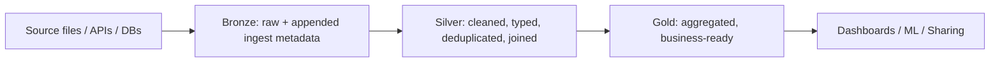

| Layer | Purpose | Schema discipline | Typical operations |
|-------|---------|-------------------|---------------------|
| **Bronze** | "Land everything verbatim." Preserves the source as-received plus ingestion metadata. | Schema-on-read; new columns rescued or added | Auto Loader / Lakeflow Connect / COPY INTO writes |
| **Silver** | "Cleaned and conformed." Typed, deduplicated, joined across sources, conformed dimensions. | Schema-on-write; strict types | Filter, cast, join, MERGE/upsert, deduplicate |
| **Gold** | "Business-ready aggregates." Aggregations, KPI tables, dashboards' direct source. | Strict; often fact/dimension shape | groupBy / agg, window functions, joins among Silver tables |

### Why three layers and not two

- **Bronze** is the audit trail. If a Silver-layer bug corrupts data, Bronze is your replay source.
- **Silver** decouples the messy-source reality from analytics — analysts query Silver, not Bronze.
- **Gold** isolates expensive aggregations so that high-concurrency BI queries don't recompute them.

### What each layer typically contains

| Layer | Examples (orders use case) |
|-------|----------------------------|
| Bronze | `bronze.orders_raw` (raw JSON with rescued data column), `bronze.web_events_raw` |
| Silver | `silver.orders` (typed, joined to customer), `silver.customers` (conformed dim), `silver.web_sessions` (event-grouped) |
| Gold | `gold.daily_revenue`, `gold.customer_lifetime_value`, `gold.monthly_active_users` |

### ⚠️ Exam trap — what belongs where

The exam often shows you a transformation and asks "which layer should this produce?" Key signals:

- "Aggregate to a daily fact table" → **Gold**.
- "Clean nulls, cast types, join to customer dim" → **Silver**.
- "Land raw JSON files with file metadata" → **Bronze**.

Don't confuse "Silver does aggregation" — Silver typically does **row-level transformations**. Aggregations live in Gold.

---

## 2. PySpark DataFrame aggregations — the exam's #1 PySpark topic

The official Question 1 in the exam guide tests exactly this: pick the right `.groupBy().agg(...)` form.

### The functions you must know

```python
from pyspark.sql.functions import (
    sum, count, count_distinct, avg, min, max,
    mean, stddev, var_samp, expr, col, when, lit
)
```

| Function | What it does | Right when |
|----------|--------------|------------|
| `sum(col)` | Sum of values | Summing amounts, quantities |
| `count(col)` | Count of non-null values | Count of rows where col is not null |
| `count("*")` | Count of all rows | "How many rows in each group?" |
| `count_distinct(col)` | Count of distinct non-null values | "How many unique X per group?" |
| `avg(col)` / `mean(col)` | Average | Mean amount |
| `min(col)` / `max(col)` | Min / max | First / last by date |
| `stddev(col)` | Std deviation | Distribution metrics |

### The Question-1 pattern — unique invoices per day

Given `billing_df` with columns `billing_id`, `patient_id`, `department`, `billing_date`, `amount_billed`, `quantity`:

```python
from pyspark.sql.functions import sum, count_distinct

daily_revenue_df = billing_df.groupBy("billing_date").agg(
    sum("amount_billed").alias("total_revenue"),
    count_distinct("billing_id").alias("total_invoices")
)
```

**Why `count_distinct("billing_id")` and not `count("billing_id")`?**

- `count("billing_id")` counts every non-null row — duplicates included. If `billing_id` is the row identifier and unique per row, `count` == `count_distinct`. But if billing_id can repeat (correction rows, partial billings, multi-line invoices), they're different.
- The question said "unique invoices." The semantic answer is **`count_distinct`**.

**Why not `count_distinct("patient_id")`?**

- Different patients on the same day means multiple invoices, not one per patient. Counting distinct patient_id undercounts invoices.

### ⚠️ Exam trap — `count` vs `count_distinct`

Watch the prompt for:
- "**total** invoices" — could be either; usually `count` if rows == invoices.
- "**unique** invoices" or "**distinct** invoices" — `count_distinct`.
- "**number of** customers" — usually `count_distinct(customer_id)` since each customer has many rows.

If the prompt says "unique," default to `count_distinct`.

---

## 3. Common aggregation patterns

### 3.1 Group + multiple aggregates

```python
result = (df.groupBy("dept", "year")
            .agg(
                sum("amount").alias("total"),
                count("*").alias("n_rows"),
                count_distinct("invoice_id").alias("n_invoices"),
                avg("amount").alias("avg_amount"),
                max("amount").alias("max_amount")
            ))
```

### 3.2 Conditional aggregation with `when`

```python
from pyspark.sql.functions import sum, when, col

result = df.groupBy("dept").agg(
    sum(when(col("status") == "paid", col("amount")).otherwise(0)).alias("paid_total"),
    sum(when(col("status") == "open", col("amount")).otherwise(0)).alias("open_total")
)
```

### 3.3 Window functions — top-N per group

```python
from pyspark.sql.window import Window
from pyspark.sql.functions import row_number, rank, dense_rank, lag, lead

w = Window.partitionBy("dept").orderBy(col("amount").desc())

top_three_per_dept = (df
    .withColumn("rn", row_number().over(w))
    .filter("rn <= 3"))
```

### 3.4 Pivot

```python
result = (df.groupBy("dept")
            .pivot("year", ["2024", "2025", "2026"])
            .agg(sum("amount")))
```

### 3.5 Approx distinct (for very large groups)

```python
from pyspark.sql.functions import approx_count_distinct

# HyperLogLog-based; faster but approximate
result = df.groupBy("dept").agg(
    approx_count_distinct("user_id", 0.05).alias("unique_users")
)
```

---

## 4. Joins

### Join types

```python
# Inner — only matched rows
df1.join(df2, "key", "inner")

# Left outer — all from left, matched from right
df1.join(df2, "key", "left")

# Right outer — all from right, matched from left
df1.join(df2, "key", "right")

# Full outer — all from both, nulls where unmatched
df1.join(df2, "key", "full")

# Semi — like inner but only columns from left
df1.join(df2, "key", "left_semi")

# Anti — only rows in left NOT matched in right
df1.join(df2, "key", "left_anti")
```

### Broadcast hints

For joining a large fact table to a small dimension:

```python
from pyspark.sql.functions import broadcast

fact.join(broadcast(dim), "key", "left")
```

Forces a broadcast hash join — sends `dim` to every executor, avoiding shuffle. Right when `dim` is < a few hundred MB.

Without the hint, Spark's Cost-Based Optimizer / Adaptive Query Execution will often broadcast automatically based on table size statistics, but the explicit hint is safer.

---

## 5. Repartition vs coalesce

Both control the number of partitions in a DataFrame. **They are NOT equivalent.**

### `repartition(n)` — full shuffle

```python
df_balanced = df.repartition(200)
df_keyed   = df.repartition("customer_id")     # repartition by hash of column
df_combined = df.repartition(200, "customer_id")
```

- Does a **full shuffle**.
- Produces **n** roughly-equal partitions.
- Can both **increase and decrease** partition count.
- Use when: you want balanced parallelism (e.g., before a join or before writing).
- Use when: you want partitions keyed by a column (for join collocation or for partition-aligned writes).

### `coalesce(n)` — no shuffle (or limited)

```python
df_fewer = df.coalesce(5)
```

- **No shuffle** — just merges existing partitions.
- Can only **decrease** partition count.
- Faster than `repartition` but produces **unbalanced** partitions.
- Use when: writing few large files at the end of a job; consolidating after a heavily-filtered scan.

### Decision matrix

| Need | Choice |
|------|--------|
| Reduce 200 partitions to 4 for output | `coalesce(4)` |
| Rebalance 1 huge partition + 199 tiny ones | `repartition(200)` (shuffle to redistribute) |
| Repartition by join key for collocation | `repartition("key")` |
| After a heavy filter dropped 99% of data | `coalesce(n)` to reduce output file count |

### ⚠️ Exam trap — coalesce can't increase partitions

If you have 4 partitions and you call `df.coalesce(200)`, you still get 4 — coalesce ignores upward requests. Use `repartition(200)` instead.

---

## 6. MERGE-based upserts in PySpark + SQL

Inside an LDP pipeline, prefer `APPLY CHANGES INTO` (Module 10). Outside LDP, hand-rolled MERGE is the pattern.

### SQL MERGE — the canonical form

```sql
MERGE INTO main.silver.customers t
USING main.staging.customer_changes s
ON  t.customer_id = s.customer_id
WHEN MATCHED AND s.op = 'D'  THEN DELETE
WHEN MATCHED AND s.op = 'U'  THEN UPDATE SET *
WHEN NOT MATCHED AND s.op = 'I' THEN INSERT *;
```

Key clauses:
- `WHEN MATCHED [AND <cond>] THEN UPDATE SET ... | DELETE`
- `WHEN NOT MATCHED [AND <cond>] THEN INSERT (...) VALUES (...) | INSERT *`
- `WHEN NOT MATCHED BY SOURCE [AND <cond>] THEN UPDATE SET ... | DELETE` (newer; for row removal when not in source)

### PySpark MERGE via DeltaTable API

```python
from delta.tables import DeltaTable

target = DeltaTable.forName(spark, "main.silver.customers")

(target.alias("t")
    .merge(source_df.alias("s"), "t.customer_id = s.customer_id")
    .whenMatchedDelete(condition="s.op = 'D'")
    .whenMatchedUpdate(condition="s.op = 'U'", set={"name": "s.name", "email": "s.email"})
    .whenNotMatchedInsert(condition="s.op = 'I'", values={"customer_id": "s.customer_id", "name": "s.name", "email": "s.email"})
    .execute())
```

### Deduplicate within a batch before MERGE

Common issue: the same key appears multiple times in the source batch (e.g., multiple updates to the same customer in one batch). MERGE errors on duplicate match keys. Dedupe first:

```python
from pyspark.sql.window import Window
from pyspark.sql.functions import row_number, col

w = Window.partitionBy("customer_id").orderBy(col("ts").desc())

source_dedup = (source_df
    .withColumn("rn", row_number().over(w))
    .filter("rn = 1")
    .drop("rn"))

# Now MERGE source_dedup
```

### ⚠️ Exam trap — `APPLY CHANGES INTO` vs MERGE

Inside an **LDP pipeline**, the exam-correct answer for CDC is `APPLY CHANGES INTO`, not MERGE. MERGE is for non-LDP code or for non-CDC upserts. See Module 10.

---

## 7. Common transformations cheat-sheet

```python
from pyspark.sql.functions import (
    col, lit, when, expr,
    upper, lower, trim, regexp_replace, regexp_extract, substring,
    to_date, to_timestamp, date_format, date_add, datediff, year, month, day,
    cast, coalesce, isnull, isnan,
    split, explode, get_json_object, from_json, to_json,
    array, array_contains, struct, map_from_entries
)

# Select + cast + rename
df2 = df.select(
    col("id").cast("string").alias("id"),
    col("ts").cast("timestamp"),
    col("amt").cast("decimal(18,2)").alias("amount")
)

# Filter
df3 = df.filter("status = 'active' AND amount > 0")
df3b = df.filter((col("status") == "active") & (col("amount") > 0))

# Add column
df4 = df.withColumn("year", year(col("ts"))).withColumn("amount_usd", col("amount") * lit(1.0))

# Drop columns
df5 = df.drop("temp1", "temp2")

# Rename
df6 = df.withColumnRenamed("amt", "amount")

# Distinct / dropDuplicates
df7 = df.dropDuplicates(["customer_id", "order_date"])

# Sort
df8 = df.orderBy(col("ts").desc())

# Sample
df9 = df.sample(fraction=0.1, seed=42)

# Union (must align schemas)
df10 = df_a.unionByName(df_b, allowMissingColumns=True)
```

---

## 8. Working with nested / JSON data

```python
from pyspark.sql.functions import from_json, get_json_object, schema_of_json, to_json
from pyspark.sql.types import StructType, StructField, StringType, DecimalType, TimestampType

# Define expected schema
order_schema = StructType([
    StructField("order_id",   StringType()),
    StructField("amount",     DecimalType(18, 2)),
    StructField("created_at", TimestampType())
])

# Parse a JSON string column
parsed = (bronze_df
    .withColumn("order", from_json(col("raw_json"), order_schema))
    .select("order.*"))

# Extract a single field without full parsing
just_id = bronze_df.withColumn("order_id", get_json_object(col("raw_json"), "$.order_id"))

# Convert struct to JSON string for output
output = parsed.withColumn("order_json", to_json(struct("order_id", "amount", "created_at")))
```

---

## 9. Writing DataFrames to Delta

```python
# Append (most common for ETL output)
df.write.format("delta").mode("append").saveAsTable("main.silver.orders")

# Overwrite
df.write.format("delta").mode("overwrite").saveAsTable("main.gold.daily_revenue")

# Overwrite with schema replacement
(df.write.format("delta")
   .mode("overwrite")
   .option("overwriteSchema", "true")
   .saveAsTable("main.gold.daily_revenue"))

# Append + tolerate new columns
(df.write.format("delta")
   .mode("append")
   .option("mergeSchema", "true")
   .saveAsTable("main.silver.orders"))

# Partition the write
(df.write.format("delta")
   .mode("append")
   .partitionBy("event_date")
   .saveAsTable("main.silver.orders"))

# Write to a path (external table)
(df.write.format("delta")
   .mode("append")
   .save("/Volumes/main/landing/orders_external"))
```

---

## 10. A Bronze → Silver → Gold pipeline in 60 lines

```python
from pyspark.sql.functions import (
    col, current_timestamp, get_json_object, to_timestamp,
    sum as _sum, count_distinct, lit
)

# --- BRONZE ---
bronze = (spark.readStream
    .format("cloudFiles")
    .option("cloudFiles.format", "json")
    .option("cloudFiles.schemaLocation", "/Volumes/main/_schemas/orders")
    .option("cloudFiles.schemaEvolutionMode", "rescue")
    .load("/Volumes/main/landing/orders/")
    .withColumn("ingest_ts", current_timestamp())
    .withColumn("source_file", col("_metadata.file_path")))

(bronze.writeStream
    .option("checkpointLocation", "/Volumes/main/_chk/orders_bronze")
    .trigger(availableNow=True)
    .toTable("main.bronze.orders"))

# --- SILVER (typed, deduped) ---
silver_src = (spark.readStream.table("main.bronze.orders")
    .select(
        col("order_id"),
        col("customer_id"),
        col("amount").cast("decimal(18,2)").alias("amount"),
        to_timestamp(col("order_ts")).alias("order_ts"),
        col("ingest_ts"))
    .filter("order_id IS NOT NULL AND amount > 0"))

(silver_src.writeStream
    .option("checkpointLocation", "/Volumes/main/_chk/orders_silver")
    .trigger(availableNow=True)
    .toTable("main.silver.orders"))

# --- GOLD (daily aggregates) ---
silver_df = spark.read.table("main.silver.orders")

daily = (silver_df.groupBy("order_ts").agg(
    _sum("amount").alias("daily_revenue"),
    count_distinct("order_id").alias("daily_invoices"),
    count_distinct("customer_id").alias("daily_unique_customers")))

(daily.write.format("delta")
    .mode("overwrite")
    .saveAsTable("main.gold.daily_revenue"))
```

---

## 11. Mini quiz (cold)

1. Where do daily aggregations belong: Bronze, Silver, or Gold?
2. The question says "unique invoices per day." Which function: `count` or `count_distinct`?
3. You have 4 partitions and want 200. `repartition(200)` or `coalesce(200)`?
4. Before writing a small final result with 200 partitions, you want 4 output files. `repartition(4)` or `coalesce(4)`?
5. You're joining a 100 GB fact table to a 50 MB dimension table. What hint accelerates the join?
6. Inside an LDP pipeline doing CDC, do you use MERGE or APPLY CHANGES INTO?
7. The Silver MERGE errors because the source batch has duplicate keys. How do you fix it?
8. To capture columns from source files that aren't in the target schema, which Auto Loader mode populates `_rescued_data`?

### Answers

1. **Gold.** Aggregations are Gold-layer; Silver does row-level cleaning.
2. **`count_distinct`** — the prompt's "unique" maps to distinct.
3. **`repartition(200)`** — coalesce only decreases partition count.
4. **`coalesce(4)`** — no shuffle; faster.
5. **`broadcast(dim)`** — sends `dim` to all executors, avoids shuffle on the fact table.
6. **`APPLY CHANGES INTO`** inside LDP. MERGE is for non-LDP code.
7. **Deduplicate the source first**, e.g., a `row_number()` window over the key by descending timestamp, filter to `rn = 1`.
8. **`rescue`** mode (or any mode with `cloudFiles.rescuedDataColumn` explicitly set).

---

## 12. Sanity check before moving on

You should be able to:
- Recite the Bronze/Silver/Gold purposes from memory.
- Write a `.groupBy(...).agg(sum(...), count_distinct(...))` block from memory.
- Pick `count_distinct` over `count` when the prompt says "unique."
- Pick `repartition` vs `coalesce` correctly.
- Write a MERGE statement with WHEN MATCHED/NOT MATCHED clauses.
- Identify "aggregations belong in Gold."

If any of those are fuzzy, re-read Sections 1, 2, and 5.


\newpage

# Module 08 — Structured Streaming: Triggers, Output Modes, Checkpoints

> **Domain 3 (31%) — Data Processing & Transformations**
>
> **Exam objectives covered:**
> - Implement data pipelines using LDP (foundation).
> - DDL/DML features (streaming forms).
>
> **What you must walk away with:** The `readStream` / `writeStream` API. Triggers (`processingTime`, `availableNow`, deprecated `Once`, `continuous`, default). Output modes (`append`, `complete`, `update`). `checkpointLocation` semantics. Exactly-once. `foreachBatch`. The deprecation of `Trigger.Once`.

---

## Coverage map (verbatim July 25, 2025 objectives → where taught here)

| Verbatim objective | Taught in section |
|---|---|
| Implement data pipelines (streaming foundation for LDP) | §1 mental model; §2 readStream sources; §3 writeStream sinks + `.toTable`; §11 full Bronze pipeline |
| Identify DDL/DML features (streaming forms — `.toTable`, foreachBatch + MERGE) | §3 sinks + §8 `foreachBatch` |
| Classify cluster/configuration for streaming workloads | §4 triggers decision matrix + §10 query monitoring |
| Use debugging tools (streaming progress, checkpoint hygiene) | §6 checkpointLocation; §9 startingOffsets; §10 Spark UI Streaming tab |

Cross-references: Module 06 for Auto Loader trigger usage; Module 09 for watermarks and stateful operators; Module 10 for LDP-managed streaming (the declarative wrapper around these APIs).

---

## 1. The Structured Streaming mental model

Structured Streaming treats an unbounded stream as a continuously-growing table. Every micro-batch:

1. Reads new data since the last batch (from the source's offset tracking).
2. Applies the DataFrame transformations.
3. Writes the result to the sink.
4. Atomically commits the offsets to the **checkpoint location** so the same data won't be re-read.

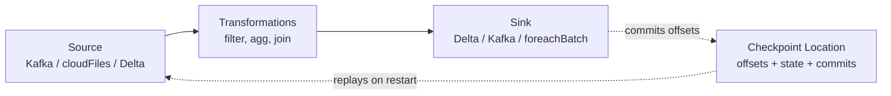

The same DataFrame API works for batch and streaming — that's the magic of Structured Streaming. You replace `spark.read` with `spark.readStream` and `df.write` with `df.writeStream`, and the same transformations apply.

---

## 2. `readStream` — sources

```python
# From a Delta table
df = spark.readStream.table("main.bronze.orders")

# From Auto Loader (file-based)
df = (spark.readStream
        .format("cloudFiles")
        .option("cloudFiles.format", "json")
        .option("cloudFiles.schemaLocation", "/Volumes/main/_schemas/orders")
        .load("/Volumes/main/landing/orders/"))

# From Kafka
df = (spark.readStream
        .format("kafka")
        .option("kafka.bootstrap.servers", "broker:9092")
        .option("subscribe", "orders")
        .option("startingOffsets", "latest")
        .load())

# From Event Hubs (Azure)
df = (spark.readStream
        .format("eventhubs")
        .options(**ehConf)
        .load())

# From Kinesis (AWS)
df = (spark.readStream
        .format("kinesis")
        .option("streamName", "orders-stream")
        .option("region", "us-east-1")
        .load())
```

Each source has its own offset model:
- **Delta**: log version + index.
- **Auto Loader**: file path tracking in the schema/checkpoint.
- **Kafka**: topic + partition + offset.
- **Event Hubs / Kinesis**: shard sequence numbers.

---

## 3. `writeStream` — sinks

```python
# Delta sink (the most common)
(df.writeStream
   .format("delta")
   .option("checkpointLocation", "/Volumes/main/_chk/orders")
   .outputMode("append")
   .trigger(availableNow=True)
   .toTable("main.silver.orders"))

# Kafka sink
(df.writeStream
   .format("kafka")
   .option("kafka.bootstrap.servers", "broker:9092")
   .option("topic", "orders-out")
   .option("checkpointLocation", "/Volumes/main/_chk/orders_out")
   .start())

# foreachBatch — apply arbitrary batch operations per micro-batch
def upsert_batch(batch_df, batch_id):
    batch_df.createOrReplaceTempView("updates")
    spark.sql("""
        MERGE INTO main.silver.orders t
        USING updates s
        ON t.order_id = s.order_id
        WHEN MATCHED THEN UPDATE SET *
        WHEN NOT MATCHED THEN INSERT *
    """)

(df.writeStream
   .foreachBatch(upsert_batch)
   .option("checkpointLocation", "/Volumes/main/_chk/orders_merge")
   .trigger(availableNow=True)
   .start())
```

### The `.toTable` shortcut

`.toTable("catalog.schema.table")` is shorthand for `.format("delta").start()` against a UC table. Recommended for Delta sinks in UC.

---

## 4. Triggers — when does a micro-batch run?

The trigger defines the cadence.

### 4.1 Default — micro-batch ASAP

```python
.writeStream
# no .trigger() call
```

- Each batch starts as soon as the previous finishes.
- Lowest end-to-end latency at the cost of compute always running.
- Suitable for: always-on streams where latency matters.

### 4.2 `processingTime` — fixed cadence

```python
.trigger(processingTime="5 minutes")
.trigger(processingTime="30 seconds")
```

- Run a micro-batch every N time units.
- Compute is provisioned continuously (stream stays running).
- Suitable for: always-on streams with predictable cadence (e.g., Bronze → Silver every 5 minutes).

### 4.3 `availableNow` — modern batch trigger

```python
.trigger(availableNow=True)
```

- **Process all currently-available data, then stop.**
- Replaces the **deprecated `Trigger.Once`**.
- Suitable for: scheduled-job style ingestion. "Every hour, run, process whatever's new, exit."
- **Cheaper** than `processingTime` because compute isn't always-on — the Lakeflow Job spins up a job cluster, processes, and tears down.

### 4.4 `continuous` — experimental sub-second latency

```python
.trigger(continuous="1 second")
```

- Continuous execution, not micro-batch.
- Sub-second latency.
- Limited operator support (no stateful, limited aggregations).
- Rare on the exam.

### 4.5 `Trigger.Once` — DEPRECATED, do not pick

```python
# Deprecated form — do not write new code with this
.trigger(once=True)
```

- Was the "process all available data and exit" trigger pre-2024.
- Replaced by `availableNow` (which handles backlog batching more gracefully on large queues).
- If `Trigger.Once` appears in answer choices, treat it as a distractor for pre-2024 study material — pick `availableNow` instead.

### Trigger decision matrix

| Scenario | Trigger |
|----------|---------|
| Hourly scheduled job, process new files, exit | **`availableNow=True`** |
| Always-on stream, micro-batch every 5 min | **`processingTime="5 minutes"`** |
| Always-on stream, low latency | **default** (no trigger) |
| Sub-second latency, experimental | `continuous="1 second"` |
| "Trigger.Once" in answer | **Wrong / deprecated — pick `availableNow`** |

### ⚠️ Exam trap — `availableNow` vs `processingTime`

Common confusion: "scheduled hourly job" → wrongly pick `processingTime="1 hour"`. That keeps the stream running 24/7 with a 1-hour micro-batch cadence. The correct answer for **scheduled** processing is **`availableNow=True`**, fired by a scheduled Lakeflow Job — the job creates a cluster, runs the stream to completion, exits.

---

## 5. Output modes

The `outputMode("...")` controls what rows the writeStream produces per micro-batch.

### 5.1 `append` — only new rows (default for stateless)

```python
.outputMode("append")
```

- Only rows added in this micro-batch are written.
- The default for non-stateful queries (no aggregation).
- Works with all sinks that support append.

### 5.2 `complete` — full result table on every batch

```python
.outputMode("complete")
```

- The **entire current state** is written on each batch.
- **Requires aggregation** (`groupBy`) in the query — otherwise the result table would be unbounded.
- Memory-heavy at scale.
- Suitable for: small, bounded aggregate results that need to be fully refreshed each batch.

### 5.3 `update` — only changed rows

```python
.outputMode("update")
```

- Only rows that changed in this batch are written.
- Requires aggregation.
- Sink must support row-level updates (Delta with MERGE or `foreachBatch` does; some sinks don't).

### Decision matrix

| Query shape | Output mode |
|-------------|-------------|
| Stateless transformations (filter, project, join non-aggregated) | **`append`** |
| Aggregation, full state needed on each batch | **`complete`** |
| Aggregation, only changes needed | **`update`** |
| Stateful streaming aggregation with **watermarks** that finalize windows | `append` (windows become final and emit once) |

### ⚠️ Exam trap — `complete` mode requires aggregation

If a question has a `df.writeStream.outputMode("complete")` on a non-aggregated query — that errors at runtime. Watch for this distractor.

---

## 6. `checkpointLocation` — required for fault tolerance

```python
.option("checkpointLocation", "/Volumes/main/_chk/orders")
```

### What's stored

- **Offsets** — what data has been read from the source.
- **Commits** — what micro-batches have been successfully written.
- **State** (for stateful queries) — running aggregation state, deduplication keys.
- **Metadata** — query info.

### Why required

Without a checkpoint, the stream can't recover from a failure — it would re-read all source data and the sink could see duplicates. With a checkpoint, the stream:
1. On restart, reads the checkpoint.
2. Identifies the last committed batch.
3. Re-reads only data after that.
4. Combined with idempotent sinks (Delta), gets exactly-once.

### Rules

- **One checkpoint per writeStream.** Never share.
- **Cannot move/rename** without losing offsets. If you move the checkpoint, the stream re-reads from the source's beginning.
- **Deleting the checkpoint** = full reset. The stream restarts as if new — re-reads everything.
- **Storing the checkpoint in DBFS root** is a common anti-pattern. Use a UC Volume for governance.

### ⚠️ Exam trap — sharing checkpoints

A common scenario: developer copy-pastes two streaming queries, both with the same `checkpointLocation`. The streams **race and corrupt each other.** Always use a distinct checkpoint per stream.

---

## 7. Exactly-once semantics

Structured Streaming + Delta = exactly-once **end-to-end**, given:
1. The source supports replay (Delta, Kafka, Auto Loader — yes; some custom sources — no).
2. The checkpoint location is intact.
3. The sink is **idempotent** — Delta with append/overwrite is idempotent because the writer's commit is atomic and recorded.

For non-idempotent sinks (a REST API, an external DB without UPSERT), you typically use `foreachBatch` and implement your own exactly-once logic (e.g., MERGE keyed by `batch_id`).

### What "exactly-once" doesn't mean

- It doesn't mean each row is **processed** exactly once — a row may be processed multiple times in a retry.
- It means the **effect on the sink** is as if each row was processed exactly once.

For Delta sinks via `toTable`, you get this for free.

---

## 8. `foreachBatch` — escape hatch to batch operations

When you need to do something Structured Streaming's built-in sinks don't support (e.g., MERGE, multi-table writes, calls to external APIs), use `foreachBatch`:

```python
def process_batch(batch_df, batch_id):
    # batch_df is a regular DataFrame; you can use all batch APIs
    batch_df.createOrReplaceTempView("updates")
    spark.sql("""
        MERGE INTO main.silver.orders t
        USING updates s
        ON t.order_id = s.order_id
        WHEN MATCHED THEN UPDATE SET *
        WHEN NOT MATCHED THEN INSERT *
    """)

(df.writeStream
   .foreachBatch(process_batch)
   .option("checkpointLocation", "/Volumes/main/_chk/orders_merge")
   .trigger(availableNow=True)
   .start())
```

### Key properties

- `batch_df` is a regular **batch DataFrame** — apply any DataFrame or SQL operation.
- `batch_id` is unique and monotonically increasing per batch.
- The function **may run multiple times for the same batch_id** (on retries). Idempotency is your responsibility.
- The function blocks the next batch until it returns.

### Common use cases

- **MERGE into Delta** (the most frequent).
- **Multi-table writes** (write the same batch to two different tables).
- **External system writes** (REST API, RDBMS via JDBC).

### ⚠️ Exam trap — `foreachBatch` vs `foreach`

- **`foreachBatch(batch_df, batch_id)`** — per-batch, gets a DataFrame. Use this.
- **`foreach(row)`** — per-row, gets a Row. Slow and rarely the right answer.

For exam purposes, default to `foreachBatch` if you see "MERGE inside a stream" or "custom sink logic."

---

## 9. Reading the source — `startingOffsets` and resume behavior

For sources that support replay (Kafka, Auto Loader), you can configure where to start:

```python
# Kafka
.option("startingOffsets", "latest")    # default — start from current end
.option("startingOffsets", "earliest")  # replay everything
.option("startingOffsets", """{"topic":{"0":42,"1":-1,"2":-2}}""")  # per-partition

# Auto Loader (file-based)
# Starting position is "all files currently in the source" by default
# Use cloudFiles.includeExistingFiles=false to skip existing
.option("cloudFiles.includeExistingFiles", "false")
```

On restart with an existing checkpoint, `startingOffsets` is **ignored** — the stream resumes from the checkpoint's committed offsets.

---

## 10. Query monitoring

### Query progress (programmatic)

```python
query = (df.writeStream
            .option("checkpointLocation", "/Volumes/...")
            .toTable("..."))

print(query.lastProgress)
print(query.recentProgress)
print(query.status)
query.awaitTermination()
```

### Spark UI — Streaming Query tab

Every running streaming query gets a row in the Spark UI's Structured Streaming tab with:
- Input rate (rows/sec from source).
- Process rate (rows/sec processed).
- Batch duration.
- Operation duration breakdown.

Diagnostics:
- **Input rate >> Process rate** → backlog growing. Add executors or speed up transformations.
- **Process rate dropping** → state store getting heavy. Check watermarks (Module 09).
- **Batch duration spikes** → skew or GC. Check Stages tab.

---

## 11. Full streaming Bronze pipeline

```python
from pyspark.sql.functions import col, current_timestamp

# Source: Auto Loader on JSON files
bronze_src = (spark.readStream
                .format("cloudFiles")
                .option("cloudFiles.format", "json")
                .option("cloudFiles.schemaLocation", "/Volumes/main/_schemas/orders")
                .option("cloudFiles.schemaEvolutionMode", "addNewColumns")
                .load("/Volumes/main/landing/orders/"))

# Transform: add audit columns
bronze = (bronze_src
            .withColumn("ingest_ts", current_timestamp())
            .withColumn("source_file", col("_metadata.file_path")))

# Sink: Delta table, scheduled-batch trigger
query = (bronze.writeStream
            .format("delta")
            .option("checkpointLocation", "/Volumes/main/_chk/orders_bronze")
            .outputMode("append")
            .trigger(availableNow=True)
            .toTable("main.bronze.orders"))

query.awaitTermination()
```

---

## 12. Mini quiz (cold)

1. A scheduled hourly job should process all currently-arrived files and exit. Which trigger?
2. An always-on stream should micro-batch every 30 seconds. Which trigger?
3. `Trigger.Once` is in the answers. Should you pick it?
4. You're writing a stateless filter+project stream to Delta. Which `outputMode`?
5. You're aggregating with `groupBy` and want the full state on each batch. Which `outputMode`?
6. What happens if you delete the `checkpointLocation` directory?
7. Two streaming queries share a `checkpointLocation`. What goes wrong?
8. You need to MERGE the streaming output into a target Delta table. Which writeStream sink mechanism?
9. What's the difference between `foreach` and `foreachBatch`?

### Answers

1. **`.trigger(availableNow=True)`** — process all available, then exit.
2. **`.trigger(processingTime="30 seconds")`** — fixed cadence, stream stays running.
3. **No.** `Trigger.Once` is deprecated; pick `availableNow` instead.
4. **`append`** — the default; no aggregation means no need for `complete` or `update`.
5. **`complete`** — full state on each batch (requires aggregation).
6. **The stream resets.** On restart it re-reads from the source's earliest available offset (or earliest existing files for Auto Loader). Possible duplicates depending on sink idempotency.
7. **They corrupt each other.** Each writes offsets and commits to the same location; reads are racy. Use distinct checkpoint paths per query.
8. **`foreachBatch`** — gets a batch DataFrame and a batch_id; use it to run SQL MERGE (or any batch operation).
9. **`foreachBatch(batch_df, batch_id)`** — per micro-batch, gets a DataFrame. **`foreach(row)`** — per-row, gets a Row. `foreachBatch` is the practical answer.

---

## 13. Sanity check before moving on

You should be able to:
- Recite the four useful triggers (`default`, `processingTime`, `availableNow`, `continuous`) and that `Trigger.Once` is deprecated.
- Map "scheduled job" → `availableNow`, "always-on cadence" → `processingTime`.
- Recite the three output modes and their requirements.
- State that `checkpointLocation` is required and unique per stream.
- Pick `foreachBatch` for MERGE-into-Delta scenarios.

If any of those are fuzzy, re-read Sections 4, 5, and 8.


\newpage

# Module 09 — Watermarks & Stateful Streaming

> **Domain 3 (31%) — Data Processing & Transformations**
>
> **What you must walk away with:** What watermarks do (bound state). The `withWatermark(col, threshold)` syntax. Stream-stream joins require watermarks on BOTH sides. Late-data behavior. CDC handling via Auto Loader / APPLY CHANGES INTO. State stores (RocksDB vs HDFS).

---

## Coverage map (verbatim July 25, 2025 objectives → where taught here)

| Verbatim objective | Taught in section |
|---|---|
| Implement data pipelines (stateful streaming foundation for LDP) | §2 watermark contract; §3 windowed aggregations; §4 stream-stream joins; §5 dedup; §9 stateful ops cheat-sheet |
| Classify cluster/configuration for stateful workloads | §7 "State stores" (RocksDB vs HDFS) + §6 late-data tuning |
| Use debugging tools (late-data drops, state metrics) | §6 "Late data behavior" (numRowsDroppedByWatermark) |
| Identify DDL/DML features for CDC | §8 "CDC handling — three patterns" (Auto Loader CDC files, Lakeflow Connect, CDF reader) |

Cross-references: Module 03 for `delta.enableChangeDataFeed` and `table_changes`; Module 10 for `APPLY CHANGES INTO` (the LDP-canonical CDC path).

---

## 1. Why state is the hard part of streaming

A stateless transformation (filter, projection, join with a static table) is easy — each row is processed in isolation. A **stateful** transformation needs to remember information across rows:

- `groupBy(col).agg(sum(...))` — must remember running sums per group.
- `dropDuplicates(keys)` — must remember keys seen so far.
- `df1.join(df2, ...)` where both are streams — must remember rows from each side until a match appears.
- Window aggregations (`window(col, "10 minutes")`) — must remember rows until the window closes.

Without bounds, the state grows forever. With bounds, you risk dropping data that arrived late. **Watermarks** are the mechanism for declaring those bounds.

---

## 2. Watermarks — the contract

A watermark is a **promise to the engine** of the form:
> "I assert that no row will arrive with `event_time` more than N minutes earlier than the latest event_time I've seen."

```python
df_with_wm = df.withWatermark("event_time", "10 minutes")
```

Semantics:
- The engine tracks the **maximum `event_time` observed** across all rows seen so far.
- The current watermark = `max_event_time - threshold` (e.g., 10 minutes).
- State for windows / groups whose end-time is below the watermark can be **dropped** — safely, because no row earlier than that should appear.
- Rows that arrive **later than the watermark** are dropped silently (they're "late data").

```mermaid
gantt
    title Watermark example (10-minute threshold)
    dateFormat HH:mm
    axisFormat %H:%M
    section Arrived rows
    row at event_time 10:00 :done, 10:00, 1m
    row at event_time 10:08 :done, 10:08, 1m
    row at event_time 10:15 :done, 10:15, 1m
    row at event_time 10:00 (late, dropped) :crit, 10:16, 1m
    section Watermark
    watermark = 10:00 - 10:00 :active, 10:00, 8m
    watermark = 10:08 - 10:00 :active, 10:08, 7m
    watermark = 10:15 - 10:05 :active, 10:15, 1m
```

When event_time hits 10:15, the watermark = 10:05. Any row with event_time < 10:05 arriving afterward is dropped.

### `withWatermark` syntax

```python
df.withWatermark("event_time_col", "10 minutes")
df.withWatermark("event_time_col", "30 seconds")
df.withWatermark("event_time_col", "1 hour")
```

- The first argument is the **event-time column** (must be `TimestampType`).
- The second is the **threshold** (Spark interval string).

---

## 3. Windowed aggregations

```python
from pyspark.sql.functions import window, sum, count_distinct

# 10-minute tumbling window, watermark = 5 minutes late
windowed = (df_stream
    .withWatermark("event_time", "5 minutes")
    .groupBy(
        window("event_time", "10 minutes"),
        "customer_id"
    )
    .agg(sum("amount").alias("total"), count_distinct("order_id").alias("orders")))
```

Window types:
- **Tumbling** — `window("event_time", "10 minutes")` — fixed, non-overlapping.
- **Sliding** — `window("event_time", "10 minutes", "5 minutes")` — overlapping (slides every 5 min).
- **Session** — `session_window("event_time", "30 minutes")` — variable size based on activity gap.

A window's state can be dropped only when the watermark passes the window's end + threshold.

### Output mode for windowed aggregations

- **`append`** — emit each window's row **once, when it's finalized** (watermark crosses end). Latency = window size + watermark threshold.
- **`update`** — emit each window's row whenever it changes. Lower latency, but more sink writes.
- **`complete`** — emit the entire result table on each batch. Heavy memory.

### ⚠️ Exam trap — append + windowed aggregation

Append mode + windowed aggregation **does not emit a window's row until the watermark crosses the end.** If you set a 1-hour window with a 10-minute watermark, results are 1h10m delayed. Use `update` mode for lower latency or accept the lag.

---

## 4. Stream-stream joins — watermarks on BOTH sides

Joining two streams requires bounding state on both sides:

```python
clicks_wm  = clicks.withWatermark("click_time", "1 hour")
purchases_wm = purchases.withWatermark("purchase_time", "30 minutes")

joined = (clicks_wm.join(
    purchases_wm,
    expr("""
        clicks_wm.user_id = purchases_wm.user_id
        AND purchases_wm.purchase_time BETWEEN clicks_wm.click_time AND clicks_wm.click_time + INTERVAL 2 HOURS
    """),
    "inner"
))
```

Requirements:
- **Watermark on both DataFrames.**
- **A time-range condition in the join predicate** (`BETWEEN`, `<`, `<=` involving the event-time columns).

Without both, the join state grows unbounded — the engine refuses to compile such a join.

### Outer joins

- **Left outer / right outer** with watermarks — emit the outer side row with NULLs on the inner side **once the watermark on the outer side advances past the join's time window**. Latency = watermark threshold.
- **Full outer** — supported but rarely used in production streaming.

### ⚠️ Exam trap — "stream-stream join without watermark"

If a question shows a stream-stream join code with no `withWatermark` and asks why it doesn't work — the answer is "missing watermarks; state is unbounded; Spark errors at planning time."

---

## 5. Deduplication with watermarks

```python
dedup = (df_stream
    .withWatermark("event_time", "1 hour")
    .dropDuplicates(["user_id", "event_id"]))
```

The engine remembers seen `(user_id, event_id)` pairs only as long as the watermark hasn't passed their event_time + threshold. Without a watermark, dedup remembers everything forever — eventually OOM.

---

## 6. Late data behavior

Rows arriving later than the watermark are **silently dropped** by stateful operations. The dropped count is exposed in the streaming progress metrics:

```
"watermark": "2026-05-23T10:05:00Z",
"stateOperators": [{
    "operatorName": "stateStoreSave",
    "numRowsDroppedByWatermark": 42
}]
```

If you can't afford to drop late data, options are:
1. **Increase the watermark threshold** — `withWatermark("event_time", "1 day")`. Costs more state memory.
2. **Process late data separately** in a downstream job that reads CDF from the main output.
3. **Use `update` mode** so a row can be re-emitted if a late update arrives within the watermark window.

---

## 7. State stores

The streaming engine stores state somewhere. Two implementations:

### 7.1 HDFS-backed state store (legacy default)

- State held in JVM heap.
- Spills to disk via HDFS API (sounds odd, but the API is HDFS-style regardless of underlying FS).
- Limited by executor memory.

### 7.2 RocksDB state store (newer default on DBR)

```python
spark.conf.set("spark.sql.streaming.stateStore.providerClass",
               "com.databricks.sql.streaming.state.RocksDBStateStoreProvider")
```

- State held in a RocksDB embedded LSM tree.
- Spills to local SSD efficiently.
- Handles much larger state (10s of GB per executor) before OOM.
- Higher per-row latency than in-heap, but scales further.

On newer DBR / serverless, **RocksDB is the default** and you typically don't configure this.

### ⚠️ Exam trap — RocksDB vs HDFS state store

The exam mostly tests "RocksDB exists, it's the default on newer DBR, it handles larger state." Don't get into byte-level config — that's beyond DE Associate scope.

---

## 8. CDC handling — three patterns

The exam doesn't deeply test CDC, but it tests recognition of the three approaches.

### 8.1 Read CDC events via Auto Loader from CDC-emitted files

A source system (Debezium, AWS DMS, Azure Data Factory) writes CDC events to object storage. Auto Loader reads them as JSON/Avro/Parquet files. Downstream MERGE / APPLY CHANGES INTO upserts to a target.

### 8.2 Read CDC events via Lakeflow Connect

Lakeflow Connect's SQL Server / Postgres / MySQL connectors handle CDC natively. The Bronze table is automatically maintained as a row-level mirror.

### 8.3 Read Change Data Feed from a Delta table

If the upstream is a Delta table with `delta.enableChangeDataFeed = true`, downstream consumers can read changes with:

```sql
SELECT * FROM table_changes('main.silver.orders', 42, 100);
```

The CDF rows include `_change_type` ∈ {`insert`, `update_preimage`, `update_postimage`, `delete`}.

### Downstream CDC application

Once CDC events arrive, you upsert them:

**Outside LDP** — `foreachBatch` + MERGE.

```python
def apply_cdc(batch_df, batch_id):
    # Latest event per key only
    from pyspark.sql.window import Window
    from pyspark.sql.functions import row_number, col
    latest = (batch_df
        .withColumn("rn", row_number().over(Window.partitionBy("id").orderBy(col("ts").desc())))
        .filter("rn = 1")
        .drop("rn"))
    latest.createOrReplaceTempView("updates")
    spark.sql("""
        MERGE INTO main.silver.customers t
        USING updates s
        ON t.id = s.id
        WHEN MATCHED AND s.op = 'D' THEN DELETE
        WHEN MATCHED AND s.op = 'U' THEN UPDATE SET *
        WHEN NOT MATCHED AND s.op = 'I' THEN INSERT *
    """)

cdc_stream.writeStream.foreachBatch(apply_cdc).option("checkpointLocation", "...").start()
```

**Inside LDP** — `APPLY CHANGES INTO` (Module 10).

```sql
APPLY CHANGES INTO LIVE.customers
FROM STREAM(LIVE.cdc_events)
KEYS (id)
APPLY AS DELETE WHEN op = 'D'
SEQUENCE BY ts
STORED AS SCD TYPE 1;
```

---

## 9. Stateful operations cheat-sheet

| Operation | State held | Bound by |
|-----------|-----------|----------|
| `groupBy(...).agg(...)` | Running aggregate per group | Watermark (if used) |
| `dropDuplicates(keys)` | Seen keys | Watermark on event-time column |
| Stream-stream join | Buffered rows from both sides | Watermarks on both sides + time-range condition |
| Windowed aggregation | Per-window running aggregate | Watermark + window-end |
| `mapGroupsWithState` / `flatMapGroupsWithState` | Custom per-key state | Programmer-defined (`GroupStateTimeout`) |

### Without watermarks

- Aggregations work but state grows unbounded → eventually fail.
- Stream-stream join → planner error.
- Dedup → unbounded memory.

---

## 10. Mini quiz (cold)

1. What does `withWatermark("event_time", "10 minutes")` declare to the engine?
2. A row arrives with event_time 30 minutes before the current watermark. What happens to it?
3. Can you do a stream-stream join without watermarks?
4. A windowed aggregation in `append` mode with 1-hour windows and a 10-minute watermark. How long after window end does a result appear?
5. The exam shows `df1.join(df2, "key")` where both are streams. What's missing?
6. Which state store is the default on newer DBR — HDFS or RocksDB?
7. To handle CDC inside an LDP pipeline, do you write MERGE or APPLY CHANGES INTO?
8. To enable CDF on a Delta table, what property do you set?

### Answers

1. **"No row will arrive with event_time more than 10 minutes earlier than the latest event_time seen."** This bounds the engine's state.
2. **Dropped silently** (counted in `numRowsDroppedByWatermark`).
3. **No.** Stream-stream joins require watermarks on both sides plus a time-range join condition.
4. **About 1h10m** — the window closes at end + watermark threshold.
5. **Both watermarks AND a time-range condition.** `df1.withWatermark(...)` and `df2.withWatermark(...)` on event-time columns plus `df1.event_time BETWEEN df2.event_time - INTERVAL X AND df2.event_time + INTERVAL Y` in the join expression.
6. **RocksDB** — default on newer DBR.
7. **`APPLY CHANGES INTO`** — the LDP-canonical form.
8. **`delta.enableChangeDataFeed = true`**.

---

## 11. Sanity check before moving on

You should be able to:
- Define a watermark in one sentence.
- State the two requirements for a stream-stream join (watermarks on both + time-range condition).
- Pick `RocksDB` as the modern default state store.
- Choose APPLY CHANGES INTO over MERGE inside an LDP pipeline.

If any of those are fuzzy, re-read Sections 2, 4, and 8.


\newpage

# Module 10 — Lakeflow Declarative Pipelines (formerly Delta Live Tables / DLT)

> **Domain 3 (31%) — Data Processing & Transformations** — THE flagship topic
>
> **Exam objectives covered:**
> - **Emphasize the advantages of LDP for ETL.**
> - **Implement data pipelines using LDP.**
> - Identify DDL/DML features.
>
> **What you must walk away with:** What LDP is. The DLT → LDP rebrand (backward compatible). STREAMING TABLE vs MATERIALIZED VIEW. APPLY CHANGES INTO (SCD1 / SCD2). Expectations (DROP ROW / FAIL UPDATE / default warn). Pipeline modes (Triggered vs Continuous). When LDP beats hand-rolled Structured Streaming.

---

## Coverage map (verbatim July 25, 2025 objectives → where taught here)

| Verbatim objective | Taught in section |
|---|---|
| Emphasize the advantages of LDP for ETL | §2 "What LDP is" + §12 "LDP vs Structured Streaming" |
| Implement data pipelines using LDP | §3 STREAMING TABLE vs MATERIALIZED VIEW; §4 Python API; §6 APPLY CHANGES INTO (SCD1/SCD2 SQL + Python); §7 referencing LIVE/STREAM; §8 Triggered vs Continuous; §11 full Bronze→Silver→Gold pipeline |
| Identify DDL features (CREATE OR REFRESH STREAMING TABLE / MATERIALIZED VIEW, APPLY CHANGES INTO) | §3, §6, §7 |
| (Cross-domain) Data quality expectations within LDP | §5 "Expectations" — actions, decorators, quarantine — and Module 11 deep-dive |
| Use serverless for hands-off auto-managed compute | §9 "Serverless LDP — the post-July-2025 default" |
| DLT → LDP rebrand recognition (post-2025 syntax preference) | §1 "The rebrand — DLT became LDP in July 2025" |

Cross-references: Module 06 for Auto Loader `read_files` inside LDP; Module 08/09 for Structured Streaming foundations; Module 11 for expectations deep-dive; Module 12 for the Lakeflow Job that runs the pipeline.

---

## 1. The rebrand — DLT became LDP in July 2025

**Delta Live Tables (DLT) → Lakeflow Declarative Pipelines (LDP).** The rename is a product/marketing change; the engine is the same.

| What | Old name (still works) | New name |
|------|------------------------|----------|
| Product | Delta Live Tables (DLT) | Lakeflow Declarative Pipelines (LDP) |
| Python import | `import dlt` | `from pyspark import pipelines as dp` |
| Python decorator | `@dlt.table`, `@dlt.view` | `@dp.table`, `@dp.materialized_view` |
| SQL statement | `CREATE LIVE TABLE` | `CREATE OR REFRESH STREAMING TABLE` / `MATERIALIZED VIEW` |
| Internal table reference | `LIVE.<name>` | `LIVE.<name>` (still) or direct table name |

### Backward compatibility — what runs

- `import dlt` still imports the legacy DLT Python API.
- `CREATE LIVE TABLE` still parses and runs.
- All existing DLT pipelines run unchanged.

### What the exam expects

Multiple-choice answers prefer the LDP form. If two answers are functionally identical but one uses `@dlt.table` and the other uses `@dp.table` / `CREATE OR REFRESH STREAMING TABLE`, **pick the new form.** The `@dlt`/`CREATE LIVE` distractor catches candidates who studied with pre-July-2025 material.

### ⚠️ Exam trap — `CREATE LIVE TABLE` in answers

If an answer says `CREATE LIVE TABLE foo AS SELECT …`, that's the legacy syntax. The exam-preferred form is `CREATE OR REFRESH STREAMING TABLE foo AS SELECT … FROM STREAM(...)`. Both run, but the new form is the right answer.

---

## 2. What LDP is

LDP is a **declarative framework** for building ETL pipelines on Delta. You declare:
- Which tables your pipeline produces.
- Where each table's data comes from (SQL or PySpark).
- Data-quality expectations on each table.

LDP figures out:
- The **dependency graph** among tables (which depends on which).
- **Execution order** and parallelism.
- **Incremental** processing where appropriate.
- **CDC** bookkeeping via `APPLY CHANGES INTO`.
- **Streaming** state, watermarks, checkpoints.
- **Failure / restart** semantics.
- **Schema enforcement** and evolution.

You don't write `spark.readStream`, `writeStream`, `checkpointLocation`, or DAG-orchestration code. You write SQL or decorated Python functions that describe **what each table should contain**, and LDP figures out **how to materialize them.**

---

## 3. The two table types — STREAMING TABLE vs MATERIALIZED VIEW

### 3.1 STREAMING TABLE — incremental

```sql
CREATE OR REFRESH STREAMING TABLE main.bronze.orders
AS SELECT *,
          _metadata.file_path AS source_file,
          current_timestamp() AS ingest_ts
   FROM STREAM read_files(
     '/Volumes/main/landing/orders/',
     format => 'json'
   );
```

- Each pipeline update processes **only new data** since the last update.
- Source must support streaming (Delta with CDF, Auto Loader, Kafka, another LDP streaming table, etc.).
- Use `STREAM(<source>)` to read incrementally.
- Right choice for: append-only Bronze tables, incrementally-built Silver tables.

### 3.2 MATERIALIZED VIEW — full recompute

```sql
CREATE OR REFRESH MATERIALIZED VIEW main.gold.daily_revenue
AS SELECT
     DATE(order_ts) AS event_date,
     SUM(amount)    AS total_revenue,
     COUNT(DISTINCT order_id) AS total_invoices,
     COUNT(DISTINCT customer_id) AS unique_customers
   FROM main.silver.orders
   GROUP BY DATE(order_ts);
```

- On each pipeline update, the materialized view is **fully recomputed** (with smart incremental recomputation under the hood when possible).
- Source can be any table.
- Right choice for: aggregations, joins, GROUP BY results, Gold-layer tables.

### When to use which

| Need | Choice |
|------|--------|
| Bronze table receiving streaming files | **STREAMING TABLE** |
| Silver table that incrementally builds from Bronze | **STREAMING TABLE** (using STREAM source) |
| Gold table aggregating from Silver | **MATERIALIZED VIEW** |
| Table that joins streaming Bronze with batch dimension | Hybrid — STREAMING TABLE for the streaming join |

### ⚠️ Exam trap — STREAMING TABLE vs MATERIALIZED VIEW

Quick decision rule:
- **Incremental, append-only flow** → STREAMING TABLE.
- **Aggregation / full-table computation** → MATERIALIZED VIEW.

If a question describes "aggregating daily revenue from a Silver table," the answer is **MATERIALIZED VIEW** — aggregation is a recompute, not a stream.

---

## 4. The Python API

```python
from pyspark import pipelines as dp

@dp.table
def bronze_orders():
    return (spark.readStream
              .format("cloudFiles")
              .option("cloudFiles.format", "json")
              .option("cloudFiles.schemaLocation", "/Volumes/main/_schemas/orders")
              .load("/Volumes/main/landing/orders/"))

@dp.table
def silver_orders():
    return (dp.read_stream("bronze_orders")
              .filter("order_id IS NOT NULL")
              .withColumnRenamed("amt", "amount"))

@dp.materialized_view
def gold_daily_revenue():
    return (spark.read.table("LIVE.silver_orders")
              .groupBy("event_date")
              .agg(_sum("amount").alias("total_revenue")))
```

Decorators:
- `@dp.table` — produces a STREAMING TABLE (if the function reads with `spark.readStream`) or a MATERIALIZED VIEW (if it reads batch).
- `@dp.materialized_view` — explicit materialized view.
- `@dp.view` — temporary view (intermediate result, not materialized as a Delta table).

### Backward-compatible legacy form

```python
import dlt

@dlt.table
def bronze_orders():
    return spark.readStream.format("cloudFiles")...

@dlt.view
def temp_view():
    return spark.read.table("LIVE.bronze_orders")...
```

This still works. The exam-preferred form is the new `dp` API, but legacy answers are not "wrong" — just less modern.

---

## 5. Expectations — data quality

Expectations are **declarative quality checks** with three possible actions on violation.

### 5.1 SQL expectations

```sql
CREATE OR REFRESH STREAMING TABLE main.silver.orders (
  CONSTRAINT valid_id     EXPECT (order_id IS NOT NULL) ON VIOLATION DROP ROW,
  CONSTRAINT positive_amt EXPECT (amount > 0) ON VIOLATION FAIL UPDATE,
  CONSTRAINT recent_date  EXPECT (order_ts >= '2020-01-01')   -- default: WARN
)
AS SELECT * FROM STREAM(LIVE.bronze_orders);
```

Three actions:

| Action | What happens on violation |
|--------|---------------------------|
| Default (no `ON VIOLATION`) | **Log** the violation (count visible in event log); **keep the row** |
| `ON VIOLATION DROP ROW` | **Drop** the row from the output; log the violation |
| `ON VIOLATION FAIL UPDATE` | **Fail the entire pipeline update** — no rows written |

### 5.2 Python expectations

```python
@dp.table
@dp.expect("valid_id", "order_id IS NOT NULL")                       # warn
@dp.expect_or_drop("positive_amt", "amount > 0")                     # drop row
@dp.expect_or_fail("recent_date", "order_ts >= '2020-01-01'")       # fail update
def silver_orders():
    return dp.read_stream("bronze_orders")
```

Decorator → SQL mapping:
- `@dp.expect("name", "cond")` ↔ `CONSTRAINT name EXPECT (cond)` (default warn)
- `@dp.expect_or_drop("name", "cond")` ↔ `… ON VIOLATION DROP ROW`
- `@dp.expect_or_fail("name", "cond")` ↔ `… ON VIOLATION FAIL UPDATE`
- `@dp.expect_all`, `@dp.expect_all_or_drop`, `@dp.expect_all_or_fail` — accept dict of name→condition

### 5.3 Quarantine pattern

You can capture bad rows separately:

```sql
CREATE OR REFRESH STREAMING TABLE main.silver.orders
  (CONSTRAINT valid_id EXPECT (order_id IS NOT NULL) ON VIOLATION DROP ROW)
AS SELECT * FROM STREAM(LIVE.bronze_orders);

CREATE OR REFRESH STREAMING TABLE main.quarantine.orders_bad
AS SELECT * FROM STREAM(LIVE.bronze_orders) WHERE order_id IS NULL;
```

The main table drops bad rows; the quarantine table collects them for human review.

### ⚠️ Exam trap — expectation actions

A common trap: candidate sees `ON VIOLATION DROP` and thinks the row is silently lost. Bad rows are **counted in the pipeline event log** (queryable). DROP ROW doesn't mean "lose visibility" — it means "exclude from output but record the violation."

---

## 6. `APPLY CHANGES INTO` — the CDC workhorse

`APPLY CHANGES INTO` (a.k.a. AutoCDC) is the LDP-canonical CDC mechanism. It replaces hand-rolled MERGE for change-data sources.

### 6.1 SCD Type 1 — overwrite history

```sql
CREATE OR REFRESH STREAMING TABLE LIVE.customers;

APPLY CHANGES INTO LIVE.customers
FROM STREAM(LIVE.bronze_customer_cdc)
KEYS (customer_id)
APPLY AS DELETE WHEN op = 'D'
SEQUENCE BY ts
COLUMNS * EXCEPT (op, ts)
STORED AS SCD TYPE 1;
```

- The target table holds the **latest version** of each row.
- `KEYS (customer_id)` — the primary key for matching.
- `SEQUENCE BY ts` — used to determine which event is newer when multiple events for the same key arrive in the same batch.
- `APPLY AS DELETE WHEN op = 'D'` — rows with `op = 'D'` are deletes.
- `COLUMNS * EXCEPT (op, ts)` — write all source columns except `op` and `ts` to the target.

### 6.2 SCD Type 2 — preserve history

```sql
CREATE OR REFRESH STREAMING TABLE LIVE.customers_history;

APPLY CHANGES INTO LIVE.customers_history
FROM STREAM(LIVE.bronze_customer_cdc)
KEYS (customer_id)
APPLY AS DELETE WHEN op = 'D'
SEQUENCE BY ts
COLUMNS * EXCEPT (op, ts)
STORED AS SCD TYPE 2;
```

- The target table holds **all versions** of each row, with `__START_AT` and `__END_AT` timestamps.
- An update closes the prior row (sets `__END_AT`) and inserts a new row.
- A delete closes the prior row (sets `__END_AT`).
- Query "current" view: `WHERE __END_AT IS NULL`.

### 6.3 Python API equivalent

```python
@dp.table
def customers():
    pass

dp.apply_changes(
    target="customers",
    source="bronze_customer_cdc",
    keys=["customer_id"],
    sequence_by="ts",
    apply_as_deletes=expr("op = 'D'"),
    except_column_list=["op", "ts"],
    stored_as_scd_type=1
)
```

### ⚠️ Exam trap — APPLY CHANGES INTO vs MERGE inside LDP

Inside an LDP pipeline, the exam-canonical CDC answer is **APPLY CHANGES INTO**. MERGE INTO is for non-LDP code. If a question describes "implementing SCD Type 2 in an LDP pipeline" and one answer is a hand-rolled MERGE, **it's wrong** — APPLY CHANGES INTO with `STORED AS SCD TYPE 2` is right.

---

## 7. Referencing tables within an LDP pipeline

Inside an LDP SQL pipeline, you can reference other tables in the same pipeline:

```sql
-- Legacy / explicit LIVE prefix
FROM LIVE.bronze_orders
FROM STREAM(LIVE.bronze_orders)

-- Newer / direct name (resolution against the pipeline catalog)
FROM main.bronze.orders
FROM STREAM(main.bronze.orders)
```

`LIVE.<name>` was the original DLT syntax. Newer LDP supports direct catalog.schema.table references.

When reading another LDP **streaming** table incrementally, wrap in `STREAM(...)`:

```sql
FROM STREAM(LIVE.bronze_orders)
```

When reading a **batch** view (materialized view or non-streaming table), no STREAM:

```sql
FROM LIVE.silver_orders
```

---

## 8. Pipeline modes — Triggered vs Continuous

When you start an LDP update, you choose a mode:

### 8.1 Triggered (default)

- Pipeline starts, processes all new data through the DAG, **stops**.
- Cheaper — compute spins down between updates.
- Right for: scheduled refresh ("every hour, update the pipeline").

### 8.2 Continuous

- Pipeline runs **continuously**, low-latency.
- Streaming tables update as new data arrives.
- Materialized views update on a cadence.
- Compute stays up.
- Right for: real-time / sub-minute latency needs.

The mode is set in the pipeline config (UI or DAB resource), not in the SQL/Python code.

---

## 9. Serverless LDP — the post-July-2025 default

LDP pipelines can run on:
- **Classic compute** — you provision a cluster spec.
- **Serverless** — Databricks-managed, "Standard mode."

Serverless LDP is the **new default** per the July 2025 Lakeflow announcement, reportedly ~26% lower TCO.

For the exam: if a question mentions "hands-off / auto-managed / no cluster configuration" with LDP, the answer is **serverless LDP**.

---

## 10. Pipeline event log

Every LDP pipeline emits a structured **event log** captured to a queryable Delta table:

```sql
SELECT *
FROM event_log('<pipeline_id>')
WHERE event_type = 'data_quality'
ORDER BY timestamp DESC;
```

Event types include:
- `data_quality` — expectation violations (count per CONSTRAINT)
- `flow_progress` — per-table progress
- `update_progress` — pipeline-level progress
- `user_action` — manual interventions
- `system` — engine events

Use it to debug failed updates and to audit data quality over time.

---

## 11. A complete LDP pipeline — Bronze → Silver → Gold

```sql
-- ============== BRONZE ==============
CREATE OR REFRESH STREAMING TABLE main.bronze.orders
COMMENT "Raw orders landed via Auto Loader."
AS SELECT
     *,
     _metadata.file_path AS source_file,
     current_timestamp() AS ingest_ts
   FROM STREAM read_files(
     '/Volumes/main/landing/orders/',
     format        => 'json',
     schemaHints   => 'order_id LONG, amount DECIMAL(18,2)',
     schemaEvolutionMode => 'addNewColumns'
   );

-- ============== SILVER (typed, deduped, quality-checked) ==============
CREATE OR REFRESH STREAMING TABLE main.silver.orders (
  CONSTRAINT valid_id        EXPECT (order_id IS NOT NULL) ON VIOLATION DROP ROW,
  CONSTRAINT positive_amount EXPECT (amount > 0)           ON VIOLATION DROP ROW,
  CONSTRAINT recent_date     EXPECT (order_ts >= '2020-01-01')
)
COMMENT "Cleaned and typed orders."
AS SELECT
     order_id,
     customer_id,
     CAST(amount AS DECIMAL(18,2)) AS amount,
     TO_TIMESTAMP(order_ts) AS order_ts,
     ingest_ts
   FROM STREAM(LIVE.bronze_orders);

-- ============== SILVER CDC (customer dimension via APPLY CHANGES INTO) ==============
CREATE OR REFRESH STREAMING TABLE main.silver.customers;

APPLY CHANGES INTO LIVE.customers
FROM STREAM(LIVE.bronze_customer_cdc)
KEYS (customer_id)
APPLY AS DELETE WHEN op = 'D'
SEQUENCE BY ts
COLUMNS * EXCEPT (op, ts)
STORED AS SCD TYPE 2;

-- ============== GOLD (daily aggregations) ==============
CREATE OR REFRESH MATERIALIZED VIEW main.gold.daily_revenue
COMMENT "Daily revenue and invoice counts."
AS SELECT
     DATE(order_ts) AS event_date,
     SUM(amount)                AS total_revenue,
     COUNT(DISTINCT order_id)   AS total_invoices,
     COUNT(DISTINCT customer_id) AS unique_customers
   FROM LIVE.silver_orders
   GROUP BY DATE(order_ts);
```

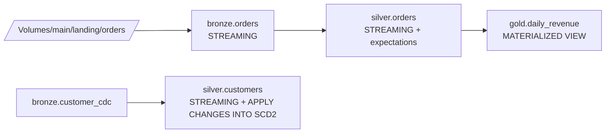

---

## 12. LDP vs Structured Streaming — when to choose which

| Need | Choice |
|------|--------|
| Multi-table ETL DAG with dependency management | **LDP** |
| Data-quality expectations declaratively | **LDP** |
| CDC into SCD1/SCD2 declaratively | **LDP (APPLY CHANGES INTO)** |
| Single one-off streaming query | Plain Structured Streaming |
| Custom sink (REST API, JDBC, Kafka) | Plain Structured Streaming + `foreachBatch` |
| Heavy custom state logic (`mapGroupsWithState`) | Plain Structured Streaming |

For the exam: **default to LDP** for any "build a pipeline" scenario. Pick plain Structured Streaming only when the question explicitly needs `foreachBatch`, custom sink, or stateful operators LDP doesn't natively support.

---

## 13. Mini quiz (cold)

1. The exam shows an answer using `@dlt.table` and another using `@dp.table`. Which is the exam-preferred form?
2. You're building a daily-aggregated Gold table from a Silver Delta table. STREAMING TABLE or MATERIALIZED VIEW?
3. You're building an incremental Bronze table from Auto Loader. STREAMING TABLE or MATERIALIZED VIEW?
4. Inside LDP, you need to upsert CDC events with SCD Type 2 history. Which command?
5. A bad row should fail the entire pipeline update. Which expectation action?
6. A bad row should be dropped but the pipeline continue. Which expectation action?
7. A bad row should be kept and the violation just logged. Which expectation action?
8. LDP serverless was made default in which release?
9. To read another streaming table incrementally inside the same LDP pipeline, what do you wrap it in?

### Answers

1. **`@dp.table`** — the new LDP form. `@dlt.table` still runs but is legacy.
2. **MATERIALIZED VIEW** — aggregation is a recompute, not a stream.
3. **STREAMING TABLE** — incremental from a streaming source.
4. **`APPLY CHANGES INTO` with `STORED AS SCD TYPE 2`** — declarative CDC. Not a hand-rolled MERGE.
5. **`ON VIOLATION FAIL UPDATE`** — fails the pipeline.
6. **`ON VIOLATION DROP ROW`** — drops the row, pipeline continues.
7. **Default (no `ON VIOLATION` clause)** — logs and keeps the row.
8. **July 2025** (Lakeflow Declarative Pipelines refresh).
9. **`STREAM(LIVE.<name>)`** — wraps the streaming table reference for incremental reads.

---

## 14. Sanity check before moving on

You should be able to:
- Distinguish DLT vs LDP names and pick LDP forms on multiple-choice answers.
- Choose STREAMING TABLE vs MATERIALIZED VIEW based on whether the table is incremental or recomputed.
- Write a `CREATE OR REFRESH STREAMING TABLE … FROM STREAM(...)` from memory.
- Write an `APPLY CHANGES INTO … STORED AS SCD TYPE 1|2` from memory.
- Recite the three expectation actions (warn / drop / fail).
- Pick LDP over hand-rolled Structured Streaming for multi-table ETL.

If any of those are fuzzy, re-read Sections 1, 3, 5, and 6.


\newpage

# Module 11 — Data Quality with Expectations

> **Domain 3 (31%) — Data Processing & Transformations**
> **Domain 5 (11%) — Data Governance & Quality**
>
> **What you must walk away with:** All three expectation actions and their decorators. Multi-expectation grouping with `expect_all`. The quarantine pattern. How to query expectation violations from the event log. When to use a row filter / column mask vs an expectation.

---

## Coverage map (verbatim July 25, 2025 objectives → where taught here)

| Verbatim objective | Taught in section |
|---|---|
| Implement data pipelines using LDP (data-quality layer) | §1 what expectations are; §2 the three actions; §3 Python decorator forms + `expect_all*` group decorators; §4 quarantine pattern |
| Identify DDL features (CONSTRAINT … EXPECT … ON VIOLATION DROP ROW / FAIL UPDATE) | §2 SQL forms + §3 decorator ↔ SQL mapping |
| Use lineage / debug tools to query violations | §5 "Inspecting violations via the event log" (`event_log('<pipeline_id>')`) |
| Distinguish expectations from UC row filters / column masks | §6 "Expectations are NOT row filters / column masks" |
| Identify DDL features (Delta CHECK constraint vs LDP expectation) | §7 "Constraints vs expectations" |

Cross-references: Module 10 for the LDP framework that owns expectations; Module 15 for UC row filters / column masks / dynamic views (the access-control side); Module 14 for the event-log monitoring layer.

---

## 1. What expectations are

Expectations are **declarative data-quality constraints** attached to LDP tables. Each expectation is:

- A **name** (used in the event log to identify which rule failed).
- A **boolean SQL expression** evaluated per row.
- An **action** on violation.

```sql
CREATE OR REFRESH STREAMING TABLE main.silver.orders (
  CONSTRAINT valid_id        EXPECT (order_id IS NOT NULL)        ON VIOLATION DROP ROW,
  CONSTRAINT positive_amount EXPECT (amount > 0)                  ON VIOLATION FAIL UPDATE,
  CONSTRAINT recent_date     EXPECT (order_ts >= '2020-01-01')
)
AS SELECT * FROM STREAM(LIVE.bronze_orders);
```

Three rules attached to one table. Each handles violations differently.

---

## 2. The three actions

### 2.1 Default — warn (no `ON VIOLATION` clause)

```sql
CONSTRAINT recent_date EXPECT (order_ts >= '2020-01-01')
```

- Row is **kept** in the output.
- Violation count is **logged** in the pipeline event log.
- No effect on pipeline success.

Use when: you want visibility into quality issues without changing the data flow.

### 2.2 DROP ROW

```sql
CONSTRAINT valid_id EXPECT (order_id IS NOT NULL) ON VIOLATION DROP ROW
```

- Violating rows are **dropped** from the output.
- Violation count is logged.
- Pipeline continues.

Use when: bad rows are unfixable and shouldn't pollute downstream tables.

### 2.3 FAIL UPDATE

```sql
CONSTRAINT positive_amount EXPECT (amount > 0) ON VIOLATION FAIL UPDATE
```

- If any row violates, the **entire pipeline update fails** — no rows written.
- The pipeline can be repaired and re-run.

Use when: a violation indicates a systemic issue that requires human intervention.

### Decision table

| Severity of violation | Action |
|----------------------|--------|
| "Nice to know, doesn't block" | default (warn) |
| "Bad row, exclude from analytics" | DROP ROW |
| "Pipeline is broken if this fires; humans must look" | FAIL UPDATE |

---

## 3. Python decorator form

```python
from pyspark import pipelines as dp

@dp.table
@dp.expect("valid_id", "order_id IS NOT NULL")                       # warn
@dp.expect_or_drop("positive_amount", "amount > 0")                  # drop
@dp.expect_or_fail("recent_date", "order_ts >= '2020-01-01'")        # fail
def silver_orders():
    return (dp.read_stream("bronze_orders")
              .select("order_id", "customer_id", "amount", "order_ts"))
```

| Decorator | Equivalent SQL |
|-----------|---------------|
| `@dp.expect(name, cond)` | `CONSTRAINT name EXPECT (cond)` |
| `@dp.expect_or_drop(name, cond)` | `… ON VIOLATION DROP ROW` |
| `@dp.expect_or_fail(name, cond)` | `… ON VIOLATION FAIL UPDATE` |

### Multi-expectation forms

```python
@dp.table
@dp.expect_all({
    "valid_id": "order_id IS NOT NULL",
    "positive_amount": "amount > 0",
    "recent_date": "order_ts >= '2020-01-01'"
})
def silver_orders():
    return dp.read_stream("bronze_orders")

# Or with DROP semantics on all:
@dp.expect_all_or_drop({...})

# Or with FAIL semantics on all:
@dp.expect_all_or_fail({...})
```

Compactly express many rules at once.

---

## 4. Quarantine pattern — capture bad rows separately

```sql
-- Main table drops bad rows
CREATE OR REFRESH STREAMING TABLE main.silver.orders
  (CONSTRAINT valid_id EXPECT (order_id IS NOT NULL) ON VIOLATION DROP ROW)
AS SELECT * FROM STREAM(LIVE.bronze_orders);

-- Quarantine table collects the bad rows
CREATE OR REFRESH STREAMING TABLE main.quarantine.orders_invalid
AS SELECT * FROM STREAM(LIVE.bronze_orders)
   WHERE order_id IS NULL;
```

Why split: the main table stays clean for downstream consumers; the quarantine table is reviewable by humans / sent to a remediation queue.

Variant — single source table, two outputs via a "tag" column:

```sql
CREATE OR REFRESH STREAMING TABLE main.silver.orders_tagged
AS SELECT
    *,
    CASE
      WHEN order_id IS NULL THEN 'invalid_missing_id'
      WHEN amount <= 0      THEN 'invalid_amount'
      ELSE 'valid'
    END AS validity
   FROM STREAM(LIVE.bronze_orders);

CREATE OR REFRESH MATERIALIZED VIEW main.silver.orders
AS SELECT * EXCEPT(validity) FROM LIVE.orders_tagged WHERE validity = 'valid';

CREATE OR REFRESH MATERIALIZED VIEW main.quarantine.orders
AS SELECT * FROM LIVE.orders_tagged WHERE validity != 'valid';
```

---

## 5. Inspecting violations via the event log

```sql
SELECT
  timestamp,
  details:flow_progress.metrics.num_output_rows AS output_rows,
  details:flow_progress.data_quality.expectations
FROM event_log('<pipeline_id>')
WHERE event_type = 'flow_progress'
ORDER BY timestamp DESC
LIMIT 20;
```

The `expectations` field is a list with per-rule:
- `name` — the CONSTRAINT name.
- `dataset` — which table the expectation is on.
- `passed_records` — how many rows passed.
- `failed_records` — how many violated.

You can build a dashboard on the event log to monitor quality trends.

### ⚠️ Exam trap — silent drops aren't actually silent

A common misconception: "DROP ROW silently loses data, so I can't tell what was dropped." False — every drop increments the failed_records counter in the event log. You don't see the **rows themselves**, but you see the **count** and can correlate with the quarantine pattern if needed.

---

## 6. Expectations are NOT row filters / column masks

Three different mechanisms, often confused:

| Feature | What | When applied | Domain |
|---------|------|--------------|--------|
| **Expectation** | Quality check on incoming rows in LDP | At LDP table compute time | Data quality (DE) |
| **Row filter** (UC) | Restrict which rows a user sees | At query time, per user | Access control (Governance) |
| **Column mask** (UC) | Replace a column's value for some users | At query time, per user | Access control (Governance) |
| **Dynamic view** | View that conditionally exposes columns | At query time, per user | Access control (Governance) |

The exam tests recognition of which mechanism applies:
- "Validate `order_id` is not null at ingestion" → **Expectation**.
- "Hide `ssn` from non-HR users" → **Column mask** or dynamic view (Module 15).
- "Restrict EU users to EU rows" → **Row filter** or dynamic view (Module 15).

### ⚠️ Exam trap — expectation vs row filter

Expectations operate on the **write** side (during LDP table compute). Row filters operate on the **read** side (per-user query). Don't pick "expectation" for an access-control question.

---

## 7. Constraints vs expectations

Delta has SQL CHECK constraints:

```sql
ALTER TABLE main.silver.orders
ADD CONSTRAINT positive_amount CHECK (amount > 0);
```

- A Delta CHECK constraint causes the **write to fail** if any row violates.
- Applies in any write (not just LDP).
- Cannot be conditional (drop vs fail).

vs. LDP expectations:
- LDP expectations can drop, warn, or fail.
- LDP expectations are queryable in the event log with counts.
- LDP expectations are declarative inside LDP DDL.

For the DE Associate exam, **expectations** is the answer for LDP data-quality questions. CHECK constraints are a Delta feature that complements but doesn't replace expectations.

---

## 8. Putting it together — Bronze → quality-checked Silver

```sql
-- Bronze: keep everything, including bad rows
CREATE OR REFRESH STREAMING TABLE main.bronze.orders
AS SELECT *,
          _metadata.file_path AS source_file,
          current_timestamp() AS ingest_ts
   FROM STREAM read_files('/Volumes/main/landing/orders/', format => 'json');

-- Silver: drop NULL IDs, drop non-positive amounts, fail on stale dates
CREATE OR REFRESH STREAMING TABLE main.silver.orders (
  CONSTRAINT valid_id        EXPECT (order_id IS NOT NULL)        ON VIOLATION DROP ROW,
  CONSTRAINT positive_amount EXPECT (amount > 0)                  ON VIOLATION DROP ROW,
  CONSTRAINT recent          EXPECT (order_ts >= '2020-01-01')    ON VIOLATION FAIL UPDATE,
  CONSTRAINT valid_customer  EXPECT (customer_id RLIKE '^[A-Z0-9]+$')  -- warn only
)
AS SELECT
     order_id,
     customer_id,
     CAST(amount AS DECIMAL(18,2)) AS amount,
     TO_TIMESTAMP(order_ts)       AS order_ts,
     ingest_ts
   FROM STREAM(LIVE.bronze_orders);

-- Quarantine: capture the dropped rows for review
CREATE OR REFRESH STREAMING TABLE main.quarantine.orders
AS SELECT * FROM STREAM(LIVE.bronze_orders)
   WHERE order_id IS NULL OR CAST(amount AS DECIMAL(18,2)) <= 0;
```

---

## 9. Mini quiz (cold)

1. Which expectation action drops violating rows but keeps the pipeline running?
2. Which expectation action fails the entire pipeline?
3. Which action keeps the row and just logs the violation?
4. The Python decorator for "drop violating rows" is `@dp.expect_or_???`. Fill in.
5. Where do you query expectation violation counts after a pipeline run?
6. You want to hide `ssn` from non-HR users at query time. Is this an expectation or a column mask?
7. You want to ensure `customer_id` is never null at ingestion. Is this an expectation or a column mask?
8. Difference between Delta CHECK constraint and LDP expectation?

### Answers

1. **`ON VIOLATION DROP ROW`** (decorator: `@dp.expect_or_drop`).
2. **`ON VIOLATION FAIL UPDATE`** (decorator: `@dp.expect_or_fail`).
3. **Default** — no `ON VIOLATION` clause (decorator: `@dp.expect`).
4. **`@dp.expect_or_drop`**.
5. **The pipeline event log**: `SELECT * FROM event_log('<pipeline_id>') WHERE event_type = 'flow_progress'` and look at the `expectations` field.
6. **Column mask** (or dynamic view) — applies at query time per user. Not an expectation.
7. **Expectation** — quality check at ingestion / LDP compute.
8. **CHECK constraint** fails the write (always); applies to any Delta write. **Expectation** can drop / warn / fail, only applies inside LDP DDL, and is queryable in the event log.

---

## 10. Sanity check before moving on

You should be able to:
- Recite the three expectation actions and decorators.
- Pick expectation for quality-at-ingestion questions and column mask / row filter for access-control questions.
- Describe the quarantine pattern.
- Know that violations are visible in `event_log(<pipeline_id>)`.

If any of those are fuzzy, re-read Sections 2, 4, and 6.


\newpage

# Module 12 — Lakeflow Jobs (formerly Workflows / Multi-Task Jobs)

> **Domain 4 (18%) — Productionizing Data Pipelines**
>
> **Exam objectives covered:**
> - Deploy a workflow, **repair and rerun a task** in case of failure.
> - Use **serverless** for hands-off, auto-optimized compute.
> - (Indirectly) Identify the difference between DAB and traditional deployment.
>
> **What you must walk away with:** What a Lakeflow Job is. Task types. Dependencies (`depends_on`). Parameters and task values. **Repair runs.** Triggers (scheduled, file-arrival, continuous). Job cluster vs all-purpose vs serverless cost trap. The 2024 rename Workflows → Lakeflow Jobs.

---

## Coverage map (verbatim July 25, 2025 objectives → where taught here)

| Verbatim objective | Taught in section |
|---|---|
| Deploy a workflow, repair, and rerun a task in case of failure | §8 "Repair runs — THE high-yield exam feature" + §7 retries + §3 failure propagation + `run_if` |
| Use serverless for a hands-off, auto-optimized compute managed by Databricks | §6.3 "Serverless" + §6 decision matrix |
| Identify cluster/configuration for optimal performance (job vs all-purpose vs serverless) | §6 "Compute per task — the cost trap" + decision matrix |
| Identify DDL/DML features (task graph, depends_on, run_if, taskValues) | §2 task types; §3 dependencies; §4 parameters + taskValues; §5 triggers (cron, file_arrival, continuous, manual); §10 concurrency + run_as; §11 for-each |
| Sample question pattern — file-arrival vs cron trigger | §5.2 "File arrival" + §5 exam-trap |

Cross-references: Module 10 for the LDP pipeline the Job triggers; Module 13 for the DAB YAML that ships the Job; Module 14 for run history + system tables.

---

## 1. What a Lakeflow Job is

A **Lakeflow Job** (previously called "Workflow" or "Multi-Task Job," sometimes still "Job") is a **DAG of tasks** orchestrated by the Databricks scheduler.

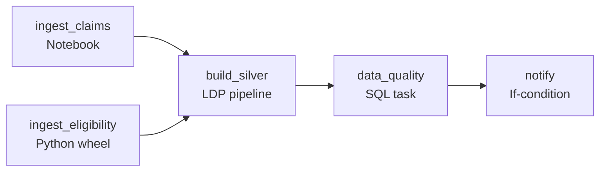

Each box is a **task**. Edges are `depends_on` relationships. The job has scheduling, retries, alerting, parameterization — exactly like a standalone orchestrator (Airflow, Argo) but Databricks-native.

The rename history: "Job" → "Workflow" (2023) → "Lakeflow Job" (2024+). All three names refer to the same thing. The exam prefers **Lakeflow Job**.

---

## 2. Task types

| Task type | What it runs |
|-----------|--------------|
| **Notebook** | A Databricks notebook |
| **Python script** | A `.py` file in the workspace or Git folder |
| **Python wheel** | An installed wheel + entry point |
| **SQL** | A saved SQL query, a dashboard refresh, or an alert |
| **Pipeline** | A Lakeflow Declarative Pipeline (runs an LDP update) |
| **JAR** | A Spark JAR with a main class |
| **Spark Submit** | Arbitrary spark-submit command |
| **dbt** | A dbt project task |
| **If/Else condition** | Conditional gate based on previous task values |
| **For-each** | Iterate a child task over a list of parameter values |

For the exam, **Notebook**, **Pipeline**, **Python wheel**, **If/Else**, and **For-each** are the most relevant.

### ⚠️ Exam trap — "Pipeline task" is the LDP runner

A Lakeflow Job can run an LDP pipeline as one of its tasks. This is the canonical pattern:

- Lakeflow Job triggers hourly (cron or file-arrival).
- Job has a single **Pipeline task** that runs the LDP pipeline.
- LDP does the actual ETL.

Don't confuse "Lakeflow Job" with "Lakeflow Declarative Pipeline" — the Job is the orchestrator, the Pipeline is what it runs.

---

## 3. Dependencies — building the DAG

```yaml
# Asset Bundle resource: a job with three tasks
resources:
  jobs:
    daily_etl:
      name: daily_etl
      tasks:
        - task_key: ingest_orders
          notebook_task:
            notebook_path: ./src/ingest/orders.py

        - task_key: ingest_customers
          notebook_task:
            notebook_path: ./src/ingest/customers.py

        - task_key: build_silver
          depends_on:
            - task_key: ingest_orders
            - task_key: ingest_customers
          pipeline_task:
            pipeline_id: ${resources.pipelines.silver_ldp.id}

        - task_key: data_quality
          depends_on:
            - task_key: build_silver
          notebook_task:
            notebook_path: ./src/checks/run.py
```

Tasks with no `depends_on` are **root tasks** (run first). Downstream tasks wait for **all** their dependencies.

### Failure propagation

By default, if a task fails, its downstream tasks are **skipped** (not failed). The skipped tasks show "Upstream failed" in the run UI.

You can override this with `run_if`:
- `ALL_SUCCESS` (default) — only run if all upstream succeeded
- `ALL_DONE` — run regardless of upstream success/failure (e.g., a cleanup task)
- `AT_LEAST_ONE_SUCCESS` — run if at least one upstream succeeded
- `ALL_FAILED` — only run if all upstream failed (e.g., a failure-handler)
- `AT_LEAST_ONE_FAILED` — run if any upstream failed

---

## 4. Parameters — passing values to tasks

### 4.1 Job-level parameters

```yaml
jobs:
  daily_etl:
    parameters:
      - name: env
        default: dev
      - name: target_date
        default: "{{job.start_time.iso_date}}"
    tasks:
      - task_key: ingest_orders
        notebook_task:
          notebook_path: ./src/ingest/orders.py
          base_parameters:
            env: ${var.env}
            date: ${var.target_date}
```

Inside the notebook:

```python
dbutils.widgets.text("env", "dev")
dbutils.widgets.text("date", "")
env = dbutils.widgets.get("env")
date = dbutils.widgets.get("date")
```

### 4.2 Task values — passing between tasks

```python
# Task A (upstream)
result_count = 4242
dbutils.jobs.taskValues.set(key="row_count", value=result_count)
```

```python
# Task B (downstream)
upstream_count = dbutils.jobs.taskValues.get(
    taskKey="task_a",
    key="row_count",
    default=0,
    debugValue=0
)
```

Use for: passing computed values (counts, file paths, dates) between tasks in the same job run.

### 4.3 Template substitution

Task parameters can use template variables:

```
{{job.id}}
{{job.run_id}}
{{job.start_time.iso_date}}        # 2026-05-23
{{job.start_time.iso_datetime}}    # 2026-05-23T10:00:00Z
{{job.parameters.<name>}}
{{tasks.<task_key>.values.<key>}}  # task value from upstream
{{tasks.<task_key>.run_id}}
```

These resolve at task launch time. Common pattern: pass `target_date = {{job.start_time.iso_date}}` to a notebook.

---

## 5. Triggers

### 5.1 Scheduled — cron

```yaml
schedule:
  quartz_cron_expression: "0 0 6 * * ?"   # daily at 06:00 in the timezone below
  timezone_id: "America/Chicago"
  pause_status: "UNPAUSED"
```

Standard Quartz cron syntax (note: Quartz includes seconds as the first field; `0 0 6 * * ?` = sec=0, min=0, hour=6, day-of-month=any, month=any, day-of-week=any).

### 5.2 File arrival — trigger on new file in storage

```yaml
trigger:
  file_arrival:
    url: /Volumes/main/landing/orders/
    min_time_between_triggers_seconds: 60
    wait_after_last_change_seconds: 30
```

When new files land in the URL (UC Volume or external location), the job triggers. Useful for: event-driven ingestion without polling.

### 5.3 Continuous

```yaml
continuous:
  pause_status: "UNPAUSED"
```

The job runs continuously — when a run finishes, a new one starts immediately. Used for long-running streaming jobs that don't fit the LDP continuous mode.

### 5.4 Manual / API

Tasks triggered manually from the UI or via REST API (`/api/2.1/jobs/run-now`).

### ⚠️ Exam trap — file-arrival trigger vs cron

A question describes "trigger ingestion whenever new files appear in S3, no polling." That's **file-arrival trigger**. Cron-on-the-minute is a poll-style approximation; file-arrival is event-driven.

---

## 6. Compute per task — the cost trap

Each task picks its compute:

### 6.1 All-purpose cluster

```yaml
- task_key: my_task
  existing_cluster_id: 1234-567890-abc
  notebook_task:
    notebook_path: ./src/notebook.py
```

- **Expensive** (~$0.55/DBU range).
- Shared with interactive notebooks → resource contention.
- **Wrong** for scheduled jobs.

### 6.2 Job cluster — created per job

```yaml
- task_key: my_task
  job_cluster_key: small
  notebook_task:
    notebook_path: ./src/notebook.py

job_clusters:
  - job_cluster_key: small
    new_cluster:
      spark_version: "15.4.x-scala2.12"
      node_type_id: "Standard_DS3_v2"
      num_workers: 2
```

- **Cheaper** (~half the DBU of all-purpose).
- Ephemeral — created at job start, terminated at job end.
- **Right** for scheduled / repeating jobs.

### 6.3 Serverless

```yaml
- task_key: my_task
  # no cluster spec — serverless is implicit if configured
  notebook_task:
    notebook_path: ./src/notebook.py
  environment_key: default
```

- **Hands-off** — Databricks manages.
- Sub-30s startup.
- **Right** for any "auto-managed" scenario.

### Decision matrix

| Scenario | Cluster choice |
|----------|----------------|
| Daily scheduled ETL, cost-sensitive | **Job cluster** |
| "Hands-off, auto-optimized" in prompt | **Serverless** |
| Always-on continuous streaming | Job cluster (long-running) or serverless |
| Reuse an existing cluster "because it's already up" | **WRONG** — pick job cluster |

### ⚠️ Exam trap — using an existing all-purpose cluster

If a scenario says "the team already has an all-purpose cluster running; should the scheduled job use it?" the answer is **no, create a job cluster** (or serverless). All-purpose clusters are interactive-priced and shared.

---

## 7. Retries

```yaml
- task_key: flaky_api_call
  notebook_task:
    notebook_path: ./src/api/fetch.py
  max_retries: 3
  min_retry_interval_millis: 60000      # 1 minute between retries
  retry_on_timeout: true
```

- `max_retries` — total retry attempts (0 = no retries).
- `min_retry_interval_millis` — minimum wait between retries.
- `retry_on_timeout` — retry on task timeout.

Configure on **transient-failure-prone tasks** (network calls, occasional cloud throttling).

---

## 8. Repair runs — THE high-yield exam feature

When a multi-task job has a task fail, the downstream tasks are skipped. The natural fix is to re-run, but re-running the full job is wasteful (the upstream tasks already succeeded).

**Repair Run** lets you re-run **only the failed and skipped tasks** while keeping the upstream tasks' successful outputs.

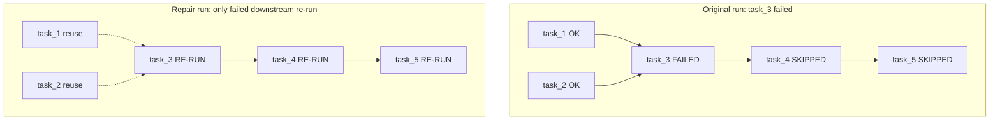

### How to repair

- UI: Lakeflow Jobs → Run → "Repair run" button.
- API: `POST /api/2.1/jobs/runs/repair` with `rerun_tasks: [task_key, ...]`.

Per-task choices:
- **Re-run failed tasks only.**
- **Re-run all tasks** (full re-run, but as a "repair" attached to the original run).
- **Re-run from a specific task** downstream.

You can also **change task parameters** in the repair (useful when the cause was a wrong parameter).

### ⚠️ Exam trap — "repair" vs "run now"

- **Repair run** — re-runs failed tasks as part of the original run; preserves upstream task values.
- **Run now** — starts a new, independent run. Doesn't preserve task values from the old run.

If a question says "the upstream task succeeded; re-run only the failed downstream and keep the upstream output," that's **repair run**. If a question says "restart the entire job from scratch," that's a new run.

---

## 9. Alerts and notifications

```yaml
email_notifications:
  on_start: ["team@example.com"]
  on_success: ["team@example.com"]
  on_failure: ["team@example.com", "oncall@example.com"]
  on_duration_warning_threshold_exceeded: ["oncall@example.com"]

webhook_notifications:
  on_failure:
    - id: pagerduty_webhook_id

health:
  rules:
    - metric: RUN_DURATION_SECONDS
      op: GREATER_THAN
      value: 3600     # alert if job runs > 1 hour
```

Configurable at job level and per-task level.

---

## 10. Concurrency control

```yaml
max_concurrent_runs: 1
```

- `1` (default) — only one run at a time; new triggers are queued or skipped (configurable).
- `> 1` — allow multiple simultaneous runs (rare for ETL; common for per-tenant for-each jobs).

`run_as` — what identity runs the job:

```yaml
run_as:
  user_name: "service-principal@example.com"
```

Best practice: production jobs run as a **service principal**, not a user.

---

## 11. For-each tasks

```yaml
- task_key: process_partition
  for_each_task:
    inputs: ${tasks.list_partitions.values.partitions}
    concurrency: 5
    task:
      notebook_task:
        notebook_path: ./src/process_partition.py
        base_parameters:
          partition: "{{input}}"
```

- Iterates a child task over a list (passed in via task values or parameters).
- `concurrency` — how many child runs in parallel.
- `{{input}}` — the current iteration's value.

Use case: parallel processing across many partitions, accounts, or shards.

---

## 12. A complete Lakeflow Job (DAB form)

```yaml
resources:
  jobs:
    orders_daily:
      name: orders-daily
      schedule:
        quartz_cron_expression: "0 0 6 * * ?"
        timezone_id: "UTC"
      max_concurrent_runs: 1
      email_notifications:
        on_failure: ["oncall@example.com"]

      job_clusters:
        - job_cluster_key: small
          new_cluster:
            spark_version: "15.4.x-scala2.12"
            node_type_id: "Standard_DS3_v2"
            num_workers: 2

      tasks:
        - task_key: ingest_orders
          job_cluster_key: small
          notebook_task:
            notebook_path: ./src/ingest/orders.py
          max_retries: 3
          min_retry_interval_millis: 60000

        - task_key: ingest_customers
          job_cluster_key: small
          notebook_task:
            notebook_path: ./src/ingest/customers.py
          max_retries: 3

        - task_key: silver_ldp
          depends_on:
            - task_key: ingest_orders
            - task_key: ingest_customers
          pipeline_task:
            pipeline_id: ${resources.pipelines.silver.id}

        - task_key: gold_aggregate
          depends_on:
            - task_key: silver_ldp
          job_cluster_key: small
          notebook_task:
            notebook_path: ./src/gold/daily_revenue.py

        - task_key: notify
          depends_on:
            - task_key: gold_aggregate
          run_if: ALL_DONE
          notebook_task:
            notebook_path: ./src/ops/notify.py
```

---

## 13. Mini quiz (cold)

1. The team's job had task 3 fail. Tasks 1 and 2 succeeded. What's the fastest way to re-run just task 3 and onward, preserving task 1/2 outputs?
2. A team's scheduled job runs on an existing all-purpose cluster "because it's already up." What's wrong with this and what's the fix?
3. Trigger a job whenever a new file appears in `/Volumes/main/landing/orders/`. Which trigger type?
4. Pass a value computed in task A to task B. Which API?
5. Task B should run only if both task A and task X succeeded. Which `run_if`?
6. A task should run regardless of whether the upstream task succeeded or failed. Which `run_if`?
7. A scheduled job's prompt says "hands-off, auto-managed, no cluster tuning." Cluster choice?
8. Pipeline task in a Lakeflow Job — what does it run?

### Answers

1. **Repair run** — re-runs failed tasks while preserving outputs of already-succeeded tasks.
2. **Cost.** All-purpose clusters are ~2× the DBU of job clusters. Switch to a **job cluster** (or serverless if "hands-off").
3. **File-arrival trigger.** Set `trigger.file_arrival.url` to the path.
4. **`dbutils.jobs.taskValues.set(key, value)`** in task A; **`dbutils.jobs.taskValues.get(taskKey, key, default)`** in task B.
5. **`ALL_SUCCESS`** (default).
6. **`ALL_DONE`** — runs regardless of upstream outcome.
7. **Serverless.** "Hands-off / auto-managed" maps to serverless.
8. **A Lakeflow Declarative Pipeline (LDP) update.** The Job triggers the Pipeline as one of its tasks.

---

## 14. Sanity check before moving on

You should be able to:
- Differentiate Lakeflow Job vs Lakeflow Pipeline (orchestrator vs ETL engine).
- List the major task types (Notebook, Pipeline, Python wheel, SQL, If/Else, For-each).
- Choose job cluster over all-purpose for scheduled jobs.
- Choose serverless when the prompt says "hands-off."
- Explain repair runs in one sentence.
- Choose `file_arrival` over cron for event-driven ingestion.
- Use task values to pass between tasks.

If any of those are fuzzy, re-read Sections 6, 8, and 5.


\newpage

# Module 13 — Databricks Asset Bundles (DABs) for Data Engineering

> **Domain 4 (18%) — Productionizing Data Pipelines** — high-yield, ~4–5 questions cluster here
>
> **Exam objectives covered:**
> - Identify the **difference between DAB and traditional deployment methods.**
> - Identify the **structure of Asset Bundles.**
>
> **What you must walk away with:** What a bundle is. `databricks.yml` structure (bundle, variables, targets, resources). `mode: development` vs `production`. The four CLI commands (validate, deploy, run, destroy). When DAB is the right answer.

---

## Coverage map (verbatim July 25, 2025 objectives → where taught here)

| Verbatim objective | Taught in section |
|---|---|
| Identify the difference between DAB and traditional deployment methods | §1 "The problem DAB solves" + exam trap |
| Identify the structure of Asset Bundles | §2 file layout; §3 `databricks.yml` top-level blocks (bundle, include, variables, targets, resources, workspace, permissions, artifacts) + built-in references; §4 `mode: development` vs `production`; §5 resource types |
| Deploy a workflow, repair, and rerun a task in case of failure (CLI side) | §6 "The four CLI commands" (validate / deploy / run / destroy) |

Cross-references: Module 12 for Lakeflow Jobs YAML (the most common bundle resource); Module 10 for LDP pipeline resources inside a bundle; Module 02 for Git folder workflow that precedes the DAB deploy.

---

## 1. The problem DAB solves

Pre-DAB, "deploying" Databricks code meant:

- Manually import notebooks via the UI into the prod workspace.
- Manually click together a job's tasks via the Jobs UI.
- Manually copy a pipeline config between dev and prod.
- Hope nothing changed.
- Repeat for every change.

This is brittle, error-prone, not reproducible, and doesn't integrate with CI/CD.

**Databricks Asset Bundles (DABs)** is the **declarative deployment model** — you describe your jobs, pipelines, schemas, ML experiments, and notebooks in YAML (`databricks.yml`), then deploy with a single CLI command. The bundle is the **artifact** that CI/CD pipelines produce and that gets promoted dev → staging → prod.

### ⚠️ Exam trap — DAB vs Git folders / manual deploy

If a question describes "promoting code from dev workspace to prod workspace in a CI/CD pipeline" and the answer choices include:
- Manually copying notebooks
- Cloning Git folders into prod
- **Using Databricks Asset Bundles**
- Using `dbutils.notebook.run` from prod

The right answer is **Databricks Asset Bundles**. Manual deploy and Git folders are wrong; `dbutils` isn't a deployment mechanism.

---

## 2. Bundle file structure

A typical DAB project layout:

```
my-project/
├── databricks.yml          ← root bundle config
├── resources/
│   ├── jobs.yml            ← job definitions
│   └── pipelines.yml       ← LDP pipeline definitions
├── src/
│   ├── ingest/
│   │   └── orders.py
│   ├── silver/
│   │   └── orders.py
│   └── gold/
│       └── daily_revenue.py
├── pipelines/
│   └── orders.sql          ← LDP SQL notebook
├── tests/
│   └── test_transforms.py
└── .github/
    └── workflows/
        └── deploy.yml
```

The `databricks.yml` references the other files via `include:` and resource definitions.

---

## 3. `databricks.yml` — the root config

```yaml
# databricks.yml
bundle:
  name: orders_pipeline
  git:
    branch: main

include:
  - resources/*.yml

variables:
  catalog:
    description: "UC catalog to write to"
    default: "main"
  notification_email:
    description: "Where alerts go"
    default: "team@example.com"

targets:
  dev:
    mode: development
    default: true
    workspace:
      host: https://adb-dev.cloud.databricks.com
    variables:
      catalog: dev_main

  staging:
    mode: production
    workspace:
      host: https://adb-staging.cloud.databricks.com
    variables:
      catalog: staging_main
      notification_email: "staging-alerts@example.com"

  prod:
    mode: production
    workspace:
      host: https://adb-prod.cloud.databricks.com
    variables:
      catalog: main
      notification_email: "prod-oncall@example.com"

# Inline resources (could also be in resources/*.yml)
resources:
  jobs:
    orders_daily:
      name: orders-daily-${bundle.target}
      schedule:
        quartz_cron_expression: "0 0 6 * * ?"
        timezone_id: "UTC"
      tasks:
        - task_key: bronze
          job_cluster_key: small
          notebook_task:
            notebook_path: ./src/ingest/orders.py
            base_parameters:
              catalog: ${var.catalog}
```

### Top-level blocks

| Block | What it contains |
|-------|------------------|
| `bundle` | Bundle metadata (name, Git ref) |
| `include` | Glob list of additional YAML files to merge |
| `variables` | Parameterization (with `default`, `description`, optional `type`) |
| `targets` | Per-environment configuration (`dev`, `staging`, `prod`) with per-target overrides |
| `resources` | Inline resource definitions (jobs, pipelines, schemas, models, experiments, …) |
| `workspace` | Default workspace config (often overridden per target) |
| `permissions` | Bundle-wide permission grants |
| `artifacts` | Build artifacts (Python wheels, JARs) |

### Variables

Variables are referenced as `${var.<name>}`. They get values from:
1. CLI flag: `--var catalog=other_main`
2. Per-target override under `targets.<t>.variables.<name>`
3. Default in `variables.<name>.default`

```yaml
variables:
  catalog:
    description: "Target UC catalog"
    default: "main"

resources:
  jobs:
    my_job:
      tasks:
        - notebook_task:
            base_parameters:
              catalog: ${var.catalog}
```

### Built-in references

| Reference | Resolves to |
|-----------|-------------|
| `${bundle.target}` | The current target name (dev/staging/prod) |
| `${bundle.name}` | The bundle's name |
| `${workspace.current_user.userName}` | Email of the deploying user |
| `${resources.jobs.my_job.id}` | Resolved Job ID after deploy |
| `${resources.pipelines.my_pipeline.id}` | Resolved Pipeline ID after deploy |

These resolve at deploy time.

---

## 4. Targets — `mode: development` vs `production`

The `mode` field controls how the bundle behaves per environment.

### 4.1 `mode: development`

```yaml
targets:
  dev:
    mode: development
```

What it does:
- **Prepends `[dev <user>]` to resource names** (so two devs deploying simultaneously don't collide).
- **Pauses schedules** by default (your dev deploys don't run on cron).
- **Routes artifact paths to `/Users/<user>/.bundle/`** (per-user namespace).
- **Allows you to re-run `databricks bundle deploy` repeatedly** without worrying about overwriting a shared dev environment.

### 4.2 `mode: production`

```yaml
targets:
  prod:
    mode: production
```

What it does:
- **No dev prefix** — resources use their declared names.
- **Schedules unpaused** by default.
- **`run_as` must be specified** (or inherited) — typically a service principal.
- **Restricted to a fixed root path** for artifacts.
- **`git.branch` validation** — Databricks can verify the bundle was deployed from a specific Git branch.

### ⚠️ Exam trap — dev vs prod mode

If a question shows two developers both deploying the same bundle to a shared dev workspace and asks "how do their deployments avoid collisions?" the answer is **`mode: development` namespaces resources per-user.**

If a question asks "what mode does prod use?" the answer is **`mode: production`** (which enforces no-dev-prefix and unpaused schedules).

---

## 5. Resources — what you can deploy

Bundle resources include:

| Resource type | What it deploys |
|---------------|-----------------|
| `jobs` | Lakeflow Jobs |
| `pipelines` | Lakeflow Declarative Pipelines |
| `schemas` | UC schemas |
| `volumes` | UC managed volumes |
| `models` | MLflow registered models |
| `experiments` | MLflow experiments |
| `clusters` | Cluster definitions (rare; usually inline `job_clusters`) |
| `dashboards` | DBSQL dashboards |
| `model_serving_endpoints` | Model Serving endpoints |
| `apps` | Databricks Apps |
| `quality_monitors` | Lakehouse Monitor configurations |

For DE Associate, focus on **jobs** and **pipelines**.

### Example: bundle deploying a pipeline + job that runs it

```yaml
resources:
  pipelines:
    silver_ldp:
      name: silver-ldp-${bundle.target}
      catalog: ${var.catalog}
      target: sales
      configuration:
        landing_path: /Volumes/${var.catalog}/landing/orders
      libraries:
        - notebook:
            path: ./pipelines/orders.sql

  jobs:
    orders_daily:
      name: orders-daily-${bundle.target}
      schedule:
        quartz_cron_expression: "0 0 6 * * ?"
        timezone_id: "UTC"
      tasks:
        - task_key: run_silver
          pipeline_task:
            pipeline_id: ${resources.pipelines.silver_ldp.id}
```

The `pipeline_id: ${resources.pipelines.silver_ldp.id}` is resolved at deploy time — DAB deploys the pipeline first, captures its ID, then deploys the job referencing it.

---

## 6. The four CLI commands

The Databricks CLI must be **version ≥ 0.218** for DABs.

### 6.1 `databricks bundle validate`

```bash
databricks bundle validate
databricks bundle validate -t prod
```

- Parses the bundle.
- Checks YAML syntax, variable references, resource references.
- Does NOT deploy anything.
- Use in CI to gate PRs.

### 6.2 `databricks bundle deploy`

```bash
databricks bundle deploy            # uses the default target (often dev)
databricks bundle deploy -t prod    # deploys to prod target
databricks bundle deploy -t prod --force-lock   # break stuck deploy lock
```

- Uploads notebooks, files, wheels to the workspace.
- Creates/updates jobs, pipelines, schemas in the target workspace.
- Idempotent — re-running deploys only changes.

### 6.3 `databricks bundle run`

```bash
databricks bundle run orders_daily -t prod
databricks bundle run silver_ldp -t prod --full-refresh
```

- Runs a specific resource (job or pipeline) defined in the bundle.
- Useful for one-off test runs after a deploy.

### 6.4 `databricks bundle destroy`

```bash
databricks bundle destroy -t dev
```

- Deletes all bundle-managed resources from the target workspace.
- Useful for ephemeral dev environments.

### Other useful commands

```bash
databricks bundle init                  # scaffold a new bundle from a template
databricks bundle summary               # show what was deployed
databricks bundle open <resource> -t prod   # open the resource in the workspace UI
```

---

## 7. CI/CD integration

The canonical flow:

```mermaid
graph LR
    DEV[Developer commits to feature branch]
    PR[Pull request to main]
    CIVALID[CI: databricks bundle validate]
    MERGE[Merge to main]
    CISTAGE[CD: databricks bundle deploy -t staging]
    SMOKE[Smoke tests on staging]
    PROMOTE[Manual approval]
    CIPROD[CD: databricks bundle deploy -t prod]
    DEV --> PR --> CIVALID
    CIVALID -->|pass| MERGE --> CISTAGE --> SMOKE --> PROMOTE --> CIPROD
```

A typical GitHub Actions workflow:

```yaml
# .github/workflows/deploy.yml
name: Deploy Bundle
on:
  push:
    branches: [main]

jobs:
  deploy_prod:
    runs-on: ubuntu-latest
    steps:
      - uses: actions/checkout@v4
      - uses: databricks/setup-cli@main
        with:
          version: 0.220.0
      - name: Validate
        run: databricks bundle validate -t prod
        env:
          DATABRICKS_HOST: ${{ secrets.DATABRICKS_HOST }}
          DATABRICKS_TOKEN: ${{ secrets.DATABRICKS_TOKEN }}
      - name: Deploy
        run: databricks bundle deploy -t prod
        env:
          DATABRICKS_HOST: ${{ secrets.DATABRICKS_HOST }}
          DATABRICKS_TOKEN: ${{ secrets.DATABRICKS_TOKEN }}
```

Authentication: `DATABRICKS_HOST` + `DATABRICKS_TOKEN`, or OAuth M2M with `DATABRICKS_CLIENT_ID` / `DATABRICKS_CLIENT_SECRET`.

---

## 8. Comparison: DAB vs Terraform vs manual

| Aspect | DAB | Terraform | Manual UI |
|--------|-----|-----------|-----------|
| Scope | Workspace-level resources (jobs, pipelines, …) | Full account + workspace (incl. workspaces themselves, networking) | Workspace-level |
| State | Tracked in workspace | `.tfstate` file or backend | None |
| Reproducibility | High | High | Low |
| Native CI/CD integration | Yes | Yes (HashiCorp tooling) | No |
| Exam-canonical for DE | **Yes** | Sometimes mentioned for "platform IaC" | No (anti-pattern) |
| Familiarity | Lower learning curve | Higher learning curve | None |

For the DE Associate exam, **DAB is the right answer for application-level deployment** (jobs, pipelines, schemas). Terraform is for platform-level infrastructure (workspaces, metastores, networking) — beyond DE Associate scope.

---

## 9. `bundle init` templates

```bash
databricks bundle init                              # interactive picker
databricks bundle init default-python               # starter Python project
databricks bundle init dbt-sql                      # dbt project
databricks bundle init mlops-stacks                 # MLOps stack
databricks bundle init <git-url>                    # custom template repo
```

The default Python template scaffolds:
- `databricks.yml` with dev / prod targets
- `src/` directory with sample notebook
- `resources/` directory with a sample job
- `.gitignore`, README

Good starting point for new projects.

---

## 10. A complete bundle example

```yaml
# databricks.yml
bundle:
  name: orders_pipeline
  git:
    branch: main

include:
  - resources/*.yml

variables:
  catalog:
    description: "Target UC catalog"
    default: main
  notification_email:
    default: "team@example.com"

workspace:
  root_path: /Workspace/Users/${workspace.current_user.userName}/.bundle/${bundle.target}/${bundle.name}

targets:
  dev:
    mode: development
    default: true
    workspace:
      host: https://adb-dev.cloud.databricks.com
    variables:
      catalog: dev_main

  prod:
    mode: production
    workspace:
      host: https://adb-prod.cloud.databricks.com
    variables:
      catalog: main
      notification_email: "oncall@example.com"
    run_as:
      service_principal_name: "00000000-0000-0000-0000-000000000000"
```

```yaml
# resources/pipelines.yml
resources:
  pipelines:
    silver_orders:
      name: silver-orders-${bundle.target}
      catalog: ${var.catalog}
      target: sales
      serverless: true
      libraries:
        - notebook:
            path: ../pipelines/silver_orders.sql
      configuration:
        landing_path: /Volumes/${var.catalog}/landing/orders
```

```yaml
# resources/jobs.yml
resources:
  jobs:
    orders_daily:
      name: orders-daily-${bundle.target}
      schedule:
        quartz_cron_expression: "0 0 6 * * ?"
        timezone_id: "UTC"
      max_concurrent_runs: 1
      email_notifications:
        on_failure: [${var.notification_email}]
      tasks:
        - task_key: run_silver
          pipeline_task:
            pipeline_id: ${resources.pipelines.silver_orders.id}
        - task_key: gold_aggregate
          depends_on:
            - task_key: run_silver
          notebook_task:
            notebook_path: ../src/gold/daily_revenue.py
            base_parameters:
              catalog: ${var.catalog}
          job_cluster_key: small
      job_clusters:
        - job_cluster_key: small
          new_cluster:
            spark_version: "15.4.x-scala2.12"
            node_type_id: "Standard_DS3_v2"
            num_workers: 2
```

Deploy:
```bash
databricks bundle validate -t prod
databricks bundle deploy -t prod
databricks bundle run orders_daily -t prod
```

---

## 11. Mini quiz (cold)

1. What command validates a bundle's YAML without deploying anything?
2. What command deploys the bundle to a specific target?
3. What does `mode: development` do that `mode: production` doesn't?
4. How do you reference the deployed Job ID of another resource inside the same bundle?
5. The CI pipeline must promote code from dev to prod. DAB or manual notebook import?
6. Two developers deploy the same bundle to a shared dev workspace simultaneously. How do they avoid collision?
7. The Databricks CLI must be at least which version for DABs?
8. Where do bundle variables get their values from (three sources)?

### Answers

1. **`databricks bundle validate`** (optionally with `-t <target>`).
2. **`databricks bundle deploy -t <target>`** (e.g., `-t prod`).
3. **`development`** prepends `[dev <user>]` to resource names, pauses schedules by default, uses per-user artifact paths. **`production`** enforces unpaused schedules, no dev prefix, requires `run_as`.
4. **`${resources.<type>.<name>.id}`** — e.g., `${resources.pipelines.silver_orders.id}`. Resolved at deploy time.
5. **DAB.** Manual import is the anti-pattern.
6. **`mode: development`** namespaces each user's resources with a `[dev <user>]` prefix.
7. **0.218** or newer.
8. (1) CLI flag (`--var x=y`), (2) per-target override under `targets.<t>.variables.<x>`, (3) `default:` in the `variables` block.

---

## 12. Sanity check before moving on

You should be able to:
- Write a minimal `databricks.yml` from memory.
- Recite the top-level blocks: `bundle`, `include`, `variables`, `targets`, `resources`, `workspace`.
- Differentiate `mode: development` vs `mode: production`.
- List the four CLI commands (validate, deploy, run, destroy).
- Pick DAB over manual / Git folder for promotion scenarios.

If any of those are fuzzy, re-read Sections 3, 4, and 6.


\newpage

# Module 14 — Monitoring & Observability: Spark UI, Job History, System Tables

> **Domain 4 (18%) — Productionizing Data Pipelines**
>
> **Exam objectives covered:**
> - **Analyzing the Spark UI to optimize the query.**
> - Use Databricks' built-in debugging tools to troubleshoot a given issue.
> - Identify how audit logs are stored.
>
> **What you must walk away with:** The four Spark UI tabs and what each tells you. How to read the SQL/DataFrame tab. Stage skew indicators. Job run history. Query history. System tables for cost and lineage.

---

## Coverage map (verbatim July 25, 2025 objectives → where taught here)

| Verbatim objective | Taught in section |
|---|---|
| Analyzing the Spark UI to optimize the query | §2 "The four tabs" (Jobs, Stages, Storage, Executors, SQL/DataFrame) + §3 Streaming tab + §11 triage flowchart |
| Use Databricks' built-in debugging tools to troubleshoot a given issue | §4 job run history; §5 LDP event log; §6 DBSQL query history; §8 cluster event log; §9 driver/executor logs; §10 health rules |
| Identify how audit logs are stored | §7 system tables (`system.access.audit` queryable; cloud-storage log delivery for long-term raw JSON) + §7 exam trap |
| Use lineage features in Unity Catalog | §7 `system.access.table_lineage` and `system.access.column_lineage` |

Cross-references: Module 15 for the UC governance model that produces audit/lineage; Module 11 for the LDP event-log data-quality entries; Module 12 for the Lakeflow Job run UI.

---

## 1. Why the Spark UI is on the exam

The exam objective "analyze the Spark UI to optimize the query" appears explicitly. Candidates with PySpark experience who never opened the Spark UI struggle here. **You must be able to navigate four tabs from memory.**

### How to get to the Spark UI

- From a notebook cell that ran a Spark action: there's a "↗ Spark UI" link in the cell output.
- From a cluster: Compute → cluster → "Spark UI" link.
- From a job run: Lakeflow Jobs → run → task → "Spark UI" link.

---

## 2. The four tabs you must know

### 2.1 Jobs tab

Lists all Spark jobs (a Spark **job** = the work triggered by one action, e.g., a `count()` or `write`).

For each job:
- Status (succeeded / failed / running).
- Duration.
- Stages launched (count and link).

Use for: "what jobs did this notebook trigger?" and "which job is slow?"

### 2.2 Stages tab — the skew detection tab

Each Spark job is one or more **stages** separated by shuffles. Each stage runs as **tasks** in parallel across executors.

For each stage:
- Status, duration.
- **Tasks summary** — number of tasks, min / 25th / median / 75th / max duration.
- **Shuffle Read / Shuffle Write** sizes.
- Input / output sizes.

**The key signal: task duration distribution.** If median = 2 sec but max = 60 sec, you have **data skew** — one partition has way more data than the others.

```
Stage 42 — Tasks: 200
  Min:    1.2 sec
  25th:   1.5 sec
  Median: 1.8 sec
  75th:   2.1 sec
  Max:    62 sec   ← SKEW INDICATOR
```

Fix options:
- **Salting** (add a random suffix to skewed keys before join).
- **Broadcast join** if one side is small.
- **AQE (Adaptive Query Execution)** — `spark.sql.adaptive.skewJoin.enabled = true` (default on newer DBR) auto-splits skewed partitions.
- **Repartition** before the operation.

### ⚠️ Exam trap — skew detection

If a question shows a stage with "median 2s / max 60s" and asks "what's wrong?" the answer is **data skew**. Look for "broadcast" or "AQE" in the recommended fix.

### 2.3 Storage tab

Shows cached / persisted RDDs and DataFrames:
- Storage level (memory, disk, both).
- Size in memory.
- Cached partition count.

Use for: "are my caches actually in memory?" and "how much is being cached?"

If you `df.cache()` then never use the DataFrame again, you wasted memory. Storage tab catches this.

### 2.4 Executors tab

Per-executor stats:
- Executor ID, host, status.
- Active tasks, completed tasks, failed tasks.
- Storage memory used (cached data).
- **GC time** — total time spent in garbage collection.
- Total task time.

**The key signal: GC time as % of task time.** If GC is > 10% of task time, the JVM is thrashing. Fix: more executor memory, fewer cached objects, larger heap.

### 2.5 SQL / DataFrame tab — the most useful

Every Spark SQL or DataFrame action shows up here as a query with:
- Submitted / completed time.
- Duration.
- Status.
- **Query plan** (physical) — clickable, shows the DAG of operators.

The query plan reveals:
- **Join strategy** — `BroadcastHashJoin`, `SortMergeJoin`, `ShuffleHashJoin`.
- **Exchange** nodes (shuffles) — where data is re-distributed.
- **Filter pushdown** — `Filter` before `FileScan` is good; after is wasted reads.
- **Project** — column pruning.
- **AQE rewrites** — operators added at runtime by Adaptive Query Execution.

**Key diagnostic patterns:**

| What you see | What it means |
|--------------|---------------|
| `BroadcastHashJoin` with a small build side | Good — small dim was broadcast |
| `SortMergeJoin` between two large tables | Could be fine; check for skew |
| `Exchange hashpartitioning(...)` before a join | Shuffle for join collocation |
| `FileScan` reading 10× more rows than the query needs | Missing filter pushdown — check partition / clustering |
| `Filter` operator AFTER a large `FileScan` | The filter wasn't pushed down — file format may not support it |
| `Scan parquet` with `PushedFilters: [IsNotNull(id), EqualTo(id,42)]` | Filter pushed down — good |

### ⚠️ Exam trap — reading the physical plan

If a question shows a query plan with a huge `FileScan` followed by a small `Filter`, and asks "why is this slow?" — the answer is **the filter isn't being pushed down to the scan** (often because the column isn't indexed in Delta stats, or it's a generated column not used as a partition key, or there's no clustering).

---

## 3. The Structured Streaming tab

Specifically for streaming queries. Each running stream has:
- **Input Rate** — rows/sec coming in.
- **Process Rate** — rows/sec being processed.
- **Batch Duration** — how long each micro-batch takes.
- **Operation Duration** breakdown (addBatch, commitBatch, …).

Diagnostics:
- **Input Rate >> Process Rate** → backlog growing. Need more executors or speed up transformations.
- **Process Rate degrading over time** → state store growing (check watermarks).
- **Batch Duration spikes** → skew or GC.

---

## 4. Job run history

Lakeflow Jobs → click into any job → "Runs" tab shows recent runs:
- Start / end time.
- Duration.
- Status (success / failed / cancelled / skipped).
- Triggered by (schedule / manual / API / file_arrival).
- Per-task status.

Click a run → see each task's output, logs, Spark UI link.

### Run states
- **Pending** — queued, waiting for compute.
- **Running** — actively executing.
- **Succeeded** — all tasks succeeded.
- **Failed** — at least one task failed (and downstream skipped).
- **Cancelled** — manually stopped.
- **Internal error** — Databricks-side issue.

---

## 5. Pipeline (LDP) event log

LDP pipelines log structured events to a Delta table:

```sql
SELECT *
FROM event_log('<pipeline_id>')
ORDER BY timestamp DESC;
```

Event types:
- `flow_progress` — per-table progress and data-quality metrics
- `data_quality` — expectation violation counts
- `update_progress` — pipeline-level progress
- `user_action` — manual interventions
- `system` — engine events

Useful queries:

```sql
-- Latest expectation violations
SELECT
  timestamp,
  details:flow_progress.data_quality.expectations
FROM event_log('<pipeline_id>')
WHERE event_type = 'flow_progress'
  AND details:flow_progress.data_quality.expectations IS NOT NULL
ORDER BY timestamp DESC
LIMIT 10;

-- Pipeline updates and their durations
SELECT
  details:update_progress.update_id  AS update_id,
  MIN(timestamp)                     AS start_time,
  MAX(timestamp)                     AS end_time,
  MAX(timestamp) - MIN(timestamp)    AS duration
FROM event_log('<pipeline_id>')
WHERE event_type = 'update_progress'
GROUP BY 1
ORDER BY start_time DESC;
```

---

## 6. Query history (DBSQL)

For SQL warehouses, Databricks SQL → "Query History" lists all SQL queries:
- User who ran it.
- Warehouse used.
- Duration.
- Rows returned.
- Bytes read.
- Status.

Click a query → see the physical plan and per-stage metrics (similar to Spark UI but DBSQL-tailored).

Use for: BI dashboard query optimization, finding slow queries, identifying who's running expensive queries.

---

## 7. System tables — the cross-cutting observability layer

Unity Catalog provides **system tables** under the `system` catalog. These are auto-populated and queryable like normal Delta tables.

### Useful system tables

| Table | What it contains |
|-------|------------------|
| `system.access.audit` | Audit logs — who did what, when (queryable form of the cloud-delivered audit logs) |
| `system.access.table_lineage` | Table-to-table lineage (which queries / jobs read/write which tables) |
| `system.access.column_lineage` | Column-level lineage |
| `system.billing.usage` | DBU / cost usage per workspace, cluster, user, job |
| `system.compute.clusters` | Cluster definitions / events |
| `system.compute.warehouses` | SQL warehouse definitions / events |
| `system.lakeflow.jobs` | Job definitions |
| `system.lakeflow.job_run_timeline` | Job run history queryable |
| `system.query.history` | Query history (similar to UI query history) |
| `system.information_schema.*` | Standard SQL information_schema views |

### Example: cost attribution by job

```sql
SELECT
  u.workspace_id,
  u.usage_metadata.job_id          AS job_id,
  j.name                           AS job_name,
  DATE(u.usage_start_time)         AS usage_date,
  SUM(u.usage_quantity)            AS dbus
FROM system.billing.usage u
LEFT JOIN system.lakeflow.jobs j
  ON u.usage_metadata.job_id = j.job_id
WHERE u.usage_start_time >= current_date() - INTERVAL 7 DAYS
GROUP BY 1, 2, 3, 4
ORDER BY dbus DESC;
```

### ⚠️ Exam trap — where do audit logs live?

The exam asks "where are audit logs stored?" Two valid answers:
1. **In the customer's cloud storage** via account-level log delivery (long-term retention, raw JSON).
2. **In the `system.access.audit` system table** (queryable, but limited retention).

If only one is listed: pick whichever matches the question's focus. If both are listed: pick the system table for "query the audit log" scenarios, cloud storage for "long-term retention" scenarios.

---

## 8. Cluster event log

Compute → cluster → "Event log" tab shows cluster-level events:
- **STARTING / STARTED / TERMINATED** — lifecycle.
- **RESIZING / UP_SIZE_COMPLETED / DOWN_SIZE_COMPLETED** — autoscale events.
- **DRIVER_HEALTHY / DRIVER_UNHEALTHY** — driver state.
- **INIT_SCRIPTS_FINISHED / INIT_SCRIPTS_FAILED** — init script execution.
- **DBFS_DOWN / S3_DOWN** — storage events.

Use for: diagnosing "why didn't the cluster start?" and "when did autoscale fire?"

---

## 9. Driver and executor logs

Compute → cluster → "Driver logs" tab:
- `log4j-active.log` — current Spark log.
- `stderr` — driver process stderr.
- `stdout` — driver process stdout.
- Archived rotated logs.

Executor logs accessible via the Executors tab in the Spark UI (per-executor stderr / stdout).

For Lakeflow Jobs, click into a task → "Logs" tab for the task's log output.

---

## 10. Health monitoring

### Job-level

```yaml
health:
  rules:
    - metric: RUN_DURATION_SECONDS
      op: GREATER_THAN
      value: 3600     # alert if job > 1 hour
```

Triggers an alert on the `on_duration_warning_threshold_exceeded` notification when the threshold is crossed.

### Cluster-level

Autoscale, automatic termination, node restart on health issues — configured in the cluster spec.

---

## 11. Putting it together — a triage flowchart

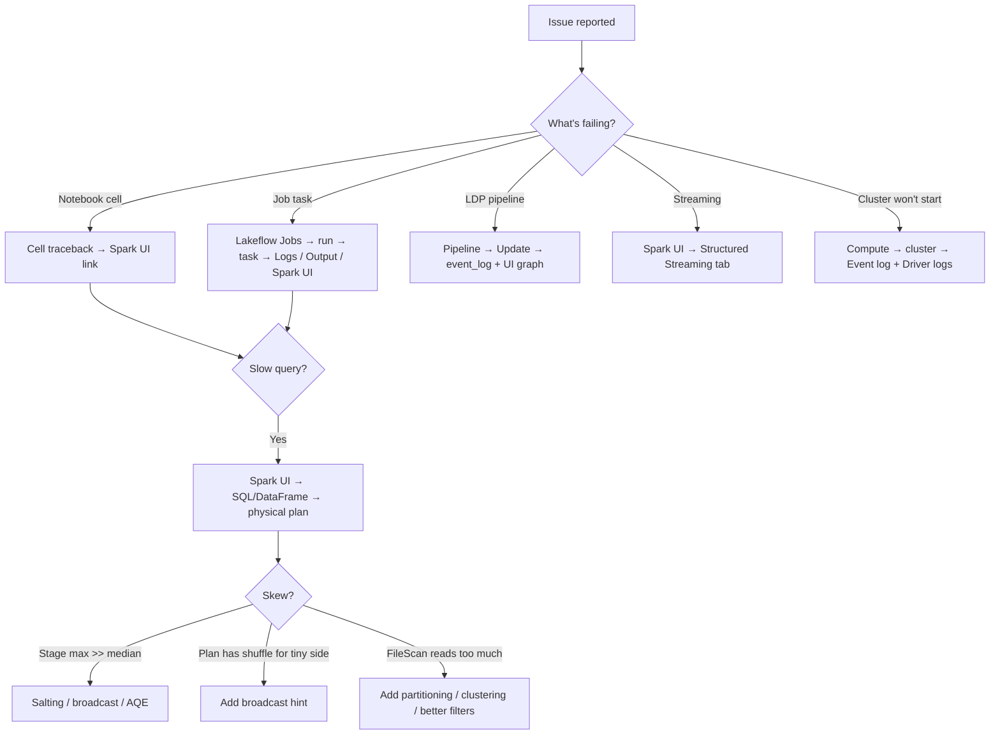

---

## 12. Mini quiz (cold)

1. Where in the Spark UI do you check for data skew?
2. A stage shows median task duration 1.8s and max 62s. What's the diagnosis?
3. A query is slow. The plan shows a `SortMergeJoin` between a 100GB fact and a 50MB dim. What's the fix?
4. Where do you go to see expectation violation counts for an LDP pipeline?
5. Which system table holds audit logs?
6. Which system table holds DBU usage by job?
7. Streaming query's Input Rate is 10k rows/s and Process Rate is 4k rows/s. What's happening?
8. What does "GC time = 30% of task time" indicate?

### Answers

1. **Stages tab** — look at task duration distribution (min / 25 / median / 75 / max). Wide gap = skew.
2. **Data skew** — one partition has ~30× more data than median. Fix: broadcast join (if one side is small), salting, or rely on AQE skew-join handling.
3. **`broadcast(dim)` hint** — the dim is small enough to broadcast (< a few hundred MB), avoiding the shuffle. AQE may broadcast automatically based on stats but the hint guarantees it.
4. **`event_log('<pipeline_id>')`** — the LDP event log Delta table.
5. **`system.access.audit`**.
6. **`system.billing.usage`** (joined with `system.lakeflow.jobs` for job names).
7. **Backlog growing.** Process Rate < Input Rate means the stream can't keep up. Fix: more executors, optimize transformations, check for skew.
8. **JVM thrashing** in garbage collection. Either too little executor memory, too much cached data, or oversized objects. Increase memory or reduce caching.

---

## 13. Sanity check before moving on

You should be able to:
- Name the four Spark UI tabs (Jobs, Stages, Storage, Executors) plus SQL/DataFrame.
- Identify skew from a Stages-tab task duration distribution.
- Read a physical plan well enough to spot a broadcast vs sort-merge join.
- Query `event_log(<pipeline_id>)` for LDP diagnostics.
- Know `system.access.audit`, `system.access.table_lineage`, `system.billing.usage` exist.
- Know where to look for: cluster startup failures (cluster event log), task failures (Lakeflow Jobs run UI), slow query plans (SQL/DataFrame tab), streaming backlog (Structured Streaming tab).

If any of those are fuzzy, re-read Sections 2, 5, and 7.


\newpage

# Module 15 — Unity Catalog Basics

> **Domain 5 (11%) — Data Governance & Quality** — THE governance topic
>
> **Exam objectives covered:**
> - Explain the difference between **managed and external tables**.
> - **Identify the grant of permissions** to users and groups within UC.
> - **Identify key roles in UC.**
> - Identify **how audit logs are stored.**
> - Use **lineage features** in UC.
>
> **What you must walk away with:** The three-level namespace. The `USE CATALOG / USE SCHEMA / SELECT` privilege chain. GRANT vs REVOKE. The difference between `GRANT SELECT ON SCHEMA` and `GRANT SELECT ON ALL TABLES IN SCHEMA`. Ownership. Dynamic views, row filters, column masks. Audit and lineage.

---

## Coverage map (verbatim July 25, 2025 objectives → where taught here)

| Verbatim objective | Taught in section |
|---|---|
| Explain the difference between managed and external tables | §7 "Managed vs external tables (recap from Module 04)" — DROP semantics, PO scope, recovery |
| Identify the grant of permissions to users and groups within UC | §2 privilege chain (USE CATALOG → USE SCHEMA → SELECT); §3 `GRANT SELECT ON SCHEMA` vs `ON ALL TABLES IN SCHEMA`; §4 full privilege list + securables + ALL PRIVILEGES; §11 putting-it-together |
| Sample Question 2 (GRANT SELECT ON SCHEMA — read-only) | §2 + §3 exam-trap |
| Identify key roles in UC | §5 "Key roles in UC" (Account / Metastore / Workspace admin; Catalog / Schema / Table owners; group as principal; ownership prerequisite for GRANT) |
| Identify how audit logs are stored | §8 "Audit logs" — `system.access.audit` AND cloud-storage log delivery (also revisited in Module 14) |
| Use lineage features in Unity Catalog | §9 "Lineage" — Catalog Explorer UI + `system.access.table_lineage` / `system.access.column_lineage` |
| Identify DDL features (CREATE FUNCTION + ROW FILTER, SET MASK, dynamic views with `is_member`) | §6 "Dynamic views, row filters, and column masks — fine-grained access" |
| Tag-based discovery | §10 "Tags" |

Cross-references: Module 04 for managed/external table fundamentals; Module 11 for the LDP expectations vs UC row-filter distinction; Module 14 for system-table observability; Module 16 for Delta Sharing privileges.

---

## 1. The three-level namespace

Every UC-governed object lives at three levels:

```
catalog . schema . table
```

Examples:
- `main.sales.orders`
- `dev_finance.bronze.invoices`
- `analytics.gold.daily_revenue`

This replaces the legacy two-level `database.table` (where the catalog was implicit, usually `hive_metastore`).

### What lives at each level

| Level | Examples |
|-------|----------|
| **Catalog** | `main`, `dev_main`, `prod_main`, `analytics`, `hive_metastore` (legacy) |
| **Schema** | `bronze`, `silver`, `gold`, `sales`, `finance` |
| **Table-level objects** | Tables, views, materialized views, functions, volumes, models |

### Why three levels

- Catalog = environment / business unit boundary (`prod_main` vs `dev_main`).
- Schema = domain (`sales`, `finance`, `hr`).
- Table = the data object.

You can switch context:

```sql
USE CATALOG main;
USE SCHEMA sales;
SELECT * FROM orders;        -- resolves to main.sales.orders
```

Or always fully qualify:
```sql
SELECT * FROM main.sales.orders;
```

### ⚠️ Exam trap — `hive_metastore` catalog

Pre-UC tables live under the `hive_metastore` catalog by default. New UC catalogs (like `main`) are the modern home. If a question shows `database.table` (two-level), it's typically pre-UC; UC questions show `catalog.schema.table` (three-level).

---

## 2. The privilege chain — `USE CATALOG → USE SCHEMA → SELECT`

To **read** a table at `main.sales.orders`, a user needs **three** privileges:

1. **`USE CATALOG`** on the catalog `main`.
2. **`USE SCHEMA`** on the schema `main.sales`.
3. **`SELECT`** on the table `main.sales.orders`.

All three are required. Missing any one → "object does not exist" or "permission denied."

```sql
GRANT USE CATALOG ON CATALOG main TO `analysts`;
GRANT USE SCHEMA  ON SCHEMA  main.sales TO `analysts`;
GRANT SELECT      ON TABLE   main.sales.orders TO `analysts`;
```

### ⚠️ Exam trap — the privilege chain is REQUIRED

**This is the highest-frequency UC trap on the exam.**

A common scenario: the team grants `SELECT` on a table, but the user can't see it. Why? Because they don't have `USE CATALOG` and `USE SCHEMA` on the upstream levels.

If a question hands you `GRANT SELECT ON SCHEMA <s> TO <group>` as the answer and **explicitly mentions that USE CATALOG and USE SCHEMA are already granted**, that's the canonical Question-2-style answer (the official sample question states "assuming that the analyst group already has USE CATALOG and USE SCHEMA permissions").

---

## 3. The `GRANT SELECT ON SCHEMA` shortcut — vs `ON ALL TABLES IN SCHEMA`

Two superficially similar statements with different semantics:

### 3.1 `GRANT SELECT ON SCHEMA <schema> TO <principal>`

```sql
GRANT SELECT ON SCHEMA main.sales TO `analysts`;
```

- Grants SELECT on **all current AND future** tables and views in the schema.
- **Inherits forward** — a table created tomorrow in `main.sales` is automatically readable.
- The exam-canonical answer for "team needs read access to a schema."

### 3.2 `GRANT SELECT ON ALL TABLES IN SCHEMA <schema> TO <principal>`

```sql
GRANT SELECT ON ALL TABLES IN SCHEMA main.sales TO `analysts`;
```

- Grants SELECT on **only the tables that exist right now**.
- **Does NOT inherit forward** — tables created tomorrow are NOT automatically readable.

### Why this matters

If you grant `ON ALL TABLES IN SCHEMA` and a new table is created, the team can't read it until someone runs ANOTHER `GRANT`. This is operationally a pain.

`ON SCHEMA` is the right grain for "this team owns/reads this domain."

### ⚠️ Exam trap — `ON SCHEMA` vs `ON ALL TABLES IN SCHEMA`

If the prompt says "team needs read access to existing AND future tables," → **`GRANT SELECT ON SCHEMA`**.

If the prompt says "team needs read access to specific existing tables only" → could be `GRANT SELECT ON ALL TABLES IN SCHEMA` or per-table grants.

---

## 4. Privileges — the full list

The privileges you must recognize:

### Top-level
- **`USE CATALOG`** — see and navigate within a catalog
- **`USE SCHEMA`** — see and navigate within a schema
- **`CREATE CATALOG`** — at the metastore level, create catalogs
- **`CREATE SCHEMA`** — at the catalog level, create schemas
- **`MANAGE`** — admin-level management on the target

### Table-level
- **`SELECT`** — read rows
- **`MODIFY`** — write (INSERT, UPDATE, DELETE, MERGE)
- **`CREATE TABLE`** — at the schema level, create tables
- **`CREATE VIEW`** — at the schema level, create views
- **`CREATE FUNCTION`** — at the schema level, create functions

### Volume-level
- **`READ VOLUME`** — read files
- **`WRITE VOLUME`** — write files

### Function-level
- **`EXECUTE`** — call the function

### Everything
- **`ALL PRIVILEGES`** — superset of everything available on the target type. Grants every privilege at once.

### Examples

```sql
-- Read-only access to a table
GRANT SELECT ON TABLE main.sales.orders TO `analysts`;

-- Write access (insert/update/delete)
GRANT MODIFY ON TABLE main.sales.orders TO `data_engineers`;

-- Read everything in a schema (existing + future)
GRANT SELECT ON SCHEMA main.sales TO `analysts`;

-- Schema owner gets everything
GRANT ALL PRIVILEGES ON SCHEMA main.sales TO `sales_team_lead`;

-- Revoke
REVOKE SELECT ON SCHEMA main.sales FROM `analysts`;
```

### ⚠️ Exam trap — `ALL PRIVILEGES` vs `SELECT`

Sample Question 2 (the official one) tests this: "the analyst group needs read-only access." Distractors include `GRANT ALL PRIVILEGES`. **Read-only = `SELECT`**, not `ALL PRIVILEGES`. ALL is too much.

`INSERT` (as a distractor) is also wrong — INSERT is write, not read. UC doesn't actually use the word `INSERT` as a privilege name (it's `MODIFY`), but third-party prep questions sometimes write it that way.

---

## 5. Key roles in UC

| Role | Scope | What they can do |
|------|-------|------------------|
| **Account admin** | Account | Manage all workspaces, create metastores, manage users |
| **Metastore admin** | Per metastore | Create catalogs, grant on metastore root |
| **Workspace admin** | Per workspace | Manage workspace resources, users in workspace |
| **Catalog owner** | Per catalog | All privileges on the catalog, can GRANT on it |
| **Schema owner** | Per schema | All privileges on the schema, can GRANT on it |
| **Table owner** | Per table | All privileges on the table, can GRANT on it |
| **Group** | — | Container for users; grants apply to groups |

### Ownership is required to grant

To `GRANT SELECT ON TABLE main.sales.orders`, you must be the **owner** of the table (or have `MANAGE` privilege, or be an admin at a higher level).

A common operational pattern:
- Service principal creates tables → becomes owner.
- Service principal is in a "data_engineering_admins" group → effective owner via the group.
- Admin group GRANTs to consumer groups.

### Transfer ownership

```sql
ALTER TABLE main.sales.orders OWNER TO `data_team_admins`;
ALTER SCHEMA main.sales OWNER TO `data_team_admins`;
ALTER CATALOG main OWNER TO `data_team_admins`;
```

### ⚠️ Exam trap — admin roles

"Metastore admin" vs "account admin" vs "workspace admin" are distinct. **Metastore admin** is the canonical UC admin role (catalog-creation, metastore-level grants). **Account admin** is the super-admin role across all workspaces in the account.

---

## 6. Dynamic views, row filters, and column masks — fine-grained access

For finer-than-table access control, UC supports three mechanisms.

### 6.1 Dynamic views

```sql
CREATE VIEW main.sales.orders_dyn AS
SELECT
  order_id,
  customer_id,
  amount,
  -- Hide SSN from non-HR users
  CASE WHEN is_member('hr_admins') THEN ssn ELSE 'XXX-XX-XXXX' END AS ssn,
  -- Hide cost data from non-finance users
  CASE WHEN is_member('finance') THEN cost ELSE NULL END AS cost,
  -- Restrict to EU rows for EU-only users
  region
FROM main.sales.orders_internal
WHERE is_member('global') OR region = current_user_region();
```

Functions you'll see:
- **`is_member('group_name')`** — true if the current user is in the group.
- **`current_user()`** — the user's email.
- **`is_account_group_member('group')`** — same as is_member but for account-level groups.

### 6.2 Row filters — modern declarative ABAC

```sql
CREATE FUNCTION main.sec.region_filter(region STRING)
RETURN
  is_member('global_admins') OR region = 'EU';

ALTER TABLE main.sales.orders
SET ROW FILTER main.sec.region_filter ON (region);
```

The function gets called per row at query time. Returns true → row visible; false → row hidden.

Attached to a column via `ON (region)`.

### 6.3 Column masks

```sql
CREATE FUNCTION main.sec.mask_ssn(ssn STRING)
RETURN
  CASE WHEN is_member('hr_admins') THEN ssn ELSE 'XXX-XX-XXXX' END;

ALTER TABLE main.sales.orders
ALTER COLUMN ssn SET MASK main.sec.mask_ssn;
```

The mask function transforms the column value per query. Visible only as the masked value to users who don't pass the predicate.

### Comparison

| Mechanism | Granularity | Where applied |
|-----------|-------------|---------------|
| Dynamic view | Row + column | `SELECT * FROM view` |
| Row filter (function) | Row | Attached to the table directly |
| Column mask (function) | Column | Attached to the column |

The exam tests recognition — "hide column X from group Y at query time" → column mask or dynamic view. "Restrict rows by region" → row filter or dynamic view. **Not** an LDP expectation (that's ingestion-time quality).

---

## 7. Managed vs external tables (recap from Module 04)

```sql
-- Managed
CREATE TABLE main.sales.orders (...);

-- External
CREATE TABLE main.sales.orders_ext (...)
LOCATION 'abfss://lake@stg.dfs.core.windows.net/orders';
```

- **Managed:** UC owns storage. `DROP TABLE` deletes data after retention.
- **External:** You own storage. `DROP TABLE` deletes only metadata.

Managed tables get Predictive Optimization automatically; external tables do not.

### ⚠️ Exam trap — DROP semantics (revisited)

The exam often phrases this: "team accidentally drops a table; can they recover?"
- **Managed:** No (data is gone after retention).
- **External:** Yes (the files remain; recreate the external table pointing at the same LOCATION).

---

## 8. Audit logs

UC logs every administrative and data access action. Two storage locations:

### 8.1 `system.access.audit` system table

```sql
SELECT
  event_time,
  user_identity.email AS user,
  action_name,
  request_params,
  response.status_code
FROM system.access.audit
WHERE service_name = 'unityCatalog'
  AND event_time >= current_date() - INTERVAL 1 DAY
ORDER BY event_time DESC;
```

- Queryable as a Delta table.
- Updated near-real-time.
- Retention: limited (typically 1 year on system tables).

### 8.2 Cloud-storage log delivery (raw)

Configured at the account level — audit logs are delivered as JSON files to a customer-controlled cloud bucket (S3 / ADLS / GCS).

- Long-term retention (you control it).
- Raw JSON.
- Read by SIEM tools (Splunk, Datadog, Sentinel).

### ⚠️ Exam trap — audit log storage

If the exam asks "where are audit logs stored?", the expected answers:
- **`system.access.audit`** (queryable, near-real-time, time-limited retention).
- **Customer cloud storage via log delivery** (long-term, raw).

Both are valid. Pick whichever matches the question's focus.

---

## 9. Lineage

UC automatically captures **table-to-table lineage** and **column-level lineage** for queries running against UC-governed tables.

### Where to see lineage

- **Catalog Explorer UI** — open a table → "Lineage" tab → graph of upstream/downstream tables.
- **`system.access.table_lineage`** — queryable.
- **`system.access.column_lineage`** — column-level lineage.

```sql
-- Find every table downstream of main.bronze.orders
SELECT DISTINCT
  target_table_full_name AS downstream
FROM system.access.table_lineage
WHERE source_table_full_name = 'main.bronze.orders'
  AND event_time >= current_date() - INTERVAL 7 DAYS;
```

### What captures lineage

- Spark SQL queries.
- DataFrame writes that produce a Delta table in UC.
- LDP pipelines.
- DBSQL queries.

### What does NOT capture lineage

- Queries through legacy `hive_metastore` (non-UC).
- External tools writing directly to cloud storage (Spark or otherwise) that bypass UC.
- JDBC reads/writes through Lakehouse Federation (lineage is limited).

### ⚠️ Exam trap — lineage requires UC

"Lineage is automatic" is true **only for UC-governed objects**. A team using `hive_metastore` won't see lineage in the Catalog Explorer.

---

## 10. Tags

UC objects can be tagged for organization, discovery, and access policies:

```sql
ALTER TABLE main.sales.orders SET TAGS ('domain' = 'sales', 'pii' = 'true');
ALTER SCHEMA main.sales SET TAGS ('owner_team' = 'sales-eng');

-- Find all PII-tagged tables
SELECT *
FROM system.information_schema.tag_assignments
WHERE tag_name = 'pii' AND tag_value = 'true';
```

Useful for "find all tables containing PII" or "all tables owned by the sales team."

---

## 11. Putting it together — granting a team read access

```sql
-- Assumed: `analysts` is a UC group, `main.sales.orders` exists.

-- Step 1: catalog-level
GRANT USE CATALOG ON CATALOG main TO `analysts`;

-- Step 2: schema-level — covers existing + future tables
GRANT USE SCHEMA  ON SCHEMA  main.sales TO `analysts`;
GRANT SELECT      ON SCHEMA  main.sales TO `analysts`;

-- That's it. Analysts can now read every current and future table in main.sales.
```

For column-level redaction:

```sql
-- Hide SSN from non-HR
CREATE FUNCTION main.sec.mask_ssn(ssn STRING)
RETURN CASE WHEN is_member('hr_admins') THEN ssn ELSE 'XXX-XX-XXXX' END;

ALTER TABLE main.sales.customers
ALTER COLUMN ssn SET MASK main.sec.mask_ssn;
```

For row-level restriction:

```sql
CREATE FUNCTION main.sec.region_filter(region STRING)
RETURN is_member('global') OR region = current_user_region();

ALTER TABLE main.sales.orders
SET ROW FILTER main.sec.region_filter ON (region);
```

---

## 12. Mini quiz (cold)

1. To read a table at `main.sales.orders`, what THREE privileges are required?
2. The team grants `SELECT` on the table but the analyst still can't see it. What's likely missing?
3. To grant read access to a schema including future tables, which command?
4. To grant read access to only existing tables, which command?
5. The sample question asks "read-only access, assuming USE CATALOG and USE SCHEMA are granted." Which grant?
6. To hide the `ssn` column from non-HR users at query time, which mechanism?
7. The team drops a managed table by mistake. Can they recover?
8. The team drops an external table by mistake. Can they recover?
9. Where are UC audit logs stored?
10. Which system table holds table-to-table lineage?

### Answers

1. **`USE CATALOG` on `main`, `USE SCHEMA` on `main.sales`, `SELECT` on `main.sales.orders`.** All three required.
2. **`USE CATALOG` or `USE SCHEMA`** is likely missing. The privilege chain requires all three.
3. **`GRANT SELECT ON SCHEMA main.sales TO <group>`** — covers existing AND future tables.
4. **`GRANT SELECT ON ALL TABLES IN SCHEMA main.sales TO <group>`** — only existing tables.
5. **`GRANT SELECT ON SCHEMA sales_data TO analysts`** — the canonical Question-2 answer.
6. **Column mask** (or dynamic view). Not an LDP expectation.
7. **No** (canonically) — DROP on a managed table removes the data after retention.
8. **Yes** — DROP on an external table removes only metadata. Recreate the external table at the same LOCATION.
9. **`system.access.audit`** (queryable) AND/OR **customer cloud storage via log delivery** (long-term).
10. **`system.access.table_lineage`**. Column lineage is in `system.access.column_lineage`.

---

## 13. Sanity check before moving on

You should be able to:
- Recite the 3-level namespace and the 3-privilege chain.
- Choose `GRANT SELECT ON SCHEMA` for "existing AND future tables."
- Differentiate dynamic view / row filter / column mask vs LDP expectation.
- Recite managed-vs-external DROP semantics.
- Know `system.access.audit` and `system.access.table_lineage` exist.
- Identify ownership as the prerequisite for granting.

If any of those are fuzzy, re-read Sections 2, 3, 4, and 6.


\newpage

# Module 16 — Delta Sharing & Lakehouse Federation

> **Domain 5 (11%) — Data Governance & Quality**
>
> **Exam objectives covered:**
> - Use the **Delta Sharing** feature available with Unity Catalog to share data.
> - Identify the **advantages and limitations of Delta Sharing.**
> - Identify **types of Delta Sharing** — Databricks vs external system.
> - Analyze the **cost considerations** of data sharing across clouds.
> - Identify **use cases of Lakehouse Federation** when connected to external sources.
>
> **What you must walk away with:** What Delta Sharing is and how to set it up (provider / recipient / share). D2D (Databricks-to-Databricks) vs D2X / open (Databricks-to-anything). Cross-cloud egress cost concern. What Lakehouse Federation is and which sources it supports.

---

## Coverage map (verbatim July 25, 2025 objectives → where taught here)

| Verbatim objective | Taught in section |
|---|---|
| Use the Delta Sharing feature available with Unity Catalog to share data | §1 "Delta Sharing — the headline" + §2 D2D + (D2X / Open) sections; SHARE / RECIPIENT / GRANT syntax |
| Identify the advantages and limitations of Delta Sharing | §1 properties (read-only, live, cross-cloud/region, open protocol) + limitations sections |
| Identify types of Delta Sharing — Databricks vs external system | §2.1 "Databricks-to-Databricks (D2D)" + §2.2 "Open Delta Sharing (D2X)" |
| Analyze the cost considerations of data sharing across clouds | Cross-cloud egress section + §1 properties |
| Sample Question 3 (Delta Sharing configuration — READ to externals, internal R/W via UC) | §2 D2D vs Open exam-trap mapping |
| Identify use cases of Lakehouse Federation when connected to external sources | "Lakehouse Federation" section — foreign catalogs over JDBC (Postgres / MySQL / SQL Server / Snowflake / Redshift / BigQuery), read-only, when to choose vs sharing |

Cross-references: Module 15 for UC GRANT model that owns SHARE privileges; Module 04 for managed-vs-external as it relates to shared data; Module 14 for lineage/audit on shared tables.

---

## 1. Delta Sharing — the headline

**Delta Sharing** is Databricks' open protocol for sharing **live, read-only Delta data** with external recipients without copying.

Three core concepts:

- **Provider** — the team / org / workspace that owns the data.
- **Recipient** — the consumer (another Databricks workspace, or a non-Databricks BI tool, or a partner organization).
- **Share** — the bundle of tables / views / schemas / volumes that the provider exposes to a recipient.

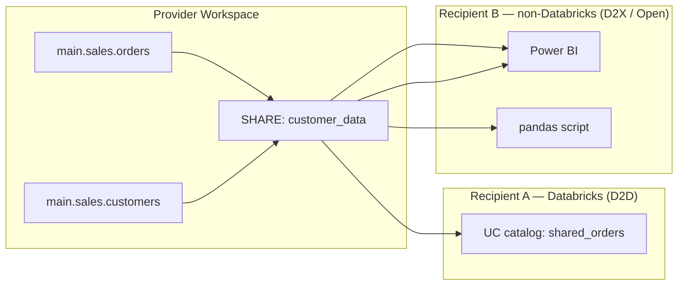

### Properties

- **Read-only.** Recipients can SELECT; they cannot write.
- **Live.** Recipients see current data — no copy, no scheduled refresh.
- **Cross-cloud / cross-region** capable.
- **Open protocol.** The recipient does NOT have to be on Databricks.

---

## 2. Two delivery modes

### 2.1 Databricks-to-Databricks (D2D)

- Recipient is **another Databricks workspace** (potentially in a different account, region, or cloud).
- Authentication via **Unity Catalog identities** (the recipient's Databricks user / service principal).
- The shared tables appear as a **foreign catalog** in the recipient's UC.

```sql
-- Provider side
CREATE SHARE customer_data;
ALTER SHARE customer_data ADD TABLE main.sales.orders;
ALTER SHARE customer_data ADD TABLE main.sales.customers;

CREATE RECIPIENT acme_corp USING ID 'aws:us-east-1:metastore-id-of-recipient';
GRANT SELECT ON SHARE customer_data TO RECIPIENT acme_corp;

-- Recipient side
CREATE CATALOG shared_acme USING SHARE `provider_metastore_id`.customer_data;
GRANT USE CATALOG ON CATALOG shared_acme TO `analysts`;
GRANT USE SCHEMA  ON SCHEMA  shared_acme.default TO `analysts`;
GRANT SELECT      ON SCHEMA  shared_acme.default TO `analysts`;
```

Recipient queries:
```sql
SELECT * FROM shared_acme.default.orders;
```

D2D supports the full UC permissions model — the recipient can grant sub-permissions to their own teams.

### 2.2 Open Sharing (D2X) — non-Databricks recipients

- Recipient is **anywhere** — a partner organization, a BI tool, a Python script, a Spark OSS cluster.
- Authentication via a **bearer-token credential file** (`config.share` JSON) delivered to the recipient out-of-band.

```sql
-- Provider side (same SHARE creation as D2D)
CREATE SHARE public_metrics;
ALTER SHARE public_metrics ADD TABLE main.gold.daily_metrics;

CREATE RECIPIENT acme_external;     -- open recipient, no IDs needed
GRANT SELECT ON SHARE public_metrics TO RECIPIENT acme_external;

-- Generate credential file
-- (UI: Recipients → acme_external → "Download credential file")
```

The provider gives the recipient the `.share` credential file (contains a URL + bearer token). The recipient uses the **Delta Sharing client library**:

```python
# Recipient side — pandas
import delta_sharing

profile_file = "acme_external.share"
client = delta_sharing.SharingClient(profile_file)
client.list_all_tables()

df = delta_sharing.load_as_pandas(f"{profile_file}#public_metrics.default.daily_metrics")
```

```python
# Recipient side — Spark OSS
df = (spark.read
        .format("deltaSharing")
        .load(f"{profile_file}#public_metrics.default.daily_metrics"))
```

### Comparison

| Aspect | D2D | Open (D2X) |
|--------|-----|------------|
| Recipient platform | Databricks (UC) | Anywhere |
| Authentication | UC identities | Bearer token in `.share` file |
| Permission management | UC GRANTs cascade naturally | All-or-nothing per share |
| Cross-cloud | Yes | Yes |
| Recipient can grant sub-permissions | Yes | No |
| Lineage on recipient side | Yes | No |

### ⚠️ Exam trap — D2D vs D2X

If the question says "share with another Databricks workspace" → **D2D**. If it says "share with an external partner / Power BI / pandas / non-Databricks tool" → **Open Sharing (D2X)**.

---

## 3. Partner connectors

Open Sharing supports many recipients via partner connectors:

- **Power BI** (native Delta Sharing connector)
- **Tableau**
- **pandas** (`delta-sharing` Python package)
- **Spark OSS** (Java/Scala/Python via `delta-sharing-spark`)
- **Apache Spark on EMR / Dataproc / on-prem**
- **Apache Flink** (community)
- **Trino / Presto** (via Starburst)
- **Java/Go/Rust clients** (community)

The connector reads the protocol, returns DataFrames / SQL result sets.

---

## 4. Advantages and limitations

### Advantages

- **No data copy.** Recipients see live data.
- **No scheduled refresh.** No ETL job to maintain.
- **Cross-cloud capable.** Provider on AWS, recipient on Azure — works.
- **Read-only by design.** Reduces accidental-write risk.
- **Granular access via dynamic views / row filters / column masks** — the provider can share a filtered/masked view rather than the raw table.
- **Open protocol.** Vendor-neutral.

### Limitations

- **Read-only** — recipients can't write back. (For two-way sharing, separate shares each direction.)
- **Cross-cloud / cross-region egress costs apply** — every time the recipient reads, they're pulling bytes that may cross cloud regions, incurring egress charges from the provider's cloud.
- **No live SQL pushdown** — the recipient's query is executed against the recipient's compute; the recipient fetches full file ranges (with Parquet stat-based pruning, but not full query pushdown).
- **Not all features supported on the recipient side** — e.g., Time Travel works in D2D but is limited in open sharing.
- **No row-level restriction at recipient time** — restriction must happen on the provider side (via dynamic views).
- **Schema-evolution propagation** — when the provider's schema changes, the recipient must refresh.

### ⚠️ Exam trap — cross-cloud cost

The exam explicitly asks "what are the cost considerations of cross-cloud sharing?" The key answer: **egress costs from the provider's cloud**. When a recipient in Cloud B reads from a share whose data is in Cloud A, every byte transferred is egress from Cloud A. At scale, this can be the dominant cost. Mitigations: place a Delta Sharing recipient cache in the recipient's cloud, or use cloud peering for reduced egress rates.

---

## 5. Provider configuration — the SQL flow

```sql
-- 1. Create the share container
CREATE SHARE customer_data
COMMENT 'Customer master data and orders';

-- 2. Add tables / views / volumes to the share
ALTER SHARE customer_data
ADD TABLE main.sales.orders
COMMENT 'Sales orders';

ALTER SHARE customer_data
ADD TABLE main.sales.customers;

-- Can also add views, schemas, volumes:
-- ALTER SHARE customer_data ADD VIEW main.gold.daily_metrics;
-- ALTER SHARE customer_data ADD SCHEMA main.gold;
-- ALTER SHARE customer_data ADD VOLUME main.landing.public_files;

-- 3. Create the recipient
-- D2D form:
CREATE RECIPIENT acme_corp
USING ID 'aws:us-east-1:00000000-0000-0000-0000-000000000000';

-- Open form:
CREATE RECIPIENT acme_external;

-- 4. Grant SELECT on the share to the recipient
GRANT SELECT ON SHARE customer_data TO RECIPIENT acme_corp;

-- 5. Inspect
SHOW SHARES;
SHOW RECIPIENTS;
SHOW GRANTS ON SHARE customer_data;
SHOW ALL IN SHARE customer_data;
```

### Modifying shares

```sql
-- Remove a table from the share
ALTER SHARE customer_data REMOVE TABLE main.sales.orders;

-- Drop a share
DROP SHARE customer_data;

-- Revoke a recipient
REVOKE SELECT ON SHARE customer_data FROM RECIPIENT acme_corp;
```

---

## 6. Sample Question 3 pattern — Delta Sharing scenario

The official exam sample Q3 tests this:

> "Internal teams need access with full permissions, external partners can only read the shared data. Which action?"

Correct answer (per the official key): **"Grant READ permissions to external partners through the Delta Share and READ/WRITE permissions to internal teams on Unity Catalog."**

Why: Delta Sharing is read-only by design. External partners get the Delta Share with READ access. Internal teams don't need a Delta Share — they're on the same UC, so they get READ/WRITE through normal UC GRANTs.

Distractors:
- "Add internal tables to the share and assign READ/WRITE permissions to both" — wrong because **Delta Sharing doesn't support WRITE**.
- "Create permissions through Delta Share for both" — same wrong premise.
- "Set up a secure access URL and distribute" — wrong because Delta Sharing's auth is structured (UC identity for D2D, bearer-token credential file for open), not URLs.

### ⚠️ Exam trap — Delta Sharing is read-only

Any answer claiming Delta Sharing supports WRITE access is **wrong**. The recipient cannot modify the shared data.

---

## 7. Lakehouse Federation — querying external sources

**Lakehouse Federation** is the inverse of Delta Sharing. Instead of sharing your data outward, Federation lets you **query external databases as UC catalogs without ingesting them**.

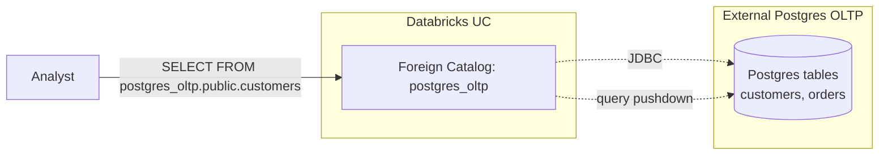

### Supported foreign catalog sources (representative — list grows)

- **PostgreSQL**
- **MySQL**
- **Snowflake**
- **Amazon Redshift**
- **Google BigQuery**
- **Microsoft SQL Server**
- **Azure SQL Database**
- **Azure Synapse**
- **Databricks (another workspace)**
- **Salesforce Data Cloud**
- **Teradata**
- **Oracle**

### How it works

1. Create a **connection** in UC pointing to the external DB:
   ```sql
   CREATE CONNECTION my_postgres
   TYPE POSTGRESQL
   OPTIONS (
     host 'pg.example.com',
     port '5432',
     user secret('my_scope', 'pg_user'),
     password secret('my_scope', 'pg_pwd')
   );
   ```

2. Create a **foreign catalog** that surfaces the external DB:
   ```sql
   CREATE FOREIGN CATALOG postgres_oltp
   USING CONNECTION my_postgres
   OPTIONS (database 'production');
   ```

3. Query:
   ```sql
   SELECT *
   FROM postgres_oltp.public.customers
   WHERE region = 'EU';
   ```

The query planner pushes down filters and projections to Postgres where possible, then returns results to Databricks. JOINs across federated tables and Delta tables work — the federated side is pulled to Databricks, joined locally.

### Use cases

- **Query Postgres OLTP data alongside Delta Silver tables** without ETL.
- **Join Snowflake fact data with Databricks dim data** during exploration.
- **Read BigQuery data into a Databricks report** without copying.
- **Replace one-off "I need to pull customer master from the source DB" ETL jobs** for ad-hoc analytics.

### Limitations

- **Read-only** for most sources (some support writes; check per source).
- **Not all functions/operators push down** — complex queries may pull large data through the gateway.
- **Not a replacement for ingestion** when query patterns are repeated and heavy — at some volume, just ingest with Lakeflow Connect or Auto Loader.
- **Performance is bounded by the foreign source** — a slow Postgres is slow under Federation too.
- **Lineage is limited** — the lineage stops at the foreign catalog boundary.

### ⚠️ Exam trap — Federation vs ingestion vs Delta Sharing

Three different ideas:

| You want to | Mechanism |
|-------------|-----------|
| Query an external DB without copying its data | **Lakehouse Federation** |
| Replicate an external DB into Delta with CDC | **Lakeflow Connect** |
| Share your Delta data outward to other Databricks / external tools | **Delta Sharing** |

These are not interchangeable.

---

## 8. Side-by-side comparison

| Feature | Delta Sharing | Lakehouse Federation | Lakeflow Connect |
|---------|---------------|---------------------|------------------|
| Direction | **Outbound** (you share) | **Inbound query** | **Inbound ingestion** |
| Storage | No copy at recipient | No copy in UC | Copy to UC (Delta) |
| Live? | Yes (live read) | Yes (live query) | No (incremental ingest, latency = pipeline cadence) |
| Read/write | Read-only | Read (mostly) | Read at source; write to UC |
| Cross-cloud | Yes | Yes (over JDBC) | Yes |
| Egress cost concern | High (recipient reads remote) | Yes (Databricks reads external) | Yes (one-time + delta) |

---

## 9. A realistic combined scenario

A company has:
- **Delta tables in their Databricks** (production data).
- **Postgres OLTP database** (customer master).
- **Partner analytics platform** that needs daily metrics.

Solution stack:

1. **Lakehouse Federation** — query Postgres customer master from Databricks without ETL:
   ```sql
   CREATE FOREIGN CATALOG postgres_oltp USING CONNECTION pg_conn OPTIONS (database 'prod');

   CREATE MATERIALIZED VIEW main.silver.enriched_orders AS
   SELECT
     o.*,
     c.name,
     c.email
   FROM main.silver.orders o
   LEFT JOIN postgres_oltp.public.customers c ON o.customer_id = c.id;
   ```

2. **Delta Sharing** — share the daily metrics outward to the partner:
   ```sql
   CREATE SHARE partner_metrics;
   ALTER SHARE partner_metrics ADD TABLE main.gold.daily_metrics;
   CREATE RECIPIENT partner_acme;
   GRANT SELECT ON SHARE partner_metrics TO RECIPIENT partner_acme;
   ```

3. **Lakeflow Connect** (if the partner ALSO wanted CDC ingestion of their Salesforce into the Databricks workspace) — managed Salesforce connector.

---

## 10. Mini quiz (cold)

1. The recipient is another Databricks workspace on a different cloud. Which Delta Sharing mode?
2. The recipient is a partner using Power BI on-prem. Which mode?
3. Can a Delta Sharing recipient write back to the shared data?
4. The exam asks about "cost considerations of cross-cloud sharing." What's the answer?
5. You want to query an external Snowflake database from a Databricks notebook without copying the data. Which feature?
6. You want to replicate Salesforce into a Bronze Delta table with CDC. Which feature?
7. Differentiate Delta Sharing vs Lakehouse Federation in one sentence.
8. Per the sample question, the right answer for "internal teams need write, external partners need read" is which configuration?

### Answers

1. **D2D (Databricks-to-Databricks)** — UC identities authenticate the recipient.
2. **Open Sharing (D2X)** — bearer-token credential file delivered out of band.
3. **No.** Delta Sharing is read-only by design.
4. **Egress costs from the provider's cloud** — every recipient read pulls bytes out of the provider's cloud, incurring egress charges.
5. **Lakehouse Federation** — foreign catalog pointing at Snowflake.
6. **Lakeflow Connect** — managed Salesforce CDC connector.
7. **Delta Sharing = outbound (you share your Delta data to others); Lakehouse Federation = inbound query (you query external DBs from UC without copy).**
8. **Grant READ via Delta Share to external partners; READ/WRITE via UC to internal teams.** Delta Sharing is read-only, so write access for internal teams happens via UC, not via the share.

---

## 11. Sanity check before moving on

You should be able to:
- Recite the three concepts (provider / recipient / share).
- Differentiate D2D (UC identities) vs D2X / Open (bearer-token credential file).
- Recite Delta Sharing's read-only constraint.
- Name the cross-cloud cost issue.
- Pick Lakehouse Federation for "query external DB without copy."
- Pick Lakeflow Connect for "replicate SaaS / DB into UC."
- Pick Delta Sharing for "share Delta data outward."

If any of those are fuzzy, re-read Sections 2, 4, and 7.

---

## 12. Closing the loop — you've finished the modules

This was the last of the 16 modules. You've covered:

- **Domain 1** (10%) — Platform: Modules 01-02
- **Domain 2** (30%) — Development & Ingestion: Modules 03-07
- **Domain 3** (31%) — Data Processing & Transformations: Modules 08-11
- **Domain 4** (18%) — Productionizing: Modules 12-14
- **Domain 5** (11%) — Governance: Modules 15-16

Next: take the practice quizzes in `quizzes/` cold (no peeking), one per domain, then a back-to-back simulated 90-minute exam. Aim for ≥85% sustained before booking.


\newpage

# Appendix A — FACTS

_Atomic, citable facts. Single source of truth for dates, versions, deprecations, exam metadata._

# FACTS — Databricks Certified Data Engineer Associate

> **Atomic, citable claims.** Single source of truth for numbers, defaults, syntax, and version-sensitive details. Cross-link from modules and quiz answers.
>
> **Last verified:** 2026-05-23 against the July 25, 2025 official exam guide and current `docs.databricks.com`.

---

## 1. Exam logistics

| ID | Fact | Source |
|----|------|--------|
| L1 | The exam has **45 scored multiple-choice questions** | Official exam guide (July 25 2025) |
| L2 | The time limit is **90 minutes** (≈ 2 min per question) | Official exam guide |
| L3 | The passing score is **80%** (≈ 36/45 scored) — **raised from 70%** in the July 2025 refresh | Community sources (FlashGenius, OpenExamPrep, Databricks Community 141905) |
| L4 | The registration fee is **USD $200** (+ local taxes) | Official exam guide |
| L5 | Certification is **valid for 2 years**; recertification requires retaking the then-current full exam | Official exam guide |
| L6 | Delivery is **online proctored (Kryterion / Webassessor) or in-person test center** | Official exam guide |
| L7 | **No test aids are allowed** (no scratch paper, no notes, no second monitor) | Official exam guide |
| L8 | **No formal prerequisites**; Databricks recommends 6 months hands-on experience and the official course | Official exam guide |
| L9 | Question languages: English, Japanese, Portuguese (Brazil), Korean | databricks.com cert page |
| L10 | Code language in code-completion questions: **SQL when possible, otherwise Python (PySpark)** | databricks.com cert page |
| L11 | Retake policy: **14-day wait after first fail, 30-day wait after subsequent attempts** | FlashGenius |
| L12 | Some exam items are **unscored** (statistical, not identified, time accounted for) | Official exam guide |
| L13 | All questions are **single-select**. No multi-select. | OpenExamPrep, FlashGenius (multiple sources) |
| L14 | The exam version referred to throughout this corpus is dated **July 25, 2025** | Official exam guide PDF filename |

## 2. Exam domains & weights

| ID | Fact |
|----|------|
| D1 | Domain 1 — **Databricks Intelligence Platform** — **10%** |
| D2 | Domain 2 — **Development and Ingestion** — **30%** |
| D3 | Domain 3 — **Data Processing & Transformations** — **31%** (largest domain) |
| D4 | Domain 4 — **Productionizing Data Pipelines** — **18%** |
| D5 | Domain 5 — **Data Governance & Quality** — **11%** |

[Weights are community-reported; not printed in the public PDF objectives list. Cross-confirmed across 5+ sources, MEDIUM-HIGH confidence.]

---

## 3. Platform architecture

| ID | Fact |
|----|------|
| P1 | The Databricks Data Intelligence Platform has three layers: **control plane** (Databricks-managed UI, REST API, job scheduler, notebook editor, cluster manager), **compute plane** (Spark clusters / SQL warehouses running in the customer cloud subscription), and **storage** (Delta tables in customer cloud object storage — S3, ADLS Gen2, GCS) |
| P2 | The control plane is operated by Databricks; the compute plane runs in the customer's cloud account; customer data never leaves customer cloud storage |
| P3 | **All-purpose clusters** are for interactive notebook work; expensive (~$0.55/DBU range); persist after use |
| P4 | **Job clusters** are ephemeral, created at job start and terminated at job end; ~half the DBU cost of all-purpose; the exam's preferred answer for scheduled jobs |
| P5 | **Serverless compute** is auto-managed by Databricks, runs in Databricks' own cloud account (not the customer's), fastest startup; the exam's preferred answer for "hands-off / auto-optimized" scenarios |
| P6 | **DBR (Databricks Runtime)** ships in variants: standard, **LTS** (long-term support, ~24 months), **ML** (pre-installed ML libraries), Photon-enabled (vectorized C++ query engine), GPU |
| P7 | LTS releases get bug fixes for ~24 months; non-LTS releases for ~6 months |
| P8 | **Pools** maintain warm idle instances to reduce cluster startup latency |
| P9 | **SQL Warehouses** come in three flavors: **Classic** (customer cloud), **Pro** (customer cloud + Photon + serverless features), **Serverless** (Databricks-managed, fastest startup) |
| P10 | SQL Warehouse sizes scale t-shirt-style: 2X-Small → 4X-Large, each step approximately doubling the cluster size |

---

## 4. Delta Lake

| ID | Fact |
|----|------|
| DL1 | **Delta Lake is a transaction log layered over Parquet.** A Delta table is a directory of Parquet data files plus a `_delta_log/` subdirectory |
| DL2 | The `_delta_log/` directory holds **JSON commit files** (`00000000000000000000.json`, `…0001.json`, …), one per transaction |
| DL3 | Every 10 commits by default, Delta materializes a **checkpoint file** (`…0010.checkpoint.parquet`). Tuned by `delta.checkpointInterval` |
| DL4 | `_last_checkpoint` is a JSON pointer file naming the most recent checkpoint version |
| DL5 | Delta provides **ACID guarantees at the table level** via optimistic concurrency + atomic file rename on the underlying object store |
| DL6 | Delta supports **time travel** via `VERSION AS OF n` and `TIMESTAMP AS OF 'ts'`; e.g. `SELECT * FROM t VERSION AS OF 42` |
| DL7 | `DESCRIBE HISTORY <table>` returns the table's commit log including version, timestamp, operation, user, operationMetrics |
| DL8 | `CREATE OR REPLACE TABLE …` **creates the table if it doesn't exist, drops and recreates it if it does** (preserves the table name in the metastore; replaces schema and data) |
| DL9 | `CREATE TABLE IF NOT EXISTS …` **creates only if the table doesn't exist; leaves an existing table unchanged** |
| DL10 | `CREATE TABLE AS SELECT …` (CTAS) creates and populates in one statement — incompatible with empty-table DDL syntax (cannot list explicit column types in the same statement as `AS SELECT`) |
| DL11 | `INSERT INTO <table> VALUES (...)` is the correct syntax to append a literal row. `UPDATE` is for modifying existing rows, not appending |
| DL12 | **MERGE INTO** performs upserts: `MERGE INTO target USING source ON cond WHEN MATCHED THEN UPDATE SET ... WHEN NOT MATCHED THEN INSERT (...) VALUES (...)` |
| DL13 | The modern CDC pattern in LDP is **`APPLY CHANGES INTO`** (a.k.a. AutoCDC), not hand-rolled MERGE |
| DL14 | Delta supports **schema evolution** on write with `.option("mergeSchema", "true")`; supports overwrite with `.option("overwriteSchema", "true")` |
| DL15 | **Generated columns**: `CREATE TABLE t (… ts TIMESTAMP, date DATE GENERATED ALWAYS AS (CAST(ts AS DATE)))` — Delta computes them on insert |
| DL16 | **Identity columns**: `id BIGINT GENERATED ALWAYS AS IDENTITY` for monotonic auto-increment (no gap guarantees) |
| DL17 | **Change Data Feed (CDF)** is enabled with `delta.enableChangeDataFeed = true`; read changes with `SELECT * FROM table_changes('table', startVersion, endVersion)` |

## 5. Table management — OPTIMIZE / VACUUM / Liquid Clustering / Predictive Optimization

| ID | Fact |
|----|------|
| TM1 | `OPTIMIZE <table>` runs **bin-packing** to compact small files into ~1 GB target files. Idempotent — running it again is a no-op |
| TM2 | The target file size for OPTIMIZE is set by `spark.databricks.delta.optimize.maxFileSize`, default **1 GB** |
| TM3 | `OPTIMIZE <table> ZORDER BY (col1, col2)` rewrites files using **Z-order curve interleaving** to co-locate values across multiple columns (multi-dim clustering). Best with 1–4 columns |
| TM4 | **Z-Order is rewrite-heavy** — every OPTIMIZE ZORDER pass rewrites the full scope from scratch. Z-Order does NOT persist cluster identity in the log |
| TM5 | **Liquid Clustering** is the new default file-layout strategy for 2024+. Specified at table creation via `CLUSTER BY (col1, col2, …)` (up to 4 keys) |
| TM6 | Liquid Clustering is **incremental** — uses ZCube identity in the log so subsequent OPTIMIZE only touches unclustered ZCubes. Uses Hilbert curve |
| TM7 | Liquid Clustering keys can be **changed without rewriting the table**: `ALTER TABLE t CLUSTER BY (new_col)` |
| TM8 | `CLUSTER BY AUTO` (2025+) lets Predictive Optimization observe queries and choose clustering keys automatically |
| TM9 | **Cannot use both partitioning and Liquid Clustering** on the same table. Liquid Clustering supersedes partitioning |
| TM10 | `VACUUM <table>` removes files no longer referenced by the transaction log and older than the retention period |
| TM11 | The **default VACUUM retention is 7 days (168 hours)** |
| TM12 | **VACUUM cannot delete data younger than 7 days** unless you override the safety check: `SET spark.databricks.delta.retentionDurationCheck.enabled = false` (dangerous — risks concurrent reader failure) |
| TM13 | `VACUUM <table> RETAIN 168 HOURS DRY RUN` lists what would be deleted without deleting |
| TM14 | **Predictive Optimization** is a UC-managed-table feature that automatically runs OPTIMIZE and VACUUM based on table usage telemetry; default on for managed tables on newer DBRs |
| TM15 | `CONVERT TO DELTA parquet.<path>` converts an existing Parquet table to Delta in-place (creates `_delta_log/`, no data rewrite) |
| TM16 | **Deletion vectors** allow DELETE / UPDATE / MERGE to mark rows as deleted without rewriting Parquet files; physical rewrite happens on next OPTIMIZE. Enabled via `delta.enableDeletionVectors = true` (default for LDP-managed tables) |

## 6. Managed vs external tables — KEY EXAM TRAP

| ID | Fact |
|----|------|
| ME1 | **Managed table** — Unity Catalog (or the metastore) owns the storage location; created without an explicit `LOCATION` clause |
| ME2 | **External table** — you specify `LOCATION '<path>'` at create time; UC tracks only metadata |
| ME3 | **`DROP TABLE` on a managed table deletes both the metadata AND the underlying data files** (after the retention window) |
| ME4 | **`DROP TABLE` on an external table deletes only the metadata; the underlying data files remain in object storage** |
| ME5 | Managed tables benefit from Predictive Optimization automatically; external tables do not (UC doesn't own the storage) |
| ME6 | Managed tables are the recommended default in UC; external tables are for cases where you need to share storage with non-Databricks tools or co-locate with another system's catalog |

---

## 7. Auto Loader (`cloudFiles`)

| ID | Fact |
|----|------|
| AL1 | Auto Loader is invoked via `spark.readStream.format("cloudFiles")` |
| AL2 | The underlying file format is set via `.option("cloudFiles.format", "json"|"csv"|"parquet"|"avro"|"orc"|"text"|"binaryFile")` |
| AL3 | Auto Loader has two **file detection modes**: **directory listing** (default; lists directory on each microbatch; OK for smaller volumes) and **file notification** (sets up cloud-native event notifications — SNS/SQS, Event Grid, Pub/Sub — for high-throughput) |
| AL4 | File notification mode is enabled with `.option("cloudFiles.useNotifications", "true")` and requires Databricks to set up cloud notification resources |
| AL5 | Auto Loader's **schemaLocation** is required for schema inference: `.option("cloudFiles.schemaLocation", "<path>")` |
| AL6 | Schema location stores `_schemas/` versions of the inferred schema over time |
| AL7 | Auto Loader samples the **first 50 GB or 1000 files**, whichever comes first, for schema inference |
| AL8 | **Schema evolution modes** (`cloudFiles.schemaEvolutionMode`): `addNewColumns`, `rescue`, `failOnNewColumns`, `none`, `addNewColumnsWithTypeWidening` (newer) |
| AL9 | **Default schema evolution mode when no schema is provided** = `addNewColumns` (new columns trigger a stream restart and are added to the schema) |
| AL10 | **Default schema evolution mode when a schema IS provided directly** = `none` (new columns are ignored silently) |
| AL11 | `rescue` mode places any data not matching the schema (including new columns and type mismatches) in a `_rescued_data` JSON column; **does not fail and does not restart the stream** |
| AL12 | `failOnNewColumns` causes the stream to fail when new columns appear, forcing a manual intervention |
| AL13 | **Schema hints**: `.option("cloudFiles.schemaHints", "col1 LONG, col2 STRING")` provide explicit typing for specific columns while letting Auto Loader infer the rest. Only effective when no full schema is provided directly |
| AL14 | Schema hints work regardless of `cloudFiles.inferColumnTypes` setting |
| AL15 | Auto Loader provides **exactly-once** semantics via the checkpoint location |
| AL16 | The two recommended Auto Loader triggers for the exam are `.trigger(availableNow=True)` (modern batch-style; replaces deprecated `Trigger.Once`) and `.trigger(processingTime="N seconds")` (always-on micro-batch) |

---

## 8. Structured Streaming

| ID | Fact |
|----|------|
| SS1 | Streams are written with `df.writeStream` and read with `spark.readStream` |
| SS2 | **Triggers**: `default` (process available data ASAP, then wait for more — micro-batch), `processingTime="N seconds"` (fixed cadence), **`availableNow=True`** (process all currently available data, then stop — batch-style), `Trigger.Once` (DEPRECATED — use `availableNow`), `continuous="N ms"` (experimental, sub-second latency) |
| SS3 | **Output modes**: `append` (default for stateless; only new rows written), `complete` (full state on every batch; requires aggregation), `update` (only changed rows written; requires aggregation) |
| SS4 | A **checkpointLocation is required** for fault-tolerant streaming: `.option("checkpointLocation", "/path/to/_checkpoint")` |
| SS5 | The checkpoint location stores offsets, commit metadata, and (for stateful queries) the state store. **Never share a checkpoint between two queries** |
| SS6 | Exactly-once semantics for the sink rely on the combination of checkpoint + idempotent sink. Delta is idempotent |
| SS7 | **Watermarks**: `df.withWatermark("event_time_col", "10 minutes")` — declares how late data can arrive before state is dropped |
| SS8 | Watermarks are **required for stateful aggregations** with bounded state (otherwise state grows unboundedly) |
| SS9 | **Stream-stream joins require watermarks on BOTH input DataFrames** plus a time-range condition in the join expression |
| SS10 | Stream-stream join types: **inner** (with watermark and time-range), **left/right outer** (with watermark on the unbounded side and a time-range — semi-supported in older DBR, full support in recent versions), **outer/outer** (limited) |
| SS11 | State stores: **RocksDB state store** (default on newer DBR; spills to disk), **HDFS-backed** (legacy, fully in JVM heap) |
| SS12 | `foreachBatch(func)` lets you apply arbitrary DataFrame operations to each micro-batch and write to non-streaming-aware sinks |

---

## 9. Lakeflow Declarative Pipelines (LDP) — formerly Delta Live Tables (DLT)

| ID | Fact |
|----|------|
| LDP1 | The product rebranded from **Delta Live Tables (DLT)** to **Lakeflow Declarative Pipelines (LDP)** in July 2025 |
| LDP2 | LDP is **backward compatible** — existing `import dlt` Python code and `CREATE LIVE TABLE` SQL still run |
| LDP3 | New Python API: `from pyspark import pipelines as dp`; decorators `@dp.table`, `@dp.materialized_view`, `@dp.temporary_view` |
| LDP4 | New SQL forms: `CREATE OR REFRESH STREAMING TABLE <name> AS SELECT … FROM STREAM(<src>)` (incremental), `CREATE OR REFRESH MATERIALIZED VIEW <name> AS SELECT …` (batch-recomputed) |
| LDP5 | A **streaming table** is incremental (each refresh processes only new data); a **materialized view** is full-recompute |
| LDP6 | **Expectations** are declarative data quality checks: `CONSTRAINT <name> EXPECT (<bool_expr>) [ON VIOLATION DROP ROW|FAIL UPDATE]` |
| LDP7 | Expectation actions: **default** = log violation and keep row; **`ON VIOLATION DROP ROW`** = drop bad rows; **`ON VIOLATION FAIL UPDATE`** = fail the pipeline |
| LDP8 | The "WARN" action is the implicit default — Python decorators call it `@dp.expect(...)`, drop is `@dp.expect_or_drop(...)`, fail is `@dp.expect_or_fail(...)` |
| LDP9 | **`APPLY CHANGES INTO`** (AutoCDC) handles CDC declaratively inside LDP, replacing hand-rolled MERGE |
| LDP10 | `APPLY CHANGES INTO` syntax: `APPLY CHANGES INTO LIVE.target FROM STREAM(LIVE.src) KEYS (id) SEQUENCE BY ts [APPLY AS DELETE WHEN op = 'D'] STORED AS SCD TYPE 1|2 COLUMNS * EXCEPT (op, ts)` |
| LDP11 | **SCD Type 1** = overwrite history (latest value only); **SCD Type 2** = preserve history with effective_from / effective_to / `__START_AT` / `__END_AT` columns |
| LDP12 | LDP pipeline modes: **Triggered** (run to completion, then stop) and **Continuous** (long-running, low-latency) |
| LDP13 | LDP **serverless** ("Standard mode") is the post-July-2025 default and is reported ~26% cheaper TCO than classic LDP per the official blog |
| LDP14 | LDP automatically manages: dependency graph between tables, retries, schema enforcement, expectations evaluation, and CDC bookkeeping |
| LDP15 | Within an LDP SQL pipeline, you reference other tables in the same pipeline with `LIVE.<name>` (legacy) or directly by name in newer LDP SQL — both work |

---

## 10. Lakeflow Jobs (formerly Workflows / Multi-Task Jobs)

| ID | Fact |
|----|------|
| LJ1 | A Lakeflow Job is a **DAG of tasks** orchestrated by the Databricks scheduler |
| LJ2 | Task types: Notebook, Python script, Python wheel, SQL (query / dashboard / alert), **Pipeline** (run an LDP), JAR, Spark Submit, dbt, "If/Else" condition |
| LJ3 | Task dependencies are declared via `depends_on` (forms the DAG) |
| LJ4 | **Repair runs** allow re-running ONLY the failed tasks (and downstream) without re-running already-successful upstream tasks |
| LJ5 | **Parameter passing** mechanisms: job-level params (`{{job.parameters.<key>}}`), task-level params, and **task values** (`dbutils.jobs.taskValues.set(...)` / `.get(...)`) for passing data between tasks |
| LJ6 | Retry options per task: `max_retries`, `min_retry_interval_millis`, `retry_on_timeout` |
| LJ7 | Triggers: **scheduled** (Quartz cron), **file arrival** (new file in a UC Volume or external location), **continuous**, **manual / REST API** |
| LJ8 | Cluster choices per task: **all-purpose** (interactive, ~$0.55/DBU range), **job cluster** (ephemeral, ~half cost), **serverless** (managed, hands-off — exam-preferred for "auto-optimized") |
| LJ9 | Per-task email/webhook alerts available on `on_start`, `on_success`, `on_failure`, `on_duration_warning_threshold_exceeded` |
| LJ10 | `max_concurrent_runs` limits how many simultaneous instances of the same job can run |
| LJ11 | **For-each tasks** iterate a child task over a list of parameter values; supports concurrency caps |

---

## 11. Databricks Asset Bundles (DABs)

| ID | Fact |
|----|------|
| DAB1 | DAB is the **declarative deployment model** for jobs, pipelines, schemas, ML experiments and other Databricks resources |
| DAB2 | The root config file is **`databricks.yml`**, with optional resource definitions split into `resources/*.yml` |
| DAB3 | Top-level sections in `databricks.yml`: **`bundle`** (name, git metadata), **`include`** (additional YAML files), **`variables`** (parameterization), **`targets`** (per-env config), **`resources`** (jobs/pipelines/etc.), **`workspace`** (host) |
| DAB4 | **`targets`** define environments (e.g. `dev`, `staging`, `prod`) with overrides on workspace, variables, and `mode` (`development` vs `production`) |
| DAB5 | `mode: development` adds dev-only safeguards: prepends `dev_<user>_` to resource names, sets schedules to paused, redirects artifact paths to user space |
| DAB6 | `mode: production` enforces no dev prefix, schedules enabled, run_as identity fixed |
| DAB7 | Core CLI commands: `databricks bundle validate`, `databricks bundle deploy -t <target>`, `databricks bundle run <resource> -t <target>`, `databricks bundle destroy -t <target>` |
| DAB8 | DAB requires `databricks-cli` ≥ **0.218** |
| DAB9 | `databricks bundle validate` checks syntax and resource references without deploying |
| DAB10 | DAB is the exam's **preferred answer** for any "promote code from dev to prod" scenario — vs. manual notebook import or click-through job UI |
| DAB11 | Variables: `${var.<name>}` references; defined under `variables:` with `default:` and per-target override under `targets.<t>.variables.<name>` |
| DAB12 | Bundle resources can be defined inline under `resources:` or in separate YAML files referenced from `include:` |

---

## 12. Unity Catalog (UC)

| ID | Fact |
|----|------|
| UC1 | UC uses a **three-level namespace**: `catalog.schema.table` (also `catalog.schema.view`, `catalog.schema.function`, `catalog.schema.volume`) |
| UC2 | The **privilege chain to read a table** is: `USE CATALOG` on the catalog **AND** `USE SCHEMA` on the schema **AND** `SELECT` on the table. **All three are required** |
| UC3 | `GRANT SELECT ON SCHEMA <s> TO <principal>` grants read access to all current AND future tables/views in the schema |
| UC4 | `GRANT SELECT ON ALL TABLES IN SCHEMA <s> TO <principal>` grants read only on existing tables; **does NOT cover future tables** |
| UC5 | Common privileges: `USE CATALOG`, `USE SCHEMA`, `SELECT`, `MODIFY` (write), `CREATE TABLE`, `CREATE VIEW`, `CREATE FUNCTION`, `EXECUTE`, `READ VOLUME`, `WRITE VOLUME`, `BROWSE`, `ALL PRIVILEGES` |
| UC6 | `REVOKE <priv> ON <object> FROM <principal>` removes a previously granted privilege |
| UC7 | **Ownership** is required to grant privileges on an object. Initial owner = creator |
| UC8 | Key UC roles: **Account admin** (account-wide), **Metastore admin** (per-metastore), **Workspace admin**, **Catalog/Schema/Table owner** |
| UC9 | **Dynamic views** apply row/column filtering at query time based on the querying user: `CREATE VIEW v AS SELECT *, CASE WHEN is_member('analysts') THEN ssn ELSE 'REDACTED' END AS ssn_safe FROM t` |
| UC10 | **Row filter functions**: `CREATE FUNCTION region_filter(region STRING) RETURN is_member('us_only') OR region = 'EU'`; attached via `ALTER TABLE t SET ROW FILTER region_filter ON (region)` |
| UC11 | **Column masks**: `CREATE FUNCTION mask_ssn(ssn STRING) RETURN CASE WHEN is_member('hr') THEN ssn ELSE 'XXX-XX-XXXX' END`; attached via `ALTER TABLE t ALTER COLUMN ssn SET MASK mask_ssn` |
| UC12 | **Lineage** is automatically captured for UC-governed tables; viewable in the UI (table/column lineage) and queryable via `system.access.table_lineage` / `system.access.column_lineage` |
| UC13 | **Audit logs** are written to `system.access.audit` (queryable via SQL) and delivered to customer-configured cloud storage for long-term retention |
| UC14 | The legacy `hive_metastore` catalog is the default location for pre-UC tables; UC migration moves them to a UC catalog (e.g. `main`) |

---

## 13. Delta Sharing

| ID | Fact |
|----|------|
| DS1 | **Delta Sharing** is Databricks' open protocol for sharing live Delta data with external recipients without copying |
| DS2 | Three core concepts: **provider** (who shares), **recipient** (who receives), **share** (the bundle of tables/views shared) |
| DS3 | Two delivery modes: **Databricks-to-Databricks (D2D)** — recipient is on UC; uses UC identities for auth. **Open (D2X)** — recipient is anywhere (BI tool, pandas, Spark OSS); uses a bearer-token credential file |
| DS4 | Delta Sharing is **read-only by design** — recipients cannot write to shared objects |
| DS5 | **Partner connectors** support reading shares from PowerBI, Tableau, pandas, Spark OSS, Apache Spark, and others |
| DS6 | **Cross-cloud or cross-region egress costs apply** when the recipient is in a different cloud region from the provider's storage |
| DS7 | Limitations: no write-back, no row-level filters on the recipient side (filter on the provider side via dynamic views), no live SQL pushdown — recipient queries fetch full file ranges |
| DS8 | Provider creates: `CREATE SHARE <name>`; adds tables: `ALTER SHARE <name> ADD TABLE main.sales.orders`; grants to recipient: `GRANT SELECT ON SHARE <name> TO RECIPIENT <recipient_name>` |

## 14. Lakehouse Federation

| ID | Fact |
|----|------|
| LF1 | **Lakehouse Federation** lets you query external databases as UC catalogs without ingesting the data |
| LF2 | Supported foreign catalog sources (current list): **PostgreSQL, MySQL, Snowflake, Redshift, BigQuery, Microsoft SQL Server, Azure SQL Database, Azure Synapse, Databricks (another workspace), Salesforce Data Cloud, Teradata, Oracle** |
| LF3 | Foreign catalogs are **read-only** (most cases) and queries are pushed down where possible |
| LF4 | Use case: federate a Postgres OLTP database into UC so analysts can JOIN it with Bronze/Silver Delta tables — no ETL |
| LF5 | Performance limitation: not all functions/operators push down; complex queries may pull large data sets through the gateway. Lakeflow Federation is not a replacement for ingestion when query patterns are heavy |

---

## 15. Reference syntax — frequently mis-remembered

```sql
-- DDL (Module 03/04)
CREATE OR REPLACE TABLE t (id STRING, ts TIMESTAMP);    -- drops + recreates
CREATE TABLE IF NOT EXISTS t (id STRING, ts TIMESTAMP); -- no-op if exists
CREATE TABLE t AS SELECT ...;                            -- CTAS, no column-type list

-- DML
INSERT INTO t VALUES ('a1', current_timestamp());
UPDATE t SET ts = current_timestamp() WHERE id = 'a1';
DELETE FROM t WHERE id = 'a1';
MERGE INTO t USING s ON t.id = s.id
  WHEN MATCHED THEN UPDATE SET *
  WHEN NOT MATCHED THEN INSERT *;

-- Time travel
SELECT * FROM t VERSION AS OF 42;
SELECT * FROM t TIMESTAMP AS OF '2026-05-01 12:00:00';
DESCRIBE HISTORY t;

-- UC grants
GRANT USE CATALOG ON CATALOG main TO `analysts`;
GRANT USE SCHEMA  ON SCHEMA  main.sales TO `analysts`;
GRANT SELECT      ON SCHEMA  main.sales TO `analysts`;

-- LDP SQL
CREATE OR REFRESH STREAMING TABLE bronze_orders
  AS SELECT * FROM STREAM read_files('/Volumes/...', format => 'json');

CREATE OR REFRESH MATERIALIZED VIEW gold_daily
  AS SELECT date, SUM(amount) FROM LIVE.silver_orders GROUP BY date;

APPLY CHANGES INTO LIVE.customers
FROM STREAM(LIVE.cdc_customers)
KEYS (customer_id)
SEQUENCE BY ts
STORED AS SCD TYPE 2;
```

```python
# Auto Loader (Module 06)
(spark.readStream
   .format("cloudFiles")
   .option("cloudFiles.format", "json")
   .option("cloudFiles.schemaLocation", "/Volumes/main/_schemas/orders")
   .option("cloudFiles.schemaEvolutionMode", "addNewColumns")
   .load("/Volumes/main/landing/orders")
  .writeStream
   .option("checkpointLocation", "/Volumes/main/_chk/orders")
   .trigger(availableNow=True)
   .toTable("main.bronze.orders"))
```

```yaml
# DAB skeleton (Module 13)
bundle:
  name: orders_pipeline

targets:
  dev:
    mode: development
    workspace: { host: https://adb-dev.cloud.databricks.com }
  prod:
    mode: production
    workspace: { host: https://adb-prod.cloud.databricks.com }

resources:
  jobs:
    orders_daily:
      name: orders-daily-${bundle.target}
      tasks:
        - task_key: bronze
          job_cluster_key: small
          notebook_task: { notebook_path: ./src/bronze.py }
```

---

## 16. Common defaults to memorize

| Setting | Default |
|---------|---------|
| `delta.checkpointInterval` | 10 commits |
| `spark.databricks.delta.optimize.maxFileSize` | 1 GB |
| VACUUM retention | 168 hours (7 days) |
| Auto Loader schema sampling | 50 GB or 1000 files, whichever first |
| Auto Loader schema evolution mode (no schema provided) | `addNewColumns` |
| Auto Loader schema evolution mode (schema provided) | `none` |
| Streaming output mode for stateless queries | `append` |
| Streaming trigger if none specified | micro-batch ASAP (default) |
| Delta data skipping indexed columns | 32 (first 32 in schema) |
| DBR LTS support window | ~24 months |
| Liquid Clustering max keys | 4 |
| Job DBU cost vs all-purpose | ~50% (rough ratio; exact varies by cloud + region) |
| Exam pass mark | 80% |
| Cert validity | 2 years |

\newpage

# Appendix B — Quizzes


\newpage

# Quiz 01 — Databricks Intelligence Platform (10%)

> Take cold. ~14 questions. Spend ~2 min per question.

---

## Recall

1. Where in the Databricks architecture does customer Delta data physically live: control plane, compute plane, or storage in the customer cloud?
2. Name the three core compute types available for running workloads on Databricks.
3. What does "DBR LTS" stand for, and approximately how long is its support window?
4. What does Photon do to a Spark cluster?

## Apply

5. A scheduled hourly ETL job runs in production. The team wants to minimize DBU cost. Which cluster type should they pick?
6. The team prompt says "we want hands-off, auto-optimized compute with no cluster tuning." Which compute do you pick?
7. Two BI users complain about 5-minute startup delays on the SQL warehouse. They want sub-30-second startups. What's the fix?
8. A regulated workload mandates that all compute run inside the customer's cloud account. Can the team use serverless?
9. A DE team wants OPTIMIZE and VACUUM to happen automatically on their UC-managed tables. Which feature?

## Diagnose

10. A team's job has been running fine for months on an all-purpose cluster. The cost reports show $20k/month for this job alone. The same logic on a job cluster costs $9k. What's going on?
11. A SQL Warehouse hangs at "starting" for 8 minutes before serving queries. The team needs sub-minute startup. What two changes are reasonable?

## Defend

12. The team is debating Photon vs no Photon. Photon costs ~2× the DBU rate. Argue when Photon wins on $/query.
13. A pre-2025 study guide describes "Workflows" as the orchestration product. A post-2025 doc calls it "Lakeflow Jobs." Are they the same thing? What changed?
14. The boss asks whether to put the DR / failover compute in the same cloud as the primary. Answer briefly.

---

## Answers

1. **Storage in the customer cloud** (S3/ADLS/GCS). Control plane never holds customer data. Classic compute is also in the customer cloud; serverless compute is in Databricks' cloud but reads customer data via short-lived credentials.
2. **All-purpose clusters, job clusters, serverless** (plus SQL Warehouses as a specialized variant).
3. **Long-Term Support** Databricks Runtime — about **24 months** of patches. Non-LTS gets ~6 months.
4. **Vectorized C++ execution engine** that replaces JVM row-at-a-time execution for many operators. 2-10× speedup on SQL/DataFrame workloads, at ~2× the DBU rate.
5. **Job cluster** — ephemeral, ~half the DBU of all-purpose, terminated at job end. If the prompt mentions "hands-off" specifically, serverless. Pure "minimize DBU" → job cluster.
6. **Serverless** — "hands-off / auto-optimized" maps to serverless.
7. **Switch to a serverless SQL warehouse.** Sub-30-second startup vs minutes for classic. Alternatively, an instance pool can pre-warm classic compute, but serverless is the canonical fix.
8. **No** (typically) — serverless runs in Databricks' cloud account, not the customer's. Regulated workloads requiring data residency on the customer's compute must use classic.
9. **Predictive Optimization** — auto OPTIMIZE/VACUUM on UC-managed tables. Default on for newer DBR/UC.
10. **All-purpose clusters cost ~2× the DBU of job clusters.** The job has been paying interactive-priced compute for scheduled work. Switch to a job cluster (or serverless) → roughly halves cost.
11. (1) **Switch to serverless SQL warehouse**, or (2) **enable an instance pool** to pre-warm classic compute. Either reduces startup latency dramatically.
12. **Photon wins when:** (a) query is SQL- or DataFrame-heavy (CPU-bound, not I/O-bound); (b) Photon's 2-10× speedup more than offsets the 2× DBU rate. **Photon loses when:** (a) workload is I/O-bound (no CPU advantage to capture); (b) heavy use of unsupported UDFs; (c) tiny datasets where startup dominates.
13. **Same product, renamed.** "Workflows" / "Jobs" / "Lakeflow Jobs" are the same orchestrator. The engine is unchanged. New exams prefer the "Lakeflow Jobs" terminology; older study guides use "Workflows."
14. **No (typically).** DR / failover compute should be in a **different region** (and ideally a different cloud's region) to survive a regional outage. Same-cloud is fine; same-region defeats the purpose.


\newpage

# Quiz 02 — Development & Ingestion (30%)

> Take cold. ~40 questions. ~2 min per question. Covers Delta DDL/DML, Auto Loader, ingestion methods, notebooks, Databricks Connect.

---

## Recall

1. Which command creates an empty Delta table regardless of whether one already exists with that name?
2. Which command appends a single row `('a1', 6, 9.4)` to existing Delta table `my_table`?
3. What is the default value of `cloudFiles.schemaEvolutionMode` when no schema is provided to Auto Loader?
4. What is the default value of `cloudFiles.schemaEvolutionMode` when a schema IS provided via `.schema(...)`?
5. Auto Loader samples how many files / how much data to infer schema, whichever comes first?
6. What is the default VACUUM retention?
7. What is the default OPTIMIZE target file size?
8. Liquid Clustering supports up to how many clustering keys?
9. Name the four useful Auto Loader schema-evolution modes (ignore the typeWidening variant).
10. Where in a UC-enabled workspace should new file ingestion land (DBFS, workspace files, or UC Volume)?

## Apply

11. Files arrive continuously in object storage. You want streaming ingestion with exactly-once semantics. Which tool?
12. You have 50 JSON files that drop daily on a predictable schedule. Which tool is the simplest fit?
13. You need to ingest Salesforce data with CDC into a Bronze Delta table. Which tool?
14. You want to run a scheduled job hourly: pick up all new files, process them, exit. Which trigger?
15. You want an always-on stream that runs a micro-batch every 5 minutes. Which trigger?
16. You're inside an LDP SQL pipeline and want to declare a streaming Bronze table reading JSON. Which function do you reference inside `STREAM(...)`?
17. Schema inference is happening. Where must `cloudFiles.schemaLocation` point?
18. Auto Loader is reading 50 million files from S3 and directory listing takes 20 minutes per batch. What's the fix?
19. You want unexpected columns in source files captured but the stream NOT to restart or fail. Which `schemaEvolutionMode`?
20. After a bad MERGE corrupted the table, you want to roll back to before the MERGE. Which command?
21. To pass parameters from a Lakeflow Job to a notebook, the notebook reads them via which API?
22. To share Python utility functions across notebooks (same REPL scope), which command?

## Diagnose

23. The team set `.schema(my_schema)` on an Auto Loader query. New source columns appear but never make it to the Bronze table. Why? Fix?
24. Two streams share the same `checkpointLocation`. They corrupt each other. Why?
25. A team's COPY INTO loads the same files repeatedly every day, producing duplicates. They expected idempotent behavior. What's wrong?
26. A scheduled streaming job set `.trigger(processingTime="1 hour")` — they wanted "run once an hour." Bills are higher than expected. What's wrong?
27. `spark.read.json(path).write.saveAsTable(t)` is in a job that runs hourly. Why is it producing duplicates?
28. The team accidentally deleted the Delta table's `_delta_log/` directory. What does the table look like now?
29. The user runs `SELECT * FROM t VERSION AS OF 100`, but the query errors. The current version is 200, default VACUUM has been running. Why?
30. A team tries `CREATE TABLE my_table AS SELECT id STRING, dt DATE, score FLOAT` and gets a syntax error. Why?

## Defend

31. The official sample question asks for the SQL to "create an empty Delta table regardless of whether one already exists." Why is `CREATE OR REPLACE TABLE` correct and `CREATE TABLE IF NOT EXISTS` wrong?
32. Why is `count_distinct("billing_id")` correct vs `count("billing_id")` when the prompt says "unique invoices"?
33. Why is `INSERT INTO t VALUES (...)` correct vs `UPDATE t VALUES (...)` for appending a new row?
34. Why should a team always use UC Volumes over DBFS for new ingestion?
35. The question asks why `Trigger.Once` is wrong as an answer in 2026. What replaced it and why?
36. Defend `read_files()` inside `STREAM(...)` as the LDP SQL canonical way to do Auto Loader ingestion.
37. Argue why `.toTable("name")` is preferable to `.start()` when writing a streaming Delta table.
38. Lakeflow Connect vs Auto Loader — defend each as the right tool for a specific use case.
39. Why does `cloudFiles.useNotifications` matter for high-volume directories?
40. Defend keeping Bronze schemas wide and tolerant (e.g., use `rescue` mode) vs strict (`failOnNewColumns`).

---

## Answers

1. **`CREATE OR REPLACE TABLE …`** — drops-and-recreates if it exists; creates fresh if it doesn't.
2. **`INSERT INTO my_table VALUES ('a1', 6, 9.4)`**.
3. **`addNewColumns`** — when no schema is provided.
4. **`none`** — when schema is provided via `.schema(...)`.
5. **1000 files or 50 GB**, whichever comes first.
6. **168 hours (7 days)**.
7. **1 GB** (`spark.databricks.delta.optimize.maxFileSize`).
8. **4**.
9. **`addNewColumns`, `rescue`, `failOnNewColumns`, `none`**.
10. **UC Volume**, e.g., `/Volumes/main/landing/orders/`.
11. **Auto Loader (`cloudFiles`)** with `.trigger(availableNow=True)` for scheduled-batch or `.trigger(processingTime=...)` for cadence.
12. **`COPY INTO`** — bounded, idempotent, simple. Auto Loader also works but is overkill.
13. **Lakeflow Connect** — managed Salesforce connector with CDC.
14. **`.trigger(availableNow=True)`** — process all available, then exit.
15. **`.trigger(processingTime="5 minutes")`**.
16. **`read_files(...)`** — `STREAM read_files('/path', format => 'json')`. Internally uses Auto Loader.
17. **A UC Volume or external location path that Auto Loader can write the `_schemas/` history to**, e.g., `/Volumes/main/_schemas/orders`.
18. **Enable `cloudFiles.useNotifications = true`** (file notification mode) so Auto Loader gets cloud events instead of listing the directory. Alternative: `cloudFiles.useIncrementalListing` if you can't set up notifications.
19. **`rescue`** — places unexpected data in `_rescued_data` column, no restart, no failure.
20. **`RESTORE TABLE t TO VERSION AS OF <pre-merge version>`** — find the right version via `DESCRIBE HISTORY` first.
21. **`dbutils.widgets`** — declare with `dbutils.widgets.text("env", "dev")`, read with `dbutils.widgets.get("env")`.
22. **`%run /path/to/notebook`** — shares the Python REPL scope. `dbutils.notebook.run` runs in a separate context and only returns a string.
23. **Default mode for provided schema is `none` — new columns are silently ignored.** Fix: set `schemaEvolutionMode = "rescue"` to capture them in `_rescued_data`, or remove the explicit schema to let Auto Loader infer (default then becomes `addNewColumns`).
24. **Each writes offsets and commits to the same location**; they race and clobber each other's state. Solution: distinct `checkpointLocation` per query.
25. **They're using `spark.read.json().write.saveAsTable` instead of `COPY INTO`.** `COPY INTO` tracks loaded file paths and is idempotent; raw `spark.read` is not. Switch to `COPY INTO` or Auto Loader.
26. **`processingTime` keeps the stream running 24/7**, with a 1-hour micro-batch cadence — but compute is always provisioned. For "run once an hour," use a scheduled Lakeflow Job with `.trigger(availableNow=True)` — job cluster spins up, processes, tears down.
27. **`spark.read` has no incremental tracking.** Every run re-reads the entire path. Solutions: (a) Auto Loader with `.trigger(availableNow=True)`, (b) `COPY INTO`, (c) hand-rolled MERGE with idempotent key.
28. **The Delta table is gone.** Without `_delta_log/`, the Parquet files are an unstructured dump. The data can theoretically be recovered into a new table (via `CONVERT TO DELTA` or just re-pointing a CREATE TABLE), but the original table's history, schema, version metadata are lost.
29. **VACUUM has deleted the data files for version 100.** Time travel is bounded by VACUUM retention (default 7 days). Files older than the retention are physically removed. The query errors because the files version 100 needs no longer exist.
30. **CTAS doesn't accept a column-type list.** With `CREATE TABLE … AS SELECT`, the schema is inferred from the SELECT. The DDL has either explicit columns OR an AS SELECT, not both.
31. **`CREATE OR REPLACE TABLE` works whether the table exists or not** — drops-and-recreates if it does, creates fresh if it doesn't. **`CREATE TABLE IF NOT EXISTS`** is a no-op if the table exists; doesn't satisfy "regardless of whether it exists."
32. **"Unique invoices" maps to distinct.** If `billing_id` can repeat (multi-line invoices, corrections), `count` includes duplicates. `count_distinct` returns the number of distinct billing IDs per group — the right semantic.
33. **`INSERT INTO`** is the append form for new rows. **`UPDATE`** modifies existing rows; it cannot insert. `UPDATE … VALUES` is not even valid syntax.
34. **UC Volumes are governed by UC** (subject to UC GRANTs / lineage / audit). **DBFS bypasses UC authorization** — anyone on the workspace can read DBFS root by default. New work should always be UC Volumes; DBFS is legacy.
35. **`Trigger.Once` is deprecated.** `.trigger(availableNow=True)` replaced it because `availableNow` handles backlog batching more gracefully on large queues (batches the backlog into multiple micro-batches; `Once` tried to do it all in one).
36. **LDP SQL pipelines are SQL-first**, so the SQL equivalent of Auto Loader is `read_files()`. Wrapping in `STREAM(...)` makes it incremental — LDP manages the checkpoint internally. This is the canonical LDP form; raw `spark.readStream` Python is for non-LDP code.
37. **`.toTable("catalog.schema.table")` is UC-idiomatic** — uses the UC name directly. `.start()` requires you to set `.format("delta")` and either a path or a table name. `.toTable` is shorter and clearer.
38. **Lakeflow Connect** wins for managed SaaS / operational-DB connectors with CDC (Salesforce, SQL Server, Postgres CDC, etc.) — no custom code. **Auto Loader** wins for files in cloud object storage — JSON / CSV / Parquet at scale. They're complementary, not alternatives.
39. **Directory listing scales O(file count).** At ~50M files, listing is the bottleneck. File notifications use cloud events (SNS/SQS, Event Grid, Pub/Sub) — Auto Loader gets notified of new files instead of listing. Scales to billions of files.
40. **Bronze should preserve the source verbatim.** Strict mode (`failOnNewColumns`) breaks the pipeline on benign schema additions and requires human intervention each time. Tolerant mode (`rescue` or `addNewColumns`) lets Bronze absorb new columns and lets Silver decide what to expose. Strict failure should be reserved for cases where unknown columns indicate a serious upstream regression.


\newpage

# Quiz 03 — Data Processing & Transformations (31%)

> Take cold. ~42 questions. ~2 min per question. Covers Structured Streaming, watermarks/state, Lakeflow Declarative Pipelines (LDP), expectations, APPLY CHANGES INTO.

---

## Recall

1. Which trigger replaced `Trigger.Once` as the recommended batch-style streaming trigger?
2. What are the three valid output modes for a Structured Streaming query?
3. Which option controls exactly-once semantics for a streaming write to Delta?
4. In Structured Streaming, which API declares the maximum lateness allowed for event-time data?
5. In an LDP SQL pipeline, what's the keyword to declare an incrementally-refreshed table from a streaming source?
6. In an LDP SQL pipeline, what's the keyword to declare a fully-recomputed table from a batch source?
7. What is the LDP SQL command that performs CDC upserts (replacing hand-rolled MERGE)?
8. Name the three `ON VIOLATION` actions for LDP expectations.
9. What is the default state store backend in newer DBR (post-DBR 13)?
10. What's the LDP equivalent of "SCD Type 1" (overwrite-in-place) vs "SCD Type 2" (history-preserving) in an `APPLY CHANGES INTO` statement?
11. What was Delta Live Tables (DLT) renamed to in July 2025?
12. Which LDP construct produces a row that violates an expectation but does NOT fail the pipeline and does NOT drop the row?
13. For a stream-stream join, on how many sides of the join is `withWatermark` required?

## Apply

14. You need to stream-process new files but the source has historical backlog of 5 million files. You want all data processed once, then the stream exits. Which trigger?
15. You want a long-running stream that emits a micro-batch every 30 seconds. Which trigger?
16. You're writing LDP SQL. You need a bronze table that incrementally ingests JSON files from `/Volumes/main/landing/orders`. Write the DDL.
17. You're writing LDP SQL. You need a gold table that recomputes total revenue per region on every run. STREAMING TABLE or MATERIALIZED VIEW?
18. You need CDC from a Bronze CDC feed into a Silver `customers` table with full history preserved. Which LDP construct + SCD type?
19. You want rows where `amount IS NULL` to be silently dropped from the Silver layer with a metric tracked. Write the LDP expectation.
20. You want rows where `customer_id IS NULL` to fail the whole pipeline immediately. Write the LDP expectation.
21. You want bad rows to be kept and visible in the table but logged as violations. Which `ON VIOLATION` action?
22. The team wants a quarantine pattern — bad rows routed to a separate table, good rows pass through. Sketch the approach in LDP.
23. You have a stream-stream join of clicks and impressions on `user_id` within a 10-minute window. Write the watermark + join condition outline.
24. A team wants exactly-once semantics for a streaming write to Delta. What two things must be set?
25. You need to read a CDC feed produced by a Lakeflow Connect ingestion. The feed has columns `op` (I/U/D), `ts`, and the business columns. Write the `APPLY CHANGES INTO` statement, ignoring deletes for now and storing as SCD1.
26. Same as Q25 but honor deletes: when `op = 'D'`, the row should be removed.
27. You want to use a tumbling 5-minute window aggregation on event time with 10-minute lateness tolerance. Sketch the PySpark.
28. An LDP pipeline references upstream LDP table `bronze_orders`. Inside the pipeline SQL, how do you reference it as a streaming source?
29. The team is migrating an old `@dlt.table` Python pipeline. Do they have to rewrite to `@dp.table` immediately? Why or why not?

## Diagnose

30. A streaming query was set with `.trigger(processingTime="1 hour")`. The team is paying for 24/7 compute. They expected the cluster to spin down between runs. Why didn't it?
31. A team's stream-stream join is producing no output even though both inputs have rows. Watermark is set on the click stream but not the impression stream. Why?
32. A team's LDP pipeline failed with "expectation violation" but they want the bad rows kept in the table and only logged. They have `ON VIOLATION FAIL UPDATE`. What's the fix?
33. A team is using hand-rolled `MERGE INTO` inside an LDP pipeline for CDC. It works but is brittle and re-implements features LDP already provides. What should they switch to?
34. Two structured streaming queries share the same `checkpointLocation`. State is mysteriously corrupted and queries restart from unexpected offsets. Why?
35. A stream is producing duplicates after a cluster restart. Checkpoint exists. What could be wrong?
36. An `APPLY CHANGES INTO ... SCD TYPE 2` target has too many history rows — every minor update creates a new version. The team only cares about a subset of columns triggering a new version. What option helps?
37. A team set `.trigger(once=True)` in their job. The exam reviewer marked it wrong. Why?
38. An LDP expectation `EXPECT (status IN ('OK','PENDING'))` is logged as failing on rows where status is `'ok'` lowercase. What's going on?

## Defend

39. Defend `APPLY CHANGES INTO` over hand-rolled `MERGE INTO` in an LDP pipeline.
40. Defend `availableNow` over `processingTime` for a nightly scheduled ingestion job.
41. Defend `MATERIALIZED VIEW` over `STREAMING TABLE` for a Gold layer aggregation that joins multiple Silver sources.
42. Defend keeping `ON VIOLATION DROP ROW` for `id IS NOT NULL` constraints but `ON VIOLATION FAIL UPDATE` for schema-shape violations like a totally missing column.

---

## Answers

1. **`.trigger(availableNow=True)`**. `Trigger.Once` is deprecated — `availableNow` is the modern replacement that handles backlogs by batching them into multiple micro-batches rather than trying to do it all in one. ⚠️ **Exam trap:** Any answer choice that uses `Trigger.Once` or `.trigger(once=True)` is now wrong by construction.
2. **`append`** (default; only new rows), **`complete`** (full state; requires aggregation), **`update`** (only changed rows).
3. **`checkpointLocation`** — exactly-once requires it to be set, unique per query, and persistent across restarts.
4. **`withWatermark("event_time_column", "<delay>")`** — declares the lateness threshold beyond which state can be evicted.
5. **`CREATE OR REFRESH STREAMING TABLE ...`** in LDP SQL.
6. **`CREATE OR REFRESH MATERIALIZED VIEW ...`** in LDP SQL.
7. **`APPLY CHANGES INTO ... FROM ... KEYS (...) SEQUENCE BY ... STORED AS SCD TYPE 1|2`** — a.k.a. AutoCDC.
8. **`DROP ROW`** (drop the offending row, keep pipeline running), **`FAIL UPDATE`** (fail the entire pipeline update), and the implicit "log only" action when no `ON VIOLATION` clause is specified (row is kept, violation is logged as a metric). ⚠️ **Exam trap:** Some sources call the log-only mode "WARN" colloquially, but the LDP SQL grammar has no `ON VIOLATION WARN` keyword — omitting `ON VIOLATION` is how you log-and-keep.
9. **RocksDB state store** — default in newer DBR; replaced the older HDFS-backed in-memory state store for better scaling on large state.
10. **`STORED AS SCD TYPE 1`** = overwrite latest row (no history). **`STORED AS SCD TYPE 2`** = preserve history with start/end timestamps. Both are clauses inside `APPLY CHANGES INTO`.
11. **Lakeflow Declarative Pipelines (LDP)**. ⚠️ **Exam trap:** The old `import dlt` syntax and `@dlt.table` decorator still work for backward compatibility — but exam answer choices prefer the new `pyspark.pipelines` Python API and `CREATE OR REFRESH STREAMING TABLE` SQL.
12. **An expectation declared without an `ON VIOLATION` clause** — e.g., `CONSTRAINT valid_status EXPECT (status IS NOT NULL)`. The row passes through, but the violation is counted in metrics.
13. **Both sides** — stream-stream joins require `withWatermark` on both DataFrames AND a time-range condition (often via interval join) so Spark knows when state can be evicted.
14. **`.trigger(availableNow=True)`** — handles the 5M-file backlog by chunking it into multiple micro-batches, then stops.
15. **`.trigger(processingTime="30 seconds")`** — keeps the stream running, firing a micro-batch every 30 seconds.
16. ```sql
    CREATE OR REFRESH STREAMING TABLE bronze_orders
      AS SELECT * FROM STREAM read_files('/Volumes/main/landing/orders', format => 'json');
    ```
17. **`MATERIALIZED VIEW`** — gold aggregations are typically full-refresh recomputations of batch data, not incremental. Use `STREAMING TABLE` only when you want strictly incremental processing and the upstream is itself streaming.
18. **`APPLY CHANGES INTO ... STORED AS SCD TYPE 2`**.
19. ```sql
    CONSTRAINT amount_present EXPECT (amount IS NOT NULL) ON VIOLATION DROP ROW
    ```
20. ```sql
    CONSTRAINT customer_required EXPECT (customer_id IS NOT NULL) ON VIOLATION FAIL UPDATE
    ```
21. **Omit the `ON VIOLATION` clause** (the implicit "log-only" mode). Row stays, violation counted in pipeline metrics.
22. Two streaming tables fed by the same Bronze: `silver_good` filters `WHERE quality_check_passes`, `silver_bad_quarantine` filters `WHERE NOT quality_check_passes`. Expectations can drive the filter columns.
23. ```python
    clicks_w   = clicks.withWatermark("click_ts", "10 minutes")
    impr_w    = impressions.withWatermark("impr_ts", "10 minutes")
    joined = clicks_w.join(
        impr_w,
        expr("clicks.user_id = impressions.user_id AND clicks.click_ts BETWEEN impressions.impr_ts AND impressions.impr_ts + interval 10 minutes")
    )
    ```
24. **(a) `checkpointLocation` set and unique** per query, and **(b) idempotent sink** (Delta is idempotent by design — it dedupes writes by batch id stored in the transaction log).
25. ```sql
    APPLY CHANGES INTO LIVE.silver_customers
    FROM STREAM(LIVE.bronze_customers_cdc)
    KEYS (customer_id)
    SEQUENCE BY ts
    COLUMNS * EXCEPT (op, ts)
    STORED AS SCD TYPE 1;
    ```
26. Add `APPLY AS DELETE WHEN op = 'D'` before `STORED AS SCD TYPE 1`.
27. ```python
    (df.withWatermark("event_time", "10 minutes")
       .groupBy(window("event_time", "5 minutes"), "user_id")
       .count())
    ```
28. **`STREAM(LIVE.bronze_orders)`** — `LIVE.` references another table in the same pipeline; `STREAM(...)` makes the read incremental.
29. **No, not immediately.** `@dlt.table` still works — full backward compatibility. New code should use `from pyspark import pipelines as dp` and `@dp.table` (or SQL). Migration is recommended but not forced. ⚠️ **Exam trap:** Exam answer choices generally prefer the new LDP form.
30. **`processingTime` keeps the stream running 24/7**, firing micro-batches on the cadence. For "run once an hour, terminate compute" the right pattern is a scheduled Lakeflow Job triggering a stream with `.trigger(availableNow=True)` — the job cluster spins up, processes, tears down.
31. **Stream-stream joins require watermarks on BOTH sides.** With only one side watermarked, Spark can't reason about when to evict state and may not emit results at all, or output is incomplete. Fix: add `withWatermark(...)` to the impressions stream and add a time-range constraint in the join.
32. **Change `ON VIOLATION FAIL UPDATE` to either `ON VIOLATION DROP ROW`** (if you want them excluded) **or remove the `ON VIOLATION` clause entirely** (if you want them kept and logged). ⚠️ **Exam trap:** `FAIL UPDATE` is rarely the right answer outside of critical schema-level invariants.
33. **`APPLY CHANGES INTO`** (AutoCDC). It handles SCD1/SCD2, sequencing, deletes, idempotency, and integrates with LDP's data quality framework — none of which a hand-rolled MERGE gives for free.
34. **Two queries cannot share a checkpoint.** Each writes batch metadata and offsets to the same files; they race and clobber each other's state. Fix: distinct `checkpointLocation` per query.
35. Possible causes: (a) checkpoint was deleted/moved between restarts, forcing a from-scratch reprocess; (b) the source isn't deterministic (e.g., a non-immutable file path that gets rewritten); (c) sink isn't idempotent (only an issue with non-Delta sinks). For Delta + checkpoint preserved + immutable source, exactly-once is guaranteed.
36. **`TRACK HISTORY ON (col1, col2, ...)`** clause in `APPLY CHANGES INTO ... STORED AS SCD TYPE 2` — only changes to listed columns create new history rows. Other column changes update in place.
37. **`Trigger.Once` (and equivalent `.trigger(once=True)`) is deprecated.** Use `.trigger(availableNow=True)` instead. ⚠️ **Exam trap:** Any answer that uses `Once` is wrong.
38. **`IN` is case-sensitive** for string literals in Spark SQL. `'ok'` ≠ `'OK'`. Fix: normalize with `upper(status) IN ('OK','PENDING')` or include lowercase variants.
39. **`APPLY CHANGES INTO`:** declarative, handles SCD1/SCD2, sequencing, deletes, out-of-order events, idempotency, and integrates with expectations. Hand-rolled `MERGE` re-implements all of these (often with bugs) and doesn't compose with LDP's lifecycle. Inside LDP, default to `APPLY CHANGES INTO`. Reserve `MERGE` for non-LDP Delta tables when you need full DML control.
40. **`availableNow`:** processes everything new since last checkpoint then exits, so the job cluster can terminate — pay for compute only while data is being processed. **`processingTime`:** keeps the stream alive and pays for compute 24/7 even when there's no data. For nightly scheduled work, `availableNow` is dramatically cheaper.
41. **MATERIALIZED VIEW** is fully recomputed on each refresh — perfect for Gold-layer joins over Silver state that may itself have been updated (CDC restating history). **STREAMING TABLE** is strictly incremental and assumes append-only / monotonic upstream. Using STREAMING TABLE on a source that gets back-restated produces wrong results.
42. **`DROP ROW`** is the right answer when a single bad row is benign and the pipeline should keep running with the remaining good rows (`id IS NOT NULL` — a few null IDs are operationally tolerable). **`FAIL UPDATE`** is the right answer when the violation indicates the contract itself is broken (missing column means upstream schema regressed — running on bad data is worse than halting). Match severity to action.


\newpage

# Quiz 04 — Productionizing Data Pipelines (18%)

> Take cold. ~24 questions. ~2 min per question. Covers Lakeflow Jobs, Databricks Asset Bundles (DAB), monitoring/Spark UI, repair runs, serverless.

---

## Recall

1. What was "Workflows / multi-task jobs" renamed to in 2025?
2. What's the root config file of a Databricks Asset Bundle?
3. Which top-level YAML block in `databricks.yml` defines environment-specific overrides (dev/staging/prod)?
4. Which top-level YAML block defines the jobs and pipelines being deployed?
5. Which Lakeflow Jobs feature lets you re-run only the failed tasks of a partially-failed job without rerunning the successful ones?
6. Name the three compute choices for a task in Lakeflow Jobs.
7. Which API does one task use to pass a value to a downstream task in the same job?

## Apply

8. You need to run a daily ETL job that depends on three upstream notebooks. After the notebooks succeed, an LDP pipeline runs, and on success a notification is sent. Sketch the Lakeflow Jobs task DAG.
9. The team wants the job triggered automatically when a new file lands in `/Volumes/main/landing/orders/`. Which trigger type?
10. The team needs to promote the same job definition across dev → staging → prod with environment-specific parameter values. Which Databricks feature?
11. Write the `databricks.yml` skeleton showing a single job `orders_daily` running an LDP pipeline `orders_pipeline`, with `dev` and `prod` targets and a `catalog` variable.
12. The team needs to pass the value `last_run_id` from a Notebook task to a downstream Python task. Sketch both sides.
13. You want a job to run on serverless compute instead of a job cluster. What changes in the task config?
14. CLI command to validate a bundle locally before deploying.
15. CLI command to deploy a bundle to the `prod` target.
16. CLI command to run a job named `orders_daily` from a deployed bundle.
17. The team wants retries with a 5-minute backoff and a max of 3 attempts for a flaky task. Where do they configure this?

## Diagnose

18. A team's job runs on an all-purpose cluster and costs $20k/month. The same workload on a job cluster costs ~$9k. What changed and why?
19. A repair run reruns a task that succeeded last time. The team expected it to skip succeeded tasks. What's wrong?
20. The team's bundle deploys but the pipeline has stale code. They edited the SQL files locally but didn't bump anything. Why isn't the new code running?
21. A task fails because a variable substitution `${var.catalog}` is empty in prod. The dev target works fine. Where to look?
22. The Spark UI shows one stage with `max task time = 45s`, `median = 800ms`. What problem does this indicate?

## Defend

23. Defend job clusters over all-purpose clusters for scheduled Workflows tasks.
24. Defend DABs over the "click around the Jobs UI then export the JSON" approach for cross-environment promotion.

---

## Answers

1. **Lakeflow Jobs** — same product, renamed. Engine and feature set unchanged. ⚠️ **Exam trap:** Pre-2025 study material calls it "Workflows" or "multi-task jobs."
2. **`databricks.yml`** at the bundle root.
3. **`targets:`** — defines dev / staging / prod (or arbitrary names) with per-target workspace, variables, and resource overrides.
4. **`resources:`** — contains `jobs:`, `pipelines:`, `schemas:`, `models:`, `experiments:`, etc.
5. **Repair run** — re-execute failed tasks only, preserving the success state of completed tasks. ⚠️ **Exam trap:** Repair reuses partial state — taskValues from successful tasks are still available; the repair starts where the failure occurred.
6. **All-purpose cluster** (interactive, expensive), **job cluster** (ephemeral, cheaper), **serverless** (managed by Databricks).
7. **`dbutils.jobs.taskValues.set("key", value)`** in the producing task; **`dbutils.jobs.taskValues.get(taskKey="upstream_task", key="key")`** in the consuming task.
8. Three notebook tasks `n1`, `n2`, `n3` run in parallel; one pipeline task `ldp_run` lists all three in `depends_on`; one notification task `notify_ok` lists `ldp_run` in `depends_on`. Example outline:
   ```yaml
   tasks:
     - task_key: n1
       notebook_task: {notebook_path: ./n1.py}
     - task_key: n2
       notebook_task: {notebook_path: ./n2.py}
     - task_key: n3
       notebook_task: {notebook_path: ./n3.py}
     - task_key: ldp_run
       depends_on: [{task_key: n1}, {task_key: n2}, {task_key: n3}]
       pipeline_task: {pipeline_id: ${resources.pipelines.orders_pipeline.id}}
     - task_key: notify_ok
       depends_on: [{task_key: ldp_run}]
       notebook_task: {notebook_path: ./notify.py}
   ```
9. **File arrival trigger** — Lakeflow Jobs has a native file-arrival trigger that watches a UC Volume / external location path and fires when new files appear.
10. **Databricks Asset Bundles (DAB)** with `targets:` providing per-environment overrides + `variables:` for per-target values. ⚠️ **Exam trap:** Any "promote across envs" scenario answer is DAB.
11. ```yaml
    bundle:
      name: orders

    variables:
      catalog:
        default: dev_main

    targets:
      dev:
        mode: development
        workspace: {host: https://adb-dev.cloud.databricks.com}
        variables: {catalog: dev_main}
      prod:
        mode: production
        workspace: {host: https://adb-prod.cloud.databricks.com}
        variables: {catalog: main}

    resources:
      pipelines:
        orders_pipeline:
          name: orders-${bundle.target}
          catalog: ${var.catalog}
          target: sales
          libraries:
            - notebook: {path: ./pipelines/orders.sql}
      jobs:
        orders_daily:
          name: orders-daily-${bundle.target}
          tasks:
            - task_key: run_pipeline
              pipeline_task: {pipeline_id: ${resources.pipelines.orders_pipeline.id}}
    ```
12. Producer notebook:
    ```python
    dbutils.jobs.taskValues.set(key="last_run_id", value="run_12345")
    ```
    Downstream task receives it as a parameter using `{{tasks.<producer_task_key>.values.last_run_id}}`, or reads via:
    ```python
    rid = dbutils.jobs.taskValues.get(taskKey="producer_task", key="last_run_id")
    ```
13. Replace the `job_cluster_key` (and the associated `job_clusters:` block) with a `compute` reference to a serverless config — or simply omit the cluster spec on a workspace where serverless tasks are enabled. The task then runs on Databricks-managed serverless compute.
14. **`databricks bundle validate`** — schema-checks the bundle without deploying.
15. **`databricks bundle deploy -t prod`** (or `--target prod`).
16. **`databricks bundle run orders_daily -t <target>`**.
17. In the task definition: `max_retries`, `min_retry_interval_millis`, and `retry_on_timeout` fields on the task. In `databricks.yml` under `resources.jobs.<job>.tasks[*].max_retries` etc.
18. **All-purpose clusters are roughly 3.6× the DBU price of job clusters** (some sources cite 2× — the spread depends on tier and DBR). Either way, all-purpose is intended for interactive notebook use, not scheduled production. Switching scheduled tasks to job clusters (or serverless) typically cuts cost by ~50% or more. ⚠️ **Exam trap:** For any "minimize cost of scheduled job" scenario, the answer is job cluster (or serverless if "hands-off" is in the prompt).
19. **Repair runs DO skip successful tasks by default** — repair reruns the failed task(s) and their downstream dependents only. If a successful task is being re-run, something else is happening: the user clicked "Run now" instead of "Repair run," or the failed task has `depends_on` pointing back to that successful task with a clear-state config. ⚠️ **Exam trap:** "Repair run" preserves partial state — that's the whole point.
20. **They didn't redeploy the bundle.** Editing local files doesn't push to the workspace until `databricks bundle deploy -t <target>` is run. The deployed artifact references the workspace copy. Fix: redeploy.
21. **`targets.prod.variables.catalog`** is missing or null, while `targets.dev.variables.catalog` is set. Either set it at the target level, or set a `default:` on the variable so all targets inherit it unless overridden.
22. **Data skew on that stage.** One task processed ~56× more data than the median, suggesting one partition (or join key) is far larger than the others. Diagnose: check the SQL/DataFrame tab for the operator, then look for a skewed join key. Fixes: AQE skew join, salting the key, or repartitioning by a more uniform column.
23. **Job clusters are 2–3.6× cheaper per DBU** than all-purpose, terminate at job end (no idle pay), and isolate workloads (no contention with interactive users). All-purpose is intended for interactive notebook use, not production. For any scheduled task, job cluster is the default-correct answer (serverless if "hands-off" is in the prompt).
24. **DABs:** declarative, version-controlled, idempotent across envs, supports variable substitution for environment-specific values, integrates with CI/CD, and rolls back cleanly with `databricks bundle destroy`. **Manual UI export:** non-reproducible, drift-prone, no version history, no parameterization, no rollback. The exam expects DAB as the answer in any "promote / CI/CD / multi-env" scenario.


\newpage

# Quiz 05 — Data Governance & Quality (11%)

> Take cold. ~15 questions. ~2 min per question. Covers Unity Catalog (UC), privileges, dynamic views, row filters, column masks, Delta Sharing, Lakehouse Federation.

---

## Recall

1. What are the three levels of the Unity Catalog namespace?
2. Name the three privileges in the UC read-privilege chain required to `SELECT` from a table.
3. What is the difference in `DROP TABLE` behavior between a UC-managed table and an external table?
4. Which UC feature lets a recipient outside the Databricks ecosystem read your shared data through an open protocol?
5. Which UC feature lets you query a remote PostgreSQL or Snowflake database as if it were a UC catalog, without ingesting?

## Apply

6. The `analysts` group needs to read all current and future tables in schema `main.sales`. Write the three GRANT statements.
7. The team wants `analysts` to read only existing tables in `main.sales` — new tables should require an explicit grant. Which GRANT command shape?
8. You need to give the `eu_team` group access to only the rows where `region = 'EU'`. Sketch the dynamic view definition.
9. You need to mask the `ssn` column for all non-members of the `pii_readers` group, returning `'***-**-****'`. Sketch the column mask function.
10. You want to share three Delta tables read-only with an external partner who does NOT use Databricks. Which UC feature and which sharing protocol?
11. You need to read live Snowflake data from a Databricks SQL query without copying it into Delta. Which UC feature?

## Diagnose

12. A user has `SELECT` on table `main.sales.orders` but gets "object does not exist" when querying. They don't have `USE CATALOG` or `USE SCHEMA`. What's the actual problem?
13. The team ran `GRANT SELECT ON ALL TABLES IN SCHEMA main.sales TO analysts`. Three weeks later they create a new table in `main.sales` and the analysts can't read it. Why?
14. A Delta Sharing recipient on Databricks reports unexpectedly high cross-cloud egress costs. They're reading the share frequently. What's going on, and what's the mitigation?

## Defend

15. Defend Delta Sharing (the open protocol) over giving partners a Databricks account each.

---

## Answers

1. **catalog.schema.table** (3 levels). ⚠️ **Exam trap:** Pre-UC code uses 2 levels (`database.table`) backed by Hive metastore — new work should always use the 3-level form.
2. **`USE CATALOG` on the catalog**, **`USE SCHEMA` on the schema**, **`SELECT` on the table** — ALL three are required. ⚠️ **Exam trap:** This chain is one of the most-tested concepts. A user with `SELECT` but no `USE CATALOG` gets a misleading "object does not exist" error.
3. **Managed:** `DROP TABLE` removes both metadata AND the underlying data files (subject to retention). **External:** `DROP TABLE` removes metadata only — the data files remain in the external location. ⚠️ **Exam trap:** "External" means UC owns the table definition but the storage is in a customer-managed `LOCATION`.
4. **Delta Sharing — open protocol (D2X / Open Sharing)**. Uses a bearer-token credential file the recipient downloads and reads with any Delta Sharing client (Python, Spark, Power BI, Tableau, etc.). Recipient does NOT need a Databricks workspace.
5. **Lakehouse Federation** — creates a foreign catalog backed by JDBC to MySQL, PostgreSQL, Snowflake, Redshift, BigQuery, SQL Server, etc. Read-only.
6. ```sql
   GRANT USE CATALOG ON CATALOG main TO `analysts`;
   GRANT USE SCHEMA  ON SCHEMA  main.sales TO `analysts`;
   GRANT SELECT      ON SCHEMA  main.sales TO `analysts`;
   ```
   ⚠️ **Exam trap:** `GRANT SELECT ON SCHEMA` covers existing AND future tables. `GRANT SELECT ON ALL TABLES IN SCHEMA` covers only existing tables at grant time.
7. **`GRANT SELECT ON ALL TABLES IN SCHEMA main.sales TO analysts`** — applies only to tables that already exist when run. New tables created later do NOT inherit the grant.
8. ```sql
   CREATE OR REPLACE VIEW main.sales.orders_eu AS
   SELECT *
   FROM main.sales.orders
   WHERE CASE WHEN is_member('eu_team') THEN region = 'EU'
              ELSE FALSE
         END;
   ```
   Then grant `SELECT` on the view to `eu_team`. The `is_member()` function evaluates per-query against the executing user's group memberships.
9. ```sql
   CREATE OR REPLACE FUNCTION main.sec.mask_ssn(ssn STRING)
   RETURNS STRING
   RETURN CASE WHEN is_member('pii_readers') THEN ssn
               ELSE '***-**-****'
          END;

   ALTER TABLE main.sales.customers
     ALTER COLUMN ssn SET MASK main.sec.mask_ssn;
   ```
10. **Delta Sharing using the open protocol** (D2X / Open Sharing). The provider creates a share, adds the three tables, defines a recipient (which generates a credential file), and the partner uses any Delta Sharing client. ⚠️ **Exam trap:** Delta Sharing is read-only by design — recipients cannot write back. Also note D2D (Databricks-to-Databricks) uses UC identities; D2X uses bearer tokens.
11. **Lakehouse Federation** — create a connection to Snowflake, then a foreign catalog. Query via standard 3-level names: `snowflake_catalog.schema.table`. Reads are pushed down to Snowflake; no copy in Delta.
12. **Missing `USE CATALOG` and/or `USE SCHEMA`.** All three privileges (`USE CATALOG` + `USE SCHEMA` + `SELECT`) are required to read a table. Without `USE CATALOG`, UC won't even let you see the object exists — hence the confusing "object does not exist" error rather than "permission denied." Fix: grant the `USE` privileges.
13. **`GRANT ... ON ALL TABLES IN SCHEMA` applies to existing tables only.** New tables created after the grant don't inherit it. Fix: use `GRANT SELECT ON SCHEMA main.sales TO analysts` instead — this covers existing AND future tables.
14. **Delta Sharing reads transfer the underlying Parquet/Delta files** from the provider's cloud storage to the recipient's compute. If the recipient is in a different cloud or region, each read incurs **cross-cloud / cross-region egress fees** charged by the provider's cloud. Mitigations: (a) co-locate recipient compute in the same region/cloud as the share storage; (b) cache reads at the recipient side (CTAS into a recipient-local Delta table); (c) reduce read frequency. ⚠️ **Exam trap:** The exam explicitly tests "cost considerations of cross-cloud sharing."
15. **Delta Sharing (open protocol):** zero overhead for the partner (no Databricks account, no IAM mapping, no workspace provisioning), uses an industry-standard protocol with clients for Python/Spark/Power BI/Tableau, is read-only by design (safe), and is governed by UC on the provider side (audit, lineage, revocation in one place). **Per-partner Databricks accounts:** procurement and admin overhead per partner, partner must learn Databricks, you bear identity and workspace governance for each, no clean revocation. Open Delta Sharing is the clear winner for arms-length data distribution.

