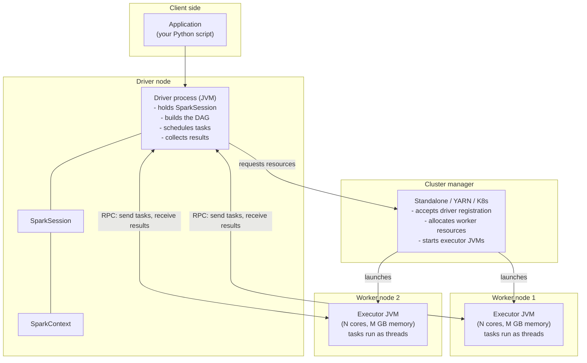
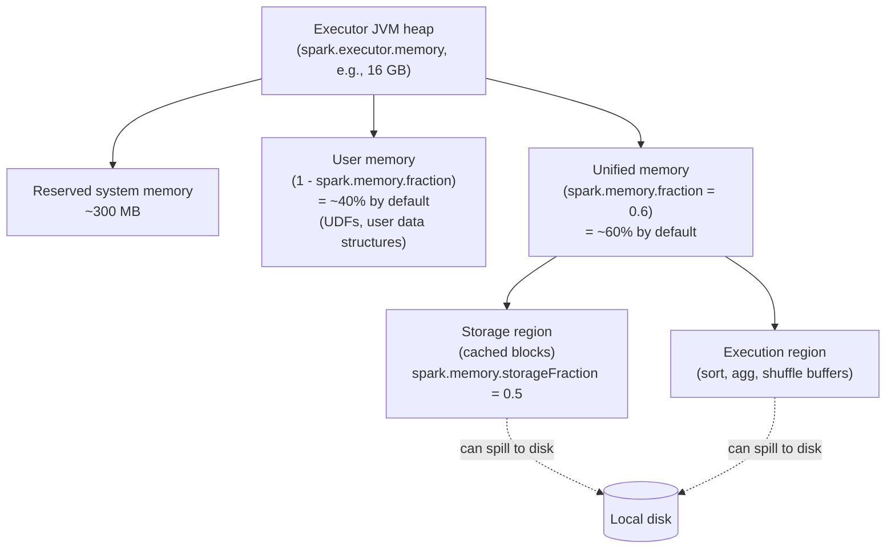

# Module 01 — Apache Spark Architecture

> **Domain 1 of 7 — Architecture & Components (20% of exam).**
> **Goal:** Refresh the cluster topology a senior PySpark engineer has used a thousand times but rarely has to *articulate*. Driver, executor, cluster manager. Memory model. Why JVM. SparkContext vs SparkSession. The shape of "what runs where."

---

## Coverage map

Verbatim Oct 2025 exam objectives covered by this module:

| Objective (Section 1 — Architecture, 20%) | Section |
|---|---|
| "Identify the advantages and challenges of implementing Spark." | [Advantages and challenges](#advantages-and-challenges-verbatim-exam-objective) |
| "Identify the role of core components of Apache Spark's Architecture, including cluster, driver node, worker nodes/executors, CPU cores, and memory." | [The cluster, top-down](#the-cluster-top-down), [Tasks, cores, partitions](#tasks-cores-partitions--the-parallelism-arithmetic) |
| "Describe the architecture of Apache Spark, including DataFrame and Dataset concepts, SparkSession lifecycle, caching, storage levels, and garbage collection." | [SparkContext vs SparkSession](#sparkcontext-vs-sparksession), [Caching and storage levels](#caching-and-storage-levels--the-table-you-must-memorize), [Garbage collection](#garbage-collection-light-touch) |
| "Identify the features of the Apache Spark Modules, including Core, Spark SQL, DataFrames, Pandas API on Spark, Structured Streaming, and MLlib." | [Spark's modules](#sparks-modules-in-scope-identify-them) |
| "Explain the Apache Spark Architecture execution hierarchy." | [Application → Job → Stage → Task](#application--job--stage--task-preview-of-module-02) |

---

> 🎯 **How to recognize this on the exam:**
> - "Which deployment mode requires all executors to run on a single worker node?" → **Local mode** (single JVM, threads as executors). Sample Q7.
> - "Where do executor stderr/stdout live?" → **Spark UI → Executors tab → click executor → stderr/stdout**. Sample Q2.
> - "What's the default storage level for DataFrame `.cache()`?" → **`MEMORY_AND_DISK`** (NOT `MEMORY_ONLY` — that's RDDs).
> - "Total parallelism on a cluster?" → executors × cores per executor.
> - "What does SparkSession wrap?" → SparkContext + SQLContext + HiveContext.
> - "Why are Python UDFs slow vs Pandas UDFs?" → row-by-row Py4J serialization vs Arrow batch.
> - "Which cluster managers does Spark support?" → Standalone, YARN, Kubernetes (Mesos deprecated).
> - "What is NOT available in Spark Connect clients?" → SparkContext, RDD, broadcast variables, accumulators, JVM access.

---

## Why this module exists

The exam asks ~9 questions on architecture. They are **not** "name the parts of a Spark cluster" questions. They are:

- "Which component holds the DAG?" (Driver.)
- "Where do tasks execute?" (Executor.)
- "Which deployment mode runs all executors on a single worker node?" (Local.)
- "What allocates resources?" (Cluster manager.)
- "Identify the role of CPU cores in execution." (Tasks = cores per executor × N executors.)
- "What does `SparkSession` replace?" (Wraps `SparkContext`, `SQLContext`, `HiveContext`.)

Most senior engineers can answer 6 of 9 cold. The other 3 require deliberate refresh — that's this module.

---

## The cluster, top-down



### Driver

A **single JVM process** that:

- Hosts `SparkSession` (and `SparkContext` under the hood).
- Maintains the **DAG** (directed acyclic graph) representing the logical and physical plan.
- Talks to the cluster manager to request executor resources.
- Schedules **tasks** onto executors via RPC.
- Collects results from `.collect()`, `.show()`, `.take()`, `.toPandas()` etc.
- Hosts the **Spark UI** (typically on port 4040).
- Holds **broadcast variables** before shipping them out.
- Runs the **DAG scheduler** and **task scheduler**.

If the driver dies, the application dies. There is no failover for the driver in OSS Spark (some cluster managers add HA on top — e.g., YARN ApplicationMaster with `spark.yarn.maxAppAttempts`).

⚠️ **Exam trap:** the driver does **NOT** process row-level data unless you call `.collect()` (or `.toPandas()`, `.toLocalIterator()`, `.take(n)`, `.head(n)`, `.first()`). The driver coordinates; executors compute.

### Executor

A **JVM process** launched on a worker node. Each executor has:

- A configurable **number of CPU cores** (`spark.executor.cores`). One core runs one task at a time.
- A configurable **heap memory** (`spark.executor.memory`) plus optional **off-heap memory** (`spark.memory.offHeap.size`).
- A local disk for shuffle spill and the **block manager** (cache storage).
- A connection to the driver for receiving tasks and sending results/heartbeats.

**Tasks run as threads** inside the executor's JVM. Total parallelism = total executor cores. If you have 10 executors with 4 cores each, you can run 40 tasks concurrently.

### Cluster manager

The component that **allocates worker resources to driver and executors**. Spark supports:

| Manager | Notes |
|---|---|
| **Standalone** | Spark's own; ships with Spark. Simplest. |
| **YARN** | Hadoop's resource manager; common in legacy on-prem |
| **Kubernetes** | Native since Spark 2.3; GA quality since 3.1 |
| **Mesos** | **Deprecated since 3.2, removed in some downstream distributions** |

Cluster managers are **interchangeable** — the same Spark application runs on any of them with config changes only.

⚠️ **Exam trap:** Databricks's "Databricks Runtime" is not in the exam scope. The exam tests OSS Spark cluster managers.

### Worker node

The physical (or virtual) host machine. Hosts one or more executor processes. Reports back to the cluster manager (not directly to the driver — the cluster manager mediates resource allocation).

---

## Deployment modes (HIGH-VALUE — sample Q7 territory)

| Mode | Where does the driver run? | Where do executors run? | When to use |
|---|---|---|---|
| **Client** | On the **submitting machine** (your laptop, edge node) | On the cluster | Interactive — notebooks, REPL, spark-shell |
| **Cluster** | On a **worker node** in the cluster (allocated by cluster manager) | On other worker nodes | Production batch jobs |
| **Local** | In a **single JVM** on the local machine | **All executors run as threads in the SAME JVM as the driver** | Dev, testing, unit tests |

### The local-mode trap

The official sample Q7 tests this: "Which deployment mode requires all executors to run on a single worker node?"

The answer is **Local mode**. In local mode:
- There IS a "driver" and there ARE "executors" — but they're all threads in **one JVM**.
- Specified via `spark.master = "local[4]"` (4 threads) or `"local[*]"` (use all cores).
- No cluster manager involved.

"Single worker node" in the question is the misleading phrasing — there's no actual *worker node* concept; there's one machine running everything. The exam considers the single-machine JVM as the "single worker node."

```python
# Local mode — for testing
spark = SparkSession.builder \
    .appName("my-test") \
    .master("local[4]") \
    .getOrCreate()
```

### Client vs cluster mode — when does it matter?

For **interactive use** (notebooks, REPL): client mode. The driver needs to be where the developer is, because driver-side output (e.g., `.show()`) is rendered locally.

For **batch jobs**: cluster mode. The driver is on a worker, which means:
- The submitting machine can be a thin gateway; it doesn't need to be up after job submission.
- Driver-to-executor RPC traffic stays inside the cluster (lower latency).
- The submitting user gets a job ID and can disconnect.

⚠️ **`spark-submit --deploy-mode cluster`** is the production pattern. Most folks default to client and never explicitly think about this.

---

## SparkContext vs SparkSession

Two entry points coexist in 3.5:

### SparkContext (legacy, 1.x)

```python
sc = SparkContext("local", "MyApp")
rdd = sc.parallelize([1, 2, 3])
```

- The original entry point.
- Owns RDD APIs, broadcast variables, accumulators, low-level configuration.
- Still accessible: `spark.sparkContext` returns the SparkContext underlying a SparkSession.

### SparkSession (modern, 2.0+)

```python
spark = SparkSession.builder.appName("MyApp").getOrCreate()
df = spark.read.parquet("path")
```

- The unified entry point.
- Wraps `SparkContext`, `SQLContext`, `HiveContext`.
- Owns the **DataFrame/SQL API**, catalog, UDF registry, configuration.
- Owned by the driver; only **one active SparkSession per JVM** by default (multiple sessions possible with `newSession()` for catalog isolation).

### Important relationships

```python
spark = SparkSession.builder.getOrCreate()
sc = spark.sparkContext       # same SparkContext
sqlc = spark._wrapped         # SQLContext compatibility (deprecated)
catalog = spark.catalog       # catalog access
conf = spark.conf             # runtime config
```

⚠️ **Spark Connect trap:** Spark Connect clients have **NO `SparkContext`** — `spark.sparkContext` returns `None`. This breaks any code that relies on `sc.broadcast(...)`, `sc.accumulator(...)`, `sc.parallelize(...)`, or low-level RDD operations. See Module 12.

---

## Memory model inside an executor

Each executor has a unified memory pool (`spark.executor.memory`) split into:



Key defaults (Spark 3.5):
- `spark.memory.fraction` = 0.6 (60% of (heap − reserved) goes to unified memory)
- `spark.memory.storageFraction` = 0.5 (50% of unified memory is the storage "soft" boundary)
- Execution can **steal from storage** when needed (evicts cached blocks).
- Storage **cannot evict execution memory** — execution always wins under pressure.

⚠️ **Exam isn't deeply about memory tuning numbers** but it can test:
- "What happens when execution memory is exhausted?" → Spill to disk.
- "Which region holds cached DataFrames?" → Storage region.
- "Can execution evict storage?" → Yes; vice versa, no.

---

## Tasks, cores, partitions — the parallelism arithmetic

```
Total parallelism = (number of executors) × (cores per executor)

A stage runs N tasks, where N = number of partitions in the stage's RDD/DataFrame.

If N > total parallelism → tasks queue up; multiple waves of execution.
If N < total parallelism → some cores sit idle.
```

Worked example:

```
Cluster: 5 executors × 4 cores = 20 cores total = 20 concurrent tasks
DataFrame: 200 partitions (the post-shuffle default)
Stage: 200 tasks → 10 "waves" of 20 tasks each
```

⚠️ The exam can ask: "If you have 200 partitions and 20 cores, how many waves?" Answer: 10. (Or "tasks per core: 10.")

### Cores per executor — there's a sweet spot

Industry rule of thumb: 4-5 cores per executor.
- Too many cores per executor → HDFS I/O contention, GC pressure, scheduler bottleneck.
- Too few cores per executor → JVM overhead per executor dominates.

**Not directly exam-tested**, but useful intuition for "best practice" questions.

---

## Application → Job → Stage → Task (preview of Module 02)

```
Application                (one per SparkSession)
  └─ Job                   (one per action: count, collect, write, show...)
       └─ Stage            (one per shuffle boundary)
            └─ Task        (one per partition in the stage)
```

A **task** is the **smallest unit of execution**. It processes exactly one partition. Module 02 unpacks the lazy → DAG → job → stage chain in detail.

---

## Spark's modules (in scope: identify them)

The exam guide explicitly asks you to "Identify the features of the Apache Spark Modules":

| Module | What it is |
|---|---|
| **Spark Core** | Foundation: RDDs, task scheduling, memory management, fault recovery, storage, cluster-manager interaction |
| **Spark SQL + DataFrames** | Structured data, Catalyst optimizer, SQL parser, DataFrame/Dataset API |
| **Structured Streaming** | Stream processing built on Spark SQL; treats stream as unbounded table (Module 11) |
| **Pandas API on Spark** | pandas-compatible API; formerly Koalas (Module 13) |
| **MLlib** | Distributed ML algorithms (NOT deeply tested) |
| **GraphX** | Graph computation (NOT tested) |

You won't be quizzed on MLlib internals. You will be quizzed on **"Pandas API on Spark is a module of Spark"** (true) vs **"pandas_udf is a separate library"** (false — `pandas_udf` is a PySpark construct in `pyspark.sql.functions`).

---

## What "JVM process" means (and why Python is special)

Spark is written in **Scala**, running on the **JVM**. PySpark is a Python wrapper that:

1. **Driver:** Python process forks a JVM via Py4J; commands flow over a TCP socket.
2. **Executors:** JVM executors; for native DataFrame operations, all computation happens in JVM.
3. **Python UDFs:** when you write a `@udf` function, each executor spawns a **Python worker subprocess**, and data is serialized row-by-row over a pipe → Python → result back to JVM. **This is the slow path.**
4. **Pandas UDFs (Arrow-based):** data is serialized in **Apache Arrow columnar batches** to the Python worker — vectorized, much faster.

⚠️ **Exam framing:**
- "Why are Python UDFs slow?" — row-by-row Python serialization breaks Catalyst optimization and adds Py4J overhead.
- "Why are Pandas UDFs fast?" — Arrow batch serialization, vectorized pandas operations.

---

## Caching and storage levels — the table you must memorize

Already in FACTS.md §11 but repeated here for module completeness:

| Storage Level | Heap memory | Disk | Serialized | Replicated |
|---|---|---|---|---|
| `MEMORY_ONLY` | ✓ | ✗ | ✗ | ✗ |
| **`MEMORY_AND_DISK`** ← `df.cache()` default | ✓ | ✓ | ✗ | ✗ |
| `MEMORY_ONLY_SER` | ✓ | ✗ | ✓ | ✗ |
| `MEMORY_AND_DISK_SER` | ✓ | ✓ | ✓ | ✗ |
| `DISK_ONLY` | ✗ | ✓ | (always) | ✗ |
| `*_2` variants | — | — | — | ✓ (2 nodes) |
| `OFF_HEAP` | off-heap | ✗ | ✓ | ✗ |

⚠️ **The trap:** RDD `.cache()` defaults to `MEMORY_ONLY`. DataFrame `.cache()` defaults to `MEMORY_AND_DISK`. **Asymmetric defaults are exam fodder.**

```python
df.cache()                        # MEMORY_AND_DISK
df.persist(StorageLevel.DISK_ONLY)
df.unpersist()                    # remove from cache
df.unpersist(blocking=True)       # wait for removal
```

---

## Garbage collection (light touch)

Long GC pauses on executors signal memory pressure:

| Symptom | Likely cause | Fix |
|---|---|---|
| Frequent full GCs in executor logs | Too much cached data | Unpersist what you don't need; smaller `spark.memory.storageFraction` |
| Pre-mature OOM after small data load | Too many tiny objects, no serialization | Use `MEMORY_AND_DISK_SER` storage level; Kryo serializer |
| Long task tails with GC time > 30% | Skew dumping all data on one executor | Salt the join key, repartition |

**Kryo serializer** (faster, more compact than Java serialization):

```python
spark.conf.set("spark.serializer", "org.apache.spark.serializer.KryoSerializer")
```

⚠️ **Exam isn't deeply about GC.** Just know: "Long GC pauses signal memory pressure; mitigations include serialized caching, more/smaller executors, reducing cached data."

---

## Spark UI tabs (preview)

The exam tests "how do you retrieve executor logs?" (sample Q2). Answer: **Spark UI → Executors tab → click executor → stderr/stdout**. (Not via `spark-submit --verbose` and not via the driver's stdout.)

| Tab | Use |
|---|---|
| Jobs | Overall job timing |
| Stages | Task duration distribution, shuffle bytes, spill |
| Storage | Cached RDDs/DataFrames |
| Environment | Effective Spark configuration |
| Executors | **Driver & executor logs** (stdout, stderr), GC time, failed tasks |
| SQL/DataFrame | Query plan graph, AQE annotations |
| Streaming | Per-query rates, batch durations |

Module 10 covers Spark UI diagnostics in detail.

---

## Advantages and challenges (verbatim exam objective)

The exam guide asks you to "identify the advantages and challenges of implementing Spark." Don't overthink this — these are essentially "general distributed-systems" answers:

### Advantages

- **In-memory computation** — orders of magnitude faster than disk-based MapReduce.
- **Unified API** — Spark Core, SQL, Streaming, MLlib in one engine.
- **Lazy evaluation + Catalyst** — automatic query optimization.
- **Fault tolerance via lineage** — recompute lost partitions from source.
- **Language polyglot** — Python, Scala, R, Java, SQL.
- **Cluster-manager agnostic** — runs on YARN, K8s, Standalone.

### Challenges

- **Memory pressure** — OOM is the most common production failure mode.
- **Tuning overhead** — partitions, shuffle, broadcast thresholds, AQE configs all interact.
- **Debugging distributed failures** — stack traces span driver + executors.
- **Skew** — data skew destroys parallelism.
- **Small files problem** — many small files = many small tasks = scheduling overhead.

---

## Code: setting up a SparkSession (review)

```python
from pyspark.sql import SparkSession

# Local mode for testing
spark = (SparkSession.builder
         .appName("dev")
         .master("local[*]")
         .config("spark.sql.adaptive.enabled", "true")
         .config("spark.serializer", "org.apache.spark.serializer.KryoSerializer")
         .getOrCreate())

# Cluster (typical: master comes from spark-submit/cluster manager)
spark = (SparkSession.builder
         .appName("prod-job")
         .config("spark.sql.shuffle.partitions", "400")
         .getOrCreate())

# Inspect what we got
print(spark.version)              # '3.5.x'
print(spark.sparkContext.master)  # 'local[*]' or 'yarn' or 'k8s://...'
print(spark.conf.get("spark.sql.adaptive.enabled"))
```

⚠️ **`getOrCreate()`** returns the existing session if one is active; otherwise creates a new one. Important for notebooks and tests.

---

## Mini-quiz (cold; answers below)

1. Which component runs `.collect()` and accumulates the result?
2. If an executor has 4 cores and the cluster has 5 executors, how many tasks run concurrently?
3. In local mode, where do executors run?
4. What does `SparkSession` wrap?
5. Why is `spark.sparkContext` `None` in Spark Connect?
6. Which storage level is the DataFrame `.cache()` default?
7. Can execution memory evict storage memory? Vice versa?
8. Name the cluster managers Spark supports today.
9. Why are Python UDFs slow vs Pandas UDFs?
10. Where do you find executor stderr/stdout?

### Answers

1. **Driver.** Results from actions flow back to the driver.
2. **20.** Total parallelism = executors × cores per executor.
3. **In the same JVM as the driver** — all threads in one process.
4. **`SparkContext`, `SQLContext`, `HiveContext`** — the legacy entry points.
5. Spark Connect clients are thin gRPC clients; they don't have JVM access. RDD operations, broadcast variables, accumulators, `sc.parallelize`, etc. are unavailable.
6. **`MEMORY_AND_DISK`.** (RDD `.cache()` is `MEMORY_ONLY`.)
7. Execution **can** evict storage (kicks cached blocks out under pressure). Storage **cannot** evict execution.
8. **Standalone, YARN, Kubernetes.** Mesos deprecated/removed.
9. Python UDFs serialize row-by-row over Py4J/pipes; Pandas UDFs use Apache Arrow columnar batches → vectorized in pandas.
10. **Spark UI → Executors tab → click executor → stderr/stdout.**

---

## Exam-day cheat sheet for this module

- **Driver = JVM holding DAG, SparkSession, schedules tasks, collects results.**
- **Executor = JVM per worker; tasks run as threads; one core per task.**
- **Cluster manager = Standalone | YARN | K8s (Mesos deprecated).**
- **Deployment modes: client (driver on laptop), cluster (driver on worker), local (everything in one JVM).**
- **SparkSession wraps SparkContext + SQLContext + HiveContext.**
- **Spark Connect: no SparkContext, no RDD, no broadcast variables, no accumulators.**
- **DataFrame `.cache()` = MEMORY_AND_DISK (NOT MEMORY_ONLY).**
- **Total parallelism = sum of executor cores.**
- **Executor logs → Spark UI → Executors tab → stderr/stdout.**

Next: [Module 02 — Lazy Evaluation, Catalyst, and the DAG](02_lazy_evaluation_dag.md).
