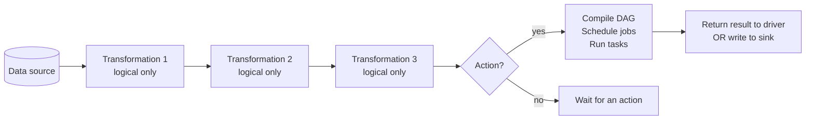
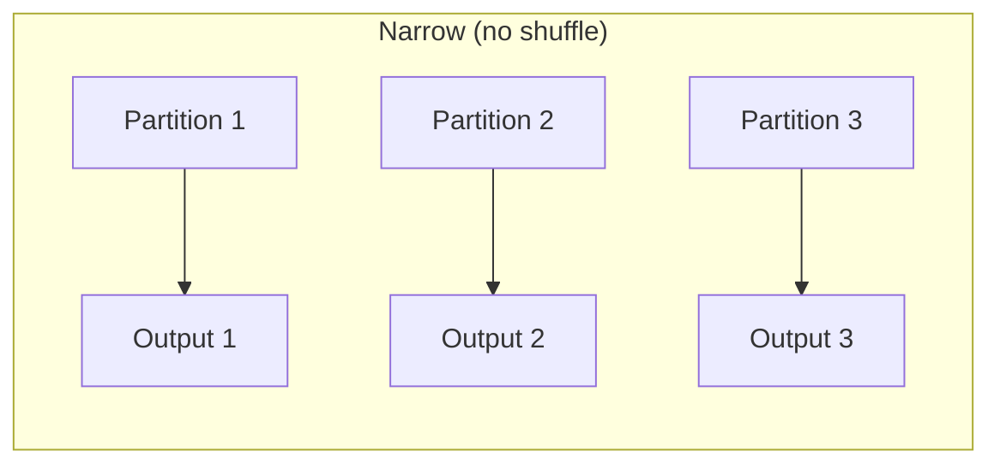
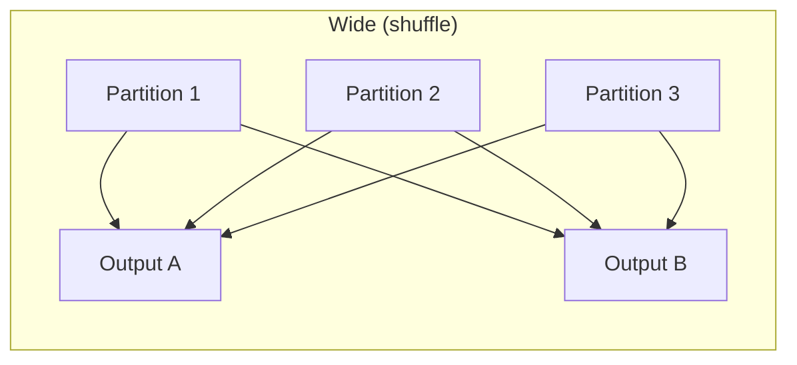
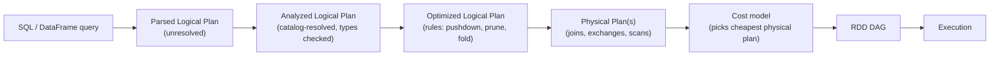
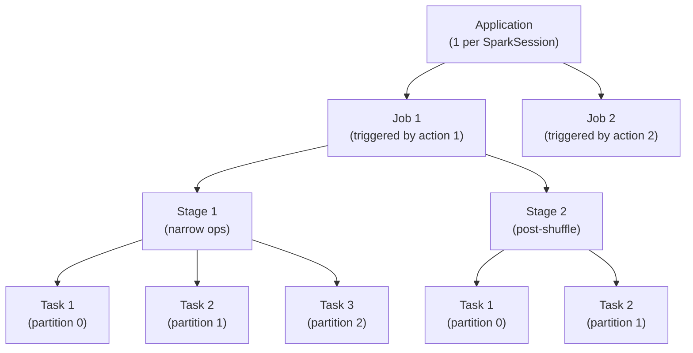
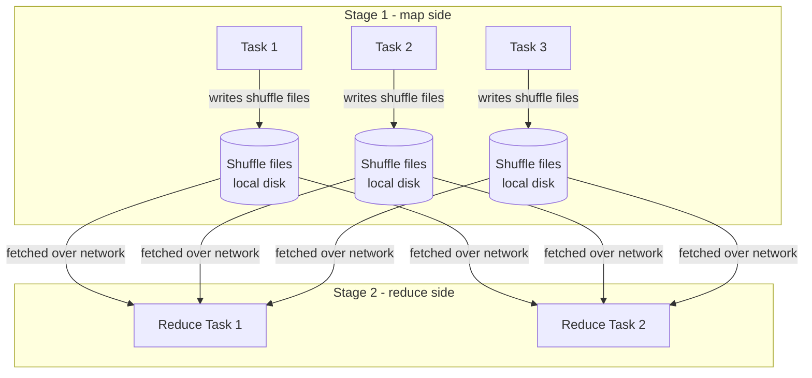

# Module 02 — Lazy Evaluation, Catalyst, and the DAG

> **Domain 1 of 7 — Architecture & Components (20%).**
> **Goal:** Master the lazy-evaluation model, the transformation/action distinction, **narrow vs wide** (with the *complete list* — `union` is narrow, this is on the exam), Catalyst optimization passes, and how the DAG turns into jobs and stages.

---

## Coverage map

Verbatim Oct 2025 exam objectives covered by this module:

| Objective (Section 1 — Architecture, 20%) | Section |
|---|---|
| "Describe the execution patterns of the Apache Spark engine, including actions, transformations, and lazy evaluation." | [The lazy evaluation model](#the-lazy-evaluation-model), [Transformations vs actions](#transformations-vs-actions) |
| "Configure Spark partitioning in distributed data processing, including shuffles and partitions." | [Narrow vs wide](#narrow-vs-wide--the-complete-list-high-value), [The shuffle in detail](#the-shuffle-in-detail) |
| "Explain the Apache Spark Architecture execution hierarchy." | [DAG → Job → Stage → Task](#dag--job--stage--task) |
| "Describe the architecture of Apache Spark, including DataFrame and Dataset concepts, SparkSession lifecycle, caching, storage levels, and garbage collection." | [Lineage and fault tolerance](#lineage-and-fault-tolerance), [Checkpoint vs cache](#checkpoint-vs-cache) |

---

> 🎯 **How to recognize this on the exam:**
> - If question shows code with `union()` and asks about shuffle behavior → **NARROW, no shuffle.** Even though it "combines tables," Spark just concatenates partitions.
> - If question asks whether `df.coalesce(10)` triggers a shuffle → **NO** (it's narrow; combines partitions on the same executor).
> - If question asks whether `df.cache()` runs the job → **NO** (it's a transformation/hint; the next action materializes the cache).
> - If question lists transformations and asks which is wide → look for `groupBy`, `join` (non-broadcast), `distinct`, `dropDuplicates`, `orderBy`, `repartition`, window functions with `partitionBy`.
> - If question mentions "lineage" → cache preserves it; checkpoint truncates it.

---

## Why this module exists

The single highest-yield architecture topic. Three reliable exam-trap categories live here:

1. **`union` is narrow** — almost no one remembers this on first try.
2. **The DataFrame method `.coalesce()` is narrow** — distinct from the SQL function `F.coalesce()`.
3. **Transformations vs actions** — `df.cache()` is a transformation? An action? A hint? (Answer: transformation; doesn't trigger execution.)

If you internalize the lists in this module, you'll get every architecture/DAG question right.

---

## The lazy evaluation model

Watch what happens when you chain operations:

```python
df = spark.read.parquet("s3://big-bucket/data/")  # NO READ HAPPENS YET
df = df.filter(F.col("year") == 2025)             # NO FILTERING
df = df.select("user_id", "event_type", "ts")     # NO PROJECTION
df = df.groupBy("event_type").count()             # NO AGG
df.show()                                          # NOW everything runs
```

Spark doesn't execute anything until an **action** is called. Until then, each `df.<transformation>()` call only **modifies the logical plan**.

### Why lazy?

Lazy evaluation lets Spark:

- **Combine consecutive transformations** into a single pipeline of operations (pipelining within a stage).
- **Push filters down** to the source (predicate pushdown — `filter` happens before scan loads bytes).
- **Prune columns** the query never reads (projection pushdown — `select` happens before scan loads bytes).
- **Reorder operations** for cost (join order optimization).
- **Skip work entirely** when the query plan reveals dead code (e.g., a constant-false filter eliminates a join).

Eager evaluation would force Spark to materialize after every line — wasting I/O, memory, and compute.

---

## Transformations vs actions



### Transformations — lazy, return a new DataFrame

`select`, `filter`, `where`, `withColumn`, `withColumnRenamed`, `drop`, `distinct`, `dropDuplicates`, `groupBy`, `agg`, `join`, `union`, `unionByName`, `crossJoin`, `orderBy`, `sort`, `sortWithinPartitions`, `repartition`, `coalesce`, `cache`, `persist`, `sample`, `limit`, `map`, `flatMap`, `mapPartitions`, `pivot`, `na.drop`, `na.fill`, `withColumns` (Spark 3.3+), `selectExpr`, ...

⚠️ `cache()` is a **transformation**. It marks the DataFrame for caching when next computed; it doesn't trigger computation by itself.

### Actions — eager, trigger execution

| Action | What it does |
|---|---|
| `collect()` | Pull all rows to driver as a list of Row |
| `count()` | Count rows |
| `show(n)` | Print first n rows |
| `take(n)` / `head(n)` | First n rows as a list |
| `first()` | First row |
| `foreach(fn)` | Apply function to each row (no return) |
| `foreachPartition(fn)` | Apply function per partition |
| `toPandas()` | Convert to pandas DataFrame (driver-side) |
| `toLocalIterator()` | Iterator that lazily pulls partitions |
| `write...save()` / `saveAsTable()` / `parquet()` etc. | Write to storage |
| `describe()` / `summary()` | Compute descriptive statistics (yes, action) |
| `printSchema()` | Print schema (no — this is action-LIKE but **doesn't trigger execution**; just inspects logical plan) |

⚠️ **Edge case: `printSchema()` is not really an action** in the sense of triggering a job. It only inspects the *logical plan's schema*. The exam might still loosely call it an action; treat it as "schema inspection, no execution."

### `cache()` / `persist()` is a transformation

```python
df = df.cache()  # marks for caching, NO execution yet
df.count()       # this action triggers execution AND populates the cache
df.count()       # this re-uses the cache; much faster
```

---

## Narrow vs wide — the complete list (HIGH-VALUE)

A **narrow transformation** is one where **each output partition depends on at most one input partition** — no shuffle.

A **wide transformation** is one where **output partitions depend on multiple input partitions** — requires shuffle.





### Narrow transformations

| Operation | Why narrow |
|---|---|
| `select(*cols)` | Column projection, no row movement |
| `filter(cond)` / `where(cond)` | Row predicate, each partition independently |
| `withColumn(name, expr)` | Per-row column derivation |
| `withColumnRenamed(old, new)` | Schema-only change |
| `withColumns({...})` (3.3+) | Multi-column derive |
| `drop("col")` | Schema-only |
| `selectExpr(...)` | Same as select |
| `map(fn)`, `flatMap(fn)`, `mapPartitions(fn)` | RDD-level, per-partition |
| `sample(fraction)` | Independent sampling per partition |
| **`union(otherDf)` / `unionAll`** | **Concatenates partitions — NO shuffle.** ⚠️ Exam trap. |
| **`unionByName(otherDf)`** | Same as union, matched by column name. Still narrow. |
| **`coalesce(n)` (DataFrame method)** | **Combines partitions on same executor; NO shuffle.** ⚠️ Different from `F.coalesce` SQL function. |
| `limit(n)` | Narrow at executor; followed by a small driver-side merge |
| `sortWithinPartitions(*cols)` | Per-partition sort; NO global sort |
| `na.drop()`, `na.fill()`, `na.replace()` | Per-row null handling |
| `crossJoin(small_df)` with broadcast | Narrow on the large side |
| `join(broadcast(small_df), ...)` | Narrow on the large side |

### Wide transformations

| Operation | Why wide |
|---|---|
| `groupBy(*cols).agg(...)` | Rows with same key must collocate → shuffle |
| `distinct()` | Implemented as `groupBy(*all_cols).agg(first)` → shuffle |
| `dropDuplicates(subset)` | Same — shuffle by subset |
| **`orderBy(*cols)` / `sort(*cols)`** | Global ordering requires range-partition shuffle |
| `repartition(n)` | Round-robin reshuffle to n partitions |
| `repartition(col)` | Hash shuffle by column |
| `repartition(n, col)` | Hash shuffle by column into n partitions |
| `join` (sort-merge or shuffle hash) | Both sides shuffled by key |
| `pivot` | Implicit grouping → shuffle |
| **Window functions with `partitionBy`** | Shuffle by partition column |
| `cube`, `rollup` | Implicit grouping → shuffle |

### The exam-trap matrix

| Question would be: "Is X a wide transformation?" | Answer | Why |
|---|---|---|
| `df.union(df2)` | **No (narrow)** | Concatenates partitions |
| `df.coalesce(10)` | **No (narrow)** | No shuffle; combines on same executor |
| `df.repartition(10)` | **Yes (wide)** | Full reshuffle |
| `df.cache()` | Neither — it's a hint, not really a transformation that does work |
| `df.distinct()` | **Yes (wide)** | Implicit groupBy |
| `df.filter(...)` | **No (narrow)** | Per-row |
| `df.dropDuplicates()` | **Yes (wide)** | Shuffle by subset of cols |
| `df.withColumn("x", F.col("a") + 1)` | **No (narrow)** | Per-row derive |
| `df.sortWithinPartitions("ts")` | **No (narrow)** | Per-partition sort |
| `df.orderBy("ts")` | **Yes (wide)** | Global sort |
| `df.sample(0.1)` | **No (narrow)** | Per-partition sample |

### Why `union` confuses people

`union(df1, df2)` resembles SQL's `UNION ALL` semantically — it appends rows. People assume "merging two tables = shuffle." But under the hood, `union` is just `partitions(df1) ++ partitions(df2)`. No data movement. No shuffle.

If you want **deduplication** (SQL `UNION` semantics), you do `df1.union(df2).distinct()` — which adds a wide step *because of* `distinct`, not because of `union`.

### Why `coalesce` is narrow

`coalesce(n)` only **decreases** partition count. It works by **combining adjacent partitions on the same executor** — no data leaves the executor.

```
Before coalesce(2):
  Executor A: [P0, P1]
  Executor B: [P2, P3]

After coalesce(2):
  Executor A: [P0+P1]
  Executor B: [P2+P3]
```

⚠️ The trade-off: `coalesce` can leave you with **unbalanced** partitions (if input partitions had very different sizes). For balanced reshuffle, use `repartition`.

⚠️ The other trap: there's a *SQL function* also called `coalesce` (`F.coalesce(c1, c2, c3)`) that returns the first non-null **value**. Completely unrelated to the partition method. Module 05 covers it.

---

## Catalyst optimizer — the brain of Spark SQL

Every DataFrame/SQL query goes through Catalyst:



### Catalyst optimization rules (selected highlights)

- **Predicate pushdown:** `filter` moves below `join` and into the file scan.
- **Projection pruning:** unused columns dropped at the scan.
- **Constant folding:** `WHERE 1=1` becomes a no-op; `WHERE 2 > 1` removed.
- **Column pruning across joins:** if you only select 2 columns post-join, the join only reads those (+ join keys).
- **Filter combine:** `df.filter(a).filter(b)` becomes `df.filter(a AND b)`.
- **Subquery elimination:** correlated subqueries rewritten as joins where possible.
- **Partition pruning:** for partitioned tables, only relevant partitions are scanned.

### Inspecting the plan

```python
df.explain()                    # physical plan
df.explain(True)                # all four plans
df.explain(mode="formatted")    # readable formatted plan (Spark 3.0+)
df.explain(mode="cost")         # plan with cost estimates
df.explain(mode="codegen")      # generated code
```

Example:

```
== Physical Plan ==
*(2) HashAggregate(keys=[event_type], functions=[count(1)])
+- Exchange hashpartitioning(event_type, 200)
   +- *(1) HashAggregate(keys=[event_type], functions=[partial_count(1)])
      +- *(1) Project [event_type]
         +- *(1) Filter (year = 2025)
            +- *(1) FileScan parquet [event_type, year] PushedFilters: [year=2025]
```

Reading top-down:
- `*(2)` = stage 2; `*(1)` = stage 1 (separated by the `Exchange` = shuffle).
- `partial_count` then `count` = map-side + reduce-side aggregation (combine).
- `FileScan ... PushedFilters: [year=2025]` = the filter pushed down to scan.

---

## Lineage and fault tolerance

The DAG records, for every DataFrame, **how to recompute it from the source**.

```python
df = spark.read.parquet("s3://x/data/")
df2 = df.filter("year=2025")
df3 = df2.groupBy("region").count()
```

Each transformation builds up the lineage. If an executor dies and a partition is lost mid-job:

1. Spark sees the partition is missing.
2. Looks at the lineage to find how it was computed.
3. Recomputes from the upstream parent partitions.
4. If those are also gone, walks further back, ultimately to the source file.

This is why `cache()` is useful: it **truncates the recompute chain** — Spark doesn't have to walk lineage past the cached point.

⚠️ **Important:** with **wide transformations**, lineage isn't enough — the shuffle write files are also stored on local disk and re-used for re-runs *within the same job*. But across jobs, you need a cache or a checkpoint.

### Checkpoint vs cache

| | cache / persist | checkpoint |
|---|---|---|
| Storage | Executor memory / local disk | Reliable storage (HDFS, S3) |
| Lineage | Preserved (used for fault recovery) | **Truncated** (lineage replaced with read from checkpoint location) |
| Fault tolerance | Loses on executor death | Survives all failures |
| Cost | Cheap | Expensive (writes to durable storage) |
| Use case | Repeated reads within a job | Iterative jobs where lineage grows long (ML) |

Set: `spark.sparkContext.setCheckpointDir("hdfs://...")` then `df.checkpoint()`.

---

## DAG → Job → Stage → Task



**Rules:**

- One **Job** per action.
- One **Stage** boundary per shuffle (wide transformation).
- Within a stage, narrow transformations are **pipelined** into a single pass over each partition.
- One **Task** per partition per stage.

### Worked example

```python
df = spark.read.parquet("...")  # 100 input partitions
df = df.filter("year=2025")     # narrow — same stage
df = df.select("a", "b")        # narrow — same stage
df = df.groupBy("a").count()    # wide — Stage 1 ends, Stage 2 begins
df.show(20)                     # ACTION — triggers 1 Job
```

- **Job 1** (triggered by `show`).
- **Stage 1**: read → filter → select → map-side partial count. 100 tasks (one per input partition).
- **Stage 2**: shuffle read → final count. 200 tasks (default `spark.sql.shuffle.partitions`).
- `show(20)` then collects 20 rows to the driver from any task that has them.

### Stage skipping (AQE/cache effect)

If a stage's output was cached or already shuffled, Spark may **skip** that stage in subsequent jobs. The Spark UI marks these stages with "skipped."

---

## The shuffle in detail



### Two halves

1. **Shuffle write (map side):** each task in the upstream stage partitions its output by the shuffle key (e.g., the `groupBy` column) and writes one file per downstream partition to **local disk**.

2. **Shuffle read (reduce side):** each task in the downstream stage fetches its assigned chunks from every upstream task across the network.

### Spill to disk

If the in-memory hash table (for aggregations) or sort buffer exceeds available execution memory, Spark **spills sorted/partial state to local disk**. Spills appear in Spark UI Stages tab as "Spill (Memory)" and "Spill (Disk)."

Reducing spill:
- Increase executor memory.
- Reduce per-task data volume (more partitions).
- Pre-filter and pre-aggregate before the shuffle.

### Shuffle cost

The shuffle is **the most expensive operation in Spark** because it involves:
- Local disk I/O (write + read).
- Network transfer between executors.
- Serialization/deserialization.
- Sort (for sort-merge join) or hash-table build (for shuffle hash join).

The whole point of Catalyst optimization is **minimizing shuffles**.

---

## Output-prediction drills

Each drill: predict the answer **cold**, then verify against the explanation.

### Drill 1 — How many jobs?

```python
df = spark.read.parquet("data/")   # 1
df = df.filter("year=2025")        # 2
df = df.select("a", "b")           # 3
df.cache()                         # 4
df.count()                         # 5
df.count()                         # 6
df.show(5)                         # 7
df.write.parquet("out/")           # 8
```

**Q:** How many Spark jobs are triggered? Which lines trigger them?

**A:** **4 jobs.** Lines 1–4 are lazy. Line 5 (`count()`) triggers job 1 (and populates the cache). Line 6 (`count()`) triggers job 2 — reads from cache, fast. Line 7 (`show(5)`) triggers job 3. Line 8 (`write`) triggers job 4.

Trap: `df.read.parquet()` alone does NOT trigger a job in Spark 3.5 when schema is inferred from Parquet footers (cheap metadata read, not a full job). If `inferSchema=True` for CSV, that does trigger an extra job.

### Drill 2 — Partition count after a chain

```python
df = spark.range(0, 1000).repartition(8)   # 8 partitions
df2 = df.filter("id % 2 = 0")              # ?
df3 = df2.groupBy("id").count()            # ?
df4 = df3.coalesce(5)                      # ?
```

**Q:** How many partitions does each of `df`, `df2`, `df3`, `df4` have? (Assume default `spark.sql.shuffle.partitions=200`, AQE disabled.)

**A:**
- `df`: **8** (explicit repartition).
- `df2`: **8** (filter is narrow, preserves partition count).
- `df3`: **200** (groupBy is wide → post-shuffle = `spark.sql.shuffle.partitions`).
- `df4`: **5** (coalesce reduces).

With AQE enabled, `df3` could be coalesced down further at runtime.

### Drill 3 — Narrow or wide?

For each, write N (narrow) or W (wide):

```python
df.union(df2)                                          # ?
df.unionByName(df2)                                    # ?
df.coalesce(10)                                        # ?
df.repartition(10)                                     # ?
df.repartition("country")                              # ?
df.distinct()                                          # ?
df.dropDuplicates(["id"])                              # ?
df.filter("x > 0")                                     # ?
df.withColumn("y", F.col("x") + 1)                     # ?
df.withColumn("rn", F.row_number().over(window))       # ?
df.sortWithinPartitions("ts")                          # ?
df.orderBy("ts")                                       # ?
df.sample(0.1)                                         # ?
df.join(F.broadcast(small), "k")                       # ?
df.join(big, "k")                                      # ?
df.crossJoin(small)                                    # ?
df.na.drop()                                           # ?
df.intersect(df2)                                      # ?
df.exceptAll(df2)                                      # ?
df.limit(10)                                           # ?
```

**A:** N, N, N, W, W, W, W, N, N, **W** (window function triggers shuffle by partitionBy), N, W, N, **N (broadcast = no shuffle on the large side)**, **W (sort-merge or shuffle-hash)**, N (cross with broadcast), N, W, W, N.

⚠️ **Trap:** `withColumn` is narrow EXCEPT when the expression contains a window function — then it's wide because of the window.

### Drill 4 — `cache()` materialization timing

```python
df = spark.read.parquet("path/")  # lazy
df = df.filter("x > 0")           # lazy
df = df.cache()                   # lazy hint
print("here")                     # only prints "here"; no Spark job
df.show(5)                        # triggers job, populates cache
df.count()                        # reads from cache (no re-read from parquet)
df.unpersist()                    # marks for eviction
df.count()                        # re-reads from parquet
```

**Q:** Which lines trigger Spark jobs?

**A:** Only `df.show(5)`, `df.count()` (twice). The first `count` reads from cache; after `unpersist`, the second `count` re-reads from source.

### Drill 5 — Plan inspection: what does `.explain()` show after a filter?

```python
df = spark.read.parquet("path/")
df.filter(F.col("year") == 2025).select("user_id", "event_type").explain()
```

**Q:** Where does the filter appear in the physical plan?

**A:** As a **`PushedFilters: [IsNotNull(year), EqualTo(year, 2025)]`** annotation on the `FileScan parquet` node — the filter is **pushed down to the scan**, not applied as a separate Filter node. The Project (select) is also pushed down: only `user_id`, `event_type`, `year` (the filter column) are read from disk.

### Drill 6 — Stage boundaries

```python
df = (spark.read.parquet("path/")          # stage 1
    .filter("year=2025")                   # stage 1
    .select("a", "b")                      # stage 1
    .groupBy("a").count()                  # shuffle → stage 2
    .orderBy("count"))                     # shuffle → stage 3
df.show(20)                                # triggers
```

**Q:** How many stages does this trigger?

**A:** **3 stages.** `read → filter → select → partial groupBy` (stage 1, ends at shuffle). Shuffle write to disk. `final groupBy → partial sort prep` (stage 2). Shuffle for `orderBy`. `final sort → show` (stage 3).

`show(20)` may also short-circuit and skip some sort work if it only needs 20 rows — `limit + sort` optimizations apply.

---

## End-to-end mini-scenario

```python
events = spark.read.parquet("s3://lake/events/")    # 10 TB, partitioned by date
dim_users = spark.read.parquet("s3://lake/users/")  # 100 MB

# Stage A: filter events early (push down date)
events_recent = events.filter("date >= '2025-01-01'").select("user_id", "amount", "country")

# Stage B: cache filtered events (small enough now)
events_recent = events_recent.cache()

# Stage C: aggregate
agg = events_recent.groupBy("country").agg(
    F.sum("amount").alias("rev"),
    F.approx_count_distinct("user_id").alias("uniq_users"),
)

# Stage D: enrich with user count via broadcast
result = agg.join(F.broadcast(dim_users.groupBy("country").count()), "country")

# Final: write
result.write.mode("overwrite").parquet("s3://lake/country_summary/")
```

**Job/stage analysis:**
- 1 application, ~1 job (the `write`).
- Stage 1: `events` scan (partition-pruned to `date >= '2025-01-01'`, columns pruned to 3) → filter → select → cache write → map-side partial aggregation.
- Stage 2: shuffle for `groupBy("country")` → final agg.
- Stage 3: `dim_users` scan → groupBy("country") → count.
- Stage 4: broadcast `dim_users` count → BHJ with `agg` → write.

Cache materializes during stage 1's execution. Subsequent queries against `events_recent` (e.g., a debug `.count()`) reuse it.

---

## Mini-quiz

1. Is `df.cache()` a transformation or an action?
2. Is `df.union(other)` narrow or wide?
3. Is `df.distinct()` narrow or wide?
4. What does Catalyst do with `df.filter("year=2025").filter("region='US'")`?
5. Why does `coalesce(n)` not shuffle?
6. What's the difference between `sortWithinPartitions` and `orderBy`?
7. Lineage vs checkpoint — which truncates the recompute chain?
8. After `df = df.cache()`, when does the data actually get cached?
9. How many tasks run in a stage with N partitions?
10. What happens to shuffle files when a stage completes?

### Answers

1. **Transformation.** It's a hint; no execution happens. Data caches on the first action that triggers computation.
2. **Narrow.** Concatenates partitions; no shuffle.
3. **Wide.** Implemented as `groupBy(*all_cols)` — shuffles by all columns.
4. **Combines them** into `df.filter("year=2025 AND region='US'")`. Both pushed down to the file scan.
5. It only **decreases** partition count by **combining on the same executor**. No data leaves the node.
6. `sortWithinPartitions` sorts each partition independently (narrow). `orderBy` produces a **global sort** via range-partition shuffle (wide).
7. **Checkpoint** truncates lineage by replacing the chain with a "read from reliable storage" node. Cache preserves lineage (it can be lost if a node dies).
8. On the **next action** that materializes the DataFrame.
9. **N tasks.**
10. They're kept on local disk **until the job ends** (or the executor cleans them up). Re-runs within the same job can re-use them; the next job typically re-computes.

---

## Exam-day cheat sheet

- **`union` is narrow.** ⚠️
- **DataFrame `.coalesce(n)` is narrow.** SQL function `F.coalesce(c1, c2)` returns first non-null (unrelated).
- **`distinct` and `dropDuplicates` are wide** (implicit groupBy).
- **Window functions with `partitionBy` are wide.**
- **`orderBy` is wide; `sortWithinPartitions` is narrow.**
- **Actions trigger jobs.** Transformations are lazy.
- **One job per action; one stage per shuffle boundary; one task per partition.**
- **Catalyst optimizes: predicate pushdown, projection pruning, constant folding, filter combine.**
- **`df.explain(True)` shows all four plans.**
- **Cache preserves lineage; checkpoint truncates it.**
- **Lineage = the chain of transformations; enables fault-tolerant recompute.**

Next: [Module 03 — Execution Model: Jobs, Stages, Tasks](03_execution_model.md).
