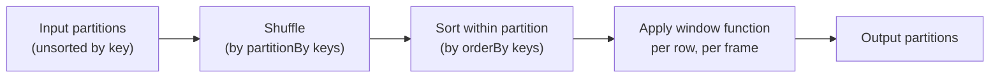

# Module 08 — Aggregations and Window Functions

> **Domain 3 of 7 — DataFrame/Dataset API (30%).**
> **Goal:** Master `groupBy().agg()`, the full aggregation function catalog, `approx_count_distinct` (HyperLogLog, sample Q10), pivot, and window functions (`partitionBy`/`orderBy`/`rowsBetween`/`rangeBetween` + `row_number`/`rank`/`dense_rank`/`lag`/`lead`).

---

## Coverage map

Verbatim Oct 2025 exam objectives covered by this module:

| Objective (Section 3 — DataFrame/Dataset API, 30%) | Section |
|---|---|
| "Perform aggregate operations on DataFrames such as count, approximate count distinct, and mean, summary." | [groupBy + agg](#groupby--agg), [The full aggregation function catalog](#the-full-aggregation-function-catalog), [summary and describe](#summary-and-describe) |
| "Manipulate columns, rows, and table structures by adding ... and exploding arrays." (related — see Module 05 for explode) | — |

---

> 🎯 **How to recognize this on the exam:**
> - If question mentions "count distinct with tolerance for error" → **`F.approx_count_distinct`** (uses HyperLogLog++; avoids global distinct shuffle). Speed reason: **algorithm**, NOT compression or null handling.
> - If question shows ranking values like `[1, 2, 2, 4]` → **`rank()`** (skips after ties).
> - If question shows `[1, 2, 2, 3]` → **`dense_rank()`** (no skip).
> - If question shows `[1, 2, 3, 4]` from tied data → **`row_number()`** (always unique).
> - If `count("*")` vs `count(col)` appears → `*` counts ALL rows (incl. nulls); `count(col)` ignores nulls.
> - If question shows a sum/avg with all-null group → returns NULL, NOT 0.
> - If question shows `F.sum("x").over(Window.partitionBy("k").orderBy("ts"))` → **running sum** (default frame is `rangeBetween(unboundedPreceding, currentRow)` when orderBy is present), NOT partition total.
> - If question asks "first/last per group, deterministic" → window with `row_number()` then filter `rn=1`. `dropDuplicates(subset)` keeps an ARBITRARY row.
> - If `pivot(col)` vs `pivot(col, [vals])` → explicit values skip the discovery job (faster).

---

## groupBy + agg

The fundamental aggregation pattern:

```python
df.groupBy("dept").agg(
    F.count("*").alias("n"),
    F.sum("salary").alias("total_pay"),
    F.avg("salary").alias("avg_pay"),
    F.max("salary").alias("max_pay"),
    F.min("salary").alias("min_pay"),
    F.approx_count_distinct("user_id", rsd=0.05).alias("uniq_users"),
)
```

### groupBy signatures

```python
df.groupBy("col1")
df.groupBy("col1", "col2")
df.groupBy(F.col("col1"))
df.groupBy([F.col("a"), F.col("b")])
df.groupBy()                                  # no key — aggregate over all rows
```

`df.groupBy()` with no key produces a single-row result with global aggregates.

### Shorthand aggregations

```python
df.groupBy("dept").count()                    # rows per group
df.groupBy("dept").sum("salary")              # sum of salary per group
df.groupBy("dept").avg("salary")
df.groupBy("dept").mean("salary")             # alias for avg
df.groupBy("dept").min("salary")
df.groupBy("dept").max("salary")

# Multiple columns
df.groupBy("dept").sum("salary", "bonus")     # sums both
df.groupBy("dept").mean()                     # mean of all numeric cols
```

Each returns a DataFrame with the group key + aggregation results.

⚠️ **`groupBy` is a wide transformation.**

---

## The full aggregation function catalog

### Counting

```python
F.count("*")                     # count all rows (incl. nulls)
F.count(col)                     # count non-null rows
F.count(F.col(c))                # same
F.count("col1", "col2")          # one count per col (not allowed; use multiple agg() entries)
F.countDistinct(col)             # exact distinct count
F.count_distinct(col)            # alias (snake_case)
F.approx_count_distinct(col, rsd=0.05)   # HyperLogLog++
```

### Sum, avg, min, max

```python
F.sum(col)
F.sum_distinct(col)
F.avg(col)
F.mean(col)                      # alias for avg
F.min(col)
F.max(col)
```

### Statistical

```python
F.stddev(col)                    # sample stddev
F.stddev_samp(col)               # sample (alias)
F.stddev_pop(col)                # population
F.variance(col)                  # sample variance
F.var_samp(col)
F.var_pop(col)
F.skewness(col)
F.kurtosis(col)
F.corr(col1, col2)
F.covar_pop(col1, col2)
F.covar_samp(col1, col2)
```

### Collection-returning

```python
F.collect_list(col)              # array of all values per group (with duplicates, preserves order)
F.collect_set(col)               # array of distinct values per group (order non-deterministic)
F.first(col, ignorenulls=True)
F.last(col, ignorenulls=True)
```

⚠️ **`collect_list` materializes all values per group into one row.** Risky for groups with millions of values — driver-side memory pressure.

### Approximate functions

```python
F.approx_count_distinct(col, rsd=0.05)
F.percentile_approx(col, percentile, accuracy=10000)
F.percentile_approx(col, [0.5, 0.9, 0.99], accuracy=10000)
```

`accuracy` is a memory/precision trade-off; higher = more accurate, more memory.

---

## approx_count_distinct (sample Q10)

```python
df.groupBy("country").agg(
    F.approx_count_distinct("user_id", rsd=0.05).alias("uniq_users")
)
```

### Why it's fast

`approx_count_distinct` uses **HyperLogLog++**, a probabilistic data structure:
- Each partition computes a small (kilobyte-scale) **sketch** of the values it sees.
- Sketches from all partitions are merged in a single shuffle step.
- The merged sketch estimates the distinct count with bounded error.

**The result is approximate (default ~5% relative error)** but the computation is dramatically faster than `countDistinct`, which requires a full shuffle of distinct values.

### Sample Q10 paraphrased

> "For a 50-million-row table, where the dashboard tolerates 2-3% error in distinct user count, which function should be used and why?"
>
> **Answer:** `F.approx_count_distinct(F.col("user_id"), rsd=0.03)`. The speed comes from the **HyperLogLog++ algorithm avoiding a global distinct shuffle**, not from compression or null handling.

⚠️ **Common wrong answers** (distractors in the official sample):
- "It compresses the data." → NO.
- "It only counts non-null." → also true of `countDistinct`; not the speed reason.
- "It uses bitmap indexing." → NO.

The right answer cites HyperLogLog and "avoids shuffling the entire distinct set."

---

## summary and describe

```python
df.describe()                   # count, mean, stddev, min, max for numeric cols
df.summary()                    # same + percentiles (25%, 50%, 75%)
df.summary("count", "min", "max", "50%", "95%")
df.summary("count", "min", "max").show()
```

Both are **actions** — they trigger jobs.

For specific columns: `df.select("a", "b").describe()`.

---

## pivot

```python
# Long → wide
(df.groupBy("country")
   .pivot("year")
   .sum("revenue"))
```

Produces a DataFrame with one column per distinct year value.

### Specify pivot values explicitly (faster)

```python
(df.groupBy("country")
   .pivot("year", [2023, 2024, 2025])    # explicit values
   .sum("revenue"))
```

Without the list, Spark runs an EXTRA job to discover distinct values. With the list, it skips that job and pivots directly. Significant speedup for large data.

### Multiple aggregations

```python
(df.groupBy("country")
   .pivot("year")
   .agg(
       F.sum("revenue").alias("rev_total"),
       F.avg("revenue").alias("rev_avg"),
   ))
```

Column names become e.g. `2024_rev_total`, `2024_rev_avg`, etc.

⚠️ **Pivot is a wide transformation** — implicit groupBy.

---

## Unpivot (Spark 3.4+)

```python
# Wide → long
df.unpivot(
    ids=["country"],
    values=["2023", "2024", "2025"],
    variableColumnName="year",
    valueColumnName="revenue",
)
```

Produces three rows per country (one per year value).

---

## rollup and cube

```python
# rollup — hierarchical
df.rollup("country", "city").sum("revenue")
# Produces totals at: (country, city), (country), and ()

# cube — all combinations
df.cube("country", "city").sum("revenue")
# Produces totals at: (country, city), (country), (city), and ()
```

The result has NULL for the "rolled up" levels.

```python
# Identifying which group level a row represents
df.rollup("country", "city").agg(
    F.sum("revenue").alias("rev"),
    F.grouping_id().alias("g"),    # bitmap: which cols are aggregated
)
```

⚠️ Not deeply exam-tested, but `rollup` and `cube` may appear as distractors.

---

## Window functions — the big topic

A **window function** computes a value **per row**, using a frame of related rows defined by `partitionBy` and `orderBy`.

```python
from pyspark.sql import Window

w = Window.partitionBy("dept").orderBy(F.col("salary").desc())
df.withColumn("rank_in_dept", F.row_number().over(w))
```

This adds a column where each row gets its rank within its department, sorted by salary descending.

### The Window builder

```python
w = (Window
     .partitionBy("dept", "country")           # partition keys
     .orderBy("hire_date")                     # ordering within partition
     .rowsBetween(Window.unboundedPreceding,   # frame start
                  Window.currentRow))          # frame end
```

Without `orderBy`, only ranking-less aggregations make sense (sum/count over the whole partition). Without `partitionBy`, the window spans **the entire DataFrame** — Spark warns this is dangerous.

⚠️ **`Window` without `partitionBy` is single-partition → no parallelism.** The Spark UI shows a warning. Avoid in production.

---

## Ranking functions

```python
w = Window.partitionBy("dept").orderBy(F.col("salary").desc())

df.withColumn("row_num", F.row_number().over(w))   # 1, 2, 3, 4, ...
df.withColumn("rank", F.rank().over(w))            # 1, 2, 2, 4, 5  (gaps after ties)
df.withColumn("dense_rank", F.dense_rank().over(w))   # 1, 2, 2, 3, 4  (no gaps)
df.withColumn("percent_rank", F.percent_rank().over(w))   # (rank-1)/(rows-1)
df.withColumn("ntile_4", F.ntile(4).over(w))       # bucket 1, 2, 3, 4
df.withColumn("cume_dist", F.cume_dist().over(w))  # cumulative distribution
```

### row_number vs rank vs dense_rank — exam favorite

For data `[100, 90, 90, 80]`:

| Function | Output |
|---|---|
| `row_number()` | `1, 2, 3, 4` (always unique; ties broken arbitrarily) |
| `rank()` | `1, 2, 2, 4` (ties get same rank, **next rank skips**) |
| `dense_rank()` | `1, 2, 2, 3` (ties get same rank, **no skip**) |
| `percent_rank()` | `0.0, 0.33, 0.33, 1.0` (rank-based percentile) |

⚠️ **Memorize this table.** Sample questions ask "which function returns 1, 2, 2, 4 for tied values?" → `rank`.

### Pattern: "latest record per user"

```python
w = Window.partitionBy("user_id").orderBy(F.col("event_ts").desc())
df_latest = (df
    .withColumn("rn", F.row_number().over(w))
    .filter(F.col("rn") == 1)
    .drop("rn"))
```

This is the canonical "top-1-per-group" pattern. Use `row_number` (not `rank`) because `rank` would keep ties.

---

## Lag and lead

```python
w = Window.partitionBy("user_id").orderBy("event_ts")

df.withColumn("prev_event", F.lag("event_type", 1).over(w))
df.withColumn("next_event", F.lead("event_type", 1).over(w))
df.withColumn("prev_event_2_back", F.lag("event_type", 2, "unknown").over(w))   # with default
```

- **`lag(col, offset=1, default=None)`** — value from `offset` rows earlier in the window.
- **`lead(col, offset=1, default=None)`** — value from `offset` rows later.

⚠️ At window boundaries (first/last rows), `lag`/`lead` return the `default` (NULL by default).

### Use case: sessionization

```python
w = Window.partitionBy("user_id").orderBy("event_ts")

df_with_gaps = df.withColumn("prev_ts", F.lag("event_ts").over(w))
df_with_gaps = df_with_gaps.withColumn(
    "session_break",
    F.when((F.col("event_ts").cast("long") - F.col("prev_ts").cast("long")) > 1800, 1).otherwise(0)
)
```

---

## Aggregate window functions

```python
w = Window.partitionBy("dept").orderBy("hire_date")

df.withColumn("running_total_salary", F.sum("salary").over(w))
df.withColumn("dept_avg_salary", F.avg("salary").over(Window.partitionBy("dept")))
df.withColumn("max_so_far", F.max("salary").over(w))
```

Note: without `rowsBetween`/`rangeBetween`, the **default frame** depends on the function:

| Function | Default frame (with orderBy) |
|---|---|
| Ranking (`row_number`, `rank`, etc.) | Full partition (frame ignored) |
| Aggregates (`sum`, `avg`, `max`, etc.) | `rangeBetween(unboundedPreceding, currentRow)` — **running** total |

⚠️ This is a subtle exam trap. `F.sum(col).over(Window.partitionBy("k").orderBy("ts"))` gives a **running sum**, NOT the partition total. To get the partition total, either:
- Use a window WITHOUT `orderBy` (group sum): `Window.partitionBy("k")`.
- Or specify the full frame: `rowsBetween(unboundedPreceding, unboundedFollowing)`.

---

## Frame specifications

```python
# Row-based frames
w = Window.partitionBy("k").orderBy("ts").rowsBetween(
    Window.unboundedPreceding,        # start: beginning of partition
    Window.currentRow,                # end: current row
)
w = Window.partitionBy("k").orderBy("ts").rowsBetween(-3, 0)   # last 4 rows including current
w = Window.partitionBy("k").orderBy("ts").rowsBetween(0, Window.unboundedFollowing)

# Range-based frames (value-based, not row-based)
w = Window.partitionBy("k").orderBy("ts").rangeBetween(-3600, 0)   # last hour (assumes ts in seconds)
```

### rowsBetween vs rangeBetween

| | `rowsBetween` | `rangeBetween` |
|---|---|---|
| Counts | Physical row offsets | Logical value-based range |
| Ties | Each tied row is its own offset | All tied rows are in the same range |
| Use | "Last 5 rows" | "Last 1 hour" |
| Requires `orderBy`? | Yes for offsets to make sense | Yes — values must be ordered |

### Frame constants

- `Window.unboundedPreceding` (or `-sys.maxsize`)
- `Window.currentRow` (or `0`)
- `Window.unboundedFollowing` (or `sys.maxsize`)

```python
Window.partitionBy("k").orderBy("ts").rowsBetween(
    Window.unboundedPreceding,
    Window.unboundedFollowing,
)
# Equivalent to partition aggregation (the whole partition is the frame)
```

---

## Window functions are wide transformations



**Window functions trigger a shuffle** by the `partitionBy` keys. They also require **per-partition sorting** by the `orderBy` keys.

⚠️ **Performance implication:** if you have multiple window functions sharing the same `partitionBy` and `orderBy`, Spark performs the shuffle/sort ONCE and computes all windows together. Reuse window specs.

```python
w = Window.partitionBy("user_id").orderBy("ts")

df = (df
    .withColumn("rn", F.row_number().over(w))
    .withColumn("prev", F.lag("event").over(w))
    .withColumn("running_count", F.sum(F.lit(1)).over(w)))   # all share one shuffle+sort
```

---

## groupBy vs window — when to use which

| Need | Use |
|---|---|
| Reduce rows (one row per group) | **groupBy + agg** |
| Keep all rows, add per-group derived columns | **Window** |
| Running totals | **Window with running frame** |
| Top-N per group | **Window with row_number + filter** |
| Compare row to next/previous | **Window with lag/lead** |
| Global stats added to each row | **Window over entire DataFrame** (perf warning) |

### Side-by-side example

```python
# groupBy — collapses rows
df.groupBy("dept").agg(F.avg("salary").alias("avg_sal"))
# Result: 1 row per dept

# Window — preserves rows
df.withColumn("dept_avg_sal", F.avg("salary").over(Window.partitionBy("dept")))
# Result: same rows as input, with a new column showing dept avg
```

---

## "Compare current to dept average" pattern

```python
w = Window.partitionBy("dept")

df_with_diff = df.withColumn(
    "diff_from_avg",
    F.col("salary") - F.avg("salary").over(w)
)
```

This is a textbook window-function use case — adding a per-group derived column without losing rows.

---

## "First/last value in window" pattern

```python
w = Window.partitionBy("user_id").orderBy("event_ts") \
          .rowsBetween(Window.unboundedPreceding, Window.unboundedFollowing)

df.withColumn("first_event", F.first("event_type").over(w))
df.withColumn("last_event", F.last("event_type").over(w))
```

⚠️ **`first` and `last` with ordering**: without the explicit `unboundedFollowing` frame, `F.last` returns the value at `currentRow` (not the partition's last), because the default frame is `unboundedPreceding` to `currentRow`.

Set the explicit frame to be safe.

---

## Output-prediction drills

### Drill 1 — `count` and nulls

```python
df = spark.createDataFrame([(1, "a"), (2, None), (3, "c"), (None, None)], ["id", "name"])

df.count()                                # ?
df.select(F.count("*")).first()[0]        # ?
df.select(F.count("id")).first()[0]       # ?
df.select(F.count("name")).first()[0]     # ?
df.select(F.count_distinct("name")).first()[0]   # ?
```

**A:**
- `df.count()` → **4** (counts rows, regardless of nulls).
- `F.count("*")` → **4** (same; * means "every row").
- `F.count("id")` → **3** (ignores the row where `id` is null).
- `F.count("name")` → **2** (only "a" and "c").
- `F.count_distinct("name")` → **2** (distinct non-null values).

⚠️ `count(col)` ignores nulls; `count("*")` does not.

### Drill 2 — `sum` and nulls

```python
df = spark.createDataFrame([(None,), (None,), (None,)], ["x"])
df.select(F.sum("x")).first()[0]    # ?
df.select(F.avg("x")).first()[0]    # ?
df.select(F.min("x")).first()[0]    # ?
```

**A:** All **NULL.** Aggregations over all-null inputs return NULL, not 0.

⚠️ Common trap when users expect `sum=0` for an empty/all-null group. Use `F.coalesce(F.sum("x"), F.lit(0))` to default.

### Drill 3 — Ranking on tied values

```python
data = [("A", 100), ("B", 90), ("C", 90), ("D", 80)]
df = spark.createDataFrame(data, ["name", "salary"])
w = Window.orderBy(F.col("salary").desc())

df.withColumn("row_num", F.row_number().over(w)) \
  .withColumn("rank", F.rank().over(w)) \
  .withColumn("dense", F.dense_rank().over(w)) \
  .show()
```

**Q:** What values do `row_num`, `rank`, `dense_rank` take for the 4 rows (A=100, B=90, C=90, D=80)?

**A:**

| name | salary | row_num | rank | dense |
|---|---|---|---|---|
| A | 100 | 1 | 1 | 1 |
| B | 90  | 2 | 2 | 2 |
| C | 90  | 3 | 2 | 2 |
| D | 80  | 4 | 4 | 3 |

- `row_number`: always unique (B and C arbitrarily ordered).
- `rank`: ties share rank, **next rank skips**.
- `dense_rank`: ties share rank, **no skip**.

⚠️ Memorize: `rank` jumps; `dense_rank` doesn't.

### Drill 4 — Default window frame with `orderBy`

```python
data = [(1, 10), (2, 20), (3, 30), (4, 40)]
df = spark.createDataFrame(data, ["ts", "v"])
w = Window.orderBy("ts")

df.withColumn("running_sum", F.sum("v").over(w)).show()
df.withColumn("partition_sum", F.sum("v").over(Window.partitionBy()).alias("p")).show()
```

**Q:** What values does `running_sum` take?

**A:**

| ts | v  | running_sum | partition_sum |
|---|---|---|---|
| 1 | 10 | 10 | 100 |
| 2 | 20 | 30 | 100 |
| 3 | 30 | 60 | 100 |
| 4 | 40 | 100 | 100 |

With `orderBy` present and no explicit frame, the default is `rangeBetween(unboundedPreceding, currentRow)` → running sum.

Without `orderBy`, the frame is the whole partition → constant 100 for all rows.

⚠️ This is the most common window-function exam trap: people expect the partition total but get a running sum.

### Drill 5 — `lag` boundary behavior

```python
data = [("a", 1), ("a", 2), ("a", 3), ("b", 10), ("b", 20)]
df = spark.createDataFrame(data, ["k", "v"])
w = Window.partitionBy("k").orderBy("v")

df.withColumn("prev_v", F.lag("v", 1).over(w)) \
  .withColumn("prev_v_default", F.lag("v", 1, -1).over(w)) \
  .show()
```

**A:**

| k | v | prev_v | prev_v_default |
|---|---|---|---|
| a | 1 | NULL | -1 |
| a | 2 | 1    | 1  |
| a | 3 | 2    | 2  |
| b | 10 | NULL | -1 |
| b | 20 | 10   | 10 |

At partition boundary, `lag` returns NULL (or the explicit default).

### Drill 6 — `dropDuplicates(subset)` non-determinism

```python
data = [(1, "v1", "2025-01-01"), (1, "v2", "2025-01-02"), (1, "v3", "2025-01-03")]
df = spark.createDataFrame(data, ["id", "value", "ts"])

df.dropDuplicates(["id"]).show()    # which row is kept?
```

**A:** **Non-deterministic** — could be v1, v2, or v3. To deterministically get "latest by ts":

```python
w = Window.partitionBy("id").orderBy(F.col("ts").desc())
df.withColumn("rn", F.row_number().over(w)).filter("rn=1").drop("rn")
# Always returns v3
```

### Drill 7 — `approx_count_distinct` accuracy

```python
df = spark.range(0, 1_000_000)
df.select(F.count_distinct("id")).first()[0]                      # ?
df.select(F.approx_count_distinct("id")).first()[0]               # ~?
df.select(F.approx_count_distinct("id", rsd=0.01)).first()[0]     # ~?
```

**A:**
- `count_distinct` → **1,000,000** (exact).
- `approx_count_distinct` (default rsd=0.05) → **~950,000 to ~1,050,000** (~5% relative error).
- `approx_count_distinct(rsd=0.01)` → much tighter, ~990,000 to ~1,010,000 (1% error). Uses more memory.

Lower rsd = tighter bound = more state per partition.

### Drill 8 — `collect_list` order

```python
data = [("a", 3), ("a", 1), ("a", 2)]
df = spark.createDataFrame(data, ["k", "v"])
df.groupBy("k").agg(F.collect_list("v")).first()[1]    # ?
```

**A:** **Non-deterministic** order — Spark doesn't guarantee `[3, 1, 2]` or `[1, 2, 3]`. The order depends on partition shuffle.

For deterministic order, sort first or use window functions:
```python
df.orderBy("k", "v").groupBy("k").agg(F.collect_list("v"))
```

### Drill 9 — `pivot` without explicit values

```python
df = spark.createDataFrame([("US", 2024, 100), ("US", 2025, 200)], ["country", "year", "rev"])

# How many JOBS does this trigger when calling .show()?
df.groupBy("country").pivot("year").sum("rev").show()
df.groupBy("country").pivot("year", [2024, 2025]).sum("rev").show()
```

**A:**
- Without explicit values → **2 jobs**: first scans to discover distinct years, then aggregates.
- With explicit values → **1 job**: skips the discovery scan.

For large data, the explicit form can be 2× faster.

### Drill 10 — `F.first` and `F.last` semantics

```python
df = spark.createDataFrame([(1, None), (2, "a"), (3, "b")], ["id", "v"])
df.select(
    F.first("v").alias("first_default"),
    F.first("v", ignorenulls=True).alias("first_skipnulls"),
).show()
```

**A:** `first_default` → **NULL** (first row's v); `first_skipnulls` → **"a"**.

Default `ignorenulls=False`.

---

## End-to-end mini-scenario

```python
# Sessionize a click stream — keep events with > 30min idle break as a new session

w_user_ts = Window.partitionBy("user_id").orderBy("event_ts")

sessionized = (events
    .withColumn("prev_ts", F.lag("event_ts").over(w_user_ts))
    .withColumn("idle_seconds",
        F.col("event_ts").cast("long") - F.col("prev_ts").cast("long"))
    .withColumn("session_break", F.when(F.col("idle_seconds") > 1800, 1).otherwise(0))
    .withColumn("session_id", F.sum("session_break").over(
        w_user_ts.rowsBetween(Window.unboundedPreceding, Window.currentRow)))
)

# Top-3 events per session by amount
w_session_rank = Window.partitionBy("user_id", "session_id").orderBy(F.col("amount").desc())

top3 = (sessionized
    .withColumn("rn", F.row_number().over(w_session_rank))
    .filter("rn <= 3")
    .drop("rn"))

# Per-day per-session summary
summary = (sessionized
    .groupBy("user_id", "session_id", F.to_date("event_ts").alias("date"))
    .agg(
        F.count("*").alias("n_events"),
        F.sum("amount").alias("total_amount"),
        F.approx_count_distinct("page").alias("uniq_pages"),
    ))
```

This exercises:
- `lag` for previous-row comparison.
- Running sum window for session ID generation.
- `row_number()` + filter for top-N pattern.
- `approx_count_distinct` for fast cardinality.
- `groupBy` aggregation.

---

## Mini-quiz

1. What's the difference between `count("*")` and `count("col")`?
2. Why is `approx_count_distinct` faster than `count_distinct`?
3. For values `[100, 90, 90, 80]`, what does `rank()` return?
4. What does `dense_rank()` return for the same values?
5. Without `partitionBy`, what's the parallelism of a window function?
6. What's the default frame for `F.sum(col).over(Window.partitionBy("k").orderBy("ts"))`?
7. What's the difference between `rowsBetween(-3, 0)` and `rangeBetween(-3, 0)`?
8. When is `pivot(col, [values])` faster than `pivot(col)`?
9. What does `lag(col, 2, "unknown")` return for the first row in a partition?
10. Why is `Window.partitionBy().orderBy(...)` dangerous?

### Answers

1. **`count("*")`** counts ALL rows including those with NULL values. **`count("col")`** counts only rows where `col` is NOT NULL.
2. It uses **HyperLogLog++**, a probabilistic sketch — no need to shuffle the entire distinct set. ~5% relative error by default.
3. **`1, 2, 2, 4`** — ties get same rank, next rank skips.
4. **`1, 2, 2, 3`** — ties get same rank, no skip.
5. **One** — single partition, no parallelism. Spark UI warns about it.
6. **`rangeBetween(unboundedPreceding, currentRow)`** — a running total, not the partition sum.
7. **`rowsBetween(-3, 0)`** = last 4 rows by physical position. **`rangeBetween(-3, 0)`** = logical range where the values from `currentValue - 3` to `currentValue` are included; ties are grouped together.
8. When you pass explicit values, Spark skips the extra job that scans the data to discover distinct values. Significant speedup for large data.
9. **`"unknown"`** — there's no row 2 positions before the first row, so the default is returned.
10. The entire DataFrame is one window partition → single-task execution, no parallelism. Performance disaster on large data.

---

## Exam-day cheat sheet

- **`count("*")`** counts all rows; **`count(col)`** counts non-null.
- **`approx_count_distinct`** uses HyperLogLog++; ~5% error; **avoids shuffling distinct set.**
- **`countDistinct(col)` is EXACT** but expensive (full shuffle).
- **`pivot(col, [values])` is faster** — skips the discovery job.
- **`row_number, rank, dense_rank`** on `[100, 90, 90, 80]` → `[1,2,3,4]`, `[1,2,2,4]`, `[1,2,2,3]`.
- **`lag(col, offset, default)` / `lead(col, offset, default)`**.
- **Default frame for orderBy-with-agg**: running (unboundedPreceding to currentRow).
- **`rowsBetween` = row offsets; `rangeBetween` = value-based range.**
- **Window without `partitionBy` = single task, no parallelism.**
- **Reuse window specs** for multiple window functions sharing partitionBy/orderBy.
- **Top-N per group: `row_number` over partition + filter.**
- **Window functions are WIDE** (shuffle by partitionBy).

Next: [Module 09 — Joins and Unions](09_joins_unions.md).
