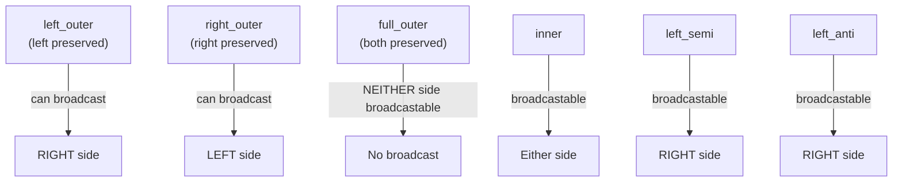

# Module 09 — Joins and Unions

> **Domain 3 of 7 — DataFrame/Dataset API (30%).**
> **Goal:** Master all join types, broadcast joins (and the **outer-join broadcast restriction** that's an exam favorite), multi-key joins, semi/anti joins, cross joins, and the `union` vs `unionByName` distinction. The exam guide explicitly lists "Combine DataFrames with operations such as Inner join, left join, broadcast join, multiple keys, cross join, union, and union all."

---

## Coverage map

Verbatim Oct 2025 exam objectives covered by this module:

| Objective (Section 3 — DataFrame/Dataset API, 30%) | Section |
|---|---|
| "Combine DataFrames with operations such as Inner join, left join, broadcast join, multiple keys, cross join, union, and union all." | [Join types](#join-types), [Multi-key joins](#multi-key-joins), [Cross joins](#cross-joins), [union vs unionByName](#union-vs-unionbyname-high-value-exam-trap) |
| "Describe the purpose and implementation of broadcast joins." | [Join strategies](#join-strategies--what-physical-plan-spark-picks), [Broadcast joins — the outer-join restriction](#broadcast-joins--the-outer-join-restriction-high-value-exam-trap) |
| "Describe different types of variables in Spark, including broadcast variables and accumulators." | [Broadcast variable vs broadcast join hint](#broadcast-variable-vs-broadcast-join-hint--same-name-different-things) |

---

> 🎯 **How to recognize this on the exam:**
> - If question mentions `union()` shuffle behavior → **NARROW** (concatenates partitions; no shuffle).
> - If question shows `union` with same columns in different order → **WRONG result** (matches by position). The correct API is `unionByName`.
> - If outer join + broadcast question → only the **NON-PRESERVED** side can be broadcast. Left outer = broadcast right; right outer = broadcast left; **full outer = NEITHER side broadcastable**.
> - If question asks "EXISTS" semantics → **`left_semi`** (returns left rows only; no row duplication).
> - If question asks "NOT EXISTS" → **`left_anti`**.
> - If question asks about default join type when `how` is omitted → **`inner`**.
> - If question uses `F.broadcast(df)` → it's a **hint** (not guarantee); Spark may ignore if too large.
> - If `sc.broadcast(value)` vs `F.broadcast(df)` appear → broadcast variable (Python value for UDFs) vs broadcast join hint (DataFrame for BHJ). Different mechanisms.
> - If question asks default broadcast threshold → **10 MB** (`spark.sql.autoBroadcastJoinThreshold`).

---

## Join types

```python
df1.join(df2, on, how)
```

`how` accepts:

| Value | Type | What it returns |
|---|---|---|
| `"inner"` (default) | Inner | Rows where keys match in both |
| `"left"` / `"left_outer"` | Left outer | All left rows + matching right (NULL where no match) |
| `"right"` / `"right_outer"` | Right outer | All right rows + matching left |
| `"outer"` / `"full"` / `"full_outer"` | Full outer | All rows from both sides; NULL where no match |
| `"left_semi"` / `"leftsemi"` | Left semi | Left rows that have a match in right (right columns NOT returned) |
| `"left_anti"` / `"leftanti"` | Left anti | Left rows with NO match in right (right columns NOT returned) |
| `"cross"` | Cartesian | All combinations |

⚠️ **Aliases:** `"leftsemi"` (one word) and `"left_semi"` (underscore) both work. Same for `"leftanti"`/`"left_anti"`.

### Examples

```python
# Inner join (default)
df1.join(df2, "user_id")
df1.join(df2, "user_id", "inner")
df1.join(df2, df1["user_id"] == df2["user_id"])

# Left outer
df1.join(df2, "user_id", "left")
df1.join(df2, on=["user_id", "date"], how="left")

# Right outer
df1.join(df2, "user_id", "right")

# Full outer
df1.join(df2, "user_id", "outer")
df1.join(df2, "user_id", "full")
df1.join(df2, "user_id", "full_outer")

# Left semi — "EXISTS"
df_customers_who_ordered = customers.join(orders, "customer_id", "left_semi")
# Returns customer columns only; one row per customer-that-ordered (no duplication)

# Left anti — "NOT EXISTS"
df_customers_no_orders = customers.join(orders, "customer_id", "left_anti")

# Cross join (explicit)
df1.crossJoin(df2)
df1.join(df2, how="cross")
```

---

## Join keys — three ways

### 1. Single column name (must exist in BOTH DataFrames)

```python
df1.join(df2, "user_id")             # uses df1.user_id = df2.user_id
df1.join(df2, "user_id", "left")
```

Result has **one `user_id` column** (the duplicate from `df2` is dropped).

### 2. List of column names

```python
df1.join(df2, ["user_id", "date"], "inner")
```

Joins on all listed columns being equal.

### 3. Column expression (most flexible)

```python
df1.join(df2, df1["user_id"] == df2["user_id"])
df1.join(df2, df1["a"] == df2["b"])                   # different names
df1.join(df2, (df1["k"] == df2["k"]) & (df1["d"] >= df2["d"]))   # multi-cond
df1.join(df2, F.col("a") == F.col("b"))               # unqualified — risky if both have these
```

When using expressions, **both** copies of the join column remain in the result (unless you `.drop` them).

⚠️ **`F.col("a")`** is ambiguous when both DataFrames have column `a`. Use `df1["a"]` and `df2["a"]` (or aliased DataFrames) for clarity.

---

## Aliasing DataFrames for clean joins

```python
e = employees.alias("e")
d = departments.alias("d")

result = (e.join(d, F.col("e.dept_id") == F.col("d.id"))
           .select("e.name", "e.salary", "d.name"))
```

Aliasing helps when both sides have same-named columns.

---

## Multi-key joins

```python
df1.join(df2, ["customer_id", "order_date"], "inner")

# Or with expressions
df1.join(df2,
    (df1["customer_id"] == df2["customer_id"]) &
    (df1["order_date"] == df2["order_date"]),
    "inner")
```

Equivalent. The list form is cleaner and avoids ambiguous column references.

---

## Semi and anti joins

### Left semi: "rows where a match exists"

```python
customers.join(orders, "customer_id", "left_semi")
```

Returns customers (with customer columns only) that have at least one matching row in orders. **Right columns are NOT in the result.** **No row duplication** — even if a customer has 10 orders, they appear once.

Equivalent SQL:
```sql
SELECT * FROM customers c WHERE EXISTS (
    SELECT 1 FROM orders o WHERE c.customer_id = o.customer_id
)
```

### Left anti: "rows where NO match exists"

```python
customers.join(orders, "customer_id", "left_anti")
```

Returns customers that have NO matching orders. **Right columns are NOT in the result.**

Equivalent SQL:
```sql
SELECT * FROM customers c WHERE NOT EXISTS (
    SELECT 1 FROM orders o WHERE c.customer_id = o.customer_id
)
```

⚠️ **Exam-testable:** semi/anti joins **never duplicate rows** from the left side. Different from inner joins, where one-to-many causes duplication.

---

## Cross joins

```python
df1.crossJoin(df2)                       # explicit method
df1.join(df2, how="cross")
```

Returns the Cartesian product. M × N rows. Almost never what you want unless you're generating combinations intentionally.

⚠️ **`spark.sql.crossJoin.enabled`** — in older Spark versions, this had to be set to `true` to allow cross joins. In Spark 3.5, cross joins are allowed by default with the explicit `.crossJoin()` or `how="cross"`.

---

## Join strategies — what physical plan Spark picks

There are four physical join strategies. The choice depends on data size, stats, and configuration.

### 1. Broadcast Hash Join (BHJ) — small + big

- Small side is **broadcast** to every executor.
- Large side is **NOT shuffled** — joined locally.
- Fastest when one side fits in memory.

**Trigger conditions:**
- Optimizer estimates one side ≤ `spark.sql.autoBroadcastJoinThreshold` (default **10 MB**).
- OR user calls `F.broadcast(df)` hint.
- OR (with AQE) runtime size proves small enough.

```python
from pyspark.sql.functions import broadcast

big = spark.table("events")           # 100 GB
small = spark.table("dim_users")      # 5 MB
result = big.join(broadcast(small), "user_id")
```

```sql
-- SQL hint equivalent
SELECT /*+ BROADCAST(dim_users) */ ... FROM events JOIN dim_users ON ...
```

⚠️ **`F.broadcast(df)` is a HINT, not a guarantee.** Spark may ignore it if:
- The DataFrame is larger than `spark.driver.maxResultSize`.
- Statistics suggest broadcasting would OOM.
- AQE later determines a different strategy is better.

### 2. Sort-Merge Join (SMJ) — big + big

- Both sides shuffled by the join key.
- Sorted within each partition.
- Merged via sort-merge algorithm.
- Default for two large sides.
- More memory-efficient than SHJ under skew (spills cleanly).

### 3. Shuffle Hash Join (SHJ) — niche

- Both sides shuffled by key.
- Smaller side has hash table built per partition.
- No sort.
- Preferred only when one side is meaningfully smaller per partition than the other but still too large to broadcast.
- Requires `spark.sql.join.preferSortMergeJoin = false`.

### 4. Broadcast Nested Loop Join (BNLJ) — non-equi join

- Used for non-equi joins (e.g., `BETWEEN`, `>`, `<`).
- O(N × M) — expensive.
- Almost always a sign of a bug (missing equi-join condition).

### 5. Cartesian Product

- No join condition.
- All combinations.
- Disabled by default unless `crossJoin.enabled = true` or explicit `crossJoin`.

---

## Broadcast joins — the outer-join restriction (HIGH-VALUE EXAM TRAP)

For outer joins, **only the non-preserved side can be broadcast.**



| Join type | Side(s) that can be broadcast |
|---|---|
| `inner` | Either |
| `left_outer` | **Right only** |
| `right_outer` | **Left only** |
| `full_outer` | **Neither** |
| `left_semi` | Right only |
| `left_anti` | Right only |
| `cross` | Smaller side |

### Why?

To produce a `left_outer` join's output, Spark needs **every row of the left side** plus matched rows on the right. If you broadcast the LEFT side, the matched right rows would be scattered across executors, and each executor only has partial left data — can't preserve left-side completeness without a shuffle.

If you broadcast the RIGHT side, every executor has the full right table; the left side scans locally → emit left row with matched right or NULL. Works.

For full outer, **both sides must be preserved**, so neither can be broadcast — both must be shuffled.

⚠️ **Exam-testable:** "For a full outer join, which side can be broadcast?" → **Neither.**

### Force vs ignore

```python
# Force broadcast (subject to hard limits)
big.join(broadcast(small), "k", "left")    # only the broadcast(side) is hinted

# Disable broadcast entirely (when BroadcastNestedLoopJoin is appearing)
spark.conf.set("spark.sql.autoBroadcastJoinThreshold", -1)
```

---

## Broadcast variable vs broadcast join hint — same name, different things

```python
sc = spark.sparkContext

# Broadcast VARIABLE — ships a Python value to executors
lookup_dict = {"A": 1, "B": 2}
bv = sc.broadcast(lookup_dict)
# Used inside UDFs via bv.value

# Broadcast JOIN hint — marks a DataFrame for broadcast hash join
big.join(F.broadcast(small_df), "k")
```

Both are "broadcasting" something to executors but **at different layers**:
- `sc.broadcast(value)` is a low-level read-only data distribution mechanism for use in UDFs.
- `F.broadcast(df)` is a query-plan hint for the join strategy.

⚠️ **Spark Connect has neither** — see Module 12.

---

## union vs unionByName (HIGH-VALUE EXAM TRAP)

```python
df1.union(df2)             # combines by POSITION
df1.unionAll(df2)          # alias for union (semantic same as SQL UNION ALL)
df1.unionByName(df2)       # combines by COLUMN NAME
df1.unionByName(df2, allowMissingColumns=True)   # Spark 3.1+
```

### union (by position) example

```python
df1 = spark.createDataFrame([(1, "a")], ["id", "name"])
df2 = spark.createDataFrame([("b", 2)], ["name", "id"])   # cols in different order

df1.union(df2).show()
# +----+----+
# | id |name|
# +----+----+
# |  1 |  a |   ← row from df1
# |  b |  2 |   ← row from df2 — id col gets "b" and name col gets 2 (BAD)
# +----+----+
```

**WRONG result** because `union` matches by position, not name.

### unionByName (by name) example

```python
df1.unionByName(df2).show()
# +----+----+
# | id |name|
# +----+----+
# |  1 |  a |
# |  2 |  b |   ← correctly matched
# +----+----+
```

### allowMissingColumns

```python
df1 = spark.createDataFrame([(1, "a")], ["id", "name"])
df2 = spark.createDataFrame([(2, "X", "b")], ["id", "tier", "name"])  # extra col

df1.unionByName(df2, allowMissingColumns=True).show()
# +----+----+----+
# | id |name|tier|
# +----+----+----+
# |  1 |  a |null|
# |  2 |  b | X  |
# +----+----+----+
```

Without `allowMissingColumns=True`, the union fails with a schema mismatch error.

### union is NARROW

⚠️ **`union` is a NARROW transformation** — it just concatenates partitions, no shuffle. People commonly think `union` shuffles because it "merges tables." It doesn't.

The resulting DataFrame has `partitions(df1) + partitions(df2)` total partitions.

```python
df1 = spark.range(0, 100).repartition(4)   # 4 partitions
df2 = spark.range(100, 200).repartition(6) # 6 partitions
df1.union(df2).rdd.getNumPartitions()      # → 10
```

### union does NOT deduplicate

`df1.union(df2)` returns ALL rows from both, including duplicates. This matches SQL's `UNION ALL`, NOT `UNION`.

To get SQL `UNION` semantics (distinct rows):

```python
df1.union(df2).distinct()                  # wide transform after the union
```

⚠️ **Exam trap:** `union` ≡ `unionAll` in PySpark. They are aliases. Neither deduplicates.

---

## intersect, except (a.k.a. subtract)

```python
df1.intersect(df2)               # rows in BOTH (SQL INTERSECT — deduplicated)
df1.intersectAll(df2)            # rows in both (preserving multiplicities)

df1.exceptAll(df2)               # rows in df1 not in df2 (preserves multiplicities)
df1.subtract(df2)                # rows in df1 not in df2 (deduplicated)
```

⚠️ **Both `intersect` and `subtract` are wide** (they involve shuffle/dedup).

⚠️ **`intersect` and `subtract` deduplicate; `intersectAll` and `exceptAll` do not.**

---

## Self-joins

```python
e = employees.alias("e")
m = employees.alias("m")
result = e.join(m, F.col("e.manager_id") == F.col("m.id"))
```

Self-joins **always need aliasing** to disambiguate column references.

---

## Joining on inequality / non-equi conditions

```python
events.join(intervals,
    (events["ts"] >= intervals["start"]) & (events["ts"] < intervals["end"])
)
```

This is **NOT an equi-join** — Spark uses **Broadcast Nested Loop Join** or **Cartesian Product** (with filter). O(N × M).

For ranges, the right approach is often:
- Discretize the range column (e.g., date buckets) and join on the bucket.
- Use Spark's `range_join` hint (Databricks-specific, NOT in OSS Spark for the exam).

---

## Join performance discipline

Patterns that reduce join cost (full coverage in Module 10):

1. **Filter before join.** Push predicates upstream to shrink inputs.
2. **Broadcast the smaller side.** If it fits in ~10-30 MB, broadcast.
3. **Avoid skewed join keys** (`null`, default values that 80% of rows have). Salt or pre-aggregate.
4. **Co-partition before join.** `df1.repartition("k").join(df2.repartition("k"), "k")` — though AQE can often do this automatically.
5. **Project before join.** Drop unneeded columns to reduce shuffle bytes.
6. **Avoid Python UDFs in join predicates** — they prevent predicate pushdown and Catalyst optimization.

---

## Worked example: multiple joins with broadcast

```python
from pyspark.sql.functions import broadcast

orders = spark.table("orders")              # 10 TB
customers = spark.table("customers")        # 50 MB  → broadcast
products = spark.table("products")          # 1 GB   → no broadcast
regions = spark.table("regions")            # 1 MB   → broadcast

result = (orders
    .join(broadcast(customers), "customer_id", "left")
    .join(products, "product_id", "left")          # shuffle this one
    .join(broadcast(regions), "region_id", "left")
    .filter(F.col("order_date") >= "2025-01-01")
    .select("order_id", "customer_name", "product_name", "region_name", "amount"))
```

This pattern — large fact joined to dimensions with broadcast hints — is the canonical star-schema join.

---

## Output-prediction drills

### Drill 1 — `union` column alignment

```python
df1 = spark.createDataFrame([(1, "alice")], ["id", "name"])
df2 = spark.createDataFrame([("bob", 2)], ["name", "id"])   # SWAPPED order

df1.union(df2).show()
df1.unionByName(df2).show()
```

**Q:** What rows appear in each result?

**A:**

`union(df2)` — by **position**:
```
+---+-----+
| id| name|
+---+-----+
|  1|alice|
|bob|    2|   ← WRONG: id=bob, name=2 (data swapped because columns aligned by position)
+---+-----+
```

`unionByName(df2)` — by **name**:
```
+---+-----+
| id| name|
+---+-----+
|  1|alice|
|  2|  bob|   ← correct
+---+-----+
```

This is the canonical `union` trap.

### Drill 2 — `union` partition count

```python
df1 = spark.range(0, 100).repartition(4)
df2 = spark.range(100, 200).repartition(6)
df1.union(df2).rdd.getNumPartitions()    # ?
```

**A:** **10** (4 + 6). `union` is narrow; it just concatenates partition lists. No shuffle to rebalance.

### Drill 3 — Left semi vs left anti row counts

```python
customers = spark.createDataFrame([(1,), (2,), (3,), (4,)], ["customer_id"])
orders = spark.createDataFrame([(1,), (1,), (2,), (2,), (2,)], ["customer_id"])

customers.join(orders, "customer_id", "left_semi").count()    # ?
customers.join(orders, "customer_id", "left_anti").count()    # ?
customers.join(orders, "customer_id", "inner").count()        # ?
customers.join(orders, "customer_id", "left").count()         # ?
```

**A:**
- `left_semi` → **2** (customers 1 and 2 each appear ONCE; no duplication despite 5 orders).
- `left_anti` → **2** (customers 3 and 4; no matches in orders).
- `inner` → **5** (1×2 orders for customer 1 + 1×3 orders for customer 2 — duplicates).
- `left` → **7** (5 inner rows + 2 left rows with NULL right side).

⚠️ `inner` and `left` duplicate left rows when right has multiple matches; semi/anti do not.

### Drill 4 — Broadcast outer-join restriction

```python
big = spark.read.parquet("big/")            # 100 GB
small = spark.read.parquet("small/")        # 5 MB

# For each, can Spark broadcast? Which side?
big.join(small, "k", "inner")               # ?
big.join(small, "k", "left")                # ?
big.join(small, "k", "right")               # ?
big.join(small, "k", "full")                # ?
big.join(small, "k", "left_semi")           # ?
big.join(small, "k", "left_anti")           # ?
```

**A:** (broadcastable side in parens)
- `inner` → either side; here `small` (5 MB < threshold).
- `left` (big preserved) → **right (small) only**. ✓
- `right` (small preserved) → **left (big) only**. ✗ (`big` too large to broadcast).
- `full` (both preserved) → **NEITHER**. Always SMJ.
- `left_semi` → **right only**. ✓
- `left_anti` → **right only**. ✓

If the question swaps positions and uses `small.join(big, "k", "left")`, then the left (small) is preserved, and the right (big) is the broadcast candidate — which won't broadcast because big is too large. Falls back to SMJ.

### Drill 5 — Default `how` parameter

```python
df1.join(df2, "id").count()              # what join type?
df1.join(df2, ["id", "date"]).count()    # what join type?
```

**A:** Both **inner** (default `how="inner"`).

### Drill 6 — Self-join column ambiguity

```python
emp = spark.createDataFrame([(1, 2, "alice"), (2, None, "bob")], ["id", "manager_id", "name"])

# Which works, which fails?
emp.join(emp, emp["id"] == emp["manager_id"]).show()    # A
emp.alias("e").join(emp.alias("m"), F.col("e.id") == F.col("m.manager_id")).show()  # B
```

**A:**
- **A FAILS** with `AnalysisException`: ambiguous column references (Spark can't tell which `id` is which).
- **B WORKS** because aliasing disambiguates.

Always alias for self-joins.

### Drill 7 — Cross-join row count

```python
df1 = spark.range(0, 100)
df2 = spark.range(0, 200)
df1.crossJoin(df2).count()    # ?
```

**A:** **20,000** (100 × 200). Cartesian product.

⚠️ For two TB-scale tables, this is catastrophic. Always verify before running.

### Drill 8 — `intersect` vs `intersectAll`

```python
df1 = spark.createDataFrame([(1,), (1,), (2,), (3,)], ["x"])
df2 = spark.createDataFrame([(1,), (1,), (1,), (2,)], ["x"])

df1.intersect(df2).count()       # ?
df1.intersectAll(df2).count()    # ?
df1.exceptAll(df2).count()       # ?
df1.subtract(df2).count()        # ?
```

**A:**
- `intersect` → **2** (distinct values present in both: 1, 2).
- `intersectAll` → **3** (min(2, 3) ones + min(1, 1) twos = 2 + 1 = 3).
- `exceptAll` → **1** (one value not in df2 — the `3`. Plus, df1 has 2 ones, df2 has 3 ones — df1 doesn't have extra ones).
- `subtract` → **1** (distinct values in df1 not in df2: just 3).

---

## Mini-quiz

1. What's the difference between `df1.union(df2)` and `df1.unionByName(df2)`?
2. Is `union` narrow or wide?
3. Does `union` deduplicate?
4. For a `left_outer` join, which side can be broadcast?
5. For a `full_outer` join, which side can be broadcast?
6. What does `left_semi` return?
7. Does `left_anti` return right-side columns?
8. What's the difference between `intersect` and `intersectAll`?
9. Which join strategy is the default for two large tables?
10. Is `F.broadcast(df)` a guarantee or a hint?

### Answers

1. **`union` matches by POSITION** (columns aligned by index). **`unionByName` matches by COLUMN NAME.** If schemas have same columns in different order, `union` produces incorrect results; `unionByName` is correct.
2. **NARROW** — concatenates partitions; no shuffle.
3. **No.** `union` ≡ `unionAll` — both keep duplicates. To dedup, chain `.distinct()`.
4. **The right (non-preserved) side.** Left side cannot be broadcast.
5. **Neither.** Both sides must be preserved; both must be shuffled.
6. **Left-side rows that have a match in right** — without right-side columns; without row duplication.
7. **No.** `left_anti` returns only left-side columns.
8. **`intersect` deduplicates** (SQL INTERSECT). **`intersectAll` preserves multiplicities.**
9. **Sort-Merge Join (SMJ).**
10. **A hint.** Spark may ignore it if size exceeds thresholds or driver memory limits.

---

## Exam-day cheat sheet

- **Join types:** `inner` (default), `left`/`left_outer`, `right`/`right_outer`, `outer`/`full`/`full_outer`, `left_semi`, `left_anti`, `cross`.
- **`union`** is NARROW; matches by POSITION; does NOT deduplicate.
- **`unionByName`** matches by NAME; `allowMissingColumns=True` for schema flexibility.
- **`union` ≡ `unionAll`** (PySpark aliases).
- **Broadcast outer-join restriction:** only the **non-preserved** side can be broadcast.
- **`full_outer` cannot broadcast** either side.
- **`F.broadcast(df)`** is a hint, not a guarantee.
- **`sc.broadcast(value)`** is a broadcast variable — different from `F.broadcast(df)`.
- **`left_semi`** ≈ EXISTS (no row duplication, left columns only).
- **`left_anti`** ≈ NOT EXISTS.
- **Self-joins need aliasing.**
- **`spark.sql.autoBroadcastJoinThreshold = 10 MB`** default; set to `-1` to disable.

Next: [Module 10 — Performance Tuning](10_performance_tuning.md).
