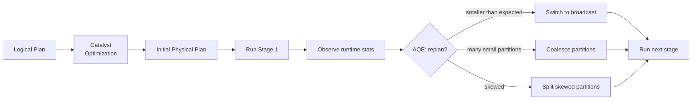
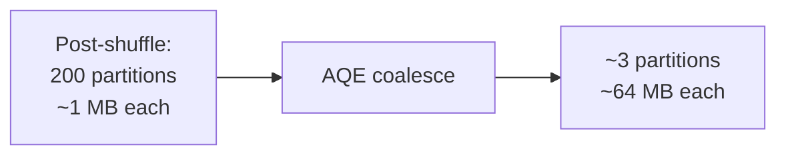
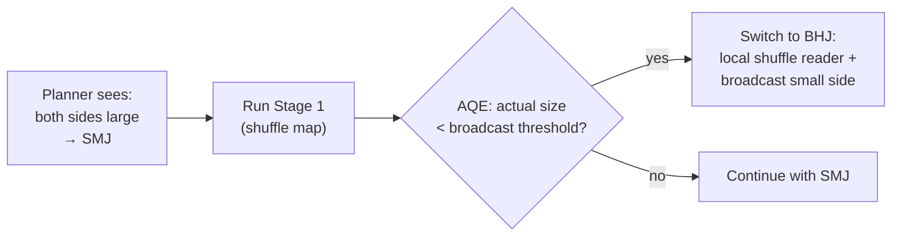
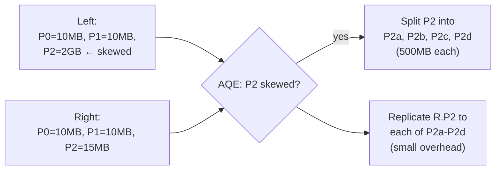

# Module 10 — Performance Tuning and Troubleshooting

> **Domain 4 of 7 — Troubleshooting and Tuning (10%).**
> **Goal:** Master AQE configuration (the **config-key trap** is a recurring exam topic), broadcast join thresholds, partition tuning (`repartition` vs `coalesce` vs `sortWithinPartitions`), cache/persist storage levels, skew handling (AQE skew join, salting), Spark UI diagnostics, and the executor-vs-driver log access pattern (sample Q2).

---

## Coverage map

Verbatim Oct 2025 exam objectives covered by this module:

| Objective (Section 4 — Troubleshooting & Tuning, 10%) | Section |
|---|---|
| "Implement performance tuning strategies & optimize cluster utilization, including partitioning, repartitioning, coalescing, identifying data skew, and reducing shuffling." | [Partition tuning](#partition-tuning), [Skew handling](#skew-handling) |
| "Describe Adaptive Query Execution (AQE) and its benefits." | [Adaptive Query Execution (AQE) — the master switch](#adaptive-query-execution-aqe--the-master-switch), [The three AQE pillars](#the-three-aqe-pillars) |
| "Perform logging and monitoring of Spark applications — publish, customize, and analyze Driver logs and Executor logs to diagnose out-of-memory errors, cluster underutilization, etc." | [Spark UI — diagnostic tabs](#spark-ui--diagnostic-tabs), [Accessing executor logs (sample Q2)](#accessing-executor-logs-sample-q2) |

---

> 🎯 **How to recognize this on the exam:**
> - If question asks "which config enables AQE" → **`spark.sql.adaptive.enabled`** (prefix is `spark.sql.adaptive.`, NOT `spark.adaptive.`).
> - If question mentions the broadcast threshold → default is **10 MB**, configured via `spark.sql.autoBroadcastJoinThreshold`.
> - If question asks about `cache()` default storage level → **`MEMORY_AND_DISK`** for DataFrames (NOT `MEMORY_ONLY` — that's the RDD default).
> - If question asks about `spark.sql.shuffle.partitions` → controls **post-shuffle** partition count (default 200), NOT read-side.
> - If question asks how to retrieve executor logs → **Spark UI → Executors tab → click executor → stderr/stdout** (NOT `spark-submit --verbose`).
> - If question asks about repartition vs coalesce → `repartition` = WIDE (full shuffle, can increase OR decrease); `coalesce` = NARROW (no shuffle, can ONLY decrease).
> - If question shows AQE skew config keys with two correct-looking options → all AQE configs start with `spark.sql.adaptive.` (e.g., `spark.sql.adaptive.skewJoin.enabled`).
> - If `.collect()` appears on a large DataFrame → driver OOM risk; the answer is usually `.show()` or `.take(n)` or write-to-storage.

---

## Why this module exists

Tuning is 10% of the exam (~5 questions) but it's **high-yield study territory**. The questions cluster around:

- **AQE config keys** — `spark.sql.adaptive.enabled` vs the bogus `spark.adaptive.enabled` distractor.
- **Broadcast thresholds** — `spark.sql.autoBroadcastJoinThreshold` (10 MB default).
- **`repartition` vs `coalesce`** — wide vs narrow, can increase vs only decrease.
- **Cache vs persist; storage levels** — DataFrame `.cache()` default is `MEMORY_AND_DISK` (not `MEMORY_ONLY`).
- **Spark UI navigation** — executor logs are in the Executors tab (sample Q2).
- **Skew handling** — AQE skew join, salting.

---

## Adaptive Query Execution (AQE) — the master switch

AQE is **enabled by default since Spark 3.2.** It enables three runtime optimizations:

1. **Coalesce post-shuffle partitions** — combine small partitions into ~64 MB chunks.
2. **Dynamically switch join strategies** — promote a planned SMJ to BHJ if runtime sees small enough data.
3. **Skew join handling** — split skewed partitions into smaller subpartitions.



### The config-key trap (HIGH-VALUE)

| Correct | Trap (incorrect) |
|---|---|
| `spark.sql.adaptive.enabled` | `spark.adaptive.enabled` ← does NOT exist |
| `spark.sql.adaptive.coalescePartitions.enabled` | `spark.sql.coalescePartitions.enabled` ← wrong |
| `spark.sql.adaptive.skewJoin.enabled` | `spark.sql.skewJoin.enabled` ← wrong |

**Memorize: all AQE configs start with `spark.sql.adaptive.`**

### Full config table

| Config | Default | What it does |
|---|---|---|
| `spark.sql.adaptive.enabled` | `true` (since 3.2) | Master AQE switch |
| `spark.sql.adaptive.coalescePartitions.enabled` | `true` | Coalesce small partitions post-shuffle |
| `spark.sql.adaptive.coalescePartitions.initialPartitionNum` | `spark.sql.shuffle.partitions` (200) | Initial partition count before coalesce |
| `spark.sql.adaptive.coalescePartitions.minPartitionSize` | `1MB` | Min size after coalesce |
| `spark.sql.adaptive.advisoryPartitionSizeInBytes` | **64 MB** | Target partition size after coalesce |
| `spark.sql.adaptive.skewJoin.enabled` | `true` | Auto-split skewed join partitions |
| `spark.sql.adaptive.skewJoin.skewedPartitionFactor` | `5` | Partition is skewed if size > factor × median |
| `spark.sql.adaptive.skewJoin.skewedPartitionThresholdInBytes` | **256 MB** | AND size > this threshold |
| `spark.sql.adaptive.autoBroadcastJoinThreshold` | (not set; falls back to non-AQE threshold) | AQE runtime broadcast threshold |
| `spark.sql.autoBroadcastJoinThreshold` | **10 MB** | Planner-time broadcast threshold |
| `spark.sql.adaptive.localShuffleReader.enabled` | `true` | Use local reader when AQE demotes SMJ to BHJ |

---

## The three AQE pillars

### 1. Coalesce shuffle partitions

After a wide transformation, Spark may produce many small partitions (e.g., 200 partitions averaging 1 MB each is wasteful).



AQE merges adjacent small partitions to target `advisoryPartitionSizeInBytes` (default 64 MB).

**Implication:** you can safely set `spark.sql.shuffle.partitions=1000` (or higher) for large jobs without worrying about overhead — AQE will coalesce down. Old advice was to tune shuffle partitions for the largest stage; AQE makes this less necessary.

### 2. Switch join strategy at runtime



If the planner's size estimate was off (stale stats, post-filter shrinkage), AQE catches it and switches.

### 3. Skew join handling

AQE detects skew when both:
- `partition_size > skewedPartitionFactor (5) × median_partition_size`
- `partition_size > skewedPartitionThresholdInBytes (256 MB)`

Skewed partitions are **split into smaller subpartitions** and the matching partition on the other side is **replicated** to each subpartition.



The 5× factor and 256 MB threshold can be tuned but defaults are usually fine.

---

## Broadcast join thresholds

| Setting | Default | When |
|---|---|---|
| `spark.sql.autoBroadcastJoinThreshold` | **10 MB** | Optimizer time: if one side's estimate ≤ this, plan as BHJ |
| `spark.sql.adaptive.autoBroadcastJoinThreshold` | (unset; defaults to above) | AQE runtime: replan based on actual size |

```python
# Increase planner-time threshold
spark.conf.set("spark.sql.autoBroadcastJoinThreshold", "100MB")

# Disable broadcast entirely (when BNLJ keeps appearing)
spark.conf.set("spark.sql.autoBroadcastJoinThreshold", "-1")
```

⚠️ **Sample question: "How do you broadcast a 50 MB DataFrame?"**
- Set `spark.sql.autoBroadcastJoinThreshold` to ≥ 50 MB, OR
- Use `F.broadcast(df)` hint.

⚠️ **The hint alone isn't enough** if the DataFrame's *estimated* size exceeds the threshold. You may need to raise the threshold too.

---

## Partition tuning

### Reading partitioning

When you read files, the number of partitions depends on:

| Config | Default | What it does |
|---|---|---|
| `spark.sql.files.maxPartitionBytes` | **128 MB** | Target partition size at read |
| `spark.sql.files.openCostInBytes` | **4 MB** | Per-file overhead estimate |
| `spark.default.parallelism` | (cluster-dependent) | Used for unstructured reads |

To increase parallelism on read:
```python
spark.conf.set("spark.sql.files.maxPartitionBytes", "64MB")  # smaller partitions → more tasks
```

### Shuffle partitioning

| Config | Default |
|---|---|
| `spark.sql.shuffle.partitions` | **200** |

⚠️ With AQE enabled, this is the **initial** count; AQE coalesces it down to ~64 MB per partition.

For very large jobs, set higher (e.g., 1000–4000) and let AQE coalesce.

### repartition vs coalesce — refresh

| | `df.repartition(n)` | `df.coalesce(n)` |
|---|---|---|
| Shuffle? | **Yes (full shuffle)** | **No (combines on same executor)** |
| Can increase partitions? | Yes | No (only decrease) |
| Balanced output? | Yes (round-robin) | No (depends on input layout) |
| Use case | Increase parallelism; fix skew | Reduce file count before write |

```python
df.repartition(400)               # exactly 400 balanced partitions (shuffle)
df.repartition("country")         # hash partition by country
df.repartition(50, "country")     # hash partition by country into 50 partitions
df.coalesce(10)                   # combine to 10 partitions (no shuffle)
df.sortWithinPartitions("ts")     # sort each partition (NARROW)
```

### When to coalesce

- Writing a small DataFrame to fewer files (`df.coalesce(1).write...`).
- After aggressive filtering that left many empty/small partitions.

### When to repartition

- Need balanced partitions after skewed input.
- Pre-partition before a join on a specific key (`df.repartition("user_id")`).
- Increase parallelism (more, smaller tasks).

---

## Cache vs persist — and the storage-level trap

```python
df.cache()                                       # MEMORY_AND_DISK (default for DataFrame)
df.persist()                                     # same as cache()
df.persist(StorageLevel.MEMORY_ONLY)
df.persist(StorageLevel.DISK_ONLY)
df.persist(StorageLevel.MEMORY_AND_DISK_SER)
df.persist(StorageLevel.OFF_HEAP)
df.unpersist()                                   # remove from cache
df.unpersist(blocking=True)                      # wait until removed
```

### Storage levels

| Level | Memory | Disk | Serialized | Replicated |
|---|---|---|---|---|
| `MEMORY_ONLY` | ✓ | ✗ | ✗ | ✗ |
| **`MEMORY_AND_DISK` ← `df.cache()` default** | ✓ | ✓ | ✗ | ✗ |
| `MEMORY_ONLY_SER` | ✓ | ✗ | ✓ | ✗ |
| `MEMORY_AND_DISK_SER` | ✓ | ✓ | ✓ | ✗ |
| `DISK_ONLY` | ✗ | ✓ | (always) | ✗ |
| `*_2` variants | — | — | — | ✓ (2 nodes) |
| `OFF_HEAP` | off-heap | ✗ | ✓ | ✗ |

### The cache-default trap (HIGH-VALUE)

| | RDD `.cache()` | DataFrame `.cache()` |
|---|---|---|
| Default level | `MEMORY_ONLY` | **`MEMORY_AND_DISK`** |

The defaults are **asymmetric**. Many candidates assume RDD knowledge transfers; it doesn't.

⚠️ **Why?** DataFrames are columnar and benefit from disk overflow; RDDs are row-based and were historically about pure memory speed.

### Caching is LAZY

```python
df = df.cache()        # marked for caching; NO computation
df.count()             # first action: triggers computation AND caches
df.count()             # second action: reads from cache (fast)
```

If you want to **force** caching, call any action immediately after `cache()`:

```python
df = df.cache()
df.count()             # materialize cache
```

### When NOT to cache

- One-shot DataFrames (used in only one action) — caching adds overhead without benefit.
- Very large DataFrames that don't fit in memory — spilling to disk may be slower than re-reading from source.
- After heavy filtering — Spark may skip work via predicate pushdown, making the cache redundant.

### Uncaching

```python
df.unpersist()                                  # remove from cache (async)
spark.catalog.uncacheTable("table_name")        # by table name
spark.catalog.clearCache()                      # clear ALL cached DataFrames
```

⚠️ **Cached DataFrames consume memory** until uncached or until the executor's storage memory is reclaimed by execution memory. Heavy caching → OOM risk.

---

## Skew handling

### Detecting skew

In the Spark UI Stages tab, look at the **task duration distribution histogram**:
- Healthy: roughly uniform.
- Skewed: long tail — a few tasks 10× slower than median.

Or look at **shuffle read size per task**:
- Healthy: bytes per task roughly equal.
- Skewed: one or two tasks pulling 10× more bytes.

### Fix 1: AQE skew join (default)

`spark.sql.adaptive.skewJoin.enabled = true` (default).

AQE automatically splits skewed partitions and replicates the matching partition on the other side. Works for SMJ and SHJ.

**Limitations:**
- Doesn't fire for partitions smaller than 256 MB (even if relatively skewed).
- Doesn't work in stream-stream joins.

### Fix 2: Salting (manual)

When AQE skew handling doesn't catch the skew (e.g., the absolute size is below threshold but it's still causing tail latency):

```python
from pyspark.sql import functions as F

NUM_SALTS = 50

# Salt the skewed side
left_salted = (df_large
    .withColumn("salt", (F.rand() * NUM_SALTS).cast("int"))
    .withColumn("k_salted", F.concat_ws("-", F.col("k"), F.col("salt")))
)

# Replicate the small side N times so every salt has a match
right_salted = (df_small
    .withColumn("salt", F.explode(F.array([F.lit(i) for i in range(NUM_SALTS)])))
    .withColumn("k_salted", F.concat_ws("-", F.col("k"), F.col("salt")))
)

joined = (left_salted.join(right_salted, "k_salted")
                     .drop("k_salted", "salt"))
```

The cost is an N× explosion of the small side. Pick `NUM_SALTS` to balance shuffle reduction vs small-side inflation.

### Fix 3: Broadcast the non-skewed side

If one side is small enough to broadcast, do it — broadcast joins don't shuffle the large side, sidestepping skew entirely.

### Fix 4: Filter the hot key separately

If the skew is from a few known keys (e.g., `NULL`, `0`, default sentinel values):

```python
# Split into hot and cold
hot_keys = ["NULL", "0", "unknown"]
df_cold = df.filter(~F.col("k").isin(hot_keys))
df_hot = df.filter(F.col("k").isin(hot_keys))

# Join each separately, then union
result_cold = df_cold.join(other, "k")
result_hot = df_hot.join(broadcast(other), "k")   # broadcast for the hot one
result = result_cold.unionByName(result_hot)
```

---

## Predicate pushdown

Spark pushes filter predicates down to:
- **File scans** — Parquet/ORC readers use min/max statistics to skip files entirely.
- **JDBC scans** — `WHERE` clauses pushed into the database query.

```python
df = spark.read.parquet("path")
df.filter(F.col("year") == 2025).explain()
# FileScan parquet [...] PushedFilters: [IsNotNull(year), EqualTo(year,2025)]
```

If `year` is a partition column, **partition pruning** eliminates entire partitions at planning time.

### What blocks pushdown?

- Python UDFs in the filter expression (`df.filter(my_udf(F.col("x")))`) — opaque to Catalyst.
- Complex expressions that can't be reduced to simple comparisons.
- Some derived columns (e.g., a filter on `F.col("year").cast("string")` might not push).

### Projection pruning

Spark only reads columns referenced in the query:

```python
spark.read.parquet("path").select("a", "b").explain()
# FileScan parquet [a, b] (only 2 columns scanned, ignoring others)
```

---

## File format choice

| Format | Splittable | Columnar | Pushdown | Compression | Use case |
|---|---|---|---|---|---|
| **Parquet** | ✓ | ✓ | ✓ | snappy default | Default for analytics |
| **ORC** | ✓ | ✓ | ✓ | snappy default | Hive-native; similar to Parquet |
| **Delta** | ✓ | ✓ | ✓ | snappy default | Lakehouse (only readable on this exam) |
| **Avro** | ✓ | ✗ (row-based) | limited | snappy default | Row-based; schema evolution |
| **JSON** | ✓ (line-delim) | ✗ | limited | none default | Semi-structured |
| **CSV** | ✓ | ✗ | none | none default | Last resort |
| **Text** | ✓ | ✗ | none | none default | Logs |

⚠️ **Parquet for analytics, period.** CSV/JSON are 5-10× slower at scale.

---

## Bucketing for joins

When two tables are bucketed identically on the join key, the join can avoid shuffle:

```python
# Both tables bucketed by user_id into 100 buckets
df_a = spark.table("events_bucketed")     # bucketed by user_id, N=100
df_b = spark.table("users_bucketed")      # bucketed by user_id, N=100
df_a.join(df_b, "user_id")                # NO shuffle (co-located buckets)
```

Requires:
- Both tables bucketed (via `saveAsTable` with `bucketBy`).
- Same bucket count.
- Same bucket column(s).
- `spark.sql.sources.bucketing.enabled = true` (default).

⚠️ **Exam-testable as a concept** — you won't be asked to write bucketing code but you should recognize "bucketing avoids shuffle for joins on the bucket key."

---

## Spark UI — diagnostic tabs

| Tab | Use case |
|---|---|
| **Jobs** | Job-level timing, failures, DAG visualization |
| **Stages** | Task duration distribution (skew detection), shuffle read/write, spill |
| **Storage** | Cached RDDs/DataFrames, memory vs disk usage |
| **Environment** | Spark config (effective values) |
| **Executors** | Per-executor RAM, GC time, **stderr/stdout LOGS**, task counts |
| **SQL/DataFrame** | Query plan graph, AQE annotations, broadcast vs SMJ decisions |
| **Streaming** | Per-query rates, batch durations (when streaming query active) |

### Accessing executor logs (sample Q2)

⚠️ **The official sample Q2** asks: "How should the engineer retrieve Executor logs to diagnose performance issues?"

**Correct answer:** Navigate to **Spark UI → Executors tab → click the executor ID → choose stderr or stdout**.

**Wrong answers** (typical distractors):
- "Use `spark-submit --verbose`" — NO. That logs the SUBMITTER side.
- "Print from the driver" — NO. Driver logs are different.
- "Check the system log on each worker" — possible but not the canonical path.

The Spark UI Executors tab is the single canonical place.

---

## Diagnostic loop

For "this job is slow" scenarios:

1. **SQL/DataFrame tab** → query plan.
   - Is the join strategy what you expected? (BHJ vs SMJ vs SHJ)
   - Is data skipping firing? (PushedFilters)
   - Are AQE annotations showing? (coalesce, skew split)

2. **Stages tab** → slow stage.
   - Task duration histogram: long tail = skew.
   - Shuffle Read/Write sizes: shuffling more than expected?
   - Spill metrics: memory pressure?

3. **Executors tab**.
   - GC time > 20% = memory pressure.
   - Failed tasks pattern = node-level issue.

4. **Storage tab** (if caching used).
   - Did the cache evict?

---

## Common symptoms → causes → fixes

| Symptom | Cause | Fix |
|---|---|---|
| Single long-running task in a stage | Data skew | Enable AQE skew join; salt; broadcast non-skewed side |
| Executor OOM | Too few partitions, large groupBy, big cache | Repartition; increase memory; unpersist |
| Driver OOM | `.collect()` too much data | Use `.show()`, `.take(n)`, or write to storage |
| Many small output files | Too many partitions before write | `coalesce(N)` before write |
| Long shuffle read/write | Too much data shuffled, skew | Filter earlier; broadcast joins; partition pruning |
| Slow read on filtered table | No pushdown | Check filter expression; ensure partition column |
| GC pause > 30% of task time | Memory pressure, cached data too big | Serialize cache; smaller executors; less caching |
| Repeated stage retries | Spot preemption, network issues | Use on-demand instances; check executor logs |

---

## .collect() and driver OOM

```python
df.collect()                                  # WHOLE DataFrame to driver — risky
df.toPandas()                                 # WHOLE DataFrame to pandas — risky

df.limit(1000).collect()                      # safe
df.show(20)                                   # safe
df.take(10)                                   # safe
df.write...save()                             # safe (executor-side write)
```

Driver memory: `spark.driver.memory` (default 1 GB on local; 1-2 GB typical on cluster).
Max result size: `spark.driver.maxResultSize` (default 1 GB).

If `collect()` exceeds `maxResultSize`, the job fails with a clear error before the driver OOMs.

⚠️ **Exam framing:** "What happens when you call `.collect()` on a large DataFrame?" → driver-side OOM risk; the result must fit in driver heap.

---

## Streaming-specific tuning (preview — Module 11)

- **Watermarks** bound state size; without them, streaming aggregations and `dropDuplicates` grow state unboundedly.
- **`maxOffsetsPerTrigger`** (Kafka) caps per-batch read size.
- **`trigger(availableNow=True)`** processes all available data in micro-batches and stops — useful for periodic batch-style streaming.

---

## AQE configs — the memorization table

When the exam asks "which config does X", the answer is almost always one of these. Memorize the full prefixes:

| Config (exact) | Default | Purpose |
|---|---|---|
| `spark.sql.adaptive.enabled` | `true` | Master AQE switch |
| `spark.sql.adaptive.coalescePartitions.enabled` | `true` | Coalesce post-shuffle small partitions |
| `spark.sql.adaptive.coalescePartitions.minPartitionSize` | `1MB` | Smallest allowed partition after coalesce |
| `spark.sql.adaptive.advisoryPartitionSizeInBytes` | `64MB` | Target post-coalesce size |
| `spark.sql.adaptive.skewJoin.enabled` | `true` | Auto-split skewed partitions |
| `spark.sql.adaptive.skewJoin.skewedPartitionFactor` | `5` | Skew = >5× median |
| `spark.sql.adaptive.skewJoin.skewedPartitionThresholdInBytes` | `256MB` | Skew also requires >256MB |
| `spark.sql.adaptive.localShuffleReader.enabled` | `true` | Use local reader on demoted SMJ→BHJ |
| `spark.sql.autoBroadcastJoinThreshold` | `10MB` | Planner-time broadcast threshold |
| `spark.sql.adaptive.autoBroadcastJoinThreshold` | (unset; falls back) | Runtime broadcast threshold (AQE) |
| `spark.sql.shuffle.partitions` | `200` | Post-shuffle partition count |
| `spark.sql.files.maxPartitionBytes` | `128MB` | Read-side target partition size |
| `spark.sql.files.openCostInBytes` | `4MB` | Per-file overhead estimate (file packing) |

**Distractor traps to recognize:**
- `spark.adaptive.enabled` ← **WRONG** (missing `.sql.`)
- `spark.sql.aqe.enabled` ← **WRONG** (no `aqe` segment)
- `spark.sql.coalescePartitions.enabled` ← **WRONG** (missing `.adaptive.`)
- `spark.sql.optimizer.adaptive` ← **WRONG** (does not exist)

---

## Output-prediction drills

### Drill 1 — repartition vs coalesce partition count

```python
df = spark.range(0, 1000).repartition(20)   # 20 partitions

df.repartition(50).rdd.getNumPartitions()    # ?
df.repartition(5).rdd.getNumPartitions()     # ?
df.coalesce(50).rdd.getNumPartitions()       # ?
df.coalesce(5).rdd.getNumPartitions()        # ?
df.coalesce(1).rdd.getNumPartitions()        # ?
```

**A:**
- `repartition(50)` → **50** (can increase; full shuffle).
- `repartition(5)` → **5** (can decrease; full shuffle).
- `coalesce(50)` → **20** (cannot INCREASE; stays at 20).
- `coalesce(5)` → **5**.
- `coalesce(1)` → **1**.

⚠️ Coalesce silently does nothing when n > current count.

### Drill 2 — Cache storage level

```python
df.cache()
df.persist(StorageLevel.MEMORY_ONLY)
df.persist(StorageLevel.DISK_ONLY)
```

**Q:** What storage level does each call use?

**A:**
- `df.cache()` → **`MEMORY_AND_DISK`** (DataFrame default; NOT MEMORY_ONLY).
- `df.persist(StorageLevel.MEMORY_ONLY)` → MEMORY_ONLY explicitly.
- `df.persist(StorageLevel.DISK_ONLY)` → DISK_ONLY (and always serialized).

⚠️ The trap is `cache()` for DataFrames vs RDDs:

| | RDD `.cache()` | DataFrame `.cache()` |
|---|---|---|
| Default | `MEMORY_ONLY` | **`MEMORY_AND_DISK`** |

### Drill 3 — Broadcast threshold behavior

```python
spark.conf.set("spark.sql.autoBroadcastJoinThreshold", "5MB")

big = spark.read.parquet("big/")    # 100 GB, estimated
small_4mb = spark.table("dim_4mb")  # 4 MB
small_20mb = spark.table("dim_20mb")  # 20 MB

big.join(small_4mb, "k").explain()    # join strategy?
big.join(small_20mb, "k").explain()   # join strategy?
big.join(F.broadcast(small_20mb), "k").explain()  # join strategy?
```

**A:**
- `big.join(small_4mb, "k")` → **BroadcastHashJoin** (4 MB < 5 MB threshold).
- `big.join(small_20mb, "k")` → **SortMergeJoin** (20 MB > 5 MB threshold; planner won't broadcast).
- `big.join(F.broadcast(small_20mb), "k")` → **BroadcastHashJoin** (hint overrides threshold; subject to `spark.driver.maxResultSize` hard limit).

⚠️ The hint **overrides the threshold** but is subject to driver memory limits. If `small_20mb` exceeds `spark.driver.maxResultSize` (1GB default), the broadcast fails.

### Drill 4 — `spark.sql.shuffle.partitions` interpretation

```python
spark.conf.set("spark.sql.shuffle.partitions", "50")

df = spark.read.parquet("100_files_128MB_each/")  # how many partitions?
df2 = df.groupBy("k").count()                      # how many partitions?
df3 = df2.repartition(10)                          # how many partitions?
```

**A:** (Assume AQE disabled for clarity)
- `df` → **~100** (read-side, controlled by `spark.sql.files.maxPartitionBytes=128MB`).
- `df2` → **50** (post-shuffle, controlled by `spark.sql.shuffle.partitions=50`).
- `df3` → **10** (explicit repartition).

The 50 setting **does NOT** affect the read. Common exam trap.

### Drill 5 — `.collect()` vs `.show()` vs `.take()`

```python
df = spark.read.parquet("10TB/")
df.collect()       # ?
df.show(5)         # ?
df.take(10)        # ?
df.toPandas()      # ?
df.write.parquet("out/")  # ?
```

**Q:** Which of these will likely OOM the driver?

**A:**
- `df.collect()` → **OOM** (pulls all rows to driver heap).
- `df.show(5)` → safe (driver receives at most 5 rows).
- `df.take(10)` → safe (10 rows).
- `df.toPandas()` → **OOM** (collects all rows + pandas materialization).
- `df.write.parquet()` → safe (write is distributed; driver only coordinates).

If `df.collect()` exceeds `spark.driver.maxResultSize` (default 1GB), the job fails with a clear error **before** OOM.

### Drill 6 — Skew threshold check

```
Spark UI Stages tab shows partition sizes (MB):
  P0: 50
  P1: 55
  P2: 48
  P3: 60
  P4: 1200    ← suspicious
  P5: 52
```

**Q:** Will AQE skew join split P4? Median = 52 MB. Factor default 5.

**A:** **No.** AQE skew detection requires BOTH conditions:
1. `partition_size > 5 × median` → 1200 > 5 × 52 = 260 ✓
2. `partition_size > 256 MB` (default `skewedPartitionThresholdInBytes`) → 1200 > 256 ✓

**Yes**, AQE will split P4. If the threshold were set to 2 GB, AQE would not fire even though the relative skew is large.

### Drill 7 — `repartition("col")` partition count

```python
df = spark.range(0, 100).repartition(10)
df.repartition("id").rdd.getNumPartitions()       # ?
df.repartition(5, "id").rdd.getNumPartitions()    # ?
```

**A:**
- `df.repartition("id")` → **200** (hash partition by id; uses `spark.sql.shuffle.partitions=200` as the bucket count by default).
- `df.repartition(5, "id")` → **5** (hash partition into exactly 5 buckets).

⚠️ Default partition count for `repartition(col)` is `spark.sql.shuffle.partitions`, not the source count.

---

## Mini-quiz

1. What is the default value of `spark.sql.autoBroadcastJoinThreshold`?
2. Is `spark.sql.adaptive.enabled` true or false by default in Spark 3.5?
3. What's the difference between `repartition(50)` and `coalesce(50)`?
4. What's the default storage level for DataFrame `.cache()`?
5. How do you uncache all cached DataFrames?
6. AQE detects skew when both conditions hold — what are they?
7. What's wrong with `df.union(other).distinct()` for getting unique rows?
8. Where in the Spark UI do you find executor stderr?
9. Why is `df.collect()` risky?
10. Name the three AQE pillars.

### Answers

1. **10 MB.**
2. **`true`** (since Spark 3.2).
3. `repartition(50)` is a **full shuffle** producing balanced partitions. `coalesce(50)` is **narrow**, combining partitions on the same executor; can only decrease.
4. **`MEMORY_AND_DISK`**. (RDD `.cache()` defaults to `MEMORY_ONLY` — different!)
5. **`spark.catalog.clearCache()`**.
6. **(1)** Partition size > `5 × median_partition_size` AND **(2)** Partition size > 256 MB.
7. Nothing technically wrong with the result, but `distinct()` is a **wide transformation** that adds a shuffle. If the goal is just to remove cross-source duplicates and you're OK with `union`'s narrow behavior, it's the price of correctness. The trap is people thinking `union` already deduplicates (it doesn't — `union` ≡ `unionAll`).
8. **Executors tab → click executor ID → stderr.**
9. It materializes the **entire DataFrame in driver heap** → driver OOM risk on large data.
10. **(1)** Coalesce shuffle partitions; **(2)** Switch join strategy at runtime; **(3)** Skew join handling.

---

## Exam-day cheat sheet

- **AQE configs all start with `spark.sql.adaptive.`** ⚠️
- **`spark.sql.adaptive.enabled = true` since 3.2.**
- **Three AQE pillars: coalesce, switch join, skew handling.**
- **`spark.sql.autoBroadcastJoinThreshold = 10 MB` default.**
- **`spark.sql.shuffle.partitions = 200` default.**
- **`spark.sql.files.maxPartitionBytes = 128 MB` (read).**
- **`spark.sql.adaptive.advisoryPartitionSizeInBytes = 64 MB` (post-coalesce target).**
- **`repartition` is WIDE; `coalesce` is NARROW.**
- **DataFrame `.cache()` default: `MEMORY_AND_DISK`.** (RDD: `MEMORY_ONLY`.)
- **Skew thresholds: 5× median AND > 256 MB.**
- **Executor logs: Spark UI → Executors tab → stderr/stdout.** ⚠️
- **`.collect()` on large DF → driver OOM.**
- **Broadcast outer-join: only the non-preserved side.**

Next: [Module 11 — Structured Streaming](11_structured_streaming.md).
