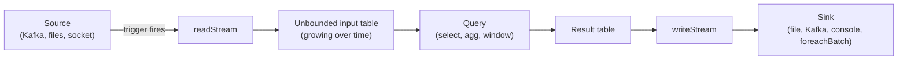
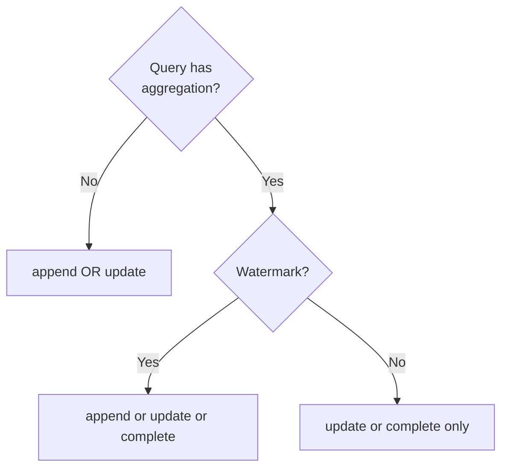

# Module 11 — Structured Streaming

> **Domain 5 of 7 — Structured Streaming (10% — NEW DOMAIN).**
> **Goal:** Master `readStream`/`writeStream`, triggers, output modes, watermarks, checkpointing, exactly-once semantics, and streaming deduplication. This is a brand-new domain in the relaunched exam — even senior PySpark engineers commonly need a fresh read.

---

## Coverage map

Verbatim Oct 2025 exam objectives covered by this module:

| Objective (Section 5 — Structured Streaming, 10%) | Section |
|---|---|
| "Explain the Structured Streaming engine in Spark, including its functions, programming model, micro-batch processing, exactly-once semantics, and fault tolerance mechanisms." | [The programming model](#the-programming-model), [Exactly-once semantics](#exactly-once-semantics), [Checkpointing — fault tolerance](#checkpointing--fault-tolerance) |
| "Create and write Streaming DataFrames and Streaming Datasets, including the basic output modes and output sinks." | [readStream — reading a stream](#readstream--reading-a-stream), [writeStream — writing a stream](#writestream--writing-a-stream), [Output modes](#output-modes), [Sinks](#sinks) |
| "Perform basic operations on Streaming DataFrames and Streaming Datasets, such as selection, projection, window and aggregation." | [Windows in streaming](#windows-in-streaming), [Streaming basic operations](#streaming-basic-operations) |
| "Perform Streaming Deduplication in Structured Streaming, both with and without watermark usage." | [Streaming deduplication](#streaming-deduplication) |

---

> 🎯 **How to recognize this on the exam:**
> - "Output mode for streaming aggregation, want entire result table" → **`complete`** (only valid for aggregations).
> - "Append mode for aggregation" → requires a **watermark**.
> - "Output modes spelling" → `append`, `update`, `complete`. NOT `full`.
> - "Process all available data then stop" → `trigger(availableNow=True)` (preferred over deprecated `once=True`).
> - "Exactly-once requires:" → **(1)** replayable source (Kafka, file, Delta), **(2)** idempotent sink, **(3)** checkpoint location.
> - "Checkpoint storage" → **reliable storage** (HDFS, S3, ADLS). NOT local disk on a single machine.
> - "Streaming dedup without watermark" → **state grows unbounded**. Use watermark with column included in dedup subset.
> - "File source for streaming?" → requires **explicit schema** (Spark can't infer).
> - "Why streaming over batch?" → **incremental computation** — only processes new data per micro-batch. Sample Q9.
> - "Stream-stream join requirements" → **watermarks on both sides + time-bound join condition**.
> - "Custom sink logic per micro-batch" → `foreachBatch(fn)` — receives a regular DataFrame.

---

## Why this module exists

10% of the exam (~5 questions) on streaming. The exam guide objectives:

- Explain the Structured Streaming engine — programming model, micro-batch processing, exactly-once semantics, fault tolerance.
- Create and write streaming DataFrames/Datasets with basic output modes and sinks.
- Perform basic operations on streaming DataFrames — selection, projection, window, aggregation.
- Streaming deduplication with and without watermarks.

These are conceptual + light-code. You won't be asked to debug a Kafka topology, but you will be asked "which output mode is valid for streaming aggregations?" (complete or update; append only with watermark).

---

## The programming model

> **Treat a stream as an unbounded table.** A streaming query is the same as a batch query — Spark continuously updates the result table as new data arrives.



The same DataFrame API works for batch and streaming — Spark handles the incremental computation under the hood.

### Micro-batch processing

By default, Structured Streaming uses **micro-batch** processing:
- New data is buffered.
- Periodically (per trigger), Spark runs a batch query on the accumulated new data.
- Each micro-batch is a small Spark job.

**Continuous processing** (experimental) processes records one at a time with sub-millisecond latency, but has limited operator support.

⚠️ **The exam treats Spark Structured Streaming as micro-batch.** Don't mention continuous mode unless directly asked.

---

## readStream — reading a stream

```python
# From files (each new file = new data)
stream = (spark.readStream
          .format("parquet")
          .schema(my_schema)            # required for file source!
          .option("path", "input_dir/")
          .load())

# From Kafka
stream = (spark.readStream
          .format("kafka")
          .option("kafka.bootstrap.servers", "host:9092")
          .option("subscribe", "my_topic")
          .option("startingOffsets", "earliest")
          .load())

# From rate source (testing — generates rows at a fixed rate)
stream = (spark.readStream
          .format("rate")
          .option("rowsPerSecond", 10)
          .load())

# From socket (testing — netcat input)
stream = (spark.readStream
          .format("socket")
          .option("host", "localhost")
          .option("port", 9999)
          .load())
```

⚠️ **File source REQUIRES an explicit schema** — Spark can't infer from streaming inputs.

### Available sources

| Source | Production-ready | Notes |
|---|---|---|
| **Kafka** | ✓ | Replayable, exactly-once with transactions |
| **File source** | ✓ | Reads new files in a directory (Parquet, JSON, CSV, ORC) |
| **Delta** | ✓ | Each commit = new data; replayable via _delta_log |
| **Kinesis** | ✓ | External package |
| **Socket** | ✗ | Testing only — no fault tolerance |
| **Rate** | ✗ | Testing only — generates timestamped rows |

### isStreaming property

```python
stream.isStreaming        # True for streaming DataFrames
```

Useful for code paths that handle both batch and stream.

---

## writeStream — writing a stream

```python
query = (stream
    .writeStream
    .format("parquet")
    .option("path", "output_dir/")
    .option("checkpointLocation", "checkpoints/")
    .outputMode("append")
    .trigger(processingTime="10 seconds")
    .start())
```

`start()` returns a **`StreamingQuery`** object — a handle to the running query.

### Streaming query control

```python
query.id                  # unique UUID
query.runId               # current run UUID
query.name                # optional name
query.isActive            # True while running
query.lastProgress        # last micro-batch's metrics
query.recentProgress      # last 100 micro-batch metrics
query.exception()         # exception if failed; None if running
query.awaitTermination(timeout=60)   # block until done or timeout
query.stop()              # graceful stop
query.processAllAvailable()  # process all data, then return
```

---

## Triggers

The trigger controls **when** a micro-batch runs.

```python
.trigger(processingTime="10 seconds")    # every 10 seconds
.trigger(availableNow=True)              # process all available, then stop
.trigger(once=True)                      # process available once (DEPRECATED in 3.5)
.trigger(continuous="1 second")          # continuous mode (experimental)
# No trigger specified = process as fast as possible
```

| Trigger | Behavior |
|---|---|
| Default (no trigger) | Process micro-batch as fast as possible; start next when previous completes |
| `processingTime="10 seconds"` | Fire micro-batch every 10s; if previous still running, skip |
| `availableNow=True` | Process all currently-available data in MULTIPLE micro-batches, then stop. Like `once` but handles backlogs better |
| `once=True` | **Deprecated in 3.5** — use `availableNow` instead. Same as old behavior: one batch then stop |
| `continuous="1 second"` | Continuous mode; checkpoint interval = 1s. Experimental |

⚠️ **The exam currently lists `once` as a valid trigger** because exam content was solidified before the 3.5 deprecation took effect at runtime. Know both: **`availableNow` is current best practice**; `once` is deprecated but still functional.

---

## Output modes

Output mode controls **what** gets written each micro-batch.

| Mode | What's written | Valid for |
|---|---|---|
| **`append`** (default) | Only **new** rows added since last trigger | Queries WITHOUT aggregations, OR aggregations WITH watermark |
| **`update`** | Only rows that **changed** in the result table since last trigger | Most aggregations, non-aggregation queries that update rows |
| **`complete`** | The **entire** result table | Aggregations ONLY |

### Decision tree



### Append mode — append-only

- No state.
- Once written, rows are immutable.
- Works for transformations like `filter`, `select`, `withColumn`.
- For aggregations: rows are emitted only when watermark advances past the window end.

### Update mode

- For non-aggregation: same as append.
- For aggregations: emits rows that have CHANGED in this micro-batch.

### Complete mode

- Only valid for queries that return a **finite** result (i.e., aggregations).
- Emits the entire result table every micro-batch.
- Each micro-batch OVERWRITES the sink.
- Useful for small dashboards.

⚠️ **Common exam question:** "Why can't you use complete mode without aggregation?" — Because the result table would be the entire input, which is unbounded.

⚠️ **Common exam question:** "What's needed to use append mode with an aggregation?" — A watermark, so Spark knows when a window is "closed" and can be safely emitted.

---

## Watermarks

A **watermark** declares: "data older than (max_event_time − threshold) is allowed to be dropped."

```python
stream_with_wm = (stream
    .withWatermark("event_time", "10 minutes")
    .groupBy(F.window("event_time", "5 minutes"), "user_id")
    .count()
)
```

### What watermarks do

1. **Bound state size.** Without a watermark, state for aggregations grows unboundedly.
2. **Enable append mode for aggregations.** Spark can emit a window's result once the watermark has passed the window's end.
3. **Allow safe drop of late data.** Records older than the watermark are silently dropped.

### Watermark mechanics

For each micro-batch:
1. Spark observes the maximum `event_time` seen so far.
2. The watermark = max_event_time − threshold.
3. Any record with `event_time < watermark` is **late** and dropped (or sent to a special path if configured).
4. Windows that ended before the watermark can be emitted (in append mode) and their state purged.

### Example

Suppose your watermark threshold is 10 minutes, and max event_time seen is 10:30 AM. Watermark = 10:20 AM.

- A record with `event_time = 10:25 AM` arrives → accepted, processed.
- A record with `event_time = 10:15 AM` arrives → too late, dropped.

### Multiple watermark policy

If a streaming query has multiple watermarks (e.g., stream-stream join), the **global watermark = min of all stream watermarks** by default. Config: `spark.sql.streaming.multipleWatermarkPolicy = "min"` (default) or `"max"`.

⚠️ **Important:** the "min" policy means the slowest stream sets the bar. This is safe but can cause state to grow if one stream lags far behind.

---

## Windows in streaming

```python
# Tumbling window (5-minute, non-overlapping)
stream.groupBy(F.window("event_time", "5 minutes")).count()

# Sliding window (5-minute window, sliding every 1 minute)
stream.groupBy(F.window("event_time", "5 minutes", "1 minute")).count()

# Session window (Spark 3.2+)
stream.groupBy(F.session_window("event_time", "5 minutes"), "user_id").count()
```

The `F.window` function returns a struct `{start, end}` representing the window boundaries.

---

## Streaming deduplication

```python
# Without watermark — state grows UNBOUNDED
stream.dropDuplicates(["event_id"])

# With watermark — state bounded
stream.withWatermark("event_time", "10 minutes") \
      .dropDuplicates(["event_id", "event_time"])
```

⚠️ **The watermark column must be in the dedup subset** — Spark uses the watermark to time out old IDs.

Without a watermark, every distinct `event_id` is remembered forever — state grows linearly with traffic.

---

## Checkpointing — fault tolerance

```python
query = stream.writeStream \
    .option("checkpointLocation", "/path/to/checkpoint") \
    .start()
```

**Required for fault-tolerant queries.** Stores:
- **Offsets log** — last processed offsets per source (so restart resumes from where it left off).
- **Commit log** — confirmed completed batches.
- **State store snapshots** — aggregation state, dedup state, watermarks.

Restart behavior: when the query is restarted with the same checkpoint location, it resumes from the last completed batch.

⚠️ **Each streaming query MUST have a unique checkpoint location.** Sharing a checkpoint between queries corrupts state.

### Checkpoint dir requirements

- **Reliable storage**: HDFS, S3, ADLS, GCS. Local disk on a single machine won't survive restarts.
- **Read-write access** for the Spark application.
- **Never delete it** while the query is running.

---

## Exactly-once semantics

Spark Structured Streaming provides **exactly-once** delivery guarantees when:

1. **Source is replayable** — Kafka, file source, Delta (offsets/positions are tracked).
2. **Sink is idempotent** — Delta, Kafka with transactions, foreachBatch with idempotent writes.
3. **Checkpoint** location is set.

Without (1) and (2), Spark falls back to at-least-once (sources without replay) or at-most-once (sinks without idempotence).

⚠️ **Exam framing:** "What three things are required for exactly-once semantics?" → replayable source, idempotent sink, checkpoint.

---

## Sinks

```python
# File sink (Parquet, JSON, CSV, ORC, Delta)
.format("parquet").option("path", "out/")

# Kafka sink
.format("kafka")
.option("kafka.bootstrap.servers", "...")
.option("topic", "out_topic")

# Console (dev only, no fault tolerance)
.format("console")

# Memory (dev only)
.format("memory").queryName("in_memory_view")
# Then: spark.sql("SELECT * FROM in_memory_view")

# foreachBatch — custom logic per micro-batch
def write_to_db(batch_df, batch_id):
    batch_df.write.jdbc(...)

stream.writeStream.foreachBatch(write_to_db).start()

# foreach — row-level (rare)
stream.writeStream.foreach(MyRowWriter()).start()
```

### foreachBatch — the escape hatch

`foreachBatch(fn)` gives you the micro-batch as a regular DataFrame in your callback. Use it for:
- Writing to arbitrary sinks (e.g., a third-party database).
- Implementing exactly-once writes to non-transactional sinks (via idempotent upserts).
- Performing multiple writes per micro-batch.

```python
def upsert_to_delta(batch_df, batch_id):
    # MERGE INTO delta_target USING batch_df ...
    pass

stream.writeStream.foreachBatch(upsert_to_delta).start()
```

⚠️ **`foreachBatch` is called once per micro-batch.** The `batch_df` parameter is a regular (non-streaming) DataFrame — you can apply any batch operation.

---

## Stateful operations

Streaming aggregations, deduplication, and joins maintain **state** between micro-batches:
- Aggregations: per-group counters/sums/etc.
- Dedup: seen IDs.
- Stream-stream join: buffered events from both streams.

State is stored in a **state store** on executors and **checkpointed** to durable storage.

### State store configs

- `spark.sql.streaming.stateStore.providerClass` — provider implementation (default: RocksDB on Databricks; HDFS-based on OSS).
- `spark.sql.streaming.stateStore.minDeltasForSnapshot` — snapshot frequency.

State store performance matters for high-throughput streaming. Not deeply exam-tested.

---

## Stream-static joins

A streaming DataFrame joined with a static (batch) DataFrame:

```python
events_stream = spark.readStream.format("kafka").load()
dim_users = spark.table("dim_users")               # static, batch

joined = events_stream.join(dim_users, "user_id")
```

- **No watermark needed** on the static side.
- The static side is **broadcast** if small enough, or **shuffled** with each micro-batch otherwise.
- The static side is **re-read** at each micro-batch if it changes (depends on source).

---

## Stream-stream joins

Joining two streams requires:

```python
# Both streams have watermarks
left_wm = left_stream.withWatermark("left_ts", "10 minutes")
right_wm = right_stream.withWatermark("right_ts", "10 minutes")

# Time-bound join condition
joined = left_wm.join(
    right_wm,
    F.expr("""
        left_key = right_key AND
        left_ts BETWEEN right_ts - INTERVAL 5 MINUTES AND right_ts + INTERVAL 5 MINUTES
    """),
    "inner"
)
```

Requirements:
- **Watermarks on BOTH sides** — otherwise state is unbounded.
- **Time-bound join condition** (e.g., `BETWEEN`) — otherwise state is unbounded.
- Output mode restricted to **`append`** for aggregations after the join.

⚠️ **Exam framing:** "What's needed for stream-stream joins?" → watermarks on both sides + time-bound condition.

---

## Streaming basic operations

```python
# Filter / select (NO state)
stream.filter(F.col("user_id") > 100).select("event_type", "ts")

# Window aggregation (STATEFUL)
stream.withWatermark("event_time", "10 minutes") \
      .groupBy(F.window("event_time", "5 minutes"), "user_id") \
      .agg(F.count("*").alias("n"), F.sum("amount").alias("total"))

# Deduplication
stream.withWatermark("event_time", "10 minutes") \
      .dropDuplicates(["event_id", "event_time"])
```

⚠️ **Some batch operations are NOT supported in streaming:**
- Multiple aggregations in one query (e.g., `groupBy(a).count()` then `groupBy(b).count()`).
- Limit/take/show outside of `foreachBatch` (limit must be in append-once context).
- `distinct()` without watermark (use `dropDuplicates` with watermark).
- Some join types (full outer streaming join — restricted).

For unsupported operations, use `foreachBatch` to run them on each micro-batch as a batch query.

---

## Monitoring streaming queries

```python
query = stream.writeStream.format("parquet")...start()

# Wait for query to terminate
query.awaitTermination()

# Get progress
query.lastProgress
# {
#   "id": "...",
#   "runId": "...",
#   "name": null,
#   "timestamp": "2026-05-23T10:00:00Z",
#   "batchId": 42,
#   "numInputRows": 1000,
#   "inputRowsPerSecond": 100.0,
#   "processedRowsPerSecond": 95.0,
#   "durationMs": {...},
#   "stateOperators": [...],
#   ...
# }

# Get all recent progress
query.recentProgress
```

### Spark UI — Streaming tab

When a streaming query is active, the Spark UI shows a Streaming tab with:
- Input rate vs processing rate (catching up or falling behind).
- Batch duration distribution.
- State store metrics.
- Per-source/sink metrics.

---

## Common streaming pitfalls

| Pitfall | Fix |
|---|---|
| Streaming aggregation without watermark, append mode | Add `withWatermark` |
| Two streaming queries share checkpoint dir | Each query needs its own |
| Checkpoint dir on local disk | Move to HDFS/S3 |
| Driver runs out of memory tracking state | Add watermarks; increase driver memory |
| Source replays from beginning after restart | Verify checkpoint dir is intact; verify `startingOffsets` doesn't force "earliest" |
| Dedup state grows unbounded | Add watermark; include watermark column in dedup subset |
| `complete` mode used without aggregation | Switch to `append` or `update` |

---

## Worked example: end-to-end Kafka → Parquet

```python
from pyspark.sql import functions as F
from pyspark.sql.types import StructType, StructField, StringType, LongType, DoubleType, TimestampType

schema = StructType([
    StructField("user_id", LongType()),
    StructField("event_type", StringType()),
    StructField("amount", DoubleType()),
    StructField("event_time", TimestampType()),
])

# Read from Kafka
raw = (spark.readStream
    .format("kafka")
    .option("kafka.bootstrap.servers", "broker:9092")
    .option("subscribe", "events")
    .option("startingOffsets", "latest")
    .load())

# Parse JSON value, apply watermark, aggregate
parsed = raw.select(
    F.from_json(F.col("value").cast("string"), schema).alias("data")
).select("data.*")

agg = (parsed
    .withWatermark("event_time", "10 minutes")
    .groupBy(F.window("event_time", "5 minutes"), "event_type")
    .agg(F.sum("amount").alias("total_amount"), F.count("*").alias("n")))

# Write to Parquet
query = (agg.writeStream
    .format("parquet")
    .option("path", "/data/agg_output/")
    .option("checkpointLocation", "/checkpoints/agg_query/")
    .outputMode("append")    # valid with watermark
    .trigger(processingTime="1 minute")
    .start())

query.awaitTermination()
```

---

## Mini-quiz

1. What's the difference between `append` and `complete` output modes?
2. Can you use `append` mode with an aggregation?
3. What's the purpose of a watermark?
4. Is `trigger(once=True)` current best practice in Spark 3.5?
5. What's required for exactly-once streaming?
6. What's the difference between stream-static and stream-stream joins?
7. Why must streaming dedup include the watermark column?
8. What happens if two streaming queries share a checkpoint location?
9. Is the file source for streaming schema-on-read?
10. Name the three required components for fault-tolerant streaming.

### Answers

1. **`append`** writes only new rows (no updates to past rows). **`complete`** writes the entire result table every micro-batch — only valid for aggregations.
2. **Yes, but only with a watermark.** Without a watermark, append mode for aggregations is rejected because Spark can't determine when a window is "done."
3. Bound the state size (purge old groups/IDs); enable append mode for aggregations; allow safe drop of late data.
4. **No** — `trigger(once=True)` is deprecated in 3.5. Use `trigger(availableNow=True)` instead. (Both still work, but `availableNow` handles backlogs better.)
5. **Replayable source + idempotent sink + checkpoint location.**
6. **Stream-static** joins a streaming DataFrame with a static (batch) DataFrame — no watermark on the static side. **Stream-stream** joins two streaming DataFrames — requires watermarks on both sides + a time-bound condition.
7. The watermark column is what Spark uses to time out and purge old IDs from state. Without it in the dedup subset, state grows unbounded.
8. **State corruption.** Each streaming query must have a unique checkpoint location.
9. **No.** File source for streaming **requires** an explicit schema. Spark cannot infer schemas in streaming context.
10. **(1)** Replayable source, **(2)** Idempotent sink, **(3)** Checkpoint location.

---

## Exam-day cheat sheet

- **Programming model:** unbounded table; incremental computation.
- **Triggers:** default (ASAP), `processingTime="..."`, `availableNow=True` (current), `once=True` (deprecated).
- **Output modes:** `append` (no agg or watermark+agg), `update` (changed rows), `complete` (whole table; agg only).
- **Watermark** purpose: bound state, enable append mode for agg, drop late data.
- **Checkpoint location is REQUIRED** for fault tolerance.
- **Exactly-once requires:** replayable source + idempotent sink + checkpoint.
- **Stream-stream joins need:** watermarks on both sides + time-bound condition.
- **Streaming dedup needs:** watermark column in subset.
- **File source streaming REQUIRES schema** — no inference.
- **`foreachBatch`** = run batch ops per micro-batch (custom sinks, multi-writes).
- **Spark Structured Streaming is MICRO-BATCH by default** (continuous mode is experimental).

Next: [Module 12 — Spark Connect](12_spark_connect.md).
