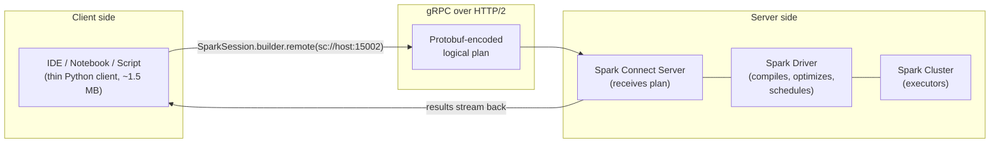

# Module 12 — Spark Connect

> **Domain 6 of 7 — Spark Connect & Deployment (5% — NEW DOMAIN).**
> **Goal:** Master Spark Connect's client-server architecture, the `sc://` URI scheme, the `.remote()` builder, and the **restrictions** (no RDD, no SparkContext, no broadcast variables, no accumulators). Plus the deployment modes (client/cluster/local) — local mode = single worker is sample Q7.

---

## Coverage map

Verbatim Oct 2025 exam objectives covered by this module:

| Objective (Section 6 — Spark Connect & Deployment, 5%) | Section |
|---|---|
| "Describe the features of Spark Connect." | [What is Spark Connect?](#what-is-spark-connect), [Benefits](#benefits), [Architecture: gRPC + Protobuf](#architecture-grpc--protobuf), [Restrictions](#restrictions--what-spark-connect-clients-cannot-do-high-value) |
| "Describe the different deployment mode types (Client, Cluster, Local) in the Apache Spark environment." | [Deployment modes (HIGH-VALUE — sample Q7)](#deployment-modes-high-value--sample-q7), [Distinguishing the three](#distinguishing-the-three) |

---

> 🎯 **How to recognize this on the exam:**
> - "URI scheme for Spark Connect" → **`sc://`** (e.g., `sc://host:15002`).
> - "Default Spark Connect port" → **15002**.
> - "Protocol" → **gRPC** over HTTP/2, Protobuf messages.
> - "What is NOT available in Spark Connect?" → RDD API (`df.rdd`), SparkContext, `sc.broadcast`, `sc.accumulator`, JVM access.
> - "What IS available?" → DataFrame/SQL API, `spark.sql`, `pyspark.pandas`, `pandas_udf`, Structured Streaming.
> - "GA versions" → Python in **Spark 3.4**, Scala in **Spark 3.5**, Go in development.
> - "Client size" → **~1.5 MB** (vs ~355 MB for full PySpark).
> - "Which deployment mode runs all executors on a single worker node?" → **Local mode**. Sample Q7.
> - "Standalone" as a deployment-mode answer → **WRONG** (Standalone is a cluster manager, not a deployment mode).
> - "Client vs Cluster mode" → driver location: client = submitting machine; cluster = a worker node.
> - "Local mode master string" → `"local[N]"` or `"local[*]"`.
> - "`F.broadcast(df)` in Connect" → **works** (it's a join hint, not a broadcast variable).

---

## Why this module exists

Brand-new domain in the relaunched exam (2 of 45 questions). Senior PySpark engineers typically have zero hands-on with Spark Connect — but the exam content is conceptual and can be mastered in ~1 hour of focused study. Both questions usually fall in two flavors:

1. **"What is Spark Connect?"** (architecture, gRPC, thin client)
2. **"Which deployment mode runs all executors on a single worker node?"** (local mode — sample Q7)

---

## What is Spark Connect?



**Spark Connect** is a client-server architecture for Spark, introduced GA in Spark 3.4 (Python client; Scala client GA in 3.5; Go in development).

- The **client** is a **thin Python library** (~1.5 MB) that builds DataFrame plans and serializes them as Protobuf messages over gRPC.
- The **server** receives the plan, materializes it via a real Spark driver, and streams results back.
- The client and server are **decoupled**: client crashes don't kill the driver; client and server versions can be different (within compatibility range).

---

## How to use it

```python
from pyspark.sql import SparkSession

spark = (SparkSession.builder
         .remote("sc://hostname:15002")
         .getOrCreate())

df = spark.read.parquet("s3://my-bucket/data/")
df.show()
```

The **`.remote(uri)`** builder is the entry point. URI scheme: **`sc://`**. Default port: **`15002`**.

Once you have the `spark` session, the **API is identical** to regular PySpark — `spark.read`, `spark.sql`, DataFrame methods, etc.

### Environment variable alternative

```bash
export SPARK_REMOTE="sc://hostname:15002"
```

Then in Python:

```python
spark = SparkSession.builder.getOrCreate()    # picks up SPARK_REMOTE
```

---

## Benefits

| Benefit | Why |
|---|---|
| **Lightweight client (~1.5 MB)** | Full PySpark is ~355 MB; great for embedded use, edge devices, serverless functions |
| **Decoupled lifecycle** | Client crashes don't kill the driver; driver crashes return a clear error to the client |
| **IDE-friendly** | Connect from PyCharm, VS Code, Jupyter without setting up a local Spark installation |
| **Multi-language** | Python, Scala (3.5+), Go (in dev), more clients possible |
| **Mismatched versions tolerated** | Client at 3.5.0 can connect to a 3.5.2 server (within supported range) |
| **Multi-user shared driver** | One Spark Connect server can serve many concurrent users (each with their own session ID) |
| **Stable client API** | Connect uses Protobuf; the wire format is versioned and backward-compatible |

---

## Architecture: gRPC + Protobuf

Spark Connect uses **gRPC** (Google's RPC framework over HTTP/2) with **Protocol Buffers** (Protobuf) as the message format.

Client sends a **logical plan** as a serialized Protobuf message:

```
SparkConnectPlanRequest {
  client_id: "...",
  session_id: "...",
  plan: {
    op: SQL,
    sql_query: "SELECT * FROM events WHERE year=2025"
  }
}
```

Server compiles the plan into a Spark execution, runs it, and streams the result rows back as Arrow-encoded batches.

⚠️ **Exam framing:** "What protocol does Spark Connect use?" → **gRPC**. Not REST, not custom TCP — gRPC over HTTP/2.

---

## Restrictions — what Spark Connect clients CANNOT do (HIGH-VALUE)

Because the client is thin and stateless, several Spark APIs are **not available**:

| Not supported | Why |
|---|---|
| **RDD API** (`df.rdd`, `sc.parallelize`, `sc.textFile`) | RDDs require direct JVM access; client has no JVM |
| **`SparkContext`** (`spark.sparkContext`) | Returns `None` in Connect mode |
| **Broadcast variables** (`sc.broadcast(value)`) | No `SparkContext` |
| **Accumulators** (`sc.accumulator(0)`) | No `SparkContext` |
| **JVM access** (`spark._jvm`, `spark._sc._jvm`) | No JVM on client |
| **`SQLContext` and `HiveContext`** | Use `SparkSession.sql()` instead |
| **Some `Catalog` operations** | Limited subset available |
| **`PipelinedRDD` and lower-level RDD operations** | Same as RDD |
| **`getOrCreate` for a local SparkSession when remote is set** | Conflict; remote wins |

### What IS supported

- The full **DataFrame/SQL API** — `read`, `write`, `select`, `filter`, `join`, `groupBy`, `agg`, etc.
- **Spark SQL** via `spark.sql(...)`.
- **Pandas API on Spark** (`pyspark.pandas`) — works over Connect.
- **`pandas_udf`** — vectorized UDFs work; they're sent as serialized Python to the server.
- **Structured Streaming** — `readStream`, `writeStream`, query handles.
- **MLflow integration** (with some adjustments).

⚠️ **Exam framing:** "Which is NOT supported in Spark Connect?" → likely **RDD API** or **`sc.broadcast(...)`** or **`spark.sparkContext`**.

---

## Deployment modes (HIGH-VALUE — sample Q7)

Three deployment modes — independent of Spark Connect, but covered in the same exam domain:

| Mode | Driver location | Executor location | Use case |
|---|---|---|---|
| **Client mode** | On the **submitting machine** (your laptop, edge node) | On the cluster | Interactive — notebooks, REPL |
| **Cluster mode** | On a **worker node** in the cluster (allocated by cluster manager) | On other worker nodes | Production batch jobs |
| **Local mode** | In a **single JVM** on the local machine | **All executors run as threads in the SAME JVM** ← single "worker node" | Dev, testing, unit tests |

### Sample Q7 — the local-mode trap

The official sample asks: **"Which Apache Spark deployment mode requires all executors to run on a single worker node?"**

**Answer: Local mode.**

In local mode:
- There IS a "driver" and there ARE "executors" — but they're all **threads in one JVM** on one machine.
- Specified via `spark.master = "local[N]"` where N is the number of threads (or `"local[*]"` for all cores).
- No cluster manager involved.

The exam phrases it as "single worker node" because the single machine acts as the worker.

```python
spark = (SparkSession.builder
         .appName("test")
         .master("local[4]")
         .getOrCreate())
```

### Distinguishing the three

```python
# Local mode — single JVM
.master("local[*]")

# Client mode — driver on local, executors on cluster
.master("yarn")                    # or "spark://...", "k8s://..."
# (and submit with --deploy-mode client, or no flag)

# Cluster mode — driver also on cluster
.master("yarn")
# (and submit with --deploy-mode cluster)
```

For `spark-submit`:
```bash
spark-submit --master yarn --deploy-mode client myjob.py
spark-submit --master yarn --deploy-mode cluster myjob.py
```

---

## Connect vs deployment mode — orthogonal concepts

Spark Connect is a **client-server protocol**, not a deployment mode. The server itself can run in client, cluster, or local mode.

Think of it like:

| Layer | Examples |
|---|---|
| **Cluster manager** | Standalone, YARN, K8s, Mesos (deprecated) |
| **Deployment mode** | Client, Cluster, Local |
| **Client-server protocol** | Spark Connect (new) vs Classic (driver in-process or via Py4J) |

You can mix: Spark Connect server running on a Kubernetes cluster in cluster mode.

---

## Migration patterns: classic PySpark → Spark Connect

Most DataFrame/SQL code "just works":

```python
# Both work in Connect and classic
df = spark.read.parquet("path")
df.filter(F.col("x") > 0).groupBy("k").count().show()
spark.sql("SELECT * FROM events WHERE year = 2025").show()
```

Code that requires **rewriting** for Connect:

```python
# Classic — uses RDD
rdd = sc.parallelize([1, 2, 3])
df = spark.createDataFrame(rdd, "value INT")

# Connect-compatible — direct DataFrame
df = spark.createDataFrame([(1,), (2,), (3,)], "value INT")
```

```python
# Classic — uses broadcast variable
lookup = sc.broadcast({"A": 1, "B": 2})

@udf("int")
def get_value(k):
    return lookup.value.get(k, -1)

# Connect-compatible — broadcast DataFrame instead
lookup_df = spark.createDataFrame([("A", 1), ("B", 2)], "k STRING, v INT")
result = df.join(F.broadcast(lookup_df), "k")
```

---

## Performance and limitations

### Latency

Spark Connect adds **some** network latency vs a co-located classic driver:
- Plan serialization: ~ms.
- gRPC roundtrip: ~10-100ms depending on distance.
- Result streaming: Arrow batches over gRPC.

For interactive queries, the overhead is negligible. For high-frequency tiny queries, you'd notice.

### Concurrency

A single Spark Connect server can serve **many concurrent sessions** — each client gets a session ID, and sessions are isolated (catalog, temp views, configs).

### Authentication and TLS

Production Spark Connect typically uses:
- TLS (`grpc.ssl_target_name_override`, certs).
- Authentication via token (header in gRPC metadata).

Not directly exam-tested, but you should know "Spark Connect supports secure connections."

---

## Sample-style questions

### "Describe the Spark Connect architecture"

Spark Connect uses a **client-server** architecture where a thin client (~1.5 MB) sends DataFrame/SQL plans as **Protobuf messages over gRPC** to a Spark Connect server, which runs the actual Spark driver. Benefits: decoupled lifecycle, multi-language clients, lightweight footprint, IDE-friendly remote development.

### "What's the URI scheme to connect to a Spark Connect server?"

**`sc://`** — e.g., `sc://hostname:15002`.

### "Which API is NOT available when using Spark Connect?"

**RDD API** (and `SparkContext`-based APIs like `sc.broadcast`, `sc.accumulator`).

### "Which deployment mode requires all executors to run on a single worker node?"

**Local mode.** All executors run as threads in a single JVM.

### "What protocol does Spark Connect use?"

**gRPC** (over HTTP/2), with Protocol Buffers as the message format.

---

## Configuration cheatsheet

### Starting a Spark Connect server (server side)

```bash
$SPARK_HOME/sbin/start-connect-server.sh \
  --master spark://my-master:7077 \
  --conf spark.connect.grpc.binding.port=15002 \
  --conf spark.connect.grpc.binding.address=0.0.0.0
```

### Connecting from a client

```python
spark = SparkSession.builder.remote("sc://my-server:15002").getOrCreate()
```

### Behavioral differences in client

- `spark.sparkContext` → `None`.
- `df.rdd` → raises an error.
- `sc.broadcast(...)` → unavailable.
- `spark._jvm` → unavailable.
- `df.toPandas()` → returns a pandas DataFrame via Arrow stream (works).

---

## Mini-quiz

1. What's the URI scheme for Spark Connect?
2. What protocol does Spark Connect use?
3. Is `spark.sparkContext` available in a Connect client?
4. Can you use `sc.broadcast(value)` over Spark Connect?
5. Which deployment mode runs all executors on a single worker node?
6. What's the typical size of the Spark Connect Python client?
7. When was the Python Spark Connect client GA?
8. Can the Spark Connect client and server be different versions?
9. Does pandas_udf work over Spark Connect?
10. Does `df.rdd` work over Spark Connect?

### Answers

1. **`sc://`** (e.g., `sc://hostname:15002`).
2. **gRPC** (over HTTP/2), with Protocol Buffers as the message format.
3. **No.** It returns `None`. Spark Connect clients have no JVM access.
4. **No.** Broadcast variables require `SparkContext`, which is unavailable in Connect. Use `F.broadcast(small_df)` for join broadcasting, or rewrite to avoid broadcast variables.
5. **Local mode.** All executors are threads in a single JVM.
6. **~1.5 MB** (vs ~355 MB for full PySpark).
7. **Spark 3.4** (Python). Scala client GA in 3.5.
8. **Yes** — within a supported compatibility range. The Protobuf protocol is versioned.
9. **Yes.** Pandas UDFs work in Connect — they're shipped as serialized Python to the server, which executes them as usual.
10. **No.** RDD API is unavailable in Connect clients.

---

## Exam-day cheat sheet

- **Spark Connect: client-server, gRPC, Protobuf, `sc://` URI.**
- **Client = ~1.5 MB; server runs the actual Spark driver.**
- **GA in Spark 3.4 (Python); Scala in 3.5; Go in development.**
- **NOT available in Connect:** RDD API, SparkContext, `sc.broadcast`, `sc.accumulator`, JVM access.
- **Available in Connect:** DataFrame/SQL API, Spark SQL, `pyspark.pandas`, `pandas_udf`, Structured Streaming.
- **Deployment modes:** Client (driver on submitter), Cluster (driver on worker), Local (all in single JVM).
- **Local mode = all executors on single worker node** ⚠️ (sample Q7).
- **`SparkSession.builder.remote("sc://host:15002").getOrCreate()`** — entry point.
- **`F.broadcast(df)` works in Connect** (it's a join hint, not a broadcast variable).

Next: [Module 13 — Pandas API on Spark](13_pandas_api_on_spark.md).
