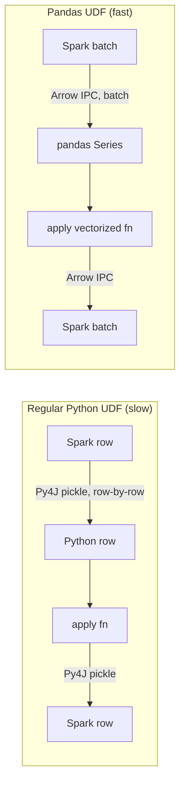

# Module 13 — Pandas API on Spark + Pandas UDFs

> **Domain 7 of 7 — Pandas API on Spark (5% — NEW DOMAIN).**
> **Goal:** Distinguish **`pyspark.pandas`** (a pandas-compatible API that runs on Spark) from **`pandas_udf`** (a vectorized PySpark UDF). These are DIFFERENT things commonly confused on the exam. Master both.

---

## Coverage map

Verbatim Oct 2025 exam objectives covered by this module:

| Objective (Section 7 — Pandas API on Spark, 5%) | Section |
|---|---|
| "Explain the advantages of using Pandas API on Spark." | [Part 1: Pandas API on Spark (pyspark.pandas)](#part-1-pandas-api-on-spark-pysparkpandas), [Why use it](#why-use-it), [Key differences from real pandas](#key-differences-from-real-pandas) |
| "Create and invoke Pandas UDF." | [Part 2: Pandas UDFs (pandas_udf)](#part-2-pandas-udfs-pandas_udf), [The four types of Pandas UDFs](#the-four-types-of-pandas-udfs), [mapInPandas — partition-level iteration](#mapinpandas--partition-level-iteration) |

Also relevant (cross-section, Section 3 objective): "Create and invoke user-defined functions with or without stateful operators, including StateStores." — Pandas UDFs are a major category of UDFs.

---

> 🎯 **How to recognize this on the exam:**
> - "Pandas API on Spark vs Pandas UDF" → DIFFERENT things. Pandas API on Spark = `import pyspark.pandas as ps`; top-level pandas-style API. Pandas UDF = `@pandas_udf(...)` decorator; vectorized UDF inside PySpark DataFrames.
> - "Conventional alias" → **`ps`** (`import pyspark.pandas as ps`).
> - "Former name of `pyspark.pandas`" → **Koalas** (pre-Spark 3.2).
> - "Why are Pandas UDFs fast?" → **Apache Arrow** for columnar batch serialization between JVM and Python; vectorized pandas/NumPy ops.
> - "Four Pandas UDF types" → **Scalar**, **Scalar Iterator**, **Grouped Map (`applyInPandas`)**, **Grouped Aggregate**.
> - "When to use Scalar Iterator" → expensive per-executor initialization (e.g., loading an ML model once).
> - "`applyInPandas` requirement" → **explicit output schema**.
> - "Default pyspark.pandas index" → **`sequence`** (slow; requires shuffle). Use `distributed` or `distributed-sequence` for performance.
> - "Convert ps.DataFrame → PySpark" → `.to_spark()`. Reverse: `sdf.pandas_api()` or `sdf.to_pandas_on_spark()`.
> - "`psdf.to_pandas()` risk" → driver OOM (collects all rows).
> - "In-place pandas ops on pyspark.pandas" → **fail by default** (set `compute.ops_on_diff_frames=True` to enable).

---

## Why this module exists

5% of the exam (~2 questions) — but the questions reliably probe the **distinction between `pyspark.pandas` and `pandas_udf`**. They sound similar and use the same conceptual building block (pandas), but they're different mechanisms.

| | `pyspark.pandas` (pandas API on Spark) | `pandas_udf` (vectorized PySpark UDF) |
|---|---|---|
| What | A pandas-compatible API that runs on Spark | A PySpark UDF decorator that takes pandas Series/DataFrames |
| Use | Drop-in replacement for pandas at scale | Define vectorized column transforms inside PySpark DataFrames |
| Import | `import pyspark.pandas as ps` | `from pyspark.sql.functions import pandas_udf` |
| Returns | Pandas-on-Spark DataFrame (`ps.DataFrame`) | Spark Column |

---

## Part 1: Pandas API on Spark (`pyspark.pandas`)

### History

- **Pre-Spark 3.2:** Standalone project called **Koalas** (developed by Databricks).
- **Spark 3.2+:** Merged into Spark as `pyspark.pandas`. Koalas package archived.

### What it is

A **pandas-compatible API** that runs on Spark under the hood. Write `pandas`-style code; Spark distributes the computation.

```python
import pyspark.pandas as ps

# Read CSV — looks like pandas, runs on Spark
psdf = ps.read_csv("path/to/file.csv")

# Pandas-style operations
psdf['amount_doubled'] = psdf['amount'] * 2
grouped = psdf.groupby('country').mean()
filtered = psdf[psdf['age'] > 30]
```

### Convention

```python
import pandas as pd                # pandas
import pyspark.pandas as ps        # pandas API on Spark
```

`pdf` for pandas DataFrames, `psdf` for pandas-on-Spark DataFrames. Conventions widely followed in tutorials.

### Why use it

| When | Why |
|---|---|
| You have existing pandas code and the data grew too big for one machine | Minimal rewrite to scale |
| Team is more familiar with pandas than PySpark | Onboarding ease |
| Quick exploratory analysis at scale | pandas-style ergonomics |

### Why NOT use it

- Performance-critical pipelines — native PySpark DataFrame is usually faster.
- Some pandas methods are unsupported (raise `NotImplementedError`).
- Implicit shuffling — operations that pandas does for free (sorting) require shuffles in Spark.

---

## Reading and writing

```python
import pyspark.pandas as ps

# Read
psdf = ps.read_csv("path/to/file.csv")
psdf = ps.read_parquet("path/to/file.parquet")
psdf = ps.read_json("path/to/file.json")
psdf = ps.read_excel("path/to/file.xlsx")           # via pandas
psdf = ps.read_delta("path/to/delta")               # via spark
psdf = ps.read_orc("path")

# Write
psdf.to_csv("out.csv")
psdf.to_parquet("out.parquet")
psdf.to_delta("out_delta", mode="overwrite")
```

The API mirrors pandas where possible.

---

## Conversion between pandas, pandas-on-Spark, and PySpark

```python
import pyspark.pandas as ps
import pandas as pd

# pandas → pandas-on-Spark
pdf = pd.DataFrame({"a": [1, 2, 3]})
psdf = ps.from_pandas(pdf)

# pandas-on-Spark → pandas (driver-side! risky for big data)
pdf = psdf.to_pandas()

# pandas-on-Spark → PySpark DataFrame
sdf = psdf.to_spark()

# PySpark DataFrame → pandas-on-Spark
sdf = spark.read.csv("path")
psdf = sdf.pandas_api()       # or sdf.to_pandas_on_spark()
```

⚠️ **`psdf.to_pandas()` collects ALL rows to driver** — same risk as `df.toPandas()` on a regular DataFrame. Limit first.

---

## Key differences from real pandas

### 1. No in-place operations by default

```python
# Real pandas — modifies in place
pdf.fillna(0, inplace=True)              # works

# Pandas-on-Spark — raises by default
psdf.fillna(0, inplace=True)             # SettingWithCopyError / SparkPandasException
psdf = psdf.fillna(0)                    # use assignment instead
```

Why? Spark DataFrames are immutable; in-place ops contradict that.

Enable explicitly:
```python
ps.set_option("compute.ops_on_diff_frames", True)
```

### 2. Index handling

`pyspark.pandas` supports a pandas-like **index** but it's computed, not free.

**Default index type**: `sequence` (slow — requires a global sequence number, which is a shuffle).

```python
# Default — slow
psdf = ps.from_pandas(pdf)  # uses 'sequence' index

# Faster — distributed
ps.set_option("compute.default_index_type", "distributed")
ps.set_option("compute.default_index_type", "distributed-sequence")
```

| Index type | Performance | Index values |
|---|---|---|
| **`sequence`** (default) | **Slow** (shuffle-heavy) | Consecutive integers 0, 1, 2, ... |
| **`distributed`** | Fast | Unique but NOT consecutive (gaps between partitions) |
| **`distributed-sequence`** | Medium (small shuffle) | Consecutive integers 0, 1, 2, ... (computed via Spark window) |

For most analytics work, set `compute.default_index_type = "distributed"` and don't depend on consecutive indexes.

### 3. Sorting requires a shuffle

```python
psdf.sort_values("col")     # SHUFFLE under the hood (orderBy)
```

In pandas, sorting is local and free. In pandas-on-Spark, it's a wide transformation.

### 4. Unsupported methods

Some pandas methods don't exist in pyspark.pandas (yet) — they raise `NotImplementedError`. Workaround: drop to PySpark via `.to_spark()`, do the op, convert back via `.pandas_api()`.

### 5. Type inference differences

Pandas-on-Spark uses Spark's type system; mostly compatible but some edge cases differ.

---

## Pandas-on-Spark vs PySpark DataFrame — when to use which

| Scenario | Best choice |
|---|---|
| Existing pandas code, data growing past single-machine | **pandas-on-Spark** |
| Data scientist team comfortable with pandas | **pandas-on-Spark** |
| New pipeline, performance-critical | **PySpark DataFrame** |
| Single-machine data fits in pandas comfortably | **Real pandas** |
| Need a method only available in pandas | Use **pandas-on-Spark** but be ready to fall back |

---

## Common pandas-on-Spark operations

```python
import pyspark.pandas as ps

psdf = ps.read_parquet("path")

# Selecting
psdf['col']                    # Series
psdf[['col1', 'col2']]         # DataFrame
psdf.col1                      # attribute access

# Filtering
psdf[psdf['age'] > 30]
psdf.loc[psdf['age'] > 30, 'name']

# Adding columns
psdf['new_col'] = psdf['a'] + psdf['b']
psdf = psdf.assign(new_col=psdf['a'] + psdf['b'])

# Group-by
psdf.groupby('country').mean()
psdf.groupby('country').agg({'amount': 'sum', 'count': 'mean'})

# Pivot
psdf.pivot_table(index='country', columns='year', values='revenue', aggfunc='sum')

# Merge / join
psdf1.merge(psdf2, on='id', how='inner')

# Sort
psdf.sort_values('col')        # SHUFFLE
psdf.sort_index()              # also shuffle (if using non-distributed index)

# Reset index
psdf.reset_index()

# Drop duplicates
psdf.drop_duplicates(subset=['user_id'])

# Apply function
psdf['col'].apply(lambda x: x * 2)     # pandas UDF-like; vectorized via Arrow
```

---

## Part 2: Pandas UDFs (`pandas_udf`)

A **completely different thing** from `pyspark.pandas`. Pandas UDFs are **vectorized PySpark UDFs** that:
- Receive **batches of rows** as `pd.Series` or `pd.DataFrame`.
- Are executed via **Apache Arrow** for zero-copy serialization between JVM and Python.
- Are much faster than row-by-row Python UDFs.

```python
import pandas as pd
from pyspark.sql.functions import pandas_udf
from pyspark.sql.types import LongType

@pandas_udf(LongType())
def plus_one(s: pd.Series) -> pd.Series:
    return s + 1

df.withColumn("incremented", plus_one(F.col("value")))
```

### Why faster than regular UDFs



- **Regular UDF**: row-by-row Py4J serialization + Python interpreter overhead per row.
- **Pandas UDF**: batch of ~10k rows converted to Apache Arrow once, processed as a vectorized pandas/NumPy op.

The difference is often 10-100×.

---

## The four types of Pandas UDFs

### 1. Scalar — Series → Series

Input: one or more `pd.Series` (one per input column).
Output: `pd.Series` of same length.

Use case: column-level transformations.

```python
@pandas_udf(LongType())
def add_one(s: pd.Series) -> pd.Series:
    return s + 1

df.withColumn("y", add_one(F.col("x")))
```

Multiple inputs:

```python
@pandas_udf(DoubleType())
def distance(x: pd.Series, y: pd.Series) -> pd.Series:
    return (x ** 2 + y ** 2) ** 0.5

df.withColumn("d", distance(F.col("x"), F.col("y")))
```

### 2. Scalar Iterator — Iterator[Series] → Iterator[Series]

Input: an iterator yielding batches of `pd.Series`.
Output: an iterator yielding batches of `pd.Series` of same lengths.

Use case: expensive initialization (e.g., loading an ML model) done ONCE per executor, not per batch.

```python
from typing import Iterator

@pandas_udf(LongType())
def predict_batch(iterator: Iterator[pd.Series]) -> Iterator[pd.Series]:
    model = load_model()                # expensive — happens once per executor
    for batch in iterator:
        yield model.predict(batch)

df.withColumn("pred", predict_batch(F.col("features")))
```

### 3. Grouped Map (via `applyInPandas`)

Apply a function that takes a `pd.DataFrame` (one group's rows) and returns a `pd.DataFrame`.

```python
def normalize_group(pdf: pd.DataFrame) -> pd.DataFrame:
    pdf['salary_normalized'] = (pdf['salary'] - pdf['salary'].mean()) / pdf['salary'].std()
    return pdf

df.groupBy("dept").applyInPandas(normalize_group, schema="user_id LONG, dept STRING, salary DOUBLE, salary_normalized DOUBLE")
```

⚠️ **`applyInPandas` requires explicit output schema.**

⚠️ **Each group must fit in memory on one executor.** If a single dept has 100M rows, this fails.

### 4. Grouped Aggregate — Series → scalar

Input: `pd.Series` (one group's values for one column).
Output: a scalar value (single number).

```python
@pandas_udf("double")
def mean_udf(v: pd.Series) -> float:
    return v.mean()

df.groupBy("dept").agg(mean_udf(F.col("salary")).alias("mean_salary"))
```

For aggregation use cases, prefer built-in functions like `F.mean(col)` when possible — they're already optimized.

---

## `mapInPandas` — partition-level iteration

For applying a function to each partition without grouping:

```python
def process_partition(iterator: Iterator[pd.DataFrame]) -> Iterator[pd.DataFrame]:
    for pdf in iterator:
        pdf['extra'] = pdf['a'] * 2
        yield pdf

df.mapInPandas(process_partition, schema="a LONG, b STRING, extra LONG")
```

Different from `applyInPandas` (which groups) — `mapInPandas` processes each partition as a stream of mini-DataFrames.

---

## Pandas UDF vs `pyspark.pandas` — the distinction

| | Pandas UDF | `pyspark.pandas` (pandas API on Spark) |
|---|---|---|
| What | A UDF that takes pandas batches | A pandas-compatible top-level API on Spark |
| Scope | Used INSIDE a PySpark DataFrame transformation | Replaces PySpark DataFrame entirely |
| Input | `pd.Series` or `pd.DataFrame` (one batch / one group) | Full `ps.DataFrame` |
| Output | `pd.Series` or `pd.DataFrame` | `ps.DataFrame` |
| Import | `from pyspark.sql.functions import pandas_udf` | `import pyspark.pandas as ps` |

⚠️ **Exam framing:** "What's the difference between Pandas API on Spark and Pandas UDFs?"

**Answer:** Pandas API on Spark (`pyspark.pandas`) is a **drop-in pandas-compatible API** that runs on Spark — you write top-level code that *looks like* pandas. Pandas UDFs are **vectorized user-defined functions** used inside PySpark DataFrames; they take batches of pandas Series/DataFrames for fast row-level transformations.

---

## Vectorized vs regular Python UDF

```python
# Regular Python UDF — SLOW (row-by-row, Py4J)
@F.udf("int")
def add_one_slow(x):
    return x + 1

# Pandas UDF — FAST (Arrow batches)
@pandas_udf("int")
def add_one_fast(s: pd.Series) -> pd.Series:
    return s + 1

# Built-in (NO Python overhead) — FASTEST
df.withColumn("y", F.col("x") + 1)
```

Always prefer:
1. Built-in functions (no Python at all).
2. Pandas UDFs (vectorized Python).
3. Regular Python UDFs (last resort).

---

## Arrow integration — what enables Pandas UDFs

Apache Arrow is a **columnar in-memory format** with zero-copy serialization between JVM and Python.

- Spark uses Arrow to ship column data from the JVM to Python workers.
- Pandas UDFs operate on the Arrow data via pandas (which uses NumPy under the hood).
- The result is serialized back via Arrow.

Config:
```python
spark.conf.set("spark.sql.execution.arrow.pyspark.enabled", "true")  # default since 3.5
```

`toPandas()` also uses Arrow when this is enabled — much faster than the legacy non-Arrow path.

---

## Worked example: feature engineering with Pandas UDF

```python
import pandas as pd
from pyspark.sql.functions import pandas_udf, col
from pyspark.sql.types import DoubleType
from typing import Iterator

@pandas_udf(DoubleType())
def normalized_score(batch: Iterator[pd.Series]) -> Iterator[pd.Series]:
    """Z-score normalization per batch."""
    for s in batch:
        yield (s - s.mean()) / s.std(ddof=0)

result = df.withColumn("z_score", normalized_score(col("raw_score")))
```

⚠️ **Note:** the normalization is **per batch**, not per partition or globally. For true partition-level z-score, use `applyInPandas` grouped by partition, or compute mean/std globally first and pass via a broadcast.

---

## When pandas-on-Spark calls a UDF

Internally, many `pyspark.pandas` operations call **Pandas UDFs** to leverage Arrow. So they share the optimization — but the user-facing API is different.

For example:
```python
psdf['col'].apply(lambda x: x * 2)
```

This is implemented as a vectorized Pandas UDF under the hood.

---

## Mini-quiz

1. What's the difference between `pyspark.pandas` and `pandas_udf`?
2. What's the conventional alias for `pyspark.pandas`?
3. Why is `df.cache()` not in pyspark.pandas?
4. What does `psdf.to_pandas()` do, and what's the risk?
5. What's the default index type in `pyspark.pandas` and why is it slow?
6. Name the four types of Pandas UDFs.
7. When should you use Scalar Iterator UDF over Scalar UDF?
8. Why are Pandas UDFs faster than regular Python UDFs?
9. Does `applyInPandas` require an explicit output schema?
10. Is `pyspark.pandas` a separate library or built into PySpark?

### Answers

1. **`pyspark.pandas`** is a pandas-compatible top-level API on Spark — you write pandas-style code that runs distributed. **`pandas_udf`** is a vectorized PySpark UDF that takes pandas Series/DataFrames as input and returns the same; used inside PySpark DataFrame transformations.
2. **`ps`** — `import pyspark.pandas as ps`.
3. Caching is a PySpark concept; `pyspark.pandas` operates at the pandas-API level. You'd call `psdf.spark.cache()` or convert to PySpark via `.to_spark().cache()`.
4. **Collects all rows to the driver** and returns a pandas DataFrame. Driver-OOM risk on large data.
5. **`sequence`** — requires a global shuffle to assign consecutive integers 0, 1, 2, ... `distributed` is much faster but gives non-consecutive integers.
6. **Scalar, Scalar Iterator, Grouped Map (`applyInPandas`), Grouped Aggregate.**
7. When you have **expensive initialization** to do once per executor (e.g., loading an ML model). The iterator pattern keeps the model in memory across batches.
8. They use **Apache Arrow** for batch (columnar) serialization between JVM and Python — vectorized operations on whole batches instead of row-by-row Py4J serialization.
9. **Yes.** `applyInPandas(fn, schema=...)` requires you to specify the output schema as a string or StructType.
10. **Built into PySpark.** Since Spark 3.2, `pyspark.pandas` is part of the official `pyspark` distribution. Previously it was a separate project called **Koalas**.

---

## Exam-day cheat sheet

- **`pyspark.pandas`** (imported as **`ps`**): pandas-compatible API on Spark. Top-level replacement for pandas.
- **`pandas_udf`**: vectorized PySpark UDF. Decorator from `pyspark.sql.functions`.
- **They're DIFFERENT things.** ⚠️ Don't confuse on exam.
- **`pyspark.pandas` was Koalas** before Spark 3.2.
- **Default index = `sequence`** (slow). Use `distributed` or `distributed-sequence` for performance.
- **Four Pandas UDF types:** Scalar, Scalar Iterator, Grouped Map (`applyInPandas`), Grouped Aggregate.
- **Pandas UDFs use Apache Arrow** for batch serialization — vectorized, much faster than row-by-row Python UDFs.
- **`applyInPandas` requires explicit output schema.**
- **`psdf.to_pandas()` collects to driver** — OOM risk.
- **Conversion:** `ps.from_pandas(pdf)`, `psdf.to_pandas()`, `psdf.to_spark()`, `sdf.pandas_api()`.

Next: [Module 14 — Official Sample Questions Walkthrough](14_official_sample_questions_walkthrough.md).
