\newpage

# How to read this ebook

This is the consolidated reading copy of **Topic 13 — Databricks Certified Associate Developer for Apache Spark**, from the **Career_upskill** project. The source markdown files live at `topics/13_databricks_spark_dev_associate/` and remain the canonical version; this ebook is a derived artifact.

**Ordering** is the natural numeric sequence — README, then numbered modules, then FACTS, then quizzes.

**What's included:**
- README (study plan, scope, exam logistics)
- All numbered modules
- The FACTS.md appendix (citable facts, version cutoffs, exam metadata)
- Quizzes (~3× exam length, with answer explanations)

**Diagrams** are Mermaid where present. The EPUB build pre-renders them to PNG via the `mmdc` CLI; if unavailable they appear as code blocks.

\newpage


\newpage

# Topic 13 — Databricks Certified Associate Developer for Apache Spark

> **Audience:** Senior AI/ML Engineer (Optum), 10+ years of PySpark in production. You write `groupBy().agg()` in your sleep — but the new (April 2025 relaunch) version of this exam tests **Spark Connect**, **Pandas API on Spark**, **Structured Streaming**, and **AQE internals** that even strong PySpark engineers stumble on. This corpus is calibrated for someone who needs a *refresh on Spark internals* and a *cold introduction to the new domains*, not a tutorial on `df.select()`.
>
> **Goal:** Pass the exam (45 questions / 90 minutes / ~70% threshold / $200 / 2-yr validity) on the first attempt, with confidence in every domain — including the ones a senior practitioner has never had to touch (Spark Connect deployment model, `pyspark.pandas` semantics).
>
> **Last updated:** 2026-05-23

---

## What this topic guarantees

If you study these 14 modules + 5 quiz files thoroughly:

- **Every verbatim objective** from the Oct 2025 exam guide is covered, with a `## Coverage map` header at the top of every module mapping objectives → section anchors.
- **Full PySpark 3.5 API surface** for: DataFrame methods (select, filter, withColumn, drop, distinct, sample, limit, sort, union/unionByName, join variants, groupBy/agg, window functions, na.drop/fill, sorting), Spark SQL functions (`F.col`, `F.lit`, `F.when/otherwise`, `F.coalesce`, date/time, string, array, struct, JSON, aggregation, ranking, lag/lead), I/O (Parquet, CSV, JSON, ORC, Delta-as-file, JDBC), tuning configs (AQE, broadcast threshold, shuffle partitions, file partition bytes), streaming (readStream/writeStream, output modes, triggers, watermarks, foreachBatch), Spark Connect (`sc://`, gRPC, restrictions), and Pandas-on-Spark (`pyspark.pandas`) plus the four Pandas UDF types.
- **All 10 official sample questions** walked through with distractor analysis (Module 14).
- **Look-alike comparison tables** for the canonical traps: `F.coalesce` function vs `df.coalesce(n)` method; `union` (position) vs `unionByName` (name); `repartition` vs `coalesce`; `distinct` vs `dropDuplicates`; `na.drop("any")` vs `na.drop("all")`; `sc.broadcast(value)` vs `F.broadcast(df)`; `row_number` vs `rank` vs `dense_rank`; `pyspark.pandas` vs `pandas_udf`; storage levels; AQE config keys vs distractors.
- **Output-prediction drills** (heavy emphasis on Modules 02, 05, 07, 08, 09, 10) — predict-then-verify exercises mirroring the exam's code-completion + output-prediction question patterns.
- **Decision-rule callouts** (`> 🎯 How to recognize this on the exam:`) in every module — exam-day decision logic to recognize question patterns.
- **End-to-end mini-scenarios** showing realistic small pipelines that exercise multiple objectives together.

Calibrated for someone who reads only these modules + takes the quizzes — no external resources required to pass.

---

## What's new — exam relaunched April 2025

This is **not** the old "Apache Spark 3.0 (Python)" exam. That one was retired. The new exam:

- **Spark 3.5** content (NOT Spark 4.0 — no ANSI-default, no Variant type, no collations, no Arbitrary Stateful Processing V2).
- **Python only.** The Scala track was removed — there is currently no Databricks-administered Scala Spark cert.
- **NOT Databricks-platform-specific.** Pure open-source Spark. No Unity Catalog, no Delta Lake-specific tooling (time travel, OPTIMIZE, ZORDER), no Databricks Workflows, no DBFS, no Photon. Delta is mentioned only as a *readable file format* via `delta.`path``.
- **45 questions in 90 minutes** (was 60Q / 120 min in the legacy 3.0 exam). About 2 min/question.
- **7 domains** (was ~3 in the legacy version). Three brand-new domains: Structured Streaming, Spark Connect, Pandas API on Spark.

If you took the 3.0 version years ago, treat this as a different exam. The 50% you already know will be muscle memory; the other 50% requires deliberate study.

---

## Exam logistics

| Attribute | Value |
|---|---|
| **Official name** | Databricks Certified Associate Developer for Apache Spark |
| **Question count** | 45 scored (plus a few unscored statistical items, time-adjusted) |
| **Duration** | 90 minutes |
| **Passing score** | Not publicly disclosed; community-reported **~70%** (treat as floor; aim for 85%+) |
| **Cost** | **$200 USD** + local taxes |
| **Language (exam UI)** | English |
| **Language (code)** | **Python only** — every snippet is PySpark |
| **Spark version** | **3.5.x** (with Spark Connect features from 3.4) |
| **Delivery** | Online proctored OR test-center |
| **Prerequisites** | None; Databricks suggests 6+ months hands-on |
| **Validity** | **2 years** — recertify by retaking the current exam |
| **Test aides** | None — no API docs, no scratch paper, no calculator |
| **Registration** | Webassessor (webassessor.com/databricks) |
| **Results** | Immediate pass/fail + per-section percentage breakdown |

---

## Domain weights — the map

| # | Domain | Weight | ~Qs (of 45) | Module(s) |
|---|--------|--------|-------------|-----------|
| 1 | **Apache Spark Architecture & Components** | **20%** | ~9 | [01](01_spark_architecture.md), [02](02_lazy_evaluation_dag.md), [03](03_execution_model.md) |
| 2 | **Using Spark SQL** | **20%** | ~9 | [04](04_spark_sql_basics.md), [05](05_spark_sql_functions.md) |
| 3 | **Developing DataFrame/Dataset API Applications** | **30%** ← largest | ~14 | [06](06_dataframe_basics.md), [07](07_dataframe_transformations.md), [08](08_aggregations_window.md), [09](09_joins_unions.md) |
| 4 | **Troubleshooting & Tuning** | **10%** | ~5 | [10](10_performance_tuning.md) |
| 5 | **Structured Streaming** | **10%** (new) | ~5 | [11](11_structured_streaming.md) |
| 6 | **Spark Connect — Deploy Applications** | **5%** (new) | ~2 | [12](12_spark_connect.md) |
| 7 | **Pandas API on Spark** | **5%** (new) | ~2 | [13](13_pandas_api_on_spark.md) |
| | **Synthesis & official sample walk-through** | | | [14](14_official_sample_questions_walkthrough.md) |
| | **TOTAL** | 100% | 45 | |

**Senior-engineer ROI ranking** — where 2-3 weeks of study buys the most points:
1. **AQE internals & config keys** (Module 10) — almost every senior I've trained gets the AQE config-key trap wrong.
2. **Structured Streaming** (Module 11) — if you haven't built a streaming job in the last 2 years, this is your weak spot.
3. **Spark Connect** (Module 12) — totally new surface; 2 questions but easy to get both right with 1 hour of focused study.
4. **Pandas API on Spark vs Pandas UDFs** (Module 13) — these are *different things* and the exam will trick you.
5. **Narrow vs wide transformations edge cases** (Module 02) — `union` is narrow; people get this wrong.

---

## Learning path — 14 modules

### Domain 1 — Architecture (20%)
1. [`01_spark_architecture.md`](01_spark_architecture.md) — Driver, executor, cluster manager (standalone/YARN/K8s), JVM processes, tasks-per-core, SparkContext vs SparkSession.
2. [`02_lazy_evaluation_dag.md`](02_lazy_evaluation_dag.md) — Transformations vs actions, lineage, Catalyst, DAG scheduler, narrow vs wide (the full list), shuffle boundaries.
3. [`03_execution_model.md`](03_execution_model.md) — Application → Job → Stage → Task; shuffle write/read; spill to disk; speculative execution; dynamic allocation.

### Domain 2 — Spark SQL (20%)
4. [`04_spark_sql_basics.md`](04_spark_sql_basics.md) — SQL queries, `createTempView` vs `createOrReplaceTempView` vs global temp view, catalog, `spark.sql()` returning a DataFrame, pivot/unpivot, querying files directly.
5. [`05_spark_sql_functions.md`](05_spark_sql_functions.md) — `cast`, `lit`, `when().otherwise()`, the *function* `coalesce` vs the *DataFrame method* `.coalesce()`, `expr`, `broadcast`, date functions, regex, arrays, structs, JSON, `withColumn` vs `withColumnRenamed`.

### Domain 3 — DataFrame / Dataset API (30%) — largest section
6. [`06_dataframe_basics.md`](06_dataframe_basics.md) — Reading (CSV, JSON, Parquet, Delta, ORC, Text), writing, save modes, schemas (`inferSchema` vs explicit StructType vs DDL string), `partitionBy` vs `bucketBy`.
7. [`07_dataframe_transformations.md`](07_dataframe_transformations.md) — `select`, `selectExpr`, `filter`/`where`, `withColumn`/`withColumnRenamed`, `drop`, `distinct` vs `dropDuplicates`, `sample`, `limit`, `sort`/`orderBy`, chaining discipline.
8. [`08_aggregations_window.md`](08_aggregations_window.md) — `groupBy().agg()`, `pivot`, `approx_count_distinct`, Window functions (`partitionBy`/`orderBy`/`rowsBetween`/`rangeBetween`), `row_number`/`rank`/`dense_rank`/`percent_rank`/`cume_dist`/`lag`/`lead`.
9. [`09_joins_unions.md`](09_joins_unions.md) — Join types (inner/left/right/full outer/semi/anti/cross), broadcast joins and their *outer-join restrictions*, `union` (narrow!) vs `unionByName` (by name), multi-key joins.

### Domain 4 — Tuning (10%)
10. [`10_performance_tuning.md`](10_performance_tuning.md) — AQE three pillars + the **config-key naming trap**, broadcast thresholds (planner vs runtime), partition tuning (`repartition` vs `coalesce` vs `sortWithinPartitions`), cache vs persist & storage levels, predicate pushdown, partition pruning, file-format choice, bucketing, skew (salting, AQE skew join).

### Domain 5 — Structured Streaming (10%)
11. [`11_structured_streaming.md`](11_structured_streaming.md) — `readStream`/`writeStream`, triggers (default, `processingTime`, `availableNow`, `once` deprecated), output modes (append, complete, update) decision tree, `checkpointLocation`, watermarks + `dropDuplicates`, `foreachBatch`, exactly-once semantics.

### Domain 6 — Spark Connect (5%)
12. [`12_spark_connect.md`](12_spark_connect.md) — Client-server architecture, gRPC protocol, `SparkSession.builder.remote("sc://...")`, deployment modes (client/cluster/local — *local-mode = single worker node* is on the exam), restrictions (no RDD API, no SparkContext, no client-side broadcast variables).

### Domain 7 — Pandas API on Spark (5%)
13. [`13_pandas_api_on_spark.md`](13_pandas_api_on_spark.md) — `import pyspark.pandas as ps`, semantics vs real pandas (no in-place ops by default, index handling), conversion (`to_pandas`/`from_pandas`/`to_spark`), `pandas_udf` (4 types — scalar, scalar-iter, grouped-map, grouped-agg), when to choose which.

### Synthesis
14. [`14_official_sample_questions_walkthrough.md`](14_official_sample_questions_walkthrough.md) — Walk through the 10 official sample questions (paraphrased per NDA) with full reasoning, including back-references to source modules. **Do this last.**

---

## Companion files

- [`FACTS.md`](FACTS.md) — atomic citable claims (exam logistics, version dates, config keys, defaults, storage levels). Single source of truth, updated whenever a fact gets re-verified.
- [`quizzes/`](quizzes/) — 5 quiz files, ~135 questions total (45 × 3 — three full mock-exam volumes' worth, distributed by domain weight):
  - [`01_architecture.md`](quizzes/01_architecture.md) — 27 questions (20%)
  - [`02_spark_sql.md`](quizzes/02_spark_sql.md) — 27 questions (20%)
  - [`03_dataframe_api.md`](quizzes/03_dataframe_api.md) — 40 questions (30%)
  - [`04_tuning.md`](quizzes/04_tuning.md) — 14 questions (10%)
  - [`05_streaming_connect_pandas.md`](quizzes/05_streaming_connect_pandas.md) — 27 questions (10+5+5%)
  - [`README.md`](quizzes/README.md) — usage, scoring, recommended cadence.

---

## How to use this

1. **First pass (read-through):** Modules 01 → 13 in order. ~6–8 hours for a senior practitioner. Skip nothing — the "obvious" sections often hide the exam-trap details.
2. **Module quizzes:** After each module, take the corresponding quiz **cold** (no peeking). Track your score per domain.
3. **AQE & Streaming deep dive:** Re-read Modules 10 and 11. These are the points-per-hour goldmines.
4. **Walk-through:** Module 14 — work through the 10 official samples without looking at answers first.
5. **Mock exam:** Combine 45 questions across the quizzes (proportional by weight) and take it under timed conditions. Score yourself. Anything below 80% in a domain → revisit that module.
6. **Re-take quizzes** at 70%+ before scheduling. Aim for 85%+ on full-set practice before booking.

---

## Estimated time investment (senior PySpark engineer)

| Phase | Hours |
|---|---|
| Read-through Modules 01–14 | 8–10 |
| Take all quizzes cold, review wrong answers | 6–8 |
| AQE + Streaming + Spark Connect deep dive (Modules 10, 11, 12) | 4–6 |
| Pandas-on-Spark hands-on (Module 13) | 2 |
| Mock exam(s) under timed conditions | 3–4 |
| Final review of FACTS.md + official guide PDF | 2 |
| **Total** | **25–32 hours over 2–3 weeks** |

If you've shipped PySpark code in the last 6 months, you'll lean toward the low end. If your last Spark touch was 2 years ago, lean toward the high end and add 5–10 hours for hands-on warm-up.

---

## Source-of-truth ordering

When two sources disagree, trust in this order:

1. **The official Oct 2025 exam guide PDF** (`research_inputs/13_databricks_spark_dev_associate/databricks_spark_dev_associate_exam_guide.pdf`).
2. **Apache Spark 3.5.0 documentation** (`spark.apache.org/docs/3.5.0/`).
3. **Databricks certification page** (`databricks.com/learn/certification/apache-spark-developer-associate`).
4. **Community write-ups** (Medium, Reddit) — useful for exam-day flavor but never for technical truth.
5. **Practice-dump sites** (ExamTopics etc.) — assume they're showing the OLD 3.0 exam questions mislabeled as 3.5. Use ONLY if you can cross-verify against the official guide.

---

## Scope notes

- **No NDA violations.** All sample-question content in Module 14 and the quizzes is paraphrased from the official guide's *publicly published* 10 sample questions, or original questions derived from the verbatim exam objectives.
- **Spark 3.5 only.** No Spark 4.0 features (ANSI default, Variant, collations) are tested or covered.
- **No Databricks-platform UI.** This is a pure-Spark exam. Module references to Databricks-specific features (e.g., Liquid Clustering, Photon) appear only as *exclusions* — "this is NOT tested."
- **Python-only code.** All examples in PySpark. Spark SQL examples are SQL strings passed to `spark.sql()`, never Scala.

---

## What I'm not covering (and why)

- **Spark Streaming (DStreams)** — legacy API, not on the exam; Structured Streaming replaces it.
- **MLlib** — mentioned by the exam guide as one of "the modules of Spark," but no MLlib code or concepts are tested beyond the existence of the module.
- **GraphX** — not tested.
- **Spark 4.0 features** — exam predates broad 4.0 adoption.
- **Databricks-platform features** — Unity Catalog, Delta Lake-specific operations, Photon, Workflows, DBSQL warehouses. See Topic 02 (Azure Databricks) for those.


\newpage

# Module 01 — Apache Spark Architecture

> **Domain 1 of 7 — Architecture & Components (20% of exam).**
> **Goal:** Refresh the cluster topology a senior PySpark engineer has used a thousand times but rarely has to *articulate*. Driver, executor, cluster manager. Memory model. Why JVM. SparkContext vs SparkSession. The shape of "what runs where."

---

## Coverage map

Verbatim Oct 2025 exam objectives covered by this module:

| Objective (Section 1 — Architecture, 20%) | Section |
|---|---|
| "Identify the advantages and challenges of implementing Spark." | [Advantages and challenges](#advantages-and-challenges-verbatim-exam-objective) |
| "Identify the role of core components of Apache Spark's Architecture, including cluster, driver node, worker nodes/executors, CPU cores, and memory." | [The cluster, top-down](#the-cluster-top-down), [Tasks, cores, partitions](#tasks-cores-partitions--the-parallelism-arithmetic) |
| "Describe the architecture of Apache Spark, including DataFrame and Dataset concepts, SparkSession lifecycle, caching, storage levels, and garbage collection." | [SparkContext vs SparkSession](#sparkcontext-vs-sparksession), [Caching and storage levels](#caching-and-storage-levels--the-table-you-must-memorize), [Garbage collection](#garbage-collection-light-touch) |
| "Identify the features of the Apache Spark Modules, including Core, Spark SQL, DataFrames, Pandas API on Spark, Structured Streaming, and MLlib." | [Spark's modules](#sparks-modules-in-scope-identify-them) |
| "Explain the Apache Spark Architecture execution hierarchy." | [Application → Job → Stage → Task](#application--job--stage--task-preview-of-module-02) |

---

> 🎯 **How to recognize this on the exam:**
> - "Which deployment mode requires all executors to run on a single worker node?" → **Local mode** (single JVM, threads as executors). Sample Q7.
> - "Where do executor stderr/stdout live?" → **Spark UI → Executors tab → click executor → stderr/stdout**. Sample Q2.
> - "What's the default storage level for DataFrame `.cache()`?" → **`MEMORY_AND_DISK`** (NOT `MEMORY_ONLY` — that's RDDs).
> - "Total parallelism on a cluster?" → executors × cores per executor.
> - "What does SparkSession wrap?" → SparkContext + SQLContext + HiveContext.
> - "Why are Python UDFs slow vs Pandas UDFs?" → row-by-row Py4J serialization vs Arrow batch.
> - "Which cluster managers does Spark support?" → Standalone, YARN, Kubernetes (Mesos deprecated).
> - "What is NOT available in Spark Connect clients?" → SparkContext, RDD, broadcast variables, accumulators, JVM access.

---

## Why this module exists

The exam asks ~9 questions on architecture. They are **not** "name the parts of a Spark cluster" questions. They are:

- "Which component holds the DAG?" (Driver.)
- "Where do tasks execute?" (Executor.)
- "Which deployment mode runs all executors on a single worker node?" (Local.)
- "What allocates resources?" (Cluster manager.)
- "Identify the role of CPU cores in execution." (Tasks = cores per executor × N executors.)
- "What does `SparkSession` replace?" (Wraps `SparkContext`, `SQLContext`, `HiveContext`.)

Most senior engineers can answer 6 of 9 cold. The other 3 require deliberate refresh — that's this module.

---

## The cluster, top-down

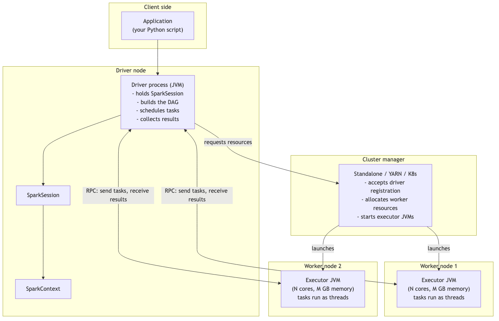

### Driver

A **single JVM process** that:

- Hosts `SparkSession` (and `SparkContext` under the hood).
- Maintains the **DAG** (directed acyclic graph) representing the logical and physical plan.
- Talks to the cluster manager to request executor resources.
- Schedules **tasks** onto executors via RPC.
- Collects results from `.collect()`, `.show()`, `.take()`, `.toPandas()` etc.
- Hosts the **Spark UI** (typically on port 4040).
- Holds **broadcast variables** before shipping them out.
- Runs the **DAG scheduler** and **task scheduler**.

If the driver dies, the application dies. There is no failover for the driver in OSS Spark (some cluster managers add HA on top — e.g., YARN ApplicationMaster with `spark.yarn.maxAppAttempts`).

⚠️ **Exam trap:** the driver does **NOT** process row-level data unless you call `.collect()` (or `.toPandas()`, `.toLocalIterator()`, `.take(n)`, `.head(n)`, `.first()`). The driver coordinates; executors compute.

### Executor

A **JVM process** launched on a worker node. Each executor has:

- A configurable **number of CPU cores** (`spark.executor.cores`). One core runs one task at a time.
- A configurable **heap memory** (`spark.executor.memory`) plus optional **off-heap memory** (`spark.memory.offHeap.size`).
- A local disk for shuffle spill and the **block manager** (cache storage).
- A connection to the driver for receiving tasks and sending results/heartbeats.

**Tasks run as threads** inside the executor's JVM. Total parallelism = total executor cores. If you have 10 executors with 4 cores each, you can run 40 tasks concurrently.

### Cluster manager

The component that **allocates worker resources to driver and executors**. Spark supports:

| Manager | Notes |
|---|---|
| **Standalone** | Spark's own; ships with Spark. Simplest. |
| **YARN** | Hadoop's resource manager; common in legacy on-prem |
| **Kubernetes** | Native since Spark 2.3; GA quality since 3.1 |
| **Mesos** | **Deprecated since 3.2, removed in some downstream distributions** |

Cluster managers are **interchangeable** — the same Spark application runs on any of them with config changes only.

⚠️ **Exam trap:** Databricks's "Databricks Runtime" is not in the exam scope. The exam tests OSS Spark cluster managers.

### Worker node

The physical (or virtual) host machine. Hosts one or more executor processes. Reports back to the cluster manager (not directly to the driver — the cluster manager mediates resource allocation).

---

## Deployment modes (HIGH-VALUE — sample Q7 territory)

| Mode | Where does the driver run? | Where do executors run? | When to use |
|---|---|---|---|
| **Client** | On the **submitting machine** (your laptop, edge node) | On the cluster | Interactive — notebooks, REPL, spark-shell |
| **Cluster** | On a **worker node** in the cluster (allocated by cluster manager) | On other worker nodes | Production batch jobs |
| **Local** | In a **single JVM** on the local machine | **All executors run as threads in the SAME JVM as the driver** | Dev, testing, unit tests |

### The local-mode trap

The official sample Q7 tests this: "Which deployment mode requires all executors to run on a single worker node?"

The answer is **Local mode**. In local mode:
- There IS a "driver" and there ARE "executors" — but they're all threads in **one JVM**.
- Specified via `spark.master = "local[4]"` (4 threads) or `"local[*]"` (use all cores).
- No cluster manager involved.

"Single worker node" in the question is the misleading phrasing — there's no actual *worker node* concept; there's one machine running everything. The exam considers the single-machine JVM as the "single worker node."

```python
# Local mode — for testing
spark = SparkSession.builder \
    .appName("my-test") \
    .master("local[4]") \
    .getOrCreate()
```

### Client vs cluster mode — when does it matter?

For **interactive use** (notebooks, REPL): client mode. The driver needs to be where the developer is, because driver-side output (e.g., `.show()`) is rendered locally.

For **batch jobs**: cluster mode. The driver is on a worker, which means:
- The submitting machine can be a thin gateway; it doesn't need to be up after job submission.
- Driver-to-executor RPC traffic stays inside the cluster (lower latency).
- The submitting user gets a job ID and can disconnect.

⚠️ **`spark-submit --deploy-mode cluster`** is the production pattern. Most folks default to client and never explicitly think about this.

---

## SparkContext vs SparkSession

Two entry points coexist in 3.5:

### SparkContext (legacy, 1.x)

```python
sc = SparkContext("local", "MyApp")
rdd = sc.parallelize([1, 2, 3])
```

- The original entry point.
- Owns RDD APIs, broadcast variables, accumulators, low-level configuration.
- Still accessible: `spark.sparkContext` returns the SparkContext underlying a SparkSession.

### SparkSession (modern, 2.0+)

```python
spark = SparkSession.builder.appName("MyApp").getOrCreate()
df = spark.read.parquet("path")
```

- The unified entry point.
- Wraps `SparkContext`, `SQLContext`, `HiveContext`.
- Owns the **DataFrame/SQL API**, catalog, UDF registry, configuration.
- Owned by the driver; only **one active SparkSession per JVM** by default (multiple sessions possible with `newSession()` for catalog isolation).

### Important relationships

```python
spark = SparkSession.builder.getOrCreate()
sc = spark.sparkContext       # same SparkContext
sqlc = spark._wrapped         # SQLContext compatibility (deprecated)
catalog = spark.catalog       # catalog access
conf = spark.conf             # runtime config
```

⚠️ **Spark Connect trap:** Spark Connect clients have **NO `SparkContext`** — `spark.sparkContext` returns `None`. This breaks any code that relies on `sc.broadcast(...)`, `sc.accumulator(...)`, `sc.parallelize(...)`, or low-level RDD operations. See Module 12.

---

## Memory model inside an executor

Each executor has a unified memory pool (`spark.executor.memory`) split into:

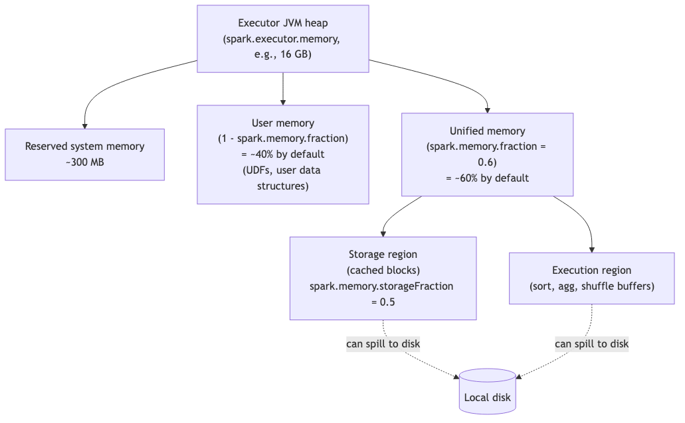

Key defaults (Spark 3.5):
- `spark.memory.fraction` = 0.6 (60% of (heap − reserved) goes to unified memory)
- `spark.memory.storageFraction` = 0.5 (50% of unified memory is the storage "soft" boundary)
- Execution can **steal from storage** when needed (evicts cached blocks).
- Storage **cannot evict execution memory** — execution always wins under pressure.

⚠️ **Exam isn't deeply about memory tuning numbers** but it can test:
- "What happens when execution memory is exhausted?" → Spill to disk.
- "Which region holds cached DataFrames?" → Storage region.
- "Can execution evict storage?" → Yes; vice versa, no.

---

## Tasks, cores, partitions — the parallelism arithmetic

```
Total parallelism = (number of executors) × (cores per executor)

A stage runs N tasks, where N = number of partitions in the stage's RDD/DataFrame.

If N > total parallelism → tasks queue up; multiple waves of execution.
If N < total parallelism → some cores sit idle.
```

Worked example:

```
Cluster: 5 executors × 4 cores = 20 cores total = 20 concurrent tasks
DataFrame: 200 partitions (the post-shuffle default)
Stage: 200 tasks → 10 "waves" of 20 tasks each
```

⚠️ The exam can ask: "If you have 200 partitions and 20 cores, how many waves?" Answer: 10. (Or "tasks per core: 10.")

### Cores per executor — there's a sweet spot

Industry rule of thumb: 4-5 cores per executor.
- Too many cores per executor → HDFS I/O contention, GC pressure, scheduler bottleneck.
- Too few cores per executor → JVM overhead per executor dominates.

**Not directly exam-tested**, but useful intuition for "best practice" questions.

---

## Application → Job → Stage → Task (preview of Module 02)

```
Application                (one per SparkSession)
  └─ Job                   (one per action: count, collect, write, show...)
       └─ Stage            (one per shuffle boundary)
            └─ Task        (one per partition in the stage)
```

A **task** is the **smallest unit of execution**. It processes exactly one partition. Module 02 unpacks the lazy → DAG → job → stage chain in detail.

---

## Spark's modules (in scope: identify them)

The exam guide explicitly asks you to "Identify the features of the Apache Spark Modules":

| Module | What it is |
|---|---|
| **Spark Core** | Foundation: RDDs, task scheduling, memory management, fault recovery, storage, cluster-manager interaction |
| **Spark SQL + DataFrames** | Structured data, Catalyst optimizer, SQL parser, DataFrame/Dataset API |
| **Structured Streaming** | Stream processing built on Spark SQL; treats stream as unbounded table (Module 11) |
| **Pandas API on Spark** | pandas-compatible API; formerly Koalas (Module 13) |
| **MLlib** | Distributed ML algorithms (NOT deeply tested) |
| **GraphX** | Graph computation (NOT tested) |

You won't be quizzed on MLlib internals. You will be quizzed on **"Pandas API on Spark is a module of Spark"** (true) vs **"pandas_udf is a separate library"** (false — `pandas_udf` is a PySpark construct in `pyspark.sql.functions`).

---

## What "JVM process" means (and why Python is special)

Spark is written in **Scala**, running on the **JVM**. PySpark is a Python wrapper that:

1. **Driver:** Python process forks a JVM via Py4J; commands flow over a TCP socket.
2. **Executors:** JVM executors; for native DataFrame operations, all computation happens in JVM.
3. **Python UDFs:** when you write a `@udf` function, each executor spawns a **Python worker subprocess**, and data is serialized row-by-row over a pipe → Python → result back to JVM. **This is the slow path.**
4. **Pandas UDFs (Arrow-based):** data is serialized in **Apache Arrow columnar batches** to the Python worker — vectorized, much faster.

⚠️ **Exam framing:**
- "Why are Python UDFs slow?" — row-by-row Python serialization breaks Catalyst optimization and adds Py4J overhead.
- "Why are Pandas UDFs fast?" — Arrow batch serialization, vectorized pandas operations.

---

## Caching and storage levels — the table you must memorize

Already in FACTS.md §11 but repeated here for module completeness:

| Storage Level | Heap memory | Disk | Serialized | Replicated |
|---|---|---|---|---|
| `MEMORY_ONLY` | ✓ | ✗ | ✗ | ✗ |
| **`MEMORY_AND_DISK`** ← `df.cache()` default | ✓ | ✓ | ✗ | ✗ |
| `MEMORY_ONLY_SER` | ✓ | ✗ | ✓ | ✗ |
| `MEMORY_AND_DISK_SER` | ✓ | ✓ | ✓ | ✗ |
| `DISK_ONLY` | ✗ | ✓ | (always) | ✗ |
| `*_2` variants | — | — | — | ✓ (2 nodes) |
| `OFF_HEAP` | off-heap | ✗ | ✓ | ✗ |

⚠️ **The trap:** RDD `.cache()` defaults to `MEMORY_ONLY`. DataFrame `.cache()` defaults to `MEMORY_AND_DISK`. **Asymmetric defaults are exam fodder.**

```python
df.cache()                        # MEMORY_AND_DISK
df.persist(StorageLevel.DISK_ONLY)
df.unpersist()                    # remove from cache
df.unpersist(blocking=True)       # wait for removal
```

---

## Garbage collection (light touch)

Long GC pauses on executors signal memory pressure:

| Symptom | Likely cause | Fix |
|---|---|---|
| Frequent full GCs in executor logs | Too much cached data | Unpersist what you don't need; smaller `spark.memory.storageFraction` |
| Pre-mature OOM after small data load | Too many tiny objects, no serialization | Use `MEMORY_AND_DISK_SER` storage level; Kryo serializer |
| Long task tails with GC time > 30% | Skew dumping all data on one executor | Salt the join key, repartition |

**Kryo serializer** (faster, more compact than Java serialization):

```python
spark.conf.set("spark.serializer", "org.apache.spark.serializer.KryoSerializer")
```

⚠️ **Exam isn't deeply about GC.** Just know: "Long GC pauses signal memory pressure; mitigations include serialized caching, more/smaller executors, reducing cached data."

---

## Spark UI tabs (preview)

The exam tests "how do you retrieve executor logs?" (sample Q2). Answer: **Spark UI → Executors tab → click executor → stderr/stdout**. (Not via `spark-submit --verbose` and not via the driver's stdout.)

| Tab | Use |
|---|---|
| Jobs | Overall job timing |
| Stages | Task duration distribution, shuffle bytes, spill |
| Storage | Cached RDDs/DataFrames |
| Environment | Effective Spark configuration |
| Executors | **Driver & executor logs** (stdout, stderr), GC time, failed tasks |
| SQL/DataFrame | Query plan graph, AQE annotations |
| Streaming | Per-query rates, batch durations |

Module 10 covers Spark UI diagnostics in detail.

---

## Advantages and challenges (verbatim exam objective)

The exam guide asks you to "identify the advantages and challenges of implementing Spark." Don't overthink this — these are essentially "general distributed-systems" answers:

### Advantages

- **In-memory computation** — orders of magnitude faster than disk-based MapReduce.
- **Unified API** — Spark Core, SQL, Streaming, MLlib in one engine.
- **Lazy evaluation + Catalyst** — automatic query optimization.
- **Fault tolerance via lineage** — recompute lost partitions from source.
- **Language polyglot** — Python, Scala, R, Java, SQL.
- **Cluster-manager agnostic** — runs on YARN, K8s, Standalone.

### Challenges

- **Memory pressure** — OOM is the most common production failure mode.
- **Tuning overhead** — partitions, shuffle, broadcast thresholds, AQE configs all interact.
- **Debugging distributed failures** — stack traces span driver + executors.
- **Skew** — data skew destroys parallelism.
- **Small files problem** — many small files = many small tasks = scheduling overhead.

---

## Code: setting up a SparkSession (review)

```python
from pyspark.sql import SparkSession

# Local mode for testing
spark = (SparkSession.builder
         .appName("dev")
         .master("local[*]")
         .config("spark.sql.adaptive.enabled", "true")
         .config("spark.serializer", "org.apache.spark.serializer.KryoSerializer")
         .getOrCreate())

# Cluster (typical: master comes from spark-submit/cluster manager)
spark = (SparkSession.builder
         .appName("prod-job")
         .config("spark.sql.shuffle.partitions", "400")
         .getOrCreate())

# Inspect what we got
print(spark.version)              # '3.5.x'
print(spark.sparkContext.master)  # 'local[*]' or 'yarn' or 'k8s://...'
print(spark.conf.get("spark.sql.adaptive.enabled"))
```

⚠️ **`getOrCreate()`** returns the existing session if one is active; otherwise creates a new one. Important for notebooks and tests.

---

## Mini-quiz (cold; answers below)

1. Which component runs `.collect()` and accumulates the result?
2. If an executor has 4 cores and the cluster has 5 executors, how many tasks run concurrently?
3. In local mode, where do executors run?
4. What does `SparkSession` wrap?
5. Why is `spark.sparkContext` `None` in Spark Connect?
6. Which storage level is the DataFrame `.cache()` default?
7. Can execution memory evict storage memory? Vice versa?
8. Name the cluster managers Spark supports today.
9. Why are Python UDFs slow vs Pandas UDFs?
10. Where do you find executor stderr/stdout?

### Answers

1. **Driver.** Results from actions flow back to the driver.
2. **20.** Total parallelism = executors × cores per executor.
3. **In the same JVM as the driver** — all threads in one process.
4. **`SparkContext`, `SQLContext`, `HiveContext`** — the legacy entry points.
5. Spark Connect clients are thin gRPC clients; they don't have JVM access. RDD operations, broadcast variables, accumulators, `sc.parallelize`, etc. are unavailable.
6. **`MEMORY_AND_DISK`.** (RDD `.cache()` is `MEMORY_ONLY`.)
7. Execution **can** evict storage (kicks cached blocks out under pressure). Storage **cannot** evict execution.
8. **Standalone, YARN, Kubernetes.** Mesos deprecated/removed.
9. Python UDFs serialize row-by-row over Py4J/pipes; Pandas UDFs use Apache Arrow columnar batches → vectorized in pandas.
10. **Spark UI → Executors tab → click executor → stderr/stdout.**

---

## Exam-day cheat sheet for this module

- **Driver = JVM holding DAG, SparkSession, schedules tasks, collects results.**
- **Executor = JVM per worker; tasks run as threads; one core per task.**
- **Cluster manager = Standalone | YARN | K8s (Mesos deprecated).**
- **Deployment modes: client (driver on laptop), cluster (driver on worker), local (everything in one JVM).**
- **SparkSession wraps SparkContext + SQLContext + HiveContext.**
- **Spark Connect: no SparkContext, no RDD, no broadcast variables, no accumulators.**
- **DataFrame `.cache()` = MEMORY_AND_DISK (NOT MEMORY_ONLY).**
- **Total parallelism = sum of executor cores.**
- **Executor logs → Spark UI → Executors tab → stderr/stdout.**

Next: [Module 02 — Lazy Evaluation, Catalyst, and the DAG](02_lazy_evaluation_dag.md).


\newpage

# Module 02 — Lazy Evaluation, Catalyst, and the DAG

> **Domain 1 of 7 — Architecture & Components (20%).**
> **Goal:** Master the lazy-evaluation model, the transformation/action distinction, **narrow vs wide** (with the *complete list* — `union` is narrow, this is on the exam), Catalyst optimization passes, and how the DAG turns into jobs and stages.

---

## Coverage map

Verbatim Oct 2025 exam objectives covered by this module:

| Objective (Section 1 — Architecture, 20%) | Section |
|---|---|
| "Describe the execution patterns of the Apache Spark engine, including actions, transformations, and lazy evaluation." | [The lazy evaluation model](#the-lazy-evaluation-model), [Transformations vs actions](#transformations-vs-actions) |
| "Configure Spark partitioning in distributed data processing, including shuffles and partitions." | [Narrow vs wide](#narrow-vs-wide--the-complete-list-high-value), [The shuffle in detail](#the-shuffle-in-detail) |
| "Explain the Apache Spark Architecture execution hierarchy." | [DAG → Job → Stage → Task](#dag--job--stage--task) |
| "Describe the architecture of Apache Spark, including DataFrame and Dataset concepts, SparkSession lifecycle, caching, storage levels, and garbage collection." | [Lineage and fault tolerance](#lineage-and-fault-tolerance), [Checkpoint vs cache](#checkpoint-vs-cache) |

---

> 🎯 **How to recognize this on the exam:**
> - If question shows code with `union()` and asks about shuffle behavior → **NARROW, no shuffle.** Even though it "combines tables," Spark just concatenates partitions.
> - If question asks whether `df.coalesce(10)` triggers a shuffle → **NO** (it's narrow; combines partitions on the same executor).
> - If question asks whether `df.cache()` runs the job → **NO** (it's a transformation/hint; the next action materializes the cache).
> - If question lists transformations and asks which is wide → look for `groupBy`, `join` (non-broadcast), `distinct`, `dropDuplicates`, `orderBy`, `repartition`, window functions with `partitionBy`.
> - If question mentions "lineage" → cache preserves it; checkpoint truncates it.

---

## Why this module exists

The single highest-yield architecture topic. Three reliable exam-trap categories live here:

1. **`union` is narrow** — almost no one remembers this on first try.
2. **The DataFrame method `.coalesce()` is narrow** — distinct from the SQL function `F.coalesce()`.
3. **Transformations vs actions** — `df.cache()` is a transformation? An action? A hint? (Answer: transformation; doesn't trigger execution.)

If you internalize the lists in this module, you'll get every architecture/DAG question right.

---

## The lazy evaluation model

Watch what happens when you chain operations:

```python
df = spark.read.parquet("s3://big-bucket/data/")  # NO READ HAPPENS YET
df = df.filter(F.col("year") == 2025)             # NO FILTERING
df = df.select("user_id", "event_type", "ts")     # NO PROJECTION
df = df.groupBy("event_type").count()             # NO AGG
df.show()                                          # NOW everything runs
```

Spark doesn't execute anything until an **action** is called. Until then, each `df.<transformation>()` call only **modifies the logical plan**.

### Why lazy?

Lazy evaluation lets Spark:

- **Combine consecutive transformations** into a single pipeline of operations (pipelining within a stage).
- **Push filters down** to the source (predicate pushdown — `filter` happens before scan loads bytes).
- **Prune columns** the query never reads (projection pushdown — `select` happens before scan loads bytes).
- **Reorder operations** for cost (join order optimization).
- **Skip work entirely** when the query plan reveals dead code (e.g., a constant-false filter eliminates a join).

Eager evaluation would force Spark to materialize after every line — wasting I/O, memory, and compute.

---

## Transformations vs actions

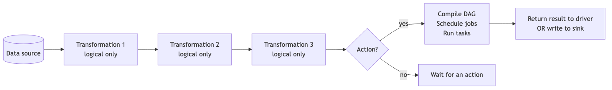

### Transformations — lazy, return a new DataFrame

`select`, `filter`, `where`, `withColumn`, `withColumnRenamed`, `drop`, `distinct`, `dropDuplicates`, `groupBy`, `agg`, `join`, `union`, `unionByName`, `crossJoin`, `orderBy`, `sort`, `sortWithinPartitions`, `repartition`, `coalesce`, `cache`, `persist`, `sample`, `limit`, `map`, `flatMap`, `mapPartitions`, `pivot`, `na.drop`, `na.fill`, `withColumns` (Spark 3.3+), `selectExpr`, ...

⚠️ `cache()` is a **transformation**. It marks the DataFrame for caching when next computed; it doesn't trigger computation by itself.

### Actions — eager, trigger execution

| Action | What it does |
|---|---|
| `collect()` | Pull all rows to driver as a list of Row |
| `count()` | Count rows |
| `show(n)` | Print first n rows |
| `take(n)` / `head(n)` | First n rows as a list |
| `first()` | First row |
| `foreach(fn)` | Apply function to each row (no return) |
| `foreachPartition(fn)` | Apply function per partition |
| `toPandas()` | Convert to pandas DataFrame (driver-side) |
| `toLocalIterator()` | Iterator that lazily pulls partitions |
| `write...save()` / `saveAsTable()` / `parquet()` etc. | Write to storage |
| `describe()` / `summary()` | Compute descriptive statistics (yes, action) |
| `printSchema()` | Print schema (no — this is action-LIKE but **doesn't trigger execution**; just inspects logical plan) |

⚠️ **Edge case: `printSchema()` is not really an action** in the sense of triggering a job. It only inspects the *logical plan's schema*. The exam might still loosely call it an action; treat it as "schema inspection, no execution."

### `cache()` / `persist()` is a transformation

```python
df = df.cache()  # marks for caching, NO execution yet
df.count()       # this action triggers execution AND populates the cache
df.count()       # this re-uses the cache; much faster
```

---

## Narrow vs wide — the complete list (HIGH-VALUE)

A **narrow transformation** is one where **each output partition depends on at most one input partition** — no shuffle.

A **wide transformation** is one where **output partitions depend on multiple input partitions** — requires shuffle.

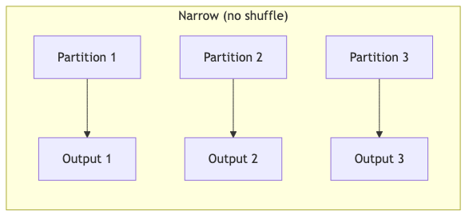

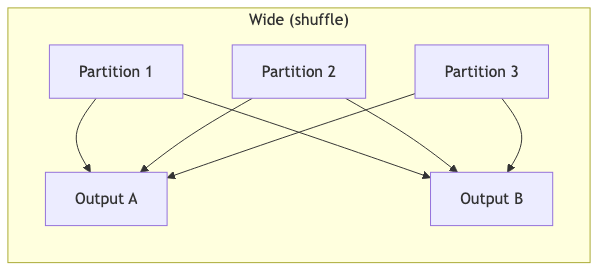

### Narrow transformations

| Operation | Why narrow |
|---|---|
| `select(*cols)` | Column projection, no row movement |
| `filter(cond)` / `where(cond)` | Row predicate, each partition independently |
| `withColumn(name, expr)` | Per-row column derivation |
| `withColumnRenamed(old, new)` | Schema-only change |
| `withColumns({...})` (3.3+) | Multi-column derive |
| `drop("col")` | Schema-only |
| `selectExpr(...)` | Same as select |
| `map(fn)`, `flatMap(fn)`, `mapPartitions(fn)` | RDD-level, per-partition |
| `sample(fraction)` | Independent sampling per partition |
| **`union(otherDf)` / `unionAll`** | **Concatenates partitions — NO shuffle.** ⚠️ Exam trap. |
| **`unionByName(otherDf)`** | Same as union, matched by column name. Still narrow. |
| **`coalesce(n)` (DataFrame method)** | **Combines partitions on same executor; NO shuffle.** ⚠️ Different from `F.coalesce` SQL function. |
| `limit(n)` | Narrow at executor; followed by a small driver-side merge |
| `sortWithinPartitions(*cols)` | Per-partition sort; NO global sort |
| `na.drop()`, `na.fill()`, `na.replace()` | Per-row null handling |
| `crossJoin(small_df)` with broadcast | Narrow on the large side |
| `join(broadcast(small_df), ...)` | Narrow on the large side |

### Wide transformations

| Operation | Why wide |
|---|---|
| `groupBy(*cols).agg(...)` | Rows with same key must collocate → shuffle |
| `distinct()` | Implemented as `groupBy(*all_cols).agg(first)` → shuffle |
| `dropDuplicates(subset)` | Same — shuffle by subset |
| **`orderBy(*cols)` / `sort(*cols)`** | Global ordering requires range-partition shuffle |
| `repartition(n)` | Round-robin reshuffle to n partitions |
| `repartition(col)` | Hash shuffle by column |
| `repartition(n, col)` | Hash shuffle by column into n partitions |
| `join` (sort-merge or shuffle hash) | Both sides shuffled by key |
| `pivot` | Implicit grouping → shuffle |
| **Window functions with `partitionBy`** | Shuffle by partition column |
| `cube`, `rollup` | Implicit grouping → shuffle |

### The exam-trap matrix

| Question would be: "Is X a wide transformation?" | Answer | Why |
|---|---|---|
| `df.union(df2)` | **No (narrow)** | Concatenates partitions |
| `df.coalesce(10)` | **No (narrow)** | No shuffle; combines on same executor |
| `df.repartition(10)` | **Yes (wide)** | Full reshuffle |
| `df.cache()` | Neither — it's a hint, not really a transformation that does work |
| `df.distinct()` | **Yes (wide)** | Implicit groupBy |
| `df.filter(...)` | **No (narrow)** | Per-row |
| `df.dropDuplicates()` | **Yes (wide)** | Shuffle by subset of cols |
| `df.withColumn("x", F.col("a") + 1)` | **No (narrow)** | Per-row derive |
| `df.sortWithinPartitions("ts")` | **No (narrow)** | Per-partition sort |
| `df.orderBy("ts")` | **Yes (wide)** | Global sort |
| `df.sample(0.1)` | **No (narrow)** | Per-partition sample |

### Why `union` confuses people

`union(df1, df2)` resembles SQL's `UNION ALL` semantically — it appends rows. People assume "merging two tables = shuffle." But under the hood, `union` is just `partitions(df1) ++ partitions(df2)`. No data movement. No shuffle.

If you want **deduplication** (SQL `UNION` semantics), you do `df1.union(df2).distinct()` — which adds a wide step *because of* `distinct`, not because of `union`.

### Why `coalesce` is narrow

`coalesce(n)` only **decreases** partition count. It works by **combining adjacent partitions on the same executor** — no data leaves the executor.

```
Before coalesce(2):
  Executor A: [P0, P1]
  Executor B: [P2, P3]

After coalesce(2):
  Executor A: [P0+P1]
  Executor B: [P2+P3]
```

⚠️ The trade-off: `coalesce` can leave you with **unbalanced** partitions (if input partitions had very different sizes). For balanced reshuffle, use `repartition`.

⚠️ The other trap: there's a *SQL function* also called `coalesce` (`F.coalesce(c1, c2, c3)`) that returns the first non-null **value**. Completely unrelated to the partition method. Module 05 covers it.

---

## Catalyst optimizer — the brain of Spark SQL

Every DataFrame/SQL query goes through Catalyst:

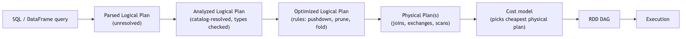

### Catalyst optimization rules (selected highlights)

- **Predicate pushdown:** `filter` moves below `join` and into the file scan.
- **Projection pruning:** unused columns dropped at the scan.
- **Constant folding:** `WHERE 1=1` becomes a no-op; `WHERE 2 > 1` removed.
- **Column pruning across joins:** if you only select 2 columns post-join, the join only reads those (+ join keys).
- **Filter combine:** `df.filter(a).filter(b)` becomes `df.filter(a AND b)`.
- **Subquery elimination:** correlated subqueries rewritten as joins where possible.
- **Partition pruning:** for partitioned tables, only relevant partitions are scanned.

### Inspecting the plan

```python
df.explain()                    # physical plan
df.explain(True)                # all four plans
df.explain(mode="formatted")    # readable formatted plan (Spark 3.0+)
df.explain(mode="cost")         # plan with cost estimates
df.explain(mode="codegen")      # generated code
```

Example:

```
== Physical Plan ==
*(2) HashAggregate(keys=[event_type], functions=[count(1)])
+- Exchange hashpartitioning(event_type, 200)
   +- *(1) HashAggregate(keys=[event_type], functions=[partial_count(1)])
      +- *(1) Project [event_type]
         +- *(1) Filter (year = 2025)
            +- *(1) FileScan parquet [event_type, year] PushedFilters: [year=2025]
```

Reading top-down:
- `*(2)` = stage 2; `*(1)` = stage 1 (separated by the `Exchange` = shuffle).
- `partial_count` then `count` = map-side + reduce-side aggregation (combine).
- `FileScan ... PushedFilters: [year=2025]` = the filter pushed down to scan.

---

## Lineage and fault tolerance

The DAG records, for every DataFrame, **how to recompute it from the source**.

```python
df = spark.read.parquet("s3://x/data/")
df2 = df.filter("year=2025")
df3 = df2.groupBy("region").count()
```

Each transformation builds up the lineage. If an executor dies and a partition is lost mid-job:

1. Spark sees the partition is missing.
2. Looks at the lineage to find how it was computed.
3. Recomputes from the upstream parent partitions.
4. If those are also gone, walks further back, ultimately to the source file.

This is why `cache()` is useful: it **truncates the recompute chain** — Spark doesn't have to walk lineage past the cached point.

⚠️ **Important:** with **wide transformations**, lineage isn't enough — the shuffle write files are also stored on local disk and re-used for re-runs *within the same job*. But across jobs, you need a cache or a checkpoint.

### Checkpoint vs cache

| | cache / persist | checkpoint |
|---|---|---|
| Storage | Executor memory / local disk | Reliable storage (HDFS, S3) |
| Lineage | Preserved (used for fault recovery) | **Truncated** (lineage replaced with read from checkpoint location) |
| Fault tolerance | Loses on executor death | Survives all failures |
| Cost | Cheap | Expensive (writes to durable storage) |
| Use case | Repeated reads within a job | Iterative jobs where lineage grows long (ML) |

Set: `spark.sparkContext.setCheckpointDir("hdfs://...")` then `df.checkpoint()`.

---

## DAG → Job → Stage → Task

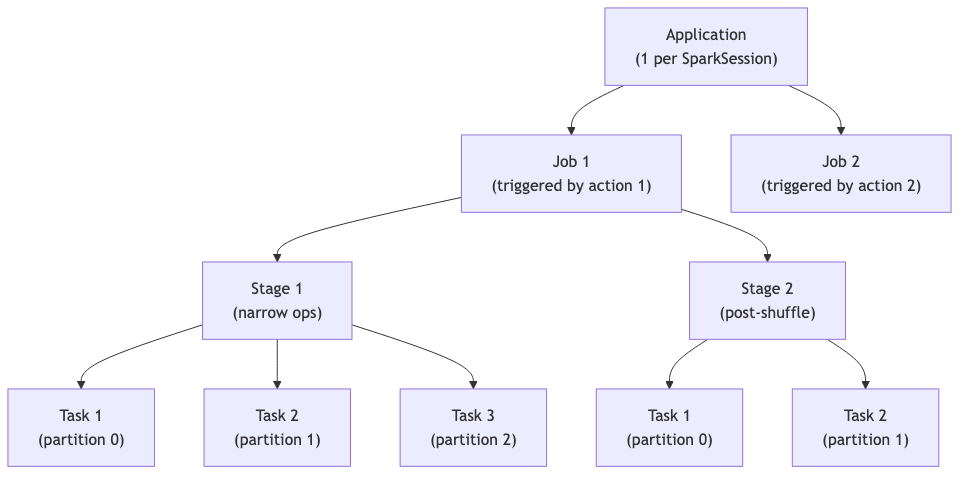

**Rules:**

- One **Job** per action.
- One **Stage** boundary per shuffle (wide transformation).
- Within a stage, narrow transformations are **pipelined** into a single pass over each partition.
- One **Task** per partition per stage.

### Worked example

```python
df = spark.read.parquet("...")  # 100 input partitions
df = df.filter("year=2025")     # narrow — same stage
df = df.select("a", "b")        # narrow — same stage
df = df.groupBy("a").count()    # wide — Stage 1 ends, Stage 2 begins
df.show(20)                     # ACTION — triggers 1 Job
```

- **Job 1** (triggered by `show`).
- **Stage 1**: read → filter → select → map-side partial count. 100 tasks (one per input partition).
- **Stage 2**: shuffle read → final count. 200 tasks (default `spark.sql.shuffle.partitions`).
- `show(20)` then collects 20 rows to the driver from any task that has them.

### Stage skipping (AQE/cache effect)

If a stage's output was cached or already shuffled, Spark may **skip** that stage in subsequent jobs. The Spark UI marks these stages with "skipped."

---

## The shuffle in detail

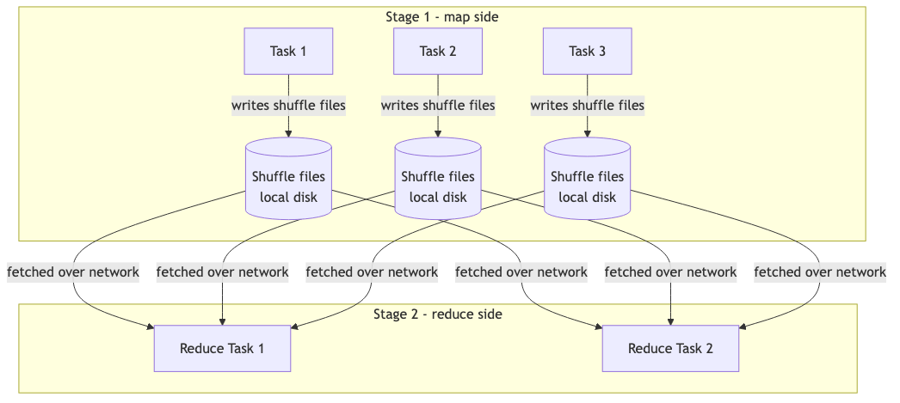

### Two halves

1. **Shuffle write (map side):** each task in the upstream stage partitions its output by the shuffle key (e.g., the `groupBy` column) and writes one file per downstream partition to **local disk**.

2. **Shuffle read (reduce side):** each task in the downstream stage fetches its assigned chunks from every upstream task across the network.

### Spill to disk

If the in-memory hash table (for aggregations) or sort buffer exceeds available execution memory, Spark **spills sorted/partial state to local disk**. Spills appear in Spark UI Stages tab as "Spill (Memory)" and "Spill (Disk)."

Reducing spill:
- Increase executor memory.
- Reduce per-task data volume (more partitions).
- Pre-filter and pre-aggregate before the shuffle.

### Shuffle cost

The shuffle is **the most expensive operation in Spark** because it involves:
- Local disk I/O (write + read).
- Network transfer between executors.
- Serialization/deserialization.
- Sort (for sort-merge join) or hash-table build (for shuffle hash join).

The whole point of Catalyst optimization is **minimizing shuffles**.

---

## Output-prediction drills

Each drill: predict the answer **cold**, then verify against the explanation.

### Drill 1 — How many jobs?

```python
df = spark.read.parquet("data/")   # 1
df = df.filter("year=2025")        # 2
df = df.select("a", "b")           # 3
df.cache()                         # 4
df.count()                         # 5
df.count()                         # 6
df.show(5)                         # 7
df.write.parquet("out/")           # 8
```

**Q:** How many Spark jobs are triggered? Which lines trigger them?

**A:** **4 jobs.** Lines 1–4 are lazy. Line 5 (`count()`) triggers job 1 (and populates the cache). Line 6 (`count()`) triggers job 2 — reads from cache, fast. Line 7 (`show(5)`) triggers job 3. Line 8 (`write`) triggers job 4.

Trap: `df.read.parquet()` alone does NOT trigger a job in Spark 3.5 when schema is inferred from Parquet footers (cheap metadata read, not a full job). If `inferSchema=True` for CSV, that does trigger an extra job.

### Drill 2 — Partition count after a chain

```python
df = spark.range(0, 1000).repartition(8)   # 8 partitions
df2 = df.filter("id % 2 = 0")              # ?
df3 = df2.groupBy("id").count()            # ?
df4 = df3.coalesce(5)                      # ?
```

**Q:** How many partitions does each of `df`, `df2`, `df3`, `df4` have? (Assume default `spark.sql.shuffle.partitions=200`, AQE disabled.)

**A:**
- `df`: **8** (explicit repartition).
- `df2`: **8** (filter is narrow, preserves partition count).
- `df3`: **200** (groupBy is wide → post-shuffle = `spark.sql.shuffle.partitions`).
- `df4`: **5** (coalesce reduces).

With AQE enabled, `df3` could be coalesced down further at runtime.

### Drill 3 — Narrow or wide?

For each, write N (narrow) or W (wide):

```python
df.union(df2)                                          # ?
df.unionByName(df2)                                    # ?
df.coalesce(10)                                        # ?
df.repartition(10)                                     # ?
df.repartition("country")                              # ?
df.distinct()                                          # ?
df.dropDuplicates(["id"])                              # ?
df.filter("x > 0")                                     # ?
df.withColumn("y", F.col("x") + 1)                     # ?
df.withColumn("rn", F.row_number().over(window))       # ?
df.sortWithinPartitions("ts")                          # ?
df.orderBy("ts")                                       # ?
df.sample(0.1)                                         # ?
df.join(F.broadcast(small), "k")                       # ?
df.join(big, "k")                                      # ?
df.crossJoin(small)                                    # ?
df.na.drop()                                           # ?
df.intersect(df2)                                      # ?
df.exceptAll(df2)                                      # ?
df.limit(10)                                           # ?
```

**A:** N, N, N, W, W, W, W, N, N, **W** (window function triggers shuffle by partitionBy), N, W, N, **N (broadcast = no shuffle on the large side)**, **W (sort-merge or shuffle-hash)**, N (cross with broadcast), N, W, W, N.

⚠️ **Trap:** `withColumn` is narrow EXCEPT when the expression contains a window function — then it's wide because of the window.

### Drill 4 — `cache()` materialization timing

```python
df = spark.read.parquet("path/")  # lazy
df = df.filter("x > 0")           # lazy
df = df.cache()                   # lazy hint
print("here")                     # only prints "here"; no Spark job
df.show(5)                        # triggers job, populates cache
df.count()                        # reads from cache (no re-read from parquet)
df.unpersist()                    # marks for eviction
df.count()                        # re-reads from parquet
```

**Q:** Which lines trigger Spark jobs?

**A:** Only `df.show(5)`, `df.count()` (twice). The first `count` reads from cache; after `unpersist`, the second `count` re-reads from source.

### Drill 5 — Plan inspection: what does `.explain()` show after a filter?

```python
df = spark.read.parquet("path/")
df.filter(F.col("year") == 2025).select("user_id", "event_type").explain()
```

**Q:** Where does the filter appear in the physical plan?

**A:** As a **`PushedFilters: [IsNotNull(year), EqualTo(year, 2025)]`** annotation on the `FileScan parquet` node — the filter is **pushed down to the scan**, not applied as a separate Filter node. The Project (select) is also pushed down: only `user_id`, `event_type`, `year` (the filter column) are read from disk.

### Drill 6 — Stage boundaries

```python
df = (spark.read.parquet("path/")          # stage 1
    .filter("year=2025")                   # stage 1
    .select("a", "b")                      # stage 1
    .groupBy("a").count()                  # shuffle → stage 2
    .orderBy("count"))                     # shuffle → stage 3
df.show(20)                                # triggers
```

**Q:** How many stages does this trigger?

**A:** **3 stages.** `read → filter → select → partial groupBy` (stage 1, ends at shuffle). Shuffle write to disk. `final groupBy → partial sort prep` (stage 2). Shuffle for `orderBy`. `final sort → show` (stage 3).

`show(20)` may also short-circuit and skip some sort work if it only needs 20 rows — `limit + sort` optimizations apply.

---

## End-to-end mini-scenario

```python
events = spark.read.parquet("s3://lake/events/")    # 10 TB, partitioned by date
dim_users = spark.read.parquet("s3://lake/users/")  # 100 MB

# Stage A: filter events early (push down date)
events_recent = events.filter("date >= '2025-01-01'").select("user_id", "amount", "country")

# Stage B: cache filtered events (small enough now)
events_recent = events_recent.cache()

# Stage C: aggregate
agg = events_recent.groupBy("country").agg(
    F.sum("amount").alias("rev"),
    F.approx_count_distinct("user_id").alias("uniq_users"),
)

# Stage D: enrich with user count via broadcast
result = agg.join(F.broadcast(dim_users.groupBy("country").count()), "country")

# Final: write
result.write.mode("overwrite").parquet("s3://lake/country_summary/")
```

**Job/stage analysis:**
- 1 application, ~1 job (the `write`).
- Stage 1: `events` scan (partition-pruned to `date >= '2025-01-01'`, columns pruned to 3) → filter → select → cache write → map-side partial aggregation.
- Stage 2: shuffle for `groupBy("country")` → final agg.
- Stage 3: `dim_users` scan → groupBy("country") → count.
- Stage 4: broadcast `dim_users` count → BHJ with `agg` → write.

Cache materializes during stage 1's execution. Subsequent queries against `events_recent` (e.g., a debug `.count()`) reuse it.

---

## Mini-quiz

1. Is `df.cache()` a transformation or an action?
2. Is `df.union(other)` narrow or wide?
3. Is `df.distinct()` narrow or wide?
4. What does Catalyst do with `df.filter("year=2025").filter("region='US'")`?
5. Why does `coalesce(n)` not shuffle?
6. What's the difference between `sortWithinPartitions` and `orderBy`?
7. Lineage vs checkpoint — which truncates the recompute chain?
8. After `df = df.cache()`, when does the data actually get cached?
9. How many tasks run in a stage with N partitions?
10. What happens to shuffle files when a stage completes?

### Answers

1. **Transformation.** It's a hint; no execution happens. Data caches on the first action that triggers computation.
2. **Narrow.** Concatenates partitions; no shuffle.
3. **Wide.** Implemented as `groupBy(*all_cols)` — shuffles by all columns.
4. **Combines them** into `df.filter("year=2025 AND region='US'")`. Both pushed down to the file scan.
5. It only **decreases** partition count by **combining on the same executor**. No data leaves the node.
6. `sortWithinPartitions` sorts each partition independently (narrow). `orderBy` produces a **global sort** via range-partition shuffle (wide).
7. **Checkpoint** truncates lineage by replacing the chain with a "read from reliable storage" node. Cache preserves lineage (it can be lost if a node dies).
8. On the **next action** that materializes the DataFrame.
9. **N tasks.**
10. They're kept on local disk **until the job ends** (or the executor cleans them up). Re-runs within the same job can re-use them; the next job typically re-computes.

---

## Exam-day cheat sheet

- **`union` is narrow.** ⚠️
- **DataFrame `.coalesce(n)` is narrow.** SQL function `F.coalesce(c1, c2)` returns first non-null (unrelated).
- **`distinct` and `dropDuplicates` are wide** (implicit groupBy).
- **Window functions with `partitionBy` are wide.**
- **`orderBy` is wide; `sortWithinPartitions` is narrow.**
- **Actions trigger jobs.** Transformations are lazy.
- **One job per action; one stage per shuffle boundary; one task per partition.**
- **Catalyst optimizes: predicate pushdown, projection pruning, constant folding, filter combine.**
- **`df.explain(True)` shows all four plans.**
- **Cache preserves lineage; checkpoint truncates it.**
- **Lineage = the chain of transformations; enables fault-tolerant recompute.**

Next: [Module 03 — Execution Model: Jobs, Stages, Tasks](03_execution_model.md).


\newpage

# Module 03 — Execution Model: Jobs, Stages, Tasks

> **Domain 1 of 7 — Architecture & Components (20%).**
> **Goal:** Operationalize the execution hierarchy. Speculative execution. Dynamic allocation. Spill mechanics. How task failures retry. What "stage retry" means. The runtime behaviors the exam asks about indirectly via "why is this happening?" questions.

---

## Coverage map

Verbatim Oct 2025 exam objectives covered by this module:

| Objective (Section 1 — Architecture, 20%) | Section |
|---|---|
| "Explain the Apache Spark Architecture execution hierarchy." | [Recap: the hierarchy](#recap-the-hierarchy), [The job lifecycle in detail](#the-job-lifecycle-in-detail) |
| "Configure Spark partitioning in distributed data processing, including shuffles and partitions." | [Where the "200" comes from](#where-the-200-comes-from), [Partitioning at read time](#partitioning-at-read-time), [Repartitioning vs coalescing](#repartitioning-vs-coalescing-refresh) |
| "Describe the architecture of Apache Spark, including ... garbage collection." | [Garbage collection patterns](#garbage-collection-patterns) |
| "Describe the execution patterns of the Apache Spark engine, including actions, transformations, and lazy evaluation." | [Task scheduling](#task-scheduling), [Task failures and retries](#task-failures-and-retries) |

---

> 🎯 **How to recognize this on the exam:**
> - "What does `spark.sql.shuffle.partitions=200` set?" → **Post-shuffle** partition count, NOT read-side. Sample Q5.
> - "How many tasks in a stage with N partitions?" → **N**.
> - "Default task retry count?" → **4** (`spark.task.maxFailures`).
> - "Is speculative execution on by default?" → **No** in OSS Spark.
> - "Is dynamic allocation on by default?" → **No** in OSS Spark (yes on Databricks).
> - "Read-side partition size config?" → `spark.sql.files.maxPartitionBytes` = **128 MB**.
> - "Why is `.collect()` risky?" → driver OOM; rows all materialize in driver heap.
> - "What happens when an executor dies?" → tasks rescheduled; cached partitions lost; lineage recomputes.
> - "What causes Spill (Disk) in Spark UI?" → execution memory insufficient; spills sort/hash state to local disk.
> - If `repartition(500)` on a DataFrame with 200 partitions → **500** (full shuffle, can increase). If `coalesce(500)` → **200** (cannot increase).

---

## Recap: the hierarchy

```
Application                      (one per SparkSession)
  └─ Job                         (one per action)
       └─ Stage                  (one per shuffle boundary; "ShuffleMapStage" or final "ResultStage")
            └─ Task              (one per partition)
                 └─ runs as a thread on an executor core
```

Module 02 covered how the DAG is built from lazy transformations and which transformations trigger stage boundaries. This module covers **what actually happens at runtime** — speculative execution, failure recovery, dynamic allocation, spill behavior, the diagnostic signals.

---

## The job lifecycle in detail

```mermaid
sequenceDiagram
    participant U as User
    participant D as Driver (DAG + Task Scheduler)
    participant CM as Cluster Manager
    participant E as Executor

    U->>D: df.count() (action)
    D->>D: Compile logical → physical plan
    D->>D: Decompose into stages by shuffle boundary
    D->>CM: Request executors (if dynamic alloc on)
    CM->>E: Launch executor JVM
    E->>D: Register; heartbeat starts
    D->>E: Submit Stage 1 tasks (one per partition)
    E->>E: Run tasks; cache blocks; write shuffle files
    E->>D: Task status (success / fail / retry needed)
    D->>D: Stage 1 complete → submit Stage 2
    D->>E: Submit Stage 2 tasks (post-shuffle)
    E->>E: Read shuffle files from Stage 1; compute
    E->>D: Stage 2 complete → final result rows
    D->>U: Return result (or write)
```

### Stage types

| Stage type | What it produces |
|---|---|
| **ShuffleMapStage** | Writes shuffle files for the next stage |
| **ResultStage** | Produces the final result (for the action) |

The last stage is always a ResultStage; everything before it is a ShuffleMapStage.

### Where the "200" comes from

Default `spark.sql.shuffle.partitions = 200`. After any wide transformation, the downstream stage has 200 tasks unless AQE coalesces them (Module 10).

```python
spark.conf.set("spark.sql.shuffle.partitions", "400")
```

⚠️ **Exam trap:** `spark.sql.shuffle.partitions` controls **post-shuffle** partition count, NOT every DataFrame's partition count. The official sample Q5 tests this — many candidates think it sets the read-side partition count.

The number of partitions when you **read** a file is determined by:
- File size and `spark.sql.files.maxPartitionBytes` (128 MB default).
- Number of files and `spark.sql.files.openCostInBytes` (4 MB default, used as a per-file overhead estimate).
- Cluster's `spark.default.parallelism`.

---

## Task scheduling

The driver's **TaskScheduler** sends tasks to executors based on:

### Locality preferences

Spark schedules tasks to **maximize data locality** — running a task on the executor that already has the data in memory.

| Locality level | Meaning |
|---|---|
| **PROCESS_LOCAL** | Data is already in the executor's JVM (cached) |
| **NODE_LOCAL** | Data is on the same node (HDFS replica, or cached on another executor on same node) |
| **RACK_LOCAL** | Data is on the same rack |
| **ANY** | Anywhere |

If the preferred locality isn't available, Spark **waits** for a configurable timeout (`spark.locality.wait` default 3s) before falling back to the next-best locality.

⚠️ Not deeply exam-tested but can appear: "Which locality level is best?" → PROCESS_LOCAL.

### FIFO vs FAIR scheduling

| | FIFO (default) | FAIR |
|---|---|---|
| Multiple concurrent jobs | First-in queues block later jobs | Round-robin between job pools |
| Use case | Single-user batch | Shared cluster, multiple users |

Set via `spark.scheduler.mode`. Most exam questions assume FIFO.

---

## Task failures and retries

```mermaid
flowchart TB
    T[Task launched] -->|completes| OK[Task SUCCESS]
    T -->|exception| FAIL[Task FAILED]
    FAIL --> CHECK{Retries < spark.task.maxFailures (default 4)?}
    CHECK -->|yes| RETRY[Re-launch task<br/>(possibly on different executor)]
    CHECK -->|no| STAGE_FAIL[Stage FAILED]
    STAGE_FAIL --> JOB_FAIL[Job FAILED]
    RETRY --> T
```

### Settings

- `spark.task.maxFailures` (default 4): per-task retry limit. After 4 failures of the same task, the **stage fails** and the job fails.
- `spark.stage.maxConsecutiveAttempts` (default 4): how many stage-level retries before giving up.

### Executor death

When an executor dies (OOM, network failure, spot preemption):
- All tasks running on it fail.
- All cached blocks on it are lost (and must be recomputed via lineage if needed downstream).
- The cluster manager may relaunch the executor.

⚠️ **Exam framing:** "What happens if an executor dies mid-stage?" → tasks rescheduled to surviving executors; cached partitions lost; lineage recomputes them as needed.

---

## Speculative execution

```python
spark.conf.set("spark.speculation", "true")
```

**Default: OFF in OSS Spark.** When ON:

- Spark monitors task duration within a stage.
- If a task is running significantly slower than the median (controlled by `spark.speculation.quantile`, `spark.speculation.multiplier`), Spark **launches a duplicate** of that task on another executor.
- Whichever finishes first wins; the other is killed.

**When useful:**
- Heterogeneous cluster nodes (some slower than others).
- Spot/preemptible instances with variable performance.
- Stragglers from minor data skew where AQE skew handling didn't catch the issue.

**When harmful:**
- Tasks have **side effects** (e.g., writing to non-idempotent sinks) — could double-write.
- Pure compute jobs with predictable timing — adds overhead without benefit.

⚠️ **Exam framing:** "What is speculative execution?" → Spark launches duplicate copies of slow-running tasks to mitigate stragglers; off by default.

---

## Dynamic allocation

```python
spark.conf.set("spark.dynamicAllocation.enabled", "true")
```

**Default: OFF in OSS Spark; ON on Databricks (where it's called "autoscaling").**

When ON, the driver requests more executors when there's a backlog of pending tasks, and releases executors that have been idle for `spark.dynamicAllocation.executorIdleTimeout` (default 60s).

### Key configs

- `spark.dynamicAllocation.minExecutors`
- `spark.dynamicAllocation.maxExecutors`
- `spark.dynamicAllocation.initialExecutors`
- `spark.dynamicAllocation.executorIdleTimeout` (default 60s)
- `spark.dynamicAllocation.schedulerBacklogTimeout` (default 1s; how long to wait for backlog before requesting more)

### Requirement: external shuffle service

When executors are removed, their **shuffle files would be lost** — but downstream stages still need them. So dynamic allocation requires an **external shuffle service** running on each worker (independent of the executor's lifecycle), OR shuffle tracking (`spark.dynamicAllocation.shuffleTracking.enabled` since 3.0).

⚠️ **Not deeply exam-tested**, but useful to know: dynamic allocation needs either the external shuffle service or shuffle tracking, otherwise executors can't be safely removed when they hold shuffle data.

---

## Spill mechanics

When in-memory operations exceed available execution memory, Spark spills to local disk.

### Operations that can spill

| Operation | Why it spills |
|---|---|
| Sort (within partition) | Sort buffer can't fit in memory |
| Hash aggregation (`groupBy`) | Hash table too big |
| Hash join build side (SHJ) | Build-side hash table too big |
| Window function | Within-partition buffer too big |
| Shuffle write | Output partition buffers too big |

### What's spilled

- **Sorted runs** for sort-based operations: spilled, then merged from disk during the final pass.
- **Hash partitions** for hash aggregations: when memory runs out, current partition flushed to disk; later merged.

### Reading spill in the Spark UI

The Stages tab shows per-task:
- **Spill (Memory)**: in-memory size of spilled data before serialization.
- **Spill (Disk)**: on-disk size of spilled data (post-serialization, usually smaller).

Heavy spill is a signal to:
- Increase executor memory (`spark.executor.memory`).
- Increase shuffle partitions (`spark.sql.shuffle.partitions`) to reduce per-task data.
- Pre-aggregate before the wide step.

⚠️ **Exam framing:** "What causes disk spill?" → execution memory insufficient for the operation; Spark spills sorted/hashed state to local disk.

---

## Partitioning at read time

When you do `spark.read.parquet("path")`, the number of partitions in the resulting DataFrame depends on file layout:

### One partition per file (usually)

- For **splittable formats** (Parquet, ORC), Spark may read multiple files in one partition or split a single large file into multiple partitions.
- Target partition size: `spark.sql.files.maxPartitionBytes` (default **128 MB**).
- Per-file overhead estimate: `spark.sql.files.openCostInBytes` (default **4 MB**) — added to each file's size for the partition-packing calculation.

### Reading 1000 small files

If you read 1000 × 1 MB Parquet files:
- Each file is 1 MB; openCost is 4 MB; effective per-file "size" = 5 MB.
- Spark packs files into 128 MB partitions → ~25 files per partition.
- You get ~40 partitions.

But if you've **also** set `spark.sql.shuffle.partitions=200` and the next op is a shuffle, the downstream stage will have 200 tasks.

⚠️ **Exam framing:** "I read 1000 files but only get 40 partitions" → file packing into 128 MB partitions is the explanation.

---

## Repartitioning vs coalescing (refresh)

```python
df.rdd.getNumPartitions()      # current count
df.repartition(400)            # WIDE — full shuffle, balanced
df.coalesce(50)                # NARROW — combine on executors, can only decrease
df.repartition("region")       # WIDE — hash by region
df.repartition(50, "region")   # WIDE — hash by region into 50 partitions
df.sortWithinPartitions("ts")  # NARROW — sort within each partition
```

| Want to... | Use |
|---|---|
| Reduce partition count (small data, write fewer files) | `coalesce(n)` |
| Increase partition count | `repartition(n)` |
| Co-locate rows with same key (pre-join optimization) | `repartition(col)` |
| Balance partitions after a skewed shuffle | `repartition(n)` |

⚠️ **`coalesce` cannot increase** partition count. If you call `df.coalesce(1000)` on a 200-partition DataFrame, you still get 200.

---

## The "small files problem" and the "too few partitions" problem

### Too few partitions (under-parallelism)

```
Executors: 20 cores
Partitions: 4

Result: 16 cores idle; 4 tasks running serial-ish on 4 executors
Fix: repartition(40-200) — let Spark distribute work
```

### Too many partitions (overhead-dominated)

```
Executors: 20 cores
Partitions: 100,000

Result: scheduling overhead, tiny tasks (~10ms each), GC pressure
Fix: coalesce(200-400) — bigger tasks
```

Rule of thumb: aim for partitions where each task processes **~100 MB to 1 GB** of data and takes **30s-3min**. Smaller and you're scheduling-bound; larger and you risk memory/spill.

---

## What "shuffle write" and "shuffle read" mean in the UI

In the Spark UI Stages tab, each stage shows:

| Column | Meaning |
|---|---|
| **Shuffle Write** | Bytes written to local disk by tasks in this stage (consumed by downstream stage) |
| **Shuffle Read** | Bytes fetched from upstream stages' shuffle files |
| **Input Size / Records** | Bytes/rows read from data sources |
| **Output Size / Records** | Bytes/rows written to data sinks |
| **Spill (Memory) / Spill (Disk)** | Per-task spill |

Diagnostic signals:
- Huge **Shuffle Read** in a single task → skew.
- Huge **Spill (Disk)** → memory pressure; increase memory or partitions.
- Huge **Input Size** but small **Output** in early stages → consider predicate pushdown.

---

## Driver-side execution

Some operations happen entirely on the driver:

| Operation | Why driver-only |
|---|---|
| `df.collect()` | All rows shipped to driver |
| `df.toPandas()` | All rows + conversion to pandas |
| `df.toLocalIterator()` | Streams partitions to driver |
| `df.head(n)` / `take(n)` | Pulls first N rows |
| `df.first()` | Pulls one row |
| Broadcast variable creation | Driver materializes value before shipping |
| Catalyst optimization | Driver-side query planning |

⚠️ **Driver OOM is real.** `.collect()` on a 10 GB DataFrame OOMs the driver. Sample question: "What happens when you call `.collect()` on a large dataset?" → driver-side OOM risk.

Use `.show(n)`, `.take(n)`, or write to storage if you don't need all rows.

---

## Garbage collection patterns

```
Healthy:
  GC time per executor < 10% of task time
  Young-gen collections only

Memory-pressured:
  Full GCs occurring
  GC time > 30%
  
Solutions:
  - Increase executor memory
  - Use Kryo serializer
  - Reduce cached data
  - Move to MEMORY_AND_DISK_SER caching
  - Reduce per-task data (more partitions)
```

⚠️ Not deeply exam-tested. Just know "long GC = memory pressure" and "Kryo serializer compresses better than Java serializer."

---

## Broadcast variables and accumulators (preview)

These are SparkContext-level constructs, not DataFrame-level:

```python
sc = spark.sparkContext

# Broadcast variable — read-only, shipped to all executors
lookup = {"A": 1, "B": 2, "C": 3}
bv = sc.broadcast(lookup)

@F.udf("int")
def lookup_udf(key):
    return bv.value.get(key, -1)

# Accumulator — write-only counter
ac = sc.accumulator(0)

def count_rows(row):
    ac.add(1)

df.foreach(count_rows)
print(ac.value)  # approximate; may double-count on retries
```

### Restrictions

- **Spark Connect clients have NO `sc.broadcast` or `sc.accumulator`** (Module 12).
- **Accumulators are NOT fault-tolerant for business logic** — task retries may increment them multiple times.
- **`F.broadcast(df)`** is a totally different concept — a join hint to broadcast a DataFrame for a broadcast hash join (Module 09).

---

## Mini-quiz

1. How many tasks run in a stage with 50 partitions?
2. What's the default `spark.sql.shuffle.partitions`?
3. What's the difference between `repartition(50)` and `coalesce(50)` on a 200-partition DataFrame?
4. What does speculative execution do?
5. Is dynamic allocation on by default in OSS Spark?
6. After a task fails 4 times (default), what happens?
7. What causes a Spill (Disk) entry in the Spark UI?
8. Why is `.collect()` risky on a large DataFrame?
9. What's the difference between a broadcast variable and `F.broadcast(df)`?
10. Can `coalesce(500)` increase partitions from 200 to 500?

### Answers

1. **50.**
2. **200.**
3. `repartition(50)` is a **full shuffle** to exactly 50 balanced partitions. `coalesce(50)` is **narrow**, combining partitions on the same executor to get to 50 (or fewer, if executors don't have enough partitions). Can leave unbalanced.
4. Spark launches **duplicate copies of slow-running tasks** on other executors; whichever finishes first wins.
5. **No, off by default.** Databricks turns it on (autoscaling).
6. The **stage fails** and the job fails.
7. Execution memory was insufficient for sort/hash/window state, so Spark spilled to local disk.
8. Driver-side OOM — all rows materialize in driver heap.
9. **`sc.broadcast(value)`** is a read-only Python value shipped to executors. **`F.broadcast(df)`** is a join hint that causes Spark to broadcast a DataFrame for a broadcast hash join. Same word, very different mechanisms.
10. **No.** `coalesce` can only decrease.

---

## Exam-day cheat sheet

- **`spark.sql.shuffle.partitions` = 200 by default; controls POST-shuffle partition count, not read-side.** ⚠️
- **Read partitioning** controlled by `spark.sql.files.maxPartitionBytes` (128 MB default).
- **Task retries**: 4 by default; then stage fails.
- **Speculative execution**: OFF by default in OSS Spark.
- **Dynamic allocation**: OFF by default in OSS Spark; ON on Databricks.
- **One task per partition per stage.**
- **`.collect()` on large DF → driver OOM.** Use `.show()`, `.take(n)`, or write to storage.
- **Spill (Disk) in Spark UI = memory pressure.**
- **`coalesce` only decreases; `repartition` always shuffles.**

Next: [Module 04 — Spark SQL Basics](04_spark_sql_basics.md).


\newpage

# Module 04 — Spark SQL Basics

> **Domain 2 of 7 — Using Spark SQL (20%).**
> **Goal:** Master `spark.sql()`, temp views (regular, global, the differences), SQL on files directly, the catalog, save modes, persistent tables vs temp views. The "how do I get SQL semantics on top of DataFrames" surface.

---

## Coverage map

Verbatim Oct 2025 exam objectives covered by this module:

| Objective (Section 2 — Spark SQL, 20%) | Section |
|---|---|
| "Utilize common data sources such as JDBC, files, etc., to efficiently read from and write to Spark DataFrames using Spark SQL, including overwriting and partitioning by column." | [Reading from JDBC](#reading-from-jdbc), [Reading from files — refresh](#reading-from-files--refresh), [Writing to files — modes and options](#writing-to-files--modes-and-options) |
| "Execute SQL queries directly on files, including ORC Files, JSON Files, CSV Files, Text Files, and Delta Files, and understand the different save modes for outputting data in Spark SQL." | [Querying files directly via SQL](#querying-files-directly-via-sql), [Save modes](#save-modes) |
| "Save data to persistent tables while applying sorting and partitioning to optimize data retrieval." | [Persistent tables — saveAsTable](#persistent-tables--saveastable), [Persistent tables — sorting and partitioning](#persistent-tables--sorting-and-partitioning) |
| "Register DataFrames as temporary views in Spark SQL, allowing them to be queried with SQL syntax." | [Temp views](#temp-views) |

---

> 🎯 **How to recognize this on the exam:**
> - "Query files directly via SQL" → backtick syntax: `` SELECT * FROM parquet.`/path/to/file.parquet` ``. NOT single quotes, NOT square brackets.
> - `createTempView` vs `createOrReplaceTempView` → former **throws** if exists; latter idempotent.
> - "Access global temp view" → must qualify as **`global_temp.view_name`**.
> - "Default save mode?" → **`errorIfExists`** (throws if target exists).
> - "Save modes spelling" → `overwrite`, `append`, `ignore`, `errorIfExists` (camelCase, lowercase 'o').
> - "Can `bucketBy` use `save(path)`?" → **No** — bucketing requires `saveAsTable`.
> - "Partition overwrite affects only matching partitions?" → set `spark.sql.sources.partitionOverwriteMode=dynamic`. Default is `static` (full overwrite).
> - "What does `inferSchema=True` do?" → runs an **extra job** to infer types. Prefer explicit schema.
> - "Is `pivot` narrow or wide?" → **wide** (implicit groupBy).
> - "Faster pivot?" → pass **explicit values** to skip the discovery job.

---

## Why this module exists

Two of the seven exam domains are Spark SQL. Most senior PySpark engineers default to DataFrame API for everything and rarely write `spark.sql()`. The exam *does* test:

- `createTempView` vs `createOrReplaceTempView` vs **global** temp view.
- SQL queries on files directly: `SELECT * FROM parquet.` `path` ``.
- Save modes (`overwrite`, `append`, `ignore`, `errorIfExists`).
- `saveAsTable` (persistent) vs temp views.
- The catalog: `spark.catalog.listDatabases()`, `spark.catalog.listTables()`.

Brush up these and you'll get the SQL questions cold.

---

## The two equivalent surfaces

```python
# DataFrame API
result = (df.filter(F.col("age") > 30)
            .groupBy("dept")
            .agg(F.count("*").alias("n")))

# SQL — same query
df.createOrReplaceTempView("people")
result = spark.sql("""
    SELECT dept, COUNT(*) AS n
    FROM people
    WHERE age > 30
    GROUP BY dept
""")
```

Both compile to the **same Catalyst logical plan**. Same optimizations. Same physical plan. Same performance.

Choose by:
- **DataFrame API** — programmatic generation, IDE autocomplete, type hints, easier composition with Python.
- **SQL** — analyst familiarity, complex queries with joins/subqueries are more readable.
- **Mixed** — common: use SQL for the "shape" of the query, DataFrame for transformations.

---

## SparkSession.sql() — the gateway

```python
df_result = spark.sql("SELECT * FROM my_table WHERE x > 10")
```

`spark.sql(query_string)` returns a **DataFrame** — lazy, same as any DataFrame construction. Nothing executes until an action.

You can interpolate Python variables (carefully — SQL injection risk for user input):

```python
threshold = 100
df = spark.sql(f"SELECT * FROM events WHERE score > {threshold}")

# Better — parameter substitution (Spark 3.4+)
df = spark.sql("SELECT * FROM events WHERE score > :t", args={"t": 100})
```

---

## Temp views

Spark SQL needs tables to query. DataFrames can be registered as **temporary views** that exist for the SparkSession's lifetime.

### Three view types

| View type | Scope | API |
|---|---|---|
| **Temporary view** | Current SparkSession only | `df.createOrReplaceTempView("name")` |
| **Global temporary view** | All SparkSessions on the cluster (cross-session) | `df.createOrReplaceGlobalTempView("name")` |
| **Persistent table** | Catalog (Hive metastore / Unity Catalog) — survives cluster restart | `df.write.saveAsTable("name")` |

### `createTempView` vs `createOrReplaceTempView`

```python
df.createTempView("my_view")            # FAILS if view already exists
df.createOrReplaceTempView("my_view")   # always succeeds (replaces if exists)
```

⚠️ **Exam trap:** know that `createTempView` raises `AnalysisException` if the view exists. `createOrReplaceTempView` is the idempotent option used in 99% of real code.

### Global temp views

Global temp views are special:
- They live in a **reserved database called `global_temp`**.
- Access them as `global_temp.<view_name>` — always.
- Shared across SparkSessions on the same Spark application (rare in practice but exam-testable).

```python
df.createOrReplaceGlobalTempView("shared_view")

# Access — must qualify with global_temp
spark.sql("SELECT * FROM global_temp.shared_view")

# This FAILS — no qualifier
spark.sql("SELECT * FROM shared_view")  # AnalysisException: Table not found
```

### Dropping views

```python
spark.catalog.dropTempView("my_view")
spark.catalog.dropGlobalTempView("shared_view")
```

---

## Querying files directly via SQL

You don't need to register a view to query a file. Spark SQL supports:

```sql
SELECT * FROM parquet.`/path/to/file.parquet`
SELECT * FROM json.`/path/to/file.json`
SELECT * FROM csv.`/path/to/file.csv`
SELECT * FROM delta.`/path/to/delta_table`
SELECT * FROM orc.`/path/to/file.orc`
SELECT * FROM text.`/path/to/file.txt`
```

- The format name (`parquet`, `json`, `csv`, `delta`, `orc`, `text`) is the **data source identifier**.
- The path is **backtick-quoted** (because it contains `/` and `.` — characters that SQL would otherwise interpret).
- Schema is **inferred** from the file (or, for Delta, read from the transaction log).

⚠️ **CSV special case:** without options, CSV is read with no header and string-typed columns. You can't pass options through the SQL `parquet.` `path` `` syntax — for non-default options, fall back to `spark.read.option(...).csv(...)` and create a temp view.

⚠️ **Exam trap:** the exact syntax is `format.` `path` `` (backticks around path). NOT quotes; NOT square brackets; NOT `FROM 'path' WITH (format='parquet')`.

### Why this works

The SQL parser sees `parquet.X` where X is a backtick-quoted identifier; it interprets `parquet` as a "database-like" namespace and routes the resolution to the data source registry.

This is mostly an exam-trivia feature in real code — most teams use temp views or persistent tables. But the exam loves it because it tests SQL fluency.

---

## The catalog

The **catalog** is Spark's metadata store — tracking databases, tables, views, functions.

### In-memory catalog (default)

Without configuration, Spark uses an **in-memory catalog** scoped to the SparkSession. Temp views live here. Persistent tables (created with `saveAsTable`) also live here but persist via the underlying metadata store.

### Hive metastore (optional but common)

When `spark.sql.catalogImplementation=hive` (default in Databricks/EMR), Spark uses a Hive-compatible metastore (often a database like MySQL/PostgreSQL backing it). Persistent tables survive cluster restarts.

### Catalog API

```python
spark.catalog.listDatabases()    # all databases
spark.catalog.listTables()       # tables in current database
spark.catalog.listTables("my_db")  # tables in specific database
spark.catalog.listColumns("my_table")
spark.catalog.listFunctions()

spark.catalog.currentDatabase()
spark.catalog.setCurrentDatabase("my_db")

spark.catalog.databaseExists("x")
spark.catalog.tableExists("x")

spark.catalog.dropTempView("v")

# Cache management
spark.catalog.cacheTable("table_name")
spark.catalog.uncacheTable("table_name")
spark.catalog.clearCache()       # uncache everything
spark.catalog.isCached("table_name")
```

⚠️ **Exam framing:** the catalog API isn't deeply tested, but you should recognize names like `listTables()` and `cacheTable()`. Pattern A "which method does X" questions sometimes include catalog distractors.

---

## Persistent tables — `saveAsTable`

```python
df.write.saveAsTable("my_db.my_table")
df.write.mode("overwrite").saveAsTable("my_db.my_table")
df.write.format("parquet").mode("overwrite").saveAsTable("my_db.my_table")
df.write.partitionBy("country").saveAsTable("my_db.my_table")
df.write.bucketBy(10, "user_id").sortBy("ts").saveAsTable("my_db.bucketed_table")
```

### saveAsTable vs save

| | `save(path)` | `saveAsTable(name)` |
|---|---|---|
| Output | Files at a path | Files + catalog entry |
| Discoverable via `spark.catalog.listTables()`? | No | Yes |
| Survives cluster restart? | Files survive; not registered | Yes (if persistent catalog) |
| Bucketing supported? | **No** — bucketing is a Hive/catalog feature | **Yes** |

⚠️ **Bucketing requires `saveAsTable`.** `df.write.bucketBy(...).save(path)` is not supported. This is an exam-testable subtlety.

---

## Save modes

```python
df.write.mode("overwrite").parquet("path")
```

| Mode | Behavior if target exists |
|---|---|
| `errorIfExists` (default) | **Throws `AnalysisException`** |
| `overwrite` | Replaces target (deletes existing files/partitions) |
| `append` | Adds new files to target |
| `ignore` | Silently does nothing |

### Mode names — exam-pedantic

The exact spellings matter:
- `"overwrite"` (one word, lowercase)
- `"append"` (lowercase)
- `"ignore"` (lowercase)
- `"errorIfExists"` (camelCase) OR `"error"` (alias)

Capital-O `"Overwrite"` is not accepted by string-based mode setting — though there is also a `SaveMode` enum in Scala.

### Overwrite + partitionBy interaction

```python
df.write.mode("overwrite").partitionBy("country").parquet("/data/output")
```

By default, this **overwrites the ENTIRE output directory** — not just the partitions present in `df`.

To overwrite only the partitions present in `df` (preserving other partitions):

```python
spark.conf.set("spark.sql.sources.partitionOverwriteMode", "dynamic")
df.write.mode("overwrite").partitionBy("country").parquet("/data/output")
```

With `dynamic` mode, only partitions matching `df`'s `country` values are overwritten; others remain.

⚠️ **Exam-testable:** the default `partitionOverwriteMode` is `static` (full directory overwrite). `dynamic` is opt-in.

---

## SQL DDL — creating tables from scratch

```sql
CREATE TABLE my_db.events (
    id BIGINT,
    user_id STRING,
    event_type STRING,
    ts TIMESTAMP
) USING PARQUET
PARTITIONED BY (country STRING)
LOCATION '/data/events'

CREATE TABLE my_db.events_clone AS SELECT * FROM my_db.events  -- CTAS

CREATE TABLE IF NOT EXISTS ...
DROP TABLE IF EXISTS my_table

CREATE OR REPLACE TEMP VIEW my_view AS SELECT * FROM events WHERE x > 10
```

### CREATE TABLE USING vs CREATE TABLE

- `CREATE TABLE ... USING <format>` — Spark-native syntax. Works with Spark data sources (parquet, json, delta, csv).
- `CREATE TABLE` without `USING` — Hive-style; uses `spark.sql.sources.default` (parquet by default).

### Common SQL DDL on the exam

```sql
-- Insert from query
INSERT INTO my_table SELECT * FROM staging
INSERT OVERWRITE TABLE my_table SELECT * FROM staging

-- Insert with column list
INSERT INTO my_table (id, name) VALUES (1, 'Alice')

-- Truncate
TRUNCATE TABLE my_table

-- Alter
ALTER TABLE my_table ADD COLUMN new_col STRING
ALTER TABLE my_table RENAME TO renamed_table

-- Describe
DESCRIBE TABLE my_table
DESCRIBE EXTENDED my_table
SHOW TABLES IN my_db
SHOW PARTITIONS my_table
```

---

## Pivot and unpivot

### Pivot

```python
# Long → wide
df.groupBy("country").pivot("year").sum("revenue")
df.groupBy("country").pivot("year", [2023, 2024, 2025]).sum("revenue")  # explicit values (faster)
```

```sql
SELECT * FROM (
  SELECT country, year, revenue FROM sales
)
PIVOT (
  SUM(revenue) FOR year IN (2023, 2024, 2025)
)
```

⚠️ Pivot is a **wide transformation** — it implicitly groups.

⚠️ **Performance tip**: passing explicit values to `pivot()` (the second argument) avoids a job that scans the data to discover distinct values. Without explicit values, Spark first runs a `SELECT DISTINCT year` job before the actual pivot.

### Unpivot (Spark 3.4+)

```python
# Wide → long
df.unpivot(ids=["country"], values=["2023", "2024", "2025"],
           variableColumnName="year", valueColumnName="revenue")
```

```sql
SELECT * FROM wide_sales
UNPIVOT (revenue FOR year IN (`2023`, `2024`, `2025`))
```

---

## Reading from JDBC

```python
df = (spark.read
      .format("jdbc")
      .option("url", "jdbc:postgresql://host:5432/db")
      .option("dbtable", "schema.table")
      .option("user", "user")
      .option("password", "pwd")
      .load())

# Parallel read with partitioning
df = (spark.read
      .format("jdbc")
      .option("url", "...")
      .option("dbtable", "transactions")
      .option("partitionColumn", "id")
      .option("lowerBound", "1")
      .option("upperBound", "1000000")
      .option("numPartitions", "10")
      .load())
```

When `numPartitions > 1`, Spark issues `numPartitions` parallel queries with WHERE clauses on `partitionColumn` to split the work.

### Writing back

```python
(df.write
   .format("jdbc")
   .option("url", "...")
   .option("dbtable", "output_table")
   .mode("append")
   .save())
```

⚠️ The exam mentions "JDBC, files, etc." as data sources. Knowing the option names (`url`, `dbtable`, `user`, `password`, `numPartitions`, `partitionColumn`) is enough.

---

## Reading from files — refresh

```python
# CSV with options
df = (spark.read
      .option("header", True)
      .option("inferSchema", True)
      .option("delimiter", "|")
      .option("nullValue", "NA")
      .option("dateFormat", "yyyy-MM-dd")
      .csv("path/to/file.csv"))

# JSON
df = spark.read.json("path/to/file.json")
df = spark.read.json("path/to/file.json", multiLine=True)  # multi-line JSON objects

# Parquet
df = spark.read.parquet("path/to/file.parquet")
df = spark.read.parquet("path/to/dir/*.parquet")  # globbing

# Multiple paths
df = spark.read.parquet("path/2024", "path/2025")

# With explicit schema
schema = "id INT, name STRING, ts TIMESTAMP"
df = spark.read.schema(schema).csv("path/to/file.csv")
```

⚠️ **`inferSchema=True` triggers a job** — Spark reads the data once to infer types, then again to load. For known schemas, **always pass `.schema()` explicitly** — faster and avoids type mistakes.

---

## Writing to files — modes and options

```python
# Basic
df.write.parquet("path")
df.write.mode("overwrite").parquet("path")

# With partitioning
df.write.partitionBy("country", "year").parquet("path")

# Bucketing (requires saveAsTable)
df.write.bucketBy(10, "user_id").sortBy("ts").saveAsTable("my_db.bucketed")

# Format
df.write.format("parquet").save("path")        # equivalent to df.write.parquet("path")
df.write.format("delta").save("path")          # Delta Lake
df.write.format("orc").save("path")
df.write.format("json").save("path")
df.write.format("csv").option("header", True).save("path")
```

### Sort within partitions before write

```python
df.sortWithinPartitions("ts").write.parquet("path")
```

Improves min/max statistics for predicate pushdown.

---

## Persistent tables — sorting and partitioning

```python
# Partition by country (subdirectories: country=US, country=CA, ...)
df.write.partitionBy("country").saveAsTable("my_db.events")

# Bucket by user_id into 10 buckets (for join optimization)
df.write.bucketBy(10, "user_id").sortBy("ts").saveAsTable("my_db.events_bucketed")
```

### partitionBy vs bucketBy

| | partitionBy | bucketBy |
|---|---|---|
| **Storage layout** | Subdirectories per value (`country=US/`) | N hash-bucketed files within table dir |
| **Cardinality** | Low-medium (countries, months) | High (user_ids, item_ids) |
| **Pruning** | Yes — at directory level | Yes — at bucket level (during join) |
| **Use case** | Filter pushdown by partition column | Co-located joins on bucket key |
| **Requires** | Either `save` or `saveAsTable` | **Only `saveAsTable`** |

⚠️ **Bucketing on a column eliminates shuffle for joins on that column** (between two tables bucketed the same way) — but only when both tables are bucketed identically.

---

## SQL on partitioned tables

```sql
SELECT * FROM events WHERE country = 'US' AND year = 2025
```

If `events` is `PARTITIONED BY (country, year)`, Spark **prunes** to only the `country=US/year=2025/` directory at planning time. The Spark UI scan node shows `numPartitionsRead` (matched) vs `numPartitions` (total).

---

## Caching SQL tables

```python
spark.catalog.cacheTable("my_table")          # cache by name
spark.catalog.uncacheTable("my_table")
spark.catalog.isCached("my_table")
spark.catalog.clearCache()                    # uncache all
```

Equivalent to `spark.table("my_table").cache()`. Cached at first access (lazy).

---

## SQL functions vs DataFrame methods (preview)

```python
# DataFrame method
df.coalesce(10)             # partition reduction (narrow transform)

# SQL function
df.select(F.coalesce(F.col("a"), F.col("b"), F.lit(0)))   # first-non-null value
```

Same name, different things. Module 05 dives into this.

---

## Mini-quiz

1. What's the difference between `createTempView` and `createOrReplaceTempView`?
2. What's the qualifier for global temp views in a SQL query?
3. Write the SQL syntax to read `/data/file.parquet` directly without registering a view.
4. What's the default save mode if you don't specify one?
5. Does `saveAsTable` write files? Does it write metadata?
6. Does `df.write.bucketBy(10, "id").parquet("path")` work?
7. What does `spark.conf.set("spark.sql.sources.partitionOverwriteMode", "dynamic")` do?
8. What's the side effect of `inferSchema=True` on `spark.read.csv()`?
9. Which transformation does `pivot` qualify as — narrow or wide?
10. How do you uncache a registered table?

### Answers

1. `createTempView` **throws** if the view name exists. `createOrReplaceTempView` always succeeds.
2. `global_temp.<view_name>`.
3. ``SELECT * FROM parquet.`/data/file.parquet` ``
4. **`errorIfExists`** — throws if the target exists.
5. **Yes to both.** Writes files at the table location AND registers metadata in the catalog.
6. **No.** Bucketing requires `saveAsTable`. The line raises an error.
7. Changes overwrite behavior to only overwrite partitions present in the DataFrame, preserving others. Default is `static` (full directory overwrite).
8. Spark **runs a job** to scan the data and infer types before the actual read. Always prefer explicit `.schema(...)`.
9. **Wide** — pivot implicitly groups.
10. `spark.catalog.uncacheTable("name")`.

---

## Exam-day cheat sheet

- **`spark.sql(query)` returns a DataFrame (lazy).**
- **`createTempView`** fails if exists; **`createOrReplaceTempView`** always succeeds.
- **Global temp views live in `global_temp.` database.**
- **Query files via SQL:** `` SELECT * FROM parquet.`path` `` (backticks around path).
- **Save modes:** `errorIfExists` (default), `overwrite`, `append`, `ignore`.
- **`saveAsTable`** writes files AND registers metadata.
- **`bucketBy` requires `saveAsTable`.**
- **`partitionOverwriteMode=dynamic`** only overwrites partitions present in DF.
- **`inferSchema=True`** triggers a separate scan job — prefer explicit schema.
- **`pivot` is wide** (implicit groupBy).
- **`partitionBy`** = low-cardinality subdirectories; **`bucketBy`** = high-cardinality hash buckets.

Next: [Module 05 — Spark SQL Functions](05_spark_sql_functions.md).


\newpage

# Module 05 — Spark SQL Functions

> **Domain 2 of 7 — Using Spark SQL (20%).**
> **Goal:** Master the built-in Spark SQL functions library (`pyspark.sql.functions as F`). The exam asks code-recognition questions where 3 distractors have wrong function names, wrong argument orders, or wrong return types. Memorize the canonical signatures.

---

## Coverage map

Verbatim Oct 2025 exam objectives covered by this module:

| Objective | Section |
|---|---|
| (Section 3) "Manipulate columns ... by adding, dropping, splitting, renaming column names, applying filters, and exploding arrays." | [Column references](#column-references), [withColumn vs withColumnRenamed vs withColumns](#withcolumn-vs-withcolumnrenamed-vs-withcolumns), [drop, distinct, dropDuplicates](#drop-distinct-dropduplicates), [Array functions](#array-functions), [Explode and posexplode](#explode-and-posexplode) |
| (Section 3) "Manipulate and utilize Date data type, such as Unix epoch to date string, and extract date component." | [Date and timestamp functions](#date-and-timestamp-functions) |
| (Section 2) "Execute SQL queries directly on files ... and understand the different save modes for outputting data in Spark SQL." | [expr() — embed SQL](#expr--embed-sql) and Module 04 (basics) |

---

> 🎯 **How to recognize this on the exam:**
> - If `coalesce` appears ambiguous → SQL function `F.coalesce(c1, c2)` returns first non-null **value**; DataFrame method `df.coalesce(n)` reduces **partitions**. Same name, different things.
> - If `F.concat(c1, NULL, c3)` appears → returns NULL (any null poisons). Use `F.concat_ws(sep, ...)` to skip nulls.
> - If casting bad data → returns NULL silently in Spark 3.5 (pre-ANSI default).
> - If question asks "Unix epoch to date string" → `F.date_format(F.from_unixtime(col), "yyyy-MM-dd")`. NOT `F.to_date(epoch)` (to_date expects a string).
> - If Python `and`/`or`/`not` appears in column boolean expressions → **WRONG**. Must use `&`, `|`, `~` with parens around comparisons.
> - If `F.lit(None)` appears → typed NULL column.
> - If `F.explode` vs `F.explode_outer` → former drops rows with empty/null arrays; latter keeps them (emits NULL).
> - If `when(...).when(...).otherwise()` → matches first true; without `.otherwise()`, non-matching rows get NULL.
> - If date format strings → uses Java SimpleDateFormat-ish syntax (`yyyy-MM-dd HH:mm:ss`, NOT Python's `%Y-%m-%d`).
> - If `withColumn` appears 10 times in a chain → exam may prefer single `select` or `withColumns(dict)`.

---

## Why this module exists

Spark SQL ships with 400+ built-in functions. The exam draws from a narrower set — date/time, string, conditional, type casting, JSON, arrays, structs, and the "trap" function pairs (the function `coalesce` vs the DataFrame method `coalesce`; `withColumn` vs `withColumnRenamed`).

We organize by category. By the end you should be able to write any standard transformation without IDE autocomplete.

---

## The conventional import

```python
from pyspark.sql import functions as F
from pyspark.sql import types as T
```

Functions are typically called as `F.<name>(args)`. Returns a `Column` object — chainable, composable.

---

## Column references

```python
F.col("name")             # column reference by name
df["name"]                # equivalent
F.col("a") + F.col("b")   # arithmetic returns a Column
F.expr("a + b")           # SQL expression as Column

# Aliasing
F.col("name").alias("full_name")
F.col("salary").alias("annual_salary")
```

⚠️ **`F.col` vs `df.col`:** both reference a column, but `F.col` is **table-agnostic** — useful in joins where two DataFrames have same-named columns. `df.col` (or `df["col"]`) is **bound** to a specific DataFrame.

```python
# Ambiguity in joins
df1.join(df2, df1["id"] == df2["id"]).select(df1["name"])  # safe — bound
df1.join(df2, "id").select(F.col("name"))                  # ambiguous if both have "name"
```

---

## Literals and casts

```python
F.lit(0)                  # literal Integer 0
F.lit("hello")            # literal String
F.lit(None)               # literal NULL
F.lit(True).cast("string") # "true"

F.col("amount").cast("double")
F.col("amount").cast("decimal(10, 2)")
F.col("ts").cast("timestamp")
F.col("d").cast("date")
F.col("v").cast(T.IntegerType())   # using PySpark types
```

### Common cast targets

| String | Type |
|---|---|
| `"string"` | StringType |
| `"int"` / `"integer"` | IntegerType |
| `"bigint"` / `"long"` | LongType |
| `"double"` | DoubleType |
| `"float"` | FloatType |
| `"decimal(10, 2)"` | DecimalType(10, 2) |
| `"boolean"` | BooleanType |
| `"date"` | DateType |
| `"timestamp"` | TimestampType |
| `"binary"` | BinaryType |
| `"array<int>"` | ArrayType(IntegerType) |
| `"map<string, int>"` | MapType(StringType, IntegerType) |
| `"struct<a: int, b: string>"` | StructType |

⚠️ **Cast failures** in Spark 3.5 (pre-ANSI default) return **NULL** silently. Spark 4.0 changes this default. Not on this exam.

---

## Conditional expressions

### when / otherwise

```python
df.withColumn("tier",
    F.when(F.col("amount") > 1000, "premium")
     .when(F.col("amount") > 100, "standard")
     .otherwise("basic"))
```

Equivalent SQL:

```sql
CASE
  WHEN amount > 1000 THEN 'premium'
  WHEN amount > 100 THEN 'standard'
  ELSE 'basic'
END AS tier
```

⚠️ **Without `otherwise`**, the column is `NULL` for non-matching rows. Easy bug.

### coalesce (function — NOT the partition method!)

```python
F.coalesce(F.col("a"), F.col("b"), F.lit(0))
```

Returns the **first non-null value** in the argument list. Equivalent to `CASE WHEN a IS NOT NULL THEN a WHEN b IS NOT NULL THEN b ELSE 0 END`.

⚠️ **THE big naming trap of the exam.**

| | DataFrame method `coalesce(n)` | SQL function `F.coalesce(col1, col2)` |
|---|---|---|
| Returns | DataFrame with n partitions | Column (first non-null value) |
| Purpose | Partition reduction (narrow) | Null handling |
| Signature | `df.coalesce(int)` | `F.coalesce(*cols)` |

Same name. Totally different things.

### Other null helpers

```python
F.isnan(F.col("x"))                 # is NaN (floats)
F.isnull(F.col("x"))                # is null
F.col("x").isNull()                 # equivalent
F.col("x").isNotNull()
F.col("x").eqNullSafe(F.lit(0))     # <=> null-safe equality
F.nvl(col, default)                 # alias for coalesce
F.nullif(col, value)                # NULL if col == value
```

### Boolean operators on columns

```python
F.col("a") & F.col("b")             # AND
F.col("a") | F.col("b")             # OR
~F.col("a")                         # NOT
F.col("x").isin(1, 2, 3)
F.col("x").between(10, 100)
F.col("name").like("%Smith%")
F.col("name").rlike("^[A-Z]+$")
F.col("name").startswith("Mr")
F.col("name").endswith("Jr")
F.col("name").contains("Doe")
```

⚠️ **Use `&` `|` `~` for column-level boolean — NOT `and` `or` `not`.** Python's `and`/`or` short-circuit on truthiness and don't work on Columns.

```python
# WRONG — Python evaluates and treats Column objects as truthy
df.filter(F.col("a") > 0 and F.col("b") > 0)   # incorrect

# RIGHT — & creates a column-level AND
df.filter((F.col("a") > 0) & (F.col("b") > 0))   # correct
```

Parens around each comparison are required because `&` has higher precedence than `>`.

---

## expr() — embed SQL

```python
df.withColumn("full", F.expr("first_name || ' ' || last_name"))
df.selectExpr("first_name || ' ' || last_name AS full")
df.filter(F.expr("salary > 50000 AND dept = 'ENG'"))
```

`F.expr(string)` parses a Spark SQL expression and returns a Column. Useful for:
- Concise multi-column expressions.
- SQL operators not exposed as Python (`||` for string concat, though `F.concat` exists).
- Using built-in functions by name without importing them.

⚠️ **`selectExpr(*strs)` is equivalent to `select(F.expr(s) for s in strs)`** — takes multiple SQL expression strings.

---

## String functions

```python
F.upper(col)                     # UPPER
F.lower(col)
F.length(col)                    # character length
F.trim(col), F.ltrim(col), F.rtrim(col)
F.concat(c1, c2, c3)             # concatenate (returns NULL if any input is NULL)
F.concat_ws(sep, c1, c2)         # concat with separator (skips NULLs)
F.substring(col, pos, len)       # 1-indexed
F.substr(col, pos, len)          # same; alias
F.split(col, pattern)            # returns array
F.regexp_replace(col, pattern, replacement)
F.regexp_extract(col, pattern, idx)
F.translate(col, "abc", "xyz")
F.lpad(col, n, ch), F.rpad(col, n, ch)
F.repeat(col, n)
F.format_string("%05d-%s", c1, c2)   # printf-style
F.format_number(col, decimals)
F.instr(col, substring)              # index of substring (1-based, 0 if not found)
F.locate(substring, col, pos)        # find substring starting at pos
F.initcap(col)                       # title case
F.reverse(col)
F.encode(col, "utf-8"), F.decode(col, "utf-8")
F.base64(col), F.unbase64(col)
F.md5(col), F.sha1(col), F.sha2(col, 256)
F.hash(*cols)                        # Spark hash for partitioning
```

### concat vs concat_ws — null handling trap

```python
F.concat(F.lit("a"), F.lit(None), F.lit("c"))      # → NULL (any null poisons)
F.concat_ws(",", F.lit("a"), F.lit(None), F.lit("c"))  # → "a,c" (skips null)
```

⚠️ **`concat` returns NULL if ANY arg is NULL.** `concat_ws` skips nulls.

---

## Date and timestamp functions

### Current values

```python
F.current_date()                 # DateType, UTC today
F.current_timestamp()            # TimestampType, now
F.now()                          # alias for current_timestamp
```

### Parsing strings → date/timestamp

```python
F.to_date(col, "yyyy-MM-dd")
F.to_timestamp(col, "yyyy-MM-dd HH:mm:ss")
F.to_date(F.col("d"))            # uses default format yyyy-MM-dd

F.unix_timestamp(col, fmt)       # epoch seconds
F.from_unixtime(epoch_col)       # epoch → "yyyy-MM-dd HH:mm:ss" string
F.from_unixtime(epoch_col, "yyyy-MM-dd")  # custom format
F.from_utc_timestamp(ts, "America/Los_Angeles")
F.to_utc_timestamp(ts, "America/Los_Angeles")
```

### Formatting date/timestamp → string

```python
F.date_format(col, "yyyy-MM-dd")
F.date_format(col, "EEEE, MMMM d, yyyy")   # "Friday, May 23, 2026"
```

### Arithmetic

```python
F.date_add(col, days)            # add days
F.date_sub(col, days)            # subtract days
F.datediff(end_col, start_col)   # days between (integer)
F.months_between(end, start)     # months between (double)
F.add_months(col, n)
F.next_day(col, "Sunday")        # next given day of week
F.last_day(col)                  # last day of month containing col
F.trunc(col, "MONTH")            # truncate date to month start
F.date_trunc("hour", ts)         # truncate timestamp to hour
```

### Extracting components

```python
F.year(col)
F.month(col)
F.dayofmonth(col)
F.dayofweek(col)                 # 1=Sunday, 7=Saturday (Java convention)
F.dayofyear(col)
F.weekofyear(col)
F.hour(col)
F.minute(col)
F.second(col)
F.quarter(col)
```

### Difference helpers

```python
F.datediff(F.col("end"), F.col("start"))    # days
F.months_between(F.col("end"), F.col("start"))  # months (with fractional part)
(F.col("end_ts").cast("long") - F.col("start_ts").cast("long"))  # seconds (manual)
```

⚠️ **Exam framing:** the exam guide explicitly calls out "Manipulate and utilize Date data type, such as Unix epoch to date string, and extract date component." Expect questions like:

> "Which expression converts the Unix epoch seconds column `ts_epoch` to a date string `yyyy-MM-dd`?"
>
> Correct: `F.date_format(F.from_unixtime(F.col("ts_epoch")), "yyyy-MM-dd")`
>
> Distractors: `F.to_date(F.col("ts_epoch"))` (wrong — to_date expects a string), `F.from_unixtime(F.col("ts_epoch"))` (wrong format string).

---

## Array functions

```python
F.array(c1, c2, c3)                       # construct array
F.array_contains(arr_col, value)
F.size(arr_col)                           # array length
F.array_distinct(arr_col)
F.array_intersect(arr1, arr2)
F.array_union(arr1, arr2)
F.array_except(arr1, arr2)
F.array_position(arr_col, value)          # 1-based; 0 if not found
F.array_remove(arr_col, value)
F.sort_array(arr_col, asc=True)
F.shuffle(arr_col)
F.slice(arr_col, start, length)           # 1-based
F.concat(arr1, arr2)                      # array concat (yes, overloaded!)
F.element_at(arr_col, idx)                # 1-based; supports negative (from end)
F.flatten(F.col("arr_of_arrs"))           # nested array → flat
F.aggregate(arr, F.lit(0), lambda acc, x: acc + x)  # fold over array
F.transform(arr, lambda x: x * 2)         # map over array
F.filter(arr, lambda x: x > 0)            # filter array
F.exists(arr, lambda x: x > 100)          # any
F.forall(arr, lambda x: x > 0)            # all
F.zip_with(arr1, arr2, lambda a, b: a + b)
```

### Explode and posexplode

```python
df.select("id", F.explode(F.col("tags")).alias("tag"))
df.select("id", F.posexplode(F.col("tags")).alias("idx", "tag"))
df.select("id", F.explode_outer(F.col("tags")))   # keeps rows with empty/null arrays
df.select("id", F.posexplode_outer(F.col("tags")))
```

⚠️ **`explode` vs `explode_outer`:** `explode` drops rows where the array is empty or null; `explode_outer` keeps them with a NULL value.

`explode` converts one row with an N-element array into N rows. The DataFrame gets bigger — be aware of this in joins.

---

## Map functions

```python
F.create_map(F.lit("k1"), F.col("v1"), F.lit("k2"), F.col("v2"))
F.map_keys(map_col)
F.map_values(map_col)
F.map_from_arrays(keys_arr, values_arr)
F.map_concat(m1, m2)
F.map_entries(map_col)        # array of {key, value} structs
F.element_at(map_col, "key")  # get value (alias for map[key])
```

---

## Struct functions

```python
F.struct(F.col("a"), F.col("b"))
F.struct(F.col("a").alias("x"), F.col("b").alias("y"))

# Accessing nested fields
df.select(F.col("address.street"))
df.select(F.col("address")["street"])

# Modifying struct fields
df.withColumn("address",
    F.col("address").withField("street", F.upper(F.col("address.street")))
)
```

---

## JSON functions

```python
# Parse JSON string → struct
schema = "name STRING, age INT"
df.withColumn("parsed", F.from_json(F.col("json_str"), schema))

# Or with StructType
from pyspark.sql.types import StructType, StructField, StringType, IntegerType
schema = StructType([
    StructField("name", StringType()),
    StructField("age", IntegerType()),
])
df.withColumn("parsed", F.from_json(F.col("json_str"), schema))

# Serialize struct → JSON string
df.withColumn("json", F.to_json(F.col("struct_col")))

# Extract a single path
df.withColumn("name", F.get_json_object(F.col("json_str"), "$.name"))

# Get the schema from a JSON string
schema_str = F.schema_of_json(F.lit('{"name":"a","age":1}'))
```

⚠️ **`from_json` returns NULL** if the input is unparseable (without ANSI mode). Always check with `F.col("parsed").isNull()`.

---

## Aggregation functions (preview — covered in Module 08)

```python
F.count("*"), F.count(col), F.count_distinct(col)
F.sum(col), F.avg(col), F.mean(col)   # mean is alias for avg
F.min(col), F.max(col)
F.stddev(col), F.stddev_pop(col), F.stddev_samp(col)
F.variance(col), F.var_pop(col), F.var_samp(col)
F.first(col, ignorenulls=True)
F.last(col, ignorenulls=True)
F.collect_list(col)              # array of values (with duplicates)
F.collect_set(col)               # array of distinct values
F.approx_count_distinct(col, rsd=0.05)   # HyperLogLog
F.skewness(col), F.kurtosis(col)
F.corr(c1, c2), F.covar_pop(c1, c2), F.covar_samp(c1, c2)
F.percentile_approx(col, [0.5, 0.95], accuracy=10000)
```

⚠️ **`F.collect_list` materializes the entire group into an array** — risky for large groups (driver-side memory).

⚠️ **`approx_count_distinct`** uses HyperLogLog++ to give a ~5% error estimate without shuffling the entire distinct set. Sample question #10 in the official guide tests this.

---

## broadcast (the function — join hint)

```python
big.join(F.broadcast(small), "id")
```

`F.broadcast(df)` marks `df` for broadcast hash join. Same name as `sc.broadcast(value)` (broadcast variable) but **different mechanism**.

| | `sc.broadcast(py_value)` | `F.broadcast(df)` |
|---|---|---|
| Type | Read-only Python object | DataFrame join hint |
| Use | Lookup dicts in UDFs | Broadcast hash join |
| Access | `bv.value` on executor | Internal — Spark uses it |

Module 09 covers broadcast joins.

---

## withColumn vs withColumnRenamed vs withColumns

```python
df.withColumn("new_col", F.col("a") + 1)              # add or replace one column
df.withColumnRenamed("old_name", "new_name")          # rename one column (schema-only)
df.withColumns({"a": F.col("a") * 2, "b": F.col("b") + 1})  # multi-column add/replace (Spark 3.3+)
```

⚠️ **Many chained `withColumn` calls is anti-pattern**:

```python
# Anti-pattern — verbose, harder for Catalyst
df = df.withColumn("a", F.col("a") + 1)
df = df.withColumn("b", F.col("b") * 2)
df = df.withColumn("c", F.upper(F.col("c")))

# Better — single select
df = df.select(
    (F.col("a") + 1).alias("a"),
    (F.col("b") * 2).alias("b"),
    F.upper(F.col("c")).alias("c"),
    *[c for c in df.columns if c not in ("a", "b", "c")]
)

# Or — withColumns (Spark 3.3+)
df = df.withColumns({
    "a": F.col("a") + 1,
    "b": F.col("b") * 2,
    "c": F.upper(F.col("c")),
})
```

⚠️ **Exam framing:** "Why is chained `withColumn` slower than a single `select`?" — each `withColumn` adds a logical-plan node; Catalyst has to traverse more nodes for the same result. For pipelines with many derivations, prefer `select` or `withColumns`.

---

## drop, distinct, dropDuplicates

```python
df.drop("col1")                              # remove column
df.drop("col1", "col2")                      # multiple
df.distinct()                                # full-row dedup (WIDE)
df.dropDuplicates()                          # same as distinct
df.dropDuplicates(["user_id"])               # dedup by subset (WIDE)
df.dropDuplicates(["user_id", "event_ts"])
```

⚠️ **`distinct` and `dropDuplicates` are wide transformations** (Module 02).

⚠️ **`dropDuplicates(subset)` keeps an arbitrary row** for each group — non-deterministic. If you need a specific row (e.g., latest by timestamp), use window functions (Module 08).

---

## Filtering

```python
df.filter(F.col("age") > 30)
df.filter("age > 30")                          # SQL string
df.where(F.col("age") > 30)                    # alias for filter
df.filter((F.col("age") > 30) & (F.col("dept") == "ENG"))
df.filter(F.col("dept").isin("ENG", "DS"))
df.filter(F.col("name").like("%Smith%"))
df.filter(F.col("age").between(20, 30))
df.filter(F.col("name").isNotNull())
```

`filter` and `where` are **identical** — same method, different aliases.

---

## Sorting

```python
df.sort("salary")                              # ascending
df.sort(F.col("salary").desc())
df.orderBy("salary", "age")                    # ascending by both
df.orderBy(F.col("salary").desc(), F.col("age").asc())
df.sort(F.col("salary").desc_nulls_last())     # nulls handling
df.sort(F.col("salary").asc_nulls_first())
df.sortWithinPartitions("ts")                  # NARROW (per-partition sort)
```

`sort` and `orderBy` are **identical**.

⚠️ **`orderBy` is wide** (global ordering). **`sortWithinPartitions` is narrow.**

---

## Output-prediction drills

### Drill 1 — `coalesce` (function) and nulls

```python
df = spark.createDataFrame([(None, 1, 100), (2, None, 200), (None, None, 300), (None, None, None)],
                            ["a", "b", "c"])

df.select(F.coalesce("a", "b", "c").alias("v")).collect()
```

**A:**
```
Row 1: 1   (a is null, b is 1)
Row 2: 2   (a is 2)
Row 3: 300 (a, b null; c is 300)
Row 4: NULL (all null)
```

### Drill 2 — `concat` vs `concat_ws` null behavior

```python
df = spark.createDataFrame([("a", None, "c")], ["x", "y", "z"])

df.select(F.concat("x", "y", "z").alias("c1")).first()[0]                # ?
df.select(F.concat_ws("-", "x", "y", "z").alias("c2")).first()[0]        # ?
df.select(F.concat(F.col("x"), F.lit("|"), F.col("z")).alias("c3")).first()[0]   # ?
```

**A:**
- `concat("x", "y", "z")` → **NULL** (any null arg poisons).
- `concat_ws("-", "x", "y", "z")` → **"a-c"** (skips null).
- `concat(x, "|", z)` → **"a|c"** (no nulls in args).

### Drill 3 — Cast failures

```python
df = spark.createDataFrame([("123",), ("abc",), (None,)], ["s"])
df.withColumn("i", F.col("s").cast("int")).collect()
```

**A:** (Spark 3.5, pre-ANSI default)
```
Row 1: s="123", i=123
Row 2: s="abc", i=NULL    ← cast failure → NULL (silent)
Row 3: s=NULL,  i=NULL
```

⚠️ Spark 4.0 changes this default to throw — but exam is 3.5, so NULL is expected.

### Drill 4 — Unix epoch ↔ date

```python
df = spark.createDataFrame([(1735689600,)], ["epoch"])    # Jan 1 2025 UTC

df.select(F.from_unixtime("epoch").alias("dt_str")).first()[0]                   # ?
df.select(F.date_format(F.from_unixtime("epoch"), "yyyy-MM-dd").alias("d")).first()[0]  # ?
df.select(F.to_date(F.from_unixtime("epoch")).alias("d")).first()[0]             # ?
df.select(F.to_date(F.col("epoch")).alias("d")).first()[0]                       # ?
```

**A:**
- `from_unixtime("epoch")` → `"2025-01-01 00:00:00"` (string).
- `date_format(from_unixtime(...), "yyyy-MM-dd")` → `"2025-01-01"` (string).
- `to_date(from_unixtime(...))` → `2025-01-01` (DateType).
- `to_date(F.col("epoch"))` → **NULL** (because to_date expects a string, and the int doesn't parse via the default format `yyyy-MM-dd`).

⚠️ The exam loves this trap: `to_date` does NOT accept epoch seconds directly. You must convert via `from_unixtime` first.

### Drill 5 — Boolean column expressions

```python
df = spark.createDataFrame([(5, 50), (15, 200), (0, 0)], ["a", "b"])

df.filter(F.col("a") > 0 and F.col("b") < 100).count()           # ?
df.filter((F.col("a") > 0) & (F.col("b") < 100)).count()         # ?
df.filter(F.col("a") > 0 & F.col("b") < 100).count()             # ?
```

**A:**
- `F.col("a") > 0 and F.col("b") < 100` → **Python `and` short-circuits** on truthiness. Treats `F.col("a") > 0` as truthy → returns `F.col("b") < 100`. **Result: 1** (only the row with b<100, which is the first row, kept). BUT this is a logic bug; depends on Spark version, may also error.
- `(F.col("a") > 0) & (F.col("b") < 100)` → **1** (row 1). Correct expression.
- `F.col("a") > 0 & F.col("b") < 100` → **Operator precedence error.** `&` binds tighter than `>`, so this parses as `F.col("a") > (0 & F.col("b")) < 100` → mostly garbage; usually throws.

Always: `&`, `|`, `~` with parens.

### Drill 6 — `when` without `otherwise`

```python
df = spark.createDataFrame([(50,), (150,), (1500,)], ["amt"])

df.withColumn("tier",
    F.when(F.col("amt") > 1000, "premium")
     .when(F.col("amt") > 100, "standard")
).collect()
```

**A:**
```
Row 1: amt=50,   tier=NULL    ← no match, no otherwise → NULL
Row 2: amt=150,  tier="standard"
Row 3: amt=1500, tier="premium"
```

Without `.otherwise(default)`, non-matching rows get **NULL**.

### Drill 7 — `explode` vs `explode_outer`

```python
df = spark.createDataFrame([
    (1, ["a", "b"]),
    (2, []),
    (3, None),
], ["id", "tags"])

df.select("id", F.explode("tags")).count()         # ?
df.select("id", F.explode_outer("tags")).count()   # ?
```

**A:**
- `explode("tags")` → **2** rows (id=1 gives 2 rows; id=2 and id=3 dropped because empty/null arrays).
- `explode_outer("tags")` → **4** rows (id=1 → 2 rows; id=2 and id=3 → 1 row each with NULL tag).

### Drill 8 — `date_add` / `datediff`

```python
df = spark.createDataFrame([("2025-01-01", "2025-12-31")], ["start", "end"])

df.select(F.datediff("end", "start").alias("days")).first()[0]            # ?
df.select(F.date_add("start", 30).alias("d")).first()[0]                  # ?
df.select(F.months_between("end", "start").alias("m")).first()[0]         # ?
df.select(F.add_months("start", 3).alias("d3")).first()[0]                # ?
```

**A:**
- `datediff("end", "start")` → **364** (end minus start; positive). Note ordering: `datediff(later, earlier)`.
- `date_add("start", 30)` → `2025-01-31`.
- `months_between("end", "start")` → **~11.97** (a double, fractional part).
- `add_months("start", 3)` → `2025-04-01`.

⚠️ `datediff` and `months_between` BOTH take args as `(end, start)` — easy to swap.

### Drill 9 — `F.col("x").isin`

```python
df = spark.createDataFrame([(1,), (2,), (3,), (None,)], ["x"])

df.filter(F.col("x").isin(1, 2)).count()             # ?
df.filter(~F.col("x").isin(1, 2)).count()            # ?
df.filter(F.col("x").isin([1, 2])).count()           # ?
```

**A:**
- `isin(1, 2)` → **2** (rows with x in {1, 2}).
- `~isin(1, 2)` → **1** (x=3; NULL is excluded because `NULL IN (1,2)` is NULL, not TRUE, and negation of NULL is also NULL — filtered out).
- `isin([1, 2])` → **2** (also works with list).

⚠️ NULL handling in `IN`: `x IS NULL` will neither be in nor not-in. To include nulls explicitly: `(F.col("x").isin(1,2)) | F.col("x").isNull()`.

### Drill 10 — `F.lit(None)` typing

```python
df = spark.range(1).withColumn("n", F.lit(None))
df.printSchema()
# What type is column 'n'?
```

**A:** `n: void (nullable = true)` — `F.lit(None)` produces a column of `NullType` (sometimes shown as `void`). To get a typed null, cast: `F.lit(None).cast("string")`.

---

## Mini-quiz

1. What's the difference between `F.coalesce(col1, col2)` and `df.coalesce(10)`?
2. What does `F.concat(F.lit("a"), F.lit(None))` return?
3. What's the difference between `F.broadcast(df)` and `sc.broadcast(value)`?
4. How do you express `(a > 0 AND b < 100)` as a column-level boolean?
5. What's the difference between `explode` and `explode_outer`?
6. Why is chained `withColumn` an anti-pattern?
7. What does `F.col("x").isin(1, 2, 3)` do?
8. Is `df.distinct()` narrow or wide?
9. What does `F.to_date(F.col("d"))` use as the default format?
10. What does `F.lit(None)` produce?

### Answers

1. **`F.coalesce(col1, col2)`** is a SQL function returning the first non-null value. **`df.coalesce(10)`** is a DataFrame method that reduces partition count without shuffle.
2. **NULL.** `concat` propagates nulls. Use `concat_ws` to skip them.
3. **`F.broadcast(df)`** is a join hint marking a DataFrame for broadcast hash join. **`sc.broadcast(value)`** ships a read-only Python value to all executors. Same name, different mechanisms.
4. **`(F.col("a") > 0) & (F.col("b") < 100)`** — use `&` not `and`; parens around each comparison.
5. **`explode`** drops rows where the array is empty/null. **`explode_outer`** keeps them with a NULL value.
6. Each call adds a logical-plan node, increasing Catalyst's planning work for the same result. For multi-column derivations, prefer single `select` or `withColumns`.
7. Returns a Column boolean expressing membership in the set `{1, 2, 3}`. Equivalent to SQL `x IN (1, 2, 3)`.
8. **Wide** (implicit groupBy on all columns).
9. **`yyyy-MM-dd`**.
10. A literal NULL column. Equivalent to SQL `CAST(NULL AS <type>)` — type depends on context.

---

## Exam-day cheat sheet

- **`F.coalesce(c1, c2, ...)` is SQL function for first-non-null**; **`df.coalesce(n)` is partition reduction.** ⚠️
- **`concat` propagates nulls; `concat_ws` skips them.**
- **Use `&` `|` `~` for column boolean** (not Python `and`/`or`/`not`).
- **`F.broadcast(df)`** is join hint; **`sc.broadcast(val)`** is broadcast variable.
- **`explode` drops empty/null arrays; `explode_outer` keeps them.**
- **`F.col("x").isin(...)`** for `IN (...)`.
- **`F.col("x").between(a, b)`** for `BETWEEN`.
- **Date manipulation:** `F.to_date`, `F.to_timestamp`, `F.from_unixtime`, `F.date_format`, `F.date_add`, `F.datediff`, `F.year/month/day*`.
- **`withColumnRenamed(old, new)`** — schema-only rename.
- **`withColumns({k:v, ...})`** (Spark 3.3+) — multi-column derivation.
- **`F.lit(None)`** — literal NULL.

Next: [Module 06 — DataFrame Basics](06_dataframe_basics.md).


\newpage

# Module 06 — DataFrame Basics: Reading, Writing, Schemas

> **Domain 3 of 7 — DataFrame/Dataset API (30% — LARGEST DOMAIN).**
> **Goal:** Master file I/O, schema specification (inferred vs DDL string vs StructType), and the `read` / `write` API surface. The exam tests exact method names and option keys.

---

## Coverage map

Verbatim Oct 2025 exam objectives covered by this module:

| Objective | Section |
|---|---|
| (Section 3) "Manage input and output operations by writing, overwriting, and reading DataFrames with schemas." | [The read/write API surface](#the-readwrite-api-surface), [Schema specification](#schema-specification), [Writing — save modes](#writing--save-modes) |
| (Section 2) "Utilize common data sources such as JDBC, files, etc., ... including overwriting and partitioning by column." | [Reading Parquet](#reading-parquet), [Reading CSV](#reading-csv), [Reading JSON](#reading-json), [Writing — partitioning](#writing--partitioning) |
| (Section 2) "Save data to persistent tables while applying sorting and partitioning to optimize data retrieval." | [Writing — bucketing (requires saveAsTable)](#writing--bucketing-requires-saveastable) |

---

> 🎯 **How to recognize this on the exam:**
> - Builder chain: `.mode()`, `.partitionBy()`, `.option()`, `.schema()` all return the builder — order between them rarely matters. The **terminal method** (`.parquet(path)`, `.csv(path)`, `.save(path)`) must come **last**. Calling anything after the terminal method is invalid.
> - "Read partitioned Parquet with overwrite" → `df.write.mode("overwrite").partitionBy("country").parquet("/data/out")`. Sample Q1.
> - "Default save mode" → **`errorIfExists`**.
> - "Default Parquet compression" → **`snappy`**.
> - "Multi-line JSON?" → `option("multiLine", True)`.
> - "Bucketing with `parquet(path)`?" → **fails** — bucketing requires `saveAsTable`.
> - "Schema with DDL string" → `"id INT, name STRING, address STRUCT<street: STRING, zip: INT>"`.
> - "Reading 1000 small files but getting 40 partitions" → file packing into 128 MB partitions (`spark.sql.files.maxPartitionBytes`).
> - "Multiple paths in one read?" → `spark.read.parquet("path1", "path2", ...)` (positional args).
> - "What does `mergeSchema=True` do?" → reads metadata of all Parquet files for unified schema; expensive.
> - "`inferSchema=True` cost?" → triggers a separate scan job. Use explicit schema.

---

## Why this module exists

About 14 of the 45 exam questions are DataFrame API. Many are code-recognition: "Which block reads a CSV with explicit schema and overwrites the output as partitioned Parquet?" The four options vary in:
- Method name (`read.csv` vs `read.option(...).csv`).
- Option keys (`header` vs `headers`, `inferSchema` vs `inferschema`).
- Schema specification (DDL string vs StructType vs string in `.schema()`).
- Mode placement (`mode("overwrite")` before vs after `.parquet(path)`).

Memorize the canonical signatures. There's no clever shortcut.

---

## The read/write API surface

```python
# READ
spark.read.<format>(path)
spark.read.format(name).load(path)
spark.read.option(key, value).format(name).load(path)
spark.read.options(**kwargs).format(name).load(path)
spark.read.schema(schema).format(name).load(path)

# WRITE  
df.write.<format>(path)
df.write.format(name).save(path)
df.write.mode(mode).<format>(path)
df.write.option(key, value).format(name).save(path)
df.write.partitionBy(*cols).<format>(path)
df.write.saveAsTable(name)
df.write.bucketBy(N, *cols).sortBy(*cols).saveAsTable(name)
```

The two entry points are `spark.read` (a `DataFrameReader`) and `df.write` (a `DataFrameWriter`). Both are **builders** — chain options, then call a terminal method.

---

## Reading Parquet

```python
df = spark.read.parquet("path/to/file.parquet")
df = spark.read.parquet("path/to/dir/")              # all parquet files in dir
df = spark.read.parquet("path/2024", "path/2025")    # multiple paths
df = spark.read.parquet("path/year=2025/*/")         # globbing
df = spark.read.format("parquet").load("path")       # equivalent
```

### Options

```python
spark.read.option("mergeSchema", True).parquet("path")  # merge differing schemas across files
spark.read.option("pathGlobFilter", "*.parquet").parquet("path")
spark.read.option("recursiveFileLookup", True).parquet("path")
```

⚠️ **`mergeSchema=True` is expensive** — Spark reads metadata of every file to compute a unified schema. Default is False.

---

## Reading CSV

```python
df = spark.read.csv("path/to/file.csv")
df = (spark.read
      .option("header", True)
      .option("inferSchema", True)
      .option("delimiter", "|")
      .option("nullValue", "NA")
      .option("dateFormat", "yyyy-MM-dd")
      .option("timestampFormat", "yyyy-MM-dd HH:mm:ss")
      .option("quote", '"')
      .option("escape", '"')
      .option("multiLine", True)
      .csv("path/to/file.csv"))
```

### Common CSV options

| Option | Default | Notes |
|---|---|---|
| `header` | `false` | First row is header? |
| `inferSchema` | `false` | Triggers a separate scan job |
| `delimiter` / `sep` | `,` | Field separator |
| `quote` | `"` | Field quote char |
| `escape` | `\` | Escape inside quoted fields |
| `multiLine` | `false` | Fields contain newlines? |
| `nullValue` | `""` | String representing NULL |
| `dateFormat` | `yyyy-MM-dd` | |
| `timestampFormat` | `yyyy-MM-dd'T'HH:mm:ss[.SSS][XXX]` | |
| `mode` | `PERMISSIVE` | Parse error mode: PERMISSIVE, DROPMALFORMED, FAILFAST |
| `nanValue` | `NaN` | |
| `positiveInf` / `negativeInf` | `Inf` / `-Inf` | |
| `enforceSchema` | `true` | Validate against provided schema |

⚠️ **`inferSchema=True` runs an EXTRA JOB** to scan the file for type inference. For known schemas, pass `.schema()` explicitly.

⚠️ **Parse-error mode trap:**
- `PERMISSIVE` (default): malformed rows have all fields NULL + a "_corrupt_record" column.
- `DROPMALFORMED`: malformed rows silently dropped.
- `FAILFAST`: throws on first malformed row.

---

## Reading JSON

```python
df = spark.read.json("path/to/file.json")
df = spark.read.option("multiLine", True).json("path")    # one JSON object spanning multiple lines

# JSON Lines (default — one JSON per line)
df = spark.read.json("path/to/file.jsonl")
```

### Common JSON options

| Option | Default | Notes |
|---|---|---|
| `multiLine` | `false` | Single JSON object vs JSON Lines |
| `allowComments` | `false` | Allow Java-style comments |
| `allowSingleQuotes` | `true` | |
| `allowUnquotedFieldNames` | `false` | |
| `mode` | `PERMISSIVE` | Same as CSV |
| `primitivesAsString` | `false` | Read all primitives as strings |
| `dropFieldIfAllNull` | `false` | |
| `samplingRatio` | `1.0` | Sample fraction for schema inference |

⚠️ JSON schema inference is even more expensive than CSV — it samples the entire file by default.

---

## Reading Delta, ORC, Text

```python
# Delta (treats Delta as a readable file format)
df = spark.read.format("delta").load("path/to/delta_table")

# ORC
df = spark.read.orc("path/to/file.orc")
df = spark.read.format("orc").load("path")

# Text — each line is a row with a single 'value' column
df = spark.read.text("path/to/file.txt")
df = spark.read.text("path", wholetext=True)              # whole file as one row
```

### Reading multiple text files into one row each

```python
df = spark.read.option("wholetext", True).text("path/dir/")
# Schema: value:string  — one row per file
```

---

## Schema specification

Three ways to provide a schema:

### 1. inferSchema (lazy default)

```python
df = spark.read.option("inferSchema", True).csv("path")
```

- Triggers an extra job for the scan.
- May get types wrong if the inference sample is bad.
- Avoid in production.

### 2. DDL string (concise)

```python
schema = "id INT, name STRING, ts TIMESTAMP, amount DOUBLE"
df = spark.read.schema(schema).csv("path")
```

- Compact and readable.
- Supports `NOT NULL`: `"id INT NOT NULL"`.
- Supports nested: `"address STRUCT<street: STRING, city: STRING>"`.
- Supports arrays/maps: `"tags ARRAY<STRING>"`, `"props MAP<STRING, INT>"`.

### 3. StructType (programmatic)

```python
from pyspark.sql.types import StructType, StructField, StringType, IntegerType, TimestampType, DoubleType

schema = StructType([
    StructField("id", IntegerType(), nullable=False),
    StructField("name", StringType(), nullable=True),
    StructField("ts", TimestampType()),
    StructField("amount", DoubleType()),
])

df = spark.read.schema(schema).csv("path")
```

- Verbose but explicit.
- Easier to generate programmatically (e.g., from a config).
- Each `StructField(name, type, nullable=True, metadata={})`.

### Inspecting a DataFrame's schema

```python
df.printSchema()        # human-readable tree
df.schema               # StructType
df.dtypes               # list of (name, type_string) tuples
df.columns              # list of column names
df.schema.json()        # JSON serialization
```

⚠️ **Exam framing:** know all three forms — recognize "DDL string", "StructType", "inferSchema" in code blocks.

---

## Writing — save modes

```python
df.write.mode("overwrite").parquet("path")
df.write.mode("append").parquet("path")
df.write.mode("ignore").parquet("path")
df.write.mode("errorIfExists").parquet("path")   # default
```

| Mode | If target exists |
|---|---|
| `errorIfExists` (default) | **Throws** |
| `overwrite` | Replaces |
| `append` | Adds new files |
| `ignore` | Silently does nothing |

Aliases:
- `"error"` → `errorIfExists`
- `SaveMode.Overwrite` (Scala API; not needed in PySpark)

---

## Writing — partitioning

```python
df.write.partitionBy("country").parquet("path")
df.write.partitionBy("country", "year").parquet("path")
```

Layout on disk:

```
path/
├── country=US/
│   ├── year=2024/part-00000.parquet
│   └── year=2025/part-00000.parquet
├── country=CA/
│   ├── year=2024/part-00000.parquet
│   └── year=2025/part-00000.parquet
```

### Partition columns are removed from data

When you read partitioned data, the partition values are **inferred from the directory names** and added as columns. They're NOT stored in the Parquet files themselves — that's a storage win.

```python
spark.read.parquet("path").printSchema()
# country: STRING, year: INT, ...rest of cols
```

### Reading partitioned data

When you filter on a partition column, Spark **prunes partitions at planning time**:

```python
spark.read.parquet("path").filter("country = 'US' AND year = 2025")
# Only path/country=US/year=2025/ is read
```

This is **partition pruning** — Module 10 covers it deeper.

---

## Writing — bucketing (requires saveAsTable)

```python
df.write.bucketBy(10, "user_id").sortBy("ts").saveAsTable("my_db.bucketed")
```

- Splits data into N hash-bucketed files based on the bucket column.
- Optional `sortBy` sorts within each bucket.
- Two tables bucketed by the same column with the same N can be **joined without shuffle**.
- **Cannot use `save(path)`** — bucketing requires the table catalog to remember bucket metadata.

⚠️ **Exam-testable:** "Which write API supports bucketing?" → only `saveAsTable`. `df.write.bucketBy(...).save("path")` raises an error.

---

## Writing — common patterns

```python
# Single file output (small data, e.g., a daily report)
df.coalesce(1).write.mode("overwrite").parquet("path")

# Sort within partitions for better data skipping on read
df.sortWithinPartitions("event_date").write.partitionBy("country").parquet("path")

# Format-agnostic
df.write.format("parquet").mode("overwrite").save("path")
df.write.format("delta").mode("overwrite").option("overwriteSchema", True).save("path")

# Write specific options
df.write.option("compression", "snappy").parquet("path")
df.write.option("compression", "gzip").csv("path")

# With multiple options
df.write.options(header=True, compression="snappy").csv("path")
```

### Compression codecs

| Format | Default | Options |
|---|---|---|
| Parquet | `snappy` | `snappy`, `gzip`, `lzo`, `brotli`, `lz4`, `zstd`, `uncompressed` |
| ORC | `snappy` | `snappy`, `zlib`, `lzo`, `uncompressed` |
| CSV | `uncompressed` | `gzip`, `bzip2`, `deflate`, `xz`, `lz4`, `snappy`, `zstd` |
| JSON | `uncompressed` | same as CSV |

---

## Display and inspect (review)

```python
df.show()                     # default 20 rows, truncated
df.show(50)                   # 50 rows
df.show(20, truncate=False)   # no truncation
df.show(20, vertical=True)    # vertical layout (one column per line)

df.printSchema()              # schema tree
df.describe()                 # count, mean, stddev, min, max
df.summary()                  # describe + percentiles
df.summary("count", "min", "max", "50%", "95%")  # custom

df.dtypes
df.columns
df.first()                    # one row
df.head(5)                    # list of 5 rows
df.take(5)                    # same as head
df.tail(5)                    # last 5 rows (since 3.0)
df.count()                    # row count (ACTION)
df.distinct().count()         # distinct row count
df.isEmpty()                  # bool, since 3.3
```

⚠️ **`describe` and `summary`** are ACTIONS — they trigger jobs.

### show options

| Param | Default | Notes |
|---|---|---|
| `n` | 20 | Number of rows |
| `truncate` | True (20 chars) | True/False or integer width |
| `vertical` | False | One column per line |

---

## Converting between DataFrame and other types

```python
# DataFrame → pandas
pdf = df.toPandas()                          # collects ALL rows to driver
pdf = df.limit(1000).toPandas()              # safer

# DataFrame → RDD (not Connect-compatible)
rdd = df.rdd

# DataFrame → list of Row
rows = df.collect()

# DataFrame → list of dicts
rows = [r.asDict() for r in df.collect()]
rows = df.collect()[0].asDict()

# pandas → DataFrame
df = spark.createDataFrame(pdf)

# Python list/dict → DataFrame
df = spark.createDataFrame([(1, "a"), (2, "b")], ["id", "name"])
df = spark.createDataFrame([{"id": 1, "name": "a"}, {"id": 2, "name": "b"}])

# With explicit schema
df = spark.createDataFrame(data, schema="id INT, name STRING")
```

⚠️ **`toPandas()` collects all rows to the driver** — can OOM on large DataFrames. Use `df.limit(N).toPandas()` or `df.toLocalIterator()` for iteration.

⚠️ **`df.rdd` is not available in Spark Connect** — see Module 12.

---

## Schema evolution and mergeSchema

When reading Parquet files with different schemas (e.g., a column was added in newer files):

```python
df = spark.read.option("mergeSchema", True).parquet("path/")
```

Spark reads metadata of all files and computes a unified schema. Older files have NULL for the new columns.

⚠️ **Expensive** — proportional to file count. Off by default.

For **writes** with schema evolution (Delta-specific, not on exam):
```python
df.write.option("mergeSchema", True).format("delta").mode("append").save("path")
```

---

## Reading partitioned data with specific schema

```python
schema = "user_id INT, event STRING, country STRING, year INT"
df = spark.read.schema(schema).parquet("path/country=US/year=2025/")
```

⚠️ **Partition column types** are inferred from the directory naming by default. If you want explicit types, pass `partitionedBy` indirectly via the schema (the partition columns appear in the schema like regular columns).

---

## Common reader/writer pitfalls

| Pitfall | Fix |
|---|---|
| `inferSchema=True` slow | Pass explicit `.schema(...)` |
| CSV with header in every file | OK; `header=True` reads the first line as headers |
| Output dir already exists | Use `mode("overwrite")` or `mode("append")` |
| `partitionBy` then `bucketBy` on same write | `bucketBy` requires `saveAsTable`, not file path |
| Many small output files | `df.coalesce(N)` or `df.repartition(N)` before write |
| Reading lots of small files slow | Pre-compact upstream, or set `spark.sql.files.maxPartitionBytes` higher |
| Date column read as string | Specify schema or `dateFormat` option |
| JSON multi-line not parsed | `option("multiLine", True)` |

---

## Worked example: reading messy CSV with explicit schema

```python
from pyspark.sql.types import StructType, StructField, IntegerType, StringType, DoubleType, TimestampType

schema = StructType([
    StructField("order_id", IntegerType(), nullable=False),
    StructField("user_id", IntegerType(), nullable=False),
    StructField("status", StringType()),
    StructField("amount", DoubleType()),
    StructField("created_at", TimestampType()),
    StructField("country", StringType()),
])

df = (spark.read
      .schema(schema)
      .option("header", True)
      .option("delimiter", "|")
      .option("nullValue", "\\N")
      .option("timestampFormat", "yyyy-MM-dd HH:mm:ss")
      .option("mode", "DROPMALFORMED")
      .csv("s3://bucket/orders/*.csv"))

# Write partitioned Parquet with overwrite
(df.write
   .mode("overwrite")
   .partitionBy("country")
   .option("compression", "snappy")
   .parquet("s3://bucket/orders_parquet/"))
```

This is the kind of code block the exam will show four versions of, with three subtly broken.

---

## Mini-quiz

1. Why is `inferSchema=True` an anti-pattern in production?
2. Write a DDL-string schema for a column `address` of type struct containing `street: STRING, zip: INT`.
3. What's the default save mode?
4. Can you bucket a DataFrame with `df.write.bucketBy(10, "id").parquet("path")`?
5. What does `df.write.partitionBy("country", "year").parquet("path")` produce on disk?
6. How do you read a multi-line JSON file?
7. What's the difference between `df.show()` and `df.head()`?
8. What's the safer alternative to `df.toPandas()` when df is large?
9. Can you read multiple paths in a single `spark.read.parquet` call?
10. Is `df.describe()` an action?

### Answers

1. **Triggers an extra job** to scan the data for type inference; may infer incorrectly. Production code passes `.schema()` explicitly.
2. `"address STRUCT<street: STRING, zip: INT>"`
3. **`errorIfExists`** — throws if target exists.
4. **No.** Bucketing requires `saveAsTable`. The call raises an error.
5. Directory structure: `path/country=<value>/year=<value>/part-*.parquet`. Partition columns are removed from the file data.
6. `spark.read.option("multiLine", True).json("path")`.
7. **`show()` is an action** that prints rows to stdout. **`head()` is an action** that returns rows as a list to the driver (default 1 row; `head(n)` for n rows).
8. **`df.limit(N).toPandas()`** or `df.toLocalIterator()`.
9. **Yes** — pass multiple paths: `spark.read.parquet("path/2024", "path/2025")`.
10. **Yes.** `describe()` triggers a job to compute statistics.

---

## Exam-day cheat sheet

- **Read API:** `spark.read.<format>(path)` or `spark.read.format(name).load(path)`.
- **Write API:** `df.write.<format>(path)` or `df.write.format(name).save(path)`.
- **Schema options:** inferSchema (slow), DDL string (concise), StructType (explicit).
- **Save modes:** `errorIfExists` (default), `overwrite`, `append`, `ignore`.
- **`mergeSchema=True`** for Parquet: expensive but useful for schema evolution.
- **`partitionBy`** for low-cardinality directory-based partitioning.
- **`bucketBy` requires `saveAsTable`** — not compatible with file-path writes.
- **`toPandas()` collects all rows** to driver — OOM risk on large DFs.
- **CSV with `multiLine=True`** for fields spanning newlines.
- **JSON with `multiLine=True`** for single JSON object across multiple lines.
- **Default compression: Parquet = snappy, ORC = snappy, CSV/JSON = uncompressed.**

Next: [Module 07 — DataFrame Transformations](07_dataframe_transformations.md).


\newpage

# Module 07 — DataFrame Transformations

> **Domain 3 of 7 — DataFrame/Dataset API (30%).**
> **Goal:** Master the narrow transformations that compose 80% of PySpark code — `select`, `filter`, `withColumn`, `drop`, `distinct`, `sample`, `limit`, `sort`. The exam mostly tests code recognition; this module is about exact method signatures.

---

## Coverage map

Verbatim Oct 2025 exam objectives covered by this module:

| Objective (Section 3 — DataFrame/Dataset API, 30%) | Section |
|---|---|
| "Manipulate columns, rows, and table structures by adding, dropping, splitting, renaming column names, applying filters, and exploding arrays." | [select](#select--column-projection), [filter / where](#filter--where), [withColumn / withColumnRenamed / withColumns](#withcolumn--withcolumnrenamed--withcolumns), [drop](#drop), [explode / posexplode (refresh)](#explode--posexplode-refresh) |
| "Perform data deduplication and validation operations on DataFrames." | [distinct vs dropDuplicates](#distinct-vs-dropduplicates), null handling via `na.drop` (covered below) |
| "Perform operations on DataFrames such as sorting, iterating, printing schema, and conversion between DataFrame and sequence/list formats." | [Sorting](#sorting), [printSchema, dtypes, columns](#printschema-dtypes-columns), [Iteration patterns](#iteration-patterns), [DataFrame to/from list/sequence](#dataframe-tofrom-listsequence) |

---

> 🎯 **How to recognize this on the exam:**
> - If question shows `na.drop()` with no args → drops rows with **ANY** null (same as `na.drop("any")`).
> - If question shows `na.drop("all")` → drops only rows where **ALL** columns are null. This is counter-intuitive.
> - If question shows `na.drop(thresh=N)` → drops rows with **fewer than N non-null** values.
> - If `filter` vs `where` appears → they're **aliases** (identical).
> - If `sort` vs `orderBy` appears → also **aliases**.
> - If `distinct()` vs `dropDuplicates()` (no args) appears → identical behavior; both are WIDE.
> - If `dropDuplicates(subset)` appears → wide; keeps an **arbitrary row** (non-deterministic). For deterministic, use window+`row_number`.
> - If `drop("missing_col")` appears → **silent**, no error.
> - If `monotonically_increasing_id` vs `row_number` → former is unique-but-not-consecutive; latter is consecutive (and requires a window).
> - If chained `withColumn` (5+ calls) vs `select` → exam may prefer single `select` for performance.

---

## The core verbs

```python
# Projection
df.select(*cols)
df.selectExpr(*exprs)

# Filtering
df.filter(cond)
df.where(cond)

# Column manipulation
df.withColumn(name, expr)
df.withColumns({name: expr, ...})
df.withColumnRenamed(old, new)
df.withColumnsRenamed({old: new, ...})        # Spark 3.4+
df.drop(*cols)

# Deduplication
df.distinct()
df.dropDuplicates(subset=None)
df.drop_duplicates(subset=None)                # alias

# Sampling and limits
df.sample(fraction, seed=None)
df.sampleBy(col, fractions_dict, seed=None)    # stratified
df.limit(n)

# Sorting
df.sort(*cols)
df.orderBy(*cols)
df.sortWithinPartitions(*cols)
```

All except `sample` are deterministic. All are **transformations** (lazy).

---

## select — column projection

```python
df.select("a", "b", "c")                       # by name
df.select(F.col("a"), F.col("b"))              # by Column
df.select("a", F.col("b") + 1, F.lit(0).alias("zero"))   # mixed

# Star expansion
df.select("*", F.lit(1).alias("flag"))         # all + new col
df.select("a.*")                               # all fields of struct 'a'

# Aliasing
df.select(F.col("salary").alias("annual_salary"))
df.select((F.col("a") + F.col("b")).alias("sum_ab"))
```

### selectExpr — SQL strings

```python
df.selectExpr("a", "b + 1 AS b_plus_one", "upper(name) AS name_upper")
```

Equivalent to `df.select(F.expr(e) for e in [...])`. Useful when you want SQL flavor.

⚠️ **`select` is narrow.** Just a column projection — no row movement.

---

## filter / where

```python
df.filter(F.col("age") > 30)
df.filter("age > 30")                              # SQL string
df.where(F.col("age") > 30)                        # alias for filter
df.filter((F.col("age") > 30) & (F.col("dept") == "ENG"))
df.filter(F.col("dept").isin("ENG", "DS", "ML"))
df.filter(F.col("name").startswith("Mr"))
df.filter(F.col("name").contains("Smith"))
df.filter(F.col("age").between(20, 60))
df.filter(F.col("notes").isNull())
df.filter(F.col("notes").isNotNull())
df.filter("ts BETWEEN '2025-01-01' AND '2025-12-31'")
```

### filter vs where — they're aliases

```python
df.filter(cond) is df.where(cond)  # same method
```

No semantic difference. Use whichever reads better.

⚠️ **Combine multiple filters with `&`** (not `,` and not chaining):

```python
# Good
df.filter((F.col("a") > 0) & (F.col("b") < 100))

# Also fine (Catalyst combines them)
df.filter("a > 0").filter("b < 100")

# WRONG — Python's `and` doesn't work on Columns
df.filter(F.col("a") > 0 and F.col("b") < 100)  # incorrect; treats first as truthy
```

### Predicate pushdown

Spark pushes filters **down to the file scan** when possible:

```python
df = spark.read.parquet("path")
df.filter(F.col("year") == 2025).explain()
# == Physical Plan ==
# FileScan parquet [..., year] PushedFilters: [IsNotNull(year), EqualTo(year,2025)]
```

The Parquet reader uses min/max statistics in file footers to **skip files entirely** that can't contain matching rows. Module 10 covers this in detail.

---

## withColumn / withColumnRenamed / withColumns

```python
# Add or replace one column
df.withColumn("c", F.col("a") + F.col("b"))
df.withColumn("c_doubled", F.col("c") * 2)     # if c exists, replaces; else adds

# Rename one column
df.withColumnRenamed("old_name", "new_name")

# Add/replace multiple (Spark 3.3+)
df.withColumns({
    "a_plus_1": F.col("a") + 1,
    "b_squared": F.col("b") ** 2,
    "name_upper": F.upper(F.col("name")),
})

# Rename multiple (Spark 3.4+)
df.withColumnsRenamed({"a": "alpha", "b": "beta"})
```

### Chained withColumn anti-pattern (refresh)

```python
# Anti-pattern — N logical-plan nodes
df = (df.withColumn("a", F.col("a") + 1)
        .withColumn("b", F.col("b") * 2)
        .withColumn("c", F.upper(F.col("c"))))

# Better — 1 node
df = df.select(
    (F.col("a") + 1).alias("a"),
    (F.col("b") * 2).alias("b"),
    F.upper(F.col("c")).alias("c"),
    *[c for c in df.columns if c not in ("a", "b", "c")]
)

# Or — withColumns (single call, single node)
df = df.withColumns({
    "a": F.col("a") + 1,
    "b": F.col("b") * 2,
    "c": F.upper(F.col("c")),
})
```

⚠️ **Exam framing:** "Which is more efficient for 10 column derivations?" → single `select` or `withColumns`. Each `withColumn` adds a logical-plan node.

---

## drop

```python
df.drop("c")                                   # one column
df.drop("c", "d", "e")                         # multiple
df.drop(F.col("c"))                            # by Column ref

# Drop fails silently if column doesn't exist
df.drop("nonexistent")                         # OK, no error
```

⚠️ **`drop` is silent on missing columns** — no error if the column isn't there. This is sometimes a source of subtle bugs.

To check existence:

```python
if "c" in df.columns:
    df = df.drop("c")
```

---

## distinct vs dropDuplicates

```python
df.distinct()                                  # full-row dedup
df.dropDuplicates()                            # same as distinct
df.dropDuplicates(["user_id"])                 # dedup by subset
df.dropDuplicates(["user_id", "event_date"])
df.drop_duplicates(subset=["user_id"])         # snake_case alias
```

⚠️ **Both are wide transformations.**

⚠️ **`dropDuplicates(subset)` keeps an arbitrary row per group** — non-deterministic order. If you need a specific row (e.g., latest by timestamp), use window functions:

```python
from pyspark.sql import Window

w = Window.partitionBy("user_id").orderBy(F.col("ts").desc())
df_latest = (df.withColumn("rn", F.row_number().over(w))
               .filter("rn = 1")
               .drop("rn"))
```

---

## Sampling

```python
df.sample(0.1)                                # 10% sample, no seed
df.sample(0.1, seed=42)                       # deterministic with seed
df.sample(withReplacement=False, fraction=0.1, seed=42)
df.sample(withReplacement=True, fraction=2.0, seed=42)   # bootstrap-like

# Stratified sampling
df.sampleBy("country", {"US": 0.1, "CA": 0.2, "MX": 0.05}, seed=42)
```

⚠️ **`sample` is approximate** — `fraction=0.1` doesn't guarantee exactly 10% of rows. Uses Bernoulli sampling per row.

⚠️ **`sample` is narrow** — per-partition sampling, no shuffle.

---

## limit

```python
df.limit(100)                                 # first 100 rows
```

⚠️ **`limit` is a NARROW transformation that becomes an ACTION-like operation due to its semantics.**

In Spark 3.5:
- `limit(n)` runs the query but stops as soon as `n` rows are collected.
- Implemented as `LocalLimit(n)` at executor level → `GlobalLimit(n)` at driver.
- For large pipelines, `limit(10)` can be much cheaper than `count()` because Spark short-circuits.

```python
df.limit(10).show()    # very cheap — stops after 10 rows
```

---

## Sorting

```python
df.sort("salary")                                  # ascending (default)
df.sort("salary", "age")
df.sort(F.col("salary").desc())                    # descending
df.sort(F.col("salary").desc(), F.col("age").asc())
df.orderBy("salary", ascending=False)
df.orderBy("salary", "age", ascending=[False, True])

# Null ordering
df.sort(F.col("salary").desc_nulls_last())         # nulls go last
df.sort(F.col("salary").asc_nulls_first())

# Within-partition sort (NARROW)
df.sortWithinPartitions("ts")
df.sortWithinPartitions(F.col("ts").desc())
```

### sort vs orderBy

**`sort` and `orderBy` are aliases.** Same method. Use whichever reads better in context.

### orderBy is WIDE

`orderBy` produces a globally sorted result, requiring a **range-partition shuffle**. For a 100M-row DataFrame, this is expensive.

### sortWithinPartitions is NARROW

`sortWithinPartitions` sorts each partition's rows independently. Useful for:
- Pre-sorting before a window function with the same partition key.
- Improving Parquet min/max statistics for data skipping on read.
- Bucketed table writes.

```python
# Sort within partition for better data skipping
df.repartition(100, "country") \
  .sortWithinPartitions("event_date") \
  .write.parquet("path")
```

---

## printSchema, dtypes, columns

```python
df.printSchema()
# root
#  |-- id: integer (nullable = true)
#  |-- name: string (nullable = true)
#  |-- address: struct (nullable = true)
#  |    |-- street: string (nullable = true)
#  |    |-- city: string (nullable = true)

df.schema                  # StructType object
df.dtypes                  # [(name, type_str), ...]
df.columns                 # [name, name, ...]
```

### Reading dtypes

```python
df.dtypes
# [('id', 'int'), ('name', 'string'), ('address', 'struct<street:string,city:string>')]
```

⚠️ `printSchema()` does NOT trigger a job. Only inspects the logical plan's schema.

---

## Iteration patterns

```python
# Local iteration (driver-side)
for row in df.collect():
    print(row)

# Lazy iteration (streams partitions to driver)
for row in df.toLocalIterator():
    process(row)

# Per-row action (executor-side, no return)
df.foreach(lambda row: write_to_external_db(row))

# Per-partition (more efficient for batch operations)
def write_partition(rows):
    conn = open_connection()
    for row in rows:
        conn.write(row)
    conn.close()

df.foreachPartition(write_partition)
```

⚠️ **`foreach` and `foreachPartition` are actions** — they trigger execution. They return None (run for side effects).

⚠️ **`foreach` runs in PARALLEL on executors** — order is non-deterministic. For deterministic iteration, `collect()` or `toLocalIterator()`.

---

## Combining DataFrames (preview — full coverage in Module 09)

```python
# union — by POSITION, requires same number of columns
df1.union(df2)
df1.unionAll(df2)                                  # alias

# unionByName — by COLUMN NAME
df1.unionByName(df2)
df1.unionByName(df2, allowMissingColumns=True)     # Spark 3.1+
```

⚠️ **`union` matches by POSITION**:

```python
# df1 schema: id, name
# df2 schema: name, id  ← same column NAMES but DIFFERENT ORDER

df1.union(df2)  # Wrong! Mixes IDs with names
df1.unionByName(df2)  # Correct — matches by column name
```

This is a sample-question topic.

---

## Converting between Row and dict

```python
# Row → dict
row.asDict()                  # {"id": 1, "name": "Alice"}
row.asDict(recursive=True)    # nested structs/arrays also as dicts

# dict → Row
from pyspark.sql import Row
Row(**{"id": 1, "name": "Alice"})
Row(id=1, name="Alice")

# Construct DataFrame from rows
spark.createDataFrame([Row(id=1, name="Alice"), Row(id=2, name="Bob")])
```

---

## DataFrame to/from list/sequence

The exam objective: "Perform operations on DataFrames such as ... conversion between DataFrame and sequence/list formats."

```python
# DataFrame → Python list
rows = df.collect()                       # list of Row
data = [r.asDict() for r in rows]         # list of dict
tuples = [tuple(r) for r in rows]         # list of tuple

# Python list → DataFrame
df = spark.createDataFrame([(1, "a"), (2, "b")], ["id", "name"])
df = spark.createDataFrame([{"id": 1, "name": "a"}], schema="id INT, name STRING")
```

⚠️ **`createDataFrame` on large lists is slow** — Python → Java serialization for every row. For testing, fine; for production, no.

---

## explode / posexplode (refresh)

```python
df.withColumn("tag", F.explode(F.col("tags")))      # array → rows
df.withColumn("tag", F.explode_outer(F.col("tags")))  # keeps null/empty
df.withColumn("idx_tag", F.posexplode(F.col("tags")))  # adds position

# For maps
df.withColumn("kv", F.explode(F.col("attrs")))  # produces struct (key, value)
```

⚠️ `explode` is a **wide-looking but actually narrow** operation in terms of data flow — it doesn't shuffle, but it does change row count. Catalyst classifies it as a generator function.

---

## Column expressions

You can build columns from other columns:

```python
df.withColumn("derived", F.col("a") + F.col("b") * 2)
df.withColumn("conditional",
    F.when(F.col("a") > 100, F.col("a")).otherwise(F.lit(0)))

# String concatenation
df.withColumn("full_name", F.concat_ws(" ", F.col("first"), F.col("last")))

# Multiplication/arithmetic
df.withColumn("price_with_tax", F.col("price") * F.lit(1.08))

# Comparison
df.withColumn("is_adult", F.col("age") >= 18)
```

⚠️ **Operator overload caveats:**
- `+`, `-`, `*`, `/`, `%`, `**`, comparison operators work on Columns.
- Boolean: `&`, `|`, `~`.
- Don't use Python's `and`, `or`, `not`.

---

## Adding row identifiers

```python
# Monotonically increasing ID — UNIQUE but NOT consecutive
df.withColumn("id", F.monotonically_increasing_id())

# Row number per partition (use window for global)
from pyspark.sql import Window
df.withColumn("rn", F.row_number().over(Window.orderBy("ts")))
```

⚠️ **`monotonically_increasing_id` is NOT consecutive** across partitions. The values are unique but have gaps (each partition gets a range). It's not equivalent to SQL's `ROW_NUMBER()`.

---

## Worked example: typical transformation pipeline

```python
df_clean = (df
    .filter(F.col("amount").isNotNull())
    .filter(F.col("amount") > 0)
    .withColumn("year", F.year(F.col("created_at")))
    .withColumn("month", F.month(F.col("created_at")))
    .withColumn("amount_usd", F.col("amount") * F.col("exchange_rate"))
    .drop("exchange_rate")
    .dropDuplicates(["order_id"])
    .sortWithinPartitions("created_at"))

# All of the above is lazy. Nothing executes until:
df_clean.write.partitionBy("year", "month").parquet("output/")
```

Notice:
- All steps are **narrow** until `dropDuplicates` (which is wide).
- `sortWithinPartitions` is narrow — sorts each shuffle-result partition.
- The final `.write` triggers execution.

---

## `na.drop` variants — the table to memorize

The sample Q6 trap (`na.drop("all")` vs `na.drop()`) lives here.

```python
df = spark.createDataFrame([
    (1, "a", 100),       # no nulls
    (2, None, 200),      # 1 null
    (3, None, None),     # 2 nulls
    (None, None, None),  # all null
], ["id", "name", "amount"])
```

| Call | Behavior | Rows kept | Result count |
|---|---|---|---|
| `df.na.drop()` | Drop ANY row with at least one null (default) | row 1 only | **1** |
| `df.na.drop("any")` | Same as default | row 1 only | **1** |
| `df.na.drop("all")` | Drop only rows where **ALL** cols are null | rows 1, 2, 3 | **3** |
| `df.na.drop(thresh=2)` | Drop rows with fewer than 2 non-null values | rows 1, 2 (3 has 1 non-null) | **2** |
| `df.na.drop(subset=["name"])` | Drop rows where `name` is null | row 1 only (row 2-4 have null name) | **1** |
| `df.na.drop("any", subset=["id"])` | Drop rows where `id` is null | rows 1, 2, 3 | **3** |
| `df.na.drop("all", subset=["name", "amount"])` | Drop rows where BOTH name AND amount are null | rows 1, 2 | **2** |

⚠️ **`"all"` means "the row must be ENTIRELY null to be dropped"** — opposite of what English intuition suggests.

---

## Output-prediction drills

### Drill 1 — `na.drop` row counts

```python
data = [
    ("a", 1, 100),
    (None, 2, 200),
    ("c", None, 300),
    (None, None, 400),
    (None, None, None),
]
df = spark.createDataFrame(data, ["name", "id", "amount"])

df.na.drop().count()                                    # ?
df.na.drop("all").count()                               # ?
df.na.drop(thresh=2).count()                            # ?
df.na.drop(subset=["name"]).count()                     # ?
df.na.drop("any", subset=["name", "id"]).count()        # ?
```

**A:**
- `.na.drop()` → **1** (only the first row has zero nulls).
- `.na.drop("all")` → **4** (only the last row is entirely null).
- `.na.drop(thresh=2)` → **4** (need ≥2 non-null values; row 1 has 3, rows 2,3 have 2, row 4 has 1 — DROPPED, row 5 has 0 — DROPPED). Wait: rows with ≥2 non-null: row 1 (3), row 2 (2), row 3 (2), row 4 (1 - drop), row 5 (0 - drop). So **3**.

Let me redo: row 1 = (a, 1, 100) 3 non-null. Row 2 = (None, 2, 200) 2 non-null. Row 3 = (c, None, 300) 2 non-null. Row 4 = (None, None, 400) 1 non-null. Row 5 = all null, 0. With thresh=2, keep rows with ≥2 non-null: rows 1, 2, 3 → **3**.

- `.na.drop(subset=["name"])` → **2** (rows where name is non-null: rows 1, 3).
- `.na.drop("any", subset=["name", "id"])` → **1** (rows where BOTH name AND id are non-null: row 1).

### Drill 2 — `distinct` vs `dropDuplicates`

```python
df = spark.createDataFrame([
    (1, "a", 100), (1, "a", 100), (1, "a", 200),
    (2, "b", 200), (2, "c", 200),
], ["id", "name", "amt"])

df.distinct().count()                              # ?
df.dropDuplicates().count()                        # ?
df.dropDuplicates(["id"]).count()                  # ?
df.dropDuplicates(["id", "name"]).count()          # ?
```

**A:**
- `distinct()` → **4** (full-row dedup; only the two identical (1,a,100) rows collapse).
- `dropDuplicates()` → **4** (same as distinct).
- `dropDuplicates(["id"])` → **2** (one row per id).
- `dropDuplicates(["id", "name"])` → **3** ((1,a), (2,b), (2,c)).

### Drill 3 — `sample` with seed

```python
df = spark.range(0, 1000).repartition(4)
df.sample(0.5, seed=42).count()                    # approximately?
df.sample(withReplacement=False, fraction=0.1, seed=1).count()    # approximately?
df.sample(withReplacement=True, fraction=2.0, seed=1).count()     # approximately?
```

**A:**
- `sample(0.5)` → **~500** (50% Bernoulli sample; could be 480, 510, etc.).
- `sample(0.1)` → **~100**.
- `sample(withReplacement=True, fraction=2.0)` → **~2000** (Poisson sampling with replacement; expected = N × fraction).

Sampling is approximate, NOT exactly N × fraction rows.

### Drill 4 — `limit` and stage skipping

```python
df = spark.read.parquet("100_GB/")
df.limit(10).count()      # how much data does Spark scan?
df.limit(10).show()       # how much data does Spark scan?
```

**A:** Spark short-circuits with `limit`. It scans only enough partitions to produce 10 rows (typically one partition). May scan as little as a few MB on a 100 GB dataset.

### Drill 5 — `sort` vs `sortWithinPartitions`

```python
df = spark.range(0, 100).repartition(4)

df.sort("id").rdd.getNumPartitions()                  # ?
df.sortWithinPartitions("id").rdd.getNumPartitions()  # ?
df.sort("id").rdd.glom().collect()                    # globally sorted?
df.sortWithinPartitions("id").rdd.glom().collect()    # globally sorted?
```

**A:**
- `sort("id")` → **200** partitions (default `spark.sql.shuffle.partitions`); globally sorted (each partition has a disjoint range).
- `sortWithinPartitions("id")` → **4** partitions (unchanged); each partition's rows sorted internally, but NOT globally sorted.

### Drill 6 — `monotonically_increasing_id` gaps

```python
df = spark.range(0, 10).repartition(3)
df.withColumn("mono_id", F.monotonically_increasing_id()).show()
```

**A:** Each partition gets a base offset, then values are 0, 1, 2... within partition. So you might see IDs like:
- Partition 0: 0, 1, 2, 3
- Partition 1: 8589934592, 8589934593, 8589934594 (offset = 2^33)
- Partition 2: 17179869184, 17179869185, 17179869186

**Unique but NOT consecutive.** For consecutive 0,1,2,…, use `row_number().over(Window.orderBy(...))` — but that forces a single partition. Costly.

### Drill 7 — `union` after `repartition`

```python
df1 = spark.range(0, 100).repartition(4)
df2 = spark.range(100, 200).repartition(6)
combined = df1.union(df2)

combined.rdd.getNumPartitions()       # ?
combined.distinct().rdd.getNumPartitions()  # ?
```

**A:**
- `union` partitions → **10** (4 + 6; narrow concatenation).
- `union.distinct()` → **200** (`distinct` is wide → shuffles to `spark.sql.shuffle.partitions`).

---

## Mini-quiz

1. Is `filter` the same as `where`?
2. What's the difference between `withColumn` and `withColumnRenamed`?
3. When you call `df.dropDuplicates(["user_id"])`, which row in each group is kept?
4. Is `df.sortWithinPartitions("ts")` narrow or wide?
5. Why is `df.sample(0.1)` an approximate operation?
6. What does `F.monotonically_increasing_id()` return?
7. What's the difference between `union` and `unionByName`?
8. Does `df.drop("nonexistent_col")` raise an error?
9. Why is chained `withColumn` slower than a single `select`?
10. What does `selectExpr("a + 1 AS b")` do?

### Answers

1. **Yes** — aliases of the same method.
2. **`withColumn(name, expr)`** adds or replaces a column with the given expression. **`withColumnRenamed(old, new)`** renames a column (schema-only, no data change).
3. **Arbitrary row** — non-deterministic. For a specific row (e.g., latest), use window functions.
4. **Narrow.** Sorts within each partition independently; no shuffle.
5. Spark uses **Bernoulli sampling** per row — each row is independently kept with probability `fraction`. Total count is approximately `n × fraction` but not exact.
6. A **unique but NOT consecutive** Long ID per row. Different partitions get different ranges; gaps between ranges.
7. **`union` matches columns by POSITION**; **`unionByName` matches by column NAME**.
8. **No error.** `drop` is silent on missing columns.
9. Each `withColumn` adds a logical-plan node; Catalyst traverses more nodes during optimization. A single `select` (or `withColumns`) produces one node.
10. Equivalent to `df.select(F.expr("a + 1").alias("b"))`. Parses the SQL expression and returns the result as a Column named `b`.

---

## Exam-day cheat sheet

- **`filter` and `where` are aliases.**
- **`sort` and `orderBy` are aliases.**
- **`distinct` ≡ `dropDuplicates()` (no subset).**
- **`union` matches by POSITION**; **`unionByName` matches by NAME.**
- **`drop` is silent on missing columns.**
- **`limit(n)` is cheap** — Spark short-circuits.
- **`sample(fraction)` is approximate** — Bernoulli per row.
- **`monotonically_increasing_id` is NOT consecutive.**
- **`sortWithinPartitions` is NARROW**; **`orderBy` is WIDE.**
- **`withColumns({...})`** (3.3+) replaces many chained `withColumn` calls.
- **`F.col("a") & F.col("b")`** — use `&` not Python `and`.
- **`dropDuplicates(subset)` keeps an arbitrary row** — use window for deterministic.

Next: [Module 08 — Aggregations and Window Functions](08_aggregations_window.md).


\newpage

# Module 08 — Aggregations and Window Functions

> **Domain 3 of 7 — DataFrame/Dataset API (30%).**
> **Goal:** Master `groupBy().agg()`, the full aggregation function catalog, `approx_count_distinct` (HyperLogLog, sample Q10), pivot, and window functions (`partitionBy`/`orderBy`/`rowsBetween`/`rangeBetween` + `row_number`/`rank`/`dense_rank`/`lag`/`lead`).

---

## Coverage map

Verbatim Oct 2025 exam objectives covered by this module:

| Objective (Section 3 — DataFrame/Dataset API, 30%) | Section |
|---|---|
| "Perform aggregate operations on DataFrames such as count, approximate count distinct, and mean, summary." | [groupBy + agg](#groupby--agg), [The full aggregation function catalog](#the-full-aggregation-function-catalog), [summary and describe](#summary-and-describe) |
| "Manipulate columns, rows, and table structures by adding ... and exploding arrays." (related — see Module 05 for explode) | — |

---

> 🎯 **How to recognize this on the exam:**
> - If question mentions "count distinct with tolerance for error" → **`F.approx_count_distinct`** (uses HyperLogLog++; avoids global distinct shuffle). Speed reason: **algorithm**, NOT compression or null handling.
> - If question shows ranking values like `[1, 2, 2, 4]` → **`rank()`** (skips after ties).
> - If question shows `[1, 2, 2, 3]` → **`dense_rank()`** (no skip).
> - If question shows `[1, 2, 3, 4]` from tied data → **`row_number()`** (always unique).
> - If `count("*")` vs `count(col)` appears → `*` counts ALL rows (incl. nulls); `count(col)` ignores nulls.
> - If question shows a sum/avg with all-null group → returns NULL, NOT 0.
> - If question shows `F.sum("x").over(Window.partitionBy("k").orderBy("ts"))` → **running sum** (default frame is `rangeBetween(unboundedPreceding, currentRow)` when orderBy is present), NOT partition total.
> - If question asks "first/last per group, deterministic" → window with `row_number()` then filter `rn=1`. `dropDuplicates(subset)` keeps an ARBITRARY row.
> - If `pivot(col)` vs `pivot(col, [vals])` → explicit values skip the discovery job (faster).

---

## groupBy + agg

The fundamental aggregation pattern:

```python
df.groupBy("dept").agg(
    F.count("*").alias("n"),
    F.sum("salary").alias("total_pay"),
    F.avg("salary").alias("avg_pay"),
    F.max("salary").alias("max_pay"),
    F.min("salary").alias("min_pay"),
    F.approx_count_distinct("user_id", rsd=0.05).alias("uniq_users"),
)
```

### groupBy signatures

```python
df.groupBy("col1")
df.groupBy("col1", "col2")
df.groupBy(F.col("col1"))
df.groupBy([F.col("a"), F.col("b")])
df.groupBy()                                  # no key — aggregate over all rows
```

`df.groupBy()` with no key produces a single-row result with global aggregates.

### Shorthand aggregations

```python
df.groupBy("dept").count()                    # rows per group
df.groupBy("dept").sum("salary")              # sum of salary per group
df.groupBy("dept").avg("salary")
df.groupBy("dept").mean("salary")             # alias for avg
df.groupBy("dept").min("salary")
df.groupBy("dept").max("salary")

# Multiple columns
df.groupBy("dept").sum("salary", "bonus")     # sums both
df.groupBy("dept").mean()                     # mean of all numeric cols
```

Each returns a DataFrame with the group key + aggregation results.

⚠️ **`groupBy` is a wide transformation.**

---

## The full aggregation function catalog

### Counting

```python
F.count("*")                     # count all rows (incl. nulls)
F.count(col)                     # count non-null rows
F.count(F.col(c))                # same
F.count("col1", "col2")          # one count per col (not allowed; use multiple agg() entries)
F.countDistinct(col)             # exact distinct count
F.count_distinct(col)            # alias (snake_case)
F.approx_count_distinct(col, rsd=0.05)   # HyperLogLog++
```

### Sum, avg, min, max

```python
F.sum(col)
F.sum_distinct(col)
F.avg(col)
F.mean(col)                      # alias for avg
F.min(col)
F.max(col)
```

### Statistical

```python
F.stddev(col)                    # sample stddev
F.stddev_samp(col)               # sample (alias)
F.stddev_pop(col)                # population
F.variance(col)                  # sample variance
F.var_samp(col)
F.var_pop(col)
F.skewness(col)
F.kurtosis(col)
F.corr(col1, col2)
F.covar_pop(col1, col2)
F.covar_samp(col1, col2)
```

### Collection-returning

```python
F.collect_list(col)              # array of all values per group (with duplicates, preserves order)
F.collect_set(col)               # array of distinct values per group (order non-deterministic)
F.first(col, ignorenulls=True)
F.last(col, ignorenulls=True)
```

⚠️ **`collect_list` materializes all values per group into one row.** Risky for groups with millions of values — driver-side memory pressure.

### Approximate functions

```python
F.approx_count_distinct(col, rsd=0.05)
F.percentile_approx(col, percentile, accuracy=10000)
F.percentile_approx(col, [0.5, 0.9, 0.99], accuracy=10000)
```

`accuracy` is a memory/precision trade-off; higher = more accurate, more memory.

---

## approx_count_distinct (sample Q10)

```python
df.groupBy("country").agg(
    F.approx_count_distinct("user_id", rsd=0.05).alias("uniq_users")
)
```

### Why it's fast

`approx_count_distinct` uses **HyperLogLog++**, a probabilistic data structure:
- Each partition computes a small (kilobyte-scale) **sketch** of the values it sees.
- Sketches from all partitions are merged in a single shuffle step.
- The merged sketch estimates the distinct count with bounded error.

**The result is approximate (default ~5% relative error)** but the computation is dramatically faster than `countDistinct`, which requires a full shuffle of distinct values.

### Sample Q10 paraphrased

> "For a 50-million-row table, where the dashboard tolerates 2-3% error in distinct user count, which function should be used and why?"
>
> **Answer:** `F.approx_count_distinct(F.col("user_id"), rsd=0.03)`. The speed comes from the **HyperLogLog++ algorithm avoiding a global distinct shuffle**, not from compression or null handling.

⚠️ **Common wrong answers** (distractors in the official sample):
- "It compresses the data." → NO.
- "It only counts non-null." → also true of `countDistinct`; not the speed reason.
- "It uses bitmap indexing." → NO.

The right answer cites HyperLogLog and "avoids shuffling the entire distinct set."

---

## summary and describe

```python
df.describe()                   # count, mean, stddev, min, max for numeric cols
df.summary()                    # same + percentiles (25%, 50%, 75%)
df.summary("count", "min", "max", "50%", "95%")
df.summary("count", "min", "max").show()
```

Both are **actions** — they trigger jobs.

For specific columns: `df.select("a", "b").describe()`.

---

## pivot

```python
# Long → wide
(df.groupBy("country")
   .pivot("year")
   .sum("revenue"))
```

Produces a DataFrame with one column per distinct year value.

### Specify pivot values explicitly (faster)

```python
(df.groupBy("country")
   .pivot("year", [2023, 2024, 2025])    # explicit values
   .sum("revenue"))
```

Without the list, Spark runs an EXTRA job to discover distinct values. With the list, it skips that job and pivots directly. Significant speedup for large data.

### Multiple aggregations

```python
(df.groupBy("country")
   .pivot("year")
   .agg(
       F.sum("revenue").alias("rev_total"),
       F.avg("revenue").alias("rev_avg"),
   ))
```

Column names become e.g. `2024_rev_total`, `2024_rev_avg`, etc.

⚠️ **Pivot is a wide transformation** — implicit groupBy.

---

## Unpivot (Spark 3.4+)

```python
# Wide → long
df.unpivot(
    ids=["country"],
    values=["2023", "2024", "2025"],
    variableColumnName="year",
    valueColumnName="revenue",
)
```

Produces three rows per country (one per year value).

---

## rollup and cube

```python
# rollup — hierarchical
df.rollup("country", "city").sum("revenue")
# Produces totals at: (country, city), (country), and ()

# cube — all combinations
df.cube("country", "city").sum("revenue")
# Produces totals at: (country, city), (country), (city), and ()
```

The result has NULL for the "rolled up" levels.

```python
# Identifying which group level a row represents
df.rollup("country", "city").agg(
    F.sum("revenue").alias("rev"),
    F.grouping_id().alias("g"),    # bitmap: which cols are aggregated
)
```

⚠️ Not deeply exam-tested, but `rollup` and `cube` may appear as distractors.

---

## Window functions — the big topic

A **window function** computes a value **per row**, using a frame of related rows defined by `partitionBy` and `orderBy`.

```python
from pyspark.sql import Window

w = Window.partitionBy("dept").orderBy(F.col("salary").desc())
df.withColumn("rank_in_dept", F.row_number().over(w))
```

This adds a column where each row gets its rank within its department, sorted by salary descending.

### The Window builder

```python
w = (Window
     .partitionBy("dept", "country")           # partition keys
     .orderBy("hire_date")                     # ordering within partition
     .rowsBetween(Window.unboundedPreceding,   # frame start
                  Window.currentRow))          # frame end
```

Without `orderBy`, only ranking-less aggregations make sense (sum/count over the whole partition). Without `partitionBy`, the window spans **the entire DataFrame** — Spark warns this is dangerous.

⚠️ **`Window` without `partitionBy` is single-partition → no parallelism.** The Spark UI shows a warning. Avoid in production.

---

## Ranking functions

```python
w = Window.partitionBy("dept").orderBy(F.col("salary").desc())

df.withColumn("row_num", F.row_number().over(w))   # 1, 2, 3, 4, ...
df.withColumn("rank", F.rank().over(w))            # 1, 2, 2, 4, 5  (gaps after ties)
df.withColumn("dense_rank", F.dense_rank().over(w))   # 1, 2, 2, 3, 4  (no gaps)
df.withColumn("percent_rank", F.percent_rank().over(w))   # (rank-1)/(rows-1)
df.withColumn("ntile_4", F.ntile(4).over(w))       # bucket 1, 2, 3, 4
df.withColumn("cume_dist", F.cume_dist().over(w))  # cumulative distribution
```

### row_number vs rank vs dense_rank — exam favorite

For data `[100, 90, 90, 80]`:

| Function | Output |
|---|---|
| `row_number()` | `1, 2, 3, 4` (always unique; ties broken arbitrarily) |
| `rank()` | `1, 2, 2, 4` (ties get same rank, **next rank skips**) |
| `dense_rank()` | `1, 2, 2, 3` (ties get same rank, **no skip**) |
| `percent_rank()` | `0.0, 0.33, 0.33, 1.0` (rank-based percentile) |

⚠️ **Memorize this table.** Sample questions ask "which function returns 1, 2, 2, 4 for tied values?" → `rank`.

### Pattern: "latest record per user"

```python
w = Window.partitionBy("user_id").orderBy(F.col("event_ts").desc())
df_latest = (df
    .withColumn("rn", F.row_number().over(w))
    .filter(F.col("rn") == 1)
    .drop("rn"))
```

This is the canonical "top-1-per-group" pattern. Use `row_number` (not `rank`) because `rank` would keep ties.

---

## Lag and lead

```python
w = Window.partitionBy("user_id").orderBy("event_ts")

df.withColumn("prev_event", F.lag("event_type", 1).over(w))
df.withColumn("next_event", F.lead("event_type", 1).over(w))
df.withColumn("prev_event_2_back", F.lag("event_type", 2, "unknown").over(w))   # with default
```

- **`lag(col, offset=1, default=None)`** — value from `offset` rows earlier in the window.
- **`lead(col, offset=1, default=None)`** — value from `offset` rows later.

⚠️ At window boundaries (first/last rows), `lag`/`lead` return the `default` (NULL by default).

### Use case: sessionization

```python
w = Window.partitionBy("user_id").orderBy("event_ts")

df_with_gaps = df.withColumn("prev_ts", F.lag("event_ts").over(w))
df_with_gaps = df_with_gaps.withColumn(
    "session_break",
    F.when((F.col("event_ts").cast("long") - F.col("prev_ts").cast("long")) > 1800, 1).otherwise(0)
)
```

---

## Aggregate window functions

```python
w = Window.partitionBy("dept").orderBy("hire_date")

df.withColumn("running_total_salary", F.sum("salary").over(w))
df.withColumn("dept_avg_salary", F.avg("salary").over(Window.partitionBy("dept")))
df.withColumn("max_so_far", F.max("salary").over(w))
```

Note: without `rowsBetween`/`rangeBetween`, the **default frame** depends on the function:

| Function | Default frame (with orderBy) |
|---|---|
| Ranking (`row_number`, `rank`, etc.) | Full partition (frame ignored) |
| Aggregates (`sum`, `avg`, `max`, etc.) | `rangeBetween(unboundedPreceding, currentRow)` — **running** total |

⚠️ This is a subtle exam trap. `F.sum(col).over(Window.partitionBy("k").orderBy("ts"))` gives a **running sum**, NOT the partition total. To get the partition total, either:
- Use a window WITHOUT `orderBy` (group sum): `Window.partitionBy("k")`.
- Or specify the full frame: `rowsBetween(unboundedPreceding, unboundedFollowing)`.

---

## Frame specifications

```python
# Row-based frames
w = Window.partitionBy("k").orderBy("ts").rowsBetween(
    Window.unboundedPreceding,        # start: beginning of partition
    Window.currentRow,                # end: current row
)
w = Window.partitionBy("k").orderBy("ts").rowsBetween(-3, 0)   # last 4 rows including current
w = Window.partitionBy("k").orderBy("ts").rowsBetween(0, Window.unboundedFollowing)

# Range-based frames (value-based, not row-based)
w = Window.partitionBy("k").orderBy("ts").rangeBetween(-3600, 0)   # last hour (assumes ts in seconds)
```

### rowsBetween vs rangeBetween

| | `rowsBetween` | `rangeBetween` |
|---|---|---|
| Counts | Physical row offsets | Logical value-based range |
| Ties | Each tied row is its own offset | All tied rows are in the same range |
| Use | "Last 5 rows" | "Last 1 hour" |
| Requires `orderBy`? | Yes for offsets to make sense | Yes — values must be ordered |

### Frame constants

- `Window.unboundedPreceding` (or `-sys.maxsize`)
- `Window.currentRow` (or `0`)
- `Window.unboundedFollowing` (or `sys.maxsize`)

```python
Window.partitionBy("k").orderBy("ts").rowsBetween(
    Window.unboundedPreceding,
    Window.unboundedFollowing,
)
# Equivalent to partition aggregation (the whole partition is the frame)
```

---

## Window functions are wide transformations

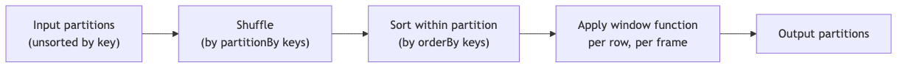

**Window functions trigger a shuffle** by the `partitionBy` keys. They also require **per-partition sorting** by the `orderBy` keys.

⚠️ **Performance implication:** if you have multiple window functions sharing the same `partitionBy` and `orderBy`, Spark performs the shuffle/sort ONCE and computes all windows together. Reuse window specs.

```python
w = Window.partitionBy("user_id").orderBy("ts")

df = (df
    .withColumn("rn", F.row_number().over(w))
    .withColumn("prev", F.lag("event").over(w))
    .withColumn("running_count", F.sum(F.lit(1)).over(w)))   # all share one shuffle+sort
```

---

## groupBy vs window — when to use which

| Need | Use |
|---|---|
| Reduce rows (one row per group) | **groupBy + agg** |
| Keep all rows, add per-group derived columns | **Window** |
| Running totals | **Window with running frame** |
| Top-N per group | **Window with row_number + filter** |
| Compare row to next/previous | **Window with lag/lead** |
| Global stats added to each row | **Window over entire DataFrame** (perf warning) |

### Side-by-side example

```python
# groupBy — collapses rows
df.groupBy("dept").agg(F.avg("salary").alias("avg_sal"))
# Result: 1 row per dept

# Window — preserves rows
df.withColumn("dept_avg_sal", F.avg("salary").over(Window.partitionBy("dept")))
# Result: same rows as input, with a new column showing dept avg
```

---

## "Compare current to dept average" pattern

```python
w = Window.partitionBy("dept")

df_with_diff = df.withColumn(
    "diff_from_avg",
    F.col("salary") - F.avg("salary").over(w)
)
```

This is a textbook window-function use case — adding a per-group derived column without losing rows.

---

## "First/last value in window" pattern

```python
w = Window.partitionBy("user_id").orderBy("event_ts") \
          .rowsBetween(Window.unboundedPreceding, Window.unboundedFollowing)

df.withColumn("first_event", F.first("event_type").over(w))
df.withColumn("last_event", F.last("event_type").over(w))
```

⚠️ **`first` and `last` with ordering**: without the explicit `unboundedFollowing` frame, `F.last` returns the value at `currentRow` (not the partition's last), because the default frame is `unboundedPreceding` to `currentRow`.

Set the explicit frame to be safe.

---

## Output-prediction drills

### Drill 1 — `count` and nulls

```python
df = spark.createDataFrame([(1, "a"), (2, None), (3, "c"), (None, None)], ["id", "name"])

df.count()                                # ?
df.select(F.count("*")).first()[0]        # ?
df.select(F.count("id")).first()[0]       # ?
df.select(F.count("name")).first()[0]     # ?
df.select(F.count_distinct("name")).first()[0]   # ?
```

**A:**
- `df.count()` → **4** (counts rows, regardless of nulls).
- `F.count("*")` → **4** (same; * means "every row").
- `F.count("id")` → **3** (ignores the row where `id` is null).
- `F.count("name")` → **2** (only "a" and "c").
- `F.count_distinct("name")` → **2** (distinct non-null values).

⚠️ `count(col)` ignores nulls; `count("*")` does not.

### Drill 2 — `sum` and nulls

```python
df = spark.createDataFrame([(None,), (None,), (None,)], ["x"])
df.select(F.sum("x")).first()[0]    # ?
df.select(F.avg("x")).first()[0]    # ?
df.select(F.min("x")).first()[0]    # ?
```

**A:** All **NULL.** Aggregations over all-null inputs return NULL, not 0.

⚠️ Common trap when users expect `sum=0` for an empty/all-null group. Use `F.coalesce(F.sum("x"), F.lit(0))` to default.

### Drill 3 — Ranking on tied values

```python
data = [("A", 100), ("B", 90), ("C", 90), ("D", 80)]
df = spark.createDataFrame(data, ["name", "salary"])
w = Window.orderBy(F.col("salary").desc())

df.withColumn("row_num", F.row_number().over(w)) \
  .withColumn("rank", F.rank().over(w)) \
  .withColumn("dense", F.dense_rank().over(w)) \
  .show()
```

**Q:** What values do `row_num`, `rank`, `dense_rank` take for the 4 rows (A=100, B=90, C=90, D=80)?

**A:**

| name | salary | row_num | rank | dense |
|---|---|---|---|---|
| A | 100 | 1 | 1 | 1 |
| B | 90  | 2 | 2 | 2 |
| C | 90  | 3 | 2 | 2 |
| D | 80  | 4 | 4 | 3 |

- `row_number`: always unique (B and C arbitrarily ordered).
- `rank`: ties share rank, **next rank skips**.
- `dense_rank`: ties share rank, **no skip**.

⚠️ Memorize: `rank` jumps; `dense_rank` doesn't.

### Drill 4 — Default window frame with `orderBy`

```python
data = [(1, 10), (2, 20), (3, 30), (4, 40)]
df = spark.createDataFrame(data, ["ts", "v"])
w = Window.orderBy("ts")

df.withColumn("running_sum", F.sum("v").over(w)).show()
df.withColumn("partition_sum", F.sum("v").over(Window.partitionBy()).alias("p")).show()
```

**Q:** What values does `running_sum` take?

**A:**

| ts | v  | running_sum | partition_sum |
|---|---|---|---|
| 1 | 10 | 10 | 100 |
| 2 | 20 | 30 | 100 |
| 3 | 30 | 60 | 100 |
| 4 | 40 | 100 | 100 |

With `orderBy` present and no explicit frame, the default is `rangeBetween(unboundedPreceding, currentRow)` → running sum.

Without `orderBy`, the frame is the whole partition → constant 100 for all rows.

⚠️ This is the most common window-function exam trap: people expect the partition total but get a running sum.

### Drill 5 — `lag` boundary behavior

```python
data = [("a", 1), ("a", 2), ("a", 3), ("b", 10), ("b", 20)]
df = spark.createDataFrame(data, ["k", "v"])
w = Window.partitionBy("k").orderBy("v")

df.withColumn("prev_v", F.lag("v", 1).over(w)) \
  .withColumn("prev_v_default", F.lag("v", 1, -1).over(w)) \
  .show()
```

**A:**

| k | v | prev_v | prev_v_default |
|---|---|---|---|
| a | 1 | NULL | -1 |
| a | 2 | 1    | 1  |
| a | 3 | 2    | 2  |
| b | 10 | NULL | -1 |
| b | 20 | 10   | 10 |

At partition boundary, `lag` returns NULL (or the explicit default).

### Drill 6 — `dropDuplicates(subset)` non-determinism

```python
data = [(1, "v1", "2025-01-01"), (1, "v2", "2025-01-02"), (1, "v3", "2025-01-03")]
df = spark.createDataFrame(data, ["id", "value", "ts"])

df.dropDuplicates(["id"]).show()    # which row is kept?
```

**A:** **Non-deterministic** — could be v1, v2, or v3. To deterministically get "latest by ts":

```python
w = Window.partitionBy("id").orderBy(F.col("ts").desc())
df.withColumn("rn", F.row_number().over(w)).filter("rn=1").drop("rn")
# Always returns v3
```

### Drill 7 — `approx_count_distinct` accuracy

```python
df = spark.range(0, 1_000_000)
df.select(F.count_distinct("id")).first()[0]                      # ?
df.select(F.approx_count_distinct("id")).first()[0]               # ~?
df.select(F.approx_count_distinct("id", rsd=0.01)).first()[0]     # ~?
```

**A:**
- `count_distinct` → **1,000,000** (exact).
- `approx_count_distinct` (default rsd=0.05) → **~950,000 to ~1,050,000** (~5% relative error).
- `approx_count_distinct(rsd=0.01)` → much tighter, ~990,000 to ~1,010,000 (1% error). Uses more memory.

Lower rsd = tighter bound = more state per partition.

### Drill 8 — `collect_list` order

```python
data = [("a", 3), ("a", 1), ("a", 2)]
df = spark.createDataFrame(data, ["k", "v"])
df.groupBy("k").agg(F.collect_list("v")).first()[1]    # ?
```

**A:** **Non-deterministic** order — Spark doesn't guarantee `[3, 1, 2]` or `[1, 2, 3]`. The order depends on partition shuffle.

For deterministic order, sort first or use window functions:
```python
df.orderBy("k", "v").groupBy("k").agg(F.collect_list("v"))
```

### Drill 9 — `pivot` without explicit values

```python
df = spark.createDataFrame([("US", 2024, 100), ("US", 2025, 200)], ["country", "year", "rev"])

# How many JOBS does this trigger when calling .show()?
df.groupBy("country").pivot("year").sum("rev").show()
df.groupBy("country").pivot("year", [2024, 2025]).sum("rev").show()
```

**A:**
- Without explicit values → **2 jobs**: first scans to discover distinct years, then aggregates.
- With explicit values → **1 job**: skips the discovery scan.

For large data, the explicit form can be 2× faster.

### Drill 10 — `F.first` and `F.last` semantics

```python
df = spark.createDataFrame([(1, None), (2, "a"), (3, "b")], ["id", "v"])
df.select(
    F.first("v").alias("first_default"),
    F.first("v", ignorenulls=True).alias("first_skipnulls"),
).show()
```

**A:** `first_default` → **NULL** (first row's v); `first_skipnulls` → **"a"**.

Default `ignorenulls=False`.

---

## End-to-end mini-scenario

```python
# Sessionize a click stream — keep events with > 30min idle break as a new session

w_user_ts = Window.partitionBy("user_id").orderBy("event_ts")

sessionized = (events
    .withColumn("prev_ts", F.lag("event_ts").over(w_user_ts))
    .withColumn("idle_seconds",
        F.col("event_ts").cast("long") - F.col("prev_ts").cast("long"))
    .withColumn("session_break", F.when(F.col("idle_seconds") > 1800, 1).otherwise(0))
    .withColumn("session_id", F.sum("session_break").over(
        w_user_ts.rowsBetween(Window.unboundedPreceding, Window.currentRow)))
)

# Top-3 events per session by amount
w_session_rank = Window.partitionBy("user_id", "session_id").orderBy(F.col("amount").desc())

top3 = (sessionized
    .withColumn("rn", F.row_number().over(w_session_rank))
    .filter("rn <= 3")
    .drop("rn"))

# Per-day per-session summary
summary = (sessionized
    .groupBy("user_id", "session_id", F.to_date("event_ts").alias("date"))
    .agg(
        F.count("*").alias("n_events"),
        F.sum("amount").alias("total_amount"),
        F.approx_count_distinct("page").alias("uniq_pages"),
    ))
```

This exercises:
- `lag` for previous-row comparison.
- Running sum window for session ID generation.
- `row_number()` + filter for top-N pattern.
- `approx_count_distinct` for fast cardinality.
- `groupBy` aggregation.

---

## Mini-quiz

1. What's the difference between `count("*")` and `count("col")`?
2. Why is `approx_count_distinct` faster than `count_distinct`?
3. For values `[100, 90, 90, 80]`, what does `rank()` return?
4. What does `dense_rank()` return for the same values?
5. Without `partitionBy`, what's the parallelism of a window function?
6. What's the default frame for `F.sum(col).over(Window.partitionBy("k").orderBy("ts"))`?
7. What's the difference between `rowsBetween(-3, 0)` and `rangeBetween(-3, 0)`?
8. When is `pivot(col, [values])` faster than `pivot(col)`?
9. What does `lag(col, 2, "unknown")` return for the first row in a partition?
10. Why is `Window.partitionBy().orderBy(...)` dangerous?

### Answers

1. **`count("*")`** counts ALL rows including those with NULL values. **`count("col")`** counts only rows where `col` is NOT NULL.
2. It uses **HyperLogLog++**, a probabilistic sketch — no need to shuffle the entire distinct set. ~5% relative error by default.
3. **`1, 2, 2, 4`** — ties get same rank, next rank skips.
4. **`1, 2, 2, 3`** — ties get same rank, no skip.
5. **One** — single partition, no parallelism. Spark UI warns about it.
6. **`rangeBetween(unboundedPreceding, currentRow)`** — a running total, not the partition sum.
7. **`rowsBetween(-3, 0)`** = last 4 rows by physical position. **`rangeBetween(-3, 0)`** = logical range where the values from `currentValue - 3` to `currentValue` are included; ties are grouped together.
8. When you pass explicit values, Spark skips the extra job that scans the data to discover distinct values. Significant speedup for large data.
9. **`"unknown"`** — there's no row 2 positions before the first row, so the default is returned.
10. The entire DataFrame is one window partition → single-task execution, no parallelism. Performance disaster on large data.

---

## Exam-day cheat sheet

- **`count("*")`** counts all rows; **`count(col)`** counts non-null.
- **`approx_count_distinct`** uses HyperLogLog++; ~5% error; **avoids shuffling distinct set.**
- **`countDistinct(col)` is EXACT** but expensive (full shuffle).
- **`pivot(col, [values])` is faster** — skips the discovery job.
- **`row_number, rank, dense_rank`** on `[100, 90, 90, 80]` → `[1,2,3,4]`, `[1,2,2,4]`, `[1,2,2,3]`.
- **`lag(col, offset, default)` / `lead(col, offset, default)`**.
- **Default frame for orderBy-with-agg**: running (unboundedPreceding to currentRow).
- **`rowsBetween` = row offsets; `rangeBetween` = value-based range.**
- **Window without `partitionBy` = single task, no parallelism.**
- **Reuse window specs** for multiple window functions sharing partitionBy/orderBy.
- **Top-N per group: `row_number` over partition + filter.**
- **Window functions are WIDE** (shuffle by partitionBy).

Next: [Module 09 — Joins and Unions](09_joins_unions.md).


\newpage

# Module 09 — Joins and Unions

> **Domain 3 of 7 — DataFrame/Dataset API (30%).**
> **Goal:** Master all join types, broadcast joins (and the **outer-join broadcast restriction** that's an exam favorite), multi-key joins, semi/anti joins, cross joins, and the `union` vs `unionByName` distinction. The exam guide explicitly lists "Combine DataFrames with operations such as Inner join, left join, broadcast join, multiple keys, cross join, union, and union all."

---

## Coverage map

Verbatim Oct 2025 exam objectives covered by this module:

| Objective (Section 3 — DataFrame/Dataset API, 30%) | Section |
|---|---|
| "Combine DataFrames with operations such as Inner join, left join, broadcast join, multiple keys, cross join, union, and union all." | [Join types](#join-types), [Multi-key joins](#multi-key-joins), [Cross joins](#cross-joins), [union vs unionByName](#union-vs-unionbyname-high-value-exam-trap) |
| "Describe the purpose and implementation of broadcast joins." | [Join strategies](#join-strategies--what-physical-plan-spark-picks), [Broadcast joins — the outer-join restriction](#broadcast-joins--the-outer-join-restriction-high-value-exam-trap) |
| "Describe different types of variables in Spark, including broadcast variables and accumulators." | [Broadcast variable vs broadcast join hint](#broadcast-variable-vs-broadcast-join-hint--same-name-different-things) |

---

> 🎯 **How to recognize this on the exam:**
> - If question mentions `union()` shuffle behavior → **NARROW** (concatenates partitions; no shuffle).
> - If question shows `union` with same columns in different order → **WRONG result** (matches by position). The correct API is `unionByName`.
> - If outer join + broadcast question → only the **NON-PRESERVED** side can be broadcast. Left outer = broadcast right; right outer = broadcast left; **full outer = NEITHER side broadcastable**.
> - If question asks "EXISTS" semantics → **`left_semi`** (returns left rows only; no row duplication).
> - If question asks "NOT EXISTS" → **`left_anti`**.
> - If question asks about default join type when `how` is omitted → **`inner`**.
> - If question uses `F.broadcast(df)` → it's a **hint** (not guarantee); Spark may ignore if too large.
> - If `sc.broadcast(value)` vs `F.broadcast(df)` appear → broadcast variable (Python value for UDFs) vs broadcast join hint (DataFrame for BHJ). Different mechanisms.
> - If question asks default broadcast threshold → **10 MB** (`spark.sql.autoBroadcastJoinThreshold`).

---

## Join types

```python
df1.join(df2, on, how)
```

`how` accepts:

| Value | Type | What it returns |
|---|---|---|
| `"inner"` (default) | Inner | Rows where keys match in both |
| `"left"` / `"left_outer"` | Left outer | All left rows + matching right (NULL where no match) |
| `"right"` / `"right_outer"` | Right outer | All right rows + matching left |
| `"outer"` / `"full"` / `"full_outer"` | Full outer | All rows from both sides; NULL where no match |
| `"left_semi"` / `"leftsemi"` | Left semi | Left rows that have a match in right (right columns NOT returned) |
| `"left_anti"` / `"leftanti"` | Left anti | Left rows with NO match in right (right columns NOT returned) |
| `"cross"` | Cartesian | All combinations |

⚠️ **Aliases:** `"leftsemi"` (one word) and `"left_semi"` (underscore) both work. Same for `"leftanti"`/`"left_anti"`.

### Examples

```python
# Inner join (default)
df1.join(df2, "user_id")
df1.join(df2, "user_id", "inner")
df1.join(df2, df1["user_id"] == df2["user_id"])

# Left outer
df1.join(df2, "user_id", "left")
df1.join(df2, on=["user_id", "date"], how="left")

# Right outer
df1.join(df2, "user_id", "right")

# Full outer
df1.join(df2, "user_id", "outer")
df1.join(df2, "user_id", "full")
df1.join(df2, "user_id", "full_outer")

# Left semi — "EXISTS"
df_customers_who_ordered = customers.join(orders, "customer_id", "left_semi")
# Returns customer columns only; one row per customer-that-ordered (no duplication)

# Left anti — "NOT EXISTS"
df_customers_no_orders = customers.join(orders, "customer_id", "left_anti")

# Cross join (explicit)
df1.crossJoin(df2)
df1.join(df2, how="cross")
```

---

## Join keys — three ways

### 1. Single column name (must exist in BOTH DataFrames)

```python
df1.join(df2, "user_id")             # uses df1.user_id = df2.user_id
df1.join(df2, "user_id", "left")
```

Result has **one `user_id` column** (the duplicate from `df2` is dropped).

### 2. List of column names

```python
df1.join(df2, ["user_id", "date"], "inner")
```

Joins on all listed columns being equal.

### 3. Column expression (most flexible)

```python
df1.join(df2, df1["user_id"] == df2["user_id"])
df1.join(df2, df1["a"] == df2["b"])                   # different names
df1.join(df2, (df1["k"] == df2["k"]) & (df1["d"] >= df2["d"]))   # multi-cond
df1.join(df2, F.col("a") == F.col("b"))               # unqualified — risky if both have these
```

When using expressions, **both** copies of the join column remain in the result (unless you `.drop` them).

⚠️ **`F.col("a")`** is ambiguous when both DataFrames have column `a`. Use `df1["a"]` and `df2["a"]` (or aliased DataFrames) for clarity.

---

## Aliasing DataFrames for clean joins

```python
e = employees.alias("e")
d = departments.alias("d")

result = (e.join(d, F.col("e.dept_id") == F.col("d.id"))
           .select("e.name", "e.salary", "d.name"))
```

Aliasing helps when both sides have same-named columns.

---

## Multi-key joins

```python
df1.join(df2, ["customer_id", "order_date"], "inner")

# Or with expressions
df1.join(df2,
    (df1["customer_id"] == df2["customer_id"]) &
    (df1["order_date"] == df2["order_date"]),
    "inner")
```

Equivalent. The list form is cleaner and avoids ambiguous column references.

---

## Semi and anti joins

### Left semi: "rows where a match exists"

```python
customers.join(orders, "customer_id", "left_semi")
```

Returns customers (with customer columns only) that have at least one matching row in orders. **Right columns are NOT in the result.** **No row duplication** — even if a customer has 10 orders, they appear once.

Equivalent SQL:
```sql
SELECT * FROM customers c WHERE EXISTS (
    SELECT 1 FROM orders o WHERE c.customer_id = o.customer_id
)
```

### Left anti: "rows where NO match exists"

```python
customers.join(orders, "customer_id", "left_anti")
```

Returns customers that have NO matching orders. **Right columns are NOT in the result.**

Equivalent SQL:
```sql
SELECT * FROM customers c WHERE NOT EXISTS (
    SELECT 1 FROM orders o WHERE c.customer_id = o.customer_id
)
```

⚠️ **Exam-testable:** semi/anti joins **never duplicate rows** from the left side. Different from inner joins, where one-to-many causes duplication.

---

## Cross joins

```python
df1.crossJoin(df2)                       # explicit method
df1.join(df2, how="cross")
```

Returns the Cartesian product. M × N rows. Almost never what you want unless you're generating combinations intentionally.

⚠️ **`spark.sql.crossJoin.enabled`** — in older Spark versions, this had to be set to `true` to allow cross joins. In Spark 3.5, cross joins are allowed by default with the explicit `.crossJoin()` or `how="cross"`.

---

## Join strategies — what physical plan Spark picks

There are four physical join strategies. The choice depends on data size, stats, and configuration.

### 1. Broadcast Hash Join (BHJ) — small + big

- Small side is **broadcast** to every executor.
- Large side is **NOT shuffled** — joined locally.
- Fastest when one side fits in memory.

**Trigger conditions:**
- Optimizer estimates one side ≤ `spark.sql.autoBroadcastJoinThreshold` (default **10 MB**).
- OR user calls `F.broadcast(df)` hint.
- OR (with AQE) runtime size proves small enough.

```python
from pyspark.sql.functions import broadcast

big = spark.table("events")           # 100 GB
small = spark.table("dim_users")      # 5 MB
result = big.join(broadcast(small), "user_id")
```

```sql
-- SQL hint equivalent
SELECT /*+ BROADCAST(dim_users) */ ... FROM events JOIN dim_users ON ...
```

⚠️ **`F.broadcast(df)` is a HINT, not a guarantee.** Spark may ignore it if:
- The DataFrame is larger than `spark.driver.maxResultSize`.
- Statistics suggest broadcasting would OOM.
- AQE later determines a different strategy is better.

### 2. Sort-Merge Join (SMJ) — big + big

- Both sides shuffled by the join key.
- Sorted within each partition.
- Merged via sort-merge algorithm.
- Default for two large sides.
- More memory-efficient than SHJ under skew (spills cleanly).

### 3. Shuffle Hash Join (SHJ) — niche

- Both sides shuffled by key.
- Smaller side has hash table built per partition.
- No sort.
- Preferred only when one side is meaningfully smaller per partition than the other but still too large to broadcast.
- Requires `spark.sql.join.preferSortMergeJoin = false`.

### 4. Broadcast Nested Loop Join (BNLJ) — non-equi join

- Used for non-equi joins (e.g., `BETWEEN`, `>`, `<`).
- O(N × M) — expensive.
- Almost always a sign of a bug (missing equi-join condition).

### 5. Cartesian Product

- No join condition.
- All combinations.
- Disabled by default unless `crossJoin.enabled = true` or explicit `crossJoin`.

---

## Broadcast joins — the outer-join restriction (HIGH-VALUE EXAM TRAP)

For outer joins, **only the non-preserved side can be broadcast.**

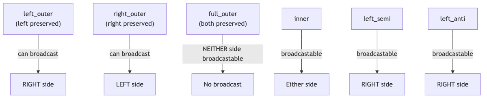

| Join type | Side(s) that can be broadcast |
|---|---|
| `inner` | Either |
| `left_outer` | **Right only** |
| `right_outer` | **Left only** |
| `full_outer` | **Neither** |
| `left_semi` | Right only |
| `left_anti` | Right only |
| `cross` | Smaller side |

### Why?

To produce a `left_outer` join's output, Spark needs **every row of the left side** plus matched rows on the right. If you broadcast the LEFT side, the matched right rows would be scattered across executors, and each executor only has partial left data — can't preserve left-side completeness without a shuffle.

If you broadcast the RIGHT side, every executor has the full right table; the left side scans locally → emit left row with matched right or NULL. Works.

For full outer, **both sides must be preserved**, so neither can be broadcast — both must be shuffled.

⚠️ **Exam-testable:** "For a full outer join, which side can be broadcast?" → **Neither.**

### Force vs ignore

```python
# Force broadcast (subject to hard limits)
big.join(broadcast(small), "k", "left")    # only the broadcast(side) is hinted

# Disable broadcast entirely (when BroadcastNestedLoopJoin is appearing)
spark.conf.set("spark.sql.autoBroadcastJoinThreshold", -1)
```

---

## Broadcast variable vs broadcast join hint — same name, different things

```python
sc = spark.sparkContext

# Broadcast VARIABLE — ships a Python value to executors
lookup_dict = {"A": 1, "B": 2}
bv = sc.broadcast(lookup_dict)
# Used inside UDFs via bv.value

# Broadcast JOIN hint — marks a DataFrame for broadcast hash join
big.join(F.broadcast(small_df), "k")
```

Both are "broadcasting" something to executors but **at different layers**:
- `sc.broadcast(value)` is a low-level read-only data distribution mechanism for use in UDFs.
- `F.broadcast(df)` is a query-plan hint for the join strategy.

⚠️ **Spark Connect has neither** — see Module 12.

---

## union vs unionByName (HIGH-VALUE EXAM TRAP)

```python
df1.union(df2)             # combines by POSITION
df1.unionAll(df2)          # alias for union (semantic same as SQL UNION ALL)
df1.unionByName(df2)       # combines by COLUMN NAME
df1.unionByName(df2, allowMissingColumns=True)   # Spark 3.1+
```

### union (by position) example

```python
df1 = spark.createDataFrame([(1, "a")], ["id", "name"])
df2 = spark.createDataFrame([("b", 2)], ["name", "id"])   # cols in different order

df1.union(df2).show()
# +----+----+
# | id |name|
# +----+----+
# |  1 |  a |   ← row from df1
# |  b |  2 |   ← row from df2 — id col gets "b" and name col gets 2 (BAD)
# +----+----+
```

**WRONG result** because `union` matches by position, not name.

### unionByName (by name) example

```python
df1.unionByName(df2).show()
# +----+----+
# | id |name|
# +----+----+
# |  1 |  a |
# |  2 |  b |   ← correctly matched
# +----+----+
```

### allowMissingColumns

```python
df1 = spark.createDataFrame([(1, "a")], ["id", "name"])
df2 = spark.createDataFrame([(2, "X", "b")], ["id", "tier", "name"])  # extra col

df1.unionByName(df2, allowMissingColumns=True).show()
# +----+----+----+
# | id |name|tier|
# +----+----+----+
# |  1 |  a |null|
# |  2 |  b | X  |
# +----+----+----+
```

Without `allowMissingColumns=True`, the union fails with a schema mismatch error.

### union is NARROW

⚠️ **`union` is a NARROW transformation** — it just concatenates partitions, no shuffle. People commonly think `union` shuffles because it "merges tables." It doesn't.

The resulting DataFrame has `partitions(df1) + partitions(df2)` total partitions.

```python
df1 = spark.range(0, 100).repartition(4)   # 4 partitions
df2 = spark.range(100, 200).repartition(6) # 6 partitions
df1.union(df2).rdd.getNumPartitions()      # → 10
```

### union does NOT deduplicate

`df1.union(df2)` returns ALL rows from both, including duplicates. This matches SQL's `UNION ALL`, NOT `UNION`.

To get SQL `UNION` semantics (distinct rows):

```python
df1.union(df2).distinct()                  # wide transform after the union
```

⚠️ **Exam trap:** `union` ≡ `unionAll` in PySpark. They are aliases. Neither deduplicates.

---

## intersect, except (a.k.a. subtract)

```python
df1.intersect(df2)               # rows in BOTH (SQL INTERSECT — deduplicated)
df1.intersectAll(df2)            # rows in both (preserving multiplicities)

df1.exceptAll(df2)               # rows in df1 not in df2 (preserves multiplicities)
df1.subtract(df2)                # rows in df1 not in df2 (deduplicated)
```

⚠️ **Both `intersect` and `subtract` are wide** (they involve shuffle/dedup).

⚠️ **`intersect` and `subtract` deduplicate; `intersectAll` and `exceptAll` do not.**

---

## Self-joins

```python
e = employees.alias("e")
m = employees.alias("m")
result = e.join(m, F.col("e.manager_id") == F.col("m.id"))
```

Self-joins **always need aliasing** to disambiguate column references.

---

## Joining on inequality / non-equi conditions

```python
events.join(intervals,
    (events["ts"] >= intervals["start"]) & (events["ts"] < intervals["end"])
)
```

This is **NOT an equi-join** — Spark uses **Broadcast Nested Loop Join** or **Cartesian Product** (with filter). O(N × M).

For ranges, the right approach is often:
- Discretize the range column (e.g., date buckets) and join on the bucket.
- Use Spark's `range_join` hint (Databricks-specific, NOT in OSS Spark for the exam).

---

## Join performance discipline

Patterns that reduce join cost (full coverage in Module 10):

1. **Filter before join.** Push predicates upstream to shrink inputs.
2. **Broadcast the smaller side.** If it fits in ~10-30 MB, broadcast.
3. **Avoid skewed join keys** (`null`, default values that 80% of rows have). Salt or pre-aggregate.
4. **Co-partition before join.** `df1.repartition("k").join(df2.repartition("k"), "k")` — though AQE can often do this automatically.
5. **Project before join.** Drop unneeded columns to reduce shuffle bytes.
6. **Avoid Python UDFs in join predicates** — they prevent predicate pushdown and Catalyst optimization.

---

## Worked example: multiple joins with broadcast

```python
from pyspark.sql.functions import broadcast

orders = spark.table("orders")              # 10 TB
customers = spark.table("customers")        # 50 MB  → broadcast
products = spark.table("products")          # 1 GB   → no broadcast
regions = spark.table("regions")            # 1 MB   → broadcast

result = (orders
    .join(broadcast(customers), "customer_id", "left")
    .join(products, "product_id", "left")          # shuffle this one
    .join(broadcast(regions), "region_id", "left")
    .filter(F.col("order_date") >= "2025-01-01")
    .select("order_id", "customer_name", "product_name", "region_name", "amount"))
```

This pattern — large fact joined to dimensions with broadcast hints — is the canonical star-schema join.

---

## Output-prediction drills

### Drill 1 — `union` column alignment

```python
df1 = spark.createDataFrame([(1, "alice")], ["id", "name"])
df2 = spark.createDataFrame([("bob", 2)], ["name", "id"])   # SWAPPED order

df1.union(df2).show()
df1.unionByName(df2).show()
```

**Q:** What rows appear in each result?

**A:**

`union(df2)` — by **position**:
```
+---+-----+
| id| name|
+---+-----+
|  1|alice|
|bob|    2|   ← WRONG: id=bob, name=2 (data swapped because columns aligned by position)
+---+-----+
```

`unionByName(df2)` — by **name**:
```
+---+-----+
| id| name|
+---+-----+
|  1|alice|
|  2|  bob|   ← correct
+---+-----+
```

This is the canonical `union` trap.

### Drill 2 — `union` partition count

```python
df1 = spark.range(0, 100).repartition(4)
df2 = spark.range(100, 200).repartition(6)
df1.union(df2).rdd.getNumPartitions()    # ?
```

**A:** **10** (4 + 6). `union` is narrow; it just concatenates partition lists. No shuffle to rebalance.

### Drill 3 — Left semi vs left anti row counts

```python
customers = spark.createDataFrame([(1,), (2,), (3,), (4,)], ["customer_id"])
orders = spark.createDataFrame([(1,), (1,), (2,), (2,), (2,)], ["customer_id"])

customers.join(orders, "customer_id", "left_semi").count()    # ?
customers.join(orders, "customer_id", "left_anti").count()    # ?
customers.join(orders, "customer_id", "inner").count()        # ?
customers.join(orders, "customer_id", "left").count()         # ?
```

**A:**
- `left_semi` → **2** (customers 1 and 2 each appear ONCE; no duplication despite 5 orders).
- `left_anti` → **2** (customers 3 and 4; no matches in orders).
- `inner` → **5** (1×2 orders for customer 1 + 1×3 orders for customer 2 — duplicates).
- `left` → **7** (5 inner rows + 2 left rows with NULL right side).

⚠️ `inner` and `left` duplicate left rows when right has multiple matches; semi/anti do not.

### Drill 4 — Broadcast outer-join restriction

```python
big = spark.read.parquet("big/")            # 100 GB
small = spark.read.parquet("small/")        # 5 MB

# For each, can Spark broadcast? Which side?
big.join(small, "k", "inner")               # ?
big.join(small, "k", "left")                # ?
big.join(small, "k", "right")               # ?
big.join(small, "k", "full")                # ?
big.join(small, "k", "left_semi")           # ?
big.join(small, "k", "left_anti")           # ?
```

**A:** (broadcastable side in parens)
- `inner` → either side; here `small` (5 MB < threshold).
- `left` (big preserved) → **right (small) only**. ✓
- `right` (small preserved) → **left (big) only**. ✗ (`big` too large to broadcast).
- `full` (both preserved) → **NEITHER**. Always SMJ.
- `left_semi` → **right only**. ✓
- `left_anti` → **right only**. ✓

If the question swaps positions and uses `small.join(big, "k", "left")`, then the left (small) is preserved, and the right (big) is the broadcast candidate — which won't broadcast because big is too large. Falls back to SMJ.

### Drill 5 — Default `how` parameter

```python
df1.join(df2, "id").count()              # what join type?
df1.join(df2, ["id", "date"]).count()    # what join type?
```

**A:** Both **inner** (default `how="inner"`).

### Drill 6 — Self-join column ambiguity

```python
emp = spark.createDataFrame([(1, 2, "alice"), (2, None, "bob")], ["id", "manager_id", "name"])

# Which works, which fails?
emp.join(emp, emp["id"] == emp["manager_id"]).show()    # A
emp.alias("e").join(emp.alias("m"), F.col("e.id") == F.col("m.manager_id")).show()  # B
```

**A:**
- **A FAILS** with `AnalysisException`: ambiguous column references (Spark can't tell which `id` is which).
- **B WORKS** because aliasing disambiguates.

Always alias for self-joins.

### Drill 7 — Cross-join row count

```python
df1 = spark.range(0, 100)
df2 = spark.range(0, 200)
df1.crossJoin(df2).count()    # ?
```

**A:** **20,000** (100 × 200). Cartesian product.

⚠️ For two TB-scale tables, this is catastrophic. Always verify before running.

### Drill 8 — `intersect` vs `intersectAll`

```python
df1 = spark.createDataFrame([(1,), (1,), (2,), (3,)], ["x"])
df2 = spark.createDataFrame([(1,), (1,), (1,), (2,)], ["x"])

df1.intersect(df2).count()       # ?
df1.intersectAll(df2).count()    # ?
df1.exceptAll(df2).count()       # ?
df1.subtract(df2).count()        # ?
```

**A:**
- `intersect` → **2** (distinct values present in both: 1, 2).
- `intersectAll` → **3** (min(2, 3) ones + min(1, 1) twos = 2 + 1 = 3).
- `exceptAll` → **1** (one value not in df2 — the `3`. Plus, df1 has 2 ones, df2 has 3 ones — df1 doesn't have extra ones).
- `subtract` → **1** (distinct values in df1 not in df2: just 3).

---

## Mini-quiz

1. What's the difference between `df1.union(df2)` and `df1.unionByName(df2)`?
2. Is `union` narrow or wide?
3. Does `union` deduplicate?
4. For a `left_outer` join, which side can be broadcast?
5. For a `full_outer` join, which side can be broadcast?
6. What does `left_semi` return?
7. Does `left_anti` return right-side columns?
8. What's the difference between `intersect` and `intersectAll`?
9. Which join strategy is the default for two large tables?
10. Is `F.broadcast(df)` a guarantee or a hint?

### Answers

1. **`union` matches by POSITION** (columns aligned by index). **`unionByName` matches by COLUMN NAME.** If schemas have same columns in different order, `union` produces incorrect results; `unionByName` is correct.
2. **NARROW** — concatenates partitions; no shuffle.
3. **No.** `union` ≡ `unionAll` — both keep duplicates. To dedup, chain `.distinct()`.
4. **The right (non-preserved) side.** Left side cannot be broadcast.
5. **Neither.** Both sides must be preserved; both must be shuffled.
6. **Left-side rows that have a match in right** — without right-side columns; without row duplication.
7. **No.** `left_anti` returns only left-side columns.
8. **`intersect` deduplicates** (SQL INTERSECT). **`intersectAll` preserves multiplicities.**
9. **Sort-Merge Join (SMJ).**
10. **A hint.** Spark may ignore it if size exceeds thresholds or driver memory limits.

---

## Exam-day cheat sheet

- **Join types:** `inner` (default), `left`/`left_outer`, `right`/`right_outer`, `outer`/`full`/`full_outer`, `left_semi`, `left_anti`, `cross`.
- **`union`** is NARROW; matches by POSITION; does NOT deduplicate.
- **`unionByName`** matches by NAME; `allowMissingColumns=True` for schema flexibility.
- **`union` ≡ `unionAll`** (PySpark aliases).
- **Broadcast outer-join restriction:** only the **non-preserved** side can be broadcast.
- **`full_outer` cannot broadcast** either side.
- **`F.broadcast(df)`** is a hint, not a guarantee.
- **`sc.broadcast(value)`** is a broadcast variable — different from `F.broadcast(df)`.
- **`left_semi`** ≈ EXISTS (no row duplication, left columns only).
- **`left_anti`** ≈ NOT EXISTS.
- **Self-joins need aliasing.**
- **`spark.sql.autoBroadcastJoinThreshold = 10 MB`** default; set to `-1` to disable.

Next: [Module 10 — Performance Tuning](10_performance_tuning.md).


\newpage

# Module 10 — Performance Tuning and Troubleshooting

> **Domain 4 of 7 — Troubleshooting and Tuning (10%).**
> **Goal:** Master AQE configuration (the **config-key trap** is a recurring exam topic), broadcast join thresholds, partition tuning (`repartition` vs `coalesce` vs `sortWithinPartitions`), cache/persist storage levels, skew handling (AQE skew join, salting), Spark UI diagnostics, and the executor-vs-driver log access pattern (sample Q2).

---

## Coverage map

Verbatim Oct 2025 exam objectives covered by this module:

| Objective (Section 4 — Troubleshooting & Tuning, 10%) | Section |
|---|---|
| "Implement performance tuning strategies & optimize cluster utilization, including partitioning, repartitioning, coalescing, identifying data skew, and reducing shuffling." | [Partition tuning](#partition-tuning), [Skew handling](#skew-handling) |
| "Describe Adaptive Query Execution (AQE) and its benefits." | [Adaptive Query Execution (AQE) — the master switch](#adaptive-query-execution-aqe--the-master-switch), [The three AQE pillars](#the-three-aqe-pillars) |
| "Perform logging and monitoring of Spark applications — publish, customize, and analyze Driver logs and Executor logs to diagnose out-of-memory errors, cluster underutilization, etc." | [Spark UI — diagnostic tabs](#spark-ui--diagnostic-tabs), [Accessing executor logs (sample Q2)](#accessing-executor-logs-sample-q2) |

---

> 🎯 **How to recognize this on the exam:**
> - If question asks "which config enables AQE" → **`spark.sql.adaptive.enabled`** (prefix is `spark.sql.adaptive.`, NOT `spark.adaptive.`).
> - If question mentions the broadcast threshold → default is **10 MB**, configured via `spark.sql.autoBroadcastJoinThreshold`.
> - If question asks about `cache()` default storage level → **`MEMORY_AND_DISK`** for DataFrames (NOT `MEMORY_ONLY` — that's the RDD default).
> - If question asks about `spark.sql.shuffle.partitions` → controls **post-shuffle** partition count (default 200), NOT read-side.
> - If question asks how to retrieve executor logs → **Spark UI → Executors tab → click executor → stderr/stdout** (NOT `spark-submit --verbose`).
> - If question asks about repartition vs coalesce → `repartition` = WIDE (full shuffle, can increase OR decrease); `coalesce` = NARROW (no shuffle, can ONLY decrease).
> - If question shows AQE skew config keys with two correct-looking options → all AQE configs start with `spark.sql.adaptive.` (e.g., `spark.sql.adaptive.skewJoin.enabled`).
> - If `.collect()` appears on a large DataFrame → driver OOM risk; the answer is usually `.show()` or `.take(n)` or write-to-storage.

---

## Why this module exists

Tuning is 10% of the exam (~5 questions) but it's **high-yield study territory**. The questions cluster around:

- **AQE config keys** — `spark.sql.adaptive.enabled` vs the bogus `spark.adaptive.enabled` distractor.
- **Broadcast thresholds** — `spark.sql.autoBroadcastJoinThreshold` (10 MB default).
- **`repartition` vs `coalesce`** — wide vs narrow, can increase vs only decrease.
- **Cache vs persist; storage levels** — DataFrame `.cache()` default is `MEMORY_AND_DISK` (not `MEMORY_ONLY`).
- **Spark UI navigation** — executor logs are in the Executors tab (sample Q2).
- **Skew handling** — AQE skew join, salting.

---

## Adaptive Query Execution (AQE) — the master switch

AQE is **enabled by default since Spark 3.2.** It enables three runtime optimizations:

1. **Coalesce post-shuffle partitions** — combine small partitions into ~64 MB chunks.
2. **Dynamically switch join strategies** — promote a planned SMJ to BHJ if runtime sees small enough data.
3. **Skew join handling** — split skewed partitions into smaller subpartitions.

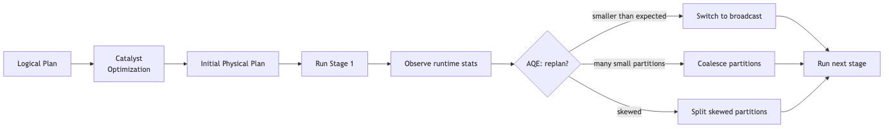

### The config-key trap (HIGH-VALUE)

| Correct | Trap (incorrect) |
|---|---|
| `spark.sql.adaptive.enabled` | `spark.adaptive.enabled` ← does NOT exist |
| `spark.sql.adaptive.coalescePartitions.enabled` | `spark.sql.coalescePartitions.enabled` ← wrong |
| `spark.sql.adaptive.skewJoin.enabled` | `spark.sql.skewJoin.enabled` ← wrong |

**Memorize: all AQE configs start with `spark.sql.adaptive.`**

### Full config table

| Config | Default | What it does |
|---|---|---|
| `spark.sql.adaptive.enabled` | `true` (since 3.2) | Master AQE switch |
| `spark.sql.adaptive.coalescePartitions.enabled` | `true` | Coalesce small partitions post-shuffle |
| `spark.sql.adaptive.coalescePartitions.initialPartitionNum` | `spark.sql.shuffle.partitions` (200) | Initial partition count before coalesce |
| `spark.sql.adaptive.coalescePartitions.minPartitionSize` | `1MB` | Min size after coalesce |
| `spark.sql.adaptive.advisoryPartitionSizeInBytes` | **64 MB** | Target partition size after coalesce |
| `spark.sql.adaptive.skewJoin.enabled` | `true` | Auto-split skewed join partitions |
| `spark.sql.adaptive.skewJoin.skewedPartitionFactor` | `5` | Partition is skewed if size > factor × median |
| `spark.sql.adaptive.skewJoin.skewedPartitionThresholdInBytes` | **256 MB** | AND size > this threshold |
| `spark.sql.adaptive.autoBroadcastJoinThreshold` | (not set; falls back to non-AQE threshold) | AQE runtime broadcast threshold |
| `spark.sql.autoBroadcastJoinThreshold` | **10 MB** | Planner-time broadcast threshold |
| `spark.sql.adaptive.localShuffleReader.enabled` | `true` | Use local reader when AQE demotes SMJ to BHJ |

---

## The three AQE pillars

### 1. Coalesce shuffle partitions

After a wide transformation, Spark may produce many small partitions (e.g., 200 partitions averaging 1 MB each is wasteful).

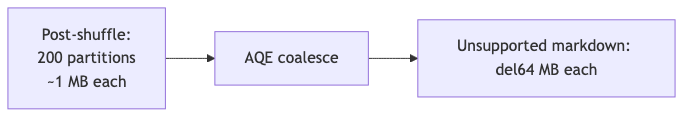

AQE merges adjacent small partitions to target `advisoryPartitionSizeInBytes` (default 64 MB).

**Implication:** you can safely set `spark.sql.shuffle.partitions=1000` (or higher) for large jobs without worrying about overhead — AQE will coalesce down. Old advice was to tune shuffle partitions for the largest stage; AQE makes this less necessary.

### 2. Switch join strategy at runtime

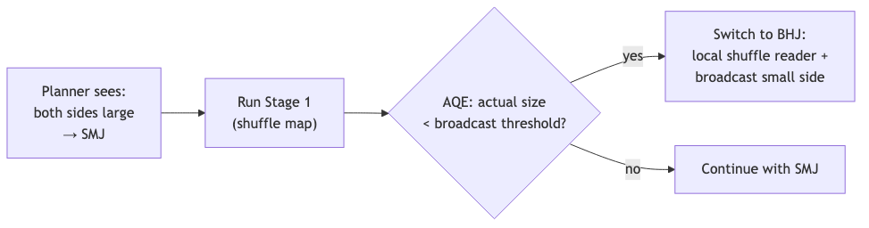

If the planner's size estimate was off (stale stats, post-filter shrinkage), AQE catches it and switches.

### 3. Skew join handling

AQE detects skew when both:
- `partition_size > skewedPartitionFactor (5) × median_partition_size`
- `partition_size > skewedPartitionThresholdInBytes (256 MB)`

Skewed partitions are **split into smaller subpartitions** and the matching partition on the other side is **replicated** to each subpartition.

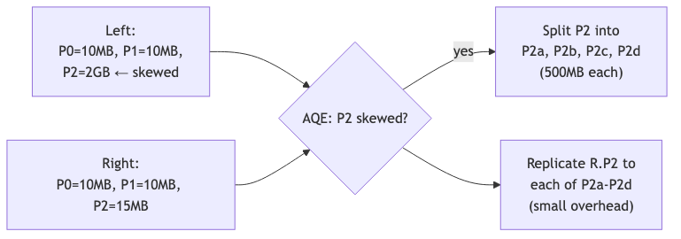

The 5× factor and 256 MB threshold can be tuned but defaults are usually fine.

---

## Broadcast join thresholds

| Setting | Default | When |
|---|---|---|
| `spark.sql.autoBroadcastJoinThreshold` | **10 MB** | Optimizer time: if one side's estimate ≤ this, plan as BHJ |
| `spark.sql.adaptive.autoBroadcastJoinThreshold` | (unset; defaults to above) | AQE runtime: replan based on actual size |

```python
# Increase planner-time threshold
spark.conf.set("spark.sql.autoBroadcastJoinThreshold", "100MB")

# Disable broadcast entirely (when BNLJ keeps appearing)
spark.conf.set("spark.sql.autoBroadcastJoinThreshold", "-1")
```

⚠️ **Sample question: "How do you broadcast a 50 MB DataFrame?"**
- Set `spark.sql.autoBroadcastJoinThreshold` to ≥ 50 MB, OR
- Use `F.broadcast(df)` hint.

⚠️ **The hint alone isn't enough** if the DataFrame's *estimated* size exceeds the threshold. You may need to raise the threshold too.

---

## Partition tuning

### Reading partitioning

When you read files, the number of partitions depends on:

| Config | Default | What it does |
|---|---|---|
| `spark.sql.files.maxPartitionBytes` | **128 MB** | Target partition size at read |
| `spark.sql.files.openCostInBytes` | **4 MB** | Per-file overhead estimate |
| `spark.default.parallelism` | (cluster-dependent) | Used for unstructured reads |

To increase parallelism on read:
```python
spark.conf.set("spark.sql.files.maxPartitionBytes", "64MB")  # smaller partitions → more tasks
```

### Shuffle partitioning

| Config | Default |
|---|---|
| `spark.sql.shuffle.partitions` | **200** |

⚠️ With AQE enabled, this is the **initial** count; AQE coalesces it down to ~64 MB per partition.

For very large jobs, set higher (e.g., 1000–4000) and let AQE coalesce.

### repartition vs coalesce — refresh

| | `df.repartition(n)` | `df.coalesce(n)` |
|---|---|---|
| Shuffle? | **Yes (full shuffle)** | **No (combines on same executor)** |
| Can increase partitions? | Yes | No (only decrease) |
| Balanced output? | Yes (round-robin) | No (depends on input layout) |
| Use case | Increase parallelism; fix skew | Reduce file count before write |

```python
df.repartition(400)               # exactly 400 balanced partitions (shuffle)
df.repartition("country")         # hash partition by country
df.repartition(50, "country")     # hash partition by country into 50 partitions
df.coalesce(10)                   # combine to 10 partitions (no shuffle)
df.sortWithinPartitions("ts")     # sort each partition (NARROW)
```

### When to coalesce

- Writing a small DataFrame to fewer files (`df.coalesce(1).write...`).
- After aggressive filtering that left many empty/small partitions.

### When to repartition

- Need balanced partitions after skewed input.
- Pre-partition before a join on a specific key (`df.repartition("user_id")`).
- Increase parallelism (more, smaller tasks).

---

## Cache vs persist — and the storage-level trap

```python
df.cache()                                       # MEMORY_AND_DISK (default for DataFrame)
df.persist()                                     # same as cache()
df.persist(StorageLevel.MEMORY_ONLY)
df.persist(StorageLevel.DISK_ONLY)
df.persist(StorageLevel.MEMORY_AND_DISK_SER)
df.persist(StorageLevel.OFF_HEAP)
df.unpersist()                                   # remove from cache
df.unpersist(blocking=True)                      # wait until removed
```

### Storage levels

| Level | Memory | Disk | Serialized | Replicated |
|---|---|---|---|---|
| `MEMORY_ONLY` | ✓ | ✗ | ✗ | ✗ |
| **`MEMORY_AND_DISK` ← `df.cache()` default** | ✓ | ✓ | ✗ | ✗ |
| `MEMORY_ONLY_SER` | ✓ | ✗ | ✓ | ✗ |
| `MEMORY_AND_DISK_SER` | ✓ | ✓ | ✓ | ✗ |
| `DISK_ONLY` | ✗ | ✓ | (always) | ✗ |
| `*_2` variants | — | — | — | ✓ (2 nodes) |
| `OFF_HEAP` | off-heap | ✗ | ✓ | ✗ |

### The cache-default trap (HIGH-VALUE)

| | RDD `.cache()` | DataFrame `.cache()` |
|---|---|---|
| Default level | `MEMORY_ONLY` | **`MEMORY_AND_DISK`** |

The defaults are **asymmetric**. Many candidates assume RDD knowledge transfers; it doesn't.

⚠️ **Why?** DataFrames are columnar and benefit from disk overflow; RDDs are row-based and were historically about pure memory speed.

### Caching is LAZY

```python
df = df.cache()        # marked for caching; NO computation
df.count()             # first action: triggers computation AND caches
df.count()             # second action: reads from cache (fast)
```

If you want to **force** caching, call any action immediately after `cache()`:

```python
df = df.cache()
df.count()             # materialize cache
```

### When NOT to cache

- One-shot DataFrames (used in only one action) — caching adds overhead without benefit.
- Very large DataFrames that don't fit in memory — spilling to disk may be slower than re-reading from source.
- After heavy filtering — Spark may skip work via predicate pushdown, making the cache redundant.

### Uncaching

```python
df.unpersist()                                  # remove from cache (async)
spark.catalog.uncacheTable("table_name")        # by table name
spark.catalog.clearCache()                      # clear ALL cached DataFrames
```

⚠️ **Cached DataFrames consume memory** until uncached or until the executor's storage memory is reclaimed by execution memory. Heavy caching → OOM risk.

---

## Skew handling

### Detecting skew

In the Spark UI Stages tab, look at the **task duration distribution histogram**:
- Healthy: roughly uniform.
- Skewed: long tail — a few tasks 10× slower than median.

Or look at **shuffle read size per task**:
- Healthy: bytes per task roughly equal.
- Skewed: one or two tasks pulling 10× more bytes.

### Fix 1: AQE skew join (default)

`spark.sql.adaptive.skewJoin.enabled = true` (default).

AQE automatically splits skewed partitions and replicates the matching partition on the other side. Works for SMJ and SHJ.

**Limitations:**
- Doesn't fire for partitions smaller than 256 MB (even if relatively skewed).
- Doesn't work in stream-stream joins.

### Fix 2: Salting (manual)

When AQE skew handling doesn't catch the skew (e.g., the absolute size is below threshold but it's still causing tail latency):

```python
from pyspark.sql import functions as F

NUM_SALTS = 50

# Salt the skewed side
left_salted = (df_large
    .withColumn("salt", (F.rand() * NUM_SALTS).cast("int"))
    .withColumn("k_salted", F.concat_ws("-", F.col("k"), F.col("salt")))
)

# Replicate the small side N times so every salt has a match
right_salted = (df_small
    .withColumn("salt", F.explode(F.array([F.lit(i) for i in range(NUM_SALTS)])))
    .withColumn("k_salted", F.concat_ws("-", F.col("k"), F.col("salt")))
)

joined = (left_salted.join(right_salted, "k_salted")
                     .drop("k_salted", "salt"))
```

The cost is an N× explosion of the small side. Pick `NUM_SALTS` to balance shuffle reduction vs small-side inflation.

### Fix 3: Broadcast the non-skewed side

If one side is small enough to broadcast, do it — broadcast joins don't shuffle the large side, sidestepping skew entirely.

### Fix 4: Filter the hot key separately

If the skew is from a few known keys (e.g., `NULL`, `0`, default sentinel values):

```python
# Split into hot and cold
hot_keys = ["NULL", "0", "unknown"]
df_cold = df.filter(~F.col("k").isin(hot_keys))
df_hot = df.filter(F.col("k").isin(hot_keys))

# Join each separately, then union
result_cold = df_cold.join(other, "k")
result_hot = df_hot.join(broadcast(other), "k")   # broadcast for the hot one
result = result_cold.unionByName(result_hot)
```

---

## Predicate pushdown

Spark pushes filter predicates down to:
- **File scans** — Parquet/ORC readers use min/max statistics to skip files entirely.
- **JDBC scans** — `WHERE` clauses pushed into the database query.

```python
df = spark.read.parquet("path")
df.filter(F.col("year") == 2025).explain()
# FileScan parquet [...] PushedFilters: [IsNotNull(year), EqualTo(year,2025)]
```

If `year` is a partition column, **partition pruning** eliminates entire partitions at planning time.

### What blocks pushdown?

- Python UDFs in the filter expression (`df.filter(my_udf(F.col("x")))`) — opaque to Catalyst.
- Complex expressions that can't be reduced to simple comparisons.
- Some derived columns (e.g., a filter on `F.col("year").cast("string")` might not push).

### Projection pruning

Spark only reads columns referenced in the query:

```python
spark.read.parquet("path").select("a", "b").explain()
# FileScan parquet [a, b] (only 2 columns scanned, ignoring others)
```

---

## File format choice

| Format | Splittable | Columnar | Pushdown | Compression | Use case |
|---|---|---|---|---|---|
| **Parquet** | ✓ | ✓ | ✓ | snappy default | Default for analytics |
| **ORC** | ✓ | ✓ | ✓ | snappy default | Hive-native; similar to Parquet |
| **Delta** | ✓ | ✓ | ✓ | snappy default | Lakehouse (only readable on this exam) |
| **Avro** | ✓ | ✗ (row-based) | limited | snappy default | Row-based; schema evolution |
| **JSON** | ✓ (line-delim) | ✗ | limited | none default | Semi-structured |
| **CSV** | ✓ | ✗ | none | none default | Last resort |
| **Text** | ✓ | ✗ | none | none default | Logs |

⚠️ **Parquet for analytics, period.** CSV/JSON are 5-10× slower at scale.

---

## Bucketing for joins

When two tables are bucketed identically on the join key, the join can avoid shuffle:

```python
# Both tables bucketed by user_id into 100 buckets
df_a = spark.table("events_bucketed")     # bucketed by user_id, N=100
df_b = spark.table("users_bucketed")      # bucketed by user_id, N=100
df_a.join(df_b, "user_id")                # NO shuffle (co-located buckets)
```

Requires:
- Both tables bucketed (via `saveAsTable` with `bucketBy`).
- Same bucket count.
- Same bucket column(s).
- `spark.sql.sources.bucketing.enabled = true` (default).

⚠️ **Exam-testable as a concept** — you won't be asked to write bucketing code but you should recognize "bucketing avoids shuffle for joins on the bucket key."

---

## Spark UI — diagnostic tabs

| Tab | Use case |
|---|---|
| **Jobs** | Job-level timing, failures, DAG visualization |
| **Stages** | Task duration distribution (skew detection), shuffle read/write, spill |
| **Storage** | Cached RDDs/DataFrames, memory vs disk usage |
| **Environment** | Spark config (effective values) |
| **Executors** | Per-executor RAM, GC time, **stderr/stdout LOGS**, task counts |
| **SQL/DataFrame** | Query plan graph, AQE annotations, broadcast vs SMJ decisions |
| **Streaming** | Per-query rates, batch durations (when streaming query active) |

### Accessing executor logs (sample Q2)

⚠️ **The official sample Q2** asks: "How should the engineer retrieve Executor logs to diagnose performance issues?"

**Correct answer:** Navigate to **Spark UI → Executors tab → click the executor ID → choose stderr or stdout**.

**Wrong answers** (typical distractors):
- "Use `spark-submit --verbose`" — NO. That logs the SUBMITTER side.
- "Print from the driver" — NO. Driver logs are different.
- "Check the system log on each worker" — possible but not the canonical path.

The Spark UI Executors tab is the single canonical place.

---

## Diagnostic loop

For "this job is slow" scenarios:

1. **SQL/DataFrame tab** → query plan.
   - Is the join strategy what you expected? (BHJ vs SMJ vs SHJ)
   - Is data skipping firing? (PushedFilters)
   - Are AQE annotations showing? (coalesce, skew split)

2. **Stages tab** → slow stage.
   - Task duration histogram: long tail = skew.
   - Shuffle Read/Write sizes: shuffling more than expected?
   - Spill metrics: memory pressure?

3. **Executors tab**.
   - GC time > 20% = memory pressure.
   - Failed tasks pattern = node-level issue.

4. **Storage tab** (if caching used).
   - Did the cache evict?

---

## Common symptoms → causes → fixes

| Symptom | Cause | Fix |
|---|---|---|
| Single long-running task in a stage | Data skew | Enable AQE skew join; salt; broadcast non-skewed side |
| Executor OOM | Too few partitions, large groupBy, big cache | Repartition; increase memory; unpersist |
| Driver OOM | `.collect()` too much data | Use `.show()`, `.take(n)`, or write to storage |
| Many small output files | Too many partitions before write | `coalesce(N)` before write |
| Long shuffle read/write | Too much data shuffled, skew | Filter earlier; broadcast joins; partition pruning |
| Slow read on filtered table | No pushdown | Check filter expression; ensure partition column |
| GC pause > 30% of task time | Memory pressure, cached data too big | Serialize cache; smaller executors; less caching |
| Repeated stage retries | Spot preemption, network issues | Use on-demand instances; check executor logs |

---

## .collect() and driver OOM

```python
df.collect()                                  # WHOLE DataFrame to driver — risky
df.toPandas()                                 # WHOLE DataFrame to pandas — risky

df.limit(1000).collect()                      # safe
df.show(20)                                   # safe
df.take(10)                                   # safe
df.write...save()                             # safe (executor-side write)
```

Driver memory: `spark.driver.memory` (default 1 GB on local; 1-2 GB typical on cluster).
Max result size: `spark.driver.maxResultSize` (default 1 GB).

If `collect()` exceeds `maxResultSize`, the job fails with a clear error before the driver OOMs.

⚠️ **Exam framing:** "What happens when you call `.collect()` on a large DataFrame?" → driver-side OOM risk; the result must fit in driver heap.

---

## Streaming-specific tuning (preview — Module 11)

- **Watermarks** bound state size; without them, streaming aggregations and `dropDuplicates` grow state unboundedly.
- **`maxOffsetsPerTrigger`** (Kafka) caps per-batch read size.
- **`trigger(availableNow=True)`** processes all available data in micro-batches and stops — useful for periodic batch-style streaming.

---

## AQE configs — the memorization table

When the exam asks "which config does X", the answer is almost always one of these. Memorize the full prefixes:

| Config (exact) | Default | Purpose |
|---|---|---|
| `spark.sql.adaptive.enabled` | `true` | Master AQE switch |
| `spark.sql.adaptive.coalescePartitions.enabled` | `true` | Coalesce post-shuffle small partitions |
| `spark.sql.adaptive.coalescePartitions.minPartitionSize` | `1MB` | Smallest allowed partition after coalesce |
| `spark.sql.adaptive.advisoryPartitionSizeInBytes` | `64MB` | Target post-coalesce size |
| `spark.sql.adaptive.skewJoin.enabled` | `true` | Auto-split skewed partitions |
| `spark.sql.adaptive.skewJoin.skewedPartitionFactor` | `5` | Skew = >5× median |
| `spark.sql.adaptive.skewJoin.skewedPartitionThresholdInBytes` | `256MB` | Skew also requires >256MB |
| `spark.sql.adaptive.localShuffleReader.enabled` | `true` | Use local reader on demoted SMJ→BHJ |
| `spark.sql.autoBroadcastJoinThreshold` | `10MB` | Planner-time broadcast threshold |
| `spark.sql.adaptive.autoBroadcastJoinThreshold` | (unset; falls back) | Runtime broadcast threshold (AQE) |
| `spark.sql.shuffle.partitions` | `200` | Post-shuffle partition count |
| `spark.sql.files.maxPartitionBytes` | `128MB` | Read-side target partition size |
| `spark.sql.files.openCostInBytes` | `4MB` | Per-file overhead estimate (file packing) |

**Distractor traps to recognize:**
- `spark.adaptive.enabled` ← **WRONG** (missing `.sql.`)
- `spark.sql.aqe.enabled` ← **WRONG** (no `aqe` segment)
- `spark.sql.coalescePartitions.enabled` ← **WRONG** (missing `.adaptive.`)
- `spark.sql.optimizer.adaptive` ← **WRONG** (does not exist)

---

## Output-prediction drills

### Drill 1 — repartition vs coalesce partition count

```python
df = spark.range(0, 1000).repartition(20)   # 20 partitions

df.repartition(50).rdd.getNumPartitions()    # ?
df.repartition(5).rdd.getNumPartitions()     # ?
df.coalesce(50).rdd.getNumPartitions()       # ?
df.coalesce(5).rdd.getNumPartitions()        # ?
df.coalesce(1).rdd.getNumPartitions()        # ?
```

**A:**
- `repartition(50)` → **50** (can increase; full shuffle).
- `repartition(5)` → **5** (can decrease; full shuffle).
- `coalesce(50)` → **20** (cannot INCREASE; stays at 20).
- `coalesce(5)` → **5**.
- `coalesce(1)` → **1**.

⚠️ Coalesce silently does nothing when n > current count.

### Drill 2 — Cache storage level

```python
df.cache()
df.persist(StorageLevel.MEMORY_ONLY)
df.persist(StorageLevel.DISK_ONLY)
```

**Q:** What storage level does each call use?

**A:**
- `df.cache()` → **`MEMORY_AND_DISK`** (DataFrame default; NOT MEMORY_ONLY).
- `df.persist(StorageLevel.MEMORY_ONLY)` → MEMORY_ONLY explicitly.
- `df.persist(StorageLevel.DISK_ONLY)` → DISK_ONLY (and always serialized).

⚠️ The trap is `cache()` for DataFrames vs RDDs:

| | RDD `.cache()` | DataFrame `.cache()` |
|---|---|---|
| Default | `MEMORY_ONLY` | **`MEMORY_AND_DISK`** |

### Drill 3 — Broadcast threshold behavior

```python
spark.conf.set("spark.sql.autoBroadcastJoinThreshold", "5MB")

big = spark.read.parquet("big/")    # 100 GB, estimated
small_4mb = spark.table("dim_4mb")  # 4 MB
small_20mb = spark.table("dim_20mb")  # 20 MB

big.join(small_4mb, "k").explain()    # join strategy?
big.join(small_20mb, "k").explain()   # join strategy?
big.join(F.broadcast(small_20mb), "k").explain()  # join strategy?
```

**A:**
- `big.join(small_4mb, "k")` → **BroadcastHashJoin** (4 MB < 5 MB threshold).
- `big.join(small_20mb, "k")` → **SortMergeJoin** (20 MB > 5 MB threshold; planner won't broadcast).
- `big.join(F.broadcast(small_20mb), "k")` → **BroadcastHashJoin** (hint overrides threshold; subject to `spark.driver.maxResultSize` hard limit).

⚠️ The hint **overrides the threshold** but is subject to driver memory limits. If `small_20mb` exceeds `spark.driver.maxResultSize` (1GB default), the broadcast fails.

### Drill 4 — `spark.sql.shuffle.partitions` interpretation

```python
spark.conf.set("spark.sql.shuffle.partitions", "50")

df = spark.read.parquet("100_files_128MB_each/")  # how many partitions?
df2 = df.groupBy("k").count()                      # how many partitions?
df3 = df2.repartition(10)                          # how many partitions?
```

**A:** (Assume AQE disabled for clarity)
- `df` → **~100** (read-side, controlled by `spark.sql.files.maxPartitionBytes=128MB`).
- `df2` → **50** (post-shuffle, controlled by `spark.sql.shuffle.partitions=50`).
- `df3` → **10** (explicit repartition).

The 50 setting **does NOT** affect the read. Common exam trap.

### Drill 5 — `.collect()` vs `.show()` vs `.take()`

```python
df = spark.read.parquet("10TB/")
df.collect()       # ?
df.show(5)         # ?
df.take(10)        # ?
df.toPandas()      # ?
df.write.parquet("out/")  # ?
```

**Q:** Which of these will likely OOM the driver?

**A:**
- `df.collect()` → **OOM** (pulls all rows to driver heap).
- `df.show(5)` → safe (driver receives at most 5 rows).
- `df.take(10)` → safe (10 rows).
- `df.toPandas()` → **OOM** (collects all rows + pandas materialization).
- `df.write.parquet()` → safe (write is distributed; driver only coordinates).

If `df.collect()` exceeds `spark.driver.maxResultSize` (default 1GB), the job fails with a clear error **before** OOM.

### Drill 6 — Skew threshold check

```
Spark UI Stages tab shows partition sizes (MB):
  P0: 50
  P1: 55
  P2: 48
  P3: 60
  P4: 1200    ← suspicious
  P5: 52
```

**Q:** Will AQE skew join split P4? Median = 52 MB. Factor default 5.

**A:** **No.** AQE skew detection requires BOTH conditions:
1. `partition_size > 5 × median` → 1200 > 5 × 52 = 260 ✓
2. `partition_size > 256 MB` (default `skewedPartitionThresholdInBytes`) → 1200 > 256 ✓

**Yes**, AQE will split P4. If the threshold were set to 2 GB, AQE would not fire even though the relative skew is large.

### Drill 7 — `repartition("col")` partition count

```python
df = spark.range(0, 100).repartition(10)
df.repartition("id").rdd.getNumPartitions()       # ?
df.repartition(5, "id").rdd.getNumPartitions()    # ?
```

**A:**
- `df.repartition("id")` → **200** (hash partition by id; uses `spark.sql.shuffle.partitions=200` as the bucket count by default).
- `df.repartition(5, "id")` → **5** (hash partition into exactly 5 buckets).

⚠️ Default partition count for `repartition(col)` is `spark.sql.shuffle.partitions`, not the source count.

---

## Mini-quiz

1. What is the default value of `spark.sql.autoBroadcastJoinThreshold`?
2. Is `spark.sql.adaptive.enabled` true or false by default in Spark 3.5?
3. What's the difference between `repartition(50)` and `coalesce(50)`?
4. What's the default storage level for DataFrame `.cache()`?
5. How do you uncache all cached DataFrames?
6. AQE detects skew when both conditions hold — what are they?
7. What's wrong with `df.union(other).distinct()` for getting unique rows?
8. Where in the Spark UI do you find executor stderr?
9. Why is `df.collect()` risky?
10. Name the three AQE pillars.

### Answers

1. **10 MB.**
2. **`true`** (since Spark 3.2).
3. `repartition(50)` is a **full shuffle** producing balanced partitions. `coalesce(50)` is **narrow**, combining partitions on the same executor; can only decrease.
4. **`MEMORY_AND_DISK`**. (RDD `.cache()` defaults to `MEMORY_ONLY` — different!)
5. **`spark.catalog.clearCache()`**.
6. **(1)** Partition size > `5 × median_partition_size` AND **(2)** Partition size > 256 MB.
7. Nothing technically wrong with the result, but `distinct()` is a **wide transformation** that adds a shuffle. If the goal is just to remove cross-source duplicates and you're OK with `union`'s narrow behavior, it's the price of correctness. The trap is people thinking `union` already deduplicates (it doesn't — `union` ≡ `unionAll`).
8. **Executors tab → click executor ID → stderr.**
9. It materializes the **entire DataFrame in driver heap** → driver OOM risk on large data.
10. **(1)** Coalesce shuffle partitions; **(2)** Switch join strategy at runtime; **(3)** Skew join handling.

---

## Exam-day cheat sheet

- **AQE configs all start with `spark.sql.adaptive.`** ⚠️
- **`spark.sql.adaptive.enabled = true` since 3.2.**
- **Three AQE pillars: coalesce, switch join, skew handling.**
- **`spark.sql.autoBroadcastJoinThreshold = 10 MB` default.**
- **`spark.sql.shuffle.partitions = 200` default.**
- **`spark.sql.files.maxPartitionBytes = 128 MB` (read).**
- **`spark.sql.adaptive.advisoryPartitionSizeInBytes = 64 MB` (post-coalesce target).**
- **`repartition` is WIDE; `coalesce` is NARROW.**
- **DataFrame `.cache()` default: `MEMORY_AND_DISK`.** (RDD: `MEMORY_ONLY`.)
- **Skew thresholds: 5× median AND > 256 MB.**
- **Executor logs: Spark UI → Executors tab → stderr/stdout.** ⚠️
- **`.collect()` on large DF → driver OOM.**
- **Broadcast outer-join: only the non-preserved side.**

Next: [Module 11 — Structured Streaming](11_structured_streaming.md).


\newpage

# Module 11 — Structured Streaming

> **Domain 5 of 7 — Structured Streaming (10% — NEW DOMAIN).**
> **Goal:** Master `readStream`/`writeStream`, triggers, output modes, watermarks, checkpointing, exactly-once semantics, and streaming deduplication. This is a brand-new domain in the relaunched exam — even senior PySpark engineers commonly need a fresh read.

---

## Coverage map

Verbatim Oct 2025 exam objectives covered by this module:

| Objective (Section 5 — Structured Streaming, 10%) | Section |
|---|---|
| "Explain the Structured Streaming engine in Spark, including its functions, programming model, micro-batch processing, exactly-once semantics, and fault tolerance mechanisms." | [The programming model](#the-programming-model), [Exactly-once semantics](#exactly-once-semantics), [Checkpointing — fault tolerance](#checkpointing--fault-tolerance) |
| "Create and write Streaming DataFrames and Streaming Datasets, including the basic output modes and output sinks." | [readStream — reading a stream](#readstream--reading-a-stream), [writeStream — writing a stream](#writestream--writing-a-stream), [Output modes](#output-modes), [Sinks](#sinks) |
| "Perform basic operations on Streaming DataFrames and Streaming Datasets, such as selection, projection, window and aggregation." | [Windows in streaming](#windows-in-streaming), [Streaming basic operations](#streaming-basic-operations) |
| "Perform Streaming Deduplication in Structured Streaming, both with and without watermark usage." | [Streaming deduplication](#streaming-deduplication) |

---

> 🎯 **How to recognize this on the exam:**
> - "Output mode for streaming aggregation, want entire result table" → **`complete`** (only valid for aggregations).
> - "Append mode for aggregation" → requires a **watermark**.
> - "Output modes spelling" → `append`, `update`, `complete`. NOT `full`.
> - "Process all available data then stop" → `trigger(availableNow=True)` (preferred over deprecated `once=True`).
> - "Exactly-once requires:" → **(1)** replayable source (Kafka, file, Delta), **(2)** idempotent sink, **(3)** checkpoint location.
> - "Checkpoint storage" → **reliable storage** (HDFS, S3, ADLS). NOT local disk on a single machine.
> - "Streaming dedup without watermark" → **state grows unbounded**. Use watermark with column included in dedup subset.
> - "File source for streaming?" → requires **explicit schema** (Spark can't infer).
> - "Why streaming over batch?" → **incremental computation** — only processes new data per micro-batch. Sample Q9.
> - "Stream-stream join requirements" → **watermarks on both sides + time-bound join condition**.
> - "Custom sink logic per micro-batch" → `foreachBatch(fn)` — receives a regular DataFrame.

---

## Why this module exists

10% of the exam (~5 questions) on streaming. The exam guide objectives:

- Explain the Structured Streaming engine — programming model, micro-batch processing, exactly-once semantics, fault tolerance.
- Create and write streaming DataFrames/Datasets with basic output modes and sinks.
- Perform basic operations on streaming DataFrames — selection, projection, window, aggregation.
- Streaming deduplication with and without watermarks.

These are conceptual + light-code. You won't be asked to debug a Kafka topology, but you will be asked "which output mode is valid for streaming aggregations?" (complete or update; append only with watermark).

---

## The programming model

> **Treat a stream as an unbounded table.** A streaming query is the same as a batch query — Spark continuously updates the result table as new data arrives.

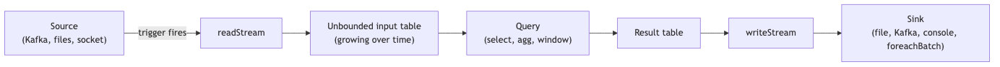

The same DataFrame API works for batch and streaming — Spark handles the incremental computation under the hood.

### Micro-batch processing

By default, Structured Streaming uses **micro-batch** processing:
- New data is buffered.
- Periodically (per trigger), Spark runs a batch query on the accumulated new data.
- Each micro-batch is a small Spark job.

**Continuous processing** (experimental) processes records one at a time with sub-millisecond latency, but has limited operator support.

⚠️ **The exam treats Spark Structured Streaming as micro-batch.** Don't mention continuous mode unless directly asked.

---

## readStream — reading a stream

```python
# From files (each new file = new data)
stream = (spark.readStream
          .format("parquet")
          .schema(my_schema)            # required for file source!
          .option("path", "input_dir/")
          .load())

# From Kafka
stream = (spark.readStream
          .format("kafka")
          .option("kafka.bootstrap.servers", "host:9092")
          .option("subscribe", "my_topic")
          .option("startingOffsets", "earliest")
          .load())

# From rate source (testing — generates rows at a fixed rate)
stream = (spark.readStream
          .format("rate")
          .option("rowsPerSecond", 10)
          .load())

# From socket (testing — netcat input)
stream = (spark.readStream
          .format("socket")
          .option("host", "localhost")
          .option("port", 9999)
          .load())
```

⚠️ **File source REQUIRES an explicit schema** — Spark can't infer from streaming inputs.

### Available sources

| Source | Production-ready | Notes |
|---|---|---|
| **Kafka** | ✓ | Replayable, exactly-once with transactions |
| **File source** | ✓ | Reads new files in a directory (Parquet, JSON, CSV, ORC) |
| **Delta** | ✓ | Each commit = new data; replayable via _delta_log |
| **Kinesis** | ✓ | External package |
| **Socket** | ✗ | Testing only — no fault tolerance |
| **Rate** | ✗ | Testing only — generates timestamped rows |

### isStreaming property

```python
stream.isStreaming        # True for streaming DataFrames
```

Useful for code paths that handle both batch and stream.

---

## writeStream — writing a stream

```python
query = (stream
    .writeStream
    .format("parquet")
    .option("path", "output_dir/")
    .option("checkpointLocation", "checkpoints/")
    .outputMode("append")
    .trigger(processingTime="10 seconds")
    .start())
```

`start()` returns a **`StreamingQuery`** object — a handle to the running query.

### Streaming query control

```python
query.id                  # unique UUID
query.runId               # current run UUID
query.name                # optional name
query.isActive            # True while running
query.lastProgress        # last micro-batch's metrics
query.recentProgress      # last 100 micro-batch metrics
query.exception()         # exception if failed; None if running
query.awaitTermination(timeout=60)   # block until done or timeout
query.stop()              # graceful stop
query.processAllAvailable()  # process all data, then return
```

---

## Triggers

The trigger controls **when** a micro-batch runs.

```python
.trigger(processingTime="10 seconds")    # every 10 seconds
.trigger(availableNow=True)              # process all available, then stop
.trigger(once=True)                      # process available once (DEPRECATED in 3.5)
.trigger(continuous="1 second")          # continuous mode (experimental)
# No trigger specified = process as fast as possible
```

| Trigger | Behavior |
|---|---|
| Default (no trigger) | Process micro-batch as fast as possible; start next when previous completes |
| `processingTime="10 seconds"` | Fire micro-batch every 10s; if previous still running, skip |
| `availableNow=True` | Process all currently-available data in MULTIPLE micro-batches, then stop. Like `once` but handles backlogs better |
| `once=True` | **Deprecated in 3.5** — use `availableNow` instead. Same as old behavior: one batch then stop |
| `continuous="1 second"` | Continuous mode; checkpoint interval = 1s. Experimental |

⚠️ **The exam currently lists `once` as a valid trigger** because exam content was solidified before the 3.5 deprecation took effect at runtime. Know both: **`availableNow` is current best practice**; `once` is deprecated but still functional.

---

## Output modes

Output mode controls **what** gets written each micro-batch.

| Mode | What's written | Valid for |
|---|---|---|
| **`append`** (default) | Only **new** rows added since last trigger | Queries WITHOUT aggregations, OR aggregations WITH watermark |
| **`update`** | Only rows that **changed** in the result table since last trigger | Most aggregations, non-aggregation queries that update rows |
| **`complete`** | The **entire** result table | Aggregations ONLY |

### Decision tree

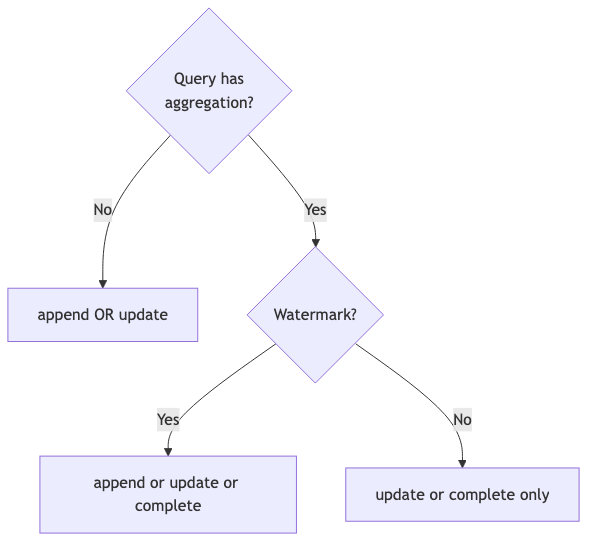

### Append mode — append-only

- No state.
- Once written, rows are immutable.
- Works for transformations like `filter`, `select`, `withColumn`.
- For aggregations: rows are emitted only when watermark advances past the window end.

### Update mode

- For non-aggregation: same as append.
- For aggregations: emits rows that have CHANGED in this micro-batch.

### Complete mode

- Only valid for queries that return a **finite** result (i.e., aggregations).
- Emits the entire result table every micro-batch.
- Each micro-batch OVERWRITES the sink.
- Useful for small dashboards.

⚠️ **Common exam question:** "Why can't you use complete mode without aggregation?" — Because the result table would be the entire input, which is unbounded.

⚠️ **Common exam question:** "What's needed to use append mode with an aggregation?" — A watermark, so Spark knows when a window is "closed" and can be safely emitted.

---

## Watermarks

A **watermark** declares: "data older than (max_event_time − threshold) is allowed to be dropped."

```python
stream_with_wm = (stream
    .withWatermark("event_time", "10 minutes")
    .groupBy(F.window("event_time", "5 minutes"), "user_id")
    .count()
)
```

### What watermarks do

1. **Bound state size.** Without a watermark, state for aggregations grows unboundedly.
2. **Enable append mode for aggregations.** Spark can emit a window's result once the watermark has passed the window's end.
3. **Allow safe drop of late data.** Records older than the watermark are silently dropped.

### Watermark mechanics

For each micro-batch:
1. Spark observes the maximum `event_time` seen so far.
2. The watermark = max_event_time − threshold.
3. Any record with `event_time < watermark` is **late** and dropped (or sent to a special path if configured).
4. Windows that ended before the watermark can be emitted (in append mode) and their state purged.

### Example

Suppose your watermark threshold is 10 minutes, and max event_time seen is 10:30 AM. Watermark = 10:20 AM.

- A record with `event_time = 10:25 AM` arrives → accepted, processed.
- A record with `event_time = 10:15 AM` arrives → too late, dropped.

### Multiple watermark policy

If a streaming query has multiple watermarks (e.g., stream-stream join), the **global watermark = min of all stream watermarks** by default. Config: `spark.sql.streaming.multipleWatermarkPolicy = "min"` (default) or `"max"`.

⚠️ **Important:** the "min" policy means the slowest stream sets the bar. This is safe but can cause state to grow if one stream lags far behind.

---

## Windows in streaming

```python
# Tumbling window (5-minute, non-overlapping)
stream.groupBy(F.window("event_time", "5 minutes")).count()

# Sliding window (5-minute window, sliding every 1 minute)
stream.groupBy(F.window("event_time", "5 minutes", "1 minute")).count()

# Session window (Spark 3.2+)
stream.groupBy(F.session_window("event_time", "5 minutes"), "user_id").count()
```

The `F.window` function returns a struct `{start, end}` representing the window boundaries.

---

## Streaming deduplication

```python
# Without watermark — state grows UNBOUNDED
stream.dropDuplicates(["event_id"])

# With watermark — state bounded
stream.withWatermark("event_time", "10 minutes") \
      .dropDuplicates(["event_id", "event_time"])
```

⚠️ **The watermark column must be in the dedup subset** — Spark uses the watermark to time out old IDs.

Without a watermark, every distinct `event_id` is remembered forever — state grows linearly with traffic.

---

## Checkpointing — fault tolerance

```python
query = stream.writeStream \
    .option("checkpointLocation", "/path/to/checkpoint") \
    .start()
```

**Required for fault-tolerant queries.** Stores:
- **Offsets log** — last processed offsets per source (so restart resumes from where it left off).
- **Commit log** — confirmed completed batches.
- **State store snapshots** — aggregation state, dedup state, watermarks.

Restart behavior: when the query is restarted with the same checkpoint location, it resumes from the last completed batch.

⚠️ **Each streaming query MUST have a unique checkpoint location.** Sharing a checkpoint between queries corrupts state.

### Checkpoint dir requirements

- **Reliable storage**: HDFS, S3, ADLS, GCS. Local disk on a single machine won't survive restarts.
- **Read-write access** for the Spark application.
- **Never delete it** while the query is running.

---

## Exactly-once semantics

Spark Structured Streaming provides **exactly-once** delivery guarantees when:

1. **Source is replayable** — Kafka, file source, Delta (offsets/positions are tracked).
2. **Sink is idempotent** — Delta, Kafka with transactions, foreachBatch with idempotent writes.
3. **Checkpoint** location is set.

Without (1) and (2), Spark falls back to at-least-once (sources without replay) or at-most-once (sinks without idempotence).

⚠️ **Exam framing:** "What three things are required for exactly-once semantics?" → replayable source, idempotent sink, checkpoint.

---

## Sinks

```python
# File sink (Parquet, JSON, CSV, ORC, Delta)
.format("parquet").option("path", "out/")

# Kafka sink
.format("kafka")
.option("kafka.bootstrap.servers", "...")
.option("topic", "out_topic")

# Console (dev only, no fault tolerance)
.format("console")

# Memory (dev only)
.format("memory").queryName("in_memory_view")
# Then: spark.sql("SELECT * FROM in_memory_view")

# foreachBatch — custom logic per micro-batch
def write_to_db(batch_df, batch_id):
    batch_df.write.jdbc(...)

stream.writeStream.foreachBatch(write_to_db).start()

# foreach — row-level (rare)
stream.writeStream.foreach(MyRowWriter()).start()
```

### foreachBatch — the escape hatch

`foreachBatch(fn)` gives you the micro-batch as a regular DataFrame in your callback. Use it for:
- Writing to arbitrary sinks (e.g., a third-party database).
- Implementing exactly-once writes to non-transactional sinks (via idempotent upserts).
- Performing multiple writes per micro-batch.

```python
def upsert_to_delta(batch_df, batch_id):
    # MERGE INTO delta_target USING batch_df ...
    pass

stream.writeStream.foreachBatch(upsert_to_delta).start()
```

⚠️ **`foreachBatch` is called once per micro-batch.** The `batch_df` parameter is a regular (non-streaming) DataFrame — you can apply any batch operation.

---

## Stateful operations

Streaming aggregations, deduplication, and joins maintain **state** between micro-batches:
- Aggregations: per-group counters/sums/etc.
- Dedup: seen IDs.
- Stream-stream join: buffered events from both streams.

State is stored in a **state store** on executors and **checkpointed** to durable storage.

### State store configs

- `spark.sql.streaming.stateStore.providerClass` — provider implementation (default: RocksDB on Databricks; HDFS-based on OSS).
- `spark.sql.streaming.stateStore.minDeltasForSnapshot` — snapshot frequency.

State store performance matters for high-throughput streaming. Not deeply exam-tested.

---

## Stream-static joins

A streaming DataFrame joined with a static (batch) DataFrame:

```python
events_stream = spark.readStream.format("kafka").load()
dim_users = spark.table("dim_users")               # static, batch

joined = events_stream.join(dim_users, "user_id")
```

- **No watermark needed** on the static side.
- The static side is **broadcast** if small enough, or **shuffled** with each micro-batch otherwise.
- The static side is **re-read** at each micro-batch if it changes (depends on source).

---

## Stream-stream joins

Joining two streams requires:

```python
# Both streams have watermarks
left_wm = left_stream.withWatermark("left_ts", "10 minutes")
right_wm = right_stream.withWatermark("right_ts", "10 minutes")

# Time-bound join condition
joined = left_wm.join(
    right_wm,
    F.expr("""
        left_key = right_key AND
        left_ts BETWEEN right_ts - INTERVAL 5 MINUTES AND right_ts + INTERVAL 5 MINUTES
    """),
    "inner"
)
```

Requirements:
- **Watermarks on BOTH sides** — otherwise state is unbounded.
- **Time-bound join condition** (e.g., `BETWEEN`) — otherwise state is unbounded.
- Output mode restricted to **`append`** for aggregations after the join.

⚠️ **Exam framing:** "What's needed for stream-stream joins?" → watermarks on both sides + time-bound condition.

---

## Streaming basic operations

```python
# Filter / select (NO state)
stream.filter(F.col("user_id") > 100).select("event_type", "ts")

# Window aggregation (STATEFUL)
stream.withWatermark("event_time", "10 minutes") \
      .groupBy(F.window("event_time", "5 minutes"), "user_id") \
      .agg(F.count("*").alias("n"), F.sum("amount").alias("total"))

# Deduplication
stream.withWatermark("event_time", "10 minutes") \
      .dropDuplicates(["event_id", "event_time"])
```

⚠️ **Some batch operations are NOT supported in streaming:**
- Multiple aggregations in one query (e.g., `groupBy(a).count()` then `groupBy(b).count()`).
- Limit/take/show outside of `foreachBatch` (limit must be in append-once context).
- `distinct()` without watermark (use `dropDuplicates` with watermark).
- Some join types (full outer streaming join — restricted).

For unsupported operations, use `foreachBatch` to run them on each micro-batch as a batch query.

---

## Monitoring streaming queries

```python
query = stream.writeStream.format("parquet")...start()

# Wait for query to terminate
query.awaitTermination()

# Get progress
query.lastProgress
# {
#   "id": "...",
#   "runId": "...",
#   "name": null,
#   "timestamp": "2026-05-23T10:00:00Z",
#   "batchId": 42,
#   "numInputRows": 1000,
#   "inputRowsPerSecond": 100.0,
#   "processedRowsPerSecond": 95.0,
#   "durationMs": {...},
#   "stateOperators": [...],
#   ...
# }

# Get all recent progress
query.recentProgress
```

### Spark UI — Streaming tab

When a streaming query is active, the Spark UI shows a Streaming tab with:
- Input rate vs processing rate (catching up or falling behind).
- Batch duration distribution.
- State store metrics.
- Per-source/sink metrics.

---

## Common streaming pitfalls

| Pitfall | Fix |
|---|---|
| Streaming aggregation without watermark, append mode | Add `withWatermark` |
| Two streaming queries share checkpoint dir | Each query needs its own |
| Checkpoint dir on local disk | Move to HDFS/S3 |
| Driver runs out of memory tracking state | Add watermarks; increase driver memory |
| Source replays from beginning after restart | Verify checkpoint dir is intact; verify `startingOffsets` doesn't force "earliest" |
| Dedup state grows unbounded | Add watermark; include watermark column in dedup subset |
| `complete` mode used without aggregation | Switch to `append` or `update` |

---

## Worked example: end-to-end Kafka → Parquet

```python
from pyspark.sql import functions as F
from pyspark.sql.types import StructType, StructField, StringType, LongType, DoubleType, TimestampType

schema = StructType([
    StructField("user_id", LongType()),
    StructField("event_type", StringType()),
    StructField("amount", DoubleType()),
    StructField("event_time", TimestampType()),
])

# Read from Kafka
raw = (spark.readStream
    .format("kafka")
    .option("kafka.bootstrap.servers", "broker:9092")
    .option("subscribe", "events")
    .option("startingOffsets", "latest")
    .load())

# Parse JSON value, apply watermark, aggregate
parsed = raw.select(
    F.from_json(F.col("value").cast("string"), schema).alias("data")
).select("data.*")

agg = (parsed
    .withWatermark("event_time", "10 minutes")
    .groupBy(F.window("event_time", "5 minutes"), "event_type")
    .agg(F.sum("amount").alias("total_amount"), F.count("*").alias("n")))

# Write to Parquet
query = (agg.writeStream
    .format("parquet")
    .option("path", "/data/agg_output/")
    .option("checkpointLocation", "/checkpoints/agg_query/")
    .outputMode("append")    # valid with watermark
    .trigger(processingTime="1 minute")
    .start())

query.awaitTermination()
```

---

## Mini-quiz

1. What's the difference between `append` and `complete` output modes?
2. Can you use `append` mode with an aggregation?
3. What's the purpose of a watermark?
4. Is `trigger(once=True)` current best practice in Spark 3.5?
5. What's required for exactly-once streaming?
6. What's the difference between stream-static and stream-stream joins?
7. Why must streaming dedup include the watermark column?
8. What happens if two streaming queries share a checkpoint location?
9. Is the file source for streaming schema-on-read?
10. Name the three required components for fault-tolerant streaming.

### Answers

1. **`append`** writes only new rows (no updates to past rows). **`complete`** writes the entire result table every micro-batch — only valid for aggregations.
2. **Yes, but only with a watermark.** Without a watermark, append mode for aggregations is rejected because Spark can't determine when a window is "done."
3. Bound the state size (purge old groups/IDs); enable append mode for aggregations; allow safe drop of late data.
4. **No** — `trigger(once=True)` is deprecated in 3.5. Use `trigger(availableNow=True)` instead. (Both still work, but `availableNow` handles backlogs better.)
5. **Replayable source + idempotent sink + checkpoint location.**
6. **Stream-static** joins a streaming DataFrame with a static (batch) DataFrame — no watermark on the static side. **Stream-stream** joins two streaming DataFrames — requires watermarks on both sides + a time-bound condition.
7. The watermark column is what Spark uses to time out and purge old IDs from state. Without it in the dedup subset, state grows unbounded.
8. **State corruption.** Each streaming query must have a unique checkpoint location.
9. **No.** File source for streaming **requires** an explicit schema. Spark cannot infer schemas in streaming context.
10. **(1)** Replayable source, **(2)** Idempotent sink, **(3)** Checkpoint location.

---

## Exam-day cheat sheet

- **Programming model:** unbounded table; incremental computation.
- **Triggers:** default (ASAP), `processingTime="..."`, `availableNow=True` (current), `once=True` (deprecated).
- **Output modes:** `append` (no agg or watermark+agg), `update` (changed rows), `complete` (whole table; agg only).
- **Watermark** purpose: bound state, enable append mode for agg, drop late data.
- **Checkpoint location is REQUIRED** for fault tolerance.
- **Exactly-once requires:** replayable source + idempotent sink + checkpoint.
- **Stream-stream joins need:** watermarks on both sides + time-bound condition.
- **Streaming dedup needs:** watermark column in subset.
- **File source streaming REQUIRES schema** — no inference.
- **`foreachBatch`** = run batch ops per micro-batch (custom sinks, multi-writes).
- **Spark Structured Streaming is MICRO-BATCH by default** (continuous mode is experimental).

Next: [Module 12 — Spark Connect](12_spark_connect.md).


\newpage

# Module 12 — Spark Connect

> **Domain 6 of 7 — Spark Connect & Deployment (5% — NEW DOMAIN).**
> **Goal:** Master Spark Connect's client-server architecture, the `sc://` URI scheme, the `.remote()` builder, and the **restrictions** (no RDD, no SparkContext, no broadcast variables, no accumulators). Plus the deployment modes (client/cluster/local) — local mode = single worker is sample Q7.

---

## Coverage map

Verbatim Oct 2025 exam objectives covered by this module:

| Objective (Section 6 — Spark Connect & Deployment, 5%) | Section |
|---|---|
| "Describe the features of Spark Connect." | [What is Spark Connect?](#what-is-spark-connect), [Benefits](#benefits), [Architecture: gRPC + Protobuf](#architecture-grpc--protobuf), [Restrictions](#restrictions--what-spark-connect-clients-cannot-do-high-value) |
| "Describe the different deployment mode types (Client, Cluster, Local) in the Apache Spark environment." | [Deployment modes (HIGH-VALUE — sample Q7)](#deployment-modes-high-value--sample-q7), [Distinguishing the three](#distinguishing-the-three) |

---

> 🎯 **How to recognize this on the exam:**
> - "URI scheme for Spark Connect" → **`sc://`** (e.g., `sc://host:15002`).
> - "Default Spark Connect port" → **15002**.
> - "Protocol" → **gRPC** over HTTP/2, Protobuf messages.
> - "What is NOT available in Spark Connect?" → RDD API (`df.rdd`), SparkContext, `sc.broadcast`, `sc.accumulator`, JVM access.
> - "What IS available?" → DataFrame/SQL API, `spark.sql`, `pyspark.pandas`, `pandas_udf`, Structured Streaming.
> - "GA versions" → Python in **Spark 3.4**, Scala in **Spark 3.5**, Go in development.
> - "Client size" → **~1.5 MB** (vs ~355 MB for full PySpark).
> - "Which deployment mode runs all executors on a single worker node?" → **Local mode**. Sample Q7.
> - "Standalone" as a deployment-mode answer → **WRONG** (Standalone is a cluster manager, not a deployment mode).
> - "Client vs Cluster mode" → driver location: client = submitting machine; cluster = a worker node.
> - "Local mode master string" → `"local[N]"` or `"local[*]"`.
> - "`F.broadcast(df)` in Connect" → **works** (it's a join hint, not a broadcast variable).

---

## Why this module exists

Brand-new domain in the relaunched exam (2 of 45 questions). Senior PySpark engineers typically have zero hands-on with Spark Connect — but the exam content is conceptual and can be mastered in ~1 hour of focused study. Both questions usually fall in two flavors:

1. **"What is Spark Connect?"** (architecture, gRPC, thin client)
2. **"Which deployment mode runs all executors on a single worker node?"** (local mode — sample Q7)

---

## What is Spark Connect?

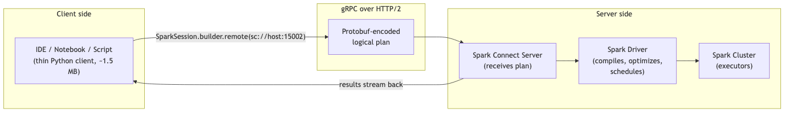

**Spark Connect** is a client-server architecture for Spark, introduced GA in Spark 3.4 (Python client; Scala client GA in 3.5; Go in development).

- The **client** is a **thin Python library** (~1.5 MB) that builds DataFrame plans and serializes them as Protobuf messages over gRPC.
- The **server** receives the plan, materializes it via a real Spark driver, and streams results back.
- The client and server are **decoupled**: client crashes don't kill the driver; client and server versions can be different (within compatibility range).

---

## How to use it

```python
from pyspark.sql import SparkSession

spark = (SparkSession.builder
         .remote("sc://hostname:15002")
         .getOrCreate())

df = spark.read.parquet("s3://my-bucket/data/")
df.show()
```

The **`.remote(uri)`** builder is the entry point. URI scheme: **`sc://`**. Default port: **`15002`**.

Once you have the `spark` session, the **API is identical** to regular PySpark — `spark.read`, `spark.sql`, DataFrame methods, etc.

### Environment variable alternative

```bash
export SPARK_REMOTE="sc://hostname:15002"
```

Then in Python:

```python
spark = SparkSession.builder.getOrCreate()    # picks up SPARK_REMOTE
```

---

## Benefits

| Benefit | Why |
|---|---|
| **Lightweight client (~1.5 MB)** | Full PySpark is ~355 MB; great for embedded use, edge devices, serverless functions |
| **Decoupled lifecycle** | Client crashes don't kill the driver; driver crashes return a clear error to the client |
| **IDE-friendly** | Connect from PyCharm, VS Code, Jupyter without setting up a local Spark installation |
| **Multi-language** | Python, Scala (3.5+), Go (in dev), more clients possible |
| **Mismatched versions tolerated** | Client at 3.5.0 can connect to a 3.5.2 server (within supported range) |
| **Multi-user shared driver** | One Spark Connect server can serve many concurrent users (each with their own session ID) |
| **Stable client API** | Connect uses Protobuf; the wire format is versioned and backward-compatible |

---

## Architecture: gRPC + Protobuf

Spark Connect uses **gRPC** (Google's RPC framework over HTTP/2) with **Protocol Buffers** (Protobuf) as the message format.

Client sends a **logical plan** as a serialized Protobuf message:

```
SparkConnectPlanRequest {
  client_id: "...",
  session_id: "...",
  plan: {
    op: SQL,
    sql_query: "SELECT * FROM events WHERE year=2025"
  }
}
```

Server compiles the plan into a Spark execution, runs it, and streams the result rows back as Arrow-encoded batches.

⚠️ **Exam framing:** "What protocol does Spark Connect use?" → **gRPC**. Not REST, not custom TCP — gRPC over HTTP/2.

---

## Restrictions — what Spark Connect clients CANNOT do (HIGH-VALUE)

Because the client is thin and stateless, several Spark APIs are **not available**:

| Not supported | Why |
|---|---|
| **RDD API** (`df.rdd`, `sc.parallelize`, `sc.textFile`) | RDDs require direct JVM access; client has no JVM |
| **`SparkContext`** (`spark.sparkContext`) | Returns `None` in Connect mode |
| **Broadcast variables** (`sc.broadcast(value)`) | No `SparkContext` |
| **Accumulators** (`sc.accumulator(0)`) | No `SparkContext` |
| **JVM access** (`spark._jvm`, `spark._sc._jvm`) | No JVM on client |
| **`SQLContext` and `HiveContext`** | Use `SparkSession.sql()` instead |
| **Some `Catalog` operations** | Limited subset available |
| **`PipelinedRDD` and lower-level RDD operations** | Same as RDD |
| **`getOrCreate` for a local SparkSession when remote is set** | Conflict; remote wins |

### What IS supported

- The full **DataFrame/SQL API** — `read`, `write`, `select`, `filter`, `join`, `groupBy`, `agg`, etc.
- **Spark SQL** via `spark.sql(...)`.
- **Pandas API on Spark** (`pyspark.pandas`) — works over Connect.
- **`pandas_udf`** — vectorized UDFs work; they're sent as serialized Python to the server.
- **Structured Streaming** — `readStream`, `writeStream`, query handles.
- **MLflow integration** (with some adjustments).

⚠️ **Exam framing:** "Which is NOT supported in Spark Connect?" → likely **RDD API** or **`sc.broadcast(...)`** or **`spark.sparkContext`**.

---

## Deployment modes (HIGH-VALUE — sample Q7)

Three deployment modes — independent of Spark Connect, but covered in the same exam domain:

| Mode | Driver location | Executor location | Use case |
|---|---|---|---|
| **Client mode** | On the **submitting machine** (your laptop, edge node) | On the cluster | Interactive — notebooks, REPL |
| **Cluster mode** | On a **worker node** in the cluster (allocated by cluster manager) | On other worker nodes | Production batch jobs |
| **Local mode** | In a **single JVM** on the local machine | **All executors run as threads in the SAME JVM** ← single "worker node" | Dev, testing, unit tests |

### Sample Q7 — the local-mode trap

The official sample asks: **"Which Apache Spark deployment mode requires all executors to run on a single worker node?"**

**Answer: Local mode.**

In local mode:
- There IS a "driver" and there ARE "executors" — but they're all **threads in one JVM** on one machine.
- Specified via `spark.master = "local[N]"` where N is the number of threads (or `"local[*]"` for all cores).
- No cluster manager involved.

The exam phrases it as "single worker node" because the single machine acts as the worker.

```python
spark = (SparkSession.builder
         .appName("test")
         .master("local[4]")
         .getOrCreate())
```

### Distinguishing the three

```python
# Local mode — single JVM
.master("local[*]")

# Client mode — driver on local, executors on cluster
.master("yarn")                    # or "spark://...", "k8s://..."
# (and submit with --deploy-mode client, or no flag)

# Cluster mode — driver also on cluster
.master("yarn")
# (and submit with --deploy-mode cluster)
```

For `spark-submit`:
```bash
spark-submit --master yarn --deploy-mode client myjob.py
spark-submit --master yarn --deploy-mode cluster myjob.py
```

---

## Connect vs deployment mode — orthogonal concepts

Spark Connect is a **client-server protocol**, not a deployment mode. The server itself can run in client, cluster, or local mode.

Think of it like:

| Layer | Examples |
|---|---|
| **Cluster manager** | Standalone, YARN, K8s, Mesos (deprecated) |
| **Deployment mode** | Client, Cluster, Local |
| **Client-server protocol** | Spark Connect (new) vs Classic (driver in-process or via Py4J) |

You can mix: Spark Connect server running on a Kubernetes cluster in cluster mode.

---

## Migration patterns: classic PySpark → Spark Connect

Most DataFrame/SQL code "just works":

```python
# Both work in Connect and classic
df = spark.read.parquet("path")
df.filter(F.col("x") > 0).groupBy("k").count().show()
spark.sql("SELECT * FROM events WHERE year = 2025").show()
```

Code that requires **rewriting** for Connect:

```python
# Classic — uses RDD
rdd = sc.parallelize([1, 2, 3])
df = spark.createDataFrame(rdd, "value INT")

# Connect-compatible — direct DataFrame
df = spark.createDataFrame([(1,), (2,), (3,)], "value INT")
```

```python
# Classic — uses broadcast variable
lookup = sc.broadcast({"A": 1, "B": 2})

@udf("int")
def get_value(k):
    return lookup.value.get(k, -1)

# Connect-compatible — broadcast DataFrame instead
lookup_df = spark.createDataFrame([("A", 1), ("B", 2)], "k STRING, v INT")
result = df.join(F.broadcast(lookup_df), "k")
```

---

## Performance and limitations

### Latency

Spark Connect adds **some** network latency vs a co-located classic driver:
- Plan serialization: ~ms.
- gRPC roundtrip: ~10-100ms depending on distance.
- Result streaming: Arrow batches over gRPC.

For interactive queries, the overhead is negligible. For high-frequency tiny queries, you'd notice.

### Concurrency

A single Spark Connect server can serve **many concurrent sessions** — each client gets a session ID, and sessions are isolated (catalog, temp views, configs).

### Authentication and TLS

Production Spark Connect typically uses:
- TLS (`grpc.ssl_target_name_override`, certs).
- Authentication via token (header in gRPC metadata).

Not directly exam-tested, but you should know "Spark Connect supports secure connections."

---

## Sample-style questions

### "Describe the Spark Connect architecture"

Spark Connect uses a **client-server** architecture where a thin client (~1.5 MB) sends DataFrame/SQL plans as **Protobuf messages over gRPC** to a Spark Connect server, which runs the actual Spark driver. Benefits: decoupled lifecycle, multi-language clients, lightweight footprint, IDE-friendly remote development.

### "What's the URI scheme to connect to a Spark Connect server?"

**`sc://`** — e.g., `sc://hostname:15002`.

### "Which API is NOT available when using Spark Connect?"

**RDD API** (and `SparkContext`-based APIs like `sc.broadcast`, `sc.accumulator`).

### "Which deployment mode requires all executors to run on a single worker node?"

**Local mode.** All executors run as threads in a single JVM.

### "What protocol does Spark Connect use?"

**gRPC** (over HTTP/2), with Protocol Buffers as the message format.

---

## Configuration cheatsheet

### Starting a Spark Connect server (server side)

```bash
$SPARK_HOME/sbin/start-connect-server.sh \
  --master spark://my-master:7077 \
  --conf spark.connect.grpc.binding.port=15002 \
  --conf spark.connect.grpc.binding.address=0.0.0.0
```

### Connecting from a client

```python
spark = SparkSession.builder.remote("sc://my-server:15002").getOrCreate()
```

### Behavioral differences in client

- `spark.sparkContext` → `None`.
- `df.rdd` → raises an error.
- `sc.broadcast(...)` → unavailable.
- `spark._jvm` → unavailable.
- `df.toPandas()` → returns a pandas DataFrame via Arrow stream (works).

---

## Mini-quiz

1. What's the URI scheme for Spark Connect?
2. What protocol does Spark Connect use?
3. Is `spark.sparkContext` available in a Connect client?
4. Can you use `sc.broadcast(value)` over Spark Connect?
5. Which deployment mode runs all executors on a single worker node?
6. What's the typical size of the Spark Connect Python client?
7. When was the Python Spark Connect client GA?
8. Can the Spark Connect client and server be different versions?
9. Does pandas_udf work over Spark Connect?
10. Does `df.rdd` work over Spark Connect?

### Answers

1. **`sc://`** (e.g., `sc://hostname:15002`).
2. **gRPC** (over HTTP/2), with Protocol Buffers as the message format.
3. **No.** It returns `None`. Spark Connect clients have no JVM access.
4. **No.** Broadcast variables require `SparkContext`, which is unavailable in Connect. Use `F.broadcast(small_df)` for join broadcasting, or rewrite to avoid broadcast variables.
5. **Local mode.** All executors are threads in a single JVM.
6. **~1.5 MB** (vs ~355 MB for full PySpark).
7. **Spark 3.4** (Python). Scala client GA in 3.5.
8. **Yes** — within a supported compatibility range. The Protobuf protocol is versioned.
9. **Yes.** Pandas UDFs work in Connect — they're shipped as serialized Python to the server, which executes them as usual.
10. **No.** RDD API is unavailable in Connect clients.

---

## Exam-day cheat sheet

- **Spark Connect: client-server, gRPC, Protobuf, `sc://` URI.**
- **Client = ~1.5 MB; server runs the actual Spark driver.**
- **GA in Spark 3.4 (Python); Scala in 3.5; Go in development.**
- **NOT available in Connect:** RDD API, SparkContext, `sc.broadcast`, `sc.accumulator`, JVM access.
- **Available in Connect:** DataFrame/SQL API, Spark SQL, `pyspark.pandas`, `pandas_udf`, Structured Streaming.
- **Deployment modes:** Client (driver on submitter), Cluster (driver on worker), Local (all in single JVM).
- **Local mode = all executors on single worker node** ⚠️ (sample Q7).
- **`SparkSession.builder.remote("sc://host:15002").getOrCreate()`** — entry point.
- **`F.broadcast(df)` works in Connect** (it's a join hint, not a broadcast variable).

Next: [Module 13 — Pandas API on Spark](13_pandas_api_on_spark.md).


\newpage

# Module 13 — Pandas API on Spark + Pandas UDFs

> **Domain 7 of 7 — Pandas API on Spark (5% — NEW DOMAIN).**
> **Goal:** Distinguish **`pyspark.pandas`** (a pandas-compatible API that runs on Spark) from **`pandas_udf`** (a vectorized PySpark UDF). These are DIFFERENT things commonly confused on the exam. Master both.

---

## Coverage map

Verbatim Oct 2025 exam objectives covered by this module:

| Objective (Section 7 — Pandas API on Spark, 5%) | Section |
|---|---|
| "Explain the advantages of using Pandas API on Spark." | [Part 1: Pandas API on Spark (pyspark.pandas)](#part-1-pandas-api-on-spark-pysparkpandas), [Why use it](#why-use-it), [Key differences from real pandas](#key-differences-from-real-pandas) |
| "Create and invoke Pandas UDF." | [Part 2: Pandas UDFs (pandas_udf)](#part-2-pandas-udfs-pandas_udf), [The four types of Pandas UDFs](#the-four-types-of-pandas-udfs), [mapInPandas — partition-level iteration](#mapinpandas--partition-level-iteration) |

Also relevant (cross-section, Section 3 objective): "Create and invoke user-defined functions with or without stateful operators, including StateStores." — Pandas UDFs are a major category of UDFs.

---

> 🎯 **How to recognize this on the exam:**
> - "Pandas API on Spark vs Pandas UDF" → DIFFERENT things. Pandas API on Spark = `import pyspark.pandas as ps`; top-level pandas-style API. Pandas UDF = `@pandas_udf(...)` decorator; vectorized UDF inside PySpark DataFrames.
> - "Conventional alias" → **`ps`** (`import pyspark.pandas as ps`).
> - "Former name of `pyspark.pandas`" → **Koalas** (pre-Spark 3.2).
> - "Why are Pandas UDFs fast?" → **Apache Arrow** for columnar batch serialization between JVM and Python; vectorized pandas/NumPy ops.
> - "Four Pandas UDF types" → **Scalar**, **Scalar Iterator**, **Grouped Map (`applyInPandas`)**, **Grouped Aggregate**.
> - "When to use Scalar Iterator" → expensive per-executor initialization (e.g., loading an ML model once).
> - "`applyInPandas` requirement" → **explicit output schema**.
> - "Default pyspark.pandas index" → **`sequence`** (slow; requires shuffle). Use `distributed` or `distributed-sequence` for performance.
> - "Convert ps.DataFrame → PySpark" → `.to_spark()`. Reverse: `sdf.pandas_api()` or `sdf.to_pandas_on_spark()`.
> - "`psdf.to_pandas()` risk" → driver OOM (collects all rows).
> - "In-place pandas ops on pyspark.pandas" → **fail by default** (set `compute.ops_on_diff_frames=True` to enable).

---

## Why this module exists

5% of the exam (~2 questions) — but the questions reliably probe the **distinction between `pyspark.pandas` and `pandas_udf`**. They sound similar and use the same conceptual building block (pandas), but they're different mechanisms.

| | `pyspark.pandas` (pandas API on Spark) | `pandas_udf` (vectorized PySpark UDF) |
|---|---|---|
| What | A pandas-compatible API that runs on Spark | A PySpark UDF decorator that takes pandas Series/DataFrames |
| Use | Drop-in replacement for pandas at scale | Define vectorized column transforms inside PySpark DataFrames |
| Import | `import pyspark.pandas as ps` | `from pyspark.sql.functions import pandas_udf` |
| Returns | Pandas-on-Spark DataFrame (`ps.DataFrame`) | Spark Column |

---

## Part 1: Pandas API on Spark (`pyspark.pandas`)

### History

- **Pre-Spark 3.2:** Standalone project called **Koalas** (developed by Databricks).
- **Spark 3.2+:** Merged into Spark as `pyspark.pandas`. Koalas package archived.

### What it is

A **pandas-compatible API** that runs on Spark under the hood. Write `pandas`-style code; Spark distributes the computation.

```python
import pyspark.pandas as ps

# Read CSV — looks like pandas, runs on Spark
psdf = ps.read_csv("path/to/file.csv")

# Pandas-style operations
psdf['amount_doubled'] = psdf['amount'] * 2
grouped = psdf.groupby('country').mean()
filtered = psdf[psdf['age'] > 30]
```

### Convention

```python
import pandas as pd                # pandas
import pyspark.pandas as ps        # pandas API on Spark
```

`pdf` for pandas DataFrames, `psdf` for pandas-on-Spark DataFrames. Conventions widely followed in tutorials.

### Why use it

| When | Why |
|---|---|
| You have existing pandas code and the data grew too big for one machine | Minimal rewrite to scale |
| Team is more familiar with pandas than PySpark | Onboarding ease |
| Quick exploratory analysis at scale | pandas-style ergonomics |

### Why NOT use it

- Performance-critical pipelines — native PySpark DataFrame is usually faster.
- Some pandas methods are unsupported (raise `NotImplementedError`).
- Implicit shuffling — operations that pandas does for free (sorting) require shuffles in Spark.

---

## Reading and writing

```python
import pyspark.pandas as ps

# Read
psdf = ps.read_csv("path/to/file.csv")
psdf = ps.read_parquet("path/to/file.parquet")
psdf = ps.read_json("path/to/file.json")
psdf = ps.read_excel("path/to/file.xlsx")           # via pandas
psdf = ps.read_delta("path/to/delta")               # via spark
psdf = ps.read_orc("path")

# Write
psdf.to_csv("out.csv")
psdf.to_parquet("out.parquet")
psdf.to_delta("out_delta", mode="overwrite")
```

The API mirrors pandas where possible.

---

## Conversion between pandas, pandas-on-Spark, and PySpark

```python
import pyspark.pandas as ps
import pandas as pd

# pandas → pandas-on-Spark
pdf = pd.DataFrame({"a": [1, 2, 3]})
psdf = ps.from_pandas(pdf)

# pandas-on-Spark → pandas (driver-side! risky for big data)
pdf = psdf.to_pandas()

# pandas-on-Spark → PySpark DataFrame
sdf = psdf.to_spark()

# PySpark DataFrame → pandas-on-Spark
sdf = spark.read.csv("path")
psdf = sdf.pandas_api()       # or sdf.to_pandas_on_spark()
```

⚠️ **`psdf.to_pandas()` collects ALL rows to driver** — same risk as `df.toPandas()` on a regular DataFrame. Limit first.

---

## Key differences from real pandas

### 1. No in-place operations by default

```python
# Real pandas — modifies in place
pdf.fillna(0, inplace=True)              # works

# Pandas-on-Spark — raises by default
psdf.fillna(0, inplace=True)             # SettingWithCopyError / SparkPandasException
psdf = psdf.fillna(0)                    # use assignment instead
```

Why? Spark DataFrames are immutable; in-place ops contradict that.

Enable explicitly:
```python
ps.set_option("compute.ops_on_diff_frames", True)
```

### 2. Index handling

`pyspark.pandas` supports a pandas-like **index** but it's computed, not free.

**Default index type**: `sequence` (slow — requires a global sequence number, which is a shuffle).

```python
# Default — slow
psdf = ps.from_pandas(pdf)  # uses 'sequence' index

# Faster — distributed
ps.set_option("compute.default_index_type", "distributed")
ps.set_option("compute.default_index_type", "distributed-sequence")
```

| Index type | Performance | Index values |
|---|---|---|
| **`sequence`** (default) | **Slow** (shuffle-heavy) | Consecutive integers 0, 1, 2, ... |
| **`distributed`** | Fast | Unique but NOT consecutive (gaps between partitions) |
| **`distributed-sequence`** | Medium (small shuffle) | Consecutive integers 0, 1, 2, ... (computed via Spark window) |

For most analytics work, set `compute.default_index_type = "distributed"` and don't depend on consecutive indexes.

### 3. Sorting requires a shuffle

```python
psdf.sort_values("col")     # SHUFFLE under the hood (orderBy)
```

In pandas, sorting is local and free. In pandas-on-Spark, it's a wide transformation.

### 4. Unsupported methods

Some pandas methods don't exist in pyspark.pandas (yet) — they raise `NotImplementedError`. Workaround: drop to PySpark via `.to_spark()`, do the op, convert back via `.pandas_api()`.

### 5. Type inference differences

Pandas-on-Spark uses Spark's type system; mostly compatible but some edge cases differ.

---

## Pandas-on-Spark vs PySpark DataFrame — when to use which

| Scenario | Best choice |
|---|---|
| Existing pandas code, data growing past single-machine | **pandas-on-Spark** |
| Data scientist team comfortable with pandas | **pandas-on-Spark** |
| New pipeline, performance-critical | **PySpark DataFrame** |
| Single-machine data fits in pandas comfortably | **Real pandas** |
| Need a method only available in pandas | Use **pandas-on-Spark** but be ready to fall back |

---

## Common pandas-on-Spark operations

```python
import pyspark.pandas as ps

psdf = ps.read_parquet("path")

# Selecting
psdf['col']                    # Series
psdf[['col1', 'col2']]         # DataFrame
psdf.col1                      # attribute access

# Filtering
psdf[psdf['age'] > 30]
psdf.loc[psdf['age'] > 30, 'name']

# Adding columns
psdf['new_col'] = psdf['a'] + psdf['b']
psdf = psdf.assign(new_col=psdf['a'] + psdf['b'])

# Group-by
psdf.groupby('country').mean()
psdf.groupby('country').agg({'amount': 'sum', 'count': 'mean'})

# Pivot
psdf.pivot_table(index='country', columns='year', values='revenue', aggfunc='sum')

# Merge / join
psdf1.merge(psdf2, on='id', how='inner')

# Sort
psdf.sort_values('col')        # SHUFFLE
psdf.sort_index()              # also shuffle (if using non-distributed index)

# Reset index
psdf.reset_index()

# Drop duplicates
psdf.drop_duplicates(subset=['user_id'])

# Apply function
psdf['col'].apply(lambda x: x * 2)     # pandas UDF-like; vectorized via Arrow
```

---

## Part 2: Pandas UDFs (`pandas_udf`)

A **completely different thing** from `pyspark.pandas`. Pandas UDFs are **vectorized PySpark UDFs** that:
- Receive **batches of rows** as `pd.Series` or `pd.DataFrame`.
- Are executed via **Apache Arrow** for zero-copy serialization between JVM and Python.
- Are much faster than row-by-row Python UDFs.

```python
import pandas as pd
from pyspark.sql.functions import pandas_udf
from pyspark.sql.types import LongType

@pandas_udf(LongType())
def plus_one(s: pd.Series) -> pd.Series:
    return s + 1

df.withColumn("incremented", plus_one(F.col("value")))
```

### Why faster than regular UDFs

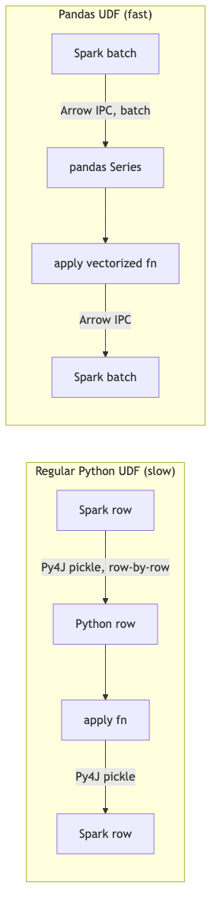

- **Regular UDF**: row-by-row Py4J serialization + Python interpreter overhead per row.
- **Pandas UDF**: batch of ~10k rows converted to Apache Arrow once, processed as a vectorized pandas/NumPy op.

The difference is often 10-100×.

---

## The four types of Pandas UDFs

### 1. Scalar — Series → Series

Input: one or more `pd.Series` (one per input column).
Output: `pd.Series` of same length.

Use case: column-level transformations.

```python
@pandas_udf(LongType())
def add_one(s: pd.Series) -> pd.Series:
    return s + 1

df.withColumn("y", add_one(F.col("x")))
```

Multiple inputs:

```python
@pandas_udf(DoubleType())
def distance(x: pd.Series, y: pd.Series) -> pd.Series:
    return (x ** 2 + y ** 2) ** 0.5

df.withColumn("d", distance(F.col("x"), F.col("y")))
```

### 2. Scalar Iterator — Iterator[Series] → Iterator[Series]

Input: an iterator yielding batches of `pd.Series`.
Output: an iterator yielding batches of `pd.Series` of same lengths.

Use case: expensive initialization (e.g., loading an ML model) done ONCE per executor, not per batch.

```python
from typing import Iterator

@pandas_udf(LongType())
def predict_batch(iterator: Iterator[pd.Series]) -> Iterator[pd.Series]:
    model = load_model()                # expensive — happens once per executor
    for batch in iterator:
        yield model.predict(batch)

df.withColumn("pred", predict_batch(F.col("features")))
```

### 3. Grouped Map (via `applyInPandas`)

Apply a function that takes a `pd.DataFrame` (one group's rows) and returns a `pd.DataFrame`.

```python
def normalize_group(pdf: pd.DataFrame) -> pd.DataFrame:
    pdf['salary_normalized'] = (pdf['salary'] - pdf['salary'].mean()) / pdf['salary'].std()
    return pdf

df.groupBy("dept").applyInPandas(normalize_group, schema="user_id LONG, dept STRING, salary DOUBLE, salary_normalized DOUBLE")
```

⚠️ **`applyInPandas` requires explicit output schema.**

⚠️ **Each group must fit in memory on one executor.** If a single dept has 100M rows, this fails.

### 4. Grouped Aggregate — Series → scalar

Input: `pd.Series` (one group's values for one column).
Output: a scalar value (single number).

```python
@pandas_udf("double")
def mean_udf(v: pd.Series) -> float:
    return v.mean()

df.groupBy("dept").agg(mean_udf(F.col("salary")).alias("mean_salary"))
```

For aggregation use cases, prefer built-in functions like `F.mean(col)` when possible — they're already optimized.

---

## `mapInPandas` — partition-level iteration

For applying a function to each partition without grouping:

```python
def process_partition(iterator: Iterator[pd.DataFrame]) -> Iterator[pd.DataFrame]:
    for pdf in iterator:
        pdf['extra'] = pdf['a'] * 2
        yield pdf

df.mapInPandas(process_partition, schema="a LONG, b STRING, extra LONG")
```

Different from `applyInPandas` (which groups) — `mapInPandas` processes each partition as a stream of mini-DataFrames.

---

## Pandas UDF vs `pyspark.pandas` — the distinction

| | Pandas UDF | `pyspark.pandas` (pandas API on Spark) |
|---|---|---|
| What | A UDF that takes pandas batches | A pandas-compatible top-level API on Spark |
| Scope | Used INSIDE a PySpark DataFrame transformation | Replaces PySpark DataFrame entirely |
| Input | `pd.Series` or `pd.DataFrame` (one batch / one group) | Full `ps.DataFrame` |
| Output | `pd.Series` or `pd.DataFrame` | `ps.DataFrame` |
| Import | `from pyspark.sql.functions import pandas_udf` | `import pyspark.pandas as ps` |

⚠️ **Exam framing:** "What's the difference between Pandas API on Spark and Pandas UDFs?"

**Answer:** Pandas API on Spark (`pyspark.pandas`) is a **drop-in pandas-compatible API** that runs on Spark — you write top-level code that *looks like* pandas. Pandas UDFs are **vectorized user-defined functions** used inside PySpark DataFrames; they take batches of pandas Series/DataFrames for fast row-level transformations.

---

## Vectorized vs regular Python UDF

```python
# Regular Python UDF — SLOW (row-by-row, Py4J)
@F.udf("int")
def add_one_slow(x):
    return x + 1

# Pandas UDF — FAST (Arrow batches)
@pandas_udf("int")
def add_one_fast(s: pd.Series) -> pd.Series:
    return s + 1

# Built-in (NO Python overhead) — FASTEST
df.withColumn("y", F.col("x") + 1)
```

Always prefer:
1. Built-in functions (no Python at all).
2. Pandas UDFs (vectorized Python).
3. Regular Python UDFs (last resort).

---

## Arrow integration — what enables Pandas UDFs

Apache Arrow is a **columnar in-memory format** with zero-copy serialization between JVM and Python.

- Spark uses Arrow to ship column data from the JVM to Python workers.
- Pandas UDFs operate on the Arrow data via pandas (which uses NumPy under the hood).
- The result is serialized back via Arrow.

Config:
```python
spark.conf.set("spark.sql.execution.arrow.pyspark.enabled", "true")  # default since 3.5
```

`toPandas()` also uses Arrow when this is enabled — much faster than the legacy non-Arrow path.

---

## Worked example: feature engineering with Pandas UDF

```python
import pandas as pd
from pyspark.sql.functions import pandas_udf, col
from pyspark.sql.types import DoubleType
from typing import Iterator

@pandas_udf(DoubleType())
def normalized_score(batch: Iterator[pd.Series]) -> Iterator[pd.Series]:
    """Z-score normalization per batch."""
    for s in batch:
        yield (s - s.mean()) / s.std(ddof=0)

result = df.withColumn("z_score", normalized_score(col("raw_score")))
```

⚠️ **Note:** the normalization is **per batch**, not per partition or globally. For true partition-level z-score, use `applyInPandas` grouped by partition, or compute mean/std globally first and pass via a broadcast.

---

## When pandas-on-Spark calls a UDF

Internally, many `pyspark.pandas` operations call **Pandas UDFs** to leverage Arrow. So they share the optimization — but the user-facing API is different.

For example:
```python
psdf['col'].apply(lambda x: x * 2)
```

This is implemented as a vectorized Pandas UDF under the hood.

---

## Mini-quiz

1. What's the difference between `pyspark.pandas` and `pandas_udf`?
2. What's the conventional alias for `pyspark.pandas`?
3. Why is `df.cache()` not in pyspark.pandas?
4. What does `psdf.to_pandas()` do, and what's the risk?
5. What's the default index type in `pyspark.pandas` and why is it slow?
6. Name the four types of Pandas UDFs.
7. When should you use Scalar Iterator UDF over Scalar UDF?
8. Why are Pandas UDFs faster than regular Python UDFs?
9. Does `applyInPandas` require an explicit output schema?
10. Is `pyspark.pandas` a separate library or built into PySpark?

### Answers

1. **`pyspark.pandas`** is a pandas-compatible top-level API on Spark — you write pandas-style code that runs distributed. **`pandas_udf`** is a vectorized PySpark UDF that takes pandas Series/DataFrames as input and returns the same; used inside PySpark DataFrame transformations.
2. **`ps`** — `import pyspark.pandas as ps`.
3. Caching is a PySpark concept; `pyspark.pandas` operates at the pandas-API level. You'd call `psdf.spark.cache()` or convert to PySpark via `.to_spark().cache()`.
4. **Collects all rows to the driver** and returns a pandas DataFrame. Driver-OOM risk on large data.
5. **`sequence`** — requires a global shuffle to assign consecutive integers 0, 1, 2, ... `distributed` is much faster but gives non-consecutive integers.
6. **Scalar, Scalar Iterator, Grouped Map (`applyInPandas`), Grouped Aggregate.**
7. When you have **expensive initialization** to do once per executor (e.g., loading an ML model). The iterator pattern keeps the model in memory across batches.
8. They use **Apache Arrow** for batch (columnar) serialization between JVM and Python — vectorized operations on whole batches instead of row-by-row Py4J serialization.
9. **Yes.** `applyInPandas(fn, schema=...)` requires you to specify the output schema as a string or StructType.
10. **Built into PySpark.** Since Spark 3.2, `pyspark.pandas` is part of the official `pyspark` distribution. Previously it was a separate project called **Koalas**.

---

## Exam-day cheat sheet

- **`pyspark.pandas`** (imported as **`ps`**): pandas-compatible API on Spark. Top-level replacement for pandas.
- **`pandas_udf`**: vectorized PySpark UDF. Decorator from `pyspark.sql.functions`.
- **They're DIFFERENT things.** ⚠️ Don't confuse on exam.
- **`pyspark.pandas` was Koalas** before Spark 3.2.
- **Default index = `sequence`** (slow). Use `distributed` or `distributed-sequence` for performance.
- **Four Pandas UDF types:** Scalar, Scalar Iterator, Grouped Map (`applyInPandas`), Grouped Aggregate.
- **Pandas UDFs use Apache Arrow** for batch serialization — vectorized, much faster than row-by-row Python UDFs.
- **`applyInPandas` requires explicit output schema.**
- **`psdf.to_pandas()` collects to driver** — OOM risk.
- **Conversion:** `ps.from_pandas(pdf)`, `psdf.to_pandas()`, `psdf.to_spark()`, `sdf.pandas_api()`.

Next: [Module 14 — Official Sample Questions Walkthrough](14_official_sample_questions_walkthrough.md).


\newpage

# Module 14 — Official Sample Questions Walkthrough

> **Synthesis module — work through the 10 sample questions from the Oct 2025 exam guide.**
> Per Databricks NDA, the exact wording of questions cannot be reproduced. Each question below is **paraphrased** to preserve the testing intent while remaining NDA-compliant. Each walkthrough cites the original module covering the underlying concept.

---

## How to use this module

1. **Read each question.** Try to answer cold (don't peek at the explanation).
2. **Pick your answer** from the 4 paraphrased options.
3. **Read the walkthrough** to understand WHY each option is right or wrong.
4. **Note the source module** for any topic you're shaky on; revisit.

Work through all 10. Then take it again 24 hours later — if you don't get 10/10 second pass, your weak spots are clear.

---

## Question 1 — Code identification: write a partitioned Parquet with overwrite

> A data engineer needs to write a DataFrame `df` to a Parquet file at `/data/output`, partitioned by `country`, overwriting any existing data. Which code block accomplishes this?

**Options:**

- **A.** `df.write.partitionBy("country").parquet("/data/output")`
- **B.** `df.write.mode("overwrite").partitionBy("country").parquet("/data/output")`
- **C.** `df.write.partitionBy("country").mode("overwrite").parquet("/data/output")`
- **D.** `df.write.mode("overwrite").parquet("/data/output").partitionBy("country")`

### Walkthrough

**Correct: B (and C — both work).** The `mode()` and `partitionBy()` calls return the writer builder, so they can be chained in either order. The terminal method is `.parquet(path)`.

- **A.** ❌ Missing `mode("overwrite")` — will fail if `/data/output` exists (default mode is `errorIfExists`).
- **B.** ✅ Correct.
- **C.** ✅ Also valid — order of `mode()` and `partitionBy()` doesn't matter; both return the builder.
- **D.** ❌ `.parquet(path)` is the terminal method — it returns `None` (or initiates the write). Calling `.partitionBy()` after it is invalid.

⚠️ **Exam framing:** if there are two correct-looking options (B and C), check whether the exam offers both as "valid" or expects one. The actual exam typically has only one valid option in the answer set (e.g., D becomes a distractor, leaving only B or only C as valid).

**Source:** [Module 06 — DataFrame Basics](06_dataframe_basics.md) (save modes, partitioning).

---

## Question 2 — Troubleshooting: retrieve executor logs

> A Spark engineer wants to retrieve the executor logs to diagnose a performance issue in a recent run. How should they do this?

**Options:**

- **A.** Run `spark-submit --verbose` to enable detailed logging.
- **B.** Print to stdout from inside the executor code.
- **C.** Navigate to the Spark UI → Executors tab → click an executor ID → choose stderr or stdout.
- **D.** Check the system log files on each worker node manually.

### Walkthrough

**Correct: C.**

- **A.** ❌ `spark-submit --verbose` logs the submitter side (driver argument resolution, classpath). Doesn't capture executor logs.
- **B.** ❌ Printing helps for debugging custom logic but doesn't help post-hoc diagnostics of an existing failed run.
- **C.** ✅ The canonical path. Spark UI → Executors tab → executor ID → stderr (errors) or stdout. All Spark executor logs are routed here.
- **D.** ❌ Possible but tedious and not the recommended approach. Also fails if you don't have shell access to workers.

⚠️ **This is sample Q2 of the official guide.** Memorize the path: **Spark UI → Executors tab → click executor → stderr/stdout**.

**Source:** [Module 10 — Performance Tuning](10_performance_tuning.md) (Spark UI tabs).

---

## Question 3 — Behavior prediction: `spark.sql.shuffle.partitions`

> What is the effect of setting `spark.sql.shuffle.partitions = 200`?

**Options:**

- **A.** Sets the number of partitions for all DataFrame reads.
- **B.** Sets the initial number of partitions after a shuffle operation (groupBy, join, etc.).
- **C.** Sets the number of executor JVMs to launch.
- **D.** Sets the maximum number of concurrent tasks.

### Walkthrough

**Correct: B.**

- **A.** ❌ Read-side partitioning is controlled by `spark.sql.files.maxPartitionBytes` (128 MB default) for file sources.
- **B.** ✅ Correct. This config is **post-shuffle** — the initial partition count after any wide transformation. AQE may coalesce these to fewer, larger partitions at runtime.
- **C.** ❌ Executor count is controlled by `spark.executor.instances` or dynamic allocation.
- **D.** ❌ Concurrent task count = total executor cores; unrelated to this config.

⚠️ **Common misconception:** people think this config controls all partitioning. It controls only shuffle (post-wide-transformation) partitioning.

**Source:** [Module 03 — Execution Model](03_execution_model.md) (shuffle partitions).

---

## Question 4 — Code identification: `withColumn` then conditional

> Which code block adds a column `tier` that is `"premium"` when `amount > 1000`, `"standard"` when `100 < amount <= 1000`, and `"basic"` otherwise?

**Options:**

- **A.** `df.withColumn("tier", F.if(F.col("amount") > 1000, "premium", "standard"))`
- **B.** `df.withColumn("tier", F.when(F.col("amount") > 1000, "premium").when(F.col("amount") > 100, "standard").otherwise("basic"))`
- **C.** `df.withColumn("tier", F.case(F.col("amount") > 1000, "premium").case(F.col("amount") > 100, "standard").default("basic"))`
- **D.** `df.withColumn("tier", if F.col("amount") > 1000 then "premium" elif F.col("amount") > 100 then "standard" else "basic")`

### Walkthrough

**Correct: B.**

- **A.** ❌ `F.if` doesn't exist. There's `F.when(...).otherwise(...)` and `F.expr("IF(...)")`.
- **B.** ✅ Correct. Chain `.when(...)` calls, ending with `.otherwise(...)` for the default.
- **C.** ❌ `F.case` doesn't exist as a chained API. SQL CASE is expressed via `F.when`.
- **D.** ❌ Not valid Python syntax; mixes `if/then/else` (which isn't Python) with PySpark.

⚠️ **Each `.when(cond, value)`** returns a column that can be further chained. The final `.otherwise(value)` provides the default. Without `otherwise`, non-matching rows get NULL.

**Source:** [Module 05 — Spark SQL Functions](05_spark_sql_functions.md) (conditional expressions).

---

## Question 5 — Best-method selection: `approx_count_distinct`

> A data engineer needs to count distinct user IDs in a 50-million-row table for a dashboard, with a 2-3% tolerance for error in exchange for speed. Which function should they use, and why?

**Options:**

- **A.** `F.count_distinct("user_id")` — exact count is always preferable.
- **B.** `F.approx_count_distinct("user_id", rsd=0.03)` — uses HyperLogLog++ to avoid shuffling the full distinct set.
- **C.** `F.countDistinct("user_id")` — uses bitmap indexing for speed.
- **D.** `F.approx_count_distinct("user_id")` — only counts non-null values, which is faster.

### Walkthrough

**Correct: B.**

- **A.** ❌ `count_distinct` is exact but expensive — requires a full shuffle of distinct values.
- **B.** ✅ Correct. **HyperLogLog++** (HLL) is the algorithmic reason it's fast — each partition computes a small sketch, and sketches are merged in a single step. The `rsd` parameter controls relative standard deviation (~0.05 = 5% error by default; 0.03 = 3%).
- **C.** ❌ `countDistinct` is the same as `count_distinct` (case difference; both exist). It does NOT use bitmap indexing.
- **D.** ❌ "Only counts non-null" is true of both `approx_count_distinct` AND `count_distinct` — that's not the speed reason. The speed reason is **HyperLogLog**, not null handling.

⚠️ **This is sample Q10.** The key fact: speed comes from **HyperLogLog++ algorithm avoiding a global distinct shuffle**, not from compression, null handling, or bitmap indexing.

**Source:** [Module 08 — Aggregations](08_aggregations_window.md) (approx_count_distinct).

---

## Question 6 — Behavior prediction: `na.drop("all")`

> What does `df.na.drop("all")` do?

**Options:**

- **A.** Drops all rows in the DataFrame.
- **B.** Drops rows where ANY column is null.
- **C.** Drops rows where ALL columns are null.
- **D.** Drops all null values, replacing them with defaults.

### Walkthrough

**Correct: C.**

- **A.** ❌ Doesn't drop all rows; only specific ones.
- **B.** ❌ That's the **default** behavior — `df.na.drop()` or `df.na.drop("any")` drops rows with at least one null.
- **C.** ✅ Correct. The `"all"` argument means drop a row only if ALL its columns are null. A row with even one non-null value is kept.
- **D.** ❌ Replacement is `df.na.fill(...)`, not `drop`.

⚠️ **The trap:** people assume `"all"` means "drop all rows with any null" because "all" sounds inclusive. It's the opposite — `"all"` means "the row must be entirely null to be dropped."

| Call | Behavior |
|---|---|
| `df.na.drop()` or `df.na.drop("any")` | Drop rows with ANY null (default) |
| `df.na.drop("all")` | Drop rows where ALL cols are null |
| `df.na.drop(thresh=N)` | Drop rows with fewer than N non-null values |
| `df.na.drop(subset=["col1"])` | Drop rows where `col1` is null |

**Source:** [Module 05 — Spark SQL Functions](05_spark_sql_functions.md) (null handling) and FACTS.md §16.

---

## Question 7 — Conceptual: deployment mode definition

> Which Apache Spark deployment mode requires all executors to run on a single worker node?

**Options:**

- **A.** Client mode
- **B.** Cluster mode
- **C.** Local mode
- **D.** Standalone mode

### Walkthrough

**Correct: C.**

- **A.** ❌ Client mode runs the driver on the submitting machine; executors run on the cluster, distributed across nodes.
- **B.** ❌ Cluster mode runs the driver on a worker node; executors run on other worker nodes, distributed.
- **C.** ✅ Correct. **Local mode** runs the driver AND all executors as threads in a single JVM on the local machine. Specified via `spark.master = "local[N]"`.
- **D.** ❌ Standalone is a **cluster manager** (Spark's own), not a deployment mode. Easy to confuse.

⚠️ **Deployment mode** is orthogonal to **cluster manager**. You can have:
- Client mode on YARN
- Cluster mode on Kubernetes
- Local mode (no cluster manager involved)

The exam tests deployment modes; "standalone" appears as a distractor.

**Source:** [Module 12 — Spark Connect](12_spark_connect.md) (deployment modes) and [Module 01 — Spark Architecture](01_spark_architecture.md).

---

## Question 8 — Code identification: streaming output mode

> A streaming query computes a rolling 2-minute aggregation of events. The data engineer wants to write the entire aggregated result to a console sink. Which output mode should they use?

**Options:**

- **A.** `outputMode("append")` without watermarks.
- **B.** `outputMode("update")` to emit only changed rows.
- **C.** `outputMode("complete")` since the query is an aggregation.
- **D.** `outputMode("full")` to write the entire table.

### Walkthrough

**Correct: C.**

- **A.** ❌ Append mode for aggregations REQUIRES a watermark. Without one, Spark rejects the query.
- **B.** ✅ Actually valid — update mode emits changed rows. But the question asks for "entire aggregated result" → C is the better fit.
- **C.** ✅ Correct. `complete` mode emits the **entire result table** every micro-batch. Only valid for aggregations. The console sink works well with complete mode for dashboard-style output.
- **D.** ❌ `"full"` is not a valid output mode. Valid modes: `append`, `update`, `complete`.

⚠️ **Output modes recap:**
- `append`: only new rows. For agg, requires watermark.
- `update`: only changed rows. For agg, valid without watermark.
- `complete`: entire result table. Only for agg.

**Source:** [Module 11 — Structured Streaming](11_structured_streaming.md) (output modes).

---

## Question 9 — Conceptual: streaming vs batch

> A data engineer needs to compute a rolling 2-minute count of events. Why use Spark Structured Streaming over batch?

**Options:**

- **A.** Streaming is always faster than batch processing.
- **B.** Streaming uses less memory than batch.
- **C.** Streaming maintains state incrementally — each new micro-batch only processes new data, not the entire history.
- **D.** Streaming runs on a separate Spark engine optimized for low latency.

### Walkthrough

**Correct: C.**

- **A.** ❌ Streaming has per-micro-batch overhead. For one-shot computation, batch is faster.
- **B.** ❌ Streaming actually uses more memory (state stores, checkpoints).
- **C.** ✅ Correct. **Incremental computation** is the defining advantage. A 2-minute rolling count over a continuous stream processes only the last 2 minutes' new data per trigger, vs batch which would reprocess everything.
- **D.** ❌ Structured Streaming runs on the SAME Spark engine as batch (unified API). It's not a separate engine.

⚠️ **Sample Q (likely paraphrased Q9 type):** the answer hinges on understanding the **unified, incremental** nature of Structured Streaming.

**Source:** [Module 11 — Structured Streaming](11_structured_streaming.md) (programming model).

---

## Question 10 — Code identification: read CSV with explicit schema

> Which code block reads a pipe-delimited CSV file at `/data/events.csv` with header, applying an explicit schema (`event_id INT, user_id INT, ts TIMESTAMP`)?

**Options:**

- **A.** `spark.read.csv("/data/events.csv").schema("event_id INT, user_id INT, ts TIMESTAMP")`
- **B.** `spark.read.option("header", True).option("delimiter", "|").schema("event_id INT, user_id INT, ts TIMESTAMP").csv("/data/events.csv")`
- **C.** `spark.read.csv("/data/events.csv", header=True, delimiter="|", schema="event_id INT, user_id INT, ts TIMESTAMP")`
- **D.** `spark.read.option("inferSchema", True).option("header", True).option("delimiter", "|").csv("/data/events.csv")`

### Walkthrough

**Correct: B (or C — both work; B is the canonical builder form).**

- **A.** ❌ The `.schema(...)` call AFTER the terminal `.csv(...)` is invalid — terminal methods return the DataFrame, not the builder.
- **B.** ✅ Correct builder pattern: chain `.option()` and `.schema()` calls, then call the terminal `.csv(path)`.
- **C.** ✅ Also valid in PySpark — `spark.read.csv()` accepts keyword arguments for options. (PySpark-specific convenience.)
- **D.** ❌ Uses `inferSchema=True` — works, but doesn't APPLY the explicit schema. The question requires explicit schema.

⚠️ **Two valid answers (B and C) typically don't appear together** on the exam — one will be slightly broken. Read carefully.

**Source:** [Module 06 — DataFrame Basics](06_dataframe_basics.md) (reading CSV).

---

## Synthesis — patterns to internalize

After working through all 10, you'll notice patterns:

### Pattern A: Code identification (Q1, Q4, Q10)

- Method signatures matter.
- Terminal method (`.parquet`, `.csv`, `.save`) must come LAST.
- Builder chain order rarely matters between `.option`/`.mode`/`.partitionBy`/`.schema`.

### Pattern B: Behavior prediction (Q3, Q6)

- Read config keys carefully — `spark.sql.shuffle.partitions` is post-shuffle, not read.
- `na.drop("all")` means ALL columns null (counter-intuitive).

### Pattern C: Best-method selection (Q5)

- Read the constraint: "tolerates 3% error" → approx_count_distinct.
- Memorize the ALGORITHM behind the speedup (HyperLogLog++), not vague phrases.

### Pattern D: Conceptual (Q7, Q9)

- Know definitions cold: local mode = all executors in one JVM.
- "Why streaming?" → incremental computation.

### Pattern E: Troubleshooting (Q2)

- Spark UI → Executors tab → stderr/stdout. Memorize this path.

### Pattern F: Streaming scenarios (Q8, Q9)

- Output modes: append (no agg or watermarked agg), update (changed), complete (agg only).
- Watermark required for append + agg.

---

## What to study if you got X wrong

| Wrong | Revisit |
|---|---|
| Q1 (write/partition) | Module 06 |
| Q2 (executor logs) | Module 10 |
| Q3 (shuffle partitions) | Module 03 |
| Q4 (when/otherwise) | Module 05 |
| Q5 (approx_count_distinct) | Module 08 |
| Q6 (na.drop "all") | Module 05, FACTS §16 |
| Q7 (local mode) | Modules 01, 12 |
| Q8 (output modes) | Module 11 |
| Q9 (streaming vs batch) | Module 11 |
| Q10 (read CSV schema) | Module 06 |

---

## Extended walkthrough — additional question patterns

These aren't from the official guide but follow the same patterns and test the same trap topics.

### Bonus 1: union semantics

> Which statement about `df1.union(df2)` is true?

**Options:**

- A. It triggers a shuffle by the join key.
- B. It is a wide transformation.
- C. It matches columns by name.
- D. It is a narrow transformation that concatenates partitions.

**Correct: D.** `union` is narrow. ⚠️ Common trap — people pick B because "joining tables = wide."

Module 02 + Module 09.

### Bonus 2: cache default

> What is the default storage level when calling `df.cache()` on a DataFrame?

**Options:**

- A. MEMORY_ONLY
- B. DISK_ONLY
- C. MEMORY_AND_DISK
- D. MEMORY_AND_DISK_SER

**Correct: C.** DataFrame `.cache()` defaults to `MEMORY_AND_DISK` (NOT MEMORY_ONLY — that's the RDD default).

Module 10 + FACTS §11.

### Bonus 3: broadcast outer-join restriction

> For a left outer join `df_large.join(df_small, "k", "left")`, which side can be broadcast?

**Options:**

- A. The left side (df_large).
- B. The right side (df_small).
- C. Either side.
- D. Neither — broadcast joins don't support outer joins.

**Correct: B.** Only the **non-preserved** (right) side can be broadcast in a left outer.

Module 09.

### Bonus 4: AQE config key

> Which Spark configuration enables Adaptive Query Execution?

**Options:**

- A. `spark.adaptive.enabled`
- B. `spark.sql.adaptive.enabled`
- C. `spark.sql.aqe.enabled`
- D. `spark.sql.optimizer.adaptive`

**Correct: B.** All AQE configs start with `spark.sql.adaptive.`. Distractors A, C, D don't exist.

Module 10.

### Bonus 5: Spark Connect restriction

> Which API is NOT available when using Spark Connect?

**Options:**

- A. DataFrame `.filter()`
- B. `spark.sql()`
- C. RDD API (`df.rdd`)
- D. `pandas_udf`

**Correct: C.** RDD API is not available in Spark Connect clients (no JVM access). DataFrame, SQL, and pandas_udf all work.

Module 12.

---

## Exam-day strategy

When you encounter a question on the actual exam:

1. **Read the question twice.** The constraint matters (e.g., "with 3% error tolerance" → approx).
2. **Eliminate obviously wrong** options first (wrong function names, invalid syntax).
3. **Among remaining**, pick the one that matches the CANONICAL pattern (the simplest, idiomatic answer).
4. **Watch for traps:**
   - "All" in `na.drop("all")` means ALL columns null (counter-intuitive).
   - "Union" is narrow (counter-intuitive).
   - "Local mode" = single JVM (not "no executors").
   - "AQE config" starts with `spark.sql.adaptive.` (not `spark.adaptive.`).
5. **Don't over-think.** If two answers look equally valid, the canonical one is usually correct.
6. **Mark and return** if unsure — 90 minutes / 45 questions = 2 min each; you have buffer.

---

## Final check — are you ready?

Before booking the exam, you should be able to answer **without referring to notes**:

| Topic | Self-test |
|---|---|
| Narrow vs wide transformations | List 5 each |
| Output modes for streaming | What watermark requires what |
| AQE config keys | Cite 4 with defaults |
| Storage levels | Default for DataFrame `.cache()` |
| Broadcast outer join | Which side for left/right/full |
| Local mode definition | Where executors run |
| Spark Connect | URI scheme, protocol, restrictions |
| Pandas API on Spark vs Pandas UDF | The distinction |
| `na.drop()` variants | `"any"` vs `"all"` semantics |
| `approx_count_distinct` | Why it's fast (HyperLogLog) |

If you stumble on any of these, **revisit the corresponding module before the exam**.

---

## Exam-day cheat sheet (consolidated)

Pull this up the morning of the exam:

- **45Q / 90 min / 70% pass / Python only / Spark 3.5.**
- **AQE: `spark.sql.adaptive.enabled = true` since 3.2.**
- **`spark.sql.autoBroadcastJoinThreshold = 10 MB` default.**
- **`spark.sql.shuffle.partitions = 200` default (POST-shuffle).**
- **DataFrame `.cache()` = MEMORY_AND_DISK** (RDD = MEMORY_ONLY).
- **`union` is NARROW; matches by POSITION; doesn't dedupe.**
- **`coalesce(n)` is NARROW** (DataFrame method); **`F.coalesce(c1, c2)`** is first-non-null function.
- **Broadcast outer-join: only the NON-PRESERVED side.**
- **Full outer cannot broadcast either side.**
- **Local mode = all executors in one JVM on single machine.**
- **Spark Connect: `sc://`, gRPC, no RDD, no SparkContext, no broadcast vars.**
- **Pandas API on Spark = `pyspark.pandas` (replacement); Pandas UDF = `pandas_udf` (decorator).** Different things.
- **Streaming output modes: append (no agg or watermark+agg), update, complete (agg only).**
- **`na.drop("all")` drops rows where ALL columns are null.**
- **`approx_count_distinct` uses HyperLogLog++; avoids global distinct shuffle.**
- **Executor logs: Spark UI → Executors tab → click → stderr/stdout.**
- **`spark.sql.files.maxPartitionBytes = 128 MB` (read).**
- **Trigger `availableNow=True` over deprecated `once=True`.**

Good luck. You've put in the work.

---

## Companion quizzes

After this synthesis, take the full quiz set in `quizzes/`:
- [`01_architecture.md`](quizzes/01_architecture.md) — 27 Qs (20%)
- [`02_spark_sql.md`](quizzes/02_spark_sql.md) — 27 Qs (20%)
- [`03_dataframe_api.md`](quizzes/03_dataframe_api.md) — 40 Qs (30%)
- [`04_tuning.md`](quizzes/04_tuning.md) — 14 Qs (10%)
- [`05_streaming_connect_pandas.md`](quizzes/05_streaming_connect_pandas.md) — 27 Qs (20%)

Target 85%+ on each before booking.


\newpage

# Appendix A — FACTS

_Atomic, citable facts. Single source of truth for dates, versions, deprecations, exam metadata._

# FACTS — Databricks Certified Associate Developer for Apache Spark

> Atomic, citable claims. Use this as the single source of truth when writing modules or answering quiz questions. Anything not in here that "feels true" should be verified before relying on it.
>
> **Last verified:** 2026-05-23 (against the Oct 30, 2025 official exam guide PDF + Apache Spark 3.5.0 docs).

---

## 1. Exam logistics

| Fact | Value | Source |
|---|---|---|
| Official name | Databricks Certified Associate Developer for Apache Spark | Exam guide Oct 2025 |
| Question count | 45 scored multiple-choice + a few unscored statistical items (time-adjusted) | Exam guide Oct 2025 |
| Duration | 90 minutes | Exam guide Oct 2025 |
| Passing score | Not publicly disclosed by Databricks; community-reported **~70%** `[ASSUMED]` | Community |
| Cost | $200 USD (+ local taxes) | Databricks cert page |
| Language (UI) | English | Exam guide |
| Language (code) | **Python only** — Scala removed | Exam guide: "All learning code/code snippets within this exam will be in Python" |
| Delivery | Online proctored OR test-center proctored | Databricks cert page |
| Prerequisites | None; 6+ months hands-on recommended | Databricks cert page |
| Validity | **2 years** | Databricks cert page |
| Recertification | Retake currently-live exam | Databricks cert page |
| Test aides | None — no API docs, no scratch paper, no calculator | Exam guide |
| Registration platform | Webassessor (webassessor.com/databricks) | Databricks cert page |
| Result delivery | Immediate pass/fail + per-section % breakdown | Community + standard Databricks practice |

**Relaunch date:** April 2025. **Current guide version:** October 30, 2025.

---

## 2. Spark version and scope

| Fact | Value |
|---|---|
| Spark version tested | **Apache Spark 3.5.x** (Spark Connect features from 3.4) |
| Spark 4.0 tested? | **No** — Spark 4.0 ANSI mode default, Variant type, collations, Arbitrary Stateful Processing V2 are NOT in scope |
| Spark 3.5.0 release date | September 13, 2023 |
| Spark 3.5.1 release date | February 23, 2024 |
| Spark 3.5.2 release date | August 10, 2024 |
| Spark 3.5.3 release date | September 24, 2024 |
| Databricks-platform features tested? | **No** — Unity Catalog, Delta Lake operations (time travel/OPTIMIZE/ZORDER), DBFS, Photon, Workflows are not tested |
| Delta Lake tested? | Only as a *readable file format* via `delta.\`path\`` — no Delta-specific operations |

**Spark 3.5 headline features** (in scope):
- Spark Connect: GA in 3.4, expanded coverage in 3.5
- English SDK for Spark (out of scope for cert)
- Distributed training with `DeepSpeedTorchDistributor` (out of scope for cert)
- New PySpark testing utilities (`assertDataFrameEqual`, `assertSchemaEqual`) — could appear
- Arrow-optimized Python UDFs as default (relevant for Pandas UDF section)

---

## 3. Exam domains and weights

| # | Domain | Weight | ~Qs (of 45) |
|---|--------|--------|-------------|
| 1 | Apache Spark Architecture and Components | **20%** | ~9 |
| 2 | Using Spark SQL | **20%** | ~9 |
| 3 | Developing Apache Spark DataFrame/Dataset API Applications | **30%** ← largest | ~14 |
| 4 | Troubleshooting and Tuning Apache Spark DataFrame API Applications | **10%** | ~5 |
| 5 | Structured Streaming | **10%** | ~5 |
| 6 | Using Spark Connect to Deploy Applications | **5%** | ~2 |
| 7 | Using Pandas API on Spark | **5%** | ~2 |

Both the official exam guide AND the public certification page list these exact weights.

---

## 4. Architecture facts

### Cluster topology

| Component | What it does | Process model |
|---|---|---|
| **Driver** | Runs `SparkSession`, holds DAG, schedules tasks, collects results | Single JVM process |
| **Executor** | Runs tasks in parallel threads (one per CPU core); caches partitions in memory | JVM process per executor |
| **Cluster manager** | Allocates resources to driver and executors | One of: Standalone, YARN, Kubernetes, Mesos (deprecated, removed in 3.2) |

### Deployment modes

| Mode | Driver location | Executor location | Use case |
|---|---|---|---|
| **Client mode** | On the submitting machine (laptop, edge node) | Cluster | Interactive dev, notebooks |
| **Cluster mode** | On a worker node in the cluster | Cluster | Production batch jobs |
| **Local mode** | Single JVM on local machine | **All executors run on a single worker node** (same JVM) | Dev, testing, unit tests |

The "local mode = single worker node" fact is on the exam (official sample Q7).

### SparkContext vs SparkSession

- `SparkContext` — the original (Spark 1.x) entry point; still accessible via `spark.sparkContext` in 3.5.
- `SparkSession` — the modern (Spark 2.0+) unified entry point. Wraps `SparkContext`, `SQLContext`, `HiveContext`.
- Spark Connect clients have **no `SparkContext` access** — only `SparkSession`.

---

## 5. Execution hierarchy

```
Application
  └─ Job             (one per action: count, collect, show, write...)
       └─ Stage      (one per shuffle boundary)
            └─ Task  (one per partition)
```

- **Action** → triggers a Job.
- **Wide transformation** → creates a new Stage (shuffle boundary).
- **Task** processes exactly one partition. Number of tasks in a stage = number of partitions.
- One executor core runs one task at a time. Total parallelism = sum of cores across executors.

---

## 6. Narrow vs wide transformations (HIGH-VALUE — exam trap territory)

| Transformation | Narrow or Wide | Notes |
|---|---|---|
| `select` | **Narrow** | Column projection |
| `filter` / `where` | **Narrow** | Predicate eval |
| `withColumn` | **Narrow** | Single-column derivation |
| `withColumnRenamed` | **Narrow** | Schema-only change |
| `drop` | **Narrow** | Column removal |
| `map`, `flatMap`, `mapPartitions` | **Narrow** | RDD-level (not exam-heavy but valid) |
| `sample` | **Narrow** | Per-partition sampling |
| `union` / `unionAll` | **⚠️ Narrow** | Concatenates partitions; **no shuffle** — common exam trap |
| `unionByName` | **Narrow** | Same as union, by column name |
| `coalesce(n)` (decreasing) | **Narrow** | Combines partitions on the same executor, no shuffle |
| **`groupBy` + agg** | **Wide** | Shuffles by group key |
| **`distinct`** | **Wide** | Implemented as `groupBy(*cols).agg()` |
| **`dropDuplicates`** | **Wide** | Same as distinct over subset |
| **`orderBy` / `sort`** | **Wide** | Range-partitions for global ordering |
| **`repartition(n)`** | **Wide** | Always a full shuffle, even if `n` matches current count |
| **`repartition(col)`** | **Wide** | Hash-partitions by column |
| **`join` (sort-merge, shuffle hash)** | **Wide** | Both sides shuffled by key |
| **`join` (broadcast)** | **Narrow on the large side** | Small side is broadcast, large side not shuffled |
| **Window functions** | **Wide** | Shuffle by `partitionBy` keys (except unbounded global window) |

⚠️ **Exam traps in this list:**
- `union` is narrow (people commonly mark it as wide because "joining tables = shuffle").
- `coalesce` (the *DataFrame method* for partition reduction) is narrow. The *SQL function* `coalesce` (returning first non-null) is unrelated.
- A broadcast join is wide *overall* (the small side is broadcast across the cluster) but narrow on the large side (no shuffle of the large DataFrame).

---

## 7. Lazy evaluation and DAG

- **Transformations are lazy**: building `df.filter(...).select(...).join(...)` does **no** work — it builds a logical plan.
- **Actions trigger execution**: `count`, `collect`, `take`, `show`, `first`, `head`, `foreach`, `write...`, `toPandas`.
- **Logical plan → optimized logical plan → physical plan → executed DAG**: the Catalyst optimizer + the planner do this.
- **Lineage** (the chain of transformations on RDDs/DataFrames) enables **fault tolerance**: if a partition is lost, Spark recomputes from the source via the lineage.

---

## 8. Shuffle mechanics

- A shuffle has two halves:
  - **Shuffle write**: map-side tasks write partitioned output to local disk (shuffle files).
  - **Shuffle read**: reduce-side tasks pull their assigned shuffle files over the network.
- **Spill to disk**: when an in-memory operation (sort, aggregate, hash table for join) exceeds the available memory, Spark spills sorted/partial state to local disk. Spills are visible in the Spark UI Stages tab.
- **Speculative execution** (`spark.speculation=false` by default): when enabled, Spark relaunches slow-running tasks on other executors and uses whichever finishes first.
- **Dynamic allocation** (`spark.dynamicAllocation.enabled`): executors are added/removed based on backlog. Off by default in OSS Spark; commonly enabled on Databricks.

---

## 9. Adaptive Query Execution (AQE)

| Config Key | Default | What it does |
|---|---|---|
| `spark.sql.adaptive.enabled` | `true` (since 3.2) | Master AQE switch |
| `spark.sql.adaptive.coalescePartitions.enabled` | `true` | Combine small post-shuffle partitions |
| `spark.sql.adaptive.coalescePartitions.initialPartitionNum` | `spark.sql.shuffle.partitions` | Initial number before coalesce |
| `spark.sql.adaptive.advisoryPartitionSizeInBytes` | **64 MB** | Target partition size after coalesce |
| `spark.sql.adaptive.skewJoin.enabled` | `true` | Auto-split skewed join partitions |
| `spark.sql.adaptive.skewJoin.skewedPartitionFactor` | `5` | Partition is "skewed" if its size > factor × median |
| `spark.sql.adaptive.skewJoin.skewedPartitionThresholdInBytes` | **256 MB** | AND its size > this threshold |
| `spark.sql.adaptive.autoBroadcastJoinThreshold` | **(disabled by default; falls back to non-AQE threshold)** | AQE-time runtime broadcast threshold |
| `spark.sql.autoBroadcastJoinThreshold` | **10 MB** | Planner-time broadcast threshold |
| `spark.sql.adaptive.localShuffleReader.enabled` | `true` | Use local shuffle reader when AQE demotes SMJ to BHJ |

⚠️ **The AQE config-key trap.** Candidates confuse:
- `spark.sql.adaptive.enabled` — correct.
- `spark.adaptive.enabled` — **does not exist**, exam distractor.
- `spark.sql.adaptive.autoBroadcastJoinThreshold` (AQE runtime) vs `spark.sql.autoBroadcastJoinThreshold` (planner). Both exist; they mean different things.

AQE three pillars:
1. **Coalesce shuffle partitions** — combine small post-shuffle partitions to target ~64 MB each.
2. **Switch join strategies** — promote a planned sort-merge join to a broadcast hash join if runtime size proves small enough.
3. **Skew join handling** — split skewed partitions into smaller subpartitions and replicate the matching partition on the other side.

---

## 10. Join strategies

| Strategy | When it fires | Cost |
|---|---|---|
| **Broadcast Hash Join (BHJ)** | One side ≤ `spark.sql.autoBroadcastJoinThreshold` (10 MB default), OR a `broadcast()` hint | No shuffle of the large side; small side replicated to all executors |
| **Sort-Merge Join (SMJ)** | Default for two large sides | Both sides shuffled by key, sorted within partitions, merged |
| **Shuffle Hash Join (SHJ)** | One side meaningfully smaller per partition than the other, both too large to broadcast (requires `spark.sql.join.preferSortMergeJoin=false`) | Both shuffled; hash table built on smaller side |
| **Broadcast Nested Loop Join (BNLJ)** | Non-equi join (e.g., `BETWEEN`) with broadcast hint or small-table threshold | O(N×M); almost always a bug if slow |
| **Cartesian Product** | Cross join, no condition | Massive; rarely intentional |

### Broadcast join + outer-join restrictions ⚠️

| Outer-join type | Which side can be broadcast |
|---|---|
| `left outer` (left side preserved) | Only the **right** side can be broadcast |
| `right outer` (right side preserved) | Only the **left** side can be broadcast |
| `full outer` | **Neither** side can be broadcast |
| `inner` | Either side |
| `left semi` | Only the **right** side |
| `left anti` | Only the **right** side |

Rule: the **non-preserved** side can be broadcast.

---

## 11. Cache and persist

| Storage Level | Memory | Disk | Serialized | Replicated |
|---|---|---|---|---|
| `MEMORY_ONLY` | ✓ | ✗ | ✗ | ✗ |
| **`MEMORY_AND_DISK`** (default for DataFrame `.cache()`) | ✓ | ✓ | ✗ | ✗ |
| `MEMORY_ONLY_SER` | ✓ | ✗ | ✓ | ✗ |
| `MEMORY_AND_DISK_SER` | ✓ | ✓ | ✓ | ✗ |
| `DISK_ONLY` | ✗ | ✓ | (always serialized) | ✗ |
| `MEMORY_ONLY_2` etc. | — | — | — | ✓ (replicated to 2 nodes) |
| `OFF_HEAP` | off-heap | ✗ | ✓ | ✗ |

⚠️ **The cache default trap:**
- **RDD `.cache()`** = `persist(MEMORY_ONLY)`.
- **DataFrame/Dataset `.cache()`** = `persist(MEMORY_AND_DISK)`.
- This is **NOT** symmetric. Exam can test this.

`unpersist(blocking=False)` removes from cache. `blocking=True` waits for completion.

---

## 12. Partitioning

| Fact | Value |
|---|---|
| `spark.sql.shuffle.partitions` default | **200** |
| `spark.default.parallelism` | Depends on cluster manager; usually total executor cores |
| `df.repartition(n)` | **Full shuffle**, even if `n` equals current count; round-robin partitions |
| `df.repartition(col)` | **Full shuffle**, hash-partitions by column |
| `df.repartition(n, col)` | **Full shuffle**, hash-partitions by column into `n` partitions |
| `df.coalesce(n)` | **No shuffle**, can ONLY decrease partitions, NOT balanced |
| `df.sortWithinPartitions(col)` | **Narrow**, sorts each partition independently (does NOT trigger a shuffle) |
| `df.orderBy(col)` / `df.sort(col)` | **Wide**, global ordering via range partitioning |

⚠️ **`coalesce` traps:**
- `df.coalesce(n)` is narrow and cannot *increase* partition count.
- The SQL/DataFrame function `F.coalesce(col1, col2)` returns the first non-null — totally unrelated to the partition method.

---

## 13. Spark SQL specifics

### Temp views

| Type | Scope | API |
|---|---|---|
| Temporary view | Current SparkSession only | `df.createOrReplaceTempView("name")` |
| Global temporary view | All SparkSessions sharing the cluster | `df.createOrReplaceGlobalTempView("name")`; access via `global_temp.name` |
| Persistent table | Catalog (Hive metastore / UC) | `df.write.saveAsTable("name")` |

- `createTempView("name")` **fails** if the view already exists.
- `createOrReplaceTempView("name")` always succeeds.
- Global temp views live in the reserved database `global_temp`: `spark.sql("SELECT * FROM global_temp.myview")`.

### Querying files directly via SQL

```sql
SELECT * FROM parquet.`/path/to/file.parquet`
SELECT * FROM json.`/path/to/file.json`
SELECT * FROM csv.`/path/to/file.csv`
SELECT * FROM delta.`/path/to/delta_table`
SELECT * FROM orc.`/path/to/file.orc`
SELECT * FROM text.`/path/to/file.txt`
```

The backtick-wrapped path is the literal file system path. Exam-testable.

### Save modes

| Mode | Behavior |
|---|---|
| `errorIfExists` (default) | Fails if target exists |
| `overwrite` | Replaces target |
| `append` | Adds to target |
| `ignore` | Silently does nothing if target exists |

### Partition vs bucket

| | partitionBy | bucketBy |
|---|---|---|
| **API** | `df.write.partitionBy("col").parquet(...)` | `df.write.bucketBy(N, "col").sortBy("col").saveAsTable("name")` |
| **Storage** | Subdirectories per partition value | N hash-bucketed files |
| **Use case** | Low-cardinality predicates (`region`, `event_date`) | High-cardinality join keys |
| **Requires** | Path-based writes OK | **Must use `saveAsTable`** — bucketing is Hive-table metadata |

---

## 14. Date/time functions (Spark SQL)

| Function | Returns |
|---|---|
| `current_date()` | `DateType` (today, UTC) |
| `current_timestamp()` | `TimestampType` (now) |
| `to_date(col, fmt)` | Parses string → DateType |
| `to_timestamp(col, fmt)` | Parses string → TimestampType |
| `date_add(date, days)` | Adds days |
| `date_sub(date, days)` | Subtracts days |
| `datediff(end, start)` | Days between |
| `months_between(end, start)` | Months between (float) |
| `unix_timestamp(col, fmt)` | Epoch seconds |
| `from_unixtime(epoch)` | TimestampType string |
| `year(date)`, `month(date)`, `dayofweek(date)`, `dayofmonth(date)`, `dayofyear(date)` | Extracted components |
| `date_format(date, fmt)` | Formatted string |
| `trunc(date, "MONTH")` | Truncates to unit |
| `date_trunc("hour", ts)` | Truncates timestamp to unit |

---

## 15. Window functions

```python
from pyspark.sql import Window
import pyspark.sql.functions as F

w = Window.partitionBy("dept").orderBy(F.col("salary").desc())
df.withColumn("rk", F.row_number().over(w))
```

| Function | Returns |
|---|---|
| `row_number()` | Unique 1..N within window |
| `rank()` | 1, 2, 2, 4 (gaps after ties) |
| `dense_rank()` | 1, 2, 2, 3 (no gaps) |
| `percent_rank()` | (rank - 1) / (rows - 1) |
| `cume_dist()` | Cumulative distribution (0 to 1) |
| `ntile(n)` | Bucket number 1..n |
| `lag(col, offset, default)` | Value from `offset` rows earlier |
| `lead(col, offset, default)` | Value from `offset` rows later |
| `first(col)` / `last(col)` | First/last in window |

### Frame specifications

- `rowsBetween(start, end)` — physical row offsets.
- `rangeBetween(start, end)` — logical value-based range (requires ordering).
- `Window.unboundedPreceding`, `Window.currentRow`, `Window.unboundedFollowing`.

Default frame (when only `orderBy` set, no explicit frame):
- For ranking functions (`row_number`, `rank`): full partition.
- For aggregate functions (`sum`, `avg` over a window): `rangeBetween(unboundedPreceding, currentRow)` — running totals.

---

## 16. Null handling

| API | Behavior |
|---|---|
| `df.na.drop()` or `df.dropna()` | Drop any row with ANY null (default `how="any"`) |
| `df.na.drop("all")` or `df.dropna("all")` | Drop rows where ALL columns are null |
| `df.na.drop(thresh=N)` | Drop rows with fewer than N non-null values |
| `df.na.drop(subset=["col1","col2"])` | Drop rows with nulls in those specific columns |
| `df.na.fill(value)` | Replace nulls with value (typed) |
| `df.na.fill({"col1": 0, "col2": "x"})` | Per-column fill |
| `df.na.replace([old], [new])` | Generic replace |
| `F.coalesce(c1, c2, c3)` | First non-null **value** (not partition method!) |
| `F.isnull(col)`, `F.isnan(col)` | Predicates |

⚠️ `na.drop("all")` is a recurring exam trap (official sample Q6).

---

## 17. Approximate functions

- `F.approx_count_distinct(col, rsd=0.05)` — HyperLogLog++, ~5% relative error by default. **The speed comes from the algorithm avoiding a global distinct shuffle**, not from compression or null-handling.
- `F.approxQuantile("col", [0.5, 0.95], relativeError=0.01)` — Greenwald-Khanna.

---

## 18. UDFs

- **Python UDF** (`@udf` or `udf(func, returnType)`): row-by-row, serializes to Python via Py4J → slow; Catalyst can't optimize across it.
- **Pandas UDF** (`@pandas_udf`): Arrow-based, vectorized; receives `pd.Series` or `pd.DataFrame`. Four types:
  1. **Scalar** (`pd.Series → pd.Series`)
  2. **Scalar Iterator** (`Iterator[pd.Series] → Iterator[pd.Series]`) — for expensive init (model loading).
  3. **Grouped Map** (`applyInPandas`, deprecated alias: `pandas_udf(GROUPED_MAP)`): `pd.DataFrame → pd.DataFrame`, applied per group.
  4. **Grouped Aggregate** (`pd.Series → scalar`): used in `groupBy().agg(udf(col))`.
- **`mapInPandas`**: streams `pd.DataFrame` chunks per partition (no group key).

⚠️ Pandas UDFs are PySpark constructs, NOT the same as `pyspark.pandas`. Don't confuse them on the exam.

---

## 19. Broadcast variables vs broadcast joins

- **Broadcast variable** (`sc.broadcast(value)`): read-only Python object shipped to every executor, accessed via `bv.value`. Use for lookup dicts. **Not available in Spark Connect clients.**
- **`F.broadcast(df)`**: join hint, marks small DF for broadcast hash join. **Different mechanism; same name "broadcast".**
- **Accumulator** (`sc.accumulator(0)`): write-only counter aggregated across executors. NOT fault-tolerant (may double-count on task retry) → use for metrics, not business logic. **Not available in Spark Connect clients.**

---

## 20. Structured Streaming

### Programming model

Treat a stream as an unbounded table; queries produce a result table that updates incrementally with each micro-batch.

### Triggers

| Trigger | Behavior |
|---|---|
| Default (no trigger specified) | Process as fast as possible; new micro-batch fires when previous completes |
| `trigger(processingTime="10 seconds")` | Fire micro-batch every 10s (skip if previous still running) |
| `trigger(availableNow=True)` | Process all available data in multiple batches, then stop |
| `trigger(once=True)` | **Deprecated in 3.5**; use `availableNow` |
| `trigger(continuous="1 second")` | Continuous processing (experimental, limited operations) |

### Output modes

| Mode | When valid |
|---|---|
| **`append`** | Only new rows added. Required for queries without aggregations OR with watermarked aggregations |
| **`update`** | Only rows updated this micro-batch. Required for non-aggregated streaming queries that produce updates |
| **`complete`** | Entire result table. **Only valid for aggregations** |

### Watermarks

```python
stream.withWatermark("event_time", "10 minutes") \
      .groupBy(F.window("event_time", "5 minutes"), "key") \
      .count()
```

- Data with `event_time < max_seen_event_time - 10 minutes` is dropped (state can be cleaned up).
- Required for `append` mode with aggregations.
- Required to bound state in stream-stream joins.
- Required to bound state in `dropDuplicates` (otherwise state grows unbounded).

### Streaming deduplication

```python
# Without watermark: state grows unbounded
stream.dropDuplicates(["event_id"])

# With watermark: bounded state
stream.withWatermark("ts", "10 minutes").dropDuplicates(["event_id", "ts"])
```

### Checkpointing

- `checkpointLocation` is **required** for fault-tolerant queries.
- Stores: offsets per source, query metadata, state store snapshots.
- Sinks store committed-batches log to ensure exactly-once.

### Exactly-once requirements

(1) Replayable source (Kafka, file source with offsets, Delta), (2) Idempotent sink (Delta, Kafka with transactions, foreachBatch with idempotent writes), (3) Checkpoint location.

### Streaming output sinks

- `console`, `memory` — dev only.
- `file` (Parquet, JSON, CSV, ORC) — append-only.
- `kafka` — exactly-once via Kafka transactions.
- `foreachBatch(fn)` — custom logic per micro-batch; the only way to write to arbitrary sinks while preserving fault tolerance.
- `foreach(writer)` — row-level.

### Stream-stream joins

- Inner: both sides need watermarks + time-bound condition (state bounded).
- Outer: same + watermark must be on the side that's allowed to emit nulls.
- **Output mode restricted to `append`** for streaming aggregations + joins.

---

## 21. Spark Connect

### Architecture

```
[Thin Python client (1.5 MB)] ──gRPC──▶ [Spark Connect server (runs the driver)] ──▶ [Spark cluster]
```

- GA in Spark 3.4 (Python). Scala client GA in 3.5. Go client in development.
- Client sends a logical plan (Protobuf-encoded) to the server; server compiles and executes.

### Usage

```python
from pyspark.sql import SparkSession
spark = SparkSession.builder.remote("sc://hostname:15002").getOrCreate()
```

URI scheme: `sc://`. Default port: 15002.

### Benefits

- Lightweight client (~1.5 MB vs ~355 MB full PySpark).
- Decoupled lifecycle: client crashes don't kill the driver.
- Multi-language: Python, Scala, Go.
- IDE-friendly (PyCharm, VS Code).
- Mismatched client/server versions tolerated within a supported range.

### Restrictions (not available in Spark Connect clients)

- **No RDD API** — `.rdd` is not callable from a Connect client.
- **No `SparkContext`** — `spark.sparkContext` is None in Connect.
- **No client-side broadcast variables** (`sc.broadcast(...)` unavailable).
- **No client-side accumulators**.
- **No JVM access** (`spark._jvm`) — no calling into JVM APIs from Python.
- **Some legacy DataFrame internals** unavailable (e.g., `df.rdd.getNumPartitions()` — use `df.rdd.getNumPartitions()` substitute via `spark._jsparkSession` — not available; use the DataFrame `.repartition(n)` and trust the count).

---

## 22. Pandas API on Spark (pyspark.pandas)

- Formerly **Koalas** (pre-Spark 3.2), now integrated as `pyspark.pandas` and imported as `ps` by convention.
- Drop-in pandas-compatible API that runs on Spark under the hood.

### Key API

```python
import pyspark.pandas as ps

psdf = ps.read_csv("path/to/file.csv")
psdf['new_col'] = psdf['a'] * 2          # works pandas-style
result = psdf.groupby('dept').mean()
pdf = psdf.to_pandas()                   # materialize to pandas — collects to driver
sdf = psdf.to_spark()                    # convert to PySpark DataFrame
psdf2 = ps.from_pandas(pdf)              # pandas → pandas-on-Spark
```

### Differences from real pandas

- **No in-place ops by default** (e.g., `df.fillna(0, inplace=True)` raises) unless you set `ps.set_option("compute.ops_on_diff_frames", True)`.
- **Index is computed**, not free: certain ops are slower than pandas if they require an index.
- **Default index type**: `sequence` (slow, requires shuffle). Better: `distributed-sequence` or `distributed`.
- Some pandas methods raise `NotImplementedError`.
- Sorting requires a shuffle; pandas's free sort is expensive in pandas-on-Spark.

### When to use

| Scenario | Best choice |
|---|---|
| Data fits on one machine, single-threaded | **pandas** |
| Data too big for one machine, pandas-style code preferred | **pandas-on-Spark** |
| Data too big, performance-critical | **PySpark DataFrame** |
| ML inference batch with pre-trained model | **Pandas UDF (scalar iterator)** on PySpark DataFrame |

---

## 23. Pandas UDFs (different from pandas-on-Spark!)

```python
import pandas as pd
from pyspark.sql.functions import pandas_udf
from pyspark.sql.types import LongType

@pandas_udf(LongType())
def plus_one(s: pd.Series) -> pd.Series:
    return s + 1

df.withColumn("incr", plus_one(F.col("v")))
```

| Type | Signature | Trigger |
|---|---|---|
| Scalar | `pd.Series → pd.Series` | Vectorized column transform |
| Scalar iterator | `Iterator[pd.Series] → Iterator[pd.Series]` | Expensive init (model loading) |
| Grouped Map | `pd.DataFrame → pd.DataFrame` | Used via `df.groupBy("k").applyInPandas(fn, schema)` |
| Grouped Aggregate | `pd.Series → scalar` | Used in `groupBy().agg(udf(col))` |

`mapInPandas(fn, schema)` — applies a function to each partition as a stream of `pd.DataFrame`s, no group key.

---

## 24. File formats and I/O

| Format | Schema | Splittable | Predicate Pushdown | Use case |
|---|---|---|---|---|
| **Parquet** | Embedded | Yes | Yes | Default for analytics |
| **ORC** | Embedded | Yes | Yes | Analytics; Hive-native |
| **Delta** | Embedded (via _delta_log) | Yes | Yes | Lakehouse (exam treats as readable format only) |
| **JSON** | Inferred or explicit | Yes (line-delimited) | Limited | Semi-structured |
| **CSV** | Inferred or explicit | Yes | None (string scan) | Last-resort |
| **Text** | Single `value` column | Yes (line-delimited) | None | Log files |
| **Avro** | External `.avsc` | Yes | Limited | Row-based, schema evolution |

### Read API

```python
spark.read.parquet("path")
spark.read.option("header", True).option("inferSchema", True).csv("path")
spark.read.schema(my_schema).json("path")
spark.read.format("delta").load("/path")
```

### Schema specification

```python
from pyspark.sql.types import StructType, StructField, StringType, IntegerType

# Programmatic
schema = StructType([
    StructField("name", StringType(), nullable=True),
    StructField("age", IntegerType(), nullable=False),
])

# DDL string (concise)
schema = "name STRING, age INT NOT NULL"

df = spark.read.schema(schema).json("path")
```

---

## 25. Spark UI tabs (referenced by official sample Q2)

| Tab | Use case |
|---|---|
| Jobs | Job-level timing, failed jobs |
| Stages | Per-stage task duration distribution (skew detection), shuffle metrics, spill |
| Storage | Cached RDDs/DataFrames, memory vs disk consumption |
| Environment | Spark configuration (effective values) |
| Executors | Per-executor RAM, GC time, shuffle write/read, task counts, **driver logs + executor logs (stdout/stderr)** |
| SQL / DataFrame | Query plan graph + execution timeline, AQE annotations, broadcast vs SMJ decisions |
| Streaming (if active) | Per-query rates, batch durations |

**Executor logs access**: Spark UI → Executors tab → click executor ID → stderr or stdout. (Not via `spark-submit --verbose`.)

---

## 26. Sample-question patterns (from official guide)

| Pattern | Example | What it tests |
|---|---|---|
| A. Code identification | "Which code block writes a DataFrame partitioned by `country` with overwrite mode?" | Method signatures, parameter order, mode/partitionBy presence |
| B. Behavior prediction | "What does setting `spark.sql.shuffle.partitions=200` do?" | Config-key semantics; common misconception (it's POST-shuffle, not source) |
| C. Best-method selection | "For 50M rows, dashboard, 2-3% tolerance — why `approx_count_distinct()`?" | When-to-use; HLL algorithm |
| D. Conceptual/architectural | "Which deployment mode requires all executors on one worker?" | Local mode definition |
| E. Troubleshooting | "How to retrieve executor logs?" | Spark UI navigation |
| F. Streaming scenario | "Why streaming over batch for rolling 2-min agg?" | Incremental processing model |

---

## 27. Common pitfalls (exam-graded)

| # | Pitfall | Notes |
|---|---|---|
| 1 | `union` marked as wide | NARROW — concatenation, no shuffle |
| 2 | `coalesce` (DataFrame method) confused with `F.coalesce` (function) | Different things; same name |
| 3 | DataFrame `.cache()` default = `MEMORY_ONLY` | NO — it's `MEMORY_AND_DISK`. RDD default is `MEMORY_ONLY` |
| 4 | `.union()` matches by column name | NO — by **position**; use `unionByName` for name-based |
| 5 | `na.drop()` drops rows where ALL columns are null | NO — that's `na.drop("all")`. Default `na.drop()` drops ANY null |
| 6 | AQE config key `spark.adaptive.enabled` | DOES NOT EXIST — correct key is `spark.sql.adaptive.enabled` |
| 7 | `spark.sql.shuffle.partitions=200` controls every partition count | NO — only post-shuffle |
| 8 | Broadcast OK on any outer join | NO — only the **non-preserved** side can be broadcast; full outer cannot broadcast either side |
| 9 | Local mode = no executors | NO — has executors, all on the same JVM/worker |
| 10 | `approx_count_distinct` works via compression | NO — works via **HyperLogLog++** algorithm |
| 11 | Window functions ≡ groupBy | NO — windows preserve every input row |
| 12 | Executor logs via `spark-submit --verbose` | NO — via Spark UI → Executors tab |
| 13 | Chained `withColumn` is fine | Often anti-pattern; prefer single `select` for Catalyst |
| 14 | Accumulator counts are exact | NO — may double-count on task retry; use for metrics, not business logic |
| 15 | `F.broadcast(df)` guarantees broadcast | NO — it's a hint; Spark may ignore if size > threshold or `maxResultSize` exceeded |
| 16 | Pandas UDF = pandas-on-Spark | NO — `pandas_udf` is a vectorized PySpark UDF; `pyspark.pandas` is a pandas-compatible API on Spark. Different things. |
| 17 | Spark Connect supports RDDs | NO — Connect clients have no RDD API, no SparkContext, no broadcast variables |
| 18 | `trigger(once=True)` is current best practice | DEPRECATED in 3.5 — use `availableNow` |

---

## 28. Sources (Last verified: 2026-05-23)

- **[Databricks Exam Guide PDF, Oct 30 2025](https://www.databricks.com/sites/default/files/2025-10/databricks-certified-associate-developer-apache-spark-exam-guide-oct-2025.pdf)** — local copy at `research_inputs/13_databricks_spark_dev_associate/databricks_spark_dev_associate_exam_guide.pdf`
- **[Databricks Certification Page](https://www.databricks.com/learn/certification/apache-spark-developer-associate)**
- **[Apache Spark 3.5.0 Release Notes](https://spark.apache.org/releases/spark-release-3-5-0.html)**
- **[Apache Spark 3.5.0 SQL Performance Tuning](https://spark.apache.org/docs/3.5.0/sql-performance-tuning.html)**
- **[Apache Spark 3.5.0 Spark Connect Overview](https://spark.apache.org/docs/3.5.0/spark-connect-overview.html)**
- **[Apache Spark 3.5.0 Pandas API Docs](https://spark.apache.org/docs/3.5.0/api/python/user_guide/pandas_on_spark/index.html)**
- **[Apache Spark 3.5.0 Structured Streaming Guide](https://spark.apache.org/docs/3.5.0/structured-streaming-programming-guide.html)**

\newpage

# Appendix B — Quizzes


\newpage

# Quiz 01 — Architecture, DAG, Execution Model

> 27 questions covering Domain 1 (20% — ~9 questions on the real exam, scaled to 27 for practice).
> Topics: cluster topology, driver/executor, lazy evaluation, transformations vs actions, narrow vs wide, DAG, stages, tasks, deployment modes.

---

## Recall

1. Which Spark component holds the DAG and schedules tasks?
2. How many tasks run in a stage with 80 partitions?
3. What's the default value of `spark.sql.shuffle.partitions`?
4. Name the three deployment modes.
5. In local mode, where do executors run?
6. Is `union` a narrow or wide transformation?
7. Is `df.coalesce(10)` narrow or wide?
8. What's the default storage level for DataFrame `.cache()`?
9. What's the default storage level for RDD `.cache()`?
10. Name the three cluster managers Spark 3.5 supports (excluding the deprecated one).
11. What's the unit of execution Spark schedules onto an executor core?
12. Which API replaces `SparkContext`, `SQLContext`, and `HiveContext` as the unified entry point?

## Apply

13. You have 8 executors with 4 cores each. What's the total parallelism?
14. A DataFrame has 200 partitions and your cluster has 20 cores. How many "waves" of task execution?
15. Given:
    ```python
    df = spark.read.parquet("path")
    df = df.filter("year=2025")
    df = df.groupBy("region").count()
    df.show(10)
    ```
    How many jobs does this trigger? How many stages?
16. Given a DataFrame with 100 partitions, you call `df.repartition(50)`. Is this wide or narrow? Is the result balanced?
17. You call `df.coalesce(500)` on a 200-partition DataFrame. How many partitions does the result have?
18. Which method is preferred for reducing partitions without shuffling: `coalesce` or `repartition`?

## Diagnose

19. Your job has a stage with 10,000 tasks, each processing 1 MB. Most tasks finish in ~50ms. Diagnosis?
20. Your driver runs out of memory after calling `df.collect()` on a 5 GB DataFrame. What's the fix?
21. One task in a 200-task stage runs 15 minutes; others finish in ~30 seconds. Diagnosis and fix?
22. Spark UI shows "Spill (Disk): 4 GB" for a stage. What does this mean and how do you address it?

## Defend

23. When would you choose **cluster mode** over **client mode** for a Spark job?
24. Why is **lazy evaluation** preferable to eager evaluation in distributed processing?
25. Defend or refute: "`union` shuffles data because it merges two tables."
26. Why is `df.cache()` insufficient on its own to trigger caching?
27. When would you set `spark.task.maxFailures` higher than the default 4?

---

## Answers

1. **Driver.** It hosts SparkSession, builds the DAG, schedules tasks, and collects results.

2. **80 tasks** — one task per partition per stage.

3. **200.**

4. **Client, Cluster, Local.**

5. **In the same JVM as the driver** — all threads in one process. The local machine acts as the "single worker node."

6. **Narrow.** Union concatenates partitions; no shuffle.

7. **Narrow.** Combines partitions on the same executor; no shuffle.

8. **`MEMORY_AND_DISK`.**

9. **`MEMORY_ONLY`** — asymmetric default vs DataFrame.

10. **Standalone, YARN, Kubernetes.** (Mesos deprecated.)

11. **Task** — runs on one executor core, processes one partition.

12. **`SparkSession`.**

13. **32** (8 × 4 = 32 concurrent tasks).

14. **10 waves** (200 / 20 = 10).

15. **1 job** (one action: `show`); **2 stages** (one shuffle boundary at the groupBy).

16. **Wide** (full shuffle); **yes**, the result is balanced (round-robin partitioning).

17. **200 partitions.** `coalesce` cannot INCREASE partition count — only decrease.

18. **`coalesce`** — narrow, no shuffle. Only valid for decreasing.

19. **Under-parallelism with overhead-dominated tasks.** Per-task overhead (~10-50ms scheduling) dominates over actual work. Fix: `coalesce(N)` to fewer, larger tasks (~100 MB each).

20. **`.collect()` materializes everything in driver heap.** Use `.show(20)`, `.take(n)`, write to storage, or `df.limit(N).toPandas()`. If you must collect, increase `spark.driver.memory` and `spark.driver.maxResultSize` — but better not to.

21. **Data skew.** One partition has a much larger value distribution. Fix: enable AQE skew join (default in 3.5+); if not sufficient, salt the join key.

22. **Memory pressure during sort/aggregation/hash-join.** Sort or hash table exceeded available execution memory and spilled to local disk. Fixes: increase executor memory; more shuffle partitions (smaller per-task data); pre-aggregate before the wide step.

23. **Production batch jobs.** Driver lives on a worker node — submitting machine can disconnect after submission, driver-executor RPC stays in-cluster (lower latency). Client mode is for interactive use (notebooks, REPL).

24. Lazy evaluation lets Spark **combine consecutive transformations** into a single pipeline, **push filters down** to the source (predicate pushdown), **prune columns** unused by the query (projection pruning), and **reorder operations** for cost. Eager evaluation would force materialization after every line.

25. **Refute.** Union is narrow — it concatenates partitions, no shuffle. It's NOT analogous to a join. The shuffle that some people associate with union actually comes from a follow-up `.distinct()` (if you want SQL UNION dedup semantics).

26. `cache()` is a **transformation** — it marks the DataFrame for caching but doesn't execute. The cache is populated only when the first action triggers computation. Without an action (`.count()`, `.show()`, etc.), nothing happens.

27. **Spot/preemptible instances** where node-level failures are common; tasks may need more retries before declaring true failure. Also for jobs that interact with flaky external services where transient errors are expected.


\newpage

# Quiz 02 — Spark SQL (Basics + Functions)

> 27 questions covering Domain 2 (20% — ~9 questions on the real exam, scaled to 27 for practice).
> Topics: `spark.sql()` semantics, temp views (local/global/replace), catalog API, pivot/unpivot, querying files directly, built-in functions (`cast`, `lit`, `when`, the `coalesce` trap, `expr`, `broadcast`, date/timestamp functions, regex, arrays, structs, JSON, `withColumn` vs `withColumnRenamed`).

---

## Recall

1. What does `spark.sql("SELECT * FROM my_view")` return — a DataFrame, an RDD, or a Dataset[Row]?
2. Which method registers a DataFrame as a session-scoped view that **overwrites** an existing view of the same name?
3. What is the database/schema name that holds Spark global temporary views?
4. Which catalog method lists all tables in the current database?
5. The function `F.coalesce(c1, c2, c3)` does what — at the column level?
6. The DataFrame method `df.coalesce(10)` does what — at the partition level?
7. Which built-in function returns the current date as a `DateType`?
8. Which function converts a string column like `"2026-05-23"` into a proper `DateType`?
9. What does `F.lit(0)` produce?
10. Which function combines two columns into a single struct column?

## Apply

11. Write the SQL that queries a Parquet file at `/data/events.parquet` directly without registering it as a table.
12. Given a session-scoped temp view `sales`, write the Python that runs `SELECT region, SUM(amount) FROM sales GROUP BY region` and shows the result.
13. You need a column `status_label` that is `"adult"` when `age >= 18`, `"minor"` otherwise. Write it using `F.when().otherwise()`.
14. Convert a column `epoch_seconds` (long) into a `TimestampType` column called `event_ts`.
15. Add 7 days to a date column `event_date` and call the new column `expiry`.
16. Given column `full_name = "Alice Liu"`, split it on space and explode into one row per name part.
17. You have a JSON-string column `payload`. Parse it into a struct using a schema `schema = StructType([...])`.
18. Rename column `customer_id` to `cust_id` without affecting other columns. Which method?
19. Given a struct column `addr` with fields `street`, `city`, `zip`, project just `addr.city` to the top level as `city`.
20. Replace all occurrences of `"\s+"` (one or more whitespace) in column `comment` with a single space.
21. Compute the number of days between two date columns `end_date` and `start_date`.

## Diagnose

22. A colleague writes:
    ```python
    df.coalesce(F.col("primary_email"), F.col("backup_email"), F.lit("unknown@example.com"))
    ```
    They expected a "first non-null" column. What went wrong?
23. After running `df1.createTempView("orders")` then `df2.createTempView("orders")`, the second call throws `TempTableAlreadyExistsException`. What's the right API to use?
24. A user runs `spark.sql("SELECT * FROM global_temp.metrics")` and gets `Table or view not found`. They DID call `df.createGlobalTempView("metrics")` earlier in the same session. What's the most likely cause?
25. A pipeline chains 20 `withColumn` calls. Code review flags it as an anti-pattern. Why, and what's the rewrite?
26. `df.withColumnRenamed("old", "new")` runs without error but produces a DataFrame with the original column name. Diagnosis?

## Defend

27. Defend or refute: "Because `spark.sql()` uses SQL syntax, it's slower than the equivalent DataFrame API code."

---

## Answers

1. **A DataFrame** (which, in PySpark, IS `DataFrame = Dataset[Row]` under the hood, but the public Python API surfaces it as `DataFrame`). Key point: `spark.sql(...)` is lazy — it builds a query plan, doesn't execute until an action.

2. **`createOrReplaceTempView("name")`.** `createTempView` raises if the view exists; `createOrReplaceTempView` silently overwrites.

3. **`global_temp`.** You query via `SELECT * FROM global_temp.my_view`. Global temp views live for the lifetime of the Spark *application* (not just one session) and are visible across `SparkSession`s of the same application.

4. **`spark.catalog.listTables()`** (optionally pass a database name). Other useful catalog methods: `listDatabases()`, `listColumns(table)`, `currentDatabase()`, `dropTempView(name)`.

5. **Returns the first non-null value** across the provided columns/literals per row. SQL-style `COALESCE`. **Trap:** this is `pyspark.sql.functions.coalesce`, completely different from `DataFrame.coalesce`.

6. **Reduces the partition count to 10 (narrow, no shuffle).** Cannot increase partitions. **Trap:** same name, completely different semantics from `F.coalesce`. Common exam misdirection.

7. **`F.current_date()`** (returns `DateType`). `F.current_timestamp()` returns `TimestampType`.

8. **`F.to_date(col, fmt)`.** Pattern: `F.to_date(F.col("date_str"), "yyyy-MM-dd")`. For timestamps use `F.to_timestamp(col, fmt)`.

9. **A literal column with the integer value 0**, usable in any column expression: `df.withColumn("counter", F.lit(0))`.

10. **`F.struct(c1, c2, ...)`** builds a struct column with the listed fields.

11. ```sql
    SELECT * FROM parquet.`/data/events.parquet`
    ```
    Note the **backticks** around the path. Works for `parquet`, `json`, `csv`, `orc`, `text`, `delta`.

12. ```python
    spark.sql("SELECT region, SUM(amount) AS total FROM sales GROUP BY region").show()
    ```
    `spark.sql()` returns a DataFrame; chain `.show()` (or any action) to materialize.

13. ```python
    df = df.withColumn(
        "status_label",
        F.when(F.col("age") >= 18, "adult").otherwise("minor"),
    )
    ```

14. ```python
    df = df.withColumn("event_ts", F.to_timestamp(F.from_unixtime(F.col("epoch_seconds"))))
    # Or shorter:
    df = df.withColumn("event_ts", (F.col("epoch_seconds")).cast("timestamp"))
    ```

15. ```python
    df = df.withColumn("expiry", F.date_add(F.col("event_date"), 7))
    ```

16. ```python
    df = df.withColumn("name_part", F.explode(F.split(F.col("full_name"), " ")))
    ```
    `split` returns an array; `explode` emits one row per array element. Use `posexplode` if you also need the index.

17. ```python
    df = df.withColumn("parsed", F.from_json(F.col("payload"), schema))
    ```
    `from_json` parses a JSON string into a struct (given a schema). `to_json` does the reverse.

18. **`df.withColumnRenamed("customer_id", "cust_id")`.** Note: returns a NEW DataFrame; doesn't mutate in place.

19. ```python
    df.select(F.col("addr.city").alias("city"))
    # or
    df.select("addr.city")  # auto-names as "city"
    ```
    Dot syntax navigates struct fields.

20. ```python
    df.withColumn("comment", F.regexp_replace(F.col("comment"), r"\s+", " "))
    ```

21. ```python
    df.withColumn("days_open", F.datediff(F.col("end_date"), F.col("start_date")))
    ```
    Order matters: `datediff(end, start)` returns end-start.

22. **They confused `DataFrame.coalesce` with `F.coalesce`.** `df.coalesce(...)` takes integer partition count, not columns. The intent — "first non-null email" — needs:
    ```python
    df.withColumn("email", F.coalesce(F.col("primary_email"), F.col("backup_email"), F.lit("unknown@example.com")))
    ```
    **This is one of the highest-frequency trap questions** on the exam — be ready for it in code-identification format.

23. **`createOrReplaceTempView("orders")`.** It silently replaces, so re-registering with the same name is safe.

24. **They likely queried `metrics` without the `global_temp.` prefix**, or are querying from a *different application* (global temp lives for the application but the prefix is always required). Global temp views are NOT in the current database — they're in the special `global_temp` database.

25. **Catalyst can optimize a single `select` with many expressions far better than a chain of `withColumn`s**, which generate intermediate projections. Each `withColumn` adds a `Project` node to the logical plan; chaining 20 of them creates 20 projections that Catalyst CAN often fuse, but `select` is cleaner. Rewrite:
    ```python
    df = df.select(
        "*",
        F.col("price") * F.col("qty").alias("total"),
        F.upper(F.col("name")).alias("name_upper"),
        # ... more expressions
    )
    ```

26. **They didn't reassign:**
    ```python
    df.withColumnRenamed("old", "new")  # returned new DF, discarded
    # Should be:
    df = df.withColumnRenamed("old", "new")
    ```
    All DataFrame methods are **immutable** — they return new DataFrames; they never mutate.

27. **Refute.** `spark.sql(...)` and the DataFrame API go through **the same Catalyst optimizer and the same physical execution plan**. Performance is identical. Choose based on readability and team conventions, not perceived speed. The only nuance: SQL strings can have minor parse overhead at planning time (microseconds), but at runtime they're identical.


\newpage

# Quiz 03 — DataFrame / Dataset API

> 40 questions covering Domain 3 (30% — ~14 questions on the real exam, scaled to 40 for practice; THIS IS THE LARGEST QUIZ).
> Topics: reading & writing (CSV/JSON/Parquet/Delta), schemas (`inferSchema`, explicit StructType, DDL string), core transformations (`select`/`selectExpr`/`filter`/`where`/`withColumn`/`withColumnRenamed`/`drop`/`distinct`/`dropDuplicates`/`sample`/`limit`/`sort`/`orderBy`), aggregations (`groupBy`/`agg`/`pivot`/`approx_count_distinct`), window functions (`partitionBy`/`orderBy`/`rowsBetween`/`rangeBetween`/`row_number`/`rank`/`dense_rank`/`percent_rank`/`cume_dist`/`lag`/`lead`), joins (inner/left/right/full_outer/semi/anti/cross + broadcast restrictions), and `union` (NARROW!) vs `unionByName`.

---

## Recall

1. Which read option toggles automatic schema inference for CSV?
2. What is the default value of `inferSchema` for `spark.read.csv(...)`?
3. Provide a DDL-string schema specifying `id LONG, name STRING, created TIMESTAMP`.
4. What's the difference between `df.distinct()` and `df.dropDuplicates(["id"])`?
5. What's the difference between `df.filter(...)` and `df.where(...)`?
6. Is `df.union(df2)` narrow or wide?
7. What does `df.unionByName(df2, allowMissingColumns=True)` do that `union` does not?
8. Which window function returns the same rank for ties and leaves gaps after?
9. Which window function returns the same rank for ties and does NOT leave gaps?
10. Which window function returns a unique sequential integer ignoring ties?
11. Default save mode for `df.write...` (if you don't call `.mode(...)`)?
12. List the four valid arguments to `.mode(...)`.

## Apply

13. Read a CSV at `/data/users.csv` with a header row and inferred schema.
14. Read the same CSV but with an explicit schema (`StructType` with two fields: `user_id: LongType`, `name: StringType`).
15. Write `df` to Parquet at `/data/out`, partitioned by `country`, overwriting any existing data.
16. Drop rows where ANY column is null.
17. Drop rows ONLY where ALL columns are null.
18. Drop rows where `email` or `phone` is null.
19. Replace nulls in column `score` with 0 and nulls in column `name` with `"unknown"` in one call.
20. Group by `dept` and compute count, mean salary, and approximate distinct user count.
21. Pivot a DataFrame so that distinct values of column `quarter` become columns of summed `revenue` per `region`.
22. Add a column `row_num` ranking rows within each `region` by `revenue` descending, breaking ties by `id` ascending.
23. Add a column `prev_revenue` containing the previous row's `revenue` within each `region`, ordered by `date`.
24. Compute a rolling 7-row sum of `revenue` per `region` ordered by `date` (current row + 6 preceding rows).
25. Perform a left semi join between `orders` and `customers` on `customer_id`.
26. Broadcast `dim_country` (small) when joining to fact `fact_sales` (large) on `country_code`.

## Diagnose

27. Your engineer claims `union` shuffles the data. Refute with one sentence and show how to test it.
28. ```python
    df1 = spark.createDataFrame([(1, "a")], ["id", "name"])
    df2 = spark.createDataFrame([("b", 2)], ["name", "id"])
    df1.union(df2).show()
    ```
    What does this print, and what's the bug?
29. After `df.dropDuplicates(["email"])`, downstream code complains that two rows share the same `email`. Diagnosis?
30. A user tries to broadcast the **right** side of a `left_outer` join:
    ```python
    df1.join(F.broadcast(df2), "id", "left_outer")
    ```
    This works. But they then try a `right_outer`:
    ```python
    df1.join(F.broadcast(df2), "id", "right_outer")
    ```
    Spark ignores the hint. Why?
31. A window query without `partitionBy` works in dev (10k rows) but warns "WARN WindowExec: No Partition Defined for Window operation! Moving all data to a single partition" in production. Diagnosis and fix?
32. ```python
    df.orderBy("revenue", ascending=False)
    ```
    Compared to:
    ```python
    df.orderBy(F.col("revenue").desc())
    ```
    Same result? Any preference?
33. A user reports that after `df.sample(0.1)`, calling `.count()` twice returns different numbers. Why?
34. Joining two 10TB tables on a high-cardinality key produces 200 output partitions, but one is 500GB and the rest are <100MB. Diagnose and propose two fixes.

## Defend

35. Defend or refute: "`withColumn` is always preferable to `select` when adding columns because it's more readable."
36. Why does Spark prohibit broadcasting the **outer** side of an outer join?
37. When would you prefer `dropDuplicates(["id"])` over `distinct()`?
38. Defend or refute: "Window functions are narrow because they only operate within a single partition."

---

## Answers

1. **`option("inferSchema", "true")`** or `inferSchema=True` as a keyword arg.

2. **`False`.** Without `inferSchema=True`, all CSV columns are read as strings. Inferring requires an extra pass over the file (read once for schema, again for data) — expensive on large files.

3. ```python
    schema = "id LONG, name STRING, created TIMESTAMP"
    spark.read.schema(schema).csv("path")
    ```

4. **`distinct()`** dedups based on ALL columns (full-row uniqueness). **`dropDuplicates(["id"])`** dedups based on the subset — keeps an arbitrary row per `id`. `distinct()` is equivalent to `dropDuplicates()` with no argument.

5. **None — they are aliases.** `where` is a SQL-style alias for `filter`. Use whichever reads better.

6. **NARROW.** `union` concatenates partitions; no shuffle. This is a top-3 exam trap — many candidates wrongly assume "merging two datasets must shuffle." It doesn't. (SQL `UNION` dedup semantics come from a follow-up `.distinct()`, which IS wide.)

7. **`unionByName`** matches columns by NAME, not position. With `allowMissingColumns=True`, columns present in one side and absent in the other get nulls; without it, a column mismatch raises. `union` is **strictly positional** — column count must match, names are ignored.

8. **`rank()`** — gives 1, 2, 2, 4, 5 (gap after a tie).

9. **`dense_rank()`** — gives 1, 2, 2, 3, 4 (no gap).

10. **`row_number()`** — gives 1, 2, 3, 4, 5 regardless of ties (ties broken by `orderBy` and physical ordering).

11. **`errorIfExists`** (also spelled `error` or just default). Throws if the path or table already has data.

12. **`overwrite`**, **`append`**, **`ignore`**, **`errorIfExists`** (alias: `error`).

13. ```python
    df = (spark.read
          .option("header", True)
          .option("inferSchema", True)
          .csv("/data/users.csv"))
    ```

14. ```python
    from pyspark.sql.types import StructType, StructField, LongType, StringType

    schema = StructType([
        StructField("user_id", LongType(), True),
        StructField("name", StringType(), True),
    ])
    df = spark.read.option("header", True).schema(schema).csv("/data/users.csv")
    ```

15. ```python
    df.write.mode("overwrite").partitionBy("country").parquet("/data/out")
    ```
    **Note the EXACT call chain order** — `mode` then `partitionBy` then `parquet`. Common distractor patterns swap or omit one.

16. ```python
    df.na.drop()  # default how="any"
    ```

17. ```python
    df.na.drop(how="all")
    ```
    **Trap:** `na.drop("all")` (positional) and `na.drop(how="all")` both work; `na.drop()` defaults to `"any"`. Sample question #6 in the official guide tests this exact distinction.

18. ```python
    df.na.drop(subset=["email", "phone"])
    ```
    Default `how="any"` — drops if ANY of the listed cols is null. Add `how="all"` to drop only when ALL listed cols are null.

19. ```python
    df.na.fill({"score": 0, "name": "unknown"})
    ```

20. ```python
    df.groupBy("dept").agg(
        F.count("*").alias("n"),
        F.mean("salary").alias("avg_sal"),
        F.approx_count_distinct("user_id").alias("uniq"),
    )
    ```
    `approx_count_distinct` uses HyperLogLog — sublinear memory, no full distinct shuffle. Sample question #10 in the official guide tests this exact use case.

21. ```python
    df.groupBy("region").pivot("quarter").agg(F.sum("revenue"))
    ```

22. ```python
    w = Window.partitionBy("region").orderBy(F.col("revenue").desc(), F.col("id").asc())
    df.withColumn("row_num", F.row_number().over(w))
    ```

23. ```python
    w = Window.partitionBy("region").orderBy("date")
    df.withColumn("prev_revenue", F.lag("revenue", 1).over(w))
    ```
    `lag(col, n=1, default=None)` — lookback. `lead` is the forward analog.

24. ```python
    w = (Window.partitionBy("region")
                .orderBy("date")
                .rowsBetween(-6, 0))  # 6 preceding + current = 7 rows
    df.withColumn("rolling_7d", F.sum("revenue").over(w))
    ```
    **Trap:** `rowsBetween` uses positional offsets (-6 = 6 rows back); `rangeBetween` uses value-based ranges (only valid on numeric/timestamp ordered columns).

25. ```python
    orders.join(customers, on="customer_id", how="left_semi")
    ```
    Semi join returns rows from the LEFT side whose key matches at least one row in the right; right-side columns are NOT included.

26. ```python
    fact_sales.join(F.broadcast(dim_country), on="country_code", how="inner")
    ```

27. **Refute** — `union` is narrow, no shuffle. **Test**: look at the physical plan: `df1.union(df2).explain()` shows `Union` directly, no `Exchange` (shuffle) node. Or check Spark UI — the resulting stage will have the SUM of input partition counts, no shuffle dependency.

28. **It prints two rows with mismatched columns** — but the bug is that `union` is **positional**, so `("b", 2)` gets placed as `id="b", name=2`. The fix:
    ```python
    df1.unionByName(df2)
    ```
    which matches on column NAME and produces correct `(1, "a")` + `(2, "b")`.

29. **Hash collision after a previous shuffle, or non-deterministic source.** `dropDuplicates` keeps an *arbitrary* row per key — if downstream re-runs see different "arbitrary" picks, they may believe duplicates exist. Real cause is usually: (a) the source itself returns different rows on retry (e.g., streaming sources, non-idempotent UDFs), or (b) downstream is comparing two snapshots taken at different times.

30. **You can broadcast only the side that is NOT the "preserving" side of an outer join.**
    - `left_outer` preserves the LEFT side → can only broadcast the RIGHT side ✓
    - `right_outer` preserves the RIGHT side → can only broadcast the LEFT side
    - `full_outer` preserves both → CANNOT broadcast either side
    Spark silently falls back to sort-merge or shuffle-hash when the hint is invalid. **High-value exam trap.**

31. **Window with no `partitionBy` forces ALL data into a single partition.** With 10k rows, this works (one task). In production at 100M+ rows, one executor OOMs. Fix: add a meaningful `partitionBy`. If the analytic genuinely needs a global window (e.g., overall ranking), reconsider — usually you can `repartition` by a coarse bucket or compute global aggregates differently.

32. **Same result.** `ascending=False` and `.desc()` are equivalent. Use `.desc()` when ordering by multiple cols with mixed direction — clearer per-column intent. `ascending=[False, True, False]` is supported as a list aligned to the column args.

33. **`sample` is not deterministic by default.** Without `seed`, each evaluation re-runs the sampling. Fix:
    ```python
    df.sample(fraction=0.1, seed=42)
    ```
    Even with a seed, recomputing the lineage produces the same sample within ONE session — but reading underlying files in a different order can still shift results across sessions.

34. **Data skew on the join key.** Two fixes:
    1. **Enable AQE skew join**: `spark.sql.adaptive.enabled=true` + `spark.sql.adaptive.skewJoin.enabled=true`. Spark splits the skewed partition into smaller sub-partitions automatically at runtime.
    2. **Salt the skewed side**: append a random integer 0..N to the join key on both sides, expanding hot keys across N partitions; aggregate to remove salt after the join.

35. **Refute.** For 1-3 added columns, `withColumn` is clearer. For 5+ additions, `select` (with `*` plus the new exprs) gives Catalyst a flatter plan AND is more readable. The exam favors `select` for multi-add scenarios in its code-identification questions.

36. **Broadcast joins build a hash table on the broadcast side, then probe with the streaming side.** The outer-preserving side MUST emit nulls for non-matches — this requires iterating the preserving side fully, which only works if it's the streaming side, not the hashed side. Hash side rows have no way to emit "I had no match" because the hash side is consumed lookup-by-lookup, not row-by-row.

37. **When duplicates on a key column are the dedup criterion but the row payload varies** (e.g., latest update per user). `dropDuplicates(["user_id"])` keeps one row per `user_id`; you typically combine with `orderBy` + `Window` + `row_number()=1` for deterministic "which row wins."

38. **Refute.** Window functions are **WIDE** — they require shuffling rows so all rows with the same `partitionBy` value land on the same partition. Without `partitionBy`, ALL rows shuffle to a single partition (often catastrophically). The name "partitionBy" within a Window is unrelated to physical partition layout; it forces a shuffle to group rows logically.


\newpage

# Quiz 04 — Troubleshooting & Tuning

> 14 questions covering Domain 4 (10% — ~5 questions on the real exam, scaled to 14 for practice).
> Topics: AQE configs (the config-key naming trap), broadcast join thresholds (planner vs runtime), partition tuning (`repartition` vs `coalesce` vs `sortWithinPartitions`), cache vs persist & storage levels, predicate pushdown, partition pruning, bucketing, skew handling (salting, AQE skew join), executor/driver logs.

---

## Recall

1. What is the EXACT config key to enable AQE in Spark 3.5?
2. What is the default value of `spark.sql.autoBroadcastJoinThreshold`?
3. What is the default storage level for `DataFrame.cache()`?
4. Which storage level avoids JVM heap pressure by writing serialized bytes to disk only?

## Apply

5. You have 1B rows skewed on `customer_id` joining a 5GB dim table on the same key. Write the two-config combo that enables AQE skew handling.
6. Write the config to lower the broadcast-join threshold to 50MB.
7. You want to reduce a DataFrame from 500 to 50 partitions before writing. Which method, and why?
8. You want to GROW partitions from 50 to 500 before a wide aggregation. Which method, and why?
9. Persist a DataFrame to memory with serialized bytes (Kryo-compatible), spilling to disk only if memory pressure occurs.
10. A user calls `df.cache()` and then `df.write.parquet(...)` immediately. Nothing else uses `df` later. Was caching helpful?

## Diagnose

11. A colleague writes `spark.adaptive.enabled=true` in their config and reports "AQE doesn't seem to do anything." Diagnosis?
12. A 200-task stage shows one task running 25 minutes while 199 finish in 30 seconds each. AQE is enabled. What other config might still be off?
13. A job that worked last quarter now OOMs at the same data size. Spark UI shows the Storage tab listing 80GB cached across 12 DataFrames. Diagnose and fix.

## Defend

14. Defend or refute: "Always cache a DataFrame that you reference more than once."

---

## Answers

1. **`spark.sql.adaptive.enabled`** (default `true` in Spark 3.5).
    **HIGH-VALUE TRAP:** common wrong answers include `spark.adaptive.enabled` (missing `sql`), `spark.sql.aqe.enabled` (wrong name), `spark.adaptive.aqe.enabled` (wrong namespace). The correct prefix is **`spark.sql.adaptive.*`** for every AQE config.

2. **10MB** (`10485760` bytes). Below this threshold at planning time, Spark auto-promotes a join to broadcast-hash. AQE has a SEPARATE runtime threshold at 30MB: `spark.sql.adaptive.autoBroadcastJoinThreshold`. The two are NOT the same key.

3. **`MEMORY_AND_DISK`.** Spills to local disk if memory fills up. **Trap:** the default for RDD `.cache()` is `MEMORY_ONLY` — different! DataFrame and RDD defaults diverge.

4. **`DISK_ONLY`.** Doesn't use JVM heap, fully serialized to local disk. Slowest read of all levels but zero heap pressure. (`MEMORY_ONLY_SER` is in-heap but serialized — different.)

5. ```python
    spark.conf.set("spark.sql.adaptive.enabled", "true")
    spark.conf.set("spark.sql.adaptive.skewJoin.enabled", "true")
    ```
    Both required: AQE itself + the skew-join sub-feature. With both on, Spark detects skewed partitions at runtime (typically 5x median + above a size threshold) and splits them into sub-partitions automatically.

6. ```python
    spark.conf.set("spark.sql.autoBroadcastJoinThreshold", "50MB")
    # Or in bytes: 52428800
    # Disable broadcast entirely: -1
    ```

7. **`coalesce(50)`.** Narrow transformation, no shuffle. Combines existing partitions on the same executor. Cheap, but the result is **not balanced** — bigger partitions stay bigger.

8. **`repartition(500)`.** Wide transformation, full shuffle, round-robin distribution, balanced output. `coalesce` CANNOT increase partition count — calling `coalesce(500)` on a 50-partition DF returns 50 partitions (a no-op for growth).

9. ```python
    from pyspark import StorageLevel
    df.persist(StorageLevel.MEMORY_AND_DISK_SER)
    ```
    Serialized in-memory storage uses less heap (smaller objects) but costs CPU on read for deserialization. Good when memory is tight and CPU has headroom.

10. **No.** `cache()` is a transformation — it marks the DF for caching, but materialization happens on the first action. The `.write` IS the first action. Spark would write directly without populating cache for any second use that never comes. Net: pure overhead. Use `cache()` only when the DF will be used by 2+ actions.

11. **Wrong config key.** It's `spark.sql.adaptive.enabled`, not `spark.adaptive.enabled`. The misspelled key is silently accepted (Spark doesn't validate arbitrary config names), so the setting just has no effect. **This exact typo appears on the exam.**

12. **`spark.sql.adaptive.skewJoin.enabled` might be off.** AQE has multiple sub-features each gated independently:
    - `spark.sql.adaptive.coalescePartitions.enabled` (default true)
    - `spark.sql.adaptive.skewJoin.enabled` (default true in 3.5, but check)
    - `spark.sql.adaptive.localShuffleReader.enabled` (default true)
    If skew-join is disabled while AQE main is enabled, you get coalescing benefits but no skew remediation. Also check the skew-detection thresholds: `spark.sql.adaptive.skewJoin.skewedPartitionFactor` (default 5x median) and `spark.sql.adaptive.skewJoin.skewedPartitionThresholdInBytes` (default 256MB).

13. **Stale cached DataFrames.** Someone is calling `.cache()` aggressively but never `.unpersist()`. Each cached DataFrame holds memory across the application lifetime. Fix:
    - Audit with `spark.catalog.clearCache()` (drops ALL cached data) or per-DF `df.unpersist()`.
    - Move to `MEMORY_AND_DISK_SER` if data must stay cached but heap is the issue.
    - Re-validate which DFs are actually re-used vs cached defensively.

14. **Refute as stated — it's a heuristic, not a rule.** Cache only when:
    - The DataFrame will be used by 2+ ACTIONS (not 2+ transformations — transformations re-stack the plan; only actions trigger work).
    - The recomputation cost > the cache-and-evict cost (e.g., expensive joins, heavy UDFs, expensive reads).
    - The DF fits in available memory + disk budget.
    Otherwise caching is overhead: memory pressure, eviction churn, possible spill, GC. For DFs used once, NEVER cache. For DFs used twice with a cheap-read source (Parquet on local SSD), often skip caching — re-read may be faster than cache management.


\newpage

# Quiz 05 — Structured Streaming + Spark Connect + Pandas API on Spark

> 27 questions covering Domains 5+6+7 (10%+5%+5% = 20% — ~9 questions on the real exam, scaled to 27 for practice).
> Split: ~14 streaming, ~7 Spark Connect, ~6 Pandas API on Spark.
> Topics: `readStream`/`writeStream`, triggers (default, `processingTime`, `availableNow`), output modes (`append`/`complete`/`update`), `checkpointLocation`, watermarks, `dropDuplicates`, `foreachBatch`, exactly-once semantics; Spark Connect architecture (gRPC, thin client, restrictions), deployment modes (client/cluster/local); `pyspark.pandas` (`ps`), interop, semantic differences vs real pandas.

---

## Recall

### Structured Streaming
1. Which method initiates a streaming read?
2. Name the three output modes.
3. Which output mode is the default when none is specified?
4. What configuration option is REQUIRED for exactly-once fault tolerance?
5. What does `withWatermark("event_time", "10 minutes")` do?
6. Which trigger type processes all available data, then stops?

### Spark Connect
7. What protocol does Spark Connect use between client and server?
8. Which `SparkSession` builder method connects to a remote Spark Connect server?
9. Name the three deployment modes Spark supports.

### Pandas API on Spark
10. What is the standard import alias for the Pandas API on Spark?
11. Which method converts a `pyspark.pandas` DataFrame to a real pandas DataFrame (collecting to the driver)?
12. Which method converts a `pyspark.pandas` DataFrame to a PySpark `DataFrame` (no data movement)?

## Apply

### Structured Streaming
13. Write a streaming pipeline reading from Kafka topic `events`, grouping by `userId`, counting, and writing to console with complete output mode and a 2-minute trigger.
14. Write a streaming dedup using a 30-minute watermark on column `ts` and key column `event_id`.
15. Write a streaming pipeline that uses `foreachBatch` to write each micro-batch to a Delta table at `/delta/users`.

### Spark Connect
16. Connect to a Spark Connect server at host `spark.internal` port `15002`.
17. A colleague tries `sc.broadcast(my_dict)` in a Spark Connect session and gets an error. Why?

### Pandas API on Spark
18. Read `s3://bucket/data.csv` using the Pandas API on Spark.
19. Filter a Pandas-on-Spark DataFrame `psdf` to rows where `salary > 100000` and group by `dept` to compute mean salary.
20. Convert a regular pandas DataFrame `pdf` (already in driver memory) into a Pandas-on-Spark DataFrame.

## Diagnose

### Structured Streaming
21. A streaming aggregation with `outputMode("append")` and no watermark produces no output. Diagnosis?
22. A user runs a streaming job for an hour, kills it, restarts it pointing at the same `checkpointLocation`. The job replays the entire history from the source. Why?

### Spark Connect
23. Code that works in a normal PySpark session fails with `AttributeError` in a Spark Connect session when accessing `spark.sparkContext.parallelize(...)`. Why?

### Pandas API on Spark
24. A pandas user expects `psdf.iloc[0]` to be cheap (single-row lookup). In Pandas-on-Spark it triggers a job and shuffles. Why?

## Defend

25. Defend or refute: "`outputMode("complete")` is always safe because it emits the full result table."
26. Defend or refute: "Spark Connect adds latency, so it's always slower than a co-located driver."
27. Defend or refute: "Pandas API on Spark is just a thin wrapper — code written for pandas runs unchanged."

---

## Answers

### Structured Streaming

1. **`spark.readStream`.** Returns a streaming DataFrame. Symmetric: `df.writeStream` starts a stream sink.

2. **`append`**, **`complete`**, **`update`**.
    - `append`: only newly added rows (no aggregations OR with watermark closing groups).
    - `complete`: full result table re-emitted each trigger (aggregations only; state grows with cardinality).
    - `update`: rows that changed since last trigger (most aggregations).

3. **`append`** is the default for non-aggregating streaming queries. For aggregating queries without a watermark, `append` may produce no output — see Q21.

4. **`checkpointLocation`.** Required for exactly-once. Stores offsets, query progress, and (for stateful queries) state store. Without it, fault tolerance degrades to at-least-once at best. **Sample question pattern** in the official guide tests this.

5. **Declares that records older than `(max(event_time) - 10 min)` may be dropped from state.** Bounds the state store; allows `append` mode for windowed aggregations (the window can be considered "finalized" once watermark passes its end).

6. **`AvailableNow`** — `.trigger(availableNow=True)`. Processes all unprocessed data in micro-batches then exits. Replaces deprecated `Trigger.Once` (which processed everything in ONE batch — `AvailableNow` splits into multiple bounded batches for memory safety).

### Spark Connect

7. **gRPC** (over HTTP/2). The client serializes unresolved logical plans to protobuf; the server resolves, optimizes, and executes.

8. **`SparkSession.builder.remote("sc://host:port").getOrCreate()`.** The `sc://` scheme tells the builder to use the Spark Connect client.

9. **Client, Cluster, Local.**
    - **Client mode**: driver runs on the submitting machine (laptop, edge node).
    - **Cluster mode**: driver runs on a worker node inside the cluster.
    - **Local mode**: driver + all executors as threads in a single JVM on the local machine.
    Sample question #7 in the official guide tests recognition of local-mode as "all executors on a single worker node."

### Pandas API on Spark

10. **`import pyspark.pandas as ps`.** (NOT `import koalas` — Koalas was the old project name; merged into PySpark as `pyspark.pandas` in Spark 3.2.)

11. **`.to_pandas()`** — collects all rows to the driver and returns a real `pandas.DataFrame`. **Trap:** can OOM the driver on large data; equivalent to `.collect().toPandas()` in PySpark land.

12. **`.to_spark()`** — returns the underlying PySpark `DataFrame`. No data movement (it was already a Spark DataFrame internally). Use this when you need PySpark-specific APIs.

### Apply

13. ```python
    stream = (spark.readStream
              .format("kafka")
              .option("kafka.bootstrap.servers", "broker:9092")
              .option("subscribe", "events")
              .load())

    query = (stream.groupBy("userId").count()
             .writeStream
             .outputMode("complete")
             .format("console")
             .trigger(processingTime="2 minutes")
             .option("checkpointLocation", "/chk/events")
             .start())
    ```

14. ```python
    deduped = (stream
        .withWatermark("ts", "30 minutes")
        .dropDuplicates(["event_id", "ts"]))
    ```
    With watermark, state is bounded (events older than 30 minutes past max watermark are evicted). WITHOUT watermark, `dropDuplicates` keeps state unbounded — a production hazard.

15. ```python
    def write_batch(batch_df, batch_id):
        batch_df.write.format("delta").mode("append").save("/delta/users")

    query = (stream.writeStream
             .foreachBatch(write_batch)
             .option("checkpointLocation", "/chk/users")
             .start())
    ```
    `foreachBatch` gives you a regular DataFrame per micro-batch — full API access (joins to static tables, multi-sink writes, MERGE).

16. ```python
    from pyspark.sql import SparkSession
    spark = SparkSession.builder.remote("sc://spark.internal:15002").getOrCreate()
    ```

17. **Spark Connect does NOT support `SparkContext`-side broadcast variables.** Spark Connect clients work only with the high-level DataFrame/SQL API; there is no `sparkContext.broadcast()`, no `sparkContext.parallelize()`, no RDD API at all from the client. Use `F.broadcast(df)` (the join hint, which IS supported) instead.

18. ```python
    import pyspark.pandas as ps
    psdf = ps.read_csv("s3://bucket/data.csv")
    ```

19. ```python
    psdf[psdf["salary"] > 100000].groupby("dept")["salary"].mean()
    ```

20. ```python
    psdf = ps.from_pandas(pdf)
    ```

### Diagnose

21. **Without a watermark, Spark can never finalize a window — so `append` mode (which only emits finalized state) outputs nothing.** Fix: either switch to `outputMode("update")` or `outputMode("complete")`, OR add `withWatermark("event_time", "X minutes")` to bound the state and allow `append`.

22. **`checkpointLocation` mismatch or path was wiped.** Possible causes: (a) ran the new job with a different checkpoint path, (b) the underlying storage path was cleared, (c) the query ID changed (e.g., a different output sink format changes the query signature). Spark uses the checkpoint to read its last committed offset; if absent, it starts from the source's default starting position (Kafka: earliest or latest depending on config).

23. **Spark Connect doesn't expose `sparkContext`.** The client has only a `SparkSession`. `spark.sparkContext` raises because there's no JVM SparkContext on the client side — the server holds it. Code referencing RDD APIs, broadcast variables, accumulators, or `parallelize` will fail. Migrate to DataFrame-only equivalents.

24. **Pandas-on-Spark is distributed.** `iloc[0]` requires knowing the global row order, which means a shuffle to enforce an Index. Pandas-on-Spark uses a "default Index" (often computed lazily) that requires a job to materialize. **Best practice:** avoid positional indexing; use `.head(n)`, `.first()`, or filter by column values. Also: pandas-on-Spark Index behavior is configurable via `compute.default_index_type` (e.g., `distributed-sequence`, `sequence`).

### Defend

25. **Refute.** `outputMode("complete")` re-emits the FULL result table each trigger. For an aggregation with growing cardinality (e.g., COUNT BY user_id where users keep arriving), state grows unbounded and the sink receives ever-larger writes. Safe for SMALL result sets (e.g., counts per region); dangerous at scale. Pair with watermarks + `append` mode whenever possible.

26. **Refute.** For interactive workloads, Spark Connect can REDUCE perceived latency: the gRPC round-trip is amortized across many lazy operations (only the final action serializes the full plan), and the client doesn't need to spin up a JVM driver. For one-shot batch jobs, classic submission may be marginally faster on launch but identical at steady state — execution happens on the cluster either way. Don't pick architecture on launch latency alone.

27. **Refute.** Pandas-on-Spark has documented behavioral differences:
    - No in-place mutation by default (set `compute.ops_on_diff_frames` for some ops).
    - Default Index types differ (`sequence`, `distributed`, `distributed-sequence`) with different cost models.
    - Some operations are eager in pandas but lazy in Spark.
    - Sort stability and NaN handling can differ.
    - Not all pandas APIs are implemented (`apply` with non-vectorizable functions, some date offsets).
    Treat it as a *pandas-flavored* API on Spark, not literal pandas compatibility.

