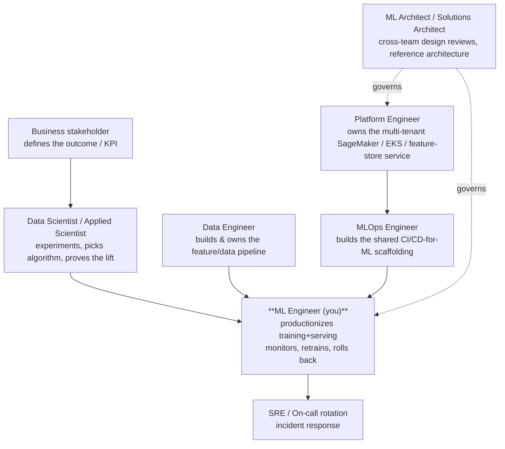
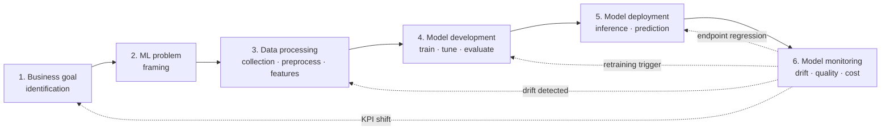

# Chapter 1 — What an ML Engineer Actually Does on AWS

> **Goal of this chapter:** to give you a sturdy, honest mental model of the role you are credentialing into. By the end of the chapter you should be able to recite — out loud, to a skeptical hiring manager — what AWS believes an ML Engineer is for, how that differs from the data scientist who handed you the notebook and the platform engineer who runs the cluster underneath, and which of the daily tasks the MLA-C01 exam is actually grading you on. Every later chapter in this book — the IAM minutiae in Part B, the endpoint-type matrix in Part G, the Model Monitor wiring in Part I — exists in service of one of the four verbs AWS uses to define the role: **build, operationalize, deploy, maintain**.

---

## 1.1 A thought experiment: the Jupyter notebook on your desk

Imagine it is Monday morning at a large AWS-native bank. A data scientist on the fraud team forwards you a message:

> "Hey — the fraud-detection model I've been working on is finally hitting 0.94 AUC on backtests. Notebook attached. Can you put it in production? The business says it'll save us ~$50M a year."

The notebook is 1,800 cells long. It begins with `pip install xgboost==1.5.2`, reads a CSV out of `~/Downloads/`, has a cell labeled `# REMEMBER TO CHANGE THIS BEFORE TRAINING`, computes features using a Pandas one-liner that wouldn't survive 10x the data volume, calls `model.fit()` in cell 1,103, and ends with a `pickle.dump()` of the trained estimator. Nowhere in the 1,800 cells is there an evaluation on held-out future data, a definition of the input schema the production service will receive, a strategy for what happens when the upstream merchant feed adds a new column, a discussion of who is on the pager when this thing wakes up at 3 a.m. on a Sunday, an IAM role, an encryption decision, a cost estimate, a rollback path, or a retraining trigger.

You — the ML engineer — are the person who turns this artifact into a system that processes millions of transactions per day, returns predictions in under 50 milliseconds at p99, survives a deploy without locking out a wedding photographer's card mid-transaction, leaves a complete audit trail for the bank's internal model-risk-management team, costs less than the fraud it prevents, and can be retrained on next month's data without anyone re-reading the notebook. The eventual production system will run on AWS — specifically on roughly twelve services you will get to know intimately over the course of this book — and it will look almost nothing like the notebook. The model itself, the part the data scientist labored over for six months, will be perhaps **5%** of the code that goes to production. The other 95% will be data pipelines, feature stores, deployment scaffolding, monitoring, IAM, CI/CD, and the on-call runbook (Sculley et al., NeurIPS 2015, "Hidden Technical Debt in ML Systems," cited via the dev.to architecture deep-dive in `notes/ch01_practice.md` §2.2).

That gap — from `pickle.dump()` to a $50M-revenue production service that doesn't get the bank fined — is the MLE job description. The AWS Certified ML Engineer – Associate certification is, top to bottom, a credential that you can close that gap on AWS. Everything else in this book is mechanics.

It is worth pausing here to notice what the thought experiment is *not*. It is not a story about the data scientist being incompetent — the notebook does, after all, hit 0.94 AUC, which is a real technical achievement. It is not a story about Python being the wrong language, or about Jupyter being the wrong tool for research — both are fine for what they're designed for. It is a story about the *structural gap* between research code and production code, a gap that is invariant across companies, languages, and ML frameworks. That gap exists for a reason that has nothing to do with anyone's skill: research code optimizes for *speed of iteration on a fixed snapshot of data*, and production code optimizes for *reliability over an unbounded stream of changing data*. These are different objectives, and they produce different artifacts. The MLE role exists because some human has to convert between them, and because the conversion is non-trivial enough — and the consequences of getting it wrong are expensive enough — that you cannot have the data scientist do it as a side quest, and you cannot have the platform team do it without ML semantics.

If you have come to this book from a research-leaning background, the conversion process may feel like grunt work the first time you do it. It is not. It is the work that determines whether the model has any business impact at all. A model that achieves 0.94 AUC in a notebook and never makes it to production produces zero dollars of value. A model that achieves 0.91 AUC in production produces all of the value. The MLE is the role that converts notebook-AUC into production-AUC at the smallest possible loss, and then keeps that production-AUC from decaying once the world starts moving again.

---

## 1.2 The MLE role in one paragraph: the four verbs

AWS opens the MLA-C01 Exam Guide with a single sentence that defines the entire role, and it is worth committing to memory before reading any third-party study material:

> "The AWS Certified Machine Learning Engineer – Associate (MLA-C01) exam validates a candidate's ability to **build, operationalize, deploy, and maintain machine learning (ML) solutions and pipelines** by using the AWS Cloud."
> — *MLA-C01 Exam Guide, p. 1*

Four verbs, in order, do all the work in this sentence — and the order is not accidental. AWS deliberately does not say *research, invent, or discover*. The MLE is the engineer who takes an ML idea that has already cleared a proof-of-concept and turns it into a production-grade, observable, secure, cost-aware service that keeps working when the data drifts, the traffic spikes, the auditor calls, and the on-call pager goes off at 3 a.m. The certification's landing page reinforces this with its one-line value prop: it validates "implementing ML workloads in production and operationalizing them" (aws.amazon.com/certification, cited in `notes/ch01_docs.md` §1.1).

Read the four verbs literally:

- **Build** — assemble the training and serving artifacts. Wrap the data scientist's algorithm in a container that obeys SageMaker's `/opt/ml/` contract, set up the training job, produce a versioned model artifact in S3.
- **Operationalize** — make the build repeatable, audit-traceable, and triggerable. Wire it into a SageMaker Pipeline or Step Functions DAG. Register the output in the Model Registry. Make sure the same code can run on dev, staging, and prod without human intervention.
- **Deploy** — get the model in front of real traffic, in the right serving topology (real-time endpoint, async, batch, serverless, MME), behind a deployment strategy (blue/green, canary, shadow, rolling) that will not take down the business if the model is bad.
- **Maintain** — once it's live, monitor it for drift, anomalies, latency regressions, and cost blowouts. Retrain it when the data shifts. Rotate the IAM credentials. Patch the container when a CVE drops. Answer the auditor when they ask, six months from now, exactly which dataset version produced the model decision that denied a customer's loan.

If you remember nothing else from this chapter, remember this contrast: **data scientists and ML researchers discover the model; MLEs ship and operate it.** Every domain in the MLA-C01 exam — Data Prep (28%), Model Dev (26%), Deployment (22%), Monitoring/Security (24%) — is a slice of "ship and operate," not a slice of "discover." Even Domain 2 (Model Dev), the one that *sounds* like it might test modeling judgment, is in practice testing whether you can *operationalize* training, tuning, evaluation, and version management — not whether you can pick the right loss function for a transformer.

⚠️ **Exam alert.** The Exam Guide expands the four verbs into six task families (p. 1, verbatim): ingest+transform+validate data; select+train+tune+analyze+version models; choose deployment infra+endpoints+autoscaling; set up CI/CD; monitor models/data/infra; secure ML systems. None of these say *discover*, *research*, or *invent*. All six say *configure*, *automate*, *provision*, *monitor*, *secure*. This is the truest one-paragraph job description AWS has published for the role, and it predicts the shape of every question on the exam.

It is also worth noticing what the four verbs *don't* include. They don't include *research*. They don't include *select the best model architecture for a novel problem*. They don't include *interpret a transformer's attention map*. They don't include *write a new optimizer*. Every one of those activities is, in the AWS taxonomy, the responsibility of an Applied Scientist, an ML Researcher, or an ML Performance Engineer — not an MLE. If you find yourself in a job interview being asked to design a novel architecture from scratch, you are interviewing for one of those other roles under a misleading title. If you find yourself in a study session worrying that you don't know enough about the latest paper on diffusion models, redirect that energy: the MLA-C01 will not test it. What it will test is whether you can ship the model whose paper you read and put it behind a SageMaker async endpoint with KMS encryption and a CloudWatch alarm.

---

## 1.3 MLE vs. everybody else: the responsibility matrix

"ML Engineer" is a young title — it didn't exist in industry as a distinct job before roughly the late 2010s — and it lives at the intersection of several older disciplines. Untangling the boundaries is the difference between landing the right role and spending two years doing somebody else's job under a misleading title. Two industry forces created the role:

1. **The Jupyter-to-production gap.** Data scientists handed off pickled models and PRs full of `pd.read_csv("/Users/...")`. Someone had to make these reproducible, testable, and reliable. That someone became the MLE.
2. **The Kubernetes-to-ML gap.** Platform engineers could deploy any service, but they didn't know what model drift was, what a Parquet column-pruning predicate pushdown was, or why a `float64` feature crashed an XGBoost serving container. Someone had to bridge ML semantics into the deploy/operate world. That someone is also the MLE.

The AWS framing in MLA-C01 is exactly this bridging role: enough ML to be dangerous, enough software/cloud/security to be production-grade.

### 1.3.1 The seven roles, and who owns what

The cleanest mental picture is a flow diagram of who hands what to whom in a mature ML organization. Public AWS docs don't draw an org chart this explicit, but the Exam Guide plus the Well-Architected ML Lens together imply this split, and it matches what real shops actually run.

The MLE is the role that **sits at the intersection of all four engineering disciplines** (software, data, MLOps, platform) and the one science discipline (data science). They are the integration point. That's also why the job pays what it does — the substitution risk is high in any one column, low across all five.

The responsibility matrix below is synthesized from a survey of 2025–2026 mlopsnow, tenyks, and distantjob role breakdowns (`notes/ch01_practice.md` §3.1), cross-checked against the actual job postings at Capital One, JPMorgan Chase, and Amazon for their AWS-native MLE roles.

| Activity                                       | Data Scientist | ML Engineer    | MLOps Engineer | Platform Engineer | Data Engineer | ML Architect |
| ---------------------------------------------- | -------------- | --------------- | -------------- | ----------------- | ------------- | ------------ |
| Problem framing with stakeholders              | **Primary**    | Contributes     | —              | —                 | —             | Reviews      |
| Exploratory data analysis                      | **Primary**    | Supports        | —              | —                 | Supports      | —            |
| Feature engineering (prototype)                | **Primary**    | Reviews         | —              | —                 | Reviews       | —            |
| Feature engineering (production pipeline)      | —              | **Primary**     | Supports       | —                 | **Primary**   | —            |
| Model selection / architecture                 | **Primary**    | Contributes     | —              | —                 | —             | Reviews      |
| Hyperparameter tuning                          | Shared         | **Shared**      | —              | —                 | —             | —            |
| Training infra (single job)                    | Uses           | **Primary**     | Supports       | —                 | —             | —            |
| Training infra (shared platform)               | Uses           | Uses            | **Primary**    | **Primary**       | —             | Reviews      |
| Model packaging (Docker, container contract)   | —              | **Primary**     | Contributes    | —                 | —             | —            |
| Inference endpoint deployment                  | —              | **Primary**     | Supports       | —                 | —             | Reviews      |
| CI/CD for ML                                   | —              | Shared          | **Primary**    | Supports          | —             | —            |
| Feature store ownership                        | —              | Consumer        | Contributor    | **Primary**       | Contributor   | —            |
| Model registry ownership                       | —              | Consumer        | **Primary**    | Supports          | —             | Reviews      |
| Drift monitoring setup                         | —              | **Primary**     | Contributor    | —                 | —             | —            |
| Drift incident response                        | —              | **Primary**     | Contributor    | —                 | —             | —            |
| On-call rotation for ML services               | —              | **Yes**         | Yes            | Yes               | —             | —            |
| Cost/latency optimization for ML workloads     | —              | **Primary**     | Contributor    | Contributor       | —             | Reviews      |
| Cluster/infra (K8s, EMR cluster, etc.)         | —              | Consumer        | Consumer       | **Primary**       | Consumer      | —            |
| Compliance / model governance                  | Contributes    | Contributes     | **Primary**    | Supports          | —             | **Primary**  |
| Reference architecture / design reviews        | —              | Contributes     | —              | —                 | —             | **Primary**  |

Three observations are worth pulling out of this matrix:

**First, the MLE column is the densest.** No other role touches as many rows as the MLE. That's the integration-point reality of the job — and it's also why a single MLE can rarely be replaced by hiring a single anyone else.

**Second, the lines blur in predictable ways.** In small orgs (Series B/C startups, < 50-person engineering org), one person typically does MLE + MLOps + sometimes Platform. In large regulated shops (Capital One, JPMC, Amazon), MLOps is a distinct platform team that owns the CI/CD-for-ML scaffolding, and the MLE consumes it. Capital One's "Intelligent Foundations and Experiences" (IFX) team is unusual — it bundles platform + MLE in one team [capitalonecareers.com posting, cited in `notes/ch01_practice.md` §5.3]. The Applied Scientist title often overlaps with Senior MLE; the signal that tells you which is which is unambiguous: **whoever owns the production model when it breaks at 2 a.m. is the MLE, regardless of title.**

**Third, the "Designing/architecting full end-to-end ML solutions" row sits with the ML Architect, not the MLE.** This isn't an Associate-level expectation, and AWS says so explicitly in the Exam Guide's out-of-scope list (covered in §1.6 below). If you're being asked to design ML architectures from scratch in a job interview that says "Senior MLE," you are interviewing for an Architect role with the wrong title — which is fine, but recognize it.

### 1.3.2 Why the MLE role exists at all

It is worth spending a moment on the historical question — *why does this title exist as a distinct role, and not as just "senior software engineer with some ML knowledge"?* The answer matters because it tells you what you're being paid for.

In the 2000s, when the first wave of consumer-internet ML (Google search ranking, Yahoo spam filtering, Netflix recommendations) was being built, there was no separate "ML Engineer" title. The same person who came up with the algorithm wrote the production code, deployed it on the same Linux boxes that served the website, and watched the logs when it broke. That worked because the algorithms were comprehensible (logistic regression, naive Bayes), the data volumes fit on a single machine's memory, the deployment surface was a few hand-managed servers, and the production-monitoring expectation was "check the CTR dashboard once a day."

By the mid-2010s, three things had changed simultaneously and the old generalist model broke. **First**, the algorithms got harder to reason about — deep neural networks were not auditable in the way logistic regressions were, and the gap between "I tuned the hyperparameters" and "I understand why this model makes the decisions it makes" widened. **Second**, the data volumes outgrew single machines — Spark, Kafka, and the entire "modern data stack" were born to handle this, and a new role (data engineer) emerged to own the data plumbing as a discipline distinct from web-app engineering. **Third**, regulated industries (banks, healthcare, insurance) began adopting ML at scale, which introduced audit, compliance, and model-risk-management requirements that no one had thought about when the discipline was "Google ranking PhDs writing C++."

The MLE role coalesced in the late 2010s as the answer to the question *who, between the data scientist and the platform engineer, is responsible for making sure this model behaves itself in production*? Neither of the existing roles wanted the job: data scientists found the production ops work tedious and far from their training, and platform engineers found the ML-specific failure modes (drift, training-serving skew, feature staleness) alien and ill-documented. So a new role grew up in the gap, with one foot in each camp. The MLA-C01 cert, launched in 2024, is AWS's official statement that the role has matured enough to credential, and its content domain weights — 28% data prep, 26% model dev, 22% deployment, 24% monitoring/security — are AWS's official statement of what the role actually does.

---

## 1.4 The official Target Candidate Description, walked line by line

The Exam Guide's "Target Candidate Description" is the canonical job description for the role. Every line of it pays for itself. We will walk it verbatim, then comment.

### 1.4.1 The headline requirement

> "The target candidate should have **at least 1 year of experience using Amazon SageMaker** and other AWS services for ML engineering. The target candidate also should have at least 1 year of experience in a related role such as a **backend software developer, DevOps developer, data engineer, or data scientist**."
> — *MLA-C01 Exam Guide, p. 2*

Two things are doing a lot of work in this paragraph.

First, **at least 1 year of SageMaker hands-on** is the headline. Not "familiarity with," not "exposure to" — *using*. If you have only read about SageMaker, you will struggle with the deeper questions on the exam. The minimum is a year of having actually launched training jobs, deployed endpoints, and run pipelines yourself. We will spend Part E getting you to that level if you aren't there yet.

Second, look at the related-role list: **backend software developer, DevOps developer, data engineer, or data scientist**. Three of the four feeder roles are engineering roles. Data scientist is listed *last* and as one of four equally valid entry paths. Crucially, **"ML scientist" and "ML researcher" are NOT in the list.** The role is explicitly positioned downstream of research. The hiring funnel AWS is describing is "engineer who can do ML," not "scientist who can deploy."

### 1.4.2 Recommended general IT knowledge (verbatim, p. 2)

> "The target candidate should have the following general IT knowledge:
> - Basic understanding of common ML algorithms and their use cases
> - Data engineering fundamentals, including knowledge of common data formats, ingestion, and transformation to work with ML data pipelines
> - Knowledge of querying and transforming data
> - Knowledge of software engineering best practices for modular, reusable code development, deployment, and debugging
> - Familiarity with provisioning and monitoring cloud and on-premises ML resources
> - Experience with CI/CD pipelines and infrastructure as code (IaC)
> - Experience with code repositories for version control and CI/CD pipelines"

Count the bullets that are data-science bullets. There is exactly one — the first — and it asks for *basic* understanding of common algorithms and use cases. Not deep, not "be able to derive backpropagation," not "understand attention." Basic.

Now count the bullets that are pure software-engineering and DevOps competencies: data engineering, querying/transforming data, modular code + debugging, cloud provisioning + monitoring, CI/CD + IaC, version control. Six of seven. This is the single biggest tell that AWS positions the MLE as **a software engineer who happens to ship ML, not a scientist who happens to deploy**. If you have come to this book from the data-science side, the bulk of your study load will be on these six bullets. If you've come from the backend/DevOps side, your load will be on the first bullet plus the AWS-specific knowledge in §1.4.3 — and especially on the ML-specific *twists* that show up in monitoring (drift detection, not just latency) and deployment (shadow variants, not just blue/green).

### 1.4.3 Recommended AWS knowledge (verbatim, p. 2–3)

> "The target candidate should have the following AWS knowledge:
> - Knowledge of SageMaker capabilities and algorithms for model building and deployment
> - Knowledge of AWS data storage and processing services for preparing data for modeling
> - Familiarity with deploying applications and infrastructure on AWS
> - Knowledge of monitoring tools for logging and troubleshooting ML systems
> - Knowledge of AWS services for the automation and orchestration of CI/CD pipelines
> - Understanding of AWS security best practices for identity and access management, encryption, and data protection"

Again: SageMaker, storage, deployment, monitoring, CI/CD, security. There is no "be able to design novel architectures" or "be able to choose the right loss function for transformers" bullet. The full curriculum of this book is organized around exactly these six areas — Parts C and D cover storage and data prep, Parts E and F cover SageMaker model building, Parts G and H cover deployment and CI/CD, Part I covers monitoring, Part J covers security/IAM/networking/cost. The mapping is not coincidence.

⚠️ **Exam alert.** Of the six AWS knowledge bullets above, the one that trips up the most data-science-background candidates is the last: IAM, encryption, and data protection. Domain 4 of the exam (Monitoring + Maintenance + Security) is **24% of the test**, and a meaningful fraction of those questions are pure IAM/KMS/VPC questions. If you cannot read an IAM policy and explain what it permits and denies, you will lose easy points. Chapter 5 fixes this.

---

## 1.5 The six pillars of the Well-Architected ML Lens, mapped to the MLE's daily concerns

AWS's official statement of *how* the MLE should think about a production ML system lives in the **Well-Architected Framework — Machine Learning Lens** (publication date November 19, 2025; see `notes/ch01_docs.md` source 2 for the PDF location). The Lens applies the standard Well-Architected pillars to ML-specific concerns. It defines six pillars, each with a best-practice prefix (`MLOPS`, `MLSEC`, `MLREL`, `MLPERF`, `MLCOST`, `MLSUS`) and 50+ numbered best practices spread across them. The Lens is a 360-page document; the role-relevant signal compresses to one paragraph per pillar.

### 1.5.1 Operational Excellence (`MLOPS`)

The Operational Excellence pillar asks: *can you run and observe this ML system continuously, and improve it without breaking it?* For the MLE, this is the load-bearing pillar — the one that makes the difference between a model that exists and a model that operates. In daily terms, it shows up as: writing the runbook that the on-call uses when a Model Monitor alarm fires (`MLOPS06-BP02 Enable model observability and tracking`); maintaining a **lineage tracker system** (`MLOPS02-BP04`) so every model in production traces back to a data snapshot, code commit, hyperparameter set, and training run; and **automating operations through MLOps and CI/CD** (`MLOPS04-BP01`) — the single most-cited best practice in the entire Lens. The MLE is on the hook for the runbook. Not the model. The system that runs the model.

A subtler `MLOPS` best practice the exam likes to test is `MLOPS06-BP01 Synchronize architecture and configuration across environments`, which is the dev/staging/prod skew problem applied to ML. If the staging endpoint runs Python 3.10 with `scikit-learn==1.3.2` and the production endpoint runs Python 3.11 with `scikit-learn==1.4.0`, the same model artifact can produce *different* predictions in the two environments because of a quietly-changed default in one of the library's preprocessing functions. The fix is identical containerization across environments, pinned dependency versions, and an automated parity check before promotion — and the cert will gesture at this with questions like "a model behaves differently in production than in staging; what's the most likely cause?"

### 1.5.2 Security (`MLSEC`)

The Security pillar asks: *can this ML system be trusted with regulated data, and can you prove it?* For an MLE at a bank or a healthtech, this is the pillar that decides whether your model ever sees production. It shows up as: validating ML data permissions and OSS license terms before importing a library (`MLSEC01-BP01` — yes, MLEs are expected to read OSS licenses); designing **data encryption** at rest (KMS, S3 SSE) and in transit (TLS) (`MLSEC02-BP01`); implementing **least-privilege access** via IAM roles, SageMaker execution roles, and bucket policies (`MLSEC03-BP01`); enforcing **data lineage** for compliance (`MLSEC03-BP04`); securing **inter-node cluster communications** during distributed training (`MLSEC04-BP02`); protecting against **data poisoning** (`MLSEC04-BP03`); and restricting endpoint access to intended consumers (`MLSEC06-BP01`). The MLE owns IAM policies for their pipelines, KMS keys for their buckets, and VPC configurations for their endpoints. They cannot punt this to "the security team."

The `MLSEC` pillar is also where the role's most career-limiting mistakes live. A misconfigured S3 bucket policy that exposes PHI to the public internet is a regulatory violation, a news story, and the end of a career — and it is depressingly easy to commit if you copy-paste a SageMaker example notebook without understanding the IAM scoping. The cert's emphasis on this pillar (24% of the test, weighted with Monitoring) is not arbitrary — it reflects the failure modes that have actually cost AWS-native enterprises millions of dollars in fines and reputation damage. Treat every IAM policy you write in the rest of this book as one you will have to defend in front of a regulator. Chapter 5 (IAM for ML) and Chapters 53–56 (the full security cluster in Part J) are the substantive home of this material.

### 1.5.3 Reliability (`MLREL`)

The Reliability pillar asks: *when something fails — a node, a region, a model — does the system degrade gracefully and recover?* For the MLE, this is the pillar that grafts traditional backend SRE practice onto ML-specific failure modes. Daily concerns include: using APIs to **abstract change from model-consuming applications** (`MLREL01-BP01`) — versioned endpoints with backward-compatible contracts; enabling **CI/CD/CT** (continuous training) with traceability (`MLREL03-BP01`); verifying **feature consistency across training and inference** (`MLREL03-BP02`), which is the training/serving skew problem we will revisit a dozen times in this book; using appropriate **deployment and testing strategies** (`MLREL04-BP02`) — blue/green, canary, shadow; enabling **automatic scaling of the model endpoint** (`MLREL05-BP01`); and creating a **recoverable endpoint with a managed version control strategy** (`MLREL05-BP02`). The MLE writes deploy strategies the way a backend engineer writes them, but adds ML-specific concerns like feature parity and shadow scoring.

The crucial ML twist on Reliability that the cert tests heavily is the distinction between **endpoint reliability** (the HTTP service is up, returning 200s, p99 within SLO) and **model reliability** (the predictions returned are actually correct). A classical backend service is reliable if it's up; an ML service can be 100% up and *still* be silently producing wrong predictions because the model has drifted out of its training distribution. This is why the MLE's reliability toolkit includes not just CloudWatch alarms on latency and error rate, but also Model Monitor for drift, A/B test analysis for prediction quality, and a Model Registry that supports immediate rollback to a previously-known-good version. Chapter 40 walks through how these tools compose into a deployment strategy that protects against both kinds of failure.

### 1.5.4 Performance Efficiency (`MLPERF`)

The Performance Efficiency pillar asks: *are you using the right hardware and the right algorithm to hit your latency and throughput targets at the lowest possible spend?* This is where the MLE's daily decisions about instance families live. **Use purpose-built AI/ML services** (`MLPERF02-BP02`) before custom models — Bedrock, Comprehend, Rekognition, if the use case fits. Optimize training and inference **instance types** (`MLPERF04-BP01`) — G5 vs. P5 vs. Inf2 vs. Trn1. Perform a **performance trade-off analysis** (`MLPERF04-BP05`) — latency vs. accuracy vs. cost. Evaluate **data drift** (`MLPERF06-BP03`) and monitor model performance degradation (`MLPERF06-BP04`). Establish an **automated retraining framework** (`MLPERF06-BP05`). The MLE picks instance families, runs Inference Recommender benchmarks, and signs off on latency SLOs.

The instance-family decision is one of the highest-leverage decisions an MLE makes, and it is one the exam tests through scenarios rather than memorization. A few rough heuristics worth internalizing now (Chapter 9 expands these): **CPU-bound classical models** (small XGBoost, scikit-learn) → general-purpose `m5/m6i` or compute-optimized `c5/c6i`. **GPU-bound training** for medium-to-large neural networks → `g5` (cost-effective NVIDIA A10G) or `p4d/p5` (NVIDIA A100/H100, for the largest models). **GPU-bound inference** where you want lower $/inference → `inf2` (AWS Inferentia2) — if your model architecture is supported. **Distributed training at scale** → `trn1` (AWS Trainium) for cost-efficient large-model training. **ARM-friendly inference** → `c7g/m7g` Graviton instances. The exam will rarely ask you to memorize specific instance specs, but it will ask scenarios like "a team is paying $$$ for inference on `ml.g5.xlarge` and wants to cut cost without changing the model" — the answer is "try Inferentia via Neo compilation, then benchmark with Inference Recommender."

### 1.5.5 Cost Optimization (`MLCOST`)

The Cost Optimization pillar asks: *is every dollar of GPU spend producing measurable business value, and can you prove it?* In daily terms: define **ROI and opportunity cost** (`MLCOST01-BP01`); identify whether **ML is the right solution at all** (`MLCOST02-BP01`) — sometimes the answer is a SQL rule; perform a tradeoff analysis between custom and pre-trained models (`MLCOST02-BP02`); **stop resources when not in use** (`MLCOST04-BP08`); use **warm start and checkpointing** for HPO (`MLCOST04-BP10`); set up a budget and use **resource tagging to track costs** (`MLCOST04-BP12`); monitor cost by ML activity (`MLCOST06-BP01`) and ROI per ML model (`MLCOST06-BP02`). The MLE owns the AWS bill for their pipelines. They tag every resource, monitor Cost Explorer for their tag set, and answer to a budget alert.

The most under-appreciated `MLCOST` best practice is the first one — `MLCOST02-BP01 Identify whether ML is the right solution at all`. Senior MLEs save organizations more money by *declining* ML projects than by optimizing them. If the problem can be solved by a deterministic rule, an SQL query, or a simple heuristic, the right answer is to ship that rule and reserve ML capacity for problems that actually need it. The exam will rarely ask this question directly (it tends to assume ML is the right tool), but the meta-judgment is the kind of seniority signal that separates a Lead MLE from an IC MLE in the real world.

### 1.5.6 Sustainability (`MLSUS`)

The Sustainability pillar asks: *are you producing only the predictions and training runs that actually matter, on the most efficient hardware available?* For the MLE, this shows up as: **considering AI services and pre-trained models** before training from scratch (`MLSUS02-BP01`); selecting energy-efficient **Regions** (`MLSUS02-BP02`); minimizing idle resources (`MLSUS03-BP01`); using **efficient silicon** like Inferentia, Trainium, and Graviton (`MLSUS05-BP02`); deploying **multiple models behind a single endpoint** with MME (`MLSUS05-BP04`); and **retraining only when necessary** (`MLSUS06-BP02`) — drift-triggered, not calendar-triggered. The MLE chooses Inferentia over GPU when the workload fits, sets a TTL on training artifacts in S3, and resists the urge to retrain weekly when monthly would do.

Sustainability is the newest of the six pillars and the one most likely to feel abstract on first read. The exam does not heavily test it directly, but the *operational habits* it encodes — drift-triggered retraining, multi-model endpoints, efficient silicon, idle-resource pruning — overlap almost entirely with the cost-optimization habits in `MLCOST`. A good rule of thumb: when an answer is correct from a cost-optimization standpoint, it is usually also correct from a sustainability standpoint. The pillar is also increasingly relevant in enterprise procurement (ESG-conscious customers are asking suppliers for carbon-aware compute reports), which means a senior MLE benefits from being able to articulate the sustainability story even if the exam doesn't grade on it directly.

### 1.5.7 How the pillars trade off against each other in practice

The six pillars are not independent. Every real MLE decision is a *trade-off* across at least two of them, and the Lens calls this out explicitly under `MLPERF04-BP05 Perform a performance trade-off analysis`. Memorize the trade-off pairs below — they are the structural skeleton of nearly every scenario question on the exam.

| Trade-off                       | Where it shows up in your day                                                                | The MLE's lever                                                                            |
| ------------------------------- | -------------------------------------------------------------------------------------------- | ------------------------------------------------------------------------------------------ |
| Performance ↔ Cost              | "Real-time endpoint with p99 < 50ms" vs. "monthly bill < $5k"                                | Async/Serverless inference, right-sized instances, multi-model endpoints, Inferentia       |
| Reliability ↔ Cost              | Multi-AZ endpoint with autoscaling vs. single instance                                       | Min capacity = 1 for non-critical, min = 2 across AZs for critical                         |
| Performance ↔ Sustainability    | Faster GPU vs. more efficient Inferentia/Graviton                                            | Inference Recommender benchmarks, accept slower silicon if SLO still met                   |
| Security ↔ Op Excellence        | Locked-down VPC endpoint vs. dev-team velocity                                               | Service Catalog products that pre-bake VPC, IAM, KMS for self-service                      |
| Reliability ↔ Performance       | Shadow scoring 100% of traffic for accuracy validation vs. p99 latency                       | Async shadow scoring, sampled shadow at 1–5%                                               |
| Cost ↔ Reliability              | Spot training (cheap, can be reclaimed) vs. on-demand (expensive, guaranteed)                | Checkpoint to S3, use SageMaker Managed Spot Training with reasonable max wait time        |

A common MLA-C01 question pattern is exactly this: *"A model is exceeding cost budget but cannot tolerate cold-start latency. Pick the best mitigation."* The right answer always sits at one of these trade-off intersections. Internalize the intersections, not the individual answers — the surface details change, the trade-off structure doesn't.

### 1.5.8 The acronym to memorize: CI/CD/CT

The Lens distills its design principles into 10 cross-cutting items (verbatim p. 4), the eighth of which is worth memorizing because it captures what makes ML engineering distinct from DevOps:

> "**Enable automation** — Use technologies, such as pipelining, scripting, and continuous integration (CI), continuous delivery (CD), and **continuous training (CT)**."

CI/CD becomes **CI/CD/CT** for ML. The third C — Continuous Training — is the letter that makes MLOps distinct from DevOps, and it is the letter that justifies the existence of a separate cert track from the DevOps Engineer Associate.

⚠️ **Exam alert.** The MLA-C01 will not ask you to recite the best-practice IDs (`MLOPS04-BP01`, etc.). It *will* ask scenario questions whose right answer maps directly onto one of these best practices. When you are stuck on a question, ask yourself: which of the six pillars is this scenario about? Then ask: what does the Lens say about that pillar's primary best practice? You'll be right more often than you'd guess.

---

## 1.6 What's *out of scope* for an MLE (the negative definition)

The Exam Guide is unusually generous in telling you what is *not* expected of the role. This is gold for separating MLE from adjacent roles, and it's worth pinning before you waste study time on the wrong things.

> "The following list contains job tasks that the target candidate is **not** expected to be able to perform... These tasks are out of scope for the exam:
> - Designing and architecting full end-to-end ML solutions
> - Setting up best practices and guiding ML strategies
> - Handling integration with a wide array of services or new tools and technologies
> - Working deeply in two or more ML domains (for example, natural language processing [NLP], computer vision)
> - Quantizing models and analyzing the impact on accuracy"
> — *MLA-C01 Exam Guide, p. 3*

Read carefully. AWS is drawing five role boundaries.

| Out-of-scope task                                  | Whose job is it instead?                              |
| -------------------------------------------------- | ----------------------------------------------------- |
| Designing/architecting end-to-end ML solutions     | **ML Architect / Solutions Architect (Specialty)**    |
| Setting best practices and guiding ML strategies   | **Principal MLE / ML Tech Lead / Head of ML**         |
| Wide-array tool integration                        | **Platform Engineer / DevOps Engineer**               |
| Deep work across NLP + CV simultaneously           | **ML Researcher / Applied Scientist**                 |
| Quantization + accuracy impact analysis            | **ML Performance Engineer / Research Engineer**       |

A few of these are worth dwelling on. *Designing and architecting full end-to-end ML solutions* is explicitly the ML Architect's job, not the Associate-level MLE's. If a practice question gives you a blank slate and asks "design a fraud detection system from scratch" without constraints, you are probably reading it wrong — the actual question will give you scaffolding ("you already have feature data in S3 and a SageMaker training job; pick the right deployment strategy") and ask you to fill in one piece. *Working deeply in two or more ML domains* means the exam will not ask you to optimize a transformer attention mechanism and then a YOLO detector in the same question — pick one domain per question and trust the framing. *Quantizing models and analyzing the impact on accuracy* will not be tested at depth; you should know what quantization is conceptually (Chapter 41 covers it lightly) but you will not be asked to compute INT8 calibration error.

This is the cleanest role-disambiguation list AWS has ever published for the MLE. Pin it to your desk.

---

## 1.7 A typical MLE workweek

What does this role actually look like, day to day, at a regulated-finance AWS-native shop? The composite below draws on Capital One job postings, JPMorgan Chase interview guides, and practitioner blog posts (`notes/ch01_practice.md` §1.1–§2.4) and is consistent with the "Senior MLE" archetype the MLA-C01 credential is sized for.

### 1.7.1 The 80/20 (really 95/5) rule

> "80% of ML work is data pipelines, infrastructure, and engineering rather than algorithms. Engineers spend more time debugging data quality issues and optimizing training infrastructure than tuning hyperparameters."
> — mlwhiz.com, *A Day in the Life of an ML Engineer*

The harder statement, from a frequently-cited Google figure: "the actual ML model code makes up less than 5% of a production AI system. The other 95% is data pipelines, feature stores, serving infrastructure, monitoring, and testing" (Sculley et al., NeurIPS 2015, cited via dev.to). This is the single most important framing for the MLA-C01 exam: **the cert is built around the 95%, not the 5%**. The four content-domain weights mirror this almost exactly.

| Activity                                                  | % of typical week | Maps to MLA-C01 domain         |
| --------------------------------------------------------- | ----------------- | ------------------------------ |
| Data pipeline debugging (Spark/Glue/EMR/Airflow)          | 20–25%            | Domain 1 (Data Prep, 28%)      |
| Feature engineering + feature store work                  | 10–15%            | Domain 1                       |
| Model retraining + experiment tracking                    | 10–15%            | Domain 2 (Model Dev, 26%)      |
| Inference infra (endpoints, autoscaling, latency tuning)  | 15–20%            | Domain 3 (Deployment, 22%)     |
| Model monitoring + drift response + on-call               | 15–20%            | Domain 4 (Monitor/Sec, 24%)    |
| Meetings, code reviews, planning, design docs             | 10–15%            | n/a                            |
| Actual "new model" work (architecture choice, HPO)        | **~5%**           | Domain 2                       |

### 1.7.2 A concrete two-week sprint

Imagine a fraud-detection MLE at an AWS-native bank, mid-quarter. A typical sprint:

- **Monday — drift triage.** A CloudWatch alarm fires: SageMaker Model Monitor reports a `feature_baseline_drift_check` violation on the `merchant_category_code` feature. The MLE checks the captured-data manifest in S3, runs a Clarify job to quantify drift, files a ticket to Data Engineering to confirm a new merchant onboarding produced an unseen MCC. Decision: retrain or add a "new category" handling rule. (Pillars exercised: Operational Excellence, Reliability, Performance Efficiency.)
- **Tuesday — retraining run.** Kicks off a SageMaker Training Job with Managed Spot Training, `max_wait=6h`. A SageMaker Pipeline runs ProcessingStep → TrainingStep → EvaluationStep → ConditionStep → RegisterModelStep. (Pillars: Cost, Reliability.)
- **Wednesday — promotion review.** The new model version is `PendingManualApproval` in Model Registry. The MLE opens a PR with the eval report, drift analysis, and a Clarify bias report. The model risk reviewer approves. (Pillars: Operational Excellence, Security/governance.)
- **Thursday — canary deploy.** The MLE updates the endpoint with two production variants — old at 90% weight, new at 10%. They watch CloudWatch for invocation latency, model-latency, and the business-side KPI dashboard (QuickSight) for a 24-hour soak. (Pillars: Reliability, Performance.)
- **Friday — full rollout + retro.** Shift to 100% new variant, delete the old variant after a 48h cool-down to allow rollback. Update the model card. File a retro: drift detection was 6 days late because the alarm threshold was 3σ; tighten to 2σ. (Pillars: Operational Excellence, Reliability.)
- **Following week — security audit support.** Internal audit asks: who can invoke this endpoint, what KMS key encrypts the input/output capture, and is the VPC endpoint policy restricting to the fraud-service subnet? The MLE produces the answers from IAM, KMS, and VPC console screenshots plus the CloudFormation template. (Pillars: Security, Operational Excellence.)

Every action above maps to a specific MLA-C01 exam task statement. None of them require inventing an algorithm. All of them require knowing which AWS service is the right tool, what its IAM and networking story is, and how it interacts with the other six services in the workflow.

A few observations about this sprint worth dwelling on. **First**, notice how much of the work is *collaboration*: filing a ticket to Data Engineering, opening a PR with eval and bias reports for a Model Risk reviewer, producing audit answers for an internal compliance team. The MLE role is irreducibly collaborative — it sits at the intersection of half a dozen other functions, and most of an MLE's effectiveness comes from knowing exactly which team owns which piece and how to hand the work across cleanly. **Second**, notice how much of the work is *evidence-producing*: eval reports, drift analysis, Clarify bias reports, model cards, CloudFormation templates that show exactly how the endpoint is configured. The MLE is, in part, a documentation function — every deployment leaves an artifact trail that the auditor will read six months from now. **Third**, notice the *cadence*: most of the activity is reactive (drift alarm, audit request) rather than greenfield. A mature MLE practice spends maybe 20–30% of its time on new model development and 70–80% on operating, maintaining, and updating models that already exist. The exam's weights reflect this.

It is also worth noticing what is *not* in this sprint. There is no day spent picking a new algorithm. There is no day spent reading the latest paper on transformer architectures. There is no day spent tuning the loss function. Those are days a data scientist or applied scientist would have. The MLE's days look like a hybrid of a backend SRE day (drift triage, canary deploy, rollout) and a platform-engineer day (audit response, IAM/KMS configuration) — with ML-specific judgment threaded through the middle of each.

### 1.7.3 Compensation and the regulated-industry archetype

A practical aside worth knowing before you finish this chapter, because it will inform your study calculus: the AWS-native MLE is well-compensated relative to most engineering disciplines, and the cert is a *gate* (HR filter) more than a *signal* (compensation lever).

Amazon's internal levels for MLEs (per Levels.fyi data referenced in `notes/ch01_practice.md` §4) cluster as follows. L5 (the most common MLE level, often where you'd land after passing the cert and a senior loop) sits at roughly $254–287K total comp; L6 (the senior IC level, what Capital One calls "Lead") at $320K+; L7 (Principal) at $409K+. Across industries, the median US ML Engineer base salary in 2026 is $128–186K depending on city and YOE, with total comp for AWS-native Senior MLEs at Capital One, JPMC, and similar shops clustering in the $200–350K range.

Two things follow from this. **First**, the certification is rarely worth more than $5–15K of additional comp on its own — it's an HR-filter credential that gets your résumé past the keyword screen, not a salary lever. The lever is real production experience you can describe end-to-end at the whiteboard. **Second**, the role pays this well because the substitution risk across all five skill columns (software, data, MLOps, platform, ML) is low simultaneously. Hiring managers will spend a long time finding a candidate who can credibly do all five at a working level. Your job, as you study this book, is to be that candidate.

The regulated-industry archetype matters because it shapes both the cert's content and your career options. Three structural forces shape the MLE role at regulated-finance and regulated-health shops:

1. **Model risk management (SR 11-7, OCC 2011-12 in banking; FDA SaMD in healthcare).** Every model in production must have a documented owner, a lineage trail back to training data, a validation report, and a monitoring plan. The MLE is the role that produces all four artifacts and keeps them current. The Lens best practices `MLOPS02-BP04 Establish a lineage tracker system`, `MLOPS01-BP02 Discuss and agree on the level of model explainability`, and `MLOPS01-BP03 Monitor model adherence to business requirements` map almost one-to-one onto SR 11-7 expectations.

2. **PII / PHI / data residency.** The MLE has to make IAM, KMS, VPC, and S3 decisions that hold up under audit. `MLSEC03-BP01..05` (least-privilege, secure modeling env, sensitive data privacy, data lineage, data minimization) is essentially the regulated-data playbook. This is why the exam tests Domain 4 (security) at 24% — it's the domain that disqualifies a model from production faster than any other.

3. **Separation of duties.** In regulated shops, the data scientist who built the model is *not allowed* to push it to production. A different person — the MLE — owns deployment, monitoring, and rollback. This is the org-chart fact that makes "MLE" a distinct role rather than a senior-data-scientist title. The Exam Guide's out-of-scope list ("designing and architecting full end-to-end ML solutions" — out of scope for MLE; that's the ML Architect's job) reflects this separation.

If you're targeting a regulated-finance or regulated-health role — and given the typical reader profile of this textbook, that's the most likely target — every chapter should be read through this lens: *would this defend in front of an internal model-risk auditor?* If you can answer yes consistently, you'll do well on the exam *and* in the interview.

### 1.7.4 The common failure modes that the exam (and your pager) cares about

These are the bugs MLEs actually wrestle with in production, synthesized from `notes/ch01_practice.md` §2.4 and §8.

1. **Training-serving skew** — preprocessing code paths diverge between offline training and online serving. The day-one mismatch before any drift even starts. Often called *the* silent killer.
2. **Data drift** — input distribution shifts. DataRobot cited: **73% of production AI failures linked to unforeseen input distribution shifts.**
3. **Feature store staleness** — features computed hourly but consumed at request-time at sub-hour rate.
4. **Timezone bugs in feature timestamps** — real, common, and easy to miss.
5. **Silent model degradation** — model still returns predictions, accuracy drops gradually, no error/alert fires.
6. **Concept drift** — the relationship between features and label changes (fraud patterns evolve, recommendations get stale).
7. **Schema evolution without contract testing** — upstream team adds a column, downstream pipeline silently skips a feature.
8. **Forgotten endpoints / training jobs spinning up cost** — the canonical 2 a.m. cost-spike Slack message.
9. **IAM permissions misconfigured for cross-account model registry access** — common in multi-account organizations.
10. **Cryptic SageMaker Pipeline step failures** — error messages that don't tell you which CloudWatch log group to read.

⚠️ **Exam alert.** Each of these failure modes maps to a specific MLA-C01 task statement. Training-serving skew → Task 1.2 (transformation) + Task 4.1 (monitoring). Data drift → Task 4.1 (`SageMaker Model Monitor`) + Task 2.3 (model performance analysis). Schema evolution → Task 1.3 (data integrity) + Task 1.2 (Glue Data Quality). When you see a scenario question, pattern-match it to the failure mode it's gesturing at, then pick the AWS service designed to detect or prevent that failure mode.

It is worth dwelling for a moment on failure mode #1 — training-serving skew — because it is the one most likely to embarrass you in production and the one the exam tests in the most disguised forms. The mechanics are simple: at training time, the data scientist computed a feature called `merchant_avg_txn_amount_7d` using a Pandas group-by aggregation over the historical dataset. At serving time, the production system computes the same feature using a SQL query against a Redis cache that is refreshed every 6 hours. The two computations *look* like they produce the same number, and on most inputs they do. But on a tiny fraction of inputs — typically newly-onboarded merchants whose 7-day window crosses a backfill boundary, or merchants whose first transaction landed within the 6-hour cache-refresh window — the two computations disagree by enough to flip the prediction. The model performs at 0.94 AUC offline and at 0.78 AUC in production, and nobody can figure out why. This is the failure mode SageMaker Feature Store exists to prevent (one computation path for both training and serving), it is the failure mode `MLREL03-BP02 Verify feature consistency across training and inference` is about, and it is the failure mode that pattern-matches to *any* exam question that contrasts offline and online metrics.

---

## 1.8 Where AWS-native MLE differs from Databricks-native MLE

If you have already worked through [Topic 9a — Databricks ML Associate](../../09a_databricks_ml_associate/README.md), you already know the rhythm of ML engineering: load data, transform it, train a model, evaluate it, version it, deploy it, monitor it. The *rhythm* is identical on AWS. The *surfaces* are different. Where it matters, this book will cross-link back to the Topic 9a chapter that gives you the underlying math or theory, and we will spend our pages on the AWS-specific mechanics.

Some translations worth internalizing on day one:

| Concept                          | Databricks-native surface                          | AWS-native surface (MLA-C01)                                                                                  |
| -------------------------------- | -------------------------------------------------- | ------------------------------------------------------------------------------------------------------------- |
| Notebook + experiment tracking   | Databricks workspace + MLflow                      | SageMaker Studio + SageMaker-managed MLflow (2024 GA) [Ch 28]                                                 |
| Distributed data processing      | Databricks-managed Spark                           | AWS Glue (Spark/Python/Ray), Amazon EMR (EMR-on-EC2 / Serverless / on EKS) [Ch 14, 16]                        |
| Feature store                    | Databricks Feature Store / Feature Engineering     | SageMaker Feature Store (online + offline) [Ch 19]                                                            |
| Model registry                   | Unity Catalog model registry                       | SageMaker Model Registry [Ch 51]                                                                              |
| Model serving                    | Databricks Model Serving                           | SageMaker Endpoints — real-time, async, serverless, batch [Ch 35–38]                                          |
| Orchestration                    | Databricks Workflows                               | SageMaker Pipelines, AWS Step Functions, MWAA (managed Airflow) [Ch 43, 44]                                   |
| Governance / lineage             | Unity Catalog                                      | Lake Formation + Model Cards + Lineage + IAM + KMS — split across services [Ch 51, 53, 55]                    |
| Drift / monitoring               | Databricks Lakehouse Monitoring                    | SageMaker Model Monitor (4 monitor types) + CloudWatch + Clarify [Ch 48–50]                                   |
| CI/CD for ML                     | Databricks Asset Bundles + Git provider            | CodePipeline + CodeBuild + CodeDeploy + SageMaker Projects [Ch 46, 47]                                        |

Three structural differences are worth dwelling on:

**First, AWS gives you more knobs but less opinion.** Databricks bundles many of the above into a single platform with strong defaults — you can be productive on day one without learning IAM. AWS hands you IAM, KMS, VPC, and Service Catalog as first-class concepts that you have to wire up correctly. This is why Part B of this book exists: even a working SageMaker user needs a solid IAM/S3/VPC foundation before the rest of the platform makes sense. The Databricks model concept of "the cluster owns access" maps onto the AWS "the SageMaker execution role owns access" — the principle is the same, but the AWS surface area is larger.

**Second, AWS splits the platform across many services rather than one workspace.** SageMaker is not Databricks. It is a *suite* of perhaps fifteen distinct services (Studio, Training Jobs, Pipelines, Registry, Model Monitor, Clarify, Feature Store, Ground Truth, JumpStart, Autopilot, Inference Recommender, Endpoints, Neo, Edge Manager, HyperPod…) that interoperate but are configured separately. The mental model of "SageMaker" as a single thing breaks down quickly once you start working with it. Part E of this book walks through every surface.

**Third, the AWS-native MLE archetype is a regulated-industry archetype.** Capital One, JPMorgan Chase, Bristol Myers Squibb, Optum, and Amazon itself dominate the "Senior MLE" job-posting landscape on AWS. These shops have model risk management programs (SR 11-7 in banking, FDA SaMD in healthcare), separation of duties between the data scientist who builds and the MLE who deploys, and audit obligations that show up directly in the exam's 24% Security domain weight. The Databricks-native MLE archetype skews more toward data-platform-modernization use cases at enterprises that haven't yet picked a cloud monoculture. Both are valid; they cover overlapping but non-identical territory.

A fourth difference worth knowing because it informs how you interpret the exam: **the MLA-C01 tests an idealized AWS-managed happy path.** Real production at mature AWS shops mixes SageMaker with Kubernetes/Ray/Bedrock in ways the cert never asks about. Capital One's published anomaly-detection deployment runs on Lambda layers with a microservices decomposition rather than a SageMaker real-time endpoint [capitalone.com/tech serverless ML post, cited in `notes/ch01_practice.md` §5.2]. Capital One's IFX team uses KServe on Kubernetes for serving rather than SageMaker endpoints [capitalonecareers.com lead MLE posting]. Netflix's ML platform runs on a custom orchestrator called Maestro, not SageMaker Pipelines. Pinterest migrated its training infrastructure to Ray on Kubernetes rather than SageMaker. DoorDash's serving runs on a custom Kotlin microservice (Sibyl, now being replaced by Argil on Ray), and uses SageMaker only for A/B test evaluation.

What this means for you, sitting the cert: the right answer on a multiple-choice question is *always* the best AWS-managed answer, not the best architectural answer. If the exam shows you four options and one of them is "deploy on EKS with KServe" and another is "deploy to a SageMaker real-time endpoint with autoscaling," the latter is almost always the intended answer, even though the former is what a Capital One MLE actually does in production. The cert is a credential that you understand the AWS-managed path; the real-world architectures are richer. Hold both maps in your head and don't confuse one for the other.

### 1.8.1 The 2025 SageMaker capability deltas worth knowing on day one

A small but important note before we move on: SageMaker is not static. The 2025 release cycle introduced several capabilities that older study materials will not cover and that you will see on the exam (`notes/ch01_practice.md` §7). Three deserve a flag now and a fuller treatment in later chapters:

- **Rolling Updates for Inference Components** (Ch 40 covers this). This replaces traditional blue/green deployments with gradual rollouts in configurable batches, driven by CloudWatch alarms for auto-rollback. The big deal is *no duplicate infrastructure during rollout*, which matters enormously for GPU-heavy endpoints where blue/green doubles cost during the deploy window.
- **Enhanced Observability Metrics** (Ch 50 covers this). New `InstanceId` and `ContainerId` dimensions on CloudWatch metrics, configurable publish frequency 10–300 sec, granular per-container CPU/mem/GPU/invocation visibility. Enabled via `MetricsConfig` in `CreateEndpointConfig`.
- **Serverless Model Customization** (Ch 26 covers this). Auto-provisioned compute for fine-tuning, supports SFT, DPO, RLVR, RLAIF. Integrated MLflow tracking, pay-per-token pricing model.

The exam-question framing that maps to these features is usually "select the most cost-efficient" or "select the lowest-disruption" — the modern right answer is increasingly the newer 2025 feature rather than the older blue/green pattern.

> **Where Topic 9a does the heavy lifting:** the MLA-C01 includes a small number of ML-theory questions (confusion matrix, F1, RMSE, ROC/AUC, overfitting/underfitting, regularization, Bayesian optimization vs random search). All of these are covered in depth in Topic 9a. We will not duplicate that work. Specifically, see [Topic 9a Chapter 1](../../09a_databricks_ml_associate/part_a_why_ml/01_what_is_ml.md) for the function-approximation framing of ML itself, and [Topic 9a Part H (chs 42–47)](../../09a_databricks_ml_associate/README.md) for the full evaluation-metrics zoo. Where this book needs to refer to those concepts, it will link forward to them rather than re-deriving them.

---

## 1.9 What "good" looks like — the senior MLE checklist

The cert nominally certifies *Associate*-level competence, but in practice the senior end of what it tests maps onto the kind of judgment a Senior MLE applies daily. It is useful to have an explicit picture of what *good* looks like so you can self-assess as you work through the rest of this book. The matrix below is synthesized from senior-MLE job postings, practitioner blogs (`notes/ch01_practice.md` §8.5), and the implicit "good answer" patterns in the official sample questions.

| Signal                                  | Junior MLE behavior                              | Senior MLE behavior                                                                                                |
| --------------------------------------- | ------------------------------------------------ | ------------------------------------------------------------------------------------------------------------------ |
| Deploys a SageMaker endpoint            | From a notebook with the default settings        | Via IaC, with autoscaling, CloudWatch alarms, IAM least-privilege, KMS-encrypted volumes, VPC endpoints            |
| Handles a 2 a.m. drift alert            | Pages someone                                    | Owns the runbook; knows whether to rollback, silence the alarm, or trigger retraining                              |
| Writes a training script                | Trains the model                                 | *And* writes the data validation, the experiment tracking, the model card, and the rollback path                   |
| Picks an instance type                  | Defaults to `ml.m5.xlarge`                       | Reasons about GPU vs CPU economics, spot vs on-demand, when Inf2/Trainium beats GPUs                               |
| Picks a deployment mode                 | Real-time always                                 | Picks among real-time / async / batch / serverless / MME based on latency SLO, throughput, payload size, and cost  |
| Discusses cost                          | Doesn't                                          | Has a $/inference number for the team's models and tracks it weekly via tagged Cost Explorer                       |
| Approves another team's PR              | Lint + tests pass                                | Catches training-serving skew, data leakage, feature staleness, and missing model-card entries in review           |
| Sees a CloudWatch alarm                 | Acks it and moves on                             | Investigates whether the alarm threshold itself is correct, and tunes it if not                                    |
| Reads an IAM `AccessDenied`             | Adds `*` to the policy                           | Reads the exact action + resource ARN in the error, scopes the permission to exactly that pair                     |
| Onboards a new ML use case              | Builds the same scaffolding from scratch         | Reuses (or extends) a Service Catalog product, a SageMaker Projects template, or a shared CDK construct            |

This matrix maps roughly to the MLA-C01 exam's distinction between recall-level and application-level questions. Recall questions ("which service is for X?") map to the Junior column. Application questions ("which is the *best* mitigation for this scenario?") map to the Senior column. The exam is weighted toward the Senior column, and so is the post-cert salary band.

## 1.10 What this means for your study plan

If you came from the **data-science direction**, this chapter is the wake-up call: the MLA-C01 is **80% engineering, 20% ML**. Domains 1 and 4 alone — data prep and monitoring/security — are 52% of the exam, and neither involves picking models. Domain 2 (Model Dev) is only 26%, and even there the questions are about *how to operationalize* tuning, not *which algorithm to choose*. You will spend most of your study time on AWS services, not on ML theory.

If you came from the **backend/DevOps direction**, this chapter is the other wake-up call: every "engineering" question has an ML twist. CI/CD becomes **CI/CD/CT**. Blue/green deployments become blue/green + **shadow variants** for ML scoring comparison. Monitoring becomes **drift detection**, not just latency monitoring. Encryption becomes encryption + **bias detection** for sensitive features. You will need to internalize a small but specific vocabulary of ML concepts — see [Topic 9a Parts D and H](../../09a_databricks_ml_associate/README.md) for the minimum viable theory.

If you came from a **frontier-lab background** (Anthropic, OpenAI, Meta AI Research), recognize this: the MLA-C01 is *not* the cert for that world. Frontier labs hire for systems chops (CUDA, NCCL, collective communications, JAX internals) and care little about which AWS service does what — they often run on bespoke infrastructure. The MLA-C01 is sized for the **bank / enterprise / regulated-industry MLE archetype** — Capital One, JPMC, Amazon SageMaker org, Netflix-platform-team. If that's not your target, the cert may still be a useful HR filter, but it won't move the comp needle the way real production experience will.

A practical study calculus, given the domain weights: if you have eight study weeks, spend roughly two weeks on Data Prep (Domain 1, 28%) — the largest single block, and the one that maps most directly to what you'll do daily. Spend two weeks on Model Dev (Domain 2, 26%) — but treat most of this as SageMaker operational mechanics (training jobs, AMT, Pipelines, Registry) rather than as ML-theory deep-dives. Spend two weeks on Deployment and Orchestration (Domain 3, 22%) — the endpoint-type matrix and the CI/CD chapters are where most of the points live. Spend two weeks on Monitoring + Security (Domain 4, 24%) — this is the domain where data-science-background candidates lose the most points because IAM, KMS, and VPC will be unfamiliar; budget extra time if you're in that camp. Use the practice exam at `practice_exam/` as your final calibration, not your study material — the cert grades depth on a small set of services, not breadth across all of AWS.

The chapters that follow walk through each AWS service surface in depth. Use the workflow grid in §1.7 as your map. Whenever a service in a later chapter feels disconnected, ask: *which phase does this belong to, and which pillar of the Lens does it strengthen?* If you can answer both, you understand the service the way AWS wants you to.

---

## 1.11 The lifecycle diagram you will see all year

The Well-Architected ML Lens defines the canonical lifecycle the MLA-C01 expects you to operate inside. The Lens is explicit that *the phases are not strictly sequential — they form a cycle with feedback loops* (ML Lens p. 5, verbatim). The diagram below is the picture this book will keep returning to.

Each phase has a primary AWS surface that the MLE operates on. The compact map below is a navigation aid for the rest of this book — every chapter you'll read sits inside one of these cells.

| Phase                       | Primary AWS surface(s)                                          | This book's chapter(s)             |
| --------------------------- | --------------------------------------------------------------- | ---------------------------------- |
| 1. Business goal            | (no service — meetings, design docs)                            | Ch 1 (this chapter)                |
| 2. ML problem framing       | SageMaker Studio (EDA notebooks)                                | Ch 22                              |
| 3a. Data collection         | S3, Glue, Kinesis, Firehose                                     | Ch 6, 10–14                        |
| 3b. Data preprocessing      | Glue, EMR, Data Wrangler                                        | Ch 14, 16–18                       |
| 3c. Feature engineering     | SageMaker Feature Store                                         | Ch 19                              |
| 4a. Training                | SageMaker Training Jobs                                         | Ch 22–25, 32                       |
| 4b. Tuning                  | SageMaker Automatic Model Tuning (AMT)                          | Ch 31                              |
| 4c. Evaluation              | SageMaker Clarify, Debugger                                     | Ch 29, 30                          |
| 5a. Deployment              | SageMaker Endpoints (RT / async / serverless), Batch Transform  | Ch 35–42                           |
| 5b. CI/CD                   | CodePipeline, SageMaker Pipelines, EventBridge, MWAA            | Ch 43–47                           |
| 6a. Inference monitoring    | SageMaker Model Monitor, CloudWatch                             | Ch 48, 50                          |
| 6b. Infra monitoring        | CloudWatch, X-Ray, CloudTrail                                   | Ch 50                              |
| 6c. Retraining trigger      | EventBridge → SageMaker Pipelines                               | Ch 45                              |
| Cross-cutting: security     | IAM, KMS, VPC, Secrets Manager                                  | Ch 5, 7, 8, 53–56                  |
| Cross-cutting: IaC          | CloudFormation, AWS CDK                                         | Ch 47                              |
| Cross-cutting: registry     | SageMaker Model Registry, Model Cards, Lineage                  | Ch 51                              |
| Cross-cutting: cost         | Cost Explorer, Budgets, Trusted Advisor, Compute Optimizer      | Ch 57, 58                          |

Domain 1 of the exam (28%) tests phases 3a–3c. Domain 2 (26%) tests phases 2 and 4a–4c. Domain 3 (22%) tests phases 5a–5b. Domain 4 (24%) tests phases 6a–6c plus the cross-cutting security/IAM layer.

A few words about the *feedback loops* — the dashed arrows in the diagram — because they are the part of the lifecycle most likely to be missing from your mental model if you've only ever shipped non-ML services.

The arrow from Monitoring back to **Data Processing** is the *drift response loop*. SageMaker Model Monitor detects that the distribution of an input feature has shifted significantly from the baseline distribution it was trained on (this is *covariate shift* — Chapter 49 dissects the math). The MLE's response options are: investigate whether the upstream data pipeline has changed (in which case the fix is in data engineering, not ML), update the baseline if the shift is legitimate ("the new merchant category is real and durable"), or trigger a retraining run. The loop closes back through the data-processing phase because retraining requires re-running the feature pipeline on the new data.

The arrow from Monitoring back to **Model Development** is the *retraining loop*. Model Monitor detects that the *model's predictions* (not just the inputs) have drifted, or that model-quality metrics have degraded against ground-truth labels that arrive with a delay (fraud chargebacks confirm or deny predictions weeks after the fact). The MLE triggers a SageMaker Pipeline that runs a fresh training job with updated data, evaluates the new candidate against the current production model, and — if the new candidate wins on a held-out test — promotes it via the Model Registry to a `PendingManualApproval` state for human review. The loop closes back through model development because retraining produces a new model artifact.

The arrow from Monitoring back to **Business Goal** is the *KPI-shift loop*, and it is the one most easily forgotten. Sometimes the model is fine and the data is fine, but the business KPI it was built to optimize has moved — the fraud team has decided that false positives are now more expensive than false negatives because of customer-experience pressure, or the recommendations team has redefined "engagement" to exclude certain content types. The MLE's response is to revisit the loss function, the evaluation metric, or the threshold and re-run the lifecycle from problem framing forward. This loop is rarer than the other two but is the one that has the largest downstream blast radius.

The arrow from Monitoring back to **Model Deployment** is the *infrastructure-fix loop*. Latency has crept up because traffic has grown beyond the autoscaling ceiling, or a noisy-neighbor effect on a shared instance is causing tail-latency spikes, or the endpoint is hitting a memory limit on certain payload sizes. The fix is in the deployment layer (resize instances, adjust autoscaling, switch endpoint type) rather than in the model or the data. This is the loop that most resembles classical SRE work.

Internalize this: in mature ML systems, the *normal* state is for one of these loops to be active at any given time. A system in which the deployment is stable, the data is stable, the model is stable, and no loop is firing is either a system nobody cares about anymore or a system whose monitoring is broken. The MLE's day-to-day is fundamentally a loop-management job.

---

## 1.12 A note on the generative-AI shift, and why this cert exists separately

A reasonable question at this point: given the generative-AI gravity of 2024–2026, why does AWS have a *separate* certification (`AIF-C01` AWS AI Practitioner, and the upcoming Specialty-level GenAI cert) and not just fold genAI into the MLE cert? The answer matters because it tells you what to expect on the MLA-C01 and what *not* to expect.

The MLA-C01 covers genAI surfaces — Amazon Bedrock, SageMaker JumpStart's foundation models, basic RAG patterns — but it covers them through the lens of *deploying and operating* them, not *designing them from scratch*. You will be expected to know that Bedrock's Converse API gives you a unified interface across Claude, Llama, Titan, and Nova; that you can configure Provisioned Throughput vs On-Demand; that Guardrails apply pre- and post-inference content filters; that Knowledge Bases give you a managed RAG pipeline. You will *not* be expected to know how attention mechanisms work internally, how to write your own embedding model, how to do LoRA fine-tuning at depth, how to handle KV-cache memory for long-context inference, or how to evaluate a foundation model's hallucination rate. Those are Specialty-level (or research-level) topics.

This split mirrors the broader split in the industry. DoorDash, for instance, built its contact-center generative AI on Amazon Bedrock + Anthropic Claude — the integration work was MLE work (API wiring, throughput planning, guardrail configuration, monitoring) but the model itself was a managed third-party foundation model [AWS case study, cited in `notes/ch01_practice.md` §6.4]. The MLE was responsible for the production system around the model; the model itself was a black box served by Anthropic via Bedrock. Most "genAI in production" at large enterprises in 2026 looks like this — and the MLA-C01 grades you on exactly this kind of integration work.

What this means for your study mindset: when a chapter or a practice question mentions Bedrock, JumpStart, or "foundation model," do not panic about your depth of LLM knowledge. The question is almost always about *operationalizing* the model — picking the right service for the use case, configuring throughput, setting up Guardrails, comparing pricing models, integrating with the rest of the AWS surface. Part K of this book covers all of this. The classical ML half of the cert (XGBoost, Linear Learner, time-series, computer vision built-ins) carries equal weight; do not over-index on genAI.

## 1.13 A pre-flight checklist before Chapter 2

Before you move on to Chapter 2 (which dissects the exam itself — domain weights, question formats, pacing), take ten minutes and answer the following out loud, without re-reading this chapter. If any of them stumbles, go back to the section in parentheses and re-read before continuing.

- Recite the four verbs in the AWS definition of the MLE role. (§1.2)
- Name two roles whose work is *not* an MLE's job, and explain who owns it instead. (§1.6)
- Name the six pillars of the Well-Architected ML Lens by their three-letter prefixes. (§1.5)
- Explain what the third "C" in CI/CD/CT stands for and why it matters. (§1.5.8)
- Give one concrete example each of a trade-off between Performance and Cost, and between Reliability and Cost. (§1.5.7)
- Name three of the ten common ML failure modes and the AWS service that detects or prevents each. (§1.7.4)
- Recite the exam's four domains and their percentage weights. (§1.4, §1.10)
- Explain why the AWS-native MLE archetype skews regulated-industry. (§1.7.3, §1.8)
- Name two AWS services that did not exist in the older study materials but will appear on the 2025/2026 exam. (§1.8.1)

If all nine of those flow easily, you have internalized the role-framing that the rest of this book is built on. Move on. If three or more stumble, the rest of this book will feel disconnected — re-read the relevant sections first.

## 1.14 Quick reference card (cut this out)

- **MLE role definition (AWS, verbatim):** "build, operationalize, deploy, and maintain ML solutions and pipelines."
- **Feeder roles (AWS, verbatim):** backend dev, DevOps dev, data engineer, data scientist.
- **Out-of-scope (AWS, verbatim):** end-to-end architecture design, ML strategy, deep NLP+CV, model quantization, wide-array tool integration.
- **Exam weights:** Data prep 28%, Model dev 26%, Deploy/orchestration 22%, Monitor/maintain/security 24%.
- **Passing score:** 720 / 1000 (compensatory — no per-section minimum).
- **Question types:** multiple choice, multiple response, ordering, matching. 50 scored + 15 unscored questions in 130 min.
- **Six lifecycle phases:** business goal → ML framing → data processing → model development → deployment → monitoring (with feedback loops).
- **Six Well-Architected pillars (with prefixes):** Operational Excellence (`MLOPS`), Security (`MLSEC`), Reliability (`MLREL`), Performance Efficiency (`MLPERF`), Cost Optimization (`MLCOST`), Sustainability (`MLSUS`).
- **CI/CD/CT** — third C is *Continuous Training*. This is the MLE-specific letter.
- **The 95%/5% framing:** model code is roughly 5% of a production ML system; data pipelines, feature stores, serving infra, monitoring, and testing are roughly 95%. The cert weights mirror this — Domains 1+4 (Data + Monitoring/Security) alone are 52% of the test.
- **Senior-vs-Junior tell:** a Junior MLE deploys an endpoint from a notebook; a Senior MLE deploys it via IaC with autoscaling, KMS encryption, IAM least-privilege, CloudWatch alarms, and a rollback path.
- **The one-sentence test:** if you can answer "what AWS service is this question testing?" *and* "which Well-Architected pillar's best practice does the right answer strengthen?" for any practice question, you understand the question the way AWS wrote it.
- **Where to start tomorrow:** Chapter 5 (IAM for ML) if your background is data-science; Chapter 22 (SageMaker Studio + training-job lifecycle) if your background is backend/DevOps. Either entry point lands you in the same place by Part E.
- **What this chapter has *not* taught you:** any specific AWS service in depth. That begins in Chapter 5. This chapter is the framing; the next sixty-three chapters are the mechanics.

---

## 1.15 What this builds on / where this returns

**Builds on:** Nothing earlier in this book; this is Chapter 1. The reader is assumed to know what a function, a deployed service, and a production outage are. If you want the underlying ML theory, see [Topic 9a Chapter 1](../../09a_databricks_ml_associate/part_a_why_ml/01_what_is_ml.md), which derives ML as function approximation from first principles.

**Returns:**

- The four-verb definition (build, operationalize, deploy, maintain) is the spine of *Part E* (build), *Part H* (operationalize via CI/CD), *Part G* (deploy), and *Part I* (maintain via monitoring).
- The responsibility-matrix table in §1.3 will be referred to again whenever a chapter touches a service that lives on a different team's surface (e.g., when Chapter 47 covers IaC, it will note that in large shops the MLE consumes CDK constructs the Platform Team owns).
- The six pillars of the Lens in §1.5 are the framing this book uses for every "trade-off" decision — see especially Ch 35 (endpoint type trade-offs) and Ch 57 (cost optimization).
- The CI/CD/CT idea introduced in §1.5.8 is unpacked at length in Chapters 43–46.
- The Topic 9a cross-links in §1.8 will recur throughout the book — every time we need an ML concept that 9a covers, we will link rather than re-derive.
- The fraud-detection sprint in §1.7.2 returns as the *capstone project* in Chapter 63 — by the end of the book you will be able to architect, implement (in pseudocode + IaC), and operate the same end-to-end system, with every Lens best practice mapped to a concrete AWS service.
- The drift-failure-mode framing in §1.7.4 returns in Chapters 48–49, where SageMaker Model Monitor's four monitor types (Data Quality, Model Quality, Bias Drift, Feature Attribution Drift) are each derived from the underlying statistical-drift theory.
- The senior-MLE checklist in §1.9 returns as a self-assessment in Chapter 64 (exam-day strategy) — by then, every row in that checklist should sit in the "Senior" column.

---

## 1.16 Exercises

Attempt all of these cold. The goal is not to get them all right on the first pass — it is to find the gaps in your role-understanding and patch them by re-reading the relevant section.

1. **The four verbs.** In your own words, give a one-sentence definition of each of the four AWS verbs — *build, operationalize, deploy, maintain* — and name one concrete AWS service whose primary purpose serves that verb. Don't peek at §1.2.

2. **Role disambiguation.** For each of the following scenarios, identify which role (MLE, Data Scientist, MLOps Engineer, Platform Engineer, ML Architect, Data Engineer) is the *primary* owner. Justify briefly.
   1. A data scientist's training notebook needs to be re-run nightly on fresh data, with the resulting model registered automatically.
   2. The shared SageMaker Studio domain that ten teams use needs to be upgraded to a new AMI version.
   3. The fraud-detection model's accuracy has dropped 3% over the last month and the on-call pager fired.
   4. Leadership wants a 12-month roadmap for how the ML platform will support generative-AI use cases.
   5. The Spark job that produces training features is dropping rows because of a malformed upstream JSON column.
   6. A new model needs to be deployed behind a real-time endpoint with autoscaling, KMS encryption, and a CloudWatch alarm.
   7. A first-principles redesign of the company's entire ML feature store.

3. **The negative definition.** Re-read the out-of-scope list in §1.6. Pick one out-of-scope task and explain — in one paragraph — what kind of role you would interview for if that task were the *primary* responsibility. What would the job title be? What would the salary band look like compared to an MLE?

4. **Reading the Target Candidate Description.** A friend with three years of Django backend experience and zero AWS exposure asks whether MLA-C01 is realistic for them in six months. Reference the Recommended General IT Knowledge bullets in §1.4.2 — which bullets do they already have? Which do they need to acquire? Which is the hardest to acquire in six months?

5. **The 95% / 5% claim.** Why do *you* think the MLA-C01 exam weights Domain 1 (Data Prep) at 28% and Domain 2 (Model Dev) at only 26%, given that "model development" sounds like the heart of ML? Refer to §1.7.1 in your answer.

6. **Map a failure mode to a pillar.** Pick three of the ten failure modes from §1.7.4. For each, name the Well-Architected ML Lens pillar (`MLOPS`, `MLSEC`, `MLREL`, `MLPERF`, `MLCOST`, `MLSUS`) whose best practices would most directly prevent or detect that failure. There can be more than one right answer; defend your pick.

7. **The pillar trade-off.** A team you advise is running a real-time fraud-detection endpoint on `ml.g5.xlarge` instances with a p99 latency SLO of 80 ms. Their monthly bill has crossed the team budget by 40%. They are considering: (a) moving to `ml.inf2.xlarge` (Inferentia), (b) moving to Serverless Inference, (c) moving to async inference. Walk through each option in terms of which Well-Architected pillars it strengthens and which it weakens. Which would you pick, and what additional information would you ask for before committing?

8. **Reading the AWS vs Databricks translation table.** A colleague from a Databricks-native team is migrating to your AWS-native team and asks: "What's the AWS equivalent of Unity Catalog?" Look at §1.8's translation table and write a one-paragraph answer that captures both the technical mapping *and* the structural difference between the two platforms' approach to governance.

9. **The senior-MLE checklist.** Go through the senior-MLE matrix in §1.9 and self-assess: how many rows do you sit in the "Junior" column today, how many in the "Senior"? Pick the two Junior-column rows that feel most uncomfortable and identify which Part of this book (Parts B through L) is most likely to move you toward the Senior column.

10. **The 95% / 5% framing in your own context.** If you've ever shipped a piece of software (ML or otherwise) to production, recall how much of the *total work* was the "core logic" vs. how much was scaffolding (tests, deployment, monitoring, on-call, ops). Does the Sculley et al. 95%/5% claim match your experience? If yes, why does the data-science world keep underestimating the 95%? If no, what's different about your context?

Answers

1. *Sample.* **Build** — assemble a trainable, deployable artifact from an algorithm + data. Service: SageMaker Training Jobs. **Operationalize** — make it repeatable and audit-traceable. Service: SageMaker Pipelines (or AWS Step Functions). **Deploy** — get the model in front of real traffic. Service: SageMaker Endpoints. **Maintain** — observe, alert, and retrain. Service: SageMaker Model Monitor + CloudWatch.

2. (a) MLE — operationalizing the nightly run with a SageMaker Pipeline + Model Registry is core MLE work. (b) Platform Engineer — shared infra for many teams. (c) MLE — drift response is in the MLE primary column. (d) ML Architect — strategy and roadmap are explicitly out-of-scope for the MLE. (e) Data Engineer — the upstream pipeline is theirs to fix; MLE reports the bug. (f) MLE — endpoint + autoscaling + alarms + IAM is the canonical MLE deliverable. (g) ML Architect or Platform Lead — a first-principles redesign is design work, out-of-scope for an Associate MLE.

3. *Sample.* If "designing and architecting full end-to-end ML solutions" were your primary job, you'd be interviewing for an **ML Solutions Architect** role (often AWS-Specialty-cert-aligned) or an **ML Tech Lead / Principal MLE** role. Compared to an Associate MLE, the salary band is typically one level higher (in Amazon terms, L6 vs L5), the time horizon shifts from "quarters per system" to "years per architecture," and the role is evaluated on breadth and judgment rather than depth on one platform.

4. *Sample.* Your friend already has: bullets 3 (querying/transforming data, assuming Django ORM counts), 4 (modular code + debugging), and 6 (CI/CD + IaC, depending on their team's maturity). They need: bullet 1 (basic ML algorithms), bullet 2 (data engineering fundamentals for ML pipelines — Parquet, ingestion, transformation), bullet 5 (cloud provisioning and monitoring — they have zero AWS). The hardest to acquire in six months is bullet 1 (ML algorithms) if they're starting from zero — it benefits from a structured course like [Topic 9a](../../09a_databricks_ml_associate/README.md). The AWS bullets are easier to acquire fast because the surfaces are documented end-to-end.

5. The exam weights mirror how MLEs actually spend their time, not how the role is *imagined* from the outside. Data prep dominates because the bulk of an MLE's debugging time is in data pipelines and feature engineering. Model dev is smaller because — past the initial choice of algorithm — operationalizing training/tuning/evaluation is a relatively bounded set of mechanical activities once the SageMaker patterns are learned. The 24% Monitoring/Security weight reflects the regulated-industry archetype the cert is sized for.

6. *Sample answers (one right answer, many defensible).* Training-serving skew → **MLREL** (`MLREL03-BP02 Verify feature consistency across training and inference` directly names this failure). Forgotten endpoints spinning up cost → **MLCOST** (`MLCOST04-BP08 Stop resources when not in use`). Silent model degradation → **MLOPS** or **MLREL** (`MLOPS06-BP02 Enable model observability and tracking`).

7. *Sample.* (a) Inferentia strengthens **MLCOST** (lower $/inference) and **MLSUS** (efficient silicon) but weakens **MLPERF** if model compilation produces accuracy or latency regressions; verify with Inference Recommender first. (b) Serverless strengthens **MLCOST** (no idle cost) and arguably **MLOPS** (less infra to babysit) but weakens **MLPERF** because of cold-start latency — bad for an 80 ms p99 SLO unless provisioned concurrency is added. (c) Async strengthens **MLCOST** but *breaks the user contract* — fraud decisions must be synchronous, so async is the wrong tool regardless of cost. The most defensible pick is (a) plus an Inference Recommender benchmark; ask for the current $/inference number, the accuracy delta after Neo compilation, and whether the model architecture is supported on Inferentia.

8. *Sample.* The closest single-service AWS equivalent of Unity Catalog is **AWS Lake Formation** combined with the **SageMaker Model Registry** and **SageMaker Model Cards** plus **Lineage tracking**. Structurally, however, the two platforms make a different choice: Databricks bundles data governance, model governance, and lineage into a single unified catalog with strong defaults; AWS splits these across several services (Lake Formation for data, Model Registry for model versioning, Model Cards for documentation, Glue Data Catalog for metadata, IAM/KMS for access control) and expects the MLE to compose them. The trade-off is opinionation vs flexibility — Databricks gets you to "governed" faster; AWS gets you to "governed exactly how you want it" with more work upfront.

9. No fixed answer — this is a self-assessment exercise. The most common "Junior" rows for engineers who haven't worked production ML are: "Picks an instance type" (Part F covers this), "Picks a deployment mode" (Part G), "Discusses cost" (Part J), and "Reads an IAM AccessDenied" (Part B). If those four feel uncomfortable, you're in good company; they're the rows the cert is designed to move you across.

10. No fixed answer — this is a reflection question. A common pattern: engineers who've shipped backend services find the 95%/5% claim intuitive; engineers whose only experience is academic ML or Kaggle competitions find it surprising. The data-science world often underestimates the 95% because the academic ML literature optimizes for "best result on a benchmark," which is a 5%-only task, while production ML optimizes for "best system over a year of operation," which is dominated by the 95%.

---

[^next]: Chapter 2 picks up immediately from here, dissecting the MLA-C01 exam itself — domain weights, the twelve task statements, the four question formats (multi-choice, multi-response, ordering, matching), and how to pace yourself through 50 scored + 15 unscored questions in 130 minutes. Chapter 3 then zooms out to the AWS ML stack at the 30,000-ft level so you have a complete map before Part B's IAM/S3/VPC deep dives begin.
