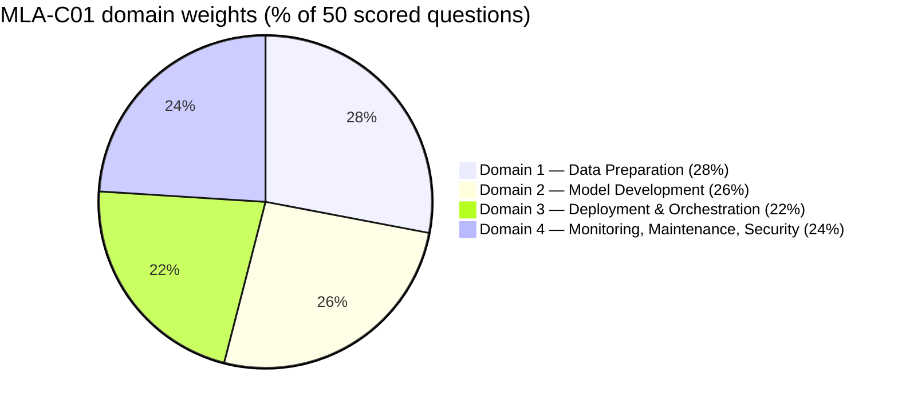
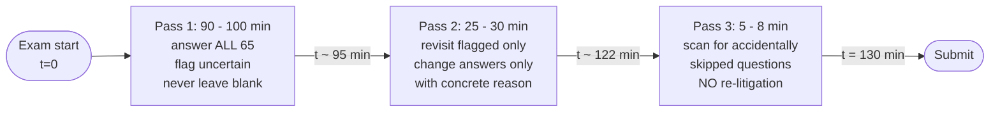

# Chapter 2 — The MLA-C01 Exam, Dissected

> **Goal of this chapter:** to make the MLA-C01 exam itself *transparent*. By the end of this chapter you should be able to recite the four domains and twelve task statements without notes, name every question format and how it is scored, predict the rough question-count distribution across domains, recognise the five question archetypes when you see them in the wild, and pace yourself through 130 minutes without panicking. Chapter 1 told you *what* an ML engineer does on AWS; this chapter tells you *what AWS will actually ask you about it on exam day*. Treat the exam as a system to be understood — that is the cheapest win available before you ever open a SageMaker console.

---

## 2.1 Why this chapter exists *right here*

You have just finished Chapter 1. You know the role this certification is trying to validate. The natural next instinct — the one almost every candidate follows — is to dive straight into SageMaker: open the console, click around Studio, fire up a training job, see what `xgboost.image_uris.retrieve(...)` actually returns. That instinct is good. It is also, at this exact moment, premature.

Before the first console click, three questions need answers, and you cannot derive them from the SageMaker docs:

1. **Where do the points live?** If 28% of your scored points sit in Data Preparation and 22% sit in Deployment & Orchestration, then the order in which you study these areas — and the depth at which you study them — should reflect that, not a coin flip.
2. **What is the question format?** Choosing the wrong answer on a multiple-response question and choosing the wrong order on an ordering question are both worth zero credit, but they fail in *different ways*. You need to know which formats reward "best guess" thinking and which punish it.
3. **What is out of scope?** Every hour you spend on quantisation-impact-on-accuracy analysis or on Transit Gateway routing is an hour you did not spend on Model Monitor configuration. The exam guide tells you, in writing, what is *not* on this exam. Reading that page is worth a half day of study.

This chapter answers all three. It is the meta-chapter — heavier on tables, lighter on prose, more chart-dense than the rest of the book. Think of it as the **map** you keep folded in your back pocket for the next sixty chapters; pull it out whenever you feel like you are studying something for its own sake instead of for the exam.

Two sources do most of the work for us:

- **The official AWS Certified Machine Learning Engineer – Associate Exam Guide PDF** — the only canonical source for mechanics, domains, weights, task statements, and out-of-scope. We have a local copy saved at `research_inputs/14_aws_ml_engineer_associate/official/aws_mla_c01_exam_guide_docs.pdf`, with the verbatim Knowledge/Skills bullets extracted to `exam_guide_excerpt.md`. Cite this for any mechanic.
- **Test-taker post-mortems and study-resource reviews** — Collin Smith, Sourabh Sinha, Huszcza, Mark Ross, "Andy" / DEV.to, Tutorials Dojo's "Behind the Badge," Pluralsight. Cite these for practice-side claims — what the exam *felt like* to people who sat for it.

Where the two disagree, the official guide wins and we flag the discrepancy.

---

## 2.2 Exam mechanics — the headline numbers

Everything in this section comes from the official MLA-C01 exam page and the official exam guide PDF. Memorise the headline numbers; they will inform every later decision in your prep plan.

| Property                | Value                                                                              |
| ----------------------- | ---------------------------------------------------------------------------------- |
| Exam code               | **MLA-C01**                                                                        |
| Level                   | Associate                                                                          |
| Total questions         | **65**                                                                             |
| Scored questions        | **50**                                                                             |
| Unscored questions      | **15** (research / pre-test items, indistinguishable from scored ones)             |
| Time                    | **130 minutes** (≈ 2 minutes per question on average)                              |
| Score scale             | **100 – 1000** (scaled, not raw percent)                                           |
| Passing score           | **720**                                                                            |
| Section minimums        | **None** — compensatory scoring across the four domains                            |
| Penalty for wrong       | **None** — unanswered counts as wrong, so always guess                             |
| Delivery                | Pearson VUE testing center **or** online proctored                                 |
| Cost (USD)              | **$150**                                                                           |
| Languages               | English, Japanese, Korean, Simplified Chinese                                      |
| ESL extension           | **+30 minutes** (request in advance, before scheduling — not on the day)           |
| Certification validity  | **3 years** (then re-certify or take a higher-level cert that recertifies you)     |

> Source: AWS Certified Machine Learning Engineer – Associate exam page on aws.amazon.com/certification; official exam guide PDF.

Three of those rows hide enough subtlety to deserve their own subsections.

### 2.2.1 What "scaled score 100–1000" actually means

Your **raw score** is how many of the 50 scored questions you got right. AWS then maps that raw score onto a 100–1000 scale via a psychometric formula they do **not** publish. The mapping is not linear, and AWS re-tunes it per exam form so that two candidates who took different forms of the same exam get comparable scaled scores.

Practical implication: **do not try to back-calculate "how many can I afford to miss"** from the 720 threshold. The community consensus — and a generally safe target — is **"aim for ~75–80% raw correct on practice exams of equivalent difficulty."** If you can hit 80% reliably on a well-calibrated bank that you have not seen before, you are safe. Huszcza's data point bears this out: his first practice runs scored 66/67/70%; after a second pass through Tutorials Dojo he scored 81/86/81%; on the real exam he hit 818/1000 (a comfortable pass over the 720 bar).

### 2.2.2 Compensatory scoring — the "good news" clause

There is **no per-domain minimum**. If you ace Domain 1 (Data Prep, 28%) and Domain 2 (Modeling, 26%) and you are shaky on Domain 4 (Monitoring/Security, 24%), the strong domains can compensate. Your **total** scaled score is what gets compared to 720.

Two consequences flow from this:

1. **Do not over-invest in your weakest domain at the expense of the strong ones.** The math rewards "breadth-with-strength," not "fix the weakest link." A candidate who scores 90% on three domains and 50% on the fourth passes more comfortably than one who scores 72% across all four.
2. **Do not waste time post-mortem-arguing your domain bars on the score report.** The portal shows you a coloured bar per domain ("Below / Meets / Above") but no numeric per-domain score. Total only.

### 2.2.3 The 15 unscored questions

15 of the 65 questions are **unscored research items**. AWS embeds them in your exam, watches how the population performs, and uses the data to calibrate future scored questions. You are **not told which 15** they are. They look identical to scored ones.

Implication: **do not skip a question because it "feels like a beta question."** You cannot tell which ones they are. Answer everything. Guess if you must. An unanswered question is a guaranteed zero; a guess on a four-option multiple-choice is a 25% expected gain.

> **⚠️ Exam alert — never leave a blank.** There is no penalty for guessing on the MLA-C01. Even on a question you cannot reason about, eliminate one or two options based on obvious-wrong cues ("includes EC2 self-managed" is rarely right when the stem says "least operational overhead") and pick from the remainder. A 1-in-2 guess on a flagged question is +0.5 expected questions correct. Across the 5–10 questions you might genuinely not know, that is two or three free points.

---

## 2.3 Question types — the five formats

The MLA-C01 is one of the **first two AWS exams** (the other being AI Practitioner / AIF-C01) to introduce the new **ordering**, **matching**, and **case study** question formats alongside the long-standing **multiple choice** and **multiple response** formats.

> Source: AWS Training and Certification blog, "AWS Certification: Addition of new exam question types" — the definitive announcement on the three new formats.

### 2.3.1 Multiple Choice (MCQ)

- 1 question stem, **4 options**, **1 correct** answer.
- Scoring: **all-or-nothing**. Right → full credit. Wrong → zero.
- The other 3 options are **distractors**. AWS distractors are deliberately plausible — almost always all four options are valid AWS services or configurations; only one is *best* for the specific constraints in the stem.

**Tactical note.** When stuck, eliminate-by-constraint. Re-read the stem for qualifier words: *"least operational overhead," "lowest cost," "real-time," "batch," "fully managed," "minimum code changes," "within the existing VPC."* These usually rule out two of four. We will catalogue the high-yield qualifier words in §2.6.4.

### 2.3.2 Multiple Response (MRQ)

- 1 question stem, **5+ options**, **2 or more correct** (the stem tells you exactly how many to choose, e.g., "Choose TWO" or "Choose THREE").
- Scoring: **all-or-nothing per question** on Associate-level exams. You must select **exactly** the right combination. Picking two correct + one wrong out of three-required = **zero credit** on that question.
- AWS does not publish partial-credit rules for MRQ on Associates. Treat MRQ as binary.

**Tactical note.** The count in the stem ("Choose TWO") is a *constraint*, not a hint. If you can only confidently identify one correct answer, you must still pick the count requested — guessing the second is strictly better than leaving it blank (unanswered = wrong anyway, and you may pick the right one).

### 2.3.3 Ordering

- 1 stem describing a procedure or workflow.
- **3–6 steps** presented in scrambled order; drag/click to put them in the correct sequence.
- Scoring: **all-or-nothing** — every step must be in the correct position to get credit.

> **⚠️ Exam alert — Ordering item count: 3–6, per AWS source.** The AWS Training and Certification blog (April 2024 announcement) and the official exam guide PDF both state **3–6** items for Ordering and **3–6** prompts for Matching. Some secondary sources (including an earlier internal note `domain_breakdown.md` in this repo, and several blog posts) say "3–5 items" for Ordering and "3–7 pairs" for Matching. **Use the AWS-source 3–6 figure** — that is what the exam guide PDF actually says.

> AWS's own quote on Ordering: *"The ordering format forces you to have great knowledge of the topics."* That is marketing-speak for "we designed these to be hard to fake." (Source: AWS Training and Certification blog.)

**Tactical note.** Ordering questions test procedural knowledge — e.g., "place these SageMaker Pipeline construction steps in order," or "order the steps to deploy a blue/green endpoint with CodeDeploy." Before you start dragging, **anchor the first step and the last step first**; the middle usually resolves once the endpoints are fixed.

### 2.3.4 Matching

- 1 stem with a list of **3–6 prompts** (left side) and a list of **3–6 responses** (right side).
- Use a dropdown next to each prompt to pick its match.
- Responses may be used **once, multiple times, or not at all** — re-read the instructions on each Matching question, the rule varies.
- Scoring: **all-or-nothing** — every prompt must be correctly matched.

**Tactical note.** Matching questions are typically *"service → use case"* pairings (e.g., match each SageMaker deployment option — real-time, serverless, async, batch — to the latency/throughput profile that fits). The trap is responses-that-could-fit-multiple-prompts; **eliminate the unambiguous pairs first** and let the ambiguous ones fall into place by elimination.

### 2.3.5 Case Study

- 1 scenario (usually 100–300 words describing a customer environment) followed by **2 or more questions** that all reference that scenario.
- Each sub-question is scored **independently** — you get partial credit *across* sub-questions if you nail 2 of 3.
- The sub-questions themselves may be any of the four types above.

**Tactical note.** Case studies are an *efficiency feature for AWS* — less scenario-writing per question for them, more reading per question for you, but amortised across sub-questions. Read the scenario carefully once, jot mental notes on the constraints (latency? cost? compliance? data volume?), then attack the sub-questions in order. **Do not re-read the scenario for every sub-question** unless the sub-question's stem explicitly references a detail you do not remember.

### 2.3.6 Scoring summary table

| Type              | Items                       | Partial credit?            | Failure cost                  |
| ----------------- | --------------------------- | -------------------------- | ----------------------------- |
| Multiple Choice   | 1 stem, 4 opts, 1 right     | No                         | Wrong = 0                     |
| Multiple Response | 1 stem, 5+ opts, ≥2 right   | No (treat as binary)       | Almost-right = 0              |
| Ordering          | **3–6 steps**               | No                         | One step out of place = 0     |
| Matching          | **3–6 prompts ↔ responses** | No                         | One mismatch = 0              |
| Case Study        | 1 scenario, 2+ sub-Qs       | **Yes — across sub-Qs**    | One sub-Q wrong ≠ all wrong   |

The pattern is clear: **AWS rewards completeness, not partial knowledge, within a single question.** The only place partial credit lives is across case-study sub-questions. This is why a wobbly answer on Ordering or Matching is genuinely expensive — six steps, one out of place, zero credit, the same penalty as getting all six wrong.

---

## 2.4 The four domains and twelve tasks

The MLA-C01 exam has **four content domains**, each weighted as below. The weights tell you almost everything about where your study time should go.



| #     | Domain                                              | Weight   | Tasks | Scored Q     |
| ----- | --------------------------------------------------- | -------: | ----: | -----------: |
| 1     | Data Preparation for ML                             |  **28%** |     3 |   ≈ **14**   |
| 2     | ML Model Development                                |  **26%** |     3 |   ≈ **13**   |
| 3     | Deployment and Orchestration of ML Workflows        |  **22%** |     3 |   ≈ **11**   |
| 4     | ML Solution Monitoring, Maintenance, and Security   |  **24%** |     3 |   ≈ **12**   |
| Total |                                                     |  **100%**|    **12** |   **50** |

Two read-the-table observations before we list the tasks:

- **Domains 1 + 4 = 52%** of the scored questions. Both are easy to under-prepare because they feel "less ML" than Domain 2 — Data Prep feels like data engineering, Monitoring/Security feels like operations. Do not let that prejudice steer your study budget away from the larger half of the exam.
- **Domain 3 (Deployment) is the smallest at 22%** but it is also where the highest concentration of *decision-tree trap* questions lives (real-time vs. serverless vs. async vs. batch, MME vs. MCE, blue/green vs. canary). Per-question, Domain 3 is arguably the most reliable place to bank or bleed points.

### Domain 1 — Data Preparation for ML (28%) → covered in Parts C–D

**Task 1.1 — Ingest and store data.** Formats (Parquet, ORC, Avro, RecordIO, JSON, CSV); storage (S3, EFS, FSx for ONTAP, EBS, RDS, DynamoDB); streaming (Kinesis, MSK / Kafka, Flink). Cost-versus-performance tradeoffs.
→ Part C, Chapters 10–15.

**Task 1.2 — Transform data and feature engineering.** Cleaning (outliers, imputation, dedup), feature operations (scaling, binning, log transforms, encoding), tooling (Data Wrangler, Glue, DataBrew, EMR Spark, Lambda for streaming), labeling (Ground Truth, Mechanical Turk).
→ Part D, Chapters 16–21.

**Task 1.3 — Data integrity and prep.** Pre-training bias metrics (CI, DPL), CI mitigation (synthetic data, resampling), encryption, anonymisation, masking, PII / PHI / data residency, Clarify, dataset splitting / shuffling / augmentation.
→ Part D, Chapters 16–21 (bias + Clarify) and Part I, Chapters 41–45 (security overlap).

### Domain 2 — ML Model Development (26%) → covered in Parts E–F

**Task 2.1 — Choose a modeling approach.** When to use AI services (Translate, Transcribe, Rekognition, Bedrock) vs. SageMaker built-in algos vs. custom; interpretability; JumpStart and Bedrock as starting points.
→ Part E, Chapters 22–30 (model dev); Part J, Chapters 56–59 (AI services / GenAI).

**Task 2.2 — Train and refine models.** Epochs / steps / batch size; early stopping; distributed training; regularisation (L1 / L2, dropout, weight decay); HPO (random, Bayesian, AMT); fine-tuning; pruning / compression; bring-your-own model integration; **Model Registry** for versioning.
→ Part E, Chapters 22–30 + Part F, Chapters 31–34 (HPO and distributed training).

**Task 2.3 — Analyze model performance.** Metrics (confusion matrix, F1, precision / recall, ROC / AUC, RMSE); over- / under-fit detection; SageMaker Clarify and Model Debugger; shadow vs. production variant comparison.
→ Part E, Chapters 22–30 (Clarify, Debugger); Part I, Chapters 41–45 (shadow / production variant overlap).

### Domain 3 — Deployment and Orchestration (22%) → covered in Parts G–H

**Task 3.1 — Select deployment infrastructure.** The famous four-way decision: real-time vs. serverless vs. async vs. batch endpoint; CPU vs. GPU vs. Inferentia; SageMaker Neo for edge; container choice (managed vs. BYOC); MME vs. MCE.
→ Part G, Chapters 35–42.

**Task 3.2 — Create and script infrastructure.** On-demand vs. provisioned; scaling policies (target tracking, step, scheduled); IaC (CloudFormation, CDK); VPC config for endpoints; ECR / ECS / EKS; auto-scaling metrics (model latency, CPU, invocations-per-instance).
→ Part G, Chapters 35–42.

**Task 3.3 — Automated orchestration & CI/CD.** CodePipeline / CodeBuild / CodeDeploy quotas; SageMaker Pipelines; EventBridge triggers; blue/green, canary, linear deployments; Gitflow / GitHub Flow.
→ Part H, Chapters 43–47.

### Domain 4 — Monitoring, Maintenance, Security (24%) → covered in Parts I–J

**Task 4.1 — Monitor model inference.** Model drift, data quality, Model Monitor (four monitor types), Clarify-for-drift, A/B testing in production.
→ Part I, Chapters 41–45.

**Task 4.2 — Monitor and optimise infra + cost.** CloudWatch (Logs Insights, Lambda Insights), X-Ray, CloudTrail for re-training triggers, instance family selection, Cost Explorer, Trusted Advisor, Budgets, Compute Optimizer, Inference Recommender, Spot / Reserved / Savings Plans, **resource tagging strategy**.
→ Part I, Chapters 41–45 + Part J cost subsections (Chapters 50–55).

**Task 4.3 — Secure AWS resources.** IAM roles / policies / groups, bucket policies, SageMaker Role Manager, VPC isolation (subnets, security groups, endpoints), CI/CD security, audit / log / compliance.
→ Part J, Chapters 50–55 (security spine for the whole book builds on Part B Chapters 5–9).

> **Verbatim source of the full Knowledge / Skills bullets:** `research_inputs/14_aws_ml_engineer_associate/exam_guide_excerpt.md`, extracted from the official PDF. This chapter intentionally compresses; do **at least one read** of the verbatim source before the exam — there are subtleties in the bullet wording (e.g., "Apache Flink" appearing in Task 1.1, "catastrophic forgetting" in Task 2.2) that are testable and easy to miss.

---

## 2.5 MLA-C01 vs MLS-C01 — what changed and why

If you are reading this, there is a non-trivial chance you previously studied for MLS-C01 (the Machine Learning Specialty exam, which retires on **March 31, 2026**). MLA-C01 is not a coat of paint on MLS-C01. The center of gravity moved substantively.

### 2.5.1 Status & side-by-side

| Item                  | MLS-C01 (Specialty)                                                  | MLA-C01 (Associate)                                                          |
| --------------------- | -------------------------------------------------------------------- | ---------------------------------------------------------------------------- |
| Status (May 2026)     | **Retiring — last day to test: March 31, 2026**                      | Active (general availability since 2024)                                     |
| Level                 | Specialty                                                            | Associate                                                                    |
| Questions             | 65 (MCQ + MRQ only)                                                  | 65 (MCQ + MRQ + Ordering + Matching + Case Study)                            |
| Time                  | 180 minutes                                                          | **130 minutes**                                                              |
| Pass score            | 750                                                                  | **720**                                                                      |
| Target experience     | **2+ years** developing ML / DL on AWS                               | **~1 year** SageMaker + general AWS                                          |
| Target role lead-in   | "Data scientist / ML architect"                                      | **"Backend SWE, DevOps eng, data eng, MLOps eng, data scientist"**           |
| Cost (USD)            | $300                                                                 | **$150**                                                                     |
| Domains               | Data Eng • EDA • Modeling • ML Impl & Ops                            | Data Prep • Model Dev • Deploy/Orch • Monitor/Maint/Security                 |

> Sources: AWS MLS-C01 page (retirement notice + pointer to MLA-C01); AWS MLA-C01 page; AWS Training and Certification blog (April 2024 question-type announcement).

Notice the **target-role wording** in particular. The MLS-C01 page leads with "data scientist." The MLA-C01 page leads with **"backend software developers, DevOps engineers, data engineers, MLOps engineers, and data scientists"** — in that order. AWS is signalling, on the canonical page, that this exam is for the engineer who operationalises ML, not the data scientist who trains it.

### 2.5.2 What's gone (or much lighter) compared to MLS-C01

- **Deep ML theory.** MLS-C01 famously tested kernel tricks, gradient-descent math, decision-tree split criteria, the exact gradient of softmax cross-entropy. MLA-C01 reduces this to associate-level fundamentals: overfitting / underfitting, F1 / precision / recall / RMSE, regression vs. classification, regularisation by name (L1 / L2 / dropout / weight decay) — that is *roughly it* on the theory side.
- **Built-in algorithm internals.** MLS-C01 expected you to know linear-learner hyperparameters, BlazingText's two modes, Object2Vec's input format, and the math of XGBoost. MLA-C01 cares more about *how you run any model in SageMaker* than which one to pick — algorithm-choice questions still appear, but the depth is "match algorithm family to problem family," not "explain the math."
- **Statistics / probability stand-alone.** MLS-C01 had genuine stats questions (hypothesis testing, t-tests). MLA-C01 has almost none.
- **EDA as a self-standing domain.** MLS-C01 had a full Exploratory Data Analysis domain. MLA-C01 folds the relevant pieces into Task 1.2 / 1.3 and de-emphasises the rest.

### 2.5.3 What's new (or much heavier) on MLA-C01

- **MLOps as a first-class citizen.** SageMaker Pipelines, Model Registry, CodePipeline / CodeBuild / CodeDeploy, EventBridge retraining triggers, blue/green / canary / linear deployments, A/B and shadow testing. Most of this barely existed (or barely qualified) on MLS-C01.
- **Generative AI / Bedrock.** Foundation-model selection (Claude, Titan, Cohere, Llama), customisation spectrum (prompt → RAG → fine-tune → continued pre-train), Guardrails, Agents, Knowledge Bases, vector-store backends. MLS-C01 predates this entire stack; MLA-C01 tests it explicitly.
- **Cost optimisation.** Spot / Reserved / Savings Plans for SageMaker, Compute Optimizer, Inference Recommender, resource tagging strategy, Budgets / Trusted Advisor / Cost Explorer. Cost is now a recurring axis on *every* deployment scenario.
- **Production security for ML.** VPC mode for Studio and endpoints, KMS for training / processing / endpoint resources, network isolation mode, Role Manager, PrivateLink for SageMaker APIs.
- **New question formats.** Ordering, Matching, Case Study — none of these existed on MLS-C01.

### 2.5.4 What's explicitly out of scope (verbatim from the MLA-C01 exam guide)

This is one of the highest-yield pages in the entire exam guide. The "Job tasks that are out of scope" list, paraphrased, says:

1. **Designing end-to-end ML solutions from a blank canvas.** That is solutions-architect territory, or MLS-C01-era data-scientist territory.
2. **Guiding ML strategy for an organisation.** No "should we build ML?" questions.
3. **Integrating with a wide array of new tools.** Questions stay inside AWS-native and well-known open-source (PyTorch, TensorFlow, Spark, Airflow, Kafka, Hugging Face).
4. **Deep work in multiple ML domains simultaneously.** You will not be asked to be both an NLP and a CV expert in the same scenario.
5. **Quantisation impact on accuracy.** Called out by name. You should know that SageMaker Neo *can* quantise; you will not be asked to reason about post-quantisation accuracy-loss curves.

> **⚠️ Exam alert — bound your study with the out-of-scope list.** If a topic is not in the in-scope task statements, it is *not* on the exam. Tattoo this on your forehead before you go down a TensorFlow-internals or Direct-Connect-routing rabbit hole. The exam guide PDF actually *helps* you study less.

### 2.5.5 The MLS → MLA migration path

If you have already prepped some MLS-C01 material, here is what carries over:

**Carries over:** ML algorithm fundamentals, evaluation metrics (F1, AUC, RMSE), bias / fairness concepts, feature-engineering basics, SageMaker built-in algos (lightly), Ground Truth, Clarify, Model Monitor basics.

**Doesn't carry — must learn fresh for MLA-C01:**
- SageMaker Pipelines (much heavier emphasis)
- Model Registry workflows (versions, groups, approval, deployment via Registry)
- CodePipeline / CodeBuild / CodeDeploy mechanics for ML
- Inference Recommender, Compute Optimizer (more prominent)
- Cost optimisation (Spot, Reserved, Savings Plans for SageMaker)
- **Bedrock and JumpStart** (barely existed when MLS-C01 was last revised)
- The three new question types (Ordering, Matching, Case Study)

---

## 2.6 Question archetypes — five patterns that cover (almost) everything

Once you have answered a few hundred practice questions, you start to see that almost every MLA-C01 question fits into one of five recognisable shapes. Pattern-matching speed is one of the cheapest wins on exam day; the faster you can say "oh, this is a decision-tree question" the faster you can apply the right attack.

The five archetypes:

1. **Decision-tree** — "which service?" given a constraint.
2. **Comparison** — A vs. B, where the differentiator is a single dimension.
3. **Architecture-completion** — "fill the gap in this pipeline."
4. **Trap-distractor** — three plausible + one best, hinging on a single qualifier word.
5. **Case-study** — a scenario followed by two-to-four sub-questions.

The worked examples below are *illustrative* — invented stems consistent with the exam guide's task statements, **not** drawn from the actual exam or from any leaked content.

### 2.6.1 Decision-tree questions ("which service?")

**Shape.** A scenario describes a constraint (latency, throughput, traffic shape, budget, team skill). Four answers are all valid AWS services. One is the *best fit* under the constraint.

**Worked example (illustrative — not a real exam question):**

> *A fraud-detection team needs to serve a model that scores incoming credit-card transactions. Traffic is intermittent — about 100 requests per minute on weekdays during business hours, near zero overnight and on weekends. The team wants to minimise idle cost while keeping latency under 200 ms during business hours. Which deployment option should they choose?*
>
> A. Real-time endpoint with a single always-on `ml.m5.large` instance.
> B. **SageMaker Serverless Inference endpoint.**
> C. Asynchronous inference endpoint with auto-scaling to zero.
> D. Batch transform job scheduled hourly.

**The trap.** A and C are both valid for many real-world deployments. D could technically batch up overnight charges, but real-time fraud scoring is online by definition. The constraints "intermittent traffic" + "minimise idle cost" + sub-200ms latency point cleanly at Serverless: it scales to zero between bursts and the cold-start tax is well under 200ms for typical models.

**How to attack.** Highlight (mentally, or with the on-screen highlight tool) the constraint words. Eliminate any answer that *violates* a constraint, not the one that "could work" — many can work; only one is *best*.

### 2.6.2 Comparison questions (A vs. B, hinging on one axis)

**Shape.** Two AWS options that solve the same general problem are pitted against each other. The differentiator is usually one of: cost, latency, throughput, payload size, request duration, team workflow, or compliance.

The high-yield comparison pairs to know cold for MLA-C01:

| Pair                                                         | The differentiator                                                                |
| ------------------------------------------------------------ | --------------------------------------------------------------------------------- |
| Real-time vs. Serverless endpoints                           | Traffic shape (steady → real-time; intermittent → serverless)                     |
| Real-time vs. Async endpoints                                | Request duration / payload size (>60s or >6MB → async)                            |
| Serverless vs. Async                                         | Payload size + cold-start tolerance (async wins on large payloads)                |
| Async vs. Batch Transform                                    | One-by-one (async) vs. whole-dataset (batch)                                      |
| MME (Multi-Model Endpoint) vs. MCE (Multi-Container Endpoint)| Same framework, many models (MME); different frameworks (MCE)                     |
| SageMaker Pipelines vs. Step Functions                       | ML-native, inside SageMaker (Pipelines) vs. cross-service orchestration (SFn)     |
| Data Wrangler vs. Glue DataBrew vs. Glue ETL                 | ML feature prep vs. visual data cleanup vs. scale ETL                             |
| JumpStart vs. Bedrock                                        | Self-host & fine-tune (JumpStart) vs. managed-API foundation model (Bedrock)      |
| Model Monitor: data-quality vs. model-quality vs. bias drift | What is drifting (inputs, labels-vs-truth, fairness)                              |
| Spot vs. On-Demand vs. Reserved (training)                   | Interruption tolerance + commitment horizon                                       |
| Blue/Green vs. Canary vs. Linear deployment                  | Risk appetite + roll-back speed (B/G fastest rollback, canary safest)             |
| Feature Store online vs. offline                             | Sub-10 ms inference lookup vs. point-in-time training history                     |
| SageMaker Execution Role vs. User/Caller Role                | Who is calling (SageMaker itself vs. a user/service calling SageMaker APIs)       |

These are the most predictable points on the exam. **Drill them.** A solid week of your prep should be dedicated to making these distinctions reflexive.

**Worked example (illustrative):**

> *A model serves recommendations from a single PyTorch model. Traffic is steady at ~500 requests per second with p99 latency requirement of 80 ms. The team plans to add 50 more PyTorch models over the next quarter, each serving a different customer segment, each with sporadic traffic individually but high aggregate load. Which endpoint configuration is most cost-effective?*
>
> A. 50 separate real-time endpoints, one per model.
> B. **A single Multi-Model Endpoint (MME) hosting all 50 models on shared instances.**
> C. A single Multi-Container Endpoint (MCE) with 50 containers.
> D. SageMaker Serverless Inference, one endpoint per model.

The differentiator is **same framework, many models, sporadic per-model traffic** → MME, exactly its sweet spot. MCE is for *different frameworks* in the same endpoint. Serverless is wrong because of cold-start at 80 ms p99 with steady aggregate load.

### 2.6.3 Architecture-completion questions

**Shape.** A multi-step ML pipeline is described, with one step left as `[?]`. You pick the service or pattern that fills the gap.

**Worked example (illustrative):**

> *A pipeline ingests events into Kinesis Data Streams, processes them with Managed Service for Apache Flink, writes features to Amazon S3, and trains a SageMaker model on a schedule. The team wants to track which exact dataset version produced each trained model artifact for audit purposes. What should they add?*
>
> A. **SageMaker Model Registry with model groups and version metadata referencing the dataset S3 URI.**
> B. SageMaker Feature Store offline store with versioning.
> C. AWS Glue Data Catalog versions on the features table.
> D. S3 Object Versioning on the training bucket.

Several of these are partially right. Feature Store offline has versioning. Glue Catalog has versions. S3 has versioning. But the question asks specifically about *the link between a training run and the model it produced* — that is the Model Registry's primary purpose (capture inputs, hyperparameters, metrics, and approval status against each model version).

**How to attack.** Identify the *missing capability* — here, "lineage / version pinning from dataset → model." Pick the AWS service whose **primary purpose** is that capability, not a service that has the capability as a side feature.

### 2.6.4 Trap-distractor questions (three plausible + one best)

**Shape.** All four answers would technically work. One is the *best* under the stated constraint. The other three each violate exactly one constraint — usually cost, latency, operational overhead, or security.

These are the questions where careful reading is worth gold. The qualifier words to watch for in the stem:

- **"with least operational overhead"** → favours fully-managed services (Bedrock > SageMaker custom; serverless > self-managed; AWS-managed > BYOC)
- **"most cost-effective"** → favours Spot / serverless / batch / async / Savings Plans / right-sized instances
- **"lowest latency"** → favours real-time endpoint + provisioned + same-region; rules out batch and async
- **"minimum code changes"** → favours managed APIs (Comprehend, Bedrock) over custom training
- **"fully managed"** → rules out any answer involving EC2 / EKS self-management
- **"within the existing VPC"** → rules out public-internet endpoints; favours interface endpoints / PrivateLink
- **"meets compliance requirement X" (HIPAA, PCI, GDPR, FedRAMP)** → rules out non-compliant services or default configurations
- **"near real-time"** → not quite real-time; opens the door to streaming + small-window batch
- **"with the least training data"** → favours pre-trained services (Rekognition Custom Labels, Bedrock fine-tune) over from-scratch SageMaker
- **"queryable from existing BI tools"** → favours services exposing SQL (Athena, Redshift) over services that don't

**Worked example (illustrative):**

> *A retail company wants to build a sentiment-analysis capability for product reviews in English. The team has no ML experience and wants the **fastest path to production with the least operational overhead**. Which approach should they choose?*
>
> A. Fine-tune a Bedrock foundation model on a labelled corpus of product reviews.
> B. Train a SageMaker BlazingText model on a labelled corpus.
> C. **Use Amazon Comprehend's pre-built sentiment-analysis API.**
> D. Deploy a Hugging Face sentiment model on a SageMaker real-time endpoint.

All four work. The qualifier "least operational overhead" + "no ML experience" + "fastest path" eliminates A, B, D — all of which require some ML lifecycle work — and points squarely at Comprehend, which is an HTTP call returning a sentiment score with zero training infrastructure.

### 2.6.5 Case-study questions

**Shape.** A scenario describes a customer's situation. Two-to-four sub-questions follow, each scored independently. Sub-questions are usually:
1. **"Which service / architecture?"** — decision-tree against the scenario.
2. **"Which configuration setting / parameter?"** — depth-of-knowledge on the chosen service.
3. **"Which monitoring / failure-mode follow-up?"** — operational thinking after deployment.

Community-reported case-study scenario patterns include:

- **"Web-based AI app on SageMaker"** — central Model Registry, training pipeline, monitoring. Sub-questions probe Model Groups / approval workflow, Warm Pools (`KeepAlivePeriodInSeconds`) for back-to-back training jobs, and on-demand bias-drift monitoring via Clarify.
- **"Fraud detection with class imbalance and on-prem data"** — sub-questions cover SMOTE / class weights / undersampling, DMS or Glue connections for the on-prem MySQL pull, and feature-importance analysis via Clarify.

The case-study format is the **only** place you get partial credit at the exam level (across sub-questions, not within them). Don't anchor too hard — if sub-Q 1 stumps you, attempt it and move on; sub-Q 2 and 3 are independent and you can still bank those points.

---

## 2.7 The three-pass pacing strategy

### 2.7.1 The arithmetic

```
130 min × 60 sec/min = 7800 seconds
7800 sec / 65 questions = 120 sec per question = 2.0 min/Q
```

But the average hides the variance. A realistic distribution at exam time:

- **~40 questions** answered in 60–90 seconds each (straightforward MCQ / one-step decision-tree). These *bank* time.
- **~15 questions** that take 2–3 minutes (longer scenarios, MRQ, comparison deep-cuts).
- **~5–10 questions** that genuinely take 3–5 minutes (case studies with 2–3 sub-questions, ordering, complex matching).

If you spend exactly 2 minutes on every question you finish in 130 minutes with **zero review time** — a bad outcome. You need a flag-and-review pass, which means Pass 1 needs to be faster than average.

### 2.7.2 The three passes — diagram



### 2.7.3 The three passes — narrative

**Pass 1 (target: 90–100 minutes for all 65 questions):**
- Answer **every** question. No blanks — even if you flag for review, pick your best guess first.
- Flag any question where you spent >2 min OR where you were not confident.
- For Ordering / Matching: if it is not clicking in 60 seconds, take your best shot, flag, move on.
- For Case Study: read the scenario once, jot mental notes on constraints, answer all sub-questions in one go, flag any sub-question you wavered on.

**Pass 2 (target: 25–30 minutes on flagged questions):**
- Revisit flagged questions. With fresh eyes — and sometimes with new information from a later question that triggered recall — you will re-resolve a good chunk.
- Resist the urge to convert a gut-feel correct answer into an overthought wrong one. Huszcza's data point: he changed 7–8 answers on his second pass and credited that with passing. The counter-pattern from other passers: *only change* if you have a concrete reason from the question wording.

**Pass 3 (if time remains, ~5–10 min):**
- Scan the whole exam for accidentally-skipped questions (the flag indicator at the top of the interface helps).
- Sanity-check obvious arithmetic or option counts on MRQ ("did I actually pick TWO when the stem says TWO?").
- **Do not re-litigate** the easy first-pass answers. By minute 125 you are fatigued and your judgment is worse than at minute 12.

### 2.7.4 Hard time guards

- **At 65 min in (halfway through time):** you should be on question 35 or later. If you are on Q20, you are too slow; accept more uncertainty and speed up.
- **At 100 min in:** you should be done with Pass 1 (all 65 answered). If not, **stop deep-thinking** and burn through the remainder — a flagged guess is better than an unanswered question.
- **At 120 min in:** stop changing answers unless you spot a clear error. The last 10 minutes are for sanity, not for re-litigating.

> **⚠️ Exam alert — flagging discipline.** Flag liberally on Pass 1. Flagging costs nothing. Common flagging triggers: two answers look equally valid; an unfamiliar service is mentioned in a distractor; the scenario has more than one constraint to satisfy. The discipline you want is "answer-then-flag," not "flag-without-answering." An answered-and-flagged question is your safety net; an unanswered-and-flagged question is a guaranteed zero if Pass 2 runs out.

### 2.7.5 Online-proctored quirks

If you take the exam online (as opposed to a Pearson VUE test center):

- You **cannot** look away from the camera for long. Pacing under that pressure is harder than in a centre.
- You **cannot** have scratch paper, but the exam interface includes a built-in whiteboard / notepad.
- You **cannot** mutter or read aloud. Internalise your reasoning.
- You **cannot** leave the room mid-exam — bathroom breaks end the exam early.
- Pre-exam setup (webcam check, ID check, 360° room pan) takes **~30 minutes** before the clock starts. Allow for it.

For these reasons, many candidates prefer test-centre delivery for high-stakes attempts. The exam content is identical; only the proctoring overhead and the failure modes differ.

> **⚠️ Exam alert — fatigue hits around question 60.** Multiple test-taker accounts (Huszcza, Mark Ross, Sourabh Sinha) note that 130 minutes of dense scenario reading is genuinely tiring, and the wall hits in the last ~15 questions. Plan a *mental reset* at the 100-minute mark — close your eyes for 10 seconds, take three slow breaths, then attack the remaining flagged questions with a fresh attention budget. This is not soft advice; it is the difference between catching a misread on Q58 and missing it.

---

## 2.8 Common failure modes — the SageMaker Trap and friends

Pattern-matching across the half-dozen practitioner post-mortems we read for Chapter 2 surfaces a small number of recurring ways MLA-C01 candidates leave points on the table. Knowing them in advance is half the defence.

### 2.8.1 The SageMaker Trap (the #1 strategic failure)

> *"Most study guides spend 80% of their time on model development, yet deployment and monitoring represent almost half the exam."*
> — Andy / DEV.to, "Stop Studying for AWS MLA-C01 Wrong — The SageMaker Trap Nobody Warns You About"

This is the single most cited failure mode in 2025–2026 community write-ups. It hits especially hard for candidates with a data-science background who reach for old MLS-C01 prep materials. They re-read built-in algorithm internals, drill HPO theory, memorise XGBoost hyperparameters — and arrive at the exam with a 26% domain mastered and a 46% combined domain (Deployment + Monitoring/Security) wide open.

The defence is *pure weight discipline*: spend study hours roughly in proportion to domain weight. Domains 3 and 4 together = **46% of the scored questions**. If you cannot articulate the four-way endpoint decision tree (real-time / serverless / async / batch) and the four Model Monitor types (data quality / model quality / bias drift / feature attribution drift) cold, you have not yet reached "exam-ready" on the back half of the exam.

### 2.8.2 Service mix-up failures (the high-frequency cluster)

A specific high-frequency failure mode worth memorising: pairs of services where one is "technically correct" and the other is "best for this scenario."

| You picked                                | But the right answer was      | Why the *right* one wins                                                          |
| ----------------------------------------- | ----------------------------- | --------------------------------------------------------------------------------- |
| SageMaker built-in image classifier       | Rekognition Custom Labels     | "Minimal training data, fastest path to production" cue                           |
| Comprehend (general sentiment)            | Bedrock fine-tune             | "Industry-specific vocabulary" — Comprehend is generic                            |
| Glue ETL job                              | Data Wrangler                 | "Low-code visual feature engineering *for ML*" cue                                |
| Real-time endpoint                        | Serverless inference          | "Intermittent / unpredictable traffic, cold-start tolerable" cue                  |
| Real-time endpoint                        | Async inference               | "Large payloads, latency tolerant, GPU-bound" cue                                 |
| Step Functions                            | SageMaker Pipelines           | When *all steps* are inside SageMaker, Pipelines wins on lineage and cost         |
| Model Registry                            | Model Cards                   | Cards = documentation (intent, lineage); Registry = versioning                    |
| Model Cards                               | Model Registry                | Versioning + approval workflow                                                    |
| SageMaker built-in DeepAR                 | Amazon Forecast (or vice-versa) | Read the cue: Forecast = managed, no-code; DeepAR = SageMaker-native, customisable |

### 2.8.3 In-exam mistakes (the tactical failures)

1. **Not reading the question stem twice.** Huszcza's pattern: he answered first based on intuition, *then* re-checked the stem; he caught 7–8 misreads on the second pass that he would have missed otherwise.
2. **Missing keyword cues.** "Lowest latency" → real-time. "Cheapest with intermittent traffic" → serverless. "Large payload, async tolerated" → async or batch. These cues are nearly deterministic — miss them, miss the question.
3. **Picking the technically correct but not optimal answer.** AWS rewards "best for this scenario," not "this works." Two answers may both work; one is cheaper, simpler, or more managed. Pick that one.
4. **Spending too long on early questions.** Ordering questions take longer than they look. If you spend 4 minutes on Q3, you bleed it from Q60 — which you will not see clearly under time pressure.
5. **Trusting Tutorials Dojo as a sufficient readiness signal.** TD is excellent but reportedly *easier than the real exam* on the 2025–2026 revisions (Collin Smith and others). Use it as a floor, not a ceiling — calibrate against Maarek's practice exams and the AWS Skill Builder pretest as well.

### 2.8.4 Strategic failures (the prep-plan-level mistakes)

- **Studying for "MLS-C01 + a coat of paint."** It is not the same exam. See §2.5.
- **Ignoring the new question formats.** Ordering and Matching are not just trivia — they require sequence-of-steps thinking, not single-best-answer thinking. Candidates who skip these in practice lose easy points.
- **Skipping hands-on labs.** Multiple authors stress "hands-on is required, not optional." Knowing what Data Wrangler *is* does not help — knowing what it *outputs* and where that output goes (Feature Store offline / S3 / Pipelines) does.

---

## 2.9 The canonical study-resource stack

Cross-referencing six MLA-C01 pass reports surfaces a remarkably consistent stack of resources. Build your prep around these; treat anything else as optional add-ons.

### 2.9.1 The five-tier study stack

| Tier | Resource | Cost (USD) | Strength | Weakness |
|------|----------|-----------:|----------|----------|
| 1 | **Stephane Maarek + Frank Kane Udemy course** — *AWS Certified Machine Learning Engineer Associate: Hands On!* (~24 h video) | ~$15 (with coupon) | Foundation + big-picture coverage of all 4 domains | Doesn't drill the new question formats |
| 2 | **Tutorials Dojo practice exams** (Jon Bonso) — 183+ questions across multiple full-length exams + review mode | ~$15 | Best for service-disambiguation drilling | Reportedly *easier* than the real exam on recent revisions |
| 3 | **Maarek's own practice exams** (separate Udemy purchase, co-authored with Abhishek Singh) — three full-length exams | ~$15 | Closest in difficulty to the actual test (per Huszcza) | Smaller question pool than TD |
| 4 | **AWS Skill Builder Exam Prep** — both free (Standard Plan, 7.5 h) and paid (Enhanced Plan, $29/mo, includes 65-question official pretest) | Free or $29/mo | Official phrasing matches exam phrasing exactly | Shallower than Maarek for actual learning |
| 5 | **Official AWS sample question set** — ~20 free questions on the certification page | Free | Calibration check on official voice / phrasing | Too small to be a study tool |
| 6 | **This textbook (Topic 14)** | — | Engineering depth + cross-references to Topic 9a math | Single-author voice; pair with #1 for second perspective |

### 2.9.2 Hours of study — what passers actually spent

| Source                                  | Background                  | Total hours (approx.) | Calendar time                          |
| --------------------------------------- | --------------------------- | --------------------: | -------------------------------------- |
| Sourabh Sinha                           | ML / cloud familiarity      | 60–70 h               | 14 days, 4–5 h/day                     |
| Collin Smith                            | AWS-experienced engineer    | ~80 h (implied)       | Multi-week, paced                      |
| Huszcza                                 | Cloud engineer              | ~50–60 h              | April → September (~5 mo, intermittent)|
| Mark Ross                               | Senior AWS cert holder      | ~40–50 h              | Beta exam window                       |
| Tutorials Dojo "Behind the Badge"       | Working full-time           | 50–80 h (implied)     | Several weeks                          |

**Community rule of thumb:** **60–100 hours** of focused prep if you already work with AWS or ML day-to-day; **120–160 hours** if you are new to one of the two. Sinha's "two weeks" claim is achievable only because he was already inside the stack.

### 2.9.3 Resources to avoid

- **ExamTopics, SPOTO, CertEmpire, CertGod, SkillCertPro, Pass4Success.** These are dumps sites. Community widely warns against them: stale content, NDA violation, and AWS has revoked certifications for dumps users. Do not use.
- **Whizlabs / K21 Academy / FlashGenius / Pluralsight.** Exist, used by some, but secondary to the Maarek + TD stack in most reports. Skip unless you have already exhausted the canonical stack.

---

## 2.10 Putting Chapter 2 into a study plan

### 2.10.1 How the rest of the book matches the exam

| Domain                                | Weight | Where in this book                                                                              |
| ------------------------------------- | -----: | ----------------------------------------------------------------------------------------------- |
| 1 — Data Preparation                  | 28%    | Part C (Data Ingestion & Storage), Chapters 10–15; Part D (Data Prep & Features), Chapters 16–21 |
| 2 — Model Development                 | 26%    | Part E (Model Development on SageMaker), Chapters 22–30; Part F (HPO & Distributed), Chapters 31–34 |
| 3 — Deployment & Orchestration        | 22%    | Part G (Deployment & Inference Infra), Chapters 35–42; Part H (Orchestration & CI/CD), Chapters 43–47 |
| 4 — Monitoring, Maintenance, Security | 24%    | Part I (Monitoring, Drift & Governance), Chapters 41–45; Part J (Security/IAM/Networking/Cost), Chapters 50–55 |
| Cross-cutting — AI Services & GenAI   |   —    | Part J of the AWS native services area continued; Part K (AWS AI Services & GenAI), Chapters 56–59 |
| Capstone & exam strategy              |   —    | Part L (Capstone & Exam Strategy), Chapters 60+                                                  |

### 2.10.2 Study-time allocation (rough)

If you have a fixed prep budget — say 80 hours — allocate roughly **in proportion to domain weight, with a ~1.2× multiplier on your weakest domain.** Example for an MLOps-leaning candidate weakest on Data Prep:

- Domain 1 (Data Prep, weak): 28% × 1.2 ≈ **27 hours**
- Domain 2 (Modeling): 26% ≈ **21 hours**
- Domain 3 (Deployment / Orchestration, strong): 22% × 0.8 ≈ **14 hours**
- Domain 4 (Monitoring / Security): 24% ≈ **19 hours**

Plus ~10 hours of practice-exam taking and review (separate from study).

### 2.10.3 When you are ready to sit

You are ready when:

1. You consistently score **≥ 80%** on a well-calibrated practice exam *that you have not seen before*.
2. You can read any question stem and **predict the answer before reading the options** at least 60% of the time on MCQ.
3. You can recite, without notes, the §2.6.2 comparison pairs (endpoint types, MME vs. MCE, JumpStart vs. Bedrock, Pipelines vs. Step Functions, deployment strategies, Feature Store online vs. offline, the role triangle).
4. You understand the out-of-scope list — you are no longer adding random topics to your study plan.
5. You have done **at least one end-to-end SageMaker exercise** (Studio → Training job → Endpoint → Model Monitor) in your own AWS account, not just read about it.

---

## 2.11 Chapter summary

- The MLA-C01 is a **65-question, 130-minute, four-domain Associate exam**, scored 100–1000 with a **720 passing bar**, no per-domain minimums, and no penalty for guessing.
- It uses **five question formats**: Multiple Choice, Multiple Response, Ordering (3–6 steps per AWS), Matching (3–6 prompts per AWS), Case Study. All but Case Study are all-or-nothing within a question; Case Study allows partial credit *across* sub-questions.
- Domain weights: **Data Prep 28% • Model Dev 26% • Deployment & Orchestration 22% • Monitoring/Maintenance/Security 24%**. Domains 1 + 4 alone = 52% — do not under-prep them.
- MLA-C01 **replaces MLS-C01** (last test day: March 31, 2026), reframing certification around the **MLOps / ML-engineer** role rather than the data-scientist role. The center of gravity shifted to operationalisation, AWS-specific tooling, cost, and security; deep ML theory and built-in algorithm internals are out.
- Question patterns cluster into **five archetypes**: decision-tree, comparison, architecture-completion, trap-distractor, case-study. The §2.6.2 comparison-pair list is the highest-yield drill list in the entire chapter.
- **Three-pass pacing**: ~90 min for Pass 1 (answer everything, flag uncertainties), ~30 min for Pass 2 (review flagged), ~5–10 min for Pass 3 (sanity / blank-check). **Never leave a question blank.**
- The biggest strategic failure is the **SageMaker Trap** — over-studying algorithms (26% of points) while under-studying deployment + monitoring (46% combined). The biggest tactical failure is missing single-word qualifier cues ("least operational overhead," "cheapest," "real-time"). Both are avoidable.
- The canonical study stack: **Maarek/Kane Udemy + Tutorials Dojo + Maarek practice exams + AWS Skill Builder + official sample set + this textbook**. Avoid dumps sites — they violate NDA and AWS has revoked certifications for it.
- **Out-of-scope topics bound your study, not just direct it.** Read the official exam guide's out-of-scope page early and refuse to study anything not in scope.

---

## 2.12 Exercises

Do these *cold*, without flipping back. They are meta-exercises — they test that the *map* in your head is correct, before we add a single fact about IAM or Glue.

### Exercise 2.1 — Recite the twelve task statements
Without looking, list all **12 task statements** in order (1.1, 1.2, 1.3, 2.1, ..., 4.3). For each, write a one-line essence in your own words. Then open `exam_guide_excerpt.md` and compare. Any task you missed or paraphrased wrong is a topic you do not yet own.

### Exercise 2.2 — Domain match
For each of the following scenario fragments, name the **single most likely domain** (1, 2, 3, or 4) and the most likely *task* (1.1 through 4.3). Be quick — this should take under 30 seconds per fragment.

1. *"The team needs to choose between Bayesian and random search for tuning XGBoost hyperparameters..."*
2. *"...with class imbalance in the labelled transaction dataset, what mitigation strategy is most appropriate?"*
3. *"The endpoint is exposed to the public internet; the team needs to move it inside a VPC..."*
4. *"...the model accuracy in production has degraded by 12% over the last 30 days, while the input distribution looks unchanged..."*
5. *"...needs to choose between Kinesis Data Streams and Managed Service for Apache Kafka for streaming ingestion..."*
6. *"...wants to deploy with a 10% canary slice that auto-promotes if error rate stays below 1% for 30 minutes..."*
7. *"...needs an IaC pattern to provision the SageMaker endpoint, its VPC config, and the auto-scaling policy as one stack that can be torn down between dev cycles..."*
8. *"...needs to apply a tagging strategy so finance can chargeback ML costs per business unit..."*

If you find yourself hesitating on more than two fragments, that is a signal to re-read §2.4 before moving on.

### Exercise 2.3 — Pacing arithmetic
1. You are at the 60-minute mark and on question 28. Are you on pace, ahead, or behind? By how much?
2. You finish Pass 1 at the 95-minute mark with 9 flagged questions. How long can you spend on each flagged question in Pass 2 (assume you want 5 minutes for Pass 3)?
3. On Pass 1 you spent 6 minutes on a single Case Study (3 sub-questions). Was that reasonable, generous, or excessive?

### Exercise 2.4 — Pick the format
For each of the following question shapes, name the **format** (MCQ / MRQ / Ordering / Matching / Case Study) and the **scoring rule** that applies:
1. *"Place the following four steps in the correct order to deploy a model with shadow testing."*
2. *"Read the scenario below. Then answer questions 14–17, each of which refers to this scenario."*
3. *"Choose TWO answers that best describe the differences between MME and MCE endpoints."*
4. *"For each SageMaker deployment option in the left column, select the latency / throughput profile that best fits in the right column."*

### Exercise 2.5 — Qualifier-cue triage
For each of the following stems, name the **qualifier word** that tells you what to optimise, and the **direction** it pushes you (e.g., "toward serverless / away from EC2").
1. *"...with the **least operational overhead**..."*
2. *"...the **most cost-effective** option that still meets the SLA..."*
3. *"...with the **lowest latency** for a steady 500 RPS traffic profile..."*
4. *"...**within the existing VPC** with no internet egress..."*
5. *"...with **minimum code changes** to the existing application..."*
6. *"...that **meets the HIPAA compliance** requirement..."*

### Exercise 2.6 — The SageMaker Trap, applied
You have an 80-hour study budget. Sketch your hour-by-hour allocation across the four domains (and a small "practice exams" bucket). Now compare your sketch to §2.10.2's allocation. Are you over-weighting Domain 2 ("the modelling fun part") at the expense of Domains 3 and 4? Adjust until the weights roughly match the actual exam weights (with at most a 1.2× multiplier on your single weakest domain).

### Exercise 2.7 — Forward-link the parts
Without looking at the README, fill in this table:

| Domain        | Weight | Parts of this book |
| ------------- | -----: | ------------------ |
| Domain 1      |    ?   | ?                  |
| Domain 2      |    ?   | ?                  |
| Domain 3      |    ?   | ?                  |
| Domain 4      |    ?   | ?                  |
| GenAI / Bedrock |  —   | ?                  |

Then check against §2.10.1. Any forward-link you cannot recall is a sign you do not yet have the book-to-exam map in your head — a map that is going to save you hours of "wait, where does this belong?" confusion in later chapters.

---

## 2.13 Sources & references

**Official (verified):**
- **AWS Certified Machine Learning Engineer – Associate (MLA-C01)** — exam details page. https://aws.amazon.com/certification/certified-machine-learning-engineer-associate/
- **AWS Certified Machine Learning – Specialty (MLS-C01)** — exam details page (retirement notice: last test day March 31, 2026). https://aws.amazon.com/certification/certified-machine-learning-specialty/
- **AWS Training and Certification blog — "AWS Certification: Addition of new exam question types"** — definitive source on Ordering, Matching, Case Study formats. https://aws.amazon.com/blogs/training-and-certification/aws-certification-new-exam-question-types/
- **AWS Certified Machine Learning Engineer – Associate Exam Guide (PDF)** — local copies in `research_inputs/14_aws_ml_engineer_associate/official/aws_mla_c01_exam_guide_docs.pdf` and `official/aws_mla_c01_exam_guide.pdf`; verbatim Knowledge/Skills extract in `research_inputs/14_aws_ml_engineer_associate/exam_guide_excerpt.md`.

**Practitioner / test-taker accounts:**
- Collin Smith — *Passing the AWS Certified Machine Learning Engineer Associate in 2025*. Medium. https://collin-smith.medium.com/passing-the-aws-certified-machine-learning-engineer-associate-in-2025-8877393b5279
- Sourabh Sinha — *How I Passed the AWS Certified Machine Learning Engineer — Associate MLA-C01 in 2 Weeks*. Medium. https://medium.com/@team_32472/how-i-passed-the-aws-certified-machine-learning-engineer-associate-mla-c01-in-2-weeks-b757a085ebd0
- Huszcza — *MLA-C01, or How I Passed the Machine Learning Engineer – Associate Exam* (818/1000). https://blog.huszcza.dev/p/aws-mla-c01-en/
- Mark Ross — *Experience of the AWS Certified Machine Learning Engineer — Associate training and beta exam*. Medium. https://markrosscloud.medium.com/experience-of-the-aws-certified-machine-learning-engineer-associate-training-and-beta-exam-5ee5f09e5771
- Andy / DEV Community — *Stop Studying for AWS MLA-C01 Wrong — The SageMaker Trap Nobody Warns You About*. https://dev.to/andy_youtube_371fe0c1a37e/stop-studying-for-aws-mla-c01-wrong-the-sagemaker-trap-nobody-warns-you-about-2o9n
- Tutorials Dojo — *Behind the Badge: Earning My AWS Certified ML Engineer Associate in 2025*. https://tutorialsdojo.com/behind-the-badge-earning-my-aws-ml-engineer-associate-in-2025/

**Study-resource reviews / guides:**
- Tutorials Dojo — *AWS Certified Machine Learning Engineer Associate Exam – MLA-C01 Study Path Exam Guide*. https://tutorialsdojo.com/aws-certified-machine-learning-engineer-associate-mla-c01-exam-guide/
- Pluralsight — *A guide to the AWS Machine Learning Engineer – Associate (MLA-C01)*. https://www.pluralsight.com/resources/blog/cloud/MLA-C01-AWS-machine-learning-engineer-associate
- TheServerSide — *AWS Machine Learning Associate exam topics, tips and practice exams*. https://www.theserverside.com/blog/Coffee-Talk-Java-News-Stories-and-Opinions/AWS-Machine-Learning-Associate-exam-topics-tips-and-practice-exams
- AWS Skill Builder — *Official Practice Question Set: MLA-C01*. https://skillbuilder.aws/learn/H9QT54A6FP/official-practice-question-set-aws-certified-machine-learning-engineer--associate-mlac01--english/S32HWF3JVF

**Cross-references in this repo:**
- `research_inputs/14_aws_ml_engineer_associate/notes/ch02_docs.md` — official-docs research pass (Agent A) that fed this chapter.
- `research_inputs/14_aws_ml_engineer_associate/notes/ch02_practice.md` — practitioner-side research pass (Agent B) that fed §2.8 and §2.9.
- `research_inputs/14_aws_ml_engineer_associate/domain_breakdown.md` — domain weights and 500-question practice-bank allocation.
- `research_inputs/14_aws_ml_engineer_associate/in_scope_services.md` — the AWS service list bounded by the exam guide.

---

*End of Chapter 2. Next: Chapter 3 — The AWS ML Stack, a 30,000-ft Map.*
