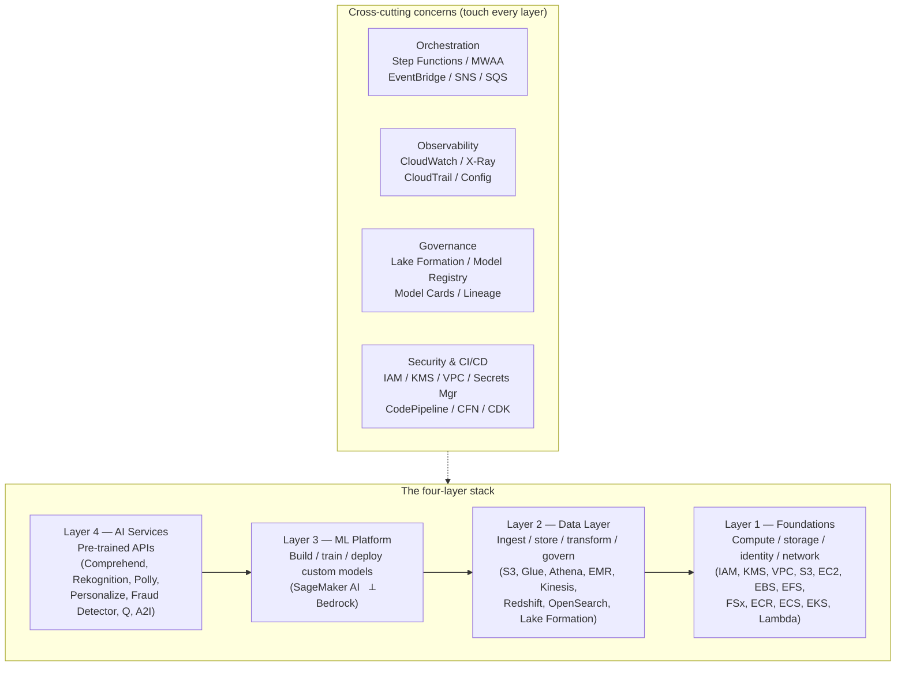
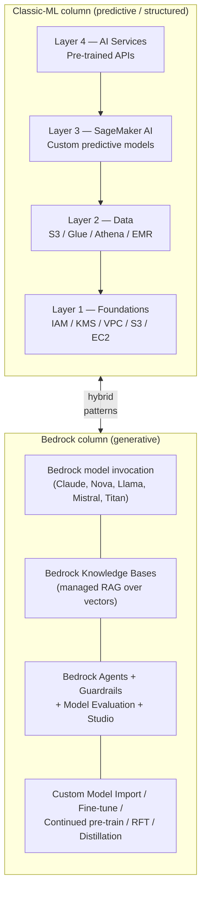
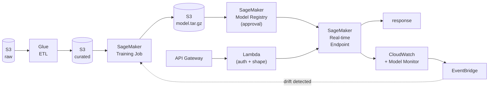
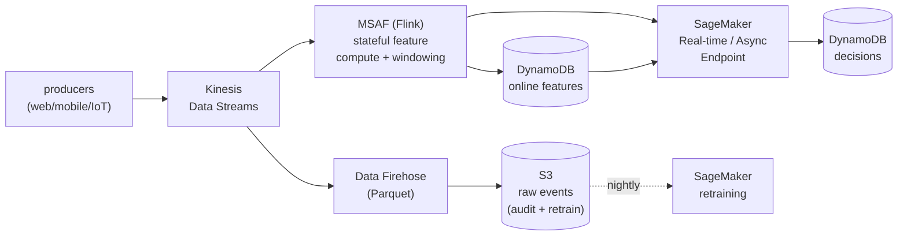
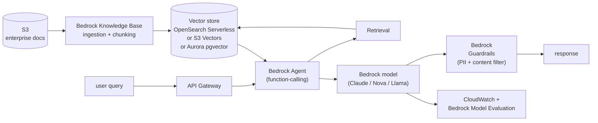
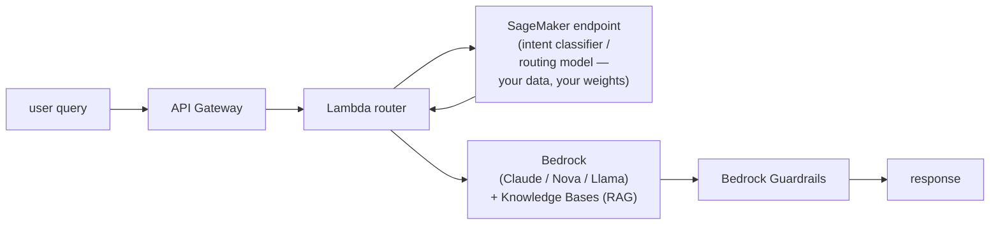

# Chapter 3 — The AWS ML Stack: A 30,000 ft Map

> **Goal of this chapter.** Before we open the SageMaker console, before we read a single IAM policy, before we touch a Bedrock model card — we need a *map*. AWS publishes more than two hundred services; the MLA-C01 Exam Guide names roughly one hundred of them as in-scope. The only way to keep that surface area tractable is to organise it into *layers*, and the only way to keep your wits about you in the exam is to know, on demand, which layer a given service lives in and which other services it touches. This chapter draws the map at 30,000 feet. Every later chapter zooms in on one tile of it.

---

## 3.1 Why a "stack" view is the only mental model that scales

When AWS markets ML, it draws a three-layer cake. When AWS architects design ML, they draw something messier — a four-layer pyramid with four horizontal stripes cut across it and a separate column bolted to the side. Both pictures are correct; they answer different questions. The marketing picture answers *"what does AWS sell?"*. The architecture picture answers *"what does a production ML platform actually look like?"*. The MLA-C01 exam tests the second picture in the language of the first.

Memorising a flat list of services is futile. A flat list of one hundred services produces, in the moment of answering an exam question, a kind of vertigo — *"Polly does text-to-speech, Transcribe does speech-to-text, is the right answer here Polly, or Lex, or maybe Connect?"* The vertigo evaporates the moment you organise services by layer, because each layer answers a different *kind* of business need. AI Services convert business problems to API calls. The ML Platform converts business problems to custom models. The Data layer feeds both. The Foundations layer makes any of it possible. The cross-cuts (observability, orchestration, governance, security) bind the layers together into something operable.

This chapter is the one chapter in this book that stays at the cross-cutting "all layers, all phases" view. From Chapter 4 onward, every chapter zooms into one layer or one service. If you ever lose the plot mid-book — "wait, where does Glue fit again?" — come back here.

---

## 3.2 The official three-layer framing, and why it leaks

If you go to <https://aws.amazon.com/machine-learning/> today, AWS sells its ML portfolio as three stacked tiers. The framing has been remarkably stable for years; you will see it in re:Invent keynotes, AWS Cloud Adoption Framework slides, every "intro to AWS ML" deck on the internet, and most of the re:Post answers about service selection. Here is the canonical chart, lightly cleaned up:

| AWS marketing tier        | Audience              | Representative services                                                                                       |
| ------------------------- | --------------------- | ------------------------------------------------------------------------------------------------------------- |
| **AI Services**           | App developers        | Rekognition, Comprehend, Transcribe, Translate, Polly, Textract, Personalize, Kendra, Lex, Fraud Detector     |
| **ML Services / Platform**| Data scientists, MLEs | Amazon SageMaker AI (Studio, Training, Pipelines, Endpoints, Feature Store, Model Registry, JumpStart, etc.)  |
| **ML Frameworks & Infra** | ML platform engineers | EC2 P5/Trn2/Inf2, Deep Learning AMIs, Deep Learning Containers, EKS, ECS, Neuron SDK, ParallelCluster, HyperPod|

The framing is not wrong. It captures, accurately, the *abstraction-level* gradient AWS sells: the higher you climb, the less ML expertise you need; the lower you drop, the more control you have. If a marketing team needs sentiment analysis tomorrow morning, AI Services. If a research team needs to pre-train a foundation model on a thousand GPUs, ML Infra. If you are somewhere in between, the ML Platform.

But the three-layer chart leaks in production in four specific places, and the leaks are exactly the places the MLA-C01 exam tests hardest:

1. **It collapses Foundations into "Infrastructure"**, lumping S3, IAM, KMS, VPC, and EC2 together with Trn2 instances and Deep Learning AMIs. For an ML *engineer*, foundations are a distinct layer with its own concerns (encryption, network isolation, identity) that pre-date the ML stack and that show up in roughly a quarter of exam questions.
2. **It ignores the Data Layer entirely.** Glue, Athena, EMR, Lake Formation, Kinesis — these are catalogued under "Analytics" on the AWS console, not under "Machine Learning". The marketing chart silently inherits that taxonomy. But Domain 1 of the MLA-C01 exam (Data Preparation) is 28% of the exam, and it lives almost entirely in services AWS doesn't show on its ML landing page.
3. **It treats Bedrock as if it fits into the three layers.** Bedrock doesn't. It is API-driven like AI Services, but exposes general-purpose foundation models; its customisation surface (fine-tune, distillation, reinforcement fine-tuning) crosses into ML Platform territory; its provisioned-throughput pricing crosses into Infra territory. AWS effectively bolted a fourth *column* onto the side of the chart in 2023 and has been growing it ever since.
4. **It omits the four cross-cutting concerns** — orchestration, observability, governance, security — that every real production architecture must address regardless of which layer the workload lives in.

So in this book we keep AWS's three-layer chart as a *teaching aid* — the abstraction-level gradient is real and useful — but we work from a more honest picture: **four vertical layers, four horizontal cross-cuts, and Bedrock as a parallel column**.

> **Teaching takeaway.** Use the three-layer chart when you need to *explain AWS ML to a non-AWS audience*. Use the four-layer + cross-cuts + Bedrock picture when you need to *answer an exam question* or *design a production system*. The first is a sales tool. The second is an engineering tool.

---

## 3.3 The reality: a four-layer pyramid with four cross-cuts

Here is the model we will use for the rest of this book and the rest of your MLA-C01 prep:



Read the pyramid bottom-up. Every ML workload on AWS rests on Foundations. Above that, almost every workload reaches into the Data Layer to ingest, store, or transform something. The ML Platform — SageMaker AI and Bedrock side by side — is where custom model work happens; AI Services sit on top for the cases where someone else has already trained the model you need.

Now read the cross-cuts horizontally. None of them is "an ML layer". Orchestration, observability, governance, and security run *across* every layer. A Glue job (Data Layer) is orchestrated by Step Functions, observed by CloudWatch, governed by Lake Formation, secured by IAM and KMS — and the SageMaker endpoint (ML Platform) it feeds is orchestrated by Pipelines, observed by Model Monitor + CloudWatch, governed by Model Registry, secured by the same IAM/KMS scaffolding plus VPC isolation. The cross-cuts are how a *list* of services becomes a *system*.

This four-plus-four model is what production AWS ML architectures look like in 2026. Every customer story in §3.10 — Capital One, Toyota, Zoox, Cox Automotive, Salesforce, Netflix, Pinterest, Stripe — fits inside this picture. Hold the picture in your head as we tour the layers.

---

## 3.4 Bedrock as a parallel column

Before we tour Layer 3, we need to handle the Bedrock anomaly explicitly, because if you carry the three-layer chart in your head you will keep asking "is Bedrock an AI Service or an ML Service?" — and the answer is "neither, it's both, it's a separate column."

Here is the visual that explains it:



Why does Bedrock get its own column? Because it does things the three-layer chart can't classify:

- **It looks like Layer 4** — one API call, no model training required, ~100 foundation models behind it (Claude, Nova, Llama, Mistral, Titan, Cohere, Stability AI, Jurassic). Marketing teams who would have called Comprehend in 2022 now call Bedrock.
- **It overlaps Layer 3** — its customisation surface (Custom Model Import, fine-tuning, continued pre-training, distillation, reinforcement fine-tuning) is real ML platform work. AWS even added Bedrock-native distillation in 2026 with Nova Premier as teacher.
- **It overlaps Layer 1** — Provisioned Throughput is dedicated capacity sold by model-units per hour, the same shape as reserving EC2 capacity.
- **It has its own cross-cuts** — Bedrock Guardrails (a security/content-safety primitive that has no SageMaker equivalent), Bedrock Model Evaluation (its own observability), Application Inference Profiles for cost allocation (its own governance).

The 2023→2026 trajectory has *demoted* SageMaker, in mind-share, from "the ML platform on AWS" to "the customisation/self-hosting layer for cases where Bedrock isn't enough". For a 2026 net-new GenAI build, the default top-of-stack is Bedrock; SageMaker enters only when you need a custom non-LLM model, must self-host for compliance, or the economics flip toward distilled-model hosting (see §3.11).

We will live in this Bedrock column throughout Part J (chs 59–62). For Part E (chs 22–34), we live in the classic-ML column, with SageMaker AI as the spine. The two columns share Foundations and Data; they diverge above.

> **⚠️ Exam alert — "Bedrock or SageMaker JumpStart?"** This is one of the most common D2 / D3 trap questions. The decision rule: **do you need to pick the GPU?** If yes (you want a specific `ml.g6.xlarge`, your own scaling policy, your own VPC, your own container) → **JumpStart**. If no (serverless API, AWS chooses capacity) → **Bedrock**. Plus the model catalog: **Claude is Bedrock-exclusive**; **Qwen / Gemma are JumpStart-only**. We unpack this in ch 62.

---

## 3.5 Layer 1 — Foundations (the things every AWS workload needs)

Every ML workload sits on top of generic AWS primitives. The exam expects you to recognise when a foundation primitive is the *actual* answer to a question that *looks* ML-flavoured. The classic example: *"SageMaker Studio in a private subnet cannot reach S3 to read training data. What is the most likely cause?"* The answer is not in any /aiml/ doc page. It's **a missing S3 Gateway VPC endpoint**. This pattern shows up 2–3 times per exam.

| Service                  | Role in ML stack                                                                  | Deep-dive chapter |
| ------------------------ | --------------------------------------------------------------------------------- | ----------------- |
| **IAM**                  | Identity & policy — every SageMaker call assumes a role; `iam:PassRole` is the most-missed permission on the exam | Ch 5 |
| **AWS KMS**              | Encrypt S3 buckets, EBS volumes, SageMaker artefacts; CMK vs AWS-managed; multi-Region keys; envelope encryption | Ch 8 |
| **Amazon VPC**           | Network isolation; SageMaker Studio in VpcOnly mode; Gateway vs Interface endpoints | Ch 7 |
| **Amazon S3 + S3 Glacier**| The default data lake; training data, model artefacts, batch I/O; lifecycle tiers | Ch 6 |
| **Amazon EC2**           | Underlies every SageMaker training and inference instance; Trn1/Trn2 for training, Inf2 for inference, G5/P5 for general accelerated work | Ch 9 |
| **Amazon EBS**           | Block storage attached to training instances and notebook volumes; `VolumeKmsKeyId` is a recurring exam parameter | Ch 9 |
| **Amazon EFS**           | Shared notebook home dirs; Studio domain EFS encryption | Ch 11 |
| **Amazon FSx for Lustre**| Fastest option for large training datasets (HPC pattern); the right answer when "I/O-bound training" appears in the stem | Ch 11 |
| **Amazon ECR**           | Where SageMaker, ECS, EKS pull container images; BYOC always lands here | Ch 9, ch 25 |
| **Amazon ECS / EKS**     | Host custom inference containers outside SageMaker; the "I left SageMaker" escape hatch (see §3.11) | Ch 9, ch 42 |
| **AWS Lambda**           | Sub-second, sub-10 GB models in serverless inference; glue compute for event-driven pipelines | Ch 9, ch 42 |
| **AWS Secrets Manager**  | Stores DB creds, API keys read by training jobs at runtime; almost always the "least operational overhead" answer over Parameter Store | Ch 8 |
| **Amazon Macie**         | Detects PII in S3 — gating data before it reaches training pipelines | Ch 21 |
| **AWS Auto Scaling**     | Scales SageMaker endpoints, ECS services, Lambda concurrency | Ch 40 |

The Foundations layer is what makes everything else possible. Most of these services are not "ML services" in any meaningful sense — they predate ML on AWS by years. But the exam expects you to know them *in the ML context*: which KMS key encrypts what; which IAM role is passed to which job; which network path lets a training container reach the S3 bucket holding its data.

> **⚠️ Exam alert — "private subnet, can't reach S3"**. Memorise this pattern. SageMaker training jobs and Studio notebooks running in private subnets with no NAT cannot reach the public S3 endpoint. The fix is a **Gateway VPC endpoint for S3** (it's a route-table entry, free, just works). Interface endpoints exist for SageMaker, KMS, ECR, and dozens of other services; S3 and DynamoDB are the only two that use *gateway* endpoints. This pattern recurs 2–3 times per exam.

---

## 3.6 Layer 2 — Data Layer (ingest, store, transform, govern)

The exam treats data engineering as Domain 1, weighted at ~28% — more than any other single domain. Group the data services by the *function* they perform, not the AWS console category they live under, and the layer becomes manageable.

### 3.6.1 Ingest — streaming

- **Amazon Kinesis Data Streams (KDS)** — durable, low-latency stream; you manage shards. The On-demand Advantage mode launched November 2025 is 60% cheaper than On-demand Standard and supports up to 50 enhanced fan-out consumers.
- **Amazon Data Firehose** (rebranded February 2024 from Kinesis Data Firehose) — serverless delivery to S3, Redshift, OpenSearch; built-in conversion to Parquet; Apache Iceberg destination as of 2024.
- **Amazon Managed Service for Apache Flink (MSAF)** — rebranded 2023 from Kinesis Data Analytics. Stateful stream processing with SQL or Flink Java/Python. The right answer when "windowing", "stateful enrichment", or "async I/O fan-out" appears in the stem.
- **Amazon Kinesis Video Streams (KVS)** — frames for Rekognition Video, edge use cases.
- **Amazon MSK** — managed Kafka, for shops with existing Kafka skills or cross-system integrations Kinesis can't reach.

### 3.6.2 Ingest — batch / transfer

- **AWS DataSync** — agent-based, fast move from on-prem NFS/SMB to S3/EFS/FSx.
- **AWS Storage Gateway** — hybrid file/volume/tape gateway.
- **AWS Direct Connect** — dedicated private link for bulk transfer.

### 3.6.3 Store

- **Amazon S3** — the canonical lake; tiers S3 Standard → IA → Glacier Instant → Glacier Flexible Retrieval → Glacier Deep Archive. **S3 Tables** (GA December 2024) is a purpose-built bucket type for Apache Iceberg with auto-compaction. **S3 Vectors** (GA December 2025) is the lowest-cost vector storage for Bedrock Knowledge Bases.
- **Amazon Redshift** — columnar DW, source of truth for many ML feature jobs.
- **Amazon OpenSearch Service** — vector search (k-NN plugin), retrieval for RAG, neural search via AI/ML connectors to SageMaker/Bedrock.
- **Amazon RDS / Aurora / DocumentDB / DynamoDB / Neptune / ElastiCache** — operational stores feeding feature pipelines. Aurora PostgreSQL + pgvector is a cheap default vector store for Bedrock KBs at small/medium scale.

### 3.6.4 Catalog & govern

- **AWS Glue Data Catalog** — the unified Hive-compatible metastore; Athena, EMR, Redshift Spectrum all read it.
- **AWS Lake Formation** — fine-grained (column, row, tag-based) access on lakes; cross-account v3 (2024+) shares to OUs via LF-TBAC; FGAC now works on Glue 5.0 Spark DataFrames (including Iceberg/Delta/Hudi).
- **AWS Glue Data Quality** — DQDL rules that fail Glue jobs on bad data.

### 3.6.5 Transform / ETL

- **AWS Glue** (Spark) — serverless ETL, the default answer for batch transforms. Glue 5.0 (January 2025) is Spark 3.5.4, 32% faster + 22% cheaper than 4.0, supports Iceberg 1.7.1, Hudi 0.15.0, Delta Lake 3.3.0. Also: Python shell, Ray jobs.
- **AWS Glue DataBrew** — no-code visual data prep; 250+ recipes.
- **Amazon EMR** — managed Spark/Hive/Presto; the right answer over Glue when you need long-running clusters, custom Spark configs, or non-Glue runtimes. Variants: EMR on EC2, EMR Serverless, EMR on EKS.
- **Amazon Athena** — serverless SQL on S3; ad-hoc EDA, feature exploration.
- **AWS Lambda** — micro-transforms (S3 PutObject → tiny clean → write).

### 3.6.6 Visualize

- **Amazon QuickSight** — dashboards; in ML context, model-monitoring dashboards and Q in QuickSight for natural-language BI.

> **⚠️ Exam alert — Glue vs EMR vs Athena**. The discriminators are stable enough to memorise:
> - "Serverless ETL, pay per DPU-hour, schema from a crawler" → **Glue**.
> - "Spark with custom JARs, custom YARN config, long-lived cluster, non-Spark runtimes (Hive/Presto)" → **EMR**.
> - "Ad-hoc SQL on S3, no infra, pay per TB scanned" → **Athena**.
> - "Need to share workflows with a data-engineering team that already has Airflow" → **MWAA** (orchestration layer; covered in §3.9).
> - "Need Iceberg with auto-compaction without managing it" → **S3 Tables** (since GA Dec 2024).

The Data Layer is also where the *lakehouse* lives. The 2025 default architecture is S3 + Iceberg + Lake Formation governing both analytics and ML training data; SageMaker Lakehouse explicitly unifies S3 Tables + Redshift under one Iceberg surface. If a question mentions "Iceberg", "lakehouse", or "unified data + AI", expect this pattern.

---

## 3.7 Layer 3 — ML Platform (build, train, deploy custom models)

This is the heart of the exam. Domains 2 and 3 combined are ~48% of the scored questions, and almost every Domain 2/3 question lives somewhere in this layer. Two services dominate, and we already saw above why they're best understood as *parallel columns* rather than a single layer.

### 3.7.1 Amazon SageMaker AI — the spine

**Amazon SageMaker AI** (renamed December 3, 2024, from "Amazon SageMaker") is the umbrella for AWS's fully-managed custom-ML platform. The surface area is large enough that we devote Chapters 22–58 to it; here is the inventory at 30,000 ft.

| Surface                                | Function                                                                              | Deep-dive chapter |
| -------------------------------------- | ------------------------------------------------------------------------------------- | ----------------- |
| **SageMaker Studio** (unified)         | Web IDE — thin router over JupyterLab, Code Editor, RStudio                            | Ch 22 |
| **SageMaker Studio Classic**           | Legacy Studio; maintenance track                                                      | Ch 22 |
| **SageMaker Unified Studio**           | 2024 single pane integrating Studio + Glue + Athena + EMR + MWAA + Bedrock            | Ch 22 |
| **SageMaker Canvas**                   | No-code AutoML UI for business analysts                                               | Ch 27 |
| **SageMaker Data Wrangler**            | Visual data prep inside Studio (300+ transforms)                                      | Ch 18 |
| **SageMaker Feature Store**            | Online + offline feature DB; point-in-time correct joins; Iceberg offline option (2024)| Ch 19 |
| **SageMaker Ground Truth / GT Plus**   | Human + ML-assisted labelling workflows                                               | Ch 20 |
| **SageMaker JumpStart**                | Pre-trained model + solution hub (FMs, vision, text)                                  | Ch 26, 62 |
| **SageMaker Training Jobs**            | Ephemeral training clusters; spot, distributed, BYO                                   | Ch 22, 32 |
| **SageMaker HyperPod**                 | Persistent multi-node clusters for FM pre-training; EKS orchestration option         | Ch 32 |
| **SageMaker Autopilot**                | AutoML for tabular: feature engineering + algorithm + HPO                             | Ch 27 |
| **SageMaker Experiments + Managed MLflow**| Track runs, metrics, params; managed MLflow tracking server (GA March 2024)        | Ch 28 |
| **SageMaker Model Registry + Model Cards**| Versioned model catalog with approval gates; structured model documentation now unified with Registry (2024 GA) | Ch 51 |
| **SageMaker Pipelines**                | Native DAG orchestration (SDK + `@step` decorator); EventBridge integration; selective execution | Ch 43 |
| **SageMaker Projects**                 | MLOps templates wired to CodePipeline / CodeBuild                                     | Ch 47 |
| **SageMaker Endpoints** (4 types)      | Real-time, Serverless, Asynchronous, Batch Transform                                  | Ch 35–38 |
| **SageMaker MME / MCE / Inference Pipelines** | Multi-Model / Multi-Container / chained-step inference                         | Ch 39 |
| **SageMaker Neo + Edge**               | Compile models for edge/SoC targets (Edge Manager deprecated April 2024; Neo + Greengrass v2 is the modern path) | Ch 41 |
| **SageMaker Clarify**                  | Bias detection + SHAP explanations; pre-train and post-deploy                         | Ch 29 |
| **SageMaker Debugger + Profiler**      | Tensor-level capture during training; system-resource profiling                       | Ch 30 |
| **SageMaker Model Monitor** (4 types)  | Data Quality / Model Quality / Bias Drift / Feature Attribution Drift                | Ch 48 |
| **SageMaker Inference Recommender**    | Benchmarks instance types/configs for a given model                                   | Ch 41 |
| **SageMaker Shadow Tests**             | Production traffic mirroring for new model versions                                   | Ch 36 |
| **SageMaker Role Manager**             | Curated execution-role personas with VPC / network-isolation toggles                  | Ch 5 |

### 3.7.2 Amazon Bedrock — the parallel column

Bedrock surfaces, summarised. We covered the architectural rationale in §3.4; here are the SKUs:

- **Model invocation API** — Claude, Nova (Micro / Lite / Pro / Premier / Canvas / Reel), Llama, Mistral, Titan, Cohere, Stability AI, Jurassic.
- **Bedrock Knowledge Bases** — managed RAG with OpenSearch / Aurora pgvector / Neptune Analytics (GraphRAG) / Pinecone / MongoDB Atlas / Redis Enterprise / **S3 Vectors** (cheapest as of Dec 2025).
- **Bedrock Agents + AgentCore** — function-calling orchestrator; AgentCore for production-grade agentic deployments.
- **Bedrock Guardrails** — content filters + PII redaction + grounding; **`ApplyGuardrail` standalone API** for filtering non-Bedrock model outputs.
- **Bedrock Model Evaluation** — automated and human eval pipelines.
- **Bedrock Studio + Flows** — gen-AI app builder UI; Flows for visual prompt chains.
- **Custom Model Import / Fine-tuning / Continued Pre-training / RFT / Distillation** — model customisation. Distillation uses Nova Premier as teacher (2026); RFT was Salesforce's headline use case at re:Invent 2025 (up to 73% accuracy improvement).
- **Provisioned Throughput** — dedicated model-units per hour for steady-state high-volume workloads.
- **Application Inference Profiles** (2025) — tag invocations for cost allocation.
- **Prompt Caching** — ~90% cheaper on cache hits.
- **Intelligent Prompt Routing** (GA 2025-2026) — managed router across Haiku / Sonnet etc. for cost/quality tradeoffs.

> **⚠️ Exam alert — SageMaker AI vs SageMaker (umbrella) vs "next-generation SageMaker"**. The December 2024 rename created three overlapping nouns. **SageMaker AI** = the ML platform formerly known as SageMaker. **Amazon SageMaker** (the umbrella, also "next-generation Amazon SageMaker") = SageMaker AI + EMR + Glue + Athena + Redshift + MWAA + Bedrock under SageMaker Unified Studio. The exam still uses both names roughly interchangeably; when in doubt, assume the question means SageMaker AI.

---

## 3.8 Layer 4 — AI Services (pre-trained, API-only)

These are the "no model training, just call the API" services. The exam asks you to pick them when the stem says "lowest operational overhead", "no ML expertise on the team", or "fastest time to production". Save SageMaker for "custom features", "compliance requires our own model", or "no AI service covers this domain".

Group by modality:

### 3.8.1 Text / NLP
- **Amazon Comprehend** — sentiment, entities, key phrases, language, PII. Note: Topic Modeling, Event Detection, and Prompt Safety classification closed to new customers April 30, 2026.
- **Amazon Comprehend Medical** — clinical entities, ICD-10, RxNorm, PHI extraction.
- **Amazon Translate** — neural MT, 75+ languages.
- **Amazon Kendra** — enterprise semantic search with 40+ connectors; predates Bedrock Knowledge Bases but still valid.

### 3.8.2 Speech
- **Amazon Transcribe** — ASR; supports custom vocab and Call Analytics.
- **Amazon Polly** — TTS; neural and long-form voices.

### 3.8.3 Vision
- **Amazon Rekognition** — image + video; faces, labels, moderation (Batch Image Content Moderation and Streaming Video Analysis closed to new customers April 30, 2026), Custom Labels.
- **Amazon Textract** — OCR + forms + tables + Queries; the right answer over Rekognition for documents.
- **Amazon Lookout for Vision** — manufacturing defect detection.

### 3.8.4 Conversational
- **Amazon Lex** — bot builder (same engine as Alexa); V2 only (V1 retired).
- **Amazon Q** family — Anthropic-powered enterprise assistant; **Q Developer** (former CodeWhisperer, rebranded), **Q Business** (enterprise search/chat), **Q in QuickSight** (natural-language BI), **Q in Connect** (contact center).

### 3.8.5 Recommendation / personalization
- **Amazon Personalize** — recsys-as-a-service (user-personalization, related-items, ranking).

### 3.8.6 Industrial / specialized
- **Amazon Lookout for Equipment** — multivariate sensor anomaly detection. **EOL October 7, 2026** — still tested but on its way out.
- **Amazon Lookout for Metrics** — KPI anomaly detection on business metrics. Closed to new customers late 2025.
- **Amazon Fraud Detector** — managed fraud-scoring with model templates. **Closed to new customers November 7, 2025**.

### 3.8.7 Code & ops
- **Amazon CodeGuru** (Reviewer / Profiler / Security) — ML-powered code review.
- **Amazon DevOps Guru** — anomaly detection on operational metrics.

### 3.8.8 Healthcare
- **AWS HealthLake** — FHIR data store with ML-extracted insights. **HealthImaging is out of scope**; **HealthOmics is out of scope**.

### 3.8.9 Human-in-the-loop / data
- **Amazon Augmented AI (A2I)** — human review workflows on AI predictions.
- **Amazon Mechanical Turk** — crowdsourced labour marketplace.

> **⚠️ Exam alert — Forecast is gone**. **Amazon Forecast was retired in July 2024**. The replacement is **SageMaker Canvas forecasting** (no-code) or SageMaker DeepAR (built-in algorithm). If you see Forecast in a 2026 answer choice, it is almost certainly a distractor. The same caution applies to **AWS DeepRacer** (out of scope, RL toy/educational), **AWS HealthImaging**, **AWS HealthOmics**, **Amazon Monitron** (Lookout for Equipment is in scope; Monitron is not), and **AWS Panorama**.

> **⚠️ Exam alert — Comprehend vs Kendra vs Bedrock Knowledge Bases**. All three sit at the "find / understand text" boundary, and the right answer depends on the verb:
> - "Detect sentiment / entities / PII in unstructured text" → **Comprehend**.
> - "Enterprise semantic search across SharePoint, Confluence, Salesforce, etc." → **Kendra**.
> - "RAG over my docs feeding a generative model" → **Bedrock Knowledge Bases** (the 2024+ default; Kendra is still valid but managed RAG is usually less operational overhead).

---

## 3.9 The four cross-cuts

The marketing chart silently omits these. Production architectures cannot.

### 3.9.1 Orchestration

- **AWS Step Functions** — serverless state machines; native SageMaker / Glue / Lambda integrations. **Distributed Map** supports up to **10,000 parallel iterations** (Standard workflows only — Express does not support it). Visual Workflow Studio is the recommended authoring UI in 2026.
- **Amazon MWAA** (Managed Airflow) — DAGs for shops with existing Airflow knowledge or cross-cloud workflows.
- **SageMaker Pipelines** — ML-native DAGs with first-class Model Registry hooks; `@step` decorator since 2023; selective execution and visual editor added 2024.
- **Amazon EventBridge** — event bus; SageMaker emits events on job state changes; **EventBridge Scheduler** (matured 2024-2025) supersedes legacy schedule rules with millions of schedules, time zones, flexible time windows, DLQs.
- **Amazon SNS / SQS** — fan-out and decoupling.
- **AWS Lambda** — glue compute for event-driven pipelines.

The real-world pattern: **Pipelines for the inner ML loop, Step Functions or MWAA for the outer "everything else" loop**. The AWS Big Data Blog explicitly endorses this composition. We cover the decision tree in ch 44.

### 3.9.2 Observability

- **Amazon CloudWatch** (Metrics / Logs / Alarms) — training metrics, endpoint latency/invocation count, custom model-quality metrics from Model Monitor. **Cross-Account Observability** GA 2024 enables central dashboards across many AWS accounts.
- **CloudWatch Logs Insights field indexes** (2024+) — declare indexed fields per log group; queries with `filter indexedField = "value"` skip non-matching events, cutting scan cost.
- **CloudWatch Live Tail** — interactive real-time log view, max 3 hr per session.
- **CloudWatch Container Insights with Enhanced Observability** (November 2024) — Prometheus-style metrics for EKS.
- **AWS X-Ray** — distributed tracing for inference pipelines on ECS/Lambda; ADOT (AWS Distro for OpenTelemetry) is now the recommended instrumentation path.
- **AWS CloudTrail** — auditing — `sagemaker:CreateTrainingJob` who/when. **CloudTrail Lake closed to new customers May 31, 2026** (existing customers continue); for new builds plan Security Lake or Athena-on-CloudTrail.
- **AWS Config** — resource config history (e.g. detect public S3 ML bucket).
- **SageMaker Model Monitor + Clarify** — covered above; Model Monitor publishes per-feature drift metrics to CloudWatch.

### 3.9.3 Governance

- **AWS Lake Formation** — fine-grained access control over Glue Data Catalog; integrates natively with Athena, SageMaker, Redshift, EMR. The 2025 re:Invent direction is "unified governance" — catalog federation, fine-grained perms, cross-account sharing all collapsing onto Lake Formation as the control plane.
- **SageMaker Model Registry** — versioned models, approval states (Approved / Pending / Rejected), wired to CI/CD. EventBridge listens for `Model Package State Change` events.
- **SageMaker Model Cards** — structured model documentation (intended use, training data, risk rating, evaluation results) — now *unified* with Model Registry (2024 GA) so cards travel with model versions.
- **SageMaker Lineage** — tracks the chain `data → processing job → training job → model → endpoint` automatically.
- **AWS CloudTrail + AWS Config** — compliance evidence for regulated industries; how Capital One's Model Risk Office actually audits releases.

### 3.9.4 Security & CI/CD

Security primitives were inventoried in Foundations (§3.5). The CI/CD scaffolding that ML platforms layer on top:

- **AWS CodePipeline / CodeBuild / CodeDeploy / CodeArtifact** — MLOps backbone. CodePipeline **V2** is the default for new pipelines (per-action-minute pricing); V2-only features include pipeline variables, git trigger filters, Queued and Parallel execution modes, conditional stages, manual-approval rollback.
- **AWS CloudFormation / AWS CDK** — IaC for reproducible ML envs.
- **AWS Service Catalog** — productise curated SageMaker Project templates.
- Plus the Bedrock-native security primitive without a SageMaker equivalent: **Bedrock Guardrails** — content filtering, PII redaction, contextual grounding for LLM outputs. Becoming a hard requirement for regulated industries.

> **⚠️ Exam alert — "least operational overhead" tells**. When an exam stem uses this phrase or "most managed service", the right answer is almost always:
> - **Secrets Manager** (not Parameter Store)
> - **NAT Gateway** (not NAT instance)
> - **EMR Serverless** (not EMR on EC2)
> - **Bedrock** (not SageMaker JumpStart)
> - **Glue Streaming** (not EMR Spark Streaming)
> - **EventBridge Scheduler** (not cron-on-Lambda)
> - **CodeDeploy predefined config** (not custom)
> - **Bedrock Knowledge Bases** (not OpenSearch + custom embedding code)

---

## 3.10 Real production stacks — Capital One, Toyota, Zoox, Cox, Stripe

The cleanest way to internalise the four-layer + cross-cuts + Bedrock picture is to see how real production architectures map onto it. A scan of re:Invent 2024–2025 talks, AWS case studies, and customer engineering blogs surfaces a small number of recurring shapes.

**Capital One** runs a bank-grade SageMaker + heavy governance overlay. The stack is SageMaker Training/Endpoints + S3 + KMS (mandatory customer-managed keys everywhere) + Lambda (endpoint orchestration) + CloudFormation (IaC mandate) + IAM. But the *ML platform itself* is only ~30% of the architecture; the other ~70% is governance scaffolding — a Model Risk Office approval gate sits between training and deployment, and every endpoint must be IaC-provisioned, KMS-encrypted, tagged, and wrapped in a Lambda for IAM-role assumption. Their internal GenAI platform is built on Bedrock with strict Guardrails; it *coexists* with traditional SageMaker fraud models rather than replacing them.

**Toyota / Toyota Connected** has bifurcated. The dealer-facing RAG agent (7,000+ interactions/month) lives on Bedrock + AgentCore. The predictive ETA models in vehicle manufacturing/logistics stay on SageMaker AI. No attempt to unify under one platform — *generative* use cases on Bedrock, *predictive/structured* use cases on SageMaker.

**Zoox** (autonomous robotaxi) uses SageMaker HyperPod almost exclusively, training foundation models on multimodal sensor data (camera, LiDAR, radar). Heavy use of distributed training primitives, not Bedrock. Essentially Layer-3 only; AI Services don't appear.

**Cox Automotive** is the opposite extreme — five production agentic AI products deployed via Bedrock AgentCore, prototype-to-production in weeks. SageMaker barely features. This is what "Bedrock as the new top layer" looks like.

**Salesforce** demonstrated, at re:Invent 2025, up to 73% accuracy improvement using Bedrock Reinforcement Fine-Tuning over base models — proving that customisation workloads that used to belong in SageMaker (custom training) now have a Bedrock-native path.

**Netflix** historically built their own ML platform on EC2 long before SageMaker existed; they use SageMaker selectively for new workloads plus Amazon Personalize for recommendations, but the spine remains an EC2-native serving fleet (100k+ instances). Their ML-optimised experimentation platform reduces experiment duration by 40% (2025 figure).

**Pinterest** recommends billions of images daily on AWS using Kafka + S3 + Spark + EMR for the data backbone — services that don't appear on the marketing chart but are essential at their scale.

**Stripe** runs foundation models on the critical path, scoring every transaction in <100 ms; lifted card-testing fraud accuracy from 59% → 97%. AWS EC2 for burst scaling (Black Friday), Lambda for serverless glue, DynamoDB for low-latency feature reads. They *built their own* foundation model rather than calling Bedrock — proving that very high-volume / low-latency use cases still justify rolling your own, even with Bedrock available.

The common shape across all of these: **two parallel ML platforms** (a "classic ML" stack on SageMaker + a "GenAI" stack on Bedrock) sharing the Data Layer and Foundations underneath, with all four cross-cuts wired in. The interesting architecture question in 2026 is no longer "which layer?" but "how do these two stacks share data, governance, and observability?"

---

## 3.11 When teams step outside SageMaker — the principled reasons

A recurring pattern in 2025 blog posts and partner write-ups: teams choosing *not* to put a given workload in SageMaker. The principled reasons:

**Cost.** SageMaker instances are typically 20–40% more expensive than the equivalent raw EC2 because of the managed-service markup. Inference is 70–80% of total ML spend for most production teams; SageMaker Real-Time Endpoints bill 24/7 regardless of QPS. The escape hatch is EKS + raw EC2 (with Karpenter / Cluster Autoscaler) for steady-state inference; teams report 30–60% cost reduction. **Caveat for the exam**: SageMaker Serverless Inference and Asynchronous Inference exist exactly to plug this hole — the "always-on cost" complaint applies to *Real-time endpoints*, not the full SageMaker surface.

**Control.** Advanced teams want hand-picked GPU SKUs, Savings Plans / RI optimisation across the whole fleet, custom NVIDIA drivers, unsupported container images. SageMaker's container contract gets in the way. HyperPod was AWS's 2024–2025 answer for the training side; the inference side still pushes power users toward EKS or raw EC2 with Triton / vLLM.

**Bedrock for fastest GenAI iteration.** Time-to-prototype on Bedrock is hours; on SageMaker JumpStart it's days; on raw EC2 it's weeks. Teams *deliberately* skip SageMaker for GenAI experimentation, then move to Bedrock Provisioned Throughput or a SageMaker-hosted distilled model only if economics dictate.

**Lambda for sporadic / bursty traffic.** Below ~10M req/month with small models (<250 MB, <1k req/s, bursty), **Lambda + ONNX / quantised model** beats SageMaker endpoints economically. Industry break-even: ~10M predictions/month to match the cheapest SageMaker instance; ~40M to break even with production-grade endpoints. Cold start penalty: ~1–2s for sklearn, ~3–5s for TF/PyTorch.

**Zombie notebooks.** A folkloric cost driver — unmonitored Studio notebooks left running idle. Many shops now have automated shutdown Lambdas + LeftoverLocals-style cost alarms. This is the operational reason platform teams sometimes ban Studio in favour of curated dev containers.

For the exam, the relevant insight is that **there are good reasons to live outside SageMaker for specific workloads**, and the exam *will* ask you to recognise them. The "right answer is always SageMaker" heuristic will cost you points.

---

## 3.12 Business problem → service decision table

The exam frequently phrases questions as a *business* problem. Memorise this table; it captures roughly 60% of the service-selection question stems you will see.

| Business problem                                       | First-pick AWS service                                  | Layer | Fallback / custom path                            |
| ------------------------------------------------------ | ------------------------------------------------------- | ----- | ------------------------------------------------- |
| Sentiment of customer reviews                          | **Comprehend**                                          | 4     | SageMaker BlazingText / Hugging Face on SM        |
| PII redaction in unstructured text                     | **Comprehend** (PII entities) + **Macie** for S3        | 4     | Custom NER on SageMaker                           |
| OCR a scanned invoice with tables                      | **Textract** (Queries / AnalyzeExpense)                 | 4     | Rekognition for raw text only; SM CV model        |
| Voice → text (call center)                             | **Transcribe** (Call Analytics)                         | 4     | SM with Whisper                                   |
| Text → speech (IVR)                                    | **Polly** (Neural / Long-form)                          | 4     | SM with custom TTS                                |
| Image moderation (UGC)                                 | **Rekognition** (Moderation API)                        | 4     | SM with custom CV                                 |
| Object/defect detection on factory line                | **Lookout for Vision**                                  | 4     | SM with custom CV (YOLO/Detectron)                |
| Real-time product recommendations                      | **Personalize**                                         | 4     | SageMaker (Factorization Machines, BPR, Deep FM)  |
| Translation for global UI                              | **Translate**                                           | 4     | Bedrock (Claude/Nova) — multilingual FM           |
| Conversational chatbot (FAQ)                           | **Lex**                                                 | 4     | Bedrock Agents for generative                     |
| Generative chatbot / summarisation                     | **Bedrock**                                             | 3*    | SM JumpStart FM hosting                           |
| Enterprise semantic search across SharePoint/Confluence| **Kendra**                                              | 4     | Bedrock Knowledge Bases                           |
| RAG over enterprise docs feeding an LLM                | **Bedrock Knowledge Bases**                             | 3*    | OpenSearch + Bedrock API; Kendra + Bedrock        |
| Fraud detection — online txns (new build)              | **SageMaker** (XGBoost) — Fraud Detector closed Nov 2025 | 3    | OpenSearch ML; custom Lambda + Random Cut Forest  |
| Predictive maintenance — sensor data                   | **Lookout for Equipment** (EOL Oct 2026)                | 4     | SM RCF / DeepAR / custom                          |
| KPI anomaly alerts (revenue dipped)                    | **Lookout for Metrics** (closed to new customers)       | 4     | CloudWatch Anomaly Detection; SM RCF              |
| Forecasting demand                                     | **SageMaker Canvas** (no-code) / **SM DeepAR**          | 3     | (Forecast retired July 2024 — distractor!)        |
| Train a custom tabular classifier                      | **SageMaker** (XGBoost / Linear Learner / Autopilot)    | 3     | EMR + Spark MLlib                                 |
| Train an LLM from scratch                              | **SageMaker HyperPod**                                  | 3     | EC2 P5 cluster + DL Containers                    |
| Anomaly detection — server logs                        | **DevOps Guru**                                         | 4     | OpenSearch ML / SM RCF                            |
| Code review automation                                 | **CodeGuru Reviewer**                                   | 4     | Custom SM model                                   |
| Human review of low-confidence predictions             | **Augmented AI (A2I)**                                  | 4     | Custom SQS-based queue                            |
| Labeling 1M images                                     | **Ground Truth** (or **GT Plus**)                       | 3     | Mechanical Turk directly                          |
| Healthcare clinical NLP                                | **Comprehend Medical**                                  | 4     | SM Hugging Face clinical BERT                     |
| FHIR data lake with ML insights                        | **HealthLake** (HealthImaging is OUT OF SCOPE)          | 4     | Glue + Comprehend Medical                         |
| Streaming feature pipeline (clickstream → model)       | **KDS → MSAF (Flink) → DynamoDB + SM endpoint**         | 2+3   | KDS → Lambda → SM endpoint (simpler)              |
| Low-latency, low-volume inference (<10M req/mo)        | **Lambda** + ONNX                                       | 1     | SageMaker Serverless                              |
| High-volume, steady-state inference                    | **SageMaker Real-Time Endpoint** (or EKS for cost)      | 3     | Bedrock Provisioned Throughput for FMs            |
| Large payload (>6 MB) or long-running (>60s) inference | **SageMaker Asynchronous Endpoint**                     | 3     | Batch Transform if no real-time needed            |

*Layer 3 entries marked with `*` denote the Bedrock parallel column.

---

## 3.13 In-scope vs out-of-scope — what NOT to study

The MLA-C01 Exam Guide explicitly excludes several services that *look* like ML but won't be tested. Skipping these saves study hours.

**Out-of-scope ML services** (do not study; if they appear in answer choices, they are almost always distractors):
- **AWS DeepRacer** — reinforcement-learning toy / educational
- **AWS HealthImaging** — DICOM imaging (HealthLake *is* in scope; HealthImaging is not)
- **AWS HealthOmics** — genomics workflows
- **Amazon Monitron** — end-to-end equipment monitoring (Lookout for Equipment *is* in scope; Monitron is not)
- **AWS Panorama** — computer-vision-at-the-edge appliance

**Adjacent out-of-scope services** worth a one-line awareness:
- **Amazon Forecast** — retired July 2024, replaced by SageMaker Canvas forecasting
- **AWS Clean Rooms / DataZone / FinSpace** — data collaboration / governance products
- **All IoT services** — Greengrass, IoT Core, etc., are out
- **Most security services that aren't IAM/KMS/Macie/Secrets Manager** — GuardDuty, Inspector, WAF, Shield, Cognito, ACM, Detective, Security Hub are all out (despite security being a domain — exam tests IAM/KMS/Macie/Secrets only)
- **Amazon SWF** — predecessor to Step Functions; out
- **AWS CodeCommit** — closed to new customers mid-2024; CodeCommit-based SageMaker Project templates retired October 28, 2024. Use GitHub / GitLab / Bitbucket via CodeStar Connections

> **Strategy.** When an answer choice contains *only* an out-of-scope service, it is almost always a distractor. The exam guide lists the haystack; the right needle is in the in-scope list.

---

## 3.14 The Well-Architected ML Lens — six pillars at the stack-architecture level

The AWS Well-Architected Framework's **Machine Learning Lens** (November 2025 revision) extends the standard 6 pillars with ML-specific best practices. The six pillars:

1. **Operational Excellence**
2. **Security**
3. **Reliability**
4. **Performance Efficiency**
5. **Cost Optimization**
6. **Sustainability**

(A separate **Generative AI Lens** covers FM-specific concerns; MLA-C01 leans on the ML Lens, not the Gen AI Lens, but the pillars are the same.)

Below, each pillar is rephrased as *"which services at which layer does this pillar push you toward?"* — this is exactly how the exam tests it.

### 3.14.1 Operational Excellence
- **Foundations:** CloudFormation / CDK for repeatable env; Service Catalog for blessed templates.
- **Data:** Glue Workflows + Step Functions for orchestration; MWAA if Airflow.
- **ML platform:** SageMaker Pipelines (CI for models); Model Registry with approval gates; SageMaker Projects.
- **AI services:** CloudWatch + EventBridge for retraining triggers; Bedrock Application Inference Profiles for tagging.

### 3.14.2 Security
- **Foundations:** IAM (least-privilege execution roles), KMS (encrypt at rest everywhere — S3, EBS, SageMaker artefacts), VPC + PrivateLink (no public internet egress from training jobs), Secrets Manager.
- **Data:** Lake Formation for column-level access; Macie to find PII before it hits the lake.
- **ML platform:** SageMaker Network Isolation mode, Inter-container traffic encryption, Studio in VPC-only mode, IAM-condition keys on `sagemaker:VpcSubnets`.
- **AI services:** Bedrock Guardrails (block PII, prompt-injection, off-topic queries).

### 3.14.3 Reliability
- **Foundations:** S3 11-nines durability for training data; multi-AZ.
- **Data:** Glue retries + Glue Data Quality to fail-fast on bad input.
- **ML platform:** SageMaker multi-AZ endpoints (auto by default), Shadow Tests, Model Monitor for drift, rollback via Model Registry version pin.
- **AI services:** SLA-backed APIs; A2I for low-confidence fallback to humans.

### 3.14.4 Performance Efficiency
- **Foundations:** Right instance family — Trn1/Trn2 for training large models, Inf2 for inference; FSx for Lustre for I/O-bound training.
- **Data:** Parquet over CSV; partitioning; Athena CTAS for pre-aggregation; Iceberg via S3 Tables.
- **ML platform:** SageMaker Inference Recommender; multi-model and multi-container endpoints to densify; SageMaker Neo to compile for target; serverless inference for spiky traffic.
- **AI services:** Right-size batch vs real-time (Rekognition async for video).

### 3.14.5 Cost Optimization
- **Foundations:** S3 Intelligent-Tiering for cold artefacts; Spot for EC2.
- **Data:** Glue auto-scaling, EMR Spot task nodes, Athena workgroup limits.
- **ML platform:** SageMaker Managed Spot Training (up to 90% savings); Savings Plans for endpoints; serverless inference for low-throughput; scale-to-zero with async endpoints; warm pools to amortise startup. **SageMaker Savings Plan and Managed Spot Training do NOT stack** — pick one per workload (common exam trap).
- **AI services:** Pay-per-call vs always-on — for low-volume workloads, AI services beat SageMaker endpoints; Bedrock Prompt Caching ~90% cheaper on hits.

### 3.14.6 Sustainability
- **Foundations:** Use Graviton/Trainium/Inferentia (purpose-built silicon = fewer joules per inference); regional choice (low-carbon regions).
- **Data:** Compress + columnar formats; lifecycle policies to Glacier.
- **ML platform:** Distillation, quantisation, pruning; right-sized training budgets (HPO with early stopping).
- **AI services:** Reusing AWS's pre-trained models avoids redundant training.

> **Mnemonic for the six pillars.** "OS-R-PCS" — Operational, Security, Reliability, Performance, Cost, Sustainability. Or AWS's own "S-CORPS" rearrangement; pick one and stick with it.

---

## 3.15 Three reference architectures

Three reference architectures appear repeatedly across the exam and in real production systems. Memorise the silhouettes; ~30% of MLA-C01 questions resolve by shape alone.

### 3.15.1 Pattern A — Batch-train, real-time-infer (classic ML)

The bread-and-butter classical pipeline. Used by Capital One for fraud, by every team training tabular models on warehouse data, by anyone whose model's accuracy doesn't degrade on the hours-to-days timescale.



Key exam tells: *"versioned model artefacts"* → Model Registry; *"approval gate before deploy"* → Model Registry approval state; *"retrain when drift detected"* → Model Monitor + EventBridge.

### 3.15.2 Pattern B — Streaming inference (fraud, IoT, clickstream)

The pattern for sub-second-latency inference where features must be computed from a real-time event stream.



Key exam tells: *"stateful enrichment"* / *"windowing"* / *"async I/O"* → **MSAF (Flink)**, not plain KDS+Lambda; *"sub-10 ms feature lookup at inference"* → **DynamoDB online feature store**; *"audit trail of every event"* → **Firehose → S3 in Parquet**.

### 3.15.3 Pattern C — Generative RAG (the 2024+ favourite)

The dominant new-build pattern for GenAI workloads since Bedrock Knowledge Bases GA'd.



Key exam tells: *"managed RAG, lowest operational overhead"* → **Bedrock Knowledge Bases** (not "build OpenSearch + custom Lambda embedding pipeline"); *"PII filter on LLM output"* → **Bedrock Guardrails** (`ApplyGuardrail` API if the model is non-Bedrock); *"cheapest vector store"* (Dec 2025+) → **S3 Vectors**; *"function-calling against my APIs"* → **Bedrock Agents** / **AgentCore**.

### 3.15.4 Bonus pattern D — Hybrid GenAI (Bedrock + SageMaker)

The single most common 2025 production pattern for new GenAI workloads: Bedrock for general reasoning + latest model access, plus a SageMaker-hosted small custom model for a proprietary or sensitive slice.



Cost lever: if you have high steady-state volume, hosting a distilled model on SageMaker with Reserved Instances or Inferentia/Trainium often saves 40–60% vs Bedrock Provisioned Throughput.

---

## 3.16 Drawing the stack from memory — the chapter exercise

If you can do this cold, every exam question becomes a routing problem.

> On a blank page, draw the 4-layer pyramid bottom-up. In each layer, write three services by heart. Add the four cross-cuts as a horizontal strip. Add the Bedrock parallel column to the right of Layer 3.

Check yourself against this answer key:

```
                Cross-cuts:  Orchestration | Observability | Governance | Security

Layer 4 (AI Services):    Comprehend, Rekognition, Personalize        |
                          (+ Polly, Translate, Textract, Lex, A2I)    |
                                                                       |
Layer 3 (ML Platform):    SageMaker AI                                 |  Bedrock
                          (Studio, Pipelines, Endpoints, Model Reg)    |  (Models, KBs,
                                                                       |   Agents, Guardrails,
                                                                       |   Custom Import, RFT)
                                                                       |
Layer 2 (Data):           S3, Glue, Athena                             |
                          (+ EMR, Kinesis/Firehose/MSAF, Redshift,     |
                          OpenSearch, Lake Formation, DataBrew)        |
                                                                       |
Layer 1 (Foundations):    IAM, VPC, KMS                                |
                          (+ S3, EC2, EBS, EFS, FSx, ECR, ECS, EKS,    |
                          Lambda, Secrets Manager, Macie)              |
```

If you can produce this from memory in under three minutes, roughly 70% of MLA-C01 questions resolve to the right *layer* before you even need deep service knowledge. From there, the in-layer decision rules (Glue vs EMR vs Athena, Real-time vs Serverless vs Async vs Batch endpoint, Bedrock vs JumpStart, etc.) handle most of the rest.

---

## 3.17 What this chapter built / where it returns

**Builds on:** Chapter 1 (what an ML Engineer does on AWS — the role's centre of gravity is in this stack), Chapter 2 (the four exam domains map onto the layers — D1 ≈ Data Layer; D2 ≈ ML Platform build side + AI Services; D3 ≈ ML Platform deploy side + Orchestration cross-cut; D4 ≈ Observability + Governance + Security cross-cuts).

**Returns:**

- **Layer 1 (Foundations)** → **Part B** (chs 5–9). IAM, S3, VPC, KMS, compute primitives.
- **Layer 2 (Data)** → **Parts C & D** (chs 10–21). Data formats, storage matrix, streaming, Glue / Athena / EMR / Lake Formation, Data Wrangler, Feature Store, labelling, bias.
- **Layer 3 (ML Platform — SageMaker side)** → **Parts E, F, G** (chs 22–42). Studio, training jobs, built-ins, BYOC, JumpStart, Autopilot, Experiments, Clarify, Debugger, HPO, distributed training, the four endpoint types.
- **Layer 4 (AI Services)** and **Layer 3 Bedrock column** → **Part J** (chs 59–62).
- **Cross-cut: Orchestration & CI/CD** → **Part H** (chs 43–47).
- **Cross-cut: Observability & Governance** → **Part H/I** (chs 48–52).
- **Cross-cut: Security** → **Part I** (chs 53–58).
- **End-to-end capstone exercising every layer** → **Part K** (chs 63–64).

---

## 3.18 Self-assessment

Run yourself through these gates before moving to the exercises. If you stumble on any, re-read the relevant section.

- Can you draw the four-layer pyramid + four cross-cuts + Bedrock parallel column from memory in under three minutes?
- Can you name three services in each of the four layers, cold?
- Can you state, in one sentence, why Bedrock doesn't fit into the canonical three-layer chart?
- Can you give the decision rule for SageMaker JumpStart vs Bedrock?
- Can you give the decision rule for Glue vs EMR vs Athena?
- Can you list three out-of-scope ML services that AWS still sells but the exam won't test?
- Can you sketch the silhouettes of Patterns A, B, and C from §3.15?
- Can you name the six Well-Architected ML Lens pillars and give one service per pillar at one layer?

---

## 3.19 Summary

Stripped down:

1. AWS markets ML as a **three-layer cake** (AI Services / SageMaker / Frameworks & Infra). The chart is a useful teaching aid and a misleading production guide.
2. Real production architectures fit a **four-layer pyramid** (Foundations / Data / ML Platform / AI Services) with **four cross-cuts** (Orchestration / Observability / Governance / Security) and **Bedrock as a parallel column** beside the SageMaker-spine Layer 3.
3. The exam tests the marketing chart's *vocabulary* (you must know what AWS calls each tier) and the production chart's *structure* (you must know which service lives where, and which cross-cut wires which behaviour).
4. **Layer 1 (Foundations)** — IAM, KMS, VPC, S3, EC2, EBS, EFS, FSx, ECR, ECS, EKS, Lambda, Secrets Manager, Macie — is the substrate; many exam questions resolve here even when they look ML-flavoured.
5. **Layer 2 (Data)** — S3, Glue, Athena, EMR, Kinesis/Firehose/MSAF/KVS, Redshift, OpenSearch, Lake Formation, DataBrew — is 28% of the exam (Domain 1) and not on the marketing chart.
6. **Layer 3 (ML Platform)** — SageMaker AI (one rename from "SageMaker" in December 2024) plus Bedrock — is the heart, 48% of the exam (Domains 2+3 combined).
7. **Layer 4 (AI Services)** — Comprehend, Translate, Transcribe, Polly, Rekognition, Textract, Personalize, Lex, Kendra, A2I, Fraud Detector, the three Lookouts, Q, Mechanical Turk — is the "API-only" tier; declining in mind-share as Bedrock cannibalises new builds, but still very testable.
8. **The four cross-cuts** — Step Functions / MWAA / EventBridge / SNS / SQS; CloudWatch / X-Ray / CloudTrail / Config; Lake Formation / Model Registry / Model Cards / Lineage; IAM / KMS / VPC / Secrets Manager + Code* CI/CD — bind the layers into a system and recur in roughly every other exam question.
9. **Bedrock** doesn't slot into the three-layer chart because it spans Layers 1 (Provisioned Throughput), 3 (Custom Model Import, RFT, distillation), and 4 (one-API-call inference). Treat it as a parallel column.
10. Three reference architectures cover ~30% of exam questions by silhouette alone: **Pattern A** (batch-train, real-time-infer classical), **Pattern B** (streaming inference with KDS→MSAF→SageMaker), **Pattern C** (generative RAG with Bedrock + KBs + Guardrails). Memorise the shapes.
11. **The six Well-Architected ML Lens pillars** (Operational / Security / Reliability / Performance / Cost / Sustainability) frame which service at which layer is the right answer; "least operational overhead" tells push you to specific named services (Secrets Manager, EMR Serverless, EventBridge Scheduler, Bedrock, Bedrock KBs, etc.).
12. **Out-of-scope ML services** (DeepRacer, HealthImaging, HealthOmics, Monitron, Panorama) are almost always distractors when they appear in answer choices.

If you remember one sentence from this chapter, make it this one: *the AWS ML stack is four layers high, four cross-cuts wide, with Bedrock as a column on the side — every exam question lives somewhere in that grid, and your first move is always to locate it.*

---

## 3.20 Exercises

Attempt all of these cold. They are intentionally architecture-level — the goal is to develop the "which layer / which service" reflex, not to test deep service knowledge.

1. **Draw the stack from memory.** On a blank page, sketch the four-layer pyramid, the four cross-cuts, and the Bedrock parallel column. In each layer, write three services. Compare against §3.16.

2. **Layer-routing drill.** For each of the following, name the AWS service you would reach for first *and* the layer it lives in:
   1. Real-time sentiment of incoming product reviews; team has no ML expertise.
   2. OCR a backlog of 5M scanned invoices with line-item tables; need structured JSON output.
   3. Recommend the top-10 products for each of 50M users, refreshed hourly; no ML expertise on the team.
   4. Forecast next-quarter demand for 10,000 SKUs; the data team has a Databricks Spark background but no ML platform yet.
   5. Build a chatbot that answers questions from a 500-page internal HR policy doc.
   6. Detect anomalies in vibration data from 200 industrial pumps.
   7. Sub-10ms fraud scoring on every credit-card transaction (10k QPS).
   8. Translate the company's marketing site into 30 languages.
   9. Train a custom defect-detection vision model on 50,000 labelled factory images.
   10. Score 1M tabular records nightly with an XGBoost model that already lives in S3.

3. **The streaming-inference architecture.** Sketch the silhouette of Pattern B from §3.15.2 from memory. Then answer: at which step would you place a feature store, and why? At which step would you place a Bedrock Guardrail, if you placed one at all, and why?

4. **The "Bedrock or SageMaker?" decision.** For each of the following workloads, decide whether the right top-of-stack is **Bedrock**, **SageMaker JumpStart**, or **SageMaker (custom training)**, and justify in one sentence:
   1. Summarise customer-support tickets into one-line snippets using Claude.
   2. Train a 7B-parameter model on your own proprietary legal corpus from scratch.
   3. Fine-tune Llama-3-8B on your enterprise's customer-success transcripts, then serve via a real-time endpoint with a specific `ml.g6.2xlarge` instance type.
   4. Run an enterprise RAG system over Confluence + SharePoint + Salesforce.
   5. Build a custom regression model that predicts shipping ETAs from 200 tabular features.
   6. Deploy Stable Diffusion 3.5 with a specific NVIDIA driver version inside a custom container.

5. **In-scope or distractor?** For each of the following service names, decide whether they're **in-scope** for MLA-C01 (you should study them), **out-of-scope** (almost certainly a distractor when seen in an answer choice), or **deprecated / closed to new customers** (testable on the current exam but on its way out):
   1. AWS DeepRacer
   2. Amazon Forecast
   3. AWS HealthLake
   4. AWS HealthImaging
   5. Amazon Lookout for Equipment
   6. Amazon Fraud Detector
   7. AWS Panorama
   8. Amazon Monitron
   9. Amazon SageMaker Edge Manager
   10. AWS CodeCommit

6. **The Well-Architected pillar mapping.** Pick any one production architecture from §3.10 (Capital One, Toyota, Zoox, Cox, Stripe). For each of the six ML Lens pillars, name one service in that architecture that supports it. Bonus: name one architectural decision in that stack that *trades off* one pillar against another.

<details>
<summary>Sketch answers</summary>

1. Self-checking against §3.16 — three services per layer is the minimum bar; if you can name five per layer, you're ahead of the curve.

2. (i) **Comprehend** (Layer 4). (ii) **Textract** (Layer 4) — Queries / AnalyzeExpense for line items. (iii) **Personalize** (Layer 4). (iv) **SageMaker Canvas** (Layer 3) for no-code forecasting, or **SageMaker DeepAR** built-in if the team can drive the SDK. Forecast is retired (July 2024). (v) **Bedrock Knowledge Bases** (Layer 3, Bedrock column) — managed RAG, lowest operational overhead. Kendra is the older managed-search alternative. (vi) **Amazon Lookout for Equipment** (Layer 4) — note EOL Oct 2026. Fallback: SageMaker RCF or DeepAR. (vii) **SageMaker Real-Time Endpoint** (Layer 3) with **DynamoDB** online features fed by **MSAF** (Layer 2). Fraud Detector is closed to new customers (Nov 2025). (viii) **Amazon Translate** (Layer 4); Bedrock with Claude/Nova is a valid alternative for higher-quality MT at higher cost. (ix) **Amazon Lookout for Vision** (Layer 4) for the managed path, or **SageMaker** (Layer 3) with a custom CV model if you need control. (x) **SageMaker Batch Transform** (Layer 3) — the right answer over a Real-Time Endpoint when there's no synchronous-request requirement.

3. Feature store sits beside the SageMaker endpoint, typically on **DynamoDB** (online) with **MSAF** (Flink) updating it; the endpoint reads features by primary key at inference time. Bedrock Guardrails would *not* appear in this architecture — Guardrails is a generative-output filter, and Pattern B is classical-ML inference, not LLM generation. If the pattern were rewritten to call a Bedrock model instead of a SageMaker endpoint (e.g., generative fraud-reasoning), Guardrails would go between the Bedrock model and the response handler.

4. (i) **Bedrock** — managed serverless inference on Claude; no need to pick a GPU. (ii) **SageMaker HyperPod** — pre-training a 7B model from scratch needs persistent multi-node GPU clusters; HyperPod is the only path. (iii) **SageMaker JumpStart** — the "specific instance type" requirement is the tell; Bedrock doesn't let you pick GPU SKUs. (iv) **Bedrock Knowledge Bases** — managed RAG; Bedrock column. (v) **SageMaker (custom training)** — tabular regression on proprietary features is the canonical SageMaker XGBoost / Autopilot use case; Bedrock has no path here. (vi) **SageMaker JumpStart** with BYOC — custom container + specific driver version rules out Bedrock; JumpStart's instance choice + BYOC support is what you need.

5. (i) DeepRacer = **out-of-scope**. (ii) Forecast = **deprecated** (retired July 2024 — usually appears as distractor; if it appears in a stem, the right answer is SageMaker Canvas / DeepAR). (iii) HealthLake = **in-scope**. (iv) HealthImaging = **out-of-scope**. (v) Lookout for Equipment = **deprecated** (EOL Oct 2026 — testable but transitioning). (vi) Fraud Detector = **deprecated** (closed to new customers Nov 2025 — testable but transitioning). (vii) Panorama = **out-of-scope**. (viii) Monitron = **out-of-scope**. (ix) Edge Manager = **deprecated** (April 2024; Neo + Greengrass v2 is the modern path; may still be tested). (x) CodeCommit = **deprecated** (closed to new customers mid-2024; SageMaker Project templates for CodeCommit retired October 28, 2024; use GitHub/GitLab/Bitbucket via CodeStar Connections).

6. Sample (Capital One): **Operational Excellence** = CloudFormation (IaC mandate). **Security** = KMS (CMK on every artefact) + IAM (least-priv exec roles). **Reliability** = Multi-AZ SageMaker endpoints; Model Registry version pinning for rollback. **Performance Efficiency** = right-sized SageMaker instances per fraud model. **Cost Optimization** = (less prominent; Capital One trades cost for governance — see below). **Sustainability** = (also less prominent in regulated finance). Tradeoff: the governance scaffolding (Model Risk Office approval, custom-managed KMS keys everywhere, Lambda-wrapped endpoints for IAM role assumption) imposes meaningful **cost** and **operational** overhead in exchange for **security** and **reliability** (auditability, blast-radius containment). This is the canonical "regulated finance" trade — *most* shops can run cheaper and faster by accepting more risk.

</details>
