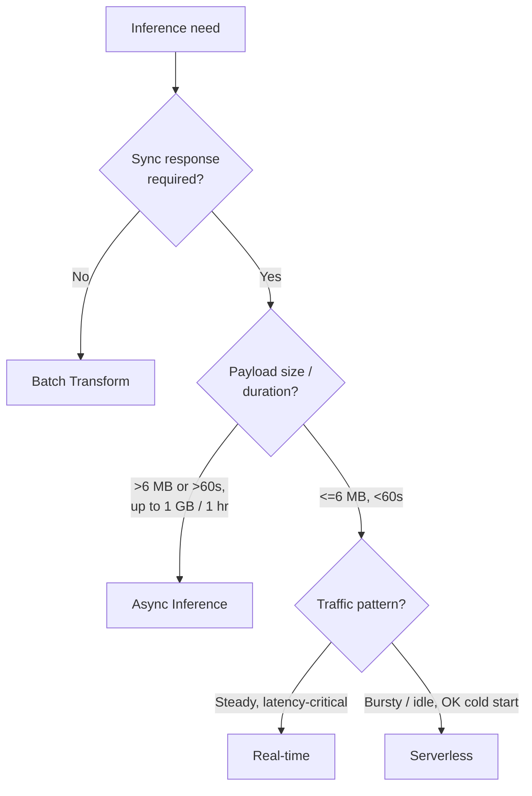

# Chapter 4 — SageMaker as the Spine: Anatomy in One Chapter

> **Goal of this chapter:** to give you the full map of SageMaker AI — every surface that's in scope for MLA-C01, grouped by the four-bucket ML lifecycle, with each surface pointed at the deep-dive chapter where it's covered later. SageMaker is not "a product"; it's an umbrella over roughly fifty distinct capabilities, and exam questions live inside *one* of those capabilities at a time. If you can hold the whole map in your head, you can usually narrow a hard question to one or two surfaces before you even read the answer choices. By the end of this chapter, you should be able to draw the SageMaker AI capability map from memory in under ninety seconds.
>
> We are doing map-first, depth-second. Every later Topic 14 chapter (Ch 18 through Ch 53) is a deep dive into one of the surfaces named here. Don't try to *learn* each surface from this chapter — that's what the deep-dive chapters are for. Try to learn the *shape*: which bucket each surface lives in, what it competes with, when it's the right answer, when it's the wrong one, and where the production traps are.

---

## 4.1 The motivating problem — "what is SageMaker, exactly?"

You ask a colleague what SageMaker is. You'll get back something like "AWS's ML platform" or "AWS's managed Jupyter" or "the thing you train models on." All of those are wrong in the sense that they're radically incomplete. SageMaker today (early 2026) is an umbrella over roughly fifty distinct capabilities: three different IDEs plus a no-code shell plus a legacy single-VM IDE; a foundation-model hub; a labeling service with two modes plus a runtime review primitive; a feature repository with online and offline stores; managed experiment tracking; a training-jobs API with three flavors plus a hyperparameter tuner with four strategies, Spot training, warm pools, a persistent FM-training cluster, two distributed-training libraries, an AutoML product, and two diagnostics; four endpoint shapes plus three multiplexing strategies plus three optimization surfaces plus auto-scaling plus four deployment strategies plus shadow variants; four drift-monitor types, a three-mode interpretability product, a Model Registry with approval workflows, Model Cards, Lineage Tracking, an orchestrator, an MLOps template library, and a persona-based IAM helper.

That's ~49 distinct in-scope surfaces under SageMaker AI alone, before you count the seven adjacent surfaces under the new SageMaker umbrella (Lakehouse, Data Processing, Catalog, SQL Analytics, Unified Studio, Bedrock — see §4.3) and before the supporting AWS services (S3, ECR, CloudWatch, EventBridge, Step Functions, IAM/KMS, VPC, EFS/FSx, DynamoDB) that everything sits on.

If you try to learn SageMaker as a flat list, you will drown. If you bucket it by ML lifecycle phase — **Build, Train, Deploy, Monitor & Govern** — every surface drops into exactly one bucket, and most exam questions become "which surface in this bucket?" rather than "what even is the right kind of thing?" That's the entire job of this chapter.

---

## 4.2 The mental model — four buckets along the ML lifecycle

The cleanest way to memorize SageMaker AI is to bucket every surface by **ML lifecycle phase**. Each bucket has 8–13 surfaces; almost every MLA-C01 question lives inside one phase, and the question shape tells you which.

| Bucket | What you're doing | Surfaces (count) | Question shape |
|---|---|---|---|
| **Build** | Workspace, data, labels, features, experiments | 11 | "How do I get the data ready?" / "Where do I write the notebook?" |
| **Train** | Compute, tuning, AutoML, distributed, debugging | 13 | "How do I run / scale / cheapen the training?" |
| **Deploy** | Endpoints, multiplexing, optimization | 12 | "How do I serve this?" / "Which endpoint type?" |
| **Monitor & Govern** | Quality, fairness, lineage, MLOps orchestration | 8 | "How do I know it's still working?" / "How does this get to prod safely?" |

This is the spine. Internalize the four labels — Build, Train, Deploy, Monitor & Govern — and then the surfaces under each.

The lifecycle is mostly linear (Build → Train → Deploy → Monitor & Govern), with a feedback edge from Monitor back to Train when drift triggers a retrain. The Monitor & Govern bucket also contains the *orchestrator* (Pipelines) that wires the other three buckets into automated workflows — so in production, Monitor & Govern is less the "fourth step" and more the "control plane over the other three."

---

## 4.3 The 2024 rebrand — why "SageMaker AI" exists

Before any anatomy, ground the terminology. **On December 03, 2024, at re:Invent, AWS renamed "Amazon SageMaker" to "Amazon SageMaker AI"** and re-pointed the parent name "Amazon SageMaker" at a *new umbrella* that bundles ML capabilities with analytics under a single brand.

What the new umbrella **Amazon SageMaker** now contains:

| Umbrella component | What it is | Exam relevance |
|---|---|---|
| **Amazon SageMaker AI** (formerly Amazon SageMaker) | All the ML lifecycle capabilities — training, hosting, MLOps, FM hub, governance. **This is what MLA-C01 tests.** | 100% in scope |
| **Amazon SageMaker Lakehouse** | Unified access across S3 lakes + Redshift + federated sources | Lightly tested (data ingestion) |
| **Amazon SageMaker Data Processing** | Athena + EMR + Glue, surfaced through the unified console | Tested under Domain 1 |
| **Amazon SageMaker Data & AI Governance** | SageMaker Catalog, built on DataZone | Lightly tested (governance only) |
| **Amazon SageMaker SQL Analytics** | Redshift Serverless integration | Out of scope for MLA-C01 |
| **Amazon SageMaker Unified Studio** | New web IDE that opens *all* the above plus SageMaker AI + Bedrock IDE | Mentioned but not heavily tested |
| **Amazon Bedrock** | Managed FM API | Tested in Domain 2/3 (see Ch 60-62) |

**What changed semantically vs functionally:**

- **Semantic change:** ML is now *one capability* under a broader data-to-AI brand. The parent name "SageMaker" no longer implies "ML platform" — it implies "the AWS data-and-AI suite."
- **Functional change for the exam:** Effectively zero. All `sagemaker:*` IAM actions, the `AmazonSageMaker*` managed policies, the `AWS::SageMaker::*` CloudFormation resources, the API endpoints, and the service-linked roles all keep their original names. When the exam says "SageMaker," it overwhelmingly means SageMaker AI.

There are now **three "Studios" alive in the wild** simultaneously, which is the single biggest source of community confusion in 2025–2026:

| Studio | What it is | When you land in it |
|---|---|---|
| **Studio Classic** | The original JupyterServer-style Studio launched 2019 | Existing legacy domains; AWS keeps it for backward compatibility but pushes migration |
| **Studio (the "new" Studio, 2023)** | Re-architected on Code-OSS; JupyterLab 3+, RStudio, Code Editor (VS Code), Canvas tile | This is what you get inside **SageMaker AI** today |
| **Unified Studio** | The 2024 umbrella IDE spanning data engineering, SQL analytics, GenAI app dev, *and* ML | New 2025+ domains, especially when projects start from a Lakehouse / catalog |

> ⚠️ **Exam alert — terminology.** If a 2025+ question contrasts **SageMaker Unified Studio** with **SageMaker AI Studio**, remember: Unified Studio is the *new* multi-domain IDE wrapping analytics + AI; SageMaker AI Studio (the unified Studio renamed in 2023) is the ML-only IDE. The MLA-C01 question pool largely uses "SageMaker Studio" to mean the ML IDE — i.e., Studio inside SageMaker AI, not Unified Studio. If a question doesn't explicitly say "Unified," assume it means the ML IDE.

The MLA-C01 exam guide (v1.0) was written against the pre-rebrand terminology, so when the official guide says "Amazon SageMaker Studio," it means **Studio (the new one) inside SageMaker AI**, not Unified Studio. Don't overthink it.

---

## 4.4 The Big SageMaker Spine — one diagram you must memorize

Here it is. Bucket by bucket, with the supporting AWS services wired in. If you can sketch this on a whiteboard in ninety seconds, you have the spine — every later chapter just adds depth to one node.

```mermaid
flowchart LR
  subgraph Build["BUILD - workspace, data, labels, features"]
    direction TB
    B1[Studio - JupyterLab]
    B2[Studio - Code Editor]
    B3[Studio - RStudio]
    B4[Notebook Instances - legacy]
    B5[Canvas - no-code]
    B6[JumpStart - FM hub]
    B7[Data Wrangler - in Canvas]
    B8[Ground Truth + GT Plus]
    B9[Feature Store - online + offline]
    B10[Managed MLflow]
    B11[Processing Jobs]
  end

  subgraph Train["TRAIN - compute, tuning, AutoML"]
    direction TB
    T1[Training Jobs - script / BYOC / built-ins]
    T2[Automatic Model Tuning - AMT]
    T3[Managed Spot Training]
    T4[Managed Warm Pools]
    T5[HyperPod - Slurm or EKS]
    T6[SMDDP - data parallel]
    T7[SMP v2 - model parallel]
    T8[Training Compiler - legacy]
    T9[Autopilot - AutoML]
    T10[Experiments - legacy]
    T11[Debugger]
    T12[Profiler]
    T13[Hugging Face Estimator]
  end

  subgraph Deploy["DEPLOY - endpoints, optimization"]
    direction TB
    D1[Real-time endpoints]
    D2[Serverless inference]
    D3[Async inference]
    D4[Batch transform]
    D5[Multi-Model Endpoints - MME]
    D6[Multi-Container Endpoints - MCE]
    D7[Inference Pipelines]
    D8[SageMaker Neo]
    D9[Inference Recommender]
    D10[Endpoint auto-scaling]
    D11[Shadow variants]
    D12[Deployment guardrails - BG / canary / linear]
  end

  subgraph Govern["MONITOR and GOVERN - quality, fairness, lineage, MLOps"]
    direction TB
    G1[Model Monitor - 4 types]
    G2[Clarify - bias + explainability]
    G3[Model Registry]
    G4[Model Cards]
    G5[Lineage Tracking]
    G6[Pipelines - orchestrator]
    G7[Projects - MLOps templates]
    G8[Role Manager]
  end

  Build --> Train --> Deploy --> Govern
  Govern -.retrain on drift.-> Train

  subgraph AWS["Supporting AWS services"]
    S3[(Amazon S3)]
    ECR[(Amazon ECR)]
    CW[(CloudWatch)]
    EB[(EventBridge)]
    SF[(Step Functions)]
    IAM[(IAM + KMS)]
    VPC[(VPC + PrivateLink)]
    EFS[(EFS / FSx)]
    DDB[(DynamoDB)]
  end

  Build --- S3
  Build --- EFS
  Train --- S3
  Train --- ECR
  Train --- CW
  Deploy --- ECR
  Deploy --- CW
  Deploy --- VPC
  Govern --- EB
  Govern --- SF
  Govern --- IAM
  Build --- DDB
```



Four things to notice about the diagram:

1. **The buckets are not equal exam weight.** Build is the largest by surface count but the lightest in exam questions; Deploy is the densest. Deploy + Govern together carry close to half the exam.
2. **The dotted feedback edge from Govern back to Train is the entire MLOps loop.** Model Monitor detects drift → EventBridge fires → Pipelines re-runs training → Registry gets a new candidate → approval gates → deploy. Every "drift retrain" question is testing your ability to trace this edge.
3. **Supporting services are not optional.** S3 is in every bucket. ECR backs every container. CloudWatch is the metrics + logs substrate. IAM gates every API call. The exam tests these *integrations*, not the SageMaker surface in isolation.
4. **Some surfaces span buckets.** Clarify spans Build (pre-training bias) and Govern (bias-drift monitoring). Processing Jobs span Build, Train, and Govern. MLflow spans Build and Govern. Don't fight this.

The rest of this chapter walks each bucket and tags every surface to its deep-dive chapter.

---

## 4.5 BUILD bucket — workspaces, data, labels, features (11 surfaces)

The Build bucket is everything that happens *before* a `CreateTrainingJob` API call: choosing an IDE, ingesting and labeling data, engineering features, prototyping with foundation models, tracking experiments.

### 4.5.1 The workspace surfaces (5)

| Surface | What it is | When to pick | Topic 14 chapter |
|---|---|---|---|
| **Studio (unified)** — JupyterLab app | Modern web IDE; long-running JupyterLab in a Space backed by EFS | Default choice for data scientists since Nov 2023 | **Ch 22** |
| **Studio (unified)** — Code Editor app | Code-OSS (open-source VS Code); same Space/EFS model | MLOps engineers, Git workflows, terminal-heavy users | Ch 22 |
| **Studio (unified)** — RStudio app | RStudio Server Pro for R-only teams; license required | R shops (pharma, biostat) | Ch 22 |
| **Studio Classic** | Legacy single-tab UI; embedded in unified Studio as a Classic app | Only when you need Projects templates, legacy Autopilot UI, Experiments Classic | Ch 22 |
| **Notebook Instances** | Single-tenant EC2 with Jupyter; the 2017-era predecessor | New work: avoid. Exam uses it as a distractor | Ch 22 |
| **Canvas** | No-code chat + drag-drop ML, wraps Autopilot + Data Wrangler + JumpStart | Business analysts; PoCs without code | Ch 22, **Ch 27**, **Ch 18** |

Why so many? AWS layered new IDEs over time but kept the older ones GA for migration. Memorize that the *current default* is Studio (unified) JupyterLab; the *current no-code default* is Canvas.

> ⚠️ **Exam alert — workspace facts to memorize cold:**
> - **Notebook Instance LCC timeout = 5 min; Studio LCC timeout = 15 min.** Classic trick question.
> - **Domain authentication mode (IAM vs IAM Identity Center) is immutable** — pick once.
> - **Notebook Instances LCC has `OnCreate` and `OnStart`; Studio LCC has only `OnStart`.**
> - **One domain per region per account** by default (soft quota).
> - Files in `/home/sagemaker-user` persist (EFS); files in `/tmp` do not.

### 4.5.2 The FM hub — JumpStart (1)

**JumpStart** is the in-Studio model + solution catalog: hundreds of foundation models (Llama 3.1, Mistral, Mixtral, Falcon, Stable Diffusion XL/3, FLAN-T5, BLOOM), pretrained vision/NLP models, and end-to-end CloudFormation solution templates. The deploy path (`JumpStartModel(...).deploy()`) hosts on *your* account's endpoint; the fine-tune path (`JumpStartEstimator(...).fit(...)`) uses LoRA/QLoRA by default for LLMs. The 2024 **private hub** lets admins curate an approved model list per org — used in regulated industries.

**JumpStart vs Bedrock:** JumpStart is self-hosted in your VPC; Bedrock is a serverless API call against AWS-shared infra. Most enterprises use **both** — Bedrock for the 80% of GenAI features that just need a frontier model behind an API, JumpStart for the 20% where they need custom-trained or VPC-isolated hosting.

→ **Ch 26 (JumpStart)** + **Ch 60/62 (Bedrock comparison)**.

### 4.5.3 Data labeling — Ground Truth, Ground Truth Plus, A2I (3 surfaces, 1 row)

| Surface | Mode | Who manages workforce | When to pick | Topic 14 chapter |
|---|---|---|---|---|
| **Ground Truth** | Self-service | You (MTurk / private / vendor workforce via Cognito) | Iterative ML with active feedback; per-object pricing | **Ch 20** |
| **Ground Truth Plus** | Managed white-glove | AWS handles labelers, training, QA | One-shot large datasets; fixed-price quote | Ch 20 |
| **Amazon A2I** | Inference-time human review | Same workforce model | Low-confidence Rekognition/Textract reviews (runtime, not training) | Ch 20 |

**Active learning** (auto-labeling) kicks in around ≥1,250 labeled examples; saves 30–70% of human labels. Built-in task types: image classification, bounding box, semantic segmentation, text classification, NER, video frame/track, 3D point cloud.

Production reality (see §4.10): most enterprises with serious labeling needs end up at **Scale AI / Snorkel / Labelbox / Surge AI** for workforce + tooling quality. Ground Truth Plus (AWS-managed workforce) is the part that's actually used at scale; raw Ground Truth is mostly a demo surface.

### 4.5.4 Feature engineering — Data Wrangler (1)

A visual + chat-based no-code data prep tool, now living inside **Canvas** (since 2024). 300+ built-in transforms (one-hot encoding, TF-IDF, imputation, target leakage detection). Sources: S3, Athena, Redshift, Snowflake, Databricks, EMR. Export targets: S3 Parquet, Feature Store, Pipelines, PySpark code, notebook.

→ **Ch 18 (Data Wrangler)**.

Production reality: Data Wrangler was heavily marketed at re:Invent 2020 and is now replaced in workflow guidance by Glue / EMR / Athena combined with SageMaker Processing for anything serious. Still good for *exploration*; rarely the production answer.

### 4.5.5 Feature repository — Feature Store (1)

Purpose-built feature repo with two backing stores. **Online**: DynamoDB-backed, single-digit ms p99, latest value only, Standard or In-memory tier. **Offline**: S3-backed (Parquet by default, **Apache Iceberg** since 2023), append-only, partitioned by event time, queried via Athena/Spark. Solves the **point-in-time-correct join** problem (training data must use feature values *as of* the label timestamp). TTL on the online store was added in 2024 for GDPR.

→ **Ch 19 (Feature Store)**. Production reality: adoption is patchy; the in-memory tier has a **5 GB/hr minimum charge** that ambushes teams, so many shops use **Feast** (open source) with DynamoDB / Redis instead.

### 4.5.6 Experiment tracking — Experiments + MLflow (2 surfaces, 1 effective answer)

| Surface | Status | When to pick |
|---|---|---|
| **Experiments Classic** | Legacy, Studio Classic only | Existing codebases; pre-2024 work |
| **Managed MLflow on SageMaker** | GA March 2024 | All new projects — supports MLflow 2.13/2.16/3.0 |

MLflow tracking server is sized S/M/L (25/50/100 TPS sustained), priced per-hour. Authorization is via `sagemaker-mlflow:*` IAM actions (not `mlflow:*` — common gotcha). Bidirectional sync with SageMaker Model Registry.

→ **Ch 28 (Experiments + MLflow)** — and see **Topic 9a Ch 72** for MLflow tracking concepts from the Databricks side.

### 4.5.7 Processing Jobs — the "everything else container" surface (1)

Processing jobs run the *non-training* containerized workloads: data prep, evaluation, batch scoring, bias analysis. They use the same `/opt/ml/` contract as training jobs but with `/opt/ml/processing/input/` and `/opt/ml/processing/output/`. Processor classes: `SKLearnProcessor`, `PySparkProcessor`, `SparkJarProcessor`, `ScriptProcessor`, `FrameworkProcessor`.

> ⚠️ **Exam alert.** Processing Jobs are the **second-most-tested compute primitive** after training jobs — they show up in nearly every Pipelines question. If a Pipelines step is doing "data prep" or "model evaluation" or "Clarify bias report," it's almost certainly a Processing Step under the hood.

→ Covered in **Ch 22 + Ch 43 (Pipelines)**.

---

## 4.6 TRAIN bucket — compute, tuning, AutoML, debugging (13 surfaces)

### 4.6.1 Training Jobs — the core abstraction (3 flavors)

A `CreateTrainingJob` API call provisions a transient containerized cluster that pulls an image from ECR; downloads input from S3/EFS/FSx Lustre to `/opt/ml/input/data/<channel>/` (File mode) or streams it (Pipe / FastFile); runs the entrypoint with hyperparams from `/opt/ml/input/config/hyperparameters.json`; uploads `/opt/ml/model/` to `S3OutputPath` as `model.tar.gz`; and streams logs to CloudWatch.

**Three flavors:**

| Flavor | Mechanism | When to pick | Topic 14 chapter |
|---|---|---|---|
| **Built-in algorithms** | AWS-maintained algorithm containers (XGBoost, Linear Learner, DeepAR, RCF, K-Means, PCA, BlazingText, Image Classification TF, IP Insights, etc.) | Standard problem types; minimize code | **Ch 23** |
| **Script mode** | You provide `train.py`; AWS provides a framework DLC (TF/PyTorch/HF/Sklearn/XGBoost) | Custom modeling in a supported framework | **Ch 24** |
| **BYOC** | You push a Docker image to ECR with a `train` executable | Frameworks AWS doesn't supply (JAX, exotic CUDA) | **Ch 25** |

The Hugging Face Estimator is technically a thirteenth surface — it's a special-cased Script Mode wrapper for HF Transformers, pre-loaded with the right DLC and a clean `transformers`/`datasets`/`accelerate` story. Use it whenever the model is on the HF Hub.

**Input modes — pick by dataset size:**

| Mode | When |
|---|---|
| **File** | ≤10 GB, random access needed |
| **FastFile** | 10 GB – 1 TB; **default recommendation since 2021** |
| **Pipe** | >1 TB, streaming-friendly built-in algos (RecordIO-protobuf) |
| **FSx Lustre** | Huge datasets, repeated multi-epoch training (warm cache wins) |

### 4.6.2 Automatic Model Tuning — AMT (1)

Four strategies:

| Strategy | Best for | Parallelism behavior |
|---|---|---|
| **Bayesian** (default) | Smooth metrics, expensive trials, ≤500 jobs | Sequential by nature; high parallelism *hurts* convergence |
| **Random** | Quick baselines, embarrassingly parallel | Linear with parallelism |
| **Grid** | Small categorical-only spaces | Linear; auto-computes job count |
| **Hyperband** | DL with per-epoch metric emission | Highly parallel by design |

Plus: **warm start** (up to 5 parent tuning jobs), **early stopping** (auto, non-Hyperband), **multi-algorithm HPO** (since 2022), **Spot + AMT** supported.

→ **Ch 31 (AMT)** — and see **Topic 9a Part I** for the underlying HPO math.

### 4.6.3 Cost-shaping primitives (3)

| Surface | What it does | Savings | Watch-out | Topic 14 chapter |
|---|---|---|---|---|
| **Managed Spot Training** | Uses EC2 Spot capacity; SageMaker pauses + resumes on interruption | Up to ~90% off | Requires `CheckpointConfig`; `MaxWaitTimeInSeconds ≥ MaxRuntimeInSeconds`; mutually exclusive with warm pools | **Ch 33** |
| **Managed Warm Pools** | Keeps cluster warm between jobs (max 60 min per job, 28 days chained) | Removes 5–7 min cold start | Billable while warm; mutually exclusive with Spot | Ch 33 |
| **Checkpointing** | `CheckpointConfig.{S3Uri, LocalPath}` syncs `/opt/ml/checkpoints/` two-way | Enables Spot resume + HyperPod auto-resume | Default `LocalPath = /opt/ml/checkpoints/` | Ch 33, Ch 34 |

### 4.6.4 Distributed training libraries (3)

The two axes — **data parallel** (split mini-batch) vs **model parallel** (split parameters) — and AWS's libraries for each:

| Library | What it accelerates | When |
|---|---|---|
| **SMDDP** (SageMaker Distributed Data Parallel) | AllReduce + AllGather collectives optimized for EFA on P3dn/P4d/P4de/P5/Trn1 | Multi-node data-parallel PyTorch; drop-in replacement for NCCL |
| **SMP v2** (SageMaker Model Parallel) | Sharded data parallelism (FSDP-based), tensor parallelism, expert parallelism, context parallelism | Models that don't fit on one GPU; >70B parameter LLMs; long sequences (>32K tokens) |
| **Training Compiler** | XLA-based ahead-of-time graph compilation | **Legacy as of 2025** — use `torch.compile()` or Transformer Engine instead |

> ⚠️ **Exam alert.** SMP v2 (Dec 2023) is **PyTorch-only**. SMP v1 supported MXNet/TF; that's gone. SMP v2 integrates with open-source PyTorch FSDP and NVIDIA Transformer Engine (FP8 on H100). If a question pairs "SMP" with TensorFlow, it's a distractor.

→ **Ch 32 (distributed training)**.

### 4.6.5 HyperPod — persistent FM training clusters (1)

For training runs lasting weeks (foundation models) with sub-second failure recovery. **Two orchestration modes:** Slurm-based (head + workers; `srun`/`sbatch`) and EKS-based (1:1 with an EKS cluster; workloads are pods). Key exam features: **task governance** (per-team quotas, bin-packed jobs), **HyperPod recipes** (pre-tuned configs for Llama 3.1 405B, Mistral, Falcon, SDXL), **UltraServer / NVL72** (72-GPU Blackwell NVLink domains for trillion-parameter models), **auto-resume** (node failure → checkpoint resume in seconds), and **HyperPod inference** (2024 — serve models on the same cluster).

**Training jobs vs HyperPod:** training jobs are *ephemeral* (one job per cluster); HyperPod is *persistent* (one cluster runs many jobs over weeks).

→ **Ch 32 (HyperPod)**.

Production reality: HyperPod customers are dominated by frontier-model labs (Perplexity, Luma, Writer, Stability, Arcee), regulated-industry custom LLMs (Thomson Reuters trained a 70B-param legal LLM in 36 days on 16×P4d; Hippocratic AI for healthcare), scientific / biomedical shops (EvolutionaryScale, Bayer, Noetik), and hyperscale enterprise (Salesforce GPU fabric, Amazon Nova). Common pattern: custom FM on 100B–1T tokens with managed cluster resiliency. If you're not training a custom FM, a regular SageMaker Training Job is fine.

### 4.6.6 Autopilot — AutoML (1)

`CreateAutoMLJobV2` for tabular regression/classification, text/image classification, time-series forecasting, **and LLM fine-tuning** (the bridge to JumpStart, added in 2023). Two tabular training modes:

- **Ensembling** (AutoGluon-Tabular, stacking 10+ models) — best for ≤100 MB; via Canvas UI.
- **HPO** (curated Bayesian HPO over XGBoost / Linear Learner / MLP) — best for >100 MB, transparent leaderboard.
- **Auto** — picks Ensembling if ≤100 MB, else HPO.

Emits **Data Exploration** + **Candidate Definition** notebooks for white-box handoff.

→ **Ch 27 (Autopilot)**.

Production reality: Autopilot's UI was migrated *into* Canvas in Nov 2023, which already tells you it lost the standalone-product war. Citizen-DS workflows that *do* succeed at enterprises are typically built on Databricks AutoML or domain-specific tools, not Canvas/Autopilot.

### 4.6.7 Diagnostics — Debugger + Profiler (2)

| Surface | What it captures | Built-in rules |
|---|---|---|
| **Debugger** | Tensors (weights, gradients, activations, losses) at configured intervals | `vanishing_gradient`, `exploding_tensor`, `dead_relu`, `overtraining`, `overfit`, `loss_not_decreasing`, `class_imbalance`, `saturated_activation`, ~12 more |
| **Profiler** | System metrics (CPU/GPU util, GPU memory, EFA bandwidth, I/O wait) + framework step timing | `CPUBottleneck`, `LowGPUUtilization`, `IOBottleneck`, `LoadBalancing`, `StepOutlier`, `GPUMemoryIncrease` |

Both write to S3; actions on rule fire include SNS alerts, Lambda triggers, or **stop the training job**. Profiler was integrated into the standard training-job experience in 2024 (no longer requires explicit `ProfilerConfig`).

→ **Ch 30 (Debugger + Profiler)**.

---

## 4.7 DEPLOY bucket — endpoints + optimization (12 surfaces)

The deployment phase has **four endpoint shapes**, plus three multiplexing strategies, plus three optimization tools, plus auto-scaling and deployment guardrails. The single highest-yield exam decision is "which endpoint shape?".

### 4.7.1 The four endpoint shapes (the most-tested decision in Domain 3)



| Shape | Limits | Cost shape | Use case | Topic 14 chapter |
|---|---|---|---|---|
| **Real-time** | 6 MB payload, 60 s timeout, min 1 instance | Instance-hours (24/7) | Always-on APIs, latency-critical | **Ch 35, 36** |
| **Serverless** | 6 MB payload, 60 s timeout, max 200 concurrency | Per-invocation + provisioned concurrency | Bursty/idle workloads | **Ch 37** |
| **Async** | 1 GB payload, 1 hour processing | Instance-hours + S3 I/O; auto-scales to zero | Large payloads, long inference | **Ch 38** |
| **Batch Transform** | No invocation; per-job | Per-instance per-job | Overnight batch scoring | **Ch 38** |

> ⚠️ **Exam alert — the most-tested number.** The **6 MB payload / 60 s timeout** ceiling is the single most-tested fact in Domain 3. If a question says "50 MB images," "5-minute LLM response," or "PDF document," real-time and serverless are both wrong — the answer is Async Inference (≤1 GB / ≤1 hr) or Batch Transform (no sync at all).

### 4.7.2 Multiplexing — MME, MCE, Inference Pipelines (3)

| Surface | Concept | When |
|---|---|---|
| **Multi-Model Endpoint (MME)** | Many models, same container; dynamically loaded from S3 cache | Hundreds–thousands of small models, same framework. **Not supported on Graviton.** |
| **Multi-Container Endpoint (MCE)** | Multiple containers behind one endpoint, invoked individually | A/B different frameworks; consolidate spend |
| **Inference Pipeline** (Serial MCE) | 2–15 containers chained in sequence | Preprocessing → model → post-processing in one hop |

A newer (and increasingly-the-right-answer) variant: **Inference Components** — the 2023+ primitive for hosting *multiple* models on a *single* shared GPU fleet with per-model auto-scaling. **Salesforce reported up to 8× cost reduction** migrating from one-endpoint-per-model to Inference Components on shared GPUs. If the question mentions "many LLMs on shared GPUs" or "scale-to-zero on real-time endpoints," it's almost certainly an Inference Components answer.

→ **Ch 39 (MME + MCE)**.

### 4.7.3 Production variants — A/B, shadow (2)

A single endpoint can host multiple **production variants** with `InitialVariantWeight` for weighted routing (A/B testing). **Shadow variants** run a candidate against real traffic without returning its predictions to clients — risk-free comparison.

→ **Ch 36 (real-time variants), Ch 52 (A/B + shadow)**.

### 4.7.4 Auto-scaling (1)

Three policy types:

| Policy | Mechanism |
|---|---|
| **Target tracking** | Scale to keep a metric (`SageMakerVariantInvocationsPerInstance`, `CPUUtilization`) at a target |
| **Step scaling** | Discrete steps based on alarm thresholds — only mode that scales real-time endpoints to **zero** (when paired with Inference Components, since re:Invent 2024) |
| **Scheduled scaling** | Time-based capacity changes |

→ **Ch 40 (auto-scale + deployment strategies)**.

### 4.7.5 Deployment guardrails (1, but covers 4 strategies)

| Strategy | Behavior | When |
|---|---|---|
| **Blue/Green all-at-once** | New fleet up; flip traffic 100%; old fleet down | Default; backwards-compatible APIs |
| **Canary** | Small % to new fleet → bake → 100% | Risk-averse; small canary window |
| **Linear** | N% → +N% every M minutes → 100% | Gradual ramp |
| **Rolling** | Replace instances in batches in place | Lowest cost; longer total time |

All support **auto-rollback** on CloudWatch alarms.

→ **Ch 40 (deployment strategies)**.

### 4.7.6 Optimization tools — Neo + Inference Recommender (2)

- **SageMaker Neo** — `CompilationJob` compiles a model (TF, PyTorch, MXNet, XGBoost, ONNX) for target hardware (Inferentia, Trainium, Jetson, ARM, x86, GPUs). 2–25× speedups. Edge path via **Greengrass** (Edge Manager was deprecated in 2024).
- **Inference Recommender** — `CreateInferenceRecommendationsJob` benchmarks your model across instance types and configs; ranks by cost-per-inference / p99 latency / throughput. **First-line answer to "which instance type?"**

→ **Ch 41 (Inference Recommender + Neo)**.

### 4.7.7 Inference outside SageMaker (not a SageMaker surface, but tested)

Inference can also live on **Lambda** (cold-start trade-off, ≤10 GB container, ≤15 min, **no GPU**), **ECS/EKS** (full Kubernetes control), or **EC2 directly**. SageMaker is the convenient managed option; the exam tests when to *not* use it.

→ **Ch 42 (Lambda / ECS / EKS for inference)**.

---

## 4.8 MONITOR & GOVERN bucket — quality, fairness, lineage, MLOps (8 surfaces)

### 4.8.1 Model Monitor — the four monitor types (1 surface, 4 modes)

Four scheduled monitor types, all running as Processing Jobs on a cron against an endpoint's **data capture** S3 prefix:

| Monitor | What drifts | Baseline | Topic 14 chapter |
|---|---|---|---|
| **Data Quality** | Input feature distributions (covariate drift) | Statistics + constraints from training data | **Ch 48** |
| **Model Quality** | Prediction accuracy vs ground truth labels | Labeled validation set + ground-truth ingest | Ch 48 |
| **Bias Drift** | Post-training bias metrics shifting (via Clarify) | Clarify bias baseline | Ch 48 |
| **Feature Attribution Drift** | SHAP feature importances shifting | Clarify explainability baseline | Ch 48 |

→ **Ch 48 (Model Monitor) + Ch 49 (drift fundamentals)**.

The single biggest production antipattern around Model Monitor: **baselines must be created at training time** (data quality stats, model quality predictions, bias metrics). Bolting it on six months after deployment usually means re-training the baseline against current data, which defeats the purpose of drift detection.

### 4.8.2 Clarify — bias + explainability (1 surface, 3 modes)

Three execution modes:

- **Processing job** (offline) — bias report + SHAP feature importance.
- **Model Monitor job definition** (scheduled) — bias drift + feature attribution drift in production.
- **Online (inline)** — `EndpointConfig.ExplainerConfig` returns SHAP per inference (with latency cost).

**Pre-training bias** metrics: CI, DPL, KL, JS, LP, TVD, KS, CDDL.
**Post-training bias** metrics: DPPL, DI, DCA, DCR, RD, DAR, DRR, AD, TE, CDDPL, GE.
**SHAP** for tabular + text + image (since 2023).

→ **Ch 29 (Clarify) + Ch 21 (bias detection)**.

### 4.8.3 Model Registry (1)

Catalogs **Model Packages** versioned inside **Model Package Groups**, optionally grouped into **Model Collections** (since 2023). Approval workflow: `PendingManualApproval` → `Approved` / `Rejected`, with EventBridge firing on transition. The canonical MLOps gate between training and deployment.

→ **Ch 51 (Registry + Cards + Lineage)**. See also **Topic 9a Ch 73** for the Unity Catalog Model Registry equivalent.

### 4.8.4 Model Cards (1)

Structured governance metadata — intended use, datasets, metrics, **risk rating** (`Unknown / Low / Medium / High`), ethical considerations. JSON inside SageMaker; exportable as PDF for auditors. Auto-populates from training jobs when given a `training_arn`. Attachable to Model Packages.

> Cards **document** risk; they don't **enforce** it. Enforcement happens in Pipelines + ConditionStep.

→ **Ch 51**.

### 4.8.5 Lineage Tracking (1)

Automatically writes Artifact / Action / Context / Association entities for every training/processing/transform job, endpoint, Model Package, and Feature Group. Queryable via `LineageQuery` API. Answers: *which dataset trained this endpoint? which endpoints break if this feature group changes? who approved this model?*

→ **Ch 51**.

### 4.8.6 Pipelines — the orchestration backbone (1)

A SageMaker-native DAG orchestrator. Step types include **ProcessingStep, TrainingStep, TuningStep, TransformStep, ConditionStep, CallbackStep, LambdaStep, ClarifyCheckStep, QualityCheckStep, EMRStep, FailStep, AutoMLStep, NotebookJobStep, MonitorBatchTransformStep**. Plus the `@step` decorator (2023+) for Pythonic authoring. Features: **Parameters** for execution-time inputs; **Caching** (hash-based) and **Selective Execution**; **Triggers** (EventBridge schedules, S3 events, Model Registry approval); **Visual editor** (2024); automatic **Lineage**. Compare with **Step Functions** (broader, cross-service) and **MWAA** (Airflow shops) — covered in **Ch 44**.

→ **Ch 43 (Pipelines)**.

### 4.8.7 Projects — MLOps templates (1)

Pre-built CloudFormation templates that scaffold a complete MLOps stack: source repo (CodeCommit), build (CodeBuild), pipeline (CodePipeline → SageMaker Pipelines), Model Registry approval, deployment to staging + prod. Only available via Studio Classic (as of 2026).

→ **Ch 47 (IaC + Projects)**.

### 4.8.8 Role Manager (1)

A persona-based IAM permission builder. Pre-defined personas: **Data Scientist, MLOps Engineer, SageMaker Compute** roles. Generates least-privilege role policies. Lighter-touch alternative to authoring policies from scratch.

→ **Ch 5 (IAM) + Ch 53 (least-privilege)**.

---

## 4.9 The full cross-reference table — every surface → exam mapping

This is the table to print and review. Every SageMaker AI surface, its primary exam domain/task statement, and the Topic 14 chapter that covers it. If you can't find a surface here, it's either not in scope for the exam or it's listed under a different name.

| # | SageMaker AI surface | Lifecycle phase | Primary exam domain | Topic 14 chapter |
|---|---|---|---|---|
| 1 | Studio (unified) JupyterLab | Build | D2.1 dev environments | Ch 22 |
| 2 | Studio (unified) Code Editor | Build | D2.1 | Ch 22 |
| 3 | Studio (unified) RStudio | Build | D2.1 | Ch 22 |
| 4 | Studio Classic | Build | D2.1 (legacy) | Ch 22 |
| 5 | Notebook Instances | Build | D2.1 (legacy) | Ch 22 |
| 6 | Canvas (no-code) | Build | D2.1 + D2.2 | Ch 22, 27 |
| 7 | JumpStart | Build / Train | D2.2 model selection | Ch 26 |
| 8 | Data Wrangler (in Canvas) | Build | D1.2 data transformation | Ch 18 |
| 9 | Ground Truth | Build | D1.1 data ingestion + labeling | Ch 20 |
| 10 | Ground Truth Plus | Build | D1.1 | Ch 20 |
| 11 | Amazon A2I | Monitor (runtime) | D3 / D4 | Ch 20 |
| 12 | Feature Store | Build | D1.2 feature engineering | Ch 19 |
| 13 | Managed MLflow | Build / Govern | D2.2 + D4.1 | Ch 28 |
| 14 | Experiments Classic | Build / Govern (legacy) | D2.2 + D4.1 | Ch 28 |
| 15 | Processing Jobs | Build / Train | D1.2 + D2.2 | Ch 22, 43 |
| 16 | Training Jobs (built-in algos) | Train | D2.2 model training | Ch 23 |
| 17 | Training Jobs (script mode) | Train | D2.2 | Ch 24 |
| 18 | Training Jobs (BYOC) | Train | D2.2 | Ch 25 |
| 19 | Hugging Face Estimator | Train | D2.2 | Ch 24 |
| 20 | Automatic Model Tuning (AMT) | Train | D2.3 tuning | Ch 31 |
| 21 | SMDDP | Train | D2.2 distributed training | Ch 32 |
| 22 | SMP v2 | Train | D2.2 | Ch 32 |
| 23 | Training Compiler | Train (legacy) | D2.2 | Ch 32 |
| 24 | HyperPod (Slurm + EKS) | Train | D2.2 | Ch 32 |
| 25 | Managed Spot Training | Train | D2.2 + D4.4 cost | Ch 33 |
| 26 | Managed Warm Pools | Train | D2.2 + D4.4 cost | Ch 33 |
| 27 | Checkpointing | Train | D2.2 | Ch 33 |
| 28 | Autopilot (AutoML) | Train | D2.2 | Ch 27 |
| 29 | Debugger | Train | D2.2 troubleshooting | Ch 30 |
| 30 | Profiler | Train | D2.2 | Ch 30 |
| 31 | Real-time endpoints | Deploy | D3.1 endpoint types | Ch 35, 36 |
| 32 | Serverless inference | Deploy | D3.1 | Ch 37 |
| 33 | Async inference | Deploy | D3.1 | Ch 38 |
| 34 | Batch Transform | Deploy | D3.1 | Ch 38 |
| 35 | Multi-Model Endpoints | Deploy | D3.2 | Ch 39 |
| 36 | Multi-Container Endpoints | Deploy | D3.2 | Ch 39 |
| 37 | Inference Pipelines (Serial MCE) | Deploy | D3.2 | Ch 39 |
| 38 | Inference Components | Deploy | D3.2 + D4.4 | Ch 39, 40 |
| 39 | SageMaker Neo | Deploy | D3.3 optimization | Ch 41 |
| 40 | Inference Recommender | Deploy | D3.3 | Ch 41 |
| 41 | Endpoint auto-scaling | Deploy | D3.2 | Ch 40 |
| 42 | Shadow variants | Deploy | D3.2 + D4.2 | Ch 36, 52 |
| 43 | Deployment guardrails (BG/canary/linear) | Deploy | D3.2 | Ch 40 |
| 44 | Model Monitor (4 types) | Govern | D4.1 monitoring | Ch 48 |
| 45 | Clarify (bias + explainability) | Govern (+ Build) | D2.2 + D4.1 | Ch 21, 29 |
| 46 | Model Registry | Govern | D3.3 + D4.1 | Ch 51 |
| 47 | Model Cards | Govern | D4.1 governance | Ch 51 |
| 48 | Lineage Tracking | Govern | D4.1 | Ch 51 |
| 49 | Pipelines | Govern (orchestration) | D3.3 orchestration | Ch 43 |
| 50 | Projects (MLOps templates) | Govern | D3.3 IaC | Ch 47 |
| 51 | Role Manager | Govern | D4.3 security | Ch 5, 53 |

**That's 51 distinct surfaces in scope for MLA-C01**, distributed across the four lifecycle phases. The number to remember is "roughly fifty" — anyone who tries to give you a precise count will lose to AWS shipping a new feature next month.

---

## 4.10 Production reality — what actually gets used

If you scrape the AWS Machine Learning blog, re:Invent 2024 / 2025 customer case studies, and the HyperPod customer wall, a very consistent picture emerges of which SageMaker surfaces are load-bearing in production teams versus which ones are demoware. The exam tests both — but knowing the split tells you where to invest your study effort.

### 4.10.1 The five surfaces that carry production weight

- **Training Jobs (incl. HyperPod)** — Foundation-model and large-scale custom training. Spot + checkpointing + managed networking is the reason teams don't roll their own. Thomson Reuters trained a 70B-param domain LLM in 36 days on 16×P4d via HyperPod; Perplexity reports 40% faster training and 2× experiment throughput.
- **Real-time Endpoints (single-model, multi-model, Inference Components)** — The default "serve a model behind an HTTPS URL inside a VPC" answer for AWS-native shops. Inference Components (2023+) are increasingly the right primitive for multi-tenant GPU. **Salesforce achieved up to 8× cost reduction** migrating from per-model endpoints to Inference Components on shared GPUs.
- **Pipelines + Model Registry** — The MLOps spine. Pipelines wires training/eval/register; Registry is the approval/promotion gate; CI/CD (CodePipeline, GitHub Actions, Jenkins) hangs off the Registry's `ModelApprovalStatus` event. Every AWS ML blog reference architecture assumes this triad.
- **Model Monitor** — Required wherever there is a model-risk-management function (regulated finance, healthcare, insurance). Also the most common "we'll add it later" gap.
- **Processing Jobs** — The unloved workhorse. Production feature engineering, batch eval, SHAP/Clarify reports. Teams who want "SageMaker container, no orchestration overhead" use Processing Jobs as a glorified `docker run` against S3.

### 4.10.2 The demoware surfaces

These show up in keynotes and trial accounts but are conspicuously absent from production case studies: **Canvas / Autopilot** (citizen-DS workflows succeed more on Databricks AutoML or domain tools), **JumpStart for production** (used for exploration, not production — teams want pinned, scanned, custom-handler containers), **RStudio on SageMaker** (pharma / biostat niche), **SageMaker Edge Manager** (in maintenance — use IoT Greengrass), **Feature Store online** (in-memory tier's 5 GB/hr minimum ambushes teams; many use Feast + DynamoDB/Redis instead), **Ground Truth self-service** (enterprises with serious labeling needs go to Scale AI / Snorkel / Labelbox; Ground Truth *Plus* is the part that's used), and **Data Wrangler** (replaced by Glue / EMR / Athena + Processing for anything serious).

### 4.10.3 The "load-bearing in 2025" newcomers

These shifted from "preview / press release" into the actual production stack in 2024–2025: **HyperPod** (the AWS answer to "we are training a 7B+ model and don't want to babysit nodes"), **Inference Components** (the right answer for many LLMs on shared GPUs, killing the endpoint-per-model antipattern), **scale-to-zero on real-time endpoints** (via Inference Components, `MinInstanceCount=0` — cold start is the catch), and **Managed MLflow on SageMaker** (the default experiment-tracking answer since March 2024 — don't pick Experiments Classic on the exam unless the question explicitly mentions legacy).

---

## 4.11 Antipattern catalog — the top 10 SageMaker mistakes

These are aggregated from AWS ML blog post-mortems, Salesforce / Thomson Reuters engineering blogs, and cost-management blogs. They are also exactly the patterns the MLA-C01 exam tests as "what's wrong with this architecture?" questions.

**Compute / cost antipatterns:**

1. **One endpoint per model.** Each endpoint bills 24/7 even at zero RPS. Salesforce killed this with Inference Components and reported up to **8× cost reduction**. Fix: MME (CPU, infrequent), Inference Components (GPU, mixed traffic), or scale-to-zero with cold-start tolerance.
2. **"Stopped" ≠ "free."** A stopped notebook still incurs EBS storage charges until the instance is **deleted**. Non-root EBS volumes attached during training survive job termination (root volumes default to `DeleteOnTermination=true`; non-root do not).
3. **Studio apps with no idle shutdown.** Fix: set the **idle shutdown lifecycle config** at the domain level.
4. **Real-time endpoint for batch-shaped traffic.** If traffic is bursty/scheduled, **Batch Transform** can cut inference cost by 80%+ because it only bills while the job runs.
5. **AMT without `MaxParallelTrainingJobs` caps.** A 200-trial Bayesian search on `ml.p3.2xlarge` with `MaxParallelTrainingJobs=10` can easily exceed $1K/run. Bayesian also *converges worse* at high parallelism — pick `MaxParallel ≤ 5` for Bayesian, high for Random/Hyperband.
6. **Premium-managed-EC2 surprise.** `ml.*` instances cost ~20–40% more than the equivalent raw EC2 instance.

**MLOps / lifecycle antipatterns:**

7. **No Model Registry approval gate.** Right pattern: training step → register with `ModelApprovalStatus="PendingManualApproval"` → bias/drift gate → flip to `Approved` → EventBridge triggers CI/CD deploy.
8. **Pipelines without `ConditionStep` for model quality.** Teams skip this and end up with auto-promoted bad models. The MLA-C01 exam loves this pattern.
9. **Model Monitor as "we'll add it later."** Monitor needs **baselines created at training time**. Bolting it on six months later defeats the purpose of drift detection.
10. **Custom containers instead of Deep Learning Containers (DLCs).** AWS DLCs are CVE-scanned, framework-pinned, and reused across SageMaker, EKS, ECS, EC2. Custom-from-scratch containers are a security and toil tax.

> ⚠️ **Exam alert.** When you see an architecture diagram with one endpoint per model, no Registry approval, no Monitor, or `model.deploy()` from a notebook — those are the *wrong-answer* shapes. The right-answer shapes are: Inference Components or MME for multi-tenancy; Pipelines + Registry + EventBridge for promotion; Model Monitor baselined at training time; DLCs as base images.

---

## 4.12 SageMaker vs the alternatives — when teams deliberately don't use it

Market share for managed ML platforms is roughly: **AWS SageMaker ~34%, Azure ML ~29%, Google Vertex AI ~22%** (order-of-magnitude estimate, not financial-grade). The deciding factor is rarely feature parity; it's **where your data lives**.

### 4.12.1 vs Vertex AI (GCP) and Azure ML

**Vertex AI** wins for smaller teams who want fewer knobs, or teams already deep on GCP for BigQuery / Dataflow. SageMaker has broader ecosystem and a deeper hardware edge (Trainium/Inferentia); Vertex has a cleaner managed UX, portable KFP-based pipelines, and TPU v5 access. **Azure ML** wins for Microsoft shops (Entra/AD integration, Purview lineage, confidential computing) and for regulated-industry players that need the Microsoft compliance posture. Azure ML's drag-and-drop Designer has more no-code traction in enterprises than Canvas does.

### 4.12.2 vs Databricks

This is the most common "we considered SageMaker but went elsewhere" answer in 2024–2025. Databricks is covered in depth in **Topic 9a**; here's the comparison from the SageMaker side.

| Dimension | SageMaker AI | Databricks |
|---|---|---|
| Data layer | S3 + Glue Catalog + Athena + Redshift | Delta Lake + Unity Catalog |
| Compute primitive | Training Jobs (ephemeral) + HyperPod (persistent) | Clusters (interactive + job) + Photon |
| Experiment tracking | Managed MLflow (since 2024) | MLflow (native) |
| Model registry | SageMaker Model Registry | Unity Catalog Model Registry |
| Feature engineering | Feature Store (S3 + DynamoDB) | Feature Engineering in UC (Delta tables) |
| AutoML | Autopilot / Canvas | Databricks AutoML (glass-box notebooks) |
| FM training | HyperPod (Slurm/EKS, recipes, 30+ open-weight models) | Mosaic AI Training, DBRX |
| Serving | 4 endpoint shapes + MME + Inference Components | Model Serving (single primitive) |
| Orchestration | SageMaker Pipelines | Workflows (Jobs) |
| Governance | Lineage Tracking + Model Cards + IAM | Unity Catalog (one consistent governance plane) |
| Where it wins | AWS-native shops; deep GPU / FM infra story (HyperPod) | Lakehouse-first shops; data-engineer + DS share Spark/SQL |

**Honest call:** Unified Studio is AWS's response to Databricks. For now, Databricks has a more polished Lakehouse + ML story end-to-end; SageMaker has a deeper GPU / cluster-infra story.

Topic 9a → Topic 14 crosswalk: Workspace → SageMaker Studio (§4.5.1); Unity Catalog → Glue Catalog + Lake Formation + Lineage Tracking; Feature Engineering in UC → SageMaker Feature Store (Ch 19); MLflow tracking → Managed MLflow on SageMaker (Ch 28); UC Model Registry → SageMaker Model Registry (Ch 51); Databricks AutoML → SageMaker Autopilot (Ch 27).

### 4.12.3 vs self-hosted (EKS + KServe, EKS + Kubeflow)

**Pick self-hosted** when you already run EKS at scale, want multi-cloud portability, or your GPU spend is large enough that the managed markup hurts. **Pick SageMaker** when you don't want to staff a platform team. **The middle path** is increasingly common: **HyperPod on EKS** gives you the resilient cluster + Kubernetes API + ability to bring KServe / Argo / Kueue / Volcano on top, while still using SageMaker primitives for inference / pipelines / registry.

### 4.12.4 Orchestration — Pipelines vs Airflow vs Step Functions

- **SageMaker Pipelines** — ML-only, native Registry/Monitor integration, lineage out of the box, you're already on SageMaker AI.
- **Apache Airflow / MWAA** — DAG spans beyond ML (ETL → ML → BI); existing data-engineering team already runs Airflow.
- **Step Functions** — Event-driven, mixes AWS-service calls (S3, Lambda, ECS, Glue) with ML steps. Often the *outer* orchestrator with Pipelines as the *inner* ML pipeline — a hybrid pattern explicitly recommended in AWS architecture guidance.

---

## 4.13 Cost surprise gallery — where the SageMaker bill goes wrong

This is the section every team learns the hard way. Use it as a pre-deployment checklist. Every item here has shown up in an actual customer post-mortem and will show up on the exam as the "which of these is the cheapest correct answer?" axis.

### 4.13.1 Compute, endpoint, and notebook surprises

- **Managed premium.** `ml.*` instances cost **~20–40% more** than the equivalent raw `ec2` instances. The markup pays for orchestration, patching, container management.
- **GPU-tier multipliers.** `ml.p4d.24xlarge` and `ml.p5.48xlarge` are 5–10× more expensive per hour than mid-tier GPUs. The wrong default instance type can multiply spend without changing throughput meaningfully.
- **Regional skew.** Some AWS regions are **>60% more expensive** for SageMaker than the cheapest region for the same instance.
- **Zero-traffic endpoints still bill the full hourly rate.** Enterprise deployments can accumulate **$3,000–$8,000/month in idle endpoint costs alone**.
- **Scale-to-zero is new (re:Invent 2024) and only works with Inference Components.** Teams on single-model endpoints still have the always-on bill.
- **Idle Studio apps keep billing.** The kernel container is on `ml.t3.medium` or bigger and runs until you (or a lifecycle config) shuts it down. "Shut down the notebook" ≠ "shut down the instance."

### 4.13.2 Training-job and Feature Store surprises

- **EBS volumes attached to training jobs survive job termination** if you provisioned a non-root volume. Most teams never go back and reap these.
- **Failed training jobs still bill** for the compute used until failure. A buggy script that crashes after 50 minutes on `ml.p4d.24xlarge` is ~$30 burned.
- **AMT instance fan-out.** `MaxNumberOfTrainingJobs=200` with `MaxParallelTrainingJobs=10` on a GPU instance is **2,000 instance-hours minimum** even if half the trials are useless.
- **Feature Store In-memory online store has a 5 GB/hr minimum charge** that bills by the hour regardless of actual data volume.
- **SageMaker Savings Plans only apply to the EC2-backed compute** (training, real-time endpoints on `ml.*` instances). They **do not apply to Serverless Inference** or Feature Store reads/writes or HyperPod (yet).

### 4.13.3 The actual cost-control checklist

- [ ] Studio domain has **idle shutdown lifecycle config** wired up (1 hour idle = shutdown)
- [ ] Every endpoint is on **autoscaling** with explicit min/max (and scale-to-zero where the SLA allows)
- [ ] Training jobs use **Spot** with checkpoints (up to 90% cheaper for restartable workloads)
- [ ] Non-root EBS volumes are marked `DeleteOnTermination=true` or scrubbed by a Lambda janitor
- [ ] AMT jobs cap `MaxParallelTrainingJobs` and use narrow hyperparameter ranges
- [ ] Real-time endpoints are challenged: would Batch / Async / Serverless work?
- [ ] Feature Store tier (standard vs in-memory) is matched to actual read latency SLO
- [ ] Savings Plan commits are sized to the **EC2-backed** portion only, with a buffer

→ Full cost optimization treatment in **Ch 57 (cost) + Ch 58 (cost observability)**.

---

## 4.14 The decision-tree spine — by question shape

This is the single most useful exam-prep artifact in this chapter. Read top to bottom; first matching condition wins.

```
"Pick the endpoint type"
  - overnight scoring, no sync                 -> Batch Transform
  - payload >6 MB or >60 s                     -> Async Inference
  - bursty / idle traffic                      -> Serverless Inference
  - steady, latency-critical                   -> Real-time Endpoint

"Many models, one endpoint"
  - same framework, hundreds-thousands         -> Multi-Model Endpoint (MME)
  - different frameworks, A/B                  -> Multi-Container Endpoint (MCE)
  - pre/post chain                             -> Inference Pipeline (Serial MCE)
  - many LLMs on shared GPUs                   -> Inference Components

"LLM / foundation model"
  - self-hosted endpoint                       -> JumpStart -> deploy
  - fine-tune on private data                  -> JumpStartEstimator with LoRA
  - training from scratch >70B                 -> HyperPod + SMP v2 (TP + SDP)
  - no infrastructure                          -> Bedrock (Ch 60)

"Tabular ML problem"
  - fastest path                               -> Autopilot (Ensembling) / Canvas
  - transparent leaderboard                    -> Autopilot (HPO)
  - full control                               -> XGBoost + AMT (Bayesian)
  - explainability required                    -> Linear Learner + Clarify SHAP

"Cost reduction on training"
  - long jobs, can checkpoint                  -> Managed Spot Training (~90% off)
  - many short jobs (HPO, iterative)           -> Managed Warm Pools
  - distributed scale-out                      -> SMDDP + EFA instances
  - idle notebook compute                      -> Studio idle shutdown

"Hyperparameter tuning"
  - expensive trials, default                  -> AMT Bayesian, MaxParallel=1-5
  - DL with epoch-level metric                 -> AMT Hyperband
  - explore widely, parallel                   -> AMT Random, MaxParallel=high
  - exhaustive categorical grid                -> AMT Grid

"Drift detection in production"
  - input feature distribution                 -> Model Monitor Data Quality
  - prediction accuracy                        -> Model Monitor Model Quality
  - bias                                       -> Model Monitor Bias Drift
  - SHAP attribution                           -> Model Monitor Feature Attribution Drift

"Orchestrate the ML workflow"
  - ML-focused, all SageMaker                  -> SageMaker Pipelines
  - mixed AWS beyond ML                        -> Step Functions
  - existing Airflow shop                      -> MWAA + SageMaker operators
  - event-driven retrain                       -> EventBridge + Pipelines

"Bias / fairness analysis"
  - pre-training (data only)                   -> Clarify Processing (CI, DPL, KL, JS)
  - post-training (model only)                 -> Clarify Processing (DPPL, DI, DCA)
  - ongoing in production                      -> Model Monitor + Clarify bias job

"Which instance type for inference?"       -> SageMaker Inference Recommender
"Edge deployment"                          -> Neo compile -> Greengrass deploy
"Track ML experiments (2024+)"             -> Managed MLflow on SageMaker
"Label training data, self-service"        -> Ground Truth
"Label training data, outsourced"          -> Ground Truth Plus
"Central registry + approvals"             -> Model Registry
"Governance metadata"                      -> Model Cards
```

If you can answer these in your head without consulting the table, you can answer most Domain 2 and Domain 3 questions in under 60 seconds.

---

## 4.15 Memory peg — the spine as a poem

If you can recall **four buckets and ~10 surfaces per bucket**, you can answer every "which SageMaker capability?" question on the exam. Here it is as a memory peg:

```
SAGEMAKER AI — Build, Train, Deploy, Govern.

BUILD is the workshop:
  Studio for code, Canvas for none,
  JumpStart for models pretrained and done,
  Ground Truth for labels, Feature Store for joins,
  MLflow for runs, Processing for chores.

TRAIN is the forge:
  Training Jobs core — built-in, script, BYOC,
  AMT to tune, Spot to save, Warm Pools to skip the boot,
  HyperPod for foundation models, SMDDP for data,
  SMP v2 for parameters split, Autopilot for AutoML,
  Debugger and Profiler when the loss won't move.

DEPLOY is the storefront:
  Real-time, Serverless, Async, Batch — the four shapes.
  MME for many, MCE for varied, Pipelines for chained,
  Neo to compile, Recommender to size,
  Auto-scaling and Guardrails to deploy without surprise.

GOVERN is the conscience:
  Model Monitor — Data, Model, Bias, Attribution drift.
  Clarify for fairness, Registry for approvals,
  Cards for the auditor, Lineage for the trail,
  Pipelines to orchestrate, Projects to template,
  Role Manager for the keys.

Underneath it all: S3, ECR, CloudWatch, EventBridge,
Step Functions, IAM and KMS, VPC, EFS, FSx, DynamoDB.
That is the spine. Everything else is depth.
```

If you can recite this in roughly ninety seconds, you've internalized the map. Every later Topic 14 chapter is a deep dive into one line of this poem.

---

## 4.16 The 2024–2026 changelog — what's new, what's legacy

Tracking what AWS actually shipped that moved the needle:

| Year | Change | Exam impact |
|---|---|---|
| 2023-11 | Studio Classic renamed; unified Studio is default | Workspace questions assume unified Studio |
| 2023-12 | SMP v2 launched (PyTorch FSDP + TE); Inference Components GA | SMP v1 gone; new right-answer for multi-tenant GPU |
| 2024-03 | Managed MLflow GA | Experiment tracking default = MLflow |
| 2024-Q2 | Studio idle auto-shutdown; Data Wrangler in Canvas | New default no-code surface = Canvas |
| 2024-Q3 | Feature Store TTL + Iceberg offline | New compliance/training-data answers |
| 2024-12-03 | **"Amazon SageMaker" rebrand → "Amazon SageMaker AI"** | Terminology only; API/IAM unchanged |
| 2024-12 | HyperPod task governance, UltraServer, EKS mode, recipes | FM-training questions assume HyperPod |
| 2024-12 | **Scale-to-zero on real-time endpoints (via Inference Components)** | New right-answer for bursty traffic |
| 2025 | Training Compiler deprecated; SMP v2 context parallelism (>32K tokens); Pipelines visual editor | Skip Training Compiler; long-context = SMP v2 |
| 2026 | MLflow on SageMaker is the standard experiment-tracking answer; JumpStart optimized deployments | Don't pick Experiments Classic; sensible FM defaults |

The pattern across 2024–2025: AWS is **closing the production-readiness gaps** (scale-to-zero, cluster governance, recipe-driven training) and **giving up on owning every layer** (partner integrations with Comet, Deepchecks, Fiddler, Lakera for observability).

---

## 4.17 What lives *outside* SageMaker AI but is still tested

A few capabilities that exam questions sometimes pose against SageMaker:

| Outside surface | When it wins over SageMaker AI |
|---|---|
| **Amazon Bedrock** | Serverless FM API; no infra; multi-model marketplace (Claude, Llama, Titan, Nova) |
| **AWS Lambda** | Tiny models, sub-100ms cold start OK, ≤10 GB container, ≤15 min, **no GPU** |
| **Amazon ECS / EKS** | Full Kubernetes control; existing K8s shop; non-ML workloads alongside |
| **AWS Step Functions** | Cross-service workflows (not ML-only) |
| **MWAA (Managed Airflow)** | Existing Airflow DAGs; data engineering team owns orchestration |
| **AI services** (Comprehend, Rekognition, Textract, Personalize, Translate, Polly, Transcribe, Forecast, Fraud Detector, Lookout) | Pre-built models; no training needed; quick wins for standard tasks |

→ **Ch 42 (inference outside SageMaker), Ch 44 (orchestrators), Ch 59 (AI services decision tree), Ch 60–62 (Bedrock)**.

---

## 4.18 The five gut-check questions

These come up repeatedly in production discussions and the exam wraps them in scenarios. If you can answer all five out loud, you've internalized SageMaker's place in the AWS ML stack.

1. **"Why don't we just run our training on EC2 with the Deep Learning AMI?"** — You can. The premium you pay for SageMaker Training is for: managed Spot with auto-resume on interruption, automatic S3 → instance data plumbing, hyperparameter tuning, native CloudWatch metrics/logs, and zero infra to babysit. Below ~$5K/mo training spend, the markup is a wash against the engineer-hours saved. Above ~$50K/mo, the markup starts to hurt and HyperPod on EKS or raw EC2 becomes attractive.
2. **"Why don't we use Lambda for inference?"** — Lambda's 15-min timeout, ~10 GB memory cap, and no GPU support rule it out for anything beyond small CPU models. Lambda is fine for tiny scikit-learn / lightweight inference; SageMaker Serverless Inference is the right answer for anything bigger or for cold-start-acceptable real-time. (Lambda *in front of* a SageMaker endpoint is the canonical pattern when you want VPC isolation + an HTTPS facade.)
3. **"Why not Bedrock instead of SageMaker?"** — Bedrock is for **consuming** FMs (Claude, Llama, Titan, Mistral) via a managed API. SageMaker is for **building** models — including fine-tuning FMs, training custom models, and hosting your own. Most enterprises end up using **both**: Bedrock for the 80% of GenAI features that just need a frontier model, SageMaker for the 20% where they need a custom-trained or custom-hosted model.
4. **"Do we need Feature Store?"** — Only if (a) the same feature is computed by multiple teams (training/inference parity is a problem), (b) you need point-in-time correctness for training (preventing leakage from features computed after the label), or (c) you're already past 10+ models in production. Otherwise DynamoDB + a feature-computation library is cheaper and simpler.
5. **"Is SageMaker AI going away in favor of Unified Studio?"** — No. Unified Studio sits **on top of** SageMaker AI; the ML primitives (training jobs, endpoints, pipelines, registry, monitor) continue to be exposed as SageMaker AI APIs. What's changing is the entry-point UI and the catalog/governance layer. Existing SageMaker AI code continues to work.

---

## 4.19 Exercises

These are deliberately *map* exercises, not deep-dive exercises. Depth comes later.

1. **Draw the spine from memory.** On a blank sheet, sketch the four buckets and list at least 8 surfaces in each. Check against §4.4 and §4.9. Repeat until you can do it in under ninety seconds.
2. **Given a problem, name the surface.** For each, name the SageMaker AI surface (and Topic 14 chapter):
   - 50,000 medical images with bounding boxes, labeled by our own clinical staff.
   - 70B parameter custom LLM that won't fit on one GPU, training for three weeks.
   - 400 customer-specific XGBoost models, each invoked a few times per day.
   - 30-minute inference on 800 MB PDFs, asynchronously.
   - Knowing if input feature distribution drifted since training.
   - Tabular regression with the fastest path to a working model.
3. **Spot the antipattern.** A team has 30 LLMs, each on its own `ml.g5.xlarge` real-time endpoint with `MinInstanceCount=1`. There's no Model Registry, deployment is via `model.deploy()` from a notebook, and Model Monitor isn't configured. List five things wrong and the SageMaker surface that fixes each.
4. **Pick the endpoint shape.** For each, name the right endpoint type and justify with the limit/cost shape: 500ms p99, 1000 RPS steady, 1 KB payload; once-nightly scoring of 200M rows; sporadic traffic (5/hr then 100 in 10 min); single inference per request, 40 MB image, 90 s.
5. **Trace the MLOps loop.** Starting from "Model Monitor detects data drift," trace the events through SageMaker (and supporting AWS) services that lead to a new model being deployed to production. Name every surface in the path.
6. **The Databricks crosswalk.** For each Databricks concept from Topic 9a Part L, name the closest SageMaker AI equivalent: Workspace, Cluster, Unity Catalog, Feature Engineering in UC, MLflow tracking, UC Model Registry, Databricks AutoML, Model Serving, Workflows.
7. **The 90-second elevator pitch.** In ninety seconds (set a timer), explain SageMaker to a senior engineer who has used Kubernetes but never AWS. Cover: what it is, the four buckets, what's production-grade, what's demoware, and how it relates to Bedrock and EKS.

---

## 4.20 What's next

You now have the spine. The remaining chapters of Topic 14 are each a deep dive into one (or a small group) of the surfaces named here:

- **Part B (Ch 5–9)** — AWS foundations every SageMaker surface depends on (IAM, S3, VPC, KMS, compute primitives).
- **Part C (Ch 10–15)** — data ingestion and storage; the data layer underneath every Build-bucket surface.
- **Part D (Ch 16–21)** — data prep + feature engineering (Glue, DataBrew, Data Wrangler, Feature Store, Ground Truth, Clarify pre-training).
- **Part E (Ch 22–30)** — model development; Studio + the training-job lifecycle + most of the Train bucket.
- **Part F (Ch 31–34)** — HPO + distributed training (AMT, SMDDP/SMP, HyperPod, Spot/Warm Pools, training cost).
- **Part G (Ch 35–42)** — deployment + inference infrastructure; every Deploy-bucket surface plus inference outside SageMaker.
- **Part H (Ch 43–47)** — orchestration + CI/CD (Pipelines, Step Functions, EventBridge, CodePipeline, IaC).
- **Part I (Ch 48–52)** — monitoring + drift + governance (Model Monitor, drift fundamentals, CloudWatch, Registry, A/B + shadow).
- **Part J (Ch 53–58)** — security + networking + cost (least-privilege role, VPC isolation, encryption, compliance, cost).
- **Part K (Ch 59–62)** — AI services + GenAI (AWS AI services decision tree, Bedrock, RAG, Bedrock vs JumpStart).
- **Part L (Ch 63–64)** — capstone + exam strategy.

From here on, every chapter assumes you can hold the map from this chapter in your head. If you find yourself lost in a later chapter wondering "wait, where does this surface live in the lifecycle?" — come back here and re-anchor on §4.4.
