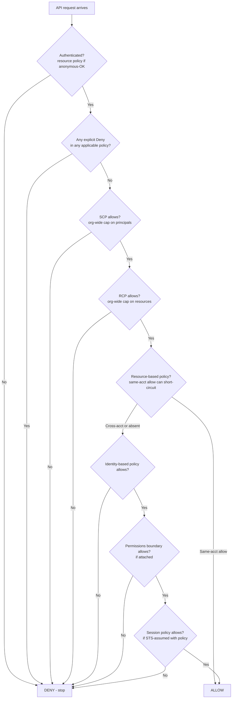
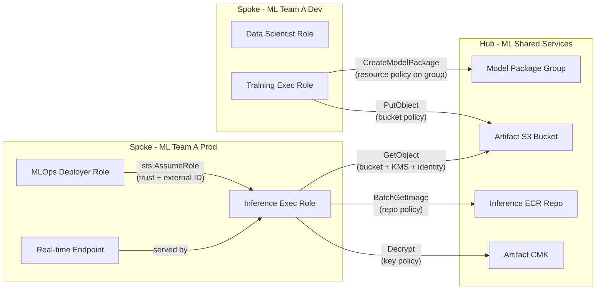
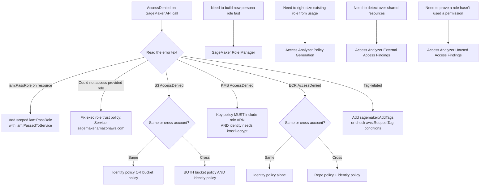

# Chapter 5 — IAM for ML: Roles, Policies, and the PassRole Trap

> **Goal of this chapter:** to give you the IAM mental model a working ML engineer actually needs — the one that lets you (a) pass MLA-C01 Task 4.3 cold, (b) ship a SageMaker workload to production without copy-pasting `AmazonSageMakerFullAccess`, and (c) recognize the `iam:PassRole` trap the instant a stem shows it. By the end of the chapter you should be able to read any "AccessDenied" stack trace and name, within ten seconds, which of eight specific IAM checkpoints failed and why. The chapter assumes you know what an IAM user, role, and policy *are*; it does not assume you know how AWS evaluates them. Networking (VPC endpoints, PrivateLink, security groups), encryption (KMS deep dive), and secrets handling are deliberately deferred to Chapter 6 — IAM is large enough to deserve its own chapter, and almost every other security control in the book composes on top of the policy evaluation algorithm we will build here.

---

## 5.1 A thought experiment: the training job that mysteriously fails at start time

It is Tuesday morning, week two of your new MLE job at a regulated lender. The on-call data scientist forwards you a Slack screenshot — `CreateTrainingJob` is throwing `AccessDenied`, the role works fine for *describing* training jobs, and she can read the bucket from a notebook with the same role. You read the error text:

```
ClientError: An error occurred (AccessDeniedException) when calling the
CreateTrainingJob operation: User: arn:aws:iam::111122223333:user/
data-scientist-jane is not authorized to perform: iam:PassRole on
resource: arn:aws:iam::111122223333:role/MLOpsTrainingRole because no
identity-based policy allows the iam:PassRole action
```

You have, in front of you, every clue you need to fix the problem in under sixty seconds — *provided* you know three things. First, what `iam:PassRole` is and why SageMaker is checking it on this particular API call. Second, that the AWS-managed policy `AmazonSageMakerFullAccess` (which Jane almost certainly has attached) has a hidden naming constraint on the roles it lets you pass — and the role she's trying to pass is named `MLOpsTrainingRole`, with no "SageMaker" substring in sight. Third, that the fix is *not* "give Jane more permissions" in the broad sense — it is "scope `iam:PassRole` to the specific execution-role ARN with an `iam:PassedToService` condition," which is a five-line patch.

If you don't know those three things, the problem looks like a mystery. You spend forty-five minutes searching docs, try attaching `AdministratorAccess` "just to test" (which works, and now Jane has admin in prod forever, and your security team finds it on the next audit), try modifying the role's *trust policy* (a different failure mode entirely), and finally page the platform team. The platform engineer fixes it in two minutes and looks at you funny.

This chapter exists so that you are the platform engineer in that story. We will peel back the layers in this order: the six policy types (§5.2), the canonical evaluation algorithm (§5.3), users vs groups vs roles with full SageMaker execution-role JSON (§5.4), the `iam:PassRole` deep dive (§5.5), `AmazonSageMakerFullAccess` and the verbatim-name trap (§5.6), the Role Manager persona shortcut (§5.7), the three ML-critical resource policies (§5.8), ML-relevant condition keys (§5.9), IAM Access Analyzer (§5.10), the multi-account hub-and-spoke registry pattern (§5.11), and the permission-creep antipattern with institutional defenses (§5.12). Exercises (§5.13) walk you through the kind of "given this AccessDenied stem, debug it" problem you will see on the exam.

If you take only one thing from the chapter, take this: **the IAM mental model is not "what does this policy allow?" It is "of the eight checkpoints a single API call traverses, which one is failing?"**

---

## 5.2 The six policy types — who attaches them, what they do

Every AWS request is evaluated against up to **six categories** of policy. You must know each by name, by who attaches it, by whether it *grants* or *restricts*, and by where it shows up in ML workflows. The exam writes distractors that rely on you confusing them.

| # | Policy type | Attached to | Grants or restricts? | Typical ML use |
|---|---|---|---|---|
| 1 | **Identity-based policy** | IAM user, group, or role | Grants | "This SageMaker execution role can read these training-data S3 prefixes" |
| 2 | **Resource-based policy** | A resource — S3 bucket, KMS key, ECR repo, Lambda function, SNS topic, SQS queue, IAM role trust policy, SageMaker model-package group | Grants | "This S3 bucket allows the cross-account SageMaker role in Account B to read" |
| 3 | **Permissions boundary** | A user or role (max one per principal) | **Restricts** — a cap on what the principal can ever do | "No principal we create can ever grant itself `iam:*` or `organizations:*`" |
| 4 | **Service Control Policy (SCP)** | An Organizations OU or account | **Restricts** — a cap on every principal in the account/OU | "Nobody in the prod OU can call `sagemaker:DeleteEndpoint` outside us-east-1" |
| 5 | **Session policy** | Passed at `sts:AssumeRole` / `sts:GetFederationToken` time | **Restricts** — a cap on the STS credentials returned | "Federated user gets only read-only SageMaker for the next hour" |
| 6 | **Resource Control Policy (RCP)** | An Organizations OU or account | **Restricts** — a cap on resource-based policies | "No S3 bucket anywhere in this org can ever be made publicly readable" |

The first five categories were the long-standing IAM model. **RCPs shipped in November 2024** and are testable on the 2026 exam — expect zero to two questions referencing them. The mental shortcut: SCPs cap what your *principals* can do; RCPs cap what your *resources* can expose. "No public S3 bucket exists anywhere in this org, ever, regardless of bucket policy" is an RCP; "nobody in the prod OU can call IAM APIs" is an SCP.

⚠️ **Exam alert.** The exam tests one structural fact about every restrictive policy type: **they cap, they don't grant.** A permissions boundary that says `Allow s3:*` does not give the principal S3 access — it permits the principal to *be granted* S3 access by an identity policy. If the boundary says `Allow s3:GetObject` and the identity policy says `Allow s3:*`, the effective permission is `s3:GetObject` (intersection). Memorize: **grants are inclusive; caps are intersective; explicit deny is final.**

---

## 5.3 The canonical evaluation algorithm

The slogan **"explicit deny > explicit allow > implicit deny"** is true, but it hides the order in which AWS walks the policy types. The real order — the one a service like SageMaker traverses when you call `CreateTrainingJob` — is this:

1. **Default**: implicit deny on everything. An unauthenticated request to a service that doesn't allow anonymous access dies here.
2. **Authenticate the principal.** (Anonymous requests are evaluated only against resource-based policies on the few services that permit anonymous access, the canonical example being public-read S3 objects.)
3. **Walk every applicable policy.** If *any* policy contains an explicit `Deny` for this action / resource / condition combination, the request is denied and evaluation stops. This is "explicit deny wins."
4. **Check organizational guardrails** (SCPs and RCPs). If the SCP attached to the principal's account does not allow the action for the principal, deny. If the RCP attached to the resource's account does not allow the action for the resource, deny.
5. **Check resource-based policy.** Same-account case: a resource-based allow can be *sufficient* (without an identity-policy allow) for most services. Cross-account case: *both* the resource policy AND an identity-policy in the calling account must allow.
6. **Check identity-based policy.**
7. **Check permissions boundary** (if attached to the principal). The boundary must allow.
8. **Check session policy** (if the principal assumed a role with one). The session policy must allow.

**Effective permission = intersection of every "allow" set, minus any explicit deny.**



Two special cases deserve burnt-into-memory status because they show up in nearly every exam IAM stem.

**Special case 1 — KMS is the only service where the resource policy is *required*.** Every other service treats the identity policy as sufficient (subject to organizational caps); KMS does not. If a role needs to call `kms:Decrypt` on a customer-managed key (CMK), the role's ARN must appear in the *key policy* — even if the role has `kms:Decrypt` on `*` in its identity policy. This is the most common ML data-pipeline outage in regulated shops. Chapter 8 covers the full mechanism.

**Special case 2 — same-account vs cross-account.** Same-account: identity OR resource policy can authorize (most services). Cross-account: BOTH must authorize. The exam constructs cross-account stems where only one side has been configured and asks which fix to make — the answer is always "fix the missing side."

### 5.3.1 Why this matters for ML specifically

A single `CreateTrainingJob` call crosses *at least* eight IAM checkpoints. The exam exploits this to write questions where it looks like everything is permitted, but one of the eight is silently failing:

1. Caller's identity policy must allow `sagemaker:CreateTrainingJob`.
2. Caller's permissions boundary (if any) must allow it.
3. Caller's identity policy must allow `iam:PassRole` on the execution-role ARN.
4. Execution role's trust policy must allow `sagemaker.amazonaws.com` to assume it.
5. Execution role's identity policy + the source S3 bucket policy (if cross-account) for training-data reads.
6. Data CMK's *key policy* (not just identity policy) for any encrypted-S3 reads.
7. ECR repo policy + identity policy if the container image is cross-account.
8. Artifact bucket policy + identity policy for model-artifact writes; plus CloudWatch Logs identity-policy permissions for log writes.

The `iam:PassRole` failure in §5.1 was checkpoint 3. A trust-policy mismatch is checkpoint 4. A KMS key-policy omission is checkpoint 6. Each has a distinct error message and a distinct fix.

---

## 5.4 Principals: users, groups, and (mostly) roles

### 5.4.1 When to use which

| Principal | Lifetime | Credentials | Use for ML? |
|---|---|---|---|
| **IAM user** | Long-lived | Console password and/or up to two access keys | **Avoid.** Static access keys are the single most-leaked credential on GitHub. Use SSO/federation. |
| **IAM group** | Long-lived | None — groups can't be principals, they're just containers for users | Convenience for human users only. You cannot "assume a group." |
| **IAM role** | Long-lived definition; short-lived STS credentials when assumed | Temporary credentials minted on `AssumeRole` | **Everything ML.** Execution roles, user roles (assumed via SSO), CodeBuild service roles, EventBridge target roles, Lambda execution roles. |
| **Federated identity** (IAM Identity Center, SAML, OIDC) | Session-lived | STS credentials minted via federation | Human access to AWS. The 2025-2026 default. Replace IAM users. |

The single most important pattern in modern AWS: **humans get federated identities; workloads get IAM roles; nothing on a production critical path uses an IAM user with access keys.** Any exam stem that uses an IAM user with access keys is either setup for an "avoid this" answer or an old artifact you're being asked to migrate.

### 5.4.2 Trust policy vs permissions policy — the most-confused pair

Every IAM role has *two* policy attachments and they answer fundamentally different questions:

- **Trust policy** answers "who can assume me?" It is an inline resource-based policy *on the role itself*. Without an entry in the trust policy, no entity can call `sts:AssumeRole` for the role — including the AWS service that needs to assume it on your behalf.
- **Permissions policy** (one or more) answers "what can I do *after* I'm assumed?" These are the identity-based policies attached to the role.

When MLA-C01 shows you a scenario where everything looks right but the call fails, roughly thirty percent of the time the issue is a trust-policy mismatch — the wrong service principal, the wrong account, or a missing condition.

**Standard SageMaker AI execution-role trust policy:**

```json
{
  "Version": "2012-10-17",
  "Statement": [{
    "Effect": "Allow",
    "Principal": { "Service": "sagemaker.amazonaws.com" },
    "Action": "sts:AssumeRole",
    "Condition": {
      "StringEquals": { "aws:SourceAccount": "111122223333" },
      "ArnLike":      { "aws:SourceArn":     "arn:aws:sagemaker:us-east-1:111122223333:*" }
    }
  }]
}
```

The `aws:SourceAccount` + `aws:SourceArn` conditions are not optional in 2026 — they prevent the **confused-deputy attack**. Without them, a malicious SageMaker job in another account could trick your role into doing work on the attacker's behalf, because the trust policy would grant `sagemaker.amazonaws.com` *globally* across all accounts and ARNs. AWS-managed onboarding wizards now add these conditions by default; older roles almost certainly don't have them — a common audit finding.

### 5.4.3 The SageMaker execution-role checklist

A SageMaker execution role is *the* most-attacked IAM principal in any AWS ML environment. Anyone who can submit code into a notebook, training container, or processing job inherits the role's permissions inside that container. Audit it like crown jewels.

**Needs (typical training/inference path):** read training data from specific S3 prefixes; write artifacts to a specific bucket/prefix; `kms:Decrypt` on the data CMK and `kms:Encrypt`/`GenerateDataKey` on the artifact CMK; pull from one or more ECR repos; write logs to a scoped CloudWatch log-group prefix; manage ENIs (`ec2:CreateNetworkInterface` family) if VPC-attached; for Pipelines, read SSM/Secrets Manager and write to Model Registry; for Feature Store, read/write to a specific feature-group ARN.

**Should *never* have:** `iam:*`, `sagemaker:*`, `s3:*` on `*`, `kms:*` on `*`, `ec2:*` on `*` (only the specific ENI verbs), and `organizations:*`/`billing:*`/`account:*` (full stop).

The "no `sagemaker:*` on the execution role" point is subtle and frequently violated. The execution role is *called by* SageMaker, not *calling* SageMaker. Granting `sagemaker:*` creates a privilege-escalation path: anyone who can put code in a training container can use the role to delete other jobs, modify endpoints, or shut down the production inference fleet. Give the role what it needs to access *data*, not what it needs to manage *SageMaker resources*.

### 5.4.4 A full least-privilege training execution role

Putting the principles together — bucket-scoped reads, prefix-scoped writes, ECR pull, KMS via-service, scoped logs, ENI permissions, no SageMaker management permissions:

```json
{
  "Version": "2012-10-17",
  "Statement": [
    {
      "Sid": "ReadTrainingData",
      "Effect": "Allow",
      "Action": ["s3:GetObject", "s3:ListBucket"],
      "Resource": [
        "arn:aws:s3:::acme-fraud-training-data-prod",
        "arn:aws:s3:::acme-fraud-training-data-prod/*"
      ],
      "Condition": {
        "Bool":         { "aws:SecureTransport": "true" },
        "StringEquals": { "aws:SourceVpce":      "vpce-0abc123def4567890" }
      }
    },
    {
      "Sid": "WriteModelArtifacts",
      "Effect": "Allow",
      "Action": ["s3:PutObject", "s3:AbortMultipartUpload"],
      "Resource": "arn:aws:s3:::acme-fraud-model-artifacts-prod/${aws:RequestTag/JobId}/*"
    },
    {
      "Sid": "PullContainerImage",
      "Effect": "Allow",
      "Action": [
        "ecr:GetAuthorizationToken",
        "ecr:BatchCheckLayerAvailability",
        "ecr:GetDownloadUrlForLayer",
        "ecr:BatchGetImage"
      ],
      "Resource": "arn:aws:ecr:us-east-1:111122223333:repository/fraud-xgboost-*"
    },
    {
      "Sid": "UseDataKey",
      "Effect": "Allow",
      "Action": ["kms:Decrypt", "kms:GenerateDataKey"],
      "Resource": "arn:aws:kms:us-east-1:111122223333:key/abcd1234-1111-2222-3333-444455556666",
      "Condition": {
        "StringEquals": {
          "kms:ViaService": [
            "s3.us-east-1.amazonaws.com",
            "sagemaker.us-east-1.amazonaws.com"
          ]
        }
      }
    },
    {
      "Sid": "Logs",
      "Effect": "Allow",
      "Action": ["logs:CreateLogStream", "logs:PutLogEvents", "logs:CreateLogGroup"],
      "Resource": "arn:aws:logs:us-east-1:111122223333:log-group:/aws/sagemaker/TrainingJobs*"
    },
    {
      "Sid": "ENIsForVpcTraining",
      "Effect": "Allow",
      "Action": [
        "ec2:CreateNetworkInterface", "ec2:CreateNetworkInterfacePermission",
        "ec2:DeleteNetworkInterface", "ec2:DeleteNetworkInterfacePermission",
        "ec2:DescribeNetworkInterfaces", "ec2:DescribeVpcs",
        "ec2:DescribeDhcpOptions", "ec2:DescribeSubnets", "ec2:DescribeSecurityGroups"
      ],
      "Resource": "*"
    }
  ]
}
```

Key choices: no wildcards on S3 (bucket-scoped reads, prefix-scoped writes via `${aws:RequestTag/JobId}`); **`aws:SourceVpce`** to block use outside the approved VPC endpoint; **`aws:SecureTransport`** to force TLS; **`kms:ViaService`** so the CMK is unusable from EC2 or Lambda even if credentials leak; no `sagemaker:*`. (Chapter 53 hardens this further with permission boundaries and SCPs; Chapter 8 covers KMS in depth.)

The mature pattern splits this into **at least two roles** — a *job* execution role like the one above, and a separate *inference* execution role that has no write access back to training data. Splitting makes the blast radius of a compromised endpoint smaller than the blast radius of a compromised training job. We return to this in §5.11 and Chapter 22.

---

## 5.5 `iam:PassRole` — the trap

This is the single highest-yield IAM topic on the MLA-C01 exam. Roughly one-third of IAM questions either directly test `iam:PassRole` or use it as the load-bearing distractor.

### 5.5.1 What PassRole actually is

When you call `CreateTrainingJob`, you pass a parameter called `RoleArn`. That ARN is the execution role SageMaker will assume to do the work. For this handoff to succeed, **two** things must be true:

1. **The caller** (your user or role) must have `iam:PassRole` permission on that role's ARN.
2. **The role's trust policy** must allow `sagemaker.amazonaws.com` to assume it.

If either fails, you get one of two error messages — and the message text tells you exactly which:

- `User: arn:aws:iam::111122223333:user/Alice is not authorized to perform: iam:PassRole on resource: arn:aws:iam::111122223333:role/SageMakerExec` — fix the **caller's identity policy**.
- `AccessDenied. Could not access provided role arn:aws:iam::111122223333:role/SageMakerExec` (or `Cannot validate the provided IAM role`) — fix the **role's trust policy**.

PassRole is **not an API call.** There is no `iam:PassRole` event in CloudTrail. It is checked synchronously inside the service that receives the role — SageMaker — and the only CloudTrail record is the `CreateTrainingJob` event itself, with `errorCode` `AccessDenied`. This is why CloudTrail-driven tools like Access Analyzer's policy generation (§5.10.4) infer `iam:PassRole` as a needed permission from the create call rather than observing it as its own event.

### 5.5.2 When SageMaker requires PassRole

Every SageMaker API that creates a long-lived resource which SageMaker will later assume a role for triggers a PassRole check. The common ones:

| API | Why PassRole is checked |
|---|---|
| `CreateTrainingJob` | The training cluster assumes the role to read data, write artifacts |
| `CreateProcessingJob` | Same as above for processing containers |
| `CreateTransformJob` | Batch transform clusters assume the role |
| `CreateModel` | The model object embeds the execution role used at inference time |
| `CreateEndpointConfig` / `CreateEndpoint` | Inference instances assume the role of the underlying `CreateModel` |
| `CreateAutoMLJob` | Autopilot creates training and processing jobs that all use the role |
| `CreateHyperParameterTuningJob` | Each child training job assumes the role |
| `CreateNotebookInstance` | The notebook EC2 instance assumes the role |
| `CreateDomain` / `CreateUserProfile` (Studio) | Studio kernels assume the role; user profile can override domain-level role |
| `CreatePipeline` | The orchestrator assumes the role to launch each step |
| `CreateMonitoringSchedule` | Model Monitor assumes the role to run baseline and monitoring containers |
| `CreateFeatureGroup` | Feature Store assumes the role to write to the offline S3 store |

The exam often hides PassRole behind a "service X cannot do Y" symptom. Train the reflex: if a user can create resource X *manually in the console* but the same user fails when calling the *API*, it is almost always PassRole missing or a region-scoped SCP blocking. The console sometimes uses a service-linked role under the hood; API calls require you to pass a role you might not have permission to pass.

### 5.5.3 Scoping PassRole correctly

The dangerous antipattern that the exam will tempt you with:

```json
{
  "Effect": "Allow",
  "Action": "iam:PassRole",
  "Resource": "*"
}
```

This lets the caller pass *any* role in the account to *any* service. If your account has an admin role, this caller is now an admin — they can pass `AdministratorAccess` to a Lambda or CodeBuild project that runs arbitrary code on their behalf. This is the canonical **PassRole privilege escalation** documented by Rhino Security Labs and Bishop Fox, and it is the reason `iam:PassRole` on `*` is essentially equivalent to `iam:*` from a security-posture standpoint.

The correct pattern uses **`iam:PassedToService`** to clamp which service can receive the role, and a path or prefix to clamp which roles can be passed:

```json
{
  "Effect": "Allow",
  "Action": "iam:PassRole",
  "Resource": "arn:aws:iam::111122223333:role/SageMakerExecution-Fraud-*",
  "Condition": {
    "StringEquals": {
      "iam:PassedToService": "sagemaker.amazonaws.com"
    }
  }
}
```

This statement says: Alice may pass roles whose ARN matches the prefix `SageMakerExecution-Fraud-*`, but *only* to SageMaker — not Lambda, Glue, or CodeBuild. And no other role to SageMaker (so she cannot pass an admin role).

Two distractors from the AWS docs that are easy to mis-remember:

1. **PassRole is a same-account permission.** You cannot pass a role in Account A to a service running in Account B. The cross-account pattern is: create a role in B that trusts A, then PassRole *that* role to the service in B. (§5.11.)
2. **Do not tag-gate PassRole.** AWS docs explicitly warn against `aws:ResourceTag` conditions on `iam:PassRole` — verbatim "this approach does not have reliable results." Use resource ARNs or path prefixes for role-side scoping; use `iam:PassedToService` for service-side scoping.

### 5.5.4 The top production PassRole failures

Aggregated from AWS re:Post, SageMaker SDK issue trackers, and security research. Each is a real failure mode with a fixable misconfiguration.

**1. User can create a job but can't pass the role.** The headline failure from §5.1. Caller has `sagemaker:CreateTrainingJob` but lacks `iam:PassRole` on the execution-role ARN. Fix: the scoped statement in §5.5.3.

**2. Cross-account PassRole simply doesn't work.** You cannot pass a role from Account B as the execution role for SageMaker in Account A. The pattern is `sts:AssumeRole` chains, then PassRole locally.

**3. "Cannot validate the provided IAM role" on `CreateModel`.** The passed role's trust policy doesn't allow `sagemaker.amazonaws.com`. Even with correct `iam:PassRole` on the caller, the role must trust the service.

**4. Notebook can read S3 but training job can't.** Classic confusion. The notebook runs under the user-profile execution role; the training job submitted from that notebook runs under the *job* execution role (a different role if you passed one in `Estimator(role=...)`). The S3 bucket policy needs to permit the *job* role.

**5. KMS Decrypt denied during training.** Role can `s3:GetObject` (so it can HEAD the object) but can't decrypt the ciphertext. Add the job role as a key user on the CMK — both via the role's identity policy AND the key policy. KMS requires both, always.

**6. Tagging permissions missing → AccessDenied on create.** Studio auto-tags every resource. If the role lacks `sagemaker:AddTags`, `CreateTrainingJob` fails not on the create but on the implicit tag.

**7. PassRole denied by permission boundary.** Caller has `iam:PassRole`, but the role they're trying to pass has a boundary that doesn't permit `sts:AssumeRole` from `sagemaker.amazonaws.com`. Effective permissions are the *intersection* of identity policy and boundary; passing requires the target to actually be assumable under its boundary.

**8. Service Catalog launch-constraint failures.** SageMaker Projects' Service Catalog launch-constraint role needs `iam:PassRole` on both the products-use and products-launch roles. Documented but buried; new platform teams hit it day one.

**9. Lifecycle-config privilege escalation (Plerion finding).** The most subtle. An attacker with `sagemaker:UpdateNotebookInstance` + `CreateNotebookInstanceLifecycleConfig` + `Stop/StartNotebookInstance` can attach a malicious lifecycle config to an existing notebook, restart it, and execute code under the notebook's execution role — **without ever needing PassRole again**, because the role was attached at creation time. PassRole is checked at configuration time, not at code-execution time. Mitigation: gate `UpdateNotebookInstance` and lifecycle-config behind a boundary; alarm on `Stop → Update → Start` sequences in CloudTrail.

⚠️ **Exam alert.** When you see four answer choices for a "user cannot start a training job" stem, the right answer is almost always "add an explicit `iam:PassRole` permission on the specific execution-role ARN, conditioned with `iam:PassedToService=sagemaker.amazonaws.com`." It is essentially never "attach `AdministratorAccess`" (too broad), and it is rarely "modify the role's trust policy" (different failure mode — that fix appears in the *trust-policy mismatch* stem, not the PassRole stem). Train yourself to read the exact error text in the stem: the words `iam:PassRole on resource` mean it's checkpoint 3 (caller's identity policy); the words `Could not access provided role` or `Cannot validate the provided IAM role` mean it's checkpoint 4 (trust policy).

---

## 5.6 `AmazonSageMakerFullAccess` — start here, do not end here

### 5.6.1 What it actually grants

The 2024 revision of `AmazonSageMakerFullAccess` grants, in broad strokes:

- All `sagemaker:*` actions on `*`
- S3 access (`Get`/`Put`/`List`/`Delete`) to buckets and objects matching pattern `*sagemaker*` or tagged `sagemaker:*`
- ECR read on repositories whose names contain `sagemaker`
- `iam:PassRole` for `sagemaker.amazonaws.com` on roles **whose names contain the substring `SageMaker`**
- `iam:CreateServiceLinkedRole` for SageMaker service-linked roles
- CloudWatch Logs full access on log groups matching SageMaker patterns
- KMS access (`Encrypt`, `Decrypt`, `ReEncrypt*`, `GenerateDataKey*`, `DescribeKey`, `CreateGrant`) on keys with the right tag
- VPC ENI management
- Limited Glue, Athena, Redshift, EMR, EFS — enough to cover Studio Data Wrangler and feature-engineering scenarios
- Limited CodeCommit, CodeBuild, CodePipeline access for SageMaker Projects / MLOps

It is explicitly designed, in the AWS docs' own words, "for ease of use, primarily for experimentation" — and is **not recommended for production**.

### 5.6.2 The verbatim-naming trap (this is the most-tested exam pattern)

The `iam:PassRole` grant inside `AmazonSageMakerFullAccess` is conditioned on **the role's name containing the substring `SageMaker`** AND on `iam:PassedToService=sagemaker.amazonaws.com`. The first condition is implemented via an `ArnLike` on the role-name pattern. This means:

- Your execution role is named `MLOpsTrainingRole` (no "SageMaker" substring). `AmazonSageMakerFullAccess` will **not** let a user with that policy pass the role to SageMaker. The fix is either rename the role to include "SageMaker" or add an explicit `iam:PassRole` statement on the specific ARN.
- Your execution role is named `sagemaker-fraud-exec` (lowercase). Case-sensitivity matters here — the `ArnLike` pattern is case-sensitive on the role-name portion. Verify by looking at the actual policy JSON.
- You want to PassRole a Glue service role from a SageMaker Pipelines step that triggers Glue. `AmazonSageMakerFullAccess` will not allow this even if the Glue role's name contains "SageMaker" — the `PassedToService` condition pins the target service to `sagemaker.amazonaws.com`, not `glue.amazonaws.com`. You need a separate `iam:PassRole` statement scoped to `glue.amazonaws.com`.

⚠️ **Exam alert.** The exam stem will read something like "Jane has `AmazonSageMakerFullAccess` attached. When she calls `CreateTrainingJob` and passes `arn:aws:iam::111122223333:role/MLOpsTrainingRole`, she gets `iam:PassRole` denied. What is the most appropriate fix?" The right answer is "add an explicit `iam:PassRole` statement scoped to that role's exact ARN." The wrong answers will include "attach `AdministratorAccess`" (too broad), "modify the role's trust policy" (different failure mode), and "rename the role" (technically works but is not the most-appropriate cloud-native answer — renaming production roles breaks references and is rarely an option).

### 5.6.3 Why production should not use `AmazonSageMakerFullAccess`

Beyond the naming trap, the policy has three substantive problems:

1. **Pattern-based S3 access (`*sagemaker*`) is sloppy.** In shops where teams prefix buckets generously (`team-sagemaker-fraud`, `sagemaker-shared-features`), the policy grants access to a wider blast radius than intended.
2. **It grants `iam:CreateRole` and `iam:AttachRolePolicy` on specific patterns** — a privilege-escalation path documented by Palo Alto's Prisma research.
3. **It grants `sagemaker:Delete*` and `sagemaker:Update*`.** A curious data scientist should not be able to delete production endpoints.

The policy also carries broad Cognito user-pool permissions (for Canvas integration) called out as enabling lateral movement.

### 5.6.4 The least-privilege replacement workflow

The canonical AWS-blessed workflow:

1. Use `AmazonSageMakerFullAccess` in sandbox for 30 to 90 days while CloudTrail captures real usage.
2. Run **IAM Access Analyzer policy generation** (§5.10.4) to emit a least-privilege policy from that history.
3. Review the JSON by hand — add TLS-only and VPC-only conditions, tighten resource ARNs.
4. Attach the customer-managed policy; detach `AmazonSageMakerFullAccess`.
5. Attach a **permissions boundary** that forbids `iam:*`, `organizations:*`, `account:*`, `kms:ScheduleKeyDeletion`, and out-of-region calls.
6. Re-run Access Analyzer's unused-access view quarterly to keep trimming.

The replacement policy is in §5.4.4; the boundary is in Chapter 53.

---

## 5.7 SageMaker Role Manager — persona-based roles without writing JSON

### 5.7.1 What it solves

Writing a tight execution role by hand is a project. **SageMaker Role Manager** (GA late 2022, persona library expanded through 2024) is an AWS-blessed wizard for right-sized roles per persona. It is the right answer to MLA-C01 stems of the form "what is the *fastest* way to create a least-privilege role for a data-scientist team?"

### 5.7.2 The three preconfigured personas

| Persona | Who it's for | Typical permissions baseline |
|---|---|---|
| **Data Scientist** | Builds models in Studio; runs notebooks, training, batch transform | Studio access, training/processing/transform create, Experiments read/write, no production endpoint deploy or delete |
| **MLOps Engineer** | Owns the deployment side | Pipelines, Model Registry approve/reject, endpoint create/update/delete, deployment guardrails |
| **SageMaker Compute Role** | The actual *execution* role assumed by training/processing/inference clusters | The narrow runtime permissions: read data, write artifacts, KMS, ECR pull, logs, ENIs |

The first two are *user* roles (assumed by humans via SSO). The third is the runtime role passed to SageMaker. A common new-engineer error is to confuse them: the Data Scientist persona is *not* what you put in `RoleArn` when calling `CreateTrainingJob`.

Beyond the personas, Role Manager composes **ML activities** as building blocks: "Run training jobs," "Access Glue," "Manage Experiments," "Use Feature Store," "Manage Models," "Manage Pipelines," "S3 Bucket Access" — each translating to action statements scoped to the selectors you provide.

### 5.7.3 Network, KMS, and S3 selectors

Per-role dropdowns: **VPC** (subnets + SGs hard-coded into conditions), **KMS** (the wizard adds the role to the *key policy* automatically — solving the KMS-two-sides problem from §5.3), **S3** (read/write buckets). Output is a **customer-managed policy** you own and can edit. Role Manager also generates the standard SageMaker trust policy with `aws:SourceAccount`/`aws:SourceArn` conditions.

### 5.7.4 Caveats and exam framing

- Output is a starting point. The wizard tends to be generous on `Resource: "*"` for some actions (`ec2:Describe*`).
- Available via console **and** CDK (`cdk-aws-sagemaker-role-manager`), so it can be checked into IaC.
- Exam: **Role Manager** = build persona-based roles via console. **Access Analyzer Policy Generation** (§5.10.4) = right-size an existing over-permissive role from CloudTrail. Two different tools, two different jobs.

---

## 5.8 Resource policies for ML — S3, ECR, KMS

Three resource-based policies dominate ML exam questions: **S3 bucket policies**, **ECR repository policies**, and **KMS key policies**. KMS gets a full chapter (Chapter 8); the IAM-side belongs here.

### 5.8.1 S3 bucket policies

Four patterns to memorize:

**(a) Deny non-TLS access** — first statement in any sensitive bucket:

```json
{
  "Sid": "DenyInsecureTransport",
  "Effect": "Deny",
  "Principal": "*",
  "Action": "s3:*",
  "Resource": [
    "arn:aws:s3:::acme-fraud-training-data-prod",
    "arn:aws:s3:::acme-fraud-training-data-prod/*"
  ],
  "Condition": { "Bool": { "aws:SecureTransport": "false" } }
}
```

**(b) Deny non-VPC-endpoint access** — the single best data-exfiltration control for ML training data:

```json
{
  "Sid": "AccessOnlyViaVpce",
  "Effect": "Deny",
  "Principal": "*",
  "Action": "s3:GetObject",
  "Resource": "arn:aws:s3:::acme-fraud-training-data-prod/*",
  "Condition": {
    "StringNotEquals": { "aws:SourceVpce": "vpce-0abc123def4567890" }
  }
}
```

Blocks `aws s3 cp` from a laptop *and* training jobs not VPC-attached — set the VPC mode on jobs first or you'll lock yourself out.

**(c) Require KMS encryption on uploads:**

```json
{
  "Sid": "RequireKmsEncryptionOnPut",
  "Effect": "Deny",
  "Principal": "*",
  "Action": "s3:PutObject",
  "Resource": "arn:aws:s3:::acme-fraud-training-data-prod/*",
  "Condition": {
    "StringNotEquals": { "s3:x-amz-server-side-encryption": "aws:kms" }
  }
}
```

**(d) Cross-account read for SageMaker in another account:**

```json
{
  "Effect": "Allow",
  "Principal": { "AWS": "arn:aws:iam::444455556666:role/SageMakerExecRole" },
  "Action":    ["s3:GetObject", "s3:ListBucket"],
  "Resource":  [
    "arn:aws:s3:::acme-shared-training-data",
    "arn:aws:s3:::acme-shared-training-data/*"
  ]
}
```

Cross-account rule: BOTH the bucket policy AND the foreign role's identity policy must allow. Checkpoint 5 in §5.3.1.

### 5.8.2 ECR repository policies

When SageMaker pulls a container from ECR in a *different* account, the repo policy must allow the execution role (or the service principal):

```json
{
  "Version": "2012-10-17",
  "Statement": [{
    "Sid": "AllowSageMakerPull",
    "Effect": "Allow",
    "Principal": { "AWS": "arn:aws:iam::444455556666:role/SageMakerExecRole" },
    "Action": [
      "ecr:BatchCheckLayerAvailability",
      "ecr:BatchGetImage",
      "ecr:GetDownloadUrlForLayer"
    ]
  }]
}
```

For broader access — "any SageMaker training job in our partner account" — use the `sagemaker.amazonaws.com` service principal constrained with `aws:SourceAccount`. Omit it and you've recreated confused-deputy.

Asymmetry: `ecr:GetAuthorizationToken` is global and is granted on `Resource: "*"` in the identity policy; per-image actions (`BatchGetImage`, etc.) are repository-scoped in the resource policy. Forgetting `GetAuthorizationToken` is a top-5 source of "image pull backoff" errors.

### 5.8.3 KMS key policies — the hard one

KMS is the one service where the key policy is **required** to grant access. If the root statement is missing, root is locked out and the key is effectively unrecoverable. Minimum sane KMS key policy for ML data:

```json
{
  "Version": "2012-10-17",
  "Statement": [
    {
      "Sid": "EnableRootIAMAccess",
      "Effect": "Allow",
      "Principal": { "AWS": "arn:aws:iam::111122223333:root" },
      "Action": "kms:*", "Resource": "*"
    },
    {
      "Sid": "AllowKeyAdministrators",
      "Effect": "Allow",
      "Principal": { "AWS": "arn:aws:iam::111122223333:role/KmsAdmin" },
      "Action": [
        "kms:Create*", "kms:Describe*", "kms:Enable*", "kms:List*",
        "kms:Put*", "kms:Update*", "kms:Revoke*", "kms:Disable*",
        "kms:Get*", "kms:Delete*", "kms:TagResource", "kms:UntagResource",
        "kms:ScheduleKeyDeletion", "kms:CancelKeyDeletion"
      ],
      "Resource": "*"
    },
    {
      "Sid": "AllowSageMakerExecutionRoleToUseKey",
      "Effect": "Allow",
      "Principal": { "AWS": "arn:aws:iam::111122223333:role/SageMakerExecRole" },
      "Action": [
        "kms:Encrypt", "kms:Decrypt", "kms:ReEncrypt*",
        "kms:GenerateDataKey*", "kms:DescribeKey"
      ],
      "Resource": "*"
    },
    {
      "Sid": "AllowGrantCreationForAwsServices",
      "Effect": "Allow",
      "Principal": { "AWS": "arn:aws:iam::111122223333:role/SageMakerExecRole" },
      "Action": ["kms:CreateGrant"], "Resource": "*",
      "Condition": { "Bool": { "kms:GrantIsForAWSResource": "true" } }
    }
  ]
}
```

Cross-account KMS: the *owning* key policy must allow the *foreign* principal AND the foreign principal's identity policy must allow `kms:Decrypt`. Both sides, always. Chapter 8 covers grants and envelope encryption.

---

## 5.9 Condition keys that matter for ML

A condition key is the "small print" of every IAM statement. The ML-relevant set:

| Key | What it tests | Typical ML use |
|---|---|---|
| `aws:PrincipalArn` | Exact match on the caller's ARN | Cross-account bucket policy granting one specific role |
| `aws:PrincipalTag/<k>` | Tag on the calling principal | ABAC — gate access by team/project tag on the role |
| `aws:ResourceTag/<k>` | Tag on the resource | "Only data scientists tagged `team=fraud` see S3 objects tagged `team=fraud`" |
| `aws:RequestTag/<k>` | Tags being applied in this request | Force callers to tag resources at creation |
| `aws:SourceIp` | IP CIDR of the caller | Restrict console access to office IP range |
| `aws:SourceVpc` | The VPC ID the request came through | "Only my prod VPC" |
| `aws:SourceVpce` | The VPC-endpoint ID the request came through | The single best S3-lockdown control for ML data |
| `aws:VpcSourceIp` | The private IP inside the VPC | Narrow inside the VPC further (rarely needed) |
| `aws:SecureTransport` | TLS on the connection | Force HTTPS-only |
| `aws:MultiFactorAuthPresent` | MFA at session time | Gate destructive admin ops on MFA |
| `aws:RequestedRegion` | AWS region of the API call | Confine workloads to approved regions |
| `iam:PassedToService` | Used with `iam:PassRole` to clamp which service can receive the role | "This execution role can only be passed to sagemaker.amazonaws.com" |
| `kms:ViaService` | Restrict KMS key usage to a specific service | "This CMK can only be used by S3 and SageMaker, nowhere else" |
| `kms:GrantIsForAWSResource` | Allow a grant only when an AWS service requests it | Lock down grant creation |
| `sagemaker:VpcSubnets` / `sagemaker:VpcSecurityGroupIds` | The subnet/SG IDs supplied with a SageMaker create call | Force VPC-only jobs via SCP |
| `sagemaker:DirectInternetAccess` | Whether a notebook has public-internet access | Ban public notebooks |
| `sagemaker:VolumeKmsKey` | Whether the create call supplies a CMK for the volume | Force CMK-encrypted volumes |

### 5.9.1 ABAC: the pattern worth knowing

Attribute-based access control collapses the policy explosion from per-team roles. Recipe: (1) tag principals with `Team=Fraud`, `Project=Phoenix`; (2) tag resources with the same keys; (3) write *one* policy that allows access only when `aws:PrincipalTag/Team == aws:ResourceTag/Team`.

```json
{
  "Effect": "Allow",
  "Action": "sagemaker:DescribeTrainingJob",
  "Resource": "*",
  "Condition": {
    "StringEquals": {
      "aws:PrincipalTag/Team": "${sagemaker:ResourceTag/Team}"
    }
  }
}
```

Alice (Team=fraud) cannot describe Bob's (Team=marketing) jobs — principal-tag match fails. Pair with creation-time enforcement so users can't mis-tag resources to escape their team's blast radius:

```json
{
  "Effect": "Deny",
  "Action": "sagemaker:CreateTrainingJob",
  "Resource": "*",
  "Condition": {
    "StringNotEquals": {
      "aws:RequestTag/Team": "${aws:PrincipalTag/Team}"
    }
  }
}
```

Adding a new team becomes a *tagging change*, not a new policy. Recognize the paired `aws:PrincipalTag` / `aws:ResourceTag` pattern instantly.

### 5.9.2 `aws:SourceVpc` vs `aws:SourceVpce` (a top distractor)

The exam swaps these in distractors:

- **`aws:SourceVpc`** matches when the request comes from anywhere inside the given VPC, regardless of endpoint.
- **`aws:SourceVpce`** matches only when the request came through a specific VPC endpoint. Tighter, more auditable.

Prefer `aws:SourceVpce` when you have interface/gateway endpoints — which you should for S3, ECR, STS, SageMaker, KMS, and CloudWatch in production ML accounts. The exam favors `aws:SourceVpce` in "most secure" answers.

---

## 5.10 IAM Access Analyzer — the indispensable audit tool

Access Analyzer has four features, all testable by name.

### 5.10.1 External access findings

Continuously analyzes resource policies on S3 buckets, KMS keys, IAM roles, Lambda, Secrets Manager, SQS, EBS snapshots, ECR repos, RDS snapshots, EFS, SNS. Reports access granted to principals *outside your zone of trust*. ML-relevant catches: model package groups shared with a forgotten external account; training-data buckets with public-read; custom-container ECR repos shared with `*`.

### 5.10.2 Unused access findings (paid tier)

Reads up to 365 days of CloudTrail and flags: unused IAM roles, dormant users, unused access keys/passwords, and **individual permissions** the role has but hasn't exercised. The per-permission view is what makes it the right tool for right-sizing `AmazonSageMakerFullAccess`. Replaces older "Last Accessed" reports.

### 5.10.3 Custom policy checks (paid, on-demand)

CI/CD validation: confirm a proposed policy doesn't grant more access than a baseline; diff two policy versions. Common pattern: GitHub Actions calls `aws accessanalyzer check-no-new-access` on PRs that touch `*.policy.json`.

### 5.10.4 Policy generation from CloudTrail

Reads up to 90 days of a role's CloudTrail activity and emits a candidate least-privilege policy. **The fastest production-quality way to right-size `AmazonSageMakerFullAccess`.** Workflow: run with full-access in sandbox 30-90 days → Access Analyzer → Policy generation → review JSON, tighten ARNs, add condition keys (the generator won't add `aws:SourceVpce` or `kms:ViaService` for you) → swap in, verify in staging, promote.

⚠️ **Exam alert.** Memorize the distinction: **Role Manager** = build a new persona-based role from scratch; **Access Analyzer policy generation** = right-size an existing role from observed usage. Stem says "team has been using `AmazonSageMakerFullAccess` for three months and needs to tighten" → Policy Generation. Stem says "provision new roles for a data-science team starting next week" → Role Manager. Complementary, not competitive.

---

## 5.11 Multi-account ML patterns — hub-and-spoke registry, role chains

The AWS "governing the ML lifecycle at scale" reference architecture is the de-facto multi-account blueprint and is fair game on the exam. Mature OU structure:

```
Root
├── Security OU              (Security Tooling, Log Archive)
├── Infrastructure OU        (Network, Shared Services)
├── Workloads OU             (ML Team A/B dev/test/prod, Data Lake)
├── Deployments OU           (ML Shared Services — central model registry)
└── Sandbox OU               (PoC accounts)
```

Central pattern: a **hub account** in the Deployments OU owns the SageMaker Model Registry (and often the model-artifact S3 bucket and inference-container ECR repo). **Spoke accounts** (dev/staging/prod per team) consume from the hub.



### 5.11.1 Cross-account model promotion — push vs pull

**Push-based**: A spoke role registers model versions *directly* into the hub registry via a cross-account resource policy on the model package group. The hub must allow:

```json
{
  "Version": "2012-10-17",
  "Statement": [{
    "Effect": "Allow",
    "Principal": { "AWS": "arn:aws:iam::SPOKE_ACCOUNT:role/MLOpsDeployRole" },
    "Action": [
      "sagemaker:CreateModelPackage",
      "sagemaker:DescribeModelPackage",
      "sagemaker:UpdateModelPackage"
    ],
    "Resource": "arn:aws:sagemaker:us-east-1:HUB_ACCOUNT:model-package-group/fraud-models"
  }]
}
```

Companion resource policies must exist on the hub S3 bucket, the hub ECR repo, and any KMS key encrypting the artifacts. **Four resource policies, all aligned**, or the deploy fails.

**Pull-based**: spoke registers locally, EventBridge fires `SageMaker Model Package State Change` across the bus boundary, a Lambda in the hub pulls and replicates. Stronger isolation — spokes never write to the hub — but more moving parts. Favor pull when spokes are less trusted (third-party teams, regulated boundaries).

### 5.11.2 AWS RAM sharing (2024+ pattern)

SageMaker Model Registry now supports sharing via **AWS Resource Access Manager**. The hub creates a model package group, shares via RAM with the org/OU/accounts, and consumers see the group as a first-class resource. Eliminates much of the resource-policy plumbing above. **Recommended new-build pattern in 2025-2026** under "centralized model governance" stems.

### 5.11.3 Cross-account inference deployment with external ID

The deploy account assumes a role in the consumer (prod) account via `sts:AssumeRole`. Consumer-side trust policy:

```json
{
  "Version": "2012-10-17",
  "Statement": [{
    "Effect": "Allow",
    "Principal": { "AWS": "arn:aws:iam::DEPLOY_ACCOUNT:role/MLDeployer" },
    "Action": "sts:AssumeRole",
    "Condition": {
      "StringEquals": { "sts:ExternalId": "shared-secret-uuid-92ad-4f3c" }
    }
  }]
}
```

The `sts:ExternalId` defends against the cross-account confused-deputy variant — a third party with the deploy role's credentials still needs the external ID. It is not cryptographically secret (it appears in CloudTrail), but it is a shared identifier the trusting account chose.

Once the deploy role has assumed the consumer-account role, it is *now* a principal in the consumer account and can PassRole the local inference execution role to SageMaker locally. **PassRole never crosses accounts** — the `sts:AssumeRole` step is what makes the deploy possible.

⚠️ **Exam alert.** When a stem mentions "cross-account model deploy," the answer almost always involves a chain: `sts:AssumeRole` from deploy → local PassRole in target → SageMaker `CreateModel` in target. Wrong answers offer "PassRole the target-account role from the deploy account" (impossible) or "use a resource-based policy alone" (insufficient — you need both the trust chain and the resource policies).

---

## 5.12 The permission-creep antipattern and how mature orgs defend against it

### 5.12.1 The natural-history story

Teams start with `AmazonSageMakerFullAccess` because the docs use it. Six months in, the account has 47 inline policies on the default execution role, none of which anyone remembers adding. By audit time, no one can answer "what does this role actually need?" without breaking production. AWS SAs call the cleanup work **policy archaeology**.

The pattern compounds because (a) adding a permission to fix a broken job takes five minutes; figuring out the minimum permission takes an hour; engineers under deadline pressure pick the five-minute option, and (b) nobody is incentivized to *remove* permissions. Mature orgs counter with institutional defenses rather than individual discipline.

### 5.12.2 Permission boundaries enforced via SCP

Every role created within a workload account must have a boundary attached that caps what the role can ever do — even if a developer attaches `AdministratorAccess`. The SCP denies role-creation unless the request includes the org-standard boundary:

```json
{
  "Effect": "Deny",
  "Action": ["iam:CreateRole", "iam:PutRolePolicy", "iam:AttachRolePolicy"],
  "Resource": "*",
  "Condition": {
    "StringNotEquals": {
      "iam:PermissionsBoundary": "arn:aws:iam::*:policy/ml-platform-boundary"
    }
  }
}
```

The boundary denies `iam:*`, `organizations:*`, `account:*`, `billing:*`, `kms:ScheduleKeyDeletion`, and out-of-region calls. With SCP + boundary in place, a developer can grant themselves anything and still cannot escalate to org-admin or delete production keys.

### 5.12.3 Control Tower + Service Catalog as the *only* path

Platform teams publish pre-blessed Service Catalog products that mint a scoped execution role + SageMaker domain + project namespace. The data-science team's *only* path to ML infra is the self-service catalog. An SCP denies direct `sagemaker:CreateDomain`, `sagemaker:CreateUserProfile`, `iam:CreateRole`, etc., outside the Service Catalog launch-constraint role. The "paved road" pattern.

### 5.12.4 Aardvark + Repokid (and Access Analyzer's native equivalent)

Netflix open-sourced **Aardvark** and **Repokid** around 2017 — Aardvark records which IAM actions each role actually uses, Repokid auto-removes unused permissions. They remain the reference implementation for continuous least-privilege as a process. AWS's native equivalent is **Access Analyzer unused-access findings** (§5.10.2) plus **Policy Generation** (§5.10.4) — less mature than Repokid (no auto-remediation), but no infra to run. Quarterly Access Analyzer review is the AWS-blessed cadence.

### 5.12.5 SCP guardrails for ML at the org level

Compressed list of SCP statements mature ML orgs deploy at the OU level — each defends against a specific class of permission-creep:

| Guardrail | What it blocks |
|---|---|
| Deny `s3:PutBucketPublicAccessBlock`, `s3:DeletePublicAccessBlock` | Removing public-access protections |
| Deny SageMaker `Create*Job` if `sagemaker:VpcSubnets` is null | Jobs not in a VPC |
| Deny `sagemaker:CreateNotebookInstance` if `sagemaker:DirectInternetAccess=Enabled` | Public-internet notebooks |
| Deny SageMaker `Create*Job` if `sagemaker:VolumeKmsKey` is null | Volumes encrypted with AWS-owned key |
| Deny `sagemaker:CreateNotebookInstance` if `sagemaker:RootAccess=Enabled` | Root on notebooks |
| Deny `sagemaker:CreateTrainingJob` if `sagemaker:InterContainerTrafficEncryption=false` | Unencrypted distributed training traffic |
| Deny `sagemaker:Create*` if `aws:RequestTag/Project` is null | Untagged resources (cost & ownership) |
| Deny `iam:CreateUser`, `iam:CreateAccessKey` | Forces all human access through Identity Center |
| Deny everything outside approved regions (with carve-outs for global services) | Cross-region data residency |

The 2025 expansion of SCPs to support full IAM policy language (mid-string wildcards, individual ARNs, full `Condition` operators) lets you write precision-targeted guardrails instead of coarse deny-alls.

### 5.12.6 Identity Center for human access (the 2025-2026 default)

The current AWS posture is unambiguous: **stop creating IAM users for human access.** IAM Identity Center (formerly AWS SSO) is the default. For SageMaker Studio specifically, there are two domain authentication modes:

| Mode | When to use | Tradeoffs |
|---|---|---|
| **IAM Identity Center** | You have an IdP (Okta, Entra, Google Workspace); need per-user audit; want trusted identity propagation to S3 Access Grants / Lake Formation | Per-user identity preserved end-to-end |
| **IAM-based** | Legacy SAML-only; custom login flow | All users share a role's permissions — no per-user attribution without ABAC plumbing |

**Critical operational fact:** the authentication mode of a Studio domain **cannot be changed after creation**. Get this wrong on day one and you're rebuilding the domain. Studio domains are covered in Chapter 22; the IAM choice is upstream of every other Studio decision.

**Trusted identity propagation** (2024 GA): with Identity Center, the physical user identity flows through to downstream services. Athena queries from a Studio notebook appear in CloudTrail as the *human's* identity, not the shared execution role. S3 Access Grants can grant prefix-level access by user, not by role.

---

## 5.13 The IAM gotchas table (memorize before exam day)

| Symptom | Root cause | Fix |
|---|---|---|
| `not authorized to perform iam:PassRole` on `CreateTrainingJob` | Caller's identity policy lacks `iam:PassRole` for the execution-role ARN | Add `iam:PassRole` scoped to the role ARN with `iam:PassedToService=sagemaker.amazonaws.com` |
| `Could not access provided role…` / `Cannot validate the provided IAM role` | Execution role's trust policy doesn't allow `sagemaker.amazonaws.com` | Add the SageMaker service principal + `aws:SourceAccount` / `aws:SourceArn` to trust policy |
| Training job errors reading encrypted data | KMS key policy excludes the execution role | Add the execution-role ARN to the *key policy* — identity policy alone is never enough for KMS |
| "Works in dev but not prod" | Different OUs have different SCPs (often region-restriction) | Check `aws:RequestedRegion` and service allow-lists in the prod OU's SCPs |
| Cross-account model deploy fails at `CreateModel` | S3 bucket policy, KMS key policy, AND `iam:PassRole` in the deployment account all needed | All three: `s3:GetObject` on artifact bucket, `kms:Decrypt` in the bucket CMK's key policy, `iam:PassRole` on the deployment exec role |
| Compliance flags the trust policy as vulnerable | Missing `aws:SourceAccount` + `aws:SourceArn` | Add them to defeat confused-deputy |
| Cross-account container image pull fails | ECR repo policy doesn't grant the foreign role | Add `ecr:BatchGetImage`, `GetDownloadUrlForLayer`, `BatchCheckLayerAvailability` to the foreign role ARN |
| `AmazonSageMakerFullAccess` user can't pass a custom-named role | Managed policy only allows PassRole on roles whose name contains `SageMaker` | Either rename the role or add an explicit `iam:PassRole` statement on the actual ARN |
| Studio user can launch jobs but can't read a specific bucket | `AmazonSageMakerFullAccess` only covers buckets matching `*sagemaker*` | Add an explicit `s3:GetObject` statement on the bucket |
| Notebook can read S3 but training job can't | Notebook runs as user-profile role; training job runs as a different job role you passed | Update bucket policy to grant the *job* role, or use the same role for both |
| `CreateTrainingJob` works manually but pipeline fails | Pipeline role lacks `iam:PassRole` on the step's execution role | Add `iam:PassRole` to the pipeline orchestrator role |

### 5.13.1 The exam-day decision tree



---

## 5.14 Exercises

Exam-shaped stems with answers below each problem. Try cold first.

### Exercise 5.14.1 — Read the AccessDenied

A data scientist receives this error when calling `CreateTrainingJob`:

```
User: arn:aws:iam::111122223333:user/jane is not authorized to perform:
iam:PassRole on resource: arn:aws:iam::111122223333:role/MLOpsTrainingRole
```

She currently has `AmazonSageMakerFullAccess` attached. What is the most appropriate fix?

(A) Attach `AdministratorAccess` to Jane.
(B) Add `Service: sagemaker.amazonaws.com` to the trust policy on `MLOpsTrainingRole`.
(C) Add a customer-managed policy to Jane that allows `iam:PassRole` on `arn:aws:iam::111122223333:role/MLOpsTrainingRole` with `iam:PassedToService=sagemaker.amazonaws.com`.
(D) Rename `MLOpsTrainingRole` to `SageMakerMLOpsTrainingRole`.

**Answer:** (C). The verbatim-naming trap (§5.6.2) — `AmazonSageMakerFullAccess` permits PassRole only on roles whose names contain "SageMaker." (A) over-broad, (B) wrong failure mode, (D) operationally hostile.

### Exercise 5.14.2 — The trust-policy mismatch

A pipeline step fails with: `Cannot validate the provided IAM role. Please ensure that the role can be assumed by SageMaker.` The role's identity policy has all the right S3 and ECR statements. What is the cause?

(A) The role lacks `iam:PassRole`.
(B) The role's trust policy doesn't list `sagemaker.amazonaws.com` as a service principal.
(C) The S3 bucket policy excludes the role.
(D) The KMS key policy excludes the role.

**Answer:** (B). The error text is the diagnostic — `Cannot validate the provided IAM role` means `sts:AssumeRole` failed at the trust policy. PassRole errors have different text (Ex 5.14.1).

### Exercise 5.14.3 — Cross-account chain

Account A (dev) trains a model and needs to register it in a model package group in Account B (hub). The training role in A has `sagemaker:CreateModelPackage` in its identity policy. The CreateModelPackage call fails with AccessDenied. Which fix is required?

(A) Add `sts:AssumeRole` to the training role in A.
(B) Add a resource policy on the model package group in B granting the training role in A the `sagemaker:CreateModelPackage` action.
(C) Move the model package group to Account A.
(D) Use SageMaker Role Manager to create a new role in B.

**Answer:** (B). Cross-account = BOTH sides allow. Identity policy in A is in place; the model package group in B needs the resource-based policy. (A) misapplies AssumeRole, (C) defeats the centralized registry, (D) doesn't address the resource-policy gap.

### Exercise 5.14.4 — The KMS two-sides

A training job has been running fine for months. The security team rotated the data CMK over the weekend. Monday morning, all training jobs fail with `KMS.AccessDeniedException`. The training role's identity policy already includes `kms:Decrypt` on `*`. What is the cause?

(A) The rotation broke the role's identity policy.
(B) The new CMK's key policy doesn't include the training role's ARN.
(C) The role needs `kms:ScheduleKeyDeletion`.
(D) The role needs an `iam:PassRole` for the new CMK.

**Answer:** (B). KMS is the only service where the key policy is required (§5.3 special case 1). A newly-created (or rotated) key has a fresh policy that must explicitly list every principal. (C) is dangerous and unrelated; (D) misapplies PassRole — keys are not roles.

### Exercise 5.14.5 — Fastest path to a persona role

The platform team needs to provision execution roles for a 30-person data-science team starting on Monday. Each persona needs different permissions on different S3 buckets and a specific VPC. What is the fastest AWS-native approach?

(A) Write three custom IAM policies by hand from the AWS docs.
(B) Use the SageMaker Role Manager wizard, select the relevant personas, and provide S3 / VPC / KMS selectors.
(C) Attach `AmazonSageMakerFullAccess` to everyone and trim later.
(D) Use Access Analyzer policy generation to derive the policies.

**Answer:** (B). Role Manager is the right tool for "build new persona-based roles fast" (§5.7). (D) doesn't apply — Policy Generation needs *historical CloudTrail* from an existing role.

### Exercise 5.14.6 — The right-sizing job

A team has been running production ML workloads under `AmazonSageMakerFullAccess` for four months. The CISO has requested a least-privilege replacement policy. What is the AWS-blessed workflow?

(A) Read the CloudTrail logs by hand and write a policy from observed actions.
(B) Run Access Analyzer policy generation on the role; review and tighten the generated JSON; attach as a customer-managed policy; detach the full-access policy.
(C) Use SageMaker Role Manager to derive the policy from past usage.
(D) Open a support ticket and ask AWS to generate the policy.

**Answer:** (B). Policy generation from CloudTrail is the right tool for right-sizing an existing role (§5.10.4). Role Manager (C) doesn't read CloudTrail. (A) is what (B) automates. (D) is not a thing.

### Exercise 5.14.7 — The cross-account inference deploy

The ML platform team in Account D (deploy) needs to deploy a model into Account P (prod). The deploy team's CI/CD role is `arn:aws:iam::D:role/MLDeployer`. The prod-side inference execution role is `arn:aws:iam::P:role/InferenceExec`. What is the correct cross-account pattern?

(A) Grant `MLDeployer` `iam:PassRole` on `InferenceExec`.
(B) `MLDeployer` assumes a deployment role in account P (with `sts:ExternalId` in the trust condition); the assumed role then calls SageMaker locally in P and PassRoles `InferenceExec` to the model.
(C) Add `MLDeployer` as a service principal in the trust policy of `InferenceExec`.
(D) Move `InferenceExec` to account D.

**Answer:** (B). PassRole is same-account-only (§5.5.3, §5.11.3). The pattern is AssumeRole into the target, then PassRole locally. (A) doesn't work cross-account; (C) confuses trust policies with service principals; (D) defeats multi-account isolation.

---

## 5.15 Five facts to engrave before exam day

1. **`iam:PassRole` is same-account-only, never logged as its own CloudTrail event, and the highest-yield IAM topic on the exam.** Always scope with `iam:PassedToService` and a role-ARN prefix. Cross-account "PassRole" is actually `sts:AssumeRole` then local PassRole.

2. **The execution role is *called by* SageMaker, not *calling* SageMaker.** Never grant it `sagemaker:*`. It accesses data and writes artifacts; it does not manage SageMaker resources.

3. **KMS key policies are the one place where identity policy alone is never enough.** A role that needs to decrypt with a CMK must have its ARN in the *key policy* — every time, no exceptions.

4. **Cross-account always means both sides allow.** Bucket policy + role identity policy; KMS key policy + role identity policy; ECR repo policy + role identity policy. The exam offers "fix one side" as the wrong answer.

5. **`AmazonSageMakerFullAccess` is a starter, not a destination.** Sandbox use only; replace via Access Analyzer Policy Generation; cap with a permissions boundary enforced by SCP. Role Manager for new persona roles; Policy Generation for right-sizing existing roles.

---

## What's next

Chapter 6 picks up where IAM leaves off: VPC-only SageMaker, VPC endpoints (gateway vs interface), PrivateLink, security groups for training clusters, and Secrets Manager / SSM. Chapter 8 returns specifically to KMS for the cryptography-and-key-management deep dive. Chapter 22 covers SageMaker Studio domains, where the user-profile-vs-domain-vs-job role split from §5.4 and §5.11 becomes operational. Chapter 53 is the canonical least-privilege execution-role chapter — by then you will have seen enough of the service surface to write a production-grade role from scratch and defend every statement.

Back-references: Chapter 1 framed IAM (24% of Domain 4) as the most-tested security topic; Chapter 3 introduced the SageMaker service surface these examples were built against. Forward: when you see a `RoleArn` parameter in any later API call, the eight-checkpoint mental model from §5.3.1 is the lens to apply.

---

## Sources

- AWS IAM User Guide — Policy evaluation logic
- AWS IAM User Guide — Identity-based vs resource-based policies
- AWS IAM User Guide — Cross-account resource access
- AWS IAM User Guide — Grant a user permissions to pass a role to an AWS service
- AWS IAM User Guide — `iam:PassedToService` condition key
- AWS SageMaker Developer Guide — How SageMaker works with IAM
- AWS SageMaker Developer Guide — Troubleshooting SageMaker AI Identity and Access
- AWS SageMaker Developer Guide — SageMaker roles (incl. service-linked roles)
- AWS SageMaker Developer Guide — SageMaker Role Manager + persona reference
- AWS Managed Policy Reference — `AmazonSageMakerFullAccess`
- AWS Managed Policy Reference — `AmazonSageMakerNotebooksServiceRolePolicy`
- AWS KMS Developer Guide — Key policies in AWS KMS
- AWS IAM Access Analyzer — features overview
- AWS IAM User Guide — Generate policies based on access activity
- AWS Blog — Patterns for multi-account, hub-and-spoke SageMaker model registry
- AWS Blog — Centralize model governance with SageMaker Model Registry + Resource Access Manager
- AWS Blog — Configuring SageMaker Studio for teams with complete resource isolation
- AWS Blog — Governing the ML lifecycle at scale, Parts 1 & 2
- AWS Whitepaper — Build a Secure Enterprise ML Platform: governance and control
- AWS Whitepaper — SageMaker Studio Administration Best Practices: permissions management
- AWS Organizations docs — Service control policies overview
- AWS What's New (Nov 2024) — Resource Control Policies
- AWS What's New (Sep 2025) — SCPs now support full IAM policy language
- AWS Blog — Simplify access control with trusted identity propagation
- Plerion — Privilege escalation with SageMaker and execution roles
- Palo Alto Networks — Securing Amazon SageMaker: Attack Surface Explained
- Rhino Security Labs — AWS IAM Privilege Escalation Methods
- Netflix Tech Blog — Aardvark and Repokid
- Phase 1 research notes: `notes/05_security_networking.md` §§2–4; `notes/ch05_docs.md`; `notes/ch05_practice.md`
