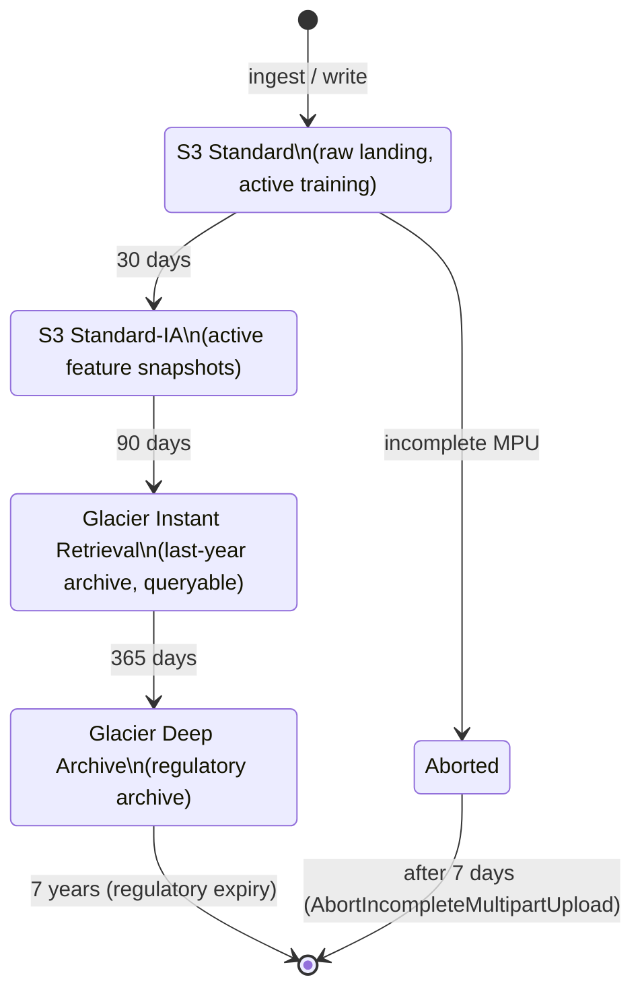
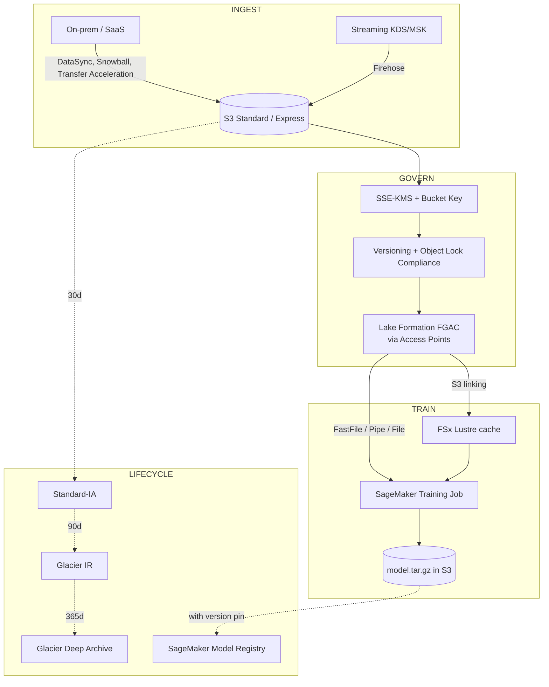

# Chapter 6 — S3 Deep Dive for ML Workloads

> **Goal of this chapter:** to give you a working, exam-grade mental model of Amazon S3 from the *ML engineer's* perspective. Not "S3 for web developers," not "S3 for backup," but S3 as the substrate that every other AWS ML service — SageMaker training jobs, Feature Store offline, Bedrock Knowledge Bases, Athena, Glue, EMR, Ground Truth, Model Registry — lives on top of. By the end of the chapter you should be able to recite every storage class with its minimum-duration and retrieval-cost properties, name all four SageMaker training input modes and pick the right one from a scenario sentence, write a bucket policy that denies non-TLS access, explain why S3 Bucket Keys cut your KMS bill by 99%, and describe — to a skeptical model risk auditor — exactly which version of which dataset was used to train a given model in production.

---

## 6.1 Why a whole chapter on S3?

If you came to this book expecting Part B's storage chapter to be a casual stop on the way to "the real ML content" in Parts E–H, recalibrate now. S3 is not a side topic on the MLA-C01; it is the bedrock under every other domain. The exam knows this and tests it across all four content areas. Domain 1 (Data Prep, 28%) is mostly "which S3 thing do you point at this data?" Domain 2 (Model Dev, 26%) is mostly "which S3 input mode does this training job need?" Domain 3 (Deployment, 22%) reuses S3 as the model-artifact registry and the data-capture sink. Domain 4 (Monitor + Security, 24%) is largely "which S3 encryption, lifecycle, and IAM control does this scenario need?" An MLE who fluently navigates IAM but stumbles on S3 storage classes will lose easy points across every domain. An MLE who fluently navigates both — and the integration between the two — will pick up easy points across every domain.

There is also a real-world reason this chapter is long. Production ML systems rot from the *data* layer up, not from the model layer down. Of the failure modes we catalogued in Chapter 1 — training-serving skew, data drift, feature store staleness, schema evolution — every single one has a root cause that traces back to a decision made (or *not* made) at the S3 bucket-and-prefix level. Choose the wrong storage class for your training shards and your distributed GPU job stalls on first-byte latency. Skip versioning on the bucket that holds your training data and you cannot reproduce the model the auditor is asking about. Forget to enable Bucket Keys on the KMS-encrypted bucket your SageMaker job reads and your monthly KMS bill quietly eats your model's ROI. Misconfigure Block Public Access and your PHI training set ends up indexed by Google. The decisions you make in this chapter are the decisions you'll defend in front of a regulator three years from now.

A second framing point worth setting up front: **S3 is not a filesystem.** It is an object store with a flat keyspace, eventual-consistency-turned-strongly-consistent semantics, a partition-aware request-rate model, and a billing surface that includes storage, requests, data transfer, KMS, monitoring, retrieval, and lifecycle-transition costs as separately-priced line items. Every word in that sentence matters when you're designing a training pipeline that has to be both fast and cheap. The mental model "S3 is just a really big NAS in the sky" is the source of most beginner mistakes — and most surprising AWS bills.

Anchor facts to memorize before you read further. The cert tests these as flat-out recall:

- **11 nines of durability** (99.999999999%) across every standard S3 class — the only number you'll see on every AWS storage slide.
- **5 GB** = single-PUT hard limit; objects above this **must** use multipart upload.
- **5 TB** = single-object hard cap, achieved via 10,000 parts × max 5 GB each.
- **3,500 PUT/COPY/POST/DELETE per second** and **5,500 GET/HEAD per second** *per partitioned prefix*. There is no per-bucket limit on prefixes.
- **SSE-S3 has been the default encryption for every new bucket since 2023-01-05.** Unencrypted-by-default buckets no longer exist.
- **Block Public Access defaults to ALL FOUR toggles ON for new buckets since April 2023.**
- **Object Ownership = Bucket owner enforced (ACLs disabled)** is the default for new buckets since April 2023.

Hold these in working memory. The rest of the chapter unpacks them and adds the second-order knowledge — input modes, lifecycle ladders, Iceberg integration, vector storage, multi-region patterns — that the exam expects you to integrate.

---

## 6.2 The storage class matrix — the canonical table

S3 storage classes are the single highest-yield exam table in all of MLA-C01. The official [storage class comparison](https://docs.aws.amazon.com/AmazonS3/latest/userguide/storage-class-intro.html#sc-compare) is one screen long; it is also the most-tested screen in the entire AWS documentation set for this cert. Memorize the rows.

| Class | API name | Durability | Availability | AZs | Min duration | Min billable size | Retrieval cost | Typical ML use |
|---|---|---|---|---|---|---|---|---|
| **S3 Standard** | `STANDARD` | 11 nines | 99.99% | ≥3 | None | None | None | Hot training data, current model artifacts, Feature Store offline live tier |
| **S3 Intelligent-Tiering** | `INTELLIGENT_TIERING` | 11 nines | 99.9% | ≥3 | None | None (auto-tier) | None | Datasets with unknown/shifting access pattern; auto-moves to IA at 30d, Archive Instant at 90d |
| **S3 Standard-IA** | `STANDARD_IA` | 11 nines | 99.9% | ≥3 | **30 days** | **128 KB** | **Per-GB fee** | Cold training datasets accessed ~monthly, prior-quarter model archives |
| **S3 One Zone-IA** | `ONEZONE_IA` | 11 nines | 99.5% | **1** | 30 days | 128 KB | Per-GB fee | Re-derivable secondary copies; CRR replica destinations |
| **S3 Express One Zone** | `EXPRESS_ONEZONE` | 11 nines | 99.95% | **1** | None | None | None | **Single-digit-ms** GPU training input; co-locate compute + storage in one AZ |
| **S3 Glacier Instant Retrieval** | `GLACIER_IR` | 11 nines | 99.9% | ≥3 | **90 days** | 128 KB | Per-GB fee | Quarterly-accessed historical training data; audit archives with ms access |
| **S3 Glacier Flexible Retrieval** | `GLACIER` | 11 nines | 99.99% after restore | ≥3 | **90 days** | 40 KB overhead | Per-GB fee + restore in **1 min – 12 hr** | Annual retrains on long-tail data |
| **S3 Glacier Deep Archive** | `DEEP_ARCHIVE` | 11 nines | 99.99% after restore | ≥3 | **180 days** | 40 KB overhead | Per-GB fee + restore in **12 – 48 hr** | 7-year regulatory archives (HIPAA, FINRA, SEC Rule 17a-4) |
| Reduced Redundancy | `REDUCED_REDUNDANCY` | 99.99% | 99.99% | ≥3 | None | None | None | **Deprecated** — never the right answer on the exam |
| S3 on Outposts | `OUTPOSTS` | n/a | n/a | n/a | n/a | n/a | n/a | On-prem data residency; out of mainstream exam scope |

### 6.2.1 First-principles takeaway: three independent axes

Memorizing the table cold is necessary but not sufficient. The richer mental model is that every storage class is a point in a three-axis space:

1. **AZ count.** Multi-AZ (Standard, Standard-IA, Intelligent-Tiering, the Glacier family) vs single-AZ (One Zone-IA, **Express One Zone**). Single-AZ classes are cheaper *and* lower-availability — they trade durability of an entire dataset for cost when you can re-derive the data from a multi-AZ source.
2. **Access tier.** Instant millisecond access (Standard, Express, IA, Glacier Instant Retrieval, all Intelligent-Tiering tiers) vs **restore-required** (Glacier Flexible Retrieval, Glacier Deep Archive). The restore-required classes save money at the cost of "you must initiate a restore job and wait minutes-to-hours before the bytes are accessible."
3. **Commitment.** Minimum storage duration of 30 / 90 / 180 days. Deleting early still bills for the full minimum window — this is one of the highest-yield gotchas on the cert.

Every "which storage class?" question on the exam can be decoded by locating the scenario on these three axes. "We need this data accessible in milliseconds, we don't know the access pattern, and we want to auto-optimize cost" → multi-AZ + instant + no commitment → **Intelligent-Tiering.** "We need millisecond GPU training reads, we accept single-AZ risk, we'll pay more per GB stored" → single-AZ + instant + no commitment + ultra-low latency → **Express One Zone.** Decode the axes, the answer falls out.

### 6.2.2 ML decision shortcuts

The cert rewards pattern matching. Internalize these phrasings:

- **"Unknown access pattern, want to auto-optimize cost"** → **Intelligent-Tiering** (no retrieval fees ever).
- **"Single-digit-ms latency for distributed GPU training, willing to pay"** → **S3 Express One Zone** (or FSx Lustre — Chapter 7 covers that trade-off in depth).
- **"7-year audit archive of training data"** → **Glacier Deep Archive** + Object Lock Compliance.
- **"Recreatable secondary copies of preprocessed features"** → **One Zone-IA**.
- **"Re-running training quarterly on last year's data"** → **Glacier Instant Retrieval.**

### 6.2.3 Pricing anchors (us-east-1, May 2026)

| Class | Storage $/GB-mo |
|---|---|
| Standard (first 50 TB) | ~$0.023 |
| Standard-IA | ~$0.0125 |
| One Zone-IA | ~$0.010 |
| Intelligent-Tiering (Frequent) | ~$0.023 + $0.0025/1000 objects monitoring (skipped for objects <128 KB) |
| **Express One Zone** | **~$0.16** (≈7× Standard, but request charges 50% lower) |
| Glacier Instant Retrieval | ~$0.004 |
| Glacier Flexible Retrieval | ~$0.0036 |
| Glacier Deep Archive | ~$0.00099 |

Exam questions rarely ask for absolute dollars but frequently test **relative** ordering. The storage-cost order is `Standard > Standard-IA > One Zone-IA > Glacier IR > Glacier Flex > Glacier Deep`, and the latency/retrieval-cost order is the **inverse**. Memorize the ordering, not the dollars — the dollars drift quarterly, the ordering doesn't.

---

## 6.3 S3 Express One Zone — the 2024 ML game-changer

### 6.3.1 What it is

S3 Express One Zone, GA in late 2023, is a **purpose-built single-AZ storage class** delivering **consistent single-digit-millisecond first-byte latency** with **request prices ~50% lower** than S3 Standard. To enable the latency story, it uses a new bucket type — the **directory bucket** — with a true hierarchical namespace optimization rather than the flat-keyspace partition tricks Standard uses.

### 6.3.2 What makes it different

| Property | Standard | Express One Zone |
|---|---|---|
| Bucket type | General-purpose | **Directory bucket** |
| Namespace | Flat keyspace, prefix-based partitioning | Hierarchical (real folders) |
| AZs | ≥3 | **1 (you pick)** |
| First-byte latency | 100–200 ms typical | **Single-digit ms** |
| Request rate | 3,500 PUT / 5,500 GET per partitioned prefix | **Hundreds of thousands** of req/s per bucket; up to 2M GET/s |
| Encryption choices | SSE-S3, SSE-KMS, DSSE-KMS, SSE-C | **SSE-S3 only** for SageMaker output (per docs) |
| Storage $/GB-mo | $0.023 | $0.16 |
| Request $ | baseline | 50% lower |

### 6.3.3 Where Express actually wins for ML

Independent benchmarks have reported workload speedups in the 5× range — one cited case shrunk a 119-second training-dataset download to 25 seconds. The wins concentrate on **small-object, latency-sensitive** workloads:

1. **Multi-GPU / multi-node training where epoch start latency matters.** Instance reads sample files at ms latency; the per-batch I/O wait shrinks.
2. **Many small training shards.** Image patches, audio clips, tokenized text — each GET savings compounds across millions of reads.
3. **Model checkpoints during long-running training.** Large LLM training writes checkpoints every N steps; faster writes mean less GPU idle time.
4. **Hyperparameter sweeps** where the same shard is read N times by N concurrent jobs.
5. **Interactive notebook scratch space** in SageMaker Studio for fast iteration.

### 6.3.4 Where Express does NOT pay off

- **Large sequential streaming reads** (one 10 GB Parquet file): latency improvement is dwarfed by network throughput, and the per-GB storage premium kills the economics.
- **Multi-AZ resilience requirements.** Express is single-AZ. If the AZ goes, your bucket is unavailable.
- **Cross-region disaster recovery.** Express does not replicate cross-region.

### 6.3.5 The canonical hybrid pattern

The AWS-recommended (and what large labs like Anthropic publicly confirm) deployment shape is **never use Express as your gold-of-record**:

```
S3 Standard (multi-AZ, durable, cheap to store)
        │
        │ aws s3 sync (or sagemaker FastFile mode)
        ▼
S3 Express One Zone (single-AZ, expensive to store, cheap to read)
        │
        ▼
SageMaker training job (GPU instances in the same AZ)
```

Train, save the final checkpoint back to Standard, then tear down the Express prefix. The Express tier is *transient training-time storage* — the durable artifact lives in Standard.

⚠️ **Exam alert.** Express One Zone supports **SSE-KMS for general use** but **SSE-S3 only for SageMaker output to directory buckets** (the AWS docs explicitly call this out). If you see a scenario like "the team wants Express One Zone for fast training I/O AND SSE-KMS with a customer-managed CMK on the training output," the correct answer is "you cannot do both for SageMaker output to a directory bucket; pick Standard with SSE-KMS, or accept SSE-S3 on Express."

---

## 6.4 S3 Tables — Iceberg-native (GA December 2024)

### 6.4.1 What it is

S3 Tables is a **new purpose-built bucket type** that natively stores **Apache Iceberg** tables. Compared to running Iceberg yourself on a general-purpose bucket, S3 Tables gives you:

- **Up to 10× higher transaction rate** on manifest/metadata operations.
- **Up to 3× faster query performance** because the file layout is continuously optimized for engines.
- **Automatic compaction, snapshot expiration, and unreferenced-file cleanup** — no manual `OPTIMIZE` / `VACUUM` jobs to schedule and pay for.
- **Native integration** with Athena, EMR, Glue, Redshift, QuickSight, SageMaker Lakehouse, and any Iceberg client (Spark, Trino, Flink, Snowflake).

### 6.4.2 Why Iceberg won the open-table-format war

To frame S3 Tables correctly, you need to know which format it bets on. The 2026 consensus:

| Format | Installed base | Adoption momentum | Sweet spot |
|---|---|---|---|
| **Delta Lake** | >60% of Fortune 500 via Databricks | Flat — losing share to Iceberg | Pure Databricks shops; SQL-heavy analytics |
| **Apache Iceberg** | All major clouds + Snowflake + BigQuery + AWS S3 Tables | **Winning** | Multi-engine analytics; ML lakehouses; vendor-neutral |
| **Apache Hudi** | Uber, Amazon, Walmart, Robinhood | Stable in its niche | High-frequency upserts; streaming CDC |

Iceberg won because it is genuinely engine-neutral. Delta's UniForm and Hudi's native Iceberg-reader both let those formats *be read as Iceberg* — which is the strongest possible signal that Iceberg is the interoperability standard the rest of the ecosystem is converging on. AWS's bet on Iceberg via S3 Tables is consistent with this.

### 6.4.3 ML use cases

- **Transactional, ACID, schema-evolving training feature tables** that need to be queryable by both Athena and SageMaker Spark without writing your own Iceberg maintenance jobs.
- **Cross-account / cross-region Iceberg replication** (a 2025 update added metadata + snapshot co-replication).
- **Source-of-truth tables for SageMaker Lakehouse** alongside the Glue Catalog.
- **Feature Store offline store** (Chapter 19) — the offline store now writes Iceberg on S3 by default.

### 6.4.4 Exam framing

- "Need ACID + time travel + schema evolution + automatic optimization, queryable by Athena and Spark" → **S3 Tables**.
- "Need cheapest, willing to tune Iceberg compaction myself" → general-purpose S3 + Iceberg + EMR.
- "Need legacy Hive table behavior" → general-purpose S3 + Glue Catalog (and start planning the migration).

---

## 6.5 S3 Vectors — the storage-first vector store (GA January 2026)

### 6.5.1 What it is

A **native vector storage class** that lets you persist high-dimensional embeddings directly in S3 with **purpose-built APIs for k-NN search**. Per-index capacity is **2 billion vectors**. The cost claim is **up to 90% cheaper** than pgvector / OpenSearch / Pinecone for storage-heavy, query-light workloads. The latency tradeoff is explicit: this is **not** a sub-50ms p95 vector DB. It is built for "RAG with moderate QPS," not for real-time recommender inference.

### 6.5.2 Where it sits in the vector landscape

| Vector store | Where it wins | Where S3 Vectors beats it |
|---|---|---|
| **Pinecone** | Sub-50ms p95 at high QPS, managed multi-tenant | Cost at large scale; AWS-native IAM/encryption; pay-per-use |
| **Amazon OpenSearch k-NN / Serverless** | Hybrid search (BM25 + vectors), 9.5× faster vector ops in 3.0 | Cost — no cluster to size; storage-first pricing |
| **Aurora pgvector / RDS pgvector** | Mid-scale (<50M vectors), transactional, no new DB | Scale (S3 Vectors goes to 2B/index); cost at scale |
| **Self-managed Faiss/HNSW on EC2** | Latency, full control | Ops (zero) and cost |

### 6.5.3 The 2026 hybrid pattern

The shape that's emerging in AWS blogs and customer talks:

```
Hot vectors:   OpenSearch k-NN or Pinecone   (top-K interactive, <50ms)
Cold vectors:  S3 Vectors                    (long-tail, batch RAG, cheap)
```

Promote hot vectors when access frequency exceeds a threshold; demote back when cold. Customers report 70–90% savings on archive-tail workloads.

### 6.5.4 Bedrock Knowledge Bases integration

Probably the killer feature: **Bedrock Knowledge Bases natively support S3 Vectors as a vector store** (since the July 2025 release). RAG pipelines that previously required an OpenSearch Serverless collection ($300+/month minimum even at idle) can now run on pay-per-use S3 Vectors at near-zero idle cost. For small-to-medium knowledge bases this is a 90%+ TCO reduction. Forward reference: Chapter 13 covers the full Bedrock KB picker; this chapter just establishes that S3 Vectors is one of the slots.

⚠️ **Exam alert.** "S3 Vectors replaces OpenSearch" is **false**. S3 Vectors is *cheaper at-rest storage* for embeddings; OpenSearch wins on latency and hybrid search. The right answer when a scenario stresses "billions of vectors, RAG knowledge base, cost-sensitive, latency tolerant" is S3 Vectors. The right answer when a scenario stresses "sub-50ms vector recall at high QPS" is OpenSearch.

---

## 6.6 Lifecycle policies — pruning the data lake on autopilot

### 6.6.1 Mechanics

A lifecycle configuration is a **bucket-level JSON rule set**. Each rule has:

- A **filter** (prefix, tag, object-size range, or whole bucket).
- One or more **transition actions** (move to a colder class after N days).
- An optional **expiration action** (delete the object — or for versioned buckets, add a delete marker / permanently expire noncurrent versions).
- An optional `AbortIncompleteMultipartUpload` action.

Rules run **once per day**; at most one transition per object per day. Minimum-duration constraints are enforced — deleting a Glacier object after 30 days still bills for the full 90-day commitment.

### 6.6.2 The canonical ML lifecycle ladder



### 6.6.3 The silent cost leak — incomplete multipart uploads

**Always add** an `AbortIncompleteMultipartUpload` rule with `DaysAfterInitiation: 7`. Without it, an aborted `boto3.upload_file` on a 50 GB training-data shard sits forever as parts billed at full Standard rate. AWS Trusted Advisor flags it; the exam tests it; the auditor finds it.

```json
{
  "Rules": [{
    "ID": "abort-stuck-mpu",
    "Status": "Enabled",
    "Filter": {},
    "AbortIncompleteMultipartUpload": { "DaysAfterInitiation": 7 }
  }]
}
```

This single rule is the most common "free money" finding in AWS cost audits. The MLA-C01 will test it as a multiple-choice trap: a question will describe an unexplained S3 cost line and one of the answers will be "enable an `AbortIncompleteMultipartUpload` lifecycle rule" — that's almost always the right answer.

---

## 6.7 Versioning, MFA Delete, and Object Lock — reproducibility and WORM

### 6.7.1 Versioning

Bucket-level toggle, off by default. Once enabled:

- Every PUT creates a new **version ID**.
- DELETE inserts a **delete marker** — original versions remain intact.
- Reads of `s3://bucket/key` return the **current** version; reads with `?versionId=...` return any historical version.

**Why ML cares:** reproducibility. `s3://bucket/train/v2026-05-26.parquet?versionId=XYZ` pins the exact bytes you trained on. Pair this with the **SageMaker Model Registry** (Chapter 51) to link a model version to the dataset version, and you get audit-grade lineage. Without versioning, "we trained on the data at this prefix as of last Tuesday" is unverifiable — a regulator's nightmare and an MLE's career-limiting moment.

### 6.7.2 MFA Delete

Account-root-only setting that cannot be enabled via the console — it requires CLI + root credentials + a hardware or virtual MFA token. Once on, **permanent version deletion** and **disabling versioning** require a TOTP token in the request. Used in regulated training pipelines where accidental destruction of training data must be impossible.

### 6.7.3 Object Lock — WORM at object granularity

Two retention modes that the exam will absolutely test:

| Mode | Who can delete during retention? |
|---|---|
| **Governance** | Privileged IAM principals with `s3:BypassGovernanceRetention` can override |
| **Compliance** | **Nobody**, not even the root user, until retention expires |

Object Lock requires **versioning enabled at bucket creation time** (or shortly after) and is the correct answer for **FINRA / SEC Rule 17a-4 / HIPAA / GDPR data residency** 7-year retention of training data, model artifacts, and audit logs.

**Legal Hold** is a separate per-object flag, independent of retention period, that blocks deletion until explicitly cleared. Used for litigation holds where you don't yet know how long the retention needs to be.

⚠️ **Exam alert.** "Governance vs Compliance" is one of the most-tested distinctions in Domain 4. The trap is to read "Governance" and assume it means *stricter*. It does not. **Compliance is stricter** — nobody can override it, including root. Governance allows privileged override. If the scenario mentions "regulatory immutability that survives a rogue admin," the answer is Compliance.

---

## 6.8 Encryption — the four server-side modes plus bucket keys

### 6.8.1 Default since 2023-01-05

Per the [S3 encryption docs](https://docs.aws.amazon.com/AmazonS3/latest/userguide/UsingEncryption.html), **every S3 bucket now has SSE-S3 as the base default encryption** — no extra cost, no performance impact, automatic on every new PUT. Unencrypted objects no longer exist by default. This is a *change* since the SAA-C03 / older exams, and the cert tests the new default.

### 6.8.2 Comparison

| Mode | Key managed by | Audit story | KMS cost? | When to use for ML |
|---|---|---|---|---|
| **SSE-S3** (`AES256`) | S3 (AWS-owned key per region, derived per-object) | Logged in CloudTrail as `SSE-S3` | No | Default; good enough for non-sensitive data; required for Express One Zone SageMaker output |
| **SSE-KMS** (`aws:kms`) | Customer-managed CMK or AWS-managed `aws/s3` | **Per-decrypt CloudTrail event** with principal + key ARN | **Yes — per KMS API call** | Default for PHI/PII/PCI; required when auditor must see who decrypted what |
| **DSSE-KMS** (`aws:kms:dsse`) | Customer-managed CMK, **two independent KMS-derived layers** | Same as SSE-KMS | Yes (2× per request) | FedRAMP High, DoD IL5 dual-layer encryption requirements; rare on MLA-C01 |
| **SSE-C** | **Customer-supplied key in every request header** | S3 cannot see the key | No (you bring the key) | Niche; awkward with SageMaker training jobs |

### 6.8.3 S3 Bucket Keys — the KMS cost-saver you cannot skip

Default SSE-KMS calls KMS **once per object operation** during PUT and GET. At a **SageMaker distributed training job** reading 100,000 Parquet files repeatedly across an epoch, that's millions of KMS API calls per training run. At $0.03 per 10,000 KMS calls, the math gets ugly fast: 1 billion reads/day = **~$3,000/day** in KMS alone.

A **bucket key** is a short-lived AES key derived from the CMK at the bucket level and cached by S3 for time-limited reuse. Once enabled (a single toggle), KMS request volume drops by **up to 99%**, and the KMS bill drops in proportion. AWS reports customers have aggregated **>$80M in savings** since the feature launched.

**Always enable bucket keys for ML buckets** unless your security policy explicitly forbids it. There is essentially no good reason not to.

### 6.8.4 Migrating an existing bucket to bucket keys

You cannot retroactively bucket-key already-encrypted objects without re-encrypting them. The canonical migration:

1. Turn on the bucket-key setting at the bucket level.
2. *New* writes immediately benefit from the bucket key.
3. For old objects: **S3 Batch Operations Copy** (in-place copy with new encryption settings).

Caveats: copy resets `LastModified` (your lifecycle rules will re-evaluate); objects >5 GB need multipart copy; tag re-encrypted objects so they can be managed under separate lifecycle policies.

### 6.8.5 In-transit encryption — the TLS-only bucket policy

TLS 1.2+ is enforced for all S3 API calls by default. To explicitly **require** TLS even for legacy callers (and to satisfy compliance frameworks that demand a written deny), attach a bucket policy that denies non-TLS requests:

```json
{
  "Sid": "DenyInsecureTransport",
  "Effect": "Deny",
  "Principal": "*",
  "Action": "s3:*",
  "Resource": [
    "arn:aws:s3:::ml-bucket",
    "arn:aws:s3:::ml-bucket/*"
  ],
  "Condition": { "Bool": { "aws:SecureTransport": "false" }}
}
```

Exam questions about "deny unencrypted-in-transit access" expect this idiom verbatim.

### 6.8.6 When CMKs are worth the extra cost for ML

- **Cross-account model artifact sharing.** MLOps account writes artifacts; prod inference account reads them. Use a CMK with a key policy that grants the inference role `Decrypt`. Revoke access by editing the key policy — instant kill switch.
- **Per-tenant key isolation** in multi-tenant ML platforms. One CMK per tenant; audit logs prove tenant A never decrypted tenant B's data.
- **Regulated workloads** (HIPAA, PCI, SOX) where auditors require customer-managed keys with documented rotation.

For pure internal feature stores with no cross-account boundary, SSE-S3 or SSE-KMS with the AWS-managed key plus bucket keys is the cost-optimal default.

Forward reference: Chapter 8 covers KMS itself — key policies, key rotation, grants, multi-region keys — in depth. This chapter establishes the S3-side knobs.

---

## 6.9 Performance — the prefix-scaling rule

### 6.9.1 The canonical numbers

From the [optimizing performance](https://docs.aws.amazon.com/AmazonS3/latest/userguide/optimizing-performance.html) page:

> "Your application can achieve at least **3,500 PUT/COPY/POST/DELETE** or **5,500 GET/HEAD requests per second per partitioned Amazon S3 prefix**. There are no limits to the number of prefixes in a bucket."

The load-bearing word is **partitioned**. S3 auto-partitions a bucket's keyspace into independent shards as load patterns emerge. Each shard delivers the per-prefix limits above. **Spreading writes and reads across many prefixes multiplies your total throughput linearly.** With 10 prefixes you get 55,000 GET/s aggregate; with 100 prefixes, 550,000.

### 6.9.2 Scaling out the prefix — what an ML engineer actually does

When SageMaker spins up a **distributed training job** reading from S3 and you see **HTTP 503 `SlowDown`** errors in CloudWatch, it means a single prefix is hot. The fix:

**Bad layout (single hot prefix):**

```
s3://bucket/training-data/file-000001.parquet
s3://bucket/training-data/file-000002.parquet
...
s3://bucket/training-data/file-999999.parquet
```

**Good layout (hashed prefix → many partitions):**

```
s3://bucket/training-data/a1/file-000001.parquet
s3://bucket/training-data/b7/file-000002.parquet
...
s3://bucket/training-data/3f/file-999999.parquet
```

The hash bucket (`a1`, `b7`, ...) gives S3 16² = 256 partitionable prefixes. With 256 prefixes you can sustain ~1.4M GET/s — enough for any non-trivial multi-node training job.

For time-partitioned data, avoid bare `YYYY/MM/DD/HH/...` if it causes hot reads on the *current* hour. Add a hash prefix **before** the date. Pinterest's published war story: after rolling a "20-bit base hash" prefix scheme out to ~66% of their top-10 datasets, 503 SlowDown tickets disappeared.

### 6.9.3 The sequential-prefix trap (war story)

A common mistake: keys like `s3://bucket/logs/2026/05/26/00/00/00/event-000001.json`. Every write goes into the *same* prefix (the current minute), so the team hits 3,500 PUT/s and starts getting 503s. S3 *does* auto-partition, but it takes minutes to hours and the symptoms are flaky writes during that window. The fix — what Stripe, Shopify, and Pinterest all do variants of — is to inject a hash prefix in front of the date so the first 6–8 characters are entropic.

### 6.9.4 The "small files" cliff

10 million × 10 KB Parquet files vs 10 thousand × 10 MB Parquet files: same total bytes, *radically* different training throughput. The small-file pattern hits:

- Per-object overhead in `s3fs`, `aws-sdk`, `pyarrow.parquet`.
- The 5,500 GET/s ceiling per prefix.
- Slow `LIST` operations for catalog ops.
- KMS-per-object cost (a Bucket Keys problem, see §6.8.3).

**Fix:** run Iceberg/Delta `OPTIMIZE` jobs to coalesce small files into 128 MB – 1 GB target sizes. Hudi has `clustering` for the same purpose.

### 6.9.5 Byte-range fetches

Use `Range: bytes=N-M` to **parallelize a single large file** across multiple workers — useful for reading a 50 GB Parquet file across a multi-node training job. Recommended chunk size: 8–16 MB.

### 6.9.6 Single-instance and aggregate throughput

A single EC2 instance can saturate up to **100 Gbps** of S3 bandwidth. Multi-instance aggregates reach **multiple Tbps**. S3 is rarely the bottleneck if you've partitioned correctly.

### 6.9.7 503 SlowDown — what it means

503s during scaling are **expected and transient**. AWS's own docs say: "while Amazon S3 is scaling to your new higher request rate, you may see some 503 (Slow Down) errors. These errors will dissipate when scaling is complete." Use **exponential backoff** in your SDK (`boto3` does this automatically with `Config(retries={'mode': 'adaptive'})`).

---

## 6.10 Multipart upload — required for >5 GB, recommended for >100 MB

| Threshold | Behavior |
|---|---|
| **>5 GB** | Single PUT **rejected** — multipart is **mandatory**. |
| **100 MB – 5 GB** | Single PUT works but multipart is **strongly recommended** for parallelism and resumability. |
| **Each part** | 5 MB – 5 GB (last part may be <5 MB). |
| **Max parts per upload** | 10,000 → max object size **5 TB**. |
| **Resumability** | If a part fails, retry just that part. |
| **Parallelism** | The `boto3` transfer manager picks 8 concurrent uploads by default. |

### 6.10.1 ML implications

- **SageMaker training jobs uploading `model.tar.gz`** above 5 GB automatically go multipart via the boto3 transfer manager.
- **Large dataset uploads** from training-prep scripts should explicitly tune `TransferConfig(multipart_threshold=100*1024*1024, max_concurrency=16)`.
- The lifecycle `AbortIncompleteMultipartUpload` rule (see §6.6.3) is the only thing preventing failed uploads from billing forever.

---

## 6.11 SageMaker training input modes — the chapter's most-tested section

This is the section the MLA-C01 tests most surgically. The canonical reference is [Setting up training jobs to access datasets](https://docs.aws.amazon.com/sagemaker/latest/dg/model-access-training-data.html). Treat every distinction below as a likely exam question.

### 6.11.1 The four S3-backed input modes

| Mode | How it works | Startup time | Disk required | Random access | Source types supported |
|---|---|---|---|---|---|
| **File** (default) | SageMaker **downloads** the entire dataset to instance EBS, **then** training starts. | Slow (proportional to dataset size) | Must fit dataset + model + scratch on EBS | Yes | S3Prefix, ManifestFile, AugmentedManifestFile |
| **FastFile** | SageMaker **mounts** the S3 prefix as a POSIX-compliant FUSE filesystem; data streams on demand. | **Fast** — depends on number of files, not size | Only model + scratch | Yes (works best with sequential reads) | **S3Prefix only** (no manifest support) |
| **Pipe** | Data **streamed via FIFO** (named pipe), prefetched at high concurrency by SageMaker. Each pipe read once, sequentially. | Fast | Only model + scratch | No (sequential only) | S3Prefix, ManifestFile, AugmentedManifestFile |
| **Managed Files** (Express One Zone) | All three modes above also work against **Express One Zone directory buckets** as source. | Fastest first-byte; ms-level | Mode-dependent | Mode-dependent | S3 directory bucket |

### 6.11.2 FastFile — the modern default

Per the docs, FastFile provides "file system access to an Amazon S3 data source while leveraging the performance advantage of pipe mode." Most new ML projects pick FastFile because:

- Training starts in seconds even on TB datasets.
- Standard POSIX `open()` / `read()` in user code — no API changes.
- Random access works (Pipe cannot).
- Replaces Pipe for most use cases.

⚠️ **Exam alert.** "FastFile mode supports manifest files" is **false**. FastFile supports `S3Prefix` only. If the scenario says "we need a `ManifestFile` to selectively include a subset of objects from a much larger lake," the answer is **File or Pipe**, not FastFile. This is one of the highest-frequency traps in the input-mode question family.

A second FastFile gotcha worth flagging from the docs: if CloudTrail S3 data events are enabled, FastFile generates a **CloudTrail event per S3 GET**, which can dominate CloudTrail bills on a large training job. Same problem for KMS — every per-object decrypt event bills. **Enable Bucket Keys** before running large FastFile training jobs.

### 6.11.3 Pipe mode — when it still wins

Pipe mode is the right answer when:

1. **You're using a SageMaker built-in algorithm that requires RecordIO-Protobuf** (Linear Learner, k-means, PCA, Factorization Machines, NTM, Object2Vec) — these built-ins consume Pipe natively for maximum throughput.
2. **You need managed server-side sharding + shuffling.** Pipe handles both.
3. **Sequential-only access is fine** — image classification on tar shards, TFRecord streams.

⚠️ **Exam alert.** "Pipe mode supports random access" is **false**. Pipe is FIFO; each pipe is read once per process. If the user code does `f.seek()` or random index access into the dataset, Pipe will not work — pick FastFile or File.

### 6.11.4 File mode — the simplest, when it fits

Pick File mode for:

- Quick PoCs and debugging.
- **SageMaker Local Mode** — File mode works locally; Pipe does not always.
- Small datasets that fit on the instance EBS volume.

### 6.11.5 `S3DataSource` types — what's in the `TrainingInput`

When you configure a SageMaker training job's `InputDataConfig`, the `S3DataSource` block has an `S3DataType` field:

| `S3DataType` | What | When to use |
|---|---|---|
| **`S3Prefix`** | Train on **every object** under the given prefix. | The 90% case; works with all three input modes (File, FastFile, Pipe). |
| **`ManifestFile`** | A JSON file listing the exact S3 object keys to include. | Selective training — subset of a larger lake. **NOT supported in FastFile.** |
| **`AugmentedManifestFile`** | JSON-lines file where each line has both an S3 reference AND inline metadata/labels. Used heavily with **SageMaker Ground Truth** outputs. | Labeled data with per-object annotations (bounding boxes, classes). **Pipe mode only.** |

⚠️ **Exam alert.** Memorize this matrix of mode × source compatibility:

| Source \ Mode | File | FastFile | Pipe |
|---|---|---|---|
| `S3Prefix` | ✅ | ✅ | ✅ |
| `ManifestFile` | ✅ | ❌ | ✅ |
| `AugmentedManifestFile` | ❌ | ❌ | ✅ |

The two cells that catch people: ManifestFile is **not** valid with FastFile; AugmentedManifestFile is **Pipe-only**.

### 6.11.6 `S3DataDistributionType` — how data is split across instances

Inside `S3DataSource` you also pick `S3DataDistributionType`:

| Value | Behavior | When |
|---|---|---|
| **`FullyReplicated`** (default) | Every training instance gets the **whole dataset**. | Small data; algorithms that need every record on every node (parameter-server style). |
| **`ShardedByS3Key`** | Each instance gets a **disjoint subset** of S3 keys. | Distributed data-parallel training — each worker processes its shard. |

For a 4-node `ShardedByS3Key` job over 100 objects, each node sees ~25 objects.

### 6.11.7 Decision tree (memorize)

```
Q1: Is data in S3?
  No  → EFS (POSIX shared) or FSx Lustre (HPC) — see Ch 11
  Yes → Q2

Q2: Fits on instance EBS and runtime ≤ tens of minutes?
  Yes → File mode (simplest, supports Local Mode)
  No  → Q3

Q3: SageMaker built-in algo requiring RecordIO-Protobuf?
  Yes → Pipe mode (best startup, native managed shard/shuffle)
  No  → Q4

Q4: Custom training script (TF / PyTorch / HF), needs random access?
  Yes → FastFile mode (modern default)
  No  → FastFile or Pipe — both work; prefer FastFile

Q5: Do you need to selectively include a subset (manifest)?
  Yes → File (for random access) or Pipe (for streaming) — NOT FastFile
  No  → Continue with FastFile

Q6: I/O still bottlenecks multi-GPU training after FastFile?
  → FSx Lustre with S3 linking (Ch 11) OR S3 Express One Zone (same AZ)
```

### 6.11.8 Sample SageMaker Python SDK call

```python
from sagemaker.inputs import TrainingInput

train_input = TrainingInput(
    s3_data='s3://ml-bucket/training-data/',
    distribution='ShardedByS3Key',         # split keys across instances
    s3_data_type='S3Prefix',               # or 'ManifestFile' / 'AugmentedManifestFile'
    input_mode='FastFile',                 # or 'File' / 'Pipe'
    content_type='application/x-parquet',
)

estimator.fit({'training': train_input})
```

---

## 6.12 Access controls — policies, BPA, Access Points, MRAP

### 6.12.1 The layered access model

S3 evaluates a request across:

1. **Identity policy** (IAM user/role policy).
2. **Bucket policy** (resource policy on the bucket).
3. **Access Point policy** (if the request came through an access point).
4. **ACLs** (legacy — see §6.12.4).
5. **Block Public Access** settings.
6. **Object Lambda access policies** (if applicable).

**Explicit `Deny` anywhere wins.** Otherwise, the union of `Allow`s grants access. This evaluation order is core IAM material from Chapter 5 — go back if it's fuzzy.

### 6.12.2 Bucket policies — the workhorse

JSON resource policies attached to the bucket. The most exam-relevant patterns:

```json
{ "Sid": "DenyUnencryptedUploads",
  "Effect": "Deny", "Principal": "*", "Action": "s3:PutObject",
  "Resource": "arn:aws:s3:::ml-bucket/*",
  "Condition": { "StringNotEquals": { "s3:x-amz-server-side-encryption": "aws:kms" }}}
```

Other classic idioms:

- Restrict to a **VPC endpoint** (`aws:SourceVpce`).
- Restrict to a **specific principal account** (`aws:PrincipalAccount`).
- Force **TLS only** (`aws:SecureTransport` — see §6.8.5).

### 6.12.3 S3 Block Public Access (BPA)

A bucket-and-account-level **kill switch** with four toggles:

- `BlockPublicAcls` — reject any PUT that sets a public ACL.
- `IgnorePublicAcls` — ignore existing public ACLs at evaluation time.
- `BlockPublicPolicy` — reject bucket policies that grant `Principal: "*"` without IP/VPC condition.
- `RestrictPublicBuckets` — restrict cross-account access to buckets currently considered public.

**Default since April 2023:** all four are ON for new buckets. The exam answer to "how do I make sure no bucket in my org is public?" is "enable BPA at the **account** level."

### 6.12.4 ACLs (legacy)

Per-object grants (READ, WRITE, FULL_CONTROL) to predefined groups (AllUsers, AuthenticatedUsers, log-delivery). **AWS recommends turning ACLs OFF** via the **Object Ownership = Bucket owner enforced** setting (default for new buckets since April 2023). When ACLs are disabled, the bucket owner owns every object regardless of uploader.

ACLs persist on the exam mostly as the **wrong answer** — pick bucket policies / IAM over ACLs unless explicitly told otherwise.

### 6.12.5 S3 Access Points

A **named endpoint with its own policy** attached to a single bucket. Each access point has:

- A unique DNS name (`my-ap-accountid.s3-accesspoint.region.amazonaws.com`).
- A standalone access point policy (does not replace the bucket policy — both evaluate).
- Optional **VPC restriction** — can accept only requests from a specific VPC.

**ML pattern:** one bucket `corp-datalake`, multiple access points: `research-ap`, `prod-ap`, `analyst-ap`. Each team's IAM role assumes its access point; the bucket policy delegates the per-team rules to the access point policies. Scales to many teams without bumping the 20 KB bucket-policy size limit.

### 6.12.6 Multi-Region Access Points (MRAP)

A **global endpoint** that routes a request to the nearest (or active-active) replicated bucket. Used when a global training fleet pulls the same dataset and you want lowest-latency reads from each region's compute.

AWS reports up to **60% lower latency** vs hairpinning through one region, because MRAP requests ride the Global Accelerator network. The catch: MRAP is *additive cost* on top of CRR storage duplication.

### 6.12.7 SRR vs CRR vs MRAP — picking the right replication pattern

| Pattern | Purpose | Typical ML use |
|---|---|---|
| **SRR** (Same-Region Replication) | Compliance, log isolation, account separation | Replicate prod features into an ML sandbox account in the same region |
| **CRR** (Cross-Region Replication) | DR, latency for global readers, region failover | Replicate a feature lake from `us-east-1` to `eu-west-1` so EU SageMaker jobs read locally |
| **MRAP** | Single global endpoint, automatic routing to nearest replicated region | Global recommender inference serving from multiple regions reading the same logical S3 dataset |

For MRAP especially, AWS recommends turning on **Replication Time Control (RTC)** which **SLAs 99.99% of new objects within 15 minutes**. Without RTC, replication is best-effort and can lag minutes-to-hours — catastrophic for an MRAP-fronted feature lake where reads can land in either region.

---

## 6.13 Putting it all together — the ingest-to-train mental model



### 6.13.1 Universal hardening checklist for an ML S3 bucket

This is the checklist you'll find yourself reciting in design reviews. Pin it.

1. **Block Public Access** — all four toggles ON.
2. **Default encryption** — SSE-KMS with a customer-managed CMK + **Bucket Keys** enabled.
3. **Bucket policy denies non-TLS** (`aws:SecureTransport=false` → Deny).
4. **Versioning ON;** for regulated workloads, Object Lock **Compliance**.
5. **Lifecycle rule:** `AbortIncompleteMultipartUpload` after 7 days.
6. **Lifecycle ladder:** Standard → IA → Glacier IR → Deep Archive per access pattern.
7. **Server access logs** OR CloudTrail data events → separate log bucket.
8. **Object Ownership = Bucket owner enforced** (ACLs disabled).
9. **Tagging** — `Environment`, `CostCenter`, `Project`, `DataClassification` for Cost Explorer + Lake Formation FGAC.
10. **Access Points** per team; bucket policy delegates to them.

---

## 6.14 Real-world ML data lakes at scale

The cert tests AWS-managed happy paths, but understanding how real teams operate S3 at petabyte scale anchors the abstractions in concrete shapes.

### 6.14.1 Pinterest — 200 PB / 15,000 Iceberg tables on S3

The richest 2025 case study comes from Pinterest's re:Invent talk (STG211). Headline numbers:

- **15,000 Iceberg tables** on S3, growing ~300% YoY.
- **200 PB** of data sitting in Iceberg on S3 — migrated in-place from Hive to avoid a multi-million-dollar rewrite.
- **500 PB** total data-lake footprint across all formats.
- **600M** monthly users feeding the upstream pipelines.

Three Pinterest-specific patterns recur verbatim across other large-scale write-ups (Stripe, Shopify, Robinhood):

1. **Hash-prefix object paths with early entropy.** Pinterest writes objects on a "20-bit base hash" prefix scheme so the first 8 characters of every key are random. After rolling out to ~66% of their top-10 datasets, 503 SlowDown tickets disappeared. This is the §6.9.2 pattern applied at industrial scale.
2. **User-agent based access control during in-place migrations.** Because Iceberg metadata is the source of truth, *direct* S3 writes to the data directory would corrupt the table. Pinterest layered a bucket policy that only allows writes from Iceberg-aware engines (Trino, Spark, Flink) identified by their `User-Agent`. This let them migrate Hive→Iceberg without first locking down every legacy writer.
3. **S3 Inventory for orphan-file GC.** Iceberg snapshot expiry sometimes leaves data files unreferenced after concurrent writes or failed commits. Pinterest diffs the live Iceberg manifest set against the daily S3 Inventory report and reaps anything older than the snapshot retention window. The same problem; the same canonical pattern.

### 6.14.2 Netflix — 3 PB/day in, 7 PB/day out

Netflix ingests roughly **3 PB/day** and emits **7 PB/day** from its data platform, sourced from **~2 trillion daily events**. Their ML stack:

- **S3 + Apache Iceberg** as the warehouse for recommender training data (Netflix open-sourced Iceberg in the first place — they remain its biggest production case study).
- **Faiss** clusters for low-latency ANN retrieval at serve time, periodically rebuilt from S3 embeddings.
- **EC2 GPU clusters** read directly from S3 over `s3fs` or `FSx for Lustre` for training; small models pull straight from S3, large models hydrate Lustre once and re-read.

The architectural lesson worth internalizing: even Netflix, the inventors of Iceberg, do not treat S3 as a *training-time* filesystem for very large workloads — they project from S3 into Lustre or local NVMe and back. We see the same shape at Anthropic and Meta in public blog posts. This is exactly the §6.3.5 "Standard → Express → GPU" pattern at scale.

### 6.14.3 The medallion (bronze / silver / gold) pattern

This pattern was popularized by Databricks but has become the *lingua franca* of S3 data lakes regardless of engine. The 2026 shape:

```
s3://acme-lake-prod/
├── bronze/                        # raw, append-only, source-of-truth
│   └── ingest_date=2026-05-26/
│       └── source=salesforce/
│           └── topic=opportunities/
│               └── part-00000.parquet.zstd
├── silver/                        # cleansed, conformed, deduped (Iceberg)
│   └── opportunities/
│       ├── data/
│       └── metadata/
└── gold/                          # business-aggregated, ML feature store
    ├── customer_features_daily/
    └── churn_training_v3/
```

Key practice notes:

- **Bronze is immutable** and partitioned by `ingest_date` (not event date) so you can replay yesterday's broken job without overwriting yesterday's real data.
- **Silver is almost always Iceberg** in 2025+. Delta still dominates in pure-Databricks shops; Iceberg won the multi-engine war.
- **Gold is where ML features live** — either as Iceberg tables feeding SageMaker Feature Store / Tecton / Feast, or as Parquet shards keyed by entity_id, depending on the latency budget.

Forward reference: Chapter 13 covers Glue + Athena as the read-side engines for medallion lakes; Chapter 19 covers Feature Store's offline store, which writes Iceberg into the gold tier on S3.

---

## 6.15 Common cost surprises

The S3 bill is one of the easier AWS bills to blow up by accident. The four big ML-relevant traps:

### 6.15.1 Intelligent-Tiering monitoring fee

The headline price is $0.0025 per **1,000 objects per month**. That sounds trivial until you do the math on a typical ML feature lake:

- 500 M small Parquet shards (10 KB each — the result of an over-partitioned Iceberg table) → **$1,250/month** in monitoring alone, *before* storage cost.
- Objects **<128 KB** are exempt from auto-tiering — they stay in Frequent. For ML feature stores with millions of small files, IT often does nothing for you while you pay the monitor fee on the bigger objects.

**Rule of thumb:** only enable IT for prefixes where (a) average object size > 128 KB, (b) access pattern is unknown or bimodal, and (c) objects live > 30 days. For predictable archive data, a direct lifecycle to Glacier IR or Glacier Flexible is cheaper.

### 6.15.2 Glacier retrieval cost shocks

- **Glacier Instant Retrieval:** storage is cheap, but per-GB retrieval (~$0.03/GB) plus per-request charges add up. Pulling back a 10 TB training set for re-training = ~$300 plus request fees.
- **Glacier Flexible / Deep Archive:** bulk restore is cheap but minimum durations are 90/180 days. Delete inside that window and you pay the *remainder* of the minimum duration as if you'd stored it.

The classic ML mistake: lifecycle-transitioning *raw training data* to Glacier Deep Archive then needing it back to re-train after a labeling fix. The retrieval bill can dwarf a year of storage savings.

### 6.15.3 Request cost at high QPS

Standard pricing is $0.005/1,000 PUTs and $0.0004/1,000 GETs. For a recommender doing 50,000 GETs/s of embedding shards (which still happens in practice):

- 50,000 × 86,400 = ~4.3B GETs/day.
- 4.3B × $0.0004 / 1,000 = **~$1,728/day** in request fees alone.

This is one of the strongest economic arguments for moving the hot prefix to **S3 Express One Zone** (request charges 50% lower) or for caching in **ElastiCache** in front of S3.

### 6.15.4 KMS-per-object cost without Bucket Keys

Covered in depth in §6.8.3. Worth re-stating because it's the single biggest unforced error MLEs make: every GET on an SSE-KMS object is a KMS `Decrypt` call. At 1B reads/day = ~$3,000/day in KMS. **Bucket Keys cut this by up to 99%.** Always enable.

---

## 6.16 Common exam traps (consolidated)

| Trap | Reality |
|---|---|
| "Default encryption is SSE-S3 only since 2023" | True — but you can still change to SSE-KMS / DSSE-KMS via bucket default encryption settings. |
| "S3 Express One Zone supports SSE-KMS for SageMaker output" | **False** — SSE-S3 only for SageMaker output to directory buckets. |
| "FastFile mode supports manifest files" | **False** — only `S3Prefix`. ManifestFile / AugmentedManifestFile force File or Pipe. |
| "Pipe mode supports random access" | **False** — Pipe is FIFO, sequential only. |
| "Glacier Flexible Retrieval is ms-accessible like Glacier Instant Retrieval" | **False** — Flexible needs restore (minutes-to-hours). Only Glacier IR is ms-accessible. |
| "Intelligent-Tiering has retrieval fees" | **False** — no retrieval fees on any IT tier. Only per-object monitoring fee. |
| "Lifecycle rules transition instantly" | **False** — rules evaluate once per day. |
| "Minimum storage duration is waived if I delete early" | **False** — early delete still bills for the full 30/90/180 days. |
| "Set ACLs to make buckets private" | **False/legacy** — disable ACLs (Object Ownership = Bucket owner enforced) and use bucket policy + BPA. |
| "Multipart upload is optional for 10 GB objects" | **False** — required for >5 GB. |
| "Per-prefix limits are 3,500 GET / 5,500 PUT" | **Inverted** — 3,500 PUT/COPY/POST/DELETE and 5,500 GET/HEAD per partitioned prefix. |
| "Transfer Acceleration helps inside the same region" | **False** — only across regions / continents. |
| "S3 Vectors replaces OpenSearch" | **False** — S3 Vectors is cheaper at-rest storage; OpenSearch wins on latency / hybrid search. |
| "Governance Object Lock is stricter than Compliance" | **False** — Compliance is stricter; nobody (not even root) can override. |

---

## 6.17 Exercises

Work through each. The answers are at the end.

**Exercise 1.** A team runs a multi-node SageMaker training job that reads 250,000 small JPEG patches from `s3://lab/imgs/`. They observe `503 SlowDown` errors and slow first-batch times. Propose two concrete S3-side changes (no SageMaker config changes) that will fix both symptoms.

**Exercise 2.** Your compliance officer wants 7-year immutability on raw training data such that no human — including the root account holder — can delete the data before the 7 years are up. Specify the exact set of bucket settings and policies required.

**Exercise 3.** An MLE configures SageMaker training with `input_mode='FastFile'`, `s3_data_type='ManifestFile'`. The training job fails to start. Why?

**Exercise 4.** A SageMaker distributed training job reads 100,000 Parquet files from a KMS-encrypted bucket. The KMS bill jumps to $2,400/month. What single change cuts this by 99%?

**Exercise 5.** Your team needs sub-5ms training reads in `us-east-1f` but cannot tolerate AZ loss for the gold-of-record dataset. Describe the two-tier S3 storage layout that satisfies both requirements.

**Exercise 6.** Pick the right storage class:
  (a) Raw event logs accessed daily for the first 30 days, then queried about once a month for the next year, then queried about quarterly thereafter.
  (b) Feature snapshots used for reproducibility audits, accessed twice a year, must be available within seconds.
  (c) 7-year regulatory archive of training data; access during a regulatory audit can wait 24 hours.

**Exercise 7.** A scenario question gives you: "ML training script needs random access into 500 GB of TFRecord-format training data; data fits the EBS volume on the chosen instance type; team prefers fast iteration in SageMaker Local Mode for debugging." Pick the input mode and justify in one sentence.

### Answer key

1. (a) Inject a hash prefix (`s3://lab/imgs/<8-hex>/...`) so writes spread across many partitioned prefixes; (b) compact the JPEGs into larger Parquet/tar shards (target 128 MB – 1 GB) to escape the per-prefix 5,500 GET/s ceiling and the per-object overhead.
2. Versioning ON; Object Lock enabled at bucket creation in **Compliance** mode with a 7-year `Days` retention; default encryption SSE-KMS with bucket keys; BPA all four toggles ON; bucket policy denying non-TLS.
3. FastFile supports `S3Prefix` only. ManifestFile is not a valid source type for FastFile — must use File or Pipe instead.
4. **Enable S3 Bucket Keys** on the bucket. The bucket-level data key is reused across object operations, cutting KMS API calls by up to 99%.
5. Keep gold-of-record in **S3 Standard** (multi-AZ). For training runs, `aws s3 sync` (or use SageMaker FastFile against) an **S3 Express One Zone** directory bucket in `us-east-1f`, co-located with the GPU instances. Tear down the Express prefix after the run; the durable copy remains in Standard.
6. (a) **Intelligent-Tiering** — unknown / shifting pattern, no retrieval fees, auto-moves through tiers. (b) **Glacier Instant Retrieval** — instant ms access, low storage cost, cheap for infrequent retrieval. (c) **Glacier Deep Archive** + Object Lock Compliance — cheapest, restore in 12–48 h is acceptable.
7. **File mode.** Data fits EBS; random access supported; SageMaker Local Mode works with File but not always with Pipe. FastFile is also acceptable for cloud runs but File is simpler and the only mode guaranteed to work in Local Mode.

---

## 6.18 Cross-references

- **Backward:** [Chapter 3 — The AWS ML Stack Map](../part_a_landscape/03_aws_ml_stack_map.md) — where S3 sits in the broader service catalog.
- **Backward:** [Chapter 5 — IAM for ML](../part_b_aws_foundations/05_iam_for_ml.md) — IAM evaluation order and policy structure for the access-control patterns above.
- **Forward (Ch 8):** KMS deep dive — key policies, rotation, multi-region keys, grants. This chapter establishes the S3-side encryption knobs; Ch 8 covers KMS itself.
- **Forward (Ch 11):** Storage alternatives for training — EFS, FSx Lustre, EBS, instance-store NVMe. The "is S3 fast enough?" decision tree from §6.11.7 continues there.
- **Forward (Ch 13):** Glue + Athena consuming S3, including S3 Tables and the Glue Catalog integration.
- **Forward (Ch 19):** SageMaker Feature Store — the offline store writes Iceberg into the gold tier on S3 using the patterns from §6.14.3.
- **Forward (Ch 51):** Model Registry — the audit-grade lineage that pins a model version to a specific S3 dataset version (using §6.7.1 versioning).

---

## 6.19 Sources

- [Amazon S3 storage classes — comparison](https://docs.aws.amazon.com/AmazonS3/latest/userguide/storage-class-intro.html)
- [Best practices: optimizing Amazon S3 performance](https://docs.aws.amazon.com/AmazonS3/latest/userguide/optimizing-performance.html)
- [Protecting data with encryption](https://docs.aws.amazon.com/AmazonS3/latest/userguide/UsingEncryption.html)
- [Setting up training jobs to access datasets — File / FastFile / Pipe](https://docs.aws.amazon.com/sagemaker/latest/dg/model-access-training-data.html)
- [S3 Express One Zone](https://docs.aws.amazon.com/AmazonS3/latest/userguide/s3-express-one-zone.html)
- [S3 Tables (Iceberg)](https://docs.aws.amazon.com/AmazonS3/latest/userguide/s3-tables.html)
- [Lifecycle configuration](https://docs.aws.amazon.com/AmazonS3/latest/userguide/object-lifecycle-mgmt.html)
- [S3 Object Lock](https://docs.aws.amazon.com/AmazonS3/latest/userguide/object-lock.html)
- [Multipart upload overview](https://docs.aws.amazon.com/AmazonS3/latest/userguide/mpuoverview.html)
- [S3 Block Public Access](https://docs.aws.amazon.com/AmazonS3/latest/userguide/access-control-block-public-access.html)
- [S3 Access Points](https://docs.aws.amazon.com/AmazonS3/latest/userguide/access-points.html)
- [Reducing AWS KMS costs by up to 99% with S3 Bucket Keys — AWS Storage Blog](https://aws.amazon.com/blogs/storage/reducing-aws-key-management-service-costs-by-up-to-99-with-s3-bucket-keys/)
- [Amazon S3 Vectors GA — InfoQ (Jan 2026)](https://www.infoq.com/news/2026/01/aws-s3-vectors-ga/)
- [Building cost-effective RAG with Bedrock Knowledge Bases and S3 Vectors — AWS ML Blog](https://aws.amazon.com/blogs/machine-learning/building-cost-effective-rag-applications-with-amazon-bedrock-knowledge-bases-and-amazon-s3-vectors/)
- [AWS re:Invent 2025 STG211 — Scaling Pinterest's Iceberg on S3](https://dev.to/kazuya_dev/aws-reinvent-2025-scaling-pinterest-iceberg-solutions-for-petabyte-scale-challenges-stg211-53i6)
- [Inside Netflix's Data Pipelines — Yassin Dinana, Medium](https://medium.com/@yassinwdinana/inside-netflixs-data-pipelines-scaling-for-300-million-users-950e168c67c1)
- Internal: `research_inputs/14_aws_ml_engineer_associate/notes/ch06_docs.md`
- Internal: `research_inputs/14_aws_ml_engineer_associate/notes/ch06_practice.md`
