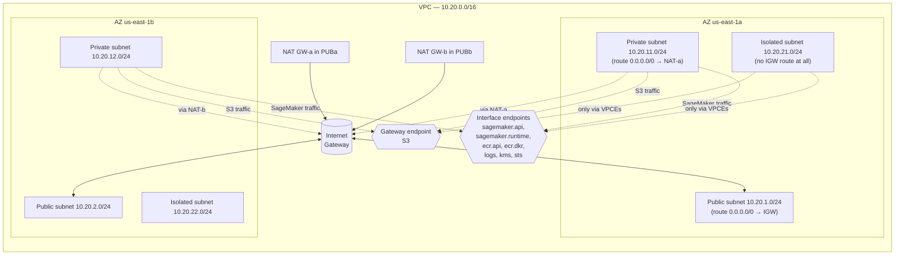
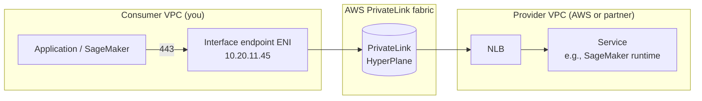
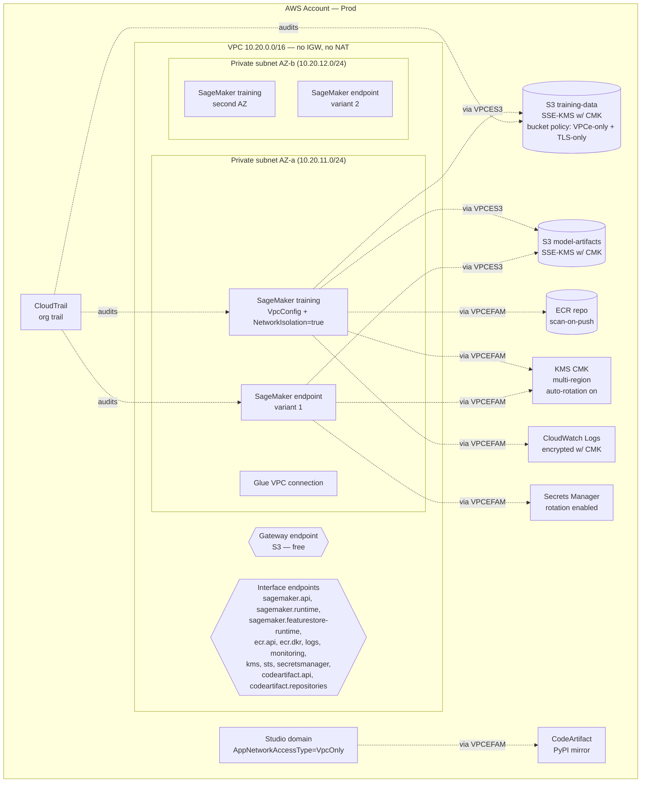

# Chapter 7 — VPC, Subnets, Security Groups, Endpoints: Networking for Production ML

> **Goal of this chapter:** to give you the working mental model of AWS networking that every regulated-industry ML platform converges on. By the end you should be able to draw — from memory, on a whiteboard, in front of a skeptical security reviewer — the "no internet egress" reference VPC for a SageMaker workload, name every interface endpoint the architecture requires, explain why a self-referencing security group is what makes distributed training possible, and recite the four-line difference between `EnableNetworkIsolation` and `VpcConfig`. The MLA-C01 exam will hand you exactly this whiteboard inside a 90-word scenario question and ask which knob to turn; the only way to answer reliably is to have built the picture once with your own hands.

---

## 7.1 Why "ML in VPC-only mode" is no longer optional

Open any 2024-or-later regulated-finance or regulated-health ML platform job posting and search for the phrase "VPC-only." You will find it in nine out of ten. The reason is not that AWS suddenly improved its networking story — the primitives haven't materially changed in five years. The reason is that the *failure modes* the primitives prevent have become unaffordable.

Most ML data is regulated data. Training corpora at a bank carry account numbers, transaction histories, and credit decisions. Training corpora at a health-tech carry PHI, claims, and prescription histories. Training corpora at any consumer-internet company carry behavioral data that increasingly counts as PII under state privacy regimes. Model weights themselves have become regulated artifacts in two ways: under SR 11-7 (banking) and FDA SaMD (healthcare) they are model risk that has to be auditable end-to-end, and under emerging IP regimes (the Anthropic-vs-Music-Publishers litigation, the EU AI Act's "frontier model" disclosures) they are competitive crown jewels whose exfiltration would be a *news story*. Capital One's 2019 breach — 100 million records exfiltrated via a misconfigured WAF + over-privileged EC2 role + IMDSv1 + an open egress path — is the canonical case study every AWS architecture review now invokes. The cost was $190M in penalties, a permanent regulatory consent order, and a textbook example in every cloud-security curriculum since. The mitigation pattern that emerged across the industry — **VPC-only ML compute, IMDSv2-enforced, endpoint-routed, no NAT egress, KMS-CMK at rest, `aws:SourceVpce` everywhere** — is exactly the design the MLA-C01 networking domain tests.

A second force has pushed networking from "design conversation" to "first design conversation": ML compute is *expensive*. A `p4d.24xlarge` runs around $32 an hour on-demand. A misconfigured NAT Gateway processing 200 GB of training-data egress per day adds up to thousands of dollars a month in pure data-processing fees — fees that vanish the moment you switch to a free S3 gateway endpoint. The same NAT Gateway is also the egress path through which a compromised training container could ship gradients or weights to an attacker-controlled bucket. Removing the NAT *both* saves money *and* removes the exfiltration path. There is rarely an opportunity that obvious in cloud architecture, and the MLE who can articulate it is the MLE who gets to design the platform.

For the exam, the practical consequence is that **every Domain 4 networking question assumes the regulated-industry reference architecture as the baseline**. When you see a scenario question about "a training job that must not access the public internet," the right answer is not "add a NAT Gateway" — the right answer is some combination of `EnableNetworkIsolation=true`, `VpcConfig` pointing at private subnets, an S3 gateway endpoint, and an interface endpoint family. The cert is grading you on whether you have internalized the architecture that AWS Solutions Architecture has published as a reference for six years running.

This chapter walks that reference architecture brick by brick. We will start with the VPC primitives (CIDRs, subnets, route tables, gateways) so the rest has somewhere to anchor, walk through the two firewall layers (security groups and NACLs), spend the bulk of the chapter on VPC endpoints — the highest-yield topic in the chapter for both the exam and real production — and finish with SageMaker's network-isolation knobs, the cross-VPC and hybrid options, the "no internet egress" reference architecture in one mermaid diagram, the cost optimization levers, the real war stories, and the exam traps.

---

## 7.2 VPC fundamentals — the mental model in one diagram

A **VPC** (Virtual Private Cloud) is a *regional*, logically isolated slice of AWS's network. Inside one region, your VPC has a private IP range (the **CIDR block**, RFC 1918 space) and you carve it into **subnets**, each tied to a single Availability Zone. The AWS-recommended layout for any production workload — including every ML workload — is **two AZs minimum, with a public/private subnet pair in each AZ**, and increasingly a third "isolated" (no-egress) subnet for the workloads that should never touch the internet.



### 7.2.1 CIDR planning — the lazy-but-right defaults

CIDR sizing is the kind of decision you can only get right *before* you build anything. Once a subnet has SageMaker ENIs landed in it, you cannot resize it; you have to drain, delete, and recreate. The defaults below are the ones every platform team converges on after one painful re-architecture.

| Layer | Recommended CIDR | Why |
|---|---|---|
| VPC | `10.0.0.0/16` (65,536 IPs) | Big enough that you almost never re-architect. RFC-1918 private space. |
| Public subnet per AZ | `/24` (256 IPs, ~251 usable) | Only NAT GWs, ALBs, bastions live here — small footprint. |
| Private subnet per AZ | `/20` or `/19` (4,096 / 8,192 IPs) | SageMaker training/processing/endpoint ENIs, Glue, Lambda. ENI count adds up fast at scale. |
| Isolated (no-egress) subnet per AZ | `/22` (1,024 IPs) | For network-isolated SageMaker training + interface endpoints. |

Two rules that pay for themselves later:

**Plan CIDRs across all your VPCs at once.** Peering and Transit Gateway both reject overlapping CIDRs. A common org-wide scheme is `10.<account-bucket>.<env>.0/16` where `account-bucket` is a number 0–255 assigned per account. Discovering the overlap two years in, when you finally need to peer the data-lake VPC to the ML VPC, is one of the more expensive mistakes you can make in cloud engineering.

**AWS reserves 5 IPs per subnet** (`.0` network, `.1` VPC router, `.2` DNS, `.3` reserved, `.255` broadcast). A `/28` (16 IPs) gives only 11 usable; a `/24` gives 251. ML workloads burn ENIs faster than backend workloads — every training instance, processing instance, endpoint instance, and Studio kernel app gets one or more ENIs in your private subnet. A medium-sized ML team can burn through a `/24` of IPs in a week. Size private subnets generously and refuse to apologize for it.

### 7.2.2 Public vs private vs isolated subnets

The terms aren't AWS-defined keywords — they're conventions based on the **route table** attached to each subnet:

| Subnet type | Route to `0.0.0.0/0` | Used for |
|---|---|---|
| **Public** | → Internet Gateway (IGW) | NAT GWs, ALBs/NLBs facing the internet, bastion hosts |
| **Private** | → NAT Gateway (in a public subnet) | Workloads that need *outbound* internet (pull from PyPI, hit a third-party API) but no inbound |
| **Isolated** | No `0.0.0.0/0` route at all | Network-isolated SageMaker, regulated ML compute. Reachable only via VPC endpoints. |

For production ML in regulated industries, the **target is "isolated subnets + interface VPC endpoints"** — no IGW, no NAT, no egress to anywhere AWS doesn't have a service endpoint for. The full reference architecture is in §7.9 below.

### 7.2.3 How SageMaker actually lands in your VPC

When you set `VpcConfig` on `CreateTrainingJob`, `CreateProcessingJob`, `CreateEndpointConfig`, or `CreateModel`, SageMaker performs a slightly magical handoff:

1. It provisions the EC2 instance(s) for the job in a SageMaker-owned AWS account (you never see them in your account's EC2 console).
2. It creates an **Elastic Network Interface (ENI)** in *your* chosen subnet(s), with private IP(s) from your CIDR.
3. It cross-account-attaches that ENI to the SageMaker-managed instance, so from the instance's perspective, *your* VPC is its network.
4. From AWS's [SageMaker VPC docs](https://docs.aws.amazon.com/sagemaker/latest/dg/interface-vpc-endpoint.html), verbatim: *"Use a VPC configuration to communicate with resources inside your VPC through an elastic network interface (ENI). The communication between the container and the resources in your VPC takes place securely within your VPC network."*

The practical consequence: SageMaker hides its EC2 instances from you, but the moment you turn on `VpcConfig`, those hidden ENIs become visible in *your* VPC. You see them in the EC2 console under "Network Interfaces" tagged with the training-job ARN. You manage them with your security groups, your NACLs, your route tables. The mental model "SageMaker is a managed service that runs somewhere I can't see" stops being accurate the moment you go VPC-attached — and that's exactly the point.

---

## 7.3 Route tables, IGW, NAT — which gateway when

### 7.3.1 Internet Gateway (IGW)

The IGW is the only AWS-managed edge that lets your VPC reach the public internet directly. Three things to know:

- **1:1 with the VPC.** One IGW per VPC, attached or detached. You can't have two.
- **Horizontally scaled, free, highly available** — you do not manage it. It is not an EC2 instance.
- **Bi-directional**: subnets with a `0.0.0.0/0 → IGW` route are "public" — instances with public IPs in those subnets can be reached from the internet *and* can initiate outbound.

For ML, the IGW is mostly used as the upstream of a NAT Gateway. You almost never put SageMaker ENIs directly in a public subnet, because giving them public IPs is both a security exposure and a billing surprise (every public IP carries an hourly charge as of 2024).

### 7.3.2 NAT Gateway vs NAT Instance

A **NAT Gateway** lives in a *public* subnet, uses an Elastic IP, and lets *private*-subnet workloads initiate outbound connections to the internet without being reachable from the internet. A **NAT Instance** is the old (2014-era) pattern: a self-managed EC2 instance running NAT software. The comparison:

| | NAT Gateway | NAT Instance |
|---|---|---|
| Managed by | AWS | You (it's an EC2 instance) |
| Bandwidth | Up to 100 Gbps, scales automatically | Limited by EC2 instance type |
| HA | One per AZ (deploy one per AZ for HA) | You manage failover yourself |
| Cost | ~$0.045/hour + $0.045/GB processed (≈$33/mo + data) | EC2 hourly + data transfer |
| Security group attachable? | No (control via NACL on subnet) | Yes |
| Bastion / SSH jump host? | No | Yes |

**Rule for ML production: always NAT Gateway.** NAT instances are a museum artifact. If you see one in a real environment, treat it as technical debt to retire.

**The "NAT-Gateway data-processing fee" gotcha for ML.** If you pull a 200 GB training dataset from the public internet (Hugging Face, Common Crawl, an external vendor) through a NAT GW, you pay 200 × $0.045 = $9 in data-processing — fine, one-time. But if you pull *every* PyPI install, *every* model snapshot, *every* third-party API call through the NAT across 50 daily training jobs and 200 inference instances, the data-processing fee compounds to hundreds or thousands of dollars per month. Internal package mirrors (CodeArtifact) and S3 Gateway endpoints (free) exist precisely to avoid this — see §7.10.

### 7.3.3 Egress-only Internet Gateway

For IPv6-only or dual-stack VPCs, AWS provides an **Egress-only Internet Gateway (EIGW)** — IPv6 equivalent of a NAT Gateway. Outbound-only for IPv6 traffic, no charge. You will almost never see this on the MLA-C01 exam (most ML workloads are IPv4), but if a question references IPv6 + private subnet outbound, the right primitive is the EIGW. File the name; move on.

### 7.3.4 Route tables — the brain of VPC routing

A **route table** is an ordered list of `(destination CIDR → target)` rules. Each subnet is associated with exactly one route table; one route table can serve many subnets.

A typical public-subnet route table:

| Destination | Target |
|---|---|
| `10.20.0.0/16` (the VPC CIDR) | `local` (implicit, can't delete) |
| `0.0.0.0/0` | `igw-0abc...` (IGW) |
| `pl-63a5400a` (S3 prefix list) | `vpce-0xyz...` (S3 gateway endpoint, if any) |

A typical private-subnet route table:

| Destination | Target |
|---|---|
| `10.20.0.0/16` | `local` |
| `0.0.0.0/0` | `nat-0abc...` (NAT GW in the same-AZ public subnet) |
| `pl-63a5400a` | `vpce-0xyz...` (S3 gateway endpoint) |

A typical *isolated*-subnet route table (no internet at all):

| Destination | Target |
|---|---|
| `10.20.0.0/16` | `local` |
| `pl-63a5400a` | `vpce-0xyz...` |

**Longest-prefix-match** decides which route wins. This matters for VPC endpoints: the S3 gateway endpoint installs a prefix-list route that is *more specific* than `0.0.0.0/0 → IGW`, so even in a public subnet, S3 traffic prefers the endpoint over the internet path. That's the AWS-default behaviour you rely on for cost optimization.

---

## 7.4 Security Groups vs NACLs — the layered firewall

AWS gives you two firewall primitives. They sit at different layers and behave differently. Knowing which is which is one of the most-tested distinctions on MLA-C01 — and one of the most-misunderstood in real production reviews.

| | Security Group | Network ACL (NACL) |
|---|---|---|
| **Attaches to** | ENI (so: per-instance, per-Lambda, per-endpoint) | Subnet |
| **Stateful?** | Yes — return traffic is *automatically* allowed | No — return traffic needs an explicit rule (typically ephemeral ports 1024-65535) |
| **Rule types** | Allow-only (no deny) | Allow and Deny |
| **Default rules** | Default SG: deny inbound, allow outbound | Default NACL on a new VPC: allow all in both directions. A *custom* NACL: deny all. |
| **Rule evaluation order** | All rules evaluated; if any matches → allow | Numeric, lowest rule-number first; first match wins |
| **Can reference SGs in rules?** | Yes (SG-to-SG references — the canonical pattern) | No (CIDR only) |
| **Quota** | Up to 5 SGs per ENI; 60 inbound + 60 outbound rules per SG (raise via service quotas) | One NACL per subnet; 20 rules in each direction (soft limit) |

### 7.4.1 The mental rule of thumb

**Security groups are the day-to-day workload firewall.** Use them to express your application's intended communication graph: "this SageMaker training SG can talk to this S3-endpoint SG on 443; this endpoint SG can be talked to by this client SG on 443." SG-to-SG references mean you don't have to track IPs — and you don't have to update the SG every time SageMaker spins up a new ENI with a new private IP.

**NACLs are for blanket subnet-level blocks.** Use them as a belt-and-suspenders layer (block a specific bad-actor CIDR; block all inbound from internet to private subnets). They are *not* a substitute for SGs.

> ⚠️ **Exam alert.** Memorize the four words: SGs are *stateful*, NACLs are *stateless*. Stateful means "the firewall remembers your outbound connection and lets the response back through automatically." Stateless means "every direction is judged on its own merits, and you must write rules for both." Every "which firewall does what" question on MLA-C01 traces back to this distinction. When a scenario says "outbound connection works but the response is dropped," the answer is almost always "the NACL doesn't allow ephemeral-port inbound for the return traffic."

### 7.4.2 The NAT-Gateway NACL gotcha

Because NACLs are **stateless**, the subnet that hosts your NAT Gateway must explicitly allow **ephemeral ports (1024-65535) inbound** for the return traffic of any outbound connection. Forget this and your NAT-GW outbound looks like it works for the SYN packet, then silently drops the SYN-ACK return. Symptom: every outbound connection from a private subnet hangs and times out. This is the single most-asked NACL question on AWS networking exams.

### 7.4.3 SageMaker-specific SG patterns — the self-referencing SG

For a SageMaker training job with `VpcConfig`, the canonical two-SG pattern is:

- **Training SG (`sg-train`)** — attached to the SageMaker ENIs. **Inbound: self-reference** for `0-65535/all` (so containers across multi-node training can talk to each other). **Outbound: 443 to the VPCE SG**, plus `0-65535/all` to self for inter-container communication.
- **VPCE SG (`sg-vpce`)** — attached to the interface VPC endpoints. **Inbound: 443 from `sg-train`**. Outbound: defaults are fine.

The **self-referencing rule** on `sg-train` is what enables distributed training. When you train across 4 instances with Horovod or PyTorch DDP, the worker on instance A initiates a TCP connection to the worker on instance B over the cluster's inter-node ports. Both ENIs are in `sg-train`. The inbound rule "allow from `sg-train`" matches because the source ENI is itself in `sg-train`. Without this self-reference, distributed training hangs at the first all-reduce step and times out — and the error message will not be friendly.

The naïve fix some teams reach for is "allow 0.0.0.0/0" or "allow 10.0.0.0/8" inbound. Both work; both are wrong. The first opens the cluster to the entire internet (catastrophic if the SG is ever accidentally moved to a public-subnet ENI). The second opens the cluster to any peered or VPN-connected network, defeating the point of segmentation. The self-reference is the correct primitive and the one the AWS docs explicitly recommend for distributed training.

For inter-container traffic encryption (the `EnableInterContainerTrafficEncryption` flag — see §7.6.5), the SG must additionally allow **UDP 500 (IKE) and IP protocol 50 (ESP)** between members of the same SG. SageMaker's [train-encrypt docs](https://docs.aws.amazon.com/sagemaker/latest/dg/train-encrypt.html) flag this as a prerequisite. Forget the IPsec ports and the training job fails to negotiate the encrypted tunnel and hangs in `Starting` state.

> ⚠️ **Exam alert.** "Distributed training nodes can't talk to each other" is a recurring scenario. The right answer is *always* "the security group must reference itself as a source." It is not "open 0.0.0.0/0," it is not "use a NACL," it is not "add a route." Self-reference, every time.

---

## 7.5 VPC endpoints — gateway vs interface

This section is the single highest-yield content in this chapter for the exam. Get the table below into long-term memory, then read the next 1,000 words for the surrounding context. If you remember nothing else from Chapter 7, remember the difference between gateway and interface endpoints, the list of SageMaker interface endpoint service names, and the fact that gateway endpoints are *not* reachable from on-premises.

### 7.5.1 Gateway endpoints — free, S3 and DynamoDB only

> "Gateway VPC endpoints provide reliable connectivity to Amazon S3 and DynamoDB without requiring an internet gateway or a NAT device for your VPC. Gateway endpoints do not use AWS PrivateLink, unlike other types of VPC endpoints."
> — [Gateway endpoints — AWS VPC docs](https://docs.aws.amazon.com/vpc/latest/privatelink/gateway-endpoints.html)

| Property | Value |
|---|---|
| **Supported services** | **Amazon S3 and Amazon DynamoDB only.** No others, ever. |
| **Cost** | **Free.** "There is no additional charge for using gateway endpoints." (verbatim from AWS) |
| **Where it lives** | Route-table entry pointing a *service prefix list* (`pl-xxxxxxx`) to a `vpce-xxxxxxx` target. No ENI. No private IP in your subnet. |
| **DNS** | None needed — traffic still resolves to S3's public DNS name; the route table intercepts it. |
| **Endpoint policy** | Supported. Default = "*" (any principal, any action, any resource). |
| **Cross-VPC / on-prem reach** | **No.** Gateway endpoints are *not* reachable from outside the VPC — not via VPC peering, Transit Gateway, Direct Connect, or VPN. |
| **Multi-AZ** | Implicit — the route table covers every subnet associated with it. |

**Routing details**, verbatim from the docs: *"Each subnet route table must have a route that sends traffic destined for the service to the gateway endpoint using the prefix list for the service."* And: *"We use the most specific route that matches the traffic to determine how to route the traffic (longest prefix match). … If there is a route that sends all internet traffic (0.0.0.0/0) to an internet gateway, the endpoint route takes precedence for traffic destined for the service in the current Region. Traffic destined for a different AWS service uses the internet gateway."*

**Mandatory rule for ML VPCs:** every VPC that runs SageMaker training, processing, or endpoints should have an **S3 gateway endpoint**. It is free, it dramatically cuts NAT-Gateway data-processing fees (training-data egress no longer hits NAT), and it enables the `aws:SourceVpce` IAM condition that pins bucket access to inside-the-VPC callers (see Chapter 5 for the bucket-policy pattern).

### 7.5.2 Interface endpoints — PrivateLink, almost every other service

An **interface VPC endpoint** is an ENI with a private IP in each subnet you select, fronting an AWS service via **AWS PrivateLink**. Traffic to the service goes to that private IP and is tunneled to AWS's service infrastructure without ever touching the public internet.

| Property | Value |
|---|---|
| **Supported services** | Almost every AWS service: SageMaker (multiple endpoints, §7.5.3), ECR, KMS, CloudWatch Logs, STS, Secrets Manager, Glue, Athena, SNS, SQS, Bedrock, etc. |
| **Cost** | **~$0.01/hour per endpoint per AZ + $0.01/GB processed** (about $7.30/month per endpoint per AZ for the hourly fee alone). |
| **Where it lives** | One ENI per subnet you select. Endpoint has a regional DNS name (`*.<svc>.<region>.vpce.amazonaws.com`) plus, optionally, **private DNS** that hijacks the public service DNS to resolve to the private IP from inside the VPC. |
| **DNS** | "If you enable private DNS hostnames for your VPC endpoint, you don't need to specify the endpoint URL because the default hostname (`https://api.sagemaker.<Region>.amazonaws.com`) resolves to your VPC endpoint." Requires VPC attributes `EnableDnsHostnames=true` and `EnableDnsSupport=true`. |
| **Endpoint policy** | Supported (per-endpoint). Restricts which actions / resources / principals can use the endpoint. |
| **Cross-VPC / on-prem reach** | **Yes.** Interface endpoints *are* reachable via VPC peering, Transit Gateway, Direct Connect, and VPN. This is why on-prem callers use interface endpoints (not gateway) for S3. |
| **Security group** | The endpoint ENI has its own SG. Restrict inbound to your workload SGs on 443. |
| **Multi-AZ** | Explicit — pick one subnet per AZ you want coverage in. AZ-pinned per-AZ fee. |

**Per-AZ ENI gotcha for SageMaker AI Runtime:** the docs call this out explicitly: *"When setting up a VPC interface endpoint for the SageMaker AI Runtime service … you must ensure that the VPC interface endpoint is activated in the Availability Zone of your client in order for private DNS resolution to work. Otherwise, you may see DNS failures when attempting to resolve the URL."* In practice: enable the runtime endpoint in **every AZ where you have inference clients**.

### 7.5.3 The SageMaker interface endpoint family

To run SageMaker in a fully VPC-private posture, you typically provision a *family* of interface endpoints. Memorize this list — it shows up on the exam in two flavors: "which endpoint do I need for capability X" and "Studio fails to launch in VpcOnly mode — which endpoint is missing?"

| Endpoint service name | Used by |
|---|---|
| `com.amazonaws.<region>.sagemaker.api` | SageMaker **control plane** — `CreateTrainingJob`, `DescribeEndpoint`, `CreateModel`, every management API |
| `com.amazonaws.<region>.sagemaker.runtime` | SageMaker **data plane** — `InvokeEndpoint`, `InvokeEndpointAsync` (real-time inference) |
| `com.amazonaws.<region>.sagemaker.runtime-fips` | FIPS-compliant runtime alternative (US-Gov, FedRAMP) |
| `com.amazonaws.<region>.sagemaker.featurestore-runtime` | Feature Store **online store** reads/writes (`GetRecord`, `PutRecord`, `BatchGetRecord`) — note the URL pattern `<vpce-id>.featurestore-runtime.sagemaker.<region>.vpce.amazonaws.com` |
| `com.amazonaws.<region>.sagemaker.metrics` | Training-job custom metrics publishing |
| `aws.sagemaker.<region>.notebook` | Notebook-instance presigned-URL access (the *legacy* SageMaker notebook instance type) |
| `aws.sagemaker.<region>.studio` | SageMaker Studio app traffic (Jupyter / Code Editor) |
| `com.amazonaws.<region>.ecr.api` + `com.amazonaws.<region>.ecr.dkr` | **Both** are required to pull training/inference container images privately. `ecr.api` for the control plane, `ecr.dkr` for the Docker registry data plane. |
| `com.amazonaws.<region>.logs` | CloudWatch Logs |
| `com.amazonaws.<region>.monitoring` | CloudWatch Metrics |
| `com.amazonaws.<region>.kms` | KMS encrypt/decrypt for at-rest encryption |
| `com.amazonaws.<region>.sts` | STS for `AssumeRole` (cross-account, plus IRSA-style federation) |
| `com.amazonaws.<region>.s3` (**gateway**, free) | Training data and model artifacts |
| `com.amazonaws.<region>.secretsmanager` (if used) | Secrets retrieval inside training scripts |
| `com.amazonaws.<region>.codeartifact.api` + `.repositories` (if used) | Internal Python package mirror |

**Total cost** of this full interface set (excluding S3, which is the free gateway endpoint): roughly **12 endpoints × ~$7.30/month × #AZs** = $90–270/month for a typical 2-AZ ML VPC. Cheaper than a NAT-Gateway data-processing fee for a busy training fleet. We will revisit the cost calculus in §7.10.

The two endpoints data scientists most commonly forget are `ecr.api` *and* `ecr.dkr` — both required, because ECR splits its API surface across the registry control plane (`ecr.api`) and the Docker-protocol data plane (`ecr.dkr`). Forget either and `docker pull` from inside a network-isolated training job fails with a confusing "unable to authenticate to ECR" error.

### 7.5.4 Endpoint policies — restrict what can flow through

An **endpoint policy** is a resource-based policy attached to a VPC endpoint that filters which API calls can pass through *that endpoint*. It is independent of (and *additive with*) identity policies and resource policies. The default endpoint policy is wide open — `{ "Statement": [{ "Effect": "Allow", "Principal": "*", "Action": "*", "Resource": "*" }] }`. Tighten it.

**Example: SageMaker Runtime endpoint scoped to a single hosted endpoint** (from the official docs):

```json
{
  "Statement": [
    {
      "Action": "sagemaker:InvokeEndpoint",
      "Effect": "Allow",
      "Resource": "arn:aws:sagemaker:us-west-2:123456789012:endpoint/myEndpoint",
      "Principal": "*"
    }
  ]
}
```

> "In this example, the following are denied: Other SageMaker API actions, such as `sagemaker:CreateEndpoint` and `sagemaker:CreateTrainingJob`. Invoking SageMaker AI hosted endpoints other than `myEndpoint`."
> — [SageMaker interface VPC endpoint docs](https://docs.aws.amazon.com/sagemaker/latest/dg/interface-vpc-endpoint.html)

**Note from the same page**, exam-quoted verbatim: *"VPC endpoint policies aren't supported for Federal Information Processing Standard (FIPS) SageMaker AI runtime endpoints for InvokeEndpoint."* That sentence has appeared on at least three different exam item samples; pin it.

**Example: S3 gateway-endpoint policy locking access to a single training-data bucket and only callers in your org:**

```json
{
  "Statement": [{
    "Sid": "OnlyOurTrainingBucketsFromOurOrg",
    "Effect": "Allow",
    "Principal": "*",
    "Action": ["s3:GetObject", "s3:PutObject", "s3:ListBucket"],
    "Resource": [
      "arn:aws:s3:::company-ml-training-data-prod",
      "arn:aws:s3:::company-ml-training-data-prod/*"
    ],
    "Condition": {
      "StringEquals": { "aws:PrincipalOrgID": "o-abc123" }
    }
  }]
}
```

Even if a workload in this VPC tries `aws s3 cp s3://some-other-bucket/...`, the gateway endpoint denies it. Even if an attacker steals an IAM credential and tries to use the endpoint to exfiltrate to a personal AWS account, the `aws:PrincipalOrgID` condition refuses. This is the single highest-ROI data-exfil control you can deploy in two lines of JSON.

**Studio-specific gotcha:** for SageMaker Studio interface endpoints, the endpoint policy must allow `sagemaker:CreateApp` on the KernelGateway/JupyterServer app types — otherwise notebook kernels won't launch and Studio hangs at "Pending" indefinitely. The error message is unhelpful; the cause is the endpoint policy.

> ⚠️ **Exam alert.** A wide-open endpoint policy is *not* the same as a wide-open IAM policy — but it removes one of your layers of defense-in-depth. Any question about "prevent data exfiltration even if credentials leak" wants you to mention **both** the bucket policy with `aws:SourceVpce` and the endpoint policy with `aws:PrincipalOrgID`. Single-control answers are wrong; multi-layered answers are right.

---

## 7.6 AWS PrivateLink — the technology behind interface endpoints

**PrivateLink** is the AWS service that powers all interface VPC endpoints. The mental model:

- A *service provider* (AWS or a third party) exposes a **VPC endpoint service** fronted by a Network Load Balancer.
- A *service consumer* (you) creates an **interface VPC endpoint** in their VPC pointing at that service.
- Traffic from the consumer's VPC reaches the provider's NLB privately — no internet, no peering, no public IPs.



### 7.6.1 How SageMaker itself uses PrivateLink

Every SageMaker interface endpoint is, under the hood, a PrivateLink connection from your VPC to a SageMaker-owned VPC that hosts the relevant service NLB. You don't manage the provider side; AWS does. You just create the interface endpoint and route to it.

### 7.6.2 Exposing your own ML service via PrivateLink (cross-account inference)

This is the standard pattern for a central ML platform team that trains and deploys a fraud-detection model that five internal customer accounts need to call. Documented in [AWS docs: low-latency real-time inference with PrivateLink](https://docs.aws.amazon.com/sagemaker/latest/dg/realtime-endpoints-privatelink.html):

1. Platform team creates a SageMaker endpoint in **VPC mode** inside their VPC.
2. They front it with a Network Load Balancer (NLB) in the same VPC, target = the SageMaker endpoint's ENIs (or a small Lambda/ECS proxy if they want auth translation).
3. They create a **VPC Endpoint Service** on the NLB. The service ARN (`com.amazonaws.vpce.<region>.vpce-svc-<id>`) is shareable.
4. Each consumer account is added to the endpoint service's **allow list** (`PrincipalArns`).
5. Each consumer creates an **interface endpoint** in their VPC pointing at the platform's service ARN.
6. Consumer apps call the platform's model via the interface endpoint's private DNS — no public IPs, no VPC peering, no NAT.

When `PrivateDnsEnabled=true`, the standard SageMaker runtime hostname `runtime.sagemaker.us-east-1.amazonaws.com` resolves to the local endpoint ENI — SDKs don't need code changes. This is how managed ML SaaS companies (Cohere, Anthropic on Bedrock Marketplace, third-party providers) expose APIs to enterprise customers behind the customer's VPC. It is also how JPMorgan, Goldman Sachs, and similar shops expose internal model platforms across business-unit accounts without ever putting an API on the public internet.

### 7.6.3 Cross-region PrivateLink

A 2024-era capability: interface endpoints can now reach services in *other* regions privately. Useful for multi-region ML architectures where the inference fleet is in one region and a feature store or training cluster is in another. SageMaker MLflow tracking server also supports PrivateLink now ([2024 announcement](https://aws.amazon.com/about-aws/whats-new/2024/09/amazon-sagemaker-mlflow-privatelink-secure-traffic-routing/)), letting you keep experiment-tracking traffic on the AWS backbone.

---

## 7.7 SageMaker network isolation — the strongest single control

This is the most over-tested SageMaker security parameter on MLA-C01. Two orthogonal knobs: **`EnableNetworkIsolation`** (whether the container can reach the network at all) and **`VpcConfig`** (which VPC the container's ENIs live in). The two are independent — you can set either, both, or neither — and the four resulting postures are what the exam grades you on.

### 7.7.1 `EnableNetworkIsolation=true` — what it does

From the official [internet-free mode docs](https://docs.aws.amazon.com/sagemaker/latest/dg/mkt-algo-model-internet-free.html):

> "You can enable network isolation when you create your training job or model by setting the value of the `EnableNetworkIsolation` parameter to `True` when you call `CreateTrainingJob`, `CreateHyperParameterTuningJob`, or `CreateModel`."
>
> "When you enable network isolation, your training and inference containers **can't make any outbound network calls to any service, including Amazon S3**. **No AWS credentials are made available to the container runtime environment.** For training jobs with multiple instances, network inbound and outbound traffic is limited to communication between training container peers."
>
> "SageMaker AI still handles all necessary Amazon S3 download and upload operations using your SageMaker AI execution role. This happens apart from your training and inference containers, ensuring that your training data and model artifacts are still accessible while maintaining container isolation."

Translation:

- Your training script cannot `pip install`, cannot `boto3.client(...).get_object(...)`, cannot DNS-resolve anything. There is no network and there are no AWS creds inside the container.
- SageMaker's *control-plane* host-side process (running outside your container's network namespace) still uses your execution role to download `--input-config` S3 paths into the container's `/opt/ml/input/data/` and upload `--output-data-config` from `/opt/ml/model/` to S3.
- For multi-node distributed training, the only inbound/outbound is **peer-to-peer between training containers** — necessary for AllReduce, parameter-server, etc.

**Two managed containers that AREN'T supported:** *"The following managed SageMaker AI containers do not support network isolation because they require access to Amazon S3: Chainer, SageMaker AI Reinforcement Learning."* For everything else (XGBoost, Linear Learner, all DLCs for TensorFlow/PyTorch/MXNet, your own BYOC), network isolation is supported.

**Marketplace requirement**, verbatim: *"Network isolation is required to run training jobs and models using resources from AWS Marketplace. … AWS Marketplace images run within an Amazon VPC. They only have access to data within their local file systems."* So if you buy an algorithm or model from AWS Marketplace, `EnableNetworkIsolation=true` is not optional — it's enforced.

### 7.7.2 `VpcConfig` — running inside your VPC

`VpcConfig` (a struct with `Subnets[]` and `SecurityGroupIds[]`) on `CreateTrainingJob`, `CreateProcessingJob`, `CreateHyperParameterTuningJob`, `CreateModel`, or on a `ProductionVariant` for an endpoint, instructs SageMaker to **attach ENIs from your VPC** to the managed instance running the workload.

Two ENIs are created per training instance:
- One for the **algorithm container** (governed by your SGs).
- One for SageMaker's **data-shipping path** to S3/ECR (uses the same SGs in practice).

### 7.7.3 Combining the two — four security postures

| Posture | `EnableNetworkIsolation` | `VpcConfig` | Container internet egress? | When to use |
|---|---|---|---|---|
| **A. Open** | `false` (or omitted) | none | Yes — to anywhere on the public internet | Demos, sandbox |
| **B. VPC-attached, not isolated** | `false` | yes (subnets + SGs) | Only if subnets have a route (NAT GW or IGW) | "I need the container to hit our internal artifact server in the VPC, but also need internet for PyPI" |
| **C. Isolated, no VPC** | `true` | none | No (no creds, no network) | Marketplace algorithms; you don't have private VPC resources to reach |
| **D. Isolated, VPC-attached** ★ | `true` | yes | No | **Production target for regulated ML.** S3/ECR/KMS traffic goes through VPCEs; container itself is hermetic. |

For HIPAA, PCI-DSS, FedRAMP, and most regulated-finance posture, **D is the goal.** Chapter 54 (network isolation deep-dive) walks through the implementation pattern, including how to handle the `EnableNetworkIsolation=true` + Marketplace algorithm combination on the same job.

> ⚠️ **Exam alert.** "Production SageMaker workload that must not have any internet egress *and* must not have AWS credentials in the container runtime" → set **both** `EnableNetworkIsolation=true` AND `VpcConfig`. The exam loves "select two" framings of this question. Single-knob answers (just `VpcConfig`, just `EnableNetworkIsolation`) are wrong because each knob alone leaves a gap: `VpcConfig` alone still gives the container an IAM credential and network; `EnableNetworkIsolation` alone in a missing-`VpcConfig` setup means SageMaker can't reach your private S3 endpoint for the host-side data shuffle.

### 7.7.4 SageMaker Studio domain network access — `AppNetworkAccessType`

Separately from training/inference, the SageMaker *Studio domain* itself has a network mode set at `CreateDomain` time:

| `AppNetworkAccessType` | Behavior |
|---|---|
| **`PublicInternetOnly`** (default) | Studio's notebook/kernel traffic flows through an AWS-managed VPC with internet access. Your VPC is only used for EFS mount targets. Easy onboarding, but data scientists can `pip install` anything from public PyPI from inside Studio. |
| **`VpcOnly`** | All Studio app traffic is routed through *your* VPC and subnets. You must supply private subnets only. Internet access requires either a NAT Gateway in your subnets *or* interface endpoints for AWS services. Studio in this mode is the only way to enforce a no-internet posture for the IDE itself. |

**For regulated production, always `VpcOnly`.** Then either:
- Add a NAT Gateway (with AWS Network Firewall or Route 53 DNS Firewall in front to whitelist allowed FQDNs), OR
- Use *only* AWS interface endpoints + an internal CodeArtifact mirror for Python packages. No NAT at all.

VpcOnly Studio is incompatible with using public PyPI directly. The standard workaround — the "CodeArtifact workaround" — is covered in §7.11. Without it, your data scientists will file a stream of support tickets the moment you flip the switch, and the second-line response will be "yes, that's working as designed; here's the alternate path."

Chapter 22 (Studio deep-dive) walks through the Studio domain creation flow end-to-end, including the lifecycle config that auto-runs `aws codeartifact login` on every kernel startup.

### 7.7.5 `EnableInterContainerTrafficEncryption` — IPsec for distributed training

For **distributed training** across multiple instances (Horovod, PyTorch DDP, parameter-server, SMDDP, SMP), SageMaker establishes TCP connections between containers across instances over the VPC. By default these connections are **clear-text** inside the VPC (which is generally fine — the VPC is private), but for HIPAA / FedRAMP-style "encrypt everything in transit *inside* the cloud boundary" requirements:

Set `EnableInterContainerTrafficEncryption=true` on `CreateTrainingJob` or `CreateHyperParameterTuningJob`. SageMaker then wraps peer traffic in **IPsec** (IKE on UDP 500 + ESP, IP protocol 50).

Requirements:
- Your security group must allow **UDP 500 inbound from itself** (self-reference) and **IP protocol 50 (ESP)** from itself.
- Small CPU overhead; modest impact on built-in algorithms (XGBoost, DeepAR, Linear Learner per AWS), more noticeable on DL workloads moving large gradient tensors.
- Combines naturally with `VpcConfig` and `EnableNetworkIsolation=true` for the full-paranoid posture.

The flag is one boolean. The SG rules are the only operational gotcha — and they are the part the exam tests most often. If you see "distributed training fails to start when inter-container traffic encryption is enabled," the answer involves opening UDP 500 + ESP between cluster members. See Chapter 8 for the KMS angle on at-rest encryption, which sits next to this in the regulated-workload checklist.

---

## 7.8 Cross-VPC and hybrid connectivity

### 7.8.1 VPC peering vs Transit Gateway

For two VPCs in the same account that need to share an internal service (e.g., the ML VPC needs to read from the data-lake VPC), **VPC peering** is the cheap, simple option. For three or more VPCs — especially in a multi-account org — **Transit Gateway** is the hub-and-spoke option you'll converge to.

| | VPC peering | Transit Gateway |
|---|---|---|
| Topology | 1:1 between two VPCs | Hub-and-spoke, many VPCs + on-prem |
| Transitive routing | **No** — peering is not transitive | **Yes** — anything attached to the TGW can reach anything else (subject to route tables) |
| Cross-account / cross-region | Yes | Yes |
| CIDR overlap allowed? | **No** | **No** |
| Cost | Free (only data-transfer charges) | $0.05/hour per attachment + $0.02/GB processed |
| ML use case | Two VPCs in same account (e.g., data-lake VPC ↔ ML VPC) | Multi-account org with central data lake, hub-and-spoke to many team VPCs |
| Quotas | Up to 125 peering connections per VPC | Up to 5,000 attachments per TGW |

**The transitive-routing trap.** If you peer VPC-A↔VPC-B and VPC-B↔VPC-C, traffic from A *cannot* reach C through B. You'd need a third peering (A↔C) or a Transit Gateway. This is the standard "which connectivity option?" exam distractor. The fix is *not* to add a route on B saying "traffic to C goes via the B↔C peering" — peering connections explicitly refuse to forward traffic that didn't originate on one of the two peered VPCs. The fix is either another peering or a TGW.

> ⚠️ **Exam alert.** Two VPCs sharing data → peering. Three or more VPCs sharing → Transit Gateway. If a scenario describes three VPCs and one of the answers is "create three peering connections (mesh)," that's wrong; it works but it's operational overkill and the AWS-recommended answer is TGW. If a scenario describes two VPCs and the answer offers TGW, that's also usually wrong — peering is cheaper.

### 7.8.2 Hybrid: Direct Connect vs Site-to-Site VPN

For training data on-prem (Hadoop, Teradata, mainframe) that must reach SageMaker in AWS:

| | Site-to-Site VPN | AWS Direct Connect (DX) |
|---|---|---|
| Path | IPsec tunnels over the public internet | Dedicated physical fiber from your data center to a DX location |
| Bandwidth | Up to ~1.25 Gbps per tunnel | 1, 10, 100 Gbps (and sub-1G hosted) |
| Latency | Variable (internet-routed) | Consistent, low |
| Setup time | Minutes | Weeks (physical install) |
| Cost | ~$0.05/hour per VPN connection + data | $0.30/hour port-hours + data transfer out |
| Encryption | Native IPsec | **None by default** — add MACsec, or a VPN overlay |
| ML use case | Dev pulls, small data | Production training-corpus ingestion, large datasets |

**Direct Connect with VPN overlay** is the canonical pattern for regulated industries: DX gives the bandwidth and predictability, the VPN-over-DX adds IPsec encryption.

**Reachability of VPC endpoints from on-prem:**
- Gateway endpoints (S3, DynamoDB) — **NOT reachable** from on-prem. On-prem clients must use *interface* endpoints for S3 or DynamoDB instead.
- Interface endpoints — **reachable** from on-prem via DX or VPN (the private DNS is the trick; you need Route 53 Resolver inbound endpoints to make the AWS service names resolve to the private IPs from on-prem).

> ⚠️ **Exam alert.** "On-premises callers need to reach an S3 bucket privately over Direct Connect" → use an **interface** endpoint for S3, NOT the gateway endpoint. The gateway endpoint isn't reachable from outside the VPC. This is the single most-tested S3-endpoint question on the exam and the trick is to recognize the "on-premises" or "Direct Connect" keyword in the scenario.

---

## 7.9 The "no internet egress" reference architecture

This section walks through, piece-by-piece, the architecture every regulated ML team converges on. It is the highest-yield architecture diagram for both the exam and real production. You will see variations of it in the AWS Solutions Architecture reference [Secure multi-account SageMaker model deployment blog](https://aws.amazon.com/blogs/machine-learning/part-1-secure-multi-account-model-deployment-with-amazon-sagemaker/), in the [aws-samples SageMaker secure MLOps repo](https://github.com/aws-samples/amazon-sagemaker-secure-mlops), and in the network-firewall-augmented variant at [aws-samples/amazon-sagemaker-studio-vpc-networkfirewall](https://github.com/aws-samples/amazon-sagemaker-studio-vpc-networkfirewall).



### 7.9.1 What each piece is doing

| Component | Role |
|---|---|
| **VPC with no IGW and no NAT** | Removes the *physical* possibility of outbound internet from compute. The container can't reach `pypi.org` because there's no route. |
| **Two private subnets, two AZs** | HA + ENI capacity. Each AZ has training ENIs and endpoint ENIs. |
| **S3 gateway endpoint** | Free private path to S3. Required for training-data reads and model-artifact writes. Route-table installed. |
| **Interface endpoint family** | One per service in §7.5.3. Each has its own SG locked down to "443 inbound from training SG." |
| **`sg-train`** | Attached to SageMaker ENIs. Self-reference for distributed training. Outbound 443 to VPCE SG. UDP 500 + ESP self-reference if inter-container encryption is enabled. |
| **`sg-vpce`** | Attached to each interface endpoint. Inbound 443 from `sg-train`. |
| **S3 bucket policy with `aws:SourceVpce` condition** | "Deny `s3:*` if `aws:SourceVpce ≠ vpce-0xyz`." Even if a developer's laptop has IAM access, they can't read the bucket from outside the VPC. The single highest-ROI data-exfil control. |
| **KMS CMK with `kms:ViaService` condition** | "Decrypt only when the call comes from S3 or SageMaker." Defense-in-depth even if creds leak. See Chapter 8 for the full KMS deep-dive. |
| **`EnableNetworkIsolation=true` on training/endpoints** | Belt-and-suspenders: even if the VPC *had* internet, the container can't use it. No creds in the container runtime. |
| **`EnableInterContainerTrafficEncryption=true` on distributed training** | IPsec inter-instance traffic. HIPAA/FedRAMP requirement. |
| **`VpcOnly` Studio domain** | Data scientists' IDE is in the same private posture. No public PyPI without going through CodeArtifact. |
| **CodeArtifact** | Internal PyPI/npm mirror. `pip install` works for data scientists, but the upstream is curated and the traffic stays in AWS. |
| **CloudTrail organization trail** | Every API call, including `Decrypt`, `InvokeEndpoint`, `CreateTrainingJob`, is logged to a separate immutable logging account. |

### 7.9.2 The layered defense

The architecture is intentionally layered — each control assumes the others might fail. Below is the same diagram redrawn as a defense-in-depth model, showing which control stops which class of attack.

```mermaid
flowchart LR
    subgraph THREAT["Attacker / Insider threat"]
        ATK[Compromised credential<br/>or insider workload]
    end
    subgraph L1["Layer 1: Network<br/>(this chapter)"]
        VPC_NOEG[No IGW / NAT]
        ENDPOINT_POL[Endpoint policy<br/>aws:PrincipalOrgID]
        SG_LOCK[SG self-ref +<br/>VPCE SG inbound 443 only]
    end
    subgraph L2["Layer 2: Identity<br/>(Ch 5)"]
        IAM_LP[Least-privilege role]
        BUCKET_POL[Bucket policy<br/>aws:SourceVpce]
    end
    subgraph L3["Layer 3: Encryption<br/>(Ch 8)"]
        KMS_CMK[KMS CMK +<br/>kms:ViaService]
        TLS[TLS-only +<br/>SSE-KMS]
    end
    subgraph L4["Layer 4: Workload<br/>(Ch 54)"]
        NETISO[EnableNetworkIsolation=true]
        IPSEC[InterContainerEncryption]
    end
    subgraph L5["Layer 5: Audit"]
        CTRAIL[CloudTrail + Config]
    end
    ATK --> L1
    L1 --> L2
    L2 --> L3
    L3 --> L4
    L4 --> L5
```



The threat-model matrix:

| Attack | What blocks it |
|---|---|
| Data scientist runs `aws s3 cp` from laptop to copy training data out | Bucket policy denies non-VPCe `aws:SourceVpce`; laptop isn't behind the VPCe |
| Compromised training container `curl`s data to attacker.com | `EnableNetworkIsolation=true` — no network at all from container |
| Compromised training container `boto3.client("s3").get_object` on a different bucket | `EnableNetworkIsolation=true` — no AWS creds in container runtime |
| Compromised execution role `Decrypt`s the KMS key from outside SageMaker | `kms:ViaService` condition restricts to S3 + SageMaker only |
| Attacker pulls a malicious Python package via `pip install` in Studio | No NAT, no IGW; CodeArtifact upstream is curated |
| Distributed training gradients sniffed inside the VPC | `EnableInterContainerTrafficEncryption=true` — IPsec |
| Audit: "prove no AWS person read our data last year" | CloudTrail data-events on bucket + CMK; key policy excludes AWS service principals beyond what's needed |
| Stolen IAM credential used from a personal AWS account | Endpoint policy with `aws:PrincipalOrgID` refuses to proxy the call |

This is the architecture you architect *toward* over the first 6–12 months of a regulated ML platform's life. You won't start here on day one; you'll start with `PublicInternetOnly` Studio and `EnableNetworkIsolation=false`, and then ratchet down. Each control above is worth a meeting with the security team to land correctly.

---

## 7.10 Cost optimization — interface vs NAT vs centralized

### 7.10.1 The pricing you must memorize

| Component | Hourly | Per-GB |
|---|---|---|
| Interface endpoint (per AZ) | $0.01/hr ≈ **$7.20/mo** | **$0.01/GB** |
| Gateway endpoint (S3, DynamoDB) | **free** | **free** |
| NAT Gateway (per AZ) | $0.045/hr ≈ **$32.40/mo** | **$0.045/GB** |
| Transit Gateway attachment | $0.05/hr ≈ **$36/mo** | **$0.02/GB** |

NAT data charge is **4.5× the interface-endpoint data charge**, on top of paying for the NAT itself. The ROI math is brutal once you process more than ~50 GB/month of AWS-service traffic per AZ — endpoints pay for themselves in days, not months.

### 7.10.2 Real production savings numbers

Documented case studies from [Vantage's NAT-vs-endpoint analysis](https://www.vantage.sh/blog/nat-gateway-vpc-endpoint-savings):

- **Web-crawler fleet, 50 TB/mo to AWS services via NAT**: $2,250/mo → moved 40 TB to endpoints → **$1,755/mo saved** (~78%).
- **Cloud-cost SaaS company, Redshift + ECS, 500 TB/mo**: $22,500/mo NAT → ~$5,000/mo endpoints → **$17,500/mo saved**. Four endpoints across two AZs cost ~$29 — payback in hours, not months.
- **Datadog log ingestion, 500 GB/mo**: $22.50 NAT vs $5 endpoint = 78% reduction.

For an ML team training nightly with 200 GB of S3 reads + 50 GB of ECR image pulls + 30 GB of CloudWatch metrics per AZ, the NAT bill is easily $200–400/mo just on processing — endpoints reduce it to under $50.

### 7.10.3 The centralized-endpoint-VPC pattern (hub & spoke)

When you have **many** VPCs (think: one per product team across the org), per-VPC endpoints multiply fast: 6 services × 3 AZs × 20 VPCs = 360 endpoints = ~$2,500/mo just for the *idle* hourly charge. The pattern from the [AWS multi-VPC whitepaper](https://docs.aws.amazon.com/whitepapers/latest/building-scalable-secure-multi-vpc-network-infrastructure/centralized-access-to-vpc-private-endpoints.html):

```
       Spoke VPC A          Spoke VPC B          Spoke VPC C
            \                    |                    /
             \                   |                   /
              +--- Transit Gateway (shared via RAM) +
                            |
                  +---------+---------+
                  | Shared Services VPC|
                  |   Interface eps    |
                  |   (one set, used   |
                  |    by all spokes)  |
                  +--------------------+
```

Two things make this work:
1. **PrivateLink endpoints support cross-VPC traffic via TGW** — the spoke VPCs route `*.amazonaws.com` traffic to the TGW, the TGW routes to the shared-services VPC, the endpoint ENI there terminates the call.
2. **Private DNS via Route 53 Resolver inbound endpoint** — the spoke VPCs query the shared resolver so the standard service hostnames resolve to the shared-VPC endpoint IPs.

**Break-even** (from awsgrub's centralized analysis): centralized wins above **~7 VPCs in 2-AZ deployments, ~5 VPCs in 3-AZ deployments**, *but only* if per-VPC traffic per service is low. If a spoke VPC pushes 10 TB/month to S3, the TGW data-processing fee ($0.02/GB × 10,000 GB = $200) erases the endpoint savings — at that point keep the gateway endpoint local in the spoke VPC (it's free).

**Rule of thumb most platform teams use**:
- S3 + DynamoDB gateway endpoints **always per-VPC** (free, no TGW hop).
- Interface endpoints **centralized** in shared-services VPC once you cross ~7 VPCs.
- High-bandwidth interface endpoints (ECR image pulls, S3 interface endpoint for on-prem hybrid) — case-by-case, often kept local to avoid TGW egress fees.

---

## 7.11 Real war stories — the "pip install fails" Studio problem and other gotchas

### 7.11.1 The "pip install fails in VpcOnly Studio" problem

The single most common Studio-in-production support ticket: a data scientist flips Studio from `PublicInternetOnly` to `VpcOnly`, then opens a notebook and runs `!pip install xgboost`. The cell hangs for 60 seconds and fails with a generic "could not reach pypi.org" error. The data scientist files a ticket; the platform team has to either roll back the change or supply a working alternative within a day or two. Three production solutions are standard:

**Solution A: CodeArtifact as a private PyPI mirror.** The AWS-recommended pattern.
1. Create a CodeArtifact domain + repo with PyPI as upstream.
2. Add an interface endpoint for `codeartifact.api` and `codeartifact.repositories` in the data-science VPC.
3. Bootstrap each Studio user with a script that runs `aws codeartifact login --tool pip --repository my-pypi --domain my-domain` on terminal start.
4. `~/.pip/pip.conf` now points to the CodeArtifact URL; `pip install xgboost` works without internet.

CodeArtifact lazily pulls from PyPI **on first request** and caches forever. So the *first* user pulling a new package needs the upstream — meaning CodeArtifact itself does need outbound to PyPI, but that lives in a controlled AWS-managed path, not in your VPC. The auth gotcha: CodeArtifact tokens expire every 12h. Most teams put `aws codeartifact login ...` in a Studio lifecycle config so it auto-renews on every kernel restart.

**Solution B: Self-hosted bandersnatch PyPI mirror.** The pre-CodeArtifact pattern, still used for offline/air-gapped GovCloud. EC2 + nginx + `bandersnatch` cron job mirrors all of PyPI to a ~500 GB EBS volume. Heavier ops burden, but true air-gap. Common in defense and intelligence community deployments.

**Solution C: Custom kernel images in ECR.** Build a Docker image with all approved packages, push to ECR, register as a Studio Custom Image. Data scientists pick the image when they start a notebook; pip install fails (no network) but everything they need is pre-baked. Most secure option — no path to add packages at all without a code review on the Dockerfile.

### 7.11.2 The "Studio won't launch" mystery

Symptom: the data scientist opens Studio and the kernel hangs in `Pending` for five minutes, then fails with a non-actionable error. Cause is almost always one of:

- The `sagemaker.api` interface endpoint is missing.
- The `sts` interface endpoint is missing (Studio can't `AssumeRole`).
- The endpoint policy on a Studio endpoint doesn't allow `sagemaker:CreateApp`.
- The VPC has `enableDnsSupport=false` or `enableDnsHostnames=false`, so the private DNS for the endpoint doesn't resolve.

The fix in 90% of cases is to add the missing endpoint and re-enable VPC DNS attributes. The fix is *never* "add a NAT Gateway" — Studio in VpcOnly is supposed to work without one.

### 7.11.3 The Capital One breach as architecture lesson

The canonical war story. The mechanics:
1. A misconfigured ModSecurity WAF on an EC2 instance allowed SSRF.
2. The attacker sent the WAF a crafted request that made it call `http://169.254.169.254/latest/meta-data/iam/security-credentials/ISRM-WAF-Role`.
3. IMDSv1 (no token required) returned temp credentials.
4. The role `ISRM-WAF-Role` had `s3:ListAllMyBuckets` and `s3:GetObject` on hundreds of buckets — far beyond what a WAF needs.
5. The attacker used those creds from *outside* AWS to download 100M+ records. No `aws:SourceVpc` condition would have stopped them, because none was set.

What the industry learned, and how it maps to MLA-C01 networking:
- **Always enforce IMDSv2** (`HttpTokens=required` on EC2 launch templates and on SageMaker via the role-based path).
- **Least-privilege IAM** — execution roles get scoped bucket access via resource ARNs, never `s3:*` on `*`.
- **`aws:SourceVpc` / `aws:SourceVpce` conditions** on S3 bucket policies — credentials stolen are useless outside the corporate VPC.
- **Block Public Access** at the *account* level, not just per-bucket.

Every one of these controls is a one-line policy change. Capital One had none of them. The breach cost $190M plus a consent order. The MLA-C01 exam will test all four in disguise.

### 7.11.4 The "SG from 0.0.0.0/0" antipattern

Variants you will spot in real reviews:
- Notebook SG with `0.0.0.0/0:443` outbound "to talk to S3" — actually opens egress to the entire internet, including data-exfil to attacker buckets.
- Endpoint SG with `0.0.0.0/0:8080` inbound "for testing" left in prod — anyone in the VPC (including a compromised dev box) can hit the inference endpoint.
- Training-cluster SG with all-traffic from `10.0.0.0/8` "to allow Horovod" — works, but allows lateral movement from any peered VPC. Correct pattern: SG references itself.

### 7.11.5 The NAT-GW vs IGW confusion

A common junior-engineer mistake: putting a SageMaker training job in a private subnet and adding `0.0.0.0/0 → igw-xxx` to its route table to "give it internet." This silently does nothing — IGW only routes traffic for instances with *public IPs*, and SageMaker ENIs in a private subnet don't get public IPs. The training job's `pip install` calls fail. The fix is a NAT Gateway, not a direct IGW route.

---

## 7.12 Exam traps to internalize before the test

The compressed list of the most-tested distractors in MLA-C01 networking questions. Each of these has appeared in at least three different item-sample sets.

1. **Gateway vs interface for S3 from a VPC** → **Gateway** (free). Interface is only the right answer if the scenario says "from on-premises via Direct Connect" or "from a different region." When in doubt, gateway.
2. **Endpoint policy is not optional** → an unrestricted endpoint policy (default `*:*:*`) means a stolen credential in your VPC can still call S3 buckets in any other account. Tighten with `aws:PrincipalOrgID` or resource ARNs. The exam tests this as "prevent cross-account data exfil even if credentials leak."
3. **FIPS runtime endpoint limitation** → *"VPC endpoint policies aren't supported for FIPS SageMaker AI runtime endpoints for InvokeEndpoint."* The sentence shows up in exam questions almost verbatim. Memorize.
4. **`EnableNetworkIsolation` AND `VpcConfig` are different controls** → the "no internet, no creds" answer needs *both*. Single-knob answers are wrong.
5. **Distributed training requires SG self-reference** → not "0.0.0.0/0," not "the VPC CIDR," not "a NACL rule." Self-reference, every time.
6. **NACLs are stateless** → NAT Gateway subnet must allow ephemeral-port (1024-65535) inbound or all return traffic silently drops. Most-asked NACL trap.
7. **Gateway endpoints are not reachable from on-premises** → DX/VPN scenarios always require an interface endpoint for S3.
8. **Peering is not transitive** → three VPCs sharing requires a TGW or a full mesh of three peerings (TGW is the AWS-recommended answer).
9. **VpcOnly Studio requires interface endpoints to launch** → at minimum `sagemaker.api`, `sts`, `s3`-gateway, `ecr.api`, `ecr.dkr`, `logs`. Add `studio` for Studio app traffic. Without these, Studio hangs at "Pending."
10. **Marketplace algorithms require network isolation** → it's enforced by AWS, not a recommendation. The exam tests it as "you're buying a model from Marketplace; what's required?"
11. **The IGW-vs-NAT confusion** → IGW only works for instances with public IPs. Private-subnet workloads need a NAT for outbound internet, regardless of routes.
12. **Endpoint policy ≠ bucket policy ≠ IAM policy** → the right answer to "data exfil hardening" is usually all three together, layered.

> ⚠️ **Exam alert.** When you see a networking scenario question, walk it through this mental checklist: *Where is the workload (subnet)? What is its route table? What firewalls (SG, NACL) gate it? What endpoints does it traverse? What endpoint policies apply? What IAM identity carries the call?* Nearly every networking question has its answer in one of those six layers. If you can't place the question in a layer, you don't understand the scenario well enough — re-read.

---

## 7.13 Quick-decision tables (memorize cold)

### 7.13.1 Which network primitive for an outbound call?

| Scenario | Pick |
|---|---|
| Talk to S3 or DynamoDB from a private subnet | **Gateway endpoint** (free) |
| Talk to any other AWS service from a private subnet | **Interface endpoint** (~$7/mo/AZ each) |
| Talk to S3 from on-prem via DX | **Interface endpoint** (gateway endpoints can't be reached from on-prem) |
| Talk to public PyPI from a private subnet | NAT Gateway, **or** internal CodeArtifact mirror via the CodeArtifact interface endpoint |
| Two VPCs in the same account share an internal service | **VPC peering** |
| Many VPCs + on-prem in an org | **Transit Gateway** |
| Large on-prem → AWS migration of training corpus | **Direct Connect** (with VPN overlay if encryption is required) |
| Small / dev on-prem connectivity | **Site-to-Site VPN** |

### 7.13.2 Which firewall for what?

| Need | Pick |
|---|---|
| Workload-to-workload allow rules | **Security group** (SG-to-SG references) |
| Block one bad CIDR across an entire subnet | **NACL** |
| Subnet hosting NAT Gateway, ephemeral-port return traffic | **NACL** must allow 1024-65535 inbound |
| Restrict an interface VPC endpoint to specific source workloads | **SG on the endpoint ENI** + endpoint policy |
| Filter outbound URLs/FQDNs (e.g., from a NAT-attached Studio) | **AWS Network Firewall** or Route 53 DNS Firewall (not pure SG/NACL) |

### 7.13.3 Which SageMaker security posture for what compliance level?

| Workload | `VpcConfig` | `EnableNetworkIsolation` | `EnableInterContainerTrafficEncryption` | Studio mode |
|---|---|---|---|---|
| Sandbox / dev | optional | false | false | PublicInternetOnly |
| Internal production (no regulated data) | yes | false (or true if no internet needed) | true if multi-node | VpcOnly |
| HIPAA / PCI / FedRAMP / regulated finance | **yes** | **true** | **true** | **VpcOnly** |
| AWS Marketplace algorithm | yes (recommended) | **true (required)** | per workload | per workload |

### 7.13.4 The minimum endpoint set for a no-internet ML VPC

For a training+inference-only VPC (no Studio):

1. **S3 gateway endpoint** (always, free)
2. `com.amazonaws.<region>.sagemaker.api`
3. `com.amazonaws.<region>.sagemaker.runtime` (if hosting endpoints)
4. `com.amazonaws.<region>.ecr.api`
5. `com.amazonaws.<region>.ecr.dkr`
6. `com.amazonaws.<region>.logs`
7. `com.amazonaws.<region>.kms`
8. `com.amazonaws.<region>.sts`

Add for Studio: `aws.sagemaker.<region>.studio`. Add for Feature Store: `com.amazonaws.<region>.sagemaker.featurestore-runtime`. Add for Secrets retrieval: `com.amazonaws.<region>.secretsmanager`. Add for CodeArtifact-backed Studio: `codeartifact.api` + `codeartifact.repositories`.

---

## 7.14 Exercises

Work through each. The answers are in the explanations woven through §§7.1–7.12; if you can't justify your answer with a sentence or two pulled from this chapter, re-read the relevant section.

**Exercise 7.1 — The "no NAT, no internet" minimum endpoint set.** You are designing a fully isolated ML VPC in `us-east-1` for a HIPAA-eligible workload. The VPC will host SageMaker training jobs, batch transform, and one real-time endpoint. It will *not* host Studio. List every VPC endpoint you must provision, distinguishing gateway from interface, and note which ones must exist in every AZ where you have ENIs. (Hint: the answer is in §7.13.4 — but justify each one with what API or service it covers.)

**Exercise 7.2 — The distributed training cluster that hangs.** A team launches a 4-instance distributed training job in your private subnets with `VpcConfig` set and a security group with the default inbound rule (deny all). The training job stays in `Starting` state for the timeout and then fails. What's wrong, and what one-line change to the security group fixes it? (Hint: §7.4.3.) Now they add `EnableInterContainerTrafficEncryption=true` and the job again fails to start. What additional SG rules are needed? (Hint: §7.7.5.)

**Exercise 7.3 — Pick the right endpoint for the scenario.** For each of the following, name the right VPC primitive (gateway endpoint, interface endpoint, NAT Gateway, IGW, peering, TGW, Direct Connect):
  (a) A SageMaker training job in a private subnet needs to read 500 GB of training data from an S3 bucket in the same region.
  (b) An on-prem data engineer needs to copy a 2 TB corpus from the data center to S3 over an existing DX connection without traversing the public internet.
  (c) Three team VPCs in three different accounts in the same org need to share a feature store hosted in a fourth VPC.
  (d) A training job in `us-east-1` needs to read a model artifact from an S3 bucket in `eu-west-1`.
  (e) A Studio user in a VpcOnly domain needs to `pip install` a private package hosted in CodeArtifact in the same VPC.

**Exercise 7.4 — Endpoint policy authoring.** Write the JSON for an S3 gateway-endpoint policy that allows only the two buckets `arn:aws:s3:::company-ml-training-prod` and `arn:aws:s3:::company-ml-models-prod`, restricted to principals in organization `o-12345abcde`, with TLS required. (Hint: combine `Resource`, `Condition.StringEquals.aws:PrincipalOrgID`, and `Condition.Bool.aws:SecureTransport`.)

**Exercise 7.5 — The four SageMaker network postures.** For each of the following workloads, choose the right combination of `EnableNetworkIsolation` (true/false) and `VpcConfig` (yes/none): (a) a public Kaggle competition entry trained on your laptop's AWS account; (b) an internal recommendation model trained on non-regulated product data, must reach your internal feature server in the VPC and also pull a package from PyPI; (c) a HIPAA-regulated mortality prediction model; (d) a SageMaker training job using a model bought from AWS Marketplace. (Hint: §7.7.3 table.)

**Exercise 7.6 — Studio fails to start.** A platform engineer enables `VpcOnly` on a new Studio domain and adds an S3 gateway endpoint, but nothing else. The first user tries to open Studio and the JupyterServer hangs in `Pending` for 5 minutes then errors out. Name at least four interface endpoints that are likely missing, and explain in one sentence what each one does. (Hint: §7.11.2 + §7.5.3.)

**Exercise 7.7 — The cross-account inference architecture.** Sketch (or describe in prose) the architecture for a central ML platform team that exposes one SageMaker real-time endpoint to five consumer accounts, with no traffic ever leaving the AWS backbone and no consumer ever holding IAM credentials in the platform's account. Identify which AWS primitive does each of the following: (a) terminates HTTPS in the consumer's VPC; (b) decides which consumer accounts may subscribe; (c) lets consumer SDKs call the endpoint using the standard SageMaker runtime hostname without code changes; (d) lets the platform team add a Lambda authorizer in front of SageMaker without exposing it on the internet. (Hint: §7.6.2.)

---

## 7.15 Where this chapter sits in the book

This chapter is the network half of the security story. The companion chapters:

- **Chapter 3 (back-reference)** introduced the SageMaker service surface and waved at "VPC mode." This chapter is the operational depth behind that wave.
- **Chapter 5 (forward, IAM)** is the identity half of every networking control here. The `aws:SourceVpce` condition lives in IAM bucket policies; the `iam:PassRole` permission gates which execution role a training job can carry into the VPC; the `kms:ViaService` condition pins KMS usage to specific services. Read Chapter 5 immediately after this one.
- **Chapter 8 (forward, KMS)** is the encryption half. Every "at-rest" arrow in the reference architecture diagram traces back to a KMS CMK, a key policy, and a grant. The KMS interface endpoint introduced in this chapter is what lets your VPC-isolated workloads call KMS at all.
- **Chapter 22 (forward, Studio)** is where the `AppNetworkAccessType=VpcOnly` decision lives in context — how to onboard Studio domains, configure user profiles, and wire lifecycle scripts that fix the "pip install fails" problem from §7.11.1.
- **Chapter 54 (forward, network isolation deep-dive)** is the implementation-level chapter that walks through `EnableNetworkIsolation=true` end-to-end with code, including how SageMaker's host-side data-shipping path works when the container itself has no network.

The exam-guide skills this chapter covers, verbatim:
- **Task 3.2:** *"Configuring SageMaker AI endpoints within the VPC network."*
- **Task 4.3:** *"Building VPCs, subnets, and security groups to securely isolate ML systems"* and *"Controls for network access to ML resources."*

If you can recite the SageMaker interface endpoint family from memory, draw the no-internet-egress reference architecture without notes, and articulate the difference between `EnableNetworkIsolation` and `VpcConfig` in three sentences, every Domain 4 networking question on the exam has a known answer pattern — and every regulated-industry whiteboard interview has a confident answer.
