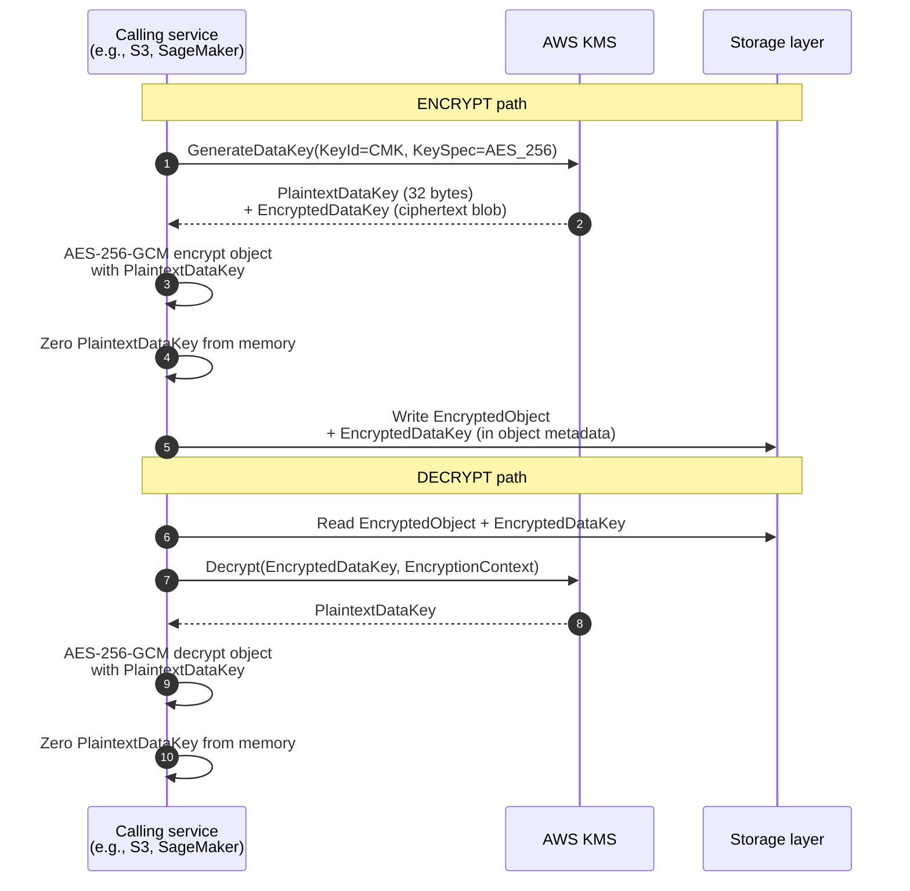
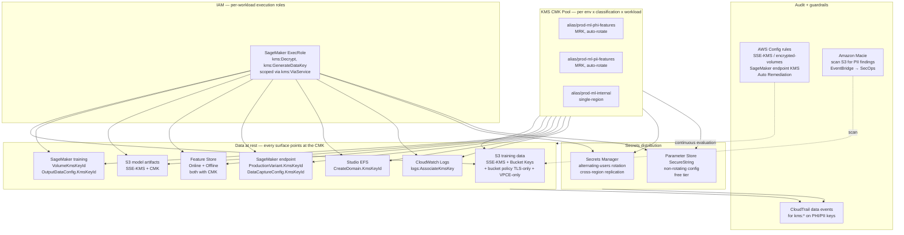

# Chapter 8 — KMS, Secrets Manager & Encryption-in-Depth

> **Goal of this chapter:** to give you a single, end-to-end mental model of every key, every secret, and every encryption decision you will make over the course of an ML model's lifecycle on AWS. By the end of the chapter you should be able to answer four questions without notes: (1) which KMS key type to use for a given workload, (2) where to put each `KmsKeyId` parameter on the SageMaker API surface, (3) when to reach for Secrets Manager versus Parameter Store, and (4) what the IAM, key-policy, and bucket-policy plumbing has to look like for any of it to actually work. Every chapter after this one assumes you can answer those four questions cold — Chapter 11 (storage encryption) builds on the SageMaker `KmsKeyId` map, Chapter 47 (CI/CD) leans on Secrets Manager for build-time credentials, and Chapter 55 (encryption lifecycle) reuses the bucket-key cost math here as its baseline.

---

## 8.1 A thought experiment: the forgotten `KmsKeyId`

Imagine it is 11:47 p.m. on the Thursday before a HIPAA Stage 2 audit at a large AWS-native health insurer. You are the senior MLE on the call. The audit team has, an hour ago, requested CloudTrail evidence of every decrypt operation against the PHI training-data bucket over the past nine months. You have CloudTrail enabled, you have the bucket, you have an IAM-restricted SageMaker execution role. You pull the report.

Nothing.

Not "no unauthorized decrypts." Nothing at all. Zero `kms:Decrypt` events against the bucket's encryption key in the entire reporting window. You scroll back, double-check the date filters, re-run the query. Still nothing. And then — slowly, with the specific dread of an engineer who knows what the next ten minutes are about to look like — you check the bucket's default-encryption configuration and find, in plain ASCII, the string `AES256`. Not `aws:kms`. Not `aws:kms:dsse`. `AES256`. The training pipeline you inherited from the previous team is writing all of its features and model artifacts under SSE-S3 — encrypted at rest, yes, by an AWS-owned key the auditor will never see, the audit log of which AWS will never share, the access to which you do not control.

In the morning you will explain to your CISO that the data is "encrypted" but not "encrypted with a key under our custody." The HIPAA auditor's interpretation of §164.312(a)(2)(iv) is unambiguous: a covered entity must be able to demonstrate access control over the *key*, not just the data. SSE-S3 is, by that definition, insufficient. The remediation is to re-encrypt the entire data lake — millions of objects, terabytes of feature parquet, dozens of model artifacts — by an `S3 BatchOperation Copy` job that rewrites each object under a customer-managed CMK. Three weeks of platform engineering work. A delayed BAA renewal with the hospital network whose patient data is in that bucket. A critical audit finding on the next 10-K. And, if the regulator is in a bad mood, the kind of seven-figure fine that ends careers.

The fix to all of this — to the entire incident, to the entire chain of consequences — is a *single missing parameter* on the original `CreateTrainingJob` call, six months ago, made by someone who almost certainly did not realize that omitting `OutputDataConfig.KmsKeyId` would silently default to SSE-S3 rather than fail loudly. That parameter, and roughly twenty siblings scattered across the SageMaker API, is what this chapter is about. Get them right and the audit is boring. Get them wrong and you are, at best, doing three weeks of unpaid weekend work.

⚠️ **Exam alert.** The MLA-C01 exam guide places encryption in *both* Domain 1 (Task 1.3: "Techniques to encrypt data … data classification, anonymization, and masking") *and* Domain 4 (Task 4.3: "Secure AWS resources"). That double-billing is intentional: every form of the exam will have multiple encryption-mechanics questions, and they are written to test whether you understand the plumbing — which parameter on which API call encrypts which surface with which key — not whether you can define "envelope encryption" in three sentences. The forgotten-`KmsKeyId` story above is essentially a long-form practice question.

---

## 8.2 KMS fundamentals — the three-tier ownership model

Before any of the SageMaker-specific mechanics, you need a sturdy mental model of KMS itself. KMS exists because four operational realities make rolling your own encryption unworkable at scale.

**First, key custody is hard.** If the master key lives in a config file, an environment variable, an instance volume, or anywhere a `cat` could read it, it is exposed to every operator, every memory dump, every accidental commit to a public repo. KMS keeps the key material on FIPS 140-2 Level 3 (and now FIPS 140-3 Level 3) validated HSMs that *never export the plaintext*. You can call `Encrypt` and `Decrypt` on the key — you cannot retrieve the key.

**Second, key rotation is operationally expensive.** Rotating a key by hand means re-encrypting every ciphertext that was encrypted with the old key — for a production data lake, that's a multi-week project. KMS handles rotation by versioning the underlying cryptographic material *inside* the same key container. Old ciphertexts decrypt with the old version, new encryptions use the new version, and your application code never changes.

**Third, cross-service integration.** Every AWS service that needs to encrypt at rest — S3, EBS, RDS, SageMaker, Secrets Manager itself, CloudWatch Logs, Glue, EMR, DynamoDB, the lot — speaks KMS as a common protocol. Without KMS, you would write per-service encryption shims forever and have no consistent audit story.

**Fourth, audit.** Every `Encrypt`, `Decrypt`, `GenerateDataKey`, and `ReEncrypt` against a customer-managed key shows up in CloudTrail, *with* the calling principal, the key used, the encryption context, and the source IP/VPC endpoint. This is the single most-requested piece of evidence in any regulated audit, and it is the answer to "prove no unauthorized person decrypted PHI."

### 8.2.1 The three key-ownership tiers — memorize this table cold

This is the single most-tested KMS concept on the MLA-C01. There are exactly three tiers and they differ along seven axes that the exam will test in scenario form.

| | AWS-owned key | AWS-managed key | Customer-managed key (CMK) |
|---|---|---|---|
| Where the key lives | In an AWS service-owned account (invisible to you) | In your account, owned and rotated by an AWS service | In your account, owned by you |
| Visible in your console? | No | Yes (alias `aws/<service>` — `aws/s3`, `aws/ebs`, `aws/sagemaker`, `aws/secretsmanager`) | Yes (any alias you assign) |
| Key policy editable? | No | No (read-only) | **Yes** |
| CloudTrail logs of usage? | No | Yes | Yes |
| Rotation | AWS-decided, opaque | Mandatory annual (~365 days) | Optional; default annual when enabled; configurable 90–2560 days |
| Cross-account sharing? | No (service handles transparently) | **No** — encrypted resources cannot be shared cross-account | **Yes** (key policy can grant cross-account principals) |
| Monthly cost | $0 | $0 (per-API charges may apply but typically absorbed) | **$1/month per key** + per-API call charges |
| Counts against KMS key quota? | No | No | Yes |
| When to use | Encryption-by-default when you need zero visibility | Quick-start, no compliance constraint on key custody | **The right answer for any regulated ML workload** |

The exam decoder ring for this table:

- "Most secure" / "regulated" / "PCI/HIPAA/GDPR/FedRAMP" / "audit trail required" → **customer-managed CMK**.
- "Most cost-effective" / "lowest operational overhead" / "no compliance constraint" → **AWS-managed key** (often `aws/s3` or `aws/ebs`).
- "Cross-account sharing of encrypted data" → **must be customer-managed CMK**. The AWS-managed `aws/s3` key explicitly cannot be used to encrypt objects shared across accounts, and the exam exploits this every form.

A note on terminology that trips up candidates: AWS-managed keys are increasingly a **legacy tier**. New AWS services launched after roughly 2021 default to AWS-owned keys (cheaper, transparent, but with zero visibility) when they do not expose CMK customization. The exam still tests AWS-managed keys, but in the real world you will see fewer of them on new services.

### 8.2.2 Symmetric versus asymmetric — what each is actually for

| | Symmetric (`SYMMETRIC_DEFAULT`, AES-256-GCM) | Asymmetric (RSA 2048/3072/4096, ECC P-256/384/521, SM2) |
|---|---|---|
| Same key encrypts and decrypts? | Yes | No — public encrypts / private decrypts; or private signs / public verifies |
| Supports `GenerateDataKey`? | **Yes** (the only choice for envelope encryption) | No |
| Supports sign/verify? | No | Yes |
| Automatic rotation? | Yes (annual or 90–2560 days) | **No** — manual only; rotate by creating a new key and migrating |
| Typical ML use cases | All at-rest data encryption (S3, EBS, SageMaker, Feature Store, Secrets Manager) | Model artifact signing; container image signing (via AWS Signer); identity tokens |

Roughly 99% of the encryption mechanics on the MLA-C01 are about symmetric CMKs. The exam may toss in one asymmetric distractor for a "sign the model artifact so the inference cluster can verify provenance" scenario — recognize that asymmetric is required there (because verify needs the public key without exposing the private key) and move on.

### 8.2.3 Multi-region keys (MRKs) — when DR forces your hand

A **multi-region key** is a CMK with a primary in one region and replicas in others, sharing the *same key material* and the *same key ID* (the ID is prefixed `mrk-`). What is *not* shared across replicas: the key policy, tags, aliases, and grants — each replica is an independent KMS resource for IAM purposes, and each replica is independently billed at $1/month.

The reason MRKs exist is concrete and operational: before MRKs, if you wanted active-active or active-passive DR for an S3 cross-region replicated bucket, you ended up with separate KMS keys per region and had to re-wrap (decrypt with key A, re-encrypt with key B) every replicated object as it crossed the regional boundary. With MRKs, the same key ID resolves locally in each region, and a ciphertext encrypted in `us-east-1` can be decrypted in `eu-west-1` *without re-encryption* by the local replica.

| Scenario | Why an MRK is the right answer |
|---|---|
| S3 Cross-Region Replication of encrypted training data | The replicated object decrypts in the DR region without rewrap |
| DynamoDB global tables with encryption | Same key ID resolves in every replica region |
| SageMaker model artifacts replicated for multi-region DR | DR-region endpoint decrypts locally, no cross-region KMS call |
| Multi-region inference (active-active) | Both endpoints can decrypt model + feature data using the same key ID |
| Cross-region SQS/SNS/EventBridge in pipelines | Producers and consumers share key material across regions |

MRKs are still **regional resources** — they don't decrypt across regions on a single call. A ciphertext encrypted in us-east-1 still has to be decrypted by the us-east-1 replica or moved to eu-west-1 first. The value is that the *key material is already there* when the data arrives.

### 8.2.4 Key rotation — what actually changes

When you enable automatic rotation on a customer-managed symmetric key, AWS KMS rotates the underlying cryptographic material (the HSM Backing Key, or HBK) inside the key container. The key ID, ARN, policies, aliases, and grants stay the same. Old ciphertexts continue to decrypt because the old HBK is preserved internally and looked up by version when needed.

| Key type | Auto-rotation default | Configurable? |
|---|---|---|
| AWS-owned | AWS-decided, opaque | No |
| AWS-managed | **Mandatory** annual (~365 days) | No |
| Customer-managed, symmetric | Off by default; enable for annual; can configure 90–2560 days | **Yes** |
| Customer-managed, asymmetric | **Not supported** — create a new key manually and migrate | N/A |

Rotation is **free** — no additional KMS API charge. The production guidance: enable rotation on every customer-managed symmetric CMK unless you have a documented reason not to (and the reason had better be specific, such as a regulator that requires immutable key material for an audit window).

---

## 8.3 The policy triad — key policies, IAM policies, and grants

KMS has three different authorization primitives, and the interaction among them is where the high-yield exam questions live.

| Primitive | Attached to | Who can authorize use? | Typical scenario |
|---|---|---|---|
| **Key policy** | The KMS key itself (mandatory — every key has exactly one) | **Required.** KMS denies if the key policy does not explicitly allow, *regardless* of any other policy in the world | Day-one key setup; explicit allow-list of admins and users |
| **IAM policy** (identity-based) | An IAM user, role, or group | Effective only when the key policy *delegates to IAM* (the typical "Principal: arn:aws:iam::ACCOUNT:root" block in the key policy) | Per-team / per-app permissions |
| **Grant** | A specific KMS key, created programmatically via `CreateGrant` | Granted at runtime; does not modify the key policy | Temporary, narrowly-scoped delegation; AWS services create grants on your behalf when you specify a CMK |

**The cardinal KMS rule, and the single most-tested concept in the policy area:** *an IAM identity policy alone is never sufficient for KMS access.* Even if your IAM role has `kms:Decrypt` on every key in the universe via `Resource: "*"`, KMS will still deny the call if the **key policy** does not allow it. The exam loves to write a scenario where the IAM policy, bucket policy, S3 permissions, and SageMaker execution role all look correct, and the missing piece is a single statement in the key policy.

The delegation idiom — making the key policy delegate to IAM — is the canonical "enable IAM" block:

```json
{
  "Sid": "EnableIAMUserPermissions",
  "Effect": "Allow",
  "Principal": { "AWS": "arn:aws:iam::111122223333:root" },
  "Action": "kms:*",
  "Resource": "*"
}
```

That single statement says "trust IAM policies in this account to manage KMS access on this key." Without it, even the account root has no authority on the key — a state that has bricked production keys in real-world incidents that required AWS Support tickets to unwind.

**Grants** are the right choice when you need to delegate access *temporarily without editing the key policy* (which is a higher-friction operation, typically gated to a small admin group). They are also how AWS services use your key on your behalf: EBS creates a grant when an encrypted volume is attached; RDS creates one when an encrypted snapshot is taken; SageMaker creates one when a training job specifies a CMK for an output bucket. You never see these — they happen automatically and retire when the resource is deleted.

A common production pattern is `kms:ViaService` as a defense-in-depth knob in the key policy:

```json
{
  "Sid": "AllowSageMakerExecRoleViaS3Only",
  "Effect": "Allow",
  "Principal": { "AWS": "arn:aws:iam::111122223333:role/SageMakerExecRole" },
  "Action": [
    "kms:Encrypt", "kms:Decrypt", "kms:ReEncrypt*",
    "kms:GenerateDataKey*", "kms:DescribeKey"
  ],
  "Resource": "*",
  "Condition": {
    "StringEquals": { "kms:ViaService": "s3.us-east-1.amazonaws.com" }
  }
}
```

Even if the SageMaker execution role is later compromised, the attacker can only use this key *through S3 in us-east-1* — not through KMS directly, not through any other service. This is the regulated-shop default. See Chapter 5 (IAM for ML) for the broader principal-policy patterns that this combines with.

---

## 8.4 Envelope encryption — the pattern under everything

KMS does not encrypt your data directly. KMS encrypts a small (typically 32-byte) **data key**, and *that* data key encrypts your data. This pattern is called **envelope encryption**, and it is the architectural foundation of S3 SSE-KMS, EBS encryption, Secrets Manager, SageMaker volume encryption, and almost every "at rest with KMS" feature in the AWS catalog.



Three operational properties of envelope encryption that the exam tests by implication:

1. **KMS never sees your data.** Only 32-byte data keys cross the KMS API. A 100-GB training file stays inside the calling service throughout. This is why KMS is throughput-bounded in a way that the underlying data is not — the limiting factor is *how many data keys per second you mint*, not how many bytes you encrypt.
2. **KMS throughput is small relative to data throughput.** Each CMK is bounded by per-account-per-region request quotas (5,500–10,000 RPS for symmetric crypto in most regions, up to 100,000 in us-east-1 for some keys; per-key-store custom-key-store cap of 1,800 RPS). Without envelope encryption and caching, a high-volume S3 bucket would saturate KMS instantly. With envelope encryption *plus* S3 Bucket Keys (next section), you do one KMS call per *N* objects.
3. **Per-call IAM implications.** A principal that *encrypts* needs `kms:GenerateDataKey`; a principal that *decrypts* needs `kms:Decrypt`. S3 multipart upload needs both (because the multipart finalization re-references the data key). A pipeline reading from bucket-A (encrypted by CMK-A) and writing to bucket-B (encrypted by CMK-B) needs `kms:Decrypt` on CMK-A and `kms:GenerateDataKey` on CMK-B — map both into the execution role.

---

## 8.5 KMS cost and throttling — the bucket-keys lever

This is the section that, if you absorb only one thing operationally, will save you the most pain in your first year as an AWS-native ML platform engineer. It is also a high-yield MLA-C01 topic disguised as an obscure ops concern.

### 8.5.1 The numbers to memorize

- **CMK monthly cost:** $1 per key per month, prorated hourly. Each replica of a multi-region key is billed as a separate $1/month key (so an MRK in three regions = $3/month).
- **AWS-managed keys (`aws/s3`, `aws/ebs`, `aws/sagemaker`):** free to exist, no monthly charge.
- **Symmetric API calls:** $0.03 per 10,000 requests. The KMS free tier covers 20,000 requests per month.
- **Asymmetric API calls:** $0.15 per 10,000 RSA-2048 requests, more for larger keys.
- **`GenerateDataKeyPair` (asymmetric):** significantly more expensive — RSA-4096 capped at 1 RPS by default.
- **Symmetric crypto RPS quota:** **5,500–10,000 RPS per account per region** in most regions; up to 100,000 RPS for some keys in us-east-1. The quota is **shared across all symmetric keys, all principals, and all services in the account-region** — a Glue job, a SageMaker training job, and an inference endpoint all draw from the same bucket. The quota is adjustable via Service Quotas *except* the 1,800 RPS per-custom-key-store cap, which is not.
- **Asymmetric crypto RPS quota:** ~1,000 RPS shared for RSA; ~1,000 RPS for ECC/SM2; ~1,000 RPS for ML-DSA (post-quantum). Separate from the symmetric pool.

### 8.5.2 How ML teams actually get throttled

Three production patterns produce `KMSThrottlingException` regularly:

1. **High-RPS inference with SSE-KMS feature lookups.** Online inference fetches features from a DynamoDB- or S3-backed feature store; each fetch triggers a `Decrypt` against the CMK. At 5k inference RPS with two feature fetches per request → 10k KMS RPS → throttle in a smaller region.
2. **Big-data Glue/EMR jobs reading SSE-KMS S3.** Without S3 Bucket Keys, every single S3 GET on an SSE-KMS object generates a `Decrypt` call to KMS. A Spark job opening 100k Parquet files at 1k files/sec from each of 10 executors = 10k KMS RPS sustained.
3. **SageMaker distributed training reading SSE-KMS shards.** A training job with `instance_count=8` reading SSE-KMS-encrypted shards from S3 trivially bursts into the thousands of KMS RPS, especially during the first epoch when no caching has warmed.

The visible symptom is uniform: `KMSThrottlingException: Rate exceeded` propagating up as a job failure or an inference latency spike.

### 8.5.3 S3 Bucket Keys — the single biggest cost lever in the AWS catalog

A **bucket key** is an S3 feature that, when enabled on an SSE-KMS bucket, lets S3 cache one bucket-level data key (refreshed periodically) and use it to derive per-object data keys *without* re-calling KMS for every object access.

**The headline number, straight from AWS:** up to **99% reduction in KMS request volume and cost** when bucket keys are enabled. Customers have collectively saved over $80M since launch. AWS itself frames this as the recommended baseline for any SSE-KMS bucket — there is no scenario in regulated ML where you should run SSE-KMS *without* bucket keys.

⚠️ **Exam alert.** When the MLA-C01 question describes "a SageMaker batch transform job processing SSE-KMS-encrypted data fails with `KMSThrottlingException`" and asks for the **most cost-effective** remediation, the answer is almost always **enable S3 Bucket Keys on the source bucket** — not a quota increase (which costs the ticket and doesn't reduce KMS cost), not "spread across more CMKs" (which doesn't help because quotas are per account-region, not per key), and definitely not "switch to SSE-S3" (which solves the throughput problem by destroying the audit trail). Bucket keys are free, one-toggle, and reduce both cost and request volume by ~99%.

**Operational catches you should know:**

- Bucket keys can be enabled on a bucket and apply only to objects written *after* the toggle. Existing objects retain their per-object KMS wrap until they are re-copied.
- The encryption context shifts from the **object ARN** (without bucket keys) to the **bucket ARN** (with bucket keys). CloudTrail searches scoped to a specific object will no longer find decrypt events; key-policy `Condition` blocks that pin `kms:EncryptionContext` to object ARNs will need to relax to bucket ARNs.
- Bucket keys are **not supported with DSSE-KMS** (dual-layer encryption — see below). DSSE-KMS workloads pay full KMS cost per object.

The other mitigations in order of preference: AWS Encryption SDK data key caching (client-side, for non-S3 workloads); Service Quotas increase; exponential backoff with jitter; spreading load (only useful for blast radius, not for throughput — quotas are per-account-region).

---

## 8.6 S3 server-side encryption — the four options compared

S3 supports four distinct server-side encryption modes, and the exam will test which one to pick under each common compliance constraint.

| Option | Key origin | Customer key control | Audit trail | Cost | When to use |
|---|---|---|---|---|---|
| **SSE-S3** (AES-256) | AWS-owned key pool | None | Only S3 access events; no KMS events | Free | The default since Jan 2023. Fine for non-regulated, public, dev/test data. **Not sufficient for HIPAA/PCI/GDPR-regulated workloads.** |
| **SSE-KMS** | KMS key — either AWS-managed `aws/s3` *or* customer-managed CMK | Full (with CMK) | Yes — every `GenerateDataKey`/`Decrypt` in CloudTrail | $1/key/month + per-request KMS charges | **The regulated-ML default.** Always pair with a customer-managed CMK *and* S3 Bucket Keys. |
| **DSSE-KMS** | KMS CMK, applied as *two* independent AES-256-GCM layers with two independent data keys | Full | Yes — but doubled (two KMS calls per object) | ~2× SSE-KMS, **no bucket keys support** | Hard regulatory requirement for dual-layer encryption — DoD CNSA, NSA DAR-CP v5.0, some FedRAMP High workloads. Rarely needed commercially. |
| **SSE-C** | You provide the AES-256 key on every request | Full (you own the key entirely; AWS never stores it) | Limited — only request metadata in CloudTrail; key material never logged | Free (no KMS charges) | Niche: regulator explicitly requires AWS to never possess the key. Painful — no rotation, no console access, must include the key in every API call. |

⚠️ **Exam alert (default-encryption gotcha).** Since January 2023, **every new S3 bucket has SSE-S3 enabled by default.** This is *not* the same as "encrypted with a CMK under your custody." Candidates routinely lose points by reading "the bucket has default encryption enabled" and concluding "regulatory requirements are met." Default encryption is only the floor — for regulated workloads, you must explicitly configure SSE-KMS with a customer-managed CMK. The `s3-bucket-server-side-encryption-enabled` AWS Config rule passes for SSE-S3; you need a *separate* policy gate to enforce CMK encryption.

**Cross-account SSE-KMS — a critical detail.** The AWS-managed key `aws/s3` **cannot be used for cross-account access**. An object encrypted with `aws/s3` in account A cannot be read by a principal in account B, period. If your ML pipeline pulls training data from a partner account, you *must* use a customer-managed CMK and grant decrypt to the partner's principal in the key policy. This is one of the highest-frequency exam patterns for cross-account scenarios.

### 8.6.1 Enforcing SSE-KMS via bucket policy

To *require* SSE-KMS on a bucket (so no caller can accidentally PUT a plaintext or SSE-S3 object), deny `PutObject` when the relevant SSE header is missing:

```json
{
  "Sid": "RequireSSEKMS",
  "Effect": "Deny",
  "Principal": "*",
  "Action": "s3:PutObject",
  "Resource": "arn:aws:s3:::company-ml-training-data/*",
  "Condition": {
    "Null": {
      "s3:x-amz-server-side-encryption-aws-kms-key-id": "true"
    }
  }
}
```

Pair this with `aws:SecureTransport = false → Deny` (TLS-only) and `aws:SourceVpce` (VPC-endpoint-only). Those three statements together are the canonical regulated-ML-data-lake lockdown. See Chapter 11 for the broader S3 hardening playbook.

---

## 8.7 EBS, EFS, FSx, and CloudWatch Logs — the other at-rest surfaces

S3 gets the headlines, but every ML workload also writes to volumes, filesystems, and log streams that each have their own encryption story.

### 8.7.1 EBS encryption

| Knob | What it controls |
|---|---|
| Per-region **"EBS encryption by default"** account setting | Forces every new EBS volume in the region to be encrypted, even when the API caller omits `Encrypted=true`. Defaults to the AWS-managed `aws/ebs` key. **Turn this on in every region you use.** |
| Account default KMS key for EBS | Override the AWS-managed `aws/ebs` with a customer-managed CMK so that default-encrypted volumes use *your* key |
| Per-volume `KmsKeyId` | Override the default for a specific volume |
| Encrypted snapshots | Always encrypted with the same key as the source volume; copying a snapshot to a different region lets you re-encrypt under a different CMK |
| Encrypted AMIs | Built from encrypted EBS snapshots; sharing cross-account requires the KMS key policy to allow the recipient |

The AWS service that creates an EBS volume on your behalf (EC2, SageMaker training, RDS) creates a **grant** on the CMK so it can decrypt at attach time. The grant retires when the volume is detached or deleted.

A subtle gotcha that the exam tests: on some **Nitro-based instance families with built-in NVMe local storage**, the local instance store is encrypted with ephemeral instance-level keys that are FIPS-compliant but not customer-controllable. The `VolumeKmsKeyId` parameter is *ignored* (or rejected by the API) for these instance types. When the scenario says "encrypt the training instance's local storage with our CMK," the correct answer is "choose an instance family that supports EBS-backed storage and specify `VolumeKmsKeyId`" — or accept the ephemeral encryption as compliant.

### 8.7.2 EFS and FSx

| Service | At-rest encryption | In-transit encryption |
|---|---|---|
| **EFS** | KMS (`aws/elasticfilesystem` or CMK); mandatory at filesystem creation, immutable thereafter | TLS via the EFS mount helper (`amazon-efs-utils`); requires the `tls` mount option |
| **FSx for Lustre** | KMS (AWS-managed or CMK) | Automatic on certain Nitro instance families; optional Kerberos on others |
| **FSx for OpenZFS** | KMS | Optional TLS |
| **FSx for NetApp ONTAP** | KMS for SVMs and volumes | TLS via the ONTAP NAS protocols |
| **FSx for Windows File Server** | KMS | SMB 3.0+ negotiated encryption |

For SageMaker, EFS shows up as the **Studio user EFS volume** (encrypted via the domain's `KmsKeyId`). FSx for Lustre shows up as a **training-data hot-tier filesystem** — encrypted by the FSx CMK; the SageMaker execution role needs `kms:Decrypt` on that CMK.

### 8.7.3 CloudWatch Logs

By default, CloudWatch log groups are encrypted with an AWS-owned key (no visibility). To switch to a customer-managed CMK:

```bash
aws logs associate-kms-key \
  --log-group-name /aws/sagemaker/TrainingJobs \
  --kms-key-id arn:aws:kms:us-east-1:111122223333:key/abcd-...
```

The CMK key policy **must allow the CloudWatch Logs service principal** for the specific log group ARN. Forgetting this is the #1 cause of "training job starts and then fails 30 seconds in with no log output" symptoms — the job kicks off, tries to push the first log line, the log stream's CMK denies, the log subsystem fails silently, and the job dies without any observable output.

```json
{
  "Effect": "Allow",
  "Principal": { "Service": "logs.us-east-1.amazonaws.com" },
  "Action": [
    "kms:Encrypt*", "kms:Decrypt*",
    "kms:ReEncrypt*", "kms:GenerateDataKey*", "kms:Describe*"
  ],
  "Resource": "*",
  "Condition": {
    "ArnEquals": {
      "kms:EncryptionContext:aws:logs:arn":
        "arn:aws:logs:us-east-1:111122223333:log-group:/aws/sagemaker/TrainingJobs*"
    }
  }
}
```

---

## 8.8 The SageMaker `KmsKeyId` map — every place the parameter appears

This is the table the MLA-C01 exam tests most aggressively. SageMaker exposes a CMK parameter on nearly every API surface that touches durable storage, and the exam loves questions of the form "encrypt the offline feature store with a CMK — which parameter do you set?"

| API / Resource | Parameter path | What it encrypts | If omitted |
|---|---|---|---|
| `CreateTrainingJob` | `OutputDataConfig.KmsKeyId` | Model artifacts written to the output S3 location | SSE-S3 with `aws/s3` |
| `CreateTrainingJob` | `ResourceConfig.VolumeKmsKeyId` | EBS volume attached to training instances | AWS-managed `aws/ebs`; ignored on Nitro instances with local NVMe |
| `CreateProcessingJob` | `ProcessingOutputConfig.KmsKeyId` | Output S3 location for processing job results | SSE-S3 |
| `CreateProcessingJob` | `ProcessingResources.ClusterConfig.VolumeKmsKeyId` | EBS volume on processing cluster | `aws/ebs` defaults |
| `CreateTransformJob` (batch) | `TransformOutput.KmsKeyId` | Batch transform output objects in S3 | SSE-S3 |
| `CreateTransformJob` | `TransformResources.VolumeKmsKeyId` | EBS volume on transform instances | `aws/ebs` defaults |
| `CreateEndpointConfig` → `ProductionVariants[*]` | `KmsKeyId` (on the variant) | EBS volume attached to the inference instance | `aws/ebs` |
| `CreateEndpointConfig` → `AsyncInferenceConfig.OutputConfig.KmsKeyId` | KMS key for async-inference *output* objects in S3 | SSE-S3 |
| `CreateEndpointConfig` → `DataCaptureConfig.KmsKeyId` | KMS key for data-capture (Model Monitor) S3 outputs | SSE-S3 |
| `CreateNotebookInstance` | `KmsKeyId` | Classic notebook instance EBS volume | `aws/ebs` |
| `CreateDomain` (Studio) | `KmsKeyId` | Studio EFS volume (per-user JupyterServer storage) | `aws/elasticfilesystem` |
| `CreateUserProfile` (Studio) | inherits from domain | — | — |
| `CreateAutoMLJob` / `CreateAutoMLJobV2` | `OutputDataConfig.KmsKeyId`, `ResourceConfig.VolumeKmsKeyId` | Autopilot outputs, training volumes | Defaults as above |
| `CreateFeatureGroup` | `OnlineStoreConfig.SecurityConfig.KmsKeyId` | Online store (DynamoDB-backed) feature data | AWS-managed key |
| `CreateFeatureGroup` | `OfflineStoreConfig.S3StorageConfig.KmsKeyId` | Offline store S3 objects (Iceberg/Parquet) | SSE-S3 |
| `CreatePipeline` | KMS on the underlying artifact S3 bucket | Pipeline step inputs/outputs | Bucket defaults |
| `CreateModelPackage` (Registry) | Inherits from model artifact storage | Model package metadata + linked artifacts | Per-resource defaults |

Two pitfalls the exam exploits relentlessly:

1. **`VolumeKmsKeyId` does not apply on all instance families.** On Nitro-based families with built-in NVMe (some `ml.g5d`, `ml.p4de`, `ml.trn1n` variants), the local instance store uses ephemeral instance-level encryption that you cannot replace with a CMK. The parameter is ignored or rejected. When the scenario demands "all storage encrypted with our CMK on this specific Nitro family," the answer is either "choose a non-NVMe family" or "the ephemeral encryption is FIPS-compliant by default and satisfies the requirement."
2. **Input data and output artifacts can be encrypted by *different* CMKs.** A training job reading from `data-bucket` (encrypted with CMK-A in a different account) and writing to `artifact-bucket` (encrypted with CMK-B in your account) needs `kms:Decrypt` on CMK-A *and* `kms:GenerateDataKey` on CMK-B in the execution role, plus matching key-policy entries on both keys.

⚠️ **Exam alert (KmsKeyId on output).** The most common silent failure across all of these parameters is omitting `OutputDataConfig.KmsKeyId` on `CreateTrainingJob`. The training job succeeds, the model artifact is written to S3, the artifact appears to be encrypted (because SSE-S3 is on by default since 2023), and *months later* the audit asks for the CloudTrail decrypt evidence — which does not exist, because the artifact was encrypted with the AWS-owned `aws/s3` key whose usage AWS does not log to your trail. The fix is to *always* set `KmsKeyId` on every SageMaker output surface in regulated environments. Better still, enforce it with an AWS Config rule (`sagemaker-endpoint-configuration-kms-key-configured`, `sagemaker-notebook-instance-kms-key-configured`).

### 8.8.1 The SageMaker encryption-at-rest cheat sheet

| Asset | Default | Hardened (regulated production) |
|---|---|---|
| S3 training data | SSE-S3 | SSE-KMS + CMK + Bucket Keys |
| S3 model artifacts | SSE-S3 | SSE-KMS + CMK |
| Training instance EBS | `aws/ebs` | CMK via `ResourceConfig.VolumeKmsKeyId` |
| Notebook EBS | `aws/ebs` | CMK via `CreateNotebookInstance.KmsKeyId` |
| Endpoint EBS | `aws/ebs` | CMK via `ProductionVariant.KmsKeyId` |
| Studio EFS | `aws/elasticfilesystem` | CMK via `CreateDomain.KmsKeyId` |
| Feature Store online | AWS-managed | CMK via `OnlineStoreConfig.SecurityConfig.KmsKeyId` |
| Feature Store offline | SSE-S3 | CMK via `OfflineStoreConfig.S3StorageConfig.KmsKeyId` |
| Async inference output | SSE-S3 | CMK via `AsyncInferenceConfig.OutputConfig.KmsKeyId` |
| Data capture (Model Monitor) | SSE-S3 | CMK via `DataCaptureConfig.KmsKeyId` |
| Training CloudWatch Logs | AWS-owned | CMK via `logs:AssociateKmsKey` |
| Inter-container training traffic | Cleartext within VPC | `EnableInterContainerTrafficEncryption=true` |

---

## 8.9 `EnableInterContainerTrafficEncryption` — encryption *in transit* for distributed training

For **distributed training** (Horovod, PyTorch DDP, parameter-server topology) across multiple SageMaker instances, traffic between containers crosses the VPC network. By default, that inter-container traffic is in cleartext within the VPC — fine for most workloads, not fine for FedRAMP, HIPAA, or regulated-finance training that requires encryption-in-transit *even within the cloud boundary*.

Setting `EnableInterContainerTrafficEncryption=true` on `CreateTrainingJob` or `CreateHyperParameterTuningJob` wraps the inter-instance communication in IKE/IPsec (UDP 500 for IKE, IP protocol 50 for ESP).

**Requirements:**

- Security groups attached to the training-job ENIs must allow **UDP 500 inbound from the SG itself** (self-referencing) **and ESP (protocol 50)**.
- Modest performance overhead — small for built-in algorithms (XGBoost, DeepAR, Linear Learner), more noticeable for deep-learning workloads that move large gradient tensors per step.
- Cross-link: see Chapter 7 (VPC + networking for SageMaker) for the broader VPC + security-group story; the inter-container traffic encryption setting depends on the SG configuration that chapter walks through.

For TLS in transit to **inference endpoints**, SageMaker terminates TLS 1.2+ by default with AWS-managed certificates — you do not manage the cert. For a custom domain (`predict.myco.com`), put API Gateway or CloudFront in front of the SageMaker endpoint and attach an ACM certificate.

---

## 8.10 AWS Secrets Manager

A managed service for storing, retrieving, and **automatically rotating** secrets — typically database credentials, third-party API tokens, OAuth secrets, and application credentials. The two things Secrets Manager gives you that nothing else does in a single integrated box: **automatic rotation** and **native cross-region replication**.

### 8.10.1 Pricing

- **$0.40 per secret per month**, prorated hourly.
- **$0.05 per 10,000 API calls.**
- KMS charges for the encrypting key (free for the default `aws/secretsmanager`; per-key + per-request rates if you use a customer-managed CMK).
- For Lambda-based custom rotation, the Lambda invocation cost. "Managed rotation" for some integrations (RDS, Aurora) has no Lambda cost.
- No charge for secrets marked for deletion within the 7–30 day recovery window.

### 8.10.2 The rotation lifecycle

When a rotation Lambda fires (on schedule or via the `RotateSecret` API), it executes four steps in order:

1. **createSecret** — generate the new candidate value, store as the `AWSPENDING` staging label.
2. **setSecret** — apply the new value to the target service (e.g., `ALTER USER pwd='...'` on RDS).
3. **testSecret** — verify the new value works (e.g., connect to the DB and run a sentinel query).
4. **finishSecret** — promote `AWSPENDING` → `AWSCURRENT`; the old value moves to `AWSPREVIOUS` (kept for emergency rollback).

For RDS, Aurora, Redshift, and DocumentDB, AWS supplies the rotation Lambda — you only configure the schedule. For custom secrets (Snowflake key, Hugging Face token, internal API), you write a Lambda following the four-step interface; AWS publishes templates.

### 8.10.3 Single-user vs alternating-users rotation — the SageMaker pipeline pattern

This is the operational pattern that survives long-running SageMaker training jobs.

- **Single-user rotation:** one DB user. The Lambda rotates that user's password. A 6-hour training job that started before rotation will have its connection invalidated mid-job. Cheaper, simpler, *fragile for long-running ML workloads*.
- **Alternating-users rotation (the production default):** two DB users (`mlapp_user_a`, `mlapp_user_b`). At any moment, one is the active `AWSCURRENT`, the other dormant. Rotation generates a new password for the dormant user, validates, then promotes — the previously-active user's credentials remain valid for the next rotation period. A training job that started under the old `AWSCURRENT` still has working credentials throughout its 6-hour run. New jobs pick up the new `AWSCURRENT` at startup.

For any RDS/Aurora source feeding SageMaker training, **alternating-users rotation is the right answer**. The cert tests this through scenarios that mention "long-running training job" and "credential rotation" in the same question.

### 8.10.4 Cross-region replication

`ReplicateSecretToRegions` copies a secret to up to nine other regions. Updates to the primary propagate (eventually consistent). Each replica is encrypted with its own KMS key in the replica region (you specify per replica). Use cases: multi-region SageMaker endpoints that need to read the same DB password locally; DR readiness so the failover region does not need a cross-region API call to authenticate.

### 8.10.5 Retrieving a secret inside a SageMaker container

The execution role needs `secretsmanager:GetSecretValue` on the specific secret ARN *and* `kms:Decrypt` on the secret's CMK (and the CMK key policy must allow the role). The canonical pattern, at job startup, cached for the duration:

```python
import boto3, json
from botocore.exceptions import ClientError

def get_secret(name: str, region: str = "us-east-1") -> dict:
    client = boto3.client("secretsmanager", region_name=region)
    try:
        resp = client.get_secret_value(SecretId=name)
    except ClientError as e:
        raise RuntimeError(f"Could not fetch secret {name}: {e}") from e
    return json.loads(resp["SecretString"])

# In your training entrypoint:
creds = get_secret("snowflake/training-readonly")
conn = snowflake.connector.connect(
    user=creds["username"],
    password=creds["password"],
    account=creds["account"],
)
```

**The "don't do this" list:**

- **Don't put secrets in SageMaker training-job environment variables.** They appear in `DescribeTrainingJob` output and CloudWatch events.
- **Don't bake secrets into the training container image.** Anyone with `ecr:GetDownloadUrlForLayer` can pull and read the image.
- **Don't put secrets in CodeBuild `env/variables`.** They land in build logs. Use `env/secrets-manager` instead.
- **Don't put secrets in CloudFormation `Parameters` without `NoEcho: true`.** They appear in `DescribeStacks`.
- **Don't store AWS credentials as Secrets Manager secrets.** Use IAM roles + STS. Secrets Manager itself warns about this antipattern.

---

## 8.11 AWS Systems Manager Parameter Store

Parameter Store stores three types of values: **String** (plain), **StringList** (comma-separated), and **SecureString** (KMS-encrypted, default `aws/ssm` or your CMK).

**Two tiers:**

- **Standard** — free for the first 10,000 parameters per account per region, 4 KB max value, throughput up to 40 TPS. No advanced features.
- **Advanced** — $0.05 per parameter per month, 8 KB max value, throughput up to 1,000 TPS, parameter policies (expiration, expiration-notification, allowed-values constraints).

Parameter Store wins over Secrets Manager when: you have hundreds or thousands of non-rotating config values (Standard tier is free); you want hierarchical naming (`/prod/training/learning-rate`); the value does not need rotation or cross-region replication. Parameter Store loses when: anything needs auto-rotation; anything is > 8 KB; anything needs cross-region replication; compliance demands "managed by a service that supports auto-rotation."

Retrieving a SecureString in SageMaker:

```python
import boto3
ssm = boto3.client("ssm", region_name="us-east-1")
val = ssm.get_parameter(
    Name="/training/snowflake/password", WithDecryption=True
)["Parameter"]["Value"]
```

The execution role needs `ssm:GetParameter` on the parameter ARN and `kms:Decrypt` on the CMK if encrypted with a customer-managed key.

---

## 8.12 Secrets Manager vs Parameter Store — the decision matrix

| | AWS Secrets Manager | SSM Parameter Store (SecureString) |
|---|---|---|
| Auto-rotation | Yes (managed for RDS/Aurora/Redshift/DocumentDB; Lambda-based otherwise) | No (script it yourself) |
| Cross-region replication | Yes (built-in) | No |
| Per-secret/param storage cost | $0.40/secret/month | Free (Standard), $0.05/param/month (Advanced) |
| API calls | $0.05 per 10,000 | Free (Standard tier), $0.05 per 10,000 (Advanced) |
| Max value size | 64 KB | 4 KB (Standard), 8 KB (Advanced) |
| Hierarchical naming | Path-style supported | Native (`/team/app/key`) |
| KMS encryption | Always (default `aws/secretsmanager`, CMK optional) | Optional (SecureString uses `aws/ssm` default, CMK optional) |
| Versioning | Native (`AWSCURRENT`/`AWSPENDING`/`AWSPREVIOUS`) | Limited |
| CloudFormation dynamic ref | `{{resolve:secretsmanager:...}}` | `{{resolve:ssm-secure:...}}` |
| Compliance integrations (Config rules, Security Hub) | First-class | Limited |
| Typical ML use | DB creds, third-party API tokens, HF/OpenAI keys in **production** | Hyperparameters, non-rotating config, dev/sandbox tokens |

**The decision rule, summarized:**

| Need | Pick |
|---|---|
| Auto-rotation of DB credentials | **Secrets Manager** |
| Cross-region replicated secret | **Secrets Manager** |
| OAuth/API tokens that must rotate | **Secrets Manager** |
| Application config, feature flag | **Parameter Store Standard** |
| Hyperparameter (learning rate, batch size) | **Parameter Store** |
| Encrypted token, hierarchical by team/app | **Parameter Store SecureString** |
| Cost-dominant, no rotation needed | **Parameter Store Standard** |
| Max value > 4 KB | **Secrets Manager** (64 KB) or Parameter Store Advanced (8 KB) |
| Cloud-recommended baseline for production secrets | **Secrets Manager** |

The common cost mistake is putting every config value in Secrets Manager "for consistency" and discovering, two years later, that a 2,000-secret ML platform is costing $800/month for what is mostly static config that never rotates. The opposite mistake — putting DB credentials in Parameter Store and trying to build rotation yourself — is rarer but more dangerous, because rolling your own rotation logic without alternating-users support is how you cause a 3 a.m. outage during a credential roll.

---

## 8.13 CloudHSM, CKS, and XKS — when FIPS 140-2/3 Level 3 is required

AWS KMS itself is backed by FIPS 140-2 Level 3 validated HSMs (and FIPS 140-3 Level 3 for newer infrastructure). For 95% of regulated ML workloads, KMS is sufficient. The compliance bar moves up when:

- The regulator (PCI Council for cardholder data key material; certain DoD contracts) requires the customer to **maintain sole custody of the key material** — meaning AWS personnel must not have any logical or physical path to the keys.
- You need to **bring on-premises key material into AWS** without it ever being unwrapped outside hardware you control.
- You need **FIPS 140-3 Level 3 specifically** — AWS CloudHSM's newer `hsm2m.medium` instance type is FIPS 140-3 Level 3 validated.

### 8.13.1 Two integration patterns

**CloudHSM Custom Key Store (CKS).** KMS keys exist as usual (you create them with `Origin=AWS_CLOUDHSM`), but the key material physically resides in your CloudHSM cluster. All KMS API calls work normally for the consumer (SageMaker, S3) — the CloudHSM-backed CMK is indistinguishable to API callers. Behind the scenes, KMS proxies the cryptographic operation to your HSM cluster.

- **Pro:** seamless for ML services that already use CMKs; no application changes.
- **Con:** **1,800 RPS hard cap per custom key store** (non-adjustable). For high-RPS ML inference workloads, this is *the* constraint that ends the architecture.
- **Con:** you operate the HSM cluster — backups, FIPS evidence, patching coordination with AWS, ~$1.45/hr per HSM instance, two HSMs minimum for HA → ~$2,100/month baseline.

**External Key Store (XKS).** Same idea but the HSM lives **outside AWS** — on-premises, in a colo, in another cloud. KMS forwards crypto requests over a TLS connection to an XKS Proxy in your network, which forwards to your HSM. The cleartext data key never traverses AWS.

- **Pro:** maximum sovereignty. Your key material is provably under your sole physical control.
- **Con:** **1,800 RPS hard cap** (same as CKS), plus network latency on every KMS call — tens to hundreds of ms versus sub-ms for native KMS.
- **Con:** operationally complex. An outage of your on-prem HSM is an outage of every AWS service depending on the CMK.

### 8.13.2 What AWS itself recommends

AWS guidance is unusually direct: "AWS recommends that you use AWS KMS native encryption keys for critical workloads. The complexity and potential points of failure introduced by an external key store might outweigh its benefits when cryptographic operations are on the critical path of your application's functionality."

In practice, ML teams reach for CloudHSM CKS only when the regulator explicitly demands it (DoD, certain finance), and XKS only when there is a sovereignty or "no AWS personnel near the key" requirement that no other architecture satisfies.

A common middle path: **KMS keys with imported key material** (`Origin=EXTERNAL`). You generate the key material on your own HSM, wrap it with the public key KMS provides, and import it into a normal KMS CMK. Key material is then stored in AWS KMS's HSMs, but you retain provenance (you generated it, you have the backup). Normal KMS quotas and pricing — no 1,800 RPS cap. The trade-off is you must re-import on expiry; rotation discipline becomes yours, not KMS's. This is what most "regulated but pragmatic" ML teams settle on.

---

## 8.14 Compliance war stories — patterns that get teams in trouble

These are sanitized composites from public AWS Security Blog posts, audit reports, and conference talks — representative of the failure modes you will encounter.

### 8.14.1 "We thought it was encrypted" — SSE-S3 versus SSE-KMS confusion (HIPAA)

A healthcare analytics startup configured its training-data bucket with default encryption set to SSE-S3 (`AES256`), believed they were "HIPAA-encrypted," and moved on. The HIPAA audit then asked for evidence of access control over the encryption key. Their answer ("S3 manages it") was insufficient — the auditor's reading of §164.312(a)(2)(iv) required the covered entity to demonstrate access control over the *key*, meaning SSE-KMS with a CMK. Remediation: re-encrypt millions of objects via `S3 BatchOperation Copy` under SSE-KMS with a new CMK. Three weeks of platform work, a critical audit finding, and a delayed BAA renewal with a hospital customer.

**Takeaway:** for regulated workloads, "encrypted" means "encrypted with a key I control and can audit access to." SSE-S3 is the floor; SSE-KMS with CMK is the regulated default; DSSE-KMS is the federal-mandate default.

### 8.14.2 "Macie found PII in the training bucket" (GDPR)

A fintech ML team trained a model on what they believed was anonymized customer data. They enabled Macie out of curiosity. Within 24 hours, Macie's `SensitiveData:S3Object/Personal` finding fired on hundreds of objects containing SSNs in a freeform "notes" column the upstream ETL had failed to scrub. The finding triggered EventBridge → SNS → security-team Slack within minutes.

The response loop: quarantine affected prefixes with a deny-all bucket policy; retrain the model from scratch on properly anonymized data (the existing model was potentially tainted by PII memorization — see Chapter 4 on membership-inference attacks); run a one-off Macie discovery job across all training-data buckets; add a recurring Macie scan plus AWS Config rule (`s3-bucket-server-side-encryption-enabled`) as gates.

**Takeaway:** Macie is genuinely useful as a *pre-incident* detector if enabled early. PII in training data is not just a data-handling problem — it can require full model retraining, which is the real cost.

### 8.14.3 "AWS Config caught the unencrypted volume before deploy"

The pre-empt pattern. Mandate the following AWS Config managed rules across every account:

- `s3-bucket-server-side-encryption-enabled` — flag any bucket without default encryption
- `encrypted-volumes` — flag any EBS volume not encrypted
- `rds-storage-encrypted` — flag any RDS instance not encrypted
- `sagemaker-endpoint-configuration-kms-key-configured` — flag any endpoint config without a CMK
- `sagemaker-notebook-instance-kms-key-configured` — flag any classic notebook without CMK

Each is paired with an Auto Remediation action — usually `AWS-EnableS3BucketEncryption` SSM document for S3, or a Security Hub finding routed to PagerDuty. The S3 auto-remediation re-enables default encryption on the offending bucket within minutes of detection.

The exam tests this pattern as "which AWS service provides continuous compliance evaluation against your encryption policy?" — **AWS Config**, not Security Hub (which aggregates findings from Config, GuardDuty, Macie, Inspector).

### 8.14.4 The GDPR fine that motivates all of this

Per 2024 EU enforcement data, GDPR fines crossed €2.8B with **44% of major fines tied to cybersecurity failings** rather than data-misuse — regulators are now treating the absence of basic technical controls (encryption, access logging, MFA) as gross negligence. A fintech that used an offshore analytics provider whose unencrypted S3 buckets were exposed faced a €6.5M fine despite no direct involvement in the breach. This chain-of-custody enforcement is what makes per-classification CMKs, mandatory SSE-KMS, and AWS Config gates a board-level concern rather than a security-team concern.

---

## 8.15 The regulated-shop reference architecture

Putting §8.2 through §8.14 together, the canonical encryption-and-secrets architecture for a HIPAA, PCI, or regulated-finance ML platform looks like this.



The pieces experienced practitioners enforce as **non-negotiable**:

1. **CMK per environment × data classification × workload.** Trivially cheap at $1/month each, hugely valuable for blast radius and per-key CloudTrail auditability.
2. **S3 Bucket Keys on every SSE-KMS bucket** unless explicitly required otherwise (DSSE-KMS, audit-granularity requirement).
3. **Secrets Manager with alternating-users rotation** for every RDS/Aurora/Redshift source feeding ML pipelines.
4. **AWS Config rules** as continuous guardrails — `s3-bucket-server-side-encryption-enabled`, `encrypted-volumes`, `sagemaker-endpoint-configuration-kms-key-configured`, `sagemaker-notebook-instance-kms-key-configured`, `rds-storage-encrypted`.
5. **Macie scanning** on every bucket that could contain customer data — daily discovery, findings via EventBridge to SecOps.
6. **CloudTrail data events on `kms:Decrypt` for PHI/PII keys**, retained per regulatory requirement (HIPAA: 6 years; PCI: minimum 1 year, usually 7).
7. **KMS quotas pre-emptively raised** in any region with serious ML throughput — Service Quotas console, with an 80% utilization CloudWatch alarm.

Cross-link: Chapter 11 (storage encryption) walks the S3 + EBS + EFS + FSx layer in greater operational depth; Chapter 55 (encryption lifecycle) extends this with the rotation, deletion, and re-encryption playbooks; Chapter 5 (IAM for ML) underpins the execution-role design that makes any of this work.

---

## 8.16 Five exam-ready takeaways

1. **Bucket Keys are the answer to "KMS is throttling my ML workload"** 95% of the time. Free, one-toggle, up to 99% reduction in KMS request volume and cost. The exception is DSSE-KMS, which does not support them.
2. **The CMK symmetric-crypto quota is per account, per region, shared across all keys.** Spreading load across more CMKs does *not* lift the cap. Bucket Keys, Encryption SDK data-key caching, and Service Quotas increases do.
3. **Multi-region keys (MRKs) are required for cross-region DR without re-encryption.** SageMaker `OutputDataConfig.KmsKeyId` accepts an MRK ARN — this is the foundation of active-active inference across regions.
4. **Secrets Manager pays for itself only when you need rotation, cross-region replication, or compliance-grade Config/Security-Hub integration.** Otherwise Parameter Store Standard is free and sufficient. For RDS credentials feeding ML pipelines, always alternating-users rotation.
5. **CloudHSM CKS and XKS exist because some regulators demand sole customer custody of key material, not for performance or feature reasons.** Both inherit the 1,800 RPS-per-key-store cap, which is the architectural ceiling. Native KMS is faster, cheaper, more available, and sufficient for almost every ML workload that is not explicitly forbidden from using it.

---

## 8.17 Exercises

Work through these without looking back at the chapter. The answers follow the same rule as the §8.16 takeaways — if you can articulate them out loud to a colleague, you can pick them on the exam.

**Exercise 1 — The missing key policy.** A SageMaker training job fails with `AccessDenied` reading from an S3 bucket. The execution role's IAM policy has `s3:GetObject` on the bucket. The bucket policy allows the execution-role ARN. The bucket has SSE-KMS enabled with a customer-managed CMK. What is the most likely missing piece, and where does it live?

> *Answer:* The CMK **key policy** does not grant `kms:Decrypt` to the execution role. KMS denies if the key policy does not allow, regardless of IAM and bucket policies. The fix is a statement on the key policy (not the IAM role and not the bucket policy) allowing the execution role's ARN to call `kms:Decrypt` (and ideally `kms:GenerateDataKey` for round-trips), optionally scoped with `kms:ViaService = s3.<region>.amazonaws.com`.

**Exercise 2 — Cross-account encryption permissions.** A pipeline reads encrypted features from a bucket in account A and writes encrypted model artifacts to a bucket in account B. Each bucket has its own CMK in its own account. The pipeline's SageMaker execution role lives in account B. Enumerate every permission and policy that has to align for this to work.

> *Answer:*
> - Account A: bucket policy must allow the account-B role to `s3:GetObject`; CMK-A key policy must allow the account-B role to `kms:Decrypt`.
> - Account B: bucket policy must allow the role to `s3:PutObject`; CMK-B key policy must allow the role to `kms:GenerateDataKey`; the IAM identity policy on the role must allow `s3:GetObject` on bucket-A, `s3:PutObject` on bucket-B, `kms:Decrypt` on CMK-A's ARN, and `kms:GenerateDataKey` on CMK-B's ARN.
> - You cannot use `aws/s3` for either bucket — AWS-managed keys do not support cross-account access.

**Exercise 3 — The cheapest path for non-rotating hyperparameters.** A team needs to store 50 non-rotating training hyperparameters, encrypted at rest, each < 1 KB. What is the lowest-cost storage choice?

> *Answer:* **Parameter Store SecureString, Standard tier.** Free for the first 10,000 parameters per account per region; SecureString uses the AWS-managed `aws/ssm` key (no monthly key fee). Total monthly cost: $0. Secrets Manager would cost 50 × $0.40 = $20/month for no functional benefit (no rotation needed, no replication needed).

**Exercise 4 — Snowflake credentials with 30-day rotation.** A production model rotates Snowflake credentials every 30 days. Sketch the architecture, including the execution-role permissions.

> *Answer:* Store the credential in **Secrets Manager** with a Lambda rotation function on a 30-day schedule (alternating-users pattern if Snowflake supports it; otherwise single-user with reconnection-aware client). The training/inference container calls `boto3.client("secretsmanager").get_secret_value(...)` at startup and caches for the job's duration. The execution role has `secretsmanager:GetSecretValue` on the specific secret ARN and `kms:Decrypt` on the secret's CMK. The CMK key policy includes the execution role.

**Exercise 5 — KMS bill is $300/month, want it under $10.** An ML team uses SSE-KMS on a bucket storing 10M training images; their KMS bill is $300/month. What is the simplest fix?

> *Answer:* **Enable S3 Bucket Keys on the bucket.** KMS request volume drops ~99%, KMS bill drops to ~$3–5/month, security is unchanged. Caveat: only applies to objects uploaded *after* the toggle. Existing objects retain their per-object KMS wrap until re-copied.

**Exercise 6 — DR for an encrypted model artifact.** An endpoint in `us-east-1` references a model artifact encrypted with a single-region CMK. The team needs to deploy the same model in `eu-west-1` for DR with the minimum number of architectural changes. Walk the steps.

> *Answer:* Convert the CMK to a **multi-region key** by creating an `eu-west-1` replica. Configure **S3 Cross-Region Replication** on the artifact bucket to a target bucket in `eu-west-1`, encrypted with the MRK replica. Deploy the eu-west-1 endpoint using the replicated artifact and the eu-west-1 replica key. No re-encryption of artifacts is required.

**Exercise 7 — Distributed training with regulator-mandated in-transit encryption.** A distributed training job runs on eight instances. The regulator demands inter-instance traffic encryption. Which parameter and what side effects?

> *Answer:* Set `EnableInterContainerTrafficEncryption=true` on `CreateTrainingJob`. Security groups attached to the training ENIs must allow **UDP 500 inbound from the SG itself** (self-referencing) and **ESP (IP protocol 50)**. Performance overhead is modest for built-in algorithms (XGBoost, DeepAR, Linear Learner) and more noticeable for gradient-heavy deep learning workloads — budget extra training time accordingly.

---

## 8.18 What to read next

- **Chapter 7 — VPC, subnets, and inter-container traffic** for the broader networking story that `EnableInterContainerTrafficEncryption` plugs into.
- **Chapter 11 — Storage encryption in depth** for S3 + EBS + EFS + FSx hardening patterns at the operational level.
- **Chapter 55 — Encryption lifecycle, rotation, and re-encryption** for the long-game playbook on managing CMKs over years.
- **Chapter 5 — IAM for ML** is the prerequisite for understanding the execution-role design that makes everything in this chapter actually function.
