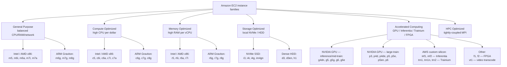
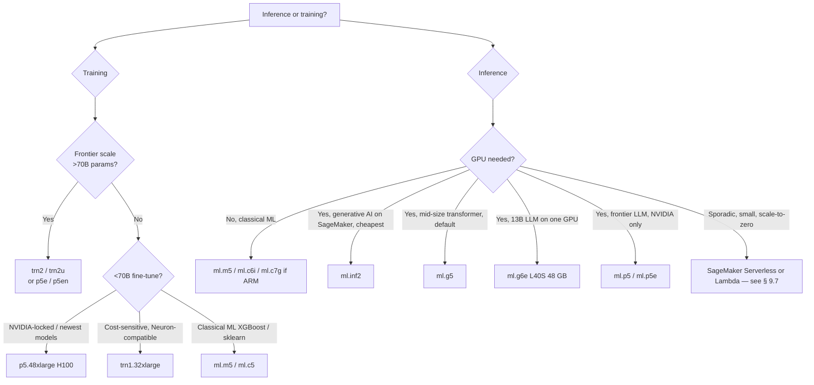
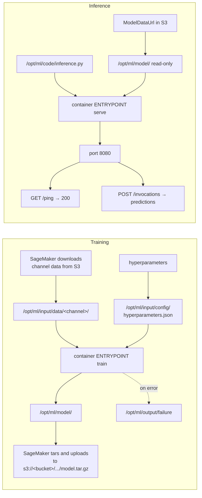
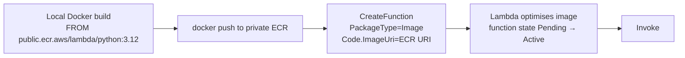
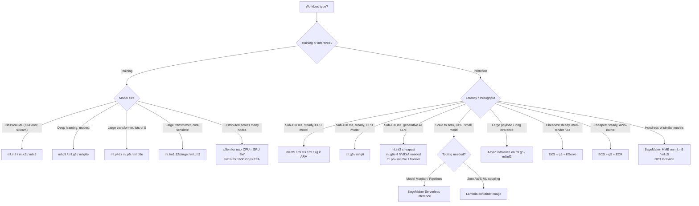

# Chapter 9 — Compute Primitives: EC2 Families, Containers, Lambda

> **Goal of this chapter:** to make the *raw compute layer* underneath every SageMaker training job, every endpoint, every Processing job, and every Lambda inference handler legible. By the end you should be able to read an exam stem that says "deploy this model" and *immediately* eliminate three of the four instance families before you've finished the second sentence. You should know why `ml.g5.xlarge` is the default GPU answer on the 2025 exam, why `ml.g6e.xlarge` is the answer the moment the question whispers "13B parameter model," why `ml.inf2` is the lowest-cost generative-AI answer on SageMaker, and why the answer is *never* `ml.m7g` the moment the stem mentions a Multi-Model Endpoint. You should also be able to recite the SageMaker container contract — the `/opt/ml/` paths, the port, the two HTTP endpoints, the timing windows — from memory, because that contract is the load-bearing primitive that makes BYOC (Bring Your Own Container, Ch 25) and script mode (Ch 24) work at all.

---

## 9.1 Opening: picking the wrong instance family wastes money silently

There is a recurring story at every AWS-native ML shop. A data scientist wraps their PyTorch model in a Dockerfile, picks `ml.p3.2xlarge` because "that's what the tutorial used," deploys a real-time endpoint, and forgets about it. Six weeks later, FinOps emails the team lead: "What is this endpoint doing? It's costing $2,200 a month and serving 400 requests per day." The model is a fine-tuned BERT-base classifier. It would run perfectly happily on `ml.g5.xlarge` at one-third the cost. It would run *more* happily on `ml.inf2.xlarge` at one-fifth. It would, in fact, run fastest of all on `ml.g6e.xlarge` at less cost than the original `p3` because the L40S has 48 GB of GPU memory and the inference batches better. The team made one decision wrong — the instance family — and silently overpaid by $1,500 a month for a month and a half before anyone noticed.

The MLA-C01 exam is built around this story. Roughly a quarter of every deployment question is a thinly disguised "you picked the wrong instance family — which one should you have picked?" The exam never asks you to choose between `m5.xlarge` and `m5.2xlarge` (sizing is just arithmetic), but it constantly asks you to choose between families: general (`m`) vs compute (`c`) vs memory (`r`) vs accelerated (`g`, `p`, `inf`, `trn`), and between silicon variants inside accelerated (NVIDIA T4 vs A10G vs L4 vs L40S vs H100 vs H200, and NVIDIA vs Inferentia vs Trainium). The same model can cost **3x more** on the wrong silicon, or 10x more if you accidentally rent an H100 to serve a model that fits on a T4.

This chapter is the dictionary that lets you read the stem and pick correctly. Section 9.2 lays out the EC2 family tree. Section 9.3 drills into the accelerated families that dominate ML. Section 9.4 covers Graviton — the cheapest CPU lever on AWS and the most-trapped exam topic. Section 9.5 walks the container substrate (ECR + the SageMaker `/opt/ml/` contract). Sections 9.6 through 9.8 cover ECS, EKS, Lambda, Batch, and Fargate for teams that go around SageMaker. Section 9.9 collects real-world cost stories. Section 9.10 covers Spot training. Section 9.11 is the cost-surprise gallery. Section 9.12 closes with exercises.

The MLA-C01 blueprint explicitly calls out this material across three task statements: **Task 3.1** (provision compute resources, CPU vs GPU), **Task 3.2** (build and maintain containers in ECR, EKS, ECS, BYOC), and **Task 4.2** (instance-type differences and right-sizing with Inference Recommender and Compute Optimizer). That is three tasks across two domains where you cannot pass without the mental model below.

---

## 9.2 The EC2 family tree

Every compute decision in AWS starts with the EC2 instance family. SageMaker, Lambda (container path), ECS, EKS, AWS Batch, Fargate — all of them ultimately schedule containers onto an EC2-class host (or a serverless slice of one). The first job is to read an instance name and know what hardware it implies.



The exam does not ask you to recite this diagram, but it asks you a hundred variations of "given a workload, which leaf node?" Memorise the families and one anchor instance per family — `m5` for general, `c5` for compute, `r5` for memory, `g5` for GPU inference, `p5` for GPU training, `inf2` for Inferentia, `trn1` for Trainium — and the rest is variation.

### 9.2.1 Decoding an instance name

Read an EC2 instance name left to right:

```
m7i-flex.large
│ │  │     │
│ │  │     └── size (nano, micro, small, medium, large, xlarge, 2xlarge, …, metal)
│ │  └────── capability suffix (optional: flex, n, d, g, a, en, dn …)
│ └────────── generation (5, 6, 7, 8 …)
└──────────── family (m=general, c=compute, r=memory, i=storage I/O,
                       g=GPU, p=GPU large, inf=Inferentia, trn=Trainium)
```

Suffixes are the cheat sheet you need to keep in your head. They tell you what's *different* about an otherwise-standard instance:

| Suffix | Meaning |
|---|---|
| `i` | Intel processor (e.g., m7i, c7i) |
| `a` | AMD processor (e.g., m7a, c7a) |
| `g` | AWS Graviton ARM processor (e.g., m7g, c7g) — cheaper but ARM-only software |
| `n` | Enhanced networking (more bandwidth) (e.g., c5n, p4de, trn1n) |
| `d` | Local NVMe SSD attached (e.g., g4dn, m5d, c5d, p4d) |
| `e` | "Extended" — more memory or accelerator memory (e.g., g6e, p5e) |
| `dn` / `en` | Both local NVMe and enhanced networking (e.g., d3en, p5en) |
| `flex` | Cheaper variant that can be throttled (m7i-flex) — *not for production ML* |
| `metal` | Bare-metal host (no hypervisor) — licensing or HV-incompatible workloads |

### 9.2.2 The `ml.` overlay

SageMaker doesn't expose raw EC2. It exposes a curated subset prefixed with `ml.`:

```
ml.p4d.24xlarge
│  │   │
│  │   └── size
│  └────── family (same as EC2)
└───────── "ml." signals exposure through SageMaker
```

Three practical consequences:

1. **Not every EC2 family exists in SageMaker.** Notable absences for MLA-C01: `f1`/`f2` (FPGA), `vt1` (video transcode), some bare-metal variants. If a question lists `ml.f1.x` as an option, that's a distractor.
2. **Some `ml.` types are SageMaker-only** during the early-access phase of a new family.
3. **`ml.` pricing is higher than raw EC2** for the same hardware. That delta is the SageMaker management premium. It is also the lever that makes "should we use ECS or EKS instead?" a legitimate cost-engineering question (Section 9.6 and Ch 57).

> ⚠️ **Exam alert — the `ml.` premium is real.** When a stem says "team is paying $$$ for SageMaker real-time inference and wants to cut cost without changing the model," the legitimate answers are: (a) right-size with Inference Recommender, (b) move to Inferentia / Graviton, (c) move to async or serverless inference, or — explicitly — (d) move off SageMaker to ECS/EKS on the same EC2 family. Option (d) is the "team owns the ops" answer.

---

## 9.3 Accelerated computing for ML

This is the highest-density exam topic in the chapter. Memorise the silicon, the model count per instance, the memory, and the canonical use case.

### 9.3.1 NVIDIA inference and mid-training GPUs — g4dn, g5, g6, g6e

These are the "GPU instances you put on a real-time endpoint" families. They're cost-tuned for inference and small-to-mid training, not for frontier-scale pre-training.

| Family | GPU per instance | GPU memory per GPU | Released | Canonical use |
|---|---|---|---|---|
| `g4dn.*` | 1–8× NVIDIA T4 | 16 GB | 2019 | CV inference, batch inference, mid-size NLP. Still cheap and widely available. `g4dn.xlarge` ~$0.526/hr on-demand. |
| `g5.*` | 1–8× NVIDIA A10G | 24 GB | 2021 | The **default "GPU for SageMaker inference" exam answer**. Mid-sized transformer inference (BERT-base, BERT-large, small Stable Diffusion, 7B-13B LLMs with quantization). `g5.xlarge` ~$1.006/hr. |
| `g5g.*` | 1–2× NVIDIA T4G + Graviton2 CPU | 16 GB | 2021 | ARM CPU + GPU combo. Niche. |
| `g6.*` | 1–8× NVIDIA L4 | 24 GB | 2024 | Successor to `g5`. Better INT8 throughput than A10G — favoured for quantized inference. |
| `g6e.*` | 1–8× NVIDIA L40S | **48 GB** | 2024 | Larger GPU memory — fits 13B-class models in FP16/INT8 on a single GPU. The 2025+ "best GPU for SageMaker inference of medium LLMs" answer. |

> ⚠️ **Exam alert — g5 vs g6 vs g6e.** This is the most-tested NVIDIA distinction on the 2025–2026 exam. `g5` = A10G 24 GB. `g6` = L4 24 GB (better INT8). `g6e` = **L40S 48 GB**. The "fits a 13B LLM on one GPU" stem maps to **`g6e`**. The "default deep-learning inference" stem still maps to **`g5`** because most curricula and AWS-published examples haven't migrated yet.

### 9.3.2 NVIDIA large-training GPUs — p3, p4d, p4de, p5, p5e, p5en, p6

These are the training-tier instances. You buy them when the model itself is too large to fit comfortably on a g-family GPU, when you need GPU-to-GPU interconnect at NVLink/NVSwitch speeds, and when you need EFA networking for multi-node distributed training.

| Family | GPU per instance | GPU memory total | Released | Canonical use |
|---|---|---|---|---|
| `p3.*` | 1, 4, or 8× NVIDIA V100 (16 GB) | up to 128 GB | 2017 | First-gen large training. Still on the exam as the "older V100" answer. |
| `p3dn.24xlarge` | 8× V100 (32 GB) | 256 GB | 2018 | First V100 instance with EFA. |
| `p4d.24xlarge` | 8× **NVIDIA A100** (40 GB) | 320 GB | 2020 | Mainstream LLM training instance, 2021–2023. 400 Gbps EFA. |
| `p4de.24xlarge` | 8× A100 (80 GB) | 640 GB | 2022 | Higher-memory A100 variant. |
| `p5.48xlarge` | 8× **NVIDIA H100** (80 GB) | **640 GB HBM3** | 2023 | Current high-end training. **3,200 Gbps EFA** with GPUDirect RDMA, 192 vCPU, 2 TiB RAM, 8× 3.84 TB NVMe. The Hopper generation. |
| `p5e.48xlarge` | 8× **NVIDIA H200** (141 GB) | **1,128 GB HBM3e** | 2024 | 76% more GPU memory than p5. Same EFA / NVMe / CPU configuration. The "fits larger LLM activations" upgrade. |
| `p5en.48xlarge` | 8× H200 (141 GB) | 1,128 GB HBM3e | 2024 | Same as p5e but with **Sapphire Rapids CPU and Gen5 PCIe** — up to 4× the CPU↔GPU bandwidth vs p5e. EBS bandwidth up to 100 Gbps. |
| `p6.*` (Blackwell B100/B200) | Blackwell GPUs | large | 2025+ | Next-gen Blackwell training. Will eventually replace p5 as exam default. Appears in 2026 question pool. |

> ⚠️ **Exam alert — p5 vs p5e vs p5en.** `p5` = H100 80 GB. `p5e` = H200 141 GB. `p5en` = H200 141 GB + Sapphire Rapids CPU + Gen5 PCIe + 100 Gbps EBS. If the stem stresses **GPU memory** (large context windows, larger model weights), pick p5e or p5en. If the stem stresses **CPU↔GPU bandwidth** for distributed training collectives, pick **p5en**.

### 9.3.3 AWS Inferentia — inf1, inf2

Inferentia is AWS's custom inference silicon, programmed via the **Neuron SDK**. The pitch: 40–60% better price-performance than comparable NVIDIA inference GPUs for transformer-class workloads.

| Family | Chips per instance | Accelerator memory total | Released | Canonical use |
|---|---|---|---|---|
| `inf1.*` | 1–16× Inferentia 1 | 8 GB/chip | 2019 | First-gen CV/NLP inference. Mostly superseded for generative AI. |
| `inf2.xlarge` | 1× Inferentia 2 | 32 GB | 2023 | Smallest generative-AI inference. |
| `inf2.8xlarge` | 1× Inf2 + more vCPU/RAM | 32 GB | 2023 | More preprocessing headroom around one chip. |
| `inf2.24xlarge` | 6× Inf2 | 192 GB | 2023 | Multi-chip with **NeuronLink at 192 GB/s**. |
| `inf2.48xlarge` | 12× Inf2 | **384 GB** | 2023 | Biggest Inf2 — fits 100B-class LLMs with quantization or sharding. |

Inferentia2 versus Inf1 (AWS-published claims):

- **3× higher compute** than Inf1.
- **4× larger accelerator memory** than Inf1.
- **Up to 4× higher throughput.**
- **Up to 10× lower latency.**
- **Up to 40% better price-performance** than comparable EC2 inference GPUs.
- **Up to 50% better performance per watt** — the sustainability-question answer.

The **Neuron SDK** integrates natively with PyTorch and TensorFlow. You compile a model with `torch_neuronx.trace()` or equivalent, and the compiled artifact runs on Neuron cores. Hugging Face's `optimum-neuron` ships pre-compiled checkpoints for the common HF models (BERT, GPT-2, Llama variants, Stable Diffusion).

> ⚠️ **Exam alert — Inf2 ≠ Inf1 for generative AI.** Any stem that mentions "generative AI on Inferentia" maps to **`inf2`**, never `inf1`. Inf1 predates the LLM era and doesn't have the accelerator memory for modern transformer inference. If both appear as options on a 2025+ exam question, Inf1 is the distractor.

### 9.3.4 AWS Trainium — trn1, trn1n, trn2

Trainium is AWS's custom training silicon. The headline 2025 customer is Anthropic: **Project Rainier**, AWS's $11 B Indiana data-center campus, went fully operational in October 2025 with more than 1 million Trainium2 chips dedicated to Anthropic, and the Anthropic–Amazon strategic agreement extends to roughly 5 GW of capacity through 2026. AWS CEO Matt Garman confirmed in late 2025 that **all of Anthropic's latest Claude models are trained on Trainium**, including Claude 3.5 Sonnet and Claude 3 Opus. This is the proof-point the exam writers love.

| Family | Chips per instance | Memory total | Released | Canonical use |
|---|---|---|---|---|
| `trn1.2xlarge` | 1× Trainium 1 | 32 GB | 2022 | Small training / dev. |
| `trn1.32xlarge` | 16× Trainium 1 | **512 GB** | 2022 | Large LLM training. 8 TB local NVMe. 800 Gbps EFA. 768 GB/s NeuronLink between chips. |
| `trn1n.32xlarge` | 16× Trainium 1 | 512 GB | 2023 | Same as trn1 but **1,600 Gbps EFA** (2× networking) for very large distributed training. |
| `trn2.48xlarge` | 16× Trainium 2 | ~1.5 TB HBM3 | 2024 | Next-gen. Powers Anthropic Project Rainier and Amazon's own foundation models. Appears in the 2026 exam pool. |
| `trn2-ultraserver` (`trn2u`) | 64× Trainium 2 (one logical UltraServer) | ~6 TB HBM3 | 2024 | Multi-instance "ultraserver" for frontier-scale pre-training. The unit AWS sells to Anthropic. |

Each Trainium2 chip delivers roughly **1.3 PFLOPS dense FP8** and **96 GB HBM3** at **2.9 TB/s memory bandwidth**, with NeuronLink running at 1 TB/s in a 2D torus. Trainium supports FP32, TF32, BF16, FP16, UINT8, and the configurable FP8 (cFP8) format unique to Neuron Cores v2/v3. AWS publicly claims **30–40% better price-performance** vs comparable GPU systems for Trainium2; internally, `trn2.48xlarge` is roughly **half** the on-demand price of `p5.48xlarge` before the mid-2025 H100 price cut narrowed the gap.

**The Neuron-SDK tax** is real and worth stating plainly. Every team that has tried Inferentia or Trainium reports the same friction: you must compile your model with `neuronx-cc` (the Neuron compiler) before serving or training. The pros are reproducible, deterministic graphs and AOT compilation that removes warmup cost. The cons:

- Compile cycles can take minutes for large models.
- Operators not in the supported list **silently fall back to CPU** → big perf cliff.
- `optimum-neuron` handles common architectures (BERT, GPT-2, Llama, Stable Diffusion); exotic models need hand-tuning.

The selection rule of thumb for the exam: **Trainium for training, Inferentia for inference** — and stock HF transformers at ≥50 TPS sustained — is the canonical pairing. The "we own a custom CUDA kernel" stem rules out both.

### 9.3.5 The accelerated decision tree



---

## 9.4 Graviton (ARM) for ML inference

AWS Graviton is the single biggest "free money" CPU lever on AWS today. The marketing line is **20–40% better price-performance** versus comparable x86; for CPU-only ML inference specifically, real teams routinely report **25–50% cost savings**. It is also the most-trapped exam topic in the chapter because Graviton has three specific incompatibilities the exam loves.

### 9.4.1 The generations

| Graviton gen | Released | Cores | Notable ML capability |
|---|---|---|---|
| Graviton2 | 2020 (m6g, c6g, r6g, t4g) | Neoverse N1 | 64-bit ARMv8.2-A. Workhorse generation for cost-optimised inference. |
| Graviton3 | 2022 (m7g, c7g, r7g, x2gd) | Neoverse V1 | **SVE (Scalable Vector Extension)**, BF16, DDR5. First serious deep-learning CPU inference target. |
| Graviton3E | 2022 (hpc7g) | Neoverse V1, HPC-tuned | Out of scope for MLA-C01. |
| Graviton4 | 2024 (r8g, m8g, c8g) | Neoverse V2 | **SVE2**, up to 192 vCPU per instance, ~30% perf gain over Graviton3 on average. |

### 9.4.2 The Sprinklr migration story

Sprinklr's published Graviton migration is the canonical "production team did this and it worked" case the exam writers reference. Workload: DistilRoBERTa intent detection, spaCy clustering, Prophet, XLMR text classification across both PyTorch and TensorFlow. They migrated from x86 `c5`-class instances to `c7g`. Results:

- **+20% throughput.**
- **−30% latency.**
- **−25 to −30% cost.**
- Migration completed in **under 2 months** once tuning was finalised.

The same pattern repeats across the public record. Arm's own LLM-serving benchmark reported **−35% LLM inference cost** moving llama.cpp-class serving to Graviton. AWS-internal benchmarks on `c5.4xlarge` → `c7g.4xlarge` show **~50% savings** on XGBoost and **30–50%** on PyTorch NLP.

### 9.4.3 The compatibility checklist

A real migration needs five checks:

1. **Framework wheels.** PyTorch 2.0+ ships native ARM64/Graviton optimisations via ACL (Arm Compute Library) and oneDNN. TensorFlow 2.9+ likewise. Sklearn, XGBoost, and LightGBM all ship aarch64 wheels.
2. **Custom C/C++ ops.** Anything with hand-rolled AVX intrinsics needs an NEON port. Teams discover this only at runtime.
3. **Container base images.** Must be `linux/arm64`. Use `docker buildx build --platform linux/arm64,linux/amd64` for multi-arch images. SageMaker provides Graviton-flavoured Deep Learning Containers for the major frameworks.
4. **Quantization libraries.** `bitsandbytes` was historically x86-only; check current ARM support before promising INT8 LLM serving on Graviton.
5. **Triton / ONNX Runtime.** Both have first-class ARM support; this is usually the most painless migration path.

### 9.4.4 The three Graviton traps the exam exploits

> ⚠️ **Exam alert — Graviton + MME = NO.** Multi-Model Endpoints **do not support Graviton instances**. If a stem reads "MME, cheapest CPU," the trap answer is `ml.m7g`. The correct answer is `ml.m5` / `ml.c5` / `ml.c6i`. This is the single most-tested Graviton trap.

The other two:

- **Custom CUDA kernels.** If a question stem says "custom CUDA op" or "vendor-provided C++ extension," Graviton is wrong — CUDA does not exist on ARM at all. The model must run x86 + NVIDIA or be re-implemented.
- **JumpStart / pre-built DLCs.** Most JumpStart models and several pre-built deep-learning containers ship x86-only. Always verify the framework version you need has an ARM container before committing.

### 9.4.5 The migration recipe

The pattern that works (the "Sprinklr recipe"):

1. Pick one CPU-bound model with no exotic ops.
2. Build a multi-arch image (`docker buildx`).
3. Deploy to a `c7g.xlarge` *behind the existing endpoint* via a SageMaker Production Variant at **5–10% traffic weight**.
4. Compare p50/p95 latency and per-request cost using CloudWatch and Cost Explorer resource tags.
5. Promote if it wins. Iterate on the next model.

The decision rule for the exam: "cheapest CPU endpoint, single model, ARM-compatible container" → `ml.m7g` or `ml.c7g`. "MME or custom CUDA" → not Graviton.

---

## 9.5 Containers — the substrate

Every SageMaker training job, Processing job, and inference endpoint runs as a **Docker container**. The container is either (1) a SageMaker pre-built deep-learning container for TF / PyTorch / Hugging Face / Sklearn / XGBoost / Triton, or (2) a BYOC image you build and push to ECR. Either way, ECR is the registry, and the SageMaker `/opt/ml/` contract is the wiring.

### 9.5.1 ECR (Elastic Container Registry)

ECR is AWS's private Docker registry. Every container-running AWS service — Lambda (container path), ECS, EKS, App Runner, SageMaker, AWS Batch — pulls images from ECR by default.

| ECR concept | What it is | Why MLA-C01 cares |
|---|---|---|
| **Repository** | Named container of image tags (`<acct>.dkr.ecr.<region>.amazonaws.com/fraud-model`) | One repo per model or per container. |
| **Image scanning — basic** | Built-in CVE scan against the Common Vulnerabilities and Exposures database. | Free, single-pass scan on push. |
| **Image scanning — enhanced** | Continuous scanning via Amazon Inspector covering OS packages and language packages. | The compliance-question answer: "How do you continuously scan ML container images for CVEs?" → **ECR Enhanced scanning**. ~$0.09 per scan. |
| **Lifecycle policy** | Rules that auto-delete old images (e.g., "keep last 10 tagged," "delete untagged after 7 days"). | Cost hygiene — ECR storage is $0.10/GB-month. 50 images × 8 GB × 10 tags = $400/month if no policy. |
| **Replication** | Cross-region or cross-account replication. | Multi-region inference and cross-account ML platform models. |
| **Repository policy** | Resource-based JSON on the repo. | Cross-account ECR pull from SageMaker requires both the SageMaker exec role identity policy *and* the ECR repo policy to allow `ecr:BatchGetImage` and `ecr:GetDownloadUrlForLayer`. |
| **Public Gallery** (`public.ecr.aws`) | Public registry (Amazon Linux base, Lambda base images, OSS). | Lambda base image source. |
| **Pull-through cache** | Pulls from upstream (Docker Hub, Quay, GHCR, NVIDIA NGC) into private ECR on first access. | Avoids Docker Hub rate limits, keeps audit trail. The 2024+ way to consume `nvidia/cuda` and other vendor images. |

The default ECR lifecycle policy worth knowing cold:

- **Expire untagged images after 7 days.**
- **Keep last 10 tagged images per repository.**
- **Enhanced scanning enabled on all production repos.**

### 9.5.2 The image bloat problem

A naïve PyTorch + Transformers + CUDA image easily hits **5–10 GB**:

- PyTorch 2.x with CUDA libs: ~4.3 GB
- TensorFlow: ~1.4 GB
- `transformers`, `accelerate`, `bitsandbytes`, model weights, custom code → 6–12 GB common
- Vannevar Labs publicly reported a **25 GB monolithic image** before optimisation

What that costs:

1. **Cold-start latency.** On EKS, large image pulls dominate pod startup. Vannevar's refactor from 25 GB → 2–12 GB **cut pod launch by 50–90%**.
2. **Lambda 10 GB cap.** Real PyTorch + Transformers brushes this for anything beyond DistilBERT.
3. **ECR storage** at scale (see the math above).
4. **Network ingress on pod scale-up** across AZs adds real dollars.

The multi-stage Dockerfile pattern that actually works:

```dockerfile
# --- build stage ---
FROM python:3.12-slim AS build
RUN pip install --target=/install --no-cache-dir \
    torch transformers onnxruntime
COPY ./model_convert.py /
RUN python /model_convert.py   # convert HF -> ONNX, drop framework weights

# --- runtime stage ---
FROM public.ecr.aws/lambda/python:3.12
COPY --from=build /install /var/lang/lib/python3.12/site-packages
COPY --from=build /model.onnx /opt/model.onnx
COPY handler.py ${LAMBDA_TASK_ROOT}
```

Layering rules that pay rent: combine `apt-get install && apt-get clean` into one layer, pin everything with `pip install -c constraints.txt` so layer caches stay warm, strip `__pycache__` / tests / docs from site-packages, and for Graviton build with `--platform linux/arm64`.

### 9.5.3 The SageMaker container contract — `/opt/ml/`

This is the single highest-yield "remember the path" topic in Chapters 8 / 9 / 10. Memorise the directory layout.

```
/opt/ml/
├── input/
│   ├── config/
│   │   ├── hyperparameters.json
│   │   ├── inputdataconfig.json
│   │   └── resourceconfig.json
│   └── data/
│       └── <channel>/                ← one subdir per input channel
├── model/                            ← training: write here. inference: read here.
├── code/                             ← inference.py, train.py, etc.
└── output/
    ├── data/                         ← additional training outputs
    └── failure                       ← plaintext failure reason on error (training)
```



**Training-time contract.** SageMaker invokes:

```
docker run <image> train
```

The container's ENTRYPOINT must respond to `train` by:

1. Reading hyperparameters from `/opt/ml/input/config/hyperparameters.json`.
2. Reading channel data from `/opt/ml/input/data/<channel-name>/`.
3. Reading distributed-training topology from `/opt/ml/input/config/resourceconfig.json` (host list, master host, current host).
4. Writing the final model to `/opt/ml/model/` — SageMaker tars and uploads to `s3://<output-bucket>/<job-name>/output/model.tar.gz`.
5. On failure, writing a short reason to `/opt/ml/output/failure`.
6. Exiting non-zero on error.

Environment variables script-mode users will recognise: `SAGEMAKER_PROGRAM`, `SAGEMAKER_SUBMIT_DIRECTORY`, `SM_NUM_GPUS`, `SM_HOSTS`, `SM_CURRENT_HOST`, `SM_MODEL_DIR`, `SM_CHANNEL_<NAME>`. These come from the SageMaker framework toolkits; in pure BYOC you read the JSON files yourself.

**Inference-time contract — the citation-grade table.** SageMaker invokes:

```
docker run <image> serve
```

| Requirement | Detail |
|---|---|
| **Port** | Web server must listen on port **8080**. |
| **Endpoints** | `POST /invocations` for inference; `GET /ping` for health. |
| **Socket connect timeout** | Container must accept socket connections within **250 ms**. |
| **Per-request timeout** | Container must respond to `/invocations` within **60 seconds** (this is why the real-time endpoint per-request limit is also 60 s). |
| **Health-check timeout** | `/ping` request timeout is **2 seconds**. |
| **Initial readiness window** | Container must start passing health checks within **8 minutes** after startup, or `CreateEndpoint` fails. (Older AWS docs said 4 minutes; current docs say 8 — the exam accepts 8.) |
| **Model artifact location** | SageMaker downloads `model.tar.gz` from `ModelDataUrl` and extracts to `/opt/ml/model` (read-only). |
| **GPU compatibility** | For GPU instances, container must be `nvidia-docker` compatible. **Do not bundle NVIDIA drivers** — host provides them. |
| **Signal handling** | Use exec-form `ENTRYPOINT` so the container receives `SIGTERM` (graceful) → `SIGKILL` (30 s later) on shutdown. |
| **User** | Run as **root**. SageMaker requires root for `/opt/ml/` permissions. |
| **Init system** | **Do not use `tini`.** It gets confused by the `train`/`serve` argument convention. |
| **Bidirectional streaming** | If supporting `InvokeEndpointWithBidirectionalStream`, expose WebSocket on port 8080 path `/invocations-bidirectional-stream`, label image with `com.amazonaws.sagemaker.capabilities.bidirectional-streaming=true`, reply to RFC 6455 ping/pong frames. |

A real `/ping` handler should check that the model is loaded, GPU memory is sane, and a trivial inference round-trips. A static `return 200` keeps a broken instance serving 500s indefinitely — SageMaker will not replace an instance that lies about being healthy.

> ⚠️ **Exam alert — the contract is exact.** `/opt/ml/code/inference.py` — not `/opt/ml/scripts`, not `/code`. Port **8080**, not 80 or 5000. `GET /ping` + `POST /invocations`, not `/health` + `/predict`. The exam writes distractor options that look almost right; they aren't.

### 9.5.4 Pre-built SageMaker containers

You almost never need to BYOC from scratch. The pre-built families cover most cases:

| Family | What you get | Use when |
|---|---|---|
| **AWS Deep Learning Containers (DLC)** | Pre-built, AWS-maintained, with CUDA + cuDNN + framework | PyTorch, TensorFlow, MXNet (legacy), Hugging Face Transformers |
| **Built-in algorithm containers** | Pre-built, opaque (no script needed) | XGBoost, Linear Learner, K-Means, PCA, BlazingText, Object2Vec, IP Insights, DeepAR, Image Classification, Object Detection, Semantic Segmentation, Seq2Seq, NTM, LDA, KNN, Random Cut Forest, Factorization Machines |
| **Sklearn container** | Pre-built sklearn + Inference Toolkit; you supply `inference.py` | scikit-learn |
| **XGBoost container** | Pre-built XGBoost (multiple framework versions) | XGBoost (script mode supported) |
| **Hugging Face DLC** | Pre-built TF/PT + Transformers + Tokenizers + Datasets | HF models with `HF_MODEL_ID`, `HF_TASK` env-var shortcuts |
| **PyTorch / TF script-mode containers** | DLC + Framework Toolkit; you supply only `train.py` and `inference.py` | The 2024+ default for custom training (vs full BYOC). See Ch 24. |
| **Triton Inference Server container** | NVIDIA Triton wrapped for SageMaker | Multi-framework, multi-model on GPU; ensembles, dynamic batching, GPU-shared serving |
| **Large Model Inference (LMI) container** | DeepSpeed / vLLM / TensorRT-LLM / HF Accelerate | LLM inference >7B params, distributed across multi-GPU |
| **Neuron SDK containers** | Pre-built PyTorch/TF + Neuron compiler + runtime | inf1, inf2, trn1, trn2 |

The exam pattern: "custom PyTorch model — fastest path to SageMaker training?" → **PyTorch DLC + script mode** (provide `train.py`, no Dockerfile needed). "Full custom Conda environment, custom binary dependencies." → **BYOC** (build your own image, push to ECR). The script-mode path is covered in Ch 24; the BYOC path is covered in Ch 25.

---

## 9.6 ECS vs EKS for ML — when teams skip SageMaker

When production teams go around SageMaker, they pick ECS or EKS. The driver is almost always one of four: cost at extreme scale, custom routing, multi-cloud portability, or fractional-GPU allocation.

### 9.6.1 ECS (Elastic Container Service)

AWS-native container orchestrator. Two launch types:

- **EC2 launch type** — you manage the EC2 instances and patching; ECS schedules tasks onto them.
- **Fargate launch type** — serverless; AWS manages the underlying compute. You pay per task vCPU-second + RAM-second.

For ML:

- **ECS-on-EC2 with g5/g6 GPU instances** is the cheapest production GPU inference if you're willing to own the orchestration — roughly **25–30% cheaper** than equivalent SageMaker real-time endpoints (no SageMaker management premium).
- **Fargate has no GPU support** as of 2025. CPU-only ML inference on Fargate is a viable serverless-container alternative to Lambda for larger images or longer-running requests.

### 9.6.2 EKS (Elastic Kubernetes Service)

Managed Kubernetes control plane. You pay $0.10/hour per cluster plus underlying node-group EC2 (or Fargate).

For ML:

- The right answer when the team is already a Kubernetes shop, or wants multi-cloud portability.
- **KServe** (formerly KFServing) for model serving; **Kubeflow** for training pipelines.
- **NVIDIA GPU Operator + NVIDIA device plugin** expose GPUs to pods.
- **SageMaker HyperPod on EKS** (2024+) lets you manage HyperPod training clusters via EKS — K8s ergonomics with HyperPod's resilience.

### 9.6.3 ECS vs EKS comparison

| Aspect | ECS | EKS |
|---|---|---|
| Operational complexity | Lower | Higher |
| Multi-cloud / portability | No | Yes |
| GPU sharing across pods | Limited | First-class (NVIDIA device plugin, MPS, MIG) |
| Ecosystem for ML (KServe, Kubeflow) | None | Native |
| When to pick | AWS-only, fast time-to-prod, team unfamiliar with K8s | Existing K8s estate, advanced patterns, multi-cloud |

### 9.6.4 The Vannevar Labs reference

The canonical "we left SageMaker for EKS and it worked" reference is **Vannevar Labs**: EKS + Ray Serve + KubeRay + Karpenter + Istio on NVIDIA T4 GPUs (`g4dn.metal`). Results:

- **45% inference cost reduction**
- Deployment time **3 hr → 6 min**
- Latency improved up to **100×** on GPU-accelerated models
- Worker groups scaled up in as little as **2 min**
- Specialised 2–12 GB images replaced a 25 GB monolith → **50–90% faster pod launches**
- **Fractional GPU allocation** (0.2 GPU per embedding pod) repurposed idle GPU capacity

The industry-reported cost gap: SageMaker is **2.3–3.8× more expensive** than equivalent EKS infrastructure for inference at scale. One organisation publicly reported **$237K/year saved** — but spent 4 months of engineering to realise it. The rule of thumb: EKS-for-ML pays off above roughly **$50K/month inference spend**, because that's where the SageMaker management premium exceeds 1.5 DevOps salaries.

### 9.6.5 Karpenter for GPU pods — the five mistakes

Karpenter is the GPU-aware node autoscaler that has largely replaced Cluster Autoscaler on EKS. The five mistakes that Sedai and others document repeatedly:

1. **Single NodePool with no GPU constraints** → CPU pods steal expensive GPU nodes. Fix: separate NodePools, use `node.kubernetes.io/instance-type` selectors.
2. **Aggressive `consolidationPolicy: WhenUnderutilized`** → thrashes pods on spiky traffic. Fix: `consolidateAfter: 5m` or longer.
3. **No instance-type diversification on Spot** → high interruption rate. Fix: list 6+ GPU types (g5, g5g, g6, g6e) across 3 AZs.
4. **Skipping pre-pulled image cache** → 14 GB image pulls block pod ready. Fix: Bottlerocket dual-volume + EBS snapshot, or a DaemonSet image puller.
5. **Forgetting `topologySpreadConstraints`** → all replicas land on one node; lose it on Spot interruption → outage.

Karpenter scale-to-zero economics for a mid-size LLM on `g6.12xlarge`: **$3,359/month** permanently provisioned, **$138/month** with scale-to-zero, **$57/month** on Spot.

---

## 9.7 Lambda for ML inference

Lambda is the "scale to zero, pay per invocation" escape hatch for ML inference. It is the right answer for sporadic small CPU models and the wrong answer for almost everything else. Knowing the boundary is exam-critical.

### 9.7.1 Hard limits to memorise

| Limit | Value |
|---|---|
| **Max container image size** | **10 GB uncompressed** (all layers combined) |
| **Max .zip deployment package** | 50 MB zipped, 250 MB unzipped (function code + layers) |
| **Max memory** | 10,240 MB (10 GB) — CPU scales linearly with memory |
| **Max execution duration** | **15 minutes** per invocation |
| **Ephemeral `/tmp`** | 512 MB to 10,240 MB (configurable) |
| **GPU** | **Not supported** |
| **Concurrent executions** | 1,000 per account per region (soft limit, raisable) |
| **Cold start** | Hundreds of ms (zip) to seconds (large container image) |
| **Architectures** | x86_64 or **arm64 (Graviton2)** — Graviton gives ~20% better price-performance on Lambda |

### 9.7.2 When Lambda wins for ML

All of these must hold:

- Model fits in a 10 GB container image (most CPU sklearn, XGBoost, small transformer models, and ONNX-converted DistilBERT-class models fit easily).
- Inference is CPU-only.
- Inference completes within 15 minutes (typically well within 30 s).
- Request rate is low enough that per-invocation cost beats per-hour SageMaker cost.
- Cold-start latency on idle paths is acceptable, or you pay for provisioned concurrency / SnapStart.

**Break-even heuristic (2025–2026 analyses):** Below roughly **2 M inferences/month** or **72 sustained requests/minute**, Lambda is typically 60–95% cheaper than the smallest SageMaker real-time endpoint. Above that, SageMaker (especially Serverless Inference or a right-sized real-time endpoint) catches up.

Classic fit cases:

- Tree models (XGBoost, LightGBM) for fraud or risk scoring.
- ONNX-converted DistilBERT or sentence-transformers for embeddings.
- Sklearn or Prophet for analytics scoring.
- Pre/post-processing wrappers around a SageMaker endpoint.

### 9.7.3 Escaping the 10 GB image cap

PyTorch + Transformers + a 7B model would blow the 10 GB cap. Four workarounds:

1. **Convert to ONNX Runtime.** A DistilBERT in ONNX runs in <200 MB total. This is the "cut AI inference costs by 95%" pattern in the widely cited AWS-in-Plain-English writeup — ONNX + Lambda for embeddings.
2. **Mount model from EFS.** Keeps image small; EFS read latency adds ~50 ms on first call.
3. **Quantise to INT8.** Cuts model size by 4×.
4. **Spill to S3 + warm-load.** Pull model on cold-start; use provisioned concurrency to keep it warm.

### 9.7.4 SnapStart for Python (Nov 2024)

The big 2024 Lambda launch for ML was **SnapStart for Python 3.12+** (and .NET 8+, Node 22+). Before this, SnapStart was Java-only. The mechanics:

- Lambda runs your init code once at deploy time.
- It snapshots the entire microVM (memory + filesystem) and caches it.
- Cold starts restore from snapshot in **~200–700 ms** instead of re-running init.
- Documented examples cut cold starts from **4.5 s → 700 ms** for Python ML functions.

The critical SnapStart gotchas for ML:

- **No container images.** Only zipped runtimes. You cannot combine SnapStart with the 10 GB image trick.
- **No Provisioned Concurrency** combined with SnapStart.
- **No EFS** combined with SnapStart.
- **No ephemeral storage >512 MB.**
- Use the `runtime-init` hook to preload model weights *into the snapshot* — the model becomes part of the restored memory image, not loaded on each cold start.

Net: SnapStart is great for "small model + library-heavy init" (numpy, pandas, sentence-transformers) but you cannot use it for the 10 GB-image PyTorch pattern.

### 9.7.5 Lambda vs SageMaker Serverless Inference

Both scale to zero, both are CPU-only, both look similar at first glance. They are not interchangeable.

| Aspect | Lambda | SageMaker Serverless Inference |
|---|---|---|
| Purpose | General-purpose function compute | ML inference specifically |
| Memory | 128 MB – 10 GB | 1 GB – 6 GB (discrete tiers) |
| Max execution | 15 min | 60 sec |
| Provisioned concurrency | Yes | Yes |
| Container image size | 10 GB | up to 10 GB |
| GPU | No | No |
| Cold-start mitigations | Provisioned, SnapStart, smaller image | Provisioned concurrency |
| SageMaker tooling (Model Monitor, Inference Recommender, Model Registry) | Not integrated | Native |
| Idle billing | None | None on-demand; provisioned concurrency billed if set |

The exam pattern: "Need Model Monitor + serverless + small CPU model." → **SageMaker Serverless Inference**. "Tiny model, 100K invocations/month, zero idle cost, no SageMaker integration needed." → **Lambda**.

### 9.7.6 ECR + Lambda packaging



ECR + Lambda specifics:

- Image must be `linux/amd64` or `linux/arm64` — **not multi-arch manifest**.
- Lambda does **not** support ECR FIPS endpoints (`ecr-fips.<region>`). FIPS environments must use `.zip` packaging or a different compute target.
- Cross-account ECR: both the Lambda execution role (identity) and the ECR repo policy must allow `ecr:BatchGetImage` and `ecr:GetDownloadUrlForLayer` for `Service: lambda.amazonaws.com`.
- Lambda periodically re-fetches the image; if you delete it from ECR, the function transitions to `Failed`.

---

## 9.8 Batch and Fargate for ad-hoc ML processing

The three services — Batch, Fargate, ECS — overlap. The selection rules that ship:

| Need | Pick | Why |
|---|---|---|
| Job array of 10K+ containers, queue semantics, retries | **AWS Batch** | Built-in scheduler, fleet management, Spot-aware |
| Sporadic single-shot container, no infrastructure | **Fargate** (via ECS or Batch) | No EC2 to manage; sub-second cold start |
| Long-running service container (always-on) | **ECS on EC2** or **EKS** | Per-second EC2 billing cheaper than Fargate at steady load |
| GPU-required ad-hoc job | **AWS Batch on EC2** (g5/g6) | Fargate has no GPU support |
| Specific instance type (Graviton, Inferentia) | **AWS Batch on EC2** | Fargate only Intel/Graviton CPU, no accelerators |
| <15-min job, low concurrency | **Lambda** (don't skip it) | Cheapest if it fits |

### 9.8.1 AWS Batch

Managed batch-scheduling on top of ECS / EKS / Fargate. You define **job queues** and **compute environments** (CPU pools, GPU pools, Spot pools); Batch dispatches jobs across them, scales the compute environment up and down based on queue depth, and retries failures.

The ML use cases Batch is designed for:

- **Embarrassingly parallel preprocessing** — feature engineering one file at a time across millions of files. Batch on a Spot compute environment is the cheapest pattern.
- **Hyperparameter sweeps that don't need SageMaker AMT's Bayesian optimisation** — Batch + array jobs.
- **Periodic batch inference at TB scale** — Batch + GPU compute environment, often cheaper than SageMaker Batch Transform when you already own the container infrastructure.
- Genomics pipelines, Monte Carlo simulations, media transcoding for training-data prep, embedding generation across millions of documents.

Batch competes with SageMaker Processing for the "ETL / feature engineering" use case. The deciding factor is usually team comfort: data engineers reach for Batch, ML engineers reach for Processing.

### 9.8.2 Fargate

Worth treating separately because the exam tests it for ad-hoc compute:

- **Pricing:** per vCPU-second + per GB-second of RAM.
- **Launch latency:** ~30–60 seconds to start a task (faster than EKS-on-EC2, slower than Lambda warm).
- **Max task size:** up to 16 vCPU and 120 GB RAM.
- **No GPU.** Biggest ML constraint.
- **Use case:** CPU model serving that exceeds Lambda's 15-minute timeout, or CPU inference whose image exceeds Lambda's 10 GB cap (Fargate has no analogous cap for the container image itself, only the task definition).

> ⚠️ **Exam alert — Fargate has no GPU.** Any "serverless GPU inference" answer is **never** Fargate. It is SageMaker async / real-time on a GPU instance, or EKS with GPU pods.

---

## 9.9 Real-world stories

### 9.9.1 Sprinklr's 25–30% Graviton savings

Already detailed in § 9.4.2. The takeaway for the exam: "production team migrated PyTorch/TF inference x86 → Graviton" produces a 20–30% cost win in <2 months for stock framework workloads. This is the AWS-published reference case.

### 9.9.2 Salesforce's 8× SageMaker inference-component cost reduction

Salesforce publicly documented an **8× reduction in inference cost** by packing multiple models behind a single SageMaker endpoint using **inference components** (the 2024 SageMaker feature that lets you co-locate multiple models on one fleet of GPU instances with per-component auto-scaling). The pattern: a Llama-class model and a smaller classifier model that were originally on two separate real-time endpoints both running `g5.12xlarge` 24/7. After inference-component refactor, both sit on one endpoint with the GPU memory shared, and the second model scales independently using `InvocationsPerCopy`. The math: 2 × 24/7 GPU → ~1.25 × 24/7 GPU at peak, with idle capacity shared. This is the "if you have multiple models on similar GPUs, pack them" lesson the exam encodes.

### 9.9.3 Anthropic on Trainium — Project Rainier

The headline AWS-silicon adoption story of 2025 is Anthropic. Confirmed publicly:

- AWS CEO Matt Garman: **all of Anthropic's latest Claude models are trained on Trainium**, including Claude 3.5 Sonnet and Claude 3 Opus.
- Project Rainier (the AWS $11 B Indiana campus) went fully operational October 2025 with **>1 M Trainium2 chips** dedicated to Anthropic.
- The Anthropic–Amazon strategic deal: up to **5 GW** capacity, ~1 GW of Trainium2 + Trainium3 by end of 2026.

The exam doesn't ask you to memorise the Rainier facts but does ask the rule: "AWS-native team training a large LLM, cost-optimised, no novel CUDA kernels" → **`trn1` / `trn2`**. The Anthropic story is the credibility footnote.

### 9.9.4 Vannevar Labs on EKS

Already covered in § 9.6.4. The number to remember: **45% inference cost reduction** moving from a SageMaker-equivalent stack to EKS + Ray Serve + Karpenter on `g4dn` GPUs, plus 100× latency improvement on the GPU-accelerated path. This is the canonical "EKS won" reference.

---

## 9.10 Spot training — the 70–90% lever

### 9.10.1 The economics

**SageMaker Managed Spot Training** routinely saves **70–90%** versus on-demand for training jobs. The documented examples:

- **Cinnamon AI** (Japanese document-analysis startup): **70% training cost reduction** and **40% more daily training jobs** after moving to Managed Spot.
- **SageMaker HyperPod's Spot integration**: AWS claims **40% less engineering effort and ~70% cost reduction** vs hand-rolled clusters, via pre-emptive instance replacement (5-min warnings), cross-AZ checkpoint mirroring, and bid-strategy optimisation.

### 9.10.2 The checkpointing rules that work

Spot training fails ugly without checkpoints. The practitioner playbook:

1. **Checkpoint at least every `MaxWaitTimeInSeconds / 10`.** Default to every epoch for small models, every N steps (~5–15 min wall clock) for large ones.
2. **Use S3 as the checkpoint sink.** SageMaker auto-mirrors `/opt/ml/checkpoints/` to S3. For HyperPod, configure cross-AZ checkpoint replication.
3. **Make resume idempotent.** Your training script must detect a partial checkpoint and resume from the last completed step, not start over.
4. **Set `MaxWaitTimeInSeconds` ≥ 1.5× estimated runtime** so SageMaker can wait for fresh Spot capacity after preemption.
5. **For HyperPod specifically — checkpointless training (2025).** Leverages in-memory state replication across nodes so a single-node failure can recover in **<2 min** versus 15–30 min for checkpoint-from-S3 restarts. Achieves up to 95% training goodput on multi-thousand-accelerator clusters.

### 9.10.3 The hybrid Spot + On-Demand pattern

The "DGL pattern" (Distributed GPU training with hybrid fleets):

- **Parameter server / coordinator nodes → On-Demand.** You cannot lose these.
- **Worker nodes → Spot**, with capacity-optimised allocation across 4–6 instance types and 3 AZs.
- Use Karpenter or EC2 Fleet to handle the fleet diversification automatically.
- Expect 60–80% blended discount versus pure on-demand for production fine-tuning runs.

> ⚠️ **Exam alert — Managed Spot ≠ EC2 Spot.** Both exist. EC2 Spot is the raw AWS-wide capacity-market mechanism. **SageMaker Managed Spot Training** is the SageMaker-aware wrapper that handles checkpoint/resume automatically and reports `BillableTimeInSeconds` separately from training time. When a stem says "training that tolerates interruption and checkpoints" the answer is **Managed Spot Training**, not raw EC2 Spot.

Cross-reference: full Spot training mechanics live in Ch 33.

---

## 9.11 The cost surprise gallery

### 9.11.1 The $5 endpoint trap

SageMaker real-time endpoints **bill continuously while running, even when idle**. The math:

- `ml.m5.large`: ~$0.115/hr → **~$83/month** always-on, even at 0 requests.
- `ml.m5.xlarge`: ~$0.273/hr → **~$196/month**.
- `ml.g5.xlarge`: ~$1.408/hr → **~$1,015/month**.

Multiply by 50 forgotten POC endpoints across a typical Fortune-500 ML org and the "experiments" bill exceeds the production bill. Industry surveys consistently report **40–60% over-provisioning** on persistent SageMaker endpoints. The "$5 endpoint" name comes from the fact that nobody notices a $5/day endpoint — and 50 of them is $7,500/month.

What works:

- **Inference Recommender** — SageMaker's load-testing harness. Teams that ran it reported **40–60% inference cost reductions** by right-sizing existing endpoints. Covered in Ch 35 / 57.
- **Serverless Inference** — for low-volume models the break-even math (per Concurrency Labs) is dramatic. 500 ms inference, 4 GB memory at 10,000 req/month → **$2.40** versus $196 for a persistent `ml.m5.xlarge`. Crossover at roughly **800,000 requests/month**.
- **Operational hygiene** — tag every endpoint with `Owner` and `ExpiresAt`, cron a Lambda that deletes endpoints where `ExpiresAt < now()` and last invocation is >7 days old.

### 9.11.2 Endpoint-hour billing on `ml.*`

The exam loves this one: **SageMaker bills the endpoint-hour for every instance behind the endpoint, in every AZ, whether traffic is flowing or not.** A 2-instance multi-AZ endpoint on `ml.g5.xlarge` costs 2 × $1.408 = $2.816/hr = **$2,031/month** before a single invocation. If the workload doesn't justify that, async (which scales to zero) or serverless (which scales to zero) are the right shapes. Real-time only makes sense when you actually need warm capacity 24/7.

### 9.11.3 Container bloat

Already covered in § 9.5.2. The exam-tested consequences: Lambda's 10 GB cap, EKS pod startup latency from image pull, ECR storage cost. Multi-stage Dockerfiles, ONNX conversion, and lifecycle policies are the standard fixes.

### 9.11.4 The "I trained on p4d and forgot to terminate it" trap

`p4d.24xlarge` runs at **~$32.77/hr on-demand**. A weekend forgotten = roughly **$1,572** burned. The fix is the same hygiene as for endpoints: tagging, `ExpiresAt`, a cron Lambda. The exam doesn't test the dollar figure but it tests the principle: **always-on accelerator instances need automated cleanup**.

### 9.11.5 Capacity Blocks for ML

When on-demand H100/H200 capacity is denied, the legitimate path is **EC2 Capacity Blocks for ML**: reserve `p4d`/`p5`/`p5e` capacity for 1 to 182 days. Two-week H100 cluster reservations are typical for fine-tuning sprints. The exam may reference this as the "we got told 'insufficient capacity' on p5 — what now?" answer.

---

## 9.12 The compute decision tree



---

## 9.13 The 30-line cheat sheet

| Stem cue | Pick |
|---|---|
| "Default SageMaker instance, classical ML" | `ml.m5.large` / `ml.m5.xlarge` |
| "CPU-bound preprocessing, lowest cost" | `ml.c5` / `ml.c6i` / `ml.c7g` if ARM |
| "Memory-bound feature engineering, 500 GB RAM" | `ml.r5.24xlarge` |
| "Default GPU inference" | `ml.g5.xlarge` |
| "GPU inference, 13B LLM on one GPU" | `ml.g6e.xlarge` (L40S, 48 GB) |
| "Large LLM training, H100, NVIDIA" | `ml.p5.48xlarge` |
| "Need more GPU memory than p5" | `ml.p5e.48xlarge` (H200, 1,128 GB total) |
| "Best CPU↔GPU bandwidth for distributed training" | `ml.p5en.48xlarge` |
| "Lowest cost generative AI inference on SageMaker" | `ml.inf2` |
| "LLM doesn't fit on inf2 memory" | `ml.trn1.32xlarge` (512 GB) |
| "Cheapest model training on AWS silicon" | `ml.trn1` / `ml.trn2` (Trainium) |
| "Cheapest CPU endpoint, single model, ARM container" | `ml.m7g` / `ml.c7g` (Graviton) |
| "Multi-Model Endpoint, cheapest CPU" | **NOT Graviton** — use `ml.m5` / `ml.c6i` |
| "Tiny model, 100K invocations/month, zero idle cost" | Lambda container image |
| "Need Model Monitor + serverless inference" | SageMaker Serverless Inference |
| "Steady, high-volume, AWS-only, willing to own ops" | ECS-on-EC2 with `g5` + ECR |
| "Kubernetes shop, multi-cloud, GPU sharing" | EKS + KServe + NVIDIA GPU Operator |
| "Embarrassingly parallel batch preprocessing on Spot" | AWS Batch + Spot compute environment |
| "Long-running CPU container, Lambda's 15-min cap won't fit" | Fargate (ECS-on-Fargate) |
| "Where do I push my BYOC image?" | ECR private repository |
| "Cross-account SageMaker pull from ECR?" | ECR repo policy **and** SageMaker exec role identity policy must both allow `ecr:BatchGetImage` |
| "Continuously scan ML container images for CVEs" | ECR Enhanced scanning (Inspector) |
| "Avoid Docker Hub rate limits, audit pulled images" | ECR pull-through cache |
| "Where does training read input from?" | `/opt/ml/input/data/<channel>/` |
| "Where does training write the model?" | `/opt/ml/model/` |
| "Where does inference.py live in BYOC?" | `/opt/ml/code/inference.py` |
| "What two HTTP endpoints must a BYOC inference container expose?" | `GET /ping` (port 8080) + `POST /invocations` (port 8080) |
| "How long does `/ping` have to first return 200?" | Within **8 minutes** of container start |
| "Best commitment-based discount for steady SageMaker production" | SageMaker Savings Plans |
| "Training that can checkpoint and tolerate interruption" | Managed Spot Training |

---

## 9.14 Exercises

**Exercise 9.1 — Family identification.** For each instance type, name the family (general / compute / memory / storage / accelerated), the silicon (Intel / AMD / Graviton / NVIDIA / Inferentia / Trainium), and one canonical use:

(a) `ml.c7g.4xlarge`
(b) `ml.g6e.12xlarge`
(c) `ml.r6i.8xlarge`
(d) `ml.trn1n.32xlarge`
(e) `ml.p5en.48xlarge`

**Exercise 9.2 — The Graviton trap.** A team wants the cheapest CPU instance for a SageMaker Multi-Model Endpoint hosting 200 XGBoost models. A colleague suggests `ml.c7g.2xlarge` because "Graviton is 25% cheaper." What is wrong with this recommendation, and what is the correct pick? Justify your answer with one sentence about *why* the constraint exists.

**Exercise 9.3 — The container contract from memory.** Without referring back to § 9.5.3, write down:

(a) The two HTTP endpoints a BYOC inference container must expose, with their HTTP verbs.
(b) The port the container must listen on.
(c) The directory inside the container where SageMaker mounts the model artifact at inference time.
(d) The directory where the training container must write its final model.
(e) The maximum number of seconds the container has to first return a 200 on `/ping` after `CreateEndpoint`.

**Exercise 9.4 — Lambda vs Serverless Inference vs Real-time.** For each scenario, pick Lambda, SageMaker Serverless Inference, or a SageMaker real-time endpoint:

(a) ONNX-converted DistilBERT for embeddings, 80,000 invocations/month, no SageMaker tooling needed, zero idle cost.
(b) Sklearn classifier, 200,000 invocations/month, team wants Model Monitor and Model Registry integration, cold starts acceptable.
(c) PyTorch CV model on `g5.xlarge`, 50 RPS sustained, p99 latency must be <100 ms.
(d) Vision transformer that returns predictions on 200 MB radiology images; inference takes 90 seconds per image; bursty traffic.

**Exercise 9.5 — The Sprinklr playbook.** Your team runs a DistilBERT intent-detection model on `ml.c5.4xlarge` real-time endpoints. Costs are $4,200/month. Write the 5-step plan to migrate to Graviton, including the traffic-shifting mechanism you would use to validate the new instance type without user-visible risk. Reference the SageMaker primitive by name.

**Exercise 9.6 — The accelerator decision.** A team wants to fine-tune a 70 B-parameter open-source LLM. They have an internal preference for cost over latency. They have no custom CUDA kernels but do use stock Hugging Face Transformers with `accelerate`. Pick the instance family (NVIDIA vs Trainium, and which specific family), justify the choice in two sentences, and name the SDK they must use to compile the model.

**Exercise 9.7 — Spot training arithmetic.** A training run takes 4 hours on-demand on `ml.p5.48xlarge` (list price ~$98/hr). The team enables Managed Spot Training with `MaxWaitTimeInSeconds = 6 × 3600 = 21,600`. Assume Spot interruptions add 30% overhead to the wall-clock training time and that the achieved Spot discount is 70%. Compute (a) the on-demand cost of the run, (b) the expected billable Spot training cost, and (c) the percentage savings. Then list the three pre-conditions on the training script that make this resilience work.

---

## 9.15 Where to next

This chapter sized the compute primitives. The next chapters wire them up:

- **Ch 22 — SageMaker Studio** sits on top of these compute primitives as the IDE layer. The notebook kernel itself runs on one of the families in § 9.2 — `ml.t3.medium` for the IDE, `ml.g5.xlarge` for a GPU-backed kernel.
- **Ch 24 — Script mode** is the path that uses the SageMaker pre-built containers without writing a Dockerfile, leaning on the contract in § 9.5.3.
- **Ch 25 — BYOC** is the full-custom path that builds the container itself, pushes to ECR, and registers the image with SageMaker.
- **Ch 33 — Spot training** expands the 70–90% lever covered briefly in § 9.10.
- **Ch 35 — Endpoint types** revisits real-time / async / serverless / batch with the instance families from this chapter as the inner layer.
- **Ch 42 — Inference outside SageMaker** picks up where § 9.6 and § 9.7 left off — full-fat EKS + KServe + vLLM, ECS-on-Fargate patterns, the Lambda + ONNX inference pattern.
- **Ch 57 — Cost optimization** synthesises the cost levers across this chapter (Graviton, Inferentia, Spot, instance right-sizing, MME, inference components) into a single optimisation playbook.

Back-reference: **Ch 3 — AWS Account, IAM, and the shared responsibility model** is the dependency. Every instance you launch in this chapter runs under an IAM role; every ECR pull is gated by both an identity policy and a repository policy; every endpoint runs inside an account boundary. If § 3 is fuzzy, revisit it before Part E.

The MLE's job is to read the workload, pick the silicon, package it in a container that respects the SageMaker contract, and ship it behind the right serving shape. This chapter gave you the silicon and the container; the rest of Part E gives you the shape.

---

*End of Chapter 9.*
