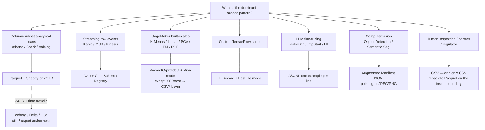
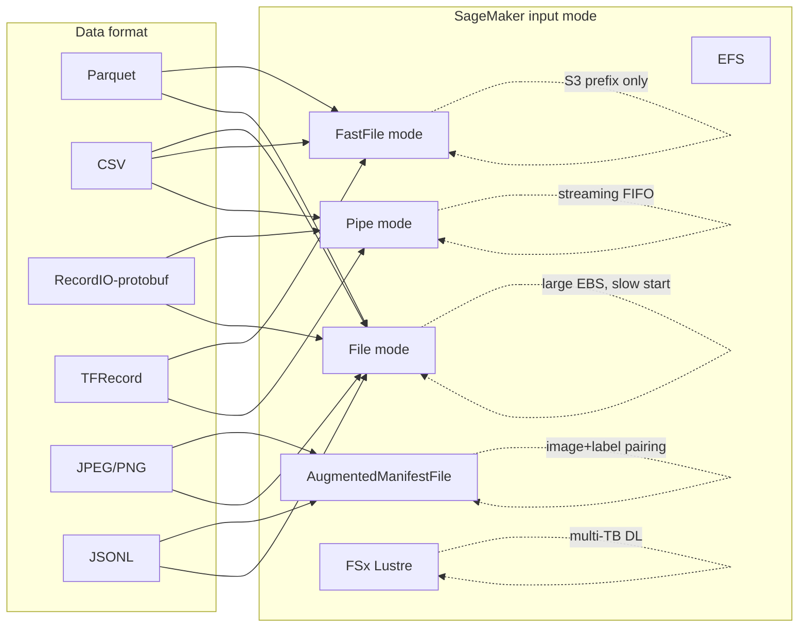

# Chapter 10 — Data Formats for ML: Parquet, ORC, Avro, RecordIO, TFRecord, JSON, CSV

> **Goal of this chapter:** to give you the structural mental model — and the verbatim AWS tables — you need to walk into any MLA-C01 question that names a file format and pick the right answer before reading the distractors. By the end of the chapter you should be able to explain *why* SageMaker's K-Means container wants RecordIO-protobuf and not Parquet, *why* a Glue job that converts 1 TB of CSV to Parquet pays for itself in three days of Athena queries, *why* "Iceberg vs Parquet" is a category error, and *why* a missing header row in a CSV file silently corrupts a SageMaker Linear Learner training job without throwing an exception. Every later chapter in Part C — storage in Ch 11, Glue and Data Wrangler in Ch 12, Athena's CTAS pattern in Ch 13 — assumes the format vocabulary in this chapter is already in your head.
>
> **First-principles claim of the chapter.** A data format is a *serialization contract between writer and reader*. The right format minimizes I/O bytes, parse CPU, and schema-drift risk *for the dominant access pattern*. Pick by access pattern first, ecosystem second, brand third. SageMaker's built-in algorithms are not picky for fun — RecordIO-protobuf is the only format whose record layout matches their C++ inner loops without a parser between the wire and the SIMD registers. Athena and Spark are not Parquet-biased for fun — columnar layout plus per-row-group statistics is what lets a 1-TB scan touch 50 GB of bytes and finish in 12 seconds.
>
> **MLA-C01 mapping.** Task 1.1 — *Knowledge of data formats and ingestion mechanisms (e.g., validated and non-validated formats, Apache Parquet, JSON, CSV, Apache ORC, Apache Avro, RecordIO)* and *Skills in choosing appropriate data formats (Parquet, JSON, CSV, ORC) based on data access patterns.* Touches Task 1.2 (Data Wrangler / Feature Store ingestion) and Task 2.2 (SageMaker built-in training contracts).
>
> **Back-links.** Chapter 3 (`03_aws_iam_for_ml.md`) set up the IAM and KMS scaffolding that lets you read any of the buckets in this chapter; Part B's storage and S3 chapters explain where these files live. **Forward-links.** Chapter 11 (storage classes and lifecycle) covers the cost knobs around the files in this chapter; Chapter 13 (Athena CTAS) shows the canonical CSV-to-Parquet conversion pipeline in detail; Chapter 23 (SageMaker built-in algorithms) cross-references the algo→format table in §5 of this chapter for every individual algorithm.

---

## 10.1 The wrong format costs you months

Picture a fraud-detection team three quarters into a SageMaker engagement at a regulated bank. The Lakehouse team has been faithfully landing every fraud event in S3 as gzipped CSV — one file per hour, partitioned by date, ~3 GB per file uncompressed. Total corpus: 400 TB. The data scientist points an XGBoost training job at it, hits the metric, and ships. The MLE — you — inherits the pipeline and is asked to add a second model (a K-Means clustering layer for merchant risk profiling) plus daily retraining for both, plus a Model Monitor data-quality job, plus a weekly Athena dashboard for the risk-management team. The first sprint of work makes four discoveries in sequence:

1. **K-Means cannot eat gzipped CSV efficiently.** It can read CSV, but the recommended path — RecordIO-protobuf + Pipe mode — requires a one-time conversion. The conversion job on the current corpus would take ~80 hours of SageMaker Processing time, ~$2,400 in Spark workers.
2. **Athena on the same data costs $2,000/TB/query.** Gzipped CSV is not splittable. Each query single-threads through one file at a time. The risk team's "show me last 90 days of high-risk merchants" query scans 30 TB at $5/TB ≈ $150 per question, taking 47 minutes. They are about to ask seven of these questions a week.
3. **Model Monitor's data-quality baseline rejects the CSV.** Why? Because the CSV has no enforced schema. A producer changed the `merchant_country` field from a 2-letter code to a 3-letter code six months ago. Half the corpus has one schema, half has the other. Monitor's baselining job reports 50% drift on a feature that didn't actually drift.
4. **A vendor-supplied data feed (also CSV) silently corrupted the training set for two weeks.** A stray quote character in one row turned 14 days of records into one malformed mega-row. XGBoost happily ignored the parser warnings and kept training on the surviving 30%. AUC dropped 6 points. Nobody noticed until the business asked why fraud catch-rate fell.

The fix is not "tune the model." The fix is a one-time *format migration* — re-stage the entire corpus as Parquet + ZSTD partitioned by date, pre-compute RecordIO-protobuf shards for K-Means, and put Avro + Glue Schema Registry between the producers and the lake. The migration costs roughly four weeks of MLE time. The annual return — Athena bills down 12×, Monitor false-positives eliminated, K-Means training down 35%, vendor-feed corruption prevented at ingest — is in the high six figures. None of it required a single line of new ML code.

That is the asymmetry this chapter is about. **The format decision is made once and paid for daily, in either savings or pain, for as long as the data exists.** The exam tests this asymmetry in scenario-shaped questions. Your job is to recognize the failure mode behind the scenario and pick the format that fixes it.

---

## 10.2 Format taxonomy — five families, one decision tree

Every ML-relevant data format on AWS falls into one of five families. Memorize the *family*, not just the format name. Family predicts behavior; format names are surface noise.

| Family | Examples | Layout | Compression sweet spot | Read pattern that wins | Read pattern that loses |
| --- | --- | --- | --- | --- | --- |
| **Text, row-oriented** | CSV, TSV, JSON, JSONL, libsvm | One record per line (mostly) | gzip / bzip2 (50–70%) | Human inspection, tiny datasets, append-only logs | Anything analytical at scale |
| **Columnar, binary** | **Parquet**, **ORC** | Row groups → column chunks → pages | Snappy / ZSTD (3–10×) | Column-subset reads, predicate pushdown, analytical scans | Row-by-row OLTP, frequent updates |
| **Row-oriented, binary, schema-on-write** | **Avro** | Schema header + binary rows | Snappy / Deflate (2–4×) | Streaming, schema evolution, full-row reads | Column-subset analytics |
| **ML-native, framework-specific** | **RecordIO-protobuf** (SageMaker), **TFRecord** (TF), WebDataset (PyTorch) | Length-prefixed binary records | Often none (already dense) | Pipe-mode streaming into a training loop | Ad-hoc SQL, BI dashboards |
| **Image / blob + manifest** | JPEG/PNG/MP4 + manifest.json | Binary blob per object, separate index | None or codec-native | Computer vision / multi-modal | Anything tabular |

**Decision rule of thumb.** If a Spark/Athena/Trino engine will read it, default Parquet. If a SageMaker built-in algorithm will train on it, default RecordIO-protobuf. If a Kafka topic will carry it, default Avro. If a TensorFlow custom script will read it, default TFRecord. Use CSV only for humans, regulators, or "I am still prototyping."



### 10.2.1 Validated vs non-validated formats — the exam-guide term

The MLA-C01 exam guide explicitly calls out *"validated and non-validated formats."* The distinction is **whether the format embeds a schema that the reader can enforce.**

- **Validated:** Parquet, ORC, Avro, TFRecord (`Example` proto), RecordIO-protobuf. The reader rejects malformed records, type-mismatched columns, or unknown fields (subject to compatibility mode for Avro).
- **Non-validated:** CSV, JSON, JSONL, libsvm. There is no enforced schema; a stray `"hello"` in a numeric column propagates silently into training and corrupts the model. You must layer Glue Data Quality, DataBrew profile jobs, or SageMaker Data Wrangler validation steps on top.

Exam pattern: a question about *"how do I stop a downstream training job from silently consuming corrupted ingest"* points at either (a) switch to a validated format, (b) add Glue DQ rules, or (c) both. The right answer is almost always (c) for a regulated shop, because validation belongs at the *ingest boundary* even when the storage format would catch it later.

---

## 10.3 Apache Parquet — deep dive

Parquet is the right answer to roughly 80% of MLA-C01 data-format questions. It is the storage format of:

- SageMaker **Feature Store offline store** (Iceberg-on-Parquet since 2023).
- **Athena**, **Redshift Spectrum**, **EMR**, **Glue** default optimized format.
- **Kinesis Data Firehose** `JSON → Parquet` conversion target.
- **SageMaker Data Wrangler** export-to-S3 target.
- **AWS Open Data** datasets (FINRA, NOAA, MIMIC-IV, Common Crawl indices).

If you remember nothing else about Parquet, remember this: it is *columnar with embedded statistics*, which means readers can skip most of the file at the byte level — no decompression, no parse — for both column-pruning and predicate-pushdown reasons.

### 10.3.1 Physical layout

```
+--------------------------------------------------+
| 4-byte magic number "PAR1"                       |
+--------------------------------------------------+
| Row group 0                                      |
|   Column chunk: feature_a                        |
|     Page 0  [dictionary]                         |
|     Page 1  [data, RLE+bit-pack]                 |
|     Page 2  [data, RLE+bit-pack]                 |
|   Column chunk: feature_b                        |
|     Page 0  [data, plain]                        |
|   ... (one chunk per column)                     |
+--------------------------------------------------+
| Row group 1                                      |
|   ... same structure ...                         |
+--------------------------------------------------+
| File metadata (Thrift-serialized)                |
|   - Schema                                       |
|   - Row-group locations and column statistics    |
|     (min, max, null count) per column chunk      |
|   - Optional column index, offset index,         |
|     Bloom filter offset                          |
+--------------------------------------------------+
| 4-byte metadata length                           |
| 4-byte magic number "PAR1"                       |
+--------------------------------------------------+
```

The metadata is **at the end of the file**. The Parquet spec puts it there for a specific reason: *"File metadata is written after the data to allow for single-pass writing."* The reader does one `GET Range` of the footer first, learns where every column chunk for every row group lives, then issues parallel range reads only for the columns and row groups it actually needs. Everything else is skipped at the *byte level* — no decompression, no parse.

### 10.3.2 The four reasons Parquet wins for ML

1. **Columnar pruning.** A training job that needs 10 features out of 200 reads ~10/200 ≈ 5% of the bytes. With CSV the same job reads 100% and discards 95% in the parser. The pruning happens at the *S3 byte range* level — the reader literally issues smaller `GET` requests rather than reading and discarding bytes. Both the egress bill and the parse CPU drop in lockstep.
2. **Predicate pushdown via min/max statistics.** Each column chunk's footer carries `min`, `max`, `null_count`. A filter `WHERE event_date BETWEEN '2026-04-01' AND '2026-04-30'` checks every row group's `event_date` stats; row groups whose `[min, max]` does not overlap the predicate are skipped without reading a byte of data. Real-world: Athena cost drops 5–20× vs CSV on the same query. The benefit compounds when the data is *sorted* on the predicate column — a sort-then-write step at ingest produces tight `[min, max]` bounds per row group and turns most filter queries into single-row-group scans.
3. **Page-level dictionary encoding.** A categorical column with low cardinality (say, country codes — ~200 distinct values) is encoded as a dictionary page (the unique values) plus data pages of small integer indices. ~50× compression on that column alone. Parquet writers auto-fall-back to plain encoding if the dictionary grows past the page limit (default 1 MB). The encoding is invisible to the reader — `SELECT country` returns strings either way; the dictionary is an implementation detail of the file.
4. **Splittable.** Each row group is independently decodable. Spark, Glue, Athena, EMR all parallelize by row group. A 100 GB Parquet file with 1 GB row groups → 100 parallel readers. CSV is *technically* splittable on newlines, but quoted-newline-in-field hazards make Spark default to non-splittable for CSV, kneecapping parallelism.

A fifth, often-overlooked reason matters for ML specifically: **Parquet preserves types.** A `DECIMAL(18, 4)` column stays `DECIMAL(18, 4)` across writers and readers; a `TIMESTAMP` stays a 64-bit nanosecond integer with a UTC offset; a `LIST<STRUCT<...>>` survives a round-trip. With CSV, every reader has to guess types from the bytes, and disagreements between writers and readers (or between two readers of the same file) are a category of bug that simply does not exist with Parquet.

### 10.3.3 Parquet compression: Snappy vs ZSTD vs GZIP vs LZ4

| Codec | Compression ratio | CPU cost (compress) | CPU cost (decompress) | When to use |
| --- | --- | --- | --- | --- |
| **Snappy** (legacy default) | ~3× | Low | Very low | Hot training datasets where I/O/CPU balance matters and writes happen often |
| **ZSTD level 3** (modern default) | ~5× | Medium | Low–Medium | Almost everything else; Iceberg switched its default to ZSTD in 1.4.0 |
| **GZIP** | ~4× | High | Medium | Legacy compatibility (Hive); ZSTD strictly dominates |
| **LZ4** | ~2.5× | Very low | Very low | Latency-critical streaming where every microsecond matters |
| **Brotli** | ~5–6× | Very high | Medium | Rare; mostly web payloads, not ML |
| **None** | 1× | None | None | Already-compressed columns (JPEG bytes in a `Binary` field) |

**Practical guidance.** ZSTD level 3 is the right default for any new Parquet write in 2026 — 15–30% smaller files than Snappy, sub-1% read penalty, ~2–3× slower writes. The classic Snappy default still applies when write throughput dominates the SLA (e.g., Firehose at the edge, or a Spark Structured Streaming job with tight micro-batch budgets). GZIP exists only for legacy Hive compatibility.

The AWS-glue specific gotcha: as of writing, **Glue's Parquet writer default is still Snappy**. If you want ZSTD you must set `parquet.compression=ZSTD` (or the equivalent in DynamicFrame options) explicitly. Iceberg tables created through Glue, however, inherit Iceberg 1.4+ defaults and write ZSTD automatically.

### 10.3.4 Row-group sizing — an under-appreciated tuning knob

Default row-group size is 128 MB (Glue/Spark/Athena). Too small → footer dominates, too many parallel tasks → S3 throttling. Too large → reduces parallelism, predicate-pushdown granularity coarsens.

- For SageMaker training reads off S3: **128 MB – 512 MB** row groups.
- For Athena interactive queries: **128 MB** (Athena assumes this).
- For Spark with `spark.sql.files.maxPartitionBytes = 134217728`: align row group to it.

### 10.3.5 The Parquet cost story: Glue CSV → Parquet on 1 TB/day

A widely cited 2026 LSEG case study reported: per-query compute dropped from **$5.75 to $0.01** (~99.7% reduction), query runtime from **236 s to 6.78 s** (~34× faster), and **1 TB CSV compressed to ~130 GB** as Delta Parquet (87% size reduction). The 5–10× size ratio is what to use in capacity planning — uncompressed CSV → Parquet+ZSTD frequently lands at 10–15×.

A worked Glue job for the same shape (1 TB/day CSV → Parquet+ZSTD partitioned by date, 20 G.1X workers, ~45 min run time) costs roughly **$6.60/day** of Glue compute (Glue: $0.44 per DPU-hour; G.1X = 1 DPU; 20 × 0.75 h × $0.44 = $6.60). That's ~$200/mo to convert; downstream Athena savings on the resulting Parquet exceed $200/mo after about three medium-frequency dashboard queries. The conversion pays for itself in days, not months. The two cost surprises worth flagging:

- **S3 PUT fan-out.** A partitioned write produces one file per partition × task. 50,000 small files at $0.005 per 1,000 PUTs = $0.25/day in PUTs alone — *plus* downstream Athena pays a per-file overhead. Use a `coalesce()` or repartition step to keep file count in the hundreds, not tens of thousands.
- **Cross-region reads.** If Glue and S3 are in different regions, you pay $0.02/GB for inter-region transfer. Moving 1 TB once = $20. Daily = $600/mo. Keep Glue, S3, and the downstream training/query in the same region or you will discover this line item in the worst possible way.

For pure CSV → Parquet shape conversion, **Athena CTAS** is usually cheaper than a Glue job because Athena charges only for bytes scanned ($5/TB) and the Parquet write itself is not metered separately. Chapter 13 walks through the full CTAS one-liner.

---

## 10.4 Apache ORC — Parquet's older cousin

ORC (Optimized Row Columnar) is structurally similar to Parquet: columnar, row-grouped (here called "stripes"), with embedded statistics and dictionary encoding. Born in the Hive 0.12 era (2013), it has stronger native ties to Hive's ACID model than Parquet does. Athena reads ORC natively, and Firehose can convert JSON → ORC just like JSON → Parquet.

| Dimension | Parquet | ORC |
| --- | --- | --- |
| Ecosystem reach | Spark, Athena, Trino/Presto, Snowflake, BigQuery, Delta, Iceberg, Hudi, pandas, DuckDB, Polars — every modern engine | Hive, Spark, Athena; weaker outside the Hadoop world |
| Compression | Snappy historical default; ZSTD modern default | Zlib default (slower); Snappy and ZSTD supported |
| Schema evolution | Add/drop columns; type-widen | Add/drop columns; ACID via Hive transactions |
| Predicate pushdown | Column stats + page index + Bloom filter (optional) | Stripe + row-index stats + Bloom filter |
| ACID transactions | Via Iceberg/Delta/Hudi table format on top | Built into Hive's ORC ACID format |
| Default in AWS-native tooling | **Yes** (Glue, Firehose, Feature Store, Athena CTAS) | Secondary; used when ingesting pre-existing Hive lakes |

**Exam heuristic.** *"We have an existing Hive ACID warehouse on-prem we're migrating to Athena/EMR"* → ORC may be the natural answer. *"We're greenfield on AWS"* → Parquet. The MLA-C01 question stems almost never push you toward ORC over Parquet on a greenfield problem. ORC is essentially in the exam to test that you can *recognize* it as a valid columnar format, not that you would pick it over Parquet for a new build.

One concrete situation where ORC still earns its keep: a team has a 5-year-old Hive 2.x warehouse on a Cloudera distribution being lifted into AWS via DMS or `aws s3 sync`. Re-writing every table to Parquet during the migration is possible but adds weeks of risk. Leaving the corpus in ORC and querying it from Athena (which reads ORC natively) lets the team get value from the data on day one, then convert table-by-table to Parquet as part of normal evolution. The exam may surface this scenario as *"customer is migrating Hive workloads to AWS; which storage format minimizes migration effort?"* — and ORC is the right answer to that specific framing.

---

## 10.5 Apache Avro — the streaming and schema-evolution format

Avro is **row-oriented, binary, schema-on-write**. The schema is a JSON document; rows are tightly packed binary values whose meaning is given entirely by the schema. There is no per-record schema overhead — the schema is shipped once (header of the container file, or stored in a schema registry).

### 10.5.1 Why Avro for streaming

- **Compact wire format.** No field names per row (Parquet has them in the footer, JSON has them in every row). Avro rows are *just the values* in schema order.
- **Schema evolution rules baked into the spec.** Add a field with a default → backward-compatible. Remove a field with a default → forward-compatible. Type-widen (`int → long`) → both. The reader uses the **writer schema** to deserialize, then projects into the **reader schema**.
- **Kafka-native.** The Confluent / AWS **Glue Schema Registry** convention prepends a 5-byte header (magic byte `0x00` + 4-byte schema ID) to each Avro record on a Kafka topic. Consumers fetch schemas by ID, cache them, and deserialize. This is exactly how MSK + Glue Schema Registry interoperate.

### 10.5.2 Compatibility modes (Glue Schema Registry)

| Mode | What the new schema can do | Use when |
| --- | --- | --- |
| **BACKWARD** (default) | New schema can read data written by previous schema | Consumer upgraded before producer (most common) |
| **BACKWARD_TRANSITIVE** | New schema can read data written by *all* previous schemas | Regulated shops, audit-traceable evolution |
| **FORWARD** | Previous schema can read data written by new schema | Producer upgraded before consumer |
| **FULL** | Both directions | Independent upgrades on either side |
| **NONE** | Anything goes | Wild west; not recommended in regulated ML |

The war story every Avro team eventually tells: a producer adds a non-nullable `customer_tier` field. The Registry accepts it because the *new* schema has no default but the *old* schema had no field — no conflict. Old consumers keep working. *New* consumers crash on every old record because there's no default to project. The fix is to require defaults for *all* new fields, ideally enforced via `BACKWARD_TRANSITIVE`. This is the single most-tested concept on the Confluent certification and the same concept the MLA-C01 gestures at in any "schema evolution broke production" question.

### 10.5.3 Avro vs Parquet for ML

| Pick Avro if… | Pick Parquet if… |
| --- | --- |
| You're writing one record at a time over Kafka/MSK | You're scanning analytical batches |
| Schema will evolve rapidly with strict compatibility | Schema is stable |
| You read whole rows every time | You read column subsets |
| Write throughput dominates | Read throughput dominates |
| Source-of-truth event log | Derived analytical / training mart |

**The common production pattern is to use both.** Avro for *transport* (Kafka/MSK → Flink → S3) and Parquet for *rest* (Iceberg / Feature Store offline / training mart). Firehose's "JSON → Parquet" conversion option is conceptually the inverse: take streaming records and re-stage them in Parquet for downstream Spark/Athena. The bridge between the two layers is usually a Flink job or a Spark Structured Streaming micro-batch that consumes Avro from MSK, writes Parquet to S3, and commits the new files to an Iceberg table — giving the downstream lake exactly-once semantics without the producers needing to know anything about Iceberg.

A second pattern worth knowing: Avro for *metadata*, Parquet for *data*. This is how Iceberg works internally — the data files are Parquet, but the manifest list (which files belong to the current snapshot) is a small Avro file. Iceberg picked Avro for manifests because manifest reads are whole-row (you need every column of every manifest entry) and the schema evolves as Iceberg itself evolves (new fields for partition-spec evolution, new optimization hints). It is exactly the access pattern Avro was designed for.

---

## 10.6 RecordIO-protobuf — the SageMaker built-in special

This is the format that consistently surprises exam-takers. AWS picked it because every built-in algorithm written in optimized C++ wants to read **dense float vectors with no parser between the wire and the SIMD registers**. RecordIO-protobuf gives them that. Parquet would not.

### 10.6.1 What RecordIO-protobuf actually is

Two nested formats:

- **RecordIO framing** — a binary container where each record is `[4-byte length][record bytes][padding to 4-byte boundary]`. The framing lets a streaming reader find record boundaries without parsing record contents.
- **Inside each record, a `Record` protobuf** — defined exactly by SageMaker (verbatim from AWS docs):

```protobuf
message Record {
    map<string, Value> features = 1;
    map<string, Value> label    = 2;
    optional string uid           = 3;
    optional string metadata      = 4;
    optional string configuration = 5;
}
message Value {
    oneof value {
        Float32Tensor float32_tensor = 2;
        Float64Tensor float64_tensor = 3;
        Int32Tensor   int32_tensor   = 7;
        Bytes         bytes          = 9;
    }
}
```

A `Float32Tensor` carries packed `float values[]`, optional `uint64 keys[]` (for sparse), and optional `uint64 shape[]`. For a typical tabular row going into Linear Learner, the convention is a single feature named `"values"` whose value is a dense `Float32Tensor` plus a label with the same convention.

### 10.6.2 The verbatim algorithm → content-type table

This is the table to memorize. It is the SageMaker docs' authoritative content-type list for built-in algorithms, reproduced exactly.

| ContentType | Algorithms |
| --- | --- |
| `application/x-recordio-protobuf` | **Factorization Machines, K-Means, k-NN, Latent Dirichlet Allocation (LDA), Linear Learner, NTM, PCA, RCF, Sequence-to-Sequence** |
| `text/csv` | IP Insights, K-Means, k-NN, LDA, Linear Learner, NTM, PCA, RCF, **XGBoost** |
| `text/libsvm` | XGBoost |
| `application/jsonlines` | BlazingText, DeepAR |
| `application/x-image`, `image/jpeg`, `image/png` | Object Detection, Semantic Segmentation |
| `application/x-recordio` (image-record format, *not* protobuf) | Object Detection |

Three things to memorize beyond the rows themselves:

1. **The "K-Means / Linear Learner / PCA / k-NN / RCF / LDA / NTM / Factorization Machines / Seq2Seq" cluster** all accept *both* `text/csv` and `application/x-recordio-protobuf` — but RecordIO-protobuf is the *recommended high-performance* path, especially with Pipe mode.
2. **XGBoost is the exception** — it does *not* take RecordIO-protobuf. It takes `text/csv` or `text/libsvm` (and Parquet via Pipe in newer container versions for File/FastFile mode).
3. **BlazingText and DeepAR want `application/jsonlines`** — not CSV, not RecordIO. DeepAR's JSONL has one line per time series; BlazingText has one line per sentence with `__label__` markers for supervised mode.

> ⚠️ **Exam alert — RecordIO-only built-ins.** Factorization Machines is the only built-in that *exclusively* trains on RecordIO-protobuf in practice (the docs list CSV as well, but performance is poor enough that AWS recommends RecordIO-protobuf as the only realistic choice). If a question says "Factorization Machines on a 500 GB sparse rating matrix," the answer involves RecordIO-protobuf (specifically the sparse variant — `write_spmatrix_to_sparse_tensor`) and Pipe mode. If a question says "XGBoost on the same data," the answer is CSV or libsvm — XGBoost cannot consume RecordIO-protobuf at all.

### 10.6.3 Converting numpy → RecordIO-protobuf

The official one-liners from the `sagemaker.amazon.common` package:

```python
import io
import numpy as np
import sagemaker.amazon.common as smac

# Dense: each row is a feature vector, optional label
buf = io.BytesIO()
smac.write_numpy_to_dense_tensor(buf, X_train.astype("float32"),
                                       y_train.astype("float32"))
buf.seek(0)
# Now upload buf to S3 as application/x-recordio-protobuf

# Sparse: e.g., recommendation matrices, text count vectors
import scipy.sparse as sp
buf2 = io.BytesIO()
smac.write_spmatrix_to_sparse_tensor(buf2, sp_X, labels=y)
buf2.seek(0)
```

`write_numpy_to_dense_tensor` is the function name to recognize on the exam. There is also `read_recordio` for the inverse.

### 10.6.4 CSV format quirks for SageMaker built-ins

The SageMaker docs are explicit on two points that often appear in question stems:

- *"SageMaker requires that a CSV file does not have a header record and that the target variable is in the first column."*
- For unsupervised algorithms (K-Means, PCA, RCF) where there is no label, specify `content_type='text/csv;label_size=0'`.

A SageMaker-friendly CSV for Linear Learner looks like:

```
1,0.5,0.3,0.7,0.1
0,0.2,0.9,0.4,0.8
...
```

No `label,x1,x2,x3,x4` header. Label first. UTF-8, no BOM.

> ⚠️ **Exam alert — CSV no-header trap.** If a question shows a CSV with a header row being fed to a SageMaker built-in algorithm, the *first training row* is the header strings, which the algorithm parses as numeric data and either crashes on (best case) or silently treats as a real example (worst case — your first "data point" becomes the string `label,x1,x2,x3,x4`). The fix is to strip the header before upload, or convert to RecordIO-protobuf which sidesteps the issue entirely. The same trap exists for pandas defaults — `pd.to_csv()` writes a header unless you pass `header=False`.

---

## 10.7 TFRecord — TensorFlow's binary record format

TFRecord is a simple length-prefixed binary container similar to RecordIO. Each record carries an `Example` protobuf (or `SequenceExample` for variable-length features). Each `Example` is a map from feature name to one of `BytesList`, `Int64List`, or `FloatList`.

### 10.7.1 Why TFRecord on AWS

- `tf.data.TFRecordDataset` is the canonical TF input pipeline; it can shuffle, batch, prefetch, and parallel-read shards out of S3.
- **Sharding by file** is the trick: write `train-00000-of-01024.tfrecord` … `train-01023-of-01024.tfrecord`, point `tf.data.Dataset.list_files()` at the glob, and TF's data pipeline parallelizes natively.
- **FastFile mode + TFRecord** is the AWS-blessed pattern for custom-script TensorFlow training: no Pipe-mode plumbing needed, S3 objects appear as POSIX files, TF reads them with normal `TFRecordDataset(filenames)`.
- **GZIP compression** is the convention (`compression_type="GZIP"`). Snappy is *not* a native TF option.

### 10.7.2 TFRecord vs RecordIO-protobuf

| | TFRecord | RecordIO-protobuf |
| --- | --- | --- |
| Framing | 8-byte length + 4-byte length CRC + payload + 4-byte payload CRC | 4-byte length + payload + pad |
| Record schema | `tf.train.Example` (BytesList / Int64List / FloatList) | SageMaker `Record` (Float32/64Tensor, Int32Tensor, Bytes) |
| Sparse support | Indirect (encode indices/values as separate features) | Native via `keys[]` in tensor |
| Native ecosystem | TensorFlow, JAX (via `tfds`) | SageMaker built-in algos only |
| When to use on AWS | Custom TF script with FastFile / File / Pipe mode | SageMaker built-in algos with Pipe mode |

In 2026, TFRecord's relevance is narrower than it was. PyTorch's growth, plus Petastorm/Ray Data letting PyTorch read Parquet directly, has made Parquet-as-training-input increasingly common for vision and recsys teams. TFRecord remains the right answer when (a) you're inside the TensorFlow ecosystem, (b) you have an existing TFRecord corpus, or (c) you're using a SageMaker-vended TF framework container that expects it. For greenfield PyTorch work on AWS, Parquet + FastFile mode (or WebDataset for image streaming) is now the more idiomatic choice.

The LinkedIn engineering team open-sourced `spark-tfrecord` for exactly the bridge case — they had petabyte-scale Parquet feature stores but TensorFlow training jobs still wanted TFRecord. The library lets Spark write Parquet *and* TFRecord from the same DataFrame, so the analytics team and the ML team consume the same data through their respective preferred formats. Uber's Petastorm goes the other direction: it lets PyTorch and TensorFlow read Parquet *directly* without an intermediate TFRecord step, eliminating the bridge entirely. The trajectory across the industry is clear — Parquet is winning the role of "single training-input format" — but TFRecord will remain a real format on real production systems for years, and the exam will test that you can recognize it and pair it with the right input mode.

---

## 10.8 JSON and JSONL — the "obviously human-readable" workhorse

### 10.8.1 JSON vs JSONL

- **JSON**: a single file is one JSON value (typically an array of objects or a top-level object). Not splittable. Bad at scale.
- **JSONL** (JSON Lines, `.jsonl` or `.ndjson`): one JSON object **per line**. Splittable on `\n`. The format of choice for log data, event records, and almost every "ship a structured record stream" pattern that isn't binary.

### 10.8.2 Where JSONL shows up in AWS ML

| Use case | Spec |
| --- | --- |
| **SageMaker Ground Truth output manifest** | One JSONL line per labeled object — `{source-ref, label, label-metadata}` |
| **SageMaker Augmented Manifest** (training input) | Same JSONL manifest pointing to S3 images + labels, consumed by `AugmentedManifestFile` |
| **Bedrock fine-tuning** (Claude, Llama, Titan, Nova) | JSONL of `{prompt, completion}` or `{messages: [...]}` per line |
| **SageMaker JumpStart fine-tuning** | JSONL one record per line; all files under a single S3 prefix |
| **Hugging Face fine-tuning** | JSONL of `{instruction, input, output}` or `{text}` per line |
| **BlazingText supervised** | One labeled sentence per line, `__label__pos The movie was great` |
| **DeepAR** | One JSONL line per time series: `{start, target, cat, dynamic_feat}` |
| **CloudWatch Logs export** | JSON-Lines for ad-hoc Athena analysis |

### 10.8.3 The Bedrock / JumpStart fine-tuning gotchas

The JSONL contract is unusually strict for LLM fine-tuning paths, and the AWS knowledge-center article *"Resolve errors when I fine-tune models on Amazon Bedrock"* exists because these errors are common:

1. **Each line is a self-contained JSON object.** No outer array, no commas between examples, no trailing newline-of-newlines. Online JSON validators are misleading — they accept arrays; Bedrock won't.
2. **UTF-8, no BOM, no smart-quotes.** Mac TextEdit and Excel CSV exports regularly inject `’` and other gremlins that pass `json.loads` but trip Bedrock's stricter validators.
3. **Token limits per record** — Bedrock and JumpStart enforce per-model maxima (e.g., ~2,048 / 4,096 / 8,192 tokens depending on model + variant). Examples over the limit are silently dropped *or* abort the job depending on the API path.
4. **Field schema is model-family-specific.** Claude wants `{"messages": [{"role": "user", "content": ...}, {"role": "assistant", "content": ...}]}` on the modern API; Llama wants a different envelope; Nova multimodal wants a structured `content` array with image S3 URIs. **Always read the model card's example, do not assume.**
5. **Multimodal records** require S3 URIs for images *in the same region* as the fine-tuning job; cross-region URIs error out late.
6. **No duplicate keys.** Some JSON tooling silently de-duplicates; Bedrock rejects.
7. **Train/validation split is a directory convention** — separate prefixes, no commingling.

### 10.8.4 Cost / performance trade-offs

JSONL is the format chosen when **human inspectability matters more than compute efficiency**. Compression helps (gzip → 5–10× smaller), but parsing remains expensive (`json.loads` per line is one of the slowest operations a Python data pipeline can do). For high-volume training data, JSONL is usually transitional — staged in JSONL, repacked into Parquet or RecordIO-protobuf before training. The exception is exactly the fine-tuning use cases above, where the API contract demands JSONL all the way down.

---

## 10.9 CSV — universal, slow, full of traps

CSV is the lowest-common-denominator format. Every tool can read it; almost no tool can read it *fast*. Use CSV when:

- The dataset is small (<1 GB) and human inspection matters.
- You are debugging a pipeline locally.
- Your tooling literally only supports CSV (XGBoost on SageMaker, vendor SFTP exports, regulator hand-offs).

### 10.9.1 The traps

1. **UTF-8 BOM.** Excel writes CSVs with a leading `0xEF 0xBB 0xBF` byte sequence (the Byte Order Mark). Many parsers leave this in the first column header, producing a phantom column `customer_id` that breaks joins. Always strip the BOM (`open(path, encoding='utf-8-sig')`).
2. **Header vs no-header.** SageMaker built-in algorithms require **no header**. pandas defaults to header in row 0. Athena `CREATE TABLE` requires `'skip.header.line.count'='1'` if there is one. Mismatch → first training row is the header strings → silent corruption.
3. **Label-column position.** SageMaker built-ins want the label in **column 0**. XGBoost is hard-wired to this. Other frameworks are agnostic. If you forget, training silently treats your label as a feature and your first feature as the label.
4. **Quoting and embedded commas/newlines.** RFC 4180 says fields with commas, quotes, or newlines must be quoted with `"`, and embedded `"` doubled (`""`). Many producers violate this. Result: Spark, Athena, and pandas all interpret the same file differently. Validate with `csvkit` or `xsv` before shipping.
5. **Type coercion ambiguity.** Is `01234` a string ZIP code or the integer 1234? Is `2026-05-26` a string or a date? Every reader guesses. Parquet stores the type explicitly; CSV cannot.
6. **Splittability.** Quoted-newline-in-field makes CSV technically non-splittable on `\n`. Spark's default behavior is to mark CSV as non-splittable, which means a 50 GB CSV becomes a single-threaded read. **gzipped CSV** is even worse — gzip is a single deflate stream, so a gzipped CSV is unconditionally non-splittable. This single fact is the strongest argument against CSV at scale.

### 10.9.2 When CSV is genuinely the right answer

- **XGBoost on SageMaker.** XGBoost takes CSV (or libsvm); it does not take RecordIO-protobuf. For tabular data with a tree-based learner, CSV is acceptable — but Parquet → FastFile mode is faster on the same data when the container version supports it.
- **Athena CTAS source format from a vendor SFTP feed.** Land as CSV in the raw zone, immediately re-stage as Parquet in the curated zone. Never train directly on the raw CSV.
- **Regulator / partner hand-off at the edge.** Finance, healthcare, government partners want a row per line, comma-separated, no nested types, "openable in Excel." The realistic 2026 architecture is *CSV at the edges, Parquet/Iceberg in the middle.*

### 10.9.3 The CSV-to-Parquet boundary pattern

A well-designed lake has *exactly one place* where CSV is allowed: the raw-ingest zone, where a Lambda or Firehose lands the vendor's bytes unmodified for compliance and audit reasons. The very next step in the pipeline is a Glue job (or, more often, an Athena CTAS) that re-stages those CSV files as Parquet in the curated zone and registers them in the Glue Data Catalog. From that point on, every consumer — Athena dashboards, SageMaker training, Bedrock RAG embeddings, downstream ML pipelines — reads Parquet, never CSV. The cost differential is so large (5–20× on Athena, ~3× on Spark) that the conversion almost always pays for itself within days, and the type-safety win means downstream bugs from CSV ambiguity simply do not happen.

If you find yourself building a pipeline where CSV is being read by more than one downstream consumer, that is the structural smell that says you missed the boundary conversion. Add the CTAS step. Chapter 13 walks through the syntax.

---

## 10.10 Iceberg, Hudi, Delta — *table formats*, NOT data formats

This is the most common conceptual trap on the exam.

A **data format** (Parquet, ORC, Avro) defines the bytes of a single file. A **table format** defines how a collection of data files plus a manifest plus a transaction log together behave like a single ACID, schema-evolving, time-travelable table.

| Layer | Examples | What it does |
| --- | --- | --- |
| **Data file format** | Parquet, ORC, Avro | Encode rows/columns inside one file |
| **Table format** | **Apache Iceberg, Apache Hudi, Delta Lake** | Track which files belong to which table snapshot; manage commits, schema evolution, partition evolution, time travel, deletes |

All three table formats **store the underlying data in Parquet** (Iceberg and Delta default to Parquet; Hudi supports Parquet and ORC). Their table state — manifests, snapshot logs, schema history — is stored in **Avro** (Iceberg manifests), **JSON** (Delta `_delta_log/`), or **Parquet+Avro** (Hudi metadata table). So the answer to *"What format is an Iceberg table?"* is *"Parquet for data, Avro for manifests, plus an Iceberg `metadata.json` that points to the latest snapshot."*

> ⚠️ **Exam alert — table format vs data format.** The most common conceptual trap on the exam: questions that ask "what file format does Iceberg use?" The trap answer is "Iceberg." The correct answer is "Parquet (for data files) plus Avro (for manifests)." Iceberg is a *table format*, not a *data format*. If a question asks "what table format provides ACID transactions for an S3 data lake?" — the answer is Iceberg / Hudi / Delta. If a question asks "what file format does Athena read fastest?" — the answer is Parquet. Different layers, different questions.

### 10.10.1 Why this matters for MLA-C01

- The exam may ask *"customer needs ACID inserts to a training table queried by both Athena and Spark"*. Answer: **Iceberg on S3** (or **Amazon S3 Tables**, the managed Iceberg bucket variant).
- The exam may ask *"customer is using Delta Lake on Databricks; how do they query from Athena?"*. Answer: **Athena engine v3 has read-only Delta support**; writes still go through Spark/Databricks.
- It will *not* ask "what compression does Iceberg use" — that's a Parquet question, not an Iceberg question.

### 10.10.2 AWS's bias is Iceberg-first

AWS is explicitly Iceberg-first in 2025–2026:

- **S3 Tables** is Iceberg-native — you don't get to pick a table format; you pick a bucket type.
- **SageMaker Lakehouse** unifies access across S3 Tables (Iceberg), general S3, Redshift, and federated sources; the catalog is the AWS Glue Data Catalog implementing the Apache Iceberg REST Catalog spec.
- AWS Glue, EMR, Athena and Redshift all read/write Iceberg, Delta and Hudi natively. But the *first-class* tooling — auto-compaction, snapshot expiry, file pruning — is written for Iceberg first.

Practical translation for the exam and for production: **default to Iceberg unless an upstream system forces Delta or Hudi.**

### 10.10.3 SageMaker Feature Store offline store

The offline store is **S3 + Iceberg + Parquet** since 2023. You query it from Athena, Glue, EMR Spark, SageMaker Lakehouse — all of them speak Iceberg-on-Parquet natively. The online store is **DynamoDB** under the hood for low-latency `GetRecord` lookups; format details are hidden from you.

---

## 10.11 SageMaker input mode × format interaction

The three training input modes (File, FastFile, Pipe) plus AugmentedManifestFile interact with formats in specific, exam-relevant ways. The summary from the official SageMaker doc:

| Input mode | What it does | Supported sources | Best-fit formats | Limitations |
| --- | --- | --- | --- | --- |
| **File mode** (default) | Downloads the entire dataset to a local directory before training starts | S3 (prefix, manifest, or augmented manifest), EFS (mounted), FSx Lustre (mounted) | Any — algorithm sees regular files | Training start delayed until full download; needs EBS large enough for full dataset |
| **FastFile mode** | Lazy POSIX view of S3; objects stream on first read | S3 prefix only (no manifest / augmented manifest) | Parquet, CSV, TFRecord, image files — anything with sequential reads | Doesn't support augmented manifest; small files magnify per-request overhead |
| **Pipe mode** | Pre-fetches S3 objects at high concurrency and pipes them into a FIFO; each pipe consumed by one reader | S3 (prefix or manifest) | **RecordIO-protobuf, TFRecord, CSV** (Pipe-mode CSV explicitly supported since 2018) | No random access; partially superseded by FastFile mode for general use |
| **AugmentedManifestFile** | Reads a JSONL manifest where each line carries `{source-ref: s3://..., label: ...}`; SageMaker zips image + label into a Pipe stream | S3 with manifest in JSONL | Image + label pairs (Object Detection, Semantic Segmentation) | File / FastFile do not support this; Pipe-mode only |
| **EFS source** | SageMaker mounts the NFS share before training | EFS | Anything | VPC-only; not compatible with Pipe mode |
| **FSx Lustre source** | SageMaker mounts the Lustre filesystem before training | FSx Lustre | Anything; **the right answer for distributed DL with multi-TB datasets** | Single-AZ; VPC-only; not compatible with Pipe mode |



### 10.11.1 The four canonical pairings to memorize

1. **Pipe mode + RecordIO-protobuf + SageMaker built-in (Linear Learner, K-Means, PCA, etc.).** The textbook performance combo. Saves 20–40% training cost vs CSV File mode on the same dataset. AWS's reference Pipe-mode benchmark cut training-start time from **11.5 min → 1.5 min**, doubled I/O throughput, and reduced total training time by up to **35%**.
2. **FastFile mode + Parquet.** The default for "modern AWS-native" data: training data lands in Parquet via Glue, FastFile mode mounts it lazily, the training script reads only the columns it needs.
3. **File mode + CSV (small) + XGBoost.** The "I'm prototyping" combo. Cheap, slow at scale, but XGBoost can't take RecordIO-protobuf anyway.
4. **AugmentedManifestFile + JSONL manifest + JPEG/PNG (Object Detection / Semantic Segmentation).** The CV-specific path; AWS docs explicitly call this out.

### 10.11.2 ShardedByS3Key vs FullyReplicated

When `InputDataConfig.S3DataDistributionType = ShardedByS3Key`, SageMaker distributes S3 objects across training instances so each instance sees a disjoint subset. Critical for distributed training where each worker reads only its own shard.

When `FullyReplicated` (default), every instance downloads the full dataset. Wasteful for distributed training but required when every worker needs the same data (e.g., a small reference table broadcast to all GPUs).

The pair `ShardedByS3Key + Pipe mode + RecordIO-protobuf` is the AWS-blessed pattern for distributed training of SageMaker built-in algorithms.

### 10.11.3 S3 Express One Zone as a training data source

Since 2024, S3 directory buckets (Express One Zone) are supported as input for **File mode, FastFile mode, and Pipe mode**. The directory bucket co-locates storage with the training instances in a single AZ, delivering single-digit-ms first-byte latency and 10× higher request rate vs Standard S3 — at ~10× the per-GB storage cost. Use for hot training datasets where I/O latency is the bottleneck. Encryption is limited to SSE-S3 (no SSE-KMS in directory buckets).

---

## 10.12 Compression interactions and gotchas

### 10.12.1 Splittability matrix

A format is **splittable** if a downstream reader can start reading at an arbitrary byte offset without needing earlier bytes. This is what lets Spark, Glue, Athena, and FastFile-mode SageMaker parallelize reads across workers.

| Format + codec | Splittable? |
| --- | --- |
| Parquet + Snappy/ZSTD/GZIP/None | **Yes** (every row group is independent) |
| ORC + any | **Yes** (every stripe is independent) |
| Avro container file + any | **Yes** (per-block; blocks contain sync markers) |
| RecordIO-protobuf | **Yes** (length-prefixed records) |
| TFRecord | **Yes** (length-prefixed records) |
| **CSV uncompressed** | Yes (newline-separable) *but Spark treats as non-splittable due to quoted-newline hazard* |
| **CSV + gzip** | **No** (gzip is a single deflate stream) |
| **CSV + bzip2** | Yes (bzip2 is block-structured) |
| **JSON (single document)** | No (single JSON value) |
| **JSONL uncompressed** | Yes |
| **JSONL + gzip** | **No** |

**Exam-relevant gotcha.** *"Why is my Spark job on a 100 GB gzipped CSV taking forever?"* → gzip is not splittable → single-threaded read → either decompress, or repack to Parquet/Snappy.

### 10.12.2 SageMaker training-time decompression

SageMaker File mode and FastFile mode **do not auto-decompress** uploaded archives (`.tar.gz`, `.zip`). Your training script must handle decompression. The exception is built-in algorithm containers that internally know specific compressed formats (e.g., gzipped TFRecord for the TensorFlow framework container).

---

## 10.13 Worked example — converting a feature table for SageMaker Linear Learner

You have a tabular feature table in Parquet (300 GB, 200 columns, 100M rows) in `s3://corp-lake/features/v1/`. You want to train Linear Learner on a 20-feature subset.

### 10.13.1 Wrong way (slow)

1. Download the Parquet to a training instance, convert to CSV in pandas, upload to S3.
2. Run Linear Learner in File mode on the CSV with `text/csv`.

**Costs**: 300 GB EBS, full Parquet → CSV expansion (CSV ~3× larger), full-column read though only 20 used, parse CPU dominates training.

### 10.13.2 Right way (Pipe mode + RecordIO-protobuf)

1. Run a SageMaker **Processing job** (Spark container) that:
   - Reads only the 20 columns from Parquet (column pruning is automatic).
   - Repartitions to ~256 MB shards.
   - Writes RecordIO-protobuf using `sagemaker.amazon.common.write_numpy_to_dense_tensor` per shard.
   - Outputs to `s3://corp-lake/features/v1/recordio/` partitioned by shard.
2. Submit a Linear Learner training job with:
   - `Channel.ContentType = application/x-recordio-protobuf`
   - `Channel.InputMode = Pipe`
   - `Channel.ShardedByS3Key` for distributed training
3. Result: training instances stream only the 20-column-encoded RecordIO records; no full-dataset download; ~30–50% training cost reduction observed in published AWS benchmarks.

The conversion job is a one-time cost; the Linear Learner training job runs daily or weekly. The break-even is typically inside the first week of training. The pattern generalizes: any time you have a stable feature subset and a recurring training job, *pre-compute the training-shaped artifact once* rather than re-projecting from the analytical store on every run. This is the rationale for the SageMaker Feature Store offline store: it serves both as the analytical truth (Iceberg on Parquet, queried by Athena) and as the source of pre-shaped training artifacts (Parquet shards aligned to feature-group definitions, consumable by FastFile mode).

### 10.13.3 Modern equivalent (FastFile + Parquet, no conversion)

For algorithms / containers that already understand Parquet (XGBoost in newer SageMaker container versions, custom PyTorch / TensorFlow scripts, Data Wrangler), skip step (1) entirely and use FastFile mode directly on the Parquet. Column pruning happens at the reader. This is the trajectory AWS is pushing for non-built-in algorithms.

---

## 10.14 Format selection decision table — pick by access pattern

| Access pattern / upstream system | Format | Why |
| --- | --- | --- |
| Analytical scan over column subset (most ML training) | **Parquet** | Columnar + predicate pushdown |
| Whole-row sequential scan (every column, every row) | Parquet or Avro (Avro slightly faster on sequential row reads) | No column-pruning benefit; Avro's row layout matches the access pattern |
| Kafka / MSK message envelope | **Avro** (+ Glue Schema Registry) | Schema evolution + compact wire format |
| SageMaker built-in algo, Pipe mode | **RecordIO-protobuf** | Zero-parse path into the C++ training loop |
| SageMaker built-in algo, File mode, small dataset | CSV (XGBoost) or RecordIO-protobuf (rest) | Convenience for prototyping |
| XGBoost on SageMaker | **CSV** or libsvm | XGBoost does not consume RecordIO-protobuf |
| TensorFlow custom script | **TFRecord** | Native `tf.data.TFRecordDataset` |
| Bedrock fine-tuning input | **JSONL** | Bedrock SDK contract |
| Hugging Face fine-tuning | **JSONL** | HF datasets convention |
| BlazingText / DeepAR (SageMaker) | **JSONL** (`application/jsonlines`) | Algorithm contract |
| Object Detection, Semantic Segmentation | **Augmented Manifest** (JSONL pointing to JPEG/PNG) + `image/jpeg` content type | Image + label pairing |
| Ad-hoc Athena queries on rare data | Parquet partitioned by date | Athena scan cost is per TB read |
| Streaming JSON → analytics-ready | Firehose `JSON → Parquet` conversion | Cuts downstream Athena cost 5–10× |
| Hive ACID warehouse lift-and-shift | **ORC** | Pre-existing investment |
| ACID training table queried by Athena + Spark | **Iceberg on Parquet** (or S3 Tables) | Open table format |
| Human inspection / quick PoC | CSV or JSONL | Editable in any tool |

---

## 10.15 Quick reference — the cheat sheet you should memorize

### 10.15.1 SageMaker built-in → format

```
Linear Learner / K-Means / PCA / k-NN / RCF / LDA / NTM /
  Factorization Machines / Seq2Seq    → RecordIO-protobuf (preferred), CSV (ok)
XGBoost                                → CSV or libsvm  (NOT RecordIO-protobuf)
BlazingText / DeepAR                   → JSONL (application/jsonlines)
Object Detection / Semantic Segm.      → image/jpeg, image/png, augmented manifest
```

### 10.15.2 Input mode → format / source

```
File mode      : anything; needs full download; works with S3 / EFS / FSx Lustre
FastFile mode  : S3 prefix only; sequential reads; Parquet/CSV/TFRecord ideal
Pipe mode      : S3 prefix or manifest; RecordIO-protobuf / TFRecord / CSV
AugmentedMF    : JSONL manifest pointing at images; Pipe mode only
```

### 10.15.3 Access pattern → format

```
Column subset analytical reads → Parquet
Whole-row streaming             → Avro (schema evolution) or Parquet
ACID, time-travel               → Iceberg on Parquet (or Delta / Hudi)
SageMaker built-in fast path    → RecordIO-protobuf
TensorFlow custom script        → TFRecord
Bedrock / HF fine-tuning        → JSONL
Human inspection / PoC          → CSV or JSONL
```

### 10.15.4 Table format vs data format trap

```
DATA format = Parquet, ORC, Avro, RecordIO, TFRecord, CSV, JSON
TABLE format = Iceberg, Hudi, Delta   (these sit ON TOP of Parquet)
```

If a question says *"what file format?"* the answer is one of the *data* formats.
If a question says *"what table format provides ACID transactions?"* the answer is Iceberg / Hudi / Delta.

---

## 10.16 Exercises

These exercises mirror the scenario shape of the MLA-C01 exam. Work them with the chapter closed, then check yourself against the chapter.

**Exercise 10.1 — Athena cost blowout.** A risk team queries a 30 TB dataset of gzipped CSV stored in S3, partitioned by date. Their typical query is `SELECT customer_id, txn_amount FROM events WHERE event_date = '2026-04-15'`. Athena bills are $5,000/month. They ask you to cut this in half without changing the queries. What do you change about the storage layout, and what is the expected savings ratio?

**Exercise 10.2 — Built-in algorithm mismatch.** A data scientist hands you a training set as Parquet and asks you to train Factorization Machines on it in SageMaker. The first job fails immediately with a content-type error. Explain why, name the format you would convert to, and identify which SageMaker SDK helper function performs the conversion.

**Exercise 10.3 — The header-row trap.** A teammate uploaded a CSV to S3 with a header row (`customer_id,age,income,target`) and pointed a SageMaker Linear Learner training job at it. The job runs to completion but the resulting model has near-random accuracy. Describe the *two* distinct bugs in this setup and the fix for each.

**Exercise 10.4 — Schema evolution at the source.** A team is using Avro on MSK with Glue Schema Registry. A producer team wants to add a new field `loyalty_tier` to the order event schema. They configure the field as non-nullable with no default. The registry accepts the schema. A week later, consumer pods start crashing on every record older than the schema change. Diagnose the root cause and recommend the compatibility setting that prevents recurrence.

**Exercise 10.5 — Iceberg vs Parquet.** An interviewer asks: *"What file format does an Iceberg table use?"* Write a 3-sentence answer that distinguishes table format from data format, names the formats Iceberg uses for data and for manifests, and explains why this matters for an MLE building a Feature Store offline store.

**Exercise 10.6 — Input mode selection.** You have a 2 TB dataset in Parquet on S3 and want to train a custom PyTorch model on a `ml.g5.12xlarge` instance. The training script uses column projection to read only 30 of the 200 columns per epoch. Which SageMaker input mode is the right default, and what would change your answer if the dataset were 50 TB instead of 2 TB?

**Exercise 10.7 — Bedrock fine-tuning failure.** You upload a JSONL training file to S3 and submit a Bedrock fine-tuning job for Claude. The job rejects the file with a validation error. The file looks valid when opened in your editor — `json.loads` succeeds on each line. List four concrete things you would check, in order of frequency in real Bedrock fine-tuning postmortems.

**Exercise 10.8 — Format pairing for distributed K-Means.** You have 4 TB of feature data in Parquet and want to train K-Means on a 4-instance distributed SageMaker training job. Describe the end-to-end format and input-mode choices — what you convert to, which input mode you pick, which `S3DataDistributionType` setting you use, and why each choice is the AWS-blessed pattern for this workload.

---

## 10.17 What's next

Chapter 11 covers the storage classes, lifecycle policies, and cost-management knobs that sit underneath every format in this chapter — S3 Standard vs Intelligent-Tiering vs Glacier, the S3 Tables service in detail, and the cost arithmetic for hot training datasets. Chapter 12 walks through SageMaker Data Wrangler and the broader Glue / DataBrew / Lake Formation surface for transforming the formats you've just learned. Chapter 13 is the canonical CSV → Parquet conversion via Athena CTAS — the pattern most production lakes converge on. Chapter 23 (in Part E) cross-references the algorithm → content-type table from §10.6.2 of this chapter for every individual built-in algorithm, with the SageMaker SDK code paths spelled out.

If you remember three things from this chapter: (1) Parquet for analytical reads, RecordIO-protobuf for SageMaker built-ins, JSONL for LLM fine-tuning, Avro for streaming. (2) Iceberg/Hudi/Delta are *table formats* that sit on top of Parquet; do not confuse the layers. (3) CSV has no schema and no splittability — use it at the edges, never in the middle of a lake. Everything else is variation on these three structural facts.

---

## Sources

1. **AWS — Common Data Formats for Training (SageMaker AI Developer Guide).** Authoritative content-type → built-in algorithm table and RecordIO-protobuf schema, reproduced verbatim in §10.6.
2. **AWS — Setting up training jobs to access datasets (SageMaker AI Developer Guide).** Authoritative File / FastFile / Pipe / EFS / FSx Lustre / S3 Express One Zone input-mode reference.
3. **Apache Parquet File Format Specification.** Row group / column chunk / page layout; single-pass-write footer.
4. **AWS Blog — Use Pipe mode with CSV datasets for faster training.** Quantifies the Pipe-mode startup and throughput gains.
5. **Apache Avro Specification.** Schema evolution rules, container file format, encoding.
6. **AWS — Glue Schema Registry.** Avro / Protobuf / JSON schema management for MSK / KDS / Firehose / Lambda.
7. **AWS — SageMaker Feature Store offline store.** Iceberg-on-Parquet offline store.
8. **Apache Iceberg Spec.** Manifest list (Avro), data files (Parquet/ORC/Avro), `metadata.json` snapshot pointer.
9. **AWS — Prepare data for fine-tuning (Bedrock).** JSONL contract for Bedrock model customization.
10. **AWS — CREATE TABLE AS (Athena).** Canonical CSV → Parquet conversion via SQL.
11. **MLA-C01 Exam Guide, Task 1.1.** Verbatim knowledge bullet on validated/non-validated formats.

---

*Chapter 10 complete. Next chapter (Ch 11): storage classes, lifecycle, and the cost arithmetic underneath the formats in this chapter.*
