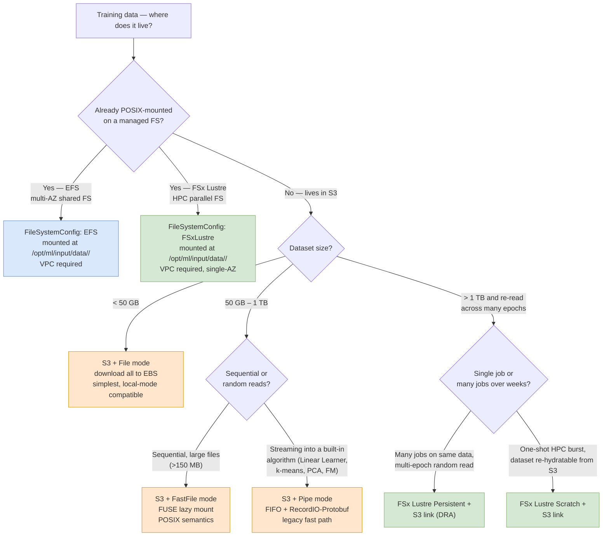
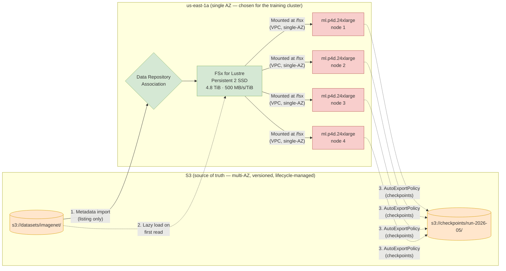

# Chapter 11 — S3, EFS, FSx for Lustre, FSx for ONTAP: the training-data storage matrix

> **Goal of this chapter:** to give you a single, sturdy decision framework for the deceptively dense question *"For a SageMaker training job, where does the data physically live, and which protocol does the container read it through?"* By the end of the chapter you should be able to map any problem statement to a `{storage substrate, input mode, file system type}` triple in under thirty seconds, defend the choice on cost and throughput grounds, and recognise — by smell — when an exam question is steering you toward S3 + FastFile, toward FSx for Lustre Persistent, toward EFS, or toward the FSx for NetApp ONTAP bridge pattern.
>
> This chapter is one of the highest-leverage chapters in the book because training is, more than anything else, an I/O problem disguised as a compute problem. A `ml.p5.48xlarge` with 8× H100 GPUs costs roughly $100/hour. If GPUs sit at 20% utilisation because the data loader is starved, you are throwing $80/hour into the storage subsystem. Picking the right `(storage, input mode)` tuple is, dollar for dollar, often the highest-leverage decision in a training job — and the exam knows it.

---

## 11.1 Why the storage matrix is its own chapter

The MLA-C01 blueprint mentions four storage services in a *single bullet* under Task 1.1:

> *"Knowledge of: how to use the core AWS data sources (e.g., Amazon S3, Amazon EFS, Amazon FSx for NetApp ONTAP)."*

…and a near-identical bullet under Task 1.3:

> *"Skills in: configuring data to load into the model training resource (e.g., Amazon EFS, Amazon FSx)."*

Reading those bullets too quickly, candidates conclude: "OK, S3 is the default, EFS for shared notebooks, FSx for big training." That is directionally right and *exam-wrong*. The blueprint specifically names **FSx for NetApp ONTAP** (not Lustre) in Task 1.1 because the exam expects you to know all four FSx flavours, plus the **three S3 input modes** (File, FastFile, Pipe), plus when **EBS** matters for the training instance root volume. That is roughly eight permutations to memorise. This chapter is the lookup table.

We built the IAM, S3, and EBS foundations in [Chapter 6 (S3 for ML)](../part_b_aws_foundations/06_s3_for_ml.md) and [Chapter 9 (compute primitives)](../part_b_aws_foundations/09_compute_primitives.md). Now we connect those primitives to the actual training-job machinery. The decisions made here flow forward into [Chapter 22 (SageMaker Studio + training-job lifecycle)](../part_e_model_development/), [Chapter 32 (distributed training)](../part_f_hpo_distributed_training/), and [Chapter 33 (Spot + warm pools)](../part_f_hpo_distributed_training/) — every one of those chapters assumes you already know which storage substrate is feeding the job.

The first-principles reframe is worth repeating. Training is throughput-bound at the data plane. A modern GPU consumes 10–80 GB/s of tensor data when it is actually computing. A single S3 prefix can serve at most 5,500 GET/s before throttling. A 50 KB image is one GET. Even with perfect prefetching you cap somewhere below 300 MB/s per prefix on small files — which is enough to starve one A100, never mind eight. The storage matrix exists because object storage and parallel file storage have radically different throughput profiles, and matching the right profile to the right workload is what separates a $13,000 training run from a $20,000 one.

---

## 11.2 The decision tree, at a glance

Before we walk the individual services, here is the picture the chapter will keep returning to. Print it.



This chapter is a deep dive into every labelled box. Section 11.3 covers the S3 modes; section 11.4 covers EFS; sections 11.5–11.6 cover FSx for Lustre in depth (it is the most heavily tested and the most operationally complex); section 11.7 covers FSx for NetApp ONTAP (the exam-named keyword); section 11.8 covers EBS for the training root volume; section 11.9 is the full decision matrix; section 11.10 is the worked cost example; sections 11.11–11.13 are war stories, HyperPod, and S3 Express One Zone; sections 11.14–11.16 are the gotcha list, cross-links, and exercises.

---

## 11.3 Amazon S3 — the substrate, and its three input modes

S3 is the **default** training input for SageMaker. Per the SageMaker Developer Guide:

> *"When creating a training job, you specify the location of training datasets in a data storage of your choice and the data input mode for the job. Amazon SageMaker AI supports Amazon Simple Storage Service (Amazon S3), Amazon Elastic File System (Amazon EFS), and Amazon FSx for Lustre."*

S3 is unique in that it is **the only input source that supports all three input modes** (File / FastFile / Pipe). EFS and FSx are *mounted* — there is no mode choice; the container sees a POSIX directory and reads through whatever filesystem driver is appropriate.

The `TrainingInputMode` field on `CreateTrainingJob` (or `input_mode=` on the SageMaker Python SDK `Estimator`) takes one of three values:

| Mode | API value | Behaviour |
|---|---|---|
| File mode | `"File"` (default) | Download whole dataset to instance EBS volume before training starts |
| FastFile mode | `"FastFile"` | Lazy FUSE mount of S3 prefix; chunks fetched on read |
| Pipe mode | `"Pipe"` | Stream from S3 into FIFO named pipes; algorithm consumes as bytes arrive |

The next three subsections walk each in turn.

### 11.3.1 S3 + File mode — the safe default

> *"File mode presents a file system view of the dataset to the training container. This is the default input mode if you don't explicitly specify one of the other two options. If you use file mode, SageMaker AI downloads the training data from the storage location to a local directory in the Docker container. Training starts after the full dataset has been downloaded. In file mode, the training instance must have enough storage space to fit the entire dataset."* — SageMaker DG

Mechanically:

1. SageMaker boots the training instance, attaches the EBS volume (`VolumeSizeInGB`, default 30 GB, max 16 TB for gp3).
2. Before your script runs, SageMaker calls the equivalent of `aws s3 sync` from the `s3://...` prefix to `/opt/ml/input/data/<channel>/`.
3. Your `train.py` opens local files via standard filesystem APIs. Training starts only after the sync completes.

**When to use:**

- Dataset < 50 GB and fits cleanly on the instance root volume.
- You want the simplest, most debuggable I/O path.
- You need compatibility with **SageMaker local mode** (File and FastFile modes work with local mode; Pipe does not).
- You are shuffling/iterating the dataset many times per epoch (download once, re-read 100× from local disk = essentially free I/O after the upfront cost).

**Watch-outs:**

- The whole dataset must fit on the EBS volume. A 2 TB dataset on a `ml.g5.xlarge` with default 30 GB EBS will fail at the sync step, not at training start. Override with `VolumeSizeInGB=2200`.
- For distributed training, use `ShardedByS3Key` distribution to split S3 keys across instances (each instance downloads only its slice; total cluster download = dataset size, not N × dataset size).
- Download time scales with **number of files**, not just total bytes. 100k tiny files is brutal even at 100 GB total because each object incurs a TCP round trip and a TLS handshake amortised across maybe one MB of payload.

The hidden cost of File mode is **paid GPU idle time during sync**. We will quantify this in §11.10 — a 5 TB dataset on a 4-node `p4d.24xlarge` cluster bleeds about $459 in compute before the first epoch even starts. That number is the single most common reason teams migrate to FastFile or FSx for Lustre.

### 11.3.2 S3 + FastFile mode — the modern default for big-but-not-huge data

> *"Fast file mode provides file system access to an Amazon S3 data source while leveraging the performance advantage of pipe mode. At the start of training, fast file mode identifies the data files but does not download them. Training can start without waiting for the entire dataset to download."* — SageMaker DG

> *"In contrast to pipe mode, fast file mode works with random access to the data. However, it works best when data is read sequentially. Fast file mode doesn't support augmented manifest files."*

> *"Fast file mode exposes S3 objects using a POSIX-compliant file system interface, as if the files are available on the local disk of your training instance. It streams S3 content on demand as your training script consumes data."*

Mechanically:

- A FUSE driver mounts the S3 prefix at `/opt/ml/input/data/<channel>/`.
- Training starts in seconds (only the **listing** is fetched up front, not the bytes).
- On the first `read()` of a file, the FUSE driver issues a ranged GET to S3 and caches the bytes locally.
- Subsequent reads of the same byte range hit the cache; reads outside cache hit S3 again.

**When to use** (per the AWS ML Blog *Choose the best data source for your Amazon SageMaker training job*):

- **Dataset > 50–100 GB** and you don't want startup delay.
- **Files > 150 MB** (FastFile prefers large files; per-file overhead dominates for tiny files).
- **Sequential reads** within files (the FUSE layer prefetches ahead).
- You want POSIX semantics so a standard PyTorch `Dataset` or TensorFlow `tf.data` pipeline just works without rewriting.

**Constraints:**

- **Read-only** — you cannot write back through the FUSE mount. Checkpoints must go elsewhere (EBS local, EFS shared, or `s3:PutObject` calls from your training code).
- **S3 prefix only** — no manifest files, no augmented manifest files.
- **Not for tiny-file workloads** — the per-object GET overhead destroys throughput when files average <10 MB. Either repackage into TFRecord / RecordIO / WebDataset shards or move to FSx Lustre.
- **CloudTrail cost warning**: *"Using Fast File mode might lead to increased CloudTrail costs due to additional logging of: Amazon S3 data events, AWS KMS decryption events, Management events related to AWS KMS operations."* If your account has data-event logging enabled on the bucket, FastFile's per-object access pattern multiplies log volume — and CloudTrail data events are *not* free.

> ⚠️ **Exam alert.** If a question describes *"large dataset, sequential reads, don't want to download upfront, no VPC setup required"* — the answer is **FastFile**. If it describes *"large dataset, many small files, distributed training across many GPUs"* — the answer is **FSx for Lustre**. The pivot point is small-file-density, not raw dataset size.

### 11.3.3 S3 + Pipe mode — the legacy streaming protocol

> *"Pipe mode streams data directly from an Amazon S3 data source. Streaming can provide faster start times and better throughput than file mode. When you stream the data directly, you can reduce the size of the Amazon EBS volumes used by the training instance. Pipe mode needs only enough disk space to store the final model artifacts."* — SageMaker DG

> *"It is another streaming mode that is largely replaced by the newer and simpler-to-use fast file mode. In pipe mode, data is pre-fetched from Amazon S3 at high concurrency and throughput, and streamed into a named pipe, which also known as a First-In-First-Out (FIFO) pipe for its behavior. Each pipe may only be read by a single process."*

Mechanically:

- SageMaker creates a Unix named pipe (FIFO) at `/opt/ml/input/data/<channel>_<epoch>` for each epoch.
- A background process pre-fetches from S3 with high concurrency and writes bytes into the FIFO.
- The training process opens the FIFO with `open(..., 'rb')` and reads sequentially.
- One FIFO per process — Pipe mode is single-reader by design.

**Why it was created.** In 2017 training datasets started outgrowing EBS volumes and File-mode startup time (>30 min download for TB-scale data) became unacceptable. Pipe mode let training start in seconds and use a tiny EBS volume. It saved 20–40% of training cost on Linear Learner / k-means workloads at the time.

**Why it's being eclipsed:**

- **Sequential-only** — you cannot seek backwards, you cannot random-access within a file, you cannot shuffle within an epoch without pre-shuffling on S3.
- **One reader per pipe** — multi-process PyTorch `DataLoader` workers need multiple channels, which is painful to wire up.
- **Format coupling** — the best (and often *only*) sane experience is with **RecordIO-Protobuf** or **TFRecord** binary record formats. Raw CSV/JSON works but you must frame the data yourself.
- **No POSIX** — every framework needs custom glue. The SageMaker TF/PyTorch `PipeModeDataset` wrappers exist precisely because the raw FIFO interface is hostile to a normal data-loader.

> *"Pipe mode is another streaming mode that is largely replaced by the newer and simpler-to-use FastFile mode."* — AWS ML Blog

**Deprecation status (May 2026).** Pipe mode is **not** formally deprecated. AWS still documents it. But you should treat it as legacy for new builds. The 2024-onwards guidance is: use FastFile unless you have an existing `PipeModeDataset` codebase, or you are running a SageMaker built-in algorithm where Pipe + RecordIO-Protobuf is the documented fast path (Linear Learner, k-means, PCA, Factorization Machines, NTM, Object2Vec).

> ⚠️ **Exam alert — the FastFile-replaces-Pipe framing.** Old practice questions still ask *"streaming large dataset, no EBS volume cost — which mode?"* with **Pipe** as the answer. Newer questions increasingly accept **FastFile**. The disambiguator: if the question mentions **RecordIO-Protobuf** explicitly, or names a built-in algorithm by name (Linear Learner, k-means, PCA, FM, NTM, Object2Vec), the answer is **Pipe**. If it mentions arbitrary file formats, custom training scripts, or generic `tf.data` / PyTorch `DataLoader` code, the answer is **FastFile**.

### 11.3.4 S3 Express One Zone — the latency turbo

The SageMaker DG explicitly supports S3 Express One Zone (directory buckets) as an input source for all three modes:

> *"Amazon S3 Express One Zone is a high-performance, single Availability Zone storage class that can deliver consistent, single-digit millisecond data access for the most latency-sensitive applications including SageMaker model training. SageMaker AI model training supports high-performance Amazon S3 Express One Zone directory buckets as a data input location for file mode, fast file mode, and pipe mode."*

Use it when:

- Distributed training on hundreds of GPUs is bottlenecked on S3 first-byte latency.
- You can co-locate the directory bucket and training instances in the same AZ.
- You are willing to pay ~10× Standard storage rates for ~10× lower latency.

**Caveat.** SSE-KMS is **not supported** for SageMaker output to directory buckets — only SSE-S3. For regulated environments that mandate customer-managed KMS keys for all data at rest, this is a blocker.

We unpack S3 Express One Zone for training in §11.13, including the Pinterest case study (>10× latency improvement vs S3 Standard).

---

## 11.4 Amazon EFS — shared POSIX, multi-AZ

> *"Amazon EFS — To use Amazon EFS as a data source, the data must already reside in Amazon EFS prior to training. SageMaker AI mounts the specified Amazon EFS file system to the training instance, then starts your training script. Your training job must connect to a VPC to access Amazon EFS."* — SageMaker DG

### 11.4.1 What EFS is

EFS is an NFSv4-compatible elastic file system. Multi-AZ by default (Standard storage class), petabyte scale, pay per GB stored plus throughput. The key distinguishing properties for ML:

- **POSIX semantics** including writes, locks, atomic renames. EFS is the only ML-relevant AWS storage with full read/write POSIX (FSx Lustre also has it, but Lustre is single-AZ).
- **Multi-AZ durability** out of the box (Standard storage class).
- **Concurrent multi-client access** — designed for thousands of clients hitting the same mount.

EFS has two **performance modes**, set at FS creation and immutable thereafter:

| Mode | Latency | Max ops/sec | When to use |
|---|---|---|---|
| **General Purpose** | Lower per op | ~35,000 | Default; web serving, dev notebooks, most ML use cases |
| **Max I/O** | Higher per op | Effectively unlimited | Many concurrent clients (1000s); usually overkill for ML training |

And three **throughput modes**:

| Mode | Behaviour | When to use |
|---|---|---|
| **Bursting** (legacy) | 50 KB/s per GB baseline + burst credits | Small / spiky workloads |
| **Provisioned** | Fixed MiB/s independent of stored bytes | Predictable ML training where you know the ceiling |
| **Elastic** (default since 2023) | Auto-scales to workload; pay per byte read/written | Best for unpredictable training I/O |

### 11.4.2 SageMaker integration

```python
from sagemaker.inputs import FileSystemInput

efs_input = FileSystemInput(
    file_system_id='fs-0123abcd',
    file_system_type='EFS',
    directory_path='/training-data/imagenet/',
    file_system_access_mode='ro',
)
estimator.fit({'training': efs_input})
```

Or, equivalently, in the `CreateTrainingJob` API:

```json
"DataSource": {
  "FileSystemDataSource": {
    "FileSystemId": "fs-0123abcd",
    "FileSystemType": "EFS",
    "DirectoryPath": "/training-data/imagenet/",
    "FileSystemAccessMode": "ro"
  }
}
```

Hard requirements:

- Training job runs in a **VPC** (you set `subnets` and `security_group_ids` on the Estimator). [Chapter 7 (VPC for ML)](../part_b_aws_foundations/07_vpc_for_ml.md) covers the networking primitives.
- The subnet must be in an AZ where the EFS file system has a **mount target**.
- Security group on the training ENI must allow NFS (TCP 2049) to the EFS mount target SG.
- Pipe mode **not** applicable — EFS is mounted, not streamed.

### 11.4.3 When EFS is the right answer for ML

- **SageMaker Studio domain storage.** Studio uses EFS internally for `/home/sagemaker-user/` so notebooks and pip-installed packages persist across kernel restarts. You don't manage this EFS yourself, but it is good to know it exists (see [Chapter 22](../part_e_model_development/) for Studio internals).
- **Shared mutable dataset across a team** — labellers append new images, multiple training jobs see the same view in real time.
- **Training script reads from S3 but writes checkpoints to EFS** so multi-node distributed training has a shared checkpoint directory.
- **Hyperparameter tuning** where each trial writes intermediate state visible to others.

### 11.4.4 When EFS is the wrong answer

- **Single training job, dataset never changes** — S3 + FastFile is cheaper and faster.
- **You need >10 GB/s aggregate throughput** — provisioned EFS gets expensive fast; FSx Lustre is built for this regime.
- **Compliance forbids VPC** (rare but real) — S3 input modes don't require VPC; EFS does.
- **You are reading the same data on every epoch but never writing it** — you're paying for write-capable POSIX you don't use; FastFile or Lustre is cheaper.

The cleanest framing: **EFS is for state that needs to be written from multiple training instances at the same time.** If your workload is "read once, train, dump checkpoints to S3," EFS is overkill. If your workload is "100 parallel hyperparameter trials all reading a shared baseline and writing their own results to a shared directory," EFS is the right tool.

---

## 11.5 Amazon FSx for Lustre — the HPC champion

> *"FSx for Lustre makes it easy and cost-effective to launch and run the popular, high-performance Lustre file system. You use Lustre for workloads where speed matters, such as machine learning, high performance computing (HPC), video processing, and financial modeling. It provides sub-millisecond latencies, up to multiple TBps of throughput and up to millions of IOPS."* — FSx for Lustre User Guide

Lustre stands for "**L**inux Cl**uster**". It is a parallel filesystem designed for the world's fastest supercomputers — about 65% of the TOP500 list runs Lustre under the hood. Files are striped across many Object Storage Targets (OSTs), letting hundreds of clients read in parallel at aggregate TB/s rates. AWS manages all the OST/MDS plumbing for you, exposing only the mount point.

For ML, Lustre is the answer to one question: *"How do I feed an N-GPU training cluster at line rate without bottlenecking on storage?"* When AWS publishes ML customer stories on its FSx for Lustre customers page, the names are uniformly the brand-name shops you would expect at scale — Adobe, Netflix, Paige, Hyundai, Toyota Research Institute, LG AI Research, Shell, Maxar. The pattern is unmissable: when public ML shops talk about training-data storage on AWS, the named product is FSx for Lustre, not S3 File mode.

### 11.5.1 Scratch vs Persistent — the deployment-type fork

> *"Amazon FSx for Lustre offers a choice of scratch and persistent file systems to accommodate different data processing needs. Scratch file systems are ideal for temporary storage and shorter-term processing of data. Data is not replicated and does not persist if a file server fails. Persistent file systems are ideal for longer-term storage and throughput-focused workloads. In persistent file systems, data is replicated, and file servers are replaced if they fail."* — FSx for Lustre UG

| | Scratch | Persistent |
|---|---|---|
| Durability | Single replica per OST; if hardware fails, data is lost | Replicated within AZ; auto-replaced servers |
| Lifetime | Short-lived (hours to days) | Long-running (weeks to months) |
| Cost (us-east-1, May 2026) | ~$0.14/GB-mo (Scratch 2 SSD) | ~$0.20/GB-mo (Persistent 2 SSD, 125 MB/s/TiB tier) |
| Use case | One-shot HPC burst; can re-hydrate from S3 if lost | Repeated training over the same dataset |
| Min capacity | 1.2 TiB | 1.2 TiB (varies by throughput tier) |

> From the AWS ML Blog cost analysis: *"a minimum-size 1.2 TB file system of SSD-backed Scratch 2 type costs an additional $168 per month"* — i.e., the floor is non-trivial. There is no "small Lustre" option.

The mental model: **Scratch = "I'm going to run this job, dump checkpoints to S3, and delete the FS"**, **Persistent = "I'm going to run this same data through training jobs for weeks, possibly months"**. Almost every cost war story in §11.11 traces back to people who picked Persistent without an operational plan to delete it.

### 11.5.2 Storage classes (current generation)

Per the FSx for Lustre UG:

| Class | Use case |
|---|---|
| **SSD** | Small random file ops, up to TBps throughput, consistent sub-ms latency |
| **Intelligent-Tiering** | Most workloads not needing low-latency on full dataset; fully elastic, sub-ms on frequently-accessed data with optional SSD read cache |
| **HDD** | Consistent single-digit-ms latency, tens of GBps throughput; optional SSD read cache sized to 20% of HDD capacity |

For ML training the default is **SSD**. **Intelligent-Tiering** (announced late 2024) is interesting for cold/hot datasets where you don't want to manage tiering yourself — it auto-tiers cold data to IA / Archive while keeping the hot working set on SSD. It is the modern "I don't want to think about it" choice for multi-TB ML workloads.

### 11.5.3 Throughput tiers (Persistent 2 SSD)

You provision per-TiB throughput at file system creation:

| Tier | Throughput per TiB | Use case |
|---|---|---|
| 125 MB/s/TiB | Baseline | Cheapest; small / cold datasets |
| 250 MB/s/TiB | 2× baseline | Mid-range training |
| 500 MB/s/TiB | 4× baseline | Heavy GPU clusters |
| 1000 MB/s/TiB | 8× baseline | Max for Persistent 2; LLM pre-training scale |

Total throughput = `capacity_TiB × tier`. A 4.8 TiB FS at 1000 MB/s/TiB = ~4.8 GB/s sustained — enough to feed dozens of A100s simultaneously. A 100 TiB FS at the same tier hits 100 GB/s aggregate, which is approaching frontier-lab pre-training territory.

The dimensional gotcha: **throughput is provisioned, not auto-scaled**. If you under-provision throughput at FS creation time and then add training nodes, you will hit the ceiling and per-GPU throughput will drop. AWS's distributed-training troubleshooting guide explicitly says: *"if scaling efficiency drops when switching to a larger cluster, use a larger FSx Lustre with higher throughput limit."* The fix is usually larger capacity (which raises throughput proportionally) or a higher tier — both of which usually require recreating the file system, which is the operational pain point that motivates Intelligent-Tiering.

### 11.5.4 S3 linking — Data Repository Associations (DRAs)

This is the killer feature for ML. From the FSx UG:

> *"FSx for Lustre integrates with Amazon S3, making it easier for you to process cloud datasets using the Lustre high-performance file system. When linked to an Amazon S3 bucket, an FSx for Lustre file system transparently presents S3 objects as files. Amazon FSx imports listings of all existing files in your S3 bucket at file system creation. Amazon FSx can also import listings of files added to the data repository after the file system is created. The file system also makes it possible for you to write file system data back to S3."*

Mechanically:

1. Create FSx for Lustre FS with `DataRepositoryAssociations: [{ DataRepositoryPath: 's3://my-bucket/datasets/', FileSystemPath: '/datasets/' }]`.
2. FSx imports the **listing** (metadata: name, size, mtime, owner) — *not* the bytes. Empty stub inodes appear on the FS.
3. First read of a file triggers a **lazy load** — FSx streams bytes from S3 to OST. Subsequent reads are local-fast.
4. Optional `AutoExportPolicy` — new/changed files on Lustre auto-export back to S3 (on schedule or on-demand via *data repository tasks*).

**Initialization caveat** (from the AWS Blog): *"it takes about an hour to index approximately 2 million objects from Amazon S3"* — bake this into your job submission timeline. For a 50M-object dataset you are looking at 24+ hours of indexing before the FS is ready.

This is the **"S3 as source of truth, Lustre as hot cache"** pattern. You keep your durable, versioned, lifecycle-managed data in S3 (the substrate built in [Chapter 6](../part_b_aws_foundations/06_s3_for_ml.md)). You spin up an FSx Lustre FS, link it to the S3 prefix, run GPU training against the mount, then optionally tear down the FS to stop the hourly bill. The diagram:



The architecture above is the canonical reference for any "I have multi-TB training data, multi-day experimentation, must keep GPUs busy" scenario. The S3 prefix is durable and cheap; the Lustre FS is hot and fast; the AutoExportPolicy makes sure work product persists back to S3 even if the FS is deleted.

### 11.5.5 SageMaker integration

```python
from sagemaker.inputs import FileSystemInput

fsx_input = FileSystemInput(
    file_system_id='fs-0abcd1234',
    file_system_type='FSxLustre',
    directory_path='/fsx/datasets/imagenet',  # within the Lustre mount
    file_system_access_mode='ro',
)
estimator.fit({'training': fsx_input})
```

Per the SageMaker DG:

> *"Amazon FSx for Lustre – FSx for Lustre can scale to hundreds of gigabytes of throughput and millions of IOPS with low-latency file retrieval. When starting a training job, SageMaker AI mounts the FSx for Lustre file system to the training instance file system, then starts your training script. Mounting itself is a relatively fast operation that doesn't depend on the size of the dataset stored in FSx for Lustre."*

> *"To access FSx for Lustre, your training job must connect to an Amazon Virtual Private Cloud (VPC), which requires DevOps setup and involvement. To avoid data transfer costs, the file system uses a single Availability Zone, and you need to specify a VPC subnet which maps to this Availability Zone ID when running the training job."*

The **single-AZ constraint** is the critical gotcha and worth its own callout.

> ⚠️ **Exam alert — Lustre is single-AZ.** Your training cluster subnet must match the FSx AZ exactly. If your training cluster spans multiple AZs (often for Spot capacity), only the instances in the FSx AZ can mount. For multi-AZ resilience you would need to replicate to a second FSx in another AZ — most teams skip this in favour of "re-create from the S3 DRA if the AZ dies." This single fact has cost more late-night production calls than almost any other Lustre property.

### 11.5.6 The "Warm Pool + Lustre" combo

SageMaker **Managed Warm Pools** keep training instances alive between jobs (you pay the instance hourly cost, but skip the 2–5 minute boot + image-pull cycle). Combined with FSx Lustre:

- Instance is already running → mount is already established → next job starts in ~10 seconds.
- Lustre already has the dataset cached from the previous job → first epoch runs at full GPU throughput.
- Compare to S3 File mode cold start: 2 min instance boot + 5 min container pull + 30 min dataset download = 37 min wasted on every hyperparameter trial.

For an iterative experimentation workflow (50 trials/day), Warm Pool + Lustre pays back the Lustre baseline cost in days. [Chapter 33](../part_f_hpo_distributed_training/) covers Warm Pools and Spot in depth.

### 11.5.7 When FSx Lustre wins

- **Distributed deep learning on 100s of GPUs** where S3 reads bottleneck I/O — Lustre delivers 10–100× S3 aggregate throughput.
- **Millions of tiny files** (image classification, genomics) where S3 per-object overhead destroys throughput. From the AWS benchmark blog, a 54 GB / 50k-small-file ResNet-50 epoch ran ~10,000 s on File mode and ~5,000 s on Lustre — a 2× speedup just from the file system.
- **Multi-epoch training** where each epoch re-reads the same dataset — Lustre caches; S3 re-charges GET fees per epoch.
- **HPC simulation + ML loop** where the same FS is shared between a CFD/genomics step and a model training step.
- **You are already in an HPC environment** (ParallelCluster, AWS Batch) and want to extend to ML.

The named customers from the AWS FSx Lustre customers page tell the story:

- **Adobe** — uses FSx for Lustre for rapid access to training data; "GPU resources are never left idle" during foundation-model training.
- **Netflix** — **3–4× training-time improvement**; one week down to 1–2 days for media ML models; "virtually eliminated GPU idle time."
- **Paige** (cancer-diagnosis AI) — **10× increase in data training capacity, 72% faster internal workflows** by connecting FSx for Lustre to S3.
- **Hyundai** — **93% scaling efficiency at 64 GPUs** for autonomous driving with no data wait time.
- **Maxar** — **58% compute-time reduction** for weather forecasting.

### 11.5.8 When FSx Lustre loses

- **Dataset < 100 GB, single training job** — the 1.2 TiB minimum plus per-hour cost overwhelms any savings; just use FastFile.
- **No VPC setup possible** — FSx requires VPC; FastFile doesn't.
- **Truly one-shot job** — the 1-hour S3 indexing time plus mount time can exceed File mode download time for small data.
- **Multi-AZ resilience is a hard requirement and you cannot tolerate "re-hydrate from S3 if AZ dies"** — Lustre is single-AZ, full stop.

---

## 11.6 The Lustre throughput math you need to be able to do under exam pressure

A worked example that recurs in every "right-size the file system" question. The formula:

```
Aggregate_throughput_MBps = capacity_TiB × throughput_tier_MBps_per_TiB
```

**Worked.** You are training a vision model on 32 nodes of `ml.p4d.24xlarge` (8 A100 per node = 256 A100 total). Each A100 wants about 4 GB/s of training data when batched 256. Aggregate appetite: 256 × 4 = 1024 GB/s. That is well outside Lustre's reach on a single FS — but realistically you have prefetching, augmentation, and data parallelism, so the per-GPU number is closer to 500 MB/s sustained. Aggregate: 256 × 0.5 = 128 GB/s.

Sizing options to hit 128 GB/s:

| Capacity | Tier | Aggregate |
|---|---|---|
| 128 TiB | 1000 MB/s/TiB | 128 GB/s ✓ (max tier) |
| 256 TiB | 500 MB/s/TiB | 128 GB/s ✓ (mid tier — cheaper if you actually need the capacity) |
| 512 TiB | 250 MB/s/TiB | 128 GB/s ✓ (cheap throughput, but huge capacity bill) |
| 50 TiB | 1000 MB/s/TiB | 50 GB/s — under-provisioned, you'd see ~40% GPU utilization at scale |

The right choice depends on whether you have 50 TB of data or 500 TB of data. If you have 50 TB of data but need 128 GB/s of throughput, you over-provision *capacity* to buy throughput — the file system is two-thirds empty, but that is what you pay for the bandwidth. This non-obvious "buy capacity for throughput" pattern is exactly the kind of thing the exam tests with "right-size the file system for this workload" scenarios.

---

## 11.7 FSx for NetApp ONTAP — the multi-protocol enterprise file system

**This is the FSx variant explicitly called out by name in the MLA-C01 exam guide** (Task 1.1 knowledge bullet). It is **not** Lustre. The exam can ask why you would pick ONTAP over Lustre.

### 11.7.1 What it is

A managed instance of **NetApp ONTAP** — the enterprise storage operating system that runs in most Fortune 500 data centres. AWS runs the controllers; you get NetApp semantics on AWS infrastructure.

Key capabilities:

- **Multi-protocol from the same volume** — NFS v3/v4, SMB (Windows), iSCSI, NVMe-over-TCP. Same files, different access methods. This is the headline feature.
- **SnapMirror replication** — block-level async replication to/from on-prem NetApp clusters or another FSx ONTAP FS. The standard enterprise DR primitive.
- **FlexClone snapshots** — instant, space-efficient copies. Useful for "give every data scientist their own writable copy of the 50 TB training set" without 50 TB × N storage cost.
- **Deduplication + compression + compaction** — typical 2–3× space savings on text/structured data.
- **Tiering to S3** — capacity-pool tier moves cold blocks to managed S3 transparently. Hot data on SSD; cold on S3.

### 11.7.2 When ONTAP for ML

- **Lift-and-shift on-prem NetApp workloads into AWS** without re-engineering the storage layer. Your existing on-prem labelling pipeline mounts a NetApp volume? Replicate it to FSx ONTAP, keep the same mount, run training on EC2/SageMaker.
- **Cross-protocol access** — Windows-based labellers write annotations over SMB; Linux training instances read the same files over NFS. Same volume, no copy step.
- **Regulated hybrid environments** — financial / healthcare orgs with existing NetApp investments and DR plans.
- **You need SnapMirror DR** between AWS regions or AWS ↔ on-prem.

### 11.7.3 SageMaker integration — the bridge pattern

This is the part the exam loves to test. ONTAP is **not** directly supported as a `FileSystemType` in `CreateTrainingJob`. The API enum is **`EFS | FSxLustre` only**. To use ONTAP for SageMaker training you have two options:

1. **Mount ONTAP NFS volumes manually inside your BYOC training container.** You write the `mount.nfs` call into your container's entrypoint, give the training role network access to the ONTAP SVM, and read from the NFS mount. This works but loses managed integration (no SageMaker-managed mount, no `FileSystemDataSource` ARN tracking in lineage).
2. **Stage data from ONTAP to S3** (via DataSync or a one-time copy) and use S3 as the SageMaker input. This is the cleaner, recommended pattern. DataSync supports NFS-to-S3 transfers with checksum verification, scheduling, and bandwidth throttling.

> ⚠️ **Exam alert — the ONTAP bridge.** The exam guide names FSx for NetApp ONTAP in Task 1.1, but the SageMaker `FileSystemConfig` API does not accept it. When you see a question like "team has on-prem NetApp data and wants to train in SageMaker," the right answer is almost never "use ONTAP as the training input directly." It is **"stage from FSx ONTAP to S3 (via DataSync or AutoTiering), then train from S3 using FastFile/File/Pipe mode."** This is the most commonly missed gotcha on ONTAP questions.

### 11.7.4 ONTAP vs Lustre — the side-by-side

| | FSx for Lustre | FSx for NetApp ONTAP |
|---|---|---|
| Protocol | Lustre (POSIX) | NFS, SMB, iSCSI, NVMe-TCP |
| Throughput | TBps aggregate | GBps aggregate |
| Latency | Sub-ms | Sub-ms (NFS) |
| Native SageMaker training input | **Yes** (`FSxLustre`) | **No** — use BYOC or stage to S3 |
| Multi-AZ | Single-AZ (Persistent in one AZ; replicate via S3) | Single-AZ or Multi-AZ deployment types |
| Cross-protocol | No | **Yes** (same volume via NFS + SMB) |
| Hybrid replication | No (manual via DataSync) | **SnapMirror** to/from on-prem NetApp |
| Snapshots | DRA exports to S3 | FlexClone (instant, space-efficient) |
| Cost per GB-mo | $0.14 (Scratch) / $0.20 (Persistent) | Higher, but with dedup/compression often net-cheaper |
| Killer ML use | Distributed GPU training on huge datasets | Lift-and-shift on-prem NetApp into AWS |

---

## 11.8 EBS for the training instance root volume

Every SageMaker training instance has an **EBS volume** attached as the root device. This is where:

- The container image is unpacked.
- File-mode S3 data is downloaded.
- FastFile FUSE cache lives (partially — most caching is in-memory but spills to local disk).
- Your training script's intermediate files / checkpoints live (until copied to S3 or to an output channel).

[Chapter 9](../part_b_aws_foundations/09_compute_primitives.md) covers EBS volume types in depth; this section is the ML-specific framing.

### 11.8.1 gp3 vs io2

Default is **gp3**:

- 3,000 IOPS and 125 MB/s baseline regardless of volume size.
- Can provision up to 16,000 IOPS and 1,000 MB/s (paid per IOPS / MB/s above baseline).
- ~$0.08/GB-mo + provisioned IOPS/throughput.
- Sweet spot for 99% of training jobs.

**io2** (and io2 Block Express):

- Up to 256,000 IOPS, 4,000 MB/s per volume.
- Sub-ms latency, 99.999% durability.
- ~$0.125/GB-mo + $0.065 per provisioned IOPS-mo.
- Use only when training is **provably I/O-bound on the root volume** — rare in modern ML.

For SageMaker training, the `VolumeSizeInGB` parameter on the training job sets the gp3 volume size. You don't get to pick io2 through the basic SageMaker API — you would need to drop to EC2-level configuration via BYOC or HyperPod.

### 11.8.2 When EBS matters

Mostly when File mode is your input mode and the dataset is large:

- 500 GB dataset → set `VolumeSizeInGB=700` (dataset + checkpoints + working space).
- Per-instance volume — for distributed training, every instance gets its own EBS volume.
- Combine with `ShardedByS3Key` so each instance downloads only its slice.

> ⚠️ **Exam alert — EBS is per-instance.** A 4-node cluster with `VolumeSizeInGB=2000` provisions 8 TB of EBS, not 2 TB. The cost line that surprises people is `4 nodes × 2 TB × $0.08/GB-mo / 720 hr × 100 hr = $89`. Not huge, but it adds up across hundreds of HPO trials.

The other framing the exam tests: if a question says *"I have I/O-bound training"*, the answer is almost always **FSx for Lustre** (parallel filesystem, shared across instances), **not** io2 (single-instance, block-level). io2 fixes one node's I/O ceiling; Lustre fixes the cluster's I/O ceiling.

---

## 11.9 The decision matrix — full table

The full lookup table the chapter is building toward. Internalise this; it covers ~90% of the storage scenarios the exam can throw at you.

| # | Scenario | Storage | Input mode | Why |
|---|---|---|---|---|
| 1 | <50 GB tabular dataset, single training job | S3 | File | Simplest; download once, train |
| 2 | 100 GB image dataset, single training job, ad-hoc | S3 | FastFile | Skip download wait; POSIX semantics |
| 3 | 500 GB TFRecords, SageMaker built-in Linear Learner | S3 | Pipe (RecordIO-Protobuf) | Documented fast path for built-in algos |
| 4 | 2 TB ImageNet, one-shot training | S3 | FastFile or FSx Lustre Scratch | FastFile if cost-sensitive; Lustre if I/O-bound |
| 5 | 10 TB satellite imagery, weeks of experimentation | FSx Lustre Persistent + S3 link | mounted | Hot cache; S3 as source of truth |
| 6 | Distributed LLM pre-training, 100s of GPUs, 100 TB corpus | FSx Lustre Persistent (1000 MB/s/TiB) + S3 link | mounted | Only Lustre can feed this many GPUs |
| 7 | Shared notebook env across team | EFS | mounted | POSIX, multi-AZ, mutable |
| 8 | Hyperparameter tuning, 50 trials with shared checkpoints | EFS for checkpoints + S3 FastFile for data | mixed | EFS shared write-back; S3 read-only data |
| 9 | Lift-and-shift on-prem NetApp workload | FSx ONTAP → DataSync → S3 → SageMaker | File / FastFile | ONTAP isn't a native SM input; bridge via S3 |
| 10 | Windows labellers + Linux training, same files | FSx ONTAP (SMB write, NFS read) → S3 stage → SageMaker | File / FastFile | Cross-protocol on ONTAP; SM reads from S3 |
| 11 | Single-digit-ms first-byte at GPU cluster scale | S3 Express One Zone | File / FastFile / Pipe | Co-located directory bucket |

Row 8 is worth dwelling on for a moment because it shows up in exam questions as a "trick" combination. Real ML workflows often need **two different storage substrates simultaneously** — read-only data from one, mutable shared state from another. SageMaker supports multiple input channels per training job; you can wire `FileSystemInput(EFS)` for checkpoints and `S3Input(FastFile)` for the training data on the same job. The exam will sometimes present this as if you must choose one or the other — the right answer is "use both, for different purposes."

---

## 11.10 Worked cost example — 5 TB / 100-epoch / 4× p4d

To make the trade-offs concrete: a 5 TB training dataset on S3, 100-epoch training, 4× `ml.p4d.24xlarge` cluster ($32.77/hr on-demand each = $131.08/hr cluster). Assume 1 hour per epoch if I/O isn't the bottleneck.

### 11.10.1 Option A — S3 + File mode

- **Startup:** download 5 TB to each instance EBS. With `ShardedByS3Key`, each gets 1.25 TB. At ~100 MB/s instance throughput → ~3.5 hours of download (instance is *billed* during this). Cost: 3.5 × $131.08 = **$459 just to start**.
- **EBS:** need ≥1.4 TB per instance → 4 × 1500 GB gp3 ≈ $0.08/GB/mo × 1500 × 4 / 720 hr ≈ $0.67/hr. Over 100 hrs of training ≈ **$67**.
- **Training:** 100 epochs × $131.08 = **$13,108**.
- **S3 GET:** ~$0.0004 per 1000 GETs. 5M files = ~$2.
- **Total: ~$13,636** (download wasted ~$459 of compute).

### 11.10.2 Option B — S3 + FastFile mode

- **Startup:** ~10 seconds (just lists keys). Cost: **~$0**.
- **EBS:** default 30 GB / instance, ~$0.07/hr cluster. Over 100 hrs ≈ **$7**.
- **Training:** if GPUs not starved → 100 × $131.08 = **$13,108**. If FastFile FUSE doesn't keep up on small files, you might see 1.5 hr/epoch → $19,662.
- **S3 GET:** higher than File (per-read GETs not per-file). For 5 TB with 16 MB read chunks → 5M GETs/epoch × 100 epochs = 500M GETs ≈ $200.
- **Total: ~$13,315** (if GPU-bound) or **~$19,869** (if I/O-bound on small files).

### 11.10.3 Option C — S3 + Pipe mode (assuming RecordIO-Protobuf format)

- **Startup:** seconds. Cost: **~$0**.
- **EBS:** 30 GB default ≈ **$7**.
- **Training:** highly streaming-friendly; for built-in algos, often matches Lustre throughput. 100 × $131.08 = **$13,108**.
- **S3 GET:** sequential ranged GETs; lower request count than FastFile (~50M GETs total) ≈ $20.
- **Total: ~$13,135**.

### 11.10.4 Option D — FSx for Lustre Persistent + S3 link

- **FSx FS:** 4.8 TiB at 500 MB/s/TiB Persistent SSD ≈ $0.20/GB-mo × 4800 GB / 720 hr ≈ $1.33/hr. Over 100 hrs of training + 5 hr buffer ≈ 105 × $1.33 = **$140**.
- **Initial hydration:** first epoch reads 5 TB from S3 via DRA → ~1 hr extra time at full Lustre throughput. Cluster cost: $131. Worth it because epochs 2–100 are local-fast.
- **Startup:** indexing 5 TB / ~2M files ≈ 1 hr (one-time) → can be done **before** the cluster boots. Cost = FSx-hour only ≈ $1.33.
- **Training:** 100 × $131.08 = **$13,108**. GPUs fully fed.
- **S3 GET:** first hydration only, ~$2.
- **Total: ~$13,381**.

### 11.10.5 Side-by-side summary

| Mode | Setup cost | Per-epoch I/O risk | Total (best case) | Total (worst case) |
|---|---|---|---|---|
| S3 File | $459 (download) | None (local disk) | $13,636 | $13,636 |
| S3 FastFile | $0 | Moderate (FUSE on small files) | $13,315 | $19,869 |
| S3 Pipe | $0 | Low (sequential stream) | $13,135 | $13,200 |
| FSx Lustre | $140 (FSx-hours) + $131 (hydration) | Very low | $13,381 | $13,400 |

**The insights worth committing to memory:**

1. **Compute dominates.** All four options come within ~5% of each other when I/O isn't the bottleneck. Pick for *reliability of throughput*, not for headline storage cost.
2. **File mode's hidden tax is the startup-cluster-billing.** Downloading 5 TB at $131/hr cluster cost is $459 you can almost always avoid.
3. **FastFile's risk is small-file workloads.** If your dataset is millions of <10 MB images, FastFile's per-object overhead can stretch each epoch 50%, costing $6k+ extra. This is the failure mode that makes FastFile look bad on the spreadsheet relative to FSx Lustre.
4. **Lustre's predictability is the value prop.** $140 buys you certainty that the GPUs eat at full speed.
5. **Pipe is still cheapest** for streaming-friendly formats — but the engineering cost of maintaining `PipeModeDataset` pipelines often outweighs the $200 savings.

For >1 TB datasets and multi-day experimentation: **Lustre Persistent + S3 link** is the boring, correct answer. For one-shot jobs <500 GB: **FastFile**. For SageMaker built-in algos with RecordIO-Protobuf: **Pipe**. For tiny PoCs: **File**.

---

## 11.11 War stories — FSx Lustre cost surprises

The #1 FinOps incident teams report on FSx for Lustre is "we left it on." This is so common AWS Cost Optimization office-hours sessions dedicate slides to it.

### 11.11.1 The math that bites people

- **Persistent-2 SSD** with the cheapest throughput tier is roughly $140/TB-month for the storage *plus* per-MBps-throughput-month for the throughput tier. A 10 TB / 1,000 MBps file system is ~$2,000+ per month, sitting idle, just because nobody deleted it after the training run.
- **Scratch-2** is cheaper per TB but is **explicitly ephemeral** — AWS warns that data is lost on failure. Teams sometimes use Scratch for the run, dump checkpoints to S3, and delete the file system when done. That is the canonical low-cost pattern.

### 11.11.2 The $1,600 weekend Scratch-2 bleed

The most common pattern reported in AWS Cost Optimization office hours and on r/aws: a team spins up a **50 TB Scratch-2 file system** on Friday afternoon for a planned weekend training run. The run finishes Saturday morning. Nobody deletes the FS. The team is back in the office Tuesday after the long weekend. Bill so far: ~$400/day × 4 days = **~$1,600 unbudgeted**. Plus a hard conversation with the FinOps team.

The lesson is the one the AWS docs do not say loudly enough: **Scratch is *not* free.** Only the *durability story* is degraded relative to Persistent. The price tag still bills 24/7 as long as the file system exists.

### 11.11.3 The auto-delete patterns teams actually use

There is no "auto-delete idle file system" toggle in FSx. Teams build it themselves. The patterns that show up in mature shops:

1. **EventBridge + Lambda janitor.** A scheduled rule queries `DescribeFileSystems` daily; if `FileSystemType=LUSTRE` and the linked S3 repo hasn't seen activity in *N* days, send a Slack ping, then delete after a grace period.
2. **Tag-driven TTL.** Every Lustre file system is tagged `ttl-days=14, owner=team-x`. A Lambda checks tags and deletes expired ones, posting to a Slack channel before doing it.
3. **Terraform-only creation.** No console creation allowed; Terraform modules force a `lifecycle` policy and a destroy plan as part of the apply.
4. **Intelligent-Tiering for the data, not the FS.** New FSx Lustre Intelligent-Tiering tiers cold data automatically to IA / Archive. It does not delete the file system; you still pay throughput capacity. But the per-TB storage bleed shrinks dramatically.
5. **`hsm_release` jobs.** For S3-linked file systems, `hsm_release` evicts cold data from FSx (still readable on demand from S3). Some teams run this nightly to keep the working set small and the bill predictable.

> ⚠️ **Exam alert — Lustre cost decomposition.** *FSx for Lustre cost = storage + provisioned throughput.* **Both bill while idle.** Deletion is the only zero-cost state. Intelligent-Tiering reduces storage cost; nothing reduces throughput cost except deleting the file system or moving to a smaller throughput tier (which often requires recreation). The exam will ask "team's FSx bill is too high — which action reduces it the most?" and the answer hierarchy is: delete > smaller throughput tier > Intelligent-Tiering > `hsm_release` to S3.

---

## 11.12 Distributed training and the storage bottleneck

When teams scale from 2 nodes to 8 nodes and find per-GPU throughput dropping 15–30%, the root cause is almost always one of three:

1. **S3 prefix throttling.** S3 supports 5,500 GET/s per prefix. Hammering `s3://bucket/imagenet/train/*` from 8 instances will throttle. Fix: spread data across many prefixes (hash-based sub-directories), or switch to FastFile (which does fewer GETs by streaming larger ranges), or move to FSx Lustre / S3 Express One Zone.
2. **FastFile sequential bias.** FastFile is great for sequential read but poor for random-shuffle-heavy workloads. If you are reshuffling on every epoch, the FUSE cache hit rate plummets.
3. **FSx throughput under-provisioned.** Throughput scales with provisioned storage tier. An undersized FS → bottleneck. The fix in AWS's own troubleshooting guide is "use a larger FSx Lustre with higher throughput limit."

A fourth, increasingly important cause at frontier scale: **no EFA / no GPUDirect Storage**. Without EFA + GDS you cap below ~100 Gbps per client. With them, you get up to 1,200 Gbps per client on `p4d`/`p5`/`trn1`. [Chapter 32 (distributed training)](../part_f_hpo_distributed_training/) walks the EFA + GDS configuration in depth.

The Hyundai case study is the canonical answer pattern: **93% scaling efficiency at 64 GPUs** with FSx Lustre, "eliminating data wait times." That number — 93% — is what good looks like at the scale the exam tests. If you see "70% scaling efficiency at 32 GPUs" in a question, the answer is almost always "move to FSx Lustre with higher throughput tier."

---

## 11.13 S3 Express One Zone for training — Pinterest's >10× case

S3 Express One Zone (directory buckets) went GA in February 2024 as the answer to "I want S3 semantics but I cannot tolerate S3 latency." It is a different bucket type (zone-scoped, single AZ), with different pricing (~$160/TB-mo storage but ~50% lower per-request cost), and a different latency profile (consistent single-digit ms vs S3 Standard's 100+ ms).

Pinterest is the canonical public reference for using it as a training-data feed. Pinterest's MemQ (their open-source PubSub layer for ML training data) sits on S3. When they evaluated S3 Express One Zone with MemQ, they reported **>10× latency improvement** and a higher TPS ceiling for the data pipelines feeding training. This is the closest public case study to "object storage as primary training feed at hyperscale" and it is the reason AWS keeps citing Pinterest in S3 Express One Zone marketing material.

**When S3 Express vs FSx Lustre?** This is the question the exam may make crisp:

| Pick S3 Express One Zone when… | Pick FSx for Lustre when… |
|---|---|
| You want object semantics + SDK calls | You want POSIX file semantics |
| Small-to-medium files, request-heavy | Many small files OR very large files, throughput-heavy |
| Workload is bursty and you want true elastic per-request billing | Workload is steady multi-day and amortises throughput-tier cost |
| Single-AZ is acceptable | Need cross-AZ durability of the *active* hot copy |
| Hot checkpoints from a moderate cluster | Multi-node distributed training with EFA + GDS |
| Pinterest-style data-pipeline acceleration | Adobe / Hyundai / Netflix-style training feed |

**The under-discussed gotcha.** Directory buckets are **single-AZ**. The data is *not* replicated across AZs. For training-data ingestion this is fine (S3 Standard is the durable source of truth; directory bucket is the hot working copy). For *outputs and checkpoints*, you should still write a copy to a multi-AZ general-purpose S3 bucket on a slower cadence. This is the same pattern HyperPod managed tiered checkpointing uses (RAM → adjacent-node → S3 durable tier).

And the encryption gotcha worth repeating: **SSE-KMS is not supported for SageMaker output to directory buckets** — only SSE-S3. Regulated shops requiring customer-managed KMS keys for all data at rest cannot use S3 Express for training output. They can still use it for input (where the data is sourced from a KMS-encrypted Standard bucket and copied into the directory bucket).

---

## 11.14 HyperPod and persistent Lustre — the no-cold-start pattern

SageMaker HyperPod is AWS's answer to running multi-week, multi-node training without restarting from scratch when an instance dies. The storage layer is opinionated: **persistent FSx for Lustre is the default**.

### 11.14.1 The persistent FSx integration

- HyperPod clusters mount FSx for Lustre as a shared file system at cluster creation. The file system **outlives the job** — that is the whole point.
- For Slurm-orchestrated HyperPod: configure FSx DNS name + mount name in `provisioning_parameters.json`.
- For EKS-orchestrated HyperPod: an FSx for Lustre PVC is created at cluster creation, and training jobs write checkpoints to `/fsx/checkpoints`.
- API-driven configuration allows different instance groups to mount *different* FSx filesystems via `InstanceStorageConfigs`. Useful when training and eval nodes have different I/O profiles.

### 11.14.2 The "no cold start" recovery pattern

Because FSx for Lustre is persistent and the data is already materialised (linked to S3 at the file-system level), a HyperPod job restart looks like:

1. Hardware fault on node 47. Node terminates.
2. HyperPod hot-spare is swapped in (no full cluster restart).
3. New node mounts the *same* FSx file system at `/fsx`.
4. Training resumes from the last checkpoint already on `/fsx`.
5. No re-download from S3. No re-paying for cold start.

This is what AWS marketing calls *checkpointless* / *resilient* training. The storage trick that makes it work is *persistent* FSx for Lustre. [Chapter 32 (distributed training)](../part_f_hpo_distributed_training/) and the HyperPod sections of Part E unpack the orchestration; the storage decision is the one made in this chapter.

### 11.14.3 Managed tiered checkpointing (new in 2025)

The new HyperPod managed checkpoint library adds a three-tier checkpoint model:

| Tier | Medium | Frequency | Purpose |
|---|---|---|---|
| Fast | CPU RAM | every ~10 steps | Recover from transient OOM / process restart |
| Replicated | Adjacent node via RDMA over EFA | every ~10 steps (mirrored) | Survive single-node failure without S3 round-trip |
| Durable | S3 (and/or FSx Lustre) | every ~100 steps or milestone | Cluster-failure protection |

The library itself is free. AWS reports "checkpoints saved within seconds" on clusters up to 15,000+ GPUs. The pattern explicitly **subordinates S3** to RAM + RDMA for the hot path, while keeping S3 as the durable tier. That is the design AWS is now teaching as canonical for frontier-scale training.

---

## 11.15 Common exam gotchas

The condensed gotcha list — these are the points the exam tests most often and most candidates miss.

1. **"FSx ONTAP" is a Task 1.1 keyword, but it is NOT a native SageMaker training `FileSystemType`.** The API supports only `EFS | FSxLustre`. Bridge via S3 (DataSync) or BYOC (manual NFS mount inside container).
2. **Pipe mode is single-reader** — multi-process PyTorch `DataLoader` workers break. Use FastFile or one channel per worker.
3. **FastFile is read-only** — checkpoint writes need a different path (EBS local, EFS shared, or S3 multipart upload via `boto3` from training code).
4. **EFS and FSx Lustre training jobs require VPC config.** S3 input modes don't. If the question forbids VPC, the answer is S3 (File / FastFile / Pipe).
5. **FSx Lustre is single-AZ.** Training cluster subnet must match the FS AZ exactly. Multi-AZ cluster = some instances can't mount.
6. **Lustre minimum is 1.2 TiB.** Tiny datasets on Lustre waste money; the floor is ~$168/mo (Scratch 2 SSD).
7. **S3 Express One Zone supports all three input modes** but only SSE-S3 encryption for SageMaker outputs (no SSE-KMS).
8. **Pipe + RecordIO-Protobuf** is the documented fast path for SageMaker built-in algos (Linear Learner, k-means, PCA, FM, NTM, Object2Vec). For *custom* training scripts, FastFile is almost always the better choice.
9. **`VolumeSizeInGB` is per-instance**, not cluster-total. A 4-node cluster with `VolumeSizeInGB=2000` provisions 8 TB of EBS.
10. **EFS `Max I/O` mode** has higher per-op latency than General Purpose. Do not pick it just because the name sounds bigger — General Purpose is right for almost all SageMaker training use cases.
11. **FSx Lustre throughput is provisioned, not auto-scaled.** Under-sized → distributed-training bottleneck. The fix is usually larger capacity (or higher tier), which often requires recreating the FS.
12. **FSx Lustre bills storage + throughput while idle.** Deletion is the only zero-cost state.

---

## 11.16 Cross-references

**Builds on:**

- [Chapter 6 (S3 for ML)](../part_b_aws_foundations/06_s3_for_ml.md) — the S3 bucket / prefix / IAM substrate that File / FastFile / Pipe modes all sit on top of.
- [Chapter 9 (compute primitives)](../part_b_aws_foundations/09_compute_primitives.md) — EBS volume types (gp3 / io2) and the `ml.p4d` / `ml.p5` instance families this chapter assumes.
- [Chapter 7 (VPC for ML)](../part_b_aws_foundations/07_vpc_for_ml.md) — the subnets / security groups / mount targets needed for EFS and FSx training jobs.

**Returns:**

- [Chapter 22 (Studio + training-job lifecycle)](../part_e_model_development/) — how the `Estimator.fit()` call wires the storage decision into the training job.
- [Chapter 32 (distributed training)](../part_f_hpo_distributed_training/) — EFA + GDS, NCCL, scaling-efficiency math that depends on the storage tier picked here.
- [Chapter 33 (Spot + warm pools)](../part_f_hpo_distributed_training/) — Warm Pool + Lustre combo for fast experimentation; Spot interruption recovery patterns.
- HyperPod chapters in Part E and Part F — persistent FSx for Lustre is the storage default that makes resilient multi-week training possible.

**Where Topic 9a does the heavy lifting:** the storage decisions in this chapter are AWS-specific. The underlying ideas (data-loader bottlenecks, GPU starvation, why epoch-2 throughput is faster than epoch-1 with a warm cache) are framework-agnostic and are introduced in [Topic 9a](../../09a_databricks_ml_associate/README.md) in the distributed-training chapter.

---

## 11.17 Exercises

Attempt all of these cold. The goal is not to get them all right on the first pass — it is to find the gaps in your storage-matrix understanding and patch them by re-reading the relevant section.

1. **The three S3 modes, named.** Without re-reading §11.3, give a one-sentence definition of File, FastFile, and Pipe modes, and name one workload each is the *best* choice for. Then name one workload each is the *worst* choice for.

2. **The FastFile-replaces-Pipe call.** Your team has an existing training job using S3 Pipe mode with RecordIO-Protobuf format on the built-in Linear Learner algorithm. A new junior MLE asks "should we migrate to FastFile?" Walk through your answer in three or four sentences, naming the disambiguator that decides the call. (§11.3.3)

3. **The Lustre throughput sizing.** You are training a model on 16× `ml.p4d.24xlarge` (128 A100s total). You estimate each GPU consumes 500 MB/s of training data sustained. Your dataset is 30 TB and lives in S3. Design the FSx Lustre file system: deployment type (Scratch vs Persistent), capacity (TiB), throughput tier (MB/s per TiB), and S3 DRA config. Justify each choice. (§11.5, §11.6)

4. **The on-prem NetApp question.** A regulated healthcare team has 80 TB of training data on an on-prem NetApp cluster. They want to train in SageMaker. The proposed architecture is "use FSx for NetApp ONTAP, replicate the on-prem volume via SnapMirror, then mount the ONTAP volume directly into the SageMaker training job." What is wrong with this proposal? What is the right architecture? (§11.7, §11.15 gotcha #1)

5. **The $1,600 weekend story.** Your team's January FSx bill is $4,300 higher than December. Investigation shows three Scratch-2 file systems still running from a December training run that finished on the 22nd. Walk through (a) the immediate fix, (b) the systemic fix you would propose to prevent recurrence, (c) the org-level conversation you would have with FinOps. (§11.11)

6. **The decision matrix under exam pressure.** For each of the following scenarios, name the storage substrate and the input mode (if applicable). Aim for under 30 seconds per question; do not look at §11.9.
   1. 80 GB CSV dataset, ad-hoc training, no VPC available.
   2. 4 TB image dataset, multi-week experimentation phase, 8× GPU cluster.
   3. 200 GB TFRecord dataset, SageMaker built-in k-means.
   4. 600 GB of small JSON files (avg 30 KB each), distributed training across 16 GPUs.
   5. Hyperparameter tuning with 40 parallel trials sharing a 10 GB baseline dataset and writing trial-specific checkpoints.
   6. Bursty training-data pipeline at Pinterest scale, low single-digit ms latency required.
   7. Lift-and-shift of an on-prem NetApp volume containing 50 TB of medical imaging.

7. **The cost trade-off.** Re-read the worked cost example in §11.10. Your CFO asks why you are recommending FSx Lustre ($13,381 total) over Pipe mode ($13,135 total) when Pipe is $246 cheaper. Write a four-sentence justification that a non-technical CFO would accept.

---

<details>
<summary>Answers</summary>

1. *Sample.* **File** — download the dataset to instance EBS, then read from local disk. Best: <50 GB tabular data with many shuffle passes. Worst: 5 TB dataset (paid GPU idle during sync). **FastFile** — FUSE-mount the S3 prefix, fetch bytes lazily on first read, cache locally. Best: 500 GB image dataset with large files and sequential reads. Worst: millions of <10 MB files where per-object GET overhead dominates. **Pipe** — stream from S3 into a FIFO named pipe, one process per pipe. Best: SageMaker built-in algorithms (Linear Learner, k-means) with RecordIO-Protobuf format. Worst: multi-process PyTorch `DataLoader` workloads where each worker wants its own data stream.

2. *Sample.* If the existing job already works and is in production, do not migrate — it is not broken. The FastFile-replaces-Pipe framing is for *new* jobs, not for migrating working Pipe jobs. The disambiguator: Pipe + RecordIO-Protobuf is the documented fast path for built-in algos like Linear Learner; FastFile is the documented fast path for custom training scripts. Built-in Linear Learner = stay on Pipe.

3. *Sample.* Aggregate throughput need = 128 × 500 MB/s = 64 GB/s. Deployment type: **Persistent 2 SSD** because the job is multi-day and you want hardware-failure resilience. Capacity: at least 128 TiB if you can size for 500 MB/s/TiB tier (cheaper throughput), giving 64 GB/s aggregate. Throughput tier: **500 MB/s/TiB** (or 1000 if capacity is precious and you only have 64 TiB). DRA config: link the entire `s3://bucket/training-data/` prefix at FS creation; enable `AutoExportPolicy` for checkpoints written back to a separate S3 prefix. Allow ~2 hr for initial S3 metadata indexing on 30 TB.

4. *Sample.* The proposal is wrong because SageMaker training jobs do not accept FSx for NetApp ONTAP as a native `FileSystemType` — the API enum is `EFS | FSxLustre` only. Mounting ONTAP directly would require BYOC (Bring Your Own Container) with a manual `mount.nfs` call in the entrypoint, which loses managed SageMaker integration. The right architecture: SnapMirror replicates on-prem NetApp → FSx for NetApp ONTAP in AWS (preserves the existing NFS paths for non-ML consumers), then DataSync stages the data from ONTAP to S3, and SageMaker training reads from S3 via File / FastFile / Pipe mode. The bridge through S3 is what the exam expects you to know.

5. *Sample.* (a) Immediate: delete the three orphaned file systems after confirming with the team owners that no checkpoints are still needed (or copy any retained data to S3 first). (b) Systemic: implement an EventBridge + Lambda janitor that scans `DescribeFileSystems` daily, identifies file systems tagged `team-x` with no read/write activity in 7 days, posts to Slack with a 48 hr grace warning, then auto-deletes. Combine with mandatory `ttl-days` tags enforced via SCP. (c) FinOps conversation: acknowledge the gap, propose the janitor as a one-week deliverable, suggest moving Lustre creation behind a Service Catalog product that bakes in the TTL tag and an `AutoExportPolicy`, and offer to add a weekly Cost Explorer review for the team's FSx tag set.

6. *Sample answers.* (i) S3 + File (small, no VPC, simplest). (ii) FSx Lustre Persistent + S3 link (multi-week, multi-GPU, multi-TB). (iii) S3 + Pipe with RecordIO-Protobuf (built-in algo's fast path). (iv) FSx Lustre Persistent (small files + distributed = FastFile would die on per-object overhead). (v) Mixed — S3 + FastFile for the 10 GB baseline read, EFS for shared checkpoints. (vi) S3 Express One Zone (Pinterest pattern, bursty, low-latency object semantics). (vii) FSx ONTAP for the lift-and-shift, then DataSync to S3 for SageMaker consumption.

7. *Sample.* The $246 cost difference is dwarfed by the operational and engineering cost of maintaining Pipe-mode plumbing — `PipeModeDataset` wrappers, per-epoch FIFO management, RecordIO-Protobuf format conversion, and the engineering hours every time a data-format change requires reshaping the pipeline. Lustre delivers predictable GPU utilisation and gives the team a POSIX mount that any standard PyTorch `DataLoader` can read, which makes the next ten experiments trivial to launch. The headline cost is similar, but the *risk* profile is very different: with Lustre you are paying $140 for certainty that the GPUs are fed at line rate, while with Pipe you are exposed to format-coupling failures every time the data team ships a schema change. Pick Lustre; the $246 is the cheapest insurance you will buy this quarter.

</details>

---

[^next]: Chapter 12 picks up immediately from here, walking through the SageMaker training-job IAM and KMS configurations that gate access to the storage substrates we just chose. The choice of `FileSystemType` you make in this chapter determines the exact IAM permissions the training-job execution role needs, and the next chapter walks through every policy and grant required to make the storage decision actually work in a regulated-finance account.
