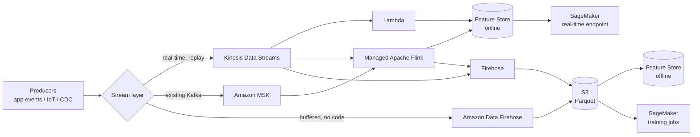
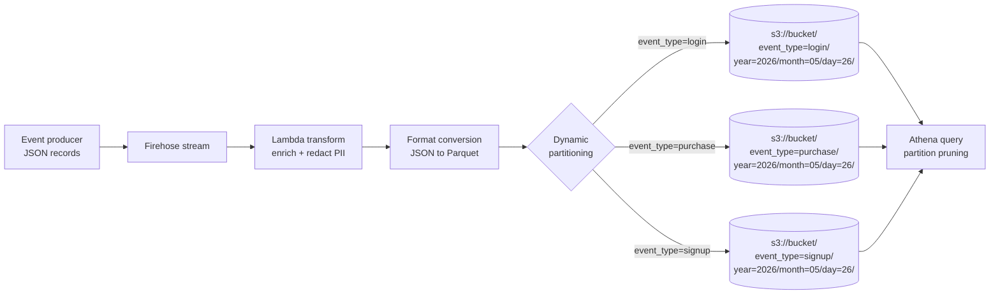
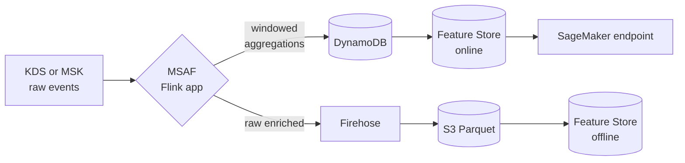
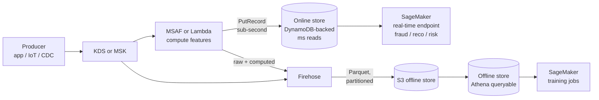
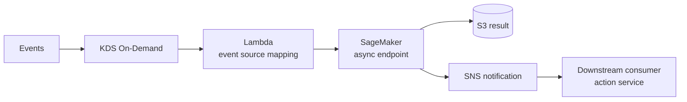

# Chapter 12 — Streaming Ingestion: Kinesis Data Streams, Data Firehose, MSAF, and MSK

> **Goal of this chapter.** Give you a complete working model of the four AWS streaming services the MLA-C01 exam puts in scope — Kinesis Data Streams (KDS), Amazon Data Firehose, Managed Service for Apache Flink (MSAF), and Amazon MSK — and the production patterns that wire them into SageMaker. By the end you should be able to read a scenario question, classify the latency/throughput/replay shape in fifteen seconds, and pick the right service plus the right downstream topology (Feature Store online vs. offline, real-time vs. async endpoint, Lambda vs. Flink for transformation) with no hesitation. This is the streaming chapter. Chapter 13 covers the orchestration glue (Lambda event-source mappings, Step Functions wiring, EventBridge rules) that sits around these services.

---

## 12.1 Why "real-time" is the question the exam keeps asking

Open the MLA-C01 Exam Guide to Task 1.1 and look at the streaming bullet:

> *"AWS streaming data sources (e.g., Amazon Kinesis, Apache Flink, Apache Kafka)."*

Then jump to Task 1.2:

> *"Services that transform streaming data (e.g., AWS Lambda, Spark)."*

Two bullets, four services, and an implied fifth (Spark, which usually maps to Glue Streaming or EMR Spark Structured Streaming). The exam will not ask you to write Flink Java, and it will not ask you to design a 50-broker MSK cluster from scratch. What it *will* ask, over and over, is a scenario question whose right answer reduces to a single judgment: **does this feature need to be fresh in seconds, minutes, or hours?** That single answer routes every streaming question.

| Freshness need | Typical pipeline | Right tool |
| --- | --- | --- |
| **Seconds** — fraud score on a live transaction, recommendation rerank on a click, ad bidder | Producer → KDS / MSK → MSAF or Lambda → Feature Store **online** → SageMaker endpoint | KDS / MSK + MSAF or Lambda |
| **Minutes** — dashboards, hourly anomaly batches, near-real-time log indexing | Producer → Firehose → S3 / OpenSearch | Firehose |
| **Hours / nightly** — model retraining on yesterday's data | Producer → Firehose (Parquet + dynamic partitioning) → S3 → Glue / Athena / SageMaker training | Firehose (offline) |
| **Replay needed** — re-run yesterday's events through a new model | KDS or MSK with multi-day retention; new consumer reads from earliest | KDS or MSK (**Firehose has no replay**) |

Two non-obvious exam patterns are worth memorizing before we dive into mechanics:

1. **"Real-time" on AWS often means *near*-real-time when Firehose is involved.** Firehose buffers for **at least 60 seconds** (S3 destination) before flushing. If the question says "sub-second latency" or "real-time inference," eliminate Firehose immediately, even if the marketing copy on the Firehose console says "real-time streaming."
2. **Streaming feature delivery to a Feature Store always has *two* sides** — a **synchronous online write** (Lambda or MSAF calling `PutRecord` on the online store) and an **asynchronous offline write** (Firehose → S3 → offline store, or the auto-sync mechanism from online to offline). Questions about preventing **training/serving skew** usually want both sides wired from the *same* stream by the *same* compute step.

The reason these two patterns matter so much is that the exam loves to put a Firehose distractor next to a KDS right answer (or vice versa), and it loves to test whether you understand that online and offline feature stores need to be fed from the same computation. We will return to both points repeatedly.



This is the universal diagram for AWS-native streaming ML. Every architecture in this chapter is a subset or a variation of it. Hold it in your head as we walk through each box individually.

A back-reference worth making explicit: **Chapter 3** established that an MLE is on the hook for the *system around* the model — the 95% that is not the algorithm. Streaming ingestion is the dominant slice of that 95% for any ML workload where decisions have to be made faster than once a day. Fraud, ad bidding, recommendations, anomaly detection, IoT alerting, real-time personalization — all of these are streaming problems first and modeling problems second. The cert tests this not because Flink Java is interesting (it isn't, on the exam) but because the *judgment* of picking the right pipe is what an MLE gets paid for.

---

## 12.2 Amazon Kinesis Data Streams (KDS)

### 12.2.1 What KDS is, in one paragraph

Kinesis Data Streams is a **real-time, ordered, replayable** record stream. Records are partitioned into **shards**. Producer-to-consumer latency is sub-second. Records are replayable for as long as 365 days. Think of it as the AWS-native equivalent of a Kafka topic, with simpler ops, fully managed scaling, and no Kafka wire protocol. If you know Kafka, KDS is "Kafka with the bits you don't want to operate yourself removed and a different API."

KDS is the *workhorse* stream for AWS-native ML pipelines. Roughly nine out of every ten streaming-feature pipelines the exam asks about have KDS in the middle of the diagram somewhere — either as the primary bus or as the source for Firehose or MSAF.

### 12.2.2 The terminology you must know cold

From the [official Kinesis Data Streams key concepts doc](https://docs.aws.amazon.com/streams/latest/dev/key-concepts.html):

| Term | Definition |
| --- | --- |
| **Data stream** | A set of shards. Each shard holds an independent sequence of data records. |
| **Data record** | Unit of data. Composed of a sequence number, a partition key, and a data **blob up to 1 MB** (raised to 10 MiB in October 2025 for the latest API surface). KDS does not inspect or change the blob. |
| **Shard** | A uniquely identified sequence of data records. A shard is the *fixed unit of capacity* — see throughput numbers below. |
| **Partition key** | Unicode string ≤ 256 chars. MD5-hashed to a 128-bit integer to map records to shards. |
| **Sequence number** | Per-shard ordering token assigned by KDS at `PutRecord` time. **Sequence numbers are per-shard, not global.** Do not use them as a global event index. |
| **Retention period** | Default 24 h, configurable from **24 h to 8,760 h (365 days)** via `IncreaseStreamRetentionPeriod`. Costs escalate beyond 24 h. |

A subtle gotcha that trips candidates: partition keys are **not** the same as Kafka keys in their hashing behavior. Kafka hashes the key directly; KDS MD5-hashes the partition key string, which means two strings that hash close in Kafka may hash far apart in KDS. Most of the time this doesn't matter. When it does — typically in hand-tuned co-location schemes — knowing the difference saves a day of debugging.

### 12.2.3 Shard throughput — memorize these numbers

A single shard provides, per the AWS docs verbatim:

- **Writes**: up to **1 MB/s** *and* **1,000 records/s** (including partition key bytes). Whichever limit you hit first throttles you.
- **Reads (shared fan-out)**: up to **2 MB/s** *and* **5 GetRecords transactions/s** — **shared across all consumers** on that shard.
- **Record blob max**: **1 MB** classically, raised to **10 MiB** in October 2025 for users on the new API.

Mental model: a sustained 10 MB/s write workload needs **at least 10 shards** in Provisioned mode. A sustained 10 MB/s write workload with three independent consumers reading the full stream needs **at least 10 shards plus enhanced fan-out** (or at least 15 shards if you stay on shared fan-out, because the three consumers will each fight for the same 2 MB/s read pipe per shard).

When a single shard goes hot — one customer's traffic surges to 1.2 MB/s while the others sit idle — the right answers, in priority order:

1. **Resharding** (split the hot shard). Manual on Provisioned mode; automatic on On-Demand mode.
2. **Better partition key design** — use a high-cardinality key (e.g., `userId`, `transactionId`) instead of a low-cardinality key (e.g., `region`, `merchant_category`). This is the most common exam right answer: when the question says "one shard is throttling, others idle," the answer is *almost always* "improve the partition key cardinality."
3. **KPL aggregation** — pack many logical records into one Kinesis record so you stop hitting the 1,000 records/s wall on each shard.

### 12.2.4 Capacity modes — Provisioned, On-Demand, and On-Demand Advantage

KDS has three capacity modes today, and the November 2025 introduction of **On-Demand Advantage** materially changed the cost calculus for steady-but-spiky workloads.

| Mode | Billing model | Scaling behavior | Best for | Released |
| --- | --- | --- | --- | --- |
| **Provisioned** | Per-shard-hour ($0.015/shard-hr in us-east-1) plus PUT payload units | Manual reshard, or wire your own auto-scaling with `UpdateShardCount` and CloudWatch | Predictable, steady throughput; team can model peak; mature ops | Original (2013) |
| **On-Demand (Standard)** | Per-GB ingested + per-GB retrieved | Automatic, doubles capacity in minutes | Unknown / variable workloads; greenfield streams; teams that don't want to do capacity planning | November 2021 GA |
| **On-Demand Advantage** | Per-GB ingested with a *committed throughput floor*, ~60% cheaper than On-Demand Standard at sustained throughput | Automatic; instant burst above the committed floor | **Consistent throughput with occasional spikes** — exactly the shape of most ML feature streams | **November 2025** |

**The exam shortcut.** "We don't know the throughput" → **On-Demand**. "It's steady at 8 MB/s, twelve months a year" → **Provisioned** (8 shards minimum, more for fan-out). "Consistent 50 MB/s with hourly spikes to 200 MB/s and many consumers" → **On-Demand Advantage**. The Advantage option will only be the right answer when the question explicitly mentions both *consistency* and *spikes* and (often) *many fan-out consumers*; otherwise plain On-Demand is the simpler right answer.

On-Demand Advantage also raises the **enhanced fan-out (EFO) consumer limit from 20 to 50 per stream** and makes EFO **free** instead of the per-GB upcharge. That second part is the one that quietly saves the most money for ML teams running a fraud consumer, a recommendations consumer, an audit consumer, and a Firehose archiver on the same stream simultaneously — historically each EFO consumer added a per-shard-hour fee plus per-GB delivered, and on the Advantage tier those go away.

⚠️ **Exam alert.** When a scenario says "we need many independent consumers all reading the full stream with low latency, on a workload that's predictable but occasionally spikes," the correct answer is now **KDS On-Demand Advantage with EFO**. Old study material that predates November 2025 will steer you toward "Provisioned with 50 EFO consumers" — that answer is now both more expensive and, depending on whether the practice exam was updated, may not even appear as an option. Trust the newer guidance.

### 12.2.5 Enhanced fan-out (EFO)

Default shared fan-out (the model you get if you do nothing special) means every consumer competes for that single 2 MB/s read budget per shard. If you have 5 consumers on a saturated shard, each effectively gets about 400 KB/s and reads on a polling cadence of roughly 200 ms.

**Enhanced fan-out** gives each registered consumer its own **dedicated 2 MB/s pipe per shard** via the `SubscribeToShard` HTTP/2 push API. End-to-end producer-to-consumer latency drops to about **70 ms**. EFO costs extra on Provisioned and On-Demand Standard (per-consumer-shard-hour plus per-GB delivered); it is **free on On-Demand Advantage**.

Use EFO when:

- You have **multiple consumers** on the same stream — typically a real-time scoring consumer, an offline-to-S3 consumer, an audit consumer, and perhaps a research consumer doing shadow scoring.
- You need **end-to-end latency under 100 ms** for at least one of the consumers.

⚠️ **Exam alert.** A classic exam trap pairs "shared fan-out" with "push" or "EFO" with "pull." The truth: **shared fan-out is pull (GetRecords polling, ~200 ms), EFO is push (SubscribeToShard HTTP/2 stream, ~70 ms).** If you see those terms reversed in an answer choice, eliminate it.

### 12.2.6 Producers and consumers — the library matrix

| Library | Language | When to use |
| --- | --- | --- |
| **`PutRecord` / `PutRecords` SDK** | Any AWS SDK | Low-volume producers, simple Lambda producers, infrequent batch upserts |
| **KPL (Kinesis Producer Library)** | Java natively; Python via the KPL daemon | High-throughput producers; **aggregates** many logical records into one Kinesis record to bypass the 1,000 records/s per-shard wall; automatic retries with exponential backoff; batching |
| **KCL (Kinesis Client Library)** | Java, Python, Node, .NET, Ruby | Consumer apps. **Checkpoints to DynamoDB** (per-shard cursor). Auto-rebalances workers when shards split or merge. Spawns one record processor per shard. |
| **Lambda event source mapping** | Any Lambda runtime | Easiest consumer to wire; batched by record count or by tumbling window; built-in retries with an on-failure destination (SQS or SNS) |

Three things KCL does for you that you would otherwise have to reinvent:

1. **Lease management** — coordinates which worker owns which shard, so multiple worker processes can split the stream without stepping on each other.
2. **Checkpointing** — saves "last processed sequence number" to **DynamoDB** so a crashed worker resumes where it left off when it restarts.
3. **Resharding awareness** — when a shard splits, KCL spawns processors for the children once the parent drains.

⚠️ **Exam alert.** A frequently-tested KCL detail: **KCL checkpoints to DynamoDB, not to S3 and not to Kinesis itself.** The common wrong answers are "S3" (that's Flink's checkpoint store) and "in the stream itself" (that's Kafka with `__consumer_offsets`, not KDS). If a question asks where KCL consumer offsets live, the right answer is **DynamoDB**.

### 12.2.7 KDS ML use cases worth memorizing

1. **Clickstream → real-time recommendation rerank.** Web tier `PutRecord` → KDS → Lambda → DynamoDB or Feature Store online → SageMaker endpoint reranks the served list before it goes back to the client.
2. **Real-time fraud detection.** Transactions → KDS → MSAF (computing a rolling 1-hour count of failed logins per user) → DynamoDB or Feature Store online → SageMaker fraud endpoint.
3. **Training-data capture with replay.** App events → KDS with 7-day retention → primary consumer (Firehose to S3 for offline storage) plus a secondary consumer (model-A/B shadow scorer that runs the candidate model alongside the production model). When you ship model v2, replay from `TRIM_HORIZON` to backtest a week's worth of traffic through the new model before promoting it.
4. **IoT anomaly detection.** Devices → KDS → MSAF anomaly detector → CloudWatch alarm or SNS notification → on-call.

A note on capacity bumps you may see in 2025 vintage exam questions or in production: **maximum record size was raised from 1 MiB to 10 MiB in October 2025** for the latest API surface, which is useful when you want to embed vectors, model-input snapshots, or larger Avro/Protobuf payloads directly in the stream. The catch is that PUT cost in Provisioned mode is still metered in 25 KB units, so a 9 MB record bills as 360 PUT units. On-Demand mode meters PUT in 1 KB units, which makes large records substantially cheaper per record but more expensive per byte. Plan for the billing math before you start pushing 5 MB records routinely.

---

## 12.3 Amazon Data Firehose (formerly Kinesis Data Firehose)

### 12.3.1 What Firehose is

A **fully managed delivery stream** that buffers and writes incoming records to a destination, optionally transforming them in flight. **No shards, no consumers to manage.** From the [official "What is Amazon Data Firehose"](https://docs.aws.amazon.com/firehose/latest/dev/what-is-this-service.html) doc:

> *"Amazon Data Firehose is a fully managed service for delivering real-time streaming data to destinations such as Amazon S3, Amazon Redshift, Amazon OpenSearch Service, Amazon OpenSearch Serverless, Splunk, Apache Iceberg Tables, and any custom HTTP endpoint or HTTP endpoints owned by supported third-party service providers, including Datadog, Dynatrace, LogicMonitor, MongoDB, New Relic, Coralogix, and Elastic."*

**Renamed in February 2024** from "Kinesis Data Firehose" to "Amazon Data Firehose." The exam may use either name; treat them as the same service.

The defining mental model: **Firehose is a pipe with a bucket attached at the source end.** It buffers everything that comes in, optionally runs a transformation, and writes the buffer to the destination when the buffer is full or when the time limit expires — whichever comes first. There is no replay, no fan-out, no consumer groups, no checkpoints. If you need any of those, you need KDS or MSK, not Firehose.

### 12.3.2 Sources (where data comes in)

- **Direct PUT** via `PutRecord` / `PutRecordBatch` REST API.
- **Kinesis Data Streams** (Firehose subscribes as a consumer).
- **Amazon MSK** (since 2023; native source).
- **CloudWatch Logs subscription filters** and CloudWatch Events.
- **AWS IoT** rules.
- **AWS WAF logs**.

### 12.3.3 Destinations (where data lands)

- **Amazon S3** — the most common destination. **Parquet/ORC conversion** and **dynamic partitioning** are available here and only here.
- **Amazon Redshift** — implemented as S3 staging plus an automated `COPY` command.
- **Amazon OpenSearch Service** and **OpenSearch Serverless** — for full-text search, log analytics, and (since vector engine GA) vector search ingest.
- **Splunk** and partner HTTP endpoints (Datadog, Dynatrace, MongoDB Atlas, New Relic, …).
- **Generic HTTP endpoint** — for any service that exposes a webhook.
- **Apache Iceberg tables** (2024) — direct Iceberg writes with auto-compaction. This is increasingly the right answer for "stream events into a lakehouse table that supports updates and time-travel queries."

### 12.3.4 Buffering — the "real-time vs. near-real-time" line

Firehose **buffers by size and by time, whichever comes first**:

| Destination | Buffer size range | Buffer interval range |
| --- | --- | --- |
| S3 | 1 – 128 MB | **60 – 900 s** |
| OpenSearch | 1 – 100 MB | 60 – 900 s |
| Splunk / HTTP | 1 – 64 MB | 60 – 900 s |
| Redshift | (via S3 stage) | (via S3 stage) |

**Implication for the exam**: Firehose is **at minimum 60 s behind the producer**, regardless of how you configure it. If a scenario says "sub-second latency" or "real-time inference," Firehose is wrong — pick KDS + Lambda or KDS + MSAF instead.

⚠️ **Exam alert.** This is the single most-tested distinction in the streaming domain. The marketing copy on the Firehose console says "real-time streaming," and exam questions are deliberately written to exploit that misreading. **The Firehose floor is 60 seconds.** If the scenario uses words like "sub-second," "real-time fraud decision," "in-flight feature update," "live recommendation rerank," or anything that implies a human (or downstream service) is waiting for the result — Firehose is the wrong answer.

### 12.3.5 In-flight transformations

Three transformation features ship with Firehose, all configured per stream:

1. **Lambda data transformation.** Firehose invokes your Lambda function once per buffered batch. The function returns a JSON list with `result: "Ok" | "Dropped" | "ProcessingFailed"` and the (possibly rewritten) record. Use Lambda transforms for enrichment with reference data, schema flattening, PII redaction, CloudWatch log JSON cleanup, or splitting one input record into many output records.
2. **Record format conversion — JSON → Parquet or ORC.** Firehose pulls the schema from the **AWS Glue Data Catalog**. It costs an extra per-GB conversion fee, but it gives you columnar storage that is immediately queryable by Athena, Redshift Spectrum, EMR, and SageMaker Processing/Training. **One of the most common right answers on the exam** when the question says "stream JSON to S3 in a format that's efficient for Athena queries" or "stream to a data lake for ML training."
3. **Dynamic partitioning.** Lets you templatize the S3 prefix using fields inside each record. Example: `s3://bucket/customer_id=!{partitionKeyFromQuery:customerId}/year=!{timestamp:yyyy}/month=!{timestamp:MM}/day=!{timestamp:dd}/` produces Hive-compatible partitions that Athena and Glue auto-discover. Requires enabling dynamic partitioning **at stream creation** (cannot be added later — a brutal limitation if you forget it) and slightly raises the per-GB cost.

Compression — GZIP, Snappy, Zip, Hadoop-snappy — is applied **after** transformation, immediately before delivery.



The diagram above is the *canonical* Firehose dynamic-partitioning topology, and it is the answer to roughly one in every five Firehose questions on the exam. Note that the partition keys (`event_type`) have **bounded, low cardinality** — dozens of distinct values, not millions. We will come back to why that matters in §12.3.8.

### 12.3.6 Pricing model (S3 destination, us-east-1, rounded)

- **$0.029/GB ingested** for the first 500 TB/month for KDS-source or MSK-source streams.
- **$0.075/GB ingested** for Direct PUT sources (this is the headline number that most teams quote).
- **+$0.018/GB** for record format conversion (JSON → Parquet/ORC).
- **+$0.020/GB** for dynamic partitioning, plus a per-partition object overhead.
- Lambda transform costs billed separately at standard Lambda invocation rates.

A 10 TB/day Direct-PUT clickstream with format conversion and dynamic partitioning runs about **$0.113/GB × 10,000 GB/day × 30 days ≈ $34,000/month**, before Lambda transform costs. That's bigger than the SageMaker endpoint that ingests the data in many cases. The cost is justified — you get columnar storage, partition pruning, and no consumer-side code to maintain — but model it before you ship.

### 12.3.7 KDS vs. Firehose — the side-by-side

| Dimension | KDS | Firehose |
| --- | --- | --- |
| End-to-end latency | Sub-second | **≥ 60 s** (buffer minimum) |
| Replay | Yes (24 h – 365 d) | **No** (pipe-through, no retention) |
| Consumers | You write them (KCL, Lambda, EFO push) | Managed destination, no consumer code |
| Sharding | Manual (Provisioned) or auto (On-Demand) | Fully managed, no shards |
| Format conversion | You write it | Built-in (Parquet/ORC via Glue Catalog) |
| Dynamic partitioning to S3 | You write it | Built-in |
| Cost shape | Per-shard-hour or per-GB | Per-GB delivered, layered fees |

**Exam heuristic.** "No code, just land it in S3 / Redshift / OpenSearch" → **Firehose**. "Sub-second," "need to replay," or "multiple custom consumers" → **KDS** (often with Firehose downstream as one of the consumers, doing the offline copy).

### 12.3.8 The dynamic partitioning trap (production lesson, exam relevant)

If your partition cardinality is high — say, you decide to partition by `user_id` for a B2C app with 5 million daily active users — you get **5 million tiny buffers**. Most of them never fill before the time limit hits, so every partition writes a sub-KB file every flush interval. You have engineered the **small-files problem worse** than no partitioning at all. Athena LIST costs explode, Glue Crawler runs become expensive, query performance collapses.

Production heuristics that also serve as exam guardrails:

- Partition cardinality should be **bounded and small** — `event_type` (dozens of values), `region` (a handful), `tenant_id` if you have hundreds. **Never `user_id`, `session_id`, or `transaction_id`.**
- Tune **buffer size to 128 MB** (the Firehose max for dynamic partitioning) when the downstream consumer is Athena or Spark, and **buffer interval to 900 s** (max). Bigger files, fewer files, cheaper queries, faster scans.
- Add time-based partition keys (`year`/`month`/`day`/`hour`) yourself — Firehose does *not* infer them from event time, it uses *delivery time* unless you extract event time with a jq expression or a Lambda transform.

### 12.3.9 Firehose ML use cases

1. **IoT JSON → Parquet on S3, partitioned by hour, queried by Athena for training.** Firehose with format conversion plus dynamic partitioning. The default right answer for "build a data lake from a streaming source."
2. **App logs → OpenSearch** for real-time anomaly search and log forensics. Buffered delivery, no Spark cluster needed.
3. **MSK → Iceberg table** for downstream Spark or SageMaker training. The 2024 Iceberg destination makes this a one-toggle integration.
4. **Inference request/response capture for ML monitoring** — Model Monitor data capture lands in S3; Firehose is the standard pattern for *high-volume* inference logging where the built-in capture would throttle. Forward-reference: **Chapter 48** covers Model Monitor in depth.

---

## 12.4 Amazon Managed Service for Apache Flink (MSAF)

### 12.4.1 What MSAF is, and why the rename matters

Managed Service for Apache Flink is exactly what the name says: a **managed Apache Flink runtime** with an AWS control plane. It was originally launched as **Amazon Kinesis Data Analytics for Apache Flink** and **renamed to MSAF in 2023**. You will still see "Kinesis Data Analytics" in older exam questions, study guides, and console screenshots — treat the two names as synonyms.

Why the rename? AWS wanted to make clear that the service supports much more than Kinesis as a source. MSAF reads from MSK, KDS, Kafka on EC2, S3, RDS, DynamoDB Streams, and any custom Flink connector you bundle. The "Kinesis Data Analytics" name had become misleading.

A related deprecation worth knowing: the SQL-only flavor of the original Kinesis Data Analytics service (no Flink, just streaming SQL on KDS) was discontinued. Today, MSAF means **Flink** — full stop.

From the [official "What is MSAF" doc](https://docs.aws.amazon.com/managed-flink/latest/java/what-is.html):

> *"Managed Service for Apache Flink provides the underlying infrastructure for your Apache Flink applications. It handles core capabilities like provisioning compute resources, AZ failover resilience, parallel computation, automatic scaling, and application backups (implemented as checkpoints and snapshots)."*

Two flavors:

- **MSAF Applications** — write Flink in **Java, Scala, or Python** (with embedded SQL) using the DataStream or Table API in your own IDE, package the app as a JAR or fat archive, deploy as a long-running application.
- **MSAF Studio** — interactive Apache Zeppelin notebook for **SQL, Python, Scala**. You write Flink SQL or PyFlink in cells against live data, iterate, and when you're ready, click "Deploy as application" to promote the notebook to a long-running production app.

### 12.4.2 Why Flink for ML

Flink earns its place in the ML toolbox by virtue of capabilities that Lambda, Glue Streaming, and DIY Spark Streaming either can't match or can only match with a lot of hand-rolled state management.

| Flink capability | Why it matters for ML |
| --- | --- |
| **Stateful event-time aggregations** | "Rolling 1-hour count of failed logins per user" — exactly the feature shape a fraud model needs, computed correctly even when events arrive out of order |
| **Exactly-once semantics on sinks** | No duplicate features written to the Feature Store, no double-counted aggregates, no training/serving skew caused by at-least-once delivery |
| **Event-time windows with watermarks** | Correct windowed results even when events arrive late by seconds or minutes |
| **CEP (complex event processing)** | Pattern matching: "3 logins in 60 s from 3 different countries" — the kind of derived feature you'd otherwise have to write yourself in stateful Java |
| **Async I/O** | Call SageMaker endpoints, DynamoDB, or external feature stores from within a Flink operator without blocking the stream pipeline |
| **Sub-second latency at billions of events/day** | Netflix runs ~2 trillion events/day across ~20,000 Flink jobs in production; the engine scales |

### 12.4.3 Which Flink API to pick

The Flink API surface, from low to high abstraction:

1. **Process Function** — fine-grained timers and state; used with DataStream.
2. **DataStream API** — full control over state, custom timers, async I/O. The right pick when you need to call SageMaker endpoints from inside the stream or use custom windowing semantics.
3. **Table API** — relational abstraction over DataStream.
4. **Flink SQL** — pure SQL; embeddable in any Flink application or used directly in MSAF Studio.

From the AWS doc:

> *"You should consider using the DataStream API if: you require fine-grained control over state; you want to leverage the ability to call an external database or endpoint asynchronously (for example for inference); you want to use custom timers; you want to be able to modify the flow of your application without resetting the state."*

For **online feature pipelines** that call SageMaker endpoints from inside the stream, pick the **DataStream API in Java or Scala**. Python DataStream has limited connector coverage; if you need low latency at high throughput, Java/Scala is the production-grade choice.

For **Studio-style democratization** — analysts writing real-time aggregations without learning Flink Java — **Flink SQL in MSAF Studio** is the right answer. Netflix demonstrated this at scale: by 2024 they had **1,200 SQL processors** running in production, written by teams *outside* the data-infra organization, because they wrapped the Flink Table API behind standard SQL. MSAF Studio is AWS's version of the same democratization play.

### 12.4.4 Pricing — KPUs

A **Kinesis Processing Unit (KPU)** is the MSAF billing unit: **1 vCPU + 4 GB RAM + 50 GB durable application storage**. Billing is per KPU-hour at roughly $0.11/hr in us-east-1, plus $0.10/GB-month for durable application backups (the checkpoints and snapshots).

Floor cost matters: a "small" continuously running MSAF Studio or Application uses 2–4 KPUs minimum, which is **$160–320/month** before any data charges. Studio notebooks bill **while running** — shut them down at the end of the day or you wake up to an $80/week bill for a notebook you forgot to stop.

This is why the right answer is sometimes Lambda + KDS even when Flink would technically be cleaner: for trivial transforms at low volume, Lambda's per-invocation pricing beats Flink's per-KPU-hour floor. The crossover happens around sustained 1 MB/s, which is roughly where Lambda invocations start to stack up and MSAF's continuous compute starts to win on cost.

### 12.4.5 Sources and sinks

MSAF supports KDS, MSK, Firehose (as a sink), S3, DynamoDB, OpenSearch, RDS, Redshift, self-managed Kafka, and any community Flink connector you bundle into your application's fat JAR. The common ML topology:



### 12.4.6 MSAF vs. Lambda for streaming — the comparison

| Capability | MSAF | Lambda + KDS |
| --- | --- | --- |
| Stateful across records | **Yes** — durable, checkpoints to S3 | No (you'd hand-roll state to DynamoDB) |
| Sub-second window evals over hours or days | **Yes** | No native windowing |
| Exactly-once | **Yes** | At-least-once |
| Per-record sub-second processing | Yes | Yes |
| Cost at very low volume | High (KPU floor) | **Lower** (per-invocation) |
| Cost at sustained > 1 MB/s | **Lower** | Higher (invocations stack up) |
| Max function runtime | Continuous (long-running app) | 15 minutes per invocation |
| Ops complexity | Higher (Flink mental model) | Lower (familiar Lambda model) |

**Exam heuristic.** Any time you see "windowed aggregation," "sessionization," "exactly-once," or "complex event processing" in a question → **MSAF**. Otherwise default to **Lambda**.

### 12.4.7 MSAF ML use cases

1. **Real-time feature aggregation for fraud** — Flink computes a 10-minute sliding-window aggregate (count, sum, distinct merchants) per card, emits to DynamoDB or directly to the Feature Store online table via Lambda + `PutRecord`, fraud endpoint consumes. The AWS reference architecture for *"Using streaming ingestion with Amazon SageMaker Feature Store"* uses exactly this pattern with two feature groups: a `cc-agg-batch-fg` group for weekly aggregates refreshed nightly from S3, and a `cc-agg-fg` group for 10-minute streaming aggregates refreshed continuously by Flink. The model then consumes the *ratio* of streaming-window value to batch-baseline ("this card just spent 4× its typical per-minute rate") rather than raw numbers.
2. **Sessionization of clickstream** for recommendation features — group clicks into sessions with a 30-minute inactivity timeout using Flink's native `SESSION` window:

   ```sql
   SELECT
       user_id,
       SESSION_START(event_time, INTERVAL '30' MINUTE) AS session_start,
       COUNT(*) AS event_count,
       COLLECT(page_id) AS pages_visited
   FROM clickstream
   GROUP BY user_id, SESSION(event_time, INTERVAL '30' MINUTE);
   ```

   Trying to do this in batch Glue/Athena is a multi-pass disaster. Trying to do it in a stateless Lambda is worse — you'd need to hand-roll the per-user open-session state in DynamoDB with TTL eviction.
3. **Pre-inference anomaly filtering** — skip the expensive ML scoring step for obviously-benign records (e.g., all-zero feature vectors, records from internal QA accounts). Flink filter operators handle this with single-digit-microsecond per-record latency.
4. **A/B traffic split for model variants** — route requests by hashed `userId` to one of two endpoints, capture both responses, compute KPIs in a windowed aggregation. Cleaner than doing it in the endpoint itself.

---

## 12.5 Amazon MSK (managed Apache Kafka on AWS)

### 12.5.1 What MSK is — and why the exam guide says "Apache Kafka"

The MLA-C01 knowledge bullet calls out **"Apache Kafka"** generically. The right AWS-native answer is almost always **Amazon MSK** (Managed Streaming for Apache Kafka). From the [official MSK developer guide](https://docs.aws.amazon.com/msk/latest/developerguide/what-is-msk.html):

> *"Amazon MSK is a fully managed service that enables you to build and run applications that use Apache Kafka to process streaming data … It runs open-source versions of Apache Kafka. This means existing applications, tooling, and plugins from partners and the Apache Kafka community are supported without requiring changes to application code."*

Translation: anything your team has already built on open-source Kafka (custom producers, Kafka Streams apps, Kafka Connect connectors, ksqlDB, Debezium CDC pipelines) **runs unchanged on MSK**. That is the *entire reason* MSK exists alongside KDS. KDS is the simpler, AWS-native, no-portability bus; MSK is the open-source-Kafka-with-AWS-management bus.

### 12.5.2 MSK Provisioned vs. MSK Serverless

| Mode | What you specify | Pricing shape | Best for |
| --- | --- | --- | --- |
| **MSK Provisioned** | Broker instance type (`kafka.m7g.large`, `kafka.t3.small`, or **Express brokers** since 2024 for up to 3× throughput per broker) + count per AZ + EBS volume size | Per-broker-hour + per-GB EBS storage | Predictable load, especially > 200 MB/s; need open-source Kafka features that aren't on Serverless (e.g., MirrorMaker replication, certain admin APIs, custom plugins) |
| **MSK Serverless** | Just topics and partitions; AWS manages brokers | $0.75/hr/cluster + $0.0015/hr/partition + $0.10/GB in & out | Variable or spiky load under 200 MB/s; lowest-ops Kafka |

MSK Provisioned offers two broker families today:

- **Standard brokers** — the original; flexible instance types across multiple families.
- **Express brokers** (2024+) — up to 3× throughput per broker, simpler scaling, optimized cost per MB/s. The default recommendation for new high-throughput clusters in 2025–2026.

### 12.5.3 ZooKeeper vs. KRaft

Older Kafka used Apache ZooKeeper for cluster metadata. **KRaft** (KIP-500) replaces ZooKeeper with Kafka-internal Raft controllers. MSK supports both modes; **new MSK clusters default to KRaft**. KRaft controllers are bundled at no extra cost — you don't pay for a separate ZooKeeper ensemble.

For the exam, KRaft vs. ZooKeeper rarely matters in a scenario question. The detail to know is just: MSK manages both, and KRaft is the default for new clusters.

### 12.5.4 IAM access control on MSK

Three auth modes:

- **IAM auth** (Kafka-IAM) — AWS-recommended; lets you use IAM policies as Kafka ACLs, so a Lambda or EC2 role can read or write specific topics without any Kafka password to rotate.
- **SASL/SCRAM** — username/password stored in Secrets Manager.
- **mTLS** — certificate-based client auth.

IAM auth is the right answer when an exam question says "least-privilege Kafka access from AWS principals" or "rotate credentials without restarting consumers."

### 12.5.5 MSK Connect

Managed **Apache Kafka Connect**. Run source and sink connectors (S3 sink, JDBC source/sink, **Debezium CDC** from RDS/Aurora, OpenSearch sink, Snowflake sink, …) without standing up a Kafka Connect cluster yourself. Charged per **MCU-hour** (Managed Connect Unit ≈ 1 vCPU + 4 GB).

Why MSK Connect matters for ML: **Debezium CDC into Kafka → Flink → Feature Store online** is the canonical pattern for "every row change in the operational DB instantly becomes a feature." MSK Connect makes the Debezium half trivial — you upload the Debezium plugin as a custom plugin zip to S3, register it with MSK Connect, and configure the source connector against your Aurora binlog. A working CDC pipeline that used to take weeks of ops work now takes hours.

The two operational gotchas worth knowing:

- **The Debezium plugin is not pre-installed.** You package and upload it yourself. There is an official [aws-samples/aws-msk-cdc-data-pipeline-with-debezium](https://github.com/aws-samples/aws-msk-cdc-data-pipeline-with-debezium) repo that templates the whole stack.
- **MSK Connect has no DLQ for connector failures by default.** A poison message will block the connector indefinitely. Configure a dead-letter topic explicitly.

### 12.5.6 MSK Replicator

Cross-region and cross-cluster replication, replacing self-managed MirrorMaker for most use cases. Use it for multi-region active-active stream topologies. On the exam, "multi-region Kafka" almost always means **MSK Provisioned + MSK Replicator**.

### 12.5.7 MSK vs. KDS — the exam table

| Pick MSK if | Pick KDS if |
| --- | --- |
| Existing Kafka producers/consumers in the org | Greenfield AWS-native; team doesn't know Kafka |
| Need Kafka ecosystem (Streams API, Connect, ksqlDB, Debezium) | Don't need Kafka API |
| Multi-region active-active via MirrorMaker or MSK Replicator | Want the simplest AWS-managed cross-region story |
| Open-source portability ("we might leave AWS one day") | Want lowest ops, AWS-only |
| Per-topic ACLs, complex consumer groups | Simple consumer model with KCL or Lambda |
| Sustained throughput > 40 MB/s where per-shard KDS billing gets expensive | Workload < 10 MB/s where MSK broker floor is wasteful |
| Retention > 365 days, or tiered storage to S3 | KDS 365-day max is enough |

### 12.5.8 The cost crossover rule of thumb

KDS Provisioned billing is roughly `$0.015/shard-hour` plus PUT payload units (`$0.014 per million units of 25 KB`). Each shard gives 1 MB/s in, 2 MB/s out. MSK Provisioned pricing is per-broker-hour by instance class plus EBS storage. For a workload steady at ~50 MB/s, KDS Provisioned needs ~50 shards (~$0.75/hr ≈ $550/month in shard-hours alone, before PUT units and EFO consumers). An equivalent 3-broker MSK `m7g.large` cluster runs $500–700/month with much more headroom.

**The equation flips at higher throughput**: MSK broker cost stays relatively fixed while KDS shard cost scales linearly with the bytes. Below ~10 MB/s KDS is clearly cheaper. Above ~40 MB/s sustained, MSK usually wins. In between, it depends on whether the workload is bursty enough to benefit from KDS On-Demand Advantage.

### 12.5.9 MSK ML use cases

- **Kafka → MSAF → online feature store** for high-throughput real-time scoring at firms that already speak Kafka.
- **Debezium CDC from RDS → MSK → ML training pipeline** that retrains only on changed rows, slashing data-availability latency. Pinterest published a CDC-based DB ingestion pattern that cut data freshness from 24 hours to 15 minutes at petabyte scale; the AWS analog is exactly this pipeline.
- **MSK Connect S3 sink** for offline feature offload — an alternative to Firehose when you already operate a Kafka cluster and don't want a separate Firehose stream.

---

## 12.6 Self-managed Apache Kafka on EC2 — when (and why) teams pick it over MSK

The exam guide says *"Apache Kafka"*. MSK is the right answer 95% of the time, but the exam may probe whether you understand **when self-managed Kafka is justified**.

Pick self-managed Kafka over MSK only when:

1. **You need a Kafka version MSK doesn't yet support.** MSK lags upstream Kafka by 1–2 minor versions, typically. If you need a brand-new KIP feature, you may be forced to roll your own.
2. **You need broker plugins MSK doesn't allow** — custom authorizers, custom rebalance protocols, non-standard wire-protocol extensions.
3. **You need extreme cost control at very large scale** where per-broker-hour pricing matters *and* you have the SRE staff to operate Kafka well. Below "very large scale," the labor cost of operating Kafka dominates any infrastructure savings.
4. **Multi-cloud Kafka** with identical configuration across AWS, GCP, and on-prem. MSK is AWS-only by definition.

For 95% of MLA-C01 scenarios — including essentially **all real-time ML feature pipelines** the exam puts in front of you — the right answer is **MSK** (Provisioned or Serverless), not self-managed Kafka. If a question explicitly stresses "we already run our own Kafka brokers on EC2 and don't want to migrate," then self-managed Kafka is the answer; otherwise, default to MSK.

---

## 12.7 Streaming → SageMaker Feature Store (the two-sided write pattern)

The SageMaker Feature Store has two stores — an **online store** (DynamoDB-backed, single-digit-ms reads, used at inference time) and an **offline store** (S3-backed, Athena-queryable, used for training). A streaming pipeline almost always writes to **both**, and it must write to both from the *same compute step* to prevent training/serving skew.



Three rules to memorize:

1. **Online writes are synchronous, via `PutRecord` to the online store API.** Latency is in the single-digit milliseconds.
2. **Offline writes are asynchronous.** The Feature Store handles offline-store sync automatically when you `PutRecord` to the online store, *but* for very high-volume streams it is cheaper and more predictable to write your own Parquet to S3 via Firehose and bypass the auto-sync.
3. **The same compute step writes both sides** — typically a Flink job or a Lambda — so the feature values stored offline (used for training) are byte-identical to the values stored online (used for inference). This is how you prevent **training/serving skew**, the silent killer that we will revisit when we walk Model Monitor in Chapter 48.

A subtle production pattern worth knowing: the AWS reference architecture for streaming features to the Feature Store often configures the streaming feature group as **online-only** (no offline mirror), because the offline copy comes from a parallel nightly batch path that processes the same S3-archived events. The split is — *streaming features online-only, batch features both* — and the model consumes both groups at inference time. This is the production norm at fraud-style use cases and is testable on the exam.

Forward-reference: **Chapter 19** covers the Feature Store in full depth, including the online/offline auto-sync mechanism, feature groups, time-to-live policies, and the IAM scoping for cross-account read access.

---

## 12.8 Streaming → SageMaker inference (real-time, async, serverless)

Three common topologies on the exam, each mapping to a different SageMaker endpoint type.

### 12.8.1 Per-record real-time inference

```
Event → KDS → Lambda (event source mapping) → InvokeEndpoint (real-time) → write decision back
```

Lambda triggered by KDS via event source mapping; per-record `InvokeEndpoint` on a SageMaker real-time endpoint; the inference output is written back to DynamoDB or onto another Kinesis stream. Use this pattern when **every event needs a fresh inference** and you're inside a sustained-traffic regime where a provisioned endpoint is cheaper than paying serverless cold-starts.

### 12.8.2 Async endpoint for slow models



Lambda enqueues the request to an async endpoint, returns immediately. The async endpoint runs inference (which may take seconds to minutes — large LLMs, video frames, audio clips, large embedding batches), then posts the result to S3 and notifies an SNS topic. SNS triggers the downstream consumer.

Use this when inference can take seconds to minutes per request, payloads can reach **1 GB**, and you want **auto-scaling to zero** when idle (real-time endpoints have a minimum instance count > 0; async can scale to zero). Forward-reference: **Chapter 38** walks async endpoints end-to-end.

### 12.8.3 Serverless endpoint for spiky low-volume

```
Event → KDS → Lambda → InvokeEndpoint (serverless) → caller
```

Serverless endpoints have cold starts (~1–2 seconds) but no per-hour cost when idle. Use them when streaming traffic is bursty enough that a provisioned endpoint would sit idle most of the time and the occasional cold-start latency is acceptable.

**Decision shortcut.** Sustained traffic → real-time endpoint. Inference > a few seconds, large payloads, or async-friendly callers → async endpoint. Spiky / low-volume / cold-start-tolerant → serverless endpoint.

---

## 12.9 Streaming ETL: the "transform data" angle from Task 1.2

Task 1.2 calls out *"Services that transform streaming data (e.g., AWS Lambda, Spark)."* The right answer depends on **where in the topology the transform lives**.

| Transform stage | Right tool | Why |
| --- | --- | --- |
| Per-record <KB enrichment *inside* Firehose | **Firehose Lambda transform** | Built-in; no separate pipeline; runs once per buffered batch |
| Per-record enrichment in a KDS pipeline | **Lambda** (event source mapping) | Cheapest at low-to-medium volume |
| Stateful windowed aggregation | **MSAF (Flink)** | The only practical stateful answer; Lambda has no native windowing |
| Heavy join with reference data (e.g., user-profile dimension table) | **MSAF**, Glue Streaming, or EMR Spark Structured Streaming | Needs a true streaming engine with broadcast joins |
| JSON → Parquet conversion before S3 landing | **Firehose format conversion** | One toggle, no code; cheapest by far |
| Schema-on-write validation | **Glue Schema Registry** with KDS or MSK producers | Enforces compatibility at producer time, rejecting bad records before they hit the stream |

A common exam trap: *"transform streaming data into Parquet for downstream Athena queries."* The lazy distractor is "Glue Streaming." The right answer is usually **Firehose with format conversion plus dynamic partitioning** — same outcome, no Spark cluster, no Glue job to maintain.

---

## 12.10 The decision matrix — memorize before the exam

| Scenario hint | Right answer |
| --- | --- |
| Sub-second latency, multiple custom consumers, need replay | **KDS** |
| Steady predictable throughput, cost-optimized | **KDS Provisioned** |
| Unknown or variable throughput, simplest ops | **KDS On-Demand** |
| Consistent throughput with bursts and many EFO consumers | **KDS On-Demand Advantage** (Nov 2025) |
| Buffered delivery to S3/Redshift/OpenSearch with no code | **Firehose** |
| JSON → Parquet at stream time | **Firehose format conversion** |
| Partition S3 by record fields automatically | **Firehose dynamic partitioning** |
| Stateful windowed aggregations, CEP, exactly-once | **MSAF (Flink)** |
| Existing Kafka producers/consumers, open-source portability | **MSK Provisioned** (or Serverless if variable) |
| Multi-region Kafka replication | **MSK Provisioned + MSK Replicator** |
| Debezium CDC from RDS into a stream | **MSK Connect + Debezium** |
| Per-record transform inside a Firehose pipeline | **Firehose Lambda transform** |
| Per-record transform in a KDS pipeline at low volume | **Lambda event source mapping** |
| Streaming feature → SageMaker real-time endpoint | **KDS → Lambda → InvokeEndpoint** |
| Streaming feature → Feature Store online + offline (no skew) | **KDS → MSAF → online `PutRecord` + Firehose → S3 offline** |
| Live video frames, in-store cameras, drone feeds | **Kinesis Video Streams + Rekognition Video** (out of MLA-C01 deep scope; useful trivia) |

### 12.10.1 At-a-glance latency, throughput, retention, cost

| Service | Typical latency | Throughput ceiling | Retention | Ops complexity | Cost shape |
| --- | --- | --- | --- | --- | --- |
| **KDS Provisioned** | <1 s | Shard count × 1 MB/s write | 24 h – 365 d | Medium (resharding) | Per-shard-hour |
| **KDS On-Demand** | <1 s | Auto, doubles in minutes | 24 h – 365 d | Low | Per-GB |
| **KDS On-Demand Advantage** | <1 s | Auto + committed floor | 24 h – 365 d | Low | Committed floor + per-GB above |
| **Firehose** | **≥ 60 s** (buffer) | Auto, no caps relevant to the exam | None (pipe-through) | Lowest | Per-GB delivered, layered fees |
| **MSAF** | <1 s | KPU-bound; scales horizontally | App state (S3 checkpoints) | High (Flink mental model) | Per-KPU-hour |
| **MSK Provisioned** | <1 s | Broker count × instance throughput | Topic-level retention (default 7 d, configurable to forever with tiered storage) | High (Kafka ops) | Per-broker-hour + EBS |
| **MSK Serverless** | <1 s | Auto, partition-bound | Topic-level | Low | Per-cluster + per-partition + per-GB |
| **Self-managed Kafka on EC2** | <1 s | Whatever you build | Topic-level | Highest | EC2 + EBS + your team |

---

## 12.11 Real-world architectures (so the exam patterns make sense)

The exam asks scenario questions because they mirror real production decisions. Knowing how the biggest streaming-ML shops actually run things makes the scenarios concrete.

### 12.11.1 Netflix — ~2 trillion events/day

Netflix processes roughly **2 trillion events per day** across Kafka, with about **20,000 Flink jobs** consuming those topics. Individual jobs sustain ~1M msg/sec per topic. The architectural takeaways relevant to AWS:

- **API Gateway is the producer.** Member actions (play, pause, rate, scroll) are emitted from the front-end into an API gateway, which publishes to Kafka — not directly from client to bus. This bounds blast radius for schema changes and gives you a single point to enforce auth.
- **Flink is the feature engine.** Member-graph edges, "what you watched in the last 30 minutes," and personalization context are computed by Flink and written to a serving graph store (Netflix's analog of the Feature Store online table).
- **Streaming SQL democratization.** Since 2023, Netflix has wrapped the Flink Table API behind standard SQL. Within a year, **1,200 SQL processors** were created by teams *outside* the data-infra org. This is exactly the bet MSAF Studio ships in AWS.

On AWS, the same pattern compiles to: **KDS or MSK → MSAF (Flink SQL) → Feature Store online → SageMaker endpoint for ranking → KDS results stream → app**.

### 12.11.2 Stripe — fraud, single-digit-ms decisions

Stripe does not publish full internals, but the public Capital One Kafka/Confluent-based fraud architecture is structurally identical, and AWS's own *"Using streaming ingestion with Amazon SageMaker Feature Store"* reference is the canonical AWS realization. The shape:

```
Card swipe / API call
    │
    ▼
Kafka topic  ──►  Flink job (1-min, 10-min, 24-hr sliding windows)
   │                  │ velocity counts, avg amount, distinct merchants
   │                  ▼
   │            Online feature store  (single-digit-ms reads)
   │                  │
   ▼                  ▼
Risk-scoring microservice ──►  SageMaker endpoint
    │
    ▼
approve / challenge / block  (≤ 200 ms p99 budget)
```

The decision (approve/challenge/block) is itself written back to Kafka so downstream training, audit, and case-management consumers see it. This is the **command/event-echo pattern**: log the prediction event back to the same bus, and you can reuse it to build training datasets that include the ground-truth outcome later (chargeback or no chargeback) joined back to the inference event.

### 12.11.3 Pinterest — CDC-powered ingestion

Pinterest's Flink platform powers ads spend reporting, "fast user signals" for ML personalization, trust & safety, and experimentation. Their **Unified Flink Source** lets the same Flink job seamlessly read S3 archives concatenated with the live Kafka tail — the "unlimited log" abstraction. Two Pinterest patterns worth knowing:

1. **Backfill = same pipeline as live.** When a feature engineer needs to re-derive a 90-day signal, they don't write a separate Spark job. They re-point the unified source at S3 and let the same Flink code emit. On AWS, you can approximate this by reading Kinesis-archived data via Firehose's S3 sink and the live KDS tail in one MSAF job using the Flink filesystem connector plus the Kinesis connector.
2. **CDC for offline → online.** Pinterest's CDC-based DB ingestion (Kafka + Flink + Iceberg) cut data-availability latency **from 24 hours to 15 minutes** at petabyte scale. AWS analog: **MSK Connect + Debezium → MSK → Flink → Iceberg on S3 → Athena/Glue/Redshift Spectrum**.

### 12.11.4 Tesla — fleet telemetry, multi-backend gateway

Tesla's open-source [`teslamotors/fleet-telemetry`](https://github.com/teslamotors/fleet-telemetry) reveals the IoT pattern. Vehicles open a mutual-TLS WebSocket, send Flatbuffers-encoded records, and a gateway dispatcher fans them out to **one of Kafka, Kinesis, Pub/Sub, MQTT, NATS, or ZMQ** — the choice is per-fleet, per-region, configurable. Topics are split as `*prefix*_V` (vehicle telemetry), `*prefix*_connectivity`, `*prefix*_alerts`.

Exam translation: when a question describes "vehicle telemetry from millions of devices, schema-flexible payloads, low-latency anomaly alerts, long-term storage in S3," the right answer is almost always:

- **MQTT/HTTP edge** → IoT Core or API Gateway
- → **KDS** (multiple consumers, replay) — not Firehose alone, because Firehose has no replay
- → **Firehose** branch for S3 archival
- → **MSAF/Flink** branch for windowed anomaly detection
- → **SNS/SQS** for alerts

---

## 12.12 Cost surprises — the design-review checklist

A real design review walks this checklist every time, and the exam tests several of these directly.

| Component | Common surprise | Mitigation |
| --- | --- | --- |
| KDS Provisioned shards | Over-provisioned after a spike, never scaled back down | On-Demand or On-Demand Advantage as the default |
| KDS PUT units | 25 KB rounding in Provisioned mode for small records | Aggregate at producer (KPL) or use On-Demand (1 KB rounding) |
| KDS EFO consumers | $0.015/shard-hour per consumer adds up fast | Reserve EFO for SLA-critical consumers; standard fan-out for the rest |
| Firehose Direct PUT | **5 KB rounding** per record kills IoT use cases (a 200-byte temperature reading bills as 5 KB) | Batch small records at the producer; or use KDS as the Firehose source |
| Firehose dynamic partitioning | High-cardinality partition keys → millions of tiny files | Bound cardinality to < 1000; tune buffer to 128 MB / 900 s |
| Firehose format conversion | Extra $0.018/GB on top of $0.075/GB Direct PUT ingestion | Worth it (Parquet saves 10× on Athena scans) but model the cost |
| Firehose Lambda transform | Output bytes are re-billed at ingestion rate if you enrich and double the payload | Filter/drop at source if possible; minimize enrichment |
| MSAF KPU hours | Studio notebooks bill while running | Shut down notebooks daily; right-size production apps |
| MSAF durable storage | $0.10/GB-month for snapshots and checkpoints | Tune state TTL aggressively; checkpoint less frequently |
| MSK broker hours | Even idle clusters bill | Use MSK Serverless for spiky workloads |
| MSK Connect MCUs | Per-connector overhead bills continuously | Consolidate connectors where possible |

### 12.12.1 The two classic KDS shard-scaling failure modes

**Under-provisioning.** Team launches a stream with 4 shards. Workload is 3 MB/s in (fine — 4 MB/s capacity). They add 5 standard consumers. Each consumer reads at 2 MB/s, but the **2 MB/s read budget is shared across all standard consumers on a shard** — so each consumer effectively gets 400 KB/s. Lag climbs, KCL workers throttle, alarms fire. Fix: switch to **enhanced fan-out** (or, on On-Demand Advantage, get EFO for free) so each consumer gets a dedicated pipe.

**Over-provisioning.** Team sees a Black Friday spike to 50 MB/s, panics, scales to 60 shards. Spike subsides; they never scale back. Stream sits at 5 MB/s average for 11 months on 60 shards. That is $0.015 × 60 × 24 × 30 = **$648/month in shard-hours alone** for a workload that needs 5 shards (~$54/month). 12× overpay. Fix: On-Demand mode by default for new streams; for Provisioned, wire your own Application Auto Scaling with custom CloudWatch alarms on `IncomingBytes` and `IncomingRecords` percent-of-limit metrics, because AWS does not provide built-in auto-scaling for KDS Provisioned.

---

## 12.13 Exam-trap distinctions — the highlight reel

1. **Firehose is "real-time" in marketing language but ≥ 60 s in practice.** When the question says "sub-second" or "real-time inference," eliminate Firehose.
2. **KDS On-Demand is not the same as Firehose.** They often appear together as wrong/right pairs. KDS On-Demand still gives you sub-second custom consumers and replay; Firehose gives you neither.
3. **MSAF replaced Kinesis Data Analytics** (the rename happened in 2023). You may still see "Kinesis Data Analytics" in older exam questions; treat them as the same service. The SQL-only flavor of KDA was deprecated; only the **Flink** flavor remains.
4. **Amazon Data Firehose** is the current name; **Kinesis Data Firehose** is the old name (renamed February 2024). Same service.
5. **Apache Kafka on AWS = Amazon MSK** for exam purposes unless the question explicitly says "running our own brokers on EC2."
6. **KCL checkpoints to DynamoDB.** Common wrong answer: "checkpoints to S3" (that's Flink's checkpoint store). Common right answer when a question asks where consumer offsets live: **DynamoDB**.
7. **EFO is per-consumer 2 MB/s push (~70 ms).** Shared fan-out is per-shard 2 MB/s pull (~200 ms). Many questions hinge on this single distinction.
8. **Partition-key design fixes hot shards.** When a question says "one shard is throttling, others are idle," the answer is "improve the partition key cardinality," not "add more shards."
9. **MSAF is the *only* AWS-native answer for stateful windowed streaming.** Lambda + KDS is stateless. Glue Streaming and EMR Spark Streaming also technically work, but on the exam MSAF is almost always the cleaner answer.
10. **Feature Store online + offline must be written from the *same* compute step** to avoid training/serving skew. That is why "KDS → MSAF → both stores in one job" is a recurring right answer.
11. **Firehose has no Lambda invocation triggers** in the KDS sense. It has Lambda *transformation*, which is invoked once per buffered batch *before delivery*, not once per record. If the question asks for per-record Lambda invocation on a stream, the answer is **KDS + Lambda event source mapping**, not Firehose.
12. **Firehose has no replay.** If the scenario requires replay, the answer is **KDS** (24 h – 365 d retention) or **MSK** (configurable, often days to forever with tiered storage).

Forward-reference: **Chapter 45** covers EventBridge as the AWS-native event-router that often sits in front of these streaming services for the "fan out to many downstream targets without each target subscribing to the stream directly" pattern. EventBridge is *not* a stream; it's a router. The exam tests the distinction.

---

## 12.14 Exercises

Work these by writing out the answer in your own words before checking it against the chapter. The goal is recall under exam conditions, not recognition.

### Exercise 1 — Latency triage

A fraud-detection team is building a system that scores credit card transactions in real time. The business requirement is "p99 decision latency under 200 ms from card swipe to approve/decline." The team is debating between three architectures:

- (A) Producer → Firehose → S3 → batch Spark job on EMR → DynamoDB → endpoint
- (B) Producer → KDS → Lambda event source mapping → InvokeEndpoint → DynamoDB
- (C) Producer → Firehose → Lambda transform → InvokeEndpoint → DynamoDB

Which architecture meets the latency requirement, and why are the other two wrong?

### Exercise 2 — Shard math

A stream is sustained at 12 MB/s of writes from a single producer. The team has three independent consumers: a real-time scoring Lambda, a Firehose archiver to S3, and an audit consumer running on EC2 with KCL. End-to-end consumer-to-data latency must be under 100 ms.

(a) What is the minimum number of shards in Provisioned mode?
(b) Should the team use shared fan-out or enhanced fan-out, and why?
(c) Would On-Demand Advantage make this cheaper than Provisioned? Under what additional condition?

### Exercise 3 — Hot shard

A KDS stream has 16 shards. CloudWatch shows that shard `shard-000004` is sustained at 950 KB/s of writes (close to the 1 MB/s limit) while the other 15 shards average 50 KB/s. The producer is using `merchant_category_code` as the partition key. What two changes would you propose, in priority order?

### Exercise 4 — KDS vs. Firehose vs. MSAF

For each scenario, pick the right service:

(a) "Land JSON click events in S3 as Parquet, partitioned by date, queryable by Athena. No consumer code allowed."
(b) "Compute a rolling 1-hour count of failed logins per user, with exactly-once semantics, and write the count to DynamoDB at sub-second latency."
(c) "Capture every transaction event and make it replayable for 7 days so we can backtest new fraud models."
(d) "Stream events from a Kafka cluster we already operate, with Kafka Streams apps unchanged."
(e) "Capture inference responses from a real-time SageMaker endpoint at 50,000 requests/second and land them in S3 for offline drift analysis."

### Exercise 5 — Feature Store wiring

Design a streaming pipeline that delivers fraud-detection features to the SageMaker Feature Store such that the *same* feature values are available at training time (offline store) and at inference time (online store), with no risk of training/serving skew. Specify:

- The bus (KDS, MSK, Firehose, or some combination).
- The compute step (Lambda or MSAF).
- The path from the compute step to the online store.
- The path from the compute step to the offline store.
- Why writing to both stores from the same compute step is essential.

### Exercise 6 — Cost surprise

A team runs a Firehose stream with Direct PUT, 200-byte IoT records arriving at 10,000 records/second, with dynamic partitioning by `device_id` (5 million unique devices), format conversion to Parquet, and a Lambda transform that enriches each record to 800 bytes. Identify at least three cost surprises in this design and propose mitigations.

### Exercise 7 — MSK vs. KDS judgment

A regulated bank is migrating an on-prem fraud system to AWS. The existing system uses Kafka Streams apps, Debezium CDC connectors against Oracle, and a Schema Registry. The team estimates sustained throughput at 80 MB/s with peaks to 200 MB/s and wants to keep the option of running the same code in a different cloud in the future. The streaming bus needs 30-day retention.

Should they choose MSK Provisioned, MSK Serverless, KDS On-Demand Advantage, or self-managed Kafka on EC2? Justify in 3–5 bullet points.

---

## 12.15 Where this chapter sits in the book

**Back-reference.** Chapter 3 established the MLE's responsibility surface: ingest, transform, validate, train, deploy, monitor, secure. This chapter is the streaming half of "ingest" and the streaming-specific half of "transform." When you see scenario questions that fold both verbs into one decision ("ingest sub-second AND compute a windowed feature"), they are streaming questions almost by definition.

**Forward references.**

- **Chapter 19 (SageMaker Feature Store)** picks up the online/offline-store mechanics, time-travel queries, feature group definition, and the auto-sync pipeline you can use as an alternative to writing your own Firehose offline path.
- **Chapter 38 (Async endpoints)** picks up the async-endpoint internals — input/output S3 paths, max payload, SNS notification, autoscaling-to-zero — that are gestured at in §12.8.2 above.
- **Chapter 45 (EventBridge)** picks up the event-router pattern. EventBridge is what sits *in front of* or *alongside* a stream when you need fan-out to many heterogeneous targets (Lambda, SNS, Step Functions, third-party SaaS) without each target subscribing to the stream directly.
- **Chapter 48 (Model Monitor)** picks up the drift-detection pipeline that consumes the offline-store side of the two-sided write pattern, computes drift baselines, and alarms when production features diverge.

---

## 12.16 Sources

- Kinesis Data Streams — Terminology and concepts: https://docs.aws.amazon.com/streams/latest/dev/key-concepts.html
- Amazon Data Firehose — What is Amazon Data Firehose: https://docs.aws.amazon.com/firehose/latest/dev/what-is-this-service.html
- Amazon Managed Service for Apache Flink — What is MSAF: https://docs.aws.amazon.com/managed-flink/latest/java/what-is.html
- Amazon MSK — Developer Guide overview: https://docs.aws.amazon.com/msk/latest/developerguide/what-is-msk.html
- AWS Big Data Blog — *Kinesis On-Demand Advantage saves 60%+ on streaming costs* (November 2025).
- AWS Big Data Blog — *Amazon Data Firehose now supports dynamic partitioning to Amazon S3*.
- AWS ML Blog — *Using streaming ingestion with Amazon SageMaker Feature Store to make ML-backed decisions in near-real time*.
- AWS Architecture Blog — *Real-Time In-Stream Inference with AWS Kinesis, SageMaker, and Apache Flink*.
- Netflix Tech Blog — *How and Why Netflix Built a Real-Time Distributed Graph* (October 2025).
- Pinterest Engineering — *Unified Flink Source at Pinterest: Streaming Data Processing*.
- InfoQ — *Pinterest's CDC-Powered Ingestion Slashes Database Latency from 24 Hours to 15 Minutes* (February 2026).
- Tesla — `fleet-telemetry` (GitHub).
- Kai Waehner — *Tesla Energy Platform: The Power of Data Streaming with Apache Kafka* (February 2025).
- AWS Samples — `aws-msk-cdc-data-pipeline-with-debezium` (GitHub).
- AWS Whitepaper — *Build Modern Data Streaming Analytics Architectures on AWS — Key Considerations*.
- Phase 1 research notes — `research_inputs/14_aws_ml_engineer_associate/notes/ch12_docs.md` (AWS-doc exam mechanics) and `notes/ch12_practice.md` (industry-practice patterns, cost surprises, real-world case studies).
