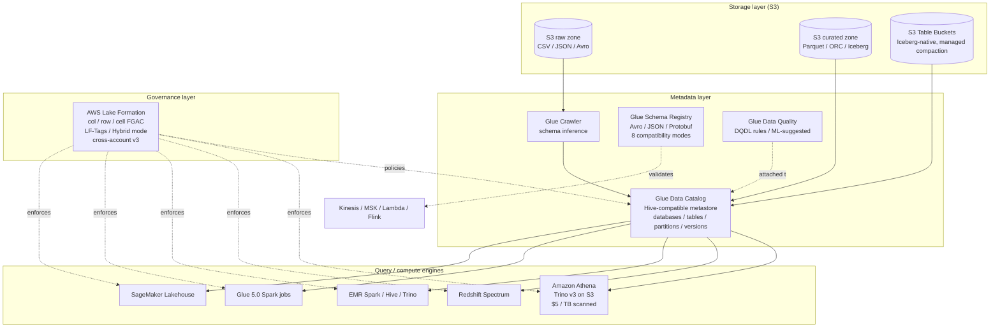
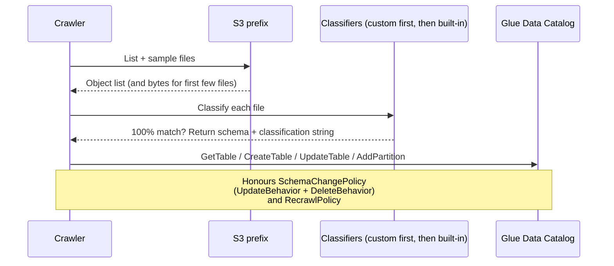
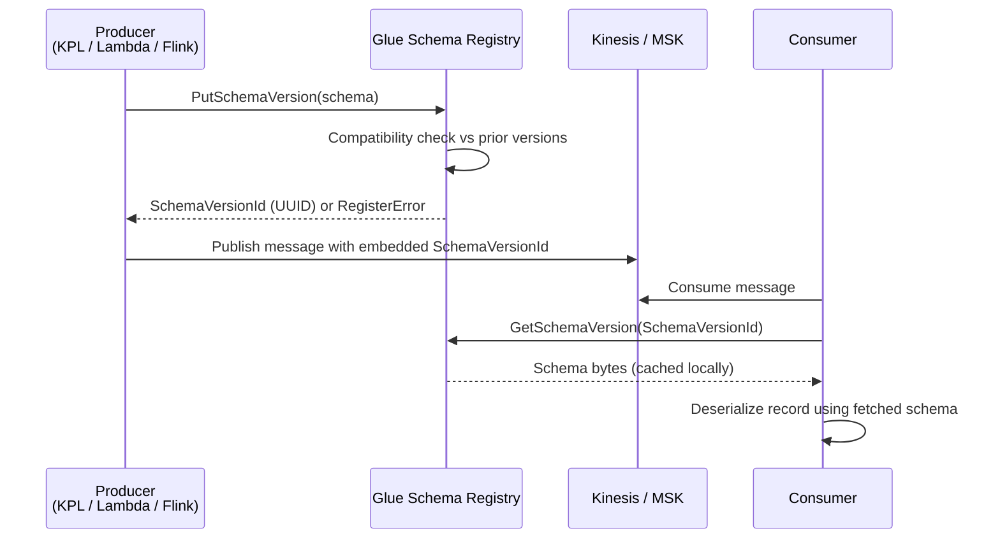
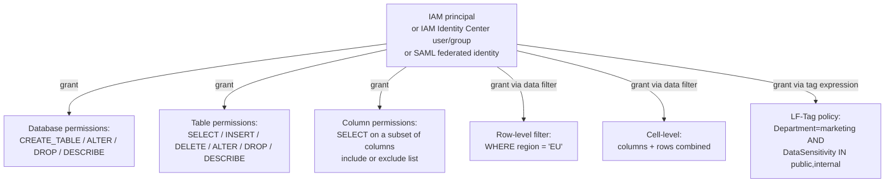
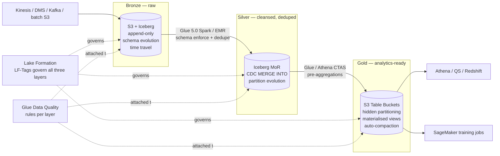

# Chapter 13 — AWS Glue Catalog, Athena, Lake Formation

> **Goal of this chapter:** to install in your head the three-service trio that turns Amazon S3 from a bucket of opaque files into a **governed, queryable, schema-versioned lakehouse**. The trio is **metadata** (AWS Glue Data Catalog plus its supporting cast of Crawlers, Schema Registry, and Data Quality), **query** (Amazon Athena — serverless Trino on S3), and **governance** (AWS Lake Formation — column, row, and cell-level access control). Every Domain 1 question on the MLA-C01 — and a meaningful fraction of Domain 4's security questions — implicitly assumes you know which of these services owns which decision. By the end of this chapter you should be able to look at a scenario like *"a data scientist needs read access to a fact table but must not see the SSN column"* and instantly answer *"Lake Formation column-level grant, not an IAM bucket policy"* — without having to derive the answer from first principles.

---

## 13.1 Why this chapter exists: the metadata/query/governance trio

The MLA-C01 exam guide repeats the phrase "Amazon S3" so often that a casual reader might think the data-prep domain is mostly about uploading files. It is not. Look at the actual question shapes that recur across released sample questions:

- *"A data scientist needs read access to a fact table but must not see the `ssn` column."* — Lake Formation column-level grant, not an IAM bucket policy. IAM operates at the **object** granularity; Parquet files do not have a "column the IAM principal can read" concept. Only a query engine that understands the schema can filter columns.
- *"Convert nightly JSON ingests to columnar format for SageMaker training while minimising scan cost."* — Athena `CREATE TABLE AS SELECT` (CTAS) with `format='PARQUET'`, `partitioned_by=ARRAY['dt']`. One SQL statement, billed at $5/TB scanned, producing a downstream table that future training jobs scan at 1–10% of the JSON cost.
- *"A streaming pipeline writes records with an evolving schema; downstream consumers must not break when a producer adds a field."* — Glue Schema Registry with `BACKWARD` compatibility. New optional fields are added; older consumers ignore them.
- *"Detect when a feature distribution drifts before training kicks off."* — Glue Data Quality DQDL rules in the ingest job, gating a SageMaker Pipeline step on a CloudWatch alarm.

Each of those answers is a feature of the Glue/Athena/Lake Formation stack. By the time the model trainer sees the data, the trio has already pre-decided **what tables exist** (Catalog), **what schema and quality contract they obey** (Schema Registry + Data Quality), **who is allowed to read which columns and rows** (Lake Formation), and **how cheap it is to scan them** (Athena partition pruning + Parquet conversion). The MLE owns this stack just as surely as they own the endpoint.

This chapter sits in Part C alongside Chapter 11 (S3) and Chapter 14 (EMR for big-data ML — see [`14_emr_for_ml.md`](14_emr_for_ml.md)). It cross-links forward to Chapter 19 (SageMaker Feature Store — offline store on S3 in Iceberg, governed by Lake Formation) and Chapter 21 (Glue Data Quality reappears as the upstream half of the bias and drift detection story). It cross-links back to Chapter 5 (IAM — Lake Formation does not replace IAM, it sits on top of it) and Chapter 6 (S3 — the Catalog is metadata for S3 objects).

⚠️ **Exam alert.** If a question contains the phrase *"least-privilege access to a column"* or *"row-level security on a shared table"*, the answer is almost always Lake Formation, never an IAM policy. The single most common wrong answer the exam offers is *"craft an IAM bucket policy that grants `s3:GetObject` only to the prefix containing non-PII columns"* — there is no such prefix; columns live inside Parquet files, not on the bucket layout.

---

## 13.2 The big-picture diagram



**Reading rule.** The Catalog is the centre. Everything either *populates* it (Crawlers, registries, manual DDL), *consumes* it (Athena, Spectrum, EMR, Glue ETL, SageMaker), or *governs* it (Lake Formation). When the exam asks "where do I attach the X?" the answer is almost always "to the table object in the Glue Data Catalog."

---

## 13.3 AWS Glue Data Catalog — the Hive-compatible metastore

### 13.3.1 What it is

The **AWS Glue Data Catalog** is a persistent, fully-managed, **Apache Hive Metastore–compatible** metadata store. It tracks *where* your data lives (the S3 path, JDBC URI, or third-party connector endpoint), *what* its schema is, *how* it is partitioned, and *who* registered it. The Catalog does not store the data itself — the data stays in the source system (S3, RDS, Redshift, DynamoDB, an external SaaS) — only the metadata pointers to it.

Three structural facts:

1. **One Catalog per AWS account per Region by default.** A `us-east-1` Catalog and a `us-west-2` Catalog are independent; nothing automatically syncs.
2. **Hive-compatible** means any Spark/Presto/Trino/Hive client that speaks the Hive Metastore wire protocol can read the Catalog directly. No rewrites for migrated workloads.
3. **Pricing** is essentially free at typical ML-team scale: the first 1,000,000 objects per month is free; ~$1 per 100,000 additional objects per month; ~$1 per million metadata requests.

In late 2024, AWS launched **SageMaker Lakehouse** — in implementation, the Glue Catalog with Iceberg-first semantics and a Unified Studio re-skin. Every Iceberg table registered in the Catalog is automatically a Lakehouse table. When an exam question says *"the team uses SageMaker Lakehouse"*, mentally translate it to *"Glue Catalog plus Iceberg plus Lake Formation."*

### 13.3.2 Hierarchy

The Catalog uses a three-level hierarchy that maps cleanly onto Hive and SQL conventions:

```
Catalog (per account per region)
└── Database (namespace, e.g., "fraud_features")
    └── Table (e.g., "transactions_parquet")
        ├── StorageDescriptor (location, format, SerDe, columns)
        ├── PartitionKeys (e.g., year, month, day)
        ├── Partitions (one entry per partition-value combination)
        ├── TableVersions (every CREATE / ALTER bumps a version)
        └── Parameters (free-form key/value, e.g., classification=parquet)
```

| Object | What it pins | ML relevance |
| --- | --- | --- |
| **Database** | Logical namespace; useful for IAM and LF grants at folder granularity | One per team or per environment (`fraud_dev`, `fraud_prod`) |
| **Table** | Schema + location + format + SerDe | The unit Athena, Spectrum, EMR, and Glue ETL query |
| **Partition** | A subdirectory under the table location with column-value filters baked into the path | Partition pruning is *the* primary Athena cost lever |
| **TableVersion** | Immutable history of schema changes | Audit trail for reproducible training ("which schema was the model trained on?") |
| **Parameters** | Free metadata | `classification=parquet`, `compressionType=snappy`, `glue.checkpointing.enabled=true` |

The mental picture worth holding: **a Catalog table is a logical contract**, not a file. The same physical Parquet file in S3 can be exposed by multiple tables (different schemas, different SerDes, different governance) — and the same table can point at thousands of physical files spread across hundreds of partition prefixes.

### 13.3.3 Partitions — the cost lever

A table partitioned by `dt=2026-05-26/` lets Athena read only the matching folder when the query filters `WHERE dt='2026-05-26'`. Without partitions, every query reads the whole table. Two refinements deserve highlighting because they show up in exam scenarios:

- **Partition projection** (Athena-specific, since 2020). Instead of registering each partition individually in the Catalog — slow when you have millions, and a `MSCK REPAIR TABLE` after each new day is operational toil — you declare a *pattern* in the table properties: `projection.dt.type=date`, `projection.dt.range=2020-01-01,NOW`, `projection.dt.format=yyyy-MM-dd`. Athena infers the partition layout on the fly without consulting the Catalog. Query planning drops from minutes to milliseconds on tables with millions of partitions.
- **Partition indexes** (Glue Catalog feature). Secondary indexes on partition values for tables with more than ~10,000 partitions. Speeds up the `GetPartitions` API calls that Athena, Spectrum, and EMR all issue at query-planning time. Enabled per-table on the Catalog.

If you remember nothing else: **partitioning by the column you filter on most often is the single highest-ROI thing you can do for an Athena bill.** Section 13.7.3 walks through the *$45,000-per-month-to-$150-per-month* customer case study driven by exactly this lever.

### 13.3.4 Table versions and schema evolution

Every `ALTER TABLE` — and every Crawler run that detects drift and decides to update the table — creates a new **TableVersion**. The full history is queryable through `GetTableVersions`. This is the audit anchor for the regulator's question *"what columns did this table have on 2026-03-15 when the model that produced this loan denial was trained?"*

For Iceberg tables the story is richer: Iceberg's manifest files carry the table schema *inline*, and Iceberg uses internal column IDs rather than names, so renaming is metadata-only. Time travel — `SELECT … FOR VERSION AS OF` or `FOR TIMESTAMP AS OF` — lets you reproduce a training query as it would have looked on any historical date. Chapter 19 leans heavily on this for the Feature Store offline store.

### 13.3.5 Glue Connections and SageMaker Lakehouse federation

A **Glue Connection** is a credential bundle plus optional VPC configuration for non-S3 sources: JDBC databases (Postgres, MySQL, Snowflake, MongoDB, SAP HANA, BigQuery), streaming (Kafka, MSK), DocumentDB, and dozens of SaaS connectors. Connections are referenced by Crawlers, Glue Jobs, and Athena federated connectors.

**SageMaker Lakehouse** (re:Invent 2024, GA mid-2025) adds multi-level **federated catalog** support: a single Lakehouse catalog can mount foreign Glue Catalogs in other accounts, Redshift namespaces, external Iceberg REST endpoints (Snowflake Polaris, Databricks Unity), and S3 Table Buckets as sub-catalogs. For the exam: assume "SageMaker Lakehouse" and "Glue Data Catalog with Iceberg" are interchangeable.

---

## 13.4 AWS Glue Crawlers — automated schema inference

### 13.4.1 What a Crawler does

A Crawler is a managed component that points at a data store, **walks the prefix tree**, runs **classifiers** to guess each file's format and schema, and **writes or updates table definitions** in the Catalog. It is the lazy-engineer's `CREATE TABLE`. The high-level workflow:



### 13.4.2 Built-in classifiers

Glue ships classifiers for: CSV (with delimiter inference), JSON (including nested), Avro, Parquet, ORC, XML, Ion, log formats (Apache, Linux kernel, CloudFront, ELB), Excel (`.xlsx`), and many JDBC engines (Postgres, MySQL, SQL Server, Oracle). You can also write **custom classifiers** using a Grok pattern, a JSON path, or an XML row tag — handy for proprietary log formats.

The Crawler tries classifiers in **priority order** — your custom ones first, then the built-ins — and stops at the first 100% confidence match. If no classifier matches at 100%, the Crawler falls back to a `UNKNOWN` classification and creates a table with no schema; you'll see this surface as an Athena `HIVE_CANNOT_OPEN_SPLIT` error at query time.

### 13.4.3 Schema-change behaviour — the exam-trap settings

Each Crawler has a **SchemaChangePolicy** with two knobs, and a **RecrawlPolicy** with one. These are the most commonly mis-configured settings on the entire service and the exam tests them directly.

| Setting | Values | Default | Effect |
| --- | --- | --- | --- |
| **UpdateBehavior** | `UPDATE_IN_DATABASE` / `LOG` | `UPDATE_IN_DATABASE` | If schema changes, either rewrite the table definition (default) or just log the diff without changing the Catalog |
| **DeleteBehavior** | `DELETE_FROM_DATABASE` / `LOG` / `DEPRECATE_IN_DATABASE` | `DEPRECATE_IN_DATABASE` | If a partition or table no longer exists on S3, either delete the metadata, log it, or mark it `deprecated=true` |

| RecrawlPolicy value | Behaviour | When to use |
| --- | --- | --- |
| `CRAWL_EVERYTHING` | Re-scan the whole prefix every run | First crawl or after major restructuring |
| `CRAWL_NEW_FOLDERS_ONLY` | Only scan new partition folders | Daily / hourly partitioned ingests — much cheaper |
| `CRAWL_EVENT_MODE` | Triggered by S3 EventBridge events for specific paths | Near-real-time catalog updates without polling |

⚠️ **Exam alert.** The classic trap: *"a new column appeared in source files but it's not showing up in Athena."* Three plausible causes, in decreasing order of likelihood: (1) the Crawler's `UpdateBehavior` is `LOG` (not `UPDATE_IN_DATABASE`), so the Crawler saw the new column and wrote it to the Glue logs but did not update the Catalog; (2) the Crawler simply hasn't run since the column appeared; (3) the table was created manually with explicit DDL, so the Crawler skipped it (Crawlers will not overwrite a table they didn't create unless explicitly configured to). The most common right answer is the first.

### 13.4.4 Crawler economics — when to ditch them

Crawlers bill at the standard Glue rate: **$0.44 per DPU-hour with a 10-minute minimum charge per crawl**, then per-second after. The math has bite at frequency:

- A Crawler completing in 30 seconds still costs ~$0.15 (10 min × 2 DPU × $0.44 / 60).
- An hourly Crawler costs **~$108 per month per dataset**.
- Multiply by 50 datasets: **$5,400 per month** purely on metadata discovery, while the Catalog itself is essentially free at that scale.

This is the economic reason mature teams ditch Crawlers and move to explicit DDL. Four other reasons:

1. **Schema conflicts on heterogeneous files** — a folder of CSVs with slightly different columns spawns multiple tables; the Crawler's grouping guess is sometimes wrong.
2. **Crawler overwrites human edits** — comments, custom partition projection settings, manually adjusted types get clobbered.
3. **Schema-evolution semantics opaque** — the Crawler decides to add a column, change a type, or fork a table; the decision is not obvious from logs.
4. **Iceberg makes Crawlers redundant** — Iceberg manifests carry the schema inline; the producing job already registers the table.

The explicit-DDL pattern in a Glue 5.0 job:

```python
df = spark.read.parquet(input_path)
df.write.mode("append").format("parquet").partitionBy("dt") \
  .option("path", output_path).saveAsTable("silver_db.orders")

# Iceberg path — schema evolution metadata-only and intentional
df.writeTo("glue_catalog.silver_db.orders").append()
```

With `enableUpdateCatalog=True`, the producer owns the schema **in code, in version control** — not a Crawler running on a cron in another team's part of the org. For static dimension tables, write the DDL once in Terraform / CDK and never run a Crawler.

⚠️ **Exam alert.** When the scenario describes Iceberg or Delta tables, the right answer is *almost never* "configure a Glue Crawler." Iceberg and Delta self-register through engine writes; a Crawler on top is a documented anti-pattern. AWS recommends `CREATE TABLE … USING ICEBERG`.

Crawlers still make sense for three situations: **discovery mode** on a landing zone with unknown formats, **partition discovery** for legacy Hive tables not yet migrated, and **schema-drift auditing** (weekly run with `UpdateBehavior=LOG`, diff against expected schema in version control).

---

## 13.5 AWS Glue Schema Registry — streaming schema versioning

### 13.5.1 What it is

A centralised registry for **Avro, JSON Schema, and Protobuf** schemas used by streaming producers and consumers. Conceptually similar to Confluent Schema Registry but native to AWS and integrated with **Amazon Kinesis Data Streams, Amazon MSK, Amazon Managed Service for Apache Flink, and AWS Lambda**. It exists for one reason: to enforce that producers and consumers of a stream agree on the wire format, even as that format evolves over months and years.

### 13.5.2 The flow



The producer encodes a **SchemaVersionId** into each record (a few extra bytes of header). The consumer reads that ID, looks up the schema in the registry, and uses it to deserialize the record. Both sides cache aggressively — the registry is *not* in the per-record hot path, only on cold-start and on schema-change.

### 13.5.3 The eight compatibility modes

When a producer registers a new schema version, the registry enforces a **compatibility check** against earlier versions of that schema. The mode is set per-schema, and the choice is the gatekeeper for whether evolving producers break older consumers (or vice versa). Memorise this table — exam questions on streaming schema evolution almost always reduce to "which mode?"

| Mode | New version may… | Use case |
| --- | --- | --- |
| **NONE** | Anything | Dev-only; you accept that consumers will break |
| **DISABLED** | Anything (no check) | Same as NONE; explicitly turn off |
| **BACKWARD** | …add optional fields, drop optional fields. **New consumer reads old data.** | Default for most production pipelines |
| **BACKWARD_ALL** | Same as BACKWARD but checked against *all* prior versions, not just latest | Long retention streams |
| **FORWARD** | …add optional fields, can't drop required. **Old consumer reads new data.** | Producer rolls out faster than consumer |
| **FORWARD_ALL** | FORWARD vs all prior versions | Same with long history |
| **FULL** | Both BACKWARD and FORWARD vs latest | Old consumers read new, new consumers read old |
| **FULL_ALL** | FULL vs all prior versions | Strictest — exam's "safest evolving schema" answer |

**Exam tip.** When the question says *"consumers must not break when the producer adds a new optional field"* → **BACKWARD** is sufficient (new schema is readable by old consumers because the new field is optional and ignored). When it says *"old data must remain readable forever AND new fields can be added safely"* → **FULL_ALL**. When it says *"the producer rolls out before the consumer"* → **FORWARD**.

### 13.5.4 Where the registry is enforced and pricing

Enforcement points: **Kinesis Data Streams** (KPL/KCL native serializers), **Amazon MSK** (Apache Kafka clients via `GlueSchemaRegistryKafkaSerializer`), **Amazon Managed Service for Apache Flink** (built-in `GlueSchemaRegistryAvroSerializationSchema`), and **AWS Lambda** event source mappings (KDS, MSK) for pre-invocation validation.

Pricing: first million schema versions free per account-month, then $1.00 per million additional. Reads are free. **No per-message cost** — that's the entire point of caching schema by ID rather than embedding it in each record.

---

## 13.6 Amazon Athena — serverless SQL on S3

### 13.6.1 What it is

Athena is a serverless interactive query service that runs **ANSI SQL** against data in Amazon S3 (and federated sources). The SQL engine is **Trino** (the open-source fork of Presto). The current engine is **version 3**, which adds Iceberg ACID writes, Delta Lake reads, full CTAS support, and improved cost-based optimisation. There is also **Athena for Apache Spark** for notebook-style ETL — same workgroup model, but billed per DPU-hour rather than per TB scanned.

You write a SQL statement; Athena reads the matching files from S3 (using the Glue Catalog metadata to know which files); computes the result; and writes it to your **query result location** (an S3 bucket you specify).

### 13.6.2 Pricing — the partition-pruning forcing function

The pricing model in one line: **$5 per TB of data scanned**, rounded up to the nearest MB per query, with a 10 MB minimum per query. DDL (`CREATE TABLE`, `ALTER`, `DROP`) is free; failed and cancelled queries don't bill. Athena Spark is per-DPU-hour, billed separately from SQL.

The two scary clauses inside that simple sentence:

- *"data scanned"* means **bytes read from S3**, not bytes returned to the client. A `SELECT COUNT(*) FROM huge_csv_table` scans the entire table even though it returns a single integer.
- *"per TB"* sounds cheap on a single query and ruinous in aggregate. A team running 1,000 unpartitioned queries per day that each scan 1 TB burns **$150,000 per month** without doing anything wrong.

The five cost levers, ordered by typical ROI:

1. **Partition the table** by frequently-filtered columns (date, region). 10–100× scan reduction is the common range.
2. **Convert to columnar** (Parquet / ORC) with Snappy or ZSTD compression. 3–10× scan reduction; the columnar engine reads only the projected columns.
3. **Compress** even row-based formats (gzip / bzip2 on CSV/JSON). 2–5×.
4. **Use `SELECT col1, col2`** rather than `SELECT *` on columnar tables. Athena pushes the projection down to S3 reads.
5. **Set per-query and per-workgroup data-scanned limits.** A bad full-scan can't bankrupt you if the workgroup ceiling kills it at 1 TB.

⚠️ **Exam alert.** When the scenario says *"convert raw JSON to a format that minimises Athena scan cost"*, the answer combines **CTAS to Parquet with Snappy compression, partitioned by the most common filter column.** Compression alone is not enough; partitioning alone is not enough; both are required for the 99% bill reduction.

### 13.6.3 Workgroups

Workgroups are the cost-allocation, IAM-isolation, and engine-pinning primitive. Each workgroup has:

- A **query result location** (S3 path) with optional encryption (SSE-S3, SSE-KMS, CSE-KMS).
- A **data usage limit** per query and per workgroup per time period; queries exceeding the per-query limit are cancelled mid-flight.
- **CloudWatch metric publishing** (queries run, bytes scanned, runtime, query-state-changes).
- **Engine version pinning** (v2 vs v3; v3 is current and supports Iceberg writes).
- **Workgroup-level IAM** — `workgroup` resource ARNs let you grant `athena:StartQueryExecution` only inside a specific workgroup.
- **Override client settings** — force all queries to use the workgroup's encryption and result location regardless of what the client sent. Critical for compliance.

The production pattern is one workgroup per team-environment (`wg-fraud-prod`, `wg-fraud-dev`, `wg-recsys-prod`), with cost-allocation tags (`Team`, `Project`, `Environment`, `CostCenter`) activated in the Billing console so the costs flow into the Cost and Usage Report. A `bytes_scanned_cutoff_per_query` of 1 TB is a sensible default for analyst-led teams; ETL-heavy teams may need a higher ceiling but should still have one.

### 13.6.4 CTAS — Athena's ETL primitive

`CREATE TABLE AS SELECT` (CTAS) is Athena's main ETL primitive: a single SQL statement that reads from one or more tables, transforms via SQL, and writes a new table in a new format and location — *and* registers it in the Glue Catalog automatically. CTAS is the recurring answer to the exam's *"convert raw to columnar for downstream training"* family of questions.

```sql
CREATE TABLE curated.transactions_parquet
WITH (
  format            = 'PARQUET',
  parquet_compression = 'SNAPPY',
  external_location = 's3://curated-zone/transactions/',
  partitioned_by    = ARRAY['dt'],
  bucketed_by       = ARRAY['merchant_id'],
  bucket_count      = 16
) AS
SELECT
  txn_id, user_id, merchant_id, amount_cents, currency,
  CAST(event_time AS date) AS dt
FROM raw.transactions_json
WHERE event_time >= DATE '2026-01-01';
```

That one statement does five jobs at once: reads JSON, projects columns, casts a date partition column, writes Snappy-Parquet, and registers the new table in the Catalog. `INSERT INTO` and `MERGE INTO` (Iceberg only) extend the pattern for incremental writes.

### 13.6.5 Table format support — the Iceberg story

The format-support matrix matters because the exam increasingly assumes Iceberg.

| Format | Read | CTAS / INSERT | UPDATE / DELETE / MERGE | Time travel |
| --- | --- | --- | --- | --- |
| CSV / JSON / Avro | Yes | Yes (CTAS) | No | No |
| Parquet / ORC | Yes | Yes (CTAS, INSERT) | No (files are immutable) | No |
| **Iceberg** | Yes | **Yes (CTAS, INSERT, MERGE)** | **Yes** | **Yes (`FOR VERSION AS OF`, `FOR TIMESTAMP AS OF`)** |
| **Hudi** | Yes (CoW + MoR) | No | No | Read-only |
| **Delta Lake** | Yes (engine v3 only) | No | No | No |

**Exam takeaway.** When the question says *"ACID, schema-evolving, time-travelable training table queried from both Athena and Spark"*, the answer is **Iceberg** (and increasingly **S3 Table Buckets**, which are Iceberg-native and AWS-managed-compaction). Hudi and Delta on Athena are read-only — if the question requires writes, neither is correct.

A minimal Athena Iceberg DDL example, with time travel and an ACID upsert, looks like this:

```sql
CREATE TABLE iceberg_db.fact_orders (
  order_id    bigint,
  customer_id bigint,
  order_date  date,
  total       decimal(18, 2)
)
PARTITIONED BY (month(order_date))           -- hidden partitioning, no extra column
LOCATION 's3://my-lake/iceberg/fact_orders/'
TBLPROPERTIES (
  'table_type'                          = 'ICEBERG',
  'format'                              = 'parquet',
  'write_compression'                   = 'snappy',
  'optimize_rewrite_data_file_threshold' = '5'
);

-- Time travel for audit / reproducible training
SELECT * FROM iceberg_db.fact_orders
FOR TIMESTAMP AS OF TIMESTAMP '2026-01-15 09:00:00';

-- ACID upsert from a CDC staging table
MERGE INTO iceberg_db.fact_orders t
USING staging.orders_cdc s ON t.order_id = s.order_id
WHEN MATCHED AND s.op = 'D' THEN DELETE
WHEN MATCHED AND s.op = 'U' THEN UPDATE SET total = s.total
WHEN NOT MATCHED THEN INSERT VALUES (s.order_id, s.customer_id, s.order_date, s.total);
```

### 13.6.6 Federated queries

Athena can query non-S3 sources through **Lambda-based data connectors**. AWS publishes pre-built connectors for roughly 30 sources (DynamoDB, RDS Postgres/MySQL/SQL Server/Oracle, Redshift, OpenSearch, HBase, CloudWatch Logs and Metrics, MSK, Snowflake, BigQuery, Synapse, SAP HANA, Vertica, Teradata, Db2, Neptune, Timestream, DocumentDB) and you can author your own with the Athena Query Federation SDK.

The connector runs in *your* account as a Lambda, so you control its IAM, networking, and concurrency. Federated queries appear in `EXPLAIN` output as `RemoteSplit` nodes. Performance is bottlenecked by the source — DynamoDB Scan is slow, RDS over a small connection pool is slow. Federation is best for **joining S3 fact tables with small reference dimensions in another database** without copying the data; it is not a replacement for proper ETL when the remote side is large.

### 13.6.7 Athena ML

Two integrations link Athena directly to SageMaker:

- **Inline SageMaker endpoint invocation** — `USING EXTERNAL FUNCTION ml_score(features ARRAY<DOUBLE>) RETURNS DOUBLE SAGEMAKER 'my-endpoint'`. Call a deployed SageMaker endpoint from inside a SQL query. Useful for ad-hoc scoring, batch labelling, or retrieval-style scoring over a Glue-cataloged corpus.
- **Athena Spark notebooks** — train models with PySpark / MLlib without an EMR cluster.

### 13.6.8 Result-bucket hygiene

Athena writes every query result to your result bucket. They accumulate fast — a team running 10,000 queries per day produces 10,000 small result files. Hygiene rules: **lifecycle expire** after 7–30 days; **encrypt with SSE-S3 by default, SSE-KMS for sensitive workloads** (enforced at workgroup level); **separate from source data bucket**; **enable Query Result Reuse** on the workgroup — repeated identical queries within the reuse window hit the cache for $0 and can cut a BI dashboard bill by 50–90%.

### 13.6.9 Decision matrix — Athena vs Spectrum vs EMR

| Need | Pick |
| --- | --- |
| Ad-hoc SQL, no infra to manage, pay only when querying | **Athena** |
| SQL across S3 *and* Redshift data warehouse tables; Redshift cluster already exists | **Redshift Spectrum** |
| Massive Spark jobs, custom JARs, persistent cluster, ML libraries | **EMR Spark** (Chapter 14) |
| Massive Spark jobs but serverless | **EMR Serverless** (Chapter 14) |
| Trino federated queries across S3 + RDS + Snowflake at heavy scale | **EMR Trino** |
| Notebook-style Spark on S3 without Athena's SQL constraints | **Athena Spark notebooks** (medium scale) or **EMR Studio** |
| Sub-PB scheduled ETL with no Spark expertise | **AWS Glue ETL** or **Glue DataBrew** |
| Iceberg `MERGE INTO` for daily upserts | **Athena (Iceberg-native)** or **EMR Spark with Iceberg** |

Spectrum vs Athena specifically: same files, same Glue Catalog. Spectrum bills per TB scanned **plus** your Redshift compute time; Athena bills per TB scanned only. If you don't already have Redshift, Athena wins. If you have a Redshift cluster sitting idle, Spectrum lets you reuse the compute.

---

## 13.7 AWS Lake Formation — fine-grained access control

### 13.7.1 What it is and why it exists

The official AWS docs are explicit:

> "AWS Lake Formation helps you centrally govern, secure, and globally share data for analytics and machine learning. With Lake Formation, you can manage fine-grained access control for your data lake data on Amazon S3 and its metadata in AWS Glue Data Catalog."

The "why" is a limitation of IAM. With IAM bucket policies you can grant or deny access to **objects** or **prefixes**. You cannot say "this engineer can see all columns of the `transactions` table *except* `ssn`" or "this analyst can see rows where `region='EU'` only." IAM is too coarse: Parquet files do not have a column-level access control structure inside them; only a query engine that reads the file knows what a column is.

Lake Formation introduces a **permissions model that sits on top of the Glue Catalog**. It maps SQL-style grants — `GRANT SELECT (col1, col2) ON TABLE t TO user` — to the underlying storage. Query engines that integrate with Lake Formation (Athena, Redshift Spectrum, EMR Spark/Hive/Trino, EMR Serverless, EMR on EKS, Glue 5.0 Spark DataFrames, QuickSight, SageMaker Lakehouse) enforce these grants automatically, transparently rewriting queries to apply column and row filters.

### 13.7.2 The permission hierarchy



Five granularity levels — database, table, column, row, cell — plus a tag-expression layer (LF-TBAC) that subsumes all of them at scale.

### 13.7.3 Data filters — row and cell-level security

A **data filter** is a named object attached to a table that combines:

- A **row filter expression**: an SQL `WHERE`-clause predicate (`region = 'EU' AND vip = true`).
- A **column include or exclude list**: which columns to project.

You then `GRANT SELECT ON TABLE t USING DATA FILTER my_filter TO principal`. The query engine rewrites every query against the table to apply the filter transparently. The user sees a narrower view; they don't even know the other rows or columns exist. This is the textbook **cell-level security** answer: *"Engineer must see all rows for EU customers and none of the SSN/DOB columns"* → row filter `region='EU'` + column exclude `[ssn, dob]`.

### 13.7.4 LF-Tags — tag-based access control (TBAC)

Granting permissions on hundreds of tables individually doesn't scale. **LF-Tags** are key-value labels attached to Catalog resources (catalog, database, table, column). You then grant permissions on **tag expressions** like `confidentiality=PII AND department=finance`.

The workflow:

1. Define an LF-Tag ontology — for example `confidentiality ∈ {public, internal, PII}`, `department ∈ {finance, marketing, engineering}`.
2. Attach tags to your Catalog objects (one tag, potentially many tables).
3. Grant `SELECT` on a tag expression like `confidentiality IN (public) OR (confidentiality=internal AND department=finance)` to a principal.
4. When a new table is created, just tag it appropriately — no new grants needed.

AWS publishes an eight-tag recommended ontology in `aws.github.io/aws-lakeformation-best-practices/lf-tags/common-ontologies/`:

| Tag | Sample values | Purpose |
| --- | --- | --- |
| `Environment` | `dev`, `beta`, `gamma`, `prod` | Lifecycle stage; separate dev vs prod permissions |
| `Department` | `sales`, `marketing`, `engineering`, `finance` | Cross-department grouping |
| `Product` | `checkout`, `search`, `recommender` | Data-product grouping |
| `Owner` | `team-fraud`, `team-cdp`, `team-platform` | Differentiated write vs read grants |
| `Role` | `data-scientist`, `data-engineer`, `app` | Role-based access |
| `DataClassification` | `SSN`, `Email`, `PhoneNumber`, `Address` | Column-level masking by sensitive-data type |
| `DataSensitivity` | `public`, `internal`, `confidential`, `restricted`, `PII` | GDPR / regulatory tiering |
| `Sharable` | `sharable`, `notsharable` | Hard guardrail against cross-department exposure |

Limits: up to **50 LF-Tag keys per account**, each with up to **50 values**. Plan the namespace up front — renames are painful because grants are by exact tag-value pair, and a typo in a tag value silently breaks the grant. CI-validate your tag taxonomy.

A real grant looks like this:

```sql
GRANT SELECT ON TABLES
WITH (
  LF_TAG_POLICY = (
    'Department'       IN ('marketing'),
    'Role'             IN ('data-scientist'),
    'DataSensitivity'  IN ('public','internal'),
    'Sharable'         IN ('sharable')
  )
)
TO IAM_PRINCIPAL 'arn:aws:iam::222222222222:role/MarketingDS';
```

The power of LF-TBAC: when a new table is created and tagged `Department=marketing, DataSensitivity=internal, Sharable=sharable`, the grant **automatically** applies. No new `GRANT` statements per table. This is the textbook answer for *"we have 2,000 tables across 30 teams; how do we govern access without writing 60,000 grants?"*

### 13.7.5 The `IAMAllowedPrincipals` antipattern

The default state of a new AWS account treats every Glue Catalog database and table as accessible to a virtual principal called **`IAMAllowedPrincipals`**. This exists for backwards compatibility — pre-Lake-Formation, anyone with `glue:*` and `s3:*` could read tables. As long as `IAMAllowedPrincipals` is granted on a table, **Lake Formation grants are ignored.** This is the single most common Lake Formation footgun and the #1 reason an engineer's column-level grant appears to "not work."

The required cleanup before any Lake Formation grant takes effect:

```sql
REVOKE Super FROM 'IAMAllowedPrincipals' ON DATABASE my_db;
REVOKE Super FROM 'IAMAllowedPrincipals' ON TABLE my_db.my_table;
```

Teams stay on the IAM-only model despite the risk for predictable reasons: engineers prototype faster, SageMaker Studio and EMR jobs "just work" with broad `s3:GetObject`, and cross-account sharing is "obviously" done via S3 bucket policies — until you need column-level masking and discover that you can't add it without unwinding the whole IAM model.

⚠️ **Exam alert.** If a Lake Formation question hints that *"the engineer applied a column-level grant but the analyst can still see the column,"* the answer is almost always **revoke `IAMAllowedPrincipals` first**. The grant did not "fail" — it was overruled by the backwards-compatibility setting that the account inherited.

### 13.7.6 Hybrid Access Mode (2023+)

The 2023 release of **Hybrid Access Mode** is called out in the official docs and on the exam:

> "Lake Formation hybrid access mode provides the flexibility to selectively enable Lake Formation permissions for databases and tables in your Data Catalog. With hybrid access mode, you now have an incremental path that allows you to set Lake Formation permissions for a specific set of users without interrupting the permission policies of other existing users or workloads."

Why it matters: pre-hybrid, turning on Lake Formation for a database meant *all* IAM-based access to those S3 prefixes stopped working overnight. Existing pipelines broke until they were migrated. Hybrid mode lets a table support both models simultaneously: Lake Formation grants for newly onboarded principals, IAM bucket policies for legacy consumers. Migrate at your own pace.

**Exam phrasing.** *"We are gradually moving from IAM-based access to Lake Formation governance without interrupting current jobs"* → Hybrid Access Mode.

### 13.7.7 Cross-account sharing — v1 / v2 / v3

Lake Formation can share databases, tables, and Catalog objects across:

- Another AWS account.
- An AWS Organization or organizational unit.
- Directly with an IAM principal in another account (since 2023 GA of "direct IAM principal grants").

Mechanics use AWS Resource Access Manager (RAM) under the hood. The producer creates the grant, RAM creates the share, the consumer accepts. Once accepted, the consumer's Glue Catalog contains a **resource link** that points back to the producer's table. Athena / Spectrum / EMR in the consumer account query through that link as if it were local — Lake Formation transparently enforces column and row filters at query time.

**Versioning:**

- **Cross-account v1**: original; per-account grants only; no LF-Tag support across accounts.
- **Cross-account v2**: added support for sharing entire databases.
- **Cross-account v3** (2024): required for sharing to Organizations / OUs via LF-TBAC; works seamlessly with Glue, Athena, EMR, and the federated catalog. This is the version assumed by current MLA-C01 questions.

Two production patterns ride on top of this primitive:

- **Hub-and-spoke** (centralised governance) — one enterprise data lake account (EDLA) owns all data; consumer ML accounts get scoped, tagged grants. Easier audit. AWS's reference for highly regulated industries.
- **Decentralised / data mesh** — each domain account owns its data and grants LF-Tag permissions to other accounts. Scales better but requires a strong central tag taxonomy.

### 13.7.8 The engine enforcement matrix

Lake Formation only protects access **through registered query engines**. The matrix:

| Engine | FGAC (col/row/cell) | LF-Tags | Cross-account v3 |
| --- | --- | --- | --- |
| **Athena (engine v3)** | Full | Full | Yes |
| **Redshift Spectrum** | Full | Full | Yes |
| **EMR Spark / Hive (6.7+, 7.x)** | Full | Full | Yes |
| **EMR on EKS** | Full (since Feb 2025) | Full | Yes |
| **EMR Serverless** | Full (since 2025) | Full | Yes |
| **Glue 5.0 Spark (Iceberg / Delta / Hudi)** | Full | Full | Yes |
| **QuickSight** | Full | Full | Yes |
| **SageMaker Lakehouse** | Full | Full | Yes |
| **Direct S3 access (`boto3 GetObject`)** | **BYPASSED** | n/a | n/a |

**The asterisk.** If a principal has raw `s3:GetObject` on the underlying bucket, they can read the Parquet files directly and bypass column / row filters entirely. Best practice: register the S3 location with Lake Formation and **revoke IAM bucket-level read** for analytical principals. They retain access through Athena and EMR; their `aws s3 cp` will fail.

⚠️ **Exam alert.** *"After granting column-level access through Lake Formation, an engineer can still read the masked columns by downloading the Parquet files directly from S3."* The answer is **revoke direct S3 IAM permissions on the underlying bucket and use only Lake Formation-vended credentials for data access.** Lake Formation does not magically encrypt or mask the underlying Parquet bytes — it only enforces access through engines that respect it.

### 13.7.9 Audit trail

Every Lake Formation grant, revoke, and data-access decision is logged to **AWS CloudTrail**. The data-plane event of interest is `GetDataAccess`: who queried what, when, with which engine, and which Lake Formation grant authorised it. This is the artifact compliance teams ask for in HIPAA, PCI-DSS, SR 11-7, and GDPR Article 30 reviews.

### 13.7.10 ML-specific Lake Formation patterns

Four patterns recur on the exam and in production:

1. **Restrict ML engineers from PII columns** while letting them train on the rest of a customer table — column exclude `[ssn, email, phone, dob]`. Single grant, one principal.
2. **Per-region training data** — row filter `region='US'` for US-team models; EU team sees `region='EU'`. Same physical Iceberg table, two virtual views. Solves both data residency and per-team isolation in one stroke.
3. **Cross-account dataset sharing** for partner ML projects — producer account shares a Catalog database via LF-Tag `partner=acme`; partner account sees a resource link and queries through Athena.
4. **Audit ML training-data lineage** — CloudTrail `GetDataAccess` events plus Glue Catalog `TableVersion` history tell you exactly which rows and columns the training job read, on which schema, at which timestamp.

---

## 13.8 AWS Glue Data Quality — DQDL

### 13.8.1 What it is

Glue Data Quality (GDQ) is a rule engine built into Glue jobs and the Glue Data Catalog. Rules are written in **DQDL — Data Quality Definition Language** — a small DSL designed to read like English. Under the hood, DQDL compiles to **DeeQu** (an open-source data-quality library originally from Amazon Berlin) running as a Spark job. Glue can also **ML-suggest** an initial ruleset by profiling a clean baseline; you accept, reject, or edit the suggestions.

### 13.8.2 A DQDL example

```
Rules = [
    RowCount        between 10000 and 100000,
    Completeness    "customer_id"          = 1.0,
    Completeness    "email"                > 0.95,
    Uniqueness      "transaction_id"       > 0.99,
    IsPrimaryKey    "order_id",
    ColumnValues    "country"              in ["US", "CA", "MX", "UK", "DE"],
    ColumnValues    "amount_cents"         between 0 and 10000000,
    ColumnLength    "ssn"                  between 9 and 11,
    StandardDeviation "amount_cents"       between 1000 and 500000,
    Mean            "amount_cents"         between 5000 and 50000,
    ColumnDataType  "event_time"           = "Timestamp",
    DatasetMatch    "ref_currency_table"   "currency"  > 0.99,
    FreshnessOf     "event_time"           <= 24 hours,
    Mean            "trip_distance"        < max(last(3)) * 1.50,
    Completeness    "fare_amount"          >= avg(last(3)) * 0.9
]
```

The **dynamic rules** — `last(3)`, `avg(last(3))`, `max(last(3)) * 1.50` — are the production unlock. They let you assert *"today should be within ±10% of the recent average"* without hard-coding numbers. This is how DQ rules survive growth: the thresholds drift with the business.

### 13.8.3 Where rules run

| Mode | What happens | ML use |
| --- | --- | --- |
| **At-rest (Catalog-scheduled)** | DQ ruleset attached to a Catalog table; runs on a cron; results land in `data_quality_results` and emit CloudWatch metrics | Continuous monitoring of a feature table |
| **In-flight (Glue ETL job)** | `EvaluateDataQuality` transform inside a Spark job; on failure, fail the job, route bad records to quarantine, or just log | Block bad data from reaching the training set |
| **Glue Studio visual node** | Same in-flight engine, just drag-and-drop | Non-coder pipelines |

### 13.8.4 Integration — CloudWatch, EventBridge, SageMaker Pipelines

Every DQ run emits two CloudWatch metrics:

- `glue.data.quality.rules.passed`
- `glue.data.quality.rules.failed`

The typical alarm: `failed >= 1 for 1 datapoint within 5 minutes` → SNS topic → PagerDuty. AWS *recommends* EventBridge instead because it gives richer per-rule payload routing (e.g., "completeness failure on a PII column → security team; volume failure → data eng on-call"). Many teams wire CloudWatch first for familiarity, then migrate to EventBridge once they need fan-out.

```yaml
# CloudWatch alarm (CDK pseudo)
alarm:
  metric: glue.data.quality.rules.failed
  dimensions: { JobName: bronze_to_silver, RulesetName: orders_v3 }
  threshold: 1
  evaluation_periods: 1
  comparison: GreaterThanOrEqualToThreshold
  alarm_actions: [ arn:aws:sns:us-east-1:111:dq-failures ]
```

GDQ also surfaces results in:

- **The Data Catalog UI** — DQ scores appear next to each table.
- **Lake Formation tags** — auto-applied based on DQ result (`quality=high|low`), which can then drive grants ("only high-quality tables visible to production training").
- **SageMaker Pipelines** — gate a training step on a DQ ruleset passing via a Lambda or Step Functions decider.

### 13.8.5 ML-suggested rules and their limits

Glue's "Recommend rules" button uses ML to profile a dataset, suggest baseline `Completeness`, `Uniqueness`, `ColumnValues`, and distribution rules, and apply anomaly detection on top with time-series forecasting (which catches seasonality). The practitioner verdict: recommendations are a good starting point for ~70% of columns but require human review. They over-suggest tight value-set rules on high-cardinality columns and miss business-meaning rules like `discount_pct <= list_price`. Treat them as a draft, not a finished ruleset.

### 13.8.6 ML role on the exam

The Task 1.3 skill bullet is explicit: *"Validating data quality (e.g., by using DataBrew and AWS Glue Data Quality)."* GDQ pairs with:

- **Pre-training data-drift detection** — generate baseline rules from the training set, compare new ingest to baseline. `StandardDeviation` and `ColumnValues` differences signal distribution drift before the trainer wastes a multi-hour GPU run on bad data.
- **Training data integrity** — `Completeness`, `Uniqueness`, `ColumnDataType` enforce the schema invariants the model assumes.
- **SageMaker Model Monitor** as the complementary downstream guardrail — GDQ guards the input data, Model Monitor watches live inference traffic. Together they cover the full data quality lifecycle.

Chapter 21 picks up the GDQ thread on the bias-detection side, where the same rule engine is used to check class-balance invariants before training.

### 13.8.7 Pricing

Same DPU-hour billing as Glue ETL ($0.44 / DPU-hour). A typical DQ job on a few GB of data is cents per run.

⚠️ **Exam alert.** When the scenario says *"prevent training on data that violates a quality invariant"*, the answer is **EvaluateDataQuality transform inside the ingest Glue job, route failures to quarantine, and gate the SageMaker Pipeline training step on the CloudWatch alarm.** Not SageMaker Model Monitor — Model Monitor watches inference traffic, not training inputs.

---

## 13.9 Real lakehouse architectures (Medidata, BBVA, Natural Intelligence, Pinterest)

Studying the trio in the abstract only goes so far. The 2025 re:Invent talk *"Best practices for building Apache Iceberg–based lakehouse architectures on AWS"* and a series of AWS Big Data blog posts published through 2025 give us four concrete reference architectures worth knowing.

### 13.9.1 The medallion reference stack (Bronze / Silver / Gold)

The Databricks-popularised medallion pattern has become the de facto reference for AWS lakehouses too, with the uniquely AWS-shaped stack underneath: S3 for storage, Glue Data Catalog as the metastore (and Iceberg REST catalog), Iceberg as the table format, Lake Formation for governance, and Athena / EMR / Glue / Redshift / SageMaker as the polyglot compute layer.



| Layer | Purpose | AWS components |
| --- | --- | --- |
| **Bronze** | Raw append-only ingest. Optimised for fidelity, not cleanliness. Time travel + schema evolution. | S3 + Glue Catalog Iceberg tables; Kinesis / DMS / Kafka for ingest |
| **Silver** | Cleansed, conformed, deduped. CDC merged in via `MERGE INTO`. Partition evolution applied without rewrites. | Glue 5.0 (Spark 3.5) jobs or EMR; Iceberg merge-on-read for write-heavy CDC |
| **Gold** | Business-ready, often materialised. Hidden partitioning + sort/Z-order for query performance. | S3 Table Buckets with automated compaction; Glue Iceberg materialised views (GA late 2025) |

### 13.9.2 Three ingestion patterns

1. **Batch ETL** — serverless Spark (Glue) on a schedule. Best when source data lands as files. Use S3 Table Buckets so AWS handles compaction and cleanup.
2. **CDC** — bin-logs / WAL → DMS → Kinesis / Kafka buffer → Flink / Spark → Iceberg `MERGE`. Use **merge-on-read** with **deletion vectors** for high write rates so you avoid rewriting full partitions on every update.
3. **High-concurrency streaming** — clickstream / IoT / financial trades through Kinesis → Flink. Iceberg's *optimistic concurrency* + snapshot isolation gives you exactly-once with multiple writers. Namespace each writer to its own partition to avoid commit conflicts.

### 13.9.3 The four case studies

- **Medidata** (re:Invent 2025): collapsed Kafka + Snowflake + Databricks intermediate stores into a single Iceberg table on Glue Catalog. Mike Araujo, Principal Data Architect, reported: *"latency reduced from days to minutes, eliminated data silos, enabled real-time analytics"* — and crucially, one canonical copy of each fact instead of one per consumer.
- **BBVA** (AWS for Industries blog): consolidated from 16 separate tenants to one Global Data Platform — petabytes of active data, 30,000 datasets, 6,500 advanced users, 40,000 consumers across 7 countries. Lake Formation is the governance plane; LF-Tags provide the department / country / sensitivity dimensions.
- **Natural Intelligence** (AWS Big Data blog *"Melting the Ice"*): in-place migration from Parquet+Hive to Iceberg using `add_files`, avoiding a full data rewrite. Petabytes migrated "without rewriting or duplicating data."
- **Pinterest**: migrated training infrastructure to Ray-on-Kubernetes for the compute layer while keeping Iceberg-on-S3 plus Glue Catalog as the data layer. Demonstrates the lakehouse pattern's portability across compute engines.

### 13.9.4 S3 Table Buckets and Iceberg migration

**S3 Table Buckets** (launched late 2024, matured through 2025) is a fully managed Iceberg substrate that removes the operational burden of bin-packing compaction, snapshot retention, unreferenced file cleanup, and orphan file deletion. AWS claims **3× better query performance and 10× higher throughput** vs unmanaged Iceberg on raw S3.

**Iceberg migration patterns** (AWS Big Data blog *"Enterprise scale in-place migration"*):

| Pattern | When to use | Mechanics |
| --- | --- | --- |
| **Migrate & register** | Existing Hive-registered Parquet table | `CALL system.migrate('db.table')` — metadata-only |
| **`add_files`** | Raw Parquet files in S3 not yet in a catalog | `CALL system.add_files(...)` — registers as Iceberg snapshot |

Both avoid the multi-day data rewrite. After migration, run `OPTIMIZE` (128–512 MB target file sizes) and `VACUUM` (default 5-day retention; set explicitly for compliance).

---

## 13.10 Athena cost stories — the scan-all antipattern at scale

The Athena cost lessons in §13.6.2 land harder with the production numbers behind them. Three antipatterns and their fixes:

### 13.10.1 The $45,000 / month → $150 / month transformation

A repeatedly cited production case (e6data / Edge Delta engineering write-ups): a 15 TB unpartitioned CSV table on S3, queried by a BI dashboard with 10 queries on auto-refresh. The math:

- 15 TB scanned per query × 10 queries × ~30 refreshes per day × 30 days ≈ **135,000 TB-queries per month**.
- At $5 / TB that's **~$45,000 / month**, just for the dashboard.

The fix: convert the table to Snappy-Parquet, partition by `dt` (the most common filter column), and re-point the dashboard. The per-query scan dropped from 15 TB to ~50 GB. New monthly cost: **~$150**. A **99.7% reduction** from two changes (columnar + partition), neither of which required rewriting the BI tool.

The headline lesson: **compression alone is not enough.** Parquet shrinks scan size 5–10× via columnar compression, but you still scan every file if there is no partition filter. The combination is the magic; either alone leaves money on the table.

### 13.10.2 The `SELECT *` tax on wide tables

Parquet is columnar — querying 3 columns from a 200-column table costs ~1.5% of the scan vs `SELECT *`. The cost-based optimiser in Athena engine v3 cannot save you if you literally request every column. A common BI-tool default is `SELECT *` followed by client-side filtering; the right pattern is a workgroup-level lint rule that blocks queries containing `SELECT *` on wide tables.

### 13.10.3 BI dashboards re-scanning every minute

A dashboard with 10 queries scanning 0.55 TB each, running on auto-refresh, costs **~$10,000 / year** in the steady state — and **$30,000+** if the underlying table is raw CSV. Mitigations:

- **Query Result Reuse** (enable on the workgroup; cache hits cost $0).
- **Provisioned Capacity** ($0.30 / DPU-hour blocks; only economical if utilisation is consistently > 40%).
- **Materialised gold tables** so dashboards never touch silver.

⚠️ **Exam alert.** *"A BI team is exceeding the Athena budget despite using Parquet."* Three plausible fixes the exam offers: (1) enable Query Result Reuse on the workgroup, (2) materialise an aggregated gold table, (3) enable partition projection on the underlying table. All three may be correct in the real world; the exam's preferred answer when forced to pick one is usually **partition the table on the most common filter column and re-run the workload** — because partitioning attacks the root cause, while Result Reuse and materialisation are mitigations on top of an inefficient scan.

### 13.10.4 The Provisioned Capacity gotcha

Provisioned capacity at $0.30 / DPU-hour sounds cheaper but **bills 24/7 once provisioned**. A team leaving 100 DPU running over a weekend burns ~$1,440 for zero queries. CloudWatch alarm on DPU utilisation under threshold is the standard guardrail.

---

## 13.11 Decision matrices for fast pattern matching

### 13.11.1 Glue Catalog alone vs Glue + Lake Formation

| Situation | Use Catalog only | Add Lake Formation |
| --- | --- | --- |
| Single team, single account, IAM bucket policies fit | Yes | No |
| Need column / row / cell-level access control | No | **Yes** |
| 100+ tables and many teams with overlapping access | Painful | **LF-TBAC** |
| Cross-account dataset sharing with fine-grained access | RAM + manual IAM is fragile | **Yes** |
| Compliance requires audit trail of every data-access decision | Partial (CloudTrail at S3 only) | **Yes** (`GetDataAccess`) |
| Migrating gradually from IAM-only model | n/a | **Yes (hybrid mode)** |
| Just need a metastore for Athena / EMR | **Yes** | Overkill |

### 13.11.2 Athena vs Spectrum vs EMR vs Glue ETL for ML data prep

| Question hint | Answer |
| --- | --- |
| "Ad-hoc SQL over S3, no infra, pay per query" | **Athena** |
| "Convert raw JSON to partitioned Parquet for training" | **Athena CTAS** |
| "Already running a Redshift cluster, want to query S3 too" | **Redshift Spectrum** |
| "Massive Spark with custom MLlib pipeline" | **EMR Spark** (Chapter 14) |
| "Massive Spark, no infra ops" | **EMR Serverless** (Chapter 14) |
| "Join S3 fact table with small DynamoDB dimension" | **Athena federated query** |
| "Iceberg MERGE INTO for daily upserts" | **Athena (Iceberg-native)** or **EMR Spark with Iceberg** |
| "Sub-PB ETL on a schedule, no Spark expertise" | **AWS Glue (Spark)** or **Glue DataBrew** |

### 13.11.3 Crawler vs explicit DDL

| Use a Crawler | Use manual `CREATE TABLE` |
| --- | --- |
| Source schema is unknown or auto-detectable (CSV / JSON / Parquet) | Schema is fixed and you want exact control |
| Many partitions appear dynamically | Dimension table with no partitions |
| Want schema-drift alerts (`UpdateBehavior=LOG`) | Iceberg / Delta table (engine self-registers) |
| Don't want to write DDL | You have the DDL from a migration tool |

### 13.11.4 Schema Registry compatibility-mode picker

| Requirement | Mode |
| --- | --- |
| Dev / throwaway pipeline | NONE / DISABLED |
| Producer adds optional fields; consumers must continue working | BACKWARD |
| Consumer rolls out before producer; can already read future format | FORWARD |
| Both old consumers and new consumers must read both old and new data | FULL |
| Above guarantee across *all* historical versions, not just latest | FULL_ALL |

---

## 13.12 Putting it together — the reference enterprise lakehouse

The four invariants that show up in essentially every mature AWS lakehouse:

1. **Storage on S3 with Iceberg** — open format, ACID, time travel, schema evolution.
2. **Glue Data Catalog as the single metastore** — also the Iceberg REST catalog endpoint for non-AWS engines.
3. **Lake Formation as the only access plane** — `IAMAllowedPrincipals` revoked everywhere; LF-Tags drive per-table grants automatically.
4. **Athena workgroup + LF-Tag + cost-allocation tag** is the unit of attribution and control.

The producer / consumer flow looks like this in a regulated-finance shop:

```
Producer accounts                                     Consumer accounts
+----------------------+                              +-----------------------+
| EDLA-prod            |      LF NRAC + RAM           | ML-fraud-prod         |
|  S3 + Iceberg        | ---------------------------> |  Resource links       |
|  Glue Catalog        |                              |  SageMaker / Bedrock  |
|  Lake Formation      |                              |  Athena wg-ml-fraud   |
+----------------------+                              +-----------------------+
        |                                                       |
        |                          LF-Tags                      |
        |     Department=*, DataSensitivity=*, Role=*           |
        |                                                       |
+-------v--------------+                              +---------v-------------+
| Governance plane     |                              | Cost plane            |
|  LF Tag taxonomy     |                              |  Athena workgroups    |
|  Glue DQ rules       |                              |  Cost-alloc tags      |
|  Cross-acct grants   |                              |  CUR + Cost Explorer  |
+----------------------+                              +-----------------------+
```

---

## 13.13 Exercises

Five exam-style reasoning exercises that pull together the chapter. Try to answer each in your head before reading the resolution paragraph.

**Exercise 13.1 — The column-masking grant.** *An analyst can read all rows of the `transactions` fact table but the security team requires the `ssn` column to be hidden. Which single feature implements this with least operational overhead?*

Resolution: **Lake Formation column-level grant** (or a data filter excluding `ssn`). Not an IAM policy on S3 — IAM cannot filter columns inside a Parquet file. The grant is `GRANT SELECT (col1, col2, ..., colN-excluding-ssn) ON TABLE transactions TO analyst`, or equivalently `GRANT SELECT ON TABLE transactions USING DATA FILTER no_ssn TO analyst`. Make sure `IAMAllowedPrincipals` is revoked first or the grant is silently ignored.

**Exercise 13.2 — The JSON-to-Parquet recipe.** *An ML pipeline ingests JSON files hourly into S3. The data scientist wants to query them in Athena with cost < $1 per query and minimal scan time. Design the cheapest path.*

Resolution: **Athena CTAS to Parquet, partition by ingest date, enable partition projection so new partitions are discovered automatically.** Use Snappy compression. Schedule the CTAS as an `INSERT INTO` after the first run (CTAS only creates; INSERT INTO appends). Without partitioning and columnar conversion, the dashboard scans a full TB; with both, scan drops to ~10 GB and cost to cents.

**Exercise 13.3 — The streaming schema-evolution puzzle.** *A Kinesis stream's records evolve schema as producers add fields. Consumers running older code must keep working. Pick the registry compatibility mode.*

Resolution: **Glue Schema Registry with `BACKWARD` compatibility.** New fields must be optional. The `SchemaVersionId` travels in each record so consumers fetch the right schema and ignore unknown fields. If you also need the older consumers to remain working *forever*, use `BACKWARD_ALL`. If the question additionally says "old data must remain readable AND new fields can be added safely," upgrade to `FULL_ALL`.

**Exercise 13.4 — The row-level multi-tenant table.** *Two business units share an account but each team should only see its own region's customers in the same Iceberg table. Engineering teams must keep current pipelines running while we migrate to Lake Formation.*

Resolution: **Lake Formation row-level data filter per team** (`region='US'` vs `region='EU'`), **Hybrid Access Mode enabled** so legacy pipelines using IAM continue working. Once all jobs migrate, disable hybrid. Note that the same physical Iceberg table now serves two virtual views — no data duplication, no per-region table proliferation.

**Exercise 13.5 — The dirty-batch gate.** *Daily ingest sometimes loads dirty data with missing `customer_id` and out-of-range purchase amounts. The training pipeline should not consume these batches.*

Resolution: **Glue Data Quality ruleset** with `Completeness "customer_id" = 1.0` and `ColumnValues "amount_cents" between 0 and 10000000`. Run the ruleset as an `EvaluateDataQuality` transform inside the Glue ingest job. Route bad records to a quarantine prefix and fail the job on a critical rule failure. Wire the CloudWatch metric `glue.data.quality.rules.failed` into the SageMaker Pipelines step's success condition to gate training.

**Exercise 13.6 — The cross-account share for partner ML.** *A producer account holds an Iceberg fact table with PII columns. A partner account's data scientists need access to non-PII columns only. Design the share.*

Resolution: **Lake Formation cross-account v3 share via LF-Tags.** Producer tags the table `Sharable=sharable, DataSensitivity=internal`. Producer revokes `IAMAllowedPrincipals` on the table. Producer grants `SELECT (col1, col2, ..., excluding PII)` to the consumer account's IAM principal via direct IAM principal grants. Consumer accepts the RAM share, creates a resource link, queries through Athena. CloudTrail `GetDataAccess` events provide the audit trail.

**Exercise 13.7 — The crawler frequency cost surprise.** *A team is being billed ~$5,000 / month for Glue Crawlers across 50 data sources, each crawled hourly. They mostly hold Iceberg tables. Explain the bill and propose a fix.*

Resolution: 50 sources × hourly × 10-minute minimum × 2 DPU × $0.44 ≈ $5,400 / month. The fix has two parts: **(1) drop Crawlers for the Iceberg tables entirely** — Iceberg manifests carry the schema and the producing jobs already register the table via `enableUpdateCatalog`. **(2) For the remaining non-Iceberg sources, switch to `CRAWL_NEW_FOLDERS_ONLY` or `CRAWL_EVENT_MODE`** so the bill scales with new partitions rather than total partitions. Expected post-fix bill: cents per month for the Iceberg paths, low hundreds for the rest.

---

## 13.14 What to remember on exam day

A short checklist of the load-bearing facts:

- **Glue Data Catalog** is the Hive-compatible metastore; one per account per region; free at typical ML-team scale; every consumer engine (Athena, EMR, Spectrum, Glue ETL, SageMaker Lakehouse) reads through it.
- **Crawlers** charge $0.44 / DPU-hour with a 10-minute minimum; their `UpdateBehavior`, `DeleteBehavior`, and `RecrawlPolicy` are the most-tested settings; for Iceberg / Delta tables, prefer explicit DDL.
- **Glue Schema Registry** has 8 compatibility modes; **BACKWARD** is the production default; **FULL_ALL** is the strictest; the `SchemaVersionId` is what travels on the wire, not the schema itself.
- **Athena** is Trino v3, serverless, $5 / TB scanned; CTAS to partitioned Parquet is the canonical *"cheapen this dashboard"* answer; Iceberg is the only format with `MERGE / UPDATE / DELETE / time travel`; workgroups are the unit of cost allocation and per-query limits.
- **Lake Formation** is the only AWS service that enforces column / row / cell-level access; LF-Tags scale grants across thousands of tables; `IAMAllowedPrincipals` must be revoked first; Hybrid Access Mode lets you migrate without breaking legacy pipelines; cross-account v3 plus LF-Tags is the standard data-mesh primitive; direct S3 access bypasses everything.
- **Glue Data Quality** uses DQDL on top of DeeQu; ML-suggested rules are a draft; `EvaluateDataQuality` inside a Glue job gates the SageMaker Pipeline training step; `glue.data.quality.rules.failed` is the CloudWatch metric you alarm on.

Cross-links forward:

- **Chapter 14 (EMR for ML)** picks up Spark on the same Glue Catalog and Lake Formation, where the workloads are too big for Athena.
- **Chapter 19 (SageMaker Feature Store)** stores its offline store as Iceberg on S3, governed by Lake Formation grants that this chapter taught.
- **Chapter 21 (Data Quality, Bias, and Drift)** reuses Glue Data Quality as the upstream half of the bias-detection story; SageMaker Clarify is the downstream half.

Cross-links back:

- **Chapter 5 (IAM for ML)** is the foundation — Lake Formation does not replace IAM, it sits on top of it; an IAM execution role on a Glue job is still what authenticates the job to the Catalog.
- **Chapter 6 (S3 for ML)** is the substrate — the Catalog is metadata for S3 objects, and the partition layout you choose on S3 in Chapter 6 is exactly the layout that Athena partition pruning exploits in this chapter.

The trio — Catalog, Athena, Lake Formation — is the answer to almost every Domain 1 question on the MLA-C01 that is not about Kinesis or DataBrew. Internalise the table of "which service owns which decision" and you can pattern-match scenarios in seconds.
