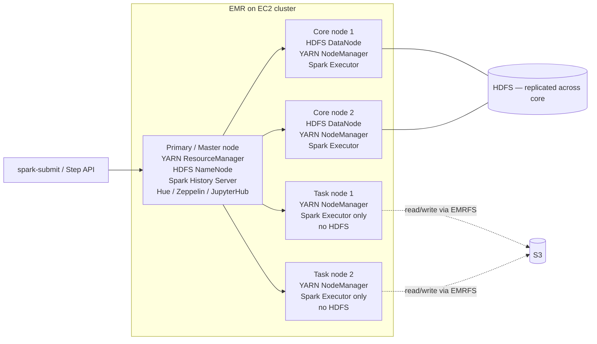
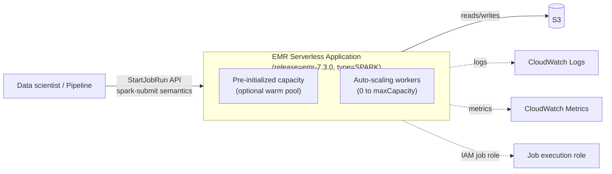
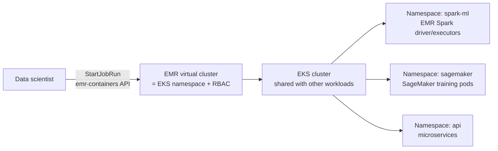
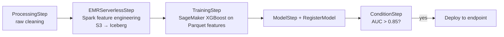

# Chapter 14 — Amazon EMR for ML Data Processing

> **Goal of this chapter:** to give you a working mental model of Amazon EMR — the *un-opinionated* Spark service — and to teach you when to reach for it instead of Glue, SageMaker Processing, or Athena. By the end you should be able to choose between the three EMR deployment models (on-EC2, Serverless, on-EKS) given a scenario, explain why production ML teams have moved >60 % of their batch Spark workloads to EMR Serverless in 2024–2026, and wire an EMR step into a SageMaker Pipeline without re-architecting your training job. Chapter 13 covered Glue. This chapter covers what to use when Glue is too opinionated, too small, or the wrong engine entirely.

---

## 14.1 When Spark at scale beats Glue, Athena, or SageMaker Processing

Imagine the same fraud-detection bank from Chapter 1. The data scientist's notebook reads a clean 200 MB CSV, but the production reality is twelve months of card-network transactions in S3 — about **4 PB of compressed Parquet**, partitioned by `event_date` and `merchant_country`. The feature pipeline needs to:

1. Join transactions against a daily-refreshed merchant-reputation table (~50 GB).
2. Compute rolling 7-day, 30-day, and 90-day aggregates per `account_id`.
3. Join in encrypted PII (decrypt, hash, re-encrypt with per-field keys).
4. Upsert results into an **Iceberg** table so SageMaker training can time-travel to *the exact feature snapshot* used to train model v17 next month for audit.

You could, in principle, do all of this in Glue 5.0. But:

- The job needs **Spark 3.5 with a specific Iceberg version** (1.5.x) that Glue 5.0 has pinned to a slightly older release.
- The decryption library is a custom JAR built by the security team — Glue's "extra JARs" parameter handles small additions, but you also need a native C++ shared library for the AES-GCM-SIV mode, which Glue's container does not allow you to ship.
- A few of the rolling-window joins are **multi-TB shuffles** that benefit from Spark's adaptive query execution tuned with explicit `spark.sql.shuffle.partitions` overrides, plus shuffle-optimized disks.
- The volume justifies **Spot task fleets** at 80 % of the executor pool — Glue's DPU model offers no Spot pricing.

This is the EMR sweet spot. **Glue is Spark for data engineers who don't want to think about Spark; EMR is Spark (and friends) for ML engineers who do want to think about Spark.**

The four conditions that push you off Glue and onto EMR are nearly always one of:

| Condition | Why Glue fails | Why EMR wins |
| --- | --- | --- |
| **Version control** of Spark / Iceberg / Delta / Hudi | Pinned to Glue version (4.0 / 5.0 / 5.1) | Any release label (`emr-6.10` … `emr-7.3`) |
| **Custom JARs or native libraries** | Limited extra-JARs parameter; no native binaries | Full control via bootstrap actions (EC2) or custom images (EKS) |
| **GPU Spark** (NVIDIA RAPIDS, deep-learning preprocessing) | Not supported | Native — `p3/p4/g5` instance fleets, RAPIDS classification |
| **Non-Spark engines** in the same cluster (Trino, Flink, HBase) | Glue is Spark-only | Bundled in the EMR release |

And if your scenario instead reads "spiky, no infra desired, ad-hoc SQL, sub-TB", the right answer is almost certainly **not** EMR — it's Glue (for ETL), Athena (for SQL), or SageMaker Processing (for a pipeline step). The decision matrix in §14.9 makes this concrete.

⚠️ **Exam alert.** When a scenario mentions "PB scale", "Spark + custom JAR", "GPU Spark", "Trino with JDBC", or "Iceberg/Hudi/Delta with version pinning", reach for EMR. When it mentions "no Spark expertise on the team", "Glue catalog already in use", or "small to medium ETL", reach for Glue. The cert tests this dichotomy in nearly every Domain 1.2 question.

---

## 14.2 What EMR is (and the three deployment models)

**Amazon EMR — Elastic MapReduce** — is a managed cluster platform for the open-source big-data ecosystem: Apache Spark, Hive, Presto/Trino, HBase, Flink, Hudi, Iceberg, Delta Lake, Hadoop MapReduce, Pig, Oozie, Zeppelin, JupyterHub. AWS bundles versions of all of these into numbered **EMR releases** (e.g., `emr-6.15.0`, `emr-7.3.0`) so you pick *one* release label and get a tested matrix of components.

There are **three deployment models** — every MLA-C01 EMR question is implicitly asking you to pick one:

| Deployment model | What you manage | When the exam picks this |
| --- | --- | --- |
| **EMR on EC2** (classic, since 2009) | Cluster lifecycle, instance types, scaling bounds | "Customize Spark JARs", "use GPU instances", "long-running cluster", "we already have ops capacity" |
| **EMR Serverless** (GA Jun 2022) | Submit a job; AWS provisions/scales/terminates workers | "Spiky workload", "no cluster ops", "pay only when jobs run", "ML team without infra engineers" |
| **EMR on EKS** (GA 2020) | Submit Spark jobs to a virtual cluster on your existing EKS | "Share GPU nodes with SageMaker/microservices", "Kubernetes shop", "consolidate clusters" |

All three modes give you the **same EMR runtime** (AWS's perf-tuned Spark, benchmarked ~1.7× faster than open-source Spark 3.x), the **same Iceberg/Hudi/Delta connectors**, and the **same EMR Studio UX**. The choice is purely about who owns the compute substrate.

The blunt 2026 default: if you don't have a strong reason for the others, **EMR Serverless is the greenfield choice**.

---

## 14.3 EMR on EC2 — the classic model

### 14.3.1 Cluster topology

An EMR cluster is a YARN cluster on top of EC2 with three node roles:



- **Primary / Master node** — coordinator. Runs YARN ResourceManager, HDFS NameNode, Spark History Server, optionally Hue/Zeppelin/JupyterHub. **Single point of failure** unless you enable Multi-Master HA (3 master nodes, EMR 5.23+; spreads NameNode HA + ResourceManager HA via ZooKeeper).
- **Core nodes** — process tasks **and** store HDFS blocks (DataNode + NodeManager). Terminating a core node risks HDFS data loss.
- **Task nodes** — compute only (NodeManager + Spark Executor). No HDFS. **Ideal Spot candidates** — losing one just kills its in-flight tasks, which YARN reschedules elsewhere.

### 14.3.2 Instance groups vs instance fleets

Two ways to define the EC2 capacity behind those node roles — the exam loves to ask which one.

| Dimension | Uniform instance groups | Instance fleets (recommended for most ML) |
| --- | --- | --- |
| Instance types per group | **Exactly one** type | **Up to 30** types per fleet |
| Capacity unit | Number of instances | vCPU or memory "units" |
| Spot allocation strategy | Single instance type, single AZ | **price-capacity-optimized** across many types/AZs |
| Auto-scaling | EMR Managed Scaling **or** custom CloudWatch rules | EMR Managed Scaling only |
| Best for | Simple, predictable workloads | **Cost-optimized Spot, resilient to capacity issues** |

In production ML you almost always pick **instance fleets** for the *task* tier so EMR can mix `r5.4xlarge` Spot + `r6i.4xlarge` Spot + `m6a.4xlarge` Spot across AZs to chase the cheapest pool. The exam's canonical right answer for "Spot resiliency on task nodes" is *always* instance fleets with `price-capacity-optimized`.

### 14.3.3 EMR Managed Scaling

Configure once with `MinimumCapacityUnits`, `MaximumCapacityUnits`, `MaximumOnDemandCapacityUnits`, `MaximumCoreCapacityUnits`. EMR's scaling engine watches **YARN memory pressure, pending containers, and HDFS utilization** and adds/removes core+task nodes within those bounds. No CloudWatch alarms to maintain.

- Scales **task nodes first** (cheap and stateless), then core nodes if HDFS fills.
- Will **never** scale below `MinimumCapacityUnits` even at idle — set it to 1 core node if you want the cluster to nearly-deflate between jobs.
- **Managed Scaling only works for YARN-based applications** (Spark, Hive, MapReduce, Tez). A cluster running Trino/Presto needs manual scaling — or you switch to Athena.

### 14.3.4 EMRFS vs HDFS — the storage decision that haunts every cluster

- **HDFS** — replicated block storage on the instance-store + EBS volumes attached to core nodes. Default replication: **3** for clusters ≥10 core, **2** for 4–9, **1** for ≤3. Lifetime = cluster lifetime; terminating the cluster wipes HDFS.
- **EMRFS** — AWS's implementation of the Hadoop FileSystem interface pointed at **S3**. Files written to `s3://bucket/path` from a Spark job go through EMRFS.
- **Production ML pattern:** keep raw data, features, and outputs on **S3 via EMRFS** (durable, decoupled from cluster, shareable with SageMaker/Athena/Glue Catalog). Let **HDFS** be ephemeral shuffle/spill space only. Terminate clusters at will.
- **EMRFS Consistent View** — historical workaround for S3's old eventual-consistency model. **Made obsolete in Dec 2020** when S3 went strongly-consistent for all operations. EMR 6.2+ disables it by default; if a question mentions "EMRFS consistent view", treat it as a red herring or legacy detail.

⚠️ **Exam alert.** Whenever a question says "durable storage for the cluster's feature outputs" or "data must survive cluster termination", the answer is **EMRFS (S3)**, never HDFS. Putting feature outputs on HDFS is a textbook antipattern — the moment the cluster is terminated for cost, the features are gone.

### 14.3.5 Bootstrap actions vs steps

- **Bootstrap actions** — shell scripts that run **on every node at cluster startup** (before YARN/Spark start). Used to `pip install transformers torch boto3==1.34`, mount FSx Lustre, or install GPU drivers. Limit: 16 BAs per cluster.
- **Steps** — units of work submitted to a *running* cluster (Spark, Hive, custom JAR, shell). Steps run sequentially by default but can be parallelized with `concurrent-steps-config`.

Bootstrap actions run once per node at startup, **not** on running clusters. To install a new library on a running cluster you SSH and `pip install` or use a notebook magic (`%pip install`) — but the change won't persist across node replacement.

### 14.3.6 EMR IAM roles

Three IAM principals appear in every EMR cluster:

| Role | Attached to | Used for |
| --- | --- | --- |
| **EMR service role** (`EMR_DefaultRole`) | The EMR service itself | Provision EC2, place nodes in VPC, write to CloudWatch |
| **EC2 instance profile** (`EMR_EC2_DefaultRole`) | Every EC2 in the cluster | What your Spark jobs can do: read S3, call KMS, write to Glue Catalog |
| **Auto-scaling role** (`EMR_AutoScalingDefaultRole`) | EMR Managed Scaling | Modify capacity of fleets/groups |

For multi-tenant clusters, layer **EMR runtime roles** on top: each step/job assumes a different IAM role so different users have different S3 permissions on the same cluster. Required for Lake Formation FGAC with EMR.

### 14.3.7 EMR releases — Spark version map

| EMR release | Spark | Hadoop | Hive | Iceberg | Hudi | Delta |
| --- | --- | --- | --- | --- | --- | --- |
| emr-5.36.x | 2.4.8 | 2.10.1 | 2.3.9 | — | 0.10 | — |
| emr-6.10.0 | 3.3.1 | 3.3.3 | 3.1.3 | 1.1.0 | 0.12 | 2.2 |
| emr-6.15.0 | 3.4.1 | 3.3.6 | 3.1.3 | 1.4.x | 0.14 | 2.4 |
| emr-7.0.0 | 3.5.0 | 3.3.6 | 3.1.3 | 1.4.x | 0.14 | 3.0 |
| emr-7.3.0 (mid-2024) | 3.5.1 | 3.3.6 | 3.1.3 | 1.5.x | 0.14 | 3.2 |

You don't need to memorize the matrix — but for the exam know:

- EMR 5.x = Spark 2.x (legacy).
- EMR 6.x = Spark 3.x.
- EMR 7.x = Spark 3.5+, Java 17 by default.
- Iceberg / Hudi / Delta are **all bundled** on 6.x+ — no separate connector install.

---

## 14.4 EMR Serverless — the 2022 GA, now the greenfield default

### 14.4.1 Concepts

EMR Serverless removes the cluster from your mental model. You create an **Application** once (essentially a *pre-configured runtime template*) and submit **Job Runs** to it. AWS handles workers, scaling, and termination.



- **Application** = (release version, engine type, network config, capacity limits, optional pre-init pool). One per environment is typical (dev/prod) or per team.
- **Engine types**: `SPARK` or `HIVE` only. *No Trino, no Flink, no HBase on Serverless.*
- **Job Run** = one `spark-submit` (or HiveQL) invocation. Asynchronous; tracked via `GetJobRun`.
- **Workers** = right-sized containers (vCPU + memory) that EMR Serverless provisions per job, then decommissions. You don't pick instance types.

⚠️ **Exam alert.** EMR Serverless is **not Lambda**. Lambda runs your function code; EMR Serverless runs your Spark job inside *managed Spark workers*. The cold-start gap (60–120 s default, <1 s warm) is much larger than Lambda's, and the per-second pricing is for the workers' compute, not per-invocation. Any question that conflates them — for example "use EMR Serverless for sub-100 ms event-driven jobs" — is wrong.

### 14.4.2 Pre-initialized capacity (the warm pool)

By default, a brand-new job waits ~60–120 s for cold worker startup. For interactive notebooks or chained pipeline steps, configure `initialCapacity` on the Application:

```json
"initialCapacity": {
  "Driver":   {"workerCount": 1, "workerConfiguration": {"cpu":"4vCPU","memory":"16GB"}},
  "Executor": {"workerCount": 10,"workerConfiguration": {"cpu":"4vCPU","memory":"16GB","disk":"50GB"}}
}
```

- Warm workers respond in **<1 s**.
- You pay for the warm pool **whether or not jobs are running** — like a reserved cluster.
- Set an **idle timeout** (`autoStopConfiguration.idleTimeoutMinutes`, default 15 min) to release pre-init workers after quiet periods.

### 14.4.3 Pricing units

EMR Serverless bills three resources, **per second with a 1-minute minimum**:

- **vCPU-hour** (~$0.052)
- **memory-GB-hour** (~$0.0057)
- **ephemeral storage-GB-hour above 20 GB** (~$0.000111)

No EMR-on-EC2 markup, no EC2 hourly fee — just the metered resources your job actually used. This is why EMR Serverless wins for **bursty / unpredictable** workloads and EMR-on-EC2-with-Spot wins for **steady, high-utilization** workloads.

**Rule of thumb (from AWS pricing calculator simulations):** if your cluster utilization is below ~70 % on On-Demand or ~50 % with Savings Plans, EMR Serverless is cheaper. Above that, EMR on EC2 with Spot task fleets is cheaper.

### 14.4.4 Limits and operational notes worth remembering

- **`MaximumCapacity`** caps total concurrent vCPU/memory across all running jobs in the Application.
- **Max per worker**: 16 vCPU / 120 GB memory — important for Spark `executor-memory` tuning.
- **VPC connectivity:** optional; if you attach private subnets, ENIs are created per job (slower cold start, +20–30 s).
- **Logs:** go to **S3** (you configure the bucket on the Application) and/or **CloudWatch Logs**.
- **Storage tier:** standard (20–200 GB/worker), Shuffle-Optimized (up to 2 TB/worker), or Serverless Storage (auto-scaling, EMR 7.12+).
- **Multi-AZ is default**; pre-initialized capacity is single-AZ (warm pools can't span AZs).
- **Graviton (ARM64) by default in 2026** — 20–40 % cheaper than x86_64 for typical Spark; validate third-party Python wheels for ARM compatibility first.

### 14.4.5 Top-5 EMR Serverless best practices (production-distilled)

1. **Define the Application once, reuse for many jobs.** The Application is the cluster template; submitting jobs is cheap. Use **on-demand capacity** by default; reserve pre-initialized capacity only for sub-second cold-start needs (rare for ML batch).
2. **Default to Graviton.** Better price-performance than x86; validate wheels first.
3. **T-shirt size your scaling caps** (Small=50, Medium=200, Large=500 max executors) instead of per-job tuning. Caps stop runaway cost more than they hurt performance.
4. **Discard EC2-era executor configs when migrating.** Hand-tuned `spark.executor.cores` / `spark.executor.memory` from EC2 fight the Serverless autoscaler. Keep only `spark.dynamicAllocation.maxExecutors` for cost capping.
5. **VPC + endpoints:** use **Gateway endpoints for S3** to avoid NAT charges; plan enough IPs for executor scale-out.

---

## 14.5 EMR on EKS — shared Kubernetes, multi-tenant ML platforms

For shops where Kubernetes is the platform layer, EMR on EKS lets you:

1. Register an existing EKS cluster as an EMR **virtual cluster** (one-time, via the `emr-containers` API).
2. Submit Spark jobs via `StartJobRun` to that virtual cluster — EMR's controller turns each into a `SparkApplication` CRD that runs in your EKS namespace.
3. Share the **same GPU nodes** between Spark ETL pods and SageMaker training pods (or microservices). One node pool, many tenants.



- **Virtual cluster = Kubernetes namespace**, 1:1. A team gets a namespace, the namespace gets ResourceQuotas, LimitRanges, NetworkPolicies, and a ServiceAccount with IAM Roles for Service Accounts (IRSA) bound to S3 / Glue permissions.
- **Soft multi-tenancy** is the default (shared nodes, logical isolation). Hard multi-tenancy (dedicated node groups per team) is reserved for compliance-isolated workloads (PCI, HIPAA).
- **Chargeback** works off the namespace label — every pod is tagged with its virtual cluster, so cost-allocation tools (Kubecost, OpenCost, AWS CUR) attribute Spark cost back to the team that submitted the job.

**Pricing:** standard EKS cluster fee (~$0.10/hr) + EC2/Fargate underneath + an **EMR uplift** (~$0.012/vCPU-hour) only while a Spark pod runs. No EMR-on-EC2 hourly markup — there is no dedicated EMR cluster.

### 14.5.1 The Spot fault-tolerance combo (PVC reuse + node decommissioning)

The killer feature for production Spark on EKS + Spot:

- **PVC reuse** (EMR 6.8+): the persistent volume claim outlives the executor pod. When Spot reclaims an executor, the PVC reattaches to the next executor, so **shuffle data survives the interruption** — no recompute.
  ```
  spark.kubernetes.driver.ownPersistentVolumeClaim    true
  spark.kubernetes.driver.reusePersistentVolumeClaim  true
  ```
- **Node decommissioning** (EMR 6.3+): on a 2-minute Spot warning, Spark prevents new tasks from scheduling on the doomed node and migrates shuffle/RDD blocks to peer executors or to **S3 fallback storage**.
  ```
  spark.decommission.enabled                              true
  spark.storage.decommission.shuffleBlocks.enabled        true
  spark.storage.decommission.fallbackStorage.path         s3://<bucket>/spark-decom/
  ```
- **Combined impact:** AWS cites **up to 61 % lower cost and 68 % faster** for Spark on EMR on EKS with Spot when both features are enabled.

**MLA-C01 angle:** if the question says "we already run EKS and want to add Spark without standing up a separate cluster" or "share GPU nodes with online inference", the answer is **EMR on EKS**.

---

## 14.6 Apache Spark on EMR — the ML team's actual reason for choosing it

Roughly 90 % of MLA-C01 EMR questions are really about **distributed feature engineering at TB–PB scale before training**.

### 14.6.1 Why the Spark DataFrame API for ML feature engineering

- **Lazy execution + Catalyst optimizer** — Spark builds a logical plan, optimizes (predicate pushdown into Parquet, partition pruning into Hive/Iceberg/Glue Catalog tables, join reordering), then executes. A 100-line PySpark feature pipeline can be 10× faster than the same logic in raw Python/Pandas.
- **Adaptive Query Execution (AQE)** (Spark 3.0+, default on EMR 6.x+) — re-optimizes the plan at runtime: automatic shuffle partition coalescing, skew handling, broadcast join detection. **Set-and-forget tuning** for ML jobs with unpredictable cardinalities.
- **Spark SQL on Glue Catalog** — one config flag (`hive.metastore.client.factory.class=AWSGlueDataCatalogHiveClientFactory`) and `spark.sql("SELECT * FROM analytics.events WHERE event_date = '2026-05-26'")` Just Works against the same tables Athena queries.
- **Iceberg / Hudi / Delta** for upserts and time-travel — ML reproducibility lives here. `SELECT * FROM features VERSION AS OF '2026-04-01'` returns the exact feature snapshot used to train model v17.

If your existing Spark knowledge from Topic 9a Part J feels rusty, the DataFrame mechanics and AQE intuition transfer 1:1 — the only EMR-specific addition is the Glue Catalog integration and the deployment-model wrapper.

### 14.6.2 `spark-submit` patterns across deployment models

The submission pattern is the same conceptually — only the wrapper differs:

| Mode | Submission |
| --- | --- |
| EMR on EC2 | `aws emr add-steps --cluster-id j-XYZ --steps Type=Spark,Name=FE,Args=[spark-submit,--deploy-mode,cluster,s3://bucket/fe.py]` |
| EMR Serverless | `aws emr-serverless start-job-run --application-id 00f… --execution-role-arn arn:aws:iam::…:role/EMRServerlessJobRole --job-driver '{"sparkSubmit":{"entryPoint":"s3://bucket/fe.py"}}'` |
| EMR on EKS | `aws emr-containers start-job-run --virtual-cluster-id … --execution-role-arn … --job-driver '{"sparkSubmitJobDriver":{…}}'` |

### 14.6.3 MLlib — bundled but limited

EMR ships Spark MLlib (the distributed ML library). It covers:

- Regressions, logistic regression, decision trees, random forest, **GBT**, **k-means**, **ALS** (matrix factorization for collaborative filtering), PCA, Word2Vec.
- Pipelines, CrossValidator, TrainValidationSplit.

**MLlib is not where modern deep-learning training happens.** For that you'd use Spark + Horovod on GPUs (advanced) or, more commonly, do **feature engineering** in PySpark on EMR, write Parquet to S3, then train in **SageMaker** with PyTorch/XGBoost. The canonical exam pattern is *Spark on EMR for transform → SageMaker for train*.

### 14.6.4 Other engines on EMR

- **Hive** — legacy SQL on Hadoop. Still bundled, still used for migrations off on-prem Hadoop.
- **Presto / Trino** — interactive SQL across federated sources (Glue Catalog + Redshift + MySQL + Cassandra). Similar to Athena, but cluster-resident; use it when Athena's per-query model is too expensive or when you need a stable JDBC endpoint for BI tools.
- **Flink** — alternative to Spark Structured Streaming. Also available as **Amazon Managed Service for Apache Flink (MSAF)**; pick MSAF for new Flink work unless you specifically need Flink + Spark + HBase co-located.
- **HBase** — wide-column NoSQL on HDFS / S3. Niche; mostly replaced by DynamoDB for AWS-native ML.
- **Hudi / Iceberg / Delta** — table formats, not engines. Bundled connectors so Spark / Hive / Trino on EMR can read/write any of them.

---

## 14.7 Spot patterns on EMR — the 70 %+ cost lever

Spot is the single biggest cost lever on EMR (up to 90 % off On-Demand, with typically <5 % interruption rate per AWS). Production teams use a layered pattern.

### 14.7.1 The standard pattern (EMR on EC2 with Instance Fleets)

- **Master node:** On-Demand. *Never* Spot. Master loss = cluster loss.
- **Core nodes:** On-Demand for HDFS-resident clusters; Spot acceptable only if HDFS is scratch-only (S3 is the canonical store).
- **Task nodes:** Spot, with a **diversified Instance Fleet** (10+ instance types across 3+ AZs). Spot interruption probability is per-instance-type-per-AZ; diversification is the cheapest insurance.
- **Allocation strategy:** `price-capacity-optimized` (current default), *not* `lowest-price`. Capacity-optimized has dramatically fewer interruptions for marginal price premium.

### 14.7.2 The YARN node-labels trick (Application Master pinning)

EMR's built-in Spot resilience for Spark uses YARN node labels to **pin the Spark Application Master to a core (On-Demand) node**. If a task-node Spot instance dies mid-job, the AM keeps running and YARN reschedules the lost stage. Without this, losing the task node that happens to host the AM kills the entire Spark application.

In **EMR 5.19+** this is on by default. In **EMR 6.x it is disabled by default** — you must explicitly set in `yarn-site`:

```
yarn.node-labels.enabled                              true
yarn.node-labels.am.default-node-label-expression     CORE
```

This is the single most-missed configuration step when teams move from EMR 5.x to 6.x and start seeing "random" Spark job failures on Spot interruption.

### 14.7.3 Checkpointing — what actually has to happen

- **Spark batch:** enable RDD checkpointing to S3 for any DAG with more than ~5 wide shuffles. The recomputation cost on Spot loss without checkpoints exceeds the storage cost of writing checkpoints to S3 by an order of magnitude.
- **Spark Structured Streaming:** `checkpointLocation` to S3 is mandatory; without it, exactly-once semantics are gone after Spot interruption.
- **ML training on EMR:** for distributed XGBoost / TensorFlow / PyTorch, write model checkpoints to S3 every N epochs.

### 14.7.4 The recommended posture, one line per tier

- **Master:** On-Demand.
- **Core:** On-Demand (HDFS replication of 3 protects intermediate shuffle, but a Spot core node going down stalls progress).
- **Task:** **Spot fleet across 10+ instance types**, 70–90 % savings vs On-Demand.

---

## 14.8 Notebook UX — EMR Studio vs SageMaker Studio

Both exist, both let you write PySpark, both can target EMR clusters. They're for different personas.

| | EMR Studio | SageMaker Studio |
| --- | --- | --- |
| Primary persona | Data engineer authoring production Spark jobs | Data scientist / ML engineer whose artifact is a model |
| Backed by | EMR on EC2, EMR Serverless, or EMR on EKS | SageMaker training/processing/endpoints; can connect *to* EMR for Spark |
| Auth | IAM Identity Center (SSO) | IAM Identity Center (SSO) |
| Git integration | Native (CodeCommit, GitHub, GitLab, Bitbucket) | Native |
| Languages | PySpark, Spark Scala, SparkR, SQL | Python primary (any kernel); PySpark via EMR connection |
| Spark UI access | First-class | Via the EMR connection panel |
| ML lifecycle integration | None native | Tight — Training Jobs, Pipelines, Model Registry, Endpoints |

**Decision heuristic for the exam:**

- *"Data scientist exploring a large dataset and wants Spark"* → **SageMaker Studio with EMR connection** (or EMR Serverless application).
- *"Data engineer authoring a production Spark ETL job with tuning"* → **EMR Studio**.
- *"Building a SageMaker training job that needs Spark preprocessing as a pipeline step"* → **SageMaker Pipelines `ProcessingStep` with `PySparkProcessor`** (no EMR needed) **or** `EMRStep` / `EMRServerlessStep` if you already have / want an EMR runtime.

There is also EMR's legacy **EMR Notebooks** product — IAM-user-based, EMR-on-EC2-only, PySpark-only. AWS recommends **EMR Studio for all new work**; treat EMR Notebooks as deprecated for exam purposes.

The 2025 convergence to keep on your radar but not over-index on for the cert: **Amazon SageMaker Unified Studio** (re:Invent 2024, GA 2025) collapses EMR Studio, SageMaker Studio, Glue ETL Editor, and Athena query workspace into one pane. The exam still tests the older split; production in 2026 increasingly looks like Unified Studio with the underlying engine being a dropdown choice. Chapter 22 covers SageMaker Studio in depth.

---

## 14.9 SageMaker Pipelines integration — `EMRStep` and `EMRServerlessStep`

SageMaker Pipelines (Chapter 43) supports two EMR step types so you can embed EMR work in a training pipeline:

| Step type | Targets | Behavior |
| --- | --- | --- |
| **`EMRStep`** | An **existing** EMR-on-EC2 cluster (by `cluster_id`) **or** a newly-launched one (cluster config you provide) | Submits a Spark/Hive step; waits for completion; surfaces logs |
| **`EMRServerlessStep`** | An existing EMR Serverless **Application** (by `application_id`) | Submits a job run; waits; surfaces logs |

Canonical pipeline pattern for MLA-C01:



This is the **right answer** for any exam question shaped like: *"Customer has TBs of clickstream in S3 and wants to engineer features, train XGBoost weekly, and deploy via Pipelines. Which step type for the feature engineering?"* → `EMRServerlessStep` (or `EMRStep` if they explicitly say "existing long-running cluster").

⚠️ **Exam alert.** `EMRStep` in its most common form **requires an existing cluster** referenced by `cluster_id`. It *can* launch a new transient cluster if you provide a cluster config — but the default form, and the form most teams use, points at an existing cluster ID. If a scenario forbids "managing any cluster" or "infrastructure to maintain", reach for `EMRServerlessStep` instead. Don't pick `EMRStep` and assume Pipelines will provision and tear down EMR for you transparently.

### 14.9.1 `EMRStep` vs `PySparkProcessor` — the other choice point

A frequent real-world decision is *do I need EMR at all*, or can I use SageMaker's own `PySparkProcessor` inside a `ProcessingStep`?

| Situation | Choose |
| --- | --- |
| Existing EMR cluster, Spark job needs Iceberg/Hudi/Delta with EMR runtime | `EMRStep` |
| One-off Spark preprocessing step, no other EMR usage | `ProcessingStep` + `PySparkProcessor` |
| Cluster shared by data engineering and ML | `EMRStep` |
| ML team owns the pipeline end-to-end and doesn't want a Spark cluster to manage | `ProcessingStep` + `PySparkProcessor` |
| Need very large shuffles (multi-TB), no standing cluster | `EMRServerlessStep` against EMR Serverless with Shuffle-Optimized disks |
| Need <100 GB shuffle, simple ETL | `ProcessingStep` + `PySparkProcessor` |

The increasingly common modern pattern is **`EMRServerlessStep`** pointed at an EMR Serverless Application — best of both worlds: SageMaker Pipelines orchestrates, EMR Serverless runs the Spark, no cluster lifecycle to manage.

---

## 14.10 EMR vs Glue Spark vs SageMaker Processing vs Athena — the decision matrix

This is the **single most likely** Chapter 14 exam pattern. Memorize the heuristics.

| Dimension | EMR (any flavor) | Glue Spark | SageMaker Processing | Athena |
| --- | --- | --- | --- | --- |
| **Engines** | Spark, Hive, Trino, Flink, HBase, MLlib | Spark, Ray, Python shell | Spark **or** sklearn **or** XGBoost **or** PyTorch container | Trino (managed) |
| **Spark version control** | Any release | Pinned to Glue version (4.0 / 5.0 / 5.1) | Bring your own Spark container | n/a |
| **Custom JARs / native libs** | Full control (BAs, EKS images) | Limited (extra JARs param) | Full control (Docker image) | None |
| **Cluster mgmt** | EC2 = you; Serverless = AWS; EKS = your K8s | Always serverless | Always serverless | Always serverless |
| **Latency to first compute** | EC2: 5–10 min; Serverless: 60–120 s (or <1 s warm); EKS: pod start | 1–3 min (job warm-up) | 1–5 min (container pull) | <1 s |
| **Best for** | PB-scale feature eng; non-Spark engines; GPU Spark; long-running data warehouse | Catalog-aware ETL; data engineers; opinionated Spark | Per-feature-group processing tied to a training pipeline; sklearn/Pandas at moderate scale | Ad-hoc SQL on S3; data exploration; cheap interactive queries |
| **Notebooks** | EMR Studio | Glue Interactive Sessions | SageMaker Studio | Athena Notebooks (PySpark via Spark engine) |
| **ML library breadth** | PySpark + MLlib + any pip install via BA | PySpark + Ray + limited pip | **Anything you can put in a Docker image** | n/a (SQL only) |
| **Cost shape at scale** | Cheapest with Spot task fleets at high utilization | Higher $/DPU but no idle cost | Pay-per-run; pricey for huge data | Per-TB-scanned ($5/TB) |
| **Pipelines step type** | `EMRStep`, `EMRServerlessStep` | `ProcessingStep` w/ Glue, or call Glue from `LambdaStep` | `ProcessingStep` (native) | `LambdaStep` + Athena API |

### 14.10.1 Exam heuristics

- *"Data engineer with no Spark experience needs to clean Parquet at scale"* → **Glue** (or Glue Studio).
- *"ML team needs PB-scale feature eng with custom PyTorch/HuggingFace code in Spark"* → **EMR on EC2** with BA installing libs, or **EMR on EKS** sharing GPU pool.
- *"Bursty Spark workload, runs 4× per day, ops-light team"* → **EMR Serverless**.
- *"Ad-hoc SQL on S3 data, no infra desired, pay only per query"* → **Athena**.
- *"Per-step Pandas/sklearn preprocessing inside a SageMaker Pipeline, dataset fits one big instance"* → **SageMaker Processing**.
- *"Existing EKS cluster, want Spark without a separate cluster"* → **EMR on EKS**.
- *"Need to share the Hive/Glue Data Catalog between Athena, EMR, and Redshift Spectrum"* → all three already use Glue Catalog natively.
- *"Need Trino with JDBC for BI tools, low latency, federated to MySQL"* → **EMR with Trino** (Athena doesn't expose JDBC at high concurrency cheaply).

Cross-link forward: Chapter 43 walks through every Pipelines step type in detail, including the IAM scoping and event-driven triggers; Chapter 22 covers SageMaker Studio's EMR connection UI from the data-scientist side.

---

## 14.11 Migration stories — what production teams actually saved

The 2024–2026 EMR story is dominated by *migrations to Serverless*. Three customer case studies AWS has published are worth knowing because the exam will not test the numbers, but it *will* test the patterns these migrations validated.

### 14.11.1 GoDaddy — 62.5 % cost reduction, 50.4 % faster

(*AWS Big Data Blog, 2024.*)

- **Migration:** EMR on EC2 transient clusters → EMR Serverless.
- **Workload bucketing:** they tiered jobs into Quick (0–20 min), Medium (20–60 min), Long (>60 min) so they could measure migration impact per bucket.
- **Production numbers:**
  - Overall: **62.5 % cost reduction, 50.4 % faster** across migrated workflows.
  - Sample large workflow: 75.3 % cost decrease, 10 % faster runtime.
  - Sample small workflow: **92.4 % cost savings, 80.6 % faster**.
  - Quick-run jobs exceeded projections: 71.8 % cheaper vs 40 % projected.
- **Antipattern they caught:** assuming hand-tuned EC2 Spark configs transfer 1:1 to Serverless. They don't — GoDaddy had to *drop* their executor configs and let EMR Serverless manage them, capping cost only with `spark.dynamicAllocation.maxExecutors`.

### 14.11.2 Socure — 45–57 % cheaper, 47–51 % lower latency

(*AWS Big Data Blog, 2024.*)

- **Migration:** open-source Spark on EKS → EMR Serverless on Graviton.
- **Workload:** TETL (Transaction ETL) streaming pipeline for identity verification, two-stage: Raw (parse Kinesis → encrypted Delta) → Processed (decrypt, flatten, re-encrypt PII per-field, write Delta).
- **Cost:** Weekend (low traffic) **57.1 % reduction**; Weekday (regular traffic) **45.2 % reduction**. Even granting a hypothetical 40 % Graviton discount to the EKS baseline, EMR Serverless was still ~15 % cheaper.
- **Latency:** Average **47.9–51.0 % lower**; best-case 69.2–73.3 % lower.
- **Resource shift:** went from 30–90 small executors (14 GB / 2 cores) on EKS to **10–30 large executors (27 GB / 4 cores)** on Serverless. Bigger executors eliminated OOM failures that had plagued the EKS setup.
- **Why Serverless over EMR-on-EC2:** removed K8s + OSS Spark operational burden, automatic scale-down to 20 workers on weekends (which their EKS autoscaler couldn't match smoothly), and they kept Delta Lake — proving Serverless handles modern table formats fine.

### 14.11.3 Foursquare — 45 % cost reduction

(*AWS case study.*) Headline reason cited: "EMR Serverless allocates just enough RAM and CPU and can spin up or down faster than instances."

### 14.11.4 What the three migrations have in common

- Workloads were **already on Spark** (no language migration).
- Workloads were **bursty or scheduled batch**, not 24/7 high-utilization (matching the §14.4.3 rule of thumb).
- Teams **discarded EC2-era tuning** and re-baselined on Serverless defaults.
- **Graviton** was a 20–40 % under-the-hood multiplier on top of the Serverless savings.

For exam purposes: when a scenario describes "bursty Spark workload, hand-tuned EC2 configs, ops-light team, wants to cut cost", the *pattern* answer is "migrate to EMR Serverless and drop the executor configs." You won't see the GoDaddy/Socure names — but you will see questions that pattern-match to them.

---

## 14.12 EMR vs Databricks on AWS — when AWS-native shops pick which

If you've worked through [Topic 9a — Databricks ML Associate](../../09a_databricks_ml_associate/README.md), you've seen the lakehouse experience from the Databricks side. The honest tradeoff matrix from production teams:

| Dimension | EMR (Serverless / EKS / EC2) | Databricks on AWS |
| --- | --- | --- |
| **Cost model** | Pay per second of compute; Serverless granular, EC2 stacks Spot for ~70 % off | Databricks Units (DBUs) on top of EC2 cost; ~30–80 % platform premium |
| **Governance** | Glue Data Catalog + Lake Formation (AWS-native, IAM-driven) | Unity Catalog (lakehouse-native, fine-grained, cross-cloud) |
| **ML lifecycle** | SageMaker (separate plane, S3-coupled) | MLflow built-in, same plane as data |
| **Query accelerator** | EMR Spark runtime (~2× perf claimed vs OSS) | Photon (proprietary, ~3–8× perf on certain workloads) |
| **Notebook UX** | EMR Studio / SageMaker Studio (functional) | Databricks Workspace (best-in-class) |
| **Table format** | Iceberg + Delta + Hudi all supported in Spark; Glue Catalog now Iceberg-native | Delta native; Unity Catalog now also supports Iceberg (2025) |
| **Vendor count** | One bill (AWS) | Two bills (AWS infra + Databricks platform) |
| **Audit/compliance posture** | AWS Artifact, AWS native controls | Databricks compliance certs + second vendor in scope |

### When AWS-native shops pick **EMR** over Databricks

- Cost-sensitive workloads where the Databricks platform fee can't be justified.
- Regulated finance/healthcare orgs minimizing vendor count in audit scope.
- Teams already invested in SageMaker for ML (the SageMaker-EMR integration is tighter than SageMaker-Databricks).
- Teams using GPU Spark with NVIDIA RAPIDS — EMR has first-class RAPIDS support.

### When AWS-native shops pick **Databricks** over EMR

- New lakehouse builds where Unity Catalog's fine-grained governance saves months of Lake Formation engineering.
- Heavy ML-engineering teams that want MLflow + Feature Store + Model Serving in one plane.
- Mixed-language teams (R + Python + SQL + Scala in one notebook).
- Teams that need cross-cloud (Azure + AWS) with one governance layer.

**Real example of each side:** Cox Automotive kept S3 + AWS infra but bought Databricks for orchestration + governance. Capital One went the other way — stayed AWS-native, used EMR + Step Functions + Glue Catalog + custom Python (Dask + RAPIDS) for the ML side, with a strong SageMaker investment.

For the MLA-C01: any question that contrasts EMR with Databricks **always** prefers EMR. The cert grades AWS-native answers; Databricks is mentioned only as a distractor.

---

## 14.13 Antipatterns — what production EMR teams have learned the hard way

Drawn from AWS's own EMR Best Practices guide, the FinOps EMR cost-optimization writeups, and the case studies in §14.11.

### 14.13.1 Oversized clusters from day one

The single most expensive mistake. Teams provision the cluster they *think* they'll need at peak, then run it 24/7. A single `r5.xlarge` can process surprising amounts of data with proper Spark tuning. **Start at 3–5 nodes, profile actual utilization, scale based on data not on fear.**

### 14.13.2 No managed scaling enabled

EMR Managed Scaling automatically resizes the cluster up to 25 % of total cluster vCPU per scaling event. Teams that don't enable it leave 20–60 % of capacity idle most of the time. Enable on every EMR-on-EC2 cluster (YARN-based workloads only — Trino/Presto needs manual scaling).

### 14.13.3 Leaving clusters running 24/7

The financial-services case study (`notes/ch14_practice.md` §3) reduced dev/UAT cluster minimums from 40 nodes to 3 instances and enforced 3-hour auto-termination on dev clusters, yielding **60 % dev/UAT savings over 5 months**. Patterns to enforce:

- Dev clusters: auto-terminate after idle period (3 hours typical).
- Job clusters: transient, terminate after the job.
- Persistent clusters: only for shared interactive workloads with measured utilization.

### 14.13.4 No Spot instances in task fleets

Task nodes are stateless and should be Spot-by-default. The financial-services case had task nodes at only 10 % Spot in non-prod and called it "longer-term strategy." Production-grade teams run task fleets at **80–100 % Spot with diversified instance fleets** for production batch jobs.

### 14.13.5 Treating EMR scale-down like EC2 scale-down

EMR scale-down has to wait for shuffle data on the node to be drained — otherwise the job fails. Common mistake: setting aggressive scale-in policies, then watching jobs fail mid-shuffle. Tune `yarn.resourcemanager.nodemanager-graceful-decommission-timeout-secs` to the length of your longest task, not the default 1 hour.

### 14.13.6 HDFS replication factor blocking scale-down

If `dfs.replication = 3` and you try to scale core nodes to 1, the scale-in operation stalls because HDFS won't violate replication. For S3-centric workloads (the right pattern in 2026), keep HDFS replication at 1 or 2 and treat HDFS as scratch only.

### 14.13.7 Hand-tuned Spark configs surviving the migration to Serverless

GoDaddy's specific pain point. **Discard executor core/memory configs when migrating to Serverless; let the platform manage them.** Keep only `spark.dynamicAllocation.maxExecutors` for cost capping.

### 14.13.8 Not using Graviton

Graviton ARM instances are typically 20–40 % cheaper than equivalent x86_64 for Spark workloads. Default to Graviton; only fall back to x86_64 if you have a specific native binary (usually an old XGBoost build) that lacks ARM support.

### 14.13.9 No cost tagging

Without cost-allocation tags on every EMR cluster (cost-center, project, owner, environment), the FinOps team can't tell you which workload is burning money. AWS CUR + cost allocation tags should be wired up before any cluster goes to prod.

### 14.13.10 Putting durable feature outputs on HDFS

Already flagged in §14.3.4 — the moment the cluster terminates, the features are gone. Always write to **EMRFS (S3)** for anything downstream consumers depend on.

---

## 14.14 Quick reference card

- **Three deployment models:** on-EC2 (full control, GPU Spark, custom JARs), Serverless (Spark + Hive only, pay-per-job, greenfield default), on-EKS (share K8s + GPU nodes).
- **Cluster topology (EC2):** Master + Core (HDFS) + Task (Spot-friendly, no HDFS).
- **Instance fleets > uniform groups** for cost-resilient Spot. Always `price-capacity-optimized` allocation.
- **EMRFS (S3) for durability; HDFS only for ephemeral shuffle.**
- **EMR Serverless ≠ Lambda** — cold start 60–120 s, Spark workers not functions.
- **EMR Studio** = current notebook UX; EMR Notebooks legacy.
- **Spark is the headliner** — MLlib bundled but ML training usually leaves to SageMaker; EMR owns the *feature engineering* layer.
- **Trino / Flink / HBase / Hive / Pig** also available — but **only Spark + Hive on Serverless**.
- **SageMaker Pipelines integration:** `EMRStep` (existing or new EC2 cluster) and `EMRServerlessStep` (existing Application).
- **Cost rule:** Serverless wins below ~70 % utilization; EC2+Spot wins above.
- **Decision matrix:** Glue = opinionated; EMR = un-opinionated; SageMaker Processing = inside training pipeline; Athena = SQL-only.
- **Migration pattern of the era:** EMR-on-EC2 → EMR Serverless → 45–62 % cost reduction (GoDaddy, Socure, Foursquare).
- **YARN node labels trick:** in EMR 6.x, enable `yarn.node-labels.enabled=true` and pin AM to CORE to survive Spot interruptions on task nodes.
- **Spot posture:** Master On-Demand; Core On-Demand; Task Spot fleet across 10+ types.

---

## 14.15 What this builds on / where this returns

**Builds on:**

- **Chapter 13 (Glue)** — the Spark service you reach for first when you don't have an EMR-specific need. Most of this chapter is implicitly contrasting against the Glue defaults.
- **[Topic 9a Part J Spark chapters](../../09a_databricks_ml_associate/README.md)** — DataFrame API, lazy execution, AQE, Catalyst optimizer. The Spark mechanics are identical; only the deployment wrapper changes.
- **Chapter 6 (S3)** — EMRFS reads/writes go through S3; the durability and consistency guarantees you learned there apply to every EMR output.
- **Chapter 7 (IAM for ML)** — the three EMR roles (service, EC2 instance profile, auto-scaling) and runtime roles for multi-tenant clusters.

**Returns:**

- **Chapter 22 (SageMaker Studio)** — the "EMR cluster discovery" panel that lets a data scientist attach a Studio notebook to an EMR cluster or Serverless Application without leaving Studio.
- **Chapter 43 (SageMaker Pipelines step types)** — the full step-type catalog including `EMRStep`, `EMRServerlessStep`, `ProcessingStep` with `PySparkProcessor`, and the IAM scoping required for each.
- **Chapter 16 (Glue interactive sessions vs Spark on EMR)** — the side-by-side notebook experience comparison.
- **Chapter 57 (cost optimization)** — Spot strategy, Graviton adoption, cost-allocation tagging, and the Cost Explorer hooks that close the loop on the antipatterns in §14.13.

---

## 14.16 Exercises

Attempt these cold. The goal is to find the gaps in your EMR mental model and patch them by re-reading the relevant section.

1. **The deployment-model decision.** For each scenario below, pick **EMR on EC2**, **EMR Serverless**, or **EMR on EKS** and justify in one sentence.
   1. A bank runs ad-hoc Spark + Trino + Flink on the same long-lived cluster, with custom risk-model JARs installed via a bootstrap action.
   2. An ML platform team has standardized everything on Kubernetes and wants Spark ETL pods to share the same GPU node pool as SageMaker training pods.
   3. A startup's data team runs a Spark feature pipeline four times a day, has no ops engineer, and wants the bill to be zero between runs.
   4. A retailer has hand-tuned Spark executor configs that produce 2 × the throughput of out-of-the-box defaults, and the cluster runs at >80 % utilization 24/7.

2. **Master / Core / Task placement on Spot.** A teammate proposes putting the master node, all core nodes, and all task nodes on Spot to "save 90 % across the board." Walk through what will go wrong for each tier, and produce the correct posture as a one-line answer.

3. **EMRFS vs HDFS trap.** A pipeline writes its final feature outputs to `hdfs:///features/v17/` because "HDFS is faster than S3." Two days later, the cluster auto-terminates after the 3-hour idle policy fires, and the next morning's SageMaker training job fails with "path not found." Explain in one paragraph what should have happened instead and which best-practice pillar of the Well-Architected ML Lens this violates.

4. **`EMRStep` vs `EMRServerlessStep` vs `ProcessingStep` with `PySparkProcessor`.** A SageMaker Pipeline needs a Spark preprocessing step that:
   - Reads 4 TB of Parquet from S3.
   - Writes 800 GB of Parquet back to S3 in an Iceberg table.
   - Runs nightly.
   - Must not require the ML team to manage any standing infrastructure.
   - Must use Iceberg 1.5.x.
   Which step type do you pick, and why are the other two wrong for this particular set of constraints?

5. **The YARN node-labels trick.** A team migrates their EMR 5.x cluster to EMR 6.10 and starts seeing "random" Spark job failures whenever a task-node Spot instance is reclaimed. The same jobs ran fine on 5.x for years. What changed, what's the one-line configuration that fixes it, and what is the underlying YARN concept that makes the fix work?

6. **Migration math.** A workload runs 24/7 on a 40-node EMR-on-EC2 cluster (all On-Demand, no Spot) at ~40 % average utilization. The team is debating whether to (a) migrate to EMR Serverless, (b) switch task nodes to Spot fleets with `price-capacity-optimized`, or (c) both. For each option, name the Well-Architected pillar it strengthens, the pillar it puts at risk, and the one piece of additional information you'd need before recommending it. Which would you pick if forced to choose only one?

7. **The decision matrix in anger.** Map each of these one-line scenarios to the right service from {EMR, Glue, SageMaker Processing, Athena}:
   1. A data analyst wants to query 200 GB of Parquet in S3 with SQL, expects to run the query twice this quarter, and has no infrastructure budget.
   2. A SageMaker Pipeline needs a sklearn-based feature transformation step on a 30 GB dataset.
   3. A data engineering team needs to run 50 small ETL jobs daily, all Spark, all writing to a Glue Catalog table, with no Spark tuning expertise on the team.
   4. A 6 PB nightly feature pipeline that joins clickstream + merchant + PII tables and writes Iceberg, using custom AES-GCM-SIV decryption JARs + native C++ shared library.

<details>
<summary>Answers</summary>

1. (a) **EMR on EC2** — multi-engine (Trino + Flink + Spark) and custom JARs via BA rule out Serverless (Spark+Hive only) and Glue. (b) **EMR on EKS** — explicit "share GPU pool with SageMaker pods" is the textbook signal. (c) **EMR Serverless** — bursty, ops-light, no idle bill. (d) **EMR on EC2 with Spot task fleets + Graviton** — the >70 % utilization rule (§14.4.3) flips the cost calculus away from Serverless, and the hand-tuned configs that would fight the Serverless autoscaler now pay off.

2. **Master on Spot:** master loss kills the cluster — every running job fails. **Core on Spot:** Spot reclaim takes HDFS data with it; under-replicated blocks block scale-down and can corrupt shuffle data. **Task on Spot:** correct and safe — YARN reschedules the lost stage. **Correct posture:** Master On-Demand, Core On-Demand, Task Spot fleet across 10+ instance types with `price-capacity-optimized`.

3. The team should have written to `s3://bucket/features/v17/` via EMRFS. HDFS is bound to the cluster lifecycle — terminating the cluster wipes it. Writing to S3 makes the features durable, decouples them from any one cluster, and lets SageMaker training, Athena, and Glue Catalog all consume them. The violation is of the **Reliability** pillar (`MLREL` — durable storage outliving the compute that produced it) and arguably the **Operational Excellence** pillar (the auto-termination policy was correct; the storage choice was wrong).

4. **`EMRServerlessStep`** is the right pick. The data volume (4 TB → 800 GB) and the Iceberg version requirement both favor EMR over `PySparkProcessor` (which would need a custom image and a large single-instance). The "no standing infrastructure" requirement rules out `EMRStep` against an existing cluster. `ProcessingStep` + `PySparkProcessor` is wrong because the Iceberg 1.5.x version pinning is awkward (you'd have to build a custom container), and at this scale a sized EMR Serverless Application with Shuffle-Optimized disks is more cost-efficient.

5. EMR 5.19+ had YARN node labels (and AM-pin-to-CORE) **on by default**. EMR 6.x **disabled it by default**. Without it, the Spark Application Master can land on a task (Spot) node; when that node is reclaimed, the whole application dies even though the executor losses would otherwise be recoverable. Fix: in `yarn-site`, set `yarn.node-labels.enabled=true` and `yarn.node-labels.am.default-node-label-expression=CORE`. The underlying concept is **YARN node labels** — they let the scheduler reserve specific node classes (here, the CORE-labelled On-Demand nodes) for specific roles (here, the AM).

6. (a) Serverless strengthens **MLCOST** (no idle bill at 40 % utilization) and **MLOPS** (no cluster to babysit); risks **MLPERF** if the hand-tuned configs were doing real work the autoscaler can't replicate. Need: a benchmark of one representative workload on Serverless with default configs vs the existing EC2 tuning. (b) Spot task fleets strengthen **MLCOST** (70–90 % task-node savings); risks **MLREL** if checkpointing isn't already in place and the YARN node-labels trick isn't enabled. Need: confirmation that AM pinning is on and that the longest-running stage has S3 checkpointing. (c) Both is internally inconsistent — Serverless doesn't expose Spot/On-Demand task tiers; you get one knob (max executors). The forced choice: at 40 % utilization the §14.4.3 rule of thumb favors **(a) Serverless**; you save more by not running idle workers than by getting 80 % off the workers you run too many of.

7. (1) **Athena** — twice-a-quarter ad-hoc SQL, $5/TB-scanned is cheaper than any cluster. (2) **SageMaker Processing** — sklearn at 30 GB is the textbook `ProcessingStep` (not `PySparkProcessor`) use case. (3) **Glue** — small ETL, Catalog-native, no Spark expertise. (4) **EMR on EC2** — custom JARs + native binary, PB scale, Iceberg pinning all rule out Glue / Serverless / Processing.

</details>

---

## Sources

1. **AWS docs — What is Amazon EMR**: <https://docs.aws.amazon.com/emr/latest/ManagementGuide/emr-what-is-emr.html>
2. **AWS docs — What is EMR Serverless**: <https://docs.aws.amazon.com/emr/latest/EMR-Serverless-UserGuide/emr-serverless.html>
3. **AWS docs — EMR Spot best practices & node labels**: <https://docs.aws.amazon.com/emr/latest/ManagementGuide/emr-plan-instances-guidelines.html>
4. **AWS docs — EMR Instance Fleets**: <https://docs.aws.amazon.com/emr/latest/ManagementGuide/emr-instance-fleet.html>
5. **AWS docs — EMR on EKS Development Guide**: <https://docs.aws.amazon.com/emr/latest/EMR-on-EKS-DevelopmentGuide/emr-eks.html>
6. **AWS docs — SageMaker Pipelines step reference (`EMRStep`, `EMRServerlessStep`)**: <https://docs.aws.amazon.com/sagemaker/latest/dg/build-and-manage-steps.html>
7. **AWS Big Data Blog — GoDaddy 60 %+ cost reduction with EMR Serverless**: <https://aws.amazon.com/blogs/big-data/how-the-godaddy-data-platform-achieved-over-60-cost-reduction-and-50-performance-boost-by-adopting-amazon-emr-serverless/>
8. **AWS Big Data Blog — Socure 50 % cost reduction migrating to EMR Serverless**: <https://aws.amazon.com/blogs/big-data/how-socure-achieved-50-cost-reduction-by-migrating-from-self-managed-spark-to-amazon-emr-serverless/>
9. **AWS Big Data Blog — Fault tolerant Spark on EMR on EKS with EC2 Spot**: <https://aws.amazon.com/blogs/big-data/run-fault-tolerant-and-cost-optimized-spark-clusters-using-amazon-emr-on-eks-and-amazon-ec2-spot-instances/>
10. **AWS Big Data Blog — Top 10 best practices for EMR Serverless**: <https://aws.amazon.com/blogs/big-data/top-10-best-practices-for-amazon-emr-serverless/>
11. **AWS docs — Using managed scaling in Amazon EMR**: <https://docs.aws.amazon.com/emr/latest/ManagementGuide/emr-managed-scaling.html>
12. **Phase 1 research notes** — `research_inputs/14_aws_ml_engineer_associate/notes/ch14_docs.md`, `ch14_practice.md`
