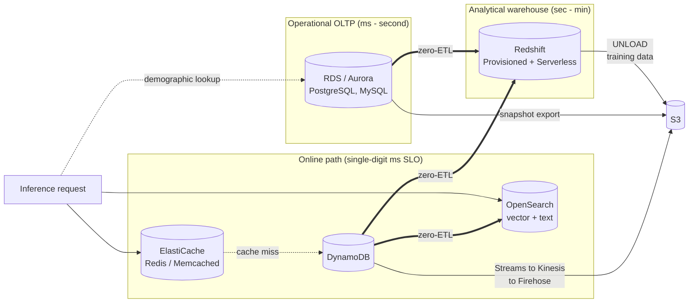
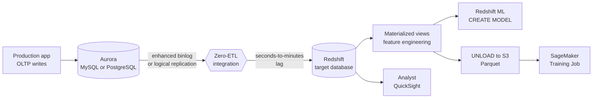
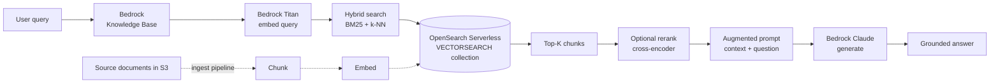
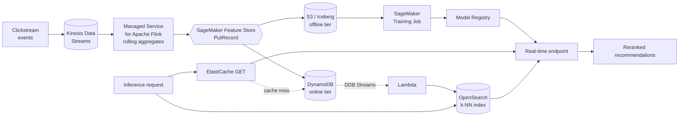

# Chapter 15 — Operational Data: DynamoDB, RDS, OpenSearch, Redshift for ML

> **Goal of this chapter:** to build the mental model of the *operational data layer* that production ML systems read from and write to in the inference path, the analytical warehouse a feature pipeline pulls from, and the vector store a RAG application hits per query. Chapter 13 covered S3 as the offline training-data substrate; this chapter covers the four databases that an inference path can talk to inside its sub-100 ms SLO, the warehouse where an analyst writes `CREATE MODEL`, and the vector store that backs every Bedrock-grounded chatbot. The exam consistently picks between **DynamoDB, Aurora/RDS, Redshift, OpenSearch**, and (as a cache tier) **ElastiCache** in deployment scenarios — these are not interchangeable, and the wrong pick is the wrong answer, full stop.
> **What you should be able to do by the end:** read a scenario like "a SageMaker endpoint scoring 50,000 QPS needs a user's last-hour purchase count in under 10 ms" and pick the right store within ten seconds; identify the failure mode behind a `ProvisionedThroughputExceededException`; reason about why Aurora zero-ETL is same-region only; explain in a sentence why a Bedrock Knowledge Base bill is $700 a month before anyone has run a query; and pattern-match every zero-ETL arrow on the AWS data integration map.

---

## 15.1 Why operational data is its own chapter

Two questions separate the candidate who passes from the candidate who guesses, and neither is solved by S3.

The first: *"A SageMaker real-time endpoint scoring 50,000 QPS needs to look up a user's last-hour purchase count and feed it to an XGBoost model. End-to-end latency budget: 80 ms. Where do those features live?"* Not S3, not Athena — DynamoDB, or equivalently the **SageMaker Feature Store online tier**, which **is** DynamoDB managed by SageMaker. S3 is wrong here for a structural reason: its p50 GET latency is 50-200 ms, and it is not designed for the point-lookup-by-key pattern an inference path needs. DynamoDB returns the same lookup in 2-10 ms.

The second: *"A BI analyst needs to score 200 M customer rows nightly with a churn model using SQL — no Python, no notebook. Where does it train, where does it predict?"* Redshift ML. `CREATE MODEL churn ... FROM (SELECT ... FROM customers)` trains via SageMaker Autopilot behind the scenes and compiles into a local Redshift function; `SELECT customer_id, predict_churn(...) FROM customers` is one SQL statement. SageMaker + a real-time endpoint would be technically possible, exam-wrong, and an org-chart violation (the analyst doesn't speak Python and lacks IAM rights to deploy an endpoint).

Both questions are about *data* — but the right store is determined by **latency**, **access pattern**, **key cardinality**, and **who the user is**. This chapter is the dictionary that translates each into a service pick.

### 15.1.1 The MLA-C01 framing

The Exam Guide's Task 1.1 ("extracting data from storage — Amazon S3, EBS, EFS, RDS, DynamoDB") and Domain 3 (deployment infrastructure choice) reliably give you a scenario with four plausible-looking storage options and grade you on whether you can identify the one that matches the latency budget, throughput shape, and ML use case. Most of those questions reduce to a five-way choice between DynamoDB, Aurora/RDS, Redshift, OpenSearch, and ElastiCache.

### 15.1.2 The five-service map



**Reading rule:** every arrow in this diagram is an exam-relevant integration, and the **zero-ETL** arrows specifically are the 2024-2026 question-bank favorites. Zero-ETL replaces what used to be Glue / DMS / Lambda glue code and is the canonical wrong-distractor / right-answer pair on the modern exam.

### 15.1.3 Latency, throughput, cost — one table

| Service | p50 read latency | Practical write throughput | Cost shape | Canonical ML role |
| --- | --- | --- | --- | --- |
| ElastiCache (Redis) | **<1 ms** | 100k+ ops/sec/node | Per-node-hour | Hottest 1% of features; session state |
| DynamoDB | **2-10 ms** (single-digit) | unlimited (on-demand) | Per-request or per-RCU/WCU | Online feature store, session features |
| DynamoDB + DAX | **<1 ms** (microseconds on cache hits) | unlimited | Per-node-hour + DynamoDB | Read-heavy DynamoDB workloads |
| OpenSearch (k-NN) | 10-100 ms | depends on cluster | Per-instance-hour or per-OCU | Vector search, RAG, semantic search |
| RDS / Aurora | 1-10 ms (point), 10-1000 ms (analytical) | 100k+ QPS Aurora | Per-instance-hour + I/O | OLTP source of truth; demographics |
| Redshift | 100 ms - 60 s | bulk COPY in MB/s | Per-node-hour or per-RPU | Warehouse for training data + analyst scoring |

Pin this table. If you can recite the **p50 read latency column** from memory, half the storage questions on the exam answer themselves.

---

## 15.2 Amazon DynamoDB — the canonical online feature store

### 15.2.1 What it is, in one sentence

DynamoDB is a **serverless, key-value + document NoSQL database** that delivers single-digit-millisecond reads at any scale (millions of reads per second) with no servers to manage, no version upgrades, and no manual sharding.

For ML, DynamoDB is *the* answer when:

- An inference request needs a **lookup by a known key** (`user_id`, `session_id`, `device_id`) in under 10 ms,
- The feature can be pre-computed by a streaming pipeline (Kinesis → MSAF → DynamoDB),
- You want zero ops and pay-per-use pricing.

A single fact to commit to memory before reading further: **SageMaker Feature Store's online tier is implemented on top of DynamoDB.** When the exam says "SageMaker Feature Store online," read it as "DynamoDB managed by SageMaker." When the exam says "single-digit-ms feature lookup," read it as "DynamoDB or SMFS-online." Chapter 19 (Feature Store) builds out the SMFS wrapper; this chapter explains the DynamoDB substrate underneath.

### 15.2.2 Data model

| Concept | What it is | ML use |
| --- | --- | --- |
| **Table** | Top-level container; schema is just the key | One table per feature group |
| **Partition key (PK)** | Hash key; determines physical partition | `user_id` for user features |
| **Sort key (SK)** | Optional range key; orders items within a partition | `event_time` for time-ordered features |
| **Item** | Row; up to 400 KB; flexible attributes | One feature record per `(user_id, event_time)` |
| **GSI** (Global Secondary Index) | Alternate query pattern; eventually consistent | Look up users by `country` instead of `user_id` |
| **LSI** (Local Secondary Index) | Alternate SK on same PK; strongly consistent | Rare in ML |
| **TTL** | Auto-expire items at an epoch timestamp | Drop rolling-window features after 24 h |
| **Streams** | Change log of all writes (24-hour retention) | CDC → Lambda → S3 or OpenSearch |
| **DAX** | DynamoDB Accelerator; in-memory write-through cache | Sub-ms reads for hot keys |

The schema-less nature of DynamoDB is both its superpower and the source of most production foot-guns. There is no `ALTER TABLE` to add a column — you just start writing new attributes. The cost is that there is no schema enforcement either: a new field with a typo becomes a new attribute, silently, and your downstream consumer doesn't read it. The discipline that successful feature-store teams enforce is *out-of-band schema management* — a registry (often the SageMaker Feature Store group definition itself) that tells everyone which attributes are expected on which items.

### 15.2.3 Partition key design for ML features — the make-or-break decision

Every DynamoDB table is sharded by a **hash of the partition key**, and AWS's hard limits per *physical partition* are:

- **3,000 RCU** (read capacity units) — 12,000 strongly-consistent reads per second, or 24,000 eventually-consistent at 1 KB items.
- **1,000 WCU** (write capacity units) — 1,000 writes per second at 1 KB items.
- **10 GB** storage per partition.

If you pick `country` as your partition key and 70% of your users live in `US`, every `US` user's read hashes to one physical partition. You will hit the 3,000 RCU ceiling at modest QPS and get `ProvisionedThroughputExceededException` — *even with the table provisioned at 100,000 RCU total*. This is the classic **hot partition** failure mode, and the exam's favorite distractor on this scenario is "enable adaptive capacity." Adaptive capacity helps; it does not fix the structural problem (more on that in §15.2.4).

**Best practices for ML feature keys:**

- **High-cardinality PKs.** `user_id`, `device_id`, `(user_id, item_id)` are all good. `country`, `gender`, `model_version`, `tenant_id` (when one tenant is 50% of traffic) are all bad as standalone PKs.
- **Composite keys for time-series.** For time-windowed features, use `PK = user_id`, `SK = event_time` (epoch ms, often stored descending so the latest event is first). Then `Query` returns all events for a user, sorted; `GetItem` with both keys returns the exact event.
- **Write sharding** for low-cardinality dimensions you cannot avoid. If you must group by tenant, append a random suffix: `PK = tenant_id#<0-99>`. Scatter on write, gather on read with up to 100 parallel `Query` calls.
- **Never use monotonically increasing values as PK** for write-heavy workloads — `PK = current_timestamp_in_seconds` sends every write in the same second to one partition.

> ⚠️ **Exam alert — DynamoDB partition-key hot spotting.** When the scenario describes "a DynamoDB table has 100k RCU provisioned but the team is seeing `ProvisionedThroughputExceededException` on the `popular_product_id` partition," the wrong-but-tempting answers are "enable adaptive capacity," "raise provisioned RCU to 200k," or "switch to on-demand capacity." The right answer is **redesign the partition key for higher cardinality** (write-shard with a suffix, or pick a more granular key). The 3,000-RCU / 1,000-WCU / 10-GB per-partition limit is a hard ceiling that no amount of total-table capacity can overcome.

#### Three concrete production schemas

Three patterns recur in production DynamoDB feature stores:

- **Pattern 1 — Last-known-value (SMFS default):** `PK = feature_group_name#record_id`, all features as flat attributes (`age`, `ltv_90d`, `last_purchase_ts`, `event_time`). One `GetItem`, microsecond serialization, updates overwrite. No history — that's what the offline S3 store is for.
- **Pattern 2 — Entity + sliding window:** `PK = user_42`, `SK = epoch_ms` (descending via `ScanIndexForward=false`), with a `TTL` attribute set to `now() + 90*86400`. `Query` returns the latest N events; TTL evicts old ones automatically — no compaction job. Rule of thumb: don't `Query` more than ~100 items per call for online inference; latency grows linearly.
- **Pattern 3 — Pre-joined composite key:** `PK = user_42#item_999` with `affinity_score`, `last_interaction_ts` as attributes. Avoids a join at inference time when the model needs `(user × item)` features. Write fan-out is the cost — 10k users × 1M items = 10 B items if you materialize everything. Materialize only the "hot" pairs (a user's top-K recent items).

### 15.2.4 Adaptive capacity — the safety net (don't rely on it)

Since 2018, DynamoDB has automatically **boosted an individual partition above its proportional throughput** when it detects skew, drawing from the table's unused capacity. **Instant adaptive capacity** (2019) does this in seconds. On-demand tables get the same behavior. Most production tables benefit silently.

What adaptive capacity *cannot* fix:

- Hitting the **3,000 RCU per-partition hard ceiling** — it rebalances *up to* that limit, never past it.
- A 10-GB partition that grew because one PK has too many items.
- Workloads where every key is hot — there is nothing to scatter from.

In other words, adaptive capacity helps you when one of N partitions is busy while the others are idle. It cannot help when one key receives more traffic than any single partition can serve.

### 15.2.5 DAX — DynamoDB Accelerator

DAX is an in-memory **write-through cache cluster** that speaks the DynamoDB API (no code change — point the SDK at the DAX endpoint instead of the DynamoDB endpoint). Microsecond cache-hit latency, roughly 10× read throughput uplift, eventually-consistent reads only (strongly-consistent reads pass through to DynamoDB), three-AZ HA. Pricing is per-node-hour (`dax.r5.large` and friends) — no per-request charge, no reserved-instance discount.

When DAX wins for ML:

- **Reference-table reads** — an item catalog that the model looks up by ID, with near-100% cache hit rate.
- **Hard microsecond latency budget** — real-time bidding, where p99 < 5 ms end-to-end including network.
- **Very high RPS** — sustained > 3,000 reads per second from a small key set.

When DAX is the wrong tool:

- **Strongly-consistent reads required** — DAX only caches eventually-consistent reads.
- **Write-heavy workloads** — DAX is read-optimized; writes pass through and pay full WCU.
- **Multi-region serving** — Global Tables don't get a global DAX; each region needs its own cluster.
- **Need Redis features** (Lua scripts, pub/sub, per-key TTL, sorted sets) — pick ElastiCache instead.
- **Lambda outside a VPC** — DAX requires VPC connectivity from the client.
- **Low RPS** — see the cost math below.

#### The DAX cost-justification shift in late 2024

In November 2024 AWS cut DynamoDB On-Demand prices by roughly 50%. Most pre-2024 DAX guidance overstates the break-even read volume. New arithmetic: a 3-node DAX cluster costs ~$86/month flat (even at 0 RPS); 1 M DynamoDB on-demand eventually-consistent reads cost ~$0.0625 post-cut; DAX nodes have no reserved-instance discount. A team under ~3,000 reads/sec on On-Demand spends *more* on DAX than the RCUs it saves — and bursty business-hours ML serving often lives below that line.

**One production data point:** a published ad-tech case study runs **48 DAX nodes across four regions** to hold p99 under a strict ad-serving SLO — DAX bill alone in the hundreds of thousands of dollars per year, justified because a self-operated Cassandra cluster would cost more in headcount. DAX is not a "small fix"; at scale it is its own line item.

### 15.2.6 Capacity modes and the per-request cost math

| Mode | Billing | When to pick | ML scenario |
| --- | --- | --- | --- |
| **On-demand** | Per-request: $1.25 per million writes, ~$0.0625 per million eventually-consistent reads (us-east-1, post-Nov 2024 cut) | Unpredictable, spiky, new workload | First production deploy; gradual ramp |
| **Provisioned** | Per RCU-hour ($0.00013) + per WCU-hour ($0.00065) | Predictable, steady, >70% utilization | Mature feature store with known QPS |
| **Provisioned + auto-scaling** | Provisioned with target utilization | Predictable with daily peaks | Recommender that peaks at primetime |
| **Reserved capacity** | 1-yr or 3-yr commit; up to 76% off provisioned | Stable >1-yr workload | Long-running production feature store |

A worked example. A recommendation endpoint reads 5 features per request (5 RCU eventually-consistent) at 1,000 QPS sustained:

- **On-demand:** roughly $3,240/month (after the 2024 price cut, still the most expensive option).
- **Provisioned:** roughly $237/month.
- **Provisioned + 1-yr reserved:** roughly $154/month.

On-demand is roughly 13× more expensive at steady-state high throughput. The exam-and-real-world rule: low or unknown QPS → on-demand; predictable steady QPS → provisioned (and reserved for anything that will run > 1 year).

### 15.2.7 DynamoDB Streams — change data capture for ML pipelines

Every item-level write produces a **stream record** in a 24-hour ordered log per partition. Records contain `NEW_IMAGE`, `OLD_IMAGE`, or both. Consumer patterns: **Lambda trigger** (canonical — up to 1,000 records per batch); **KCL** (manual with checkpointing); **DynamoDB → Kinesis Data Streams export** (2020+, up to 365 days retention, unlimited consumers).

ML pipeline use cases: (1) **re-train trigger** — feature row updated → Lambda → S3 manifest → EventBridge → SageMaker Pipeline; (2) **OpenSearch sync** — feature updated → Lambda → reindex (since 2024 replaced by DynamoDB → OpenSearch zero-ETL, §15.5.8); (3) **audit log** — every prediction's input features written to S3 Parquet for bias monitoring; (4) **online/offline consistency check** — compare online write to offline batch.

A footgun: **DynamoDB Streams' 24-hour retention is a hard limit.** If your downstream Lambda is broken for >24 h, you lose change events permanently. Standard mitigation: front Streams with Kinesis Data Streams (up to 365 days). This is why the canonical pipeline diagram has both Streams *and* Kinesis, not Streams alone.

### 15.2.8 TTL — ephemeral session features

Set `TimeToLiveSpecification` on an attribute holding a Unix epoch timestamp. DynamoDB **eventually** deletes items past that timestamp (within 48 hours typically; often within minutes for warm partitions).

- **No write cost** for TTL deletion (vs. paying WCU for an explicit `DeleteItem`).
- TTL deletes **show up in Streams** as deletion records with `userIdentity.principalId = "dynamodb.amazonaws.com"`.
- **Eventual** — never rely on TTL for security (use IAM and field-level encryption); use it only for housekeeping.

ML use case: a fraud model wants the user's last 24 hours of activity as a rolling feature. Write each event with `ttl = now() + 86400`; let DynamoDB drop stale events. The feature row is naturally bounded; you never have to scan-and-delete in batch.

### 15.2.9 PITR, backups, Global Tables

- **PITR** (point-in-time recovery): 35-day continuous restore at second granularity; standard for production feature stores; adds roughly 20% storage cost.
- **On-demand backups**: retained indefinitely.
- **Global Tables**: multi-active, multi-region replication (last-writer-wins) for cross-region inference and DR. You pay write capacity in *each* region the table is replicated to.

### 15.2.10 Exam tips for DynamoDB

- "Online feature store" + "under 10 ms" → DynamoDB (or SMFS-online, same thing).
- "Sub-millisecond feature lookups" → DAX (DynamoDB-only) or ElastiCache (general).
- "Hot partition" → redesign the partition key, never "enable adaptive capacity."
- "Auto-expire features after 24 hours" → TTL attribute.
- "Stream changes to a training pipeline" → DynamoDB Streams + Lambda. For >24 h retention or many consumers, use the Kinesis Data Streams export.
- "Variable / spiky QPS" → On-demand capacity.

---

## 15.3 Amazon RDS and Aurora — operational source data for ML

### 15.3.1 The two flavors

Amazon RDS is the umbrella service for managed relational databases. There are two distinct branches:

| Branch | Engines | Architecture | ML role |
| --- | --- | --- | --- |
| **Standard RDS** | PostgreSQL, MySQL, MariaDB, Oracle, SQL Server | Single primary + read replicas; EBS-backed | Transactional source of truth; engines with bespoke needs (Oracle, SQL Server) |
| **Amazon Aurora** | Aurora MySQL, Aurora PostgreSQL | Cloud-native; storage decoupled (6-way replicated SSD); compute layer separate | **Default for new ML workloads** — faster, cheaper at scale, zero-ETL eligible |

### 15.3.2 Aurora vs. standard RDS — why Aurora wins for ML

Aurora is MySQL- and PostgreSQL-wire-compatible but with a re-architected storage layer. Storage scales automatically from 10 GB to 128 TiB (pay only for what you use); six-way replicated across three AZs (survives AZ + one storage node loss); sub-100 ms replica lag (vs. seconds in classic RDS); up to 15 Aurora Replicas (vs. 5 in classic RDS); 3-5× MySQL throughput, 2-3× PostgreSQL at the same instance size. **Aurora Serverless v2** auto-scales ACUs (0.5-128 ACU, scales in seconds). **Aurora I/O-Optimized** offers flat I/O cost per instance-hour, better when reads exceed ~25% of total cost. **Aurora Global Database** gives sub-second cross-region replication for global ML inference. For an ML team starting fresh in 2026, Aurora PostgreSQL is the default unless an engine constraint (Oracle, SQL Server stored procs) forces classic RDS.

### 15.3.3 Read replicas for ML feature extraction

The canonical anti-pattern: a Spark job pulls 200 million rows from the production OLTP primary to build training features, saturating I/O and degrading the live application. The fix is to **read from a replica**, never the primary, for batch ML extraction.

- **Aurora Replica** — same storage layer; sub-100 ms lag; up to 15 per cluster.
- **Cross-region read replica** — analytics in one region while serving OLTP in another.
- **Dedicated read replica with a custom endpoint** — segregate ML traffic from BI traffic.
- **Aurora Custom Endpoints** — group replicas (e.g., `analytics-endpoint` routes to the 5 replicas reserved for ETL).

For non-Aurora RDS:

- **Multi-AZ standby is for failover only — *not* readable.** This is one of the most-confused points on the exam.
- **Read replicas** (a separate option) are readable; up to 5 per source.

### 15.3.4 Aurora zero-ETL to Redshift — replication without pipelines

GA November 2023 for Aurora MySQL; Aurora PostgreSQL added in 2024; expanded to all commercial Redshift regions in February 2025. **This is the most exam-tested data integration of 2024-2026.**

What it does:

- Continuously replicates Aurora tables into a Redshift target with **seconds-to-minutes lag** (typically under 15 seconds in steady state).
- **Fully managed** — no Glue jobs, no DMS, no Lambda. Schema and DDL are mirrored automatically.
- **Multi-source fan-in**: up to **50 Aurora clusters → one Redshift target** (great for multi-tenant SaaS aggregating per-tenant DBs into one warehouse).
- **No charges from the integration itself** — you pay Aurora I/O for the change capture and Redshift storage/compute as normal.

#### The Aurora zero-ETL flow



Notice the two ML consumers downstream of the same replicated Redshift target: **Redshift ML** (analyst-driven scoring; §15.4.5) and **SageMaker Training** (after `UNLOAD` to S3). One zero-ETL integration feeds both.

#### Hard limitations (from the official docs)

- **Same AWS Region** for source and target.
- **At least one DB instance** in the source cluster (no instance-less clusters).
- **No cross-account clones via RAM** as source.
- **Initial seed takes 20-25 minutes or more** for non-trivial databases.
- **System tables, temporary tables, and views are NOT replicated.**
- **DDL** (`ALTER TABLE`) **triggers a table resync** — the table is unavailable for query during resync.
- **Aurora MySQL** — InnoDB only; binlog-based filtering breaks the integration.
- **Aurora PostgreSQL** — UTF-8 only; all replicated tables must have a primary key; partitioned tables themselves are not replicated (only individual partitions); two-phase transactions unsupported; **Aurora Limitless source NOT supported**.

#### Quotas (per Region, per account)

- **100** integrations total per account.
- **50** integrations per target warehouse.
- **5** integrations per source cluster.

Beyond Redshift, **Aurora → SageMaker Lakehouse zero-ETL** (GA 2024) writes into an Iceberg-backed Glue Catalog catalog readable by Athena, EMR, Glue, and SageMaker. Catalog names are limited to 19 characters.

#### Production-team experience (KINTO Technologies, Infosys)

Both KINTO Technologies (Toyota's mobility brand) and Infosys' store-management product have public case studies that move from DMS pipelines to Aurora zero-ETL → Redshift and report "more resilient pipeline" and replication "within milliseconds." Week-two lessons from those and similar teams:

- **Replication lag spikes** on bulk DML — monitor `IntegrationLag` in CloudWatch.
- **Cost is "free replication" but you pay Redshift compute** for the replicated data. Replicating 50 tables when you only query 5 still bills you to ingest the other 45 — use selective replication.
- **Source must enable enhanced binlog (MySQL) or logical replication (PostgreSQL)** — budget 10-20% extra CPU on the source OLTP cluster.
- **No transformations in-flight.** Zero-ETL is 1:1 replication. PII redaction, column renaming, and row filtering all happen *after* data lands in Redshift (via materialized views or scheduled SQL). If you need redaction *before* it touches Redshift, you are back to DMS + transformation Lambdas.
- **First snapshot of a multi-TB table** can take many hours — schedule the integration during a maintenance window.

### 15.3.5 Other replication paths from RDS for ML

Beyond Aurora zero-ETL, the alternatives for getting RDS data into the ML stack:

- **Snapshot export to S3 (Parquet)** for point-in-time training dumps. Cheapest; high latency.
- **AWS DMS CDC** to Kinesis, Kafka, or S3 for sources zero-ETL does not cover, or for cross-region replication.
- **Glue JDBC connection** for scheduled batch ETL with column filtering and transformation.
- **RDS MySQL → Redshift zero-ETL** (2024) for non-Aurora MySQL sources.

### 15.3.6 Aurora Limitless Database — horizontal scaling past 100k writes/sec

GA October 2024. Aurora PostgreSQL only. Solves the problem that Aurora's single writer caps writes at one machine's throughput (around 250k TPS even with the largest instances).

How it works:

- A **shard group** is a sharded Aurora PostgreSQL deployment that looks like a single database to the application.
- The **router layer** distributes queries by shard key.
- Two table types: **sharded tables** (data distributed across shards) and **reference tables** (replicated to every shard for cross-shard joins).
- Auto-scales **horizontally** — add shards to grow write capacity past single-instance limits.
- Supports up to **2 million writes/sec** per shard group and hundreds of TB.

ML use case: an IoT platform writes 500k sensor readings per second to Aurora as the source of truth, then trains anomaly-detection models on the data. Single Aurora cannot handle 500k WPS; Limitless can.

**Caveat that the exam loves:** Aurora Limitless **cannot** be a zero-ETL source to Redshift today. If you need Limitless plus warehouse analytics, you will land data via DMS or by writing directly to S3 from the app.

### 15.3.7 RDS Provisioned IOPS and RDS Proxy

For latency-sensitive non-Aurora RDS, use **io2 Block Express** (up to 256k IOPS / 4 GB/s) and memory-optimized instance types (`db.r6id` / `r7iz` with local NVMe). **RDS Proxy** is the answer when Lambda inference handlers cause connection storms — it pools connections in front of RDS so each Lambda invocation doesn't open a fresh TCP connection.

### 15.3.8 Exam tips for RDS / Aurora

- "Source of truth for transactional data" → RDS / Aurora.
- "Near-real-time analytics on Aurora data" → Aurora zero-ETL to Redshift.
- "Read training features without impacting OLTP" → Aurora Replica (or cross-region replica).
- "Over 100k writes per second on a single PostgreSQL database" → Aurora Limitless.
- "Read replica for failover" → **wrong**; that is Multi-AZ standby. Read replicas are for read scaling.
- "Lambda to RDS connection storm" → RDS Proxy.

---

## 15.4 Amazon Redshift — analytical warehouse with built-in ML

### 15.4.1 What it is

Redshift is a **petabyte-scale columnar MPP** (massively parallel processing) data warehouse. It stores compressed columnar blocks on managed SSD storage; queries fan out across multiple compute slices. It is the default analytical destination for AWS data engineering, and a first-class destination for ML workflows that need warehouse-scale SQL.

### 15.4.2 Two deployment models

| Model | Compute unit | Pricing | When to pick |
| --- | --- | --- | --- |
| **Provisioned (RA3 nodes)** | RA3 node (`ra3.xlplus`, `ra3.4xlarge`, `ra3.16xlarge`); 2-128 nodes | Per-node-hour | Steady, predictable workload >70% utilization; want reserved-instance discounts |
| **Serverless** (GA July 2022) | RPU (Redshift Processing Unit) — 8-512 base capacity | Per-RPU-second + per-GB-month storage | Variable / spiky workload; new project; ad-hoc analyst use |

**RPU economics:** roughly $0.375 per RPU-hour (us-east-1, May 2026); 60-second minimum per query. A 32-RPU workgroup costs roughly $12/hour while running and $0 idle (after a 30-second auto-pause).

**Provisioned RA3 economics:** `ra3.4xlarge` is $3.26/hour on-demand; Reserved 1-yr is roughly 40% off. Managed storage is **separate** from compute — you pay for what you store at roughly $24/TB-month and can query any of it from any compute size.

### 15.4.3 RA3 nodes — separated compute and storage

Before RA3, Redshift coupled compute and storage (DS2/DC2 nodes); a 10× growth in data forced a 10× growth in compute. RA3 changed that:

- **Compute** lives on RA3 nodes (`ra3.xlplus`, `ra3.4xlarge`, `ra3.16xlarge`).
- **Storage** is **Redshift Managed Storage (RMS)** — S3-backed, transparent to SQL.
- **Cache layer** — frequently-accessed blocks live on local SSD on the node; cold blocks live in S3 and load on demand.
- Result: **resize compute independently of storage.** Scale up for a quarterly retrain, scale down for daily reporting.

**Provisioned-only features** (not in Serverless, as of May 2026):

- Reserved-instance discounts.
- AQUA (Advanced Query Accelerator) — hardware acceleration layer.
- Some niche RMS optimizations.

### 15.4.4 Redshift Spectrum — query S3 directly

Spectrum lets you `SELECT` from S3-resident data files (Parquet, ORC, JSON, CSV, Iceberg, Hudi, Delta) **without loading them into Redshift**. Mechanically:

1. Create an **external schema** that points at a Glue Data Catalog database.
2. Cataloged tables are queryable from Redshift SQL just like any internal table.
3. Spectrum spins up a fleet of compute nodes (separate from your cluster) that scan S3 in parallel; results stream back to your Redshift compute for final aggregation.

**Pricing:** $5 per TB scanned (same as Athena). Free queries on Glue Data Catalog metadata.

**ML use cases:**

- **Join warehouse tables with raw S3 logs.** `SELECT ... FROM redshift.customers JOIN spectrum.clicks ON ...` without loading clicks into Redshift.
- **Query SageMaker Feature Store offline** (Parquet / Iceberg on S3) directly from Redshift.
- **Lakehouse pattern.** Keep cold history in S3, hot rollups in Redshift, query both transparently.

Optimization: use Parquet + partitioning + Snappy to cut scanned bytes 5-20× (the same playbook as Athena).

### 15.4.5 Redshift ML — `CREATE MODEL` SQL

The flagship ML integration in Redshift. SQL-driven model training and inference, with SageMaker Autopilot doing the work under the hood.

```sql
CREATE MODEL churn_prediction
FROM (
  SELECT age, tenure, monthly_charges, total_charges, contract_type, churned
  FROM customers
  WHERE churned IS NOT NULL
)
TARGET churned
FUNCTION predict_churn
IAM_ROLE 'arn:aws:iam::123456789012:role/RedshiftML'
SETTINGS (
  S3_BUCKET 'my-redshift-ml-bucket',
  MAX_RUNTIME 3600
);

-- Then in any query:
SELECT customer_id,
       predict_churn(age, tenure, monthly_charges, total_charges, contract_type) AS churn_prob
FROM new_customers
WHERE signup_date > current_date - 30;
```

What happens under the hood, per the AWS docs:

1. Redshift `UNLOAD`s the training data to the S3 bucket you specify.
2. **SageMaker Autopilot** preprocesses (imputation, encoding, scaling), picks an algorithm, runs hyperparameter tuning. The best model is selected.
3. The model is **compiled** to a local Redshift function when supported, or registered as a remote SageMaker endpoint.
4. The `predict_*` function is callable from any Redshift SQL query.

**Cost model — this is where candidates get tripped up:**

- **Training:** pay SageMaker Autopilot costs (line-itemed separately on your bill as "Amazon SageMaker AI") + S3 storage for the training extract. A handful of analysts running `CREATE MODEL` in parallel with the default `AUTO ON` setting can quietly push four-figure monthly bills — set `MAX_RUNTIME` and `MAX_CELLS` explicitly.
- **Inference on locally-compiled models:** no additional Redshift charge beyond normal cluster cost.
- **Inference via remote SageMaker endpoint (BYOM):** pay for the endpoint hours.

### 15.4.6 Redshift ML model types

| Mode | What | When |
| --- | --- | --- |
| **AUTO ON** (default) | Autopilot picks algorithm + hyperparameters; supports binary classification, multi-class classification, regression | The default; analyst doesn't need to know XGBoost from linear regression |
| **AUTO OFF + XGBOOST** | Force XGBoost; you specify hyperparameters | When you already know XGBoost is right; faster than Autopilot |
| **AUTO OFF + MLP** | Force a neural network (limited) | Rare on the exam |
| **BYOM (Bring Your Own Model)** | Reference an existing SageMaker endpoint; Redshift `INVOKE`s it via a function | When the model was trained outside Redshift (PyTorch, TF, custom) |
| **Bedrock external model** (2024) | `CREATE EXTERNAL MODEL ... USING BEDROCK` calls Claude / Titan / etc. from SQL | NLP on warehouse text columns (sentiment, summarization, translation) without an app |

The Bedrock integration is the newest and worth memorizing: a data analyst can run `SELECT customer_id, generate_summary(reviews) FROM customer_reviews` where `generate_summary` is a Bedrock-backed UDF — no Python, no app code, no Lambda. Chapter 60 covers the Bedrock platform; this is one of its highest-leverage integrations.

> ⚠️ **Exam alert — Redshift ML BYOM 370-second timeout.** When Redshift ML invokes a remote SageMaker endpoint (BYOM mode), it batches 50,000-220,000 rows per call and **times out at 370 seconds** if the endpoint cannot keep up. If the scenario says "BYOM batch scoring is failing with invocation timeouts on large batches," the fix is to **lower `MAX_BATCH_ROWS`** on the model definition (and/or scale the SageMaker endpoint to handle the per-call latency). The exam will not say "370 seconds" — it will say "intermittent timeouts during nightly scoring jobs," and the BYOM-batch knob is the answer.

### 15.4.7 Materialized views

Pre-computed, persisted query results that **incrementally refresh** when source tables change. ML use cases:

- **Feature pre-computation in the warehouse.** Define a 30-day rolling-window aggregate as an MV; refresh hourly; Redshift ML trains on the MV instead of re-aggregating every train run.
- **Automatic Query Rewrite (AQR).** Redshift can transparently rewrite a user query to use an MV if available (must be explicitly enabled).

### 15.4.8 Concurrency scaling

When too many users hit the cluster simultaneously, queries queue. **Concurrency scaling** spins up *additional* clusters of the same configuration **on demand** and routes overflow queries to them.

- **One free hour per day** of concurrency scaling per main cluster (you accumulate it).
- Past the free tier, billed by the second at on-demand rates.
- Excellent for ML workloads where a Glue or EMR pipeline issues many parallel feature-extraction queries.

### 15.4.9 Where Redshift ML is the right tool, and where it isn't

Production teams converge on a simple rule, often phrased as: *"Redshift ML for the analyst who needs a churn score for next quarter's review. SageMaker for anything that ships in a product."* Redshift ML wins on SQL-native analyst workflows, in-warehouse batch scoring (no data export, no endpoint, no IAM gymnastics), and zero extra per-prediction cost once the model is locally compiled. It is not enough when you need algorithms beyond XGBoost / MLP / linear / K-means (then BYOM, which pays the SageMaker endpoint bill), when you need real MLOps (A/B, shadow, versioning — graduate to SageMaker proper), or when you need per-prediction explainability (wrap with Clarify). Models do not auto-retrain — schedule an EventBridge job that drops and recreates the model weekly.

### 15.4.10 How Redshift ML composes with SageMaker Feature Store

The AWS-recommended reference pattern (from the `amazon-sagemaker-featurestore-redshift-integration` sample repo): source data in Redshift (often via Aurora zero-ETL), feature engineering in SQL writes to **SageMaker Feature Store** (offline = S3, online = DynamoDB), SageMaker training reads from SMFS offline, model service reads from SMFS online for inference, and batch scoring back in Redshift uses BYOM + remote endpoint (or local Redshift ML if XGBoost suffices). Same features, two latency lanes. Chapter 19 covers SMFS end-to-end.

### 15.4.11 Exam tips for Redshift

- "Petabyte SQL warehouse with separated storage" → RA3 nodes.
- "Variable / spiky workload, pay when querying" → Redshift Serverless.
- "Query S3 alongside warehouse" → Spectrum.
- "SQL-driven model training, no Python needed" → Redshift ML `CREATE MODEL`.
- "LLM call from SQL" → Redshift ML with Bedrock external model.
- "Concurrent users spike during quarter-end" → Concurrency scaling.
- "Pre-computed features refreshed automatically" → Materialized views.
- "BYOM batch scoring intermittently times out" → lower `MAX_BATCH_ROWS` (370 s timeout).

---

## 15.5 Amazon OpenSearch Service — search and vectors for ML

### 15.5.1 What it is

Managed **OpenSearch** (the Elasticsearch fork; OpenSearch 2.x is the current generation as of 2026, with 3.0 released May 2025). Built for **search**, **log analytics**, and now **vector search** — the latter is the ML / RAG angle that has made OpenSearch a default component of every AWS-managed RAG stack.

### 15.5.2 Two deployment models

| Model | Capacity unit | Pricing | When to pick |
| --- | --- | --- | --- |
| **OpenSearch Service** (managed cluster) | Pick instance type (`r6g.large.search` etc.) + count; manage shards | Per-instance-hour | Predictable load; control over instance types and sharding |
| **OpenSearch Serverless** (GA Nov 2022) | OCU (OpenSearch Compute Unit) — auto-scales 2-200 OCUs | Per-OCU-hour (~$0.24/OCU-hr); minimum 2 OCUs indexing + 2 OCUs search per collection | Variable RAG load; new project; don't want to manage shards |

A **collection** in OpenSearch Serverless is the unit of isolation. It supports three workload types: `TIMESERIES`, `SEARCH`, and `VECTORSEARCH`. For ML / RAG, pick `VECTORSEARCH`.

### 15.5.3 Vector search — `knn_vector` field type

Create an index with `index.knn: true` and one or more fields of type `knn_vector` with a required `dimension` parameter (e.g., 1536 for Bedrock Titan). Query with the `knn` query type passing a `vector` and `k` (max 10,000 nearest neighbors per query).

> ⚠️ **Exam alert — OpenSearch vector dimension limit.** A `knn_vector` field is capped at **10,000 floats per vector**. Bedrock Titan = 1024 / 1536, Cohere embed-v3 = 1024, OpenAI text-embedding-3-large = 3072 — all fit comfortably. The exam likes to ask "can you index 4,096-dimensional embeddings from a custom transformer?" Yes (under 10,000). Can you index 16,384-dimensional embeddings? No — exceed the cap, switch engines, or reduce dimensionality (PCA, autoencoder).

### 15.5.4 The engines — FAISS, NMSLIB, Lucene

OpenSearch offers multiple **engines** (the backend that stores and searches vectors) and **methods** (the index structure within an engine).

| Engine | Method | Speed | Recall | Memory | When |
| --- | --- | --- | --- | --- | --- |
| **NMSLIB** (legacy) | HNSW | Fast | High | High | Default before 2.x; rarely picked for new builds |
| **FAISS** | HNSW | Fast | High | Moderate | Default for most new workloads |
| **FAISS** | IVF | Medium | Medium | Low | Very large indexes where memory dominates |
| **Lucene** | HNSW | Slower | High | Low (disk-friendly) | When you want HNSW without separate native libs; smaller indices; OpenSearch-native filtering |

**HNSW** (Hierarchical Navigable Small World) is the dominant approximate-nearest-neighbor algorithm. Three parameters you will see on the exam:

- **`m`** — number of bidirectional links per node in the graph (default 16, range 8-64). Higher → better recall, more memory.
- **`ef_construction`** — size of the dynamic candidate list during index build (default 100, range 100-512; production-grade ingest commonly runs 200). Higher → better quality, slower build.
- **`ef_search`** — size of the dynamic candidate list at query time (default 100). Higher → better recall, slower query.

The standard production recipe for embedding-search RAG is `{ m: 16, ef_construction: 200, ef_search: 100-200 }` on the FAISS or NMSLIB engine, then measure NDCG@10 on a labeled query set before pushing the knobs further.

**Memory rule of thumb** (FAISS HNSW): `1.1 × (4 × d + 8 × m) × num_vectors` bytes, where `d` is the dimension and `m` is the HNSW parameter. For 10 million vectors of dimension 1536 with m=16: roughly 70 GB.

OpenSearch uses **half of an instance's RAM for the Java heap** (max 32 GiB heap). Of the remaining RAM, k-NN can use up to 50% (default), so an `r6g.4xlarge` with 128 GB RAM has 32 GB heap, 32 GB available native memory, and roughly 16 GB usable for k-NN graphs. **Plan instance sizing around graph memory before query latency.**

For **billion-scale** vector stores, AWS's own guidance moves to the FAISS engine with IVF + PQ (product quantization) to stay in RAM budget — expect to trade roughly 5-10% recall for 10× memory savings.

### 15.5.5 Neural search — auto-embed text on index/query

OpenSearch 2.9+ added **AI/ML connectors** that link OpenSearch to a SageMaker endpoint, a Bedrock model, or a third-party model (OpenAI, Cohere). At index time, OpenSearch calls the connector to embed text and stores the raw text plus the vector together. At query time, OpenSearch embeds the user query through the same connector and runs k-NN — no app-side embedding code required.

This is critical for two reasons:

1. **Serverless RAG ergonomics** — the application sends text and gets relevant text back; no need to manage embedding consistency in two places.
2. **Embedding-model lockstep** — when a model version changes, the connector definition changes in one place, and indexing + querying stay aligned.

### 15.5.6 Hybrid search — BM25 + vector with normalized scores

The 2024 best-practice RAG retrieval pattern. Hybrid search combines:

- **BM25 keyword score** — strong on exact-match queries ("error code 500", "John Smith", product SKUs, code identifiers).
- **Vector similarity score** — strong on semantic queries ("how do I make my app faster").

OpenSearch's **search pipeline** with a `normalization-processor` normalizes both scores to [0,1] (min-max) and combines them by a weighted arithmetic mean (typical RAG weights are 0.3 BM25 / 0.7 vector). The query runs both modalities in parallel via `_search?search_pipeline=hybrid-pipeline`. AWS-published 2024 improvements: parallelized processing yields **up to 4× lower latency and 25% throughput gain**.

What 2024-2025 production benchmarks have established:

- **Hybrid retrieval consistently beats pure-keyword and pure-vector by 5-15% NDCG** on BEIR-style benchmarks.
- **BM25 still wins** on a meaningful slice of real-world queries — rare-term recall, error codes, code identifiers. Dense embeddings systematically lose on these.
- **Two-stage pipelines** (hybrid retrieval → cross-encoder rerank) push Recall@5 to roughly 0.816 and MRR@3 to roughly 0.605 — meaningfully ahead of any single-stage method.

OpenSearch 2.12+ ships native cross-encoder reranking via the `ml-commons` plugin, which means you can often skip a separate Cohere / Voyage rerank call. Chapter 61 (RAG patterns) builds out the full retrieval pipeline.

### 15.5.7 Bedrock Knowledge Bases — OpenSearch as the vector store

**Bedrock Knowledge Bases** is the AWS-managed RAG service. It takes care of ingesting documents from S3, chunking them, embedding via a Bedrock model, storing vectors in a vector store, and retrieving the right chunks for a generation prompt.

Supported vector stores for Knowledge Bases (May 2026):

- **Amazon OpenSearch Serverless** (the default and most common choice).
- **Amazon OpenSearch Service** managed cluster (added March 2025).
- **Amazon Aurora PostgreSQL** with `pgvector` extension.
- **Amazon Neptune Analytics** (graph + vector hybrid).
- **Pinecone**, **Redis Enterprise Cloud**, **MongoDB Atlas**.

OpenSearch Serverless is the recommended choice when:

- You want fully managed (no shard sizing).
- You do not already have a Postgres or graph store.
- You will have other OpenSearch use cases (log search, etc.) on the same infrastructure.

Aurora pgvector is preferred when:

- You already run Aurora and want to keep one stack.
- You need transactional consistency between vectors and other relational data.
- Cost matters and you have under roughly 1 million vectors (see §15.5.9).

#### The RAG retrieval flow



The shape to memorize: documents in S3 → Bedrock KB ingest pipeline (chunk + embed) → OpenSearch vectors. Query → embed → hybrid retrieve → optional rerank → Bedrock LLM generates a grounded answer. Forward reference: Chapter 60 covers the Bedrock platform; Chapter 61 covers RAG patterns end-to-end.

### 15.5.8 DynamoDB → OpenSearch zero-ETL (March 2024 GA)

Announced March 2024. Continuously streams DynamoDB items into an OpenSearch Service domain or Serverless collection.

How it works:

- Configure a plugin on OpenSearch Ingestion (or use built-in integration for managed domains).
- DynamoDB items are auto-indexed in OpenSearch — every PUT becomes a search/vector document.
- **Eliminates the prior pattern** of DynamoDB Streams → Lambda → OpenSearch.

ML use case: a product catalog lives in DynamoDB; OpenSearch indexes it for product search (BM25) and recommendation k-NN. Updates to DynamoDB show up in OpenSearch within seconds, automatically.

### 15.5.9 The 10-15× cost cut: OpenSearch Serverless → Aurora pgvector

The single most common 2025 RAG cost story. Team builds MVP with Bedrock KB + OpenSearch Serverless; three months in, finance asks why the chatbot costs $2,800/month while serving 40 queries/day. Investigation reveals **billing starts the moment the OSS collection is created** — not at first index, not at first query. The 4-OCU minimum (2 indexing + 2 search, each with primary + standby) bills 24/7. Worse: **deleting a Bedrock KB does not delete the underlying OSS collection** — ghost collections rack up $350-700/month each.

| Component | OpenSearch Serverless | Aurora Serverless v2 + pgvector |
| --- | --- | --- |
| Minimum monthly compute | **~$700/mo** (4 OCU × $0.24 × 730 h, eu-west-1) | **~$40-70/mo** (scales to 0 ACU when idle) |
| Storage | $0.024/GB-mo | ~$0.10/GB-mo |
| Cold start | None | 10-15 s when scaled to zero |
| Hybrid search | Native (BM25 + vector + filters) | Manual (pgvector + tsvector or PGroonga) |
| Re-rankers, neural plugins | Native | Not available |

Reported savings: **10-15× reduction** on the vector-store line, $600+/month per environment. Migration breaks down above roughly 1 M vectors at high QPS, when hybrid-search quality is load-bearing, or when cold-start sensitivity (15 s on first hit) is unacceptable for a customer-facing chatbot.

### 15.5.10 Exam tips for OpenSearch

- "Vector search for RAG" → OpenSearch (Serverless preferred for new projects).
- "k-NN with HNSW" → FAISS engine, HNSW method (default).
- "BM25 + vector combined query" → hybrid search with `normalization-processor`.
- "Auto-embed text on index/query" → neural search with AI/ML connector.
- "Bedrock RAG vector store" → OpenSearch Serverless (default), or Aurora pgvector for cost-sensitive cases.
- "Replicate DynamoDB to OpenSearch with no Lambda" → DynamoDB → OpenSearch zero-ETL (March 2024 GA).
- "Vector dimension cap" → 10,000 per `knn_vector` field.

---

## 15.6 Amazon ElastiCache — sub-millisecond cache layer

### 15.6.1 What it is

Managed **Redis** (now branded "Valkey" for new instances after the 2024 license change) or **Memcached** — in-memory key-value cache clusters. Sub-millisecond latency, 100k+ ops per second per node. Two engines:

| Engine | Architecture | ML use |
| --- | --- | --- |
| **ElastiCache for Redis / Valkey** | Single-shard or sharded (cluster mode); replication; persistence; pub/sub; Lua scripts | Feature cache, session features, rate limiting, leaderboards |
| **ElastiCache for Memcached** | Multi-threaded, no replication, no persistence | Simple cache; rarely chosen in modern ML |

**ElastiCache Serverless** (GA 2023) auto-scales by ECPU (ElastiCache Processing Units); pay per use; recommended for unpredictable ML workloads.

### 15.6.2 ElastiCache vs. DynamoDB DAX

| Dimension | ElastiCache (Redis) | DAX |
| --- | --- | --- |
| API | Redis protocol | DynamoDB API |
| Use case | Generic in-memory cache | Cache for DynamoDB specifically |
| Backend | Anything (you fill it) | DynamoDB (write-through) |
| Latency | <1 ms | <1 ms |
| Data types | Strings, hashes, lists, sets, sorted sets, streams, JSON, bitmaps | DynamoDB item structure |
| Multi-source | Yes — fill from any backend | No — DynamoDB only |
| Per-key TTL | Yes | No (single TTL on the cached response) |
| Multi-region | ElastiCache Global Datastore | None natively |
| Use it when | Feature cache from any source, session state, queues | Already on DynamoDB and want a drop-in cache |

For ML feature caching, **ElastiCache wins when** the cached features come from mixed sources (some from DynamoDB, some from RDS, some computed in Lambda), when you need per-key TTL, or when you need Redis-specific data structures — sorted sets for "top-K similar items," HyperLogLog for cardinality estimation, streams for fan-out.

**DAX wins when** the workload is purely DynamoDB reads, you want a drop-in API-compatible cache, and you do not need any of Redis's higher-level data structures.

### 15.6.3 Caching patterns for ML inference

Hot-key cache in front of DynamoDB (1% of users = 50% of traffic); embedding cache keyed by `hash(input_text)`; inference-result cache `(model_version, input_hash) → prediction` for deterministic models; atomic counters for per-user rate limiting (`INCR user:42:requests` with TTL); session features as Redis lists with `LTRIM`.

### 15.6.4 Exam tips for ElastiCache

- "Sub-millisecond feature lookups" → ElastiCache Redis or DAX.
- "Cache features from multiple sources" → ElastiCache (more general than DAX).
- "Session state for a personalization model" → ElastiCache Redis (TTL per key).
- "Want serverless cache, variable load" → ElastiCache Serverless.

---

## 15.7 The operational-data decision matrix

### 15.7.1 Side-by-side comparison

| Dimension | DynamoDB | Aurora / RDS | Redshift | OpenSearch | ElastiCache |
| --- | --- | --- | --- | --- | --- |
| Data model | Key-value / document | Relational (SQL) | Columnar SQL (MPP) | Inverted index + k-NN | In-memory KV + data structures |
| Read latency p50 | 2-10 ms | 1-10 ms | 100 ms - 60 s | 10-100 ms | <1 ms |
| Write throughput | Unlimited | Up to ~250k TPS Aurora; 2M with Limitless | Bulk COPY at MB/s | Bulk index at MB/s | 100k+ ops/sec/node |
| Schema | Schema-less (PK + SK + attrs) | Strict schema | Strict schema | Mostly schema-less | Schema-less |
| Storage scale | Unlimited | Up to 128 TiB Aurora | Petabyte | Petabyte | Limited by RAM × node count |
| Best ML role | Online feature store | Source of truth | Training data + analyst scoring | Vector + text search | Hot feature cache |
| Zero-ETL targets | Redshift, OpenSearch | Redshift, SageMaker Lakehouse | (is a target) | (is a target) | — |
| Cost model | Per-request or per-RCU/WCU | Per-instance-hour + I/O | Per-node-hour or per-RPU + storage | Per-instance-hour or per-OCU | Per-node-hour or per-ECU |
| Serverless option | On-demand (always) | Aurora Serverless v2 | Redshift Serverless | OpenSearch Serverless | ElastiCache Serverless |

### 15.7.2 "Which store?" exam decision rules

| Hint phrase in the scenario | Answer |
| --- | --- |
| "Under 10 ms feature lookup at inference" | **DynamoDB** (or SageMaker FS online) |
| "Under 1 ms feature lookup" | **DAX** or **ElastiCache** |
| "Auto-expire after 24 hours" | **DynamoDB TTL** |
| "Source of truth, transactional, PostgreSQL" | **Aurora PostgreSQL** |
| "Near-real-time analytics on Aurora data" | **Aurora zero-ETL to Redshift** |
| "Over 100k writes per second to PostgreSQL" | **Aurora Limitless** |
| "Petabyte warehouse with SQL ML" | **Redshift + Redshift ML** |
| "Variable warehouse load, pay when querying" | **Redshift Serverless** |
| "Query S3 alongside warehouse" | **Redshift Spectrum** |
| "RAG vector store, fully managed" | **OpenSearch Serverless** + Bedrock KB |
| "BM25 + vector combined" | **OpenSearch hybrid search** |
| "Auto-embed text on index/query" | **OpenSearch neural search** |
| "Cache features from multiple sources" | **ElastiCache Redis** |

---

## 15.8 Zero-ETL — the 2024-2026 integration pattern

Zero-ETL is AWS's umbrella term for managed, no-code, no-pipeline data replication. The exam will give you scenarios where the wrong-but-plausible answer is "build a Glue / DMS / Lambda pipeline" and the right answer is "use the zero-ETL integration."

### 15.8.1 The zero-ETL integration map (May 2026)

| Source | Target | GA | Use |
| --- | --- | --- | --- |
| Aurora MySQL | Amazon Redshift | Nov 2023 | Near-real-time warehouse analytics |
| Aurora PostgreSQL | Amazon Redshift | 2024; all regions Feb 2025 | Near-real-time warehouse analytics |
| RDS MySQL | Amazon Redshift | 2024 | Same as Aurora MySQL for classic RDS |
| Aurora MySQL / PostgreSQL | SageMaker Lakehouse (Iceberg-backed Glue Catalog) | 2024 | Aurora data queryable from Athena / EMR / SageMaker |
| **DynamoDB** | **Amazon OpenSearch** | **Mar 2024** | **DynamoDB items auto-indexed in OpenSearch for search + k-NN** |
| DynamoDB | Amazon Redshift | 2024 | DynamoDB tables warehouse-queryable |
| Eight SaaS apps (Salesforce, SAP, ServiceNow, Zendesk, ZoomInfo, Facebook Ads, Instagram Ads, Google Analytics) | SageMaker Lakehouse / Redshift | 2024-2025 | SaaS data in warehouse without AppFlow / Glue |

**Zero-ETL replaces, for these specific source → target pairs:**

- AWS DMS CDC pipelines.
- Scheduled Glue/EMR ETL jobs.
- Kinesis Data Streams + Lambda + Firehose chains.

It does **NOT** replace:

- Real-time feature engineering with Flink (you still need MSAF — zero-ETL is replication, not transformation).
- Custom transformation logic during replication (zero-ETL is 1:1 schema replication).
- Sources / targets outside the supported pairs.

### 15.8.2 The "should I use zero-ETL?" decision

Use zero-ETL when all four conditions hold:

1. Source/target pair is on the supported list.
2. Same Region.
3. No real-time transformation needed during replication.
4. Source-engine restrictions are acceptable (InnoDB-only for Aurora MySQL; UTF-8 + primary-key-required for Aurora PostgreSQL; not Aurora Limitless).

Otherwise, fall back to DMS / Glue / Lambda / Firehose for replication, and MSAF / Lambda / Glue Streaming for transformation-during-replication.

---

## 15.9 End-to-end ML reference patterns

### 15.9.1 Real-time recommendation serving (online + offline feature pipeline)

The canonical "online feature store + offline feature store" diagram every recommender team converges on. SageMaker Feature Store writes to both lanes from a single `PutRecord` call so they never drift.



Read the diagram top-to-bottom: clickstream lands in Kinesis, MSAF computes rolling aggregates, and SMFS writes both online (DynamoDB, for sub-10 ms inference reads) and offline (S3, for training and audit). DynamoDB Streams (or DynamoDB → OpenSearch zero-ETL) keeps the k-NN index in sync. At inference time, the request reads from ElastiCache (hot keys) with fall-through to DynamoDB, queries OpenSearch for top-K candidates, and passes everything to the SageMaker endpoint for reranking.

### 15.9.2 Analyst-driven scoring with Redshift ML

Aurora PostgreSQL is the OLTP source of truth. Aurora zero-ETL replicates to Redshift with under-15-second lag. `CREATE MODEL churn_pred TARGET churned ...` trains via SageMaker Autopilot. A materialized view holds 30-day rolling features. `SELECT customer_id, predict_churn(features) FROM mv_features_30d` produces scores. `UNLOAD` to S3 → QuickSight dashboards for the business.

### 15.9.3 Hybrid-search RAG with Bedrock Knowledge Bases

Documents in S3 → Bedrock KB ingests → Bedrock Titan embeds → OpenSearch Serverless stores the vectors. The user query goes through Bedrock KB, which issues a hybrid query (BM25 + k-NN with the `normalization-processor`), retrieves the top-K chunks, and passes them as context to a Bedrock Claude prompt for a grounded answer. (See the diagram in §15.5.7.)

### 15.9.4 Online/offline feature consistency

A single `PutRecord` to SageMaker Feature Store writes to both the online tier (DynamoDB, sub-10 ms reads for inference) and the offline tier (S3 Parquet/Iceberg, queryable from Athena and Redshift Spectrum for point-in-time-correct training joins). They never drift because there is one write path. This is the structural fix for the "training-serving skew" failure mode introduced in Chapter 1.

---

## 15.10 Cross-cutting operational lessons

Things you only learn by running this stack in production for six months:

1. **Tag every vector store with the embedding model and chunking strategy.** When you re-embed (Titan v2 → v3, or chunk size 512 → 1024), you need a side-by-side migration period. Bake `model_version` and `chunk_strategy` into the index name (`kb_main_titan-v2_512`) so you can run two collections in parallel.
2. **The "ghost collection" problem is not unique to OpenSearch.** Every managed data service has a non-zero idle cost (OSS OCU floor, Aurora Serverless v2 minimum ACU, abandoned ElastiCache clusters). Apply `Owner`/`Project`/`Expires` tags and run a weekly orphaned-resources sweep.
3. **Feature-store consistency is the #1 source of "works in training, fails in prod" bugs.** SMFS solves the storage half (one `PutRecord`, two destinations); it does *not* solve the transformation half. Industry term: **point-in-time correct joins** (Chapter 19).
4. **DynamoDB Streams' 24-hour retention is a footgun.** If your Lambda is broken for >24 h, you lose CDC events permanently. Front Streams with Kinesis Data Streams (up to 365 days retention) for a backfill window.
5. **OpenSearch Serverless "search OCU" scales with QPS, not data size.** A viral demo can double the bill in an hour. Cap with a max-OCU setting and rate-limit the chatbot.
6. **Aurora pgvector IVFFLAT vs. HNSW.** IVFFLAT is faster to build, smaller in memory, good enough until ~500k vectors. HNSW gives better recall above that but is harder to update incrementally. For a ~10k-doc internal KB, IVFFLAT with `lists = sqrt(rows)` is the frugal choice.
7. **Cross-region DR is asymmetric.** DynamoDB Global Tables = native multi-master; Aurora Global Database = single writer, sub-1-s lag; OpenSearch Serverless = manual snapshot/restore; Redshift = cross-region snapshot copy only. This shapes which DB holds the source of truth in multi-region ML systems — usually DynamoDB for operational state, S3 for training data, Redshift as a per-region analytics target.
8. **The 48-node DAX bill is not exotic.** Ad-tech case study: 48 DAX nodes across 4 regions to hold p99 under a strict serving SLO — hundreds of thousands of dollars/year, justified because a self-operated Cassandra cluster costs more in headcount.

---

## 15.11 Anti-pattern: training directly against the operational DB

This deserves its own callout because it is the single most common architectural mistake new ML teams make.

Tempting in week one, fatal at month six:

- Long-running training queries against Aurora compete with prod OLTP for IOPS, degrading the live application.
- DynamoDB `Scan` for training data burns RCU; one team reported a **$40,000 bill spike from a single training job iterating on `Scan`**.
- No reproducibility — the table changed by the time you re-train, so model A and model B were trained on different data without anyone realizing it.

The fix is the canonical "operational DB → S3 for ML" pattern: zero-ETL or DMS to land data in Redshift, `UNLOAD` to S3 in Parquet, train from S3. For DynamoDB: Streams → Kinesis Firehose → S3 Parquet (or DynamoDB → S3 export). The training job reads immutable S3 partitions; the OLTP database is never touched.

---

## 15.12 Exam-time cheat sheet

### 15.12.1 Top 20 facts to memorize

1. **DynamoDB single-digit ms; under 1 ms with DAX or ElastiCache.**
2. **SageMaker Feature Store online tier is DynamoDB-backed.**
3. **DynamoDB per-partition limit: 3,000 RCU, 1,000 WCU, 10 GB** — hot keys hit this even if the table has more capacity.
4. **DynamoDB TTL** is the answer for auto-expiring features (eventual deletion, within ~48 hours).
5. **DynamoDB Streams** = 24-hour CDC log; the canonical CDC source for Lambda-triggered ML pipelines.
6. **Aurora zero-ETL to Redshift GA Nov 2023** for Aurora MySQL; PostgreSQL added 2024; all regions Feb 2025.
7. **Zero-ETL is same-Region only.** Cross-region needs DMS or Aurora Global Database.
8. **Aurora Replica ≠ Multi-AZ standby.** Replicas are readable; Multi-AZ standby is failover-only.
9. **Aurora Limitless** = horizontal sharding for PostgreSQL; 2 M writes/sec; **cannot** be a zero-ETL source.
10. **RDS Proxy** is the answer when Lambda + RDS = connection storm.
11. **Redshift RA3** = separated compute and storage (managed storage on S3); scale independently.
12. **Redshift Serverless** = RPU-based pay-per-query; auto-pauses; new-project default.
13. **Redshift Spectrum** = query S3 (Glue Catalog) at $5/TB scanned, same as Athena.
14. **Redshift ML `CREATE MODEL`** trains via SageMaker Autopilot; locally-compiled inference is free.
15. **Redshift ML + Bedrock** runs LLMs from SQL (NLP and summarization in queries).
16. **Redshift ML BYOM remote inference times out at 370 seconds** — lower `MAX_BATCH_ROWS` to fix.
17. **OpenSearch FAISS HNSW** is the default engine/method for vector search.
18. **HNSW parameters: `m`, `ef_construction`, `ef_search`.** Higher → better recall, more memory/time.
19. **OpenSearch `knn_vector` dimension is capped at 10,000 floats per field.**
20. **OpenSearch Serverless** + **Bedrock Knowledge Bases** = the AWS-managed RAG stack; $700/month minimum even with no queries.

### 15.12.2 Common exam traps

- "DynamoDB adaptive capacity fixes hot partitions" → wrong; it mitigates skew but cannot exceed the 3,000 RCU per-partition hard ceiling. Real fix = higher-cardinality partition key.
- "Multi-AZ RDS standby is readable" → wrong; that is a read replica. Standby is failover-only.
- "Aurora zero-ETL is real-time" → wrong; it is near-real-time (seconds to minutes). For sub-second, you need Kinesis / MSAF.
- "Aurora zero-ETL works cross-Region" → wrong; same Region only.
- "Aurora Limitless can be a zero-ETL source" → wrong; explicitly NOT supported.
- "Redshift Serverless supports reserved instances" → wrong; reserved is Provisioned-only.
- "Redshift Spectrum loads data into Redshift" → wrong; it queries S3 in place.
- "Redshift ML training is free" → wrong; training pays SageMaker Autopilot. Locally-compiled inference is free.
- "Use DynamoDB Streams for over 24 h of CDC retention" → wrong; use DynamoDB → Kinesis Data Streams export for up to 365 days.
- "OpenSearch `knn_vector` supports unlimited dimensions" → wrong; capped at 10,000 floats per field.

---

## 15.13 Exercises

These exercises are designed to make you reason about the decision boundaries between the five services, not to test rote memorization. Work through them before checking the brief answer notes.

**Exercise 15.1 — The hot partition.** A fraud team has provisioned a DynamoDB table at 200,000 RCU. Traffic averages 40,000 RPS across keys, well within the table-level capacity. The table is keyed by `merchant_id`, and during a flash sale one merchant's `merchant_id` receives 8,000 RPS while every other merchant receives less than 50 RPS. The team starts seeing `ProvisionedThroughputExceededException` errors specific to that merchant's items. Diagnose the failure, explain why adaptive capacity does not fix it, and propose a partition-key redesign that would.

**Exercise 15.2 — Vector dimensionality choice.** Your team is building a RAG application that ingests internal engineering documents. You can choose between Bedrock Titan (1,024-dim) and a self-hosted custom transformer (4,096-dim, higher quality on your internal benchmark). Both fit under OpenSearch's 10,000-float cap. The OpenSearch Serverless collection currently uses 4 OCUs (the minimum). Walk through how dimension choice affects: (a) memory consumption of the HNSW graph at 5 million documents, (b) embedding latency at index time, (c) the practical OCU floor of the collection. Which would you pick and why?

**Exercise 15.3 — The zero-ETL trap.** A bank wants to replicate transactions from Aurora PostgreSQL (us-east-1) to a Redshift cluster (us-west-2) so the analytics team can run Redshift ML churn models against fresh OLTP data. The architect proposes "Aurora zero-ETL to Redshift." Identify three reasons this proposal will fail, then propose a working architecture that achieves the same goal.

**Exercise 15.4 — Online and offline feature stores.** A recommender team writes features to DynamoDB for online inference and to S3 (Parquet via a nightly Glue job) for training. They notice that for newly-onboarded users, the online and offline feature values disagree by enough to flip predictions. Identify the architectural root cause, name the SageMaker service that fixes it structurally, and explain what "point-in-time correct join" means in this context. (Cross-reference Chapter 19.)

**Exercise 15.5 — Redshift ML cost surprise.** An analytics team reports a $4,200 unexpected SageMaker line item on their monthly bill. They have not deployed any SageMaker endpoints; the only ML activity is three analysts who recently learned about Redshift ML's `CREATE MODEL` statement and have been "experimenting." Trace the bill to its source, identify the two `CREATE MODEL` settings that prevent this kind of cost runaway, and write the modified DDL.

**Exercise 15.6 — Cache-store selection.** For each of the following ML features, pick ElastiCache Redis or DynamoDB DAX and justify in one sentence: (a) the top-10 trending search queries in the last 5 minutes (sorted set, refreshed every 30 s), (b) a user's last-known feature vector read by a model in front of a DynamoDB feature store, (c) cached embeddings for the last 100,000 user queries to a RAG chatbot, (d) per-user rate-limit counters with 1-second TTL.

**Exercise 15.7 — RAG vector-store migration decision.** Your Bedrock Knowledge Base runs on OpenSearch Serverless. The collection holds 280,000 chunks averaging 800 tokens each. Monthly bill: $700 vector store + $40 Bedrock embeddings + $90 Claude generation. Your CFO asks if you can cut the vector-store line by 80% without breaking the chatbot. Identify the migration target, list the three quality risks you would test before migrating, and decide whether you would recommend the migration. (Hint: cross-reference §15.5.9.)

---

## 15.14 Where this chapter sits in the book

- **Back to Chapter 3** (`../part_a_landscape/03_aws_ml_stack_map.md`): the AWS ML stack map laid out the five storage services and the zero-ETL arrows between them at a one-line-per-service density. This chapter is the dictionary entry for each of those services and arrows.
- **Forward to Chapter 19** (Feature Store): SageMaker Feature Store is the SDK wrapper around the DynamoDB-online + S3-offline architecture introduced here. Chapter 19 builds the `PutRecord` and `BatchGetRecord` APIs, the offline-store query patterns, and the point-in-time-correct join semantics on top of the substrate this chapter explained.
- **Forward to Chapter 60** (Bedrock platform): the Bedrock model-routing and tools layer. The Redshift ML + Bedrock external model integration (§15.4.6) and the Bedrock-Knowledge-Bases-on-OpenSearch pattern (§15.5.7) are both built on the Bedrock platform Chapter 60 anatomizes.
- **Forward to Chapter 61** (RAG patterns): the end-to-end retrieval pipeline. The hybrid-search and reranking patterns introduced here (§15.5.6) are the building blocks Chapter 61 composes into production-grade RAG architectures.

If you can read a scenario question, pattern-match it to one of the five services on the latency/cost table in §15.1.3, identify the zero-ETL integration that replaces what would otherwise be a custom pipeline, and recall the one or two foot-guns specific to that service (hot partitions for DynamoDB, 370-second BYOM timeout for Redshift, 10,000-dim cap and $700/month floor for OpenSearch), you have everything you need from this chapter to answer Domain 1 and Domain 3 storage questions on the exam — and most of what you need to defend an architecture review at work.
