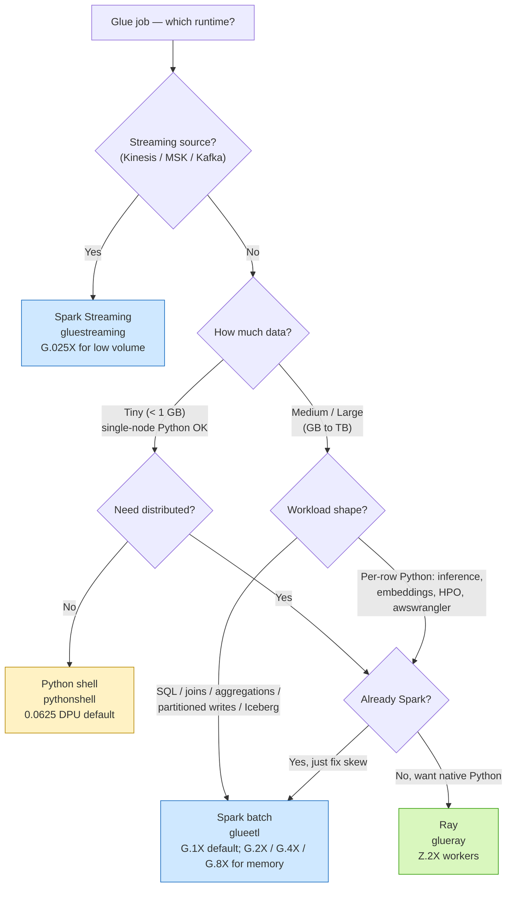
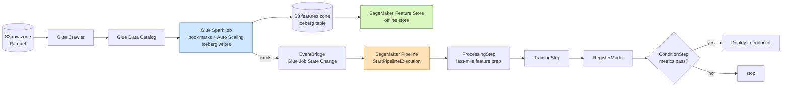

# Chapter 16 — AWS Glue Jobs: Spark, Python Shell, and Ray

> **Goal of this chapter:** to give you a working mental model of the *compute* side of AWS Glue — the four job runtimes (Spark, Spark Streaming, Python shell, Ray), the DPU economics that decide how much each one costs, the orchestration scaffolding that ties them into pipelines (triggers, workflows, interactive sessions, connections), and the three patterns by which a Glue job feeds a SageMaker training run. Chapter 13 covered the **Glue Data Catalog** — Glue's metastore face. Chapter 14 covered **Amazon EMR** — the un-opinionated big-data alternative. This chapter is about everything in between: the AWS-native, serverless, schema-aware ETL fabric that the MLA-C01 exam treats as the default answer whenever the stem says "transform data" or "merge data from multiple sources" without screaming "give me a cluster." By the end you should be able to look at a question stem — *"a data engineer with limited Spark experience needs to build an ETL job"*, or *"the nightly feature pipeline is overprovisioned and costs too much"* — and pick the right Glue runtime, the right worker type, the right pricing tier, and the right orchestration glue without going back to first principles.

---

## 16.1 Why a whole chapter on Glue jobs

The MLA-C01 exam guide names Glue twice. Task 1.2 lists it as a transformation tool: *"Transforming data by using AWS tools (e.g., AWS Glue, DataBrew, Spark running on Amazon EMR, SageMaker Data Wrangler)."* Task 1.1 lists Glue and Spark for merging data from multiple sources. The Catalog half of Glue you already know from [Chapter 13](../part_c_data_ingestion_storage/13_glue_athena_lakeformation.md) — databases, tables, partitions, crawlers, schema registry, data quality. This chapter is about the **compute half**: the actual processes that read the data the Catalog points at, transform it, and write the result.

Glue is the AWS-native answer to "I have data in S3 / RDS / Redshift / Kafka and I need to clean, join, reshape, or feature-engineer it before it hits SageMaker." On the exam, you will see Glue as the right answer when:

1. **No cluster babysitting.** The team doesn't want to size, patch, scale, or terminate EMR master/core/task nodes.
2. **Bursty spend.** A serverless DPU-second billing model beats keeping an EMR cluster warm for jobs that run for 10 minutes a day.
3. **Schema-driven transform.** The output needs to land in the Glue Data Catalog so Athena, Redshift Spectrum, SageMaker Lakehouse, and SageMaker Feature Store can read it without a separate registration step.
4. **Incremental processing.** The pipeline must read only what's new since the last run — and you'd rather not write CDC plumbing yourself. Glue **job bookmarks** do this for free.
5. **Limited Spark expertise.** The author is a data engineer or data analyst who would rather drag-and-drop than write PySpark. **Glue Studio** generates the script for them.

Glue is the **wrong** answer when:

- You need **GPU training** — that's SageMaker.
- You need **stateful streaming joins past a 1–2 minute window** — that's Amazon Managed Service for Apache Flink (MSAF).
- You need **arbitrary container images with custom CUDA, native libraries, or kernel modules** — that's EMR on EKS or SageMaker Processing with a BYO image.
- You need **PB-scale `MERGE INTO` on Iceberg with hand-tuned executors** — that's EMR Serverless or EMR on EC2. ([Chapter 14](../part_c_data_ingestion_storage/14_emr_for_ml.md) covers when EMR beats Glue.)
- The transform is so small it runs in **seconds** on a single core — that's Lambda. Glue has a one-minute billing floor and a Spark cold start.

The market context matters too. The serverless-Spark-as-data-prep market in 2025–2026 has consolidated around three players: **AWS Glue** for AWS-native shops, **Amazon EMR** for big-data orgs running 10 TB+ pipelines, and **Databricks** for ML-led orgs that bought the Lakehouse story. Databricks publicly reported $2.6B in 2024 revenue growing ~57% YoY. None of that is on the exam — but it is the reason the cert dwells so heavily on Glue. AWS wants the AWS-native lane to be sticky, and Glue is the on-ramp.

⚠️ **Exam alert.** Whenever a stem says *"data engineer without Spark experience"* or *"visual ETL"* or *"drag and drop"*, the answer is **Glue Studio**, not "write a PySpark script." Whenever it says *"serverless ETL with a Catalog, no clusters to manage"*, the answer is **Glue**, not "EMR Serverless." EMR Serverless is the answer only when the stem also mentions custom JARs, specific Spark/Iceberg/Hudi versions, or PB-scale tuning.

---

## 16.2 The four Glue job runtimes

AWS Glue exposes **four distinct job runtimes**, each with its own API command name, its own pricing curve, and its own sweet spot. At least two MLA-C01 questions will require you to pick the right runtime from the stem alone.

| Runtime | API `Command.Name` | Engine | Min capacity | Typical use | Glue version availability |
|---|---|---|---|---|---|
| **Spark (batch)** | `glueetl` | Apache Spark on Glue runtime | 2 workers × G.1X = 2 DPU | Large batch ETL, joins, partitioned writes | 1.0, 2.0, 3.0, 4.0, 5.0, 5.1 |
| **Spark Streaming** | `gluestreaming` | Spark Structured Streaming (micro-batch) | 2 workers (G.025X allowed) | Continuous ingest from Kinesis, MSK, Kafka | 2.0+ |
| **Python shell** | `pythonshell` | Single-node CPython | 0.0625 DPU (default) or 1 DPU | Orchestration glue, small transforms, REST/Bedrock calls, ML scoring on small data | 1.0+ (Python 3.6 / 3.9 / 3.11 depending on version) |
| **Ray** | `glueray` | Ray 2.x on Glue runtime (Graviton) | 2 workers × Z.2X = 4 DPU | Distributed Python (Pandas, scikit-learn, XGBoost) **without Spark** | Glue 4.0+ (GA June 2024) |

### 16.2.1 Spark (`glueetl`) — the default

The most common runtime. Runs PySpark or Scala on AWS-tuned Spark. Glue 5.0 ships **Spark 3.5.4** and is documented by AWS as **32% faster and 22% cheaper** than Glue 4.0 on a TPC-DS-style 3 TB benchmark, with the AWS Glue Spark runtime measured **3.6× faster than open-source Spark 3.x**. On a heavier S3-bound TPC-DS run the same benchmark reports **58% faster, 36% cheaper** — that's the wider perf-win envelope most teams quote.

The console default when you create a Spark job without overriding capacity is **10 workers of G.1X** — that is, 10 DPU. That default is also the source of the "DPU sizing surprise" we'll look at in §16.11.7: most jobs don't actually need 10 workers and silently waste 40–80% of compute.

Use Spark for joins, aggregations, partitioned Parquet writes, Iceberg/Delta/Hudi MERGE INTO, anything that has to fan out across many cores.

### 16.2.2 Spark Streaming (`gluestreaming`)

Same Spark runtime, but built around Structured Streaming with micro-batches (1 second to several minutes per batch). Sources: Kinesis Data Streams, MSK, self-managed Kafka, Kafka with IAM auth, Kafka Connect MSK. Sinks: S3, Redshift, JDBC, OpenSearch, Iceberg, Hudi, Delta.

Two streaming-specific facts to memorise:

- **G.025X worker type** (¼ DPU) is supported on streaming jobs — important because a 24/7 stream at G.1X gets expensive fast. The docs explicitly recommend G.025X for "low-volume streaming jobs."
- Glue Streaming jobs **use S3 checkpoints, not bookmarks**. Bookmarks (§16.7) are a batch-only mechanism.

### 16.2.3 Python shell (`pythonshell`) — single-node, no Spark

A single-node CPython runtime with **no Spark at all**. Use this when:

- You're calling external APIs (Bedrock, OpenAI-compatible, third-party SaaS) and the input/output is small.
- You're orchestrating — triggering Step Functions, posting to SNS, writing a manifest, copying a tiny file.
- You're doing a Pandas / scikit-learn transform on <1 GB of data.
- You need a cheap "watchdog" job inside a Glue workflow that doesn't justify Spark cold start.

Capacity is either **0.0625 DPU** (1/16 DPU: 1 vCPU, 4 GB RAM — the cheapest billable unit on Glue, default) or **1 DPU** (4 vCPU, 16 GB RAM, when your script needs more memory). The per-DPU-hour rate is the same as Spark, but the floor is 16× lower.

### 16.2.4 Ray (`glueray`) — distributed Python, no Spark

Generally available since **June 2024** on Glue 4.0+. Ray on Glue lets you run **distributed Python** without writing Spark. The Ray API surface (Ray Core, Ray Data, Ray Train) is friendlier to ML engineers who already use Pandas / scikit-learn / XGBoost / PyTorch and don't want to learn DataFrames. The worker type is **Z.2X** (2 vCPU, 8 GB) on Graviton, and you scale by setting `Number of workers`. The minimum is 2 workers, so the minimum billable job is 4 DPU.

Production teams in 2025 pick Ray over Spark in four scenarios:

1. **Python-native ML at scale** — distributed inference on 10M rows with a `transformers` model, embeddings generation across a product catalog, parallel hyperparameter search where each trial is a heavy Python function.
2. **Heavy Python dependency footprints** — when the job needs PyTorch, xgboost, lightgbm, transformers, pandas, pyarrow simultaneously. Ray's `--additional-python-modules` installs into every worker; there's no Spark-version-of-Pandas to dodge.
3. **Skewed workloads** — the classic case where 90% of your rows belong to 5 customers and a single Spark executor does all the work. With Ray, `ray.remote` per-customer or `Ray Data` with explicit parallelism lets you control task granularity directly.
4. **`awswrangler` at scale** — the canonical AWS-blog story. `awswrangler` ships `wr.distributed.modin()` that auto-distributes Pandas ops across a Ray cluster. You write `wr.s3.read_parquet(...)` and it scales horizontally with no extra code.

Ray adoption inside Glue is still smaller than Spark by a wide margin. The teams who pick it are usually ML-platform shops who already use Ray on EKS for training and want the same dev ergonomics for data prep.

> **Spark vs Ray on Glue rule of thumb.** Spark wins for SQL-like ETL, columnar joins, Catalog integration, predicate pushdown, and Iceberg/Delta/Hudi writes. Ray wins for **map-style Python over rows**, parallel HPO, distributed inference, and anything where "I have a Python function and I need to fan it out" describes the problem better than "I have a query."

### 16.2.5 Runtime decision tree



---

## 16.3 The DPU model — currency of Glue billing

A **Data Processing Unit (DPU)** is the abstract unit Glue bills you in. By the AWS canonical definition, **1 DPU = 4 vCPU + 16 GB RAM + ~64 GB disk** (the exact disk number varies slightly by worker type — see table). All Glue worker types are expressed as multiples of one DPU. Glue bills per second, with a **one-minute minimum** per job run.

### 16.3.1 Spark worker types (Glue 4.0 / 5.0 / 5.1)

| Worker type | DPU/worker | vCPU | RAM | Disk (free) | Best for |
|---|---|---|---|---|---|
| **G.025X** | 0.25 | 2 | 4 GB | ~34 GB | Low-volume **streaming only** (Glue 3.0+ streaming) |
| **G.1X** (default) | 1 | 4 | 16 GB | ~44 GB | Most ETL — joins, transforms, queries |
| **G.2X** | 2 | 8 | 32 GB | ~78 GB | Medium ETL, more memory headroom; OOM-on-shuffle relief |
| **G.4X** | 4 | 16 | 64 GB | ~230 GB | Demanding transforms, ML feature engineering on TB-scale joins |
| **G.8X** | 8 | 32 | 128 GB | ~485 GB | Largest demanding workloads |
| **G.12X** | 12 | 48 | 192 GB | ~741 GB | Very large + resource-intensive (Glue 4.0+) |
| **G.16X** | 16 | 64 | 256 GB | ~996 GB | Maximum compute per worker (Glue 4.0+) |
| **R.1X / R.2X / R.4X / R.8X** | 1 / 2 / 4 / 8 | memory-optimized | high mem-to-CPU ratio | varies | Workloads that OOM on G-series — skewed joins, wide aggregations (Glue 4.0+) |

**Regional caveat.** G.4X and G.8X are GA in roughly 16 commercial regions. **G.12X, G.16X, and the R-series are limited to about seven regions** (us-east-1, us-east-2, us-west-2, eu-west-1, eu-central-1, eu-south-2, ap-northeast-1 at time of writing). Expect a question that hides *"us-west-1 region"* in the stem to lock you out of G.12X.

**Startup latency caveat.** The docs explicitly call out that **G.12X, G.16X, and all R workers have higher startup latency**. If a stem stresses *"fast startup"* or *"short-lived jobs"*, prefer G.1X / G.2X.

### 16.3.2 The legacy "Standard" worker

Glue 0.9 and 1.0 used a "Standard" worker (1 DPU = 4 vCPU + 16 GB + 50 GB disk, 2 executors). It is still selectable for legacy jobs but **never pick it for new work** — G.1X dominates it on every axis. Glue 2.0+ removed the `MaxCapacity` knob for Spark jobs and forces you to choose `WorkerType` + `NumberOfWorkers` explicitly.

### 16.3.3 Python shell worker capacity

Python shell jobs use the **`MaxCapacity`** parameter (not `WorkerType` / `NumberOfWorkers`). Legal values:

- **0.0625 DPU** (1/16 DPU): default, the cheapest billable unit on Glue, ~$0.0275/hr floor (~$0.018/hr on Flex).
- **1 DPU**: when your Python script needs the full 16 GB of RAM.

### 16.3.4 Ray worker type

Ray jobs use **Z.2X** workers exclusively: 2 vCPU + 8 GB on Graviton. Set `WorkerType=Z.2X` and `NumberOfWorkers=N` with `N ≥ 2`. **Each Z.2X counts as 2 DPU for billing**, so the floor is 4 DPU per job.

---

## 16.4 Glue versions — Spark, Python, and runtime matrix

| Glue version | Spark | Python | Java | Base image | Status | Released |
|---|---|---|---|---|---|---|
| **5.1** | 3.5.x (perf-patched) | 3.11 | 17 | Amazon Linux 2023 | **Default for new jobs** | Nov 2025 |
| **5.0** | 3.5.4 | 3.11 | 17 | Amazon Linux 2023 | Current GA | Jan 2025 |
| **4.0** | 3.3.0 | 3.10 | 8 | Amazon Linux 2 | Supported, end-of-mainstream | 2022 |
| **3.0** | 3.1.1 | 3.7 | 8 | Amazon Linux 2 | Legacy | 2021 |
| **2.0** | 2.4.3 | 3.7 | 8 | Amazon Linux | Legacy | 2020 |
| **1.0 / 0.9** | 2.4 / 2.2 | 2.7 / 3.6 | 8 | — | Deprecated | 2017–2019 |

**Glue 5.0 highlights — memorise these for the exam:**

- Spark **3.5.4** + Glue Spark runtime is **3.6× faster** than vanilla open-source Spark on TPC-DS.
- **Iceberg 1.7.1, Hudi 0.15.0, Delta Lake 3.3.0** bundled out of the box.
- **Lake Formation fine-grained access control** for Spark DataFrames against Iceberg / Delta / Hudi tables — first Glue release with cell-level filters on open table formats.
- **`requirements.txt` Python dependency management** finally supported natively, alongside the older `--additional-python-modules` and `gluewheels.zip` mechanisms.
- **DataZone data lineage** auto-emitted by Glue jobs.
- Default `Job timeout` lowered from **2,880 minutes (48 hours) → 480 minutes (8 hours)** for Glue 5.0+ jobs.

⚠️ **Exam alert — the Glue 5.0 timeout trap.** An old Glue 4.0 job that always ran for 12 hours used to fit comfortably under the 48-hour default timeout. If you blindly migrate that job to Glue 5.0 without overriding the timeout, it will die at exactly 8 hours. The fix is to set `Timeout = 2880` (or any higher value) on the job configuration explicitly. Watch for stem language like *"a long-running migration job that previously succeeded now fails at 8 hours after upgrade to Glue 5.0"* — the answer is **override the default timeout**, not "switch to EMR."

**Glue 5.1 (Nov 2025)** is incremental: same Spark 3.5.x, plus faster cold start (via the `uv` Python installer), automatic partition pruning at the Catalog/Iceberg layer, native S3 Express One Zone access for shuffle-heavy workloads, and Arrow-optimised Python UDFs. It is now the default for new jobs in the console.

### 16.4.1 Migration story patterns (Glue 4.0 → 5.0)

Production teams reporting in 2025 follow a near-identical script when upgrading:

1. **Pilot on one job.** Pick a daily batch that's already idempotent and bookmark-friendly. Run Glue 5.0 side-by-side with 4.0 for a week.
2. **Watch the Python 3.11 break.** The most common pain point: `pyarrow` / `pandas` / `numpy` ABI changes mean any custom `.whl` built for 3.10 needs a rebuild.
3. **Watch the Java 17 break.** Custom UDFs that reflectively poked at Java internals (common with shaded protobuf or Kryo) often need `--add-opens` flags.
4. **Iceberg / Delta version bump.** Iceberg 1.0 → 1.7 is generally fine but **table-property defaults shift** (`write.format.default`, `write.parquet.compression-codec`). Re-run `OPTIMIZE` after migration.
5. **Bookmark state survives.** Glue's bookmark state is version-portable — you do **not** have to reset bookmarks when bumping 4.0 → 5.0.

Most teams report **30–40% real wall-clock improvement** on production workloads, lining up with AWS's headline 32% number.

---

## 16.5 Cost model

### 16.5.1 Price card (us-east-1, 2026)

| Component | Price | Notes |
|---|---|---|
| **Spark / Streaming — Standard execution** | **$0.44 / DPU-hour** | Per-second billing, **1-minute minimum** per job run |
| **Spark — Flex execution** | **$0.29 / DPU-hour** | ~34% discount. G.1X / G.2X only, batch only. See §16.5.3 |
| **Python shell** | $0.44 / DPU-hour | Min capacity 0.0625 DPU → ~$0.0275/hr floor |
| **Ray (Z.2X)** | $0.44 / DPU-hour | 2 DPU per worker; min 2 workers → 4 DPU floor |
| **Job bookmarks** | **Free** | State stored by Glue at no charge |
| **Triggers / workflows** | Free | You pay only for underlying job DPU-hours |
| **Crawlers** | $0.44 / DPU-hour | 1-minute minimum |
| **Data Catalog storage** | First 1M objects free, then $1.00 per 100k objects/month | Catalog requests: 1M free, then $1.00/M |
| **Interactive sessions** | $0.44 / DPU-hour | Charged for **session lifetime**, not just code execution. Set idle timeout |

### 16.5.2 Worked examples

A **Spark job with 10 × G.2X workers** (= 20 DPU) running for **6 minutes**:

- Standard: 20 DPU × 0.1 hr × $0.44 = **$0.88 per run**.
- Flex: 20 DPU × 0.1 hr × $0.29 = **$0.58 per run** (if Flex scheduler finds capacity in your window).

A **Python shell job at 0.0625 DPU for 30 seconds** (rounded to the 1-minute minimum):

- 0.0625 DPU × (1/60) hr × $0.44 = **$0.00046 per run**. Effectively free.

A **30-minute daily ETL with 10 × G.1X workers** — the canonical "is Flex worth it" case:

- Standard: 10 × 0.5 hr × $0.44 = $2.20/run → **$66/month**.
- Flex: 10 × 0.5 hr × $0.29 = $1.45/run → **$43.50/month**.
- **Savings: $22.50/month per job.** A platform team running 200 such jobs saves **$4,500/month** with no engineering work.

### 16.5.3 Glue Flex — when and when not

Flex grabs **opportunistic** capacity (AWS spare compute) and can scale workers up/down mid-run, billing only the workers actually present. The mechanics:

- Set via job property `Execution class = FLEX` (vs `STANDARD`).
- **Supported on Glue 3.0+, G.1X and G.2X only, batch Spark only.**
- **Not supported on G.4X+, G.12X, G.16X, R-series, or streaming jobs.**
- Worth ~34% off list price, but **startup latency is higher** — seconds to several minutes, occasionally longer. AWS reserves the right to take up to **24 hours** to start a Flex job in a worst-case capacity crunch. In practice this almost never fires, but it's why Flex is "non-SLA work only."
- Once started, **Flex jobs are not interrupted mid-run** (unlike EC2 Spot). You pay the startup tax, not a reliability tax.

**Use Flex for:** nightly batches with generous downstream windows, historical backfills, dev/test environments, post-pipeline DQ validation jobs.

**Avoid Flex for:** real-time pipelines, anything with a hard SLA (regulatory reporting, payment reconciliation), jobs in the SageMaker training critical path, and event-triggered jobs where downstream timeouts depend on prompt start.

⚠️ **Exam alert — Flex + Auto Scaling incompatibility (and the worker-type lock).** Flex is incompatible with Glue Auto Scaling (Flex already varies workers — they would fight). It is also incompatible with G.4X and larger workers. If a stem says *"use Flex with G.4X for cost savings"*, that's the wrong answer — it will fail validation. The right Flex configuration is **G.1X or G.2X, no Auto Scaling, batch only.**

---

## 16.6 Glue Studio — the visual ETL builder

**Glue Studio** is the drag-and-drop GUI that auto-generates PySpark (or Scala, or visual-only) under the hood. It is what AWS hands a data engineer who doesn't want to learn Spark.

### 16.6.1 What it gives you

- A canvas with **source nodes** (S3, Catalog tables, JDBC, Kafka, Kinesis), **transform nodes** (ApplyMapping, DropFields, Filter, Join, SQL Query, Aggregate, Pivot, **SageMaker AI batch inference** as a node), and **target nodes** (S3, Catalog, JDBC, Redshift, Iceberg / Hudi / Delta).
- **Auto-generated PySpark** you can copy out and edit (**one-way**: once you switch to "Script editor" mode, you cannot return to visual mode without rebuilding from scratch).
- Built-in **data preview** (samples up to 1 MB) for validating transforms before running.
- **Job notebooks** powered by Glue Interactive Sessions (§16.9).
- Right-sizing **cost / performance recommendations**.

### 16.6.2 When the exam picks Glue Studio

- Stem says *"data engineer with **limited Spark / PySpark experience**"* wants to build ETL.
- Stem says *"**visual ETL builder**"* or *"**drag and drop**"* — those are the keyword triggers.
- Team needs to onboard ETL fast without writing PySpark by hand.

### 16.6.3 When the exam picks scripts over Studio

- Stem says *"**full code control**"*, *"**CI/CD pipeline**"*, *"**unit-testable**"*, or *"**version-controlled in Git**"* — write PySpark scripts directly, version in Git, deploy via CDK / CloudFormation. Code review on JSON graph diffs is painful; PySpark text diffs are not.
- The transform is **dynamic / metadata-driven** (e.g., reading a YAML and building columns at runtime) — Studio's static nodes can't express that.
- You need libraries Studio doesn't expose (custom UDFs, third-party connectors).
- The job needs to be testable locally via the `aws-glue-libs` Docker image and `pytest`.

### 16.6.4 Pros / cons summary

| Pros | Cons |
|---|---|
| Zero-Spark onboarding | Generated code is verbose; hard to diff |
| Built-in preview catches schema bugs early | **One-way switch** to code mode |
| SageMaker AI batch-inference node native | No native Git integration; export → commit yourself |
| Recommends worker type & count | Can hide cost (auto-suggests larger workers) |
| Fast PoCs and prototypes | No local unit testing path |

**The reality check from production teams in 2025:** Visual ETL is widely used for prototyping, workshops, and PoCs. Most production-grade pipelines drop to script mode within the first iteration cycle, because code review, Git diffs, and CI/CD are all built around scripts. The places visual ETL stays in production are: regulated orgs with non-engineer authors (a compliance analyst owning a quarterly report job), Lake Formation–governed views with LF-tag access control, and pure "clean columns / derive features / write Parquet" pipelines with no business logic.

---

## 16.7 Job bookmarks — incremental processing the easy way

Job bookmarks are Glue's mechanism for "remember what I already processed and only do the new stuff this time." They are stored in Glue's service database **at no extra cost** and keyed by `job_name` + `transformation_ctx` (a per-source string you supply in the script).

### 16.7.1 Three modes (passed at job-run time)

| Mode | Behavior |
|---|---|
| **Enable** | Reads only new data since the last successful run, then updates state on `job.commit()` |
| **Disable** (default) | Reads the entire dataset every run. You are responsible for not double-writing |
| **Pause** | Reads only new data but **does NOT update state**. For ad-hoc / debug runs that shouldn't move the bookmark forward. Two sub-options: `--job-bookmark-from` and `--job-bookmark-to` (run IDs to bracket processing) — both must be supplied together |

### 16.7.2 Supported sources

| Source | Bookmark support |
|---|---|
| **S3 — JSON, CSV, Avro, XML, Parquet, ORC** | Yes (Glue 1.0+ for Parquet/ORC) |
| **JDBC** (RDS Postgres / MySQL / Aurora / SQL Server / Oracle / Redshift) | Yes — sequentially increasing or decreasing primary key (default) or user-specified columns |
| **DynamoDB** | **No** |
| **Kinesis / Kafka (streaming)** | **No** — streaming jobs use **checkpoints**, not bookmarks |
| **Relationalize transform** | Yes |

### 16.7.3 Mechanics and gotchas

- **S3 mechanism**: tracks the **last-modified timestamp** of objects. If an upstream job rewrites old files (touches mtime), Glue will reprocess them on the next run.
- **JDBC mechanism**: tracks the **max value of the bookmark key column** seen in the previous run. Bookmark keys must be **sequentially increasing or decreasing with no gaps** to be correct.
- **Case sensitivity**: Glue **does not support case-sensitive column names** as bookmark keys.
- **Non-deterministic source order**: if many S3 files share the same mtime across partitions and the job lists them in different order across runs, you can hit edge cases where the bookmark commits the "newest" timestamp seen and silently skips files that arrived just before it. Best practice: **partition by date/hour** and combine bookmarks with a pushdown predicate so bookmark precision matters less.
- **Reset / rewind**: `aws glue reset-job-bookmark --job-name X` clears the bookmark; use for backfill or replay. **Rewind does not clean outputs** — Glue only tracks sources, not sinks. If you don't want duplicates, write to a different target prefix.
- **Lake Formation cell-level filters disable bookmarks**: jobs reading tables with LF row/column filters **cannot use job bookmarks or bounded execution** (documented restriction).
- **Single source of truth in script**: every source/sink in the script must have a unique `transformation_ctx="..."` string. Reusing one across sources causes state collisions.
- **Driver OOM at huge fan-in**: bookmarks list all files in each input partition in driver memory. For directories with millions of small files this OOMs the driver — use the Glue **S3 file lister** option to stream the listing instead.

⚠️ **Exam alert — JDBC bookmark key must be monotonic.** If a question says *"JDBC source with UUID primary key, bookmarks enabled, rows are silently missing or duplicating"*, the diagnosis is **non-monotonic bookmark key**. The fix is either (a) add a monotonic column (`updated_at TIMESTAMP`, an auto-increment `id BIGSERIAL`, a sequence) and set it as the bookmark key, or (b) replace bookmarks with a partition-by-date strategy + pushdown predicate. UUIDs and hash PKs are forever wrong for JDBC bookmarks.

### 16.7.4 The five classic "bookmarks silently miss data" failures

War stories from production teams in 2025:

1. **Changed input S3 path without changing `transformation_ctx`.** You move `s3://raw/events/` to `s3://raw/events_v2/`. The old bookmark says "I processed up to 2025-04-15T00:00 in `src_events`." The new path has no objects matching that timestamp. Glue dutifully skips everything and processes zero rows — **silently**. Fix: any path change requires a new `transformation_ctx` *or* an explicit `reset-job-bookmark`.
2. **`--max-concurrent-runs > 1` on a bookmarked job.** Two concurrent runs see the same bookmark state at start, both process the same objects, and the later commit overwrites the earlier one. Result: duplicates on one slice, missed processing on another. Fix: keep `max-concurrent-runs = 1` for any bookmarked job.
3. **Forgotten `job.commit()`.** Job runs, transforms, writes output, exits zero — but the bookmark never advances. Next run reprocesses everything. Fix: always call `job.commit()` (in a `finally` block ideally).
4. **Missing `transformation_ctx`.** The parameter is technically optional. Without it, bookmarks silently do nothing — no error, no warning. Fix: lint for `from_catalog(...)` / `from_options(...)` calls that omit it.
5. **New partitions not registered in the Catalog.** Bookmarks against a Catalog table watch the *catalog's* partition list. If the crawler hasn't run, or partition projection isn't configured, new S3 prefixes are invisible to bookmark logic and get missed. Fix: use partition projection, or chain `crawler → job` in a Glue Workflow, or write from the producing job with `enableUpdateCatalog=True`.

### 16.7.5 Skeleton script pattern

```python
from awsglue.context import GlueContext
from awsglue.job import Job
from awsglue.utils import getResolvedOptions
from pyspark.context import SparkContext
import sys

args = getResolvedOptions(sys.argv, ['JOB_NAME'])
sc = SparkContext()
gc = GlueContext(sc)
job = Job(gc)
job.init(args['JOB_NAME'], args)        # reads bookmark state

dyf = gc.create_dynamic_frame.from_catalog(
    database='lake',
    table_name='clicks_raw',
    transformation_ctx='clicks_raw_src',   # KEY — uniquely identifies this source
)
# ... transforms ...
gc.write_dynamic_frame.from_options(
    frame=out,
    connection_type='s3',
    connection_options={'path': 's3://lake/clicks_curated/'},
    format='parquet',
    transformation_ctx='clicks_curated_sink',
)

job.commit()                              # commits bookmark state atomically
```

The `transformation_ctx` is the bookmark state key. Two rules to internalize: **never reuse the string** across sources or sinks within a single script, and **never silently rename it** in production — that orphans existing state.

---

## 16.8 Triggers and workflows — orchestration within Glue

Glue ships its own lightweight scheduler. You don't have to reach for Step Functions or MWAA for every DAG.

### 16.8.1 Trigger types

| Trigger type | Fires on | Typical use |
|---|---|---|
| **On-demand** | Manual `start-trigger` API call | Backfill, debug |
| **Scheduled** | Cron expression (UTC) | Hourly / daily / weekly batch |
| **Conditional** | Watches **other jobs or crawlers** for `SUCCEEDED` / `FAILED` / `TIMEOUT` / `STOPPED` states | Multi-step DAG: ingest → transform → publish |
| **EventBridge** | Any EventBridge rule (S3 object created, custom event, schedule rule) | Event-driven: kick off a crawler when a new S3 partition lands |

A single trigger can start **multiple jobs in parallel** (fan-out) and can require **multiple upstream jobs to succeed** (fan-in / AND logic).

### 16.8.2 Workflows

A **Glue workflow** is a named container that groups triggers and jobs into a DAG with a single shared run history and one graph view in the console. Each workflow run gets a `WORKFLOW_RUN_ID` you can propagate into jobs via `--workflow-name` and `--workflow-run-id` job parameters. Workflows expose **run properties** — a key/value store shared across the DAG (e.g., the first job writes `processing_date=2026-05-26` to run properties, and the third job reads it).

### 16.8.3 Glue workflows vs Step Functions

| Dimension | Glue workflows | Step Functions |
|---|---|---|
| Cost | **Free** (pay only DPU-hr) | $25 per million state transitions (Standard) |
| Visual editor | Yes | Yes (Workflow Studio) |
| Non-Glue tasks (Lambda, ECS, SageMaker) | Limited (via EventBridge bridges) | First-class (`Task` state for any service) |
| Error handling / retries | Basic (job-level retries 0–10) | Rich (catch/retry per state, dynamic parallelism, Map state) |
| Cross-account / cross-region | No | Yes |
| Right answer when… | DAG is **Glue-only**, simple, cost-sensitive | DAG includes **non-Glue services**, human approval, sophisticated branching |

**Exam rule of thumb.** *"Orchestrate **only** Glue jobs and crawlers, minimise cost"* → Glue workflow. *"Orchestrate Glue + Lambda + SageMaker training + manual approval"* → Step Functions. *"Trigger a SageMaker Pipeline after a Glue job finishes"* → EventBridge rule on Glue Job State Change → StartPipelineExecution.

---

## 16.9 Glue Interactive Sessions — REPL-style development

Before 2021, developing a Glue job meant editing a `.py` file in S3, running the job, waiting 1–2 minutes for cold start, looking at CloudWatch logs, and iterating. **Glue Interactive Sessions** fixed this with serverless Jupyter kernels that connect to a real Glue Spark or Ray runtime.

### 16.9.1 Where you launch them

- **AWS Glue Studio notebook UI** (in-console Jupyter).
- **SageMaker Studio JupyterLab** — pick the "Glue PySpark" kernel and your notebook code runs inside a real Glue session, not the local Studio compute instance. This is the killer ML-engineer use case: prototype features at Glue scale, graduate the script to a scheduled job with zero rewrite.
- **VS Code (AWS Toolkit)** — same idea, local editor.
- **Local Jupyter** via the `aws-glue-sessions` PyPI package + magics like `%session_id_prefix`, `%glue_version`, `%number_of_workers`.

### 16.9.2 The cost gotcha

Sessions are billed at the **same $0.44/DPU-hour** as jobs, but they're billed for **wall-clock session life**, not just code execution. The default idle timeout is **2,880 minutes (8 hours)**, which means leaving a session open overnight at 10 DPU costs **$35**. Set `%idle_timeout 30` (or smaller) at session start and configure it in your IAM/SCP defaults.

### 16.9.3 Magic commands worth memorising

```
%status                                  # current session state
%list_sessions                           # all sessions for this user
%stop_session                            # explicit teardown
%idle_timeout 30                         # minutes before auto-stop
%number_of_workers 5                     # change session size
%glue_version 5.0                        # pin to a Glue version
%additional_python_modules pandas==2.2.2,scipy
```

### 16.9.4 Exam triggers

- *"Data scientist wants to **interactively develop** Glue ETL from SageMaker Studio"* → **interactive session**.
- *"Wants a Jupyter notebook backed by Glue Spark, not local Studio compute"* → **interactive session**, not a Studio compute kernel.
- *"Wants to debug bookmark state or partition pushdown interactively"* → **interactive session**.

---

## 16.10 Glue connections — getting to non-S3 data

A **Glue connection** is a stored, reusable bundle of network + auth configuration that lets a Glue job reach a non-S3 source. The exam loves connections because they entangle networking, secrets, and IAM in a single object.

### 16.10.1 Connection types

| Type | Reaches | Auth |
|---|---|---|
| **JDBC** | RDS / Aurora / Redshift / on-prem SQL via VPC | Username/password from **Secrets Manager**, or IAM auth on RDS Postgres/MySQL & Redshift |
| **Network** | Any TCP service in a VPC subnet | VPC config only; auth handled inside the script |
| **Kafka** | Self-managed Kafka / MSK / MSK Serverless | SASL/SCRAM, IAM, or SSL |
| **Marketplace / Custom connector** | Snowflake, MongoDB Atlas, Salesforce, etc. | Connector-specific |
| **SaaS / Salesforce / SAP** | Native Glue SaaS connectors | OAuth / API key |
| **MongoDB / DocumentDB** | Document stores | Username/password |
| **AWS Lake Formation** | Cross-account governed tables | LF permissions |

### 16.10.2 VPC plumbing — the four gotchas

When a Glue job uses a VPC connection:

1. Glue launches an **ENI** in your specified subnet for each worker.
2. The subnet must have a **NAT Gateway or VPC endpoints** for the job to reach S3 (script bucket, temp dir, Catalog metadata, CloudWatch Logs, KMS, Secrets Manager). **Forgetting this is the #1 Glue networking failure mode** — the job sits forever trying to fetch its own script and times out.
3. Best practice: attach **Gateway endpoints** for **S3** and **DynamoDB**, **Interface endpoints** for `glue`, `monitoring`, `logs`, `sts`, `secretsmanager`, `kms`. This avoids NAT egress charges that can otherwise dominate the job's bill.
4. The security group on the Glue ENI must **allow self-referencing on all TCP** (Spark workers talk to each other) and **outbound to the target database port**.
5. **Two AZs minimum.** Multi-AZ subnets per single connection aren't supported, but you can reference multiple connections from a job for AZ resilience.

### 16.10.3 Secrets

Best practice: store DB credentials in **Secrets Manager**, grant the Glue IAM role `secretsmanager:GetSecretValue` on that ARN, and reference it from the connection or pull it inside the script with `boto3`. **Never** put plain-text passwords in job parameters — they end up in CloudTrail and CloudWatch logs.

---

## 16.11 PySpark on Glue — the patterns that matter

Glue Spark gives you a superset of PySpark with a handful of Glue-specific concepts the exam tests directly.

### 16.11.1 DynamicFrame vs DataFrame

| | DynamicFrame | DataFrame |
|---|---|---|
| **Schema** | Self-describing per row (handles schema drift in JSON / semi-structured) | Single enforced schema across the partition |
| **Type system** | "DynamicRecord" — multiple types per field allowed via `Choice` | Strict; one type per column |
| **Origin** | AWS Glue-specific | Open-source Spark |
| **Transforms** | `ApplyMapping`, `DropFields`, `RenameField`, `Relationalize`, `Unbox`, `ResolveChoice`, `SelectFields`, `SplitFields` | Standard Spark SQL + DataFrame API |
| **Catalog write-back** | First-class (`enableUpdateCatalog=True`) | Possible but more code |
| **Optimizer integration** | Weaker | Full Catalyst |
| **Use it when** | Reading messy JSON / semi-structured where field types vary across rows | All other cases — better optimizer integration |

**Convert** with `dyf.toDF()` and `DynamicFrame.fromDF(df, gc, "name")`. The canonical pattern: **DynamicFrame for source ingestion** (let Glue resolve choices), then **`toDF()` for the heavy transform** (use Catalyst), then **`fromDF()` to write back through Glue** (so Catalog updates and bookmarks work).

### 16.11.2 Predicate pushdown — the single biggest cost lever

For Catalog-registered Parquet / ORC tables, push **partition filters** server-side before any data is scanned:

```python
dyf = gc.create_dynamic_frame.from_catalog(
    database='lake', table_name='events',
    push_down_predicate="year='2026' AND month='05'",
    transformation_ctx='events_src',
)
```

Wrong partition filters mean **100× the DPU-hours**. This is the single most impactful cost lever in Glue Spark.

### 16.11.3 ApplyMapping and DropFields

```python
mapped = ApplyMapping.apply(
    frame=dyf,
    mappings=[
        ("user_id",  "string", "user_id",   "string"),
        ("event_ts", "long",   "event_time","timestamp"),
        ("payload.amount_cents", "long", "amount_cents", "long"),
    ],
)
slim = DropFields.apply(frame=mapped, paths=["debug", "internal_flags"])
```

ApplyMapping is the canonical way to **rename + cast + flatten** in one call; it understands dot-notation for nested JSON. DropFields is the inverse — for when you want everything except a few PII columns.

### 16.11.4 ResolveChoice — schema drift survival

When a field is sometimes a string and sometimes a struct (common in event JSON), `ResolveChoice` is the only safe coercion:

```python
fixed = ResolveChoice.apply(frame=dyf, choice="make_struct")
# alternatives: "make_cols" (split into one column per type),
#               "cast:string", "match_catalog"
```

### 16.11.5 Canonical feature-engineering skeleton

The AWS Big Data Blog publishes a handful of Glue PySpark templates that production ML teams reuse. The most common: **crawl → catalog → read → transform → write feature table**:

```python
from awsglue.context import GlueContext
from awsglue.dynamicframe import DynamicFrame
from pyspark.context import SparkContext
from pyspark.sql import functions as F

sc = SparkContext.getOrCreate()
gc = GlueContext(sc)

src = gc.create_dynamic_frame.from_catalog(
    database="raw_db",
    table_name="orders",
    transformation_ctx="src_orders",          # bookmarks
    push_down_predicate="dt >= '2026-05-01'", # partition pruning
)

df = src.toDF()

features = (df
    .withColumn("order_dow", F.dayofweek("order_ts"))
    .withColumn("log_amount", F.log1p("amount"))
    .groupBy("customer_id")
    .agg(
        F.count("*").alias("order_count_30d"),
        F.sum("amount").alias("revenue_30d"),
        F.avg("log_amount").alias("avg_log_amount"),
    )
)

out = DynamicFrame.fromDF(features, gc, "out")
gc.write_dynamic_frame.from_options(
    frame=out,
    connection_type="s3",
    connection_options={"path": "s3://features/customer_features/"},
    format="parquet",
    transformation_ctx="out_features",
)
```

### 16.11.6 Rolling window aggregations and broadcast joins

Two other patterns to recognise on the exam:

```python
from pyspark.sql.window import Window
w_7d = (Window.partitionBy("customer_id")
              .orderBy(F.unix_timestamp("event_ts"))
              .rangeBetween(-7*86400, 0))

df = (df.withColumn("rolling_7d_count", F.count("*").over(w_7d))
        .withColumn("rolling_7d_sum",   F.sum("amount").over(w_7d)))

# Broadcast a small dim table to avoid a shuffle on the big fact join:
from pyspark.sql.functions import broadcast
enriched = events.join(broadcast(customer_dim), "customer_id", "left")
```

Glue 5.0's Iceberg 1.7 also supports **`MERGE INTO`** natively — heavily used in late-arriving feature pipelines:

```sql
MERGE INTO features.customer_30d AS t
USING staging.customer_30d_today AS s
ON t.customer_id = s.customer_id
WHEN MATCHED THEN UPDATE SET *
WHEN NOT MATCHED THEN INSERT *
```

### 16.11.7 Auto Scaling — the fix for the DPU sizing surprise

The classic Glue cost antipattern: a team launches a job, picks "default 10 workers" from the console, runs it for six months, and never revisits. The Spark UI shows **three of the ten executors did 95% of the work** — the other seven sat idle. Three forces drive this:

1. **No native back-pressure.** Spark statically allocates executors at job start; if your data only has 3 useful partitions, the other 7 executors literally do nothing.
2. **Skewed input.** A few large files or partitions dominate the runtime; adding more workers doesn't help.
3. **Driver bottlenecks.** Single-node coordination work (listing 200K S3 objects) can't be parallelised.

**Auto Scaling (Glue 3.0+)** is the fix. Set `--enable-auto-scaling true`. Glue dynamically grows / shrinks the executor pool based on real-time DAG parallelism. AWS's published benchmark:

- **Without Auto Scaling:** 8.71 DPU-hours.
- **With Auto Scaling:** 1.48 DPU-hours — same dataset, same result, **~83% reduction**.

Production teams in 2025 report 30–60% savings as typical, with >80% reserved for jobs that have huge "wait for one slow stage" tails.

**Heuristics:**

- Default to **G.1X + Auto Scaling on + `MaxWorkers=20`**.
- Watch CloudWatch `glue.driver.aggregate.numCompletedTasks` vs `glue.ALL.jvm.heap.usage` — high tasks with low heap means you're underutilising; high heap with low tasks means **bump to G.2X**.
- Use **G.2X when shuffles spill to disk** (stage retries with `OutOfMemoryError` or `FetchFailedException` are the giveaway).
- Use **G.4X / G.8X for genuinely huge joins** — explicitly released for ML feature engineering on TB-scale data.
- **Cap `MaxWorkers`** at 2–4× the expected steady state. Auto Scaling can run away if a brief burst of parallelism shows up.
- **Auto Scaling is incompatible with Flex.** Pick one.

---

## 16.12 Glue vs EMR vs Athena vs SageMaker Processing — decision matrix

Recapping [Chapter 14](../part_c_data_ingestion_storage/14_emr_for_ml.md) with a Glue-centric lens:

| Need | Right answer | Why |
|---|---|---|
| Serverless ETL with Catalog integration, schema drift, bookmarks | **Glue Spark** | Built for it |
| Visual ETL for non-Spark developers | **Glue Studio** (or DataBrew for code-free profiling, see [Ch 17](17_databrew.md)) | Visual generation |
| Distributed Python on familiar Pandas / sklearn APIs | **Glue Ray** | Spark-free distributed Python |
| Long-running cluster with custom AMIs, deep Hudi/Iceberg tuning, GPU jobs | **EMR on EC2 / EMR on EKS** | Cluster control, GPUs, custom runtimes |
| Spark serverless with full Spark feature parity (Spark Connect, custom Hive metastores) | **EMR Serverless** | Closer to OSS Spark; better for huge bursty jobs |
| Ad-hoc SQL over S3 with no infra | **Athena** | SQL-only, pay-per-scan |
| ML-specific preprocessing inside a SageMaker Pipeline | **SageMaker Processing** | Same role / network as training; first-class with Pipelines |
| Light Python data prep < a few GB, called inside an ML pipeline | **Glue Python shell** *or* SageMaker Processing (small container) | Cheap, single-node |
| Tiny serverless function on each new file | **Lambda** (not Glue) | Glue has a 1-minute floor and a Spark cold start |

**Mental model.** Glue is the **AWS-native, schema-aware ETL fabric**. EMR is the **open-source big-data lab**. Athena is the **SQL window into S3**. SageMaker Processing is the **ML team's Glue with native model context**.

---

## 16.13 Glue → SageMaker — the integration points

For the MLA-C01 you need to know **six** ways Glue feeds SageMaker.

1. **Glue Crawler → Data Catalog → SageMaker Feature Store offline (Iceberg).** Athena and SageMaker Feature Store both read the same Catalog. See [Chapter 19](19_feature_store.md).
2. **Glue Spark job → Parquet on S3 → SageMaker training (File / FastFile / Pipe mode).** The canonical training-data path.
3. **Glue Studio visual job → SageMaker AI inference node.** Applies a deployed SageMaker endpoint to a column inside the ETL job, for batch enrichment.
4. **Glue interactive session in SageMaker Studio.** Notebook code prototyped against real Glue Spark, graduated to a scheduled job.
5. **SageMaker Pipelines → Glue job step (`GlueJobStep`).** A Pipeline invokes an existing Glue job as one of its steps. See §16.13.1.
6. **Glue Data Quality results → SageMaker Model Monitor.** Emit DQ scores to CloudWatch; Model Monitor consumes them as data-quality drift signals.

### 16.13.1 `GlueJobStep` vs `ProcessingStep` + `PySparkProcessor` — the SageMaker Pipelines choice

A SageMaker Pipeline can run Spark in **two** different ways. The MLA-C01 cares about both, because the right answer depends entirely on who owns the code.

**Option A: `GlueJobStep` — invoke an existing Glue job**

```python
from sagemaker.workflow.glue_step import GlueJobStep
from sagemaker.workflow.execution_variables import ExecutionVariables

glue_step = GlueJobStep(
    name="FeatureEngineering",
    job_name="feature-eng-prod",        # existing Glue job ARN/name
    arguments={"--input_date": ExecutionVariables.START_DATETIME},
)
```

- **Pros:** Glue manages the cluster; cheaper for true ETL workloads; uses your existing Glue tooling, IAM, Catalog, bookmarks, Auto Scaling. One team owns the ETL.
- **Cons:** Two control planes (Glue + SageMaker). Failure modes split across services. Slightly higher latency for short jobs.

**Option B: `ProcessingStep` with `PySparkProcessor`**

```python
from sagemaker.spark.processing import PySparkProcessor
from sagemaker.workflow.steps import ProcessingStep

spark_proc = PySparkProcessor(
    framework_version="3.5",
    role=role,
    instance_type="ml.m5.4xlarge",
    instance_count=4,
)
step = ProcessingStep(
    name="FeatureEngineering",
    processor=spark_proc,
    code="feature_eng.py",
)
```

- **Pros:** Single control plane. Tight SageMaker IAM / network / VPC alignment. Easier debugging — one place to look. Natural fit when the Spark job is small and ML-team-owned.
- **Cons:** You manage instance count yourself (no Glue-style Auto Scaling). No Catalog, no bookmarks. Per-job clusters spin up cold each time.

**Decision table:**

| Situation | Use |
|---|---|
| Existing Glue job, owned by the data platform team | **`GlueJobStep`** |
| New Spark step, ML team owns end-to-end | **`PySparkProcessor`** |
| Need Glue Catalog / bookmarks / Auto Scaling | **`GlueJobStep`** |
| Need tight VPC / KMS / network controls under the ML team's IAM | **`PySparkProcessor`** |
| Workload is huge (TB) and runs nightly | **`GlueJobStep` + Auto Scaling** |
| Workload is small (GB) and runs on demand | **`PySparkProcessor`** |
| Trigger an ML pipeline *after* a Glue job finishes (not as a step) | **EventBridge rule on Glue Job State Change → StartPipelineExecution** |

### 16.13.2 The mature production pattern

The most common 2025 architecture in a mature org:



The Glue job and the SageMaker Pipeline live as **two separate artifacts**, glued together by an EventBridge rule. This separation is the sane production pattern — the data team owns the data and the ML team owns the model. Forward references: [Ch 19](19_feature_store.md) (Feature Store), [Ch 43](../part_h_orchestration_cicd/43_pipelines.md) (SageMaker Pipelines deep dive).

---

## 16.14 Anti-patterns and exam traps — the top 10

1. **Picking Glue for sub-minute jobs.** The 1-minute floor + Spark cold start make Glue a bad fit. Use Lambda for "tiny serverless function per file."
2. **Standard execution for nightly backfills.** Flex saves ~34%. Exam hint: *"non-urgent"*, *"best-effort"*, *"flexible timing"*.
3. **Spark for a tiny transform.** A 10-line transform on a 50 MB file should be **Python shell** (~$0.0005/run) or Lambda, not a 10-DPU Spark cold start.
4. **JDBC bookmark on a UUID PK.** Silent data loss or duplication. Bookmark keys **must be monotonic**.
5. **Forgetting `transformation_ctx`.** Bookmarks silently do nothing — no error, full reprocess every run.
6. **VPC connection without an S3 endpoint or NAT gateway.** The job sits forever trying to fetch its own script from S3.
7. **G.12X / G.16X / R.* in a non-supported region.** API call rejected. Plan for us-east-1, us-east-2, us-west-2, eu-west-1, eu-central-1, eu-south-2, ap-northeast-1 if you need them.
8. **Forgetting Glue 5.0's default timeout dropped to 8 hours.** A long-running migration job that used to fit under the old 48-hour default suddenly dies. Override `Timeout` explicitly.
9. **Reading a Lake Formation cell-filtered table with bookmarks enabled.** Glue silently disables incremental reads (documented restriction).
10. **Mixing Flex with G.4X+ or Auto Scaling.** Both combos fail validation. Flex is G.1X / G.2X only, no Auto Scaling.

---

## 16.15 Quick reference — exam-day cheat sheet

- **1 DPU = 4 vCPU + 16 GB RAM + ~64 GB disk.**
- **Default Glue version for new jobs: 5.1.**
- **Standard rate: $0.44/DPU-hr. Flex rate: $0.29/DPU-hr.**
- **Per-second billing, 1-minute minimum.**
- **Job bookmarks are free.**
- **Glue 5.0+ default timeout = 8 hours** (was 48 hr in ≤ 4.0). Override explicitly for long jobs.
- **Python shell min DPU = 0.0625.** Ray min = 2 × Z.2X = **4 DPU**.
- **Flex: G.1X / G.2X only, batch Spark only, no Auto Scaling, no G.4X+, no streaming.**
- **G.025X is streaming-only.**
- **G.12X / G.16X / R-series**: ~7 regions only, higher startup latency.
- **Bookmark JDBC key must be monotonic.** Reset with `aws glue reset-job-bookmark`.
- **Lake Formation cell-level filters disable bookmarks and bounded execution.**
- **DynamoDB and Kinesis/Kafka are unsupported as bookmark sources.** Streaming uses checkpoints.
- **Glue Studio = visual; Interactive Sessions = notebook; Workflows = orchestration; Connections = networking + secrets.**
- **`GlueJobStep`** = invoke existing Glue job from a SageMaker Pipeline. **`ProcessingStep` + `PySparkProcessor`** = run a new PySpark script inside Pipelines, ML-team-owned.

---

## 16.16 Exercises

1. **Runtime picker (5 stems).** For each, name the runtime (Spark batch, Spark Streaming, Python shell, Ray) and one reason:
   (a) Read a 300 GB Parquet feature table, join against a 5 GB dim, write partitioned Parquet back.
   (b) Apply a Hugging Face sentence-transformer to every row of a 10M-row product catalog.
   (c) Continuously ingest a Kafka topic into Iceberg with 2-minute micro-batches.
   (d) Call Amazon Bedrock per row of a 200-row test set to score model output quality.
   (e) Run `awswrangler.s3.read_parquet` over 80 GB of files using familiar Pandas APIs.

2. **DPU sizing.** A nightly ETL processes 200 GB of CSV → Parquet. The team has it set to **20 × G.4X workers** and it runs for 45 minutes. Spark UI shows three executors did most of the work. Estimate the monthly cost at the current sizing, then propose a sizing strategy (worker type, count, Auto Scaling, Standard vs Flex) and estimate the new monthly cost.

3. **Bookmark debug.** A Glue job reads a JDBC table `orders` with primary key `order_uuid` (UUID v4). Bookmarks are enabled. Each run inserts the same rows twice or skips arbitrary windows. Diagnose in 2 sentences and propose two fixes.

4. **Glue 5.0 migration.** You're migrating a Glue 4.0 job that always takes 12 hours to complete. The migration succeeds in dev. In prod, the first run fails after 8 hours. What changed, and what's the one-line fix?

5. **Pipelines integration.** Your data platform team owns a Glue job `cust_features_v3` that runs nightly. Your ML team needs to retrain a model **only when that job succeeds**. Sketch the architecture (two acceptable patterns; name the AWS services involved in each).

6. **Connection failure.** A new Glue job in a private VPC subnet hangs on the very first run and times out after 30 minutes with no useful logs. The IAM role is correct. List the three networking misconfigurations you'd check first.

7. **Studio vs script.** A risk-and-compliance analyst (SQL but not Python) needs to materialise a quarterly regulatory report from three Catalog tables. The platform team requires that all production jobs are reviewed via pull request and unit-tested. Which Glue authoring surface do you recommend, and why? What's the compromise if the platform team won't budge on the PR/test requirement?

---

## 16.17 Sources

1. AWS Glue Developer Guide — *Configuring job properties for Spark jobs* — <https://docs.aws.amazon.com/glue/latest/dg/add-job.html> (worker types, DPU specs, Flex execution, timeout defaults, Lake Formation restrictions, region availability).
2. AWS Glue Developer Guide — *Using Python libraries with AWS Glue* — <https://docs.aws.amazon.com/glue/latest/dg/aws-glue-programming-python-libraries.html> (`requirements.txt`, `--additional-python-modules`, `gluewheels.zip`, Python-version matrix).
3. AWS Glue Developer Guide — *Tracking processed data using job bookmarks* — <https://docs.aws.amazon.com/glue/latest/dg/monitor-continuations.html> (Enable / Disable / Pause modes, JDBC monotonic-key rule, S3 last-modified mechanism, rewind, OOM gotcha).
4. AWS Glue Pricing — <https://aws.amazon.com/glue/pricing/> (per-second billing, 1-minute minimum, Flex rate, Python shell capacity tiers).
5. AWS Big Data Blog — *Introducing AWS Glue 5.0 for Apache Spark* (Jan 2025) — Spark 3.5.4, Iceberg 1.7.1, 3.6× speedup vs OSS Spark, LF FGAC for DataFrames, 32% faster / 22% cheaper benchmark.
6. AWS Big Data Blog — *Introducing AWS Glue 5.1 for Apache Spark* (Nov 2025) — `uv` Python installer, automatic partition pruning, S3 Express One Zone.
7. AWS Glue Developer Guide — *Migrating AWS Glue for Spark jobs to AWS Glue 5.0* — <https://docs.aws.amazon.com/glue/latest/dg/migrating-version-50.html>.
8. AWS What's New — *AWS Glue for Ray now generally available* (June 2024) — Z.2X worker type, distributed Python without Spark.
9. AWS Big Data Blog — *Introducing AWS Glue Flex jobs: Cost savings on ETL workloads* (Flex mechanics, 34% discount, 24-hour SLA, restrictions).
10. AWS Big Data Blog — *Introducing AWS Glue Auto Scaling* (8.71 → 1.48 DPU-hour benchmark, dynamic executor allocation).
11. AWS Big Data Blog — *Scale your AWS Glue for Apache Spark jobs with G.4X and G.8X workers* (regional availability, ML feature-engineering use case).
12. AWS Big Data Blog — *Scale AWS SDK for pandas workloads with AWS Glue for Ray* (`awswrangler` + Modin on Ray pattern).
13. SageMaker Developer Guide — *Run a Processing Job with Apache Spark* and *Add a step* (PySparkProcessor, GlueJobStep in Pipelines).
14. Phase 1 notes — `notes/03_data_services.md` §6 (Glue versions table, DPU model recap).
15. Phase 1 notes — `notes/ch16_docs.md` and `notes/ch16_practice.md` (this chapter's research base).
