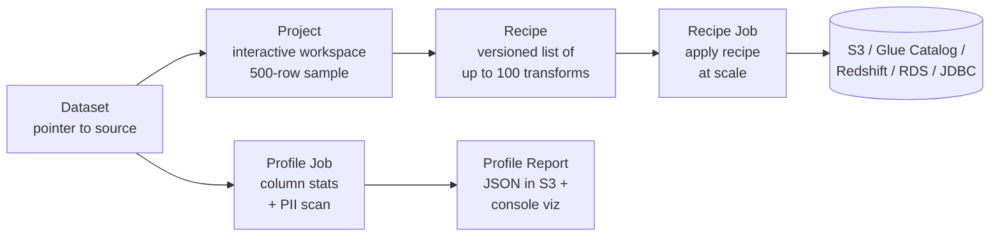
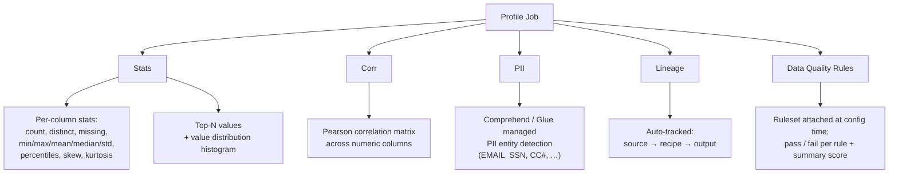
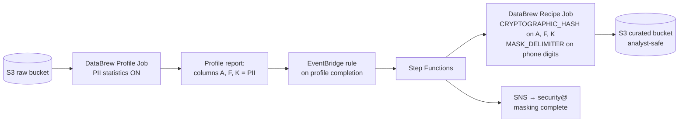
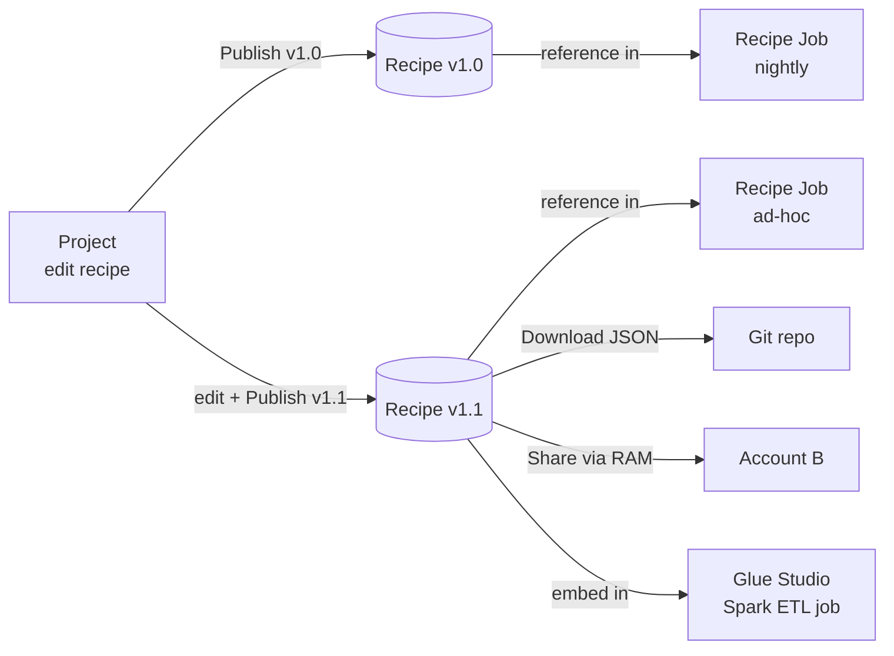
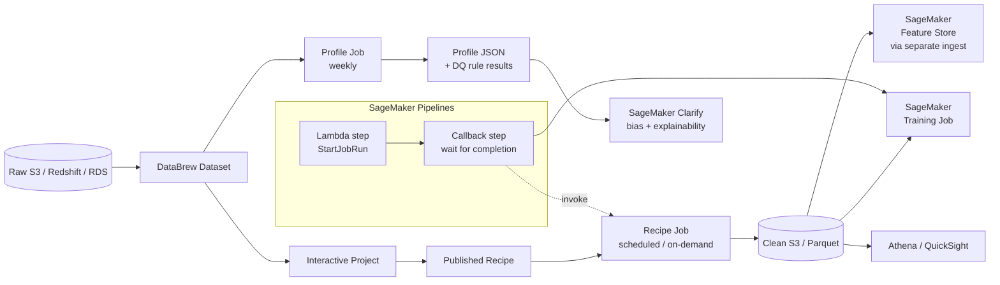

# Chapter 17 — AWS Glue DataBrew: Recipes, Profiles, Jobs

> **Goal of this chapter:** to give you a working command of the one AWS service in the Glue family that is explicitly designed for *people who do not write code* — and that the MLA-C01 exam expects you to choose, decline, and combine with neighbouring services with cert-level precision. By the end you should be able to defend, out loud, three claims: (1) DataBrew is a niche tool whose niche is real — analyst-driven prep and PII compliance work — and is *not* a default; (2) DataBrew's five primitives (Dataset, Project, Recipe, Recipe Job, Profile Job) plus its 250-plus built-in transforms, plus its $0.48-per-node-hour, five-node-minimum billing floor, are the surface area the exam tests; and (3) the canonical pairings the exam loves — **DataBrew + Glue Data Quality** for Task 1.3 validation, **DataBrew + Macie** for the discover-then-act PII pipeline, and **DataBrew recipes embedded in Glue Studio Spark jobs** for the scale-up story — are the architectural patterns that decide three or four questions of your test for you, if you remember them cold. Everything else in this chapter is mechanics in service of that.

---

## 17.1 Opening: when no-code beats PySpark (and when it doesn't)

Imagine it is a Tuesday at a regulated insurer. A compliance officer with no programming background is handed a 4 GB CSV from a third-party claims processor and asked to confirm three things before the data is allowed near the company's actuarial models: (a) the file does not contain unmasked SSNs, dates of birth, or policy numbers; (b) the `loss_amount` column is between $0 and $10M for every row; (c) the categorical `state_code` column only contains the 50 valid US state codes plus DC. The compliance officer has a deadline at 4 p.m. They do not have a Spark cluster, a Jupyter notebook, or a data-engineering ticket queue. They have a browser, an SSO login, and an AWS console.

In a PySpark shop the canonical answer is "open a Glue notebook, write 40 lines, run it on 10 DPUs." That answer is not available to the compliance officer. The available answer is **AWS Glue DataBrew**: connect the dataset, run a *profile job* with PII statistics enabled, attach a small ruleset that encodes the three checks above, and read the pass/fail summary in the console two minutes later. No code, no engineer, no ticket. The whole point of DataBrew is that the compliance officer can do this themselves, and the artifact they produce — a versioned recipe and a profile report — is auditable and reusable next quarter when the next claims file arrives.

That is the niche. It is real, it is durable, and it is the only niche where DataBrew is the obviously-correct answer. Everywhere else — high-throughput batch ETL written by data engineers, streaming, ML feature engineering with export to SageMaker Feature Store, custom Spark UDFs for proprietary logic, incremental processing of newly arrived S3 partitions — *something else* is the right call, usually Glue Spark, Data Wrangler, EMR, or Kinesis. The reason the exam tests DataBrew so often is precisely because it is *easy* to over-reach with it: candidates see "data prep on AWS" and assume DataBrew. The exam will punish that reflex by stuffing the stem with non-developer personas (correctly DataBrew) and developer personas (correctly Glue Spark or Data Wrangler), and the difference is one phrase in the stem.

The mental model to carry into the rest of the chapter is this. DataBrew is **Excel for a data lake**: same point-and-click ergonomics, same "see a sample, apply a transform, see the result" loop, same audience of business analysts and compliance reviewers who would otherwise live in Excel or Tableau Prep or Alteryx — but the recipe at the end runs serverlessly against a full data-lake-sized dataset, not a 1M-row spreadsheet. The transforms come from a fixed catalogue of 250-plus pre-built operations, not from arbitrary user code. The cost model rewards *human time saved*, not *compute used*. And the strategic direction of the product, since 2023, is to position DataBrew as a **recipe-authoring tool that feeds Glue Spark jobs** — not as a standalone runtime competing with Spark on price.

> ⚠️ **Exam alert.** When a stem describes the user as "a business analyst," "non-developer," "no Spark experience," "data analyst without programming skills," or "needs to share repeatable data-cleaning steps without code," the answer is **DataBrew**. When the stem says "data scientist building features for a SageMaker training job and exporting to Feature Store," the answer is **Data Wrangler**. When it says "petabyte-scale ETL with custom UDFs and incremental processing," the answer is **Glue Spark / EMR**. The persona in the stem is the discriminator, more reliably than any other clue.

---

## 17.2 The five primitives: Dataset, Project, Recipe, Recipe Job, Profile Job

DataBrew exposes a small ontology. There are exactly five primitives and you need them cold: a **Dataset** (a pointer to where the data lives), a **Project** (the interactive workspace where you author the recipe against a sample), a **Recipe** (the versioned, JSON-serialisable list of up to 100 transforms), a **Recipe Job** (the production execution that applies a published recipe version to the full dataset and writes to an output target), and a **Profile Job** (the statistics-and-PII scan that doesn't require a recipe at all). The console UI maps almost one-to-one onto these five nouns, and the IAM, pricing, and lineage models are all anchored to them.



### 17.2.1 Dataset

A Dataset in DataBrew is an *immutable pointer* to a source, not a copy. Creating a Dataset captures the location, the schema, the sampling strategy, and the partitioning. DataBrew never moves the bytes; it reads from the source each time you open the project or run a job. Supported sources are: **Amazon S3** (CSV, JSON, Parquet, ORC, Avro, Excel `.xls`/`.xlsx`); **AWS Glue Data Catalog** tables (which in turn can point at S3, Redshift, or RDS); **Amazon Redshift** directly via a Glue connection; **Amazon RDS / Aurora** via a Glue connection; **Snowflake** via a native connector (added May 2024); arbitrary **JDBC** sources via a custom connection; and **AWS Data Exchange** subscriptions.

A Dataset also encodes the sampling strategy used by the interactive Project: first-N rows (the default, with N = 500), random sample, or stratified sample on a chosen column. You configure this once at Dataset creation. Sampling is what makes the Project UI feel like a spreadsheet — every preview is sub-second because it is operating on a few hundred rows in memory in the browser, not on the full multi-gigabyte source.

### 17.2.2 Project

A Project is the **interactive authoring workspace**. You pick a Dataset, you get a sample (default 500 rows, max 5,000), and the console renders a familiar grid of rows-and-columns with a per-column value-distribution chart pinned to the top of each column. From there you click a column header, pick a transform from the toolbar or the right-hand panel, configure its parameters (target column, conditions, output name), and see the result applied to the sample immediately. Every transform you apply is appended to the Project's draft recipe. When you are satisfied you click **Publish**, and the draft becomes an immutable, versioned Recipe.

Crucially, the Project is **the only DataBrew surface that incurs interactive-session charges** (we will get to the dollar figures in §17.6). The Recipe Job and Profile Job are batch executions on managed nodes; the Project is a long-lived session where you are clicking around. Sessions are billed at $1.00 per 30-minute window — leave the project open for an afternoon and you have spent eight dollars without running a single job.

### 17.2.3 Recipe

> "A *recipe* is a set of data transformation steps … You can include up to 100 data transformations in a single DataBrew recipe."
> — *AWS Glue DataBrew Developer Guide*

Recipes are the durable artifact of the service. They are:

- **Versioned.** Every `Publish` creates a new immutable version (`1.0`, `1.1`, `2.0`, …). The unpublished draft inside the Project is called the *latest working version* and can be referenced inside the Project but never inside a job.
- **Portable.** Recipes serialize to **JSON or YAML**. You can download a recipe from one account, commit it to Git, review it in a PR, and re-upload it in another account or another region.
- **Reusable.** One Recipe can be applied to many Datasets, provided the source schemas are compatible. The transforms reference columns by name, so a renamed column breaks the recipe but a re-partitioned source does not.
- **Conditional.** Every transform step can be gated on a condition expression — `LESS_THAN`, `CONTAINS`, `IS_MISSING`, and twelve more (see §17.3). This is what gives the no-code experience its expressive power: `REMOVE_VALUES WHERE black_rating LESS_THAN 1800` is as terse as the equivalent `df.filter(df.black_rating >= 1800)`.

Concretely, a Recipe is a JSON array of `Action` objects. Each `Action` has an `Operation` (the transform's name) and `Parameters` (the transform's configuration), optionally guarded by `ConditionExpressions`. The first step from a recipe that filters a chess-game dataset to rated players:

```json
{
  "Action": {
    "Operation": "REMOVE_VALUES",
    "Parameters": { "sourceColumn": "black_rating" }
  },
  "ConditionExpressions": [
    { "Condition": "LESS_THAN", "Value": "1800", "TargetColumn": "black_rating" }
  ]
}
```

That JSON is exactly the artifact that gets versioned, committed, reviewed, and shared. The exam will not ask you to read it character-by-character, but it will ask you to recognise that *the recipe is a JSON/YAML object* and therefore (a) reviewable in a PR, (b) portable across accounts via download/upload or AWS RAM, and (c) consumable from a Glue Studio Spark job (see §17.10).

### 17.2.4 Recipe Job

The Recipe Job is the production-side execution. It takes a **published Recipe version** (never the draft), applies it to the **full Dataset** (not the sample), and writes the result to an output target (we'll enumerate the targets in §17.7). Recipe Jobs run on DataBrew-managed nodes — you do not provision a cluster — and are scheduled on-demand, by cron, or by rate expression.

There is one structural fact about Recipe Jobs that the exam likes to test: **they do not support Glue ETL bookmarks**. Glue ETL bookmarks let a job remember which S3 partitions or row offsets it has already processed, so that re-runs only pick up new data. DataBrew has no equivalent. Every Recipe Job run **reprocesses the full configured Dataset slice** unless you parameterise the Dataset by date prefix and update that parameter yourself. If a stem describes "incremental processing of newly arrived S3 files," the answer is **Glue ETL with bookmarks**, not DataBrew.

### 17.2.5 Profile Job

The Profile Job is the second batch execution mode, and it is the half of DataBrew that the MLA-C01 exam guide calls out under Task 1.3 ("Validating data quality"). A Profile Job does *not* require a Recipe. You point it at a Dataset and it produces a statistical and structural profile of the data — per-column statistics, distribution histograms, a Pearson correlation matrix across numeric columns, data-type validity checks, optional PII detection, and optional Data Quality ruleset evaluation. The output is a JSON document in S3 plus a rendered set of charts in the console.

Both Recipe Jobs and Profile Jobs are billed identically — $0.48 per node-hour with a five-node default — and both can be triggered by EventBridge, Step Functions, the Glue console, or `StartJobRun` via the API. The distinction is purely functional: a Recipe Job *transforms* and writes data; a Profile Job *describes* data and writes a report.

---

## 17.3 The 250-plus built-in transforms

DataBrew advertises "over 250 ready-made transformations" on its product page; the recipe-actions reference docs use "over 200 recipe actions." The discrepancy is because some console actions expand into multiple recipe operations (for example, the console's "Format dates" action surfaces as roughly half a dozen underlying recipe operations). For the exam you don't need every name memorised; you need to recognise the **categories** so you can pick "DataBrew can do that" vs. "DataBrew can't do that" with confidence.

### 17.3.1 Cleansing

| Family | Examples | Reach for it when |
|---|---|---|
| Missing values | `REMOVE_NULL`, `FILL_WITH_MEAN`, `FILL_WITH_MEDIAN`, `FILL_WITH_MODE`, `FILL_WITH_CUSTOM_VALUE`, `FILL_WITH_LAST`, `FILL_WITH_NEXT` | Imputation before training |
| Duplicates | `REMOVE_DUPLICATE_ROWS`, `REMOVE_DUPLICATE_VALUES` | Dedup before feature engineering |
| Outliers | `REMOVE_OUTLIERS`, `FLAG_OUTLIERS` (Z-score, IQR, percentile cutoff) | Trim heavy-tailed columns |
| Invalid values | `IS_INVALID`, `REPLACE_INVALID`, `REMOVE_INVALID` | Type-coercion failures, regex mismatches |

### 17.3.2 Format and type conversion

| Family | Examples |
|---|---|
| Type cast | `CHANGE_DATA_TYPE` (string ↔ int/float/bool/date/timestamp) |
| Date parsing | `EXTRACT_YEAR`, `EXTRACT_MONTH`, `EXTRACT_WEEKDAY`, `DATE_DIFF`, `PARSE_DATE` |
| Number formatting | `FORMAT_NUMBER`, `ROUND`, `CEIL`, `FLOOR` |
| Text formatting | `CHANGE_CASE`, `TRIM`, `PAD`, `REMOVE_SPECIAL_CHARS` |

### 17.3.3 Structural

| Transform | Effect |
|---|---|
| `PIVOT` / `UNPIVOT` | Wide ↔ long format |
| `SPLIT_COLUMN` | One column → many (delimiter, position, regex) |
| `MERGE_COLUMNS` | Concatenate with separator |
| `GROUP_BY` | Aggregate (count, sum, mean, min, max) and replace dataframe |
| `TRANSPOSE` | Rows ↔ columns |
| `NEST` / `UNNEST` | JSON-like nested-data flattening |

### 17.3.4 Enrichment (the ML-flavoured ones)

| Transform | ML use case |
|---|---|
| **One-hot encoding** | Categorical features for linear / tree models |
| **Label / ordinal encoding** | Ordered categoricals |
| **Binary encoding** | High-cardinality categoricals |
| **Min-max scaling** | `(x - min) / (max - min)` for distance-based models |
| **Standardisation (Z-score)** | `(x - μ) / σ` for linear models, NNs |
| **Log / Box-Cox / Yeo-Johnson** | Skewness reduction |
| **Binning** (equal-width, equal-frequency, custom) | Discretise continuous variables |
| **Custom math expression** | Derived features without code |

Note what is **not** here: target encoding, similarity encoding, dimensionality reduction (PCA), feature-importance estimation, embedding generation, and time-series featurisation are all absent. Those are Data Wrangler's territory. If the exam stem mentions "target encoding for high-cardinality categoricals" or "PCA before training," it is signalling Data Wrangler, not DataBrew.

### 17.3.5 Text / NLP (Comprehend-powered)

| Transform | Backed by |
|---|---|
| Sentiment (positive / negative / neutral / mixed) | Amazon Comprehend |
| Language detection | Amazon Comprehend |
| Entity extraction (people, places, organisations) | Amazon Comprehend |
| Phrase / sentence tokenisation | Native NLP |
| Stop-word removal, stemming | Native NLP |

The Developer Guide explicitly calls this out: *"You can also use transformations to apply natural language processing (NLP) techniques to split sentences into phrases."* Recognise this when you see "needs simple sentiment scoring without writing code" in a stem.

### 17.3.6 Join and Union

- **Join** — inner / left / right / outer between **exactly two Datasets per step**. This is a *hard cap*: you cannot 3-way join in one recipe step. To join three or more tables you chain join steps (two-way at a time) or you pre-stage with Glue Spark.
- **Union** — append rows from multiple Datasets sharing a compatible schema.

### 17.3.7 Custom SQL (narrowly scoped)

DataBrew supports a **Custom SQL** step *only* against Redshift and Snowflake sources. You write a `SELECT` that runs at the source and the result becomes the recipe input. This is not a general UDF facility — you cannot inject Python or PySpark into a recipe (see §17.9). If a stem says "needs to express a custom transformation in PySpark," DataBrew is wrong.

### 17.3.8 The fifteen conditional operators

Every transform can be guarded by a condition. The full list:

`IS`, `IS_NOT`, `IS_BETWEEN`, `CONTAINS`, `NOT_CONTAINS`, `STARTS_WITH`, `NOT_STARTS_WITH`, `ENDS_WITH`, `NOT_ENDS_WITH`, `LESS_THAN`, `LESS_THAN_EQUAL`, `GREATER_THAN`, `GREATER_THAN_EQUAL`, `IS_INVALID`, `IS_MISSING`.

This is the lever that gives the no-code experience its surprising expressive power — most predicates you would write as a Spark `filter` map cleanly onto one of these fifteen operators applied to one column.

---

## 17.4 Profile Jobs: stats, distributions, correlations, and PII detection

The Profile Job is the surface the exam guide cites under Task 1.3 ("validate data quality"), and it is the one that does double duty as a *governance* tool. There are five things a Profile Job produces, and you should be able to name them:



### 17.4.1 Statistical surface area

The numeric profile is comparable to `pandas.DataFrame.describe()` plus value-distribution histograms and a correlation heatmap — but rendered in the console and persisted as JSON in S3 so downstream tools (Athena, QuickSight, custom Lambdas) can read it. Per-column you get count, distinct count, missing percentage, validity percentage, min / max / mean / median / mode / standard deviation, the standard quantiles, skewness, and kurtosis. The categorical profile includes top-N values, cardinality, missing percentage, and a value-frequency histogram. Across numeric columns you get a Pearson correlation matrix rendered as a heatmap.

### 17.4.2 PII detection (Comprehend / Glue managed entity types under the hood)

When you enable the **PII statistics** toggle on a Profile Job, DataBrew uses **AWS Glue managed entity types** (which themselves wrap Amazon Comprehend's PII recognition models) to classify columns by likely PII entity type. The supported entities cover the standard regulated categories:

- Identity: `EMAIL`, `PHONE`, `ADDRESS`, `NAME`, `AGE`, `DATE_TIME`, `URL`, `USERNAME`, `PASSWORD`
- Financial: `SSN`, `BANK_ACCOUNT_NUMBER`, `CREDIT_DEBIT_NUMBER`, `CREDIT_DEBIT_CVV`, `CREDIT_DEBIT_EXPIRY`
- Network: `IP_ADDRESS`, `MAC_ADDRESS`
- Government / identity documents: `DRIVER_ID`, `LICENSE_PLATE`, `PASSPORT_NUMBER`
- AWS-specific: `AWS_ACCESS_KEY`, `AWS_SECRET_KEY`

There is a well-known IAM gotcha here: PII statistics require the DataBrew service role to have `glue:GetCustomEntityType` and `glue:BatchGetCustomEntityTypes`. New teams enable the toggle, the role lacks those actions, and the job silently produces a profile *without* PII columns. The team concludes "this data has no PII," and ships it. Always check the role.

Once PII is detected, the *Recipe* side of DataBrew offers the remediation transforms — they live in recipes, not in profile jobs. The five categories you should be able to name:

- **`MASK_CUSTOM` / `MASK_DATE` / `MASK_DELIMITER`** — partial redaction (e.g. preserve last-4 of an SSN, redact the rest).
- **`CRYPTOGRAPHIC_HASH`** — one-way hash with a secret. Deterministic, so you can join two masked datasets on the hashed key, but not reversible.
- **`DETERMINISTIC_ENCRYPT` / `DETERMINISTIC_DECRYPT`** — symmetric encryption that preserves equality (same plaintext → same ciphertext). Useful when downstream needs to join on a pseudonymised ID *and* you need to re-identify later.
- **`ENCRYPT` / `DECRYPT`** — non-deterministic AES-GCM. Stronger privacy (same plaintext → different ciphertext each time), but breaks joins on the masked column.
- **`REPLACE_WITH_RANDOM_VALUE`**, **`SHUFFLE_ROWS`**, **`NULLIFY`** — substitution, row-level unlinking, and outright removal.

A common exam framing: "the team needs reversible masking for testing in lower environments" → `DETERMINISTIC_ENCRYPT` (with the key in Secrets Manager). "Irreversible but still join-friendly" → `CRYPTOGRAPHIC_HASH`. "Maximum privacy, joins not needed" → `ENCRYPT`.



### 17.4.3 Data lineage

DataBrew tracks lineage automatically: `source dataset → project → recipe (version) → recipe job → output S3 location / Catalog table`. It is rendered as a graph in the console and is the artifact you hand to an auditor who asks "which raw dataset produced this curated table, and which recipe version transformed it." This is also the only lineage DataBrew offers — it does **not** integrate with SageMaker ML Lineage, which is one reason Data Wrangler beats DataBrew for ML workflows.

### 17.4.4 Data Quality rules inside profiles

You can attach a **DataBrew ruleset** to a Profile Job. Rules are point-and-click, with roughly 30 built-in rule types covering completeness, uniqueness, value ranges, value-in-set, and row-count constraints. Examples:

| Rule | Example |
|---|---|
| Column value is between | `purchase_amount BETWEEN 0 AND 10000` |
| Column is complete | `customer_id missing % = 0` |
| Column is unique | `transaction_id distinct % = 100` |
| Value in set | `country IN ('US','CA','MX')` |
| Number of rows | `row_count > 1000` |

The Profile Job evaluates the ruleset and emits a pass / fail / error status to CloudWatch Events, which makes the entire profile-with-rules flow event-drivable: S3 → EventBridge → Step Functions → Profile Job → Lambda evaluator → SNS, exactly as the AWS Big Data blog post "Build event-driven data quality pipelines with AWS Glue DataBrew" lays out.

**Do not confuse DataBrew rulesets with AWS Glue Data Quality.** DataBrew rules are scoped to DataBrew Profile Jobs and use a point-and-click DSL. **Glue Data Quality** uses **DQDL** (Data Quality Definition Language), embeds inside Glue ETL jobs (and runs on Glue Spark pricing, $0.44 / DPU-hour), and includes a recommendations engine that auto-suggests rules from a Catalog table. The Task 1.3 distinction is the next section.

---

## 17.5 DataBrew + Glue Data Quality: the Task 1.3 pair

The MLA-C01 exam guide explicitly names DataBrew and Glue Data Quality together under Task 1.3 ("validate data and prepare data quality"). They are siblings, they overlap functionally, and the exam tests whether you can pick the right one given the stem.

| | AWS Glue DataBrew (profile job + ruleset) | AWS Glue Data Quality (DQDL on a Glue table or in an ETL job) |
|---|---|---|
| Primary surface | DataBrew console | Glue Studio / Glue Catalog / Glue ETL |
| Rule language | Point-and-click rule builder; ~30 built-in rule types | **DQDL** — declarative DSL with 30+ rule types (`Completeness`, `Uniqueness`, `Freshness`, `ColumnValues`, `RowCount`, …) |
| Best for | One-off / on-demand validation tied to a profile run | Continuous validation *inside* an ETL pipeline; auto-rule recommendations from a Catalog table |
| Output | Profile report (JSON in S3) + CloudWatch event (PASS/FAIL/ERROR) | DQ results stored in Glue Catalog + CloudWatch + can fail or branch the ETL job |
| Triggering | DataBrew schedule, EventBridge, Step Functions | Embedded in Glue ETL job; or on a Catalog table on a schedule |
| Persona | Compliance officer, analyst, governance reviewer | Data engineer |
| Pricing | $0.48 / node-hr × 5 nodes | $0.44 / DPU-hr (Glue ETL pricing) |

The canonical pattern the exam loves:

```
                  ┌──────────────────────────────────────────┐
                  │   One-off / interactive validation       │
S3 raw lands ─┐   │                                          │
              ├─► │  DataBrew profile job (rules + PII)      │──► Profile report (S3)
              │   │       └─► CloudWatch event (PASS/FAIL)   │──► SNS alert
              │   └──────────────────────────────────────────┘
              │
              │   ┌──────────────────────────────────────────┐
              └─► │   Continuous in-pipeline validation      │
                  │                                          │
                  │   Glue ETL job (Spark)                   │
                  │       ├─ Glue Data Quality rules (DQDL)  │──► DQ results in Catalog
                  │       ├─ Transform + write to curated S3 │
                  │       └─ On DQ failure: stop / branch    │
                  └──────────────────────────────────────────┘
```

**When the exam wants which one:**

- Stem mentions "*continuous validation*," "*inside the ETL pipeline*," "*stop the job if data is bad*," or "*DQDL*" → **Glue Data Quality**.
- Stem mentions "*non-coder*," "*visual rule builder*," "*profile job*," "*on-demand check before the analyst uses the file*," or "*PII statistics*" → **DataBrew**.
- Stem says both look plausible and explicitly asks for "*least operational overhead for a brand-new dataset where rules aren't defined yet*" → **Glue Data Quality recommendations** (auto-suggests DQDL from a Catalog table).

---

## 17.6 Cost model: why no-code is not cheap

DataBrew has two billing dimensions, and both surprise teams the first time they read the bill.

| Charge | Rate (us-east-1, mid-2026) | Notes |
|---|---|---|
| **Interactive sessions** (in a Project) | **$1.00 per 30-minute session** | Sessions are billed *per active 30-min window*. Leaving the project and coming back later starts a new session. The first 40 sessions are free per account. |
| **Jobs** (recipe and profile) | **$0.48 per DataBrew-node-hour**, billed per minute, **5-node minimum** | Effective per-hour floor of **$2.40/hr** even for a tiny job. Default node count is 5; configurable from 3 to 149. |

The session-counting trap is in the pricing docs verbatim: *"If you start a session at 9:00 AM and interact with the DataBrew console until 9:50 AM, exit the DataBrew project space, and come back to make your final interaction at 10:15 AM, this will use 3 sessions and you will be billed $1.00 per session for a total of $3.00."* Analysts who leave the browser tab open all afternoon are charged for every 30-minute window they touch the console in.

### 17.6.1 Compared to neighbouring services

| Service | Unit | Price | Notes |
|---|---|---|---|
| Glue ETL (Spark) | DPU-hour (4 vCPU, 16 GB) | **$0.44 / DPU-hr** | 2-DPU min for Python shell, 10-DPU default for Spark |
| Glue DataBrew job | Node-hour | **$0.48 / node-hr** | 5-node minimum → $2.40/hr floor |
| Glue Data Quality | DPU-hour (Glue ETL pricing) | $0.44 / DPU-hr | Runs inside Glue jobs |
| Data Wrangler (in Canvas) | `ml.*` instance-hour | e.g. `ml.m5.4xlarge` $0.92/hr | Plus the Processing job that runs the exported flow |
| Athena | TB scanned | $5 / TB | Pay per query, no infra |

**Three failure modes show up in real bills.** First, **many small jobs**: teams trigger a DataBrew job on every S3 upload via EventBridge. Each upload is 50 MB; the job runs in two minutes but still pays for 5 nodes × 2 min = 10 node-minutes ≈ $0.08. Run 5,000 a month and the bill is $400 for what should have been a Lambda. Second, **interactive sessions left open**: analysts forget to close the project; the session quietly bills $1.00 per 30 minutes for the rest of the afternoon. Third, **default 5-node allocation on a 50 MB dataset**: you can dial down to 3 nodes for small jobs, saving ~40%, but most teams never touch the setting.

**The takeaway for the exam** is exactly what the DataBrew niche implies: **DataBrew is the most expensive of the data-prep options at high throughput, but the cheapest in engineering time** for an analyst who would otherwise need a developer. Stems that say "minimise *engineering effort*" point at DataBrew even when Spark would be cheaper in compute. Stems that say "minimise *cost*" for a high-volume, recurring pipeline point at Glue Spark.

> ⚠️ **Exam alert.** The number to remember is **$0.48 × 5 = $2.40/hr floor**. When you see a stem that contrasts DataBrew with "Lambda triggered by S3 events for small files," the right answer is almost always Lambda — DataBrew's five-node minimum makes the per-event economics terrible. Conversely, when the stem stresses "the team must not write code" or "minimal developer time," accept the $2.40/hr and pick DataBrew.

---

## 17.7 Output destinations

A Recipe Job's output can go to:

| Destination | File formats |
|---|---|
| **Amazon S3** | CSV, JSON, Parquet, Avro, ORC, **Tableau Hyper** (.hyper), XML |
| **AWS Glue Data Catalog** table | Underlying storage in S3 (Parquet typical) |
| **Amazon Redshift** | Via Glue Catalog connection |
| **Amazon RDS / Aurora** | Via Glue Catalog connection |
| **JDBC** target | Via custom connection |

Each destination supports a **write mode** — `CREATE`, `REPLACE`, or `APPEND`. Output files can be partitioned by column values (Parquet, CSV, JSON), and KMS encryption can be turned on at write time.

The Tableau Hyper format is worth noticing — it is the format Tableau Server and Tableau Desktop read natively, and it is one of the few signals on the exam that DataBrew is the analyst-facing tool: no other Glue service writes Hyper.

Profile-Job output is a JSON document in S3 plus a CloudWatch event with the pass/fail summary from any attached ruleset. The JSON is *not* automatically charted in QuickSight — many teams build their own QuickSight dashboard on top of the profile output as a one-time governance setup.

---

## 17.8 Recipe versioning, publishing, and sharing in big enterprises

The under-appreciated value of DataBrew in large organisations is the **central recipe library** pattern, and it is the strongest reason DataBrew keeps a foothold even in shops where most teams write Spark.

- **Versions are immutable.** Every `Publish` creates a new immutable version. A production Recipe Job references a *specific* version, so production runs are reproducible and rollbackable.
- **The latest working version** is the in-Project draft. Useful while iterating, but it cannot be referenced from a job.
- **Download / upload.** Recipes serialize to JSON or YAML. You can check them into Git, review them in a PR, and re-import them in another Project or another account.
- **Cross-account sharing.** Recipes (and Datasets, Projects, Jobs, Rulesets) are AWS resources, so you can share them with other accounts via **AWS RAM (Resource Access Manager)** or by exporting JSON and re-importing in the target account.
- **Recipe library.** Your account accumulates recipes across projects; any published recipe can be applied to a new Dataset without going through its originating Project.



The enterprise pattern that uses all of this: a **central data platform team** publishes a library of approved recipes — `pii_redaction_us_v2`, `pii_redaction_eu_gdpr_v1`, `deduplication_v3`, `currency_normalize_to_usd_v1`, `date_iso8601_v1`. Business units consume them either standalone (analyst-driven) or as steps inside Glue Studio Spark jobs (engineer-driven, at scale). The recipe is the *one source of truth* for what "PII redaction" means at the company. It is auditable as JSON, reviewable in a PR, and versioned. Without a central library, every team rolls their own "drop duplicates and trim whitespace" Spark function — subtly differently — and an auditor cannot tell which team did what.

Exam stems that probe this pattern: "*central data team wants to publish a standard PII redaction step that business units can use both visually and inside Spark ETL jobs*" → **DataBrew recipes, published, and embedded in Glue Studio ETL**.

---

## 17.9 Limitations: the ceiling of the no-code abstraction

These are the cases where DataBrew is the *wrong* answer. The exam loves to set up a plausible-looking DataBrew stem and then sneak in one of these constraints, hoping you take the bait.

| Limitation | Implication |
|---|---|
| **No streaming** | Batch only. For Kinesis or MSK streams use **Glue Streaming**, **Kinesis Data Analytics / Managed Service for Apache Flink**, or **Kinesis Firehose + Lambda**. |
| **Joins capped at 2 datasets per step** | Chain joins step-by-step (two-way at a time), or pre-stage with Glue Spark. Three-way join in one recipe step is impossible. |
| **No custom Python / Scala / Spark UDFs** | "Custom SQL" exists only for Redshift / Snowflake source-side. No arbitrary code injection. If you need a proprietary fuzzy matcher, you need Spark. |
| **No bookmarks** | Cannot incrementally process new files. Each Recipe Job run reprocesses the full Dataset slice unless you parameterise it yourself. |
| **100-transform ceiling per recipe** | Hard limit. Split into multiple recipes / jobs if you hit it. |
| **500-row sample in Projects (default, max 5,000)** | Edge cases in the tail of the distribution may not appear in the sample; the Profile Job on full data is the safety net. |
| **5-node minimum on jobs** | $2.40/hr floor regardless of dataset size. Small jobs are cost-inefficient. |
| **No export to SageMaker Feature Store** | If you need Feature Store ingestion, write to Parquet on S3 and run a separate ingestion (Glue job, Lambda, Processing job). Data Wrangler can write directly. |
| **No native SageMaker Pipelines step** | Orchestrate from Pipelines via a **Lambda step + Callback step** pattern (see §17.10). |
| **Recipe portability requires schema compatibility** | A recipe built for `customer_v1` breaks on `customer_v2` if column names change. |

---

## 17.10 The 2023 strategic shift: DataBrew recipes inside Glue Studio Spark jobs

In July 2023 AWS announced that **Glue Studio visual ETL jobs can include AWS Glue DataBrew recipes as steps**. This is a small-looking feature with a large strategic implication: it positions DataBrew as a *recipe-authoring surface* that emits transformations consumable by the Glue Spark runtime, rather than a standalone runtime competing with Spark on price.

The architectural pattern is:

1. A compliance officer or analyst authors a recipe (`pii_redaction_us_v2`) in DataBrew using the no-code UI.
2. They publish it as version 1.0.
3. A data engineer building a production ETL pipeline in **Glue Studio visual ETL** drags the published recipe in as a node in their DAG.
4. The Glue job runs on Spark (DPU-hour pricing, $0.44/DPU-hr, with bookmarks, auto-scaling, retries) and applies the recipe's transformations as part of the Spark plan.

Two consequences for the exam:

First, the **scale-up story** for DataBrew is now "author in DataBrew, run in Glue Spark." A stem that says "*the recipe needs to apply to petabytes nightly with bookmarks*" *plus* "*authored by a non-developer*" is correctly answered as **DataBrew recipe embedded in a Glue Studio ETL job**, not "rewrite in PySpark."

Second, the **central recipe library** pattern from §17.8 only really works because of this integration — without it, recipes live in DataBrew and can only run on DataBrew nodes. With it, the same recipe is consumable by analyst-driven jobs *and* by engineer-driven Spark pipelines, which is what makes the library worth maintaining.

---

## 17.11 SageMaker integration: Pipelines via Lambda + Callback

DataBrew is not a SageMaker-native service, but it fits into ML workflows cleanly through S3 and the Glue Catalog. There is no native DataBrew step in SageMaker Pipelines — the integration pattern is **Lambda step + Callback step**.



### 17.11.1 Three integration patterns to recognise

1. **Pre-training cleanup, S3-only.** DataBrew Recipe Job writes Parquet to a "curated" S3 prefix; a SageMaker Training Job reads it directly. Simplest pattern, no orchestration.
2. **Pipelines via Lambda + Callback.** Pipelines has no native DataBrew step. You use a Lambda step to call `StartJobRun`, then a Callback step that waits for an external token-completion signal (which the same Lambda — triggered by the DataBrew completion event — sends back). The same pattern works for any non-native AWS batch service.
3. **DataBrew → Feature Store (indirect).** DataBrew writes Feature-Store-friendly Parquet (with the required `EventTime` and record-identifier columns). A separate ingestion process — a Glue job, a Lambda, or a SageMaker Processing job — calls `PutRecord` against the Feature Group. DataBrew cannot write to Feature Store directly.

### 17.11.2 DataBrew profile vs. SageMaker Clarify

These are complementary, not redundant:
- **DataBrew profile** = "*what does the raw data look like?*" — per-column statistics, PII presence, distributions, correlations, ruleset pass/fail.
- **Clarify** = "*is the data or the model biased?*" — bias metrics (DPL, KL, JS divergence), SHAP-based feature attribution.

Common stem framing: "*understand class imbalance, feature distributions, and PII exposure*" → **DataBrew profile**. "*measure bias of a trained model against a protected attribute*" → **Clarify**.

---

## 17.12 DataBrew vs. Glue Studio vs. Data Wrangler vs. Athena: the decision matrix

The single most testable table in this chapter. Memorise the persona column.

| Tool | Persona | Interface | Code required | Best at | Worst at |
|---|---|---|---|---|---|
| **AWS Glue (Spark ETL)** | Data engineer | PySpark / Scala (or Glue Studio visual → generated PySpark) | Yes (or generated) | Billions of rows, complex joins, custom UDFs, streaming, production ETL at scale, bookmarks | Hand-on-keyboard exploration; non-developer personas |
| **Glue Studio (visual ETL)** | Data engineer | Visual DAG → emits PySpark you can edit | Generated | Engineer who wants a head-start but will customise; embedding DataBrew recipes as nodes | Pure non-developer use; recipe-style portability |
| **AWS Glue DataBrew** | Data analyst, compliance officer, business SME | Spreadsheet-like UI | **None** | Visual cleanup, 250+ ready transforms, profile / PII reports, central recipe libraries | Streaming, custom UDFs, ML feature engineering, Feature Store export, incremental processing |
| **SageMaker Data Wrangler** (now in Canvas) | ML engineer, data scientist | Studio / Canvas UI + Python / SQL / PySpark snippets | Optional | ML feature engineering — target encoding, PCA, Quick Model, export to Feature Store / Pipelines / Processing | Non-ML cleansing for non-developer users |
| **Amazon Athena** | SQL analyst | ANSI SQL on S3 | SQL | Ad-hoc queries, exploratory analysis, lightweight transformation as `CREATE TABLE AS SELECT` | Stateful multi-step transformations; no-code persona |

**Three discriminators that decide most stems:**

1. **Does the user write code?** No → DataBrew. Yes → everyone else.
2. **Is the consumer a SageMaker training job or Feature Store?** Yes → Data Wrangler. No → DataBrew or Glue.
3. **Is the workload streaming, incremental, or petabyte-scale custom-UDF Spark?** Yes → Glue Spark / EMR. No → DataBrew is plausible.

> ⚠️ **Exam alert.** The DataBrew-vs-Data-Wrangler confusion is the exam's favourite trick on this material. The rule of thumb: **DataBrew = analyst persona, no ML semantics; Data Wrangler = ML persona, ML-specific feature engineering, Feature Store / Pipelines export**. If the stem mentions Feature Store, SageMaker Pipelines, target encoding, Quick Model, SHAP, or "data scientist building features," it is Data Wrangler. If the stem mentions analyst, compliance, no-code, profile job, PII statistics, or central recipe library, it is DataBrew. Modern Data Wrangler lives inside SageMaker Canvas — Studio Classic Data Wrangler is deprecated.

---

## 17.13 PII pipeline pairing: DataBrew vs. Macie vs. Comprehend

A pattern the exam tests in three different forms. The discriminator is **the layer at which each tool operates**.

| | Amazon Macie | AWS Glue DataBrew | Amazon Comprehend |
|---|---|---|---|
| Layer | **Bucket / object discovery** at rest in S3 | **Row / column transformation** in a recipe | **Text / NLP API** on arbitrary strings |
| Question answered | "Which of my 12,000 S3 buckets contain PII, and what types?" | "In *this* dataset, which columns are PII, and how do I mask them?" | "Does this freeform paragraph contain a name or an SSN?" |
| PII model | Managed + custom data identifiers (regex + ML); CDIs for org-specific patterns | Glue managed entity types (~40 built-in, Comprehend-backed) | Comprehend PII detection model |
| Action | **Findings** (alerts, JSON to Security Hub) — no transformation | **Transforms** — mask, hash, encrypt, decrypt, replace, shuffle, nullify | **API responses** — entity offsets, confidence scores |
| Cost driver | GB of S3 objects scanned | Node-hours of DataBrew jobs | Characters processed per API call |
| Lifecycle | Continuous (scheduled scans across your S3 footprint) | On-demand (per Profile Job, per Recipe Job) | On-demand (per API call) |
| Audit story | Security Hub findings, compliance reports | Profile report + recipe lineage | Log of API requests |

The **enterprise PII pipeline** combines all three. Macie runs continuously across your S3 footprint and flags "bucket X contains SSNs." An EventBridge rule on the Macie finding triggers a Step Functions workflow: a DataBrew Profile Job (with PII statistics) *confirms which columns* contain PII; a Lambda evaluates the profile JSON against a threshold; a DataBrew Recipe Job applies `CRYPTOGRAPHIC_HASH` or `MASK_DELIMITER` to the flagged columns; the masked output lands in a "curated" prefix; SNS notifies the security team. The reference implementation is the AWS sample `aws-samples/automating-pii-data-detection-and-data-masking-tasks-with-aws-glue-databrew-and-aws-step-functions`.

> ⚠️ **Exam alert.** When a stem mixes DataBrew, Macie, and Comprehend, anchor on **the layer**: Macie = bucket discovery (no transformation), DataBrew = column-level transformation (mask / hash / encrypt), Comprehend = freeform-text PII API. Stems like "*scan our entire S3 footprint for sensitive data*" → Macie. "*Mask the SSN column in this dataset*" → DataBrew. "*Detect PII in customer support emails*" → Comprehend. They are complementary, not substitutes.

---

## 17.14 Anti-patterns and gotchas seen in production

Each of these maps to a distractor on the exam. Knowing *why* it's wrong is half the battle.

1. **DataBrew as a streaming / near-real-time tool.** DataBrew is batch only. Per-event invocation is anti-economical (the 5-node-minute floor turns every event into ~$0.04). For streaming PII redaction use **Kinesis Firehose + Lambda** or **Glue streaming**.
2. **DataBrew for ML feature engineering.** No target encoding, no Quick Model, no SHAP, no Feature Store export. ML stems point at **Data Wrangler** or a **SageMaker Processing job**.
3. **Authoring against giant samples without a profile pass.** The Project sample is 500 rows by default (max 5,000). Edge cases in the tail can break the Recipe Job. Run a Profile Job *first* to understand the distribution, *then* design the recipe.
4. **Forgetting that profile output is JSON in S3.** It is *not* automatically charted in QuickSight. Many teams build their own dashboard on top of the profile output as a one-time governance setup.
5. **IAM under-scoping for PII statistics.** The DataBrew service role needs `glue:GetCustomEntityType` and `glue:BatchGetCustomEntityTypes`. Without them the PII toggle is a silent no-op.
6. **Default 5-node allocation on a 50 MB dataset.** Dial down to 3 nodes for tiny jobs to save ~40%. DataBrew accepts 3–149 nodes per job.
7. **Treating DataBrew rulesets and Glue DQDL as interchangeable.** They are different DSLs running on different runtimes with different IAM and pricing.

---

## 17.15 Quick recap — what to remember walking into the exam

1. **DataBrew = no-code, spreadsheet-style UI, 250+ pre-built transforms.** Analyst / compliance persona.
2. **Five primitives**: Dataset, Project, Recipe, Recipe Job, Profile Job.
3. **Recipes** are JSON/YAML, versioned, ≤ 100 steps, shareable via RAM, embeddable in Glue Studio Spark jobs since 2023.
4. **Profile Jobs** compute column statistics, correlations, distributions, **PII detection** (via Comprehend / Glue managed entity types), and evaluate optional rulesets.
5. **PII redaction transforms** live on the *recipe* side: `MASK_*`, `CRYPTOGRAPHIC_HASH`, `DETERMINISTIC_ENCRYPT`, `ENCRYPT`, `REPLACE_WITH_RANDOM_VALUE`, `SHUFFLE_ROWS`, `NULLIFY`.
6. **Schedules**: cron, rate, on-demand. **No bookmarks** — full re-run each time.
7. **Cost**: $1.00 per 30-min interactive session; **$0.48 / node-hr with 5-node minimum = $2.40/hr floor**. More expensive per row than Glue ETL ($0.44 / DPU-hr).
8. **Outputs**: S3 (CSV / Parquet / JSON / Avro / ORC / Hyper / XML), Glue Catalog, Redshift, RDS, JDBC.
9. **Limits**: no streaming, max 2 datasets per join step, no Python UDFs, 100 transforms / recipe, no Feature Store export, no native Pipelines step.
10. **SageMaker integration**: typically via S3 (Recipe Job output → Training Job input); orchestrate from Pipelines via Lambda + Callback step.
11. **Task 1.3 pairings**: DataBrew + **Glue Data Quality** for validation (one-off vs. continuous); DataBrew + **Macie** + **Comprehend** for PII (column-mask vs. bucket-discover vs. text-API).

### When DataBrew is the right answer

- "Business analyst / non-developer / compliance officer needs to clean or validate data without writing code."
- "Profile a dataset's column distributions and detect PII before training."
- "Publish a standard PII-redaction or dedup recipe that other teams can reuse — visually and inside Spark jobs."
- "Standardise categorical encodings and scaling visually across many similar datasets."
- "On-demand DQ check with a small ruleset, triggered by EventBridge on S3 arrival."

### When DataBrew is the wrong answer

- "Stream Kinesis events" → Glue Streaming / KDA Flink / Firehose + Lambda.
- "Join five tables in one step at petabyte scale" → Glue Spark / EMR.
- "Incrementally process new S3 files arriving hourly with bookmarks" → Glue ETL.
- "Custom PySpark UDF for proprietary fuzzy matching" → Glue / EMR.
- "Data scientist needs to iterate on features inside SageMaker Studio with code and export to Feature Store" → Data Wrangler.
- "Apply Glue Data Quality DQDL rules on a Catalog table continuously inside an ETL job" → Glue Data Quality.
- "Scan all 12,000 S3 buckets to discover where PII lives" → Macie.

---

## 17.16 Exercises

These exercises are deliberately phrased like exam stems. Work each one before reading the answer; the discriminator is always the persona, the workload shape, or the pairing.

**Exercise 17.1 — Persona discrimination.** A regional bank's compliance team — none of whom write code — must produce a monthly report listing all PII columns in a 200 GB claims dataset that arrives in S3 on the first of each month, and produce a masked version of the dataset for the analytics team to use. They have no Spark cluster and no data-engineering budget. Which combination of services should they use, and which primitives?

> **Answer.** **DataBrew Profile Job** (with PII statistics enabled, scheduled via cron on the 1st of each month) to produce the PII column inventory; **DataBrew Recipe Job** with `CRYPTOGRAPHIC_HASH` on identifier columns and `MASK_DELIMITER` on phone/SSN/CC# columns to produce the masked output. The DataBrew service role needs `glue:GetCustomEntityType` and `glue:BatchGetCustomEntityTypes`. Output goes to a "curated" S3 prefix for analytics consumption.

**Exercise 17.2 — Scale-up.** The same compliance team's PII-redaction recipe has been working for six months on the 200 GB monthly file. A new regulator-driven workflow requires the same redaction logic to be applied to a 30 TB daily stream of historical reconciliation data, with bookmarks so each daily run only processes new partitions. The compliance team still cannot write code, but a data-engineering team is now available. What's the architecture?

> **Answer.** Keep the recipe in DataBrew (the compliance team continues to own it visually). Embed the published recipe as a step inside a **Glue Studio visual ETL job** that the data engineers own. The Glue job runs on Spark ($0.44 / DPU-hr), uses bookmarks for incremental processing, and applies the recipe's transforms as a Spark plan. This is the 2023 DataBrew-recipes-in-Glue-Studio integration. The recipe stays the single source of truth; the runtime changes.

**Exercise 17.3 — Cost trap.** A data engineer sets up an EventBridge rule to trigger a DataBrew Recipe Job on every S3 upload to a landing bucket. Files arrive every five minutes, average size 30 MB. Each job run finishes in 90 seconds. After a month the team is shocked by the DataBrew bill. What's wrong, and what's the right architecture?

> **Answer.** Every DataBrew job, no matter how small, bills 5 nodes for at least 1 minute (= $0.04 per run). At 12 runs/hour × 24 × 30 ≈ 8,640 runs/month, that is ~$345 just in floor-cost minimums, ignoring actual run time. The right architecture for tiny per-file transformations is **Lambda triggered by S3** (or **Kinesis Firehose with a transformation Lambda**) — milliseconds of compute, no five-node floor. Reserve DataBrew for batch jobs against accumulated data, not per-event triggers.

**Exercise 17.4 — Validation paradigm.** A data engineering team owns a Glue ETL pipeline that lands curated Parquet hourly. They want the pipeline to **stop** if the `customer_id` column is ever less than 99.9% complete, or if `purchase_amount` ever drifts below 0. A separate compliance team wants an *on-demand* report of column statistics and PII presence for any new dataset before they sign off on it. Which service answers which need?

> **Answer.** Continuous, in-pipeline validation that can halt the job → **AWS Glue Data Quality** (DQDL rules embedded in the Glue ETL job). On-demand statistical and PII report for compliance sign-off → **DataBrew Profile Job** with an attached ruleset. Both belong in the Task 1.3 toolkit; the trigger model (continuous vs. on-demand) is the discriminator.

**Exercise 17.5 — Distinguishing DataBrew from Data Wrangler.** A data scientist needs to engineer features for an XGBoost model — target encoding a high-cardinality `merchant_id` column, applying PCA to a wide block of behavioural features, generating a quick model to estimate feature importance, and exporting the result to SageMaker Feature Store. Which tool should they use, and why is the alternative wrong?

> **Answer.** **SageMaker Data Wrangler** (now inside Canvas). Target encoding, PCA, Quick Model, and Feature Store export are all native Data Wrangler capabilities. DataBrew is wrong because it has none of them — no target encoding (only one-hot, ordinal, binary), no PCA, no Quick Model, and no native Feature Store export. The persona (data scientist) and the destination (Feature Store) both point at Data Wrangler.

**Exercise 17.6 — Three-tool PII pipeline.** Your company has roughly 8,000 S3 buckets across 40 AWS accounts. Some of them, you suspect, contain unmasked PII left over from years of ad-hoc data sharing. You need to (a) find which buckets have PII, (b) for each flagged bucket, determine which specific columns are PII, and (c) produce a masked copy of each flagged dataset for analytics. Which three services do which step?

> **Answer.** (a) **Amazon Macie** runs continuously across all 8,000 buckets and produces findings ("bucket X has SSNs"). (b) An EventBridge rule on the Macie finding triggers a Step Functions workflow that runs a **DataBrew Profile Job** with PII statistics on each flagged dataset, producing per-column PII type identification. (c) A subsequent **DataBrew Recipe Job** applies `CRYPTOGRAPHIC_HASH` (joinable) or `MASK_DELIMITER` (partial visibility) on the flagged columns, writing masked output to a "curated" S3 prefix. Macie discovers, DataBrew confirms and acts.

**Exercise 17.7 — Bookmark gap.** Files land in `s3://landing/orders/YYYY/MM/DD/` every hour. The team wants to apply a recipe that drops duplicates, fills missing values, and writes Parquet to `s3://curated/orders/` — but they want each run to process *only the new hour's partition*, not the whole bucket. Should they use DataBrew?

> **Answer.** No. DataBrew has no bookmark support; every Recipe Job run reprocesses the full configured Dataset slice. Either (a) use **Glue ETL with bookmarks** to handle incremental processing natively, or (b) keep DataBrew but parameterise the Dataset by date prefix and have an external orchestrator (Step Functions, Airflow) update the Dataset's S3 location before each run. Option (a) is the cleaner and more cost-efficient answer for a high-cadence pipeline.

---

## 17.17 What's next

The next chapter (**Chapter 18 — SageMaker Data Wrangler**) covers the *ML-specific* cousin of DataBrew: same "visual data prep" pitch, but oriented at data scientists, with target encoding, PCA, Quick Model, SHAP-style feature importance, and direct export to SageMaker Feature Store, Pipelines, and Processing jobs. The decision matrix in §17.12 of this chapter is the bridge — every time you reach for a data-prep tool on AWS, the persona-and-destination test decides between DataBrew (Ch. 17), Data Wrangler (Ch. 18), Glue Spark / Glue Studio (Ch. 16), and Athena.

**Chapter 21 — Bias, Data Quality, and Macie** picks up the threads this chapter opened: it goes deep on **AWS Glue Data Quality (DQDL)** as the in-pipeline counterpart to DataBrew rulesets, on **Amazon Macie** as the bucket-level discovery layer above DataBrew's column-level remediation, and on **SageMaker Clarify** as the model-bias layer above DataBrew's statistical profile.

**Back-reference**: Chapter 16 covered **AWS Glue (Spark) jobs** — the engineer-facing ETL runtime. The DataBrew-recipe-inside-Glue-Studio pattern in §17.10 lives in the seam between Ch. 16 and Ch. 17, and either chapter is the right place to look it up depending on whether you're approaching it as an engineer scaling up DataBrew or as a recipe author who needs Spark-grade performance.

---

## Sources

1. **AWS Glue DataBrew Developer Guide — "What is AWS Glue DataBrew?"** — concept overview, 250+ transforms claim, S3 output statement, NLP transforms quote. <https://docs.aws.amazon.com/databrew/latest/dg/what-is.html>
2. **AWS Glue DataBrew Developer Guide — "Creating and using AWS Glue DataBrew recipes"** — recipe structure, 100-transform limit, JSON/YAML download, condition operators. <https://docs.aws.amazon.com/databrew/latest/dg/recipes.html>
3. **AWS Glue DataBrew Developer Guide — "Validating data quality in AWS Glue DataBrew"** — profile-job ruleset DSL and CloudWatch events. <https://docs.aws.amazon.com/databrew/latest/dg/profile.data-quality-rules.html>
4. **AWS Glue DataBrew Developer Guide — PII recipe actions reference** — `CRYPTOGRAPHIC_HASH`, `DETERMINISTIC_ENCRYPT`, `ENCRYPT`, `MASK_*`. <https://docs.aws.amazon.com/databrew/latest/dg/recipe-actions.pii.html>
5. **AWS Glue pricing page** — interactive session $1.00/30-min, job $0.48/node-hr, 5-node default, comparison to Glue ETL $0.44/DPU-hr, session-counting example. <https://aws.amazon.com/glue/pricing/>
6. **"Introducing PII data identification and handling using AWS Glue DataBrew"** — AWS Big Data Blog. <https://aws.amazon.com/blogs/big-data/introducing-pii-data-identification-and-handling-using-aws-glue-databrew/>
7. **"Build a data pipeline to automatically discover and mask PII data with AWS Glue DataBrew"** — AWS Big Data Blog (canonical Macie + DataBrew workflow). <https://aws.amazon.com/blogs/big-data/build-a-data-pipeline-to-automatically-discover-and-mask-pii-data-with-aws-glue-databrew/>
8. **"Build event-driven data quality pipelines with AWS Glue DataBrew"** — AWS Big Data Blog. <https://aws.amazon.com/blogs/big-data/build-event-driven-data-quality-pipelines-with-aws-glue-databrew/>
9. **"AWS Glue jobs can now include AWS Glue DataBrew Recipes"** (2023-07 announcement) — the strategic-shift artifact. <https://aws.amazon.com/about-aws/whats-new/2023/07/aws-glue-jobs-databrew-recipes/>
10. **"Use AWS Glue DataBrew recipes in your AWS Glue Studio visual ETL jobs"** — AWS Big Data Blog. <https://aws.amazon.com/blogs/big-data/use-aws-glue-databrew-recipes-in-your-aws-glue-studio-visual-etl-jobs/>
11. **"Simplify Snowflake data loading and processing with AWS Glue DataBrew"** (2024-05) — Snowflake native connector announcement. <https://aws.amazon.com/blogs/big-data/simplify-snowflake-data-loading-and-processing-with-aws-glue-databrew/>
12. **AWS sample repo:** `aws-samples/automating-pii-data-detection-and-data-masking-tasks-with-aws-glue-databrew-and-aws-step-functions` — reference Step Functions implementation.
13. **AWS Glue Data Quality features page** — DQDL overview, recommendations engine. <https://aws.amazon.com/glue/features/data-quality/>
14. **AWS Certified Machine Learning Engineer – Associate (MLA-C01) Exam Guide** — Task statements 1.2 ("Transforming data") and 1.3 ("Validating data quality (e.g., by using DataBrew and AWS Glue Data Quality)").
15. **Phase 1 notes** — `research_inputs/14_aws_ml_engineer_associate/notes/03_data_services.md` §7 (DataBrew), §8 (Glue Data Quality).
