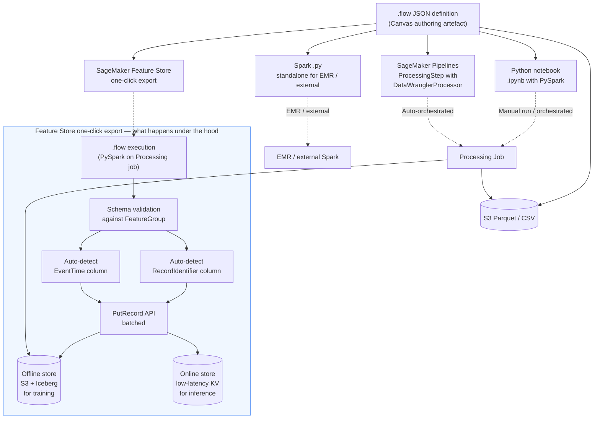

# Chapter 18 — SageMaker Data Wrangler: visual feature engineering

> **Goal of this chapter:** to install the mental model of *where Data Wrangler fits in the SageMaker data plane*, *what it does that Glue, DataBrew, Athena, and EMR cannot*, and *how the 2024-2025 SageMaker Canvas migration redrew the surface that the MLA-C01 grades you on*. Data Wrangler is the only data-prep tool the official exam guide names in **two separate task statements** — Task 1.1 (*Ingesting data into Amazon SageMaker Data Wrangler and SageMaker Feature Store*) and Task 1.2 (*Tools to explore, visualize, or transform data — SageMaker Data Wrangler, AWS Glue, AWS Glue DataBrew*). That double-naming is not accidental: of the half-dozen tools that move bytes from S3 into a SageMaker training job, Data Wrangler is the one whose unique value proposition is *ML-aware visual feature engineering*, and the exam expects you to recognise the scenarios where that proposition outweighs the alternatives. This chapter, together with Chapter 17 (DataBrew comparison) and Chapter 19 (Feature Store), pins down the Part D triangle that owns roughly 28% of the cert by weight.

---

## 18.1 Why Data Wrangler is its own chapter

Glue, DataBrew, Athena, EMR, and Spark on SageMaker Processing all transform data. They all appear in the MLA-C01 exam guide. So why does Data Wrangler get a chapter of its own, and why does the exam guide name it in two separate task statements?

Three reasons, and the exam tests every one of them:

1. **It is ML-aware, not just data-aware.** The built-in transform catalog includes SMOTE for class balancing, a target-leakage detector that runs a single-feature XGBoost against the label, quick-model preview that fits an actual XGBoost over the current state of the flow, Clarify's pre-training bias metrics for sensitive-column analysis, and feature correlation/multicollinearity (VIF) reports. None of Glue, DataBrew, or Athena ship any of these. They are *ML-data* tools — they understand transactions and partitions; they do not understand class imbalance, leakage, or fairness. Data Wrangler does.
2. **It composes with the SageMaker control plane natively.** A finished flow exports to a SageMaker Feature Store feature group (online + offline, with the record-identifier and event-time columns auto-detected from the flow), to a Pipelines `ProcessingStep` (with a `DataWranglerProcessor` that knows how to interpret a `.flow` file), or to a Spark `.py` you can run on EMR — without you writing the wiring code by hand. The integration is one-click. You can replicate it from a Glue job, but you write the boilerplate yourself.
3. **It is the cheapest way to bring a non-engineer (analyst, data scientist, PM) to the data-prep step.** The 2024 migration into Canvas added a natural-language chat interface — "drop rows where age is null and one-hot encode state" becomes three transform steps you can preview and accept. That capability does not exist anywhere else in the AWS data-prep portfolio. Q Developer is a coding assistant, not a data-prep tool; Bedrock is a model layer, not a transform pipeline; DataBrew has 250+ no-code transforms but no NL interface and no ML-specific operations.

The decision-rule version, the one to memorise: *if your scenario question puts an **ML practitioner** (not a data engineer) in front of **tabular data destined for SageMaker training or Feature Store**, the answer is almost always Data Wrangler.* If it puts a *data engineer* in front of *batch ETL feeding many downstream systems*, the answer pivots to Glue. If it puts an *analyst* in front of *a one-off cleanup with no ML destination*, the answer is DataBrew. Chapter 17 sharpened the DataBrew comparison; this chapter establishes the Data Wrangler half, and Chapter 19 will close the loop with Feature Store as the canonical export target.

There is a softer reason as well. Data Wrangler is the SageMaker service most affected by the 2024-2025 Canvas migration, and the exam loves to test whether candidates have kept up. Older study guides — even ones published as recently as 2024-Q1 — still show the Studio Classic launcher screenshots and call the tool "Data Wrangler in Studio." That is the maintenance-only variant. The current product, the one receiving new features, lives inside Canvas. Section 18.3 walks the migration history; if you read nothing else in this chapter for the exam, read that section.

---

## 18.2 The four-act mental model

Every Data Wrangler engagement, regardless of UI surface, is the same four-act play. You should be able to recite the acts in order before you ever click a button:

1. **Source.** Import data from one of 40+ supported connectors. A *sample* lands in the interactive view; the full dataset only flows through at export time.
2. **Transform.** Apply one or more of the 300+ built-in transforms (or a custom transform in pandas, PySpark, PySpark SQL, or SQL) to clean, encode, scale, balance, or featurise the data. Each transform is a discrete node in the flow DAG.
3. **Analyse.** Generate ML-aware diagnostics — the Data Quality and Insights Report, the Bias Report (powered by Clarify), Quick Model (XGBoost preview), feature correlation, and multicollinearity. These pin to the flow as analysis nodes.
4. **Export.** Push the flow to one of five targets — Python notebook, SageMaker Pipelines step, Feature Store feature group, standalone Spark `.py`, or raw S3.

```mermaid
flowchart LR
    subgraph Act1 ["1. SOURCE — 40+ connectors"]
        S3[(Amazon S3)]
        ATH[(Athena)]
        RS[(Redshift)]
        SF[(Snowflake)]
        DB[(Databricks)]
        LF[(Lake Formation)]
        MG[(MongoDB)]
        OS[(OpenSearch)]
        SAL[(Salesforce)]
        EMR[(EMR Hive / Presto)]
        RDS[(RDS / JDBC)]
        OTHER[(... 30+ more)]
    end
    subgraph Act2 ["2. TRANSFORM — 300+ across 15 categories"]
        T1[Cast types]
        T2[Handle missing]
        T3[Encode categorical]
        T4[Scale numeric]
        T5[Featurise text / date]
        T6[Balance SMOTE]
        T7[Time-series lag / roll]
        T8[Custom Python /<br/>PySpark / SQL]
    end
    subgraph Act3 ["3. ANALYSE — ML-aware diagnostics"]
        DQR[Data Quality &<br/>Insights Report PDF]
        BIAS[Bias Report<br/>via Clarify]
        QM[Quick Model<br/>single XGBoost]
        VIZ[Histogram / scatter /<br/>correlation / VIF]
    end
    subgraph Act4 ["4. EXPORT — 5 targets"]
        NB[Python notebook<br/>.ipynb]
        PIPE[SageMaker Pipelines<br/>ProcessingStep]
        FS[Feature Store<br/>online + offline]
        SPARK[Spark job<br/>.py for EMR]
        S3OUT[(S3 Parquet / CSV)]
    end
    Act1 --> Act2 --> Act3 --> Act4
    style Act1 fill:#e8f0fe,stroke:#4285f4
    style Act2 fill:#fef7e0,stroke:#f9ab00
    style Act3 fill:#e6f4ea,stroke:#34a853
    style Act4 fill:#fce8e6,stroke:#ea4335
```



The four acts collapse to one canonical artefact: **a `.flow` JSON file**. The visual canvas is just an editor for that JSON. Treat the file, not the canvas, as the thing that goes into Git. Section 18.7 returns to the `.flow` format and its production trade-offs.

Two observations worth pinning before we move on. **First**, the four acts are *sequential per branch* but the flow as a whole is *a DAG*, not a linear pipeline. A single source node can fan out into multiple branches (train/val/test split, then SMOTE on the train branch only — see §18.5.3); analysis nodes can attach to any intermediate step, not just the final one. The mental picture is "flow as DAG of typed nodes," not "flow as a Jupyter cell sequence." **Second**, the visual canvas is *fast* during authoring (it operates on a 50K-100K-row sample held in pandas in the browser-attached kernel) and *Spark-distributed* at export (the same `.flow` file is interpreted by a `DataWranglerProcessor` running on a multi-node SageMaker Processing job). The two execution modes have different scaling characteristics, different failure modes, and different bills. §18.8 covers the distributed execution mode and §18.10 covers the cost split.

---

## 18.3 The 2024-2025 Canvas migration — the single most-tested fact

This is the single most-confusing fact about Data Wrangler in 2026, and the MLA-C01 exam relies on it. Here is the actual history, compressed.

| Year | What changed |
|------|--------------|
| **2020 (re:Invent)** | Data Wrangler launched as a feature of **SageMaker Studio Classic**. Flows lived as `.flow` JSON files in EFS. |
| **2023** | AWS announced "new Studio" (sometimes called Studio next-gen) built on JupyterLab 3+ and a redesigned Code Editor. Studio Classic was deprecated but kept available as an app. |
| **August 2024** | AWS published the formal migration blog *"Migrate Amazon SageMaker Data Wrangler flows to Amazon SageMaker Canvas for faster data preparation."* The new Studio **does not include** a native Data Wrangler UI; to use Data Wrangler in the new Studio era, you launch a Canvas application from inside Studio. |
| **2025 — present (2026)** | Data Wrangler is officially a feature of **SageMaker Canvas**. The Studio Classic variant still loads existing flows but receives no new features. Studio Classic itself is on a deprecation track. |

The disambiguation rule the exam keeps testing:

| If the question says... | The answer assumes... |
|---|---|
| *"Data Wrangler"* (alone, no qualifier) | The modern Canvas-hosted product. |
| *"Data Wrangler in Studio Classic"* | They are testing whether you know it is the legacy variant. |
| *"natural language to transform data inside SageMaker"* | Data Wrangler in Canvas — this is the chat interface, **not** Q Developer and **not** Bedrock. |
| *"the visual data-prep tool in SageMaker Canvas"* | Data Wrangler. (Canvas without Data Wrangler is the no-code AutoML predictor — see Chapter 27 on Autopilot.) |
| *"open the Data Wrangler launcher in the new Studio experience"* | A trick question — there is no native launcher; you must open Canvas first. |

> ⚠️ **Exam alert — Data Wrangler in Canvas vs Studio.** When a 2026-era question references Data Wrangler in *Studio Classic*, that is a legacy / maintenance-mode reference and the right-answer is usually *"migrate the flow to Canvas to receive new features."* When the question references *Studio (new)* and asks "where do I find Data Wrangler," the only correct answer is *"launch Canvas from inside Studio."* The wrong answers will include "the Data Wrangler tab in the new Studio launcher" — which does not exist. Read the question carefully for the Studio variant; the correct answer is determined by it.

### 18.3.1 Why the migration matters in practice

A `.flow` file written in Studio Classic *can* be imported into Canvas Data Wrangler, but the migration is not pure cosmetic. Three things change:

1. **IAM execution role.** Canvas runs as a separate domain application with its own execution role. The role's policies must include the same S3, Snowflake, Redshift, and Feature Store permissions the original Studio Classic role had. The migration guide (`studio-updated-migrate-ui`) walks the permissions delta.
2. **Data source re-registration.** Snowflake, Databricks, and other JDBC connectors typically need their credentials re-attached because Canvas reads them from a different Secrets Manager scope.
3. **Cost model shift.** In Studio Classic, Data Wrangler ran on a Studio Notebook instance you paid for by the hour. In Canvas, Data Wrangler runs inside the Canvas application — billed as a Canvas session — *plus* whatever Processing or training jobs you launch from it. §18.10 breaks this out.

### 18.3.2 The three migration paths

If you inherit a Studio Classic flow in 2026 and need to bring it forward, three paths exist:

1. **One-click migration** — if Studio Classic and Canvas share the same EFS volume in the same SageMaker domain, the Canvas import dialog sees the `.flow` files directly. Most common in single-team workspaces.
2. **S3 transfer** — `aws s3 sync` your `.flow` files to S3, then "Import data flows" from S3 inside Canvas. Common when EFS sharing is not configured.
3. **Local laptop transfer** — download the `.flow` JSON from Studio Classic's file tree, re-upload in Canvas. The escape hatch when IAM or networking blocks the other two paths.

The community-confusion signal is loud here. Re:Post threads from late 2024 onwards are full of *"I can't find the Create Job button"* posts — users who updated to the new Studio and lost the entire Data Wrangler UI. The official docs page now says explicitly: *"if you update to using the new Studio experience, you must use SageMaker Canvas to access Data Wrangler and receive the latest feature updates."* If you see that phrasing in an exam question, that is your hint.

---

## 18.4 Source connectors — what "40+ sources" actually means

The Data Wrangler import page enumerates the supported sources. The exam does not test specific connector names (you will not be asked "does Data Wrangler support MongoDB"). It does test the *categories* of source and the *limitations* of the connector model.

### 18.4.1 The connector taxonomy

**Native AWS analytic and storage sources:**

| Source | Mode | Typical use |
|---|---|---|
| **Amazon S3** | Direct read (CSV, Parquet, JSON, JSONL, ORC, Excel) | The default. Lake substrate. |
| **Amazon Athena** | SQL query, results materialised | Pull a join across Glue Catalog tables. |
| **Amazon Redshift** | SQL via JDBC | Warehouse-stored features. |
| **AWS Lake Formation / Glue Catalog** | Read governed catalog tables | Lakehouse access with column-level FGAC. |
| **Amazon EMR (Hive / Presto)** | SQL via the EMR connector | Existing Hive metastore tables. |
| **Amazon RDS** | JDBC | OLTP snapshot reads. |

**Third-party data platforms:**

| Source | Mode |
|---|---|
| **Snowflake** | Native connector. Requires Studio Classic ≥ 1.3.0 (legacy) or Canvas (current). |
| **Databricks** | JDBC connector. |
| **MongoDB** | Native connector (Canvas-only). |
| **OpenSearch / OpenSearch Service** | Native connector (Canvas-only). |
| **Salesforce** | Native connector (Canvas-only). |

**Generic and fall-through:**

| Source | Mode |
|---|---|
| **JDBC (any)** | Generic JDBC; bring the driver JAR and a connection URL. |
| **Local upload** | Through the Studio / Canvas file UI. |

Beyond those name-checked sources, the connector list grows continuously as Canvas releases new connectors. The "40+" number is current as of late-2025; expect it to grow.

### 18.4.2 What the connectors do *not* do

This is the part the exam likes to test in scenario form:

- **They do not unify schemas.** Joining S3 + Snowflake in one flow requires an explicit *Join* transform node. Data Wrangler does not auto-federate.
- **They do not stream.** Data Wrangler is batch-only. Kinesis and Kafka go to Glue Streaming, Lambda + Firehose, or Managed Service for Apache Flink — not Data Wrangler. If a question asks for *near-real-time* feature computation, Data Wrangler is the wrong answer.
- **They do not push compute back to the source for the full flow.** A SQL query against Athena runs in Athena. But the downstream transforms in the flow run in Data Wrangler's engine (pandas on the sample for interactive view, Spark for scaled-out export — see §18.8). There is no equivalent of dbt's "compile to warehouse SQL" pattern.

### 18.4.3 The sampling-vs-full-read gotcha

When you import, Data Wrangler reads a *sample* by default (first-N rows, random sample, or stratified sample) so the visual UI stays responsive. The full dataset only flows through at export time. This is the source of two common surprises:

1. The interactive view reports *"no nulls in column X"* because the sample missed them; the exported full-dataset job hits nulls and may fail or fill them with unintended defaults.
2. Quick Model trains on the sample only — its F1 / RMSE figure is a lower-bound preview, not a final number. A model that looks promising on the sample may regress at full scale (and vice versa).

The mitigation is to validate the flow against the full dataset *before* promoting it to a recurring pipeline. We will return to this as antipattern #6 in §18.12.

---

## 18.5 Built-in transforms — the 300+

Data Wrangler advertises "300+ built-in transforms." The number sounds like marketing, but each one is exposed as a discrete UI step with parameters. The exam tests *categories*, not individual names, so internalise the family tree.

### 18.5.1 The 15-category transform tree

| Category | Examples | Use case |
|---|---|---|
| **Parse value as type** | Cast to int/float/string/bool/timestamp | Fixing CSV-imported "everything is string" |
| **Manage columns** | Drop, duplicate, rename, move, concatenate | Schema shaping |
| **Manage rows** | Sort, shuffle, drop duplicates | Order / dedup |
| **Handle missing** | Drop rows, fill with constant / mean / median / mode | Imputation |
| **Handle outliers** | Standard deviation, quantile, robust (IQR), min/max thresholds | Winsorisation |
| **Process numeric** | Standard scale, min-max scale, max-abs, robust scale, log transform | Feature scaling |
| **Encode categorical** | One-hot, ordinal, similarity (target / mean) | Categorical → numeric |
| **Featurise text** | Tokenise, character statistics, TF-IDF, HashingVectorizer, Word2Vec, sentence embeddings | NLP feature gen |
| **Featurise date/time** | Extract year/month/day/hour/dayofweek, cyclical (sin/cos) encoding | Time features |
| **Time-series transforms** | Resample, lag features, rolling windows, fill gaps | Forecasting prep |
| **Balance data** | **SMOTE**, random oversample, random undersample | Class imbalance |
| **Validate string** | Regex match, email/URL validators | Quality gates |
| **Handle structured** | Parse JSON, flatten struct, vector to columns | Nested → flat |
| **Search and edit** | Find/replace, regex transform | Text cleanup |
| **Split data** | Random, stratified, ordered, group-by | Train/val/test |
| **Custom transform** | **Python (pandas), Python (PySpark), PySpark SQL, SQL** | Anything else |

(Source: `docs.aws.amazon.com/sagemaker/latest/dg/data-wrangler-transform.html`.)

The 15-category mental model is enough for the exam. You will not be asked "what is the exact name of the robust scaler transform"; you will be asked "a numeric column has heavy outliers and you need to scale it without letting the outliers dominate — pick the right transform family." That is the *Process numeric → robust scale* answer.

### 18.5.2 The four custom-transform engines (exam favourite)

When you add a Custom Transform step, you pick one of four engines. Pick the wrong one and your flow either runs slowly or fails at scale:

| Engine | Interactive view | Export scale | When to use |
|---|---|---|---|
| **Python (pandas)** | Fast on sample (in-memory) | Bottleneck at TB scale — runs in driver memory only | One-off cleanups, small data, regex-style logic |
| **Python (PySpark / UDF)** | Slower on sample (Spark overhead) | Scales horizontally | Custom logic across large data |
| **PySpark SQL** | Slow on sample | Scales horizontally | SQL-friendly users, large data, joins/aggregates |
| **SQL** | Runs on sample only | Translates to PySpark at export | Quick joins, group-bys, simple selects |

The rule of thumb the exam tests: *"Custom logic must run on the full multi-TB dataset"* → the answer mentions **PySpark** or **PySpark SQL**, not pandas. *"Custom logic is a small one-off cleanup on a 50 MB CSV"* → pandas is fine.

There is a hard upper bound the exam likes to put in answer choices. AWS's published benchmark on an **80M-row × 300-column (~100 GB) dataset** is the cautionary tale:

| Instance | Built-in PySpark transform | Custom pandas transform |
|---|---|---|
| `ml.m5.4xlarge` (64 GiB) | 229 s | Out of memory |
| `ml.m5.8xlarge` (128 GiB) | 130 s | Out of memory |
| `ml.m5.16xlarge` (256 GiB) | 52 s | 30 minutes (barely) |

The custom pandas transform runs on the *driver* only — it does not distribute. The flow that worked on a 100K-row sample in the UI OOMs the moment it sees the full 80M rows. This is the most-tested production trap in Data Wrangler.

> ⚠️ **Exam alert — custom-transform 80M-row limit.** Any scenario question that combines *"custom pandas transform"* and *"large dataset" (typically 50M+ rows or >50 GB)* is signalling that pandas will not scale. The correct answer is to rewrite the transform as **PySpark** or **PySpark SQL**, or to lift the custom logic out of Data Wrangler entirely into a hand-coded Processing job. Distractor answers will offer "scale up the instance to `ml.r5.24xlarge`" — that works barely if at all, and it is not the recommended pattern. The exam wants you to *distribute*, not just *vertically scale*.

### 18.5.3 SMOTE specifically

SMOTE — Synthetic Minority Over-sampling Technique — is a balance-data transform that synthesises new minority-class rows by interpolating between existing minority-class neighbours in feature space, rather than just duplicating them. Two things to remember:

1. **Apply SMOTE only on the training split, not on validation or test.** The Data Wrangler *split* step should come *before* the SMOTE step in the flow DAG, with the SMOTE step attached only to the training branch. Applying SMOTE before the split contaminates the validation set with synthetic neighbours of training points, inflating the apparent score.
2. **SMOTE is for tabular numeric/encoded features.** Text and time-series have their own balance techniques; SMOTE is not the answer for image classification (use augmentation) or time-series (use windowing / synthetic-sequence generation).

This is one of the cleanest exam-trick patterns: a question that shows you "split → SMOTE → train" is correct; a question that shows you "SMOTE → split → train" is wrong, even if every other detail is right.

---

## 18.6 Analyses — the ML-aware diagnostics

This is the section that separates Data Wrangler from Glue, DataBrew, and Athena. Every analysis below produces a chart, table, or report you can pin to the flow as an analysis node.

### 18.6.1 The Data Quality and Insights Report — the one-click PDF

A one-click report that profiles the dataset and flags problems. The official docs (`data-wrangler-data-insights`) describe it as the single recommended first step after importing. It is the under-appreciated feature that even teams that mostly write PySpark sometimes spin up Data Wrangler for the EDA pass.

**What it computes, with thresholds:**

| Diagnostic | Method | Threshold / range | What it means |
|---|---|---|---|
| **Target leakage** | ROC AUC of feature predicting target | ~1.0 = leakage; ~0.5 = no signal | A column is too predictive — almost certainly leaked from the future |
| **Multicollinearity (VIF)** | Regression of each feature on the rest | >5 = highly correlated; capped at 50 | Redundant features inflating coefficient variance |
| **Multicollinearity (Lasso)** | L1 coefficients | Near-zero = redundant | Cross-check for VIF |
| **Multicollinearity (PCA)** | Singular-value spread | Top values dominate = collinear | Catches structure VIF can miss |
| **Feature correlation (linear)** | Pearson | [-1, 1] | Standard linear dependence |
| **Feature correlation (non-linear)** | Spearman / Cramér's V | [0, 1] or [-1, 1] | Catches monotonic / categorical dependence |
| **Anomalous rows** | **Isolation Forest** | Per-row anomaly score | Flag rows that don't belong to the main distribution |
| **Class imbalance** | Frequency distribution | High-severity warning if extreme | Don't accept a 99% accuracy claim on imbalanced data |
| **Duplicate rows** | Hash collision (exact + near-duplicate) | Count | Duplicates break clean train/val splits |
| **Quick Model accuracy** | XGBoost on train fold, score on val fold | F1 / RMSE + feature importance | Baseline ceiling preview |
| **Missing / invalid values** | Per-column profile | Per-column % | Standard data quality |

The report exports as a **PDF** that you can attach to a model card, share with a Model Risk reviewer, or pin to the design doc. In a regulated-industry shop (banking, healthcare), the leakage and bias sections of this PDF show up directly in the model risk artefacts the SR 11-7 / FDA SaMD reviewer reads.

**The Titanic example is the canonical teaching case.** The "lifeboat" column on the Titanic dataset has near-1.0 AUC predicting survival, because lifeboat assignments happened *after* the disaster. The report flags this automatically. In a real engagement, the same mechanism catches things like:

- A *customer churn* model where `last_login_date` is set to NULL only after churn — perfect predictor, useless in production.
- A *fraud detection* model where `chargeback_count` is in the feature set, but chargebacks happen weeks after the prediction window.
- A *credit default* model where `current_status = 'in_collections'` was accidentally included as both a feature and a target derivation.

These are bugs that eat 6-9 months of a real ML project's lifecycle when not caught early. The Data Quality and Insights Report turns them into a 5-minute fix during EDA. This single report justifies running Data Wrangler over the first sample of any new dataset, even if the production pipeline will eventually be hand-coded PySpark.

### 18.6.2 The Bias Report — Clarify integration

Data Wrangler embeds SageMaker Clarify's *pre-training* bias metrics directly inside the flow. You pick a sensitive column (`gender`, `age_bucket`, `race`, etc.) and a target column; Clarify computes:

| Metric | What it tells you |
|---|---|
| **Class Imbalance (CI)** | Imbalance of the sensitive group itself in the dataset |
| **Difference in Proportions of Labels (DPL)** | Outcome-rate gap between groups (e.g., approval rate for group A vs B) |
| **Kullback-Leibler Divergence (KL)** | Distributional difference in outcomes across groups |
| **Jensen-Shannon Divergence (JS)** | Symmetric variant of KL |
| **L_p norm (LP)** | Vector distance in label distributions |
| **Total Variation Distance (TVD)** | Maximum difference in label probabilities |
| **Kolmogorov-Smirnov (KS)** | Max CDF distance for continuous outcomes |
| **Conditional Demographic Disparity (CDD)** | DPL adjusted for confounders |

**Post-training** bias metrics (DPPL, DI, RD, AD, TE, FT, etc.) are *not* run here — those require a trained model and live in Clarify proper (Chapter 29). The split is intentional: pre-training bias is a property of the *dataset*, post-training bias is a property of the *model*. Data Wrangler operates on datasets, so it gets pre-training metrics; the model evaluation chapter gets post-training metrics.

> ⚠️ **Exam alert — Clarify integration triggers.** If a scenario question says "pre-training bias from inside Data Wrangler," the correct service is **Clarify** (Data Wrangler embeds it; it is not a standalone bias tool). If the same scenario asks for "bias against a deployed model's predictions" or "post-training fairness," the answer pivots to a standalone Clarify Processing job (Chapter 29) or to Clarify integrated with Model Monitor (Chapter 49). Distractor answers will include "use Data Wrangler" for the post-training case — that is wrong; Data Wrangler runs only the pre-training half.

### 18.6.3 Quick Model — and why it is not Autopilot

The Quick Model analysis trains an **XGBoost** model on the current state of the flow and reports:

- F1 (classification) or MAE/MSE (regression)
- Feature importance via gain
- ROC / PR curves for classification

It is **not** a hyperparameter search and **not** AutoML. It is a fast sanity check that says *"with these features as they currently stand, here is the ceiling a tree model can reach."* If you want AutoML, you export the flow and feed the dataset to **Autopilot** (Chapter 27), or use Canvas's no-code predictor (which is built on Autopilot).

The exam loves to put Quick Model and Autopilot in the same answer set:

| Tool | What it is | When |
|---|---|---|
| **Quick Model** (Data Wrangler) | Single XGBoost, fast preview, baseline ceiling | EDA sanity check during feature engineering |
| **Autopilot** | Full AutoML — model leaderboard across XGB / LinearLearner / DL, hyperparameter tuning, ensembling | Production model selection |
| **Canvas no-code predictor** | UI wrapper over Autopilot | Non-technical user wants a deployed model end-to-end |

Quick Model = "is this feature set even useful?" Autopilot = "what is the best model I can ship from this feature set?" Different questions, different services.

### 18.6.4 The remaining visualisations

| Analysis | What it shows |
|---|---|
| **Histogram** | Distribution of one numeric column, optionally grouped by a categorical column |
| **Scatter plot** | Two numeric columns, optionally coloured by a third |
| **Feature correlation** | Pearson / Spearman matrix across numeric features |
| **Multicollinearity** | VIF, Lasso, and PCA variance ratios; flags features that are linear combinations of others |
| **Custom visualisation** | Bring your own Altair or Matplotlib code |

Multicollinearity matters because tree models tolerate it but linear models (and SHAP explanations of linear models) do not. The analysis surfaces VIF > 5 as a soft warning, VIF > 10 as a strong warning. If your downstream model is a logistic regression, the multicollinearity report is the line of defence against unstable coefficients and broken SHAP attributions.

---

## 18.7 The `.flow` file — flow as code

A Data Wrangler flow is persisted as a single JSON file with the `.flow` extension. Skeleton:

```json
{
  "metadata": {"version": 1, "disable_limits": false},
  "nodes": [
    {
      "node_id": "abc-123",
      "type": "SOURCE",
      "operator": "sagemaker.s3_source_0.1",
      "parameters": {
        "dataset_definition": {
          "s3ExecutionContext": {"s3Uri": "s3://my-bucket/raw.parquet"}
        }
      }
    },
    {
      "node_id": "def-456",
      "type": "TRANSFORM",
      "operator": "sagemaker.spark.handle_missing_0.1",
      "parameters": {"strategy": "mean", "input_column": "age"},
      "inputs": [{"name": "default", "node_id": "abc-123", "output_name": "default"}]
    }
  ]
}
```

Each node has a `type` (`SOURCE`, `TRANSFORM`, `ANALYSIS`, `DESTINATION`), an `operator` identifier, a `parameters` block, and (for non-source nodes) `inputs` pointing at upstream `node_id` values. The file is human-readable, ordering-sensitive, and roughly diffable.

### 18.7.1 The four implications of flow-as-JSON

1. **Version control.** Check the `.flow` into Git; PR reviewers can diff transforms line-by-line (with caveats — see §18.12 antipattern #1).
2. **Parameterisation.** Replace dataset URIs with pipeline parameters (e.g. `{{pipeline_param_dataset_uri}}`) — the same flow runs against dev, staging, and prod data without modification. The official mechanism is documented under *Reusing Data Flows for Different Datasets* (`data-wrangler-parameterize`).
3. **Programmatic creation.** You can generate flows from a script, useful when the same transform pattern needs to be applied to 50+ tables.
4. **Lineage.** SageMaker Lineage captures each flow execution as an `Action` artifact, linking input dataset → flow execution → output dataset. This shows up in the lineage graph alongside training-job and processing-job artifacts.

### 18.7.2 The Git story — opaque-but-diffable

The honest version: the `.flow` file is JSON, so `git diff` produces output, but the output is not actually *reviewable*. A two-version diff typically shows JSON-key reordering, UUID changes, and layout-coordinate updates rather than "we added a one-hot encoding step for column X." Merge conflicts on the same `.flow` are practically unsolvable — the official AWS guidance is literally *"any changes that aren't saved by one person are overwritten by the person who saved their changes."* That is a last-write-wins workflow, not a versioning system.

Most production teams adapt by treating the `.flow` as a *scaffolding* artefact: build the flow once, export the generated PySpark script (§18.9.1), and check **that script** into Git as the source of truth. The `.flow` itself stays as a documentation artefact in Canvas. We will return to this as antipattern #1 in §18.12.

---

## 18.8 Distributed processing — what happens at export time

Data Wrangler has two execution modes that the exam treats as a unit:

| Mode | When | Engine | Scale |
|---|---|---|---|
| **Interactive** | Inside the canvas, on the sampled dataset | pandas | MB — small GB |
| **Export / batch** | Triggered by an export target or pipeline run | **SageMaker Processing job with Spark** | TB+ (within m5 family limits) |

The export-time engine is a managed PySpark cluster spun up as a SageMaker Processing job. You control:

- **Instance type** — `ml.m5.4xlarge` default; can scale to `ml.m5.24xlarge`. Instance family is **locked to m5** — no r5 (memory-optimized), no c5 (compute-optimized), no GPU. The horizontal scaling lever is what you have.
- **Instance count** — Spark workers scale horizontally. Multi-node Spark cluster (one driver, N-1 workers) when count > 1.
- **KMS key** — for at-rest encryption of intermediate data.
- **VPC config** — for private networking to data sources.
- **EBS volume size** — `gp2` storage billed on top of compute; forgetting to size it down on small jobs is a quiet cost leak.

### 18.8.1 Distributed Spark mode — the 40-50% savings story

By default, a Data Wrangler job runs on a *single instance*. The container is a Spark cluster of size 1 — one driver, no separate executor nodes. This works up to "hundreds of gigabytes" per the AWS docs. When you configure multiple instances, Data Wrangler launches a real multi-node Spark cluster and the `.flow`'s built-in transforms run distributed.

The cost-optimisation angle from the official Sagemaker spend-analysis blog (`part-3-processing-and-data-wrangler-jobs`):

| Workload | Naive choice | Distributed alternative | Savings |
|---|---|---|---|
| 350 GiB dataset | 1× `ml.m5.24xlarge` (384 GiB) | 2× `ml.m5.12xlarge` (512 GiB total) | ~40% |
| 350 GiB dataset | 1× `ml.m5.24xlarge` | 3× `ml.m5.4xlarge` (384 GiB total) | ~50% |

The lesson: horizontal scaling of mid-tier instances beats vertical scaling of one massive instance for Spark-friendly workloads. This is the same lesson the broader Spark community has learned over a decade; Data Wrangler just exposes the knob.

### 18.8.2 The gotchas with distributed mode

- **Spark driver/executor memory must be re-tuned when you scale up.** AWS warns: *"If you have an initial `ml.m5.4xlarge` instance job configured ... and later scale up to `ml.m5.12xlarge`, those configuration values need to be increased, otherwise they will be the bottleneck."* The Spark settings do not auto-scale with the instance.
- **m5-only instance family.** No r5 for memory-bound work (wide one-hot encoding hits this), no c5 for compute-bound work, no GPU for any kind of GPU-accelerated transform. The only escape is to leave Data Wrangler entirely (see §18.13).
- **Custom-pandas transforms collapse a Spark export to a single executor.** You lose the parallelism, you OOM at 80M rows. This is the §18.5.2 trap re-stated in the distributed context.

### 18.8.3 When distributed mode is not enough

If your dataset is *terabyte-scale*, AWS's own guidance is to use **EMR Serverless from Studio** instead. Data Wrangler's distributed mode tops out in the low TB; beyond that, the overhead of the Data Wrangler job orchestration (flow-file interpretation, schema validation, single-driver coordination) becomes the bottleneck.

> Exam pattern: *"The dataset is 5 TB. Sampling in Data Wrangler shows the flow works on a 1 GB sample. How do you run it on the full data?"* → Export to a Processing job and configure multi-instance PySpark; if cost is the constraint, hand off to Glue or EMR. Not "open it in Studio Classic and click Run."

---

## 18.9 Export targets — where the flow lands in production

A flow is useless until it executes against real data on a schedule. Data Wrangler offers five export targets; pick by *who consumes the output*.



### 18.9.1 The five targets in detail

| Target | Output artifact | When to choose |
|---|---|---|
| **Python notebook** | `.ipynb` reproducing the flow as PySpark / pandas | You want to inspect and modify the generated code before running. Ideal for code review. |
| **SageMaker Pipelines** | A `ProcessingStep` you drop into a larger DAG | The flow is part of a recurring training pipeline. The exam's default-correct answer for "production schedule." |
| **Feature Store (online + offline)** | Writes records to a feature group | The transformed columns are reusable features across multiple models. Auto-detects record-identifier and event-time columns. |
| **Spark job** | Standalone `.py` to run on EMR / external Spark | You are migrating off Data Wrangler or want to run the flow outside SageMaker. |
| **S3** | Parquet / CSV files | One-shot ETL; downstream system reads from S3 directly. |

### 18.9.2 The Pipelines export specifically

The one-click "Export to Pipelines" generates a `ProcessingStep` whose Processor is the built-in `DataWranglerProcessor`. The step takes the `.flow` JSON as input and the dataset as the input data channel. The output is a Parquet artifact in S3 plus, optionally, a Feature Store ingest. You then assemble it with downstream Training and Register steps in your Pipeline definition. This is the cleanest end-to-end pattern for Domain 3 (Deployment + Orchestration) scenarios on the exam.

### 18.9.3 The Feature Store one-click export — the canonical pattern

This is the architecture diagram that shows up in every AWS-aligned ML reference architecture and on most certification exams. In Canvas Data Wrangler today:

1. Click the **+** at the end of a transform chain.
2. Choose **Export to → SageMaker Feature Store**.
3. Either pick an **existing feature group** or **Create Feature Group**.
4. Optionally check **Create "EventTime" column** (Feature Store requires an event-time column for offline-store time-travel queries).

Under the hood, Data Wrangler:

- Generates a SageMaker Processing job from the `.flow` file.
- Configures the job's output destination as the Feature Group's `PutRecord` API.
- Validates the flow's output schema against the feature group's schema (column names, dtypes).
- Auto-detects the record-identifier column (`RecordIdentifierName`) and the event-time column (`EventTimeName`) from the flow.

The result is records landing in **both** the online store (low-latency KV for inference) and the offline store (S3 + Iceberg for training) under a single feature group definition. Chapter 19 takes this Feature Store integration apart in detail.

**When this pattern works beautifully** — single-source, batch-refreshed features; small-to-medium scale (millions of rows, single-digit GB per refresh); stable schema; single owner.

**When you outgrow it** — multi-source joins with complex business logic (move to Glue or dbt writing via `PutRecord`); streaming features (Data Wrangler is batch-only, you need Kinesis + Lambda or Tecton/Feast as a separate feature platform); schema versioning (Feature Store does *record* versioning by `EventTime`, but renaming a feature or changing its type still requires a new feature group and a manual cutover).

### 18.9.4 The serial-inference-pipeline export (rare)

A rarer Canvas-only option: export the flow as a *container image* that replays the same transforms at inference time. Useful when you cannot tolerate train-serve skew on transforms (e.g., scalers fit on training statistics — the inference path must apply the *same* fitted scaler). In practice most teams handle this through Feature Store or by sharing a transform module across training and serving — exam questions on serial inference pipelines are uncommon.

### 18.9.5 What does *not* export

- A `.flow` does **not** export to Glue jobs natively. The path is `.flow → Spark .py → run on Glue`.
- It does not export to DataBrew (DataBrew is a separate tool with its own recipe format — Chapter 17).
- It does not export to Athena views.

---

## 18.10 Cost model — split across the Studio Classic and Canvas eras

Data Wrangler is not free; the cost has two components, and the Canvas migration changed both.

| Component | Studio Classic era | Canvas era (current) |
|---|---|---|
| **Authoring / interactive** | Studio Notebook instance (`ml.m5.4xlarge` default, billed per hour active) | Canvas session-hour rate |
| **Batch execution** | SageMaker Processing job (per-instance per-second) | SageMaker Processing job (per-instance per-second) |
| **Idle shutdown** | Manual until 2024-Q2; then auto-shutdown | Auto-shutdown on Canvas idle |
| **EBS storage** | `gp2` on the Notebook instance | `gp2` on the Canvas session + Processing job |
| **Data transfer** | Egress from S3 / Snowflake / Redshift | Same |

### 18.10.1 The auto-shutdown gotcha

Pre-2024, leaving a Data Wrangler tab open in Studio Classic would silently bill a Notebook instance overnight. The 2024 Studio idle-shutdown feature (Canvas inherits it) closes this hole — but the exam still asks *"what is a cost-control practice for Data Wrangler?"* and the answer is **enable idle shutdown / set session timeouts on the Canvas application**.

The AWS docs warn explicitly about a related trap: *"if you switch the instance type, the instance that you used to run the flow continues to run. You are charged for all running instances."* Multiple teams have reported five-figure surprise bills from a forgotten `ml.m5.24xlarge` sitting idle over a weekend. The mitigation is a scheduled shutdown at the Canvas application level *and* a CloudWatch alarm on the `processing_DW` usage type.

### 18.10.2 Choosing instance size for batch

| Dataset size | Recommended export instance |
|---|---|
| < 5 GB | Default `ml.m5.4xlarge`, 1 instance |
| 5 GB — 100 GB | `ml.m5.4xlarge` or `ml.m5.8xlarge`, 2-4 instances |
| 100 GB — 1 TB | `ml.m5.12xlarge`, 4-8 instances |
| > 1 TB | `ml.m5.24xlarge`, 8+ instances — or hand off to Glue / EMR for cost |

The crossover where Glue or EMR becomes cheaper than Data Wrangler's Processing-job execution sits somewhere around the 1-5 TB / daily-cadence range — but only if you have engineers to maintain the Glue/Spark code yourself. This is the §18.11 trade-off.

---

## 18.11 Data Wrangler vs Glue vs DataBrew vs Athena vs EMR

The exam's go-to comparison set. Memorise the right column:

| Tool | Primary user | Compute | Strengths | Weakness vs Data Wrangler |
|---|---|---|---|---|
| **Data Wrangler** | ML practitioner / scientist | Pandas (interactive) + PySpark (export) | ML-aware (SMOTE, leakage, quick model, Clarify bias); native Feature Store + Pipelines export | Not for streaming; engineer-heavy ops prefer Glue |
| **AWS Glue ETL** | Data engineer | Managed Spark / Python shell / Ray | Production-scale ETL, Glue Catalog, streaming, schedule via triggers | No built-in ML transforms; no quick-model preview; code-first |
| **AWS Glue DataBrew** | Business / data analyst | DataBrew engine | 250+ no-code transforms; great visual profiling | No SMOTE / target leakage / quick model; weaker SageMaker integration |
| **Amazon Athena** | Analyst / engineer | Presto on data lake | Cheap interactive SQL over S3; serverless | Not a transformation pipeline; output is query results, not features |
| **Amazon EMR (Spark)** | Data engineer | Open-source Spark on EC2 / EKS / Serverless | Maximum flexibility, large clusters, custom libraries | No SageMaker-native exports; manual cluster ops |

### 18.11.1 The decision tree

```
              Is the user a SCIENTIST or an ENGINEER?
                           │
                ┌──────────┴──────────┐
            SCIENTIST              ENGINEER
                │                     │
       Data fits in <100 GB?   Pipeline shared
                │              across teams?
            ┌───┴───┐             ┌─────┴─────┐
           YES     NO            YES         NO
            │      │              │           │
            │      ▼              ▼           ▼
            │  Data Wrangler   Glue ETL /  Processing Job
            │  distributed     Glue Studio + custom PySpark
            │  multi-node          │           │
            ▼                      ▼           ▼
       Data Wrangler         Streaming?    (custom infra)
       single-instance         ┌─┴─┐
                               YES NO
                               │   │
                               ▼   ▼
                          Glue   Glue
                          Stream  ETL
```

### 18.11.2 The "use both" pattern

A common real-world setup: **Glue** does the upstream lake-house ETL (Bronze → Silver, schema enforcement, partitioning); **Data Wrangler** does the ML-specific featurisation (Silver → Gold features for one model family) and writes to Feature Store. The two are layered, not competing. The exam occasionally rewards this layered answer over the "either/or" framing.

---

## 18.12 Production reality — adoption stories and the antipatterns

This is the section AWS marketing will not write, and the one that matters most for "design for a real team" scenario questions.

### 18.12.1 Adoption stories — INVISTA and Deloitte

The AWS Data Wrangler product page features two named adoption stories that keep showing up in re:Invent decks:

- **INVISTA** (chemicals / materials manufacturer) — their lead data scientist credited Data Wrangler with letting their data-science team *"interactively select, clean, explore, and understand data ... and create feature engineering pipelines that can scale to datasets spanning hundreds of millions of rows."* The pitch is *operationalising ML workflows faster for ML scientists who know pandas but not Spark* — not replacing data engineers.
- **Deloitte** (consulting) — value prop is *time-to-client-deliverable*: *"deliver measurable results to clients in days rather than months."* For a consulting shop staffing short engagements, a visual flow that can be handed off, reproduced, and exported as code beats a hand-coded PySpark notebook only the original author understands.

What both stories have in common: tabular feature engineering (not text/image/graph); data living in S3 / Athena / Redshift / Snowflake (first-class connectors); SageMaker training or Feature Store as the destination; the team chose Data Wrangler because the alternative was *writing PySpark from scratch*, not because the alternative was Glue or dbt.

The AWS Partner Network blog *"Leveraging MLOps on AWS to Accelerate Data Preparation and Feature Engineering for Production"* documents the canonical partner pattern: Data Wrangler flow → `.flow` checked into Git → SageMaker Pipelines step running the flow as a Processing job → Feature Store as destination. This is the reference architecture for both the cert and AWS-aligned ML system-design interviews.

### 18.12.2 When teams migrate away — the eight antipatterns

Equally important: the patterns that signal "Data Wrangler is no longer the right tool." These are the failures the exam tests under "design for a real team" framings.

**Antipattern 1 — the `.flow` file as source of truth.** The `.flow` is opaque JSON. Diffs are not really reviewable (key reordering, UUID churn, layout coordinates). Merge conflicts are unsolvable (last-write-wins). Production teams ship a flow once, then export the generated Python script and check **that** into Git.

**Antipattern 2 — no incremental processing.** Data Wrangler jobs always reprocess the full input. There is no equivalent of Glue's job bookmarks, no Iceberg snapshot incremental read, no "process only new partitions." Nightly batch feature pipelines that should only re-derive yesterday's features waste compute. Workaround: pre-partition the source and point each run at only the new partition (requires orchestration), or move to Glue + Feature Store `PutRecord`.

**Antipattern 3 — flow file rot.** Because the `.flow` is opaque JSON, after 6-12 months no one on the team remembers what the 47 transform nodes do. The flow becomes a black-box artefact everyone is afraid to touch. The Data Quality Report cannot help — it tells you what is in the data now, not why the flow processes it that way.

**Antipattern 4 — using Data Wrangler for streaming.** Data Wrangler is batch only. No Kinesis input, no DynamoDB output, no streaming connector. Teams that need sub-minute features bolt on Lambda + Feature Store online store, at which point Data Wrangler is no longer in the picture.

**Antipattern 5 — Studio Classic in 2026.** Authoring new flows in Studio Classic is a dead end. No new features, migration cost compounds, Studio Classic itself is deprecated.

**Antipattern 6 — over-reliance on the sample preview.** All visualisations, the data quality report, and custom-transform previews run on a 50K-100K-row sample. Production-time behaviour on the full dataset can differ substantially (outliers, rare categories, OOM on custom pandas). Always run a full-dataset validation job before promoting the flow.

**Antipattern 7 — instance leak from interactive mode.** Switch the instance type mid-session and the previous instance keeps running, silently billing. Multiple teams have reported five-figure surprise bills. Mitigation: scheduled shutdown on the Canvas application + CloudWatch alarm on `processing_DW`.

**Antipattern 8 — clobbering feature versions.** Re-running the flow against the same feature group appends records with newer `EventTime`. If the transform logic changed (you fixed a normalisation bug), the old buggy records are still there. Time-travel queries pull buggy values into training data. Fix: create a *new* feature group when transform semantics change, not clobber the existing one.

### 18.12.3 The honest 2026 recommendation

After all the caveats, the practitioner-honest version:

**Use Data Wrangler when:**
- You are doing EDA on a new tabular dataset and want the Data Quality Report (leakage, VIF, anomalies) for free.
- An ML scientist needs to prototype a feature pipeline fast and the data is < 100 GB.
- The destination is Feature Store and the team is small.
- The pipeline will be regenerated as Python before going to production.

**Don't use Data Wrangler when:**
- The pipeline is shared infrastructure across teams (use Glue or dbt).
- You need streaming or sub-hour freshness.
- You need custom transforms exceeding 50 lines or requiring third-party libraries.
- You need real version control and code review on transform logic.
- Data is in the multi-TB range (use EMR Serverless).

The pattern most mature AWS-native ML teams converge on: **Data Wrangler for EDA and the first feature pipeline draft, then export to Python and migrate to Processing jobs or Glue for production.** Treat Data Wrangler as a productivity *accelerator*, not the production runtime.

---

## 18.13 A worked exam scenario

> *"A team needs to train a churn model on 200M customer records stored in Snowflake. The data scientist is comfortable with Python but not Spark; the team has a weekly retraining cadence and wants the same transforms applied at inference. They need to detect that the `discharge_status` column is leaking the churn label. What is the lowest-ops architecture?"*

Map the requirements:

1. *Snowflake source, 200M rows* → Data Wrangler Snowflake connector, sample for authoring, export to Processing job for the full run.
2. *Data scientist, Python-comfortable, not Spark* → built-in transforms during authoring; rely on Data Wrangler to compile to PySpark at export. Avoid custom-pandas transforms at this scale.
3. *Weekly retraining* → export to SageMaker Pipelines; schedule via EventBridge.
4. *Same transforms at inference* → export to Feature Store (online + offline) so the inference path reads the same featurised records.
5. *Detect leakage on `discharge_status`* → run the Data Quality and Insights Report; the target-leakage section flags the column automatically.

Final architecture: Snowflake → Data Wrangler flow (in Canvas) → Pipelines `ProcessingStep` → Training step → Model Registry → Endpoint reading from Feature Store online store. The `.flow` lives in Git as a scaffolding artefact; the generated PySpark `.py` lives in Git as the source-of-truth. The Data Insights Report PDF is attached to the model card.

Every single one of those choices is a discrete exam question they can write. The whole pipeline is one scenario question; the cert favours architectures that compose cleanly with named SageMaker services.

---

## 18.14 Things to remember for the exam

1. **Data Wrangler lives in Canvas now.** The Studio Classic variant is frozen / maintenance-only. "Latest features" = Canvas.
2. **Source → Transform → Analyse → Export** is the canonical four-act workflow. Recite it.
3. **300+ transforms across 15 categories.** Recognise *categories*, not memorise names.
4. **SMOTE applies only to the training split.** Split first, then balance.
5. **Custom transforms: pandas / PySpark / PySpark SQL / SQL.** Pandas does not scale; PySpark does. The 80M-row benchmark is the canonical horror story.
6. **Quick Model is XGBoost** — a sanity-check baseline, not AutoML. Autopilot is the AutoML tool.
7. **Data Quality and Insights Report = one-click target leakage (ROC AUC ≈ 1.0), class imbalance, duplicates, anomalies (Isolation Forest), quick model — exports as PDF.**
8. **Bias Report inside Data Wrangler = Clarify pre-training metrics** (CI, DPL, KL, JS, LP, TVD, KS, CDD). Post-training bias is a different chapter.
9. **Export to Feature Store auto-wires record-identifier and event-time** from flow columns. The one-click export goes to both online and offline stores.
10. **Export to Pipelines is one click**; it generates a `ProcessingStep` using `DataWranglerProcessor`.
11. **The flow is a `.flow` JSON file** — Git-friendly in theory, opaque in practice; treat the exported Python as the source-of-truth.
12. **At export, Data Wrangler runs a SageMaker Processing job with Spark.** Multi-instance distributed Spark mode gives 40-50% savings vs scaling one instance vertically.
13. **m5 family only** — no r5, c5, or GPU. Horizontal scaling is the lever.
14. **Cost = session-hours (Canvas) + Processing-job hours (export).** Enable idle auto-shutdown. The instance-leak gotcha is real.
15. **Natural-language transform proposals = Canvas Data Wrangler only.** Not Q Developer, not Bedrock.
16. **Decision rule:** ML practitioner + visual + tabular + SageMaker-bound → Data Wrangler. Data engineer + production ETL + multi-consumer → Glue. Analyst + profiling + no ML destination → DataBrew. SQL over the lake → Athena. TB+ → EMR.

---

## 18.15 Exercises

The goal of these exercises is to lock in the four-act mental model, the Canvas-migration disambiguation, and the trade-offs that determine when Data Wrangler is the right answer.

**Exercise 18.1 — The four-act recital.** Without looking back at §18.2, write out the four acts of a Data Wrangler workflow in order. For each act, list at least two specific examples (e.g., for Source: "S3, Snowflake"). Then check your work against §18.2. The four acts are the load-bearing mental model; if you cannot recite them, the rest of the chapter will not stick.

**Exercise 18.2 — Disambiguate the question stem.** For each of the following question-stem fragments, decide whether it points at (a) Data Wrangler in Studio Classic, (b) Data Wrangler in Canvas, or (c) something else entirely:

1. "An ML practitioner wants to use natural-language instructions to propose data transforms inside SageMaker."
2. "A team using the new SageMaker Studio experience cannot find the Data Wrangler tab in the launcher."
3. "An organisation is on the legacy Studio experience and is using Data Wrangler with no migration plan."
4. "A non-technical user wants a no-code AutoML predictor end-to-end inside SageMaker."
5. "A data scientist needs to detect target leakage on a 5 GB tabular dataset before training."

(Answers: 1-b; 2-b, the right action is "launch Canvas from inside Studio"; 3-a, the right action is "migrate to Canvas"; 4-c, that is Canvas's no-code predictor / Autopilot, not Data Wrangler; 5-b.)

**Exercise 18.3 — The custom-transform engine decision.** A flow currently includes a custom transform written in pandas that filters rows by a regex and computes a derived column. The interactive view runs fine on the 100K-row sample. The full dataset is 120M rows. The export to a `ml.m5.16xlarge` single-instance Processing job either OOMs or runs for 30+ minutes. Which custom-transform engine should the transform be rewritten in, and what scaling change should accompany the rewrite? Justify your answer against §18.5.2 and §18.8.

**Exercise 18.4 — SMOTE placement in the flow DAG.** Draw the correct DAG (as a Mermaid diagram in your notes) for a flow that does: load CSV → impute missing → one-hot encode → train/val/test split → SMOTE → train. Then draw the *incorrect* version where SMOTE comes before the split, and explain in two sentences why the incorrect version contaminates the validation set.

**Exercise 18.5 — Feature Store one-click export — what gets auto-detected?** Your flow ends with columns `customer_id`, `event_ts`, `feature_a`, `feature_b`, `feature_c`. You click "Export to Feature Store → Create Feature Group." Without configuring anything else, which two columns does Data Wrangler propose as the record-identifier and event-time? What happens if your flow does *not* contain an event-time-like column at all? (Refer to §18.9.3 and forward to Chapter 19.)

**Exercise 18.6 — Cost-control checklist for a Data Wrangler-heavy team.** Your bank's ML team runs 10 active Canvas applications and triggers ~30 Data Wrangler export jobs per week. Draft a five-item cost-control checklist covering: idle auto-shutdown configuration, instance-leak prevention, the choice between single-instance and distributed Spark mode, EBS volume sizing, and CloudWatch alarms on the `processing_DW` usage type. Cite specific §18.10 mechanisms.

**Exercise 18.7 — When to migrate away.** You are designing the production architecture for a feature pipeline that joins data from S3, Snowflake, and Salesforce, applies ~30 transforms (5 of which are custom geospatial calculations that require the `geopandas` library), needs to refresh every 4 hours, and serves features to 6 different downstream models owned by 3 different teams. Should this pipeline be implemented in Data Wrangler, or should the team architect it differently? Justify your answer against the §18.12.2 antipatterns and the §18.12.3 don't-use-when list. (Hint: at least three of the antipatterns apply.)

---

## 18.16 Cheat-sheet card

```
PURPOSE     Visual / NL feature engineering for ML, inside SageMaker Canvas
HOME        SageMaker Canvas (legacy: Studio Classic, frozen)
WORKFLOW    Source → Transform → Analyse → Export
SOURCES     S3 · Athena · Redshift · Snowflake · Databricks · MongoDB
            OpenSearch · Salesforce · RDS · EMR Hive/Presto · JDBC · Lake Formation
TRANSFORMS  300+ across 15 cats: cast · columns · rows · missing · outliers · scale
            encode · text · datetime · time-series · balance(SMOTE) · validate
            structured · search · split · custom(pandas/PySpark/PySparkSQL/SQL)
ANALYSES    Data Quality & Insights Report (target leakage ROC AUC, VIF,
            duplicates, anomalies via Isolation Forest, Quick XGBoost) — PDF
            Bias Report (Clarify pre-training: CI/DPL/KL/JS/LP/TVD/KS/CDD)
            histogram · scatter · feature correlation · multicollinearity
EXPORTS     Python notebook · SageMaker Pipelines · Feature Store · Spark job · S3
ARTIFACT    .flow JSON — Git-diffable but opaque; export Python as source-of-truth
EXEC        Interactive: pandas on 50K-100K sample
            Export: SageMaker Processing + Spark (m5-only; distributed -> 40-50% savings)
COST        Canvas session-hours + Processing-job hours; enable idle auto-shutdown
TRAPS       Custom pandas OOMs at ~80M rows · sample preview ≠ full data
            SMOTE before split contaminates val · clobbering Feature Store versions
            Studio Classic in 2026 is dead end · instance leak on type-switch
NOT FOR     Streaming · multi-consumer ETL · multi-TB · third-party libs · ≥50LOC custom
```

---

## 18.17 Cross-references

- **Back to Chapter 17 — AWS Glue DataBrew** for the no-code analyst-facing data-prep comparison and the 250+ no-code transforms.
- **Back to Chapter 13 — Glue / Athena / Lake Formation** for the upstream metadata-and-governance trio Data Wrangler reads from.
- **Forward to Chapter 19 — SageMaker Feature Store** for the one-click export target — record identifier, event time, online vs offline stores, time-travel queries, and the production patterns that pick up where this chapter's §18.9.3 ends.
- **Forward to Chapter 21 — Bias Detection and Drift** for the post-training bias half of the Clarify story; this chapter only covered the pre-training metrics surfaced inside the Data Wrangler Bias Report.
- **Forward to Chapter 27 — SageMaker Autopilot** for the full AutoML option that contrasts with Quick Model — Autopilot is "what is the best model I can ship," Quick Model is "is this feature set even useful."
- **Forward to Chapter 29 — SageMaker Clarify** for the standalone Clarify Processing job that runs against trained models (post-training bias, SHAP explanations) — Data Wrangler embeds only the pre-training half.

---

## Sources

- AWS Docs — *Prepare ML Data with Amazon SageMaker Data Wrangler* — `docs.aws.amazon.com/sagemaker/latest/dg/data-wrangler.html`
- AWS Docs — *Data preparation in SageMaker Canvas (Data Wrangler in Canvas)* — `docs.aws.amazon.com/sagemaker/latest/dg/canvas-data-prep.html`
- AWS Docs — *Transform Data (full transform catalogue)* — `docs.aws.amazon.com/sagemaker/latest/dg/data-wrangler-transform.html`
- AWS Docs — *Get Insights On Data and Data Quality (Data Quality and Insights Report)* — `docs.aws.amazon.com/sagemaker/latest/dg/data-wrangler-data-insights.html`
- AWS Docs — *Analyze and Visualize (Quick Model, correlation, multicollinearity)* — `docs.aws.amazon.com/sagemaker/latest/dg/data-wrangler-analyses.html`
- AWS Docs — *Export (export targets including Pipelines and Feature Store)* — `docs.aws.amazon.com/sagemaker/latest/dg/data-wrangler-data-export.html`
- AWS Docs — *Automatically Train Models on Your Data Flow (Quick Model vs Autopilot)* — `docs.aws.amazon.com/sagemaker/latest/dg/data-wrangler-autopilot.html`
- AWS Docs — *(Optional) Migrate from Data Wrangler in Studio Classic to SageMaker Canvas* — `docs.aws.amazon.com/sagemaker/latest/dg/studio-updated-migrate-ui.html`
- AWS Docs — *Reusing Data Flows for Different Datasets (parameterisation)* — `docs.aws.amazon.com/sagemaker/latest/dg/data-wrangler-parameterize.html`
- AWS Docs — *SageMaker Clarify — pre-training bias metrics* — `docs.aws.amazon.com/sagemaker/latest/dg/clarify-measure-data-bias.html`
- AWS Blog — *Migrate Amazon SageMaker Data Wrangler flows to Amazon SageMaker Canvas for faster data preparation* (Aug 2024)
- AWS Blog — *Detect multicollinearity, target leakage, and feature correlation with Amazon SageMaker Data Wrangler*
- AWS Blog — *Process larger and wider datasets with Amazon SageMaker Data Wrangler*
- AWS Blog — *Analyze Amazon SageMaker spend — Part 3: Processing and Data Wrangler jobs*
- AWS Blog — *Data processing options for AI/ML*
- AWS — *Export features into Amazon SageMaker Feature Store ... now available in Data Wrangler* (Jun 2022 product update)
- INVISTA and Deloitte customer quotes as featured on the AWS Data Wrangler product page (`aws.amazon.com/sagemaker/ai/data-wrangler/`)
- MLA-C01 Exam Guide — Task 1.1 (Ingesting data into Amazon SageMaker Data Wrangler), Task 1.2 (Tools to explore, visualize, or transform data), Task 2.1 (Choose a modeling approach)
- Internal: [`notes/01_sagemaker_core.md`](../../../research_inputs/14_aws_ml_engineer_associate/notes/01_sagemaker_core.md) §13 (Data Wrangler core); [`notes/ch18_docs.md`](../../../research_inputs/14_aws_ml_engineer_associate/notes/ch18_docs.md); [`notes/ch18_practice.md`](../../../research_inputs/14_aws_ml_engineer_associate/notes/ch18_practice.md)
