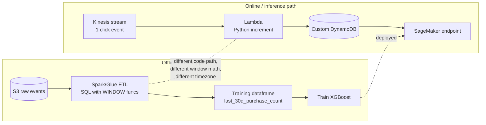
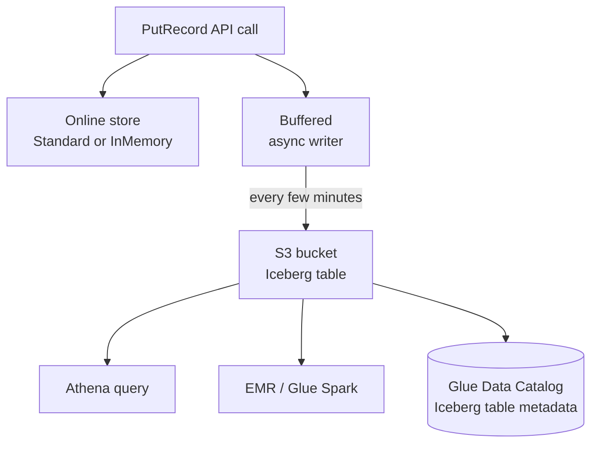
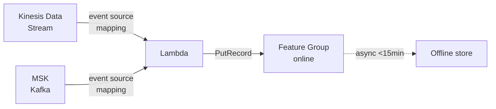
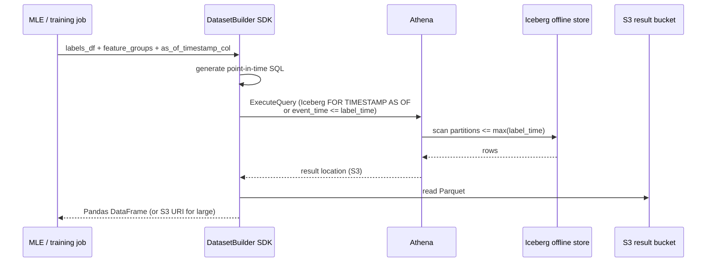
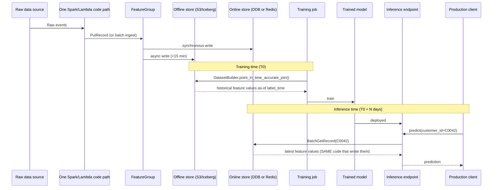

# Chapter 19 — SageMaker Feature Store: Online + Offline

> **Goal of this chapter:** to give you a working, exam-grade, production-grade understanding of the only AWS managed service whose entire reason for existing is the **training/serving skew problem**. By the end you should be able to defend, at a whiteboard and on a multiple-choice question, which online store backs which inference SLO (DynamoDB-backed `Standard` for the 10-ish-ms budget, ElastiCache-backed `InMemory` for the sub-ms budget), how a `FeatureGroup`'s mandatory `RecordIdentifier` + `EventTime` schema make point-in-time-correct training joins possible, when to pick `On-demand` vs `Provisioned` throughput and what the 24-hour switch lockout means in practice, what the four ingestion paths buy you, why the offline store moved to Apache Iceberg in 2024 and what that unlocks, and when the right answer is "don't use SageMaker Feature Store at all — use Feast, Tecton, Databricks, or roll your own DynamoDB+S3." The chapter ends with five exercises that map directly to the patterns of question the MLA-C01 will throw at you.

> **Pre-reads:** [Ch 12 — Streaming Ingestion](../part_c_data_ingestion_storage/12_streaming_ingestion.md) (Kinesis-to-Lambda glue), [Ch 13 — Iceberg on S3](../part_c_data_ingestion_storage/13_iceberg_on_s3.md) (why Iceberg > Parquet+metadata), [Ch 15 — DynamoDB for ML Serving](../part_c_data_ingestion_storage/15_dynamodb_for_ml_serving.md) (latency/cost shape under `Standard`), [Ch 18 — Data Wrangler](18_data_wrangler.md) (one-click "Export → Feature Store"). **Forward:** [Ch 36 — Real-Time Endpoints](../part_g_deployment_orchestration/36_realtime_endpoints.md) consumes the online store and is where these latency budgets get spent.

---

## 19.1 The one-paragraph version

A **feature store** is a database whose schema is constrained so it can serve two utterly different consumers from a single source of truth: a *training job* pulling years of history out of a columnar lake, and an *inference endpoint* pulling the latest single row in milliseconds. SageMaker Feature Store implements that with a **dual-write architecture** — every `PutRecord` lands in an **online store** (DynamoDB-backed `Standard`, single-digit-ms p99, ~$0.04/GB-month; or ElastiCache-backed `InMemory`, sub-ms, 50 GiB cap, on-demand only, no offline replica, no CMK — one or the other, never both) *and* in an **offline store** (S3, Apache Iceberg or legacy Glue/Parquet, append-only with tombstones, partitioned by event time). The schema of every `FeatureGroup` must declare a **`RecordIdentifierFeatureName`** (the row key) and an **`EventTimeFeatureName`** (the timestamp); those two fields are what make **point-in-time-correct** training joins possible — at training time you ask "give me each entity's feature values *as of* `label_time`" and Athena resolves it via `event_time <= label_time` + row-number-1 windowing, or Iceberg's native `FOR TIMESTAMP AS OF`. At inference time the same record is fetched via `GetRecord` / `BatchGetRecord` (100-record cap per call), and the model sees byte-identical values to what it trained on. That structural identity — same code, same record, both stores — is how Feature Store eliminates training/serving skew.

---

## 19.2 The training/serving skew problem — three pathologies, one fix

A *feature* is the actual numerical or categorical value an ML model consumes, after raw data has been cleaned, joined, encoded, and aggregated. Without a feature store every team rolls its own feature pipeline, and three pathologies emerge in production with metronomic regularity. The first one — training/serving skew — is the single most expensive silent-failure mode in production ML, and it is the one that justifies the existence of the feature store as a distinct architectural pattern.

### 19.2.1 Pathology #1 — training/serving skew (the headline)

The single most common silent-failure mode in production ML: the feature value the model sees at training time differs from the value it sees at inference time, even though both are nominally derived from the same raw event. The model performs at 0.94 AUC offline and at 0.78 AUC in production, no error ever fires, and the root cause takes weeks to find because the discrepancy is a Pandas/SQL versus Lambda/Python implementation difference rather than a code-explodes-at-runtime bug.



Two different codebases compute the "same" nominal feature differently. Maybe the Spark job uses a tumbling 30-day window keyed off `event_time` in UTC; the Lambda uses a sliding 720-hour window keyed off `arrival_time` in PST. Maybe the Spark job treats `null` as "no purchase" and the Lambda treats `null` as "decrement counter." Maybe both used to agree, and then a junior engineer fixed a timezone bug in one but not the other. The model degrades, business KPIs slip, and the on-call MLE spends three sprints reverse-engineering both code paths to find the divergence.

**Feature Store's structural fix:** the *same* `PutRecord` populates both stores, so the value used at training time is byte-identical to the value retrieved at inference. There is no "second pipeline" to drift, because there is no second pipeline at all. The training job reads from S3 (offline store); the endpoint reads from DynamoDB (online store); both stores were populated by one logical write event from one compute path.

### 19.2.2 Pathology #2 — feature reuse across teams (the discovery problem)

A second ML team needs `last_30d_purchase_count` for the same `customer_id` your fraud model uses. Without a store, they re-derive it — now two pipelines compute nominally the same feature, both can drift, and neither team owns both. Total drift surface area grows quadratically with the number of models. With a feature store, the second team queries the catalog, discovers `customer_features.last_30d_purchase_count`, reads its description and freshness SLO, and *consumes* it. One pipeline, N models. See §19.10 for the cross-account governance story.

### 19.2.3 Pathology #3 — point-in-time correctness for training data (the leakage problem)

You're building a churn model. Each training row is `(customer_id, label_at_2024_07_15, did_they_churn_by_2024_08_15)`. The feature `account_balance` for `customer_id=42` was \$500 on 2024-07-10, \$2000 on 2024-07-20, \$50 on 2024-08-12. If your training join uses **today's** value (\$50) you have *leaked future information* into the label, and the model will look brilliant in cross-validation and dismal in production because the production system at scoring time has no idea what next month's balance is.

The correct join is: for each `(entity, label_time)` row, fetch the feature value that was current *as of* `label_time`. Feature Store's offline store, with `EventTime` mandatory on every record and (with Iceberg) native time-travel SQL, supports this directly — see §19.8 for the worked SQL example and §19.8.5 for the SDK helper that writes the join for you.

The three pathologies are not independent. Pathology #2 *creates* #1 and *amplifies* #3. Solving #2 with a shared store solves the other two as side effects — this is the case for using a feature store at all.

---

## 19.3 The Feature Group — the unit of organization

A **Feature Group** is the table-equivalent in Feature Store. One `FeatureGroup` ≈ one entity type — customers, transactions, products, sessions, devices. It is the level at which storage tier (online/offline/both), throughput mode (on-demand vs provisioned), schema, TTL, encryption, and access policies are configured. If you have learned one architectural lesson from the catalog of failed feature-store deployments, it is **one feature group per logical entity, not per model** — fragment by customer/transaction/product, share by use case. The reuse story in §19.2.2 is what makes the investment pay off.

> AWS docs: "*In Feature Store, features are stored in a collection called a `feature group`. You can visualize a feature group as a table in which each column is a feature, with a unique identifier for each row.*" — Feature Store concepts page.

### 19.3.1 The mandatory schema rules

| Required element | API parameter | Purpose | Constraint |
| --- | --- | --- | --- |
| **Record identifier** | `RecordIdentifierFeatureName` | The "primary key" — which entity does this row describe? | Must be a `String` or `Integral` feature. One per group. Cannot be changed after creation. |
| **Event time** | `EventTimeFeatureName` | When was this feature value true? | Must be `Fractional` (epoch seconds) or `String` (ISO-8601). Required for point-in-time queries and offline partitioning. Cannot be changed after creation. |
| **Feature definitions** | `FeatureDefinitions[]` | The column list | Each has `FeatureName` + `FeatureType` ∈ {`String`, `Integral`, `Fractional`}. No nested types in `Standard`; `InMemory` adds list/set/vector collection types. |

The schema is **mutable in an additive direction only** — `UpdateFeatureGroup` + `AddFeatureToFeatureGroup` let you add new columns to an existing group without recreating it. You **cannot drop or rename** features, and you **cannot change the record identifier or event time** once the group is created. The Iceberg offline format (since 2024) does support full schema evolution at the table-format layer (drop/rename/reorder/type promotion), but Feature Store's control plane still does not expose those primitives directly.

Two consequences worth internalizing on day one:

1. **`RecordIdentifierFeatureName` must be a single field.** No compound keys. If your natural key is `(user_id, region)`, you must concatenate them into a single string field (`user_id_region`) before ingestion. This trips up teams migrating from a relational schema where compound primary keys are routine.
2. **`EventTimeFeatureName` is a one-time choice.** Pick a field literally named `event_time` (Unix epoch seconds, fractional, in UTC) by convention — it's discoverable, every example in the AWS docs uses it, and your downstream consumers will look for it.

### 19.3.2 Online vs offline vs both — the storage selection

| Configuration | Online enabled? | Offline enabled? | Typical use case |
| --- | --- | --- | --- |
| **Online only** | yes | no | Pure session/cache features. Fast write path. **No training data extraction** — features cannot feed any training job. |
| **Offline only** | no | yes | Historical batch features (yesterday's metrics). Cheaper than online. Training jobs and batch transforms only. |
| **Online + offline** | yes | yes | **Default recommendation.** Same write hits both stores → zero training/serving skew. Cost is higher because you pay both DynamoDB *and* S3 line items. |

The `Both` choice is what makes Feature Store unique versus rolling your own Redis-or-DynamoDB-alone. The AWS docs spell it out: "*When you enable both, they sync to avoid discrepancies between training and serving data.*" That sync — atomic from the caller's perspective, eventual at the offline-store level — is the whole point of the service. If you turn off the offline store you have built a managed DynamoDB; if you turn off the online store you have built a managed S3 ingester. Neither half on its own justifies the feature-store abstraction; the *combination* is what does.

---

## 19.4 The online store

The online store exists to answer a single question in single-digit milliseconds: *"For entity ID X, what are the latest feature values?"* It is read-heavy, point-lookup, and latency-bounded. Two storage backends are exposed under the `OnlineStoreConfig.StorageType` knob.

> AWS docs: "*The online store is a low-latency, high-availability data store that provides real-time lookup of features. It is typically used for machine learning (ML) model serving. You can choose between the standard online store (`Standard`) or an in-memory tier online store (`InMemory`), at the point when you create a feature group.*" — Storage configurations / Online store.

### 19.4.1 `Standard` tier — DynamoDB-backed (the default)

| Property | Value |
| --- | --- |
| Backing engine | DynamoDB (managed, abstracted from you — you cannot see the table directly) |
| Latency | **single-digit ms p99** (typically 2–10 ms intra-region) |
| Multi-AZ | yes, automatic |
| Max throughput | governed by throughput mode (§19.5) |
| Encryption | KMS-managed or **customer-managed CMK** (supported) |
| Default? | **yes** — `StorageType=Standard` is the default if you omit the field |
| Throughput modes supported | `On-demand` *and* `Provisioned` |
| Offline replication | Yes — can be enabled and is the typical configuration |
| Pricing shape (indicative, us-east-1, 2024) | ~**$0.04/GB-month storage**; ~$0.0006 per write-request unit on-demand; ~$0.25 per million reads on-demand |
| TTL | Supported via `OnlineStoreConfig.TtlDuration` |

The Standard tier is what every "online feature store" article implicitly describes. Semantics inherit from DynamoDB: O(1) point reads by record identifier, no range scans, no secondary indexes, no joins. Every constraint from [Chapter 15](../part_c_data_ingestion_storage/15_dynamodb_for_ml_serving.md) applies — but you never see the DynamoDB table directly. Feature Store owns the partition key, the GSIs (there are none), and the encryption configuration; DynamoDB is just what executes reads underneath.

### 19.4.2 `InMemory` tier — ElastiCache (Redis OSS) backed (October 2023)

Announced **October 2023** (earlier study materials sometimes say 2024 — wrong), the In-Memory online store is powered by ElastiCache for Redis OSS. Pitch: sub-millisecond reads for real-time bidding, card-present fraud, and click-time personalization.

> AWS docs: "*The `InMemory` tier is a managed data store for online store feature groups that supports very low-latency retrieval… powered by Amazon ElastiCache (Redis OSS).*"

| Property | Value |
| --- | --- |
| Backing engine | **Amazon ElastiCache for Redis OSS** (managed cluster, single-AZ replicated by default) |
| Latency | **sub-millisecond** for cache hits (Redis design); **2–6 ms end-to-end** observed p99 from SageMaker endpoints once VPC hop + TLS + SDK serialization is factored in |
| Default feature group max size | **50 GiB** |
| Throughput mode supported | **`On-demand` only** — `Provisioned` is *not* available for `InMemory` |
| **Online + Offline mix?** | **No** — `InMemory` is **online-only**. There is no offline replication. If you need training data you cannot use this tier. |
| Customer-managed KMS keys (CMK)? | **Not supported** — AWS-managed key only |
| Cross-region replication | Not automatic — you replicate writes from your ingestion layer |
| Special: collection types | Supports **list**, **set**, and **vector** collections — useful for embeddings or multi-value features |
| TTL | First-class — `OnlineStoreConfig.TtlDuration` is the recommended way to evict cold rows |

> ⚠️ **Exam alert — In-Memory store limits.** Memorize the four constraints that make `InMemory` the *wrong* answer for many scenarios: **(1)** 50 GiB cap per feature group; **(2)** on-demand throughput only — provisioned is not available; **(3)** no offline store replication — pure online, cannot feed training jobs; **(4)** no customer-managed KMS keys — only the AWS-managed key. Any exam question that mentions "training data," "compliance requires CMK," or "predictable capacity planning" rules `InMemory` *out*. Any question that mentions "sub-millisecond," "real-time bidding," "click-time personalization," or "card-present fraud" rules it *in* — but only if none of the four kill-switches apply. The common distractor is "Use DynamoDB Accelerator (DAX) in front of the Standard store" — wrong, because DAX is a generic DynamoDB cache that does not integrate with the Feature Store API and does not give you the per-feature-group sub-ms latency contract.

**Pick `InMemory` when:** ad-tech/RTB budgets where every ms below 10 matters; embedding lookups via the `vector` collection type; pure online use cases with no training replica needed.

**`InMemory` is wrong when:** you need offline replication for training (use `Standard` + offline); you need provisioned throughput; you need CMK encryption (HIPAA, SR 11-7, PCI); your group exceeds 50 GiB.

### 19.4.3 TTL — first-class for both tiers, but underused

```python
# Conceptual API shape
client.create_feature_group(
    FeatureGroupName="user_session_features",
    OnlineStoreConfig={
        "EnableOnlineStore": True,
        "StorageType": "Standard",                      # or "InMemory"
        "TtlDuration": {"Unit": "Hours", "Value": 24},  # records expire 24h after EventTime
    },
    ...
)
```

- Set `OnlineStoreConfig.TtlDuration` (units: `Seconds`/`Minutes`/`Hours`/`Days`/`Weeks`).
- Records are deleted from the **online store** after TTL elapses since their `EventTime`.
- **Offline store is unaffected** — the historical record is retained for training and audit. This separation is crucial — TTL is a *cache eviction* knob, not a *delete user data* knob.
- Use cases: GDPR-style data minimization, ephemeral session features that should fall out of the cache, cost control on `InMemory` where the cluster is sized by active-entity count.

### 19.4.4 Network latency reduction — PrivateLink

Online-store latency = Feature Store API + network. For sub-10-ms applications the network often dominates. AWS recommends **PrivateLink** to the `com.amazonaws.<region>.sagemaker.featurestore-runtime` interface endpoint with `privateDNSEnabled=true`: keeps traffic in-VPC, same-AZ when possible (avoids 1–2 ms cross-AZ hops), and is required by many regulated-industry policies. VPC endpoints for this runtime API are a 2024 addition.

---

## 19.5 Throughput modes — `On-demand` vs `Provisioned`

This is the second axis (orthogonal to `Standard` vs `InMemory`) and is identical in shape to DynamoDB's billing model — because under the hood, for `Standard`, it *is* DynamoDB.

### 19.5.1 `On-demand` (default)

> AWS docs: "*The `On-demand` (default) throughput mode works best when you are using feature groups with unknown workload, unpredictable application traffic.*"

- Billed per `ReadRequestsUnits` / `WriteRequestsUnits` actually consumed (1 RRU = 1 read of up to 4 KB, 1 WRU = 1 write of up to 1 KB).
- No capacity to plan, no throttling from under-provisioning.
- **The only mode supported for `InMemory` storage type.**
- Default mode for `Standard` if you don't specify.

### 19.5.2 `Provisioned`

> AWS docs: "*The `Provisioned` throughput mode works best when you are using feature groups with predictable workloads and you can forecast the capacity requirements to control costs.*"

- You set `ProvisionedReadCapacityUnits` and `ProvisionedWriteCapacityUnits` on the feature group.
- Only supported for **offline-only** groups *or* online groups with `StorageType=Standard`. `InMemory` is on-demand only.
- **No native auto-scaling exposed through the Feature Store API** — you must manually `UpdateFeatureGroup` to change capacity (or use Application Auto Scaling on the underlying DynamoDB table, which is an unsupported path).
- **Backfill rule of thumb (from AWS docs):** "*For write capacity, you should provision 2× the recent peak capacity to avoid throttling when performing backfills or bulk ingestion that may result in a large number of historical record writes.*"
- Decrease quota inherits from DynamoDB: up to 4 decreases in the first hour of a UTC day, then 1 per subsequent hour, max 27/day.

### 19.5.3 The 24-hour throughput-mode switch lockout

You can switch a feature group from `Provisioned` → `On-demand` (or the reverse) — but only **once per 24-hour window per feature group**. This is inherited from DynamoDB's table-mode change semantics.

> ⚠️ **Exam alert — throughput mode switch 24-hour lockout.** "*Provisioned ↔ On-demand switching is rate-limited to one transition per 24 hours per feature group.*" The exam distractor is usually "switch back if traffic drops" — wrong, because if you switched the mode this morning to handle a spike, you cannot switch it back this evening when traffic subsides. The right answer pattern is **plan the mode for the *expected* workload shape, not for instantaneous traffic**. If you anticipate a one-time backfill, provision aggressively *before* the backfill starts, then accept that you cannot dial down for 24 hours after. If your traffic is genuinely bursty and unpredictable, stay on `On-demand` permanently and pay the per-call premium.

### 19.5.4 CloudWatch metrics — what to alarm on

| Mode | Metric to watch | What it means |
| --- | --- | --- |
| `On-demand` | `ConsumedReadRequestsUnits`, `ConsumedWriteRequestsUnits` | Cost driver — alarm on month-over-month % delta |
| `Provisioned` | `ConsumedReadCapacityUnits`, `ConsumedWriteCapacityUnits` | Utilization vs capacity — alarm at >70% sustained |
| Both | `ThrottledRequests` (DynamoDB-side) | Capacity exceeded or rapid scale-up — alarm on any non-zero value |

A practical pattern: dashboard the *ratio* `ConsumedReadCapacityUnits / ProvisionedReadCapacityUnits` and alarm when it crosses 0.7 — that's your "scale up before traffic spikes throttle you" warning. Same shape for writes. CloudWatch does not natively surface this ratio; you build it as a metric math expression.

---

## 19.6 The offline store

### 19.6.1 S3 + Iceberg (2024 GA, recommended but not default as of May 2026)

The offline store writes feature records to an S3 bucket *you supply*, organized in a **time-event-partitioned** layout. As of 2024, **Apache Iceberg is the GA table format** for new feature groups and is the AWS-recommended choice; the older Glue/Parquet format is still selectable for legacy interoperability and is still the *default* if you omit `TableFormat` from the API call. AWS docs phrase this as "*in most use cases, you should use Apache Iceberg*" — which is the gentlest possible way to say "Iceberg is the right answer and Glue is there for backward compatibility."

> ⚠️ **Practical note (May 2026):** Even though Iceberg is the recommended format, it is *not* the default. The SDK still defaults `TableFormat` to `Glue` if you don't specify. **Always set `TableFormat=Iceberg` explicitly** when creating a new feature group — otherwise you'll wake up in 2027 needing to dual-write through a migration window because someone copy-pasted a sample notebook from 2022.



Key behavioral facts:

| Aspect | Behavior |
| --- | --- |
| Write path | Async write from `PutRecord` to S3, **typically <15 minutes** lag, occasionally longer during throttling |
| Table format options | `Iceberg` (recommended, 2024 GA) or `Glue` (legacy Parquet + Glue catalog table, still the default) |
| Storage layout | Partitioned by `year/month/day/hour` derived from `EventTime` |
| Catalog | Glue Data Catalog table created automatically |
| Mutability | Iceberg: full `MERGE INTO`, `UPDATE`, `DELETE` SQL. Glue: append-only — `DeleteRecord` writes a tombstone row, never a true delete. |
| Encryption | SSE-S3, SSE-KMS, or customer-managed KMS at the bucket level |
| Deletion semantics | `DeleteRecord` writes a *new row* with `IsDeleted=true` flag (tombstone) — the offline store remains a complete audit log even if you "delete" a record |

### 19.6.2 Why Iceberg matters (vs plain Parquet)

| Capability | Glue/Parquet format | Iceberg format |
| --- | --- | --- |
| Schema evolution | Limited (you can add cols, sort of) | Full (add/drop/rename/reorder, type promotion) |
| Time travel | Requires manual `event_time <= X` filter in every query | Native `FOR TIMESTAMP AS OF '2024-07-15T00:00:00'` |
| Partition evolution | Requires full table rewrite | Native, in-place |
| Row-level updates | Append-only, tombstones only | `MERGE INTO`, `UPDATE`, `DELETE` SQL |
| Snapshot isolation | None (eventual via S3) | ACID via metadata layer |
| Hidden partitioning | No — query writer must know partition columns | Yes — the table format hides them |
| GDPR / right-to-be-forgotten | Cannot true-delete; only tombstone | `DELETE FROM table WHERE user_id = ?` |
| Compaction | Manual S3-level Parquet rewrite | `OPTIMIZE` SQL command |

The compaction story alone justifies Iceberg for any high-write-volume feature group. An AWS blog post documents a real workload going from **49.9M files (106.5 GiB) → 110K files (2.5 GiB)** after `OPTIMIZE table REWRITE DATA USING BIN_PACK` + `VACUUM`. Query time on the same workload went **1h 27m → 1m 13s** — a 71× improvement. Reported training query speedups across customer workloads sit in the 10×–100× range. Streaming ingestion creates millions of small files (one per `PutRecord` buffered write, occasionally batched); without compaction, Athena scan time degrades linearly with file count.

### 19.6.3 The Iceberg migration playbook

Existing Glue-format feature groups **cannot be migrated in place** — create a new Iceberg group, dual-write for a cutover window, deprecate the old one. Steps: (1) create new group with `TableFormat=Iceberg`; (2) dual-write for 30 days (the longest training backfill window); (3) one-shot Spark/Glue job migrates history from old S3 prefix to new (direct Iceberg SDK is faster than `PutRecord` for >10M rows); (4) switch training jobs to the new Athena table; (5) run `OPTIMIZE` + `VACUUM` before the first real training run, otherwise small files make Iceberg *slower* than Glue was; (6) deprecate old group with a 90-day S3 lifecycle quarantine.

**Compaction cost.** `OPTIMIZE` runs Spark — schedule it (daily for high-write groups, weekly otherwise), or trigger a Glue job from S3 event-count thresholds.

---

## 19.7 Ingestion paths — four ways data lands in a feature group

### 19.7.1 `PutRecord` — synchronous, single-record

```python
client.put_record(
    FeatureGroupName="customer_features",
    Record=[
        {"FeatureName": "customer_id",        "ValueAsString": "C0042"},
        {"FeatureName": "event_time",         "ValueAsString": "1716678000.0"},
        {"FeatureName": "last_30d_purchases", "ValueAsString": "7"},
        {"FeatureName": "lifetime_value_usd", "ValueAsString": "1450.25"},
    ],
)
```

- Writes to **online store synchronously** — online consumers see the new value as soon as `PutRecord` returns 2xx.
- **Offline store is written asynchronously** — typically <15 min lag, occasionally longer during throttling.
- Used by streaming Lambda / Kinesis / MSK paths.
- Per-account default limit ~10,000 requests/sec/region — request a quota increase if you're north of that.

### 19.7.2 Batch ingest (Spark, Glue, EMR, Processing Job)

The SageMaker Python SDK exposes `FeatureGroup.ingest(data_frame=...)` (Pandas, single-host) and the **SageMaker Feature Store Spark connector** for Spark/EMR/Glue. The Spark connector uses `format("sagemaker-feature-store")` and writes **directly to S3 in the correct Iceberg layout**, bypassing `PutRecord` for the offline path entirely — vastly faster for 10M+ row backfills.

```python
# Pandas / single-host
from sagemaker.feature_store.feature_group import FeatureGroup
fg = FeatureGroup(name="customer_features", sagemaker_session=session)
fg.ingest(data_frame=df, max_workers=3, wait=True)

# PySpark with the Feature Store Spark connector
from feature_store_pyspark.FeatureStoreManager import FeatureStoreManager
fsm = FeatureStoreManager()
fsm.ingest_data(
    input_data_frame=spark_df,
    feature_group_arn=fg_arn,
    target_stores=["OfflineStore", "OnlineStore"],
)
```

Batch-ingest write order: **offline first**, then online. The reverse of `PutRecord`'s streaming path. This matters when you're backfilling and a downstream job watches the online store — there'll be a window where the offline copy is complete but the online copy is still catching up.

### 19.7.3 Streaming ingest (Kinesis / MSK → Lambda → `PutRecord`)



This is the canonical real-time architecture and AWS publishes two reference implementations (Kinesis and MSK). The shape: events land in a Kinesis Data Stream (or MSK topic); Kinesis Data Analytics for Apache Flink (or just Lambda directly if your aggregation is trivial) does the windowing; a Lambda function consumes the aggregated stream and issues one or more `PutRecord` calls per batch.

> ⚠️ **Exam alert — same code, both stores, no skew.** The reason this pattern works — and the reason it is *the* AWS-recommended streaming pattern — is that `PutRecord` writes to both stores from a *single* code path. The same record that landed in DynamoDB for the inference endpoint to read landed in S3 for the next training job to read. There is no second pipeline computing a "parallel" feature; there is one pipeline, and the dual-write is a property of the API. Training/serving skew is *structurally* prevented, not "best-practiced" against. The exam distractor is "Run two separate pipelines — one writes to DynamoDB for online, one writes to S3 for offline." That answer is *always* wrong on the exam, because it reintroduces the drift surface area the feature store exists to eliminate.

**Drift foot-guns even with this pattern:** (1) batch and streaming features in the same model written by different code paths — defense: a shared transformation library; (2) `event_time = now()` in the Lambda — use the Kinesis record's source timestamp, otherwise replays corrupt PIT queries; (3) replay drift — Flink replays update online to "today's" values for historical event times (write replays to a separate group, or make writes conditional on `event_time > existing_event_time`); (4) cold-start race — new entities return null on `GetRecord` (treat null as a signal in the model, or batch-prefill from a cold-start estimator).

For sustained >10K writes/sec, request a Feature Store limit increase, consider Provisioned throughput, or use the Spark connector inside Kinesis Data Analytics for Apache Flink.

### 19.7.4 SageMaker Data Wrangler one-click export

In a Data Wrangler `.flow`, **Export → SageMaker Feature Store** generates a notebook that creates the feature group (auto-inferring schema), runs a Processing job that ingests the flow output, and optionally hooks the export into a SageMaker Pipelines step. Lowest-effort path for analysts; the generated PySpark is also a useful template for hand-rolled pipelines. See [Chapter 18](18_data_wrangler.md) for the flow side. "One-click" is doing some work — it's still a scheduled Processing job underneath — but the export action itself is genuinely one click.

---

## 19.8 Retrieval — online and offline APIs

### 19.8.1 Online — `GetRecord` and `BatchGetRecord`

```python
# Single record — single-digit ms
client.get_record(
    FeatureGroupName="customer_features",
    RecordIdentifierValueAsString="C0042",
)

# Up to 100 records across (potentially) multiple feature groups in one call
client.batch_get_record(
    Identifiers=[
        {
            "FeatureGroupName": "customer_features",
            "RecordIdentifiersValueAsString": ["C0042", "C0043", "C0044"],
            "FeatureNames": ["last_30d_purchases", "lifetime_value_usd"],
        },
        {
            "FeatureGroupName": "session_features",
            "RecordIdentifiersValueAsString": ["S9981"],
        },
    ],
)
```

- **`BatchGetRecord` is the inference-path workhorse.** A single endpoint invocation often needs features from 3–5 different groups (customer-level, item-level, session-level, device-level). One `BatchGetRecord` call beats N round trips on both latency and cost.
- Partial-feature projection (`FeatureNames`) reduces payload but **does not reduce RCU consumption** in Provisioned mode — the full-record RCU still applies.
- The runtime client (`sagemaker-featurestore-runtime`) is a *different* boto3 client than the control-plane client (`sagemaker`). Two different IAM permission namespaces. This catches a lot of people on day one.

> ⚠️ **Exam alert — `BatchGetRecord` 100-record cap.** A single `BatchGetRecord` call can fetch at most **100 records** across all feature groups in the request. If you need more, you must shard into multiple parallel calls. The exam distractor is "Use `BatchGetRecord` to fetch 1000 records in one call" — wrong. The correct answer is "shard into 10 parallel `BatchGetRecord` calls of 100 each," or for very large fan-outs, use the offline store path (which is not latency-suitable for inference, but is the right tool for bulk retrieval).

### 19.8.2 Offline — Athena (the default), Spark, Iceberg time travel

The feature group's offline store registers a Glue Data Catalog table you query with standard Athena SQL.

```sql
-- Get latest feature value per customer (legacy Glue/Parquet pattern)
WITH ranked AS (
  SELECT
    customer_id,
    last_30d_purchases,
    event_time,
    ROW_NUMBER() OVER (PARTITION BY customer_id ORDER BY event_time DESC) AS rn
  FROM "customer_features_1716678000"
  WHERE is_deleted = false
)
SELECT customer_id, last_30d_purchases
FROM ranked WHERE rn = 1;
```

```sql
-- Iceberg time travel — point-in-time correct, one line
SELECT customer_id, last_30d_purchases
FROM "customer_features_1716678000"
FOR TIMESTAMP AS OF TIMESTAMP '2024-07-15 00:00:00'
WHERE customer_id = 'C0042';
```

The Python SDK also exposes a `DatasetBuilder` API that abstracts the SQL — you pass a list of feature groups and a "target dataframe" of `(record_id, timestamp)` rows, and it generates the point-in-time-correct join SQL for you, executes it via Athena, and returns a Pandas dataframe (or pointer to S3 output for large jobs). See §19.8.5.

---

## 19.9 Point-in-time correct queries — worked example

The classic ML data leak: training data includes feature values from after the label cutoff. Feature Store's offline layout makes the correct join expressible directly.

### 19.9.1 Setup

Three records for `customer_id=C0042`, all in `customer_features`:

| customer_id | event_time            | last_30d_purchases |
| ----------- | --------------------- | ------------------ |
| C0042       | 2024-07-10T00:00:00Z  | 3                  |
| C0042       | 2024-07-20T00:00:00Z  | 11                 |
| C0042       | 2024-08-12T00:00:00Z  | 2                  |

Your label table has one row: `(C0042, label_time=2024-07-15T00:00:00Z, churned=False)`.

### 19.9.2 The wrong join (leakage)

```sql
-- BAD: joins to latest, which is in the future relative to label_time
SELECT l.customer_id, l.label_time, l.churned, c.last_30d_purchases
FROM labels l
JOIN (
  SELECT customer_id, MAX_BY(last_30d_purchases, event_time) AS last_30d_purchases
  FROM customer_features WHERE is_deleted = false
  GROUP BY customer_id
) c USING (customer_id);
-- Returns last_30d_purchases = 2 (the 2024-08-12 value) — FUTURE LEAKAGE
```

### 19.9.3 The correct point-in-time join (Athena / Glue Parquet)

```sql
SELECT l.customer_id, l.label_time, l.churned, c.last_30d_purchases
FROM labels l
LEFT JOIN LATERAL (
  SELECT last_30d_purchases
  FROM customer_features cf
  WHERE cf.customer_id = l.customer_id
    AND cf.event_time <= l.label_time
    AND cf.is_deleted = false
  ORDER BY cf.event_time DESC
  LIMIT 1
) c ON true;
-- Returns last_30d_purchases = 3 (the 2024-07-10 value) — correct as-of 2024-07-15
```

### 19.9.4 The same query on Iceberg — much shorter

```sql
SELECT l.customer_id, l.label_time, l.churned, c.last_30d_purchases
FROM labels l
JOIN customer_features FOR TIMESTAMP AS OF l.label_time c
  ON c.customer_id = l.customer_id;
```

(Iceberg `FOR TIMESTAMP AS OF` requires a literal in some engines; in practice the SDK `DatasetBuilder` generates the per-row variant.)

### 19.9.5 The SDK helper — `DatasetBuilder.point_in_time_accurate_join()`

```python
from sagemaker.feature_store.dataset_builder import DatasetBuilder

ds = DatasetBuilder(
    sagemaker_session=session,
    base=labels_df,                     # (customer_id, label_time, churned)
    output_path="s3://my-bucket/train/",
    record_identifier_feature_name="customer_id",
    event_time_identifier_feature_name="label_time",
)
ds = ds.with_feature_group(
    feature_group=customer_features_fg,
    target_feature_name_in_base="customer_id",
)
df = ds.point_in_time_accurate_join().to_dataframe()
```

Behind the scenes the SDK generates the correct Athena SQL, executes it, and returns the result as a Pandas DataFrame. For large jobs the result is written to S3 rather than materialized in memory.



### 19.9.6 The production gotchas that bite even careful teams

- **`event_time` must be when the feature was observable**, not when it was written. A nightly Spark job at 02:00 computing a 30-day average must stamp `event_time = window_end_time`, not `now()` — otherwise the feature wasn't observable to a serving system at 02:00.
- **Train/serve mismatch on missing values.** Training imputes nulls; serving sees raw nulls from `GetRecord` when the record doesn't exist. Centralize imputation — write imputed values to the store, or share a preprocessing module between training and serving.
- **Lookback skew on streaming features.** Stamp `event_time` from the trigger event's timestamp, never `now()`.

Analogy: point-in-time correctness is "what was your bank balance on March 14 at 9 am" — not "what is it now." The answer for March 14 must not change as time passes.

---

## 19.10 Cross-account feature sharing

A central platform team owns a feature group; consumer teams in other AWS accounts need to read it. Two surfaces, two access models — and this is one of the most-misunderstood parts of Feature Store.

### 19.10.1 Offline store (S3 + Glue + Iceberg) — governed by Lake Formation

- Producer account registers the S3 location with Lake Formation.
- Producer grants **LF-tags** (`pii=false`, `domain=customer`) to the consumer account's IAM principal.
- Consumer queries via an Athena workgroup in their own account, hitting the producer's Iceberg table — Lake Formation evaluates column-level and row-level filters in flight.
- Alternative (no LF): standard S3 bucket policy + Glue Data Catalog resource policy + Athena cross-account workgroup. Older shops still do this; Lake Formation is the modern recommendation.

### 19.10.2 Online store (Standard or InMemory) — governed by IAM

- Granted via cross-account IAM role assumption (consumer assumes a role in the producer account) *or* via a resource-based policy on the feature group (`PutResourcePolicy`).
- You grant `sagemaker:GetRecord` / `BatchGetRecord` on the specific feature group ARN.
- There is no Lake Formation involvement on the online side — Lake Formation governs the data lake (S3/Glue), not the runtime API.

The exam-relevant contrast: **LF tags govern offline; IAM/resource policy governs online**. Treat the two surfaces independently. A common mistake is granting Lake Formation access to the offline store, then being surprised the consumer's serving Lambda still can't read the online store — those are two separate permission grants on two separate API surfaces.

---

## 19.11 The training-serving skew problem solved — the full sequence

This is the picture worth committing to memory. It is also the picture the exam tests indirectly in every Feature Store question.



The training and inference paths read from **the same** logical feature group, populated by the **same** transformation code, with the **same** schema, the **same** type coercion, and the **same** missing-value handling. The entire class of bugs where "the model performs differently online vs offline because someone re-implemented the feature in two places" is *structurally* eliminated. Not best-practiced against. Eliminated.

If you take only one diagram from this chapter into the exam, take this one.

---

## 19.12 Build vs Buy — when SageMaker Feature Store is the wrong answer

The honest answer in 2025–2026 is that SageMaker Feature Store is **used, but it isn't the default in most AWS shops**. The modal real-time feature platform in production AWS shops is still "DynamoDB + S3 + glue code." Three patterns dominate, and choosing among them is one of the most consequential architectural decisions in a mature ML organization.

### 19.12.1 The four-way matrix

| Dimension | Feast (OSS) | SageMaker FS | Tecton | Databricks FS |
| --- | --- | --- | --- | --- |
| Deployment | Self-hosted | Managed AWS | Managed SaaS | Managed (Databricks) |
| Online store | Pluggable (Redis, DynamoDB, Postgres, BigTable) | DynamoDB or ElastiCache Redis | Managed Redis/DynamoDB | Online Tables (managed) |
| Offline store | Pluggable (BigQuery, Snowflake, S3+Parquet, Redshift) | S3 (Glue or Iceberg) | S3 / Snowflake / BQ | Delta tables (Unity Catalog) |
| Feature compute | BYO (you bring Spark/Flink jobs) | BYO (Glue/EMR/Lambda) | **Managed pipelines** (Tecton DSL → Spark/Flink) | BYO (Databricks Spark) |
| Streaming | Push API or Spark Structured Streaming | `PutRecord` (Lambda/MSK/KDA wrapping) | First-class | Spark Structured Streaming |
| Monitoring | DIY | DIY (CloudWatch hooks only) | Native (freshness SLOs, drift alarms) | Lakehouse Monitoring |
| Point-in-time joins | `get_historical_features` — clean | SDK helper + Athena SQL | Native, declarative | `FeatureLookup` with `timestamp_lookup_key` |
| p99 online latency | depends on backend | DynamoDB ~10–25ms; in-memory ~2–6 ms | sub-10ms claimed | low double-digit ms |
| Pricing | Free (you pay infra) | Per-call + storage + DynamoDB RCU/WCU | Enterprise seat + usage | Bundled with Databricks |

### 19.12.2 When each wins

- **Feast** — You're polyglot or multi-cloud, you have engineers who can run Redis and Postgres in production, and you do not want vendor lock-in. Also the right answer if you're a research lab and the feature store needs to be ergonomic in notebooks first, production second.
- **SageMaker Feature Store** — You already live in SageMaker, your features fit in the (`String`, `Integral`, `Fractional`) type system, and the rest of your AWS bill makes the DynamoDB line acceptable. Also the obvious answer if you're cert-targeting MLA-C01, because it's the AWS-blessed path. The correct multiple-choice answer is *always* this one on the exam.
- **Tecton** — Real-time-first (fraud, ads, recsys), you want managed feature *pipelines* including streaming aggregations ("user's count of failed logins in last 5 minutes"), and you can absorb enterprise SaaS pricing. Tecton wins the "feature platform" framing — they manage the compute, not just the storage.
- **Databricks Feature Store** — You're already a Databricks shop, your offline store is Delta tables in Unity Catalog, and Online Tables gives you parity reads. The DX is unusually clean *if you're already there*. Outside the Databricks ecosystem it's not portable.

The unspoken fifth option: **Hopsworks.** Longest-running open-source feature platform, pioneered point-in-time-join thinking, has a managed SaaS. Wins in European deployments and research-leaning teams. Often left out of US-centric comparisons.

### 19.12.3 The "we built our own" archetypes

The biggest companies that needed feature stores first built their own *because no managed product existed at the time*. The teaching is not "you should build your own" — it's that **they would buy today if starting from zero, and so should you.**

- **Uber Michelangelo Palette.** Features defined in a DSL, compiled to Spark (batch) and Flink (streaming). Online: Cassandra/Redis. Offline: Hive. ~10 trillion feature computations daily. The DSL is the differentiator.
- **Airbnb Zipline (2018).** Innovation: point-in-time-correct backfill as a *first-class* operation. Became Chronon (open-sourced 2024).
- **Netflix Axion.** Same pattern. Online: EVCache (their Memcached fork). Offline: S3 + Iceberg.

**The build-vs-buy framework:**
1. **Volume.** <1B lookups/month → buy. >100B → consider building.
2. **Latency.** p99 >20 ms → SageMaker FS Standard. <10 ms → InMemory or Tecton. <2 ms → build with co-located Redis/RocksDB.
3. **Type.** Scalars → managed works. Ragged tensors/native embeddings/nested structs → check carefully; FS forces JSON-encoded embeddings outside `InMemory` collections.
4. **GDPR.** Hard delete required → Iceberg mandatory.
5. **Team size.** <10 → buy. 10–50 → buy something opinionated. >50 with >$5M ML infra → build-vs-buy is a real choice.

### 19.12.4 The cost story — Atlassian's $425k → $40k

The most-cited DynamoDB-cost-surprise: Atlassian, one model, ten features, $425k/year → $40k/year after optimization. The remediation playbook every team converges on:

- **Collapse feature groups.** 10 features across 5 groups = 5 reads; same 10 in 1 group = 1 read. Cuts RCU by 80%.
- **`BatchGetRecord` aggressively** — free at the API level, cuts per-call overhead and tail latency.
- **On-demand → provisioned + auto-scaling** once QPS is predictable (crossover ~30% utilization).
- **Online-only** for features with no training use case; **offline-only** for batch-derived features never needed at inference.
- **TTL on InMemory** for cold-entity eviction.
- **Compact Iceberg** on a cadence — saves S3 LIST and Athena scan cost.

### 19.12.5 When to roll your own

Honest test: *Not Uber. QPS not seven figures. <50 engineers. Scalar features. Already paying AWS.* In that envelope, SageMaker FS is enough. If pricing pushes you to consider building, do the Atlassian playbook first — it usually closes a 90% gap without changing platforms.

---

## 19.13 Best practices

### 19.13.1 Record identifier design

- **One concept per feature group.** Don't mix customer and session features in one group — different update cadence, different TTL needs, different access patterns.
- **Use a stable, immutable identifier.** Email addresses change; hashed user UUIDs don't.
- **Don't embed timestamps in the ID** — that's what `EventTime` is for. An ID of `C0042_2024_07_15` defeats the dual-store design.
- **No compound keys.** If you need `(user_id, region)`, concatenate to `user_id__region` before ingest.
- **Strict naming conventions.** `<domain>_<entity>_<owner>` for feature group names; `<feature_name>_<aggregation>_<window>` for fields (e.g., `txn_amount_avg_30d`). Searchable and self-documenting.

### 19.13.2 EventTime precision

- Always **UTC**, always **epoch-fractional-seconds** if numeric, otherwise ISO-8601 with `Z`.
- Precision matters: if you write twice in the same second with the same `RecordIdentifier`, the online store overwrites silently. Use microsecond precision for high-velocity streams.
- The convention is to name the field literally `event_time` so it is discoverable by every consumer.
- Stamp `event_time = source_event_timestamp`, never `event_time = now()`. The latter breaks replays and point-in-time joins.

### 19.13.3 Batch ingest cadence

- For online+offline groups receiving streaming writes, expect the offline replica to lag by up to ~15 min — train against data older than that for safety (e.g., shift `label_time` lookback by 1 hour).
- For pure-batch groups, run ingest as a daily or hourly Glue/EMR job; align the schedule to label generation.
- For Provisioned-mode groups doing backfills: provision **2× the recent peak WCU** *before* the backfill starts, accepting the 24-hour throughput-mode lockout.

### 19.13.4 Choose the right tier for the SLO

| Inference latency budget | Recommended online tier | Why |
| --- | --- | --- |
| >50 ms total | `Standard` (DDB) is plenty | Cheaper, supports `Provisioned` cost control |
| 10–50 ms | `Standard` + `BatchGetRecord` + PrivateLink | Most production workloads land here |
| <10 ms | `Standard` + DAX in front *or* `InMemory` | DAX preserves CMK / offline replica; `InMemory` is simpler |
| <2 ms (RTB-class) | `InMemory` | The only realistic managed option |

### 19.13.5 Practitioner habits worth copying

1. **One feature group per logical entity, not per model.** Reuse drives 80% of the value.
2. **Owner metadata in the feature group description** — Slack channel + team. For the 2 a.m. page.
3. **A "feature store CI" job** validating schema changes don't break consumers.
4. **Monthly cost review** filtering CUR by `sagemaker:feature-store` and DynamoDB tags.
5. **One shared transformation library** between batch and streaming code paths.
6. **Periodic point-in-time-correctness audits** — sample predictions, recompute offline, compare. Drift = bug.
7. **Document freshness SLO per feature group** and alarm on violations.

### 19.13.6 Avoid these foot-guns

1. **`InMemory` for training data** — it's online-only, no offline replica.
2. **TTL on a group whose offline-store you query for current state** — records disappear online while still in offline.
3. **Provisioned backfills without 2× peak WCU** — throttling silently drops writes if the client doesn't retry.
4. **Querying the offline store at inference time** — Athena is seconds-to-minutes. Offline is training/batch *only*.
5. **PII in feature group names, descriptions, or tags** — metadata is not encrypted at the same level as records.
6. **Migrating Glue → Iceberg in place** — you cannot. Dual-write and cut over.
7. **Conflating the runtime and control-plane clients** — `sagemaker-featurestore-runtime` for `Put`/`Get`/`BatchGet`, `sagemaker` for everything else.

---

## 19.14 CLI / API quick reference

```bash
# Create a feature group (Standard, On-demand, online+offline+Iceberg, TTL 30d)
aws sagemaker create-feature-group \
  --feature-group-name customer_features \
  --record-identifier-feature-name customer_id \
  --event-time-feature-name event_time \
  --feature-definitions \
      FeatureName=customer_id,FeatureType=String \
      FeatureName=event_time,FeatureType=Fractional \
      FeatureName=last_30d_purchases,FeatureType=Integral \
  --online-store-config '{"EnableOnlineStore":true,"StorageType":"Standard","TtlDuration":{"Unit":"Days","Value":30}}' \
  --offline-store-config '{"S3StorageConfig":{"S3Uri":"s3://my-fs-bucket/"},"TableFormat":"Iceberg"}' \
  --throughput-config '{"ThroughputMode":"OnDemand"}' \
  --role-arn arn:aws:iam::123456789012:role/SageMakerExecutionRole

# Add a feature to an existing group (additive only)
aws sagemaker update-feature-group \
  --feature-group-name customer_features \
  --feature-additions FeatureName=avg_session_seconds,FeatureType=Fractional

# Switch a Standard group to Provisioned (24-hour lockout starts now)
aws sagemaker update-feature-group \
  --feature-group-name customer_features \
  --throughput-config '{"ThroughputMode":"Provisioned","ProvisionedReadCapacityUnits":500,"ProvisionedWriteCapacityUnits":200}'

# Read at inference time (single record)
aws sagemaker-featurestore-runtime get-record \
  --feature-group-name customer_features \
  --record-identifier-value-as-string C0042

# Delete a record (writes tombstone to offline)
aws sagemaker-featurestore-runtime delete-record \
  --feature-group-name customer_features \
  --record-identifier-value-as-string C0042 \
  --event-time 1716678500.0
```

---

## 19.15 Exam-grade summary checklist

| Concept | One-line answer |
| --- | --- |
| What's the online `Standard` tier backed by? | DynamoDB; single-digit-ms p99; ~$0.04/GB-month |
| What's the online `InMemory` tier backed by? | ElastiCache Redis OSS; sub-ms; **online-only**, no offline replica, **on-demand only**, no CMK, 50 GiB cap |
| When did `InMemory` launch? | **October 2023** (not 2024) |
| What's the offline store backed by? | S3 in *your* account; **Apache Iceberg recommended (2024 GA)**; Glue/Parquet is still the *default* if `TableFormat` omitted |
| What's mandatory in every feature group schema? | `RecordIdentifierFeatureName` + `EventTimeFeatureName` |
| Can you delete or rename features? | No, only add (`UpdateFeatureGroup` / `AddFeatureToFeatureGroup`) |
| What does `DeleteRecord` do? | Removes from online, **appends tombstone to offline** (audit-friendly) |
| Where does TTL apply? | Online store only; offline is untouched |
| How does Feature Store solve training/serving skew? | **Same `PutRecord` writes to both stores**; same record retrieved at inference as was used in training |
| How do you get point-in-time correct training data? | Athena `event_time <= label_time` + `ROW_NUMBER`, or Iceberg `FOR TIMESTAMP AS OF`, or SDK `DatasetBuilder.point_in_time_accurate_join()` |
| How do you ingest streaming features? | Kinesis/MSK → Lambda → `PutRecord` |
| How do you ingest batch features at scale? | Feature Store **Spark connector** on EMR/Glue (writes directly to S3 in Iceberg layout) |
| Default throughput mode? | `On-demand` (and the only choice for `InMemory`) |
| Throughput mode switch limit? | **One transition per 24-hour window per feature group** |
| Cross-account: online vs offline governance? | Online → IAM / resource policy; Offline → **Lake Formation LF-tags** |
| Network optimization for online reads? | **AWS PrivateLink** to `featurestore-runtime` endpoint, same-AZ |
| Max `BatchGetRecord` records? | **100** records per call across all feature groups in the request |
| Default `InMemory` feature group max size? | **50 GiB** |

---

## 19.16 Exercises

These are graded for the MLA-C01 question-pattern they emulate, not just for technical coverage. Treat each as a 90-second whiteboard problem first; check yourself against the answer afterward.

### Exercise 19.1 — Pick the online tier for an SLO

A real-time bidding (RTB) service must respond within **50 ms total**, of which the feature lookup may consume at most **5 ms p99**. The model needs 12 features across two entity types (user, ad-slot), and the team has a strict compliance requirement that all customer data must be encrypted with a **customer-managed KMS key (CMK)**. Pick the online store tier and justify in three sentences.

<details><summary>Answer</summary>

**`Standard` + `BatchGetRecord` + PrivateLink, *not* `InMemory`.** The 5 ms latency budget is tight but achievable with Standard + PrivateLink in the same AZ; observed p99 for `BatchGetRecord` on Standard with PrivateLink is in the 3–8 ms range. `InMemory` would be faster but is **disqualified by the CMK requirement** — `InMemory` only supports the AWS-managed key. The compliance constraint is the deciding factor; if it were absent, `InMemory` would be the right call. Trap-distractor: "Use DAX in front of the Standard store" — DAX does not integrate with the Feature Store API and adds an unsupported layer.

</details>

### Exercise 19.2 — Diagnose the skew

A fraud-detection model trained on data extracted from the offline store of `customer_features` shows **0.94 AUC** in cross-validation. The same model deployed to a SageMaker endpoint that reads `customer_features` online via `GetRecord` shows **0.78 AUC** in shadow mode against the same traffic. The MLE has verified the model artifact is identical and the features requested are the same. What are the three most likely causes, in priority order?

<details><summary>Answer</summary>

In priority order:

1. **`event_time = now()` bug in the streaming Lambda.** Online store has "current" values for past events; offline store (training source) has historical values correctly aligned. Training is right; online lookup is wrong. Fix: stamp `event_time` from the Kinesis record's source timestamp.
2. **Imputation asymmetry.** Training pipeline imputes nulls (mean fill); online endpoint sees raw nulls on cold-start `GetRecord` misses. Fix: centralize imputation — write imputed values to the store, or share a preprocessing module.
3. **Two pipelines writing the "same" feature.** Someone wired both a batch Spark job and a streaming Lambda to `customer_features` — they disagree on windowing/timezone, online value drifts. Fix: enforce one writer per feature group.

Cause #1 is the canonical skew. Cause #3 is what Feature Store was *designed* to prevent — if it's the cause, someone bypassed the design.

</details>

### Exercise 19.3 — Throughput mode lockout

It's Tuesday 9:00 a.m. You switch a feature group from `On-demand` to `Provisioned` at 500 RCU / 200 WCU in anticipation of a marketing campaign. The campaign goes live at 11:00 a.m. and traffic immediately exceeds the provisioned capacity — you see `ThrottledRequests` in CloudWatch. You realize you should have provisioned more aggressively or stayed on `On-demand`. At 11:30 a.m. you try to switch back to `On-demand`. What happens, and what should you do?

<details><summary>Answer</summary>

**The switch is rejected.** You can only change throughput mode on a feature group **once per 24-hour window**. You used your one switch at 9:00 a.m.; the next switch is permitted at 9:00 a.m. *Wednesday*.

What to do *now* (the next ~22 hours):

1. **Increase provisioned capacity** with another `UpdateFeatureGroup` call — capacity changes within a mode are *not* rate-limited the same way. Bump WCU to 2× peak observed.
2. **Add client-side retry with exponential backoff** in your ingestion Lambda so transient throttles don't drop writes.
3. **Add a CloudWatch alarm** on `ThrottledRequests > 0` so you catch this earlier next time.

What to do tomorrow:

4. Decide if `Provisioned` is the right long-term mode at all. If your traffic is bursty and unpredictable (marketing campaigns, holiday spikes), the right answer is **stay on `On-demand` permanently** and pay the per-call premium. `Provisioned` only saves money for predictable, sustained workloads above ~30% utilization.

The exam tests this as "what's the limitation on switching throughput modes?" — memorize "**one switch per 24 hours per feature group**."

</details>

### Exercise 19.4 — Point-in-time SQL

You have a `customer_features` feature group with three records for `customer_id=C0042`:

| event_time            | last_30d_purchases |
| --------------------- | ------------------ |
| 2024-07-10T00:00:00Z  | 3                  |
| 2024-07-20T00:00:00Z  | 11                 |
| 2024-08-12T00:00:00Z  | 2                  |

Your training label is `(C0042, label_time=2024-07-15T00:00:00Z, churned=False)`. Write the Athena SQL that joins the label to the *correct* historical feature value. Assume Glue/Parquet format (the harder case).

<details><summary>Answer</summary>

```sql
SELECT
  l.customer_id,
  l.label_time,
  l.churned,
  c.last_30d_purchases
FROM labels l
LEFT JOIN LATERAL (
  SELECT last_30d_purchases
  FROM customer_features cf
  WHERE cf.customer_id = l.customer_id
    AND cf.event_time <= l.label_time
    AND cf.is_deleted = false
  ORDER BY cf.event_time DESC
  LIMIT 1
) c ON true;
```

Result: `last_30d_purchases = 3` (the 2024-07-10 value — correct as-of 2024-07-15).

The two non-negotiable clauses are `cf.event_time <= l.label_time` (the as-of filter) and `cf.is_deleted = false` (skip tombstones from prior `DeleteRecord` calls). Without the as-of filter you get `2` (the 2024-08-12 value, future leakage). On Iceberg the same query collapses to `JOIN customer_features FOR TIMESTAMP AS OF l.label_time c ON c.customer_id = l.customer_id`.

</details>

### Exercise 19.5 — Build or buy

Your team has 18 ML engineers, ~$1.2M/year AWS spend (~$200k of which is currently DynamoDB for hand-rolled feature serving), 6 models in production, peak QPS of ~2,000 across all models, p99 inference budget of 25 ms. You're considering migrating to SageMaker Feature Store. Should you?

<details><summary>Answer</summary>

**Yes — SageMaker Feature Store Standard with Iceberg offline.**

Apply the framework: **Volume** — 2,000 QPS × 86,400 × 30 ≈ 5.2B/month — buy zone. **Latency** — 25 ms p99 → `Standard` + `BatchGetRecord` + PrivateLink, no `InMemory` needed. **Type** — scalars fit. **Team size** — 18 → "buy something opinionated." **Cost** — DynamoDB line item may increase slightly with FS per-call overhead, but eliminating your hand-rolled dual-write code path, schema discovery, and audit lineage is the real saving; Atlassian-style optimizations close most of the cost gap.

Migration plan: greenfield new models on FS, dual-write existing for 30 days, cut over training jobs first (lower risk) then serving. Iceberg from day one. ~2 engineers × 1 quarter.

Counter-argument: if you've built sophisticated feature monitoring/freshness SLOs/lineage that FS doesn't match, consider **Tecton** instead. The exam version is simpler — "team is on AWS, needs a feature store" → always **SageMaker Feature Store**.

</details>

### Exercise 19.6 — The `BatchGetRecord` 100 cap

Your inference endpoint needs to score 500 candidate items for a recommendation request, each requiring 6 features from `item_features` and 4 features from `category_features`. A junior engineer writes a single `BatchGetRecord` call to fetch all 500 items × 2 groups = 1000 records. What goes wrong and how do you fix it?

<details><summary>Answer</summary>

**The call fails** because `BatchGetRecord` accepts at most **100 records per call**, summed across all feature groups in the `Identifiers` list. 500 + 500 = 1000 > 100.

Fixes, in order of preference:

1. **Shard into parallel `BatchGetRecord` calls.** 500 items / 100 = 5 calls per group × 2 groups = 10 parallel `BatchGetRecord` invocations. With async I/O (boto3 + asyncio, or Lambda with parallel workers), the latency stays close to a single call's latency. This is the standard pattern.
2. **Collapse feature groups.** If `item_features` and `category_features` are joined 1:1 on the same `item_id`, consider merging them into a single wider feature group — then you fetch 500 items × 1 group = 5 calls, halving your API count and your tail latency.
3. **Pre-fetch via Athena** if the 500 items are deterministic at request time (e.g., the top 500 by some pre-computed score) — Athena fetches all at once, but seconds-to-minutes is too slow for inference; this only works if you can pre-fetch offline and cache.

The wrong fix: "make one call with 1000 records and handle the error" — there is no retry that gets you past the hard limit. The exam tests this as "what's the max records in a single `BatchGetRecord` call?" — **100**.

</details>

### Exercise 19.7 — GDPR right-to-be-forgotten

Your customer success team forwards a GDPR Article 17 request: customer `C0042` has requested deletion of all their data. Your fraud model uses `customer_features` (Iceberg offline + Standard online with 30-day TTL). Walk through the exact steps to comply, and explain which steps the feature store handles automatically versus which require manual action.

<details><summary>Answer</summary>

Three layers:

**Layer 1 — Online store (automatic via API).** `aws sagemaker-featurestore-runtime delete-record --feature-group-name customer_features --record-identifier-value-as-string C0042 --event-time <now>` removes the online record immediately and appends an `is_deleted=true` tombstone to offline. (TTL would expire it eventually, but GDPR requires action on request.)

**Layer 2 — Offline hard delete (manual SQL, Iceberg only).**

```sql
DELETE FROM customer_features WHERE customer_id = 'C0042';
```

**Iceberg supports it; Glue/Parquet does not.** On Glue you must rewrite partitions by hand — this is why Iceberg migration is mandatory for any GDPR/CCPA exposure.

**Layer 3 — Derived artifacts (manual, often forgotten).** Pre-deletion training datasets in S3 still contain `C0042`. Re-materialize, or document the deletion in a model card. Walk the SageMaker ML Lineage graph to find affected models.

Feature Store handles online deletion + offline tombstone automatically. It does *not* handle the offline hard delete (you run SQL) or anything downstream of training. The exam version: "users request deletion of their data" → **Iceberg offline + `DELETE FROM`**. Distractor: "delete from online store" — insufficient because offline retains them.

</details>

---

## 19.17 What to read next

- **[Chapter 36 — Real-Time Endpoints](../part_g_deployment_orchestration/36_realtime_endpoints.md)** — the online-store consumer at inference time. Every latency budget in this chapter ultimately gets spent there.
- **[Chapter 12 — Streaming Ingestion (Kinesis & MSK)](../part_c_data_ingestion_storage/12_streaming_ingestion.md)** — the upstream of the Kinesis → Lambda → `PutRecord` pattern.
- **[Chapter 13 — Iceberg on S3](../part_c_data_ingestion_storage/13_iceberg_on_s3.md)** — the compaction and time-travel mechanics this chapter relies on.
- **[Chapter 15 — DynamoDB for ML Serving](../part_c_data_ingestion_storage/15_dynamodb_for_ml_serving.md)** — latency/cost shape underneath the `Standard` online tier.
- **[Chapter 18 — Data Wrangler](18_data_wrangler.md)** — the one-click "Export → Feature Store" path.
- **Part H — Monitoring** — drift on the model side; this chapter handled drift on the *feature* side. They compose: feature drift triggers retraining triggers a new training dataset extraction from the offline store.

The feature store is the connective tissue between Parts C/D and Parts G/H. If you forget every other detail, remember the sequence diagram in §19.11 — that picture is the chapter.
