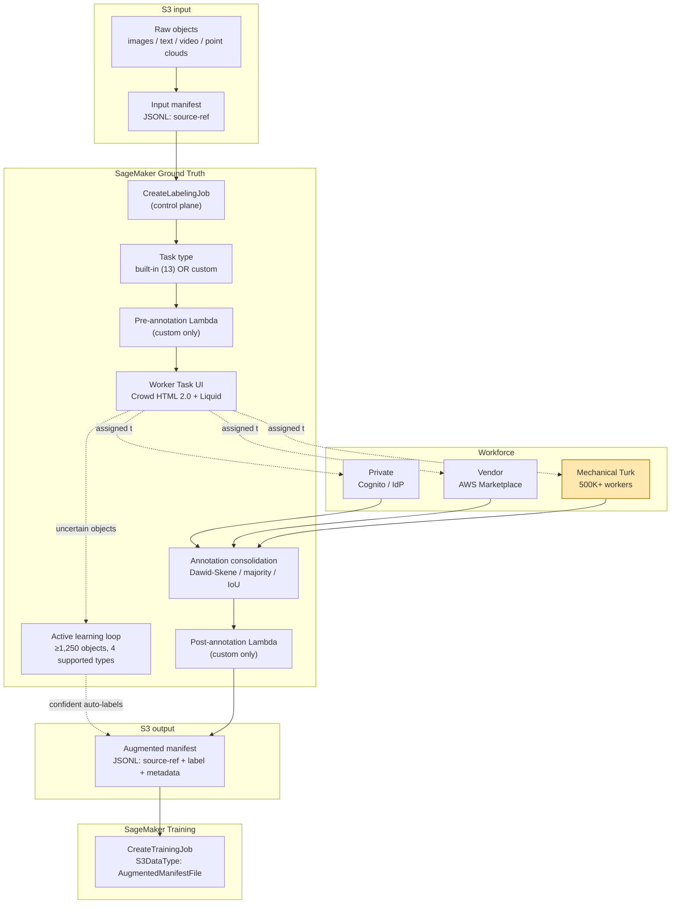
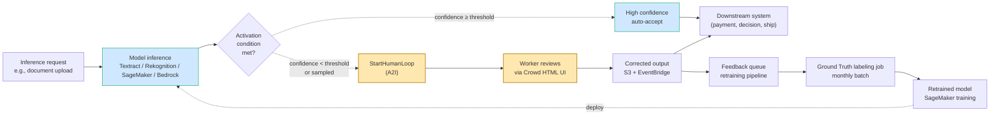

# Chapter 20 — Data Labeling: SageMaker Ground Truth, Ground Truth Plus, A2I, Mechanical Turk

> **Goal of this chapter:** to give you the mental model — and the AWS-verbatim tables — you need to walk into any MLA-C01 question about *labeling* and pick the right answer before reading the distractors. By the end of the chapter you should be able to explain *why* SageMaker Ground Truth needs at least 1,250 objects before active learning is even allowed to engage (and 5,000 before it pays for itself), *why* Ground Truth Plus is not HIPAA-eligible even though standard Ground Truth is, *why* the augmented manifest file in S3 JSON Lines is the *only* output format that flows directly into a SageMaker training job without a reshape step, and *why* the mnemonic that disambiguates the two services you keep confusing — Ground Truth and Amazon Augmented AI — is exactly five words long. Every later chapter that depends on a labeled training set — Ch 23 on built-in algorithms that consume `AugmentedManifestFile`, Ch 26 on JumpStart fine-tuning data, Ch 48–50 on Model Monitor's human-review loops — assumes the labeling vocabulary in this chapter is already in your head.
>
> **First-principles claim of the chapter.** Supervised learning is shockingly data-hungry, and labels — not models — are the bottleneck. A model architecture is downloadable in an afternoon; a million bounding-box annotations is not. The labeling problem decomposes into five sub-problems: ingest, workforce, UI, quality control, and output format. AWS provides three complementary services (Ground Truth, Ground Truth Plus, A2I) plus the underlying public crowd (Mechanical Turk) to attack different cells of that grid. Pick by sensitivity of the data first, by where in the ML lifecycle the labeling sits (pre-training vs. post-inference) second, and by cost third.
>
> **MLA-C01 mapping.** Task 1.2 — *Validating and labeling data by using AWS services (e.g., SageMaker Ground Truth, Amazon Mechanical Turk)* and *Data annotation and labeling services that create high-quality labeled datasets*. Touches Task 4.1 (human-in-the-loop monitoring via A2I) and Task 3.2 (model retraining loops fed by A2I-corrected labels).
>
> **Back-links.** Chapter 10 (`../part_c_data_ingestion_storage/10_data_formats.md`) established **JSON Lines** as the canonical streaming-friendly text format — the augmented manifest in this chapter is JSONL with a `source-ref` convention, and the link to SageMaker training is through the `AugmentedManifestFile` source type covered there. Chapter 21 (next) covers **Amazon Macie + PII detection** — the right answer to "should I send this data to MTurk?" is often "no, because Macie just flagged 14 PII fields." Chapter 5 (`../part_b_aws_foundations/05_iam_for_ml.md`) set up the IAM role and KMS scaffolding that Ground Truth's service-linked role consumes. **Forward-links.** Chapter 23 (built-in algorithms) details the `RecordWrapperType` + `ContentType` contract that the augmented manifest feeds into. Chapter 26 (JumpStart) shows how an augmented-manifest-shaped training set fine-tunes a foundation model. Chapter 50 (Model Monitor + bias) re-encounters A2I as the post-inference review loop that closes the feedback cycle on drifted models.

---

## 20.1 The labeling problem in one Monday morning

It is Monday at a healthtech that runs on AWS. A radiology AI team has spent two quarters proving that a CNN can hit 0.91 AUROC on detecting one specific abnormality in chest X-rays. The model architecture took three days to lift from a published paper; the annotations took six months. The team has labels on 8,000 scans. They need 80,000 to ship. The clinical chief tells them, in the next sprint planning meeting, that the radiologists who labeled the first 8,000 — at roughly 90 seconds per scan — are needed for actual patient care from now on. "Outsource it," she says. "Just don't put any of those X-rays on a public website."

The MLE — you — is now responsible for a multi-axis decision:

1. **Workforce.** The scans contain PHI. MTurk is out. So is any vendor without a Business Associate Agreement (BAA). Realistic options: hire and train a private workforce of radiology techs (8 weeks), engage a BAA-covered specialist vendor (4 weeks, $$$), or ask AWS via Ground Truth Plus (managed, fast — but, as the FAQ reveals, **not** HIPAA-eligible).
2. **Tool.** None of Ground Truth's 13 built-in task types know what a DICOM is. You need a custom worker UI — Crowd HTML 2.0 with Liquid templating, plus a Pre-annotation Lambda that presigns the DICOM URL and a Post-annotation Lambda that consolidates 3-way replication.
3. **Quality control.** Two radiologists rarely produce identical labels on a borderline scan. Naive majority vote loses every 3-out-of-10 ambiguous case. You need a Dawid-Skene-style probabilistic aggregator that weights each worker's vote by estimated reliability.
4. **Output.** Whatever you produce has to flow into SageMaker training without a reshape step — the augmented manifest in S3 JSON Lines, `source-ref` pointing at the encrypted DICOM, `<job-name>` carrying the consolidated label, `AttributeNames` whitelist in `CreateTrainingJob.InputDataConfig`.
5. **Cost.** Vendor rate $4/scan × 3-way × 72,000 = $864K. The CFO asks whether **active learning** can cut that. Marketing says "up to 70%"; AWS engineering blogs say 23–27%. Which goes in the budget?
6. **The post-inference loop.** Once shipped, radiologists want to review the bottom 5% of confidence-scored predictions before they reach the PACS workstation. That is not labeling — it is **Amazon Augmented AI (A2I)**. Different service, same workforce, different lifecycle stage.

Every one of these decisions is a multiple-choice question on the MLA-C01. The exam will not draw an org chart; it will hand you one paragraph and four answers, three of which are wrong for a specific compliance, cost, or contract reason this chapter teaches you to spot.

**The asymmetry that drives this chapter.** Labels are expensive, they are wrong more often than you think, and the cost of getting them wrong is paid forever — a model trained on bad labels predicts with bad labels for the rest of its life. The four services in this chapter attack different cells of an *expense × sensitivity × lifecycle-stage* grid. Memorize the grid, not the menu.

---

## 20.2 Why labels are the bottleneck

Three structural properties make labeling the most expensive line item in a supervised ML budget:

1. **Per-object human cost.** A bounding-box click takes 3–10 sec; a polygon mask 30–120 sec; a 3D LiDAR cuboid 1–5 min — and an AV training set wants *millions* of frames. There is no shortcut from the human-time axis to zero except active learning or synthetic data, both with caveats (§20.7, §20.10).
2. **Domain expertise.** Radiology, legal NER, satellite-imagery interpretation, PCB defect detection require specialists at $50–$500/hour, not crowd workers at $0.06/HIT. The 100× rate differential is the single largest cost variable in regulated industries.
3. **Quality variance.** Two annotators rarely produce identical labels — inter-annotator agreement (Cohen's kappa) is itself a research metric. Wrong labels are **worse than no labels**: they poison the model *and* confound the evaluation. Naive MTurk has been measured at ~40% spam rates (Ipeirotis, 2010), which is the canonical justification for replication + consensus + honeypots.

AWS's value-add is a managed orchestrator hiding the orchestration, workforce, UI, consolidation, and output-formatting concerns behind a single API and a single workforce pool. The four services in this chapter — Ground Truth, Ground Truth Plus, A2I, MTurk — are different facets of that orchestrator.

---

## 20.3 SageMaker Ground Truth — self-service labeling

### 20.3.1 What it is (verbatim definition)

AWS defines Ground Truth in its Developer Guide as follows:

> "Ground Truth helps you build high-quality training datasets for your machine learning models. With Ground Truth, you can use workers from either Amazon Mechanical Turk, a vendor company that you choose, or an internal, private workforce along with machine learning to enable you to create a labeled dataset."

Operationally, Ground Truth is a **labeling-job orchestrator**. You provide raw objects in S3 plus an input manifest (JSON Lines, each line `{"source-ref": "s3://..."}`). You choose a built-in task type or build a custom one. You attach a workforce. Ground Truth shards the work, renders the worker UI, collects annotations, runs consolidation, and writes an **augmented manifest** back to S3 — also JSON Lines, this time with the label attribute appended. Events stream to CloudWatch under `/aws/sagemaker/LabelingJobs/<job-name>`. The control-plane API is `CreateLabelingJob` (with siblings `DescribeLabelingJob`, `StopLabelingJob`, `ListLabelingJobs`).

If you remember nothing else about Ground Truth's mental model, remember this: **input is a manifest of S3 URIs; output is the same manifest with extra label attributes glued on.** That output is the *augmented manifest file*, and it is the artifact that flows into a SageMaker training job in a single line of `InputDataConfig` JSON.

### 20.3.2 The 13 built-in task types

Ground Truth ships a built-in worker UI and consolidation algorithm for 13 task types spanning four modalities. Memorize the modalities; the individual types follow naturally.

| Modality | Task type | Description |
|---|---|---|
| **Image** | Image classification (single / multi-label) | One or more class labels per image |
| **Image** | Bounding box (object detection) | Axis-aligned rectangles per class |
| **Image** | Semantic segmentation | Pixel-level mask per class |
| **Image** | Label verification | Workers approve/reject prior labels (the cheapest round-2 pattern) |
| **Text** | Text classification (single / multi-label) | Document- or sentence-level class |
| **Text** | Named entity recognition (NER) | Span tagging within text |
| **Text** | Text-to-text | Free-form text generation (summarization, translation) |
| **Video** | Video classification | Class per clip |
| **Video** | Video object detection | Bounding box per frame |
| **Video** | Video object tracking | Tracked bounding box across frames (identity persists frame-to-frame) |
| **3D point cloud** | 3D object detection | 3D cuboids in LiDAR scans (KITTI-style input) |
| **3D point cloud** | 3D object tracking | Cuboids tracked across LiDAR frames |
| **3D point cloud** | 3D semantic segmentation | Per-point class labels |
| **Custom** | Any HTML 2.0 / Crowd HTML template | Arbitrary annotation UI (Liquid + Pre/Post Lambda) |

Two of these deserve special attention because the exam over-indexes on them:

**3D point cloud — why it matters for the exam.** Autonomous-vehicle and robotics use cases need LiDAR labels. Ground Truth is one of the few *managed* services that supports them out of the box. Input format follows the KITTI convention: each frame is a point-cloud file (`.pcd` or `.bin`) plus optional fused camera images and ego-vehicle pose. Workers see a 3D scene viewer and draw cuboids; output includes 9-DoF box coordinates (xyz position, lwh dimensions, yaw/pitch/roll orientation). If an exam question mentions LiDAR, autonomous driving, or robotics, the right answer is almost always *Ground Truth 3D point cloud task type* — not a vendor, not a custom workflow.

**Label verification — the cheap round-2 pattern.** When you have a corpus that has already been labeled (e.g., by a v1 model, by an upstream team, or by an earlier annotator cohort), running a *label verification* job is roughly 3× cheaper than re-labeling. Workers approve or reject prior labels rather than create new ones; the UI shows the existing label and a binary good/bad button. This is the standard mechanism for ML-pre-labeling workflows — generate provisional labels with a weak model, then verify with humans.

### 20.3.3 Custom labeling workflows — Pre-Lambda + Crowd HTML + Post-Lambda

When none of the built-ins fit (custom medical annotation, multi-turn dialog rating, audio segmentation, anything domain-specific), you build a custom workflow from three pieces. This three-piece pattern is **the** canonical exam scenario for "I can't use a built-in task type — what do I configure?"

1. **Pre-annotation Lambda.** Invoked once per dataset object. Receives the manifest line; returns a payload to render in the worker's task UI. Common uses: presign an S3 URL for a private bucket, fetch extra metadata for context, generate model-pre-labels for human verification.
2. **Worker Task Template.** An HTML document using **Crowd HTML 2.0** components (`<crowd-bounding-box>`, `<crowd-image-classifier>`, `<crowd-entity-annotation>`, `<crowd-form>`, `<crowd-button>`) with **Liquid templating** for variable substitution (`{{ task.input.source }}`, `{{ task.input.labels[0] }}`). This is the UI the worker sees.
3. **Post-annotation Lambda.** Invoked once per dataset object after all assigned workers finish. Receives the raw per-worker annotations; returns the *consolidated* label that gets written to the augmented manifest. This is where you implement Dawid-Skene, weighted voting, or domain-specific reconciliation logic.

The exam phrasing that points at this pattern is always one of: "the team needs a custom annotation UI," "the task is not in the list of built-in types," "domain-specific reconciliation logic," or "the worker needs to see [some extra context not in the raw object]." Answer: **Custom labeling workflow = Pre-Lambda + Liquid/Crowd HTML template + Post-Lambda**.

### 20.3.4 Streaming labeling jobs

Standard labeling jobs are batch — finite input manifest, finite output. **Streaming labeling jobs** (GA 2020) keep a labeling job alive indefinitely and pull new objects from an **SNS input topic**, emitting completed labels to an **SNS output topic** and the augmented manifest. The three production use cases:

- **Continuous data flows** — new sensor frames every minute from a drone fleet, new transcripts from a call-center feed.
- **Active learning loops** — re-queue model-uncertain examples for human re-review.
- **Production drift remediation** — when Model Monitor flags drift on a feature, route mis-classified records to humans for re-labeling.

**Important constraint** (per AWS docs, verbatim): *"Streaming labeling jobs do not support automated data labeling."* If you need both streaming and active learning, you must run them as separate jobs. The exam tests this exclusion at least once per practice set.

### 20.3.5 Workforce options — the three tiers

The single most exam-tested decision in Ground Truth is workforce choice. The three options and their trade-offs:

| Workforce | Authentication | Throughput | Quality | Sensitivity | Cost |
|---|---|---|---|---|---|
| **Private** | Amazon Cognito User Pool (or IAM Identity Center, or OIDC IdP post-2023) | Limited by team size | Highest (trained employees) | Suitable for PHI/PII with NDA / BAA | Internal labor cost only — **no per-object GT fee** |
| **Vendor** | Vendor manages | Medium-high | High (specialized) | Depends on vendor's certifications | Per-object via AWS Marketplace |
| **Amazon Mechanical Turk** | Public MTurk account | Highest (500K+ workers) | Variable; needs replication + consolidation | **Never** for confidential data | Cheapest per object; worker reward + ~20% AWS fee |

Per AWS docs: "The Amazon Mechanical Turk workforce of over 500,000 independent contractors worldwide." Private workforce is "your employees or contractors for handling data within your organization." Vendor workforce comes from "a vendor company that you can find in the AWS Marketplace."

A **workforce** is the auth/identity boundary; a **work team** is a subset of a workforce. You reference the work team's ARN in `HumanTaskConfig.WorkteamArn` when creating the labeling job. The same work team can be referenced by both Ground Truth and A2I — they share the workforce infrastructure.

⚠️ **Exam alert (workforce + sensitive data).** If a question mentions HIPAA, PHI, PII, internal company documents, "confidential," "sensitive," or "regulated," the right answer is **never** MTurk. The two valid answers are **Private workforce** (if the team can staff one) or **Ground Truth Plus** (if they cannot — *but only if the data is not HIPAA*; see §20.5 for the Plus HIPAA gotcha). MTurk is a public crowd; it has no data-handling guarantees beyond its standard Terms of Service. This is the most-tested labeling pitfall on the MLA-C01.

### 20.3.6 The Ground Truth workflow architecture (diagram)



The diagram captures one fact worth repeating: **the augmented manifest is the join point between the labeling lifecycle and the training lifecycle**. Everything to the left of it is workforce-orchestration concerns; everything to the right is model-training concerns. The MLE who can read both sides of that line is the MLE who can build a closed-loop ML pipeline.

### 20.3.7 Active learning / automated data labeling

**Definition (AWS DG, verbatim).** "If you choose, Amazon SageMaker Ground Truth can use active learning to automate the labeling of your input data for certain built-in task types. […] Automated data labeling helps to reduce the cost and time that it takes to label your dataset compared to using only humans."

**Supported task types only** — this is an exam fact:

- Image classification (single label)
- Image semantic segmentation
- Object detection (bounding box)
- Text classification (single label)

Active learning is **not** supported for: NER, multi-label classification, any video task, any 3D task, or any custom task. If a question describes one of these and offers "enable active learning" as an answer, it is wrong by construction.

**The active-learning loop (one iteration).**

1. Random sample → human workers. *If >10% of human tasks fail, the whole job fails* — UI/instruction smoke test.
2. Returned labels split into train/validation. **Validation set = 20% if total dataset <5K objects, else 10%.**
3. Ground Truth trains a built-in model on the training set (instance types in §20.3.8).
4. Batch transform on the validation set → per-object confidence scores → derives a **confidence threshold** that meets a pre-defined accuracy target.
5. Batch transform on remaining unlabeled data → confidence score per object.
6. Objects above threshold → auto-labeled (machine-annotated, `human-annotated: "no"` in the metadata).
7. Objects below threshold → next batch of human workers.
8. Loop until dataset is labeled or budget hit.

**Pre-defined accuracy targets** (AWS-managed — *not* user-configurable; this is also an exam fact):

| Task type | Accuracy target |
|---|---|
| Image classification (single) | ≥95% expected label accuracy vs. humans |
| Text classification (single) | ≥95% expected label accuracy vs. humans |
| Bounding box | mean IoU = 0.6 |
| Semantic segmentation | mean IoU = 0.7 |

⚠️ **Exam alert (active learning minimum).** "The minimum number of objects allowed for automated data labeling is **1,250**, but we strongly suggest providing a minimum of **5,000** objects." (Source: AWS DG, *Automate data labeling*.) Below 1,250 objects, you cannot enable active learning at all; below 5,000, it tends to cost more than it saves because the per-iteration training compute dominates. If a question describes a dataset under 1,250 and offers active learning as an answer, it is wrong by API constraint. If the dataset is between 1,250 and 5,000 and the question stresses *cost*, active learning is likely still the wrong answer (overhead exceeds savings).

**The 70% claim, examined.** AWS's marketing collateral cites *"up to 70%"* cost reduction from active learning. The published AWS engineering benchmarks tell a more modest story:

- **Bird-detection, 1,000 images, no warm-start:** $260 fully manual → $189.44 with active learning = **27% saved**.
- **Bird-detection, 2,500 images, with a pre-trained warm-start model:** $189.64 → $146.80 = **23% saved**.
- The 70% figure is a *potential* benefit at the very large-dataset, very-homogeneous-class extreme — tens of thousands of bird-or-not-bird images with a strong warm-start. For most production projects, plan on **20–30%** in your budget.

The exam will not ask you to recite the 70% number, but it may offer it as a distractor. The right phrasing is "active learning *can* reduce labeling cost," not "active learning *will* reduce labeling cost by 70%."

### 20.3.8 The hidden EC2 bill of active learning

Active learning is not free; it runs SageMaker training and batch transform jobs on AWS-managed (invisible) EC2 instances that show up on your bill as SageMaker line items:

| Task type | Training instance | Inference instance |
|---|---|---|
| Image classification | ml.p3.2xlarge | ml.c5.xlarge |
| Object detection (bbox) | ml.p3.2xlarge | ml.c5.4xlarge |
| Text classification | ml.c5.2xlarge | ml.m4.xlarge |
| Semantic segmentation | ml.p3.2xlarge | ml.p3.2xlarge |

These costs **show up on your bill** as SageMaker training + batch transform charges *in addition to* the per-object labeling fee. The trade-off only makes sense at scale (≥5K objects, ideally ≥20K). Below that threshold, the fixed training cost dominates and active learning can be more expensive than full manual labeling.

**BYO model active learning.** You can plug your own model into a Step Functions-orchestrated active-learning loop via the open-source notebook `bring_your_own_model_for_sagemaker_labeling_workflows_with_active_learning.ipynb` (BlazingText reference). The `InitialActiveLearningModelArn` parameter on `CreateLabelingJob` lets you warm-start a new job from a prior labeling job's final model — this is the standard pattern for iterative dataset expansion (label 5K, train, use that model to warm-start the labeling of the next 20K).

### 20.3.9 Annotation consolidation — Dawid-Skene and friends

When multiple workers annotate the same object (e.g., 3-of-5 replication on MTurk), Ground Truth runs a **consolidation algorithm** to merge the per-worker annotations into a single ground-truth label. The built-in consolidation logic depends on the task type:

| Task type | Default consolidation |
|---|---|
| Image / text classification | **Multi-class annotation** — probabilistic majority vote weighted by per-worker estimated accuracy (Dawid-Skene-style) |
| Bounding box | Box clustering + IoU-weighted averaging |
| Semantic segmentation | Per-pixel majority vote |
| NER | Token-level majority vote |
| Custom | **You** provide consolidation logic in the Post-annotation Lambda |

The probabilistic models (sometimes called **Bayesian** or **Dawid-Skene-style** after the 1979 paper) estimate each worker's reliability *simultaneously* with the true label via Expectation-Maximization (EM):

- **E-step:** estimate the probability of each true label given the current worker confusion matrices.
- **M-step:** re-estimate each worker's confusion matrix given the current label estimates.

A skilled worker's votes get weighted more heavily; a near-random worker is discounted. This matters because naive majority vote treats all workers equally — and on a 5-worker MTurk replication where two workers are spammers, naive majority vote produces a 2/5 noise floor that Dawid-Skene cleans up. The open-source canonical implementations are Toloka's *Crowd-Kit* and Sukrut Rao's *Fast Dawid-Skene* (arXiv 1803.02781).

**Number of workers per object** is set via `HumanTaskConfig.NumberOfHumanWorkersPerDataObject`:

- **MTurk default:** 3–5 (more for ambiguous tasks).
- **Private/vendor:** often 1 (trust the trained labeler) or 2 with a third-party adjudicator.
- **Higher replication = more confident, linearly more expensive.** A 3-way consensus on 10K objects is 30K billable labels.

### 20.3.10 Output — the augmented manifest file

Ground Truth writes results to `s3://<output-path>/<job-name>/manifests/output/output.manifest`. It is **JSON Lines** — one JSON object per line, one per dataset object. The schema for an image-classification job:

```json
{
  "source-ref": "s3://my-bucket/images/img_001.jpg",
  "my-labeling-job": 3,
  "my-labeling-job-metadata": {
    "confidence": 0.94,
    "job-name": "labeling-job/my-labeling-job",
    "class-name": "dog",
    "human-annotated": "yes",
    "creation-date": "2026-01-15T14:32:11.123",
    "type": "groundtruth/image-classification"
  }
}
```

Key fields:

- **`source-ref`** — S3 URI of the raw object (image, audio, video, point cloud). For inline text, use `source` instead with the string itself.
- **`<job-name>`** — the **label attribute name**. The value depends on task type: integer class id for classification; array of boxes for bounding box; presigned URI to a PNG mask for semantic segmentation; nested object with class + cuboid coordinates for 3D.
- **`<job-name>-metadata`** — confidence, decoded class name, `human-annotated` (`"yes"` / `"no"` — `"no"` means it came from active learning, not a human), creation timestamp, type identifier.

A single S3 object can carry **multiple labels** from multiple labeling jobs — each job adds its own `<job-name>` and `<job-name>-metadata` keys to the same line. This is the mechanism by which you chain labeling jobs on the same data (classify → bounding box → segmentation on the same images, building up multi-task labels).

⚠️ **Exam alert (augmented manifest format).** The augmented manifest is **JSON Lines**, not JSON. Each line is a separate, complete JSON object; there is no surrounding array. If you `json.load()` the whole file, the parser blows up on line 2. The correct loader is `for line in f: json.loads(line)`. The exam will offer "JSON" as a distractor in any question that asks about the augmented manifest format — the right answer is *JSON Lines* (a.k.a. JSONL, ndjson). See Chapter 10 (`../part_c_data_ingestion_storage/10_data_formats.md` §10.6) for the broader data-format taxonomy.

### 20.3.11 Output → training input — the `AugmentedManifestFile` source type

SageMaker training jobs accept the augmented manifest directly as input. In `CreateTrainingJob.InputDataConfig`:

```json
{
  "ChannelName": "train",
  "DataSource": {
    "S3DataSource": {
      "S3DataType": "AugmentedManifestFile",
      "S3Uri": "s3://.../output.manifest",
      "S3DataDistributionType": "FullyReplicated",
      "AttributeNames": ["source-ref", "my-labeling-job"]
    }
  },
  "InputMode": "Pipe",
  "RecordWrapperType": "RecordIO",
  "ContentType": "application/x-recordio-protobuf"
}
```

- **`S3DataType: AugmentedManifestFile`** — the magic value. The training container's input channel is fed RecordIO-wrapped Protobuf records assembled from the listed `AttributeNames`.
- **`AttributeNames`** — exactly what to pass through: usually `["source-ref", "<job-name>"]`. Omit metadata to keep the wire format compact.
- **`InputMode: Pipe`** — mandatory for `AugmentedManifestFile` (FastFile works for some algorithms as of 2024). The container reads from a Linux FIFO at `/opt/ml/input/data/<channel>`.
- **`RecordWrapperType: RecordIO`** and **`ContentType: application/x-recordio-protobuf`** — required for the built-in SageMaker image-classification and object-detection algorithms (Chapter 23 covers algorithm-specific input formats in depth).

For custom containers (TF, PyTorch), you can use **`S3DataType: ManifestFile`** with the augmented manifest and parse the JSON yourself, but the augmented-manifest pipe-mode contract is more efficient because it avoids an HTTP round-trip per object. Forward to **Ch 23** (built-in algorithms) and **Ch 26** (JumpStart fine-tuning) for the consumption end of this pipeline.

### 20.3.12 IAM, KMS, and networking

**Service-linked managed policy.** Ground Truth uses **`AmazonSageMakerGroundTruthExecution`** attached to a role you pass in. It needs `s3:GetObject/PutObject/ListBucket` on your input/output buckets, `cognito-idp:*` on the Cognito User Pool (private workforce), `lambda:InvokeFunction` on Pre/Post annotation Lambdas, `sns:Publish` on streaming-job topics, `kms:Decrypt/GenerateDataKey` for customer-managed KMS, and `sagemaker:*` for the active-learning jobs.

**KMS gotcha (recurring exam theme).** The KMS key policy must list **both** the role you pass to Ground Truth **and** the SageMaker service principal — otherwise the active-learning training job's EBS volume fails to provision with a cryptic "access denied" in CloudWatch. Cross-reference Chapter 8 (`../part_b_aws_foundations/08_kms_secrets.md`) for the canonical key-policy template.

**VPC mode.** Labeling jobs are *not* VPC-isolated — workers access via a public web UI rendered by SageMaker. Active-learning training jobs **can** run inside your VPC. If data is in a private S3 bucket, the worker portal must be able to presign URLs (the labeling role needs `GetObject` and the bucket policy must allow presigned access from worker IPs).

---

## 20.4 Workforce deep-dive — Private, Vendor, Mechanical Turk

### 20.4.1 Private workforce — Cognito and OIDC

The **Private workforce** is the only valid answer for confidential, regulated, or proprietary data. Workers authenticate via **Amazon Cognito User Pool** (the original 2018 mechanism), **IAM Identity Center** (added 2023 for enterprise SSO), or a **custom OIDC IdP** (ADFS, Okta, Auth0). Managed via `CreateWorkforce`, `CreateWorkteam`, `DescribeWorkforce`. There is **one workforce per AWS account per region**, but a workforce can contain multiple work teams with different access scopes.

The pricing nuance: **private workforce has no per-object Ground Truth fee.** You pay only the workforce-management infra (Cognito, UI hosting, active-learning compute) plus your internal labor cost — the cheapest cell of the matrix when you already have staff. Regulated finance and healthtech shops with internal SMEs default here over GT+.

### 20.4.2 Vendor workforce — AWS Marketplace

A **Vendor workforce** is a third-party labeling specialist (iMerit, CloudFactory, Sama) found in the **AWS Marketplace**. Vendor handles recruitment, training, management; you handle the job orchestration and data. Per-object Marketplace pricing — more expensive than MTurk, cheaper than building a private workforce, with specialization (radiology, automotive perception, legal). Right answer when data is sensitive but not strictly regulated (PII without PHI, pre-redacted claims), the task requires domain expertise crowd workers can't provide, or you need higher throughput than a private workforce can deliver.

### 20.4.3 Mechanical Turk — the underlying public crowd

Amazon MTurk is AWS's **crowdsourcing marketplace** (launched 2005). Requesters post Human Intelligence Tasks (HITs); workers (Turkers) complete them for a reward; AWS takes ~20% on top. From the GT/A2I perspective, it is one of three workforce types — the public-crowd option. AWS docs cite *"over 500,000 independent contractors worldwide."*

**MTurk wins:** high volume, simple tasks (binary classification, image quality rating), tolerance for noise (with 3-of-5 majority vote or Dawid-Skene), **publicly-shareable data only**, small budgets.

**MTurk is wrong:** confidential/regulated data (HIPAA PHI, PCI, internal docs), specialist tasks (medical/legal/geospatial), high-context tasks requiring training.

Ipeirotis (NYU, 2010) measured ~**40.92% spam rate** on naive MTurk deployments — the canonical justification for replication, consensus, and honeypots. **Direct MTurk integration in GT+ has been deprecated** (Plus uses AWS-staffed workers only); self-service GT still supports MTurk as one of the three workforce types.

### 20.4.4 Quality-control patterns for noisy workforces

Three well-attested patterns: **gold-standard injection** (5–10% known-answer honeypots; auto-reject workers whose honeypot accuracy drops); **qualification tests** (MTurk pre-screening via `WorkerQualification` parameter); **tiered workforces** (MTurk for cheap initial sweep, then route low-agreement items to a private/vendor workforce for adjudication).

---

## 20.5 SageMaker Ground Truth Plus — AWS-staffed managed labeling

### 20.5.1 What it is

**Ground Truth Plus** (GT+) is a **turnkey, AWS-staffed labeling service**. You don't manage workforces, task UIs, or quality control — AWS does. You file a labeling request, AWS's expert annotation team executes, and labeled data lands in your S3 bucket. Pricing is bespoke per project — there is no public price sheet.

### 20.5.2 When to choose Plus over self-service

- **Sensitive data** (financial documents, certain medical imaging) where vetting a vendor would take quarters.
- **Complex annotation** (3D + 2D fused autonomy data, multi-modal labeling) where the UI engineering and worker training is itself a project.
- **One-shot bulk jobs** at the 100K-to-millions-of-objects scale where a fixed-quote contract beats iterative orchestration.
- **No internal labeling-ops capacity.** Building a labeling team is a 6-month project; GT+ skips it.
- **GenAI training data** (RLHF, instruction tuning, ranking) — GT+ added explicit support for preference-ranking workflows; many LLM teams in 2024–2025 used GT+ to avoid setting up Scale-style in-house operations.

### 20.5.3 What you give up

| | Ground Truth (self-service) | Ground Truth Plus |
|---|---|---|
| **You manage** | Workforce, task UI, consolidation, quality | Submit a request; receive labels |
| **Lead time** | Hours (private) to days | Days to weeks (project-based) |
| **Cost model** | Per-object + worker time + active-learning compute | Fixed quote per project (negotiated) |
| **Iteration** | Tight feedback loop, change task UI on the fly | Slow — change requests go through AWS PM |
| **Active learning** | You configure | AWS may apply it internally; opaque to you |
| **Best for** | Iterative ML projects, evolving schema | One-shot, well-specified, large-scale labeling |

### 20.5.4 ⚠️ The HIPAA gotcha — the most important exam fact in this chapter

**Critical and exam-relevant:** *standard SageMaker Ground Truth is HIPAA-eligible; SageMaker Ground Truth Plus is **NOT** HIPAA-eligible.* This catches teams who assume "AWS-managed = more compliant." The opposite is true: standard Ground Truth inherits the underlying SageMaker compliance posture (SOC, ISO, HIPAA-eligible), but Ground Truth Plus uses an AWS-staffed workforce whose operational scope is *not* in the HIPAA BAA.

⚠️ **Exam alert (GT vs. GT+ HIPAA eligibility).** If a question describes **medical imaging**, **PHI**, **HIPAA**, **clinical records**, or **healthcare-regulated data**, and offers Ground Truth Plus as an answer — Ground Truth Plus is **wrong**. The correct pattern for PHI-bearing data is:

1. **Standard SageMaker Ground Truth** (HIPAA-eligible).
2. **Private workforce** of internal SMEs (radiologists, clinicians) or BAA-covered contractors.
3. Cognito User Pool or OIDC IdP for worker auth.
4. Custom DICOM-aware UI template via Liquid + Crowd HTML elements.
5. Sign a BAA with AWS *and* with every worker organization in the chain.

This is the single most-tested labeling pitfall on the MLA-C01. The "AWS-managed must be more compliant" intuition is exactly wrong, and AWS knows it; the exam tests this disambiguation on most practice sets.

GT+ is the right pick for *non-PHI but compliance-adjacent* work (e.g., generic insurance claim forms with PII pre-redacted, financial documents with PCI fields tokenized).

### 20.5.5 Public case study — Krikey

Krikey (a 3D animation generative-AI startup) used GT+ to label **100,000 videos in 1 month** instead of an estimated 1 year, saving ~1,000 data-scientist hours and roughly **$200K** in opportunity cost. This is the canonical GT+ value story — *speed* and *scale* on a well-specified task, not regulatory compliance.

### 20.5.6 GT+ project lifecycle

Five stages: project request via the GT+ portal → AWS scoping call (fixed quote + timeline) → pilot batch (small slice for spec alignment) → full production (AWS team labels in batches; you receive augmented manifests in the same format as self-service) → QA & sign-off (typically 95%+ accuracy SLA verified on hold-out batches).

---

## 20.6 Amazon Augmented AI (A2I) — human review *after* inference

### 20.6.1 What it is

**Definition (AWS DG, verbatim).** "Amazon Augmented AI (Amazon A2I) is a service that brings human review of ML predictions to all developers by removing the heavy lifting associated with building human review systems or managing large numbers of human reviewers."

The key word is **after**. Ground Truth labels data *before* training. A2I reviews predictions *after* (or during) inference. It is the **human-in-the-loop (HITL)** runtime for production ML — the AWS-managed way to wire a human reviewer into the request path of an ML inference endpoint without building your own queue, UI, and consolidation infrastructure.

⚠️ **Exam alert (A2I vs. Ground Truth — the five-word mnemonic).** **"Ground Truth makes labels; A2I checks labels."** This is the canonical disambiguation. The exam will offer one or the other as a distractor in almost every labeling question; the trigger word is *when* in the ML lifecycle the human work happens.

- If the human work is **before training** to create a labeled dataset → **Ground Truth**.
- If the human work is **after inference** to review predictions → **A2I**.
- If the question mentions "low-confidence predictions," "production review," "post-inference," "appeals," "QA sampling of model output" → **A2I**.
- If the question mentions "build training data," "annotate raw images," "bootstrap a dataset" → **Ground Truth**.

Both services share UI infrastructure (Crowd HTML 2.0 templates), workforce options (private / vendor / MTurk), and S3-based input/output — but they sit on opposite ends of the ML lifecycle.

### 20.6.2 Three modes of use

1. **Low-confidence routing.** Configure A2I so that whenever an inference returns a confidence below threshold (e.g., Textract OCR confidence <85%), the prediction is routed to a human. This is the default production pattern for document-IDP workflows.
2. **Random sampling audit.** Periodically send a small percentage of predictions (e.g., 1% of requests) to humans for accuracy audit — used as ongoing model-monitoring evidence and as a drift-detection mechanism.
3. **Continuous feedback loop.** Human-corrected labels feed back into a retraining pipeline, typically via the augmented manifest format. This is the closed-loop pattern that closes the gap between Model Monitor's drift signal and the next retraining run.

### 20.6.3 Built-in integrations — Textract and Rekognition

A2I ships with two pre-built integrations that require zero UI code:

| AI service | Built-in A2I integration |
|---|---|
| **Amazon Textract** — `AnalyzeDocument` | Review low-confidence key-value pairs extracted from forms (mortgage applications, insurance claims, medical intake forms) |
| **Amazon Rekognition** — `DetectModerationLabels` | Review images flagged with low-confidence unsafe-content scores |

For Textract + A2I, AWS provides the form-extraction review template — workers see the original document and the extracted fields, can edit the values, and the corrected output is returned in Textract's response schema. For Rekognition + A2I, the moderation-review template is pre-built. Both are configured via `HumanLoopActivationConditions` — JSON expressions over the inference output that trigger a human loop when met. The two trigger types worth memorizing:

- **`ConfidenceCheck`** (e.g., `ModerationLabelConfidenceCheck`) — route when confidence falls in an ambiguous band (e.g., 50–85%).
- **`Sampling`** — route a random N% regardless of confidence (this is how you catch model drift).

### 20.6.4 Custom A2I workflows — any model, any threshold

For any **other** ML inference — SageMaker real-time endpoints, Comprehend, Transcribe, Translate, Bedrock, or your own custom model — you build a custom A2I workflow with three steps:

1. **Worker Task Template** (`HumanTaskUiArn`) — Crowd HTML, same components as Ground Truth custom workflows.
2. **Flow Definition** (`FlowDefinitionArn`, created via `CreateFlowDefinition`) — binds the worker template, a work team, an S3 output location, and activation conditions.
3. **Your application code**, after running inference, calls **`StartHumanLoop`** when the activation condition triggers (e.g., confidence < threshold).

Per AWS DG, the supported custom integrations include:

- SageMaker real-time inference endpoints (route low-confidence predictions for human review).
- **Comprehend** — sentiment, entity, syntax.
- **Transcribe** — review transcripts; use corrections to build custom vocabulary.
- **Translate** — review low-confidence translations.
- **Bedrock** — review LLM outputs (hallucination check, safety review) before they ship to a customer.
- **Tabular data** — generic tabular review UI for any classifier.

### 20.6.5 Core A2I concepts

| Concept | API resource | Purpose |
|---|---|---|
| **Worker Task Template** | `HumanTaskUiArn` | The Crowd HTML page workers see |
| **Flow Definition** (Human Review Workflow) | `FlowDefinitionArn` | Binds template + work team + S3 output + activation conditions |
| **Human Loop** | `HumanLoopName` (one per inference) | A single instance of a review task |
| **Activation Conditions** | JSON expression on the inference output | When to trigger a human loop (e.g., `$.Confidence < 0.85`) |
| **Work Team** | `WorkteamArn` (shared with Ground Truth) | Private / vendor / MTurk |

**Key APIs:** `CreateFlowDefinition`, `CreateHumanTaskUi`, `StartHumanLoop`, `DescribeHumanLoop`, `StopHumanLoop`, `DeleteHumanLoop`.

### 20.6.6 The A2I post-inference review loop (diagram)



Two architectural properties of this diagram are worth dwelling on:

- **A2I-corrected data is reused as training data.** The dotted line from "Feedback queue" back to "Ground Truth labeling job" is the virtuous-cycle property — every human correction improves the next model.
- **The same workforce serves both jobs.** The A2I work team and the Ground Truth work team share the same workers (and the same Cognito user pool). This is why "A2I + Ground Truth on the same workforce" is the canonical regulated-shop labeling architecture: one trained group of internal SMEs does both training-data creation *and* inference-time review.

### 20.6.7 Output format

A2I writes one JSON file per human loop to S3 at `s3://<output-bucket>/<flow-name>/<year>/<month>/<day>/<hour>/<minute>/<second>/<human-loop-name>/output.json` with `flowDefinitionArn`, `humanAnswers` (array of worker submissions with `answerContent`, `submissionTime`, `workerId`), `humanLoopName`, and `inputContent`. For the Textract and Rekognition built-ins, the output structure aligns with their respective API output schemas so you can drop-in replace the AI service's response with the human-corrected version.

A2I also emits **EventBridge events** on `HumanLoop Status Changed` (`InProgress`, `Completed`, `Failed`, `Stopped`, `Stopping`). Wire these to Lambda for downstream automation — when `Completed`, push the corrected labels to a retraining feedback queue.

### 20.6.8 Workforce and pricing for A2I

Same workforce options as Ground Truth — private (Cognito/OIDC), vendor (Marketplace), or MTurk; the work team ARN is shared. Pricing is per-task-reviewed, separate from the originating Textract/Rekognition/SageMaker cost; if workers are MTurk, the reward + AWS fee is on top. **Compliance caveat:** A2I itself is *not* in scope for the same compliance programs as Textract or Rekognition. You are responsible for understanding how A2I stores worker output and whether it meets your compliance bar — many regulated teams deploy A2I with a private workforce only.

### 20.6.9 A2I vs Ground Truth — the disambiguation table

| | Ground Truth | A2I |
|---|---|---|
| **When in lifecycle** | Pre-training (build labeled dataset) | Post-inference (review predictions) |
| **Trigger** | Manual job creation | Automatic on each inference (activation condition) |
| **Output** | Augmented manifest (S3) | Per-loop output.json (S3) + EventBridge events |
| **Typical scale** | Thousands–millions of objects per job | One human loop per inference call (continuous) |
| **API** | `CreateLabelingJob` | `CreateFlowDefinition` + `StartHumanLoop` |
| **Shared infra** | Crowd HTML UI components, work teams, Cognito | (same) |

**Mnemonic, repeated for emphasis: "Ground Truth makes labels; A2I checks labels."**

---

## 20.7 Cost model — across the four services

| Service | Charge components |
|---|---|
| **Ground Truth (self-service)** | Per-object labeling fee + worker reward if MTurk + active-learning EC2 + S3 + KMS |
| **Ground Truth Plus** | Negotiated fixed project quote — includes labor + tooling + QA |
| **A2I** | Per-task review fee + worker reward if MTurk + downstream EventBridge/Lambda normal AWS charges |
| **Mechanical Turk (direct)** | Worker reward + ~20% AWS fee; Masters/Qualified Worker premium adds more |

### 20.7.1 Total-cost mental model for a 100K-image bounding-box dataset

This is the kind of back-of-envelope you should be able to do in 30 seconds during a sprint planning meeting.

- **Naive 3-worker MTurk:** 100K × $0.08 (GT service fee) + 100K × $0.18 (3 workers × $0.06 reward + AWS fee) ≈ **$26K**, taking ~2 weeks.
- **With active learning at 50% auto-rate:** ≈ $13K labeling + ~$500 active-learning EC2 ≈ **$13.5K**, taking ~1 week.
- **Private workforce of 10 trained annotators:** no per-object GT fee; ~5 sec/box × 100K / 3600 sec/hr / 10 workers ≈ 14 worker-days × hourly rate.
- **Ground Truth Plus:** AWS quote based on volume + accuracy; expect $0.20–$0.50 per box all-in for managed quality.

### 20.7.2 Industry benchmark — $/label by modality (2024–2026)

Compiled from third-party labeling-vendor price lists (GigaBPO, BasicAI, Label Your Data, Mindkosh):

| Task | Typical $/label (US/EU workforce) | Notes |
|---|---|---|
| Image classification (single tag) | $0.01 – $0.05 | Cheapest visual task; often <1 sec per image |
| 2D bounding box (single object) | $0.02 – $0.20 | Lower bound = MTurk, upper = managed vendor with QA |
| Polygon / instance segmentation | $0.12 – $0.50 | Per object; >$1 if many vertices |
| Semantic segmentation (pixel) | $0.50 – $5.00 per image | Pricing usually per-image, not per-class |
| NER / span tagging (text) | $0.01 – $0.10 per span | Cheapest modality; experts cost more for legal/medical |
| Video object tracking | $0.50 – $5.00 per minute | Multiplies by frame rate × objects |
| 3D LiDAR point cloud (cuboid) | $1 – $5 per cuboid | Highest unit cost; requires specialized tooling |
| RLHF preference ranking | $0.50 – $5 per comparison | Surged 2023–2025 as everyone fine-tuned LLMs |

### 20.7.3 Cost-control levers, in order of impact

(1) **Active learning** at 5K+ scale (20–30% typical, up to 70% in idealized benchmarks). (2) **Workforce choice** — private > vendor > MTurk in price; reversed in throughput. (3) **Workers per object** — drop from 5 → 3 → 1 as task UI matures. (4) **Pre-filter aggressively** — remove duplicates and OOD items via perceptual hashing; cuts cost 10–40%. (5) **LLM pre-labeling** — Claude pre-fill cuts reviewer time 2–5×. (6) **Label verification jobs** for round-2 (~3× cheaper than re-labeling). (7) **Streaming labeling** for continuous data (saves per-job orchestration overhead).

---

## 20.8 Ground Truth vs third-party labeling platforms

The AWS ecosystem is not the only labeling option, and a mature MLE practice rarely commits to a single vendor. The 2024–2025 landscape:

| Vendor | Pricing model | Sweet spot |
|---|---|---|
| **Ground Truth (self)** | Per-object service fee + workforce | Teams with existing labeling workforce |
| **Ground Truth Plus** | Custom per-label quote (AWS handles end-to-end) | Teams who want one throat to choke |
| **Scale AI** | Custom enterprise contracts; high entry point | Autonomous driving, defense, frontier LLMs |
| **Labelbox** | Per-annotator-hour (Boost) + LBU (Labelbox Units) | Time-bounded projects; predictable hourly cost |
| **Hive** | Custom enterprise; fully-managed | Large-volume content moderation |
| **V7** | Free/Business/Pro/Enterprise tiers (~$150+/mo) | Video and life-sciences imagery |
| **Snorkel Flow** | Platform license; not per-label | Programmatic labeling (labeling functions in code, weak supervision) |

**When Ground Truth wins:**

- You already live in AWS — S3 is the input, S3 is the output, IAM is the auth model. No data leaves your VPC if you use a private workforce.
- You need an internal/private workforce with Cognito-backed access.
- Your data has regulatory constraints (HIPAA, FedRAMP) — standard Ground Truth (not Plus) inherits the SageMaker compliance posture.
- You need pre-built templates for the 13 common task types.

**When third-party wins:**

- Specialty expert workforces (radiology, legal, automotive perception) — Scale AI, iMerit, Sama have built deep pools that Ground Truth Plus cannot match at launch.
- World-class tooling — V7 has best-in-class video annotation; Labelbox has the most mature MLOps integrations; Scale has the deepest LiDAR/sensor-fusion UI.
- Bursty scope — Labelbox's hourly billing or Hive's managed model handles spikes without an AWS contract.
- Programmatic labeling — **Snorkel Flow** is the canonical platform for *labeling functions* (weak supervision), used at Google, Intel, Apple, IBM, Chubb, and BNY Mellon per public references.

**The vendor concentration risk.** Scale AI has won massive defense contracts ($500M+ Pentagon CDAO deal, $100M Top Secret deal) but has also lost major clients during 2024–2025 amid competition from newer providers. Scale separately sued the DoD over a $708M National Geospatial-Intelligence Agency contract awarded to Enabled Intelligence. The architectural lesson: vendor concentration risk is real. A multi-vendor labeling strategy (Ground Truth Plus for the bulk, Scale or Labelbox for specialty modalities) protects you when a vendor pivots, raises prices, or is acquired.

---

## 20.9 LLM-as-a-labeler — the 2024–2025 emerging pattern

The Bedrock-Claude-as-labeler pattern is the *default first step* for text classification, NER, and information-extraction projects in 2025. The economics flipped fast: Claude Haiku at sub-cent per label is 50–100× cheaper than MTurk for simple text classification.

### 20.9.1 The benchmark numbers

- **Refuel.ai technical report:** GPT-4 achieved **88.4% agreement with ground truth** vs. 86.2% for skilled human annotators across 8 NLP datasets (Banking77, CONLL2003, LEDGAR, Civil Comments, SQuAD 2.0). Speed: **~20× faster** than humans. Cost: **~7× cheaper**.
- **GPT-3.5 and FLAN-T5-XXL** reached 80%+ accuracy at <1/10 the cost of GPT-4 — the cheapest-per-quality tier for many tasks.
- **Hybrid (LLM + human verification):** ~94% agreement with expert consensus when 5–10% of LLM labels are spot-checked by humans.

### 20.9.2 Cost comparison (text classification, per 1,000 labels)

| Labeler | Approx cost / 1K labels | Latency | Notes |
|---|---|---|---|
| MTurk worker (simple class) | $50 – $100 | hours – days | Quality variance, spammer risk |
| Vendor (Scale, Labelbox Boost) | $200 – $500 | days | Higher quality, SLA-backed |
| **Claude Haiku via Bedrock** | **~$0.50 – $2** | seconds – minutes | Sub-cent per label on short inputs |
| **Claude Sonnet via Bedrock** | **~$5 – $20** | seconds – minutes | When Haiku's accuracy is insufficient |
| Expert human (legal, medical) | $500 – $5,000 | days – weeks | Required for true gold-standard eval |

### 20.9.3 The AWS-native pattern

Per the AWS blog *Generate training data and cost-effectively train categorical models with Amazon Bedrock*, the canonical 2025 workflow is:

1. **Bootstrap with Bedrock-Claude.** Use Claude (Haiku or Sonnet) to label a few thousand examples and to generate synthetic training data for under-represented classes.
2. **Train a small specialist model** (DistilBERT, XGBoost, or a fine-tuned SLM) on the Claude-labeled set. The student is 100–1000× cheaper to run at inference than calling Claude per request.
3. **Spot-check 5–10% with humans via A2I.** Catches systematic LLM errors (Claude has known weaknesses on ambiguous toxicity calls, sarcasm, and domain-specific jargon).
4. **Use Ground Truth Plus or expert humans only for the gold-standard eval set** — typically 500–2,000 examples per class.

### 20.9.4 Where LLM labelers fail

**Visual tasks** — multimodal LLMs are strong on bounding-box *verification* but weak on *precise* annotation; use as QA filter, not primary annotator. **Domain shift** — a general-purpose LLM under-performs on specialty domains; cost saving evaporates when you re-prompt 10 times for the right schema. **Bias amplification** — LLMs encode training-data biases; mitigate with human QA on a stratified sample. **Safety-critical content** — never let an LLM be the sole arbiter of CSAM, self-harm, or violence labels. Always route to humans via A2I.

---

## 20.10 Synthetic data as a labeling alternative

The 2024–2025 consensus is that **synthetic data complements, not replaces, human labels** — but the cost math has shifted enough that synthetic data is now the default first step for many use cases.

### 20.10.1 The tools

**Gretel** — privacy-preserving synthetic tabular, text, time-series, event data (Gretel Navigator benchmarked +25.6% over GPT-4 and +73.6% over human expert curation on internal eval). **SDV (Synthetic Data Vault)** — open-source MIT-licensed tabular synthesis, widely used in fintech and healthcare research. **NVIDIA Omniverse Replicator** — synthetic image/3D for computer vision (robotics, manufacturing defect detection, AV). **Bedrock + Claude** — generic synthetic-data generator for text classification training sets.

### 20.10.2 When synthetic wins

**Privacy-blocked data** (cannot label real PHI/PII without expensive consent workflows). **Rare classes** (real-world fraud <1%; synthetic fraud trains balanced classifiers). **Cold-start** (a synthetic pipeline produces 100K labeled examples in hours where humans deliver 1K/week).

### 20.10.3 The "last 10%" warning

Research shows **replacing up to 90% of training data with synthetic only marginally decreases performance, but replacing the final 10% causes severe declines.** Pure-synthetic models can be reliably rescued by adding **as few as 125 human-generated data points** (arXiv 2410.13098 — *A Little Human Data Goes a Long Way*). **Architect heuristic:** never train on 100% synthetic. The hybrid pattern is 70–90% synthetic + 10–30% high-quality human for both training and eval; runs ~60% cheaper than full-manual within ~23% of full-manual quality.

---

## 20.11 End-to-end reference architecture

A mature 2025 labeling pipeline rarely uses *one* service. The reference architecture for a regulated enterprise (insurance claims processing, with PHI):

```
S3 raw docs (encrypted, VPC-isolated)
        │
        ▼
   Textract (form extraction with structured fields)
        │
        ├── confidence ≥ 95% ──► downstream rules engine ──► payment
        │
        └── confidence < 95% ──► A2I human loop
                                      │
                                      ├── private workforce (BAA-covered)
                                      ├── custom UI template (Liquid + Crowd HTML)
                                      └── output to S3 + CloudTrail audit
                                              │
                                              ▼
                              monthly batch ──► Ground Truth labeling job
                              (use A2I-corrected fields as training data)
                                              │
                                              ▼
                              fine-tuned custom Comprehend model
                              (replaces some Textract calls over time)
                                              │
                                              ▼
                              SageMaker Model Monitor
                              (when drift detected ──► restart cycle)
```

Key properties:

- **A2I-corrected data is reused as training data** — a virtuous cycle where every correction improves the next model.
- **Bedrock-Claude can pre-fill A2I forms** to reduce reviewer effort (the human accepts/rejects rather than typing from scratch).
- **CloudTrail + CloudWatch** capture every human action — required for regulated audit trails.
- **VPC endpoints** keep all data-plane traffic off the public internet.

---

## 20.12 Common architectural anti-patterns

1. **Using Ground Truth Plus for PHI.** As repeated above: GT+ is not HIPAA-eligible. The procurement team thinks "AWS-managed = compliant"; the compliance team finds out at audit time.
2. **Single-worker labeling for high-stakes data.** No matter the workforce, never trust a single labeler for medical, legal, or financial labels. Minimum 2 workers + adjudication.
3. **LLM-as-labeler with no human spot-check.** Bedrock-Claude is cheap and fast, but encoded biases and hallucinations propagate into your downstream model. Always sample 5–10% for human QA.
4. **Active learning on a dataset that is too small.** If you have <5K objects, the model never converges and active learning costs more than full manual labeling.
5. **No qualification test on MTurk.** Spam rates of 30–40% are well-documented; without qualification gates and honeypots, your aggregated labels are noise.
6. **Confusing Ground Truth and A2I.** Ground Truth = training-time. A2I = inference-time. Using A2I for bulk training-data creation is technically possible but inefficient — you lose the labeling templates, active learning, and worker management features.
7. **No version control on label schema.** As classes evolve (taxonomies shift), labels from v1 of your schema become incompatible with v2. Store a schema version in every annotation record.
8. **Sending PII to MTurk for "just a quick test."** Once it leaves your VPC to a public crowd, you cannot un-send it. The compliance violation is immediate; the audit finding is permanent.

---

## 20.13 Exam-day decision table

| Scenario phrase | Right answer |
|---|---|
| "Build labeled training data from raw images, lowest cost, public data" | **Ground Truth + MTurk + active learning** |
| "Label medical images at scale; team has no labeling infra; PHI present" | **Ground Truth + Private workforce (not GT+)** — GT+ is NOT HIPAA-eligible |
| "Label medical images at scale; PHI redacted; no internal staff" | **Ground Truth Plus** (managed, OK for non-PHI) |
| "Confidential internal docs need labeling" | **Ground Truth + Private workforce** (Cognito) |
| "Custom annotation UI for proprietary task" | **Ground Truth custom workflow** = Pre-Lambda + Crowd HTML + Post-Lambda |
| "Review low-confidence Textract form extractions" | **A2I built-in Textract integration** |
| "Audit 1% of Rekognition moderation results with humans" | **A2I built-in Rekognition + sampling activation** |
| "Human review of SageMaker endpoint predictions in production" | **A2I custom workflow + StartHumanLoop** |
| "3D LiDAR labeling for autonomous vehicles" | **Ground Truth 3D point cloud task type** |
| "Continuous data stream needs labeling as it arrives" | **Ground Truth streaming labeling job** (no active learning available) |
| "Reduce labeling cost on a 20K-image dataset" | **Ground Truth active learning** (≥1,250 minimum, ≥5,000 recommended) |
| "Feed labeled output directly into training" | **`AugmentedManifestFile` S3DataType** in `CreateTrainingJob` |
| "Multiple workers disagree on the same label — what reconciles?" | **Annotation consolidation** (Dawid-Skene-style probabilistic majority) |
| "Cheap text labels at scale; some error tolerable" | **LLM-as-labeler via Bedrock + 5–10% A2I human QA** |

---

## 20.14 Cheat sheet — top 15 facts to memorize

1. **Ground Truth makes labels; A2I checks labels.** Five words; commit to memory.
2. **Standard Ground Truth is HIPAA-eligible; Ground Truth Plus is NOT.** The opposite of intuition. Most-tested labeling pitfall on the exam.
3. **Three workforce types:** Private (Cognito/OIDC), Vendor (AWS Marketplace), Mechanical Turk (public crowd).
4. **MTurk = never for sensitive data.** If a question mentions HIPAA, PHI, PII, or "confidential," MTurk is the wrong answer.
5. **Active learning minimum = 1,250 objects.** Recommended ≥ 5,000. Below 1,250 it is not allowed by the API; below 5,000 it usually costs more than it saves.
6. **Active learning supports only 4 task types:** image classification (single), image semantic segmentation, bounding box, text classification (single). NER, multi-label, video, and 3D are all excluded.
7. **Active learning accuracy targets** (not user-configurable): 95% for image/text classification; 0.6 mean IoU for bbox; 0.7 mean IoU for semantic segmentation.
8. **Active learning cost savings are 20–30% in published benchmarks**, not the 70% marketing claim.
9. **Streaming labeling jobs do NOT support active learning.** Mutually exclusive.
10. **Augmented manifest is JSON Lines** (one JSON object per line), not JSON. Feeds `AugmentedManifestFile` S3DataType in `CreateTrainingJob`.
11. **Custom workflow = Pre-Lambda + Crowd HTML (Liquid) template + Post-Lambda.** Three pieces, always.
12. **13 built-in task types** across 4 modalities (image, text, video, 3D point cloud).
13. **3D point cloud (LiDAR)** is the right answer for autonomous-vehicle labeling questions.
14. **A2I built-in integrations:** Textract (`AnalyzeDocument`) and Rekognition (`DetectModerationLabels`). Everything else (Comprehend, Transcribe, Translate, Bedrock, custom SageMaker) is a *custom* A2I workflow.
15. **A2I and Ground Truth share work teams.** Same Cognito user pool, same workforce ARN — different lifecycle stage.

### 20.14.1 Common exam traps

- "Use Ground Truth Plus for HIPAA-regulated medical imaging" → **wrong**; GT+ is not HIPAA-eligible. Use standard GT + Private workforce.
- "Enable active learning on a 1,000-image dataset" → **wrong**; below the 1,250 minimum.
- "Enable active learning on a video object tracking job" → **wrong**; video is not a supported task type.
- "Use streaming labeling with active learning" → **wrong**; mutually exclusive per AWS docs.
- "MTurk for HIPAA data" → **always wrong**; MTurk is a public crowd.
- "Use A2I to build a training dataset from scratch" → **wrong**; A2I is for post-inference review. Use Ground Truth.
- "Active learning reduces labeling cost by 70%" → **marketing**; published benchmarks show 20–30%.
- "Augmented manifest is JSON" → **wrong**; JSON Lines (one object per line). See Ch 10.
- "Configure your own accuracy target for active learning" → **wrong**; pre-defined per task type, not user-configurable.

---

## 20.15 Exercises

These exercises are designed to make you reason about the decision boundaries between Ground Truth, Ground Truth Plus, A2I, and MTurk, not to test rote memorization. Work through each before checking the brief answer notes.

**Exercise 20.1 — The HIPAA imaging project.** A healthtech team needs 80,000 chest X-rays labeled for one specific pulmonary abnormality. The data is PHI; the team has no internal radiologists available; budget is $400K. An architect proposes Ground Truth Plus because "it's AWS-managed and high-quality." Identify the compliance flaw in this proposal, name the correct AWS-native architecture (workforce + service + UI mechanism), and explain why the architect's instinct (managed = compliant) is exactly inverted.

**Exercise 20.2 — Active learning ROI.** A team has 800 labeled bird images and 4,200 unlabeled. They want to enable active learning to cut the labeling cost on the remaining 4,200. (a) Will the API allow it? (b) Will it save money? (c) What is the minimum dataset size where active learning starts to pay for itself, and what is the reason it does not pay below that? (d) If you cannot use active learning, what is the next-cheapest cost lever you would pull?

**Exercise 20.3 — Ground Truth vs A2I.** Match each scenario to the correct service and explain in one sentence why the other is wrong:
(a) Quarterly batch labeling of 50,000 newly-collected satellite images for an object-detection model.
(b) Routing 1% of a SageMaker fraud-prediction endpoint's outputs to a human for audit-trail QA.
(c) Reviewing low-confidence key-value pairs extracted from mortgage applications by Textract.
(d) Bootstrapping a labeled NER dataset for a new legal-contract entity type.
(e) Wrapping a Bedrock-Claude summarization endpoint with a human safety review before customer delivery.

**Exercise 20.4 — Augmented manifest plumbing.** A team has a Ground Truth output manifest at `s3://my-team/labels/job1/manifests/output/output.manifest`. They want to feed it directly into a SageMaker image-classification training job without writing any preprocessing code. Write out the relevant fields of the `CreateTrainingJob.InputDataConfig` payload. Then explain why the team's first attempt — using `S3DataType: ManifestFile` instead of `AugmentedManifestFile` — produced a working training job but with 3× the cost-per-epoch, and what specific mechanism in the augmented-manifest pipe-mode contract drives that efficiency.

**Exercise 20.5 — Workforce design for a regulated bank.** A bank needs to label 200,000 internal loan application forms for an OCR + entity-extraction model. The data contains PII (SSN, account numbers) but the bank has redaction tooling in place. The compliance team requires that labelers sign an NDA and that all access is auditable via CloudTrail. Design the labeling architecture: pick the workforce type, the auth mechanism, the UI mechanism, and identify the two MLA-C01-relevant compliance services you would wire in around the edges. (Hint: cross-reference Chapter 21 — Macie + PII.)

**Exercise 20.6 — The "70% cost reduction" claim.** Your director read a Medium post claiming "SageMaker Ground Truth cuts labeling costs by 70% with active learning." She wants to plug that number into next quarter's budget for a 4,000-object bounding-box project. Write the three-paragraph response you would send: (a) why the 70% number is misleading for her project specifically, (b) what realistic savings rate to budget for, (c) what alternative cost lever you would recommend instead.

**Exercise 20.7 — Hybrid LLM + human labeling pipeline.** Your team needs 50,000 customer-support tickets classified into 20 categories. Pure-human cost is $5,000 via MTurk. Design a hybrid Bedrock-Claude + A2I pipeline that targets the same accuracy at ≤30% of the cost. Specify: (a) which Claude model to use and why, (b) the A2I activation condition you would set, (c) how you would build the gold-standard eval set, and (d) the one specific failure mode of LLM labeling you would actively monitor for during the first month of production.

---

## 20.16 Where this chapter sits in the book

- **Back to Chapter 10** (`../part_c_data_ingestion_storage/10_data_formats.md`): the JSON Lines format that the augmented manifest uses was established there. The augmented manifest is JSONL, not JSON, and the `AugmentedManifestFile` source type in `CreateTrainingJob.InputDataConfig` is the join point between Ch 10's format taxonomy and this chapter's labeling output.
- **Back to Chapter 5** (`../part_b_aws_foundations/05_iam_for_ml.md`): the `AmazonSageMakerGroundTruthExecution` managed policy and the KMS key-policy gotcha both build on the IAM patterns introduced there.
- **Forward to Chapter 21** (Amazon Macie + PII): the right answer to "should I send this data to MTurk?" is often "no, because Macie just flagged 14 PII fields." Macie is the upstream sensitivity scanner that gates a labeling workflow.
- **Forward to Chapter 23** (built-in algorithms): the `RecordWrapperType: RecordIO` + `ContentType: application/x-recordio-protobuf` contract that consumes the augmented manifest is detailed there. Image classification, object detection, semantic segmentation, and several text built-ins all read augmented manifests in pipe mode.
- **Forward to Chapter 26** (JumpStart for fine-tuning data): augmented-manifest-shaped training sets are the standard input to JumpStart fine-tuning pipelines for foundation models.
- **Forward to Chapter 50** (Model Monitor + bias): the A2I post-inference review loop closes the feedback cycle that Model Monitor opens. When drift fires, A2I is the human-in-the-loop mechanism for triage and re-labeling.
