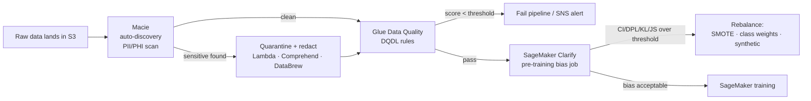
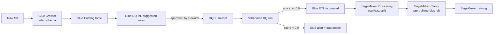
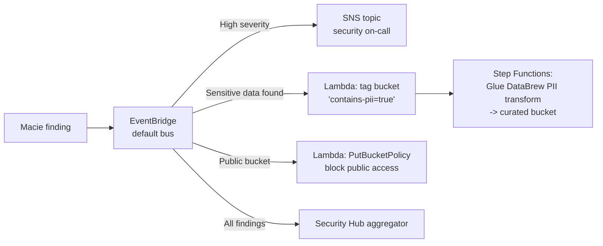
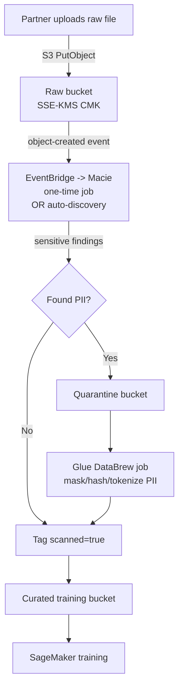
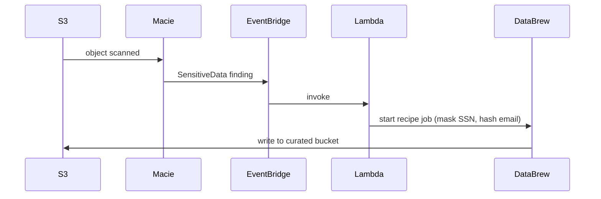
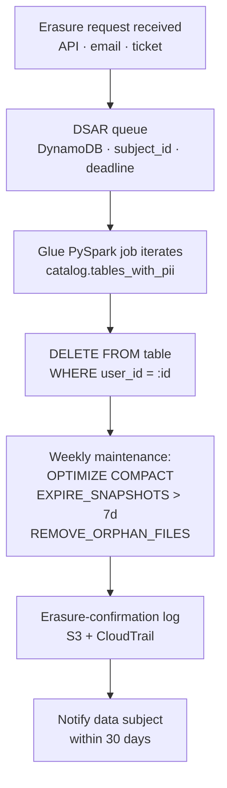
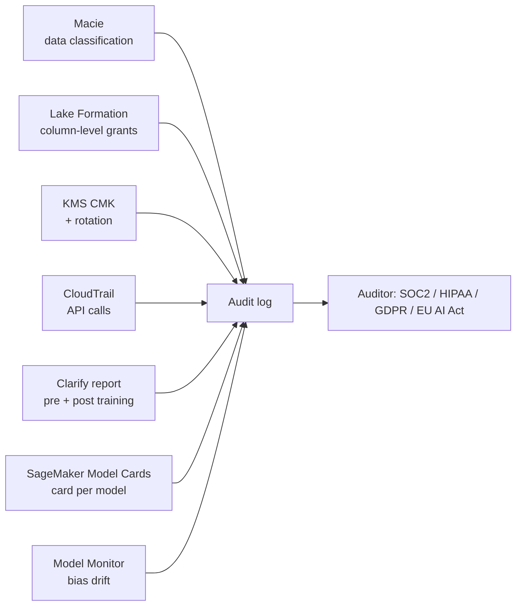

# Chapter 21 — Bias Detection & Data Integrity: SageMaker Clarify, Glue Data Quality, Macie

> **Goal of this chapter.** Make you fluent in the *pre-training fairness math* the exam asks for by acronym (CI, DPL, KL, JS, LP, TVD, KS, CDDL) and in the *data-integrity tooling* (Glue Data Quality DQDL, Macie managed identifiers, Comprehend redaction) that AWS expects you to wire together to make a regulated ML system defensible. These three services — Clarify, Glue Data Quality, Macie — are the AWS-native answer to the question "how do you stop the next biased-loan-model or PII-leak headline before it becomes one?" They sit squarely inside Task 1.3 of the MLA-C01 blueprint, and they show up disguised in Task 4.1 (secure ML resources) whenever a scenario mentions "regulated," "audit," "PII," or "PHI." Read this chapter as the regulated-industry survival kit it actually is — every section maps onto a real war story whose retelling on a Slack call could end a career.

---

## 21.1 Why this chapter exists — three war stories and a thesis

A model is the integral of its training data. If the training set over-represents one demographic, mis-labels another, or quietly leaks SSNs into S3, the model trained on it will reproduce those defects at scale, with the cool authority of mathematics behind every decision. Three production incidents tell that story better than any abstract argument.

### 21.1.1 Apple Card and Goldman Sachs (November 2019 → NYDFS finding 2021, closed early 2026)

In November 2019, tech entrepreneur David Heinemeier Hansson tweeted that Apple Card had given him a credit limit **20× higher than his wife's** despite filing joint taxes and her having a better credit score. Steve Wozniak chimed in with a similar story within hours. The New York Department of Financial Services (NYDFS) opened an investigation the same week, reviewed underwriting data for roughly 400,000 New York applicants, and concluded six years later that Goldman did *not* intentionally discriminate — men and women with similar credit characteristics generally got similar outcomes. The headline was misleading; the real failures were structural:

1. **Opaque adverse-action notices.** Rejected applicants got no human-readable reason for the denial, and a six-month wait before they could appeal.
2. **No protected-attribute audit trail.** Goldman could not, on demand, *demonstrate* the model was fair. The investigation took 16 months largely because Goldman had to reconstruct counterfactual analyses retroactively.
3. **Joint-asset blindness.** The model scored individuals; shared spousal finances were invisible to it. Legally defensible, viscerally unfair.

The MLA-C01 lesson is brutal: even if your model is statistically fair, if you cannot *prove* it on demand with feature-attribution evidence (SHAP, demographic-parity reports, model cards), you will spend the next 18 months proving it under subpoena. That is precisely the gap **SageMaker Clarify's pre- and post-training reports plus SageMaker Model Cards** are designed to close — not because they catch every bias, but because they produce the artifact the regulator asks for.

### 21.1.2 Amazon's internal hiring tool (2014–2017)

Amazon built an internal ML resume-screening system trained on ten years of past hires. It collapsed because the training distribution was overwhelmingly male — past hires in technical roles ran roughly 80%+ male — and the model learned that "looks like a past Amazon engineer" was the target. It actively downgraded resumes containing the word *"women's"* (as in "women's chess club captain") and graduates of two all-women colleges. Engineers tried scrubbing those features. The glitches kept resurfacing because the bias was in the *labels*, not the features. The project was killed in early 2017.

Root cause: **target-label bias** combined with **historical training-distribution bias**. No synthetic minority oversampling or fairness constraint would have saved this — the target itself was contaminated. The MLA-C01 lesson: Clarify's pre-training bias metrics (Class Imbalance, KL divergence, Conditional Demographic Disparity in Labels) would have flagged this in minutes. The chapter's emphasis on running Clarify *before* training, not after, is not a procedural nicety — it is the highest-leverage place to catch this category of failure.

### 21.1.3 The Optum / UnitedHealth risk-score algorithm (Obermeyer et al., *Science* 2019)

A risk-stratification algorithm used by hospitals and insurers covering **200+ million Americans** systematically under-prioritized Black patients for high-touch care management. Black patients at the same algorithm-assigned risk score were *sicker* than white patients with the same score. The mechanism, in one sentence: **the algorithm predicted cost, not illness.** Black patients incur roughly $1,800/year less in medical spending than equally-sick white patients (driven by access, mistrust, geography). The model faithfully predicted spending; spending was used as a proxy for medical need; the proxy was racially contaminated.

When Obermeyer's team retrained the model to predict combined cost + active chronic conditions, the disparity in chronic-condition burden at each risk score dropped by **84%**. The fix was not the architecture, not the algorithm, not class weighting — it was the **label definition**. The MLA-C01 lesson is the most important one in this chapter: *the label is the model.* Any bias-detection discussion that does not ask "is the target itself a fair proxy for the thing we actually care about?" will catch correlation drift but miss the structural failure. Clarify metrics compute against the label you give them — if your label is rotten, Clarify will give you a green light.

### 21.1.4 Root-cause mapping — where the tools help and where they don't

| Incident | Failure category | Where Clarify-class tooling would help |
|---|---|---|
| Apple Card | Process & explainability gap | Post-training SHAP reports (Ch 29), Model Cards for adverse-action artifacts (Ch 51) |
| Amazon hiring | Target-label contamination from historical hires | Pre-training bias metrics (CI, KL, CDDL) — *this chapter* |
| Optum risk score | Proxy label (cost ≠ medical need) | None — requires human re-design of the label, no metric will catch it |

The honest finding: tooling helps with two of the three classic failure modes. The third — proxy-label contamination — is governed by domain expertise, model-risk review boards, and the willingness to question the target column itself. The thesis of this chapter is that an MLE must be able to (a) run the tools fluently when they help and (b) know when they won't, so that the model-risk reviewer is not the last line of defense. The chapter walks the data-trustworthiness pipeline left-to-right.



Sections 21.2–21.4 cover Clarify's pre-training metrics and remediation; §21.5 covers Glue Data Quality; §21.6 covers Macie; §21.7 covers the anonymization toolkit; §21.8 covers GDPR / HIPAA / CCPA / data residency.

---

## 21.2 SageMaker Clarify — pre-training bias metrics, formally

### 21.2.1 Where bias enters — the taxonomy

Bias in an ML system is not a single failure mode. The taxonomy you should be able to recite in a model-risk-management review is:

| Type | What it is | Worked example |
|---|---|---|
| **Selection bias** | Training set isn't drawn from the same distribution as production | Loan model trained only on customers who *applied* — survivorship bias hides rejected groups |
| **Measurement bias** | Sensor or label process differs across groups | Pulse oximeters under-read SpO₂ on darker skin; every downstream healthcare model inherits the error |
| **Label / annotator bias** | Human labelers apply different standards to different groups | Toxic-content classifiers where the labeler pool reads African American Vernacular English as more toxic than Standard American English |
| **Historical bias** | The world the data captured was itself biased | COMPAS recidivism scoring — arrest data ≠ crime data |
| **Aggregation bias** | One global model used for sub-populations with different conditional distributions | Single hemoglobin-A1c threshold applied across ethnicities |
| **Representation bias** | Sub-populations under-represented in the training data | Face-recognition models trained 80% on light skin |

Clarify's pre-training metrics primarily attack **representation bias** (Class Imbalance) and **label bias** (DPL, KL, JS, LP, TVD, KS, CDDL). Measurement and historical bias are *upstream* — no metric will tell you that pulse-oximeter readings are systematically wrong; you need domain expertise plus Macie/Glue DQ to flag suspect data sources. The pre-training metrics in this section are computed on the **dataset alone — no trained model required.** That is precisely what makes them *pre-training*, and it is why they belong before the training step in the pipeline diagram above.

### 21.2.2 Fairness as regulatory risk

For US regulated industries the cost of getting this wrong is no longer theoretical:

- **Equal Credit Opportunity Act (ECOA / Reg B)** — disparate impact on protected classes is illegal in lending; the CFPB enforces. Banks must produce **adverse-action reason codes** for every denial.
- **Fair Housing Act** — same expectation for housing/rental decisions.
- **EU AI Act** (in force 2026) — high-risk AI systems (credit scoring, hiring, biometrics) must demonstrate bias testing and post-deployment monitoring.
- **NYC Local Law 144** (2023) — annual **bias audits** for automated employment decision tools.
- **California AB 2930, Colorado SB24-205, Connecticut algorithmic-transparency rule** — "consequential decisions" in credit/employment/healthcare/housing now require disclosures and bias documentation.
- **NIST AI Risk Management Framework (AI RMF 1.0)** — voluntary but increasingly contractually required.

Translation for the exam: when a scenario mentions *regulated industry*, *fairness audit*, *adverse action*, or *consequential decision*, the right answer almost always pairs **Clarify** (offline bias job) with **Model Monitor — bias drift** (Ch 48) and **Model Cards** (Ch 51).

### 21.2.3 Notation — memorize this; every formula uses it

From the AWS docs ([Measure pre-training data bias](https://docs.aws.amazon.com/sagemaker/latest/dg/clarify-measure-data-bias.html)):

- **Facet** — the sensitive attribute being analyzed (`gender`, `age_band`, `race`).
- **Facet `a`** — favored facet value (the demographic historical bias has favored).
- **Facet `d`** — disfavored facet value.
- **Label** — the target column. Binary: 1 = positive outcome (loan approved, hired), 0 = negative.
- `n_a` = count of records where facet = a; `n_d` = count where facet = d.
- `n_a(1)` = positive-label count within facet a; `n_a(0)` = negative-label count.
- `q_a = n_a(1) / n_a` — proportion of positives within facet a (the "approval rate" for a).
- `q_d = n_d(1) / n_d` — same for d.
- `P_a(y)` — label distribution within facet a. For binary: `P_a(1) = q_a`, `P_a(0) = 1 − q_a`.
- `P_d(y)` — same for d.

Metrics that *compare distributions* (KL, JS, LP, TVD, KS) compute `P_a` vs `P_d`. The metric that *compares group sizes* (CI) uses `n_a` vs `n_d`. The metric that *compares one-number outcome proportions* (DPL) uses `q_a` vs `q_d`. Internalizing this dispatch is half the battle on multi-metric exam questions.

### 21.2.4 Class Imbalance (CI)

**Formula:** `CI = (n_a − n_d) / (n_a + n_d)`

- **Range:** `[−1, +1]`
- **No-bias value:** `0` (perfectly equal counts)
- **+1** = only facet a present (d entirely absent). **−1** = only d present.
- **What it measures:** *Representation*, not outcomes. Says nothing about whether the labels are biased — only whether the dataset has enough examples of each group for the model to learn each one.
- **Exam tell:** "Are women under-represented in the training data?" → **CI.**

```python
# CI worked example: 10,000 men vs 1,500 women
n_a, n_d = 10_000, 1_500          # a = men, d = women
ci = (n_a - n_d) / (n_a + n_d)
# = 8500 / 11500 = +0.739 -> severe imbalance
```

### 21.2.5 Difference in Proportions of Labels (DPL)

**Formula:** `DPL = q_a − q_d` where `q_x = n_x(1) / n_x`

- **Range:** `[−1, +1]` for binary; `(−∞, +∞)` for continuous outcomes.
- **No-bias value:** `0`.
- **Positive:** facet a sees a higher positive-label rate than d (in lending, men approved at higher rate). **Negative:** d advantaged.
- **What it measures:** *Outcome disparity in the labels themselves.* If historical labels were biased, DPL surfaces it before any model is trained. This is *the* canonical "the labels favor group a" metric.
- **Exam tell:** the exam guide *literally calls DPL out by name* alongside CI as the example pre-training metric. If you only memorize two formulas, memorize CI and DPL.

```python
# DPL: 8000 of 10000 men approved (q_a=0.80); 750 of 1500 women (q_d=0.50)
q_a, q_d = 0.80, 0.50
dpl = q_a - q_d   # = +0.30 -> strong positive bias toward men
```

### 21.2.6 Kullback-Leibler divergence (KL)

**Formula:** `KL(P_a || P_d) = Σ_y P_a(y) · log( P_a(y) / P_d(y) )`

- **Range:** `[0, +∞)`. Not symmetric — `KL(P_a || P_d) ≠ KL(P_d || P_a)`.
- **No-bias value:** `0` (distributions identical).
- **What it measures:** information-theoretic "extra bits" needed to encode `P_a` if you assumed `P_d`. Large when the label distributions between groups differ substantially.
- **Multicategory** (e.g., approval / counter-offer / denial): sum runs over all label values.
- **Caveat:** undefined when `P_d(y) = 0` and `P_a(y) > 0`. Clarify smooths zero bins.
- **Exam tell:** "information divergence between group outcome distributions" → **KL** (or JS if symmetry is mentioned).

### 21.2.7 Jensen-Shannon divergence (JS)

**Formula:** `JS(P_a, P_d) = ½ · KL(P_a || M) + ½ · KL(P_d || M)` where `M = ½(P_a + P_d)`.

- **Range:** `[0, +∞)` in nats; `[0, 1]` when log base 2 is used on binary distributions (Lin 1991).
- **No-bias value:** `0`. Symmetric and always finite.
- **Why prefer it over KL:** symmetry + boundedness make thresholding easy ("flag any JS > 0.1").
- **Exam tell:** "symmetric and bounded version of KL" → **JS.**

### 21.2.8 Lp-norm (LP)

**Formula:** `LP = ( Σ_y |P_a(y) − P_d(y)|^p )^(1/p)`. Clarify default: `p = 2` (Euclidean).

- **Range:** `[0, +∞)`.
- **No-bias value:** `0`.
- **What it measures:** geometric distance between the two label-distribution vectors. Useful for multi-category labels when you want a single scalar that is not information-theoretic.
- **Exam tell:** "Euclidean / Lp distance between conditional distributions" → **LP.**

### 21.2.9 Total Variation Distance (TVD)

**Formula:** `TVD = ½ · Σ_y |P_a(y) − P_d(y)|` (equivalently: half the L1 distance).

- **Range:** `[0, 1]` for probability distributions.
- **No-bias value:** `0`. **TVD = 1** when the distributions have disjoint support.
- **Interpretation:** the maximum probability mass that has to be "moved" between the two distributions to make them equal. Probabilistic and intuitive.
- **Exam tell:** "half the L1 distance" → **TVD.**

### 21.2.10 Kolmogorov-Smirnov (KS)

**Formula:** `KS = sup_y |F_a(y) − F_d(y)|` where `F_x` is the CDF of labels within facet x.

- **Range:** `[0, 1]`.
- **No-bias value:** `0`. KS = 1 ⇒ CDFs maximally apart.
- **What it measures:** the *largest single-point gap* between the two CDFs. Sensitive to where the difference occurs (mode vs tail).
- **Best for:** continuous-valued labels (income, score) or ordinal multi-category. For binary labels, KS simplifies to `|q_a − q_d| = |DPL|`.
- **Exam tell:** "max difference between CDFs" or "continuous label" → **KS.**

### 21.2.11 Conditional Demographic Disparity in Labels (CDDL)

**Formula:** weighted average over strata `s` of `(n_d(0|s) / n(0|s)) − (n_d(1|s) / n(1|s))` — Simpson-style stratification of DPL by a subgroup feature.

- **Range:** `[−1, +1]`.
- **What it adds over DPL:** detects **Simpson's paradox** — overall DPL may look fine but every sub-stratum (per department, per state) shows the same bias direction. The graduate-school admissions paradox is the textbook case: department-by-department men and women admitted at similar rates, but the aggregate looks discriminatory because women applied disproportionately to lower-acceptance departments.
- **Exam tell:** "subgroup analysis" or "controlling for a third variable" → **CDDL.**

### 21.2.12 Cheat sheet — which metric for which scenario

| Question phrase | Metric |
|---|---|
| "Is one group under-represented in the data?" | **CI** |
| "Do positive labels favor one group?" | **DPL** |
| "How different are the outcome distributions, informationally?" | **KL** (or **JS** if symmetric/bounded needed) |
| "Distance between distributions (Euclidean)" | **LP** |
| "Half the L1 distance" | **TVD** |
| "Max CDF gap" or "continuous labels" | **KS** |
| "Detect Simpson's paradox by subgroup" | **CDDL** |

### 21.2.13 Two-group vs many-group facets

Above we assumed two facet values (a vs d). When the facet has more than two values (e.g., `race ∈ {white, Black, Asian, Hispanic, Other}`), Clarify supports two modes:

- **`facet_values_or_threshold = [d_value]`** — treat one value as d, all others as a (one-vs-rest).
- **One-vs-all** — Clarify pivots through each value as d in turn and emits a metric per pivot.

For continuous facets (e.g., `age`), specify a **threshold** (e.g., `< 40` is d, `>= 40` is a).

---

## 21.3 Running a Clarify pre-training bias job

### 21.3.1 The three config objects

The Python SDK gives you three config objects you wire together — `DataConfig`, `BiasConfig`, and the `SageMakerClarifyProcessor`. They mirror "where the data is", "what bias question you're asking", and "what compute to run on."

```python
from sagemaker import clarify, get_execution_role, Session

session = Session()
role = get_execution_role()

# 1) DataConfig: where the data is, the label column, the format
data_config = clarify.DataConfig(
    s3_data_input_path="s3://my-bucket/loans/raw.csv",
    s3_output_path="s3://my-bucket/clarify-out/",
    label="approved",                       # binary 0/1 column
    headers=cols,                           # full column list (order matters for CSV)
    dataset_type="text/csv",                # or 'application/jsonlines', 'application/x-parquet'
)

# 2) BiasConfig: which facet column(s), favored/disfavored values, optional group_name
bias_config = clarify.BiasConfig(
    label_values_or_threshold=[1],          # positive label is value 1
    facet_name="gender",                    # sensitive attribute
    facet_values_or_threshold=["F"],        # 'F' is the d (disfavored)
    group_name=None,                        # for CDDL: the stratification column (e.g., 'state')
)

# 3) The processor
processor = clarify.SageMakerClarifyProcessor(
    role=role,
    instance_count=1,
    instance_type="ml.m5.xlarge",
    sagemaker_session=session,
)

processor.run_pre_training_bias(
    data_config=data_config,
    data_bias_config=bias_config,
    methods="all",                          # or ["CI","DPL","KL","JS","LP","TVD","KS","CDDL"]
    wait=True,
    logs=True,
)
```

A processing job runs (default container `sagemaker-clarify-processing-jobs`, regional ECR image) and writes to `s3://.../clarify-out/`:

- `analysis.json` — every requested metric, per facet pivot. Machine-readable.
- `report.html` — same content, human-readable; embeds into **SageMaker Model Cards** as an audit artifact.
- `report.pdf` — PDF for sending to risk/audit teams.

### 21.3.2 The three execution modes (Clarify's full surface)

| Mode | API | When to use |
|---|---|---|
| **Processing job** (offline) | `SageMakerClarifyProcessor.run_pre_training_bias / run_post_training_bias / run_explainability` | One-time analysis on a snapshot of training data — *this chapter* |
| **Model Monitor bias job definition** (scheduled) | `CreateModelBiasJobDefinition` | Production bias-drift monitoring against an endpoint's data-capture logs (Ch 48) |
| **Inline (online) explainability** | `EndpointConfig.ExplainerConfig.ClarifyExplainerConfig` | Per-inference SHAP values (adds latency proportional to background-sample count; Ch 29) |

Only the **processing job** computes the pre-training metrics in §21.2 — the other two are post-training / explainability concerns and are deferred to Chapter 29 (Clarify post-training + SHAP) and Chapter 48 (Model Monitor drift).

⚠️ **Exam alert.** Clarify has worked on **tabular, text, image, and multi-modal** inputs since 2023. Older study material that limits Clarify to tabular is wrong. For text, Clarify tokenizes and computes SHAP at a configurable granularity (`token`, `sentence`, `paragraph`). For images, it uses integrated-gradients-style segmentations.

### 21.3.3 Output interpretation in the model-card workflow

The `report.html` artifact is what gets attached to a SageMaker Model Card (Ch 51) at training time, then handed to a model-risk reviewer for sign-off, then surfaced inside a regulatory adverse-action notice if the model ever denies a real-world decision. The contents per metric:

- The *value* (e.g., DPL = +0.30).
- The *severity flag* (Clarify defaults: |value| ≤ 0.1 = low, 0.1–0.3 = moderate, > 0.3 = high — overridable in config).
- A natural-language interpretation ("`gender=F` is the disfavored facet; positive labels disproportionately occur in facet `gender=M`").
- The facet pivot (for many-group facets, one row per pivot).

When a reviewer sees a DPL > 0.3 on a protected attribute and the chosen remediation is "we'll retrain with class weights," the model card carries that decision forward — every model artifact, every report, every approval is bound to the registry entry. This is the *defensibility* loop the Apple Card incident exposed the absence of.

---

## 21.4 Strategies to address class imbalance and label bias

A high CI/DPL/JS reading is a *diagnosis*, not a *remedy*. The exam expects you to know the standard remediation toolkit and — increasingly — to know its limitations.

### 21.4.1 Re-sampling — duplication, dropping, and synthesis

| Technique | What it does | Pro | Con |
|---|---|---|---|
| **Random over-sampling** | Duplicate minority examples until counts match | Trivial; no information loss | Overfits — the model memorizes the duplicates |
| **Random under-sampling** | Drop majority examples | Cheap to train; reduces overfit risk | Discards information; may hurt accuracy |
| **SMOTE** (Chawla et al. 2002) | Interpolate between a minority example and its k-nearest minority neighbors to synthesize new ones | More diverse than duplication; broadly effective on tabular | Doesn't work well in high-dim sparse spaces (text/image embeddings); can create unrealistic points across class boundaries |
| **ADASYN** (Adaptive Synthetic) | SMOTE variant focusing synthesis on the *hardest* minority examples (near the decision boundary) | More aggressive bias correction | Can amplify label noise |
| **Borderline-SMOTE** | Synthesize only near the decision boundary | Often best in practice for tabular | Library-dependent (`imbalanced-learn`) |

```python
# SMOTE in practice — imbalanced-learn library inside a SageMaker Processing job
from imblearn.over_sampling import SMOTE
sm = SMOTE(sampling_strategy="auto", k_neighbors=5, random_state=42)
X_resampled, y_resampled = sm.fit_resample(X_train, y_train)
```

### 21.4.2 Loss-function reweighting (preferred when you can leave the dataset alone)

Instead of physically resampling, weight each example's contribution to the loss inversely proportional to its class frequency. Cheap, deterministic, works with streaming data.

```python
# scikit-learn
from sklearn.utils.class_weight import compute_class_weight
w = compute_class_weight("balanced", classes=[0, 1], y=y_train)
# model.fit(..., class_weight={0: w[0], 1: w[1]})
```

For XGBoost (the SageMaker built-in algorithm most often paired with Clarify):

```python
# scale_pos_weight = #negatives / #positives
xgb = XGBClassifier(scale_pos_weight = neg_count / pos_count)
```

**Pro:** no synthetic data, deterministic, works with streaming data and online learning. **Con:** doesn't address representation deficits in feature space — CI stays high; only the *loss* is rebalanced. So class weights help with **label-bias** remediation but do nothing for the *representation* deficit that CI measures.

### 21.4.3 The "we did SMOTE and it didn't help" finding (2024)

A 2024 arXiv study (*Balancing the Scales*, arXiv:2409.19751) ran **9,000 experiments** across 15 models and 30 datasets comparing SMOTE, class weights, and decision-threshold calibration. The headline:

> **Decision threshold calibration alone — sweeping the classification threshold from 0.05 to 0.5 — matches or beats SMOTE on the majority of datasets and models, with no synthetic data and no risk of overfitting to manufactured samples.**

Blagus & Lusa (*BMC Bioinformatics* 2013) showed earlier that **on high-dimensional data SMOTE does not change the class-specific mean values; it just decreases variability and introduces correlation between synthetic samples.** Three concrete reasons SMOTE underperforms in production:

1. **Curse of dimensionality** — in 100+ dimensions, "nearest neighbors" are essentially random. SMOTE interpolates between random points, manufacturing minority samples in regions that don't reflect the true minority distribution.
2. **Decision-boundary leakage** — SMOTE doesn't know where the real boundary is. It generates synthetic positives on the wrong side, hurting more than it helps. Borderline-SMOTE and ADASYN partially address this.
3. **Calibration destruction** — after oversampling, the model's predicted probabilities no longer reflect base rates. Recalibration (Platt scaling, isotonic regression) is required downstream, or your threshold tuning is misleading.
4. **Validation contamination** — the #1 SMOTE bug in real codebases: applying SMOTE *before* train/test split. Synthetic samples leak structure from training to test. Fantastic test metrics that collapse in production.

The modern production default in 2025–2026:

1. **Train on the natural distribution.** Don't oversample by default.
2. **Use a class-weighted loss** (`scale_pos_weight` in XGBoost/LightGBM, `class_weight='balanced'` in scikit-learn) — cheap, preserves calibration when configured correctly.
3. **Tune the decision threshold on a held-out validation set** for your business metric (precision at fixed recall, F-β, expected cost). The default 0.5 is wrong for imbalanced problems by construction.
4. **Only if the above fails, try SMOTE** — and apply it *inside* the CV fold (`imbalanced-learn`'s `Pipeline`). For text, prefer back-translation or LLM paraphrase (see §21.4.5). For images, prefer geometric/photometric augmentation.

The exam may still test SMOTE as a vocabulary item, but you should be able to articulate this layered recipe in an architecture review.

### 21.4.4 Synthetic data generation

The exam guide treats synthetic data as a real option. Key facts:

- **AWS has no first-party synthetic-data service.** There is no `aws synthetic-data create-dataset` API. This is the most common trap on the exam.
- **Bring your own:**
  - **SDV (Synthetic Data Vault)** — open-source Python. Copulas, CTGAN, TVAE for tabular; HMA1 for relational. Academic default; free; privacy guarantees are best-effort.
  - **Gretel** — deep generative models + differential privacy. **Acquired by NVIDIA in March 2025 (~$320M)**; now bundled into NVIDIA NeMo.
  - **MOSTLY AI**, **Tonic** — commercial SaaS for synthetic tabular; strong on multi-table relational realism; market explicit GDPR-compliance claims backed by formal privacy reports.
  - **Generative AI via Bedrock** — Claude / Titan for synthetic text (paraphrasing rare-class complaints), Stability AI for synthetic images. The AWS-native path when the question says "use AWS to generate synthetic minority examples."

⚠️ **Exam alert.** If a multiple-choice answer lists "Amazon Synthetic Data Service" or "AWS DataSynth," it is a distractor. The AWS-native answers when synthetic generation is needed are SDV (open-source running on SageMaker Processing) or **Bedrock** (LLMs for text, Stability for images). For the cert, "Bedrock + Claude paraphrase" is the cleanest answer to "augment minority text class on AWS."

A pitfall the exam loves: **synthetic data inherits the bias of its *generator*.** A model trained on synthetic data approximating biased data is still biased — re-run Clarify on the synthetic dataset to confirm CI/DPL improved. And under GDPR, "we ran SDV on the real data" does **not** qualify as anonymization (see §21.8.1).

### 21.4.5 Data augmentation — the no-new-records option

For *image* models, augmentation is the cheapest path to both balance and regularization. Stack several:

| Technique | Effect |
|---|---|
| Random horizontal/vertical flip | Doubles the dataset; safe for non-orientation-sensitive tasks |
| Random rotation (±15°) / shear | Robustness to camera angle |
| Random crop + resize | Forces the model to learn from partial views |
| Color jitter (brightness, contrast, hue) | Lighting invariance |
| Cutout / random erasing | Robustness to occlusion |
| Mixup / CutMix | Linear interpolation of two examples + labels — strong regularizer |
| RandAugment / AutoAugment | Learned augmentation policies |

For *text*:

| Technique | Effect |
|---|---|
| Synonym replacement (WordNet / Word2Vec) | Cheap; preserves meaning approximately |
| Back-translation (en → fr → en) | Strong paraphrase; needs Amazon Translate |
| **LLM paraphrase** (Bedrock Claude) | Highest quality; pay per token |
| Random token swap / deletion | Cheap regularizer for robustness |

The **DAIL pattern** (Data Augmentation via In-context Learning, Frank & Afli 2025) — invoking Bedrock Claude to paraphrase minority-class examples — is now the de facto approach for low-resource NLP. It consistently beats EDA and back-translation on classification benchmarks when minority classes have fewer than ~500 examples. Practical cautions: validate that paraphrases preserve labels (Claude can flip sentiment on "the medication caused nausea"); watch for distribution shift (Claude's vocabulary ≠ your users' vocabulary); budget for cost (~$50–$200 to augment a 50K-example dataset 5×).

For *tabular*: jitter numeric features within learned per-column noise std. Less common because SMOTE already covers this case.

### 21.4.6 What about post-training mitigation?

Clarify *post-training* bias metrics (DPPL, DI, DCA, DCR, RD, DAR, DRR, AD, TE, CDDPL, GE) and in-processing fairness algorithms (adversarial debiasing, reductions-based fair classifiers, threshold-shift per group) live in **Chapter 29**. This chapter stops at *pre-training* — the bias-detection question that doesn't need a trained model.

---

## 21.5 AWS Glue Data Quality

### 21.5.1 What it is

A rules engine built into AWS Glue that evaluates **declarative quality rules** (DQDL — Data Quality Definition Language) against a Glue Catalog table or an in-flight Glue Spark DynamicFrame. It outputs a **DQ score** (fraction of rules passed), per-rule pass/fail with messages, optional row-level results, and CloudWatch metrics for alarming. It is built on the open-source Deequ library, but managed: DQDL, ML-suggested rules, CloudWatch integration, and Lake Formation surfacing are all features of the managed product, not Deequ-the-library.

Sources: [Glue Data Quality docs](https://docs.aws.amazon.com/glue/latest/dg/glue-data-quality.html), [DQDL reference](https://docs.aws.amazon.com/glue/latest/dg/dqdl.html).

### 21.5.2 DQDL — the rules language

A ruleset is a list literal:

```text
Rules = [
    RowCount > 1000,
    IsComplete "customer_id",
    IsUnique "transaction_id",
    Completeness "email" > 0.95,
    ColumnValues "country" in ["US", "CA", "MX"],
    ColumnValues "age" between 18 and 120,
    ColumnLength "phone" between 10 and 15,
    ColumnDataType "amount" = "Double",
    Mean "purchase_amount" between 50 and 500,
    StandardDeviation "purchase_amount" < 1000,
    ColumnCorrelation "items" "price" > 0,
    Uniqueness "order_id" > 0.99,
    DataFreshness "load_ts" <= 24 hours,
    SchemaMatch "ref-catalog/ref-table" = 1.0,
    ReferentialIntegrity "user_id" "users.id" = 1.0,
    DatasetMatch "ref_dataset" "id,sku" = 0.95,
    CustomSql "SELECT COUNT(*) FROM primary WHERE amount < 0" = 0
]
```

### 21.5.3 The full rule taxonomy

| Category | Rules | What they check |
|---|---|---|
| **Cardinality** | `RowCount`, `RowCountMatch`, `ColumnCount` | Count-level sanity |
| **Completeness** | `IsComplete`, `Completeness` | Nulls per column (`Completeness` is the fraction; `IsComplete` is binary "no nulls") |
| **Uniqueness** | `IsUnique`, `Uniqueness`, `UniqueValueRatio`, `DistinctValuesCount`, `IsPrimaryKey` | Duplicates and key constraints |
| **Value constraints** | `ColumnValues`, `ColumnLength`, `ColumnDataType`, `ColumnExists`, `ColumnNamesMatchPattern` | Per-column value rules with operators (`>`, `between`, `in`, `matches` regex) |
| **Statistical** | `Mean`, `Sum`, `StandardDeviation`, `Entropy`, `ColumnCorrelation` | Distribution-level rules |
| **Schema** | `SchemaMatch` | Compare schema to a reference table (fraction of columns matching) |
| **Cross-dataset** | `ReferentialIntegrity`, `DatasetMatch`, `AggregateMatch`, `RowCountMatch` | Joins-style validation against another table |
| **Freshness** | `DataFreshness`, `FileFreshness` | "data is < N hours/days old" |
| **File-level** | `FileSize`, `FileMatch`, `FileUniqueness` | Object-level checks (S3-aware) |
| **Anomaly detection** | `DetectAnomalies` | ML-based outlier detection on historical metric values |
| **Custom** | `CustomSql` | Arbitrary SparkSQL returning a scalar to threshold |

### 21.5.4 Operators, NULL semantics, composite rules

DQDL operators: `=, !=, <, >, <=, >=, between A and B, not between A and B, in [...], not in [...], matches /regex/, not matches`, plus **`with threshold > X`** (the percent of rows that must match), plus a `where "<SparkSQL>"` filter clause (Glue 4.0+) for conditional rules.

NULL handling has dedicated keywords: `NULL`, `EMPTY`, `WHITESPACES_ONLY` — critical when partner data dumps blanks as `""` or `"   "` and your rule needs to treat them as missing.

Composite (AND/OR) rules:

```text
(IsComplete "id") and (IsUnique "id")
(RowCount > 0) or ((IsComplete "colA") and (IsUnique "colA"))
```

**Default scope is column-level**: each sub-rule is evaluated across the whole dataset, then booleans combined. SQL-like behavior (each *row* must satisfy the composite) requires setting `compositeRuleEvaluation.method = "ROW"` in `additionalOptions`.

⚠️ **Exam alert.** Composite-rule scope defaults to **column-level**, not row-level. If a question describes per-row OR-style validation ("for every row, either the SSN is present OR the alternate ID is present"), the answer involves switching the composite evaluation method to `ROW`.

### 21.5.5 Dynamic rules — historical comparisons (the drift hook)

`last(k)` references the previous k metric values from prior runs. Use aggregators `avg`, `median`, `max`, `min`, `std`:

```text
RowCount > avg(last(5))                        # this run > avg of last 5 runs
DistinctValuesCount "user_id" between min(last(10))-1 and max(last(10))+1
```

This is how Glue Data Quality does **input data drift** detection *inside the same service* — no separate Model Monitor needed for input data drift. (Model *output* drift still needs Model Monitor.) The `DetectAnomalies` rule is the ML-based counterpart: Glue maintains a baseline of metric values and flags statistical outliers.

### 21.5.6 ML-suggested rules — bootstrap without writing rules from scratch

Glue can **profile a table and suggest rules automatically**:

1. From Glue Studio or the Data Catalog → table → **Data quality** tab → *Generate recommendations*.
2. Glue runs a profiling job (samples the table, computes column stats and distributions).
3. Outputs a candidate ruleset (`Completeness "x" > 0.99` for a column that's 100% non-null in the sample; `ColumnValues "country" in ["US", "CA", ...]` for a low-cardinality column).
4. You review, edit, save as the table's ruleset.

The exam expects you to know this exists. Question phrasing is usually *"how can you bootstrap quality rules without writing them by hand?"* → enable **ML-suggested rules** (a.k.a. *rule recommendations*) on the Catalog table.

### 21.5.7 Where Glue DQ runs

| Mode | Where | When |
|---|---|---|
| **Catalog rulesets** | Attached to a Glue Catalog table; on-demand or scheduled | Periodic data-warehouse health checks |
| **In-flight (ETL)** | `EvaluateDataQuality` transform inside a Glue Spark job | Block bad data from landing in curated zone; auto-pause or quarantine row-level |
| **Lake Formation surface** | DQ scores surfaced as table properties in Lake Formation | Data-consumer visibility — analysts see the score before they query |

### 21.5.8 Outputs

- **DQ score** = `passed_rules / total_rules` ∈ `[0, 1]`. Set thresholds (e.g., job fails if score < 0.9).
- **Per-rule result** — `PASS` / `FAIL` with `EvaluationMessage`.
- **Row-level results** — when enabled (`observations.scope = ALL`), a column `DataQualityRulesPass / DataQualityRulesFail / DataQualityRulesSkip` is appended to each row. Use this to route failing rows to a quarantine bucket.
- **CloudWatch metrics** — `enableDataQualityCloudWatchMetrics: true` publishes per-ruleset metrics (DQ score, count of passed rules) under namespace `Glue Data Quality`. Wire alarms there for paging.
- **S3 output** — full ruleset evaluation JSON for audit retention.

### 21.5.9 The ML pipeline pattern



Where it sits in the broader stack: Glue DQ is the contract that says "this data is *structurally* trustworthy" — it does not say "this data is fair." That second claim is Clarify's job. Both gates must pass before the SageMaker training step.

⚠️ **Exam alert.** Glue Data Quality is the *managed product*. Deequ (the open-source library it's built on) requires you to run your own Spark job. If a question asks "how do you declaratively assert quality rules against a Glue Catalog table with CloudWatch alarming and ML-suggested rules?" — the answer is **Glue Data Quality**, not Deequ, not a custom Spark job, not Glue DataBrew (which is interactive recipe-driven; Ch 17).

---

## 21.6 Amazon Macie — discovering PII/PHI in S3

### 21.6.1 What Macie is, in one sentence

A fully managed sensitive-data discovery service that scans **Amazon S3 (and only S3)** for credentials, financial info, PHI, and PII, using a combination of ML and pattern matching plus a vast library of pre-built detectors.

⚠️ **Exam alert.** **Macie is S3-only.** It does not scan EBS, EFS, RDS, DynamoDB, Redshift, or non-AWS data. For PII discovery in RDS / DynamoDB / Redshift / Aurora / non-S3 data lakes, the right answers are **Amazon Comprehend `DetectPiiEntities`** inside a Lambda or Glue job, **Glue DataBrew PII transforms** (Ch 17), or **Lake Formation column-level grants**. Picking Macie for a non-S3 source is a guaranteed wrong answer.

### 21.6.2 The three categories of managed data identifiers

Macie ships with hundreds of pre-built identifiers grouped into three categories:

| Category | Examples |
|---|---|
| **Credentials** | AWS access keys, AWS secret access keys, OpenSSH and PuTTY private keys, Google Cloud API keys, HTTP basic-auth, JWT, GitHub PATs |
| **Financial information** | Credit card numbers (Visa, MasterCard, Amex, Discover, JCB), bank account numbers, IBAN, SWIFT codes |
| **Personal information — PII** | SSN (US), passport numbers (many countries), driver's licenses, national IDs, tax IDs, vehicle IDs, addresses, names when in proximity to other identifiers |
| **Personal information — PHI (HIPAA)** | Medical record numbers per country, health-insurance / Medicare / NHS numbers, NPI (US National Provider Identifier), DEA registration numbers |

The full library covers many countries — Brazil CPF, India Aadhaar, UK NHS, Germany Personalausweis, Canada SIN, China resident ID. Each identifier has a stable string ID (e.g., `USA_SOCIAL_SECURITY_NUMBER`, `CREDIT_CARD_NUMBER`) you reference when scoping a job.

### 21.6.3 Custom data identifiers (CDIs)

For organization-specific patterns (employee IDs, internal medical record numbers, customer numbers), a CDI bundles four ingredients:

```text
Regex:                  (?:emp|EMP)-\d{6}
Keywords:               employee, badge, staff ID
Maximum match distance: 30 characters
Ignore words:           sample, test, lorem
```

The regex finds the pattern; the keyword + max-distance rule reduces false positives by requiring a nearby contextual word; **allow lists** are the inverse — text values that, if matched, suppress the finding (e.g., the known dummy SSN `123-45-6789` used in test fixtures). The four-part structure (regex + keywords + proximity + allow list) is the exam-testable shape.

### 21.6.4 Two scan modes — automated vs jobs

| Mode | What it does | Cost shape | Use when |
|---|---|---|---|
| **Automated sensitive data discovery** | Continuously samples objects across all S3 in your account; daily evaluation; statistical sampling keeps cost bounded | Per-GB-month of S3 evaluated (heavily discounted vs deep scans) | Always-on baseline visibility — recommended for every account |
| **Sensitive data discovery jobs** | One-time or scheduled (daily / weekly / monthly) deep scan of specific buckets or prefixes — every object | Per-GB of data analyzed (full price) | Pre-production audits, compliance evidence, targeted forensics |

The exam favors *"automated, always-on, with daily updates"* — that's automated discovery. Jobs are for *"compliance evidence on a specific quarter's data"* style scenarios.

A cost note that surprises teams: at petabyte scale, naïve "scan everything monthly" patterns produce six-figure bills. The right pattern is to scan **new objects** event-driven via S3 EventBridge → Macie one-time job, plus a **sampling** scheduled job on historic data, plus **automated discovery** as the always-on background.

### 21.6.5 Findings — types, severity, destinations

Two finding categories:

| Type | Examples |
|---|---|
| **Sensitive data findings** | `SensitiveData:S3Object/Personal` — "object X contains 17 occurrences of SSN" |
| **Policy findings** | `Policy:IAMUser/S3BlockPublicAccessDisabled`, `Policy:IAMUser/S3BucketEncryptionDisabled`, `Policy:IAMUser/S3BucketPublic` |

Severity: **Low / Medium / High**.

Macie publishes findings to **EventBridge by default** (and to **Security Hub** if you've enabled it). The EventBridge-first design is what makes Macie compose with the rest of AWS — the typical remediation patterns all hang off EventBridge rules.

⚠️ **Exam alert.** Macie does **not** publish to SNS directly. The path is **Macie → EventBridge → SNS** (or Lambda, Step Functions, Security Hub). If a question shows a direct Macie → SNS arrow, it's wrong.



### 21.6.6 Macie in the ML pipeline



### 21.6.7 Scope and limitations

- **S3-only** (see exam alert above).
- **Regional service.** A Macie deployment is per-region; cross-region scanning needs per-region enablement. Aggregate findings via Security Hub multi-region if needed.
- **HIPAA-eligible.** Macie itself is on the AWS HIPAA-eligible list — you can use it on PHI under a BAA.
- **GuardDuty is the parallel.** GuardDuty does *threat* detection (anomalous API calls, malware on EC2/S3); Macie does *data classification*. Different problems; often deployed together but never confused on the exam.

---

## 21.7 Anonymization, masking, redaction — the toolkit

The terms get conflated in real life; the exam treats them as distinct.

| Term | Definition | Reversible? | AWS native option |
|---|---|---|---|
| **Anonymization** | Permanently remove identifying info so re-identification is computationally infeasible | No | Aggregation (k-anonymity), generalization, suppression — via DataBrew / Glue Spark |
| **Pseudonymization / tokenization** | Replace identifier with a token; original recoverable via a token vault | Yes (with key) | Custom Lambda + KMS / DynamoDB token vault; AWS Payment Cryptography for PCI tokens |
| **Masking** | Hide or partially obscure data — `***-**-1234` | No (lossy) | DataBrew "Mask data" recipes; Redshift / Athena dynamic data masking; Glue Spark |
| **Redaction** | Remove sensitive substrings from text or images | No | Comprehend `DetectPiiEntities` + replacement; Textract redaction; Rekognition for image PII |
| **Encryption** | Reversible scrambling using a key | Yes (with key) | KMS-based SSE-KMS, AES-256, field-level encryption |
| **Generalization** | Replace specific value with a bucket — `age=37 → age_band=30-40` | Partial | DataBrew binning, Glue Spark |
| **k-Anonymity / Differential Privacy** | Mathematical guarantee that no record is uniquely identifiable | No | Roll-your-own; **AWS Clean Rooms** supports differential privacy for cross-org collaborations |

### 21.7.1 Pattern A — Macie → Lambda → DataBrew

The canonical event-driven redaction pipeline. Macie discovers; Lambda routes; DataBrew applies the recipe.



### 21.7.2 Pattern B — Comprehend `DetectPiiEntities` on free-text columns

For unstructured text (support tickets, chat logs, clinical notes), call Comprehend at ingestion or ETL time:

```python
import boto3
comp = boto3.client("comprehend")
resp = comp.detect_pii_entities(Text=user_comment, LanguageCode="en")
clean = redact(user_comment, resp["Entities"])  # spans + types -> replace inline
```

Comprehend `DetectPiiEntities` recognizes roughly 25 PII entity types (name, address, SSN, credit card, phone, email, age, date-of-birth, IP, MAC, AWS access key, license plate, bank routing, …). Replacement strategies: `MASK` (asterisks) or `REPLACE_WITH_PII_ENTITY_TYPE` (e.g., `[NAME]`). This is the right answer when the question is *"redact PII in free-text columns before training a model on the text."*

### 21.7.3 Pattern C — Field-level tokenization for reversibility

A small Lambda reads the raw value, generates a UUID token, stores `{token: value}` in a tightly-IAM'd DynamoDB table encrypted with a customer-managed KMS key. Downstream systems see only tokens. The vault is the only place that can detokenize, gated by IAM + KMS key policy. Use when reversibility is required (e.g., the support team must be able to look up the real SSN for a verified caller) but everything else should see only the token.

### 21.7.4 Pattern D — Bedrock Guardrails for LLM PII

For generative-AI workloads, **Bedrock Guardrails** has a PII filter that intercepts inputs and outputs, masking or blocking specified PII categories before they reach the model or the caller. This is the right answer when the exam says *"the LLM should never echo a customer's SSN even if asked"* — it is the model-side redaction layer that doesn't depend on the upstream pipeline catching everything.

---

## 21.8 Compliance — GDPR, HIPAA, CCPA, residency

### 21.8.1 GDPR (EU)

- **Lawful basis required** for processing personal data of EU residents — typically consent or legitimate interest.
- **Right to access** — produce all data you hold on a subject within 30 days.
- **Right to erasure ("right to be forgotten")** — delete on request unless lawful retention applies. *ML implication:* you must be able to *find* a subject's records in training datasets and *retrain or unlearn*.
- **Data minimization** — collect only what's necessary; each input feature must be justifiable.
- **Right to explanation** — Article 22 — automated decisions producing legal or significant effects need human review or meaningful explanation. → **Clarify SHAP + Model Cards** is the AWS-native answer.
- **DPIA** (Data Protection Impact Assessment) for high-risk processing.

**The erasure mechanic on a data lake.** S3 objects are immutable. To "delete one row" you must rewrite the entire file. Partition layouts almost never align with `user_id` (you partition by date for query performance, not by user), so one user's data lives in thousands of files. A single erasure request could rewrite multiple terabytes. AWS's now-deprecated *S3 Find and Forget* solution (2020) was a stopgap. As of 2024–2026, **Apache Iceberg has effectively solved erasure on AWS**:

- **Iceberg v2 (merge-on-read deletes).** A `DELETE FROM table WHERE user_id = 'x'` writes a small *delete file* recording which rows in which data files are dead. Readers reconcile at query time. No file rewrite at delete time. Periodic compaction reclaims storage.
- **Iceberg v3 (deletion vectors + row lineage, 2025).** AWS announced v3 support across EMR 7.12, Glue, SageMaker notebooks, and S3 Tables in 2025. Deletion vectors (compact bitmap representations) replace positional delete files, reducing read amplification by roughly 10× on tables with frequent deletes. Row lineage lets you audit which transaction touched which row — invaluable for GDPR audit trails.

```sql
-- Glue / Athena / EMR Spark on an Iceberg table
DELETE FROM customer_events WHERE user_id = '8a3f...';
-- Iceberg writes a positional delete file (v2) or deletion vector (v3).
-- The DELETE itself takes seconds, not hours.
```



⚠️ **Exam alert — the snapshot-expiry trap.** Iceberg's time-travel keeps every historical snapshot by default. If you `DELETE` but never `EXPIRE_SNAPSHOTS`, the user's data still exists in old snapshots and querying `AS OF` an old snapshot returns it. For GDPR compliance you **must** `EXPIRE_SNAPSHOTS` older than your legal retention window (commonly 30 days for "deleted means deleted") and `REMOVE_ORPHAN_FILES` to actually delete the underlying S3 objects. The deletion is a two-step ritual: `DELETE FROM` then `EXPIRE_SNAPSHOTS`. Forgetting the second step is a regulatory-defensible problem.

**Right to erasure and trained models.** If you trained a model on data that included a now-erased subject, GDPR is ambiguous on whether the model itself must be retrained. EU regulators (notably the Italian *Garante*) have hinted that for high-impact models, yes. Practical mitigation: maintain a **training-data lineage manifest** (Glue Data Catalog + custom metadata + Model Cards) so you can identify affected models and retrain on a schedule that aligns with your erasure SLA. For Bedrock fine-tuned models, the fine-tune *must* be re-run after a dataset purge.

### 21.8.2 HIPAA (US healthcare)

- Sign a **Business Associate Addendum (BAA)** with AWS via **AWS Artifact** at no extra cost.
- Use only **HIPAA-eligible services** to process PHI.
- Encrypt PHI at rest with **customer-managed KMS keys**; require KMS encryption via bucket policy.
- TLS in transit (TLS 1.2+).
- **De-identification options**: Safe Harbor (strip 18 identifiers) or Expert Determination (statistical proof of low re-identification risk). HealthLake offers de-identification natively; **Comprehend Medical** has a `DetectPHI` API.

The MLA-C01-relevant HIPAA-eligible list (as of early 2026) includes: SageMaker AI (all sub-services — Training, Inference, Pipelines, Feature Store, **Ground Truth (self-service)**, Model Cards, **Clarify**, Model Monitor), **Bedrock + Bedrock AgentCore** (added 2024 — major unlock for healthcare GenAI), Comprehend, **Comprehend Medical**, Transcribe, **Transcribe Medical**, Textract, Translate, Polly, Rekognition (with limits), HealthLake, HealthImaging, HealthOmics, S3, EFS, EBS, KMS, Secrets Manager, EventBridge, Step Functions, Glue, Glue DataBrew, Lake Formation, Athena, Redshift, **Macie**.

⚠️ **Exam alert — Ground Truth eligibility.** **Ground Truth (self-service) is HIPAA-eligible**; **Ground Truth Plus is NOT HIPAA-eligible** as of early 2026. If a scenario says "use SageMaker Ground Truth Plus to label PHI with a managed workforce under our BAA," that's wrong — Plus is the AWS-managed labeling-as-a-service, and the managed workforce sits outside the BAA boundary. For PHI labeling, use Ground Truth self-service with a **private workforce** (your own employees or contractors authenticated via Cognito), inside a VPC.

⚠️ **Exam alert — Bedrock eligibility.** Old AWS documentation persists in blog posts saying Bedrock is not HIPAA-eligible. **Bedrock has been BAA-eligible since 2024**, including Bedrock AgentCore. Confirm against the current [HIPAA Eligible Services page](https://aws.amazon.com/compliance/hipaa-compliance/). The same Anthropic Claude model accessed via the *direct Anthropic API* is **not** under your AWS BAA — a separate contract is required.

**What "HIPAA-eligible" means and doesn't mean.** This is the most misunderstood phrase in AWS compliance documentation. HIPAA-eligible means: *AWS supports using this service with PHI when you have a BAA and follow the shared-responsibility controls.* It does **not** mean your workload is automatically HIPAA-compliant, that you can skip encryption (you cannot — KMS at rest + TLS in transit are required), or that you can leave CloudWatch Logs unencrypted (a common breach pattern: model-invocation logging writes prompts containing PHI to a log group not encrypted with a customer-managed KMS key).

### 21.8.3 CCPA / CPRA (California)

- Disclose categories of data collected and shared.
- Right to delete and opt out of sale.
- Sensitive personal info (SSN, geolocation, biometric, health) has stricter handling.
- Many of the same patterns as GDPR but narrower scope. CPRA (the 2023 amendment) added employees and B2B contacts.

### 21.8.4 Data residency — keeping EU data in EU, India data in India, etc.

**Data residency** = the legal/contractual requirement that data physically remain within a jurisdiction's borders. Drivers: GDPR (especially after Schrems II invalidated Privacy Shield), Russia and China data-localization laws, Australia data sovereignty, Canada PIPEDA for healthcare, Indian DPDP Act.

AWS controls for residency:

| Control | What it enforces |
|---|---|
| **Region selection** | Pin services to in-region (`eu-central-1` for Germany, `ca-central-1` for Canada, `ap-south-1` for India, `eu-central-2` for Switzerland) |
| **SCP (Service Control Policy)** | Deny `aws:RequestedRegion` not in the allowed list — Organization-wide guardrail |
| **S3 bucket location** | Buckets are region-locked at creation; S3 Object Lock + bucket policy prevent cross-region copy |
| **Iceberg snapshots** | Time-travel without copying data out of the region — keeps history in-region |
| **Macie cross-region** | Macie is per-region; if a bucket is replicated cross-region, the destination region needs its own Macie deployment to scan |
| **KMS multi-region keys** | Replicate *key material* across regions for DR while keeping a primary region |
| **SageMaker VPC mode** | Training and inference run inside your VPC subnets in the chosen region; no cross-region data flow |
| **AWS Control Tower** | Pre-built guardrails for region restriction + landing-zone setup |
| **AWS European Sovereign Cloud** (`eusc-de-east-1`, launched January 2026) | Operationally and legally isolated from the rest of AWS; EU-resident operations staff; designed for German BSI C5 and EU NIS2 — but capability gaps (e.g., Bedrock model availability) |

The SCP pattern is the highest-leverage control. Example:

```json
{
  "Version": "2012-10-17",
  "Statement": [{
    "Sid": "DenyAllOutsideEU",
    "Effect": "Deny",
    "Action": "*",
    "Resource": "*",
    "Condition": {
      "StringNotEquals": {
        "aws:RequestedRegion": [
          "eu-west-1", "eu-central-1", "eu-central-2",
          "eu-west-3", "eu-north-1", "eu-south-1", "eu-south-2"
        ]
      },
      "ArnNotLike": {
        "aws:PrincipalArn": "arn:aws:iam::*:role/aws-service-role/*"
      }
    }
  }]
}
```

This blocks human IAM principals from creating resources outside the listed EU regions while exempting AWS service-linked roles (which sometimes legitimately call non-resource APIs like billing in `us-east-1`).

⚠️ **Exam alert — Bedrock cross-region inference and residency.** Bedrock offers two cross-region inference modes:

1. **Geographic cross-region inference** (e.g., `eu.anthropic.claude-3-7-sonnet-...`) — requests routed *within* a geographic boundary (US, EU, APAC). Prompts and outputs may transit to other regions *within the geography* during inference (e.g., `eu-west-1` ↔ `eu-central-1`).
2. **Global cross-region inference** (e.g., `global.anthropic...`) — requests may route to any AWS region globally. **Do not use for EU-residency workloads** — it can route a prompt to `us-east-1`.

For EU residency, use **EU geographic inference profiles**, source from `eu-central-1` or `eu-west-1`, and keep CloudTrail + Model Invocation Logs in the source region (good for audit residency). If you have *hard* sovereignty requirements (German BSI C5, EU NIS2), the AWS European Sovereign Cloud is the cleanest path — but plan for capability gaps because not all Bedrock foundation models have landed there yet.

**KMS multi-region keys can violate residency.** Use only when explicitly allowed by the residency policy — usually for cross-region DR *within the same legal jurisdiction* (e.g., `us-east-1` + `us-west-2` for US-only data, or `eu-west-1` + `eu-central-1` for EU-only data). For data with strict in-region requirements (Switzerland, India, China), single-region keys.

### 21.8.5 The audit-ready compliance + ML pattern

For a regulated ML system the AWS-native audit stack is:



If a question mentions *"regulated"* + *"audit trail"* + *"bias monitoring"*, this stack is the answer template.

---

## 21.9 Exam gotchas — twenty numbered traps

1. **CI ≠ DPL.** CI is about *how many of each group are in the data*. DPL is about *what fraction of each group got the positive label*. A dataset can have CI = 0 (equal counts) but DPL = 0.5 (massively biased outcomes), and vice versa.
2. **KS for continuous, KL/JS for distributional, LP for vector distance, TVD for L1.** The distinctions matter when an answer set lists two metric names that both look plausible.
3. **Pre-training metrics are model-agnostic.** They don't need a trained model — that's the whole point. If a question says "before training, on raw data," any of CI / DPL / KL / JS / LP / TVD / KS / CDDL is in scope; post-training metrics (DPPL, DI, DAR, RD …) are not.
4. **Clarify works on tabular, text, image, and multi-modal since 2023.** Older answers limiting Clarify to tabular are wrong.
5. **SMOTE only works for tabular.** For text, use back-translation or LLM paraphrase. For image, use augmentation or generative image models.
6. **Class weights ≠ resampling.** Class weights leave the data alone and rebalance the loss. Resampling changes the data. The exam sometimes presents both as choices and expects you to pick the cheapest correct one.
7. **Glue Data Quality ≠ Deequ.** Deequ (the open-source library Glue DQ is built on) requires running your own Spark job. Glue Data Quality is the managed product with DQDL, ML-suggested rules, CloudWatch metrics, and Lake Formation integration. Pick Glue Data Quality on the exam.
8. **ML-suggested rules are a feature of Glue DQ**, not a separate service. Question phrasing is usually *"how can you bootstrap quality rules without writing them by hand?"* → enable rule recommendations / ML-suggested rules.
9. **Macie is S3-only.** For PII in RDS / DynamoDB / Redshift, the right answers are Comprehend `DetectPiiEntities`, DataBrew PII transforms, or Lake Formation column-level grants. **Not Macie.**
10. **Macie has two scan modes with different cost profiles.** Automated sensitive-data discovery (sampled, daily, cheap, always-on) vs sensitive-data-discovery jobs (full-scan, scheduled or one-time, expensive). The exam favors *"automated, always-on, with daily updates"* — that's automated discovery.
11. **Macie publishes to EventBridge by default.** When the question asks "how do you trigger remediation on a Macie finding?" — Macie → EventBridge → Lambda / Step Functions / SNS. Not Macie → SNS directly.
12. **Comprehend `DetectPiiEntities`** recognizes about 25 entity types and supports both `MASK` and `REPLACE_WITH_PII_ENTITY_TYPE` strategies. This is the answer for *"redact PII in free-text columns before training a model on the text."*
13. **AWS has no first-party synthetic-data service.** If a question lists "AWS X for synthetic data" — it's a trap. Right answers are SDV (open-source), Gretel / MOSTLY AI / Tonic (third-party), or Bedrock LLMs for text generation.
14. **Bedrock Guardrails has a PII filter** for input/output — this is the right answer for *"the LLM should never echo customer SSNs."*
15. **Multi-region KMS keys can violate residency.** Use only when explicitly allowed by the residency policy — usually cross-region DR within the same legal jurisdiction.
16. **HIPAA requires BAA + HIPAA-eligible services + KMS CMK + TLS.** Missing any of the four = wrong answer for HIPAA scenarios.
17. **Ground Truth (self-service) is HIPAA-eligible; Ground Truth Plus is NOT.** For PHI labeling, GT self-service with a Cognito-authenticated private workforce.
18. **Bedrock has been BAA-eligible since 2024** (including Bedrock AgentCore). Old docs saying otherwise are wrong. *But* direct Anthropic-API access is *not* under your AWS BAA.
19. **GDPR's "right to explanation" pushes you toward Clarify SHAP + Model Cards.** *"EU customer denied a loan must be given a reason"* → SHAP feature attributions surfaced via Model Cards.
20. **"Right to be forgotten" → Iceberg `DELETE FROM` + `EXPIRE_SNAPSHOTS`.** Forgetting the second step (snapshot expiry) means deleted data still exists in old snapshots — a regulatory-defensible problem. For trained models, plan for retraining inside your erasure SLA.

Bonus #21 (so you don't forget): **composite-rule scope defaults to column-level** in DQDL. If a question describes per-row OR-style validation, the answer involves `compositeRuleEvaluation.method = "ROW"`.

Bonus #22: **Bedrock global vs geographic cross-region inference.** Geographic = data stays within the geography (EU/US/APAC). Global = can route to any AWS region. For residency workloads, never `global.*`.

---

## 21.10 Exercises

**Exercise 21.1 — CI vs DPL on a hiring dataset.** A dataset for an internal hiring model has 12,000 male resumes and 12,000 female resumes (perfectly balanced counts). Of those, 3,000 men were hired and 600 women were hired. Compute CI and DPL with `a = male`, `d = female`. Explain in two sentences what each metric says and why one is "zero" while the other is "alarming."

**Exercise 21.2 — Pick the metric.** For each question, name the single Clarify pre-training metric that most directly answers it: (a) "Are positive labels distributed differently across genders, when measured by maximum CDF gap?" (b) "Is the women cohort under-represented in the dataset, ignoring outcomes?" (c) "When we break the outcome difference down by US state, does the same bias direction appear in every state even though the aggregate looks flat?" (d) "What is the symmetric, always-finite divergence between the male and female outcome distributions?" (e) "Half the L1 distance between the two label distributions."

**Exercise 21.3 — Clarify wiring.** Write the three Clarify SDK objects (`DataConfig`, `BiasConfig`, `SageMakerClarifyProcessor`) for the following scenario: a loan-approval CSV in `s3://bank-models/loans/2026Q1/raw.csv`, label column `approved` (1 = approved), facet `age_band` with values `young / middle / senior` (treat `young` as the disfavored facet), stratification on `state` for CDDL. Call `run_pre_training_bias` with all metrics.

**Exercise 21.4 — SMOTE didn't help.** A data scientist applies SMOTE before train/test split, gets test accuracy of 0.97 in the notebook, and ships the model. Production accuracy on the minority class drops to 0.61. Diagnose the failure in three sentences. Then write the modern layered recipe the team should adopt instead, in the order they should try the steps.

**Exercise 21.5 — Glue Data Quality ruleset.** Write a DQDL ruleset for a Glue Catalog table `partner.transactions` that enforces: (a) more than 10,000 rows per run, (b) `transaction_id` is unique with no nulls, (c) `country` is one of US/CA/MX, (d) `amount` is a positive Double between 0.01 and 100,000, (e) the data is no older than 6 hours, (f) the schema matches the reference table `ref.transactions_schema`. Include a CloudWatch-metrics setting hint and a thought on whether `compositeRuleEvaluation.method` needs to change.

**Exercise 21.6 — Macie cost optimization.** A finance customer enabled Macie sensitive-data-discovery *jobs* with a weekly schedule across 4 PB of S3 data, plus automated sensitive data discovery. The bill is six-figures monthly. Identify three architectural changes that would cut the bill by an order of magnitude without losing PII-discovery coverage. (Hint: event-driven scanning of *new* objects + sampling on historic data + reliance on automated discovery as the always-on baseline.)

**Exercise 21.7 — GDPR erasure on Iceberg.** An EU customer requests deletion. The team runs `DELETE FROM customer_events WHERE user_id = 'x'` on an Iceberg-formatted table on S3 and reports the deletion is complete. Two months later, a regulator queries the table `AS OF` a January snapshot and sees the customer's data. Explain what went wrong and write the two-step DDL ritual the team should have run. Then explain how a Bedrock fine-tuned model trained on that customer's data complicates the picture and what the team must do about it.

---

## 21.11 Where this chapter sits in the book

- **Back to Chapter 17** (Glue DataBrew): the visual recipe layer that the Macie-driven redaction pipeline (§21.7.1) hands work to. DataBrew's "Mask data" and PII-handling recipes are the implementation of the "remediate" arrow in the pipeline diagram.
- **Back to Chapter 20** (Ground Truth labeling): the human-labeled side of bias prevention. Annotator bias (§21.2.1) is a Ground Truth concern — labeler pool composition, consensus thresholds, and gold-standard injection are how you keep label bias from showing up in DPL.
- **Forward to Chapter 29** (Clarify post-training + SHAP explainability): the post-training half of Clarify — DPPL, DI, DCA, DCR, RD, DAR, DRR, AD, TE, CDDPL, GE, and SHAP feature attributions. Where this chapter stops at the dataset, Chapter 29 picks up at the model's predictions.
- **Forward to Chapter 48** (Model Monitor — bias drift): production bias-drift monitoring against an endpoint's data-capture logs. Clarify pre-training is offline; Model Monitor's bias-drift job definition is the scheduled, continuous version.
- **Forward to Chapter 51** (Model Cards): the audit artifact that bundles the Clarify report, the dataset lineage, the training hyperparameters, the bias-mitigation decisions, and the approval chain into one regulator-readable document. Apple Card's NYDFS pain (§21.1.1) is the absence of a Model Card.
- **Forward to Chapter 56** (compliance deep-dive — HIPAA / GDPR / SOC 2 / EU AI Act controls catalog): the per-regulation control matrix and the AWS Artifact + Audit Manager workflow that turns Clarify, Glue DQ, and Macie outputs into compliance evidence.

If you can read a scenario, pattern-match it to the correct pre-training metric, name the AWS service that produces the right evidence, and recite the two regulatory traps (Iceberg snapshot expiry for GDPR; Ground Truth Plus exclusion from BAA for HIPAA), you have what this chapter is for — and a meaningful share of what Domain 1 (Task 1.3) of the MLA-C01 actually grades.
