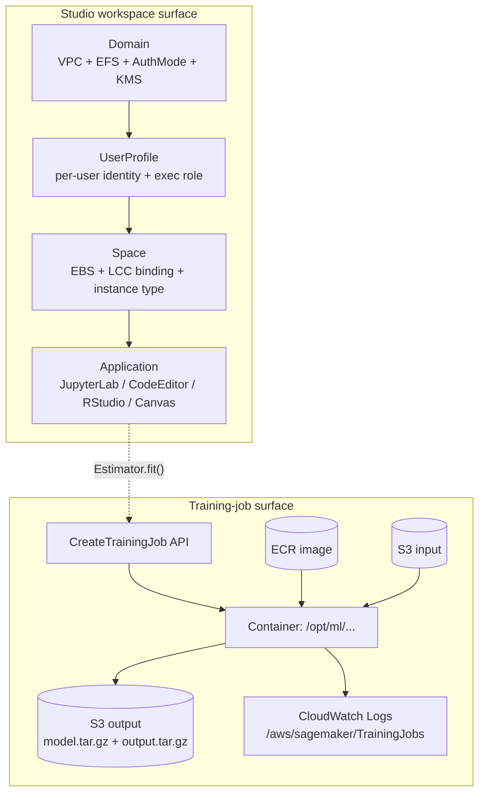
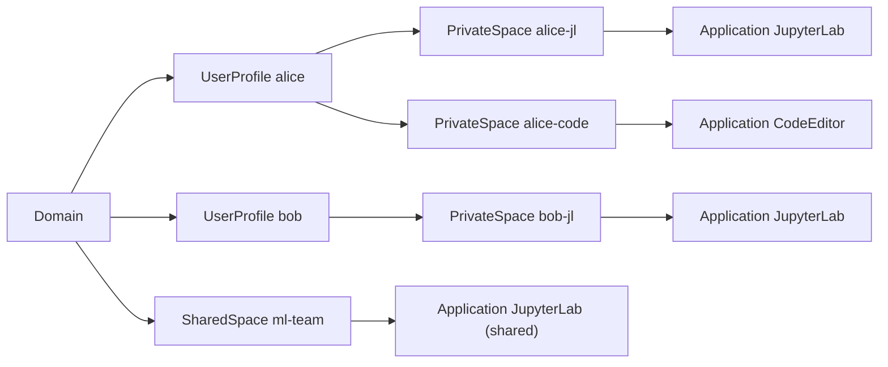
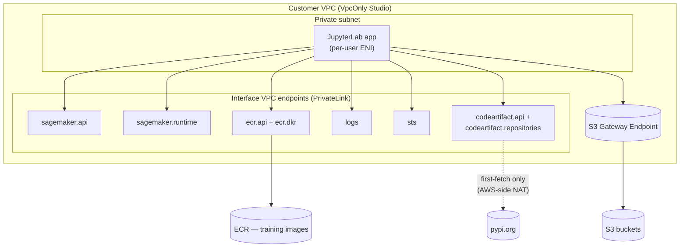
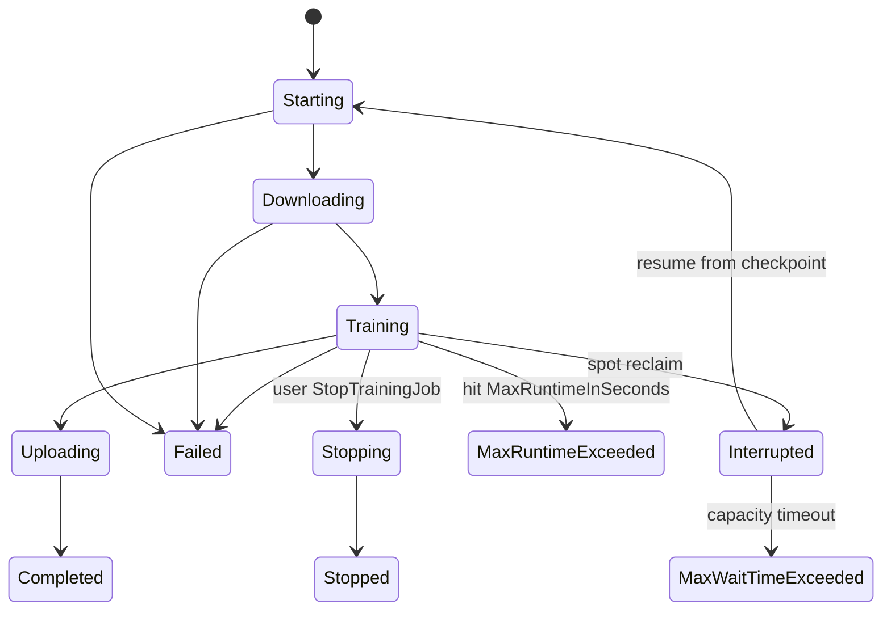

# Chapter 22 — SageMaker Studio Anatomy & the Training-Job Lifecycle

> **Goal of this chapter.** Studio is the IDE you sit in for the rest of Part E, and the training job is the API the rest of Part F orchestrates around. **Understanding Studio is understanding SageMaker** — not because the IDE itself is conceptually deep, but because the object hierarchy it imposes (Domain → UserProfile → Space → Application), the IAM execution-role pattern it expects, the VPC posture it forces you to choose at creation time, and the container contract it speaks to training jobs are the same primitives every later chapter will compose. Almost every "why did my notebook break" or "why did `Estimator.fit()` hang for ten minutes and return `AccessDenied`" question on the MLA-C01 exam reduces to one of these primitives. This chapter pays the bill — by the end of it you will be able to recite the object model from memory, diagnose the three classic VPC-only Studio failures, walk a training job through its `TrainingJobStatus × SecondaryStatus` state machine, and explain to a CFO why a forgotten `ml.r5.4xlarge` cost $14,000 over a long weekend.

---

## 22.1 Why this is the gateway chapter to Part E

The earlier chapters of the book have been a tour of the *plumbing* underneath SageMaker — IAM (Ch 5), S3 (Ch 6), VPC (Ch 7), KMS (Ch 8), compute primitives (Ch 9), data formats and storage choices (Ch 10–11), data ingestion and prep (Ch 12–21). With Part E we cross into SageMaker proper: the workspace you actually click into, the training job you actually fire off, the hyperparameter-tuning loop you wrap around it, the distributed-training topology you scale it across. Every one of those topics assumes you already know two things:

1. **What a Studio Domain is**, what objects live inside it, which of those objects are immutable after `CreateDomain`, and which of them are billing line-items.
2. **What a training job looks like from the inside of the container** — which directories SageMaker creates under `/opt/ml/`, what environment variables it injects, what gets uploaded back to S3 when the job ends, and which CloudWatch log group catches your `print` statements.

That is what this chapter installs. Five competencies it should leave you with:

1. Pick the right *workspace product* (Studio unified vs Studio Classic vs Notebook Instance) for a given scenario and justify the choice on cost, networking, multi-tenancy, and migration grounds.
2. Recite the **Domain → UserProfile → Space → Application** object hierarchy and know which properties are immutable after `CreateDomain`. (The exam loves "after creating a domain in `PublicInternetOnly` mode, how do you switch to `VpcOnly`?" trick questions — and the answer is always "create a new domain.")
3. Diagnose the three classic VPC-only Studio failures: *pip install hangs*, *`CreateTrainingJob` fails with no ECR route*, *KernelGateway can't reach JupyterServer*.
4. Reason about the **training-container contract** — the exact paths under `/opt/ml/` that SageMaker creates, the JSON files in `/opt/ml/input/config/`, the `SM_*` environment variables your `train.py` reads, and what gets uploaded as `model.tar.gz` versus `output.tar.gz`.
5. Read a training-job lifecycle state machine (`InProgress → Stopping → Stopped` vs `Completed` vs `Failed`) and its CloudWatch fingerprint (`/aws/sagemaker/TrainingJobs` log group, with one stream per node per job).

These five are also what makes the difference on the job between an ML engineer who can run `Estimator.fit()` and one who can debug a stuck job at 2 a.m. — a difference the exam tests on every form.



The left lobe (workspace) and the right lobe (training job) are joined by exactly one arrow — the dotted `Estimator.fit()` call. The whole rest of the chapter is a tour of what each box on that diagram actually means and how SageMaker hides the API plumbing behind the SDK arrow.

---

## 22.2 The three "Studios" — which is which, in 2026

A perennial source of exam confusion (and real-world support tickets) is that AWS has shipped *three* generations of interactive workspace product under names that overlap. The naming pile-up:

| Product | Other names | Released | Status (May 2026) |
|---|---|---|---|
| **Notebook Instance** | "SageMaker notebook", "the old notebook" | 2017 | GA, maintenance-only, generally not recommended for new work |
| **Studio Classic** | "Studio", "the old Studio" (pre-Nov-2023) | 2019 | GA but renamed *Classic* on **Nov 30, 2023**; kernel-start disabled **Feb 1, 2025**; existing apps that were already running keep running until you stop them, then no restart |
| **Studio (unified, new)** | "the new Studio", "Studio 2.0", "SageMaker Studio" | November 2023 | **Current default**; what `CreateDomain` provisions in new accounts since July–Aug 2024 |

And then in late 2024 the umbrella service was further reorganized: the historical "Amazon SageMaker" was **renamed Amazon SageMaker AI on December 3, 2024** (re:Invent), and the new name "Amazon SageMaker" was given to a *higher-level* unified platform that bundles SageMaker AI together with EMR, Glue, Athena, Redshift, MWAA, and Bedrock under one console and one IAM scope. **For the MLA-C01 exam, "SageMaker" overwhelmingly means SageMaker AI** — when in doubt that's the safe parse.

### 22.2.1 Studio (unified) — the current default

**Mental model.** Unified Studio is no longer a *single* JupyterLab — it is a **router** that launches one of several **Applications** on demand. The applications you can launch are:

| Application | What it is |
|---|---|
| **JupyterLab** | Modern JupyterLab 4.x, backed by the AWS-maintained *SageMaker Distribution* image (PyTorch / TF / JAX / HF / SciPy / AWS SDKs all pinned together) |
| **Code Editor** | An IDE based on **Code-OSS**, the open-source upstream of VS Code (MIT-licensed). Same key bindings, extension API, settings sync model. GA in 2024. |
| **RStudio (RStudioServerPro)** | Posit's commercial RStudio Pro server, requires a Posit licence linked to the domain |
| **Canvas** | No-code ML for business users; runs as its own app per user profile |
| **Studio (Classic)** | The pre-2023 Studio Classic, embedded as a single app for migration purposes |

This list is *the* most testable workspace fact: if a question asks which IDEs Studio supports, "VS Code-derived editor *and* JupyterLab *and* RStudio *and* Canvas" is the right answer, not just "JupyterLab." A single domain can host all four IDE flavors for different user profiles — a data scientist on JupyterLab, an MLE on Code Editor, a stats team on RStudio, a business analyst on Canvas — without provisioning four separate platforms. The execution role, the VPC, and the network plumbing are shared.

### 22.2.2 Studio Classic — the legacy experience

Studio Classic is the pre-November-2023 single-tab UI with KernelGateway-backed kernels and per-image conda environments. It's still *technically reachable* in 2026 — as an embedded application in unified Studio — but on a strict glide path:

- **December 31, 2024** — last day to create new Classic notebooks on JupyterLab 3.
- **February 1, 2025** — Classic can no longer *start* kernels. Existing kernels keep running; you can shut them down but not restart.
- **2026** — Classic is frozen, no security patches beyond critical. Any new project on Classic is borrowed time.

A handful of features still live only in Classic as of mid-2026: **Autopilot UI** (in migration to Canvas), **Experiments Classic**, certain **SageMaker Projects** templates. For those, AWS provides a Classic-as-app launch tile inside unified Studio. Otherwise: don't start anything new here.

**Migration gotchas (exam-relevant).** EFS files in `/home/sagemaker-user/` carry over (same EFS), but **conda environments do not** — custom kernels need to be re-installed in the new JupyterLab app or packaged as a custom image. Classic LCCs do **not** automatically apply to JupyterLab apps; you must re-attach them as the new `JupyterLab` LCC type. The IAM execution role can be reused as-is, but the domain auth mode cannot be changed retroactively (IAM → IdC requires a fresh domain).

### 22.2.3 Notebook Instance — the original "give me a Jupyter VM"

A managed, single-tenant EC2 instance with Jupyter pre-installed and the `sagemaker` Python SDK pre-configured. The 2017-era predecessor to Studio. Still GA in 2026 but **not recommended for new work** — and the exam uses it as a distractor in scenarios that are obviously better-fit by Studio.

| | Notebook Instance | Studio (unified) |
|---|---|---|
| Storage | Single EBS volume on the instance | EBS per Space + (optional) EFS shared across users in the domain |
| User model | One IAM principal accesses one instance | Domain with many users; per-user EFS dirs |
| Multi-tenancy | None (instance is single-tenant) | Domain isolates users via execution roles + per-profile dirs |
| Cost shape | Billed while instance is `InService` (no built-in idle shutdown) | Billed per app-hour per Space; built-in idle shutdown native |
| LCC API | `CreateNotebookInstanceLifecycleConfig` (separate API), with `OnCreate` and `OnStart` scripts | `CreateStudioLifecycleConfig` (different API), `OnStart` only |
| Timeout for LCC scripts | **5 minutes** | **15 minutes** |
| Direct internet access | Default `Enabled` (set `DirectInternetAccess=Disabled` for VPC-only) | Per-domain `AppNetworkAccessType`: `PublicInternetOnly` or `VpcOnly` |

> ⚠️ **Exam alert — the 5-min vs 15-min LCC timeout.** If a question describes a Studio app failing after a long pip install in a lifecycle script, the answer is "your LCC exceeded the 15-minute timeout — background the install or move to a custom image." If the same scenario is on a Notebook Instance, the timeout is **5 minutes**, not 15. This trips up at least one question on every form.

### 22.2.4 When is a Notebook Instance still the right answer?

Honest answer: rarely. The narrow cases:

- A customer has a hard requirement for a *single dedicated EC2 instance* they fully control (e.g., legacy IAM tooling that doesn't understand the Studio app model, or audit policy that needs SSH-via-SSM).
- A small lab account that just wants one machine and doesn't need user profiles, shared spaces, or domain governance.
- A specific Python or kernel version that isn't in the SageMaker Distribution image *and* the team doesn't want to build a custom Studio image.

For everything else, the modern answer is "use Studio with JupyterLab Spaces." The migration path AWS implicitly recommends: NI → new Studio → (optionally) Unified Studio. Greenfield teams can skip straight from nothing to new Studio or Unified Studio.

---

## 22.3 The Domain → UserProfile → Space → Application object model

This is the object hierarchy *every* unified Studio question is implicitly testing. Memorize it — and memorize which properties are immutable after `CreateDomain`, because that's where most of the trick questions live.



### 22.3.1 Domain — the SageMaker AI tenancy boundary

Created with `aws sagemaker create-domain`. A Domain owns:

- **Authentication mode**: `IAM` *or* `SSO` (IAM Identity Center). **Immutable** after creation — switching modes requires recreating the domain.
- **Networking**: `VpcId`, `SubnetIds`, `AppNetworkAccessType` (`PublicInternetOnly` default or `VpcOnly`). **All immutable.**
- **KMS encryption**: `KmsKeyId` for the domain's EFS volume. **Immutable.**
- **Default execution role** (`DefaultUserSettings.ExecutionRole`): inherited by user profiles that don't override it.
- **Default space settings**: instance type defaults, EBS size, lifecycle-config bindings for shared spaces.
- **Default user settings**: per-user defaults — JupyterLab image list, Code Editor image list, idle settings.

> ⚠️ **Exam alert — Domain immutability traps.** `AuthMode`, `VpcId`, `SubnetIds`, `AppNetworkAccessType`, and `KmsKeyId` are *all* immutable after `CreateDomain`. Question shapes you'll see: *"You want to switch a domain from IAM to IdC auth"* → answer is **create a new domain**. *"You want to convert a `PublicInternetOnly` domain to `VpcOnly`"* → answer is **create a new domain**. *"You want to add a second VPC to host more user subnets"* → answer is **create a new domain (or use a second domain)**. There is no UpdateDomain that fixes these. AWS exam writers love this category because the wrong answer ("call UpdateDomain with the new value") sounds plausible.

**Soft quota.** "One domain per region per account" was a *hard cap* in Studio Classic. In unified Studio it's a *soft* default; the limit has been raised but a service-quota request is required to go higher. For exam purposes, treat "one domain per region per account" as the safe default unless the question explicitly mentions a quota increase.

### 22.3.2 UserProfile — a user identity inside the domain

Owns:

- Its own optional `ExecutionRole` override.
- Its own EFS home directory under `/home/sagemaker-user/<profile-name>` (Classic; less central in new Studio where Spaces own EBS).
- Tags that propagate to spawned apps (used for cost allocation by user).

With `AuthMode=IAM` the UserProfile maps to an IAM principal that calls `CreatePresignedDomainUrl` to get a sign-in link. With `AuthMode=SSO` it maps to an IdC user. Cross-domain UserProfile sharing does not exist — if Alice is on two teams that map to two domains, she needs two profiles, and her home volume is duplicated.

### 22.3.3 Space — the *new* object you might not know about

A **Space** (added with unified Studio in 2023) is the scoping object that owns the **EBS volume**, **lifecycle-config bindings**, and **instance type** for one or more applications. Two flavors:

- **Private Space** — scoped to a single user. Each Space owns one EBS volume (default 5 GB, 3000 IOPS, 125 MB/s throughput per the JupyterLab user guide). The volume persists across application restarts and even instance-type changes, so you can scale CPU↔GPU without losing files.
- **Shared Space** — multiple users in the same domain collaborate in real time on the same JupyterLab application. Useful for pair-programming or live debugging sessions. (Note: "shared" is *across users within one customer's domain* — it does not mean multi-tenant from an AWS perspective.)

The Space-vs-App distinction matters because **the EBS volume is owned by the Space, not the App**. If you delete and recreate the JupyterLab app inside a Space, your files persist. If you delete the Space, the EBS volume goes too. This is one of the most common cleanup mistakes — a frustrated user "deletes the notebook" by deleting the wrong object.

### 22.3.4 Application — the actual running compute

A long-running interactive process. Each app runs as its own EC2/Fargate-backed compute and is billed per-second. Studio's *Idle Shutdown* timer (default off, configurable from 60 minutes up to ~525,600 minutes ≈ 1 year, recommended 60 minutes for cost control) automatically stops an app whose kernels and terminals have been idle for the configured period. This setting lives at the user-profile or app level under `IdleSettings` and **requires SageMaker Distribution image 2.0+** to take effect at the kernel level.

> **Exam-grade idle-shutdown fact.** Idle shutdown was a September 2024 addition to *unified Studio only*. Pre-2024, and still today for Notebook Instances and Studio Classic, the standard answer to "how do I stop my Studio bill from growing while I'm in meetings?" is a custom EventBridge + Lambda script (or the `sagemaker-studio-auto-shutdown-extension` LCC, in the case of Classic). In 2026 unified Studio it's a native checkbox.

### 22.3.5 Shared Spaces — the 2024 collaborative addition

Shared Spaces deserve a paragraph of their own because they are the surface that turned Studio from "an IDE for one scientist" into "an IDE for a team." A Shared Space lets multiple user profiles in the same domain attach to the *same JupyterLab application* and see each other's edits in near real time — think Google Docs for notebooks, with cursors, presence indicators, and conflict resolution. The compute is one app instance billed once. This makes shared spaces the right choice for: pair-programming, post-mortems on a failed training run where two engineers want to look at the same notebook together, demo-driven kickoff sessions for new hires, and live customer-support sessions where AWS solutions architects walk a customer through code. **Limitations**: the underlying EBS volume is owned by the Space (not by either user), Code Editor support is more recent than JupyterLab support and not at full feature parity, and execution-role permissions are still scoped to the *Space's* execution role rather than to the individual users — meaning any user in the shared space can call any AWS API the shared execution role grants, so you should treat shared-space execution roles as more restrictive than private-space ones.

---

## 22.4 JupyterLab, Code Editor, RStudio — the application surface in detail

The three first-party IDE applications inside unified Studio have different developer ergonomics but share the same Domain/Space/IAM substrate. Knowing where each one is the right answer is part of the exam's `Task 2.2` ("train and refine models") surface area.

### 22.4.1 JupyterLab

The default. Backed by the **SageMaker Distribution** image, which AWS maintains as a single Docker image with PyTorch, TensorFlow, JAX, HuggingFace, scikit-learn, the AWS SDKs, and the SageMaker Python SDK all pinned together. The image is versioned (`public.ecr.aws/sagemaker/sagemaker-distribution:2.0-cpu` / `-gpu`) and updated quarterly. For most teams this is "open a notebook, write `import pandas`, it works." Ships with the **Jupyter AI extension** for in-IDE LLM assistance against Bedrock or third-party providers.

### 22.4.2 Code Editor (Code-OSS)

A 2024 addition. Built on Code-OSS, the MIT-licensed open-source core of VS Code (without the Microsoft-proprietary marketplace, telemetry, or signed extension verification). Settings sync, extensions API, key bindings, and the integrated terminal are all the same as VS Code. The killer use case is *script-mode training jobs* — you write `train.py` in Code Editor with full IntelliSense, then call `Estimator(entry_point="train.py").fit()` from a one-cell notebook. This is the IDE most MLEs migrate to once they realize they spend more time editing Python scripts than running cells.

### 22.4.3 RStudio (RStudioServerPro)

Posit's commercial RStudio Pro server. Requires a Posit licence linked to the domain (admins purchase it from Posit and register the licence file with the SageMaker domain). The compute model is Sessions — one Session per active R workspace — and **Sessions don't have a default idle timeout and don't shut down on logout**. This is *the* line item that surprises FinOps when an RStudio team rolls out — see §22.9 for the cost gory details. The native idle-shutdown feature (Sept 2024) does *not*, as of mid-2026, cover RStudio sessions; admins still need an explicit LCC.

### 22.4.4 Canvas (no-code ML)

Outside the scope of this chapter (covered in Ch 33), but mention-worthy: Canvas runs as its own app per user profile and is billed per user-session. "Session" extends until explicit logout — most no-code users never log out, they just close the tab. Canvas now has its own idle controls, but they're domain-level and default-off.

---

## 22.5 Lifecycle Configurations (LCC)

Lifecycle configurations are bash scripts that SageMaker runs on app startup to customize the environment — `pip install` of pinned packages, mounting EFS, setting an HTTPS proxy, configuring CodeArtifact, pre-warming a model cache. They are powerful and they are the most common cause of "no user in the domain can open Studio this morning."

### 22.5.1 Studio LCC vs Notebook-Instance LCC

| | Studio LCC | Notebook Instance LCC |
|---|---|---|
| API | `CreateStudioLifecycleConfig` | `CreateNotebookInstanceLifecycleConfig` |
| Hooks | `OnStart` only (runs every app start) | `OnCreate` (once, at instance create) **and** `OnStart` (every start) |
| Timeout | **15 minutes** | **5 minutes** |
| Per-app flavors | Two app types in unified Studio — `JupyterLab` LCC and `CodeEditor` LCC. Studio Classic had three — Jupyter Server, KernelGateway, Studio Classic. | Single script |
| Attachment scope | Domain default, user profile, or single-application override | Per notebook-instance |
| Logs | CloudWatch `/aws/sagemaker/studio` → `[domain-id]/[user-profile]/JupyterServer/default/LifecycleConfigOnStart` | CloudWatch `/aws/sagemaker/NotebookInstances` |

### 22.5.2 The LCC anti-pattern AWS warns against

The official JupyterLab user guide explicitly recommends *not* using LCCs for package installs:

> *"Within Studio, you can use lifecycle configurations to customize your environment, but we recommend using a package manager instead. Using lifecycle configurations is a more error-prone method. It's easier to add or remove dependencies than it is to debug a lifecycle configuration script. It can also increase the JupyterLab startup time."*

The recommended pattern is:

1. **Custom Studio image** (BYOI) for any heavy / slow-to-install dependencies — pre-build them once into an ECR image and bind that image to the domain.
2. **conda or pip** *inside the running notebook* for fast iteration on new dependencies.
3. **LCCs kept small** — environment variables, proxy settings, mounting an EFS volume from outside the domain, configuring CodeArtifact tokens. *Not* the place to install PyTorch.

### 22.5.3 Custom Studio images (BYOI)

Build a Docker image that satisfies the [Studio image spec](https://docs.aws.amazon.com/sagemaker/latest/dg/studio-byoi.html) — must include `glibc`, a valid `KERNEL_NAME`, `JUPYTER_SERVER_TIMEOUT`, and a known set of base packages. Push to ECR, register it as a `SageMakerImage` with one or more `SageMakerImageVersion`s, then attach to the domain or user profile.

```dockerfile
FROM public.ecr.aws/sagemaker/sagemaker-distribution:2.0-cpu
USER root
RUN pip install --no-cache-dir \
    risk-models==4.2.1 \
    internal-utils==2.0.0 \
    bcrypt==4.1.2
USER sagemaker-user
```

Use cases:

- Pinned framework versions that differ from the SageMaker Distribution image.
- Internal Python packages from a private wheel index (CodeArtifact, see §22.6).
- CIS-hardened or DISA-STIG-compliant base images for regulated environments.
- "Bake the heavy stable layer, let users `pip` the light flavor layer on top" — the hybrid pattern most mature teams converge on.

### 22.5.4 The four LCC failure modes you will see in production

1. **Silent crash (`set -e` not set)** — your script fails on line 7, exits 0, the app spins forever. *Mitigation*: every LCC starts with `set -eux` (exit on error, expand vars, trace each line). The trace is what makes the CloudWatch logs actually useful.
2. **5/15-minute timeout exceeded** — usually because someone tried `pip install transformers` (which pulls 5 GB of CUDA wheels) on a domain with no PyPI mirror, no NAT, and no CodeArtifact. Studio refuses to start. *Mitigation*: move heavy installs to a custom image (§22.5.3).
3. **EFS mount target deleted** — a platform engineer "cleans up unused VPC resources" and deletes the EFS mount targets for the Studio EFS. Every user in the domain is locked out the next time they try to start Studio. *Mitigation*: recreate mount targets in each subnet the domain operates in. (This applies only to Classic; new Studio replaces shared EFS with per-app EBS, eliminating this failure mode entirely. Another reason to migrate.)
4. **KMS rotation without domain config update** — your domain uses a customer-managed KMS key for EFS encryption, you rotate/replace the key without updating the domain config, every existing user's home volume becomes inaccessible. KMS errors are subtle; they show up as "permission denied" reading the home directory. *Mitigation*: never rotate the Studio KMS key without the same-day plan to update the domain.

---

## 22.6 Studio in VPC mode — the "pip install fails" trap

This is where 80% of real-world Studio outage tickets originate, and the exam tests it heavily.

### 22.6.1 PublicInternetOnly vs VpcOnly

`AppNetworkAccessType` is set at domain creation time and is *immutable*. The two values:

- **`PublicInternetOnly`** (default) — Studio provisions a managed network interface that gives apps internet access through an *AWS-managed VPC*. Traffic to AWS services (S3, CloudWatch) and to SageMaker API/runtime goes through an internet gateway in AWS's VPC. Traffic between the domain and the EFS volume goes through *your* VPC. Easy, but apps can reach anywhere on the internet — usually a no-go in regulated environments.
- **`VpcOnly`** — no AWS-managed network interface. *All* app traffic goes through your VPC. Apps cannot reach the internet unless you give them a route (NAT gateway, VPC endpoints, etc.).



### 22.6.2 The pip-install-fails trap

A team enables `VpcOnly`, launches JupyterLab, runs `!pip install pandas-profiling` and… the call hangs for ~60 seconds and then errors with `Could not find a version that satisfies the requirement` or `Failed to establish a new connection`. The cause: pip is trying to reach `pypi.org` over HTTPS, but the private subnet has no route to the internet.

**Three legitimate fixes, in order of how regulated organizations actually do it:**

1. **NAT Gateway with internet access** — the VPC gets a public subnet + NAT gateway, private subnets route `0.0.0.0/0` to the NAT. JupyterLab can reach `pypi.org`. Simple, but you've effectively re-introduced internet access; security teams may reject this.
2. **AWS CodeArtifact as a PyPI upstream mirror** — provision a CodeArtifact repository, configure PyPI as the upstream. Once cached, packages are served from CodeArtifact via a VPC endpoint. Configure pip via `~/.pip/pip.conf` or `aws codeartifact login --tool pip` in an LCC. This is the **AWS-recommended pattern** for regulated environments: you keep the air gap, but get a curated, auditable, cached mirror of PyPI. Bonus: works for npm, Maven, NuGet.
3. **Custom Studio image with packages pre-installed** — bake the wheelhouse into the ECR image. Works fine for stable dependency sets but is awkward for "the data scientist needs one more package right now."

In practice, mature shops do (2) + (3): CodeArtifact for ad-hoc installs, custom image for the standard stack.

> ⚠️ **Exam alert — VpcOnly + CodeArtifact is the canonical fix.** When the exam scenario combines "regulated environment," "no internet route from notebooks," and "data scientists still need to `pip install`," the right answer is almost always **CodeArtifact as a private PyPI proxy reached via PrivateLink**. The NAT Gateway answer is a distractor because it violates the "no internet" constraint. The custom-image answer is also a distractor because it doesn't address the "ad-hoc install" requirement. Bandersnatch (a self-hosted PyPI mirror tool) appears as another distractor — it works, but it's never the AWS-recommended answer.

### 22.6.3 The canonical CodeArtifact LCC

The LCC that writes `~/.config/pip/pip.conf` so every new kernel inherits the proxy:

```bash
#!/bin/bash
set -eux

DOMAIN=ml-platform
REPO=internal-pypi
ACCT=$(aws sts get-caller-identity --query Account --output text)

aws codeartifact login --tool pip   --domain $DOMAIN --domain-owner $ACCT --repository $REPO
aws codeartifact login --tool twine --domain $DOMAIN --domain-owner $ACCT --repository $REPO
```

The CodeArtifact token is short-lived (12 hours) and obtainable via the kernel's execution role — no static credentials. The repository policy can allow `pandas/*` but block `crypto-mining-coin/*` declaratively, which is the property security teams want.

### 22.6.4 VPC endpoints required for VpcOnly Studio

Per `studio-notebooks-and-internet-access.html`, the following interface endpoints (AWS PrivateLink) are required for a *functional* VpcOnly Studio:

| Service | Endpoint name | Why |
|---|---|---|
| SageMaker API | `com.amazonaws.<region>.sagemaker.api` | All control-plane calls (CreateApp, CreateTrainingJob, etc.) |
| SageMaker runtime | `com.amazonaws.<region>.sagemaker.runtime` | Required to run Studio notebooks and to invoke endpoints |
| Amazon S3 | `com.amazonaws.<region>.s3` (**gateway** endpoint) | Read/write training data, model artifacts |
| AWS STS | `com.amazonaws.<region>.sts` | SDK assumes roles for remote training |
| CloudWatch Logs | `com.amazonaws.<region>.logs` | SDK streams training-job logs back to the notebook |
| Amazon ECR (API + Docker) | `com.amazonaws.<region>.ecr.api` + `.ecr.dkr` | Pull container images for training/inference |
| Service Catalog (optional) | `com.amazonaws.<region>.servicecatalog` | SageMaker Projects |
| CodeArtifact (optional) | `com.amazonaws.<region>.codeartifact.api` + `.codeartifact.repositories` | Mirroring PyPI |

**Common omission failure**: leaving out CloudWatch Logs. The job runs, but `Estimator.fit(wait=True)` hangs forever — because the SDK is trying to tail logs that can never reach it. The exam phrases this as *"`Estimator.fit(wait=True)` never returns, but DescribeTrainingJob shows the job is Completed"*; the answer is a missing `logs` interface endpoint.

### 22.6.5 The security-group gotcha

AWS docs explicitly warn against reusing a *domain-level* security group for user profiles, because if that SG allows inbound access to itself, all apps in the domain can talk to each other unauthenticated. The recommended pattern is **per-user-profile security groups**, each allowing:

- NFS over TCP/2049 to/from the EFS mount-target SG.
- TCP within the SG on ports 8192–65535 (JupyterServer ↔ KernelGateway connectivity in Classic; less relevant for unified Studio's JupyterLab app, but the rule pattern still applies).

### 22.6.6 "KernelGateway can't reach JupyterServer"

A common Studio-Classic-in-VPC failure: the KernelGateway app shows `InService` in the console, but opening a notebook hangs at "Connecting to kernel." Root cause is almost always a **firewall blocking websockets** or a missing SG rule on the high ports (8192–65535). Fix: allow websocket upgrades on the corporate proxy and verify the SG allows TCP/8192–65535 within itself.

---

## 22.7 IAM execution roles — the three-role model

In a typical Studio + training workflow there are **at least three** IAM roles in play, and confusing them is the #1 cause of `AccessDenied` debugging sessions:

1. **The user's IAM principal** — their console login or assumed role. Must have `sagemaker:CreatePresignedDomainUrl` (to launch Studio) and `sagemaker:CreateApp` (to start a JupyterLab / Code Editor app).
2. **The Studio execution role** — the role assigned at the domain or user-profile level. *This is the role that runs inside the JupyterLab app.* When you call `sagemaker.Session().get_execution_role()` in a Studio notebook, this is the ARN that comes back.
3. **The training/processing/transform job role** — the role passed to `CreateTrainingJob` as `RoleArn`. Often the *same* as #2, but doesn't have to be. **#2 needs `iam:PassRole` permission on #3** for the SDK to be able to launch jobs.

**AWS-managed policies worth knowing by name:**

- `AmazonSageMakerFullAccess` — overly broad, fine for sandbox / lab; do *not* attach to production execution roles.
- `AmazonSageMakerCanvasFullAccess` — for Canvas users.
- `AmazonSageMakerReadOnly` — auditor access.
- `AmazonSageMakerGroundTruthExecution` — for Ground Truth labeling workers.

**Critical exam facts:**

- `AmazonSageMakerFullAccess` does **not** grant Bedrock or Q access — those need separate policies.
- `iam:PassRole` is the single most-missed permission. Without it, `CreateTrainingJob` will fail even if SageMaker has `sagemaker:*`. The error reads: `User: ... is not authorized to perform: iam:PassRole on resource: ...`.
- KMS keys used for S3, EBS, or training-job volumes must have *both* the execution role and the SageMaker service principal in their key policy.
- **VPC mode + customer-managed KMS + cross-account S3** is the classic three-way gotcha: you need bucket policy + KMS grant + IAM permission all aligned.

Chapter 5 walked the IAM/PassRole mechanics; this is the chapter where they bite first.

---

## 22.8 The training-job container contract

Now we cross from "workspace" to "training." The contract is *the* single most important piece of SageMaker exam knowledge, because every training-related question implicitly assumes you know it. If you remember nothing else from this chapter, remember §22.8 and §22.10.

### 22.8.1 The big picture

A SageMaker training job is a *transient* containerized compute workload. When you call `CreateTrainingJob`, SageMaker:

1. Provisions one or more EC2 instances (or warm-pool instances) per `ResourceConfig`.
2. Pulls the Docker image specified in `AlgorithmSpecification.TrainingImage` from ECR onto each instance.
3. Downloads input data from S3 / EFS / FSx for Lustre to `/opt/ml/input/data/<channel>/` per the chosen `TrainingInputMode`.
4. Writes hyperparameters to `/opt/ml/input/config/hyperparameters.json`, input data config to `/opt/ml/input/config/inputdataconfig.json`, and (for distributed jobs) cluster topology to `/opt/ml/input/config/resourceconfig.json`.
5. Runs the container's entry point — `train` for the legacy contract, or `python train.py` (with `SAGEMAKER_PROGRAM` env var) for script mode.
6. Uploads `/opt/ml/model/` to `OutputDataConfig.S3OutputPath` as **`model.tar.gz`**.
7. Uploads `/opt/ml/output/data/` to the same prefix as **`output.tar.gz`** (auxiliary outputs that should *not* be part of the model artifact).
8. Optionally syncs `/opt/ml/checkpoints/` continuously to `CheckpointConfig.S3Uri`.
9. Streams stdout/stderr to CloudWatch Logs at `/aws/sagemaker/TrainingJobs`.
10. Tears down the instances.

### 22.8.2 The `/opt/ml/` directory tree, exhaustively

```
/opt/ml/
├── input/
│   ├── config/
│   │   ├── hyperparameters.json   # All hyperparameters as JSON strings
│   │   ├── inputdataconfig.json   # Per-channel ContentType, TrainingInputMode,
│   │   │                          # S3DistributionType, RecordWrapperType
│   │   └── resourceconfig.json    # current_host, hosts[], network_interface_name
│   │                              # (distributed jobs only — see Ch 25)
│   └── data/
│       ├── <channel>/             # Channel data in File or FastFile mode (mounted dir)
│       └── <channel>_<epoch>      # Channel pipes in Pipe mode (named FIFOs)
├── code/                          # Source code uploaded via source_dir= (script mode)
├── model/                         # ANYTHING saved here becomes model.tar.gz in S3
├── output/
│   ├── failure                    # Text file with failure reason if job fails
│   └── data/                      # Auxiliary outputs → output.tar.gz
├── checkpoints/                   # Continuously synced to CheckpointConfig.S3Uri
└── ephemeral/                     # NVMe scratch on P/G/Trn instances (lost at job end)
```

> ⚠️ **Exam alert — `model.tar.gz` vs `output.tar.gz`.** They are *different* S3 artifacts and confusing them is one of the most common exam traps.
> - `/opt/ml/model/` → **`model.tar.gz`** — gets passed to the *next* step in a pipeline (CreateModel, Hyperparameter Tuning best-model selection, Inference Recommender, Model Registry).
> - `/opt/ml/output/data/` → **`output.tar.gz`** — a side-channel for everything that *isn't* the model: TensorBoard logs, eval predictions, generated plots, custom artifacts your downstream consumers don't expect to be part of the served model.
>
> Putting the model in `/opt/ml/output/data/` means downstream `CreateModel` will not find it and the inference container will start with an empty `/opt/ml/model/`. The job completes successfully, but the model artifact is empty. The exam phrasing: *"After a training job completes, you find `output.tar.gz` contains your `.pth` file but `model.tar.gz` is empty. What did the training script do wrong?"* — answer: it saved to the wrong directory.

### 22.8.3 `hyperparameters.json`

`CreateTrainingJob` accepts a `HyperParameters` dict of string→string. SageMaker materializes it verbatim into `/opt/ml/input/config/hyperparameters.json`. Example:

```json
{
  "num_round": "128",
  "eta": "0.001"
}
```

**All values are strings** — your training code is responsible for parsing them (`int(os.environ['SM_HP_NUM_ROUND'])`). The SageMaker Python SDK wraps this for you when you pass `hyperparameters={'num_round': 128}` to an Estimator, but the underlying contract is string-only.

### 22.8.4 `inputdataconfig.json`

Mirrors the `InputDataConfig` you passed to `CreateTrainingJob`, with one entry per channel:

```json
{
  "train":      {"ContentType": "text/csv", "TrainingInputMode": "File",
                 "S3DistributionType": "FullyReplicated", "RecordWrapperType": "None"},
  "validation": {"ContentType": "text/csv", "TrainingInputMode": "File",
                 "S3DistributionType": "FullyReplicated", "RecordWrapperType": "None"},
  "test":       {"ContentType": "text/csv", "TrainingInputMode": "FastFile",
                 "S3DistributionType": "FullyReplicated"}
}
```

`S3DistributionType` is always `FullyReplicated` for EFS / FSx sources regardless of what you specify (per docs).

### 22.8.5 `resourceconfig.json` — distributed-training rendezvous

For multi-node jobs, SageMaker writes a topology file *on each node*. Example on node 1 of a 3-node cluster:

```json
{
  "current_host": "algo-1",
  "hosts": ["algo-1", "algo-2", "algo-3"],
  "network_interface_name": "eth1"
}
```

Three rules from the docs that the exam may quietly test:

- **Host values can change at any time.** Don't hardcode `"algo-1"` as master rank.
- **Hostname information may not be immediately available.** Add a retry policy on hostname resolution as nodes come online.
- **Do not use `/etc/hostname` or `/etc/hosts`.** They might be inaccurate; always read from `resourceconfig.json`.

These rules show up in distributed-training questions in Ch 25; the file is written here.

### 22.8.6 Training input modes (recap from Chapter 11)

| Mode | Data flow | Best for | Limitation |
|---|---|---|---|
| **File** | SageMaker downloads the whole channel to local disk before starting | Small/medium datasets that fit on disk; algorithms that random-access the data | Wastes time on startup; needs disk space |
| **FastFile** | Lazy S3 mount via FUSE — files appear in `/opt/ml/input/data/<channel>/` but are streamed on read | Large datasets where you don't read everything; sequential or sparse-random access | Read-only; S3 only; `S3DataType` must be `S3Prefix` |
| **Pipe** | Named FIFOs at `/opt/ml/input/data/<channel>_<epoch>` — algorithm reads sequentially | Built-in algorithms that support it (Linear Learner, XGBoost on RecordIO, etc.) | Sequential only; can't seek; algorithm must support it |
| **Managed Files** (FSx Lustre / EFS) | Filesystem mounted at `/opt/ml/input/data/<channel>/` | Repeated training on the same dataset; multi-node POSIX semantics | Cost of FSx/EFS; setup complexity |

Mode is set per channel via `TrainingInputMode` in `InputDataConfig`. The `AlgorithmSpecification.TrainingInputMode` is a *default* if a channel doesn't specify one.

**2024 capability**: S3 Express One Zone directory buckets are supported as a training input location for File, FastFile, and Pipe mode. Caveat: **only SSE-S3** is supported for output to directory buckets (no SSE-KMS).

Chapter 11 walked the trade-off matrix; this section is a placeholder you'll be glad to find here when you forget which mode wraps which.

### 22.8.7 The `SM_*` environment variables (script mode)

When you use script mode (`Estimator(entry_point='train.py', source_dir='./src/')`), the SageMaker Training Toolkit injects a set of environment variables into the container so your `train.py` doesn't have to parse the JSON files itself:

| Variable | Value |
|---|---|
| `SM_MODEL_DIR` | `/opt/ml/model` |
| `SM_OUTPUT_DIR` | `/opt/ml/output` |
| `SM_OUTPUT_DATA_DIR` | `/opt/ml/output/data` |
| `SM_INPUT_DIR` | `/opt/ml/input` |
| `SM_CHANNELS` | JSON array of channel names: `["train", "validation"]` |
| `SM_CHANNEL_TRAIN`, `SM_CHANNEL_VALIDATION`, … | `/opt/ml/input/data/train`, `/opt/ml/input/data/validation`, … (one per channel) |
| `SM_HPS` | JSON dict of all hyperparameters |
| `SM_HP_<NAME>` | Individual hyperparameter values (e.g., `SM_HP_LEARNING_RATE`) |
| `SM_RESOURCE_CONFIG` | The contents of `resourceconfig.json` as a JSON string |
| `SM_HOSTS` | JSON array of hosts (same as `resourceconfig.json` `hosts[]`) |
| `SM_CURRENT_HOST` | This host's identifier (e.g., `"algo-1"`) |
| `SM_NUM_GPUS` | Number of GPUs on this instance |
| `SM_NUM_CPUS` | Number of CPUs on this instance |
| `SM_USER_ARGS` | JSON-encoded list of user-supplied args (hyperparameter overrides) |
| `TRAINING_JOB_NAME` | The `TrainingJobName` from `CreateTrainingJob` |
| `TRAINING_JOB_ARN` | The full ARN |

Additional environment variables specified in the `Environment` parameter of `CreateTrainingJob` are also injected verbatim.

The canonical script-mode `train.py` is therefore:

```python
import os, json, argparse

if __name__ == "__main__":
    p = argparse.ArgumentParser()
    p.add_argument("--learning-rate", type=float,
                   default=float(os.environ.get("SM_HP_LEARNING_RATE", 0.001)))
    p.add_argument("--epochs", type=int,
                   default=int(os.environ.get("SM_HP_EPOCHS", 10)))
    p.add_argument("--model-dir",  type=str, default=os.environ["SM_MODEL_DIR"])
    p.add_argument("--train",      type=str, default=os.environ["SM_CHANNEL_TRAIN"])
    p.add_argument("--validation", type=str, default=os.environ["SM_CHANNEL_VALIDATION"])
    args = p.parse_args()
    # ... train ...
    # SAVE THE MODEL TO args.model_dir
    # anything you save here becomes model.tar.gz
```

**Exam-grade memorization target**: `SM_NUM_GPUS`, `SM_HOSTS`, `SM_CURRENT_HOST`, `SM_MODEL_DIR`, and `SM_CHANNEL_<NAME>` are the five you most commonly use directly in distributed-training boilerplate, and the five the exam most often asks about by name.

### 22.8.8 The legacy `train` executable contract (BYOC)

If you bring your own container *without* using the Training Toolkit, SageMaker's contract is brutally simple: there must be an executable named **`train`** on `$PATH` (typically `/usr/bin/train` or `/opt/program/train`). SageMaker invokes it with **no arguments**. Success is signaled by exit code 0; any non-zero exit causes the job to be marked `Failed`, and `/opt/ml/output/failure` (if your script wrote one) is included in the `FailureReason` field of `DescribeTrainingJob`.

The `train` script is responsible for reading the JSON config files itself, downloading any extra dependencies, and writing the model to `/opt/ml/model/`. The Training Toolkit (when included) wraps this — it exposes the `SM_*` env vars and handles a Python entry point — but is just a convenience layer over the same contract.

### 22.8.9 Output artifacts — what S3 looks like after the job

For a job with `OutputDataConfig.S3OutputPath = s3://my-bucket/training-output/` and `TrainingJobName = my-job-2026-05-26`:

```
s3://my-bucket/training-output/my-job-2026-05-26/
├── output/
│   ├── model.tar.gz         # contents of /opt/ml/model/
│   └── output.tar.gz        # contents of /opt/ml/output/data/  (if non-empty)
└── debug-output/            # SageMaker Debugger artifacts, if Debugger was enabled
```

If `CheckpointConfig` was set, checkpoints land under that *separate* S3 prefix (not under `S3OutputPath`).

### 22.8.10 Script mode vs framework containers vs BYOC

| Approach | When to use | Cost |
|---|---|---|
| **Script mode + framework container** (PyTorch, TF, HuggingFace, XGBoost, …) | 95% of cases — you have a script and want SageMaker to manage the framework | None — these are AWS Deep Learning Containers, free to pull |
| **Built-in algorithm container** (Linear Learner, XGBoost, BlazingText, …) | You can express your problem with one of the ~17 built-ins | None |
| **BYOC** (push your own Docker image to ECR) | You need a runtime AWS doesn't supply (JAX/Flax with bleeding-edge CUDA; proprietary stack) | ECR storage + your build infra |

The framework containers' image URIs follow the pattern `{framework}-{version}-{cpu|gpu}-py{ver}-cu{ver}-ubuntu{ver}-sagemaker` — use `sagemaker.image_uris.retrieve()` to look up the right URI, **never hard-code it**. Hard-coded URIs break when AWS retires an old framework version, and there is a recurring exam question that hands you a Python snippet with a hard-coded image URI and asks "what is the brittleness."

---

## 22.9 Training-job lifecycle — states and CloudWatch

### 22.9.1 The TrainingJobStatus state machine

SageMaker exposes **two** status fields on a training job: `TrainingJobStatus` (the headline state) and `SecondaryStatus` (the fine-grained sub-state). Per `training-job-status.html`:

**TrainingJobStatus** (primary):

| State | Meaning |
|---|---|
| `InProgress` | The job is actively executing one of the secondary stages |
| `Completed` | The job finished successfully (model uploaded to S3) |
| `Failed` | The job hit an error and was terminated; check `FailureReason` and `/opt/ml/output/failure` |
| `Stopping` | A `StopTrainingJob` was issued and SageMaker is shutting down (can take a few minutes for graceful drain) |
| `Stopped` | The shutdown completed |

**SecondaryStatus** (sub-state within `InProgress` or terminal):

| State | What's happening |
|---|---|
| `Starting` | Provisioning EC2 instances, pulling the container image from ECR |
| `Downloading` | Downloading training data per `InputDataConfig` (File mode) or setting up FastFile/Pipe mounts |
| `Training` | The container's entry point is running |
| `Uploading` | Job has finished, `/opt/ml/model/` and `/opt/ml/output/data/` being tarballed and uploaded to S3 |
| `Completed` | Terminal — success |
| `Failed` | Terminal — error |
| `Stopped` | Terminal — user-initiated stop |
| `MaxRuntimeExceeded` | Terminal — hit `MaxRuntimeInSeconds` |
| `MaxWaitTimeExceeded` | Terminal (managed spot) — couldn't get capacity within `MaxWaitTimeInSeconds` |
| `Interrupted` | (managed spot) Spot instance reclaimed mid-job; SageMaker is attempting to resume from checkpoint |

**Transition diagram (happy + failure paths):**



### 22.9.2 CloudWatch Logs

SageMaker streams stdout and stderr from the training container to the **`/aws/sagemaker/TrainingJobs`** log group. One log stream per node per job, named `<TrainingJobName>/<instance-host>` (e.g., `my-job-2026-05-26/algo-1`).

Things you'll find in the log stream:

- Container pull / extraction output.
- The training script's own stdout (your `print` and logger lines).
- The Training Toolkit's startup banner (lists the resolved `SM_*` env vars — useful for sanity-checking).
- For built-in algorithms: per-iteration loss / accuracy / objective metrics (which Automatic Model Tuning parses to decide HPO progress, covered in Ch 24).

**A missing log stream on a multi-node job is diagnostic**: if a 4-node job has only 3 streams under `/aws/sagemaker/TrainingJobs`, the missing node failed before the toolkit could write its banner — almost always a container-pull failure (wrong ECR permissions) or an SG/route-table issue blocking ECR access from that specific subnet.

### 22.9.3 CloudWatch Metrics

Two flavors of metric, both in the `/aws/sagemaker/TrainingJobs` namespace by default:

1. **Algorithm metrics** — extracted from stdout via the `MetricDefinitions` regex you pass to `CreateTrainingJob`. Example: `[{"Name": "train:loss", "Regex": "loss: ([0-9\\.]+)"}]`. Used by Automatic Model Tuning to drive the search. Emitted per regex hit.
2. **Instance metrics** — `CPUUtilization`, `MemoryUtilization`, `GPUUtilization`, `GPUMemoryUtilization`, `DiskUtilization`. Emitted every minute per instance per metric. (These are SageMaker-emitted instance metrics, *not* the EC2-side CloudWatch metrics — SageMaker hides the underlying EC2 instance from you.)

For deeper introspection (per-layer activation histograms, GPU SM utilization, etc.) you use **SageMaker Debugger** (rules) and **SageMaker Profiler** (system + framework profiling). Both are separate from the basic CloudWatch metrics and covered in Ch 30.

### 22.9.4 Stop conditions

Two timeouts on `CreateTrainingJob.StoppingCondition`:

- **`MaxRuntimeInSeconds`** — wall-clock budget the job is allowed to *actually run* (the time SageMaker bills you for). Default 1 day; max 28 days for built-in algorithms, longer for custom. Hitting this causes `SecondaryStatus=MaxRuntimeExceeded`. **Important behavior:** on a normal stop, SageMaker still uploads whatever is in `/opt/ml/model/` — so well-behaved scripts that checkpoint frequently will still produce a usable model artifact even on a timeout-stop.
- **`MaxWaitTimeInSeconds`** — total wall-clock budget *including any time spent waiting for Spot capacity*. Only applicable when `EnableManagedSpotTraining=True`. **Must be ≥ `MaxRuntimeInSeconds`.** Hitting this causes `MaxWaitTimeExceeded`.

> ⚠️ **Exam alert — the `MaxWaitTimeInSeconds ≥ MaxRuntimeInSeconds` invariant.** The API will reject a `CreateTrainingJob` request where `MaxWaitTimeInSeconds < MaxRuntimeInSeconds` when managed spot is enabled. The only meaningful relationship is `MaxWait = MaxRuntime + (how long you'll tolerate waiting for spot capacity)`. Sane default: `MaxWaitTime = MaxRuntime + 3600` (1 extra hour for capacity slack). Common wrong answer on the exam: "set `MaxWait` to half of `MaxRuntime` to save money." The job will never even start; it will fail validation. This invariant is also why managed spot doesn't make sense for *very* short jobs — the spot-capacity wait can dominate the saving.

### 22.9.5 Checkpointing for spot resilience

Managed Spot training is up to ~90% cheaper than on-demand, but Spot instances can be reclaimed by EC2 with two minutes notice. SageMaker handles this gracefully *if* you've configured checkpoints:

```python
from sagemaker.pytorch import PyTorch

estimator = PyTorch(
    entry_point="train.py",
    role=role,
    instance_type="ml.g5.4xlarge",
    instance_count=1,
    framework_version="2.2",
    py_version="py310",
    use_spot_instances=True,
    max_run=3600,                                   # MaxRuntimeInSeconds
    max_wait=7200,                                  # MaxWaitTime ≥ MaxRun
    checkpoint_s3_uri="s3://my-bucket/checkpoints/",
    checkpoint_local_path="/opt/ml/checkpoints",
)
```

Behavior:

- SageMaker sets `CheckpointConfig.LocalPath=/opt/ml/checkpoints` and `S3Uri=s3://...` in the container env.
- A background sync agent watches `/opt/ml/checkpoints/` and continuously uploads any changes to S3.
- **Your training script is responsible for *writing* checkpoints** to `/opt/ml/checkpoints/` on a schedule (every N steps or every epoch). SageMaker doesn't checkpoint for you.
- If the Spot instance is reclaimed, SageMaker pauses the job (`Interrupted`), waits up to `MaxWaitTimeInSeconds` for new capacity, then re-launches the container. **Your script must detect the existing checkpoint in `/opt/ml/checkpoints/` on startup and resume from it** — if it doesn't, the job restarts from scratch and you pay more, not less.

**Spot-savings formula** (reported in `TrainingJobSummary`): `Savings = (1 − BillableTimeInSeconds / TrainingTimeInSeconds) × 100`. Example: `BillableTime=100s`, `TrainingTime=500s` → 80% savings.

**Common interview/exam trap.** *"A training job using managed spot keeps getting interrupted and restarting from scratch. What is the most likely cause?"* — answer: missing checkpoint writes in the training script. SageMaker isn't checkpointing for you; you have to do it.

---

## 22.10 Notebook Instance lifecycle (legacy, but still exam-tested)

Notebook Instances follow a simpler state machine: `Pending → InService → Stopping → Stopped` (with `Failed` / `Updating` / `Deleting` as edges). Key behaviors:

- **LCC `OnCreate`** runs once when the instance is *first* created — used for one-time setup (mount EFS, fetch private repos).
- **LCC `OnStart`** runs every time the instance is started — used for refreshing tokens, re-installing user packages.
- **5-minute LCC timeout** — much shorter than Studio's 15 minutes. If a script exceeds it, the instance fails to start.
- **`DirectInternetAccess`**: `Enabled` (default) or `Disabled`. When disabled, the instance lives entirely in your private subnet — same VPC endpoint requirements as VpcOnly Studio.
- **`SourceCodeRepository`**: associate a CodeCommit, GitHub, or generic git repo URL, and Jupyter pre-clones it into `/home/ec2-user/SageMaker/<repo>` on instance start. The default storage volume is mounted at `/home/ec2-user/SageMaker/` — anything outside it is *not* persisted across `Stop/Start`.
- **Conda environments** are pre-installed per framework; the active kernel determines which Python/CUDA stack is active. You can't mix kernels in one cell — common distractor on the exam.

---

## 22.11 Studio costs and the auto-stop LCC

The first time a CFO or FinOps lead reads the SageMaker Studio bill, they go through five stages. Confusion ("what is a KernelGateway?"), denial, anger (at the data scientist who forgot to shut down `ml.g5.12xlarge`), bargaining ("can we just turn off Studio at night?"), and acceptance (the LCC auto-stop script gets deployed domain-wide).

### 22.11.1 The three line items

Three line items dominate a Studio bill:

1. **App-hours** — billed per second of running app, per instance type. The `ml.t3.medium` apps used for "just opening Studio" are cheap; `ml.g5.2xlarge` JupyterLab apps for fine-tuning are not. Idle shutdown is the primary mitigation.
2. **EFS storage** — the shared `/home/sagemaker-user` filesystem (Studio Classic). Generally a small line item; the gotcha is that deleting an app or user profile does *not* delete the EFS data (so departed users keep accumulating storage cost). Cleanup is a manual `aws sagemaker delete-user-profile` (with `--retention-policy` set appropriately) followed by EFS lifecycle management.
3. **EBS per Space** — each Space owns its EBS volume (default 5 GB, can be larger). Charged per GB-month even when the app is stopped.

### 22.11.2 The cost-surprise gallery

- **Friday-afternoon `ml.r5.4xlarge` left over a long weekend.** ~$1.21/hr in us-east-1, 88 hours ≈ **$106** for one forgotten kernel. Small until you multiply by every Friday at a 200-person ML org.
- **`ml.g5.12xlarge` GPU forgotten because the screen-saver hid the tab.** ~$5.67/hr on-demand. Three days ≈ **$408**, one kernel.
- **`ml.p4d.24xlarge` left from Thursday night to Tuesday morning.** ~$32.77/hr on-demand. 4.7 days ≈ **$3,800** in a single forgotten kernel — and this is the territory of the "$14,000 forgotten kernel" stories that escalate to AWS support.
- **The RStudio session that never ends.** RStudio Sessions don't have a default idle timeout and don't shut down on browser-tab close. The native idle-shutdown shipped Sept 2024 does not, as of mid-2026, cover RStudio Sessions — admins still need an explicit LCC.
- **Canvas left open.** Canvas is billed per user-session; "session" extends until explicit logout. Many no-code users never log out, they just close the tab.

### 22.11.3 The JupyterServer vs KernelGateway billing subtlety

A common bewildered FinOps question: "why is the JupyterServer app free but the kernel costs $5/hour?"

- **JupyterServer app** runs the JupyterLab UI itself, on a free `system` instance type (`ml.t3.medium`-class managed by SageMaker, not billed).
- **KernelGateway app** runs the actual Python/R kernel, on whatever instance type the user picked. **This is what's billed.**
- A user can have *one* JupyterServer and *many* KernelGateway apps simultaneously, each on a different instance type. Each KernelGateway bills independently.

The trap: shutting down the *notebook* (closing the `.ipynb` tab) does not shut down the KernelGateway app. You must shut down the *app* from the Running Terminals and Kernels sidebar, or use the kernel-aware idle-shutdown feature.

### 22.11.4 Native idle-shutdown + the legacy auto-shutdown LCC

Since September 2024, Studio has a **native idle-shutdown** for JupyterLab and CodeEditor apps. The admin sets `IdleSettings` at domain or user-profile level, with `IdleTimeoutInMinutes` (minimum 60, default 60). Requires SageMaker Distribution image 2.0+.

For Classic, for RStudio, and for anything pre-image-2.0, the legacy approach is the `sagemaker-studio-auto-shutdown-extension` lifecycle configuration — a Jupyter Server extension that polls every kernel and shuts it down after `TIMEOUT_IN_MINS` (typically 120). The script is ~30 lines, has been the AWS-sample reference for years, and is *the* item that should be on every new domain on day 1.

**Industry rule of thumb**: any Studio domain without an idle-shutdown policy is leaking budget. A 60-minute idle timeout typically saves **30–60%** of compute cost vs no policy at a typical 200-person org.

---

## 22.12 Git integration — the post-CodeCommit world

### 22.12.1 The CodeCommit deprecation

Beginning **June 6, 2024**, AWS CodeCommit stopped onboarding new customers. Existing customers with at least one repo on that date can still *create new repos*, but accounts that never had a CodeCommit repo can no longer create one. Then in **October 2024**, AWS removed the CodeCommit-backed SageMaker Project templates entirely — new SageMaker Projects must use a third-party Git provider.

This is a "quiet deprecation" — no formal end-of-life date, no formal sunset, just no new customers and no new project templates. The strong industry read: **CodeCommit will be formally end-of-life within 24–36 months**. Treat any new CodeCommit dependency as legacy from day one.

### 22.12.2 GitHub Enterprise via PrivateLink

For a VPC-only Studio domain that needs to talk to GitHub Enterprise (either Cloud with PrivateLink or Server self-hosted), the pattern is:

- **GitHub Enterprise Cloud with PrivateLink**: GitHub provides a PrivateLink endpoint in your VPC. SSH or HTTPS to GHE goes through it; no public internet. Available on the GHE Cloud Enterprise tier only.
- **GitHub Enterprise Server (self-hosted)**: runs on your EC2 or on-prem; Studio reaches it via VPC routing or Direct Connect. Simpler from a connectivity standpoint, much heavier ops.

In Unified Studio, **Git connections are first-class**: an admin creates a connection to GitHub, GHE Server, GitLab, or GitLab Self-Managed at the domain level, and users in projects can clone/push without provisioning credentials themselves. This is a meaningful UX improvement over old Studio, where every user had to add SSH keys to their home directory manually.

### 22.12.3 Practical recommendations

- **Greenfield**: pick GitHub Enterprise Cloud + PrivateLink. Least friction for hiring, CI/CD ecosystem, and AWS first-party integration.
- **Already on CodeCommit**: start the migration plan *now*. Use `git remote set-url` to mirror to GitHub/GitLab; deprecate CodeCommit consumers over 6–12 months.
- **Highly regulated, air-gapped**: GitHub Enterprise Server on EC2 in the same VPC as Studio. More ops, but a single trust boundary.

---

## 22.13 Exam gotchas — chapter cheat sheet

1. **Studio LCC = 15 minutes; Notebook-Instance LCC = 5 minutes.** Tested directly almost every form.
2. **Domain `AuthMode`, `VpcId`, `SubnetIds`, `AppNetworkAccessType`, `KmsKeyId` are all immutable.** "Switch domain from IAM to IdC" → recreate it.
3. **`AppNetworkAccessType: VpcOnly` requires VPC endpoints for SageMaker API, SageMaker runtime, S3 (gateway), ECR (api + dkr), STS, CloudWatch Logs.** A question that omits CloudWatch Logs and asks why `Estimator.fit(wait=True)` hangs is testing this.
4. **`pip install` failing in VpcOnly Studio** → answer is **CodeArtifact PyPI mirror** (canonical) or NAT Gateway (non-air-gapped). Custom image is a slower-iteration option.
5. **EBS belongs to the Space, not the app.** Deleting the app preserves files; deleting the Space loses them.
6. **`iam:PassRole`** is the most-missed permission. The Studio execution role needs `iam:PassRole` on the training-job role even if they are the same role.
7. **`/opt/ml/model/` → `model.tar.gz`; `/opt/ml/output/data/` → `output.tar.gz`.** Different S3 artifacts.
8. **The legacy BYOC entry point is an executable literally named `train`.** With the Training Toolkit (script mode), the entry point is whatever you pass as `entry_point=`.
9. **`hyperparameters.json` values are all strings.** Your code must `int()` / `float()` them.
10. **`resourceconfig.json` host values are not stable** — never hardcode `"algo-1"` as master rank; read the file each time.
11. **`MaxWaitTimeInSeconds ≥ MaxRuntimeInSeconds`** — the API rejects otherwise. Only meaningful when `EnableManagedSpotTraining=True`.
12. **Managed Spot without checkpoints = no resilience.** SageMaker won't save state for you.
13. **CloudWatch log group is `/aws/sagemaker/TrainingJobs`**, one stream per node per job. Memorize the path — it appears in security-review questions about log retention.
14. **`SM_NUM_GPUS`, `SM_HOSTS`, `SM_CURRENT_HOST`** are the three env vars you most commonly use directly in distributed-training boilerplate.
15. **Idle shutdown is unified-Studio-only** — Notebook Instances and Studio Classic need EventBridge + Lambda or the auto-shutdown LCC.
16. **Custom Studio images live in ECR** and are registered as `SageMakerImage` + `SageMakerImageVersion`; they must satisfy the BYOI image spec (glibc, KERNEL_NAME, JUPYTER_SERVER_TIMEOUT, etc.).
17. **CodeCommit is quietly deprecated** (no new customers since June 6, 2024; project templates removed Oct 2024). Treat as legacy. GHE + PrivateLink is the modern equivalent for regulated environments.
18. **JupyterServer is free; KernelGateway is billed.** Shutting down the notebook ≠ shutting down the kernel app.

---

## 22.14 Quick reference — APIs and CLI calls

| What | API | CLI |
|---|---|---|
| Create a Domain | `CreateDomain` | `aws sagemaker create-domain` |
| Create a UserProfile | `CreateUserProfile` | `aws sagemaker create-user-profile` |
| Create a Space | `CreateSpace` | `aws sagemaker create-space` |
| Launch an app inside a Space | `CreateApp` | `aws sagemaker create-app` |
| Generate Studio sign-in URL | `CreatePresignedDomainUrl` | `aws sagemaker create-presigned-domain-url` |
| Studio LCC | `CreateStudioLifecycleConfig` | `aws sagemaker create-studio-lifecycle-config` |
| Notebook LCC | `CreateNotebookInstanceLifecycleConfig` | `aws sagemaker create-notebook-instance-lifecycle-config` |
| Notebook Instance | `CreateNotebookInstance` | `aws sagemaker create-notebook-instance` |
| Training job | `CreateTrainingJob` | `aws sagemaker create-training-job` |
| Stop training job | `StopTrainingJob` | `aws sagemaker stop-training-job` |
| Describe training job | `DescribeTrainingJob` | `aws sagemaker describe-training-job` (look at `TrainingJobStatus`, `SecondaryStatus`, `SecondaryStatusTransitions[]`, `FailureReason`, `BillableTimeInSeconds`) |

---

## 22.15 Exercises

**Exercise 22.1 — Domain immutability triage.** A platform team created a Studio Domain six months ago with `AuthMode=IAM`, `AppNetworkAccessType=PublicInternetOnly`, and an AWS-managed KMS key. The security review now requires (a) IAM Identity Center authentication, (b) `VpcOnly` networking, and (c) a customer-managed KMS key for the EFS volume. For each requirement, state whether it can be applied to the existing domain or requires a new domain. Justify each answer in one sentence. (Hint: read §22.3.1 carefully — every property in the list is on the immutable list.)

**Exercise 22.2 — Diagnose the hung `Estimator.fit()`.** A data scientist in a `VpcOnly` Studio domain runs `estimator.fit(wait=True)`. `DescribeTrainingJob` shows `TrainingJobStatus=Completed` after eight minutes, but the SDK call in the notebook never returns. Identify the most likely missing piece of infrastructure, and write the single `aws ec2 create-vpc-endpoint` invocation that would fix it. (Hint: §22.6.4 lists the required endpoints; cross-reference against what the SDK does *after* the job completes.)

**Exercise 22.3 — The "where did my model go?" mystery.** A training job completes with `TrainingJobStatus=Completed`. Inspecting `s3://my-bucket/training-output/my-job/output/`, you find a `model.tar.gz` of 102 bytes (just an empty tarball) and an `output.tar.gz` of 480 MB containing your `model.pth`. Diagnose the bug in three sentences. Then write the one-line `torch.save(...)` that would have produced the correct artifact placement. (Hint: §22.8.2 — the exam alert.)

**Exercise 22.4 — Spot job is *more* expensive than on-demand.** A team enables `use_spot_instances=True` with `max_run=3600`, `max_wait=7200`, and `checkpoint_s3_uri="s3://.../"` set. Across five runs, the average `BillableTimeInSeconds` exceeds the average `TrainingTimeInSeconds` would have been on-demand, and the spot `Savings` field is reported as 0%. Diagnose the most likely cause. Then list the two lines you would add to `train.py` (one near startup, one inside the training loop) to fix it. (Hint: §22.9.5 — checkpointing is your responsibility, not SageMaker's.)

**Exercise 22.5 — The CodeArtifact LCC.** Write a Studio LCC that (a) sets `set -eux`, (b) logs in to a CodeArtifact repository named `internal-pypi` in domain `ml-platform`, (c) writes the resulting pip configuration to `~/.config/pip/pip.conf` so every subsequent `pip install` in the user's notebooks uses the mirror, and (d) is safe under the 15-minute Studio LCC timeout. Then explain in one sentence why this LCC would *not* work on a Notebook Instance with `DirectInternetAccess=Disabled` (Hint: the `aws codeartifact login` call needs the `codeartifact` PrivateLink endpoint plus a working STS endpoint to obtain the token).

**Exercise 22.6 — MaxWait invariant.** A teammate submits `CreateTrainingJob` with `EnableManagedSpotTraining=true`, `MaxRuntimeInSeconds=10800`, `MaxWaitTimeInSeconds=7200`. The API returns a `ValidationException`. Explain why, in one sentence. Then suggest sane values for both parameters for a *true* spot-resilient training run that you expect to take about three hours, where you're willing to tolerate up to one extra hour of capacity wait.

**Exercise 22.7 — The cost-control rollout.** You are advising a 200-person ML org rolling out unified Studio for the first time. List the five cheapest changes (in dollars and engineering hours) that, in your judgment, will eliminate 80% of the cost-surprise bills described in §22.11. Rank them by "ratio of dollars saved to engineering hours spent" and justify the ranking. At least one of your answers must address the JupyterServer / KernelGateway billing nuance (§22.11.3); at least one must address RStudio's auto-shutdown gap.

---

## 22.16 Where this chapter sits in the book

- **Back to Chapter 5** (IAM for ML): the three-role model (§22.7) is the IAM Chapter applied to Studio specifically. If `iam:PassRole` still feels mysterious, re-read Ch 5 §5.6 — it's the most-missed permission in the entire MLA-C01 surface, and it bites first in this chapter.
- **Back to Chapter 7** (VPC for ML): VPC endpoints, security groups, and PrivateLink (§22.6) are the VPC chapter applied to Studio. The endpoint list in §22.6.4 is the Studio-specific subset of the broader endpoint catalog in Ch 7.
- **Back to Chapter 9** (Compute primitives): the `ml.t3` / `ml.r5` / `ml.g5` / `ml.p4d` instance families referenced throughout §22.11 come from Ch 9's instance-family taxonomy. The cost numbers (~$1.21/hr for `ml.r5.4xlarge`, ~$32.77/hr for `ml.p4d.24xlarge`) live in Ch 9's price tables.
- **Back to Chapter 11** (Storage for training): the four training input modes (File / FastFile / Pipe / Managed Files) recap in §22.8.6 was first introduced in Ch 11 with the decision matrix. This chapter just slots them into the container contract.
- **Forward to Chapter 23** (Built-in algorithms): the next chapter walks the ~17 built-in algorithm containers AWS ships, all of which speak the container contract defined in §22.8.
- **Forward to Chapter 24** (Automatic Model Tuning / HPO): wraps `CreateTrainingJob` in an outer loop, parsing the algorithm metrics defined in §22.9.3 to drive Bayesian search.
- **Forward to Chapter 25** (Distributed training — SMDDP, SMP, FSDP): scales the contract in §22.8 across multiple nodes, using the `resourceconfig.json` file (§22.8.5) and `SM_HOSTS` / `SM_CURRENT_HOST` env vars (§22.8.7) for rendezvous.
- **Forward to Chapter 26** (HyperPod): a long-lived, resilient cluster surface that bypasses the per-job lifecycle of §22.9 in favor of always-on capacity for foundation-model training.
- **Forward to Chapter 27** (Script mode + framework containers): deep-dive on the script-mode pattern introduced in §22.8.7, including the AWS Deep Learning Container catalog and `image_uris.retrieve()`.
- **Forward to Chapter 28** (BYOC): when script mode isn't enough — the legacy `train` executable contract from §22.8.8 in full, with `Dockerfile` patterns, ECR push, and the BYOA Marketplace flow.
- **Forward to Chapter 29** (Clarify post-training + SHAP): consumes the `model.tar.gz` from §22.8.2 to produce explainability reports. The hand-off is the artifact layout.
- **Forward to Chapter 30** (Debugger + Profiler): the deep-introspection layer that sits on top of the CloudWatch logs and metrics surface described in §22.9.2–§22.9.3.

If you can recite the Domain → UserProfile → Space → Application hierarchy from memory, draw the `TrainingJobStatus × SecondaryStatus` state machine without looking, list the seven directories under `/opt/ml/` and what each one means, explain why the canonical fix for "pip install fails in VpcOnly Studio" is CodeArtifact + PrivateLink rather than a NAT Gateway, and explain the invariant `MaxWaitTimeInSeconds ≥ MaxRuntimeInSeconds` to a colleague — you have what this chapter is for, and a meaningful share of what Tasks 2.2 and 4.1 of the MLA-C01 actually grade.
